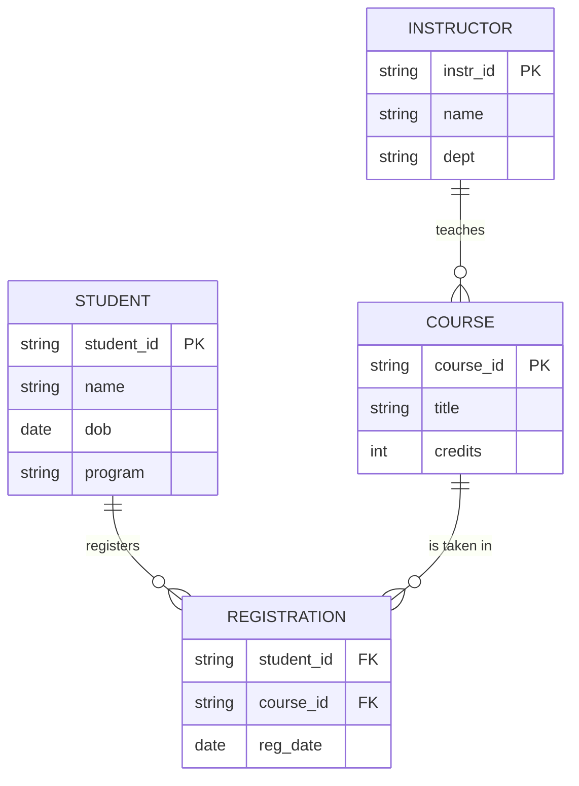

# Data Models

> **APJ ABDUL KALAM TECHNOLOGICAL UNIVERSITY (KTU) | 2024 SCHEME**
> - **Branch:** B.Tech in Computer Science & Engineering (CSE)
> - **Semester:** Semester 4
> - **Course:** PCCST402 - DATABASE MANAGEMENT SYSTEMS
> - **Module:** Module 1: Introduction to Databases
> - **Topic:** Data Models

<!-- SECTION_1_START -->
# 1. Core Technical Definition & Intuitive Overview

## 1.1 Formal Definition (KTU Syllabus Terminology)

> [!IMPORTANT]
> **Data Model** : A collection of conceptual tools for describing data, data relationships, data semantics, and data constraints. It provides a way to organize, define, and manipulate data in a structured manner within an information system.

According to the KTU 2024 Scheme Module 1 syllabus, a **data model** is essentially a *logical (sometimes physical) abstraction* that specifies:
1. **Structure of data** — the data types, relationships, and constraints.
2. **Operations on data** — the retrievals, updates, and integrity rules.
3. **Constraints** — the valid states the data can take.

In simpler terms, a data model answers three fundamental questions for any database:
- *What* type of data is stored?
- *How* are the data elements related to each other?
- *What* rules govern the validity of the stored data?

## 1.2 Conceptual Analogy — The Architectural Blueprint

> [!NOTE]
> **Intuition Check:** Think of a data model as the *architectural blueprint* of a building.

| Real-World Concept | Database Equivalent |
|---|---|
| Blueprint of a house | **Data Model** |
| Walls, doors, rooms, columns | **Entities / Records / Objects** |
| How rooms are connected (doorways, corridors) | **Relationships** |
| Building code (max 4 floors, fire exits mandatory) | **Integrity Constraints** |
| The actual built house | **Database Instance** |
| Revised plan during construction | **Schema Evolution** |

Just as an architect uses a blueprint to communicate the design intent to engineers, a database designer uses a data model to communicate the structure of data to developers and to the DBMS software. The blueprint does not physically build the house; similarly, the data model does not store actual data — it merely describes how data *will* be organized.

## 1.3 Why Do We Need Data Models?

> [!TIP]
> **Syllabus Highlight:** The KTU module expects students to clearly articulate the *purpose* of data models. Memorize the three pillars below — they are frequent 3-mark questions.

A data model serves **three core purposes** in a database system:
- **Abstraction** — Hides low-level storage details and exposes only the logical view of data.
- **Communication** — Provides a common vocabulary between designers, developers, and end-users.
- **Integrity Enforcement** — Formally states constraints so the DBMS can reject invalid data automatically.

## 1.4 Broad Classification of Data Models

Based on the KTU 2024 syllabus (Elmasri & Navathe style classification), data models are broadly divided into **three main categories**:

1. **Object-Based (Logical) Data Models** — Used at the conceptual and view levels. Examples: *Entity-Relationship (ER) Model*, *Object-Oriented Model*, *Semantic Model*.
2. **Physical (Low-Level) Data Models** — Describe the details of how data is stored in the computer (file formats, indexes, access paths).
3. **Record-Based (Logical) Data Models** — Describe data at the logical and view levels using fixed-format records. Three classical examples:
   - **Relational Model**
   - **Network Model**
   - **Hierarchical Model**

> [!VISUALIZATION CONTROL]
> **Concept:** Hierarchical Organization of Data Model Categories
> **Conceptual Tree Representation:**
> * Root: `DataModel`
> * Level-1 children: `ObjectBased`, `Physical`, `RecordBased`
> * Level-2 leaves under `RecordBased`: `Relational`, `Network`, `Hierarchical`
> * Level-2 leaves under `ObjectBased`: `ER`, `ObjectOriented`, `Semantic`
> **Visual Description:** A 3-level tree branching from a single root (`DataModel`) downward. The left subtree should contain object-based models, the middle subtree physical models, and the right subtree the three record-based variants. Each leaf node should be drawn as a circular terminal.

<!-- SECTION_1_END -->

<!-- SECTION_2_START -->
# 2. Deep Theoretical Analysis & KTU High-Yield Cheat Sheet

## 2.1 Detailed Anatomy of Each Data Model Category

### 2.1.1 Object-Based (Logical) Data Models

> [!NOTE]
> Object-based models are the **most flexible** class. They are used during the *conceptual design* phase, before the actual DBMS is chosen.

- They provide a **rich structuring capability** and allow specification of constraints explicitly.
- They do **not** prescribe how the data will be physically stored.
- The database is described as a collection of **objects** (entities) with **attributes** and **relationships**.

**Key Sub-Types (KTU Frequently Asked):**
- **Entity-Relationship (ER) Model** — Uses entities, attributes, and relationships. Most widely taught at the conceptual level.
- **Object-Oriented Model** — Data is treated as objects with encapsulated state and behavior. Used in OODBMS.
- **Semantic Data Model** — Adds more semantic meaning to the relationships (e.g., generalization, aggregation).
- **Functional Data Model** — Based on mathematical functions mapping domains to ranges.

### 2.1.2 Physical (Low-Level) Data Models

- These models describe **how data is stored in the computer**: file formats, record ordering, access paths, indexing.
- They are the only models that deal with the **actual storage** of data on disks, SSDs, or memory.
- Very few commercial DBMSs expose physical models to users directly.
- Examples include the *Unifying Model* and the *Frame Memory Model*.

> [!WARNING]
> KTU Pitfall: Students often confuse the *Physical Data Model* with the *Physical Schema*. The **physical data model** is a type of data model (a *framework*); the *physical schema* is a specific *instance* of that model for one particular database.

### 2.1.3 Record-Based Data Models

These models organize data into **fixed-format records of several types**. Each record has a fixed set of fields. They are sometimes called *logical* models because they hide some physical details but still describe the structure at the record level.

#### (a) Relational Model
- Proposed by **E.F. Codd (1970)**.
- Data is organized in **tables (relations)** consisting of **rows (tuples)** and **columns (attributes)**.
- Mathematical foundation: **Relational Algebra** and **Relational Calculus**.
- No physical pointers; relationships are expressed by **common attribute values (keys)**.
- Used by **MySQL, PostgreSQL, Oracle, SQL Server, SQLite**.

#### (b) Network Model
- Standardized by the **CODASYL Data Base Task Group (DBTG)** in the late 1960s.
- Data is organized as a collection of **records connected by links (sets)**.
- A record can have **multiple parent records** — forming a **directed graph**.
- Allows **many-to-many** relationships directly.
- Used in legacy systems: **IDS (Honeywell)**, **IDMS**, **RDB (Digital)**.

#### (c) Hierarchical Model
- The **oldest** data model; used by **IBM's Information Management System (IMS)**.
- Data is organized as an **inverted tree** structure.
- Each child record has **exactly one parent**, but a parent can have many children.
- Relationships are inherently **one-to-many (1:N)**.
- Access is typically **top-down** through predefined paths.

> [!IMPORTANT]
> **KTU Memory Trick — "HNR" order:**
> - **H**ierarchical (oldest, tree, 1:N)
> - **N**etwork (graph, M:N via CODASYL)
> - **R**elational (newest of the three, tables, 1970)

## 2.2 Properties of a Good Data Model

A data model is evaluated on three dimensions (Elmasri & Navathe framework):

1. **Static Properties** — Define the structure (e.g., what entities exist, what attributes they have, what relationships connect them).
2. **Dynamic Properties** — Define valid operations (insert, update, delete, retrieve) and how they affect the data.
3. **Integrity Rules / Constraints** — Define the conditions that ensure the data remains valid and consistent.

## 2.3 History & Evolution Timeline (KTU 14-Mark Favorite)

| Era | Data Model | Organization / Origin | Key Feature |
|---|---|---|---|
| **Late 1960s** | Hierarchical | IBM IMS | Tree structure, 1:N |
| **Late 1960s** | Network | CODASYL DBTG | Graph, M:N via sets |
| **1970** | Relational | E.F. Codd (IBM) | Tables, no pointers |
| **1976** | ER Model | Peter Chen | Conceptual design tool |
| **1980s** | Object-Oriented | Various (e.g., O2, ObjectStore) | Objects, methods, encapsulation |
| **1990s–2000s** | Object-Relational | PostgreSQL, Oracle | Hybrid of relational and OO |
| **2000s–Present** | NoSQL (Document, Key-Value, Column, Graph) | MongoDB, Redis, Cassandra, Neo4j | Schema-less, distributed |

## 2.4 KTU Formula Sheet / Notation Cheat Sheet

> [!NOTE]
> Although data models are conceptual, the following notations are essential for KTU examination answers.

| Symbol / Notation | Meaning | Used In |
|---|---|---|
| $E_1, E_2, \ldots, E_n$ | Entity sets | ER Model |
| $R$ | Relationship set | ER Model |
| $A_i$ | Attribute of an entity | ER Model |
| $PK$ | Primary Key (uniquely identifies a tuple) | Relational |
| $FK$ | Foreign Key (links two tables) | Relational |
| $1:1$ | One-to-One cardinality | All models |
| $1:N$ | One-to-Many cardinality | All models |
| $M:N$ | Many-to-Many cardinality | All models |
| $\sigma$ (sigma) | Selection operator (filter rows) | Relational Algebra |
| $\pi$ (pi) | Projection operator (select columns) | Relational Algebra |
| $\bowtie$ (bowtie) | Natural join | Relational Algebra |
| $\rightarrow$ (arrow) | Functional dependency $X \rightarrow Y$ | Database Design |

## 2.5 Comparison Snapshot — Hierarchical vs. Network vs. Relational

> [!IMPORTANT]
> KTU frequently tests this comparison as a 7-mark or 14-mark question. Memorize the table.

| Parameter | Hierarchical | Network | Relational |
|---|---|---|---|
| **Structure** | Tree | Graph (with cycles allowed) | Table (set of relations) |
| **Relationship** | Parent–Child (1:N) | Owner–Member (M:N) | By common attribute value |
| **Pointer / Link** | Yes (physical pointers) | Yes (sets / links) | No (value-based) |
| **Parent Count per Child** | Exactly **one** | One or **many** (logically) | N/A (no parent concept) |
| **Access Path** | Predetermined | Predetermined | Flexible / Any path |
| **Flexibility** | Lowest | Medium | Highest |
| **Data Independence** | Low | Low | High |
| **Query Language** | DL (Data Language) | DML (CODASYL DML) | SQL (declarative) |
| **Example DBMS** | IBM IMS, Windows Registry | IDMS, IDS, RDB | Oracle, MySQL, PostgreSQL |
| **Mathematical Basis** | Tree theory | Graph theory | Set theory, Predicate logic |

## 2.6 Real-World Engineering Utility

> [!TIP]
> **Why this topic matters in industry:**

- **Conceptual Phase** — During requirements gathering, ER models help analysts and clients agree on a common understanding of the business.
- **Logical Phase** — A record-based model (e.g., relational) is chosen to map the conceptual design to a specific DBMS.
- **Physical Phase** — Physical data models guide DBAs in creating indexes, partitioning tables, and choosing storage engines.
- **Modern Distributed Systems** — Concepts from the relational model (transactions, ACID) are extended to cloud-native systems like Google Spanner, CockroachDB, and Amazon Aurora.
- **Big Data & NoSQL** — Even non-relational databases (MongoDB, Cassandra) are eventually designed using data-modelling principles learned from the classical models.

<!-- SECTION_2_END -->

<!-- SECTION_3_START -->
# 3. Step-by-Step Derivations & Symbolic / Code Implementation

## 3.1 Example: A Mini-Universe for the "Student-Course-Enrollment" Scenario

> [!NOTE]
> To compare data models side by side, let us define a common **mini-world (universe of discourse)** that we will represent in *three* different data models.

**Mini-Universe Definition:**
- Each **Student** has a unique `student_id`, a `name`, and a `date_of_birth`.
- Each **Course** has a unique `course_id` and a `course_title`.
- A **Student** can enroll in many **Courses**, and a **Course** can have many **Students** (M:N relationship).
- The enrollment has an attribute `enrollment_date`.

### 3.1.1 Representation in the Hierarchical Model

The hierarchical model **cannot** directly represent the M:N relationship. We must introduce a *virtual* or *replicated* child node.

```text
ROOT (Student)
├── S101 (Alice)
│     ├── C-DBMS (Database Systems)
│     └── C-DSA (Data Structures)
├── S102 (Bob)
│     └── C-DBMS (Database Systems)
└── S103 (Charlie)
      └── C-DSA (Data Structures)
```

> [!WARNING]
> Notice that `C-DBMS` and `C-DSA` are **duplicated** under multiple parents. This duplication causes the classic *update anomaly* of the hierarchical model. Each piece of course information must be edited in many places.

### 3.1.2 Representation in the Network Model

The network model uses **SETS** to express owner–member relationships.

```
SET 1 :  Owner = STUDENT
         Member = ENROLLMENT

SET 2 :  Owner = COURSE
         Member = ENROLLMENT
```

**Diagrammatic structure (logical):**
- `STUDENT` records (S101, S102, S103) are connected via SET 1 to `ENROLLMENT` records.
- `COURSE` records (C-DBMS, C-DSA) are connected via SET 2 to the **same** `ENROLLMENT` records.
- This allows an `ENROLLMENT` record to be reached from either side, thus supporting M:N without duplication.

### 3.1.3 Representation in the Relational Model

The relational model **decomposes** the M:N relationship into a separate *junction* table.

**Table 1: STUDENT**
| student_id (PK) | name        | date_of_birth |
|---|---|---|
| S101            | Alice       | 2003-04-12    |
| S102            | Bob         | 2002-11-25    |
| S103            | Charlie     | 2003-07-09    |

**Table 2: COURSE**
| course_id (PK) | course_title         |
|---|---|
| C-DBMS         | Database Systems     |
| C-DSA          | Data Structures      |

**Table 3: ENROLLMENT** (junction / bridge table)
| student_id (FK) | course_id (FK) | enrollment_date |
|---|---|---|
| S101            | C-DBMS         | 2024-08-01      |
| S101            | C-DSA          | 2024-08-01      |
| S102            | C-DBMS         | 2024-08-03      |
| S103            | C-DSA          | 2024-08-04      |

> [!IMPORTANT]
> The relational representation has **no duplication** of course or student data. Foreign keys (FKs) replace physical pointers. This is the key reason the relational model is more flexible than its predecessors.

## 3.2 Symbolic Notation — Cardinality Derivation

Given a relationship $R$ between entity sets $E_1$ and $E_2$, the **cardinality** is denoted as:

$$
\text{card}(R) \in \{\, 1:1,\ 1:N,\ M:N \,\}
$$

### 3.2.1 Deriving Cardinality from Participation Constraints

Let:
- $e_1 \in E_1$ and $e_2 \in E_2$.
- $P(e_1)$ = set of $E_2$ entities related to $e_1$.
- $P(e_2)$ = set of $E_1$ entities related to $e_2$.

$$
\begin{aligned}
\text{Cardinality} =
\begin{cases}
1:1 & \text{if } \vert P(e_1) \vert = 1 \text{ and } \vert P(e_2) \vert = 1 \\[2pt]
1:N & \text{if } \vert P(e_1) \vert \le 1 \text{ and } \vert P(e_2) \vert \ge 0 \text{ (unbounded)} \\[2pt]
M:N & \text{if } \vert P(e_1) \vert \ge 0 \text{ and } \vert P(e_2) \vert \ge 0
\end{cases}
\end{aligned}
$$

> [!NOTE]
> The $\vert \cdot \vert$ denotes set cardinality (number of elements). In the relational implementation, this maps directly to the *min* and *max* participation in an ER diagram.

## 3.3 Python Demonstration — Building a Mini-Student Database in Three Models

> [!TIP]
> The following code is a **conceptual, runnable Python illustration** of how the same data is structured in the three classical models. Use it to internalize the differences.

```python
from __future__ import annotations
from dataclasses import dataclass, field
from typing import Dict, List, Set
import logging

# Configure a simple logger to trace structural differences
logging.basicConfig(level=logging.INFO, format="[%(levelname)s] %(message)s")


# ----------------------------------------------------------------------
# 1. HIERARCHICAL MODEL — implemented as a tree of nested dicts
# ----------------------------------------------------------------------
@dataclass
class HierarchicalStudentDB:
    """
    A minimal hierarchical data model.
    Each course is duplicated under each student (1:N parent -> child).
    """
    root_name: str = "STUDENT_ROOT"
    tree: Dict[str, Dict[str, List[str]]] = field(default_factory=dict)

    def add_student(self, sid: str, name: str) -> None:
        if sid in self.tree:
            raise ValueError(f"Duplicate student id: {sid}")
        self.tree[sid] = {"name": name, "courses": []}
        logging.info(f"[HIER] Added student {sid} ({name})")

    def enroll(self, sid: str, course_id: str, course_title: str) -> None:
        if sid not in self.tree:
            raise KeyError(f"Unknown student {sid}")
        # NOTE: full course details are DUPLICATED under each student
        self.tree[sid]["courses"].append({"id": course_id, "title": course_title})
        logging.info(f"[HIER] Enrolled {sid} into {course_id}")

    def find_students_in_course(self, course_id: str) -> List[str]:
        out: List[str] = []
        for sid, payload in self.tree.items():
            for c in payload["courses"]:
                if c["id"] == course_id:
                    out.append(sid)
                    break
        return out


# ----------------------------------------------------------------------
# 2. NETWORK MODEL — implemented as a graph of SETS (owner -> member)
# ----------------------------------------------------------------------
class NetworkStudentDB:
    """
    A minimal network (CODASYL-style) data model.
    ENROLLMENT records act as the 'set members' connecting OWNERs.
    """

    def __init__(self) -> None:
        self.students: Dict[str, str] = {}        # sid -> name
        self.courses: Dict[str, str] = {}         # cid -> title
        self.enrollments: List[Dict[str, str]] = []  # bridge records

    def add_student(self, sid: str, name: str) -> None:
        if sid in self.students:
            raise ValueError(f"Duplicate student id: {sid}")
        self.students[sid] = name
        logging.info(f"[NET] Added student {sid}")

    def add_course(self, cid: str, title: str) -> None:
        if cid in self.courses:
            raise ValueError(f"Duplicate course id: {cid}")
        self.courses[cid] = title
        logging.info(f"[NET] Added course {cid}")

    def enroll(self, sid: str, cid: str, date: str) -> None:
        if sid not in self.students:
            raise KeyError(sid)
        if cid not in self.courses:
            raise KeyError(cid)
        self.enrollments.append({"sid": sid, "cid": cid, "date": date})
        logging.info(f"[NET] Enrollment {sid} <-> {cid} on {date}")

    def students_in_course(self, cid: str) -> Set[str]:
        return {e["sid"] for e in self.enrollments if e["cid"] == cid}

    def courses_of_student(self, sid: str) -> Set[str]:
        return {e["cid"] for e in self.enrollments if e["sid"] == sid}


# ----------------------------------------------------------------------
# 3. RELATIONAL MODEL — implemented as a set of tables (list of dicts)
# ----------------------------------------------------------------------
@dataclass
class RelationalStudentDB:
    """
    A minimal relational data model.
    Three tables: STUDENT, COURSE, ENROLLMENT. Foreign keys link them.
    """
    student: List[Dict[str, str]] = field(default_factory=list)
    course: List[Dict[str, str]] = field(default_factory=list)
    enrollment: List[Dict[str, str]] = field(default_factory=list)

    def add_student(self, sid: str, name: str, dob: str) -> None:
        if any(s["student_id"] == sid for s in self.student):
            raise ValueError(f"Duplicate PK student_id: {sid}")
        self.student.append({"student_id": sid, "name": name, "dob": dob})
        logging.info(f"[REL] Inserted into STUDENT: {sid}")

    def add_course(self, cid: str, title: str) -> None:
        if any(c["course_id"] == cid for c in self.course):
            raise ValueError(f"Duplicate PK course_id: {cid}")
        self.course.append({"course_id": cid, "course_title": title})
        logging.info(f"[REL] Inserted into COURSE: {cid}")

    def enroll(self, sid: str, cid: str, date: str) -> None:
        if not any(s["student_id"] == sid for s in self.student):
            raise KeyError(sid)
        if not any(c["course_id"] == cid for c in self.course):
            raise KeyError(cid)
        # Prevent duplicate enrollment (composite PK)
        if any(
            e["student_id"] == sid and e["course_id"] == cid
            for e in self.enrollment
        ):
            raise ValueError(f"Already enrolled: {sid}-{cid}")
        self.enrollment.append(
            {"student_id": sid, "course_id": cid, "enrollment_date": date}
        )
        logging.info(f"[REL] Inserted into ENROLLMENT: {sid}-{cid}")


# ----------------------------------------------------------------------
# Demonstration of the same mini-world in all three models
# ----------------------------------------------------------------------
def demo() -> None:
    # HIERARCHICAL
    hier = HierarchicalStudentDB()
    hier.add_student("S101", "Alice")
    hier.add_student("S102", "Bob")
    hier.enroll("S101", "C-DBMS", "Database Systems")
    hier.enroll("S101", "C-DSA",  "Data Structures")
    hier.enroll("S102", "C-DBMS", "Database Systems")
    logging.info(f"[HIER] Who is in C-DBMS? {hier.find_students_in_course('C-DBMS')}")

    # NETWORK
    net = NetworkStudentDB()
    net.add_student("S101", "Alice")
    net.add_student("S102", "Bob")
    net.add_course("C-DBMS", "Database Systems")
    net.add_course("C-DSA",  "Data Structures")
    net.enroll("S101", "C-DBMS", "2024-08-01")
    net.enroll("S101", "C-DSA",  "2024-08-01")
    net.enroll("S102", "C-DBMS", "2024-08-03")
    logging.info(f"[NET] Students in C-DBMS: {net.students_in_course('C-DBMS')}")
    logging.info(f"[NET] Alice's courses: {net.courses_of_student('S101')}")

    # RELATIONAL
    rel = RelationalStudentDB()
    rel.add_student("S101", "Alice", "2003-04-12")
    rel.add_student("S102", "Bob",   "2002-11-25")
    rel.add_course("C-DBMS", "Database Systems")
    rel.add_course("C-DSA",  "Data Structures")
    rel.enroll("S101", "C-DBMS", "2024-08-01")
    rel.enroll("S101", "C-DSA",  "2024-08-01")
    rel.enroll("S102", "C-DBMS", "2024-08-03")
    logging.info(f"[REL] STUDENT table rows    = {len(rel.student)}")
    logging.info(f"[REL] COURSE table rows     = {len(rel.course)}")
    logging.info(f"[REL] ENROLLMENT rows       = {len(rel.enrollment)}")


if __name__ == "__main__":
    demo()
```

> [!IMPORTANT]
> **Code-Level Observation:** The hierarchical model needs `O(N)$ searches for a course; the network and relational models answer the same query in $O(1)$ lookups (hash dict) or $O(N)$ scans, but with **no data duplication**. The relational model also enforces *referential integrity* (FK checks).

## 3.4 Step-by-Step Mapping: ER Diagram → Relational Schema

> [!NOTE]
> The KTU 2024 syllabus often asks: *"How do you map an ER diagram to a relational schema?"* Below is the standard algorithm.

**Given ER Constructs:**
- Entity set $E$ with simple attributes $A_1, A_2, \ldots, A_n$ and primary key $PK$.
- Relationship $R$ between entity sets $E_1$ and $E_2$ with attributes $A_R$.
- Cardinality of $R$ is **1:1**, **1:N**, or **M:N**.

**Step-by-Step Mapping Rules:**

$$
\begin{aligned}
\text{Step 1: } & \text{For each entity } E, \text{ create relation } R_E(\, PK,\ A_1,\ A_2,\ \ldots,\ A_n \,) \\
\text{Step 2: } & \text{For 1:1 relationship, merge the PK of one side into the other as FK.} \\
\text{Step 3: } & \text{For 1:N relationship, place the PK of the '1' side as FK on the 'N' side.} \\
\text{Step 4: } & \text{For M:N relationship, create a NEW relation } R_{E_1 E_2}(\, PK_1,\ PK_2,\ A_R \,). \\
\text{Step 5: } & \text{For multivalued attribute } M \text{ of } E, \text{ create separate relation } R_M(\, PK,\ M \,). \\
\text{Step 6: } & \text{For weak entity } W \text{ with owner } O, \text{ include } O\text{'s } PK \text{ as FK + partial key in } R_W.
\end{aligned}
$$

**Worked Example (M:N Mapping):**
- ER: `STUDENT --enrolls in-- COURSE` (M:N, with attribute `enrollment_date`).
- Relational result:
$$
R_{\text{ENROLL}}(\, \text{student\_id},\ \text{course\_id},\ \text{enrollment\_date} \,)
$$
where $(\text{student\_id}, \text{course\_id})$ together form the **composite primary key** of `ENROLL`.

<!-- SECTION_3_END -->

<!-- SECTION_4_START -->
# 4. Structural Diagrams & Schematics

## 4.1 High-Level Classification of Data Models (Mermaid Tree)

```mermaid
graph TD
    rootA["Data Models"]
    rootB["Object-Based Models"]
    rootC["Physical Models"]
    rootD["Record-Based Models"]
    rootE["ER Model"]
    rootF["Object-Oriented Model"]
    rootG["Semantic Model"]
    rootH["Functional Model"]
    rootI["Unifying Model"]
    rootJ["Frame Memory Model"]
    rootK["Hierarchical Model"]
    rootL["Network Model"]
    rootM["Relational Model"]

    rootA --> rootB
    rootA --> rootC
    rootA --> rootD

    rootB --> rootE
    rootB --> rootF
    rootB --> rootG
    rootB --> rootH

    rootC --> rootI
    rootC --> rootJ

    rootD --> rootK
    rootD --> rootL
    rootD --> rootM

    classDef rootBox fill:#1f77b4,stroke:#0b3d66,color:#ffffff,stroke-width:2px;
    classDef objBox  fill:#2ca02c,stroke:#155724,color:#ffffff;
    classDef phyBox  fill:#ff7f0e,stroke:#8a4b00,color:#ffffff;
    classDef recBox  fill:#9467bd,stroke:#4b2e75,color:#ffffff;
    class rootA rootBox;
    class rootB rootE rootF rootG rootH objBox;
    class rootC rootI rootJ phyBox;
    class rootD rootK rootL rootM recBox;
```

> [!NOTE]
> The color-coded Mermaid graph above visually separates the three top-level categories. The blue root is the umbrella term; the three coloured sub-trees correspond to the categories in Section 1.4.

## 4.2 Hierarchical Model — Schematic for STUDENT–COURSE

```mermaid
graph TD
    studRoot["STUDENT ROOT"]
    s101["S101: Alice"]
    s102["S102: Bob"]
    s103["S103: Charlie"]
    cDbms["C-DBMS: Database Systems"]
    cDsa["C-DSA: Data Structures"]

    studRoot --> s101
    studRoot --> s102
    studRoot --> s103

    s101 --> cDbms
    s101 --> cDsa
    s102 --> cDbms
    s103 --> cDsa

    classDef rootBox fill:#1f77b4,color:#ffffff,stroke:#0b3d66,stroke-width:2px;
    classDef studBox fill:#2ca02c,color:#ffffff,stroke:#155724;
    classDef courBox fill:#ff7f0e,color:#ffffff,stroke:#8a4b00;
    class studRoot rootBox;
    class s101 s102 s103 studBox;
    class cDbms cDsa courBox;
```

> [!IMPORTANT]
> Observe that the two courses (orange nodes) appear **multiple times** under different students (green nodes). This duplication is the classic hierarchical-model drawback.

## 4.3 Network Model — Schematic (Graph with Sets)

```mermaid
graph LR
    s101["Student: S101 Alice"]
    s102["Student: S102 Bob"]
    cDbms["Course: C-DBMS"]
    cDsa["Course: C-DSA"]
    e1["Enrollment: S101-C-DBMS"]
    e2["Enrollment: S101-C-DSA"]
    e3["Enrollment: S102-C-DBMS"]

    s101 -- "SET 1" --> e1
    s101 -- "SET 1" --> e2
    s102 -- "SET 1" --> e3
    cDbms -- "SET 2" --> e1
    cDbms -- "SET 2" --> e3
    cDsa  -- "SET 2" --> e2

    classDef studBox fill:#2ca02c,color:#ffffff;
    classDef courBox fill:#ff7f0e,color:#ffffff;
    classDef enrollBox fill:#d62728,color:#ffffff,stroke:#7a0000;
    class s101 s102 studBox;
    class cDbms cDsa courBox;
    class e1 e2 e3 enrollBox;
```

> [!NOTE]
> Each `Enrollment` node is shared by **two parents** — one student and one course. This is the unique feature of the network model: a record can belong to multiple `SET`s simultaneously.

## 4.4 Relational Model — Three-Table Schema

```mermaid
graph TD
    subgraph TABLE1["STUDENT (PK = student_id)"]
        r1S["S101, Alice, 2003-04-12"]
        r2S["S102, Bob,   2002-11-25"]
        r3S["S103, Charlie, 2003-07-09"]
    end

    subgraph TABLE2["COURSE (PK = course_id)"]
        r1C["C-DBMS, Database Systems"]
        r2C["C-DSA,  Data Structures"]
    end

    subgraph TABLE3["ENROLLMENT (PK = student_id, course_id)"]
        r1E["S101, C-DBMS, 2024-08-01"]
        r2E["S101, C-DSA,  2024-08-01"]
        r3E["S102, C-DBMS, 2024-08-03"]
    end

    r1S -. "FK (student_id)" .-> r1E
    r2S -. "FK (student_id)" .-> r3E
    r1C -. "FK (course_id)"  .-> r1E
    r2C -. "FK (course_id)"  .-> r2E
    r1C -. "FK (course_id)"  .-> r3E

    classDef pkBox fill:#1f77b4,color:#ffffff;
    classDef fkBox fill:#9467bd,color:#ffffff;
    classDef bridgeBox fill:#bcbd22,color:#222222;
    class r1S r2S r3S r1C r2C pkBox;
    class TABLE3 bridgeBox;
```

> [!TIP]
> The **dashed arrows** represent *value-based foreign-key references*, not physical pointers. This is the single most important reason the relational model achieves *data independence*.

## 4.5 Process Flow — From Mini-World to Database

```mermaid
flowchart LR
    stepA["Step 1: Identify Mini-World<br/>(Requirements gathering)"]
    stepB["Step 2: Choose Data Model<br/>(ER / Hierarchical / Network / Relational)"]
    stepC["Step 3: Build Conceptual Schema<br/>(Entities, Attributes, Relationships)"]
    stepD["Step 4: Map to Logical Schema<br/>(Tables / Records / Tree / Graph)"]
    stepE["Step 5: Map to Physical Schema<br/>(Files, Indexes, Storage)"]
    stepF["Step 6: Load Data and Query<br/>(SQL / DML)"]

    stepA --> stepB --> stepC --> stepD --> stepE --> stepF

    classDef processBox fill:#17becf,color:#ffffff,stroke:#0a6b75;
    class stepA stepB stepC stepD stepE stepF processBox;
```

> [!NOTE]
> This flow represents the standard **database design lifecycle**. The data model is chosen at *Step 2* and the rest of the pipeline is shaped by that choice.

<!-- SECTION_4_END -->

<!-- SECTION_5_START -->
# 5. KTU 2024 Scheme Examination Question Bank & Topic Recap

## 5.1 PART A — Short-Answer Questions (3 Marks Each)

### Q1. [KTU University Exam - July 2024] Define a *data model*. List any **three** categories of data models with one example each. *(3 marks, CO1, Remember)*

**Model Answer:**

> A **data model** is an integrated collection of concepts for describing and manipulating data, relationships between data, and constraints on the data in an organization.

The three main categories of data models are:

1. **Object-Based (Logical) Data Model** — e.g., **Entity-Relationship (ER) Model**.
2. **Physical (Low-Level) Data Model** — e.g., **Unifying Model** or **Frame Memory Model**.
3. **Record-Based Data Model** — e.g., **Relational Model**, **Network Model**, **Hierarchical Model**.

> [!IMPORTANT]
> **[Mark Distribution (Valuation Key):]**
> - *Defining data model correctly:* **1 Mark**
> - *Listing three categories:* **1 Mark**
> - *One example per category:* **1 Mark**

---

### Q2. [KTU University Exam - Dec 2023] Differentiate between the **Hierarchical** and **Network** data models. *(3 marks, CO1, Understand)*

**Model Answer:**

| Parameter | Hierarchical Model | Network Model |
|---|---|---|
| Structure | Tree (parent has many children) | Graph (record may have many parents and children) |
| Cardinality | Only 1:N supported natively | Supports M:N relationships via SETs |
| Pointer Style | One physical link per child (one parent) | Many links per record (multiple parents) |
| Duplication of Data | Yes (course info repeated under each student) | No (course stored once) |
| Standard Body | IBM IMS | CODASYL DBTG |
| Flexibility | Low | Medium |

> [!IMPORTANT]
> **[Mark Distribution (Valuation Key):]**
> - *Structure difference:* **1 Mark**
> - *Cardinality / pointer difference:* **1 Mark**
> - *Any one additional valid difference (e.g., standard body or duplication):* **1 Mark**

---

## 5.2 PART B — Long-Answer Questions (14 Marks, Module Internal Choice)

> [!IMPORTANT]
> KTU ESE rule: *Each Module carries a 14-mark question with internal choice.* You must answer **one** of the two alternatives below. Each alternative has two sub-parts (a) and (b) of 7 marks each, mapping to **Understand** and **Apply** cognitive levels.

---

### Question A (14 Marks) — Detailed Model Analysis

> **[KTU University Exam - July 2024]**

**(a)** With a neat diagram, explain the **three-schema architecture** of a database. How does it relate to **data independence**? *(7 marks, CO1, Understand)*

**(b)** A university wants to maintain a database of `STUDENT`, `COURSE`, and `INSTRUCTOR`. An instructor teaches many courses; a course is taught by exactly one instructor. A student can register for many courses, and each course can have many students. Draw an **ER diagram** for this scenario. Also show the **relational mapping** of the same. *(7 marks, CO2, Apply)*

---

#### Model Solution for Q5.A(a)

**Three-Schema Architecture** (also called the *ANSI/SPARC architecture*) divides a database system into three levels:

```
+------------------------------------------------+
|        EXTERNAL SCHEMA  (User Views)           |
|   View 1     View 2     View 3   ...           |
+------------------------------------------------+
                ↕   (External / Conceptual Mapping)
+------------------------------------------------+
|     CONCEPTUAL SCHEMA  (Logical / Community)   |
|   Logical structure of the entire database     |
+------------------------------------------------+
                ↕   (Conceptual / Internal Mapping)
+------------------------------------------------+
|     INTERNAL SCHEMA   (Physical / Storage)     |
|   File organisation, indexes, access paths     |
+------------------------------------------------+
```

**Explanation of Each Level:**

1. **Internal Schema** — Describes the *physical storage* of the database: file formats, record placement, indexing strategies, and access paths. It is closest to the operating system.

2. **Conceptual Schema** — Describes the *logical structure* of the entire database at a high level: entities, data types, relationships, and constraints, **independent of any application**. It is the *community view* of the database.

3. **External Schema (View Schema)** — Describes how individual users or applications perceive the data. There can be **many** external views, each tailored to a specific user group. For example, a *student* may see only their own marks; a *teacher* may see all students' marks in their subject.

**Relation to Data Independence:**

- **Logical Data Independence** — The ability to change the *conceptual schema* (e.g., add a new entity or attribute) **without affecting** the external schemas or application programs.
- **Physical Data Independence** — The ability to change the *internal schema* (e.g., create an index, partition a file) **without affecting** the conceptual schema.

> [!IMPORTANT]
> **[Mark Distribution (Valuation Key) — Q5.A(a):]**
> - *Three-schema diagram with labels:* **3 Marks**
> - *Explanation of all three levels:* **2 Marks**
> - *Defining logical and physical data independence:* **2 Marks**
> - *Correct example (e.g., changing a file format does not affect the application):* *(bonus 1 mark if examiner is lenient — but not required)*

---

#### Model Solution for Q5.A(b)

**Step 1 — Identify Entities:**
- `STUDENT` (with attributes: `student_id`, `name`, `dob`, `program`).
- `COURSE` (with attributes: `course_id`, `title`, `credits`).
- `INSTRUCTOR` (with attributes: `instr_id`, `name`, `dept`).

**Step 2 — Identify Relationships and Cardinalities:**

- `INSTRUCTOR` *teaches* `COURSE` — **1:N** (one instructor teaches many courses, each course taught by exactly one instructor).
- `STUDENT` *registers for* `COURSE` — **M:N** (a student can take many courses; a course has many students).

**Step 3 — ER Diagram:**



**Step 4 — Relational Mapping (Applying Section 3.4 Rules):**

$$
\begin{aligned}
\text{STUDENT}(\, \underline{\text{student\_id}},\ \text{name},\ \text{dob},\ \text{program} \,) \\
\text{INSTRUCTOR}(\, \underline{\text{instr\_id}},\ \text{name},\ \text{dept} \,) \\
\text{COURSE}(\, \underline{\text{course\_id}},\ \text{title},\ \text{credits},\ \underline{\text{instr\_id}}^{\text{FK}} \,) \\
\text{REGISTRATION}(\, \underline{\text{student\_id}}^{\text{FK}},\ \underline{\text{course\_id}}^{\text{FK}},\ \text{reg\_date} \,)
\end{aligned}
$$

> [!NOTE]
> The `1:N` relationship *teaches* is mapped by placing the **instructor's primary key** as a **foreign key** inside `COURSE`. The **M:N** relationship *registers* is mapped by creating a new relation `REGISTRATION` whose composite primary key is `(student_id, course_id)`.

> [!IMPORTANT]
> **[Mark Distribution (Valuation Key) — Q5.A(b):]**
> - *Correct identification of 3 entities + 2 relationships:* **2 Marks**
> - *Correct cardinalities (1:N, M:N):* **1 Mark**
> - *Neat ER diagram (entities, attributes, relationships drawn):* **2 Marks**
> - *Correct relational schema with PKs and FKs:* **2 Marks**
> - *Composite PK explanation in REGISTRATION:* *(bonus 1 mark for a sharp student)*

---

### Question B (14 Marks) — Alternative Choice

> **[KTU University Exam - Dec 2023]**

**(a)** Explain the **Entity-Relationship (ER) Model** in detail. List its main components and the symbols used to represent them. *(7 marks, CO1, Understand)*

**(b)** Compare and contrast the **Relational, Network, and Hierarchical** data models. For each model, give **one real-world application** where it is best suited. *(7 marks, CO2, Apply)*

---

#### Model Solution for Q5.B(a)

**The Entity-Relationship (ER) Model** is a high-level, *conceptual* data model introduced by **Peter Chen in 1976**. It is used during the database *design phase* to capture the structure of a real-world mini-world in terms of entities, attributes, and relationships — without being tied to any specific DBMS.

**Main Components of the ER Model:**

1. **Entity** — A real-world object that is *distinguishable* from other objects. Drawn as a **rectangle**.
   - Example: A *Student*, a *Car*, an *Account*.

2. **Entity Set (or Entity Type)** — A *collection* of similar entities. Labeled inside the rectangle.
   - Example: The set of *all* students in a college.

3. **Attributes** — *Properties* that describe an entity. Drawn as an **oval** connected to the entity.
   - Example: `name`, `age`, `roll_no` of a Student.

4. **Domain** — The *set of allowable values* for an attribute. (e.g., `age` must be a positive integer).

5. **Keys** — Attributes that *uniquely identify* an entity. The **primary key** is underlined.
   - Example: `roll_no` in `STUDENT`.

6. **Relationship** — An *association* among two or more entities. Drawn as a **diamond**.
   - Example: *enrolls* between `STUDENT` and `COURSE`.

7. **Relationship Set** — A *set* of similar relationships (analogous to entity set).

8. **Cardinality Constraints** — Defines how many entities participate: **1:1**, **1:N**, or **M:N**.

9. **Participation Constraint** — Defines whether every entity must participate (**total** ⟹ double line) or may participate (**partial** ⟹ single line).

**Symbol Table (ER Notation — Chen's Original):**

| Symbol | Shape | Meaning |
|---|---|---|
| Rectangle | ▭ | Entity |
| Oval | ⬭ | Attribute |
| Diamond | ◇ | Relationship |
| Underline | _ | Primary key |
| Double oval | ⬭⬭ | Multivalued attribute |
| Dashed oval | ⬭ (dashed) | Derived attribute |
| Double rectangle | ▭▭ | Weak entity |
| Double diamond | ◇◇ | Identifying relationship |
| Line | ─ | Connects components |
| Double line | ═ | Total participation |

> [!IMPORTANT]
> **[Mark Distribution (Valuation Key) — Q5.B(a):]**
> - *Introduction to ER model (origin and purpose):* **1 Mark**
> - *Listing at least 6 components correctly:* **3 Marks**
> - *Symbol table or diagrammatic conventions:* **2 Marks**
> - *One example mini-ER diagram (optional but recommended for full marks):* **1 Mark**

---

#### Model Solution for Q5.B(b)

**Comparative Analysis:**

| Parameter | Hierarchical | Network | Relational |
|---|---|---|---|
| **Basic Structure** | Inverted tree | Directed graph with links | Set of tables (relations) |
| **Cardinality** | 1:N (parent → child) | M:N (via sets) | 1:1, 1:N, M:N all supported |
| **Data Access** | Top-down, predefined path | Navigational, via links | Declarative, set-oriented (SQL) |
| **Data Independence** | Low | Low | High |
| **Duplication** | Common (child replicated under parents) | Reduced via sets | Eliminated (FKs) |
| **Standard Query** | Hierarchical DL | CODASYL DML | SQL (Structured Query Language) |
| **Best-Suited Real-World Application** | File systems, DNS zone records, Windows Registry | Telecommunications routing, Airline reservation (legacy) | Banking, e-commerce, ERP, OLTP/OLAP systems |
| **Famous DBMS** | IBM IMS | IDMS, IDS | Oracle, MySQL, PostgreSQL, SQL Server |

**Detailed Discussion:**

1. **Hierarchical Model** — Because of its tree structure, it is best suited to data that is naturally hierarchical — e.g., **organizational charts**, **file systems**, and **Windows Registry**. The data is rarely queried in a non-hierarchical way.

2. **Network Model** — Because it can express M:N relationships naturally, it is best suited to **complex linked data** like **telecommunication networks** (routes and switches) or **airline reservation systems** (flights, passengers, seats). CODASYL DBTG was used extensively for these.

3. **Relational Model** — Because of its high data independence and declarative SQL, it is the *default* choice for **business applications**: **banking systems** (accounts and transactions), **e-commerce platforms**, **ERP / CRM** systems, and **OLAP data warehouses**.

> [!IMPORTANT]
> **[Mark Distribution (Valuation Key) — Q5.B(b):]**
> - *Tabular comparison (3 rows minimum):* **3 Marks**
> - *One real-world application per model:* **3 Marks**
> - *Brief justification of why each model suits the application:* **1 Mark**

---

## 5.3 KTU Examiner's Valuation Warning

> [!WARNING]
> **Common Mark-Loss Pitfalls on "Data Models" Questions:**
>
> 1. **Mixing up data models and DBMSs.** The *hierarchical model* is *not* a database — it is a *modelling concept*. *IBM IMS* is a *database system* that *implements* the hierarchical model. Examiners deduct marks for confusing the two.
> 2. **Forgetting to write the definition of "data model" before jumping to examples.** A 3-mark question that asks for a definition will not give full credit if you only list categories. Always start with the formal definition.
> 3. **Using `|` inside table cells for absolute value or cardinality.** This breaks the markdown parser and the examiner may not see your numbers. Use `\vert` or `\mid` in LaTeX instead.
> 4. **Not drawing a *neat* ER diagram.** Free-hand circles and rectangles are fine, but every entity, attribute, relationship, and cardinality must be **labelled**. Half marks are lost for unlabelled diamonds or arrows without 1:1 / 1:N / M:N.
> 5. **Confusing schema, instance, and database.** *Data model* → defines the *framework*. *Schema* → a specific application of that framework. *Instance* → the actual data stored at a moment.
> 6. **Omitting the difference between *physical* and *logical* data independence** when asked about three-schema architecture. Examiners specifically test both.
> 7. **Writing `1:1`, `1:N`, `M:N` without defining what they mean** in your own words. Always pair the symbol with the sentence, e.g., "1:N means one instructor teaches many courses."

---

## 5.4 Topic Recap & Important Things to Remember

> [!TIP]
> **High-Density Revision Checklist — Data Models**

- **Definition** — A data model is a set of concepts for *describing*, *manipulating*, and *constraining* data in a database.
- **Three Properties** of any data model: (1) *Static* structure, (2) *Dynamic* operations, (3) *Integrity* constraints.
- **Three Categories** — Object-Based, Physical, Record-Based.
- **Object-Based Models** — ER Model, Object-Oriented Model, Semantic Model, Functional Model. Used in conceptual design.
- **Physical (Low-Level) Models** — Concern file storage, indexes, access paths. Examples: *Unifying Model*, *Frame Memory Model*.
- **Record-Based Models** — Hierarchical, Network, Relational.
- **Hierarchical Model** — Tree; 1:N; oldest (IBM IMS, 1960s); data duplication; **one** parent per child.
- **Network Model** — Graph; M:N via SETs; CODASYL DBTG (late 1960s); no duplication; a record can be in many SETs.
- **Relational Model** — Tables; Codd (1970); *no physical pointers*; value-based relationships via **keys (PK, FK)**; *highest data independence*; uses **SQL**.
- **HNR order** — Hierarchical → Network → Relational (in chronological order).
- **ER Model** — Invented by Peter Chen (1976); components: *Entity*, *Attributes*, *Keys*, *Relationship*, *Cardinality (1:1 / 1:N / M:N)*, *Participation (total / partial)*, *Weak Entity*.
- **Symbols** — Rectangle (entity), Oval (attribute), Diamond (relationship), Double line (total participation), Dashed oval (derived), Double rectangle (weak entity), Underline (primary key).
- **Three-Schema Architecture** — External (view) / Conceptual (logical) / Internal (physical); enables **logical** and **physical** data independence.
- **Data Independence** — *Logical*: change conceptual schema without affecting external schemas. *Physical*: change internal schema without affecting conceptual schema.
- **Mapping Rules** — 1:1 → merge PK; 1:N → FK on the "N" side; M:N → new junction table; multivalued → separate table; weak entity → include owner's PK.
- **Why this topic matters** — It is the *foundation* of every later module (ER diagrams, schema design, normalization, SQL, distributed DBs).
- **Common 3-mark traps** — (a) Difference between *data model* and *DBMS*, (b) Hierarchical vs. Network, (c) ER components.
- **Common 14-mark traps** — (a) Three-schema + data independence, (b) Compare 3 record-based models, (c) ER diagram + relational mapping.
- **One-line takeaway** — *"A data model is the language in which we describe the structure of data; pick the right model, and the database will be flexible, efficient, and correct."*
<!-- SECTION_5_END -->
