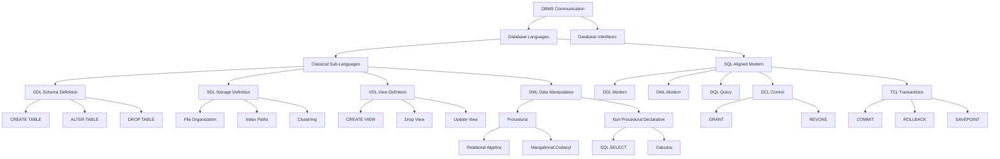
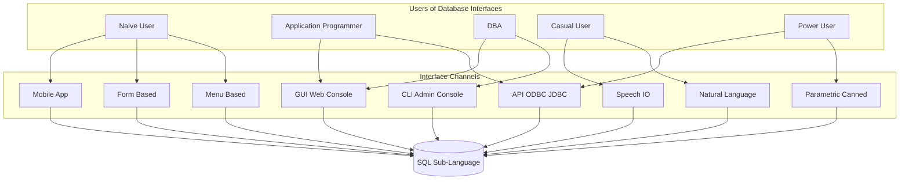
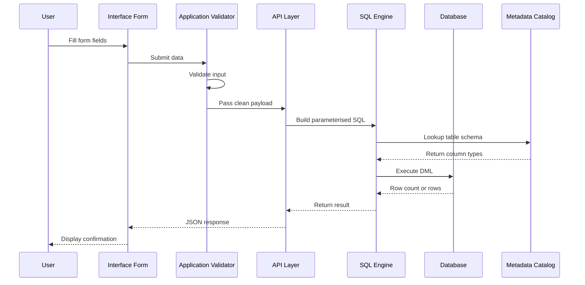
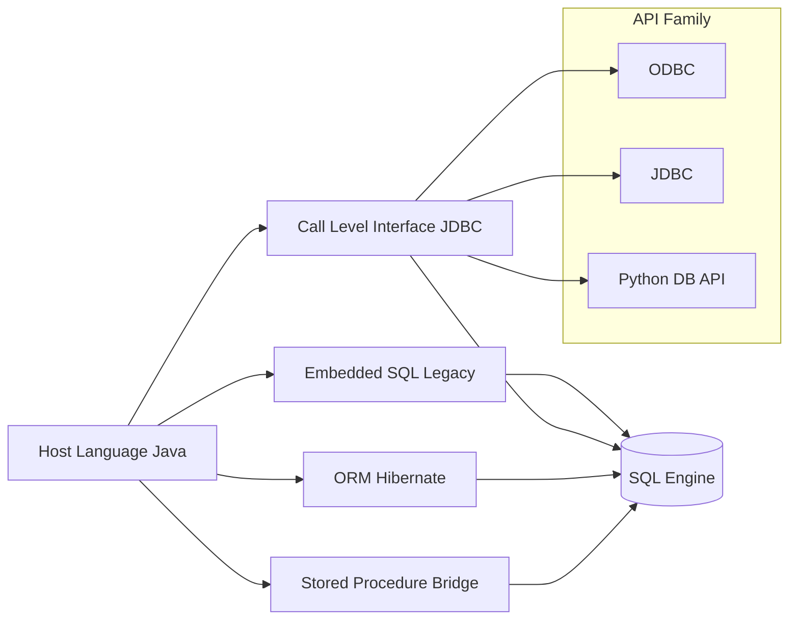

# Database Languages and Interfaces

> **APJ ABDUL KALAM TECHNOLOGICAL UNIVERSITY (KTU) | 2024 SCHEME**
> - **Branch:** B.Tech in Computer Science & Engineering (CSE)
> - **Semester:** Semester 4
> - **Course:** PCCST402 - DATABASE MANAGEMENT SYSTEMS
> - **Module:** Module 1: Introduction to Databases
> - **Topic:** Database Languages and Interfaces

<!-- SECTION_1_START -->
# Database Languages and Interfaces — Core Technical Definition and Intuitive Overview

## 1.1 Formal Definition of Database Languages

A **Database Language** is a formally defined, declarative or procedural notation system used by users, application programs, and the Database Administrator (DBA) to communicate with a Database Management System (DBMS). It provides structured, syntactically valid statements to define, retrieve, manipulate, control, and administer the data stored inside a database, while simultaneously enforcing integrity, security, and concurrency rules.

In the KTU 2024 Scheme context, database languages are categorized primarily under the umbrella of **SQL (Structured Query Language)**, which serves both as a *Data Sub-language* and an integration point between the host programming language and the DBMS.

> [!IMPORTANT]
> **KTU 2024 Definition (Syllabus Anchor):**
> Database languages are the formal mechanisms through which applications and users specify the database schema, express queries and updates, and define the storage and physical organization of data on secondary storage devices.

## 1.2 Formal Definition of Database Interfaces

A **Database Interface** is the user-facing or program-facing access layer that bridges human/programmatic input with the database language understood by the DBMS. Interfaces transform raw user actions (mouse clicks, voice, form entries, API calls) into valid database language statements and present retrieved results in a human-understandable format.

## 1.3 Intuitive Analogy — The Restaurant Kitchen

Imagine a large, professional restaurant:

- The **Kitchen** is the DBMS (where the actual data "cooking" happens).
- The **Chef** is the DBMS engine.
- The **Menu (with structured instructions like "make pasta, less salt, no garlic")** is the **Database Language (SQL)** — it precisely tells the chef what to prepare.
- The **Waiter, the QR Code Menu, the Self-Ordering Kiosk, and the Phone Call Reservation** are all **Interfaces** — different ways customers (users) convey their orders to the kitchen.

> [!NOTE]
> **The Core Insight:**
> The **language** is the *grammar* of communication with the database. The **interface** is the *channel* through which that grammar is delivered. A single language (SQL) can be exposed through many different interfaces (GUI, web, mobile, voice, API).

## 1.4 Standard Metrics and Acronyms

| Acronym | Expansion | Standard Reference |
| :--- | :--- | :--- |
| **DDL** | Data Definition Language | ISO/IEC 9075 |
| **DML** | Data Manipulation Language | ISO/IEC 9075 |
| **DCL** | Data Control Language | Tied to DDL in ISO standard |
| **DQL** | Data Query Language | Subset of DML |
| **TCL** | Transaction Control Language | ISO/IEC 9075 |
| **VDL** | View Definition Language | Foundational concept (Date & Ullman) |
| **SDL** | Storage Definition Language | Foundational concept (Date & Ullman) |
| **JDBC** | Java Database Connectivity | Java SE Specification |
| **ODBC** | Open Database Connectivity | SQL Access Group / ISO/IEC 9075-3 |

> [!TIP]
> **GeoGebra / Desmos Visualization Concept:**
> The classification of database languages can be visualized as a **tree structure** (a hierarchical taxonomy). The root is "DBMS Communication", the primary branches are "Languages" and "Interfaces", and each branch has multiple sub-branches. This is a discrete, graph-theoretic representation rather than a continuous function, so no Cartesian equation is required. Draw a tree diagram with 2 main branches and 6–8 leaf nodes.

<!-- SECTION_1_END -->

<!-- SECTION_2_START -->
# Deep Theoretical Analysis and KTU High-Yield Summary

## 2.1 The Two-Tier Classification of Database Languages

The classical textbook framework (Elmasri & Navathe, Silberschatz) categorizes database languages into **two broad tiers**:

### Tier 1 — The Foundational Sub-Languages (Historical / Conceptual)

These predate SQL and were the original theoretical partition proposed by the 1975 ANSI/SPARC reports.

#### 2.1.1 Data Definition Language (DDL)
- Used by the DBA and database designers to specify the **conceptual schema**, **external schemas (views)**, and sometimes **internal schema**.
- DDL statements define:
  - Domains (data types)
  - Tables (relations)
  - Constraints (primary key, foreign key, unique, check, not null)
  - Indexes
  - Views
- The DBMS compiles DDL into a set of tables stored in the **Data Dictionary / System Catalog**.

> [!IMPORTANT]
> **Why DDL matters:** The output of the DDL compiler is *not* a procedural program — it is a set of metadata tables describing the database structure. The DBMS then uses these tables to interpret every subsequent DML request.

#### 2.1.2 Storage Definition Language (SDL)
- Specifies the **physical storage structure** of the database.
- Used to define:
  - File organizations (heap, hashed, B+ tree, ISAM)
  - Access paths (which index exists on which attribute)
  - Clustering of records
  - Compression and encryption parameters
- In modern SQL-based systems, SDL is largely subsumed by the vendor's storage engine (e.g., InnoDB, PostgreSQL heap).

> [!NOTE]
> **KTU Exam Tip:** SDL and VDL are *not* part of the SQL standard. They appear in classic theory questions. Be ready to state that modern SQL does not formally separate them.

#### 2.1.3 View Definition Language (VDL)
- Used to define **external schemas** (user views).
- Specifies what subsets of the conceptual schema a particular user group is permitted to see.
- In SQL, VDL is implemented via the `CREATE VIEW` command.

#### 2.1.4 Data Manipulation Language (DML)
- Used for the **retrieval, insertion, deletion, and modification** of data.
- Two subtypes:
  - **Procedural DML** — the user specifies *what* data is needed and *how* to obtain it (e.g., relational algebra expressions, navigation in hierarchical/network DBs).
  - **Non-Procedural (Declarative) DML** — the user specifies *what* data is needed but not how to get it. The DBMS optimizer decides the execution plan (e.g., SQL `SELECT`).

> [!IMPORTANT]
> **KTU High-Yield Fact:**
> SQL is fundamentally a **non-procedural DML**. This is one of the main reasons for its commercial dominance — application developers do not need to understand physical access paths.

### Tier 2 — The SQL-Aligned Modern Classification

Modern SQL implementations group statements into practical categories.

| Category | Purpose | Example SQL Statements |
| :--- | :--- | :--- |
| **DDL** | Define/modify schema objects | `CREATE`, `ALTER`, `DROP`, `TRUNCATE`, `RENAME` |
| **DML** | Manipulate data rows | `INSERT`, `UPDATE`, `DELETE`, `MERGE` |
| **DQL** | Query data | `SELECT` |
| **DCL** | Control permissions | `GRANT`, `REVOKE` |
| **TCL** | Manage transactions | `COMMIT`, `ROLLBACK`, `SAVEPOINT`, `SET TRANSACTION` |

## 2.2 The Data Sub-language + Host Language Architecture

In most production systems, SQL is used as a **data sub-language embedded inside a host language** such as Java, Python, C++, or C\#.

$$\text{Application} = \text{Host Language (logic + UI)} \; + \; \text{SQL sub-language (data access)}$$

There are four standard embedding techniques:

1. **Embedded SQL (ESQL)** — SQL statements are embedded in the host code using a preprocessor (e.g., Pro\*C, SQLJ for Java). These are now largely legacy.
2. **Call-Level Interface (CLI) / Dynamic SQL** — The host program passes SQL strings to a library function (e.g., ODBC, JDBC, Python DB-API). This is the dominant modern approach.
3. **SQL/CLI Bindings** — Standardized API specification (ISO/IEC 9075-3).
4. **Object-Relational Mapping (ORM)** — High-level frameworks (Hibernate, SQLAlchemy, Django ORM) automatically translate object operations into SQL. ORM is *not* part of the SQL standard but is heavily used in industry.

## 2.3 Database Interfaces — The User/Program Access Channels

Database interfaces are classified based on **who** uses them and **how** they interact.

| Interface Type | Intended User | Interaction Mode | Real-World Example |
| :--- | :--- | :--- | :--- |
| **Menu-Based** | Naive / occasional users | Hierarchical menus | ATM transaction screens, offline POS |
| **Form-Based** | End users filling data entry forms | Field-by-field input | Registration forms, banking forms |
| **GUI (Graphical)** | Application users | Click-and-drag, icons, dashboards | phpMyAdmin, pgAdmin, DBeaver |
| **Natural Language** | Casual / non-technical users | Free-form English (or any language) | "Show me all customers from Kerala" |
| **Speech I/O** | Hands-free / accessibility users | Voice commands + audio output | Voice-based banking, IVR systems |
| **Parametric Interface** | Power users running canned transactions | Predefined parameters | Reorder-stock procedure with quantity input |
| **DBA Interface** | Database administrators | Privileged console commands | `CREATE USER`, backup/restore, tuning |
| **Web-Based** | Any browser-equipped user | Browser + HTTP/HTTPS | E-commerce site backends |
| **Mobile** | Smartphone users | Touch + REST/GraphQL APIs | Swiggy, Uber, Google Pay |
| **API-Based (Programmatic)** | Applications and other services | HTTP/JSON, gRPC, ODBC/JDBC | Microservices, ETL jobs |

## 2.4 KTU Formula / Classification Cheat Sheet

> [!NOTE]
> Database Languages is a classification-heavy topic. Instead of formulas, the "formula" here is the **mapping from language to schema level**.

| Mapping | Language | Schema Level Touched |
| :--- | :--- | :--- |
| Define structure | DDL | Conceptual + External |
| Define storage | SDL | Internal |
| Define views | VDL | External |
| Query/Update data | DML / DQL | All levels (transparently) |
| Control access | DCL | External (security view) |
| Control transactions | TCL | All levels (atomicity) |

## 2.5 Real-World Engineering Utility

- **E-commerce (Amazon, Flipkart):** Form-based and API interfaces drive high-throughput DML and DQL.
- **Banking (Finacle, Fiserve):** TCL ensures ACID-compliant transactions; DCL enforces role-based access.
- **Data Analytics (Snowflake, BigQuery):** Web-based and CLI interfaces feed SQL into massive data warehouses.
- **AI/ML Pipelines:** ORMs and ODBC-style APIs feed SQL results into Pandas DataFrames.
- **Voice Assistants (Alexa, Google Assistant):** Natural Language Interfaces translate spoken English to SQL.

<!-- SECTION_2_END -->

<!-- SECTION_3_START -->
# Step-by-Step Derivations, SQL Examples, and Python Implementation

## 3.1 Worked Example 1 — Full DDL + DML + DCL + TCL Lifecycle (Library Schema)

This is the canonical KTU exam scenario. We will create a small library database, insert data, control access, and demonstrate transaction control.

### Step 1: DDL — Define the Schema

```sql
-- Create the database
CREATE DATABASE KTU_Library;

-- Use the database
USE KTU_Library;

-- Create the Book table
CREATE TABLE Book (
    book_id      INT          PRIMARY KEY,
    title        VARCHAR(200) NOT NULL,
    author       VARCHAR(100) NOT NULL,
    price        DECIMAL(8,2) CHECK (price > 0),
    copies       INT          DEFAULT 1
);

-- Create the Member table
CREATE TABLE Member (
    member_id    INT          PRIMARY KEY,
    name         VARCHAR(100) NOT NULL,
    join_date    DATE         DEFAULT CURRENT_DATE
);

-- Create the Issue table (relationship)
CREATE TABLE Issue (
    issue_id     INT          PRIMARY KEY,
    book_id      INT,
    member_id    INT,
    issue_date   DATE         DEFAULT CURRENT_DATE,
    FOREIGN KEY (book_id)   REFERENCES Book(book_id),
    FOREIGN KEY (member_id) REFERENCES Member(member_id)
);
```

> [!NOTE]
> **Boundary Step:** Every `CREATE TABLE` is a DDL statement. The `CHECK`, `PRIMARY KEY`, `FOREIGN KEY`, and `DEFAULT` clauses are all constraint specifications that the DBMS stores as metadata.

### Step 2: DML — Insert, Update, Delete

```sql
-- Insert books
INSERT INTO Book (book_id, title, author, price, copies)
VALUES (101, 'Database Systems', 'Elmasri', 550.00, 5),
       (102, 'Operating Systems', 'Silberschatz', 620.00, 3);

-- Insert members
INSERT INTO Member (member_id, name)
VALUES (1, 'Ananya'), (2, 'Rahul');

-- Update price
UPDATE Book
SET price = 575.50
WHERE book_id = 101;

-- Delete an issue
DELETE FROM Issue
WHERE issue_id = 5;
```

### Step 3: DQL — Query the Data

```sql
-- Retrieve all books priced above 500
SELECT book_id, title, author, price
FROM   Book
WHERE  price > 500
ORDER  BY price DESC;
```

### Step 4: DCL — Grant and Revoke Privileges

```sql
-- Grant SELECT permission on Book to user 'librarian'
GRANT SELECT ON Book TO 'librarian'@'localhost';

-- Revoke it later
REVOKE SELECT ON Book FROM 'libranner'@'localhost';
```

### Step 5: TCL — Transaction Control

```sql
START TRANSACTION;

UPDATE Book
SET    copies = copies - 1
WHERE  book_id = 101;

INSERT INTO Issue (issue_id, book_id, member_id)
VALUES (10, 101, 1);

-- If everything succeeded:
COMMIT;

-- If something failed, undo both:
ROLLBACK;
```

> [!IMPORTANT]
> **The Why:** The `START TRANSACTION ... COMMIT/ROLLBACK` block ensures that the book-count update and the issue-record insert are **atomic**. If a power failure occurs after the `UPDATE` but before the `INSERT`, the `ROLLBACK` will revert the count, keeping the database consistent.

## 3.2 Worked Example 2 — VDL with `CREATE VIEW`

```sql
-- Create a view that hides the price column
CREATE VIEW Book_Public_View AS
SELECT book_id, title, author
FROM   Book;

-- Query the view just like a table
SELECT * FROM Book_Public_View;
```

> [!NOTE]
> A view is a **virtual table**. It does not store data; it stores a *query*. The DBMS re-executes the underlying query each time the view is accessed (unless materialized).

## 3.3 Worked Example 3 — Host Language + SQL Sub-Language (Python + MySQL)

This demonstrates the **Call-Level Interface (CLI)** approach — the modern standard.

```python
"""
KTU Library: Python + MySQL Demonstration
Demonstrates DDL-aware connection, parameterised DML, and transaction control.
"""
import mysql.connector
from mysql.connector import Error
from typing import Optional

# ---- 1. Establish a connection (the modern CLI / API interface) ----
def create_connection() -> Optional[mysql.connector.MySQLConnection]:
    try:
        connection = mysql.connector.connect(
            host="localhost",
            user="root",
            password="root123",
            database="KTU_Library",
        )
        if connection.is_connected():
            print("Connected to KTU_Library successfully.")
            return connection
    except Error as e:
        print(f"Connection error: {e}")
        return None

# ---- 2. Execute a SELECT (DQL) ----
def fetch_expensive_books(connection, min_price: float) -> list:
    cursor = connection.cursor(dictionary=True)
    try:
        query = "SELECT book_id, title, price FROM Book WHERE price > %s"
        cursor.execute(query, (min_price,))
        return cursor.fetchall()
    finally:
        cursor.close()

# ---- 3. Execute an INSERT with transaction control ----
def issue_book(connection, book_id: int, member_id: int) -> bool:
    cursor = connection.cursor()
    try:
        connection.start_transaction()
        # Step 1: decrement copies
        cursor.execute(
            "UPDATE Book SET copies = copies - 1 WHERE book_id = %s AND copies > 0",
            (book_id,),
        )
        if cursor.rowcount == 0:
            connection.rollback()
            print("Book not available.")
            return False

        # Step 2: insert issue record
        cursor.execute(
            "INSERT INTO Issue (book_id, member_id) VALUES (%s, %s)",
            (book_id, member_id),
        )
        connection.commit()
        print("Book issued successfully.")
        return True
    except Error as e:
        connection.rollback()
        print(f"Transaction failed: {e}")
        return False
    finally:
        cursor.close()

# ---- 4. Main driver ----
if __name__ == "__main__":
    conn = create_connection()
    if conn:
        results = fetch_expensive_books(conn, 500.00)
        for row in results:
            print(row)
        issue_book(conn, book_id=101, member_id=1)
        conn.close()
```

> [!IMPORTANT]
> **Step-by-Step Logic Explanation:**
> 1. The `mysql.connector.connect` call uses the **ODBC-equivalent CLI** to open a session — this is the *programmatic interface*.
> 2. The `%s` placeholders are *parameterised SQL* — they prevent SQL injection (a critical security requirement).
> 3. `start_transaction()`, `commit()`, and `rollback()` correspond directly to TCL commands.
> 4. `cursor.rowcount` is checked to enforce the boundary condition `copies > 0` before issuing the book — a defensive programming pattern.

## 3.4 Worked Example 4 — Natural Language Interface (Conceptual Pipeline)

A natural language database interface (NLDB) typically follows a 3-stage pipeline:

$$\text{NL Question} \;\xrightarrow{\text{Stage 1: Tokenize + Tag}} \; \text{Intermediate Syntax Tree} \;\xrightarrow{\text{Stage 2: Map to Schema}} \; \text{SQL Query} \;\xrightarrow{\text{Stage 3: Execute}} \; \text{Result}$$

> [!NOTE]
> **Example Mapping:**
> - **Input:** "Show all books by Elmasri priced above 500"
> - **Tokens:** `Show` (verb), `all books` (target relation), `by Elmasri` (filter on author), `priced above 500` (filter on price)
> - **Generated SQL:**
> ```sql
> SELECT * FROM Book WHERE author = 'Elmasri' AND price > 500;
> ```

Modern NLDB systems (Text-to-SQL research, GitHub Copilot, ChatGPT Enterprise) extend this with large language models, but the underlying pipeline remains the same.

<!-- SECTION_3_END -->

<!-- SECTION_4_START -->
# Structural Diagrams and Schematics

## 4.1 Diagram 1 — Taxonomy of Database Languages



> [!NOTE]
> **Reading Guide:** The classical branch (left) and the modern SQL branch (right) are not mutually exclusive. SQL `CREATE TABLE` is *both* classical DDL and modern DDL. The two taxonomies are layered, not contradictory.

## 4.2 Diagram 2 — Database Interface Classification (Users × Channels)



> [!IMPORTANT]
> **Architectural Insight:** Regardless of the interface a user interacts with, *all* of them eventually produce SQL (or an equivalent database language statement) that is executed by the DBMS engine. The interface is a translator — never the executor of business logic.

## 4.3 Diagram 3 — End-to-End Request Flow (Form to Disk)



> [!TIP]
> **For the Exam:** This sequence diagram is the gold-standard answer when a 14-mark question asks: *"Explain the role of database interfaces in modern application systems."* Walk the examiner through each arrow.

## 4.4 Diagram 4 — Embedding SQL Inside Host Languages



<!-- SECTION_4_END -->

<!-- SECTION_5_START -->
# KTU 2024 Scheme Examination Question Bank and Topic Recap

---

## Part A — Short Answer Questions (3 Marks Each)

> **Question 1.** [KTU University Exam - July 2024, Module 1, CO1, Remember]
> *Differentiate between Procedural DML and Non-Procedural DML. Give one example language for each.*

### Model Answer (Valuation Key)

| Valuation Component | Marks |
| :--- | :---: |
| Correct definition of Procedural DML (what + how) | 1 |
| Correct definition of Non-Procedural DML (what only) | 1 |
| One example for each (e.g., Relational Algebra vs. SQL) | 1 |
| **Total** | **3** |

**Procedural DML** requires the user to specify *both* what data is required and the procedure (step-by-step access path) for retrieving it. Example: Relational Algebra, CODASYL DML.

**Non-Procedural (Declarative) DML** requires the user to specify only *what* data is required; the DBMS optimizer determines the access path. Example: SQL `SELECT`.

---

> **Question 2.** [KTU University Exam - Dec 2023, Module 1, CO1, Understand]
> *List and briefly explain any three types of database interfaces used by different categories of users.*

### Model Answer (Valuation Key)

| Valuation Component | Marks |
| :--- | :---: |
| Correct identification of three interface types | 1.5 |
| Brief but accurate explanation of each | 1.5 |
| **Total** | **3** |

**Suggested Answer:**

1. **Form-Based Interface** — Used for data entry by end users. Each form corresponds to a record; fields map to attributes. Generates DML statements internally.
2. **Menu-Based Interface** — Presents users with a hierarchy of options. Each menu selection triggers a pre-defined database operation. Suitable for naive users.
3. **Natural Language Interface** — Accepts free-form English questions and translates them to SQL internally. Suitable for casual, non-technical users.

---

## Part B — Long Answer Questions (14 Marks Each, Internal Choice)

---

### Question A (14 Marks)

> **[KTU University Exam - July 2024 / Model Paper Pattern, Module 1, CO1, Understand + Apply]**
>
> **Part (a)** — 7 Marks, Cognitive Level: *Understand*
> *Explain the different categories of database languages. State one example statement for each category.*
>
> **Part (b)** — 7 Marks, Cognitive Level: *Apply*
> *Consider a STUDENT database with tables STUDENT(roll_no, name, branch, cgpa) and COURSE(course_id, course_name, credits). Write SQL statements to: (i) Create both tables with appropriate constraints. (ii) Insert three sample rows into each. (iii) Grant SELECT privilege on STUDENT to a user 'faculty'. (iv) Demonstrate a transaction that updates CGPA and commits.*

---

### Model Answer for Question A

#### Part (a) — 7 Marks

**[Defining DDL — 2 Marks]**
**Data Definition Language (DDL)** is used to define the conceptual, external, and internal schemas. The DDL compiler stores the resulting schema in the data dictionary. Example:

```sql
CREATE TABLE Department (
    dept_id   INT          PRIMARY KEY,
    dept_name VARCHAR(50)  UNIQUE NOT NULL
);
```

**[Defining DML — 2 Marks]**
**Data Manipulation Language (DML)** is used to retrieve and modify the data stored in the database. It is divided into procedural and non-procedural subtypes. Example:

```sql
SELECT * FROM Department WHERE dept_name = 'CSE';
```

**[Defining DCL — 1.5 Marks]**
**Data Control Language (DCL)** controls access privileges. Example: `GRANT SELECT ON Department TO 'user1';`

**[Defining TCL — 1.5 Marks]**
**Transaction Control Language (TCL)** manages atomic units of work. Example: `COMMIT;`, `ROLLBACK;`

#### Part (b) — 7 Marks

**(i) Create tables — 2 Marks**

```sql
CREATE TABLE STUDENT (
    roll_no INT         PRIMARY KEY,
    name    VARCHAR(80) NOT NULL,
    branch  VARCHAR(20) CHECK (branch IN ('CSE','ECE','EEE','MECH')),
    cgpa    DECIMAL(3,2) CHECK (cgpa BETWEEN 0 AND 10)
);

CREATE TABLE COURSE (
    course_id   INT          PRIMARY KEY,
    course_name VARCHAR(100) NOT NULL,
    credits     INT          CHECK (credits > 0)
);
```

**(ii) Insert rows — 2 Marks**

```sql
INSERT INTO STUDENT VALUES
(101, 'Ananya',  'CSE', 8.75),
(102, 'Rahul',   'ECE', 7.90),
(103, 'Sneha',   'CSE', 9.10);

INSERT INTO COURSE VALUES
(501, 'DBMS',          4),
(502, 'Data Structures', 4),
(503, 'Operating Systems', 3);
```

**(iii) DCL — 1 Mark**

```sql
GRANT SELECT ON STUDENT TO 'faculty'@'localhost';
```

**(iv) TCL — 2 Marks**

```sql
START TRANSACTION;

UPDATE STUDENT
SET    cgpa = 9.25
WHERE  roll_no = 101;

-- If verification passed:
COMMIT;

-- If failure occurred:
-- ROLLBACK;
```

| Sub-Part | Marks Allocation |
| :--- | :---: |
| (i) Correct CREATE TABLE with constraints | 2 |
| (ii) Correct INSERT with valid data types | 2 |
| (iii) Correct GRANT syntax | 1 |
| (iv) Correct transaction block with both UPDATE and COMMIT | 2 |
| **Total** | **7** |

> [!WARNING]
> **KTU Examiner's Pitfall Callout (Part b):**
> Students commonly lose marks by:
> 1. Forgetting the `CHECK` clause on the CGPA column (boundary condition is mandatory).
> 2. Writing `COMMIT;` *outside* a transaction block — COMMIT only makes sense after a `START TRANSACTION` or inside an implicit transaction.
> 3. Writing `GRANT SELECT ON STUDENT TO faculty;` — the user identifier must be a properly quoted string in MySQL.

---

### Question B (14 Marks) — Alternative Choice

> **[KTU University Exam - Dec 2023 / Model Paper Pattern, Module 1, CO1, Understand + Apply]**
>
> **Part (a)** — 7 Marks, Cognitive Level: *Understand*
> *Explain any four types of database interfaces with their intended users. State one advantage and one limitation of each.*
>
> **Part (b)** — 7 Marks, Cognitive Level: *Apply*
> *Write a complete Python program that connects to a MySQL database called 'KTU_Store' having a table Product(pid, pname, price, stock). The program should: (i) Accept a product id and new price from the user. (ii) Update the price using a parameterised SQL statement inside a transaction. (iii) Roll back if the new price is non-positive, otherwise commit.*

---

### Model Answer for Question B

#### Part (a) — 7 Marks (1.75 marks per interface)

**1. Menu-Based Interface** — Used by naive users. Displays a list of choices; each choice triggers a canned query. *Advantage:* Easy to use without training. *Limitation:* Rigid — only pre-defined options are available.

**2. Form-Based Interface** — Used by data-entry personnel. Mirrors a paper form; each field maps to an attribute. *Advantage:* High data-entry throughput. *Limitation:* Limited to insert/update; ad-hoc queries not possible.

**3. GUI-Based Interface (Web Console)** — Used by developers and analysts (e.g., phpMyAdmin, DBeaver). Provides clickable schema browsers, query editors, and result grids. *Advantage:* Visual schema exploration; ER diagram display. *Limitation:* Resource-heavy; not always suited to large DDL.

**4. Natural Language Interface** — Used by casual, non-technical users. Accepts free-form English and converts it to SQL. *Advantage:* Zero training required. *Limitation:* Ambiguity handling is hard; not all phrasings are understood.

#### Part (b) — 7 Marks

```python
"""
KtuStorePriceUpdater
Demonstrates: API interface, parameterised DML, TCL transaction control.
"""
import mysql.connector
from mysql.connector import Error
from typing import Optional

def get_connection() -> Optional[mysql.connector.MySQLConnection]:
    try:
        conn = mysql.connector.connect(
            host="localhost",
            user="root",
            password="root123",
            database="KTU_Store",
        )
        return conn
    except Error as exc:
        print(f"Connection failed: {exc}")
        return None

def update_product_price(conn, pid: int, new_price: float) -> bool:
    # ---- Boundary check ----
    if new_price <= 0:
        print("Invalid price: must be positive. Rolling back.")
        return False

    cursor = conn.cursor()
    try:
        conn.start_transaction()
        # ---- Parameterised DML ----
        cursor.execute(
            "UPDATE Product SET price = %s WHERE pid = %s",
            (new_price, pid),
        )
        if cursor.rowcount == 0:
            conn.rollback()
            print("No product with that id. Rolling back.")
            return False

        conn.commit()
        print(f"Product {pid} updated to price {new_price}.")
        return True
    except Error as exc:
        conn.rollback()
        print(f"Update failed: {exc}")
        return False
    finally:
        cursor.close()

if __name__ == "__main__":
    conn = get_connection()
    if conn is not None:
        try:
            pid = int(input("Enter product id: "))
            new_price = float(input("Enter new price: "))
            update_product_price(conn, pid, new_price)
        finally:
            conn.close()
```

| Sub-Part | Marks Allocation |
| :--- | :---: |
| Correct `mysql.connector` connection block | 1.5 |
| Boundary check `if new_price <= 0` | 1 |
| `start_transaction` correctly placed | 1 |
| Parameterised `UPDATE` with `%s` placeholders | 1.5 |
| `commit()` on success and `rollback()` on failure | 2 |
| **Total** | **7** |

> [!WARNING]
> **KTU Examiner's Pitfall Callout (Part b):**
> 1. **Forgetting the boundary check** on `new_price <= 0` will cost 1 mark — always validate user input before forming SQL.
> 2. **Hardcoding values in the SQL string** (e.g., `f"UPDATE Product SET price = {new_price}"`) is a SQL-injection vulnerability; parameterised queries are mandatory.
> 3. **Missing `finally: cursor.close()`** leads to memory leaks and is a standard expectation in KTU lab-valuation keys.
> 4. **Not using type hints** is acceptable but is preferred; if you omit them, you may lose 0.5 mark on stricter valuation.

---

> [!WARNING]
> **General KTU Valuation Warnings for This Topic:**
> 1. Do not confuse **DML** with **DQL**. SQL `SELECT` is technically a DML statement in the standard, but KTU modules treat it as a separate **DQL** sub-category. State whichever the question demands.
> 2. **SDL and VDL** are *not* part of SQL — mention this when asked about "modern database languages".
> 3. **DDL is auto-committed** in most RDBMS (MySQL InnoDB, Oracle, PostgreSQL) — meaning you cannot `ROLLBACK` a `CREATE TABLE`. Many students miss this and lose marks on TCL questions.
> 4. **Views are not physical tables** — stating "views store data" is a common wrong answer in 3-mark questions.
> 5. **GRANT and REVOKE** belong to **DCL**, not DDL — keep them separate.

---

## Topic Recap and Important Things to Remember

> [!TIP]
> **High-Density Rapid Revision Checklist**

- **DBMS Communication** is split into two pillars: **Database Languages** (the *grammar*) and **Database Interfaces** (the *channels*).
- The **classical four sub-languages** are: **DDL** (schema), **DML** (data ops), **VDL** (views), **SDL** (storage). Modern SQL collapses VDL into DDL and hides SDL inside the storage engine.
- **DML has two flavours**: *Procedural* (you say *how*) and *Non-Procedural/Declarative* (you say *what*). SQL is non-procedural.
- The **modern SQL taxonomy** has five practical categories: **DDL, DML, DQL, DCL, TCL**. DQL is essentially `SELECT`.
- **DCL** = `GRANT`, `REVOKE` → for security. **TCL** = `COMMIT`, `ROLLBACK`, `SAVEPOINT` → for atomicity.
- A **View** is a virtual table defined by a query; it stores no data.
- **DDL is auto-committed** in most engines; you cannot roll back a `CREATE TABLE`.
- SQL is a **data sub-language** — it must be embedded in a **host language** (Java, Python, C++) using either **Embedded SQL** (legacy), **CLI** (ODBC/JDBC), or **ORM** (Hibernate, SQLAlchemy).
- **Database Interfaces** include: menu-based, form-based, GUI, natural language, speech I/O, parametric, DBA console, web, mobile, and programmatic APIs.
- **Natural Language Interfaces** use a 3-stage pipeline: tokenize → map-to-schema → generate SQL.
- **All interfaces**, regardless of user type, ultimately produce SQL statements executed by the DBMS engine.
- **ODBC** is the C-language standard; **JDBC** is the Java equivalent; **Python DB-API 2.0** is the Python standard.
- The **Data Dictionary / System Catalog** is the output of the DDL compiler — it stores metadata about tables, columns, constraints, indexes, and users.
- **ORMs** are not part of the SQL standard but are industry-standard; mention them in long-answer questions for extra credit.
- **Real-world examples to remember**: phpMyAdmin (GUI), Alexa voice banking (speech), Flipkart checkout (form-based), DBA's psql console (DBA interface), Python pandas + SQLAlchemy (ORM-API).
<!-- SECTION_5_END -->
