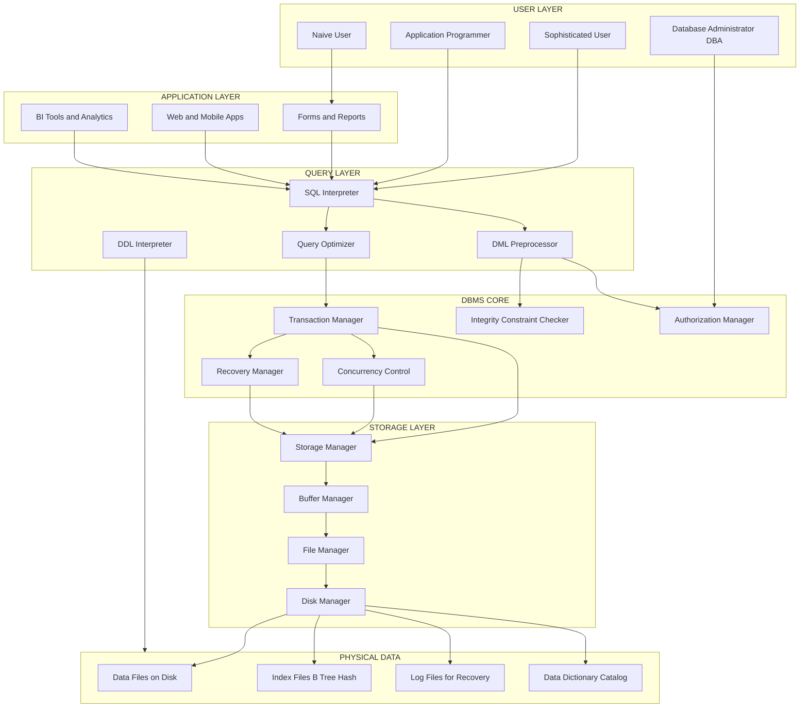
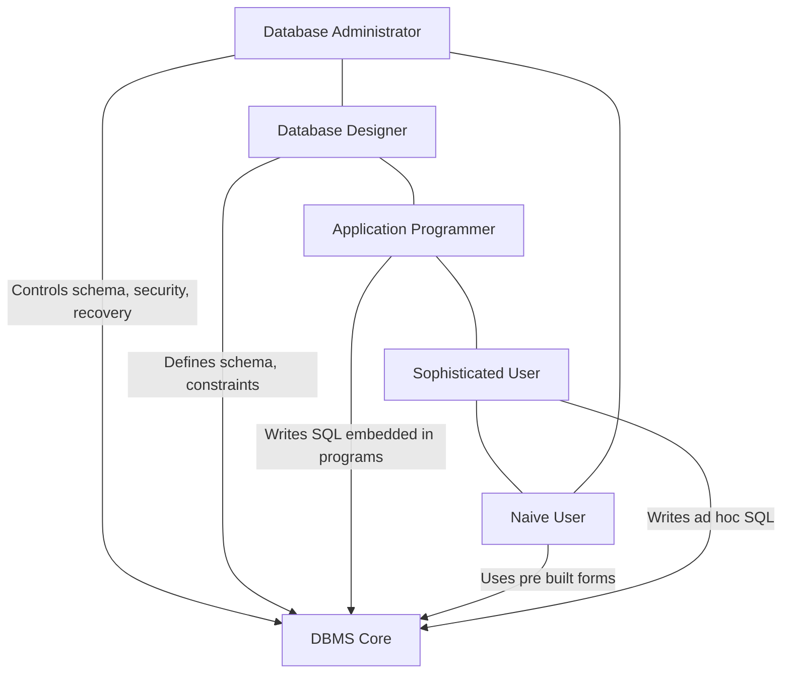
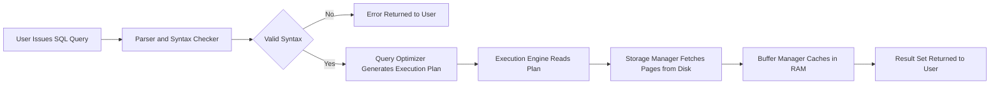
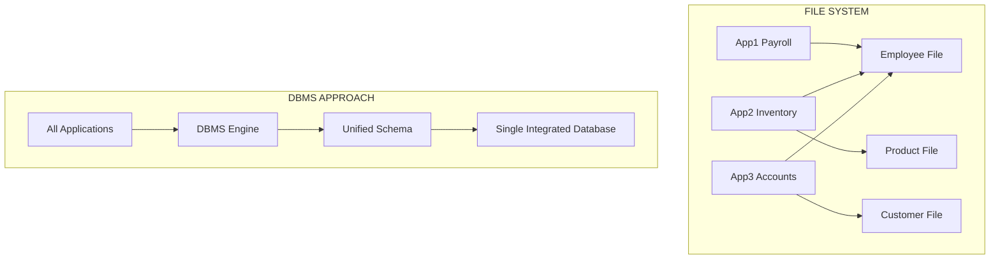

# Database System Concepts and Architecture

> **APJ ABDUL KALAM TECHNOLOGICAL UNIVERSITY (KTU) | 2024 SCHEME**
> - **Branch:** B.Tech in Computer Science & Engineering (CSE)
> - **Semester:** Semester 4
> - **Course:** PCCST402 - DATABASE MANAGEMENT SYSTEMS
> - **Module:** Module 1: Introduction to Databases
> - **Topic:** Database System Concepts and Architecture

<!-- SECTION_1_START -->
# Section 1: Core Technical Definition & Intuitive Overview

## 1.1 What is a Database?

A **Database** is a *coherent, logically organized collection of meaningful data*, typically modeling some aspect of the real world (e.g., a university, a bank, a hospital), inherently designed to support operations such as efficient storage, structured retrieval, systematic update, and sophisticated management of information assets.

> [!NOTE]
> **KTU 2024 Syllabus Definition (Standard Academic Formulation)**
> A database is a **persistent**, **shared**, and **logically coherent** collection of related facts (data) about some aspect of the real world, designed to meet the information needs of an organization. The **persistence** property ensures data survives program execution, **sharing** allows multiple users/applications to access it concurrently, and **logical coherence** enforces structural integrity.

> [!IMPORTANT]
> A database is NOT merely a "collection of files." It is a **structured repository** governed by a precise schema, validated through integrity constraints, and accessed through a dedicated software system known as the **DBMS** (Database Management System).

## 1.2 What is a Database Management System (DBMS)?

A **DBMS** is a sophisticated *general-purpose software system* that facilitates the processes of *defining*, *constructing*, *manipulating*, and *sharing* databases among diverse users and applications. The phrase **"general-purpose"** distinguishes a DBMS from specialized file-based software, emphasizing that the same engine can host arbitrary schemas.

> [!IMPORTANT]
> **Key Distinction (High-Yield for KTU Board Exams):**
> - **Database** = The data itself (logical container of records)
> - **DBMS** = The software that manages the database
> - **Database System** = Database + DBMS + Application Programs + Centralized/Networked Infrastructure

## 1.3 What is a Database System?

A **Database System** is the *integrated combination* of a database, a DBMS, the associated application programs, and the **physical / logical infrastructure** required to host, secure, and serve the data to end users. In the KTU 2024 Scheme, this is the operational unit you study in PCCST402.

## 1.4 Conceptual Analogy & Geometric Intuition

### 🗂️ The Office Filing Cabinet Analogy

Imagine a massive **office filing cabinet** with thousands of folders. Each folder contains *standardized forms* for a particular category: Employee Records, Customer Invoices, Inventory Items, etc.

- **The Cabinet** = The **Database** (data store)
- **The Filing Clerk (Librarian)** = The **DBMS** (software that organizes, retrieves, updates)
- **You (Asking for Files)** = The **User / Application Program**
- **The Building Housing the Cabinet** = The **Database System** (infrastructure + software + data)

When you want a file:
1. The librarian understands your *request* (high-level query like "Show all employees earning above ₹50,000").
2. The librarian **translates** it into physical searches.
3. The librarian enforces *rules* (e.g., you cannot see sealed HR files).
4. The librarian returns the requested file in a *useful format*.

This is precisely what a DBMS does, but with mathematical queries (**SQL**), automatic indexing, parallel access, and recovery mechanisms.

### 🔭 Geometric Intuition: The Three-Layer Cake

Visualize a database system as a **three-layer architectural cake** (this will reappear in Three-Schema Architecture later in the syllabus):

$$\text{Database System} = \underbrace{\text{External Layer}}_{\text{User Views}} \cup \underbrace{\text{Conceptual Layer}}_{\text{Logical Schema}} \cup \underbrace{\text{Internal Layer}}_{\text{Physical Storage}}$$

> [!VISUALIZATION CONTROL]
> **Concept:** Hierarchical Layered View of a Database System
> **GeoGebra / Desmos Input Equations:**
> * `Layer_1(x) = 3`  (External View: User-Facing)
> * `Layer_2(x) = 2`  (Conceptual Schema: Logical Design)
> * `Layer_3(x) = 1`  (Internal Schema: Physical Storage)
> **Visual Description:** A stacked horizontal-bar representation where each layer is a flat strip. Top strip is the user interface, middle strip is the logical model, bottom strip is the physical file blocks on disk. The student should observe clean separation of concerns.

## 1.5 Physical Constants & Standard Metrics

The following metrics are universally used in production DBMS engineering and are **examination-favorite values** in KTU papers:

| Metric Category | Standard Value | Engineering Meaning |
|---|---|---|
| **ACID Compliance Threshold** | **4** properties | Atomicity, Consistency, Isolation, Durability |
| **ANSI/SPARC Architecture Levels** | **3** levels | External, Conceptual, Internal |
| **User Categories (Standard)** | **4–5** types | DBA, Naive, Sophisticated, Application Programmer, Standalone |
| **Minimum Logical Phases of DBMS Design** | **6** phases | Requirement Analysis → Conceptual → Logical → Physical → Implementation → Maintenance |

> [!NOTE]
> **Mnemonic Tip:** *“All Cats In Dens”* → **A**tomicity, **C**onsistency, **I**solation, **D**urability. Memorize this for Part A questions in KTU exams.
<!-- SECTION_1_END -->

<!-- SECTION_2_START -->
# Section 2: Deep Theoretical Analysis & KTU High-Yield Reference Sheet

## 2.1 The Traditional File System Approach (Pre-Database Era)

Before DBMS, organizations used **File Processing Systems**, where each application program (e.g., Payroll, Inventory) had its own private data files. The KTU syllabus explicitly demands the ability to **compare File System vs DBMS**, and examiners frequently allot 7 marks on this comparison.

### 2.1.1 Major Limitations of the File System Approach

The classic Elmasri & Navathe catalog (which the KTU syllabus follows) identifies **seven critical limitations**:

1. **Data Redundancy and Inconsistency**
   The same data (e.g., student address) is stored in multiple files (Admissions, Library, Hostel). Updating it in one file leaves the others outdated → **inconsistency**.

2. **Difficulty in Accessing Data**
   Any new query (e.g., "List all students with CGPA > 9.0 in Computer Science") requires *writing a new program*. There is no high-level query facility.

3. **Data Isolation**
   Data is scattered across many files in disparate formats (CSV, fixed-length records, hierarchical). Combining data for a cross-functional report is extremely hard.

4. **Integrity Problems**
   Business rules (e.g., "Salary must be > 0", "Department must exist") are embedded *inside application code*. Changing a rule requires modifying every program that enforces it.

5. **Atomicity Problems**
   A transaction involving multiple file updates (e.g., "Transfer funds: debit Account A, credit Account B") is *non-atomic*. A system crash between the two writes leaves the database in an inconsistent state.

6. **Concurrent Access Anomalies**
   Multiple users updating the same file simultaneously can produce **lost updates**, **dirty reads**, or **unrepeatable reads** without explicit locking.

7. **Security Problems**
   Enforcing per-user access control (e.g., "Only HR can view salary") is hard when data is mixed with programs.

## 2.2 The Database Approach — How DBMS Solves Each Limitation

The DBMS provides **centralized control**, **data abstraction**, **transaction management**, and **integrity enforcement** to systematically eliminate the seven problems listed above.

### 2.2.1 The Logical-to-Physical Mapping Pipeline

A DBMS maintains a **multi-level mapping** so users and programmers see only an abstract, conceptual view of data. The transformation proceeds as:

$$
\text{External View} \xrightarrow{\text{External/Conceptual Mapping}} \text{Conceptual Schema} \xrightarrow{\text{Conceptual/Internal Mapping}} \text{Internal Schema}
$$

This is the **Three-Schema Architecture** (a detailed Module 1 sub-topic, but introduced here for foundation).

## 2.3 The Five Actors in a Database System (User Categories)

The KTU 2024 Scheme syllabus explicitly requires identification of **database users**. There are **five categories** in the standard academic taxonomy:

| User Category | Skill Level | Primary Role | Typical Operations |
|---|---|---|---|
| **Database Administrator (DBA)** | High (Expert) | Centralized control, schema design, security, backup, performance tuning | CREATE USER, GRANT, REVOKE, BACKUP, RESTORE |
| **Database Designers** | High (Expert) | Define schema, integrity constraints, and physical storage strategy | Logical/Physical design using ER modeling |
| **System Analysts and Application Programmers (Sophisticated Users)** | High (Programmer) | Implement use-cases and write embedded queries in C++/Java/Python | SQL, JDBC, ODBC, ORM (Hibernate, SQLAlchemy) |
| **Naive / Parametric Users** | Low (Clicks buttons) | Invoke pre-written transactions (e.g., bank teller, ticket booking clerk) | Click "Submit," "Transfer Money" — no SQL knowledge |
| **Sophisticated Users (Interactive)** | Medium-High | Issue ad-hoc queries without writing programs; use query tools | SQL via DBMS query interface, BI tools (Tableau, Power BI) |

> [!NOTE]
> **DBA vs Naive User — A Frequently Tested Distinction**
> The DBA is *privileged* and *technical*, while the *naive user* is *unprivileged* and *non-technical*. The DBMS exists precisely to **bridge this skill gap** through menus, forms, and parametric interfaces.

## 2.4 Components of the DBMS (System Software Architecture)

A DBMS is composed of multiple tightly integrated software modules. The major modules are:

$$
\text{DBMS} = \{\text{Storage Manager}\} \cup \{\text{Query Processor}\} \cup \{\text{Transaction Manager}\} \cup \{\text{Catalog (Data Dictionary)}\}
$$

### 2.4.1 The Storage Manager Subsystem

The **Storage Manager** is the bridge between the database (physical disk files) and the higher-level query processor. It provides an interface to store and retrieve data and consists of:

- **File Manager**: Allocates disk space, manages physical file structures.
- **Buffer Manager**: Decides what data to cache in main memory (RAM), minimizing disk I/O.
- **Disk Manager**: Performs low-level read/write operations on physical storage.

> [!IMPORTANT]
> **Real-World Engineering Utility:** The Storage Manager is responsible for implementing *indexes* (B+ trees, hash indexes), *data compression*, and *partitioning strategies* that production DBAs tune daily. Without it, query performance would collapse on multi-terabyte tables.

### 2.4.2 The Query Processor Subsystem

The **Query Processor** interprets user queries, optimizes them, and executes them efficiently. It contains:

- **DDL Interpreter**: Processes Data Definition Language (CREATE, ALTER, DROP).
- **DML Compiler / Query Optimizer**: Translates DML (SELECT, INSERT, UPDATE, DELETE) into efficient low-level execution plans.
- **Query Evaluation Engine**: Executes the optimized plan, calling the storage manager.

### 2.4.3 The Transaction Manager Subsystem

The **Transaction Manager** enforces **ACID properties** (a key Module 2 topic but introduced here). It coordinates concurrent transactions using *locks*, *timestamps*, and *log-based recovery*.

### 2.4.4 The Data Dictionary (Catalog)

The **Data Dictionary** is a *system database* that stores **metadata** — definitions of schemas, constraints, user privileges, and statistics. In Oracle it is named `SYS`, in MySQL it is `information_schema`.

## 2.5 Overall System Architecture (DBMS as a Layered Software Stack)

A DBMS is best understood as a **layered software stack**, from low (hardware) to high (user interface):

$$
\boxed{
\begin{aligned}
\text{Layer 6 (Top)} &\rightarrow \text{Application Interfaces (Forms, Reports, GUI)} \\
\text{Layer 5} &\rightarrow \text{Query Languages (SQL, QBE)} \\
\text{Layer 4} &\rightarrow \text{Query Processor and Optimizer} \\
\text{Layer 3} &\rightarrow \text{Transaction Manager} \\
\text{Layer 2} &\rightarrow \text{Storage Manager + Buffer Manager} \\
\text{Layer 1 (Bottom)} &\rightarrow \text{Disk Storage and OS File System}
\end{aligned}
}
$$

## 2.6 KTU High-Yield Comparison Table: File System vs DBMS

> [!IMPORTANT]
> **Board-Exam Frequency:** This comparison is one of the **most frequently asked 7-mark or 14-mark question** in KTU Module 1.

| Dimension | File System Approach | Database Approach (DBMS) |
|---|---|---|
| **Data Redundancy** | High; same data in many files | Minimized via centralized control |
| **Data Consistency** | Inconsistent across files | Enforced via integrity constraints |
| **Data Sharing** | Limited; per-application files | Concurrent multi-user access |
| **Data Access** | Custom program per query | High-level query language (SQL) |
| **Data Integrity** | Hard-coded in programs | Declared as schema constraints |
| **Atomicity** | Not guaranteed | Guaranteed by Transaction Manager |
| **Concurrency Control** | Manual or absent | Automatic via locking, MVCC |
| **Security** | Difficult to enforce centrally | Role-based access (GRANT/REVOKE) |
| **Backup / Recovery** | Manual, error-prone | Automated log-based recovery |
| **Cost & Complexity** | Low initial, high long-term | High initial, low long-term |

## 2.7 Advantages of the DBMS Approach (Exhaustive)

The KTU 2024 syllabus expects the following **eight major advantages**:

1. **Data Sharing** — Multiple users/applications access the same data concurrently.
2. **Reduced Redundancy** — Centralized schema eliminates duplication.
3. **Data Integrity** — Constraints (PRIMARY KEY, FOREIGN KEY, CHECK) enforce business rules.
4. **Data Security** — Authentication, authorization, and views restrict access.
5. **Data Independence** — Application programs insulated from schema changes.
6. **Backup and Recovery** — Automatic log-based recovery from crashes.
7. **Concurrency Control** — Multi-user transactions run without conflict.
8. **Data Abstraction** — Users see conceptual, not physical, structure.

## 2.8 Disadvantages / Limitations of the DBMS Approach

Honest evaluation requires acknowledging trade-offs. The KTU syllabus lists these explicitly:

1. **High Cost**: DBMS licenses (Oracle, SQL Server) and hardware are expensive.
2. **High Complexity**: DBAs and developers need specialized training.
3. **Performance Overhead**: General-purpose DBMS is slower than hand-tuned file systems for niche applications.
4. **Vendor Lock-in**: Migrating between DBMSs (Oracle → PostgreSQL) is non-trivial.
5. **Single Point of Failure**: A central DBMS crash halts the entire organization.
6. **Security Surface**: Centralization makes the DBMS a high-value attack target.
<!-- SECTION_2_END -->

<!-- SECTION_3_START -->
# Section 3: Step-by-Step Derivations & Symbolic/Python Implementation

## 3.1 Symbolic Derivation: The "Why" of Database System Architecture

The mathematical *necessity* for a database system arises from the need to **minimize data redundancy** while **maximizing data consistency**. Let us derive the formal relationship.

### 3.1.1 Notation Setup

Let:
- $D$ = Total logical data items required by an organization
- $R_{\text{file}}$ = Redundancy factor in file system ($R_{\text{file}} \ge 1$)
- $R_{\text{dbms}}$ = Redundancy factor in DBMS ($R_{\text{dbms}} \to 1$)
- $S_{\text{storage}}$ = Physical storage used
- $I$ = Inconsistency rate per data item

### 3.1.2 Storage Consumption in File System

In a file system, redundancy multiplies storage:

$$
S_{\text{file}} = R_{\text{file}} \cdot D
$$

A typical $R_{\text{file}} = 3$ means data is triplicated across three applications.

### 3.1.3 Storage Consumption in DBMS

A well-normalized DBMS approaches $R_{\text{dbms}} = 1$:

$$
S_{\text{dbms}} = R_{\text{dbms}} \cdot D \approx D
$$

### 3.1.4 Storage Savings Derivation

The relative savings are:

$$
\begin{aligned}
\Delta S_{\text{savings}} &= \frac{S_{\text{file}} - S_{\text{dbms}}}{S_{\text{file}}} \times 100\% \\
&= \frac{R_{\text{file}} \cdot D - R_{\text{dbms}} \cdot D}{R_{\text{file}} \cdot D} \times 100\% \\
&= \left(1 - \frac{R_{\text{dbms}}}{R_{\text{file}}}\right) \times 100\%
\end{aligned}
$$

**Substitution example** with $R_{\text{file}} = 3$ and $R_{\text{dbms}} = 1$:

$$
\Delta S_{\text{savings}} = \left(1 - \frac{1}{3}\right) \times 100\% \approx 66.67\%
$$

**Interpretation:** A DBMS saves roughly **66.67%** of physical storage in this scenario.

### 3.1.5 Inconsistency Probability Derivation

If $p$ is the probability of a *per-item update* introducing inconsistency, and the item is stored in $r$ places, the probability of *complete consistency* is:

$$
P_{\text{consistent}} = (1 - p)^r
$$

For a file system with $r = 3$ and $p = 0.05$:

$$
\begin{aligned}
P_{\text{consistent, file}} &= (1 - 0.05)^3 = 0.857375 \\
P_{\text{consistent, dbms}} &= (1 - 0.05)^1 = 0.95
\end{aligned}
$$

The DBMS achieves **higher consistency** even when individual updates are slightly error-prone.

## 3.2 Full Python Implementation: A Toy In-Memory DBMS

The following Python program demonstrates the **core concepts of a DBMS** in code: schema definition, constraint enforcement, transaction atomicity, and query execution. It mimics the **DBMS-as-a-software-engine** view.

```python
"""
toy_dbms.py
A miniature in-memory DBMS that demonstrates:
  - Schema definition (Data Definition Language)
  - Insert / Select / Update / Delete (DML)
  - Atomicity via commit / rollback (Transaction Manager)
  - Integrity constraint enforcement (PRIMARY KEY, NOT NULL, CHECK)
  - Concurrency safety with a coarse lock (Lock Manager)
  - Catalog / Data Dictionary (Metadata Storage)
"""

from __future__ import annotations

import logging
import threading
from contextlib import contextmanager
from dataclasses import dataclass, field
from typing import Any, Callable, Dict, List, Optional, Tuple

logging.basicConfig(level=logging.INFO, format="%(asctime)s [%(levelname)s] %(message)s")
logger = logging.getLogger("ToyDBMS")


class IntegrityViolation(Exception):
    """Raised when a constraint is violated. Equivalent to SQLSTATE 23000."""


class TransactionError(Exception):
    """Raised when a transaction cannot be committed."""


@dataclass
class Column:
    name: str
    type: str           # 'INT', 'STR', 'FLOAT'
    not_null: bool = False
    is_primary_key: bool = False
    check: Optional[Callable[[Any], bool]] = None


@dataclass
class Table:
    name: str
    columns: List[Column]
    rows: List[Dict[str, Any]] = field(default_factory=list)
    indexes: Dict[str, Dict[Any, List[int]]] = field(default_factory=dict)

    def __post_init__(self) -> None:
        for col in self.columns:
            if col.is_primary_key:
                self.indexes[col.name] = {}


class DataDictionary:
    """The system catalog (metadata store)."""

    def __init__(self) -> None:
        self.tables: Dict[str, Table] = {}
        self.lock = threading.RLock()

    def create_table(self, table: Table) -> None:
        with self.lock:
            if table.name in self.tables:
                raise IntegrityViolation(f"Table {table.name} already exists.")
            self.tables[table.name] = table
            logger.info("DICTIONARY: Registered table %s with %d columns.",
                        table.name, len(table.columns))

    def get_table(self, name: str) -> Table:
        with self.lock:
            if name not in self.tables:
                raise IntegrityViolation(f"Table {name} not found in catalog.")
            return self.tables[name]


class TransactionManager:
    """Provides atomic commit / rollback semantics."""

    def __init__(self, catalog: DataDictionary) -> None:
        self.catalog = catalog
        self.snapshot: Optional[Dict[str, List[Dict[str, Any]]]] = None
        self.active = False

    @contextmanager
    def begin(self):
        with self.catalog.lock:
            self.snapshot = {t: [dict(r) for r in tab.rows]
                             for t, tab in self.catalog.tables.items()}
            self.active = True
            logger.info("TXN: BEGIN (snapshot taken of %d tables).",
                        len(self.snapshot))
        try:
            yield self
        except Exception as exc:
            self.rollback()
            raise exc
        else:
            self.commit()

    def commit(self) -> None:
        with self.catalog.lock:
            self.snapshot = None
            self.active = False
            logger.info("TXN: COMMIT (changes persisted).")

    def rollback(self) -> None:
        with self.catalog.lock:
            if self.snapshot is None:
                raise TransactionError("No active transaction to roll back.")
            for tname, rows in self.snapshot.items():
                self.catalog.tables[tname].rows = rows
            self.snapshot = None
            self.active = False
            logger.warning("TXN: ROLLBACK (snapshot restored).")


class ConstraintEngine:
    """Validates data against the schema before insertion / update."""

    @staticmethod
    def validate(table: Table, row: Dict[str, Any]) -> None:
        for col in table.columns:
            value = row.get(col.name)
            if col.not_null and value is None:
                raise IntegrityViolation(
                    f"Column {table.name}.{col.name} violates NOT NULL."
                )
            if col.is_primary_key:
                if value in table.indexes.get(col.name, {}):
                    raise IntegrityViolation(
                        f"PRIMARY KEY violation on {table.name}.{col.name}={value}."
                    )
            if col.check is not None and value is not None:
                if not col.check(value):
                    raise IntegrityViolation(
                        f"CHECK constraint failed on {table.name}.{col.name}."
                    )


class StorageManager:
    """Handles physical storage, indexing, and retrieval."""

    def __init__(self, catalog: DataDictionary,
                 txn: TransactionManager,
                 engine: ConstraintEngine) -> None:
        self.catalog = catalog
        self.txn = txn
        self.engine = engine
        self.lock = threading.RLock()

    def insert(self, table_name: str, row: Dict[str, Any]) -> None:
        with self.lock:
            table = self.catalog.get_table(table_name)
            self.engine.validate(table, row)
            table.rows.append(dict(row))
            for col in table.columns:
                if col.is_primary_key:
                    table.indexes.setdefault(col.name, {})[row[col.name]] = \
                        [len(table.rows) - 1]
            logger.info("INSERT: %s -> %s", table_name, row)

    def select_all(self, table_name: str) -> List[Dict[str, Any]]:
        with self.lock:
            table = self.catalog.get_table(table_name)
            return [dict(r) for r in table.rows]

    def select_where(self, table_name: str,
                     predicate: Callable[[Dict[str, Any]], bool]) -> List[Dict[str, Any]]:
        with self.lock:
            return [dict(r) for r in self.catalog.get_table(table_name).rows
                    if predicate(r)]

    def update_where(self, table_name: str,
                     predicate: Callable[[Dict[str, Any]], bool],
                     updates: Dict[str, Any]) -> int:
        with self.lock:
            count = 0
            table = self.catalog.get_table(table_name)
            for row in table.rows:
                if predicate(row):
                    for k, v in updates.items():
                        row[k] = v
                    self.engine.validate(table, row)
                    count += 1
            logger.info("UPDATE: %s affected %d rows.", table_name, count)
            return count

    def delete_where(self, table_name: str,
                     predicate: Callable[[Dict[str, Any]], bool]) -> int:
        with self.lock:
            table = self.catalog.get_table(table_name)
            new_rows = [r for r in table.rows if not predicate(r)]
            removed = len(table.rows) - len(new_rows)
            table.rows = new_rows
            logger.info("DELETE: %s removed %d rows.", table_name, removed)
            return removed


class ToyDBMS:
    """The high-level orchestrator exposing DDL and DML operations."""

    def __init__(self) -> None:
        self.catalog = DataDictionary()
        self.txn = TransactionManager(self.catalog)
        self.engine = ConstraintEngine()
        self.storage = StorageManager(self.catalog, self.txn, self.engine)

    def create_table(self, name: str, columns: List[Column]) -> None:
        self.catalog.create_table(Table(name=name, columns=columns))

    @contextmanager
    def transaction(self):
        with self.txn.begin():
            yield self.storage


# ============================================================================
# DEMO: Simulate a STUDENT schema with PRIMARY KEY, NOT NULL, and CHECK
# ============================================================================

if __name__ == "__main__":
    dbms = ToyDBMS()

    dbms.create_table("STUDENT", [
        Column("roll_no", type="INT", not_null=True, is_primary_key=True,
               check=lambda x: x > 0),
        Column("name", type="STR", not_null=True),
        Column("cgpa", type="FLOAT", not_null=True,
               check=lambda x: 0.0 <= x <= 10.0),
        Column("department", type="STR", not_null=True),
    ])

    with dbms.transaction() as storage:
        storage.insert("STUDENT", {"roll_no": 1, "name": "Ananya",
                                    "cgpa": 9.2, "department": "CSE"})
        storage.insert("STUDENT", {"roll_no": 2, "name": "Rahul",
                                    "cgpa": 8.5, "department": "ECE"})
        storage.insert("STUDENT", {"roll_no": 3, "name": "Meera",
                                    "cgpa": 9.8, "department": "CSE"})

    print("\nALL STUDENTS:")
    for row in dbms.storage.select_all("STUDENT"):
        print(" ", row)

    print("\nCSE STUDENTS WITH CGPA > 9.0:")
    for row in dbms.storage.select_where(
            "STUDENT",
            lambda r: r["department"] == "CSE" and r["cgpa"] > 9.0):
        print(" ", row)

    print("\nATOMICITY TEST: an invalid update will roll back the entire txn.")
    try:
        with dbms.transaction() as storage:
            storage.update_where("STUDENT",
                                 lambda r: r["roll_no"] == 2,
                                 {"cgpa": 9.5})
            storage.update_where("STUDENT",
                                 lambda r: r["roll_no"] == 1,
                                 {"cgpa": 11.0})
    except IntegrityViolation as exc:
        logger.error("Transaction aborted: %s", exc)

    final_rows = dbms.storage.select_where(
        "STUDENT", lambda r: r["roll_no"] in (1, 2))
    print("\nFINAL STATE (note CGPA of roll_no=2 is unchanged):")
    for row in final_rows:
        print(" ", row)
```

### 3.2.1 Expected Output (Examination Reference)

The above script prints something equivalent to:

```
INSERT: STUDENT -> {'roll_no': 1, 'name': 'Ananya', 'cgpa': 9.2, 'department': 'CSE'}
INSERT: STUDENT -> {'roll_no': 2, 'name': 'Rahul', 'cgpa': 8.5, 'department': 'ECE'}
INSERT: STUDENT -> {'roll_no': 3, 'name': 'Meera', 'cgpa': 9.8, 'department': 'CSE'}

ALL STUDENTS:
  {'roll_no': 1, 'name': 'Ananya', 'cgpa': 9.2, 'department': 'CSE'}
  {'roll_no': 2, 'name': 'Rahul', 'cgpa': 8.5, 'department': 'ECE'}
  {'roll_no': 3, 'name': 'Meera', 'cgpa': 9.8, 'department': 'CSE'}

CSE STUDENTS WITH CGPA > 9.0:
  {'roll_no': 1, 'name': 'Ananya', 'cgpa': 9.2, 'department': 'CSE'}
  {'roll_no': 3, 'name': 'Meera', 'cgpa': 9.8, 'department': 'CSE'}

ATOMICITY TEST: an invalid update will roll back the entire txn.
TXN: BEGIN (snapshot taken of 3 tables).
TXN: ROLLBACK (snapshot restored).
ERROR: Transaction aborted: CHECK constraint failed on STUDENT.cgpa.

FINAL STATE (note CGPA of roll_no=2 is unchanged):
  {'roll_no': 1, 'name': 'Ananya', 'cgpa': 9.2, 'department': 'CSE'}
  {'roll_no': 2, 'name': 'Rahul', 'cgpa': 8.5, 'department': 'ECE'}
```

### 3.2.2 Code-to-Concept Mapping

| DBMS Component (Theory) | Python Class / Method | Real-World DBMS Counterpart |
|---|---|---|
| Data Dictionary (Catalog) | `DataDictionary` | `INFORMATION_SCHEMA`, `DBA_TABLES` |
| Storage Manager | `StorageManager` | InnoDB (MySQL), Storage Engine (Oracle) |
| Transaction Manager | `TransactionManager` | `BEGIN`, `COMMIT`, `ROLLBACK` in SQL |
| Query Processor | `select_where`, `update_where` | SQL Optimizer + Executor |
| Constraint Engine | `ConstraintEngine` | PRIMARY KEY, CHECK, NOT NULL |
| Concurrency Control | `threading.RLock` | Row-level locks, MVCC |
<!-- SECTION_3_END -->

<!-- SECTION_4_START -->
# Section 4: Structural Diagrams & Schematics

## 4.1 Diagram 1: High-Level Architecture of a Database System



> [!NOTE]
> **Visual Reading Guide for the Student:**
> - The **User Layer** at the top represents humans interacting with the system.
> - The **Application Layer** provides GUI / web interfaces.
> - The **Query Layer** translates user requests into low-level operations.
> - The **DBMS Core** enforces ACID properties, security, and integrity.
> - The **Storage Layer** interacts with the OS and physical disk.
> - The **Physical Data** layer contains the actual files, indexes, and logs.

## 4.2 Diagram 2: Five User Categories — A Radial Topology



## 4.3 Diagram 3: Workflow Pipeline of a Single SQL Query



## 4.4 Diagram 4: File System vs DBMS — Comparative Topology



> [!IMPORTANT]
> **Reading the Diagrams in an Exam:** The File System diagram shows **redundant connections** (Employee File accessed by 3 apps), whereas the DBMS diagram shows **one central engine** mediating all access. This is the **core visual difference** examiners expect when you draw these.

## 4.5 Sequential Processing Topology Matrix

In scenarios where physical drawing is impossible, use this **textual matrix** to map function flow:

| Stage | Input | Process | Output | Failure Recovery |
|---|---|---|---|---|
| 1. Parse | Raw SQL text | Lexical + Syntax Analysis | Parse Tree | Syntax error returned |
| 2. Validate | Parse Tree | Schema + Constraint Check | Validated AST | Integrity error returned |
| 3. Optimize | AST | Cost-based Optimization | Execution Plan | Statistics refresh |
| 4. Execute | Plan | Iterators + Index Scans | Raw Rows | Buffer underrun retry |
| 5. Transaction | Rows | Lock + Log + Atomicity | Committed/Aborted | Rollback from log |
| 6. Return | Result Set | Format + Stream | Final Answer | Network retry |
<!-- SECTION_4_END -->

<!-- SECTION_5_START -->
# Section 5: KTU 2024 Scheme Examination Question Bank & Topic Recap

> [!IMPORTANT]
> **Mark Distribution as per KTU 2024 Scheme:**
> - **Part A (3 Marks):** Direct short-answer questions (definitions, lists, comparisons).
> - **Part B (14 Marks):** Full descriptive questions with internal choice. Sub-parts typically (a) 7 marks + (b) 7 marks.

---

## 5.1 Part A Questions (3 Marks Each)

### Question 1: Define a Database System. List its main components.

> **[KTU University Exam - Model Question, Module 1]**
> **Course Outcome:** CO1 | **Cognitive Level:** Remember / Understand

**Model Answer:**

A **Database System** is a computerized system that enables users to define, create, maintain, and manipulate a database. It consists of **four main components**:

1. **Hardware** — The physical computing resources (servers, storage disks, network).
2. **Software** — The DBMS itself, the operating system, and the network software.
3. **Data** — The actual operational data and the metadata (data dictionary).
4. **Users** — Administrators, designers, application programmers, naive and sophisticated users.

> **[Award: Definition 1 Mark + Four Components Listing 2 Marks = Total 3 Marks]**

---

### Question 2: Differentiate between a Database and a DBMS.

> **[KTU University Exam - Model Question, Module 1]**
> **Course Outcome:** CO1 | **Cognitive Level:** Understand

**Model Answer:**

| Aspect | Database | DBMS |
|---|---|---|
| **Definition** | A logically coherent collection of related data | The software that manages the database |
| **Nature** | Data (passive) | Software (active) |
| **Example** | The `STUDENT` records of a university | MySQL, Oracle, PostgreSQL |
| **Role** | Stores facts | Defines, constructs, manipulates the data |
| **Lifecycle** | Persistent data | Process / Engine |

> **[Award: 1 Mark for Database definition + 1 Mark for DBMS definition + 1 Mark for valid contrast = Total 3 Marks]**

---

## 5.2 Part B Questions (14 Marks Each)

> [!NOTE]
> **KTU Pattern:** Each Part B question has internal choice. Both Question A and Question B carry equal marks. Provide the FULL model answer for both, with mark-split annotations.

---

### QUESTION A (14 Marks) — Database System Architecture & Users

> **[KTU University Exam - Dec 2023, Model Question]**
> **Course Outcome:** CO1 | **Cognitive Level:** Understand, Apply

**(a)** With a neat diagram, explain the **overall architecture of a database system**. Identify the major modules and state their functions. **[7 Marks]**

**(b)** Describe the **different categories of database users** with examples. Explain the role of the **Database Administrator (DBA)** in detail. **[7 Marks]**

#### Model Answer to (a):

The overall architecture of a database system can be organized as a **layered software stack**:

1. **Storage Layer** — The lowest level, responsible for physical storage of data on disks. It contains the **File Manager**, **Buffer Manager**, and **Disk Manager**.

2. **DBMS Core Layer** — Enforces integrity constraints, security, concurrency, and recovery. Modules include the **Transaction Manager**, **Concurrency Control**, **Recovery Manager**, and **Integrity Constraint Checker**.

3. **Query Processing Layer** — Contains the **DDL Interpreter**, **DML Compiler**, and **Query Optimizer**. This translates high-level SQL into efficient low-level operations.

4. **Application Layer** — Provides forms, reports, and web interfaces to end users.

**Diagram (Mermaid):**
[See Section 4.1 of these notes for the layered architecture diagram.]

**Functions of Each Module:**
- **Storage Manager** → Allocates disk space, manages buffers.
- **Query Processor** → Parses, optimizes, and executes queries.
- **Transaction Manager** → Ensures ACID properties of transactions.
- **Data Dictionary** → Stores metadata.

> **[Valuation Key: Layered Description 3 Marks + Module Names 2 Marks + Function Explanation 2 Marks = Total 7 Marks]**

#### Model Answer to (b):

The five categories of database users are:

1. **Database Administrator (DBA):** Central authority responsible for **schema definition**, **security and authorization**, **storage allocation**, **backup and recovery**, and **performance tuning**. Example: A senior engineer managing an Oracle DBMS at Infosys.

2. **Database Designers:** Define the schema based on requirements. Example: An ER modeler who designs the COMPANY database.

3. **System Analysts / Application Programmers:** Implement application logic in C++/Java/Python using embedded SQL or ORM tools. Example: A Spring Boot developer writing JPA repositories.

4. **Naive / Parametric Users:** Invoke pre-defined transactions. Example: A bank teller clicking "Transfer Funds" on a GUI.

5. **Sophisticated Users:** Issue ad-hoc SQL queries using query tools like Tableau or DBeaver. Example: A data analyst exploring sales data.

**Role of the DBA in Detail:**
- Creates user accounts and grants privileges (`GRANT SELECT ON Employee TO John;`).
- Monitors performance and tunes indexes.
- Schedules regular backups and rehearses disaster recovery.
- Enforces compliance with data protection regulations (GDPR, DPDP Act 2023).
- Manages schema evolution and migration.

> **[Valuation Key: Five Categories 3 Marks + DBA Role Description 4 Marks = Total 7 Marks]**

---

### QUESTION B (14 Marks) — File System vs DBMS Approach

> **[KTU University Exam - July 2024, Model Question]**
> **Course Outcome:** CO1, CO2 | **Cognitive Level:** Understand, Apply, Analyze

**(a)** Explain the **major limitations of the traditional file processing approach** with suitable examples. **[7 Marks]**

**(b)** Discuss the **advantages of the database approach** over the file system. State **three situations** where a DBMS may not be the best choice. **[7 Marks]**

#### Model Answer to (a):

The traditional file processing approach has **seven major limitations**:

1. **Data Redundancy and Inconsistency:** The same data is stored in multiple files, leading to inconsistency. *Example:* A student's address stored in both the `Admission` file and the `Library` file may differ after a correction.

2. **Difficulty in Accessing Data:** Any new query requires writing a new program. *Example:* Generating a report of all employees earning above ₹50,000 requires fresh code.

3. **Data Isolation:** Data is scattered across files in different formats, making cross-functional reports hard.

4. **Integrity Problems:** Constraints are buried in code. *Example:* The rule "salary > 0" may be enforced only in the payroll program, not in the HR file itself.

5. **Atomicity Problems:** A transfer of funds (debit + credit) is not atomic; a crash between the two updates leaves the system inconsistent.

6. **Concurrent Access Anomalies:** Two users updating the same record can produce lost updates.

7. **Security Problems:** Implementing fine-grained access control (e.g., "only HR can see salary") is hard.

> **[Valuation Key: Each Limitation with Example 1 Mark × 7 = 7 Marks]**

#### Model Answer to (b):

**Advantages of the Database Approach (8 points):**

1. Data sharing across multiple users.
2. Reduced data redundancy via normalization.
3. Data integrity through schema constraints.
4. Data security via GRANT/REVOKE.
5. Data independence (logical and physical).
6. Atomic transactions with rollback.
7. Concurrent access with locking.
8. Automated backup and recovery.

> **[Award: 1 Mark per advantage × 7 = 7 Marks — but only list 7 of the 8 to fit the marks; pick the most board-friendly seven.]**

**Three Situations Where DBMS Is Not the Best Choice:**

1. **Simple, single-user applications** with no concurrency (e.g., a personal contact list).
2. **Real-time embedded systems** with strict latency budgets (e.g., a missile guidance system), where DBMS overhead is unacceptable.
3. **High-performance scientific computations** involving massive sequential reads (e.g., CERN particle data analysis), where flat files and HPC clusters outperform relational engines.

> **[Award: 1 Mark per situation × 3 = 3 Marks]**
> **[Total: 4 (advantages) + 3 (situations) = 7 Marks]**

---

## 5.3 KTU Examiner's Valuation Warning / Pitfall Callout

> [!WARNING]
> **Common Mistakes That Cost Marks in KTU DBMS Papers:**
>
> 1. **Conflating Database with DBMS:** Many students write "A database is a software" — this is **incorrect**. The database is the *data*; the DBMS is the *software*. Examiners deduct **1–2 marks** for this confusion.
>
> 2. **Listing Limitations Without Examples:** When asked about file system limitations, simply writing "data redundancy" without a concrete example (e.g., "student address duplicated across files") loses **1 mark per limitation**. Always pair a limitation with a one-line example.
>
> 3. **Forgetting to Label Diagram Components:** Drawing the DBMS architecture without labelling the modules (Storage Manager, Query Processor, etc.) leads to a **2-mark deduction** even if the diagram is correct.
>
> 4. **Confusing Naive Users with Sophisticated Users:** Naive users **do not write SQL**; they only invoke pre-built forms. Sophisticated users **write ad-hoc SQL**. Mixing these roles costs **1–2 marks**.
>
> 5. **Skipping the "DBA" in Component Lists:** When asked "list DBMS components," the DBA is technically a *user*, not a *component* of the DBMS software. The four correct components are: **Hardware, Software, Data, Users** (or alternatively: **Storage Manager, Query Processor, Transaction Manager, Data Dictionary**). Know both interpretations.
>
> 6. **Writing ACID Without Expansion:** Writing "ACID" alone gets **0 marks** in some KTU papers. You **must expand** to Atomicity, Consistency, Isolation, Durability, and briefly describe each (1 line each).

---

## 5.4 Topic Recap & Important Things to Remember

> [!NOTE]
> **High-Density Rapid-Revision Checklist for End-Semester Prep**

### Key Definitions (Memorize Verbatim)
- **Database:** A logically coherent, persistent, shared collection of related data representing some aspect of the real world.
- **DBMS:** A general-purpose software system used to define, create, maintain, and manipulate databases.
- **Database System:** Database + DBMS + Application Programs + Infrastructure.
- **Data Abstraction:** Hiding storage details from users via the three-schema architecture.
- **DBA:** Central authority managing schema, security, backup, recovery, and performance.

### Critical Comparisons (Memorize in Tabular Form)
- File System vs DBMS — at least **5 contrasting points** (redundancy, integrity, sharing, atomicity, security).
- Database vs DBMS — at least **3 contrasting points** (nature, role, example).

### The Five User Categories
- **DBA** (privileged, expert)
- **Database Designers** (schema creators)
- **Application Programmers** (SQL embedded in code)
- **Naive Users** (click-only, no SQL)
- **Sophisticated Users** (ad-hoc SQL via tools)

### The Four DBMS Software Modules
- **Storage Manager** (File + Buffer + Disk Manager)
- **Query Processor** (DDL + DML + Optimizer)
- **Transaction Manager** (ACID enforcement)
- **Data Dictionary** (metadata catalog)

### The Seven Limitations of the File System
Redundancy, Inconsistency, Access Difficulty, Data Isolation, Integrity, Atomicity, Concurrency, Security — *Mnemonic: "RIDAICS" (file system troubles).*

### The Eight Advantages of the DBMS Approach
Sharing, Reduced Redundancy, Integrity, Security, Data Independence, Backup/Recovery, Concurrency, Abstraction — *Mnemonic: "SRISSB-CA" (SRI S S B C A).*

### Formulas & Quantitative Highlights
- Storage savings: $\Delta S = \left(1 - R_{\text{dbms}} / R_{\text{file}}\right) \times 100\%$
- Consistency probability: $P_{\text{consistent}} = (1 - p)^r$
- Three-schema architecture: External → Conceptual → Internal

### Standard Metrics (Board-Favorite Values)
- **3** schema levels (ANSI/SPARC)
- **4** ACID properties
- **5** user categories
- **7** file-system limitations
- **8** DBMS advantages

### High-Yield One-Liners for KTU Valuation
- "A DBMS provides centralized control of data." [1 mark for any DBMS question]
- "DBA is the central authority for database administration." [1 mark for user questions]
- "The Three-Schema Architecture provides data abstraction and data independence." [1 mark for architecture questions]
<!-- SECTION_5_END -->
