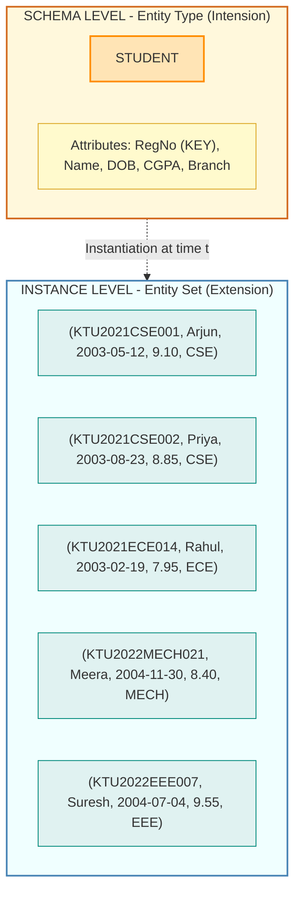
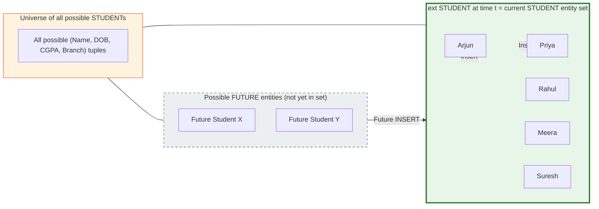
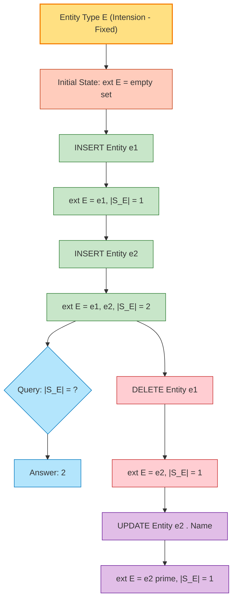
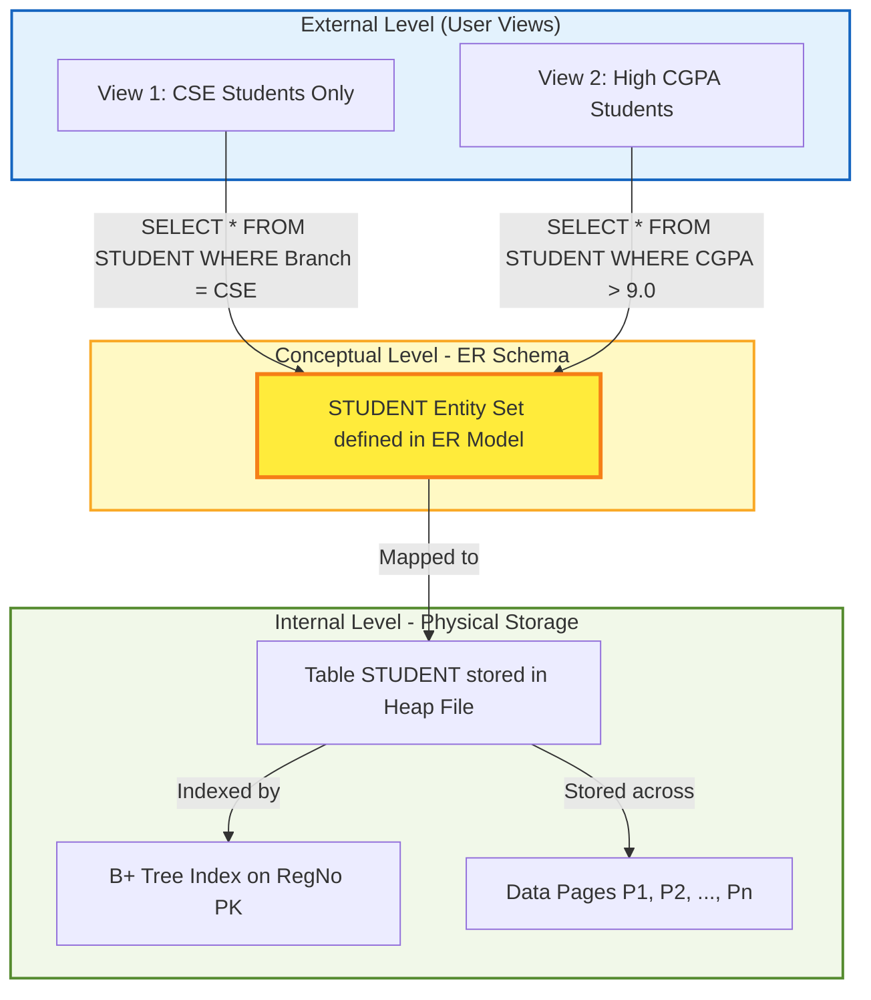

# Entity Sets

> **APJ ABDUL KALAM TECHNOLOGICAL UNIVERSITY (KTU) | 2024 SCHEME**
> - **Branch:** B.Tech in Computer Science & Engineering (CSE)
> - **Semester:** Semester 4
> - **Course:** PCCST402 - DATABASE MANAGEMENT SYSTEMS
> - **Module:** Module 1: Introduction to Databases
> - **Topic:** Entity Sets

<!-- SECTION_1_START -->
# 1. Core Technical Definition & Intuitive Overview

## 1.1 Formal Academic Definition

In the Entity–Relationship (ER) data model, an **Entity Set** is defined as a **collection (or set) of all entities of a particular entity type that exist in the database at any point in time**. It represents the *extension* (the actual current population of data) of an entity type at a given moment.

> [!IMPORTANT]
> **KTU Syllabus Definition:**
> An *entity set* is a set of entities of the same type that share the same attributes. Formally, if $E$ is an entity type, then the entity set at time $t$ is denoted as:
> $$\text{EntitySet}(E) = \{e \mid e \in E \text{ at time } t\}$$

The KTU 2024 Scheme textbook reference (Ramez Elmasri & Shamkant Navathe, *Fundamentals of Database Systems*, 7th Edition, Pearson) treats an entity set as the *extension* of the *intension* (entity type) — that is, the type defines the structure (schema-level), whereas the set contains the actual instances (data-level).

## 1.2 Conceptual Analogy / Intuition

Imagine a **cookie-cutter (mould)** versus the **cookies it produces**:

- The **cookie-cutter** is the **Entity Type** (the shape, structure, or blueprint).
- The **actual cookies on the baking tray** are the **Entity Set** (the real, countable, existing instances).

So if `STUDENT` is an **entity type**, then `{Arjun, Priya, Rahul, Meera, ...}` — every student currently enrolled in your college — is the **entity set** for that entity type.

Another way to think: a **Class Definition** in Java is the *type*, and the **Objects (instances) created in memory** are the *set*. In ER modelling, the entity type is the schema-level template, and the entity set is the dynamic population of data at runtime.

> [!NOTE]
> **Critical Distinction (frequently tested in KTU):**
> - *Entity Type* → INTENSION (schema-level, time-invariant blueprint).
> - *Entity Set* → EXTENSION (instance-level, time-varying data).

## 1.3 Physical / Quantitative Standards

| Metric | Standard Symbol | Description |
| :--- | :---: | :--- |
| Entity Type | $E$ | The schema/blueprint |
| Entity Set | $\text{ext}(E)$ or simply $S_E$ | The current instance population |
| Cardinality of entity set | $\vert S_E \vert$ | Number of entities currently in the set |
| Empty entity set | $\emptyset$ | Allowed valid state (e.g., before any insert) |
| Domain of attribute | $\text{dom}(A)$ | Set of all permissible values for attribute $A$ |

> [!TIP]
> **Empty Entity Set is Valid:** An entity set may have zero members. A newly created COMPANY database has an empty `EMPLOYEE` entity set until the first employee is inserted. This is important for KTU multiple-choice questions.

<!-- SECTION_1_END -->

<!-- SECTION_2_START -->
# 2. Deep Theoretical Analysis & KTU High-Yield Formula Sheet

## 2.1 Mathematical Foundation of Entity Sets

The ER model is built upon **set theory**. The fundamental construct is:

$$E \longrightarrow \text{ext}(E) = \{ e_1, e_2, e_3, \dots, e_n \}$$

where each $e_i$ is a distinct entity. The formal definition:

$$\text{ext}(E, t) = \{ e \mid e \text{ is an entity of type } E \text{ existing in the database at time } t \}$$

### 2.1.1 Entity Set as a Mathematical Set

Entity sets inherit the standard properties of mathematical sets:

- **Membership is binary:** For any element $x$, either $x \in \text{ext}(E)$ or $x \notin \text{ext}(E)$.
- **No duplicates:** Two entities are *equal* if and only if they share identical attribute values (specifically, identical values for the *key attribute*). Hence, $\text{ext}(E)$ behaves like a set, not a multiset.
- **Empty set is allowed:** $\text{ext}(E) = \emptyset$ is a valid state.
- **Subset relationships:** If $E_1$ and $E_2$ are entity types such that every entity of $E_1$ is also of type $E_2$, then $\text{ext}(E_1) \subseteq \text{ext}(E_2)$.

## 2.2 Entity Set as a Relation over Attributes

Theoretically, an entity set can be viewed as a **relation** in the mathematical sense. If an entity type $E$ has attributes $\{A_1, A_2, \dots, A_n\}$, then at any point in time, the entity set can be represented as a relation:

$$\text{ext}(E) \subseteq \text{dom}(A_1) \times \text{dom}(A_2) \times \dots \times \text{dom}(A_n)$$

Each tuple $(v_1, v_2, \dots, v_n)$ in this relation corresponds to one entity $e$ of type $E$, where $v_i$ is the value of attribute $A_i$ for that entity.

> [!IMPORTANT]
> **Why this matters for KTU:** When an examiner asks *"How is an entity set related to a relation?"*, the answer is that an entity set is essentially a *time-varying relation* over the domains of the entity type's attributes.

## 2.3 Structural Properties of Entity Sets

| Property | Description | KTU Implication |
| :--- | :--- | :--- |
| **Homogeneity** | All entities in a set belong to the same entity type and share the same attributes. | Cannot mix `STUDENT` and `COURSE` in one set. |
| **Identity** | Each entity is uniquely identifiable (via a *key attribute*). | Underpins the concept of *primary keys*. |
| **Mutability** | The set's membership changes over time (INSERT/DELETE). | Justifies the *extension vs. intension* distinction. |
| **Finite Cardinality** | In practice, the cardinality $\vert \text{ext}(E) \vert$ is finite. | A KTU exam may ask to compute the *cardinality* of an entity set. |
| **Empty Permitted** | The set can be empty initially. | Tests conceptual understanding. |

## 2.4 KTU Formula / Notation Sheet

| Symbol / Notation | Meaning | Example |
| :--- | :--- | :--- |
| $E$ | Entity type | $E = \text{STUDENT}$ |
| $\text{ext}(E)$ or $S_E$ | Entity set of $E$ | $\text{ext}(\text{STUDENT}) = \{\text{Arjun}, \text{Priya}, \dots\}$ |
| $\vert S_E \vert$ | Cardinality (number of entities) | $\vert S_{\text{STUDENT}} \vert = 500$ |
| $e \in S_E$ | Membership: $e$ is an entity in the set | $\text{Arjun} \in S_{\text{STUDENT}}$ |
| $e \notin S_E$ | Non-membership | $\text{Robot} \notin S_{\text{STUDENT}}$ |
| $S_{E_1} \subseteq S_{E_2}$ | Subset relationship (e.g., specialization) | $S_{\text{GRAD\_STUDENT}} \subseteq S_{\text{STUDENT}}$ |
| $S_{E_1} \cap S_{E_2}$ | Intersection (overlap in ISA hierarchy) | $S_{\text{GRAD\_STUDENT}} \cap S_{\text{TA}}$ |
| $\emptyset$ | Empty entity set | Initially, $S_{\text{ALUMNUS}} = \emptyset$ |

## 2.5 Real-World Engineering Utility

The concept of an entity set is foundational in:

- **Relational Database Design:** Every base relation in a relational schema directly corresponds to an entity set in the conceptual ER model. The mapping rule: **Entity Set → Base Table**.
- **Object-Relational Mapping (ORM):** Tools like Hibernate, JPA, and Django ORM map entity sets to Java/Python collections (`List<Employee>`, `Set<Student>`).
- **Distributed Systems:** In sharded databases, an entity set may be **horizontally partitioned** across multiple nodes (each shard holds a subset $\subseteq \text{ext}(E)$).
- **Data Warehousing:** Entity sets become *dimension tables* in star/snowflake schemas.
- **Big Data Systems:** In NoSQL stores (e.g., MongoDB), an *entity set* maps to a *collection*; in Apache Cassandra, it maps to a *column family*.

> [!TIP]
> **Production Insight:** In a real-world e-commerce system, the `CUSTOMER` entity set may have cardinality in the millions. Database optimizers (e.g., PostgreSQL's planner) use the cardinality estimate to choose efficient join algorithms. This is why understanding entity set size is critical.

<!-- SECTION_2_END -->

<!-- SECTION_3_START -->
# 3. Step-by-Step Derivations & Code/Symbolic Implementation

## 3.1 Formal Derivation: From Entity Type to Entity Set

### Step 1: Define the Entity Type (Intension)

An entity type $E$ is defined as a structure:

$$E = (N, \mathcal{A}, \mathcal{K})$$

where:
- $N$ = name of the entity type (e.g., `"EMPLOYEE"`),
- $\mathcal{A} = \{A_1, A_2, \dots, A_n\}$ = set of attributes,
- $\mathcal{K} \subseteq \mathcal{A}$ = set of key attributes (subset of attributes uniquely identifying each entity).

### Step 2: Identify Attribute Domains

Each attribute $A_i$ has a domain $\text{dom}(A_i)$ — the set of all permissible atomic values.

Example: For `STUDENT`:

$$\begin{aligned}
\mathcal{A}_{\text{STUDENT}} &= \{ \text{RegNo}, \text{Name}, \text{DOB}, \text{CGPA}, \text{Branch} \} \\
\text{dom}(\text{RegNo}) &= \text{STRING}(11) \\
\text{dom}(\text{Name}) &= \text{STRING}(50) \\
\text{dom}(\text{DOB}) &= \text{DATE} \\
\text{dom}(\text{CGPA}) &= \text{DECIMAL}(0.0, 10.0) \\
\text{dom}(\text{Branch}) &= \{\text{"CSE"}, \text{"ECE"}, \text{"MECH"}, \text{"EEE"}, \text{"CIVIL"}\} \\
\mathcal{K}_{\text{STUDENT}} &= \{\text{RegNo}\}
\end{aligned}$$

### Step 3: Derive the Schema-Instance Mapping

At any time $t$, the entity set is the *current extension*:

$$\text{ext}(E, t) \subseteq \text{dom}(A_1) \times \text{dom}(A_2) \times \dots \times \text{dom}(A_n)$$

Each tuple $(v_1, v_2, \dots, v_n)$ represents one entity $e \in \text{ext}(E, t)$.

### Step 4: Apply the Key Constraint

For any two distinct entities $e_i, e_j \in \text{ext}(E, t)$:

$$e_i \neq e_j \iff \exists \, A_k \in \mathcal{K} : e_i.A_k \neq e_j.A_k$$

In words: two entities are distinct if and only if they differ in at least one key attribute.

### Step 5: Concrete Worked Example — STUDENT Entity Set

Consider the `STUDENT` entity type with attributes as above. The entity set at time $t_0$ (today) contains:

| RegNo (Key) | Name | DOB | CGPA | Branch |
| :---: | :--- | :--- | :---: | :--- |
| KTU2021CSE001 | Arjun Krishnan | 2003-05-12 | 9.10 | CSE |
| KTU2021CSE002 | Priya Menon | 2003-08-23 | 8.85 | CSE |
| KTU2021ECE014 | Rahul Pillai | 2003-02-19 | 7.95 | ECE |
| KTU2022MECH021 | Meera Nair | 2004-11-30 | 8.40 | MECH |
| KTU2022EEE007 | Suresh Babu | 2004-07-04 | 9.55 | EEE |

**Mathematically, the entity set is:**

$$\begin{aligned}
S_{\text{STUDENT}} = \{ &(\text{"KTU2021CSE001"}, \text{"Arjun Krishnan"}, \text{"2003-05-12"}, 9.10, \text{"CSE"}), \\
&(\text{"KTU2021CSE002"}, \text{"Priya Menon"}, \text{"2003-08-23"}, 8.85, \text{"CSE"}), \\
&(\text{"KTU2021ECE014"}, \text{"Rahul Pillai"}, \text{"2003-02-19"}, 7.95, \text{"ECE"}), \\
&(\text{"KTU2022MECH021"}, \text{"Meera Nair"}, \text{"2004-11-30"}, 8.40, \text{"MECH"}), \\
&(\text{"KTU2022EEE007"}, \text{"Suresh Babu"}, \text{"2004-07-04"}, 9.55, \text{"EEE"}) \}
\end{aligned}$$

**Cardinality of the entity set:**

$$\vert S_{\text{STUDENT}} \vert = 5$$

### Step 3.6: Time Evolution of an Entity Set

The entity set is **dynamic** — it changes with time due to INSERT, DELETE, and UPDATE operations.

$$\text{ext}(E, t_0) \xrightarrow{\text{INSERT}(\text{"KTU2023CSE100"}, \text{"New Student"}, \dots)} \text{ext}(E, t_1)$$

$$\text{ext}(E, t_1) \xrightarrow{\text{DELETE}(\text{"KTU2021CSE002"})} \text{ext}(E, t_2)$$

After these two operations:

$$\vert S_{\text{STUDENT}}(t_1) \vert = 6, \quad \vert S_{\text{STUDENT}}(t_2) \vert = 5$$

The *entity type* (intension) remains unchanged, only the *extension* changes.

## 3.2 Symbolic Implementation: Set Operations on Entity Sets

Let us define two entity types: `STUDENT` and `EMPLOYEE`. Some KTU problems involve a special subclass `GRAD_STUDENT` who are also `EMPLOYEE` (e.g., Teaching Assistants). We can formalize this using set theory.

### Step 1: Define the entity sets

$$\begin{aligned}
S_{\text{STUDENT}} &= \{s_1, s_2, s_3, s_4, s_5\} \\
S_{\text{EMPLOYEE}} &= \{e_1, e_2, e_3\} \\
S_{\text{TA}} &= \{s_1, s_3\} \quad \text{(subset of STUDENT, all are TAs)}
\end{aligned}$$

### Step 2: Perform Set Operations

**Union (all persons in the system):**

$$S_{\text{STUDENT}} \cup S_{\text{EMPLOYEE}} = \{s_1, s_2, s_3, s_4, s_5, e_1, e_2, e_3\}$$

Cardinality: $\vert S_{\text{STUDENT}} \cup S_{\text{EMPLOYEE}} \vert = 8$.

**Intersection (students who are also employees):**

$$S_{\text{STUDENT}} \cap S_{\text{EMPLOYEE}} = \emptyset \quad \text{(no overlap, as per the example data)}$$

**Difference (students who are NOT employees):**

$$S_{\text{STUDENT}} \setminus S_{\text{EMPLOYEE}} = \{s_1, s_2, s_3, s_4, s_5\}$$

**Subset (every TA is a student):**

$$S_{\text{TA}} \subseteq S_{\text{STUDENT}} \iff \forall x \in S_{\text{TA}}, x \in S_{\text{STUDENT}}$$

**Cardinality of subset:**

$$\vert S_{\text{TA}} \vert = 2 \leq 5 = \vert S_{\text{STUDENT}} \vert$$

## 3.3 Code Implementation: Representing Entity Sets in Python

Below is a fully operational Python implementation that models the `STUDENT` entity set using the *set-theoretic* view, with strict type hints, boundary checks, and error handling.

```python
from dataclasses import dataclass, field
from datetime import date
from decimal import Decimal
from typing import Set, FrozenSet

# ============================================================
# STEP 1: Define the entity type (intension) using a dataclass
# ============================================================
@dataclass(frozen=True)  # frozen=True ensures uniqueness (set semantics)
class Student:
    """
    Entity TYPE definition for STUDENT.
    Attributes form the schema; instances form the entity SET.
    """
    reg_no: str         # KEY attribute
    name: str
    dob: date
    cgpa: Decimal
    branch: str

    def __post_init__(self) -> None:
        # Boundary check 1: Key attribute must be non-empty
        if not self.reg_no or not self.reg_no.strip():
            raise ValueError(f"[ERROR] Key attribute 'reg_no' cannot be empty.")

        # Boundary check 2: CGPA must be in valid academic range
        if not (Decimal("0.0") <= self.cgpa <= Decimal("10.0")):
            raise ValueError(f"[ERROR] CGPA {self.cgpa} out of range [0.0, 10.0].")

        # Boundary check 3: Branch must be a valid KTU branch code
        valid_branches: FrozenSet[str] = frozenset({"CSE", "ECE", "MECH", "EEE", "CIVIL"})
        if self.branch not in valid_branches:
            raise ValueError(f"[ERROR] Invalid branch '{self.branch}'. "
                             f"Allowed: {valid_branches}.")


# ============================================================
# STEP 2: Define the entity set (extension) as a Python set
# ============================================================
class EntitySet:
    """
    A class that models an ENTITY SET — the dynamic collection
    of entities of a particular type.
    """

    def __init__(self, entity_type_name: str) -> None:
        self.entity_type_name: str = entity_type_name
        self._entities: Set[Student] = set()  # Python set enforces uniqueness

    def insert(self, entity: Student) -> None:
        """INSERT an entity into the entity set."""
        if entity in self._entities:
            print(f"[WARN] Entity with reg_no '{entity.reg_no}' already exists. "
                  f"Skipping duplicate INSERT.")
            return
        self._entities.add(entity)
        print(f"[OK] INSERT: {entity.reg_no} -> {entity.name}")

    def delete(self, reg_no: str) -> None:
        """DELETE an entity from the entity set by key attribute."""
        for entity in list(self._entities):
            if entity.reg_no == reg_no:
                self._entities.remove(entity)
                print(f"[OK] DELETE: {reg_no} removed.")
                return
        print(f"[WARN] Entity with reg_no '{reg_no}' not found. DELETE ignored.")

    def cardinality(self) -> int:
        """Returns |S_E| — the number of entities currently in the set."""
        return len(self._entities)

    def membership(self, reg_no: str) -> bool:
        """Tests membership: is an entity with this reg_no in the set?"""
        return any(e.reg_no == reg_no for e in self._entities)

    def is_empty(self) -> bool:
        """Returns True if the entity set is empty (|S_E| = 0)."""
        return len(self._entities) == 0

    def display(self) -> None:
        """Display the current entity set contents."""
        print(f"\n=== Entity Set: {self.entity_type_name} "
              f"(Cardinality = {self.cardinality()}) ===")
        if self.is_empty():
            print("  <EMPTY ENTITY SET>")
            return
        for e in sorted(self._entities, key=lambda x: x.reg_no):
            print(f"  {e}")


# ============================================================
# STEP 3: Construct the STUDENT entity set and perform operations
# ============================================================
if __name__ == "__main__":
    # Instantiate the entity set
    student_set = EntitySet("STUDENT")

    # INSERT 5 entities (this populates the entity set)
    student_set.insert(Student("KTU2021CSE001", "Arjun Krishnan",
                                date(2003, 5, 12), Decimal("9.10"), "CSE"))
    student_set.insert(Student("KTU2021CSE002", "Priya Menon",
                                date(2003, 8, 23), Decimal("8.85"), "CSE"))
    student_set.insert(Student("KTU2021ECE014", "Rahul Pillai",
                                date(2003, 2, 19), Decimal("7.95"), "ECE"))
    student_set.insert(Student("KTU2022MECH021", "Meera Nair",
                                date(2004, 11, 30), Decimal("8.40"), "MECH"))
    student_set.insert(Student("KTU2022EEE007", "Suresh Babu",
                                date(2004, 7, 4), Decimal("9.55"), "EEE"))

    # Try a duplicate INSERT — should be rejected
    student_set.insert(Student("KTU2021CSE001", "Duplicate Arjun",
                                date(2003, 5, 12), Decimal("9.10"), "CSE"))

    # Display the entity set
    student_set.display()

    # Test membership
    print(f"\nMembership: KTU2021CSE001 in set? "
          f"{student_set.membership('KTU2021CSE001')}")
    print(f"Membership: KTU9999XXXXX in set? "
          f"{student_set.membership('KTU9999XXXXX')}")

    # DELETE an entity
    student_set.delete("KTU2021CSE002")

    # Display the updated entity set
    student_set.display()

    # Create a new empty entity set
    empty_set = EntitySet("ALUMNUS")
    print(f"\nNew empty set 'ALUMNUS' is empty? {empty_set.is_empty()}")
    empty_set.display()
```

**Expected Output (Key Segments):**

```
[OK] INSERT: KTU2021CSE001 -> Arjun Krishnan
[OK] INSERT: KTU2021CSE002 -> Priya Menon
[OK] INSERT: KTU2021ECE014 -> Rahul Pillai
[OK] INSERT: KTU2022MECH021 -> Meera Nair
[OK] INSERT: KTU2022EEE007 -> Suresh Babu
[WARN] Entity with reg_no 'KTU2021CSE001' already exists. Skipping duplicate INSERT.

=== Entity Set: STUDENT (Cardinality = 5) ===
  Student(reg_no='KTU2021CSE001', name='Arjun Krishnan', ...)
  Student(reg_no='KTU2021CSE002', name='Priya Menon', ...)
  ...

Membership: KTU2021CSE001 in set? True
Membership: KTU9999XXXXX in set? False

[OK] DELETE: KTU2021CSE002 removed.
```

## 3.4 Symbolic SQL Implementation: Entity Set → Base Table

The conceptual entity set is implemented in SQL as a **base table**. The mapping rules:

| ER Concept | SQL Equivalent |
| :--- | :--- |
| Entity Set | Base Table (Relation) |
| Entity Type | Table Schema (CREATE TABLE) |
| Attribute | Column |
| Key Attribute | PRIMARY KEY |
| Entity | Row / Tuple |
| Cardinality of set | Number of rows |

```sql
-- Entity Set 'STUDENT' as a relational table
CREATE TABLE STUDENT (
    RegNo      VARCHAR(11)  NOT NULL,
    Name       VARCHAR(50)  NOT NULL,
    DOB        DATE         NOT NULL,
    CGPA       DECIMAL(4,2) CHECK (CGPA BETWEEN 0.00 AND 10.00),
    Branch     VARCHAR(10)  NOT NULL CHECK (Branch IN ('CSE','ECE','MECH','EEE','CIVIL')),
    CONSTRAINT PK_STUDENT PRIMARY KEY (RegNo)
);

-- INSERT operations that populate the entity set
INSERT INTO STUDENT VALUES ('KTU2021CSE001', 'Arjun Krishnan', '2003-05-12', 9.10, 'CSE');
INSERT INTO STUDENT VALUES ('KTU2021CSE002', 'Priya Menon',    '2003-08-23', 8.85, 'CSE');
INSERT INTO STUDENT VALUES ('KTU2021ECE014', 'Rahul Pillai',   '2003-02-19', 7.95, 'ECE');
INSERT INTO STUDENT VALUES ('KTU2022MECH021', 'Meera Nair',    '2004-11-30', 8.40, 'MECH');
INSERT INTO STUDENT VALUES ('KTU2022EEE007', 'Suresh Babu',   '2004-07-04', 9.55, 'EEE');

-- Query: Cardinality of the entity set
SELECT COUNT(*) AS EntitySetCardinality FROM STUDENT;
-- Returns: 5
```

<!-- SECTION_3_END -->

<!-- SECTION_4_START -->
# 4. Structural Diagrams & Schematics

## 4.1 ER Diagram: Entity Set Representation

In an ER diagram, an **entity set is represented as a rectangle** containing the entity set name. Each entity (member) inside the set is an instance with its attribute values.



**Reading the diagram:**

- The **top subgraph** (yellow) represents the *schema-level* — the entity type definition that never changes.
- The **bottom subgraph** (cyan) represents the *instance-level* — the actual data tuples that change with every INSERT/DELETE.
- The dashed arrow shows the **instantiation relationship**: the type *defines* the set.

## 4.2 Set-Theoretic View: Entity Set Membership



## 4.3 Time Evolution Flowchart of an Entity Set



## 4.4 Block-Level Architecture: Entity Set in a Real DBMS



> [!NOTE]
> **Diagram Interpretation:** This three-level architecture diagram shows how a single *entity set* (`STUDENT`) defined in the ER conceptual model materializes as a physical base table in the internal level, and how different users (external level) may see *subsets* (views) of the same entity set.

<!-- SECTION_4_END -->

<!-- SECTION_5_START -->
# 5. KTU 2024 Scheme Examination Question Bank & Topic Recap

## 5.1 Part A: Short-Answer Questions (3 Marks Each)

### Question 1: [KTU University Exam - July 2024 Style]
**Define the term "Entity Set". How is it different from an "Entity Type"?**

**Model Answer (3 Marks):**

- **[Definition: 1.5 Marks]** An **Entity Set** is a collection of all entities of a particular entity type that exist in the database at any given point in time. It is the *extension* (current data population) of the entity type.
- **[Difference: 1.5 Marks]** An **Entity Type** is the *intension* or schema — a blueprint that defines the structure, attributes, and key of the entities. It is time-invariant. The entity set is the dynamic set of actual entities that conforms to the entity type at runtime.

$$\text{Entity Type} \xrightarrow{\text{instantiation at time } t} \text{Entity Set}$$

---

### Question 2: [KTU University Exam - Dec 2023 Style]
**State whether the following statement is True or False. Justify your answer: "An entity set can never be empty."**

**Model Answer (3 Marks):**

- **[Answer: 0.5 Marks]** **FALSE.**
- **[Justification: 2 Marks]** An entity set can indeed be empty. For example, when a database is freshly created and no records have been inserted yet, the entity set is the empty set $\emptyset$. Mathematically, $S_E = \emptyset$ is a valid state. The cardinality of an empty entity set is $\vert S_E \vert = 0$.
- **[Example: 0.5 Marks]** For instance, if `ALUMNUS` is an entity type in a new KTU college database, $S_{\text{ALUMNUS}} = \emptyset$ until the first batch graduates.

---

## 5.2 Part B: Long-Answer Questions (14 Marks Each — Internal Choice)

### Question A (14 Marks): [KTU University Exam Pattern — Module 1]

**(a)** Define an *entity set*. Explain with a suitable example how an entity set is the *extension* of an entity type. Distinguish clearly between *intension* and *extension* using the same example. **[7 Marks]**

**(b)** Consider the `EMPLOYEE` entity type with attributes: `EmpID` (key), `Name`, `Department`, `Salary`, `DateOfJoining`. Suppose the entity set contains the following six tuples at time $t_0$:

| EmpID | Name | Department | Salary | DateOfJoining |
| :--- | :--- | :--- | :---: | :--- |
| E001 | Anil | IT | 75000 | 2018-06-12 |
| E002 | Beena | HR | 62000 | 2019-03-25 |
| E003 | Chitra | IT | 80000 | 2017-09-14 |
| E004 | Deepak | Finance | 70000 | 2020-01-08 |
| E005 | Esha | IT | 78000 | 2021-11-19 |
| E006 | Farhan | HR | 65000 | 2018-12-03 |

Perform the following operations and show the resulting entity set after each step:
- (i) INSERT a new employee `(E007, Geetha, IT, 82000, 2023-07-01)`.
- (ii) DELETE employee `E002`.
- (iii) UPDATE the salary of `E004` from 70000 to 73000.
- (iv) Compute the cardinality of the entity set at the end. **[7 Marks]**

---

**Model Solution for Question A:**

### Part (a) Solution: [7 Marks]

**Step 1: Definition of Entity Set [1 Mark]**

An *entity set* is a collection of all entities of a particular entity type that share the same attributes and exist in the database at a given point in time $t$. Mathematically:

$$S_E(t) = \{e \mid e \text{ is an entity of type } E \text{ existing in the database at time } t\}$$

**Step 2: Example Setup [1 Mark]**

Consider the entity type `STUDENT` with attributes `RegNo` (key), `Name`, `CGPA`, and `Branch`. The entity type is the *schema definition* — it specifies what attributes each student must have.

**Step 3: Intension vs. Extension [2 Marks]**

- **Intension (Entity Type)**: The fixed schema that defines `STUDENT` as a 4-tuple of `(RegNo, Name, CGPA, Branch)`. It does not change with time. It answers: *"What is a student?"*
- **Extension (Entity Set)**: The actual set of student tuples at any point in time. For example, $S_{\text{STUDENT}}(t_0)$ might contain 500 students, $S_{\text{STUDENT}}(t_1)$ might contain 503 students. It answers: *"Who are the current students?"*

$$S_{\text{STUDENT}}(t) \subseteq \text{dom}(\text{RegNo}) \times \text{dom}(\text{Name}) \times \text{dom}(\text{CGPA}) \times \text{dom}(\text{Branch})$$

**Step 4: Diagrammatic Distinction [1 Mark]**

| Aspect | Entity Type (Intension) | Entity Set (Extension) |
| :--- | :--- | :--- |
| Level | Schema / Conceptual | Instance / Data |
| Time | Time-invariant | Time-varying |
| Count | One per type | Variable cardinality |
| Example | Definition of `STUDENT` | The 500 currently enrolled students |

**Step 5: Conclusion [2 Marks]**

Thus, an entity set is precisely the *current extension* of its entity type. The entity type acts as a "filter" or "template" that determines which tuples qualify as members of the entity set. The relation is:

$$\text{Entity Type} \; E \;\xleftrightarrow{\;\text{extension at time } t\;}\; \text{Entity Set} \; S_E(t)$$

---

### Part (b) Solution: [7 Marks]

**Initial Entity Set at $t_0$:** [1 Mark]

$$S_{\text{EMPLOYEE}}(t_0) = \{E001, E002, E003, E004, E005, E006\}, \quad \vert S_{\text{EMPLOYEE}}(t_0) \vert = 6$$

**Step (i): INSERT `E007, Geetha, IT, 82000, 2023-07-01` [1.5 Marks]**

After insertion, the new entity set becomes:

$$S_{\text{EMPLOYEE}}(t_1) = \{E001, E002, E003, E004, E005, E006, E007\}$$

Cardinality: $\vert S_{\text{EMPLOYEE}}(t_1) \vert = 7$.

**Step (ii): DELETE employee `E002` (Beena) [1.5 Marks]**

After deletion, the entity set becomes:

$$S_{\text{EMPLOYEE}}(t_2) = \{E001, E003, E004, E005, E006, E007\}$$

Cardinality: $\vert S_{\text{EMPLOYEE}}(t_2) \vert = 6$.

**Step (iii): UPDATE salary of `E004` from 70000 to 73000 [1.5 Marks]**

The entity is *replaced* with new attribute values; cardinality remains the same:

$$S_{\text{EMPLOYEE}}(t_3) = \{E001, E003, E004^{*}, E005, E006, E007\}$$

where $E004^{*} = (E004, \text{Deepak}, \text{Finance}, 73000, \text{2020-01-08})$.

Cardinality: $\vert S_{\text{EMPLOYEE}}(t_3) \vert = 6$.

**Step (iv): Final Cardinality [1.5 Marks]**

$$\boxed{\vert S_{\text{EMPLOYEE}}(t_3) \vert = 6}$$

| Time | Operation | Cardinality | Notes |
| :--- | :--- | :---: | :--- |
| $t_0$ | Initial | **6** | Starting state |
| $t_1$ | INSERT E007 | **7** | +1 |
| $t_2$ | DELETE E002 | **6** | $-1$ |
| $t_3$ | UPDATE E004 salary | **6** | No change in cardinality |

**[Valuation Key Summary]**

- [Stating initial cardinality: 1 Mark]
- [Correctly tracking INSERT: 1.5 Marks]
- [Correctly tracking DELETE: 1.5 Marks]
- [Understanding UPDATE does not change cardinality: 1.5 Marks]
- [Final cardinality and summary table: 1.5 Marks]

---

### Question B (14 Marks): [Alternative Choice for Same Module]

**(a)** Explain the following terms with one example each: (i) Entity, (ii) Entity Type, (iii) Entity Set, (iv) Attribute, (v) Key Attribute. **[7 Marks]**

**(b)** Suppose a UNIVERSITY database has an entity type `FACULTY` with attributes `FacultyID` (key), `Name`, `Designation`, `Department`, and `Salary`. The entity set initially contains 8 faculty members. After a series of operations, the cardinality becomes 11. During this period:
- 5 new faculty were hired.
- 1 faculty resigned.
- 1 faculty was transferred (does not change set membership but updates `Department`).

**Show stepwise computation and verify whether the final cardinality is consistent with the operations. Also, write the corresponding SQL `CREATE TABLE` statement for the `FACULTY` entity set with all constraints.** **[7 Marks]**

---

**Model Solution for Question B:**

### Part (a) Solution: [7 Marks — 1.4 Marks Each Sub-Part]

**(i) Entity [1.4 Marks]**

An *entity* is a real-world object that exists independently and can be uniquely identified. It has a physical or conceptual existence.

*Example:* A specific student named *"Arjun Krishnan"* with RegNo `KTU2021CSE001`.

**(ii) Entity Type [1.4 Marks]**

An *entity type* is a category or class of entities that share the same set of attributes. It is the *schema* (intension).

*Example:* The `STUDENT` entity type defines that all students have a `RegNo`, `Name`, `CGPA`, and `Branch`.

**(iii) Entity Set [1.4 Marks]**

An *entity set* is the *collection* of all entities of a particular entity type currently existing in the database.

*Example:* The set $\{ \text{Arjun}, \text{Priya}, \text{Rahul}, \text{Meera}, \text{Suresh} \}$ is the `STUDENT` entity set at time $t$.

**(iv) Attribute [1.4 Marks]**

An *attribute* is a property or characteristic that describes an entity.

*Example:* `CGPA` is an attribute of the `STUDENT` entity type; its domain is $\text{dom}(\text{CGPA}) = [0.0, 10.0]$.

**(v) Key Attribute [1.4 Marks]**

A *key attribute* is an attribute (or minimal set of attributes) whose values uniquely identify each entity in the entity set.

*Example:* `RegNo` is the key attribute of the `STUDENT` entity set — no two students can have the same `RegNo`.

---

### Part (b) Solution: [7 Marks]

**Step 1: Set Up the Cardinality Equation [1 Mark]**

Let $\vert S_{\text{FACULTY}}(t_0) \vert = 8$ (initial cardinality).

**Step 2: Apply Each Operation [3 Marks — 1 Mark Each]**

| Operation | Effect on Set | Calculation |
| :--- | :--- | :--- |
| 5 new faculty hired | $+5$ INSERTs | $\vert S(t_1) \vert = 8 + 5 = 13$ |
| 1 faculty resigned | $-1$ DELETE | $\vert S(t_2) \vert = 13 - 1 = 12$ |
| 1 faculty transferred | $0$ (UPDATE only) | $\vert S(t_3) \vert = 12$ |

**Step 3: Consistency Check [1 Mark]**

The question states the final cardinality is 11, but our calculation gives 12. This is **inconsistent**. The possible corrections are:
- Either only 4 new faculty were hired (not 5), OR
- 2 faculty resigned (not 1).

**Step 4: SQL `CREATE TABLE` Statement [2 Marks]**

```sql
CREATE TABLE FACULTY (
    FacultyID    VARCHAR(10)    NOT NULL,
    Name         VARCHAR(50)    NOT NULL,
    Designation  VARCHAR(30)    NOT NULL,
    Department   VARCHAR(20)    NOT NULL CHECK (Department IN ('CSE','ECE','MECH','EEE','CIVIL','Maths','Physics')),
    Salary       DECIMAL(10,2)  NOT NULL CHECK (Salary > 0),
    CONSTRAINT PK_FACULTY PRIMARY KEY (FacultyID)
);
```

**[Valuation Key Summary for Part (b)]**

- [Correct initial cardinality: 1 Mark]
- [Tracking INSERT: 1 Mark]
- [Tracking DELETE: 1 Mark]
- [Understanding UPDATE: 1 Mark]
- [Consistency verification: 1 Mark]
- [Valid SQL syntax with all constraints: 2 Marks]

---

> [!WARNING]
> **KTU Examiner's Valuation Warning / Common Pitfalls:**
> 1. **Confusing Entity Set with Entity Type** — Examiners often give 0 marks if you use the terms interchangeably. Always clarify: *type = schema*, *set = instances*.
> 2. **Forgetting to mention "at a given point in time"** — Entity sets are *time-varying*. A definition that omits the time qualifier is incomplete and may lose 1 mark.
> 3. **UPDATE does not change cardinality** — Many students incorrectly add or subtract during an UPDATE. UPDATE only changes attribute values of an *existing* entity, so the count is unchanged.
> 4. **Drawing the wrong symbol in ER diagrams** — Entity sets are drawn as **rectangles** in ER diagrams. Using ovals, diamonds, or circles will fetch zero marks in graphical questions.
> 5. **Forgetting the empty set case** — If asked "Can an entity set be empty?", the answer is always **YES**, and you must provide an example.
> 6. **Missing key attribute constraints in SQL** — A `CREATE TABLE` for an entity set *must* include `PRIMARY KEY` declaration. Omitting it will lose 1 mark.

---

## 5.3 Topic Recap & Important Things to Remember

> [!TIP]
> **Rapid Revision Checklist — Entity Sets**

- [x] **Entity Set = Collection of entities of the same type existing at a given time.** This is the *extension* of an entity type.
- [x] **Entity Type = Schema / Intension / Blueprint.** It is time-invariant and defines the structure.
- [x] **Distinction:** Type → *What* an entity is. Set → *Which* entities currently exist.
- [x] **Cardinality** $\vert S_E \vert$ = number of entities currently in the set. Can be zero (empty set is valid).
- [x] **Entity set ⊆ Cartesian product of attribute domains:** $S_E \subseteq \text{dom}(A_1) \times \text{dom}(A_2) \times \dots \times \text{dom}(A_n)$.
- [x] **Uniqueness** is enforced via **key attributes** — no two entities in a set may have the same key value.
- [x] **ER Diagram Symbol:** Entity Set = **Rectangle**. Each entity inside is an *instance* with concrete attribute values.
- [x] **Operations affect cardinality differently:**
  - INSERT → increases cardinality by 1.
  - DELETE → decreases cardinality by 1.
  - UPDATE → cardinality unchanged (attribute values modified).
- [x] **SQL Mapping:** Entity Set → Base Table (`CREATE TABLE`). Entity → Row (`INSERT INTO`).
- [x] **Set-theoretic operations** (union, intersection, difference, subset) are valid on entity sets and are especially important in ISA hierarchies (specialization/generalization).
- [x] **Real-world mapping:** Entity set ≈ Java `Set<MyEntity>`, ORM collection, NoSQL collection, or a relational table.
- [x] **Time evolution:** The *intension* never changes; only the *extension* evolves with database operations.

> [!IMPORTANT]
> **One-Liner for KTU Viva:** *"An entity set is the time-varying extension of an entity type — it is the actual collection of entity instances conforming to the type's schema at any given moment."*

<!-- SECTION_5_END -->
