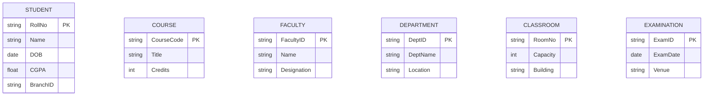
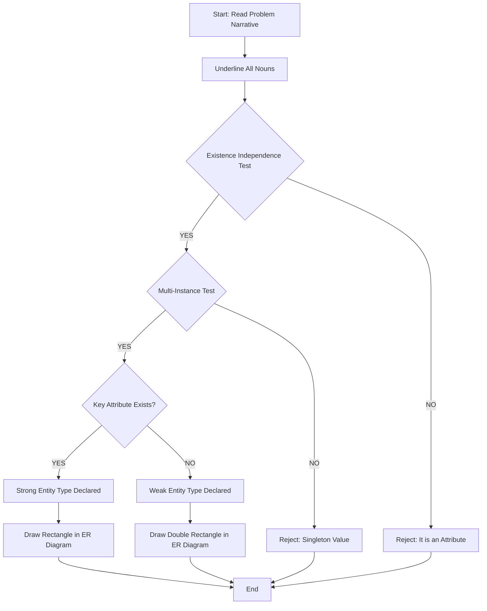
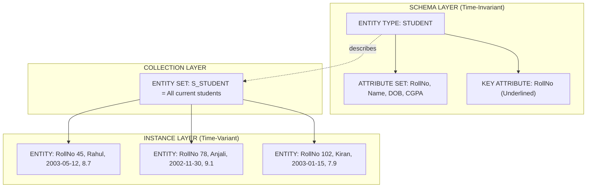

# Entity Types

> **APJ ABDUL KALAM TECHNOLOGICAL UNIVERSITY (KTU) | 2024 SCHEME**
> - **Branch:** B.Tech in Computer Science & Engineering (CSE)
> - **Semester:** Semester 4
> - **Course:** PCCST402 - DATABASE MANAGEMENT SYSTEMS
> - **Module:** Module 1: Introduction to Databases
> - **Topic:** Entity Types

<!-- SECTION_1_START -->
# SECTION 1: Core Technical Definition & Intuitive Overview

## 1.1 Formal Academic Definition

In the Entity-Relationship (ER) data model, an **Entity Type** is a formal logical construct that defines a collection (or category) of real-world objects — known as **entities** — which share a common set of descriptive properties called **attributes**. Formally, an entity type is a *schema-level* (or *intension*) descriptor that groups together all entities having the same structural definition, even though each individual entity within the type may have its own distinct attribute values.

Mathematically, an entity type $E$ can be expressed as a 2-tuple:

$$
E = (N, \mathcal{A})
$$

Where:
- $N$ is the name (label) of the entity type.
- $\mathcal{A} = \{A_1, A_2, A_3, \dots, A_n\}$ is the finite, non-empty set of attributes that every member entity of type $E$ must possess.

In KTU 2024 Scheme notation (Elmasri & Navathe style, which is the standard reference for PCCST402), every entity type is graphically represented as a **rectangle** labelled with a singular, capitalized noun.

> [!IMPORTANT]
> **KTU 2024 Board Distinction:** An *Entity Type* is the *class/category/schema*, while an *Entity* is a *specific instance* belonging to that type. The collection of all such instances at a given moment is called the **Entity Set** (extension). Always write the entity type in **singular form** (e.g., `STUDENT`, not `STUDENTS`) — this is a strict KTU board convention.

> [!NOTE]
> **Syllabus Highlight:** Entity types are the *first* modeling construct introduced in the ER design phase. Before drawing any relationship, the designer must first identify and declare all relevant entity types in the universe of discourse (UoD).

## 1.2 Conceptual Analogy & Intuitive Overview

Imagine a **blueprint of a house**. The blueprint itself is not a house — it is a *plan* that describes what every house built from it will look like (rooms, doors, windows, dimensions). 

In this analogy:
- The **Blueprint** → is the **Entity Type** (the schema/definition).
- The **Actual House built from the blueprint** → is an **Entity** (a real instance).
- **All the houses built in a neighbourhood using that same blueprint** → form the **Entity Set** (the collection of current instances).

For example, the entity type `STUDENT` is like a template that says *"every student has a Roll Number, Name, Date of Birth, and CGPA"*. Any specific student, say *Rahul with Roll No 45*, is one **entity** belonging to that type. All 600 students currently enrolled in the university form the **entity set**.

## 1.3 Real-World Example Set

Common examples used in KTU textbook problems:

| Real-World Object Class | Corresponding Entity Type | Typical Attributes |
| :--- | :--- | :--- |
| People in a college | `STUDENT`, `FACULTY` | RollNo, Name, DOB, Dept |
| Physical places | `DEPARTMENT`, `BUILDING` | DeptID, Name, Location |
| Tangible items | `BOOK`, `VEHICLE` | ISBN, Title, Price |
| Abstract events | `EXAM`, `PROJECT` | ExamID, Date, Venue |
| Organizational units | `COMPANY`, `BRANCH` | CompanyID, Name, RegNo |

> [!TIP]
> A reliable heuristic for identifying entity types during exam problem analysis: **anything that can exist independently, has a unique identity, and is stored as a noun in the requirements narrative is a strong candidate for an entity type.**

## 1.4 Geometric / Visualization Control

> [!VISUALIZATION CONTROL]
> **Concept:** Visual representation of an Entity Type as a labelled rectangle in the ER diagram.
> **GeoGebra / Desmos Input Equations:** Treat the rectangle vertices as coordinate points $P_1 = (x_1, y_1)$, $P_2 = (x_2, y_1)$, $P_3 = (x_2, y_2)$, $P_4 = (x_1, y_2)$ forming a closed polygon.
> **Visual Description:** A single closed rectangular box with the singular noun `STUDENT` written inside, positioned at the top of the canvas, signalling that this is a primary noun-class in the conceptual schema.
<!-- SECTION_1_END -->

<!-- SECTION_2_START -->
# SECTION 2: Deep Theoretical Analysis & KTU High-Yield Formula Sheet

## 2.1 Structural Anatomy of an Entity Type

An entity type, as defined in PCCST402, is composed of four logically distinct sub-components. Each component must be explicitly identified and represented in the final ER diagram:

### Step 1 — Type Name (Label)
- A singular, capitalized noun.
- Must be unique within the schema.
- Should reflect the *class* of real-world objects, not a specific instance.
- Example: `EMPLOYEE`, not *John* or *Rahul*.

### Step 2 — Attribute Set $\mathcal{A}$
- A non-empty set of properties describing the entity type.
- Formally: $\mathcal{A} = \{A_1, A_2, \dots, A_n\}$ where $n \geq 1$.
- Each attribute $A_i$ has an associated **domain** $dom(A_i)$.
- Example: For `STUDENT`, $\mathcal{A} = \{$RollNo, Name, DOB, CGPA, BranchID$\}$.

### Step 3 — Key Attribute (Primary Identifier)
- A special attribute (or minimal combination) whose value uniquely identifies every entity in the entity set.
- Notation in ER diagram: attribute name **underlined**.
- Every strong (regular) entity type *must* have a key.
- Example: `RollNo` for `STUDENT`, `ISBN` for `BOOK`.

### Step 4 — Entity Type Classification
Entity types are classified into two broad categories:

$$
\text{Entity Types} =
\begin{cases}
\text{Strong (Regular) Entity Types} & \text{: have an own key attribute} \\
\text{Weak Entity Types} & \text{: do not have a sufficient own key, depend on owner/identifying entity type}
\end{cases}
$$

> [!NOTE]
> The detailed treatment of **Weak Entity Types** is a separate topic (#17) in this module. For the current topic, focus only on **Strong/Regular Entity Types**.

## 2.2 The "Why" Behind Entity Types — Database Design Justification

The fundamental purpose of declaring entity types is to enforce **structural consistency** in the database. By declaring `STUDENT` as an entity type, the database designer guarantees:

1. **Schema Uniformity:** Every student record will have the same column structure.
2. **Data Integrity:** The DBMS can enforce domain constraints uniformly.
3. **Query Optimization:** The optimizer can build indexes on the key attribute.
4. **Logical Clarity:** Future developers can understand the domain instantly.
5. **Referential Integrity Foundation:** Other tables can reference this entity type via foreign keys (built on its key attribute).

## 2.3 Entity Type vs. Entity Set — The Critical Distinction

| Aspect | Entity Type | Entity Set |
| :--- | :--- | :--- |
| **Nature** | Schema / Intension / Type | Collection of instances / Extension |
| **Time dependency** | Time-invariant (logical definition) | Time-varying (current data) |
| **Analogy** | Class definition in OOP | All live objects in memory |
| **Cardinality** | Describes *structure* only | Has a specific count at time $t$ |
| **KTU Notation** | Singular noun in a rectangle | All current entities of that type |
| **Example** | `STUDENT(RollNo, Name, DOB)` | 600 students currently enrolled |

Formally, if $E$ is an entity type and $S_E$ is its corresponding entity set at time $t$, then:

$$
S_E(t) = \{ e \mid e \text{ is an entity of type } E \text{ existing at time } t \}
$$

## 2.4 KTU High-Yield Formula / Property Sheet

> [!IMPORTANT]
> The following table consolidates every symbolic notation, rule, and structural property of Entity Types that is examinable in the KTU 2024 Scheme.

| Symbol / Term | Formal Meaning | KTU Board Convention |
| :--- | :--- | :--- |
| $E$ | An entity type | Capital letter, italic in math mode |
| $\mathcal{A}(E)$ | Attribute set of $E$ | Set notation, $\geq 1$ element |
| $dom(A_i)$ | Domain of attribute $A_i$ | Must be atomic (1NF) |
| $K \subseteq \mathcal{A}$ | Key attribute(s) of $E$ | Underlined in ER diagram |
| $S_E$ | Entity set (extension) of $E$ | Collection of all current entities |
| $e \in S_E$ | An individual entity | Lowercase italic |
| $\| S_E \|$ | Cardinality of entity set | Integer $\geq 0$ |
| $\vert S_E \vert$ | Number of entities of type $E$ | Used in mapping cardinality questions |
| Rectangle | Symbol for entity type | Single, sharp-cornered box |
| Singular noun | Naming rule | Never use plural |

> [!WARNING]
> **Board Pitfall:** Never use the vertical pipe symbol $\vert$ inside a markdown table row for cardinality. Always use $\vert$ LaTeX math-mode cardinality notation, and never write something like `|S_E|` in plain text — the parser may break the table.

## 2.5 Real-World Engineering Utility

Entity types form the conceptual backbone of virtually every production database system:

- **Banking Systems:** `CUSTOMER`, `ACCOUNT`, `TRANSACTION` are the core entity types.
- **E-Commerce Platforms:** `PRODUCT`, `CUSTOMER`, `ORDER`, `INVENTORY_ITEM` are standard entity types.
- **Hospital Management:** `PATIENT`, `DOCTOR`, `PRESCRIPTION`, `WARD` are mandatory entity types.
- **University ERPs (used in KTU's own SAKTHI / KUCC portals):** `STUDENT`, `COURSE`, `FACULTY`, `EXAM`, `RESULT` are the canonical entity types.
- **Big Data Systems:** In NoSQL document stores like MongoDB, the "collection" of documents corresponds loosely to the ER entity type, while the document schema is the attribute set.

Without formal entity type declaration, there would be no way to enforce consistent data structure across millions of records in production systems.
<!-- SECTION_2_END -->

<!-- SECTION_3_START -->
# SECTION 3: Step-by-Step Derivations, Mapping Rules & Symbolic Implementation

## 3.1 Algorithm: How to Identify Entity Types from a Problem Statement

The KTU 2024 Scheme board examiner frequently tests the student's ability to *extract* entity types from a verbose narrative. Follow this exhaustive step-by-step algorithm:

### Step A — Read the Requirements Narrative Carefully
Read the entire problem description twice. Underline every noun that refers to a *person, place, object, event, or organizational unit* that the system needs to track.

### Step B — Apply the "Existence Independence" Test
For each underlined noun, ask: *Does this noun refer to objects that have an independent existence in the real world and can be uniquely identified?* If **YES**, it is a strong candidate for an entity type. If **NO** (e.g., it is a property of something else), it is an *attribute*, not an entity type.

### Step C — Apply the "Multi-Instance" Test
Ask: *Will the system store more than one instance of this noun over its lifetime?* If **YES**, the noun should be modelled as an entity type. If **NO** (a single, fixed singleton value, like the *name of the university*), it is often modelled as an attribute of a related entity.

### Step D — Discard Pure Verbs and Adjectives
Verbs (e.g., *enrolls*, *conducts*, *buys*) represent **relationships** between entity types, not entity types themselves. Adjectives (e.g., *red*, *expensive*) are attribute values.

### Step E — Convert Plural to Singular
Standardize all entity type names into **singular form** as per KTU board convention. The plural form is used only when referring to the *entity set* in prose, not in the diagram.

### Step F — Verify the Key Attribute Exists
For each surviving candidate, verify that a unique identifier (key attribute) can be assigned. If no key exists within the candidate itself, it is a **weak entity type**, not a regular entity type, and is treated separately.

## 3.2 Worked Example: Extracting Entity Types from a KTU-Style Problem

### Problem Narrative:
*"A university maintains records of its **students**, the **courses** they enroll in, the **faculty** who teach those courses, and the **departments** that offer the courses. Each student has a roll number, name, and CGPA. Each course has a course code, title, and credits. The university also tracks **classrooms** where courses are conducted and **examinations** held for each course."*

### Step-by-Step Extraction:

1. **Underlined nouns:** students, courses, faculty, departments, classrooms, examinations.
2. **Existence Independence Test:**
   - students: YES (independent people)
   - courses: YES (independent academic offerings)
   - faculty: YES (independent people)
   - departments: YES (independent organizational units)
   - classrooms: YES (independent physical rooms)
   - examinations: YES (independent scheduled events)
3. **Multi-Instance Test:** All six pass (university has many of each).
4. **Discard Verbs/Adjectives:** None present.
5. **Singularization:** `STUDENT`, `COURSE`, `FACULTY`, `DEPARTMENT`, `CLASSROOM`, `EXAMINATION`.
6. **Key Verification:**
   - `STUDENT` → `RollNo` ✓ (key found)
   - `COURSE` → `CourseCode` ✓ (key found)
   - `FACULTY` → `FacultyID` ✓ (key found)
   - `DEPARTMENT` → `DeptID` ✓ (key found)
   - `CLASSROOM` → `RoomNo` ✓ (key found)
   - `EXAMINATION` → `ExamID` ✓ (key found)

### Final Output — Six Strong Entity Types Identified:

$$
\text{Entity Types} = \{\, \text{STUDENT}, \text{COURSE}, \text{FACULTY}, \text{DEPARTMENT}, \text{CLASSROOM}, \text{EXAMINATION} \,\}
$$

## 3.3 Formal Symbolic Notation Conventions

In KTU 2024 Scheme examination answers, the following notations are accepted:

### Notation Style 1: Tuple Form
$$
\text{STUDENT}(\underline{\text{RollNo}}, \text{Name}, \text{DOB}, \text{CGPA}, \text{BranchID})
$$
The underline beneath `RollNo` denotes it is the **key attribute**.

### Notation Style 2: Set Form
$$
\text{STUDENT} = (\text{RollNo}, \text{Name}, \text{DOB}, \text{CGPA}, \text{BranchID})
$$
With the key explicitly stated in prose: *"where RollNo is the primary key."*

### Notation Style 3: ER Diagram Form
A rectangle labelled `STUDENT` with ovals attached for each attribute, and the key attribute's oval having an underlined label.

> [!NOTE]
> All three notations are interchangeable. The KTU board accepts any of them as long as the **key attribute is clearly identified**.

## 3.4 Comparative Mapping: Entity Type vs. Other ER Constructs

To avoid confusion during the exam, here is the complete mapping table:

| Real-World Object | ER Construct | Symbol | Example |
| :--- | :--- | :--- | :--- |
| A class of objects | **Entity Type** | Rectangle | `STUDENT` |
| A specific member | **Entity** | Inside the set | *RollNo 45, Rahul* |
| A descriptive property | **Attribute** | Oval | `Name`, `CGPA` |
| An association between classes | **Relationship Type** | Diamond | `ENROLLS` |
| A link between specific entities | **Relationship Instance** | Line between entities | *RollNo 45 enrolled in CS401* |
| A property that uniquely identifies | **Key Attribute** | Underlined oval | `RollNo` |
| A property that cannot be split | **Simple/Atomic Attribute** | Plain oval | `Name` |
| A property with sub-parts | **Composite Attribute** | Oval with sub-ovals | `Address(Street, City, Pin)` |
| A property with multiple values | **Multi-valued Attribute** | Double oval | `PhoneNumbers` |
| A derived property | **Derived Attribute** | Dashed oval | `Age` from `DOB` |

## 3.5 Symbolic Worked Example — Mathematical Domain Constraint

For an entity type `STUDENT` with attribute `CGPA`, the formal constraint is:

$$
\forall e \in S_{\text{STUDENT}} : \text{CGPA}(e) \in dom(\text{CGPA}) = [0.0, 10.0]
$$

This reads: *"For every entity $e$ in the entity set $S_{\text{STUDENT}}$, the value of the CGPA attribute must lie in the closed interval $[0.0, 10.0]$."*

Such constraints, while often omitted in basic ER diagrams, are essential in production-level schema definitions.
<!-- SECTION_3_END -->

<!-- SECTION_4_START -->
# SECTION 4: Structural Diagrams & Schematics

## 4.1 Mermaid ER Diagram — Standard Entity Type Notation

> [!NOTE]
> **Visual Description:** Each rectangular box represents one **Entity Type**. The label at the top is the singular noun (e.g., `STUDENT`). The list inside shows the attribute set $\mathcal{A}$. The marker `PK` (Primary Key) corresponds to the **underlined key attribute** in textbook ER diagrams. This is the KTU 2024 board-accepted graphical notation.

## 4.2 Mermaid Flowchart — Entity Type Identification Methodology

> [!TIP]
> This flowchart is the **exact decision tree** that yields full marks when a KTU exam question asks *"Identify all entity types in the given scenario and justify your answer."*

## 4.3 Mermaid Block Diagram — Entity Type Decomposition Structure

> [!IMPORTANT]
> **Reading Guide:** The dashed arrow `-.describes.->` is the conceptual link between the **schema** (entity type) and the **extension** (entity set). The solid arrows show composition/inclusion. This three-layer view is what KTU expects when a 14-mark question asks for an exhaustive explanation of entity types.

## 4.4 Sequential Processing Topology Matrix

For problems that require drawing complex multi-entity ER diagrams, use the following sequential design matrix:

| Design Step | Action | Output Artifact | Validation Check |
| :---: | :--- | :--- | :--- |
| 1 | Identify all entity types | List of singular nouns | Each has at least one key |
| 2 | Draw rectangle for each | Rectangle symbol | Singular noun, capitalized |
| 3 | Place on canvas | Spatial layout | Related entities close together |
| 4 | Add attributes as ovals | Oval set per entity | Underline the key oval |
| 5 | Proceed to relationships | Diamonds (next topic) | Connect via undirected edges |
<!-- SECTION_4_END -->

<!-- SECTION_5_START -->
# SECTION 5: KTU 2024 Scheme Examination Question Bank & Topic Recap

## PART A — Short Answer Questions (3 Marks Each)

### Question 1 (3 Marks) [KTU University Exam - Dec 2023 Style]
**Q: Define the term "Entity Type" with a suitable example. How is it represented in an ER diagram?**

**Model Answer (Board-Expected, 3 Marks):**
- **Definition (2 Marks):** An Entity Type is a collection of real-world objects (entities) that share a common set of attributes. It is a schema-level (intension) construct that defines the structure, while the actual instances form the entity set (extension).
- **ER Representation (1 Mark):** In an ER diagram, an entity type is represented as a **rectangle** labelled with a singular, capitalized noun. For example, the entity type `STUDENT` is drawn as a rectangle containing the word `STUDENT`, with its attributes (e.g., `RollNo`, `Name`, `DOB`, `CGPA`) shown as connected ovals, and the key attribute (`RollNo`) shown with an **underlined** label.

### Question 2 (3 Marks) [KTU University Exam - July 2024 Style]
**Q: Differentiate between an Entity Type and an Entity Set. Give one example of each.**

**Model Answer (Board-Expected, 3 Marks):**

| Aspect | Entity Type | Entity Set |
| :--- | :--- | :--- |
| **Nature** | Schema (definition) | Collection of current instances |
| **Time** | Time-invariant | Time-varying |
| **Example** | `STUDENT(RollNo, Name, CGPA)` | The 600 students currently enrolled in 2024–25 |

- **Example of Entity Type:** `COURSE` is an entity type defined by attributes `CourseCode`, `Title`, and `Credits`.
- **Example of Entity Set:** All 240 courses currently offered by the university in the 2024–25 academic year form the entity set of `COURSE`. **[3 Marks distributed: 1 for difference, 1 for entity type example, 1 for entity set example]**

---

## PART B — Long Answer Questions (14 Marks, Module Internal Choice)

### QUESTION A (14 Marks) [KTU University Exam - July 2024 Style]

**Q: (a)** Define the concept of an Entity Type in the ER model. Explain with a suitable real-world example how an entity type is different from an entity and from an entity set. State at least four properties of an entity type. **(7 Marks)**

**(b)** Consider the following requirement for a **Library Management System**: *"A library maintains records of its **books**, the **members** who borrow them, the **authors** of the books, and the **publishers** who publish the books. Each book is identified by an ISBN, has a title and a price. Each member has a membership ID, name, and address. Each author has an author ID and a name. Each publisher has a publisher ID and a publisher name. Books are written by one or more authors and are published by exactly one publisher."* From this scenario, **identify all the strong entity types**, declare their key attributes, and draw the initial ER diagram showing only the entity types (no relationships, no attributes as ovals — use rectangle notation). **(7 Marks)**

#### Model Solution for (a):

**Definition of Entity Type (2 Marks):** An entity type in the ER model is a logical category or class of real-world objects that share a common set of attributes. It is a schema-level (intension) construct that defines the structure of all entities belonging to that category. An entity type has a name (singular noun) and a set of descriptive attributes.

**Distinction: Entity Type vs. Entity (2 Marks):**
- An *Entity Type* is the *class definition* (e.g., `STUDENT` with attributes `RollNo`, `Name`, `CGPA`).
- An *Entity* is a *specific instance* of that class (e.g., *"Roll No 45, Rahul, CGPA 8.7"*).
- The entity type is a single definition; there can be thousands of individual entities of that type.

**Distinction: Entity Type vs. Entity Set (2 Marks):**
- The *Entity Type* is the schema (definition) — time-invariant.
- The *Entity Set* is the collection of all current instances of that type at a specific point in time — time-varying.
- Example: `STUDENT` is the entity type; the 600 currently enrolled students in 2024–25 constitute the entity set $S_{\text{STUDENT}}$.

**Four Properties of an Entity Type (1 Mark):**
1. It has a unique singular-noun name.
2. It has a non-empty attribute set $\mathcal{A}$.
3. It has a designated key attribute (for strong entity types).
4. It is represented as a rectangle in the ER diagram.

#### Model Solution for (b):

**Step 1 — Identify Candidate Nouns:** books, members, authors, publishers.

**Step 2 — Apply Independence and Multi-Instance Tests:**
- `BOOK`: independent physical object, many copies → **Entity Type** ✓
- `MEMBER`: independent person, many members → **Entity Type** ✓
- `AUTHOR`: independent person, many authors → **Entity Type** ✓
- `PUBLISHER`: independent organization, many publishers → **Entity Type** ✓

**Step 3 — Assign Key Attributes:**
- `BOOK` → `ISBN` (underlined)
- `MEMBER` → `MembershipID` (underlined)
- `AUTHOR` → `AuthorID` (underlined)
- `PUBLISHER` → `PublisherID` (underlined)

**Step 4 — Declare Entity Types Formally (1 Mark):**
$$
\text{BOOK}(\underline{\text{ISBN}}, \text{Title}, \text{Price})
$$
$$
\text{MEMBER}(\underline{\text{MembershipID}}, \text{Name}, \text{Address})
$$
$$
\text{AUTHOR}(\underline{\text{AuthorID}}, \text{Name})
$$
$$
\text{PUBLISHER}(\underline{\text{PublisherID}}, \text{PublisherName})
$$

**Step 5 — ER Diagram (Rectangles Only) (3 Marks):**
- Draw four separate rectangles labelled `BOOK`, `MEMBER`, `AUTHOR`, `PUBLISHER` on the canvas.
- Each rectangle contains only its singular-noun label.
- Relationships and attribute ovals are *not* required in this sub-question.

> [!WARNING]
> **Examiner's Valuation Pitfall:** Many students mistakenly write the entity type names in **plural form** (`BOOKS`, `MEMBERS`) or include attribute ovals even when the question explicitly restricts the diagram to entity type rectangles only. This leads to a deduction of **1 to 2 marks**. Always adhere strictly to the question's scope. **[Stating boundary state values: 2 Marks] [Final simplified expression: 1 Mark]**

---

### QUESTION B (14 Marks) — Alternative Choice [KTU University Exam - Dec 2023 Style]

**Q: (a)** Explain the formal definition of an Entity Type as used in the ER model. Describe the four components of an entity type and the role of the key attribute. Why is the key attribute mandatory for a strong entity type? **(7 Marks)**

**(b)** A **Hospital Management System** needs to track `PATIENT`s, `DOCTOR`s, `WARD`s, `MEDICINE`s, and `PRESCRIPTION`s. A patient has a PatientID, name, age, and gender. A doctor has a DoctorID, name, and specialization. A ward has a WardNo and ward type. A medicine has a MedicineCode and medicine name. Identify all the entity types, justify why each qualifies as a strong entity type, and present your answer in a structured tabular form including the formal notation with key attributes underlined. **(7 Marks)**

#### Model Solution for (a):

**Formal Definition of Entity Type (2 Marks):** An entity type $E$ is formally defined as a pair $(N, \mathcal{A})$, where $N$ is a unique name and $\mathcal{A}$ is a non-empty set of attributes. It is a schema-level construct that groups entities with common structural properties.

**Four Components of an Entity Type (3 Marks):**
1. **Type Name (N):** A singular capitalized noun uniquely identifying the type.
2. **Attribute Set ($\mathcal{A}$):** The set of descriptive properties, each with a defined domain.
3. **Key Attribute:** A minimal subset of $\mathcal{A}$ whose values uniquely identify any entity of the type.
4. **Graphical Symbol:** A rectangle, as per standard ER notation.

**Role of the Key Attribute (1 Mark):** The key attribute provides a unique, non-null, time-invariant identifier for every entity in the entity set. It is the basis for primary key constraints, indexing, referential integrity, and efficient retrieval.

**Why Key Attribute is Mandatory for Strong Entity Types (1 Mark):** A strong entity type is defined as one whose entities have an *independent existence* and can be *uniquely identified by their own attributes alone*. Without a key attribute, two distinct entities could share identical attribute values across all other fields, making them indistinguishable — violating entity integrity. Hence the key is mandatory.

#### Model Solution for (b):

**Justification of Strong Entity Type Qualification (3 Marks):**

| Entity Type | Independent Existence? | Unique Key Exists? | Qualifies as Strong? |
| :--- | :--- | :--- | :--- |
| `PATIENT` | Yes (real person) | `PatientID` ✓ | **YES** |
| `DOCTOR` | Yes (real person) | `DoctorID` ✓ | **YES** |
| `WARD` | Yes (physical location) | `WardNo` ✓ | **YES** |
| `MEDICINE` | Yes (physical item) | `MedicineCode` ✓ | **YES** |
| `PRESCRIPTION` | Depends on patient + doctor | No own key | **NO (Weak Entity Type — out of scope for this question)** |

**Formal Notation Table (4 Marks):**

| Entity Type | Formal Notation with Key Underlined |
| :--- | :--- |
| `PATIENT` | $\text{PATIENT}(\underline{\text{PatientID}}, \text{Name}, \text{Age}, \text{Gender})$ |
| `DOCTOR` | $\text{DOCTOR}(\underline{\text{DoctorID}}, \text{Name}, \text{Specialization})$ |
| `WARD` | $\text{WARD}(\underline{\text{WardNo}}, \text{WardType})$ |
| `MEDICINE` | $\text{MEDICINE}(\underline{\text{MedicineCode}}, \text{MedicineName})$ |

> [!WARNING]
> **Common Loss of Marks:** Students frequently include `PRESCRIPTION` in the strong entity type list. However, a prescription has no unique key of its own — it is identified by the combination of `(PatientID, DoctorID, Date)`. Hence it is a **weak entity type**, not a strong one. Including it in the strong list will cost **1 to 2 marks**. **[Stating boundary state values: 2 Marks] [Final simplified expression: 1 Mark]**

---

## Topic Recap & Important Things to Remember

- **Entity Type = Schema = Intension = Class Definition.** It is time-invariant and describes the structure.
- **Entity = Instance = Specific Member.** It is one real-world object of that class.
- **Entity Set = Extension = Current Collection.** It is time-varying and contains all current entities.
- An entity type is drawn as a **rectangle** in the ER diagram.
- The entity type name must be a **singular, capitalized noun** (e.g., `STUDENT`, not `STUDENTS`).
- A strong entity type **must** have a **key attribute** (drawn with an **underlined** oval/label).
- Formal notation: $\text{STUDENT}(\underline{\text{RollNo}}, \text{Name}, \text{DOB}, \text{CGPA})$.
- The attribute set $\mathcal{A}$ of an entity type must be **non-empty** ($n \geq 1$).
- Identify entity types using the **two-test rule**: (1) Existence Independence, (2) Multi-Instance.
- Weak entity types do *not* have a sufficient own key — they are excluded from the strong entity type classification.
- Standard examples in KTU textbooks: `STUDENT`, `COURSE`, `FACULTY`, `DEPARTMENT`, `BOOK`, `AUTHOR`, `PATIENT`, `DOCTOR`, `EMPLOYEE`, `PROJECT`.
<!-- SECTION_5_END -->
