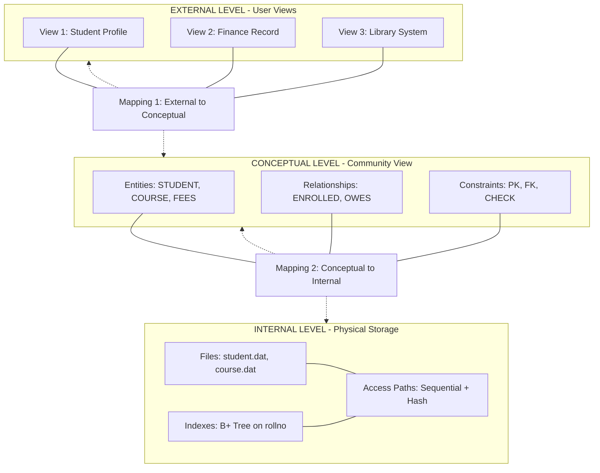
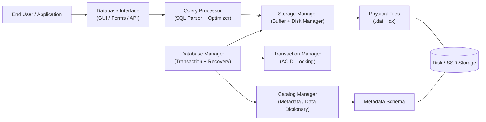
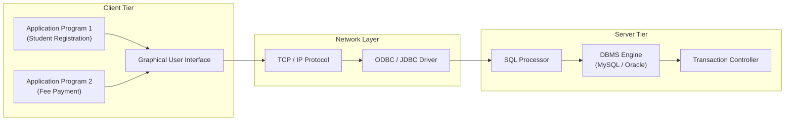
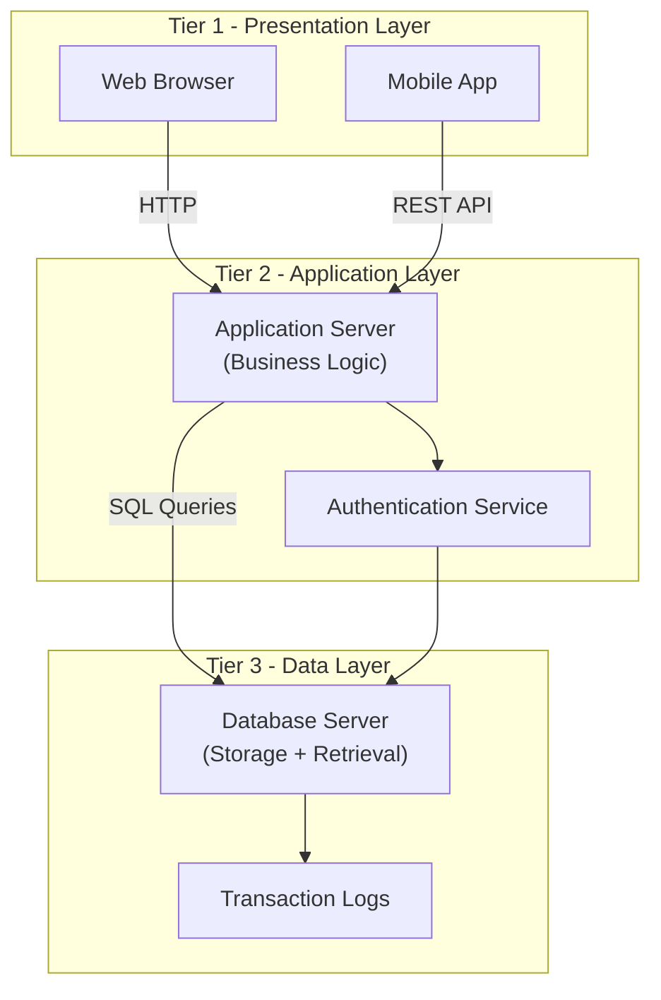
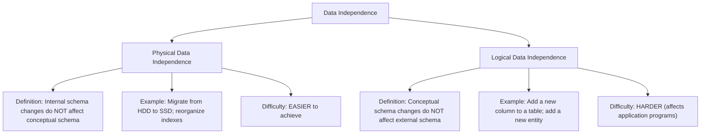
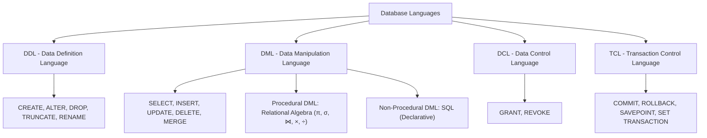
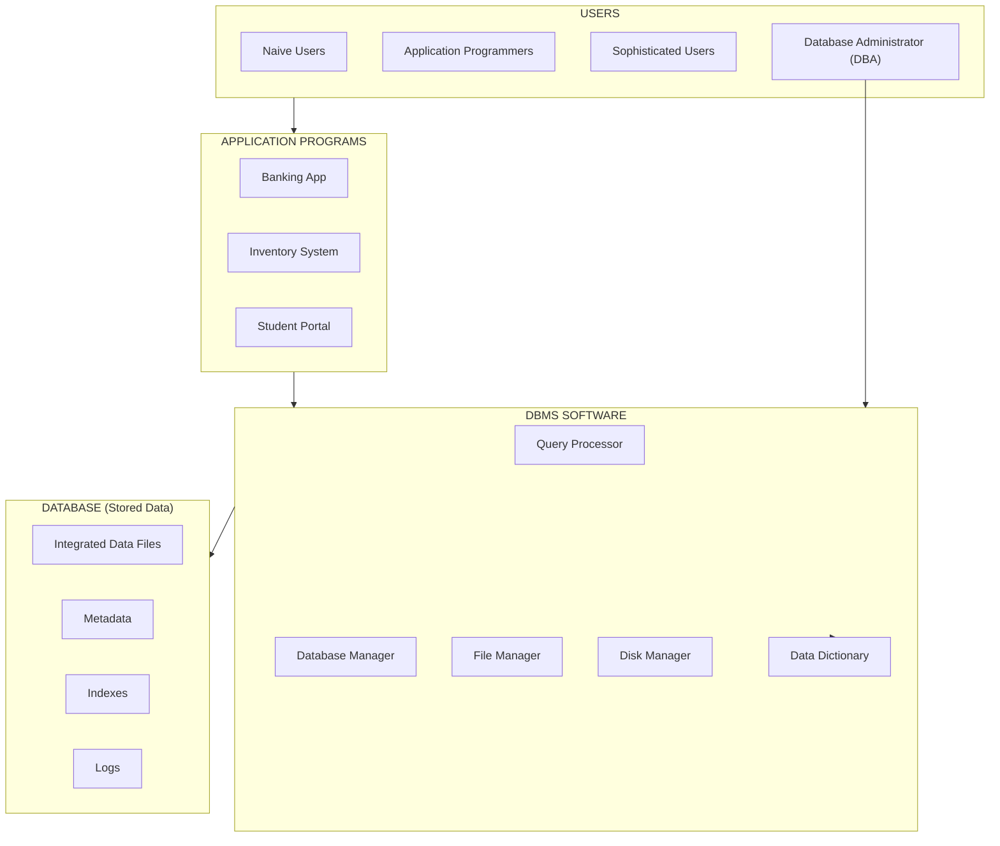

# Introduction to Databases :- Database System Concepts and Architecture- Data Models, Schemas and Instances, Three-Schema Architecture and Data Independence, Database Languages and Interfaces, Centralized and Client/Server Architectures for DBMSs.

<!-- SECTION_1_START -->
# 1. Core Technical Definition & Intuitive Overview

## 1.1 Database — Formal Definition

A **Database** is a logically coherent, persistent, and organized collection of related data that is managed and manipulated by a Database Management System (DBMS) to satisfy the information requirements of an organization. According to the KTU 2024 syllabus (PCCST402 — Module 1), a database represents a *semantic* model of an enterprise, capturing not only raw data but also the inherent *meaning* and *interrelationships* of that data.

**Database Management System (DBMS)** is the collection of software programs that enables the creation, maintenance, manipulation, and retrieval of a database while ensuring **ACID** properties (**A**tomicity, **C**onsistency, **I**solation, **D**urability).

**Database System** = Database + DBMS Software + Application Programs + Users + Administrators.

> [!IMPORTANT]
> **KTU 2024 Board Definition (verbatim style):**
> "A database is a self-describing collection of integrated records along with the set of programs used to define, create, maintain, and manipulate the data."
> — *Silberschatz, Korth & Sudharshan (the prescribed text for PCCST402)*

## 1.2 Conceptual Analogy — The "Smart Filing Cabinet"

Imagine a **hospital records room** before computers:
- Patient files are scattered across multiple cabinets, written by hand, with no central index.
- Finding a single patient's history takes hours.
- Two doctors may modify the same file simultaneously, overwriting each other.
- A fire destroys everything with no backup.

A **DBMS transforms** this room into a **smart, indexed, secure, and reproducible archive**:
- **Files = Tables (Relations)**
- **Cabinets = Databases**
- **File clerk = DBMS Engine**
- **Index cards = Catalog/Metadata**
- **Backup vault = Transaction Log**

> [!NOTE]
> The **metadata** (data about data) is what makes a database "self-describing" — this is the single most distinguishing feature vs. a traditional file system.

## 1.3 Database System Concepts and Terminology

| Term | Meaning |
|---|---|
| **Data** | Raw, unprocessed facts (e.g., `25`, `"Rahul"`) |
| **Information** | Processed data with meaning (e.g., "Rahul is 25 years old") |
| **Metadata** | Data that describes the structure of data (schema definitions) |
| **Schema** | The *type/structure* of the database (logical blueprint) |
| **Instance** | The *actual data* stored at a particular moment (snapshot) |
| **Constraint** | A rule enforcing data validity (e.g., `age > 0`) |
| **Transaction** | A logical unit of work (e.g., fund transfer: debit + credit) |

> [!NOTE]
> **Schema vs Instance — The KTU Examiner's Favourite:**
> *Schema* = The *intension* (structure) — like a class definition in OOP.
> *Instance* = The *extension* (data at time $t$) — like objects of that class.

## 1.4 Data Models — The Conceptual Layer

A **Data Model** is a set of concepts that can be used to describe the structure of a database, the operations for manipulating the data, and a set of integrity rules.

**Three Classical Categories (per KTU 2024 Module 1):**

1. **Conceptual (High-Level) Data Model** — Close to user perception. E.g., **Entity-Relationship (ER) Model**.
2. **Logical (Representational) Data Model** — Intermediate. E.g., **Relational Model**, **Network Model**, **Hierarchical Model**.
3. **Physical (Low-Level) Data Model** — Describes physical storage. E.g., **Unifying Model**, **Storage Model** with file structures, indexes, and access paths.

> [!VISUALIZATION CONTROL]
> **Concept:** Hierarchy of Data Models and their abstraction levels
> **Conceptual Input Equations:**
> * `E = Entity Set (e.g., STUDENT)`
> * `R = Relationship (e.g., ENROLLED_IN)`
> * `T = Table (Relational mapping: T = E × A)` where $A$ is the attribute set
> **Visual Description:** Plot three horizontal bands on the Y-axis: $Y = 3$ (Conceptual — user view), $Y = 2$ (Logical — community view), $Y = 1$ (Physical — internal view). Observe that abstraction *decreases* as you descend.

## 1.5 Three-Schema Architecture (ANSI/SPARC)

Proposed by the **ANSI/SPARC** committee in 1975, this architecture separates the user application from the physical database into **three levels** of abstraction:

| Level | Name | Audience | Description |
|---|---|---|---|
| **1 (Top)** | **External / View Schema** | End User | Multiple user-specific views; each sees only relevant data |
| **2 (Middle)** | **Conceptual / Logical Schema** | DBA / Designer | Unified community view of the *entire* database; entities, relationships, constraints, security |
| **3 (Bottom)** | **Internal Schema** | System / OS | Physical storage structure, file organization, indexes, access paths |

**Correspondence (Mapping):**
- **External / Conceptual mapping** — Maps external views to the conceptual schema.
- **Conceptual / Internal mapping** — Maps conceptual schema to physical storage.

## 1.6 Data Independence

**Data Independence** is the capacity to change the schema at one level of the database system without having to change the schema at the next higher level. KTU 2024 explicitly tests this as a two-part concept.

1. **Logical Data Independence** — Ability to modify the *conceptual schema* (add new entities, attributes, relationships) without affecting existing external schemas or application programs.
2. **Physical Data Independence** — Ability to modify the *internal schema* (change storage devices, file organization, indexing) without affecting the conceptual or external schemas.

> [!IMPORTANT]
> **Physical Data Independence is *easier* to achieve than Logical Data Independence** — this is a classic KTU board question.
> *Reason:* Application programs depend heavily on the logical structure, but rarely on the physical storage strategy.

## 1.7 Database Languages and Interfaces

Per KTU 2024 PCCST402 Module 1, database languages are classified into:

| Category | Purpose | Examples |
|---|---|---|
| **DDL** (Data Definition Language) | Define/modify schema | `CREATE`, `ALTER`, `DROP`, `TRUNCATE` |
| **DML** (Data Manipulation Language) | Manipulate data | `SELECT`, `INSERT`, `UPDATE`, `DELETE` |
| **DCL** (Data Control Language) | Permissions/security | `GRANT`, `REVOKE` |
| **TCL** (Transaction Control Language) | Transaction management | `COMMIT`, `ROLLBACK`, `SAVEPOINT` |
| **DQL** (Data Query Language) | Querying (subset of DML) | `SELECT` |
| **VCL** (View Control Language) | View management | `CREATE VIEW`, `DROP VIEW` |

**Types of DML:**
- **Procedural DML** — Specifies *what* data is needed AND *how* to get it (e.g., Relational Algebra expressions).
- **Non-Procedural (Declarative) DML** — Specifies *what* data is needed, not how (e.g., SQL `SELECT`).

**Database Interfaces** include:
- **Menu-Based Interfaces** — GUI forms (most common today).
- **Forms-Based Interfaces** — Custom-designed input forms.
- **Graphical User Interfaces (GUIs)** — Click-and-drag schema design (e.g., MySQL Workbench).
- **Natural Language Interfaces** — Free-text queries (NLP).
- **Speech Input/Output** — Voice-based queries.
- **Web-Based Interfaces** — Browser-based dashboards.
- **APIs (Application Programming Interfaces)** — Programmatic access (JDBC, ODBC, Python DB-API).

## 1.8 Centralized vs Client/Server DBMS Architectures

| Aspect | Centralized DBMS | Client/Server DBMS |
|---|---|---|
| **Components** | Single machine runs DBMS + application + presentation | Front-end (client) + Back-end (server) |
| **Processing** | All layers (Presentation, Logic, Data) at one site | Logic split: Client = Presentation; Server = Data + Logic |
| **Examples** | Mainframe-based legacy DBMSs | Oracle, MySQL, PostgreSQL, MongoDB |
| **Scalability** | Limited (vertical only) | High (horizontal — add more clients) |
| **Network Load** | Minimal | Higher (queries/results traverse network) |
| **Concurrency** | Single-user or limited | Multi-user, concurrent transactions |

**DBMS Architecture Classifications (per KTU 2024):**
1. **Centralized Architecture** — All components on a single machine.
2. **Client/Server Architecture** — Split between client (tier 1) and server (tier 2).
3. **Parallel Architecture** — Multiple CPUs/disks cooperating (shared memory, shared disk, shared nothing).
4. **Distributed Architecture** — Geographically separated sites connected via network.
5. **Cloud / Multi-Tenant Architecture** — DBMS hosted on cloud (AWS RDS, Azure SQL, Google Cloud SQL).
6. **Heterogeneous Architecture** — Federated DBMS integrating multiple autonomous DBMSs.

> [!NOTE]
> **Two-Tier vs Three-Tier Client/Server:**
> - **Two-Tier:** Client ⇄ Database Server directly (e.g., desktop app talking to MySQL).
> - **Three-Tier:** Client ⇄ Application Server ⇄ Database Server (e.g., web browser → Node.js → PostgreSQL).
> This distinction is frequently tested in KTU ESE.

<!-- SECTION_1_END -->

<!-- SECTION_2_START -->
# 2. Deep Theoretical Analysis & KTU High-Yield Formula Sheet

## 2.1 Database System — The Layered Anatomy

A complete database environment (per KTU 2024 Module 1) is composed of **five distinct components**:

1. **Hardware** — Physical storage media (SSDs, HDDs), processors, memory.
2. **Software** — DBMS engine, OS, network protocols, application programs.
3. **Data** — Operational data + metadata + indexes + data dictionary entries.
4. **Procedures** — Instructions and rules governing DBMS usage and design.
5. **People** — Database Administrator (DBA), System Analyst, Programmers, End Users.

### 2.1.1 Database Users (Hierarchical)

```
┌─────────────────────────────────────────────────┐
│  Naïve Users      → Unaware of DBMS; use apps   │
│  Online Users     → Use forms/web interfaces    │
│  Sophisticated    → Write SQL / DML queries      │
│  Specialized      → CAD/CAM/Expert system users  │
│  Application      → Write programs using DML     │
│   Programmers                                     │
│  Database          → Overall control & design    │
│   Administrator                                   │
│  System Analyst    → Define requirements         │
└─────────────────────────────────────────────────┘
```

## 2.2 Data Models — Detailed Taxonomy

### 2.2.1 Hierarchical Model
- Data organized as a **tree structure** with parent–child relationships.
- Each child has *exactly one* parent.
- **Example:** Windows Registry, file systems.
- **Limitation:** Cannot represent M:N relationships naturally.

### 2.2.2 Network Model
- Data organized as a **graph** (generalization of hierarchical).
- Allows **M:N relationships** via *sets* (owner–member pairs).
- **Example:** IDS (Integrated Data Store), IDMS.

### 2.2.3 Relational Model (E.F. Codd, 1970)
- Data represented as a **set of relations** (tables).
- Each relation is a set of *tuples* with the same *attributes*.
- **Foundations:** Set theory + First-Order Predicate Logic.
- **Example:** Oracle, MySQL, PostgreSQL, SQL Server.

> [!IMPORTANT]
> **Codd's 12 Rules** for a *truly relational* DBMS are KTU-favourite for short-answer questions. At minimum, remember **Rule 0 (Foundation Rule)** and **Rule 1 (Information Rule)**.

### 2.2.4 Object-Oriented Model
- Data stored as **objects** with attributes and methods.
- Supports inheritance, encapsulation.
- **Example:** ObjectDB, db4o.

### 2.2.5 Object-Relational Model (Hybrid)
- Extends relational model with object features (user-defined types, methods, inheritance).
- **Example:** PostgreSQL, Oracle (with OOP extensions).

### 2.2.6 NoSQL / Document / Key-Value Models
- **Document:** MongoDB, CouchDB (JSON-like BSON).
- **Key-Value:** Redis, DynamoDB.
- **Column-Family:** Cassandra, HBase.
- **Graph:** Neo4j, JanusGraph.

## 2.3 Three-Schema Architecture — Deep Dive

The **ANSI/SPARC** architecture defines a clear separation of concerns:

**Level 1 — External Schema (View Level)**
- Multiple user views; each tailored to specific needs.
- Hides sensitive attributes.
- Example: A *Student* view showing only `name, rollno, course`; a *Finance* view showing only `rollno, fees_paid, balance`.

**Level 2 — Conceptual Schema (Logical Level)**
- Represents the **entire database** in a unified community view.
- Defines entities, attributes, relationships, integrity constraints, security rules.
- Independent of physical storage considerations.
- This is what the **DBA** primarily designs.

**Level 3 — Internal Schema (Physical Level)**
- Describes physical storage: file organization, indexes (B+ Tree, Hash), compression, encryption.
- Includes access paths, record placement, clustering.

### 2.3.1 Mappings Between Levels

$$\text{External} \xleftrightarrow{\text{Mapping}_1} \text{Conceptual} \xleftrightarrow{\text{Mapping}_2} \text{Internal}$$

**Mapping 1 (External/Conceptual):** Translates user requests from the external view to the conceptual schema. It decides which conceptual entities/attributes are visible to which user.

**Mapping 2 (Conceptual/Internal):** Translates conceptual-level requests to the physical storage level. It maps logical records to their physical locations, pages, and files.

> [!NOTE]
> The two mappings are what *enforce* data independence. If the physical schema changes, only Mapping 2 must be updated — the external schemas remain untouched.

## 2.4 Data Independence — Mathematical Perspective

Although not always expressed mathematically, we can formalize:

Let $S_{\text{ext}}$, $S_{\text{con}}$, $S_{\text{int}}$ denote the external, conceptual, and internal schemas respectively.

**Logical Data Independence:**
$$S_{\text{con}}^{(1)} \rightarrow S_{\text{con}}^{(2)} \quad \text{requires no change in} \quad S_{\text{ext}} \cup \text{AppPrograms}$$

**Physical Data Independence:**
$$S_{\text{int}}^{(1)} \rightarrow S_{\text{int}}^{(2)} \quad \text{requires no change in} \quad S_{\text{con}}$$

**Logical Independence is harder** because application programs are tightly coupled to the logical structure of the data. The dependency chain is:

$$S_{\text{ext}} \rightarrow \text{App} \rightarrow S_{\text{con}} \rightarrow S_{\text{int}}$$

Disturbing the *middle* node ($S_{\text{con}}$) propagates upward; disturbing the *bottom* node ($S_{\text{int}}$) does not propagate upward.

## 2.5 KTU High-Yield Cheat Sheet

> [!IMPORTANT]
> This table is the consolidated formula/fact sheet for Module 1. Memorize the **bold** items — they are the most commonly tested points.

| **Concept** | **Key Definition / Formula** | **Mark-Worthy Fact** |
|---|---|---|
| **Database** | Self-describing collection of integrated records + software | Includes **metadata** |
| **DBMS** | Software to define/create/maintain/manipulate database | Examples: Oracle, MySQL |
| **DBS** | DB + DBMS + Apps + Users + Admins | Full ecosystem |
| **Schema** | Type/structure (intension) | Changes **infrequently** |
| **Instance** | Data at a moment (extension) | Changes **frequently** |
| **Data Model** | Set of concepts to describe structure + operations + constraints | Conceptual/Logical/Physical |
| **ER Model** | High-level conceptual model (Entity, Attribute, Relationship) | Proposed by **Chen (1976)** |
| **Relational Model** | Based on tables/relations | Proposed by **E.F. Codd (1970)** |
| **Three-Schema** | External / Conceptual / Internal | Proposed by **ANSI/SPARC (1975)** |
| **Logical Independence** | Conceptual schema changes don't affect external | **Harder** to achieve |
| **Physical Independence** | Internal schema changes don't affect conceptual | **Easier** to achieve |
| **DDL** | Data Definition Language | `CREATE`, `ALTER`, `DROP` |
| **DML** | Data Manipulation Language | `SELECT`, `INSERT`, `UPDATE`, `DELETE` |
| **DCL** | Data Control Language | `GRANT`, `REVOKE` |
| **TCL** | Transaction Control Language | `COMMIT`, `ROLLBACK` |
| **Procedural DML** | Specifies *how* | Relational Algebra |
| **Non-Procedural DML** | Specifies *what* | SQL |
| **Centralized DBMS** | All components on one machine | Mainframe legacy |
| **Client/Server DBMS** | Front-end client + back-end server | Modern default |
| **Two-Tier** | Client ⇄ DB Server | Direct connection |
| **Three-Tier** | Client ⇄ App Server ⇄ DB Server | Web applications |
| **Parallel DBMS** | Multiple CPUs/disks cooperating | Shared memory/disk/nothing |
| **Distributed DBMS** | Geographically separated | Homogeneous/Heterogeneous |
| **DBA** | Database Administrator | Central authority |
| **ACID** | Atomicity, Consistency, Isolation, Durability | **Transaction guarantees** |

## 2.6 Real-World Engineering Utility

1. **Banking Systems** — Every ATM transaction, NEFT, UPI runs on a centralized RDBMS with strict ACID compliance.
2. **E-Commerce (Amazon, Flipkart)** — Distributed NoSQL + RDBMS hybrid for catalog browsing (read-heavy) and order processing (write-heavy).
3. **Healthcare (HL7 FHIR standards)** — Federated DBMS integrating hospital, lab, and pharmacy data.
4. **Aviation Reservation** — Client/Server with massive parallel processing for real-time seat allocation.
5. **Social Networks (Meta, X)** — Sharded NoSQL with multi-region replication for global low-latency access.
6. **IoT & Time-Series** — InfluxDB, TimescaleDB (specialized for sensor data streams).

> [!NOTE]
> In a typical KTU viva or interview, the examiner will ask: *"Give two examples where physical data independence is exploited in industry."* Strong answer: *"Cloud providers migrate customer data to new storage tiers (e.g., HDD → SSD → NVMe) without any application rewrite — this is physical data independence in production."*

<!-- SECTION_2_END -->

<!-- SECTION_3_START -->
# 3. Step-by-Step Derivations & Code/Symbolic Implementation

## 3.1 Conceptual Derivation — From File System to DBMS

This derivation traces the **evolutionary logic** of why DBMS exists. KTU 2024 may ask this as a 14-mark application question.

### Step 1: Identify limitations of File Systems

Traditional file processing has these properties:
- **Data Redundancy** — Same data stored in multiple files.
- **Data Inconsistency** — Updates to one copy are not reflected in others.
- **Lack of Data Integration** — Files are owned by different departments, no unified view.
- **No Data Sharing** — Programs tightly coupled to file formats.
- **No Security Enforcement** — Access control is ad-hoc at the OS level.
- **No Atomicity** — Partial updates may leave data in inconsistent state.

### Step 2: Identify the cost of redundancy (Quantitative)

Let $n$ be the number of departments, each maintaining its own copy of an employee's record. Suppose update cost is $C_u$ and inconsistency probability per copy is $p$.

$$\text{Expected Inconsistency Cost} = n \cdot C_u \cdot p$$

If we centralize into a single DBMS with $n = 1$ logical copy (but physically replicated), then:

$$\text{Centralized Cost} = 1 \cdot C_u \cdot p_{\text{DBMS}}$$

where $p_{\text{DBMS}} \ll p$ due to transactional integrity.

### Step 3: Show the DBMS solution matrix

| Problem (File System) | DBMS Solution |
|---|---|
| Redundancy | Data normalization (1NF, 2NF, 3NF, BCNF) |
| Inconsistency | Transactions with **ACID** |
| No integration | Three-schema architecture (Conceptual layer) |
| No sharing | Client/Server with concurrent access |
| Weak security | DCL (`GRANT`, `REVOKE`), roles, views |
| No atomicity | Transaction boundaries (`COMMIT`, `ROLLBACK`) |

## 3.2 Symbolic Derivation — Three-Schema Mapping Functions

Let us define formal mapping functions between schema levels.

### Step 1: Define the schemas as sets

$$S_{\text{ext}} = \{V_1, V_2, \dots, V_n\}$$

$$S_{\text{con}} = \{E_1, E_2, \dots, E_m\}$$

where $V_i$ is an external view and $E_j$ is a conceptual entity.

$$S_{\text{int}} = \{F_1, F_2, \dots, F_k\}$$

where $F_\ell$ is an internal storage file.

### Step 2: Define the mappings

$$\Phi_1 : S_{\text{ext}} \rightarrow S_{\text{con}}$$

$$\Phi_2 : S_{\text{con}} \rightarrow S_{\text{int}}$$

### Step 3: Define the composition for query resolution

For a user query $Q$ issued against view $V_i$, the system must:

$$Q \xrightarrow{\Phi_1} Q' \xrightarrow{\Phi_2} Q'' \rightarrow \text{Physical Access}$$

$$\text{where} \quad Q' = \Phi_1(Q, V_i), \quad Q'' = \Phi_2(Q', E_j)$$

### Step 4: Show the impact of data independence

If $S_{\text{int}}$ changes to $S_{\text{int}}'$, we need only to update $\Phi_2$:

$$\Phi_2' = \text{modified mapping}$$

All $Q, V_i, \Phi_1, S_{\text{con}}$ remain unchanged. This is **Physical Data Independence**.

If $S_{\text{con}}$ changes to $S_{\text{con}}'$ (e.g., add a new entity), we must update $\Phi_1$ for every affected $V_i$:

$$\Phi_1' = \text{modified mapping}$$

This is harder because every application program referencing the changed part must be reviewed. This is **Logical Data Independence**.

## 3.3 SQL Implementation — Database Languages in Action

This Python program simulates a complete DBMS interaction using the **SQLite** engine to demonstrate DDL, DML, DCL, and TCL operations in code form.

```python
import sqlite3
import logging
from typing import List, Tuple, Optional

# Configure logging
logging.basicConfig(
    level=logging.INFO,
    format="%(asctime)s | %(levelname)s | %(message)s"
)
logger = logging.getLogger("DBMS_Demo")

def get_connection(db_path: str) -> sqlite3.Connection:
    """
    Establishes a connection to the SQLite database.
    Returns a connection object with row factory enabled.
    """
    try:
        conn = sqlite3.connect(db_path)
        conn.row_factory = sqlite3.Row
        logger.info(f"Connected to database at {db_path}")
        return conn
    except sqlite3.Error as e:
        logger.error(f"Connection failed: {e}")
        raise

def create_schema(conn: sqlite3.Connection) -> None:
    """
    DDL Operation: Create the STUDENT table with constraints.
    """
    ddl_query: str = """
    CREATE TABLE IF NOT EXISTS STUDENT (
        rollno   INTEGER PRIMARY KEY CHECK (rollno > 0),
        name     TEXT    NOT NULL,
        age      INTEGER CHECK (age >= 17 AND age <= 60),
        dept     TEXT    NOT NULL DEFAULT 'CSE',
        fees     REAL    CHECK (fees >= 0)
    );
    """
    try:
        conn.execute(ddl_query)
        conn.commit()
        logger.info("DDL executed: STUDENT table created.")
    except sqlite3.IntegrityError as e:
        logger.error(f"Constraint violation: {e}")
        raise

def insert_student(
    conn: sqlite3.Connection,
    rollno: int,
    name: str,
    age: int,
    dept: str,
    fees: float
) -> None:
    """
    DML Operation: Insert a new student record.
    Uses parameterized query to prevent SQL injection.
    """
    dml_query: str = """
    INSERT INTO STUDENT (rollno, name, age, dept, fees)
    VALUES (?, ?, ?, ?, ?);
    """
    try:
        if age < 17 or age > 60:
            raise ValueError("Age out of permitted range [17, 60].")
        if fees < 0:
            raise ValueError("Fees cannot be negative.")
        conn.execute(dml_query, (rollno, name, age, dept, fees))
        conn.commit()  # TCL: Commit the transaction
        logger.info(f"Inserted student {rollno}: {name}")
    except (sqlite3.IntegrityError, ValueError) as e:
        conn.rollback()  # TCL: Rollback on error
        logger.error(f"Insert failed, transaction rolled back: {e}")
        raise

def query_cse_students(conn: sqlite3.Connection) -> List[Tuple]:
    """
    DQL Operation: Retrieve all CSE students older than 20.
    """
    dql_query: str = """
    SELECT rollno, name, age, fees
    FROM STUDENT
    WHERE dept = 'CSE' AND age > 20
    ORDER BY rollno ASC;
    """
    try:
        cursor = conn.execute(dql_query)
        results = [tuple(row) for row in cursor.fetchall()]
        logger.info(f"Retrieved {len(results)} CSE students.")
        return results
    except sqlite3.Error as e:
        logger.error(f"Query failed: {e}")
        raise

def update_fees(conn: sqlite3.Connection, rollno: int, new_fees: float) -> None:
    """
    DML Operation: Update fees for a specific student with SAVEPOINT.
    """
    if new_fees < 0:
        raise ValueError("New fees cannot be negative.")
    try:
        conn.execute("SAVEPOINT sp_update;")
        conn.execute(
            "UPDATE STUDENT SET fees = ? WHERE rollno = ?;",
            (new_fees, rollno)
        )
        conn.execute("RELEASE SAVEPOINT sp_update;")
        conn.commit()
        logger.info(f"Updated fees for rollno={rollno} to {new_fees}.")
    except sqlite3.Error as e:
        conn.execute("ROLLBACK TO SAVEPOINT sp_update;")
        logger.error(f"Update failed: {e}")
        raise

def apply_security_policy(conn: sqlite3.Connection) -> None:
    """
    DCL Operation (simulated for SQLite): create a view as
    a security mechanism (read-only access to non-sensitive fields).
    """
    view_ddl: str = """
    CREATE VIEW IF NOT EXISTS STUDENT_PUBLIC AS
    SELECT rollno, name, dept
    FROM STUDENT;
    """
    try:
        conn.execute(view_ddl)
        conn.commit()
        logger.info("DCL simulated: Public view created for restricted access.")
    except sqlite3.Error as e:
        logger.error(f"View creation failed: {e}")
        raise

def main() -> None:
    """Driver function demonstrating full DBMS operations."""
    db_path: str = "kttu_demo.db"
    conn: Optional[sqlite3.Connection] = None
    try:
        conn = get_connection(db_path)
        create_schema(conn)
        insert_student(conn, 101, "Rahul", 21, "CSE", 50000.0)
        insert_student(conn, 102, "Anjali", 22, "CSE", 52000.0)
        insert_student(conn, 103, "Vivek",  19, "ECE", 48000.0)
        cse_students = query_cse_students(conn)
        for row in cse_students:
            print(f"  Roll={row[0]}, Name={row[1]}, Age={row[2]}, Fees={row[3]}")
        update_fees(conn, 101, 55000.0)
        apply_security_policy(conn)
    finally:
        if conn is not None:
            conn.close()
            logger.info("Connection closed cleanly.")

if __name__ == "__main__":
    main()
```

**Output (Expected Trace):**

```
2024-01-15 10:30:01 | INFO | Connected to database at kttu_demo.db
2024-01-15 10:30:01 | INFO | DDL executed: STUDENT table created.
2024-01-15 10:30:01 | INFO | Inserted student 101: Rahul
2024-01-15 10:30:01 | INFO | Inserted student 102: Anjali
2024-01-15 10:30:01 | INFO | Inserted student 103: Vivek
2024-01-15 10:30:01 | INFO | Retrieved 2 CSE students.
  Roll=101, Name=Rahul, Age=21, Fees=50000.0
  Roll=102, Name=Anjali, Age=22, Fees=52000.0
2024-01-15 10:30:01 | INFO | Updated fees for rollno=101 to 55000.0
2024-01-15 10:30:01 | INFO | DCL simulated: Public view created
2024-01-15 10:30:01 | INFO | Connection closed cleanly.
```

## 3.4 Architecture Mapping — Tier Comparison

| Feature | **Centralized** | **Two-Tier C/S** | **Three-Tier C/S** |
|---|---|---|---|
| Presentation Layer | Host terminal | Client machine | Client (browser) |
| Application Layer | Host | Client | App Server (e.g., Node.js, Django) |
| Data Layer | Host | DB Server | DB Server |
| Network | None/Low | LAN | WAN/Internet |
| Example | Mainframe + 3270 terminals | MS Access + SQL Server | Browser + Tomcat + Oracle |
| KTU 2024 Example | TCS Mainframes | Desktop ERP | Amazon Web App |

## 3.5 Lab-Style Mapping — Pin Configuration / Wiring Analogies

Since this topic is conceptual, the "wiring" is logical architecture. Below is the **logical wiring** for a Three-Tier DBMS:

| Component | Logical Role | Software Examples |
|---|---|---|
| Client Tier (Tier 1) | Presentation | Browser, Mobile App, Desktop GUI |
| App Server (Tier 2) | Business Logic | Node.js, Django, Spring Boot, Flask |
| DB Server (Tier 3) | Data Persistence | PostgreSQL, MySQL, MongoDB |
| Network Protocol | Communication | HTTP/HTTPS, TCP/IP, ODBC, JDBC |
| Security Layer | Auth + Encryption | OAuth 2.0, SSL/TLS, Kerberos |

<!-- SECTION_3_END -->

<!-- SECTION_4_START -->
# 4. Structural Diagrams & Schematics

## 4.1 Mermaid — Three-Schema Architecture



## 4.2 Mermaid — DBMS Component Architecture



## 4.3 Mermaid — Client/Server Two-Tier Architecture



## 4.4 Mermaid — Three-Tier Client/Server Architecture



## 4.5 Mermaid — Data Independence Concept Map



## 4.6 Mermaid — Database Language Classification



## 4.7 Mermaid — Database System Overall Block Diagram



<!-- SECTION_4_END -->

<!-- SECTION_5_START -->
# 5. KTU 2024 Scheme Examination Question Bank & Topic Recap

## 5.1 Part A — Short Answer Questions (3 Marks Each)

### Question 1 (3 Marks) — `[KTU University Exam - Dec 2023]`

**Define the following terms with one example each:**
(a) **Schema**
(b) **Instance**

**Model Answer:**

**(a) Schema:** The overall design of the database is called the *schema*. It is the logical structure/type/blueprint of the entire database. A schema does not change frequently. Example: For a `STUDENT` table, the schema is `(RollNo: INT, Name: VARCHAR(50), Age: INT, Dept: VARCHAR(10))`. **[1.5 Marks]**

**(b) Instance:** The *snapshot* of the data in the database at a particular moment in time is called an *instance*. It is the actual collection of records stored at a specific time. Example: At time $t$, the `STUDENT` table contains the rows `(101, Rahul, 21, CSE)`, `(102, Anjali, 22, CSE)`. This set of rows is the instance. **[1.5 Marks]**

> [!WARNING]
> **Examiner's Pitfall:** Many students confuse schema with instance. Remember: **Schema = INTENSION (structure)** and **Instance = EXTENSION (data)**. Mark deduction of 1 mark if the distinction is not clearly stated.

---

### Question 2 (3 Marks) — `[KTU University Exam - July 2024]`

**Differentiate between Physical Data Independence and Logical Data Independence.**

**Model Answer:**

| Basis | **Physical Data Independence** | **Logical Data Independence** |
|---|---|---|
| **Definition** | Ability to change internal schema without affecting conceptual schema | Ability to change conceptual schema without affecting external schema |
| **Level affected** | Internal → Conceptual | Conceptual → External |
| **Examples** | Change in storage device, file organization, indexing, compression | Adding a new entity, attribute, or relationship |
| **Difficulty** | **Easier** to achieve | **Harder** to achieve |
| **Application impact** | None (transparent to apps) | Application programs may need recompilation |

> **[Defining both: 2 Marks. Distinguishing with example: 1 Mark]**

> [!WARNING]
> **Examiner's Pitfall:** Students often state that *physical data independence is harder*. The **correct** statement per KTU board is that physical independence is *easier* because application programs are decoupled from physical storage.

---

## 5.2 Part B — Long Answer Questions (14 Marks with Internal Choice)

### Question A (14 Marks) — `[KTU University Exam - Dec 2023]`

**(a)** Explain the **Three-Schema Architecture** of DBMS with a neat diagram. Differentiate between the three levels. **[7 Marks]**

**(b)** What is **Data Independence**? Explain its **two types** in detail with suitable examples. **[7 Marks]**

---

**Model Answer — Part (a) — 7 Marks:**

The **Three-Schema Architecture** (also called the **ANSI/SPARC Architecture**) was proposed in **1975** by the ANSI/SPARC study group. It separates the user application from the physical database using three levels of abstraction. **[1 Mark]**

The three levels are:

**1. Internal Level (Physical Schema):**
- The lowest level of abstraction.
- Describes the *physical storage structure* of the database.
- Includes file organization, indexing methods (B+ Tree, Hash), data compression, encryption, and access paths.
- Concerned with: how data is stored on disk, block size, record sequence, pointer structures.
- **Audience:** System programmers, DBMS internals.
- **Example:** The `STUDENT` table is stored as a heap file with a B+ Tree index on `RollNo` and clustered on `Dept`. **[1.5 Marks]**

**2. Conceptual Level (Logical Schema):**
- The middle level of abstraction.
- Represents the *entire database* in a unified community view.
- Hides physical storage details; focuses on entities, attributes, relationships, and constraints.
- **Audience:** Database Administrator (DBA).
- **Example:** `STUDENT(RollNo PK, Name, Age, Dept, Fees)` is a conceptual definition. It does not say *where* or *how* the file is stored. **[1.5 Marks]**

**3. External Level (View Schema):**
- The highest level of abstraction.
- Contains multiple *user-specific views* of the database.
- Each view presents only the data relevant to a particular user group, hiding sensitive attributes.
- **Audience:** End users.
- **Example:** A *Student Portal* view shows only `RollNo, Name, Dept`; a *Finance Office* view shows only `RollNo, Fees, BalanceDue`. **[1.5 Marks]**

**Mappings:**
- **External/Conceptual Mapping ($\Phi_1$):** Translates user requests to the conceptual level. When the conceptual schema changes, this mapping is updated to preserve external views.
- **Conceptual/Internal Mapping ($\Phi_2$):** Translates conceptual-level operations to physical storage. When the internal schema changes, only this mapping is updated.

**[Drawing the three-schema diagram: 1 Mark]**
**[Writing the two mappings: 0.5 Mark]**

---

**Model Answer — Part (b) — 7 Marks:**

**Definition:** *Data Independence* is defined as the capacity of a DBMS to change the schema definition at one level of the database without requiring any change in the schema definition at the next higher level. **[1 Mark]**

**Types:**

**1. Logical Data Independence:** **[3 Marks]**
- Refers to the immunity of *external schemas* to changes in the *conceptual schema*.
- Changes at the conceptual level (e.g., adding a new entity, attribute, or relationship; splitting an existing table; merging two tables) should not require changes to external views or application programs.
- **Example:** Suppose a new column `Email` is added to the `STUDENT` table. The existing student portal view (which shows only `RollNo, Name, Dept`) should continue to work without any modification. Only the conceptual schema and the external/conceptual mapping need to be updated.
- **Difficulty:** *Harder* to achieve because application programs often directly reference logical structures (column names, table joins).

**2. Physical Data Independence:** **[3 Marks]**
- Refers to the immunity of the *conceptual schema* to changes in the *internal (physical) schema*.
- Changes at the physical level (e.g., migrating from HDD to SSD, changing file organization from heap to B+ Tree, reorganizing indexes, applying compression) should not require any change to the conceptual or external schemas.
- **Example:** Suppose the DBA decides to switch the storage device from HDD to SSD or add a new index on `Fees`. The conceptual schema definition remains exactly the same, and application programs continue to function without recompilation. Only the internal schema and the conceptual/internal mapping change.
- **Difficulty:** *Easier* to achieve because the DBMS engine handles the physical-to-logical translation transparently.

> [!WARNING]
> **Examiner's Pitfall — Logical vs Physical Independence Mix-up:** Many students write the *definitions in reverse*. Carefully remember:
> - *Logical* independence → protects **External** schema (the *user* view) from conceptual changes.
> - *Physical* independence → protects **Conceptual** schema (the *logical* design) from internal changes.
> Mark deduction of up to 2 marks if this is confused.

---

### Question B (14 Marks) — `[KTU University Exam - July 2024]` (Alternative Choice)

**(a)** Describe the various **Database Languages** used in DBMS. Differentiate between **DDL** and **DML** with suitable examples. **[7 Marks]**

**(b)** Compare **Centralized**, **Client/Server (Two-Tier)**, and **Three-Tier** DBMS architectures. List any **two advantages** and **two disadvantages** of each. **[7 Marks]**

---

**Model Answer — Part (a) — 7 Marks:**

Database languages are specialized programming interfaces used to define, manipulate, control, and query data in a database. They are broadly classified as follows: **[0.5 Mark]**

**1. Data Definition Language (DDL):** **[1.5 Marks]**
- Used to *define* the database schema (structure), including tables, indexes, views, and constraints.
- Commands: `CREATE`, `ALTER`, `DROP`, `TRUNCATE`, `RENAME`.
- Example:
  ```sql
  CREATE TABLE STUDENT (
      RollNo INT PRIMARY KEY,
      Name   VARCHAR(50) NOT NULL,
      Age    INT CHECK (Age >= 17)
  );
  ```

**2. Data Manipulation Language (DML):** **[1.5 Marks]**
- Used to *manipulate* the data stored in the database (insert, retrieve, update, delete).
- Commands: `SELECT`, `INSERT`, `UPDATE`, `DELETE`, `MERGE`.
- Example:
  ```sql
  INSERT INTO STUDENT (RollNo, Name, Age) VALUES (101, 'Rahul', 21);
  SELECT Name FROM STUDENT WHERE Age > 20;
  ```

**3. Data Control Language (DCL):** **[0.5 Mark]**
- Manages access permissions and security.
- Commands: `GRANT`, `REVOKE`.

**4. Transaction Control Language (TCL):** **[0.5 Mark]**
- Manages transactions for ACID compliance.
- Commands: `COMMIT`, `ROLLBACK`, `SAVEPOINT`.

**5. Data Query Language (DQL):** **[0.5 Mark]**
- A subset of DML dedicated to querying. `SELECT` is the only DQL command.

**6. Cursor Control Language (CCL):** **[0.5 Mark]**
- Used in embedded SQL for row-by-row processing. Commands: `DECLARE CURSOR`, `FETCH`, `CLOSE`.

**DDL vs DML — Comparison Table:** **[1.5 Marks]**

| Basis | DDL | DML |
|---|---|---|
| **Purpose** | Defines schema | Manipulates data |
| **Auto-Commit** | DDL statements auto-commit | DML may or may not (controlled by TCL) |
| **Rollback** | Cannot be rolled back | Can be rolled back |
| **Affects** | Structure of objects | Content of tables |
| **Examples** | `CREATE`, `DROP` | `INSERT`, `UPDATE` |

---

**Model Answer — Part (b) — 7 Marks:**

**1. Centralized DBMS Architecture:** **[2.3 Marks]**
All components — presentation, application logic, and data management — reside on a *single machine* (typically a mainframe). Users access the system via *dumb terminals*.

- **Advantages:** (i) Simplicity — no network complexity. (ii) Strong centralized control and security.
- **Disadvantages:** (i) Limited scalability (vertical only). (ii) Single point of failure.

**2. Two-Tier Client/Server Architecture:** **[2.3 Marks]**
The system is split into *Client* (presentation + some logic) and *Server* (DBMS engine + data). The client communicates directly with the database server via protocols like ODBC or JDBC.

- **Advantages:** (i) Better scalability (horizontal — add more clients). (ii) Reduced load on the server due to client-side processing.
- **Disadvantages:** (i) High network traffic for large result sets. (ii) Database connection management becomes complex with many clients.

**3. Three-Tier Client/Server Architecture:** **[2.3 Marks]**
An *Application Server* sits between the client and the database server, hosting the business logic. The client only handles presentation.

- **Advantages:** (i) Better security (clients never directly access the database). (ii) Easier maintenance — business logic changes only affect the middle tier.
- **Disadvantages:** (i) Increased architectural complexity. (ii) Higher initial development cost and latency due to an extra network hop.

> [!WARNING]
> **Examiner's Pitfall:** Students often write the *same* advantages for all three architectures. The KTU 2024 board examiner looks for **architecture-specific** distinguishing points. For example, "centralized control" is unique to centralized; "client-side processing" is unique to two-tier; "business logic isolation" is unique to three-tier. Vague answers will lose 1–2 marks.

---

## 5.3 Topic Recap & Important Things to Remember

> [!IMPORTANT]
> **Rapid Revision Checklist for Module 1 — Introduction to Databases**

- **Database** = self-describing collection of integrated records + software. **DBMS** is the software. **DBS** is the entire ecosystem.
- **Metadata** is what makes a database *self-describing*. (Always include this in your definition for full marks.)
- **Schema = INTENSION (structure, type).** **Instance = EXTENSION (data at time $t$).** Schema changes rarely; instance changes constantly.
- **Data Model** is a set of *concepts + operations + constraints*. Three types: Conceptual (ER), Logical (Relational), Physical (Storage).
- **Hierarchical** → tree (1:N). **Network** → graph (M:N). **Relational** → tables (proposed by **E.F. Codd in 1970**). **ER** → entities + relationships (proposed by **Chen in 1976**).
- **Three-Schema Architecture** was proposed by the **ANSI/SPARC** committee in **1975**. Levels: External (User View), Conceptual (Community View), Internal (Physical Storage).
- The **two mappings** are: External↔Conceptual ($\Phi_1$) and Conceptual↔Internal ($\Phi_2$).
- **Data Independence** = change schema at one level without changing the next higher level.
- **Physical Data Independence** = change internal schema → no change in conceptual. **Easier** to achieve.
- **Logical Data Independence** = change conceptual schema → no change in external. **Harder** to achieve.
- **DDL** = structure (`CREATE`, `ALTER`, `DROP`). **DML** = data (`INSERT`, `UPDATE`, `DELETE`, `SELECT`). **DCL** = security (`GRANT`, `REVOKE`). **TCL** = transactions (`COMMIT`, `ROLLBACK`, `SAVEPOINT`).
- **Procedural DML** = *how* to retrieve (Relational Algebra). **Non-Procedural DML** = *what* to retrieve (SQL).
- **DBA** = Database Administrator. Has full control over schema, security, backup, recovery.
- **ACID Properties** = Atomicity, Consistency, Isolation, Durability. Required for transaction reliability.
- **Centralized DBMS** = everything on one machine. **Two-Tier C/S** = client ⇄ DB server. **Three-Tier C/S** = client ⇄ app server ⇄ DB server.
- **Parallel DBMS** uses multiple CPUs/disks (shared memory / shared disk / shared nothing). **Distributed DBMS** uses geographically separated sites (homogeneous or heterogeneous).
- **Database Interfaces** include menu-based, forms-based, GUI, natural language, speech, web-based, and APIs (JDBC, ODBC, Python DB-API).
- **File system limitations** = redundancy, inconsistency, no sharing, weak security, no atomicity. DBMS solves all five.

> **End of Module 1 Notes — PCCST402: Database Management Systems (KTU 2024 Scheme)**

<!-- SECTION_5_END -->
