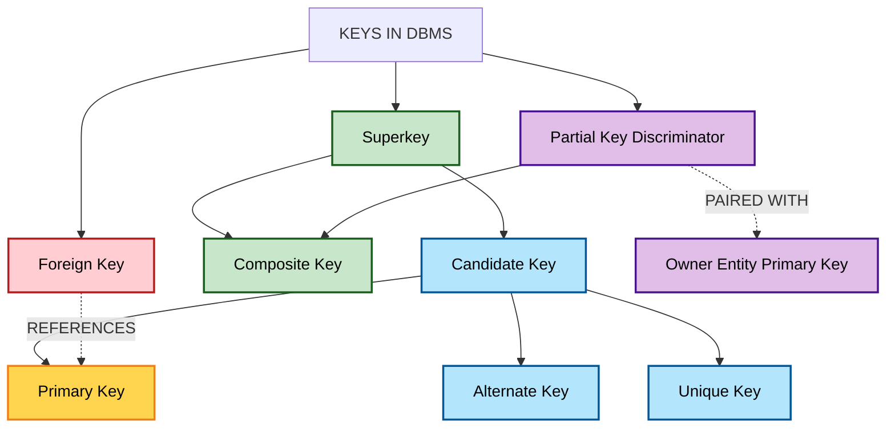
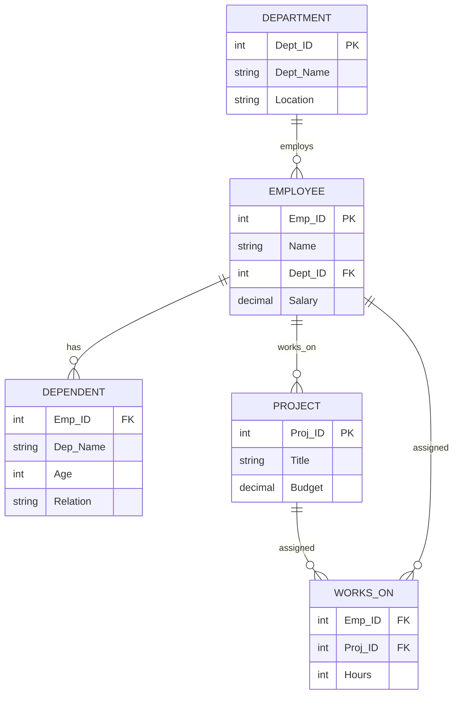
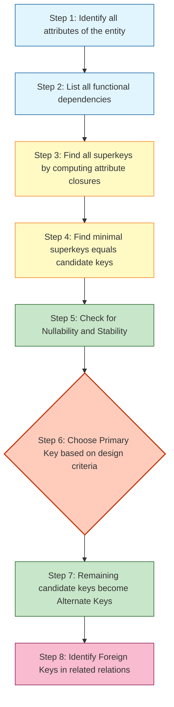

# Keys

> **APJ ABDUL KALAM TECHNOLOGICAL UNIVERSITY (KTU) | 2024 SCHEME**
> - **Branch:** B.Tech in Computer Science & Engineering (CSE)
> - **Semester:** Semester 4
> - **Course:** PCCST402 - DATABASE MANAGEMENT SYSTEMS
> - **Module:** Module 1: Introduction to Databases
> - **Topic:** Keys

<!-- SECTION_1_START -->

# 🔑 Keys in Database Management Systems

## 1.1 Formal Academic Definition

In the context of the **Entity-Relationship (ER) Model**, a **Key** is formally defined as an **attribute** (or a **set of attributes**) of an entity type whose values uniquely distinguish every entity in the entity set from all other entities. Keys are the conceptual foundation for **entity integrity**, **referential integrity**, and are the basis for all subsequent relational mapping from ER diagrams to relational schemas.

Mathematically, for a relation $R$ with schema $R(A_1, A_2, \ldots, A_n)$, a key is a subset $K \subseteq \{A_1, A_2, \ldots, A_n\}$ such that:

- **Uniqueness Property:** For any two distinct tuples $t_1, t_2 \in R$, $t_1[K] \neq t_2[K]$.
- **Minimality Property (for candidate keys):** No proper subset of $K$ has the uniqueness property.

> [!IMPORTANT]
> **KTU 2024 Syllabus Anchor (PCCST402 – Module 1):** The concept of Keys is listed explicitly as a sub-topic of *Data Modelling Using the Entity Relationship (ER) Model*. It is a **prerequisite** for understanding the upcoming topics of *Weak Entity Types* (which require Partial Keys) and *Refining the ER Design*.

## 1.2 Intuitive Real-World Analogy

Think of a **classroom scenario**:
- Your **Roll Number** uniquely identifies you in your class → analogous to a **Primary Key**.
- Your **Aadhaar Number**, **Email ID**, or **Phone Number** also uniquely identify you → these are also valid identifiers, i.e., **Candidate Keys**.
- A combination like *"{Roll_No, Name}"* is also unique but redundant because *"{Roll_No}"* alone is sufficient → this redundant identifier is a **Superkey** but not a **Candidate Key**.
- The alternative IDs not chosen as primary (e.g., Aadhaar when Roll No is primary) are **Alternate Keys**.
- When your **marks card** references your Roll No to look up your name, that Roll No in the marks table is a **Foreign Key** referring to the STUDENT table's primary key.

> [!NOTE]
> **Plain English Intuition:** A *key* is essentially a "fingerprint" for a row. Just as no two humans have identical fingerprints, no two entities should share the value(s) of their key.

## 1.3 Overview of Key Types in DBMS

| # | Key Type | One-Line Purpose |
|---|----------|------------------|
| 1 | **Superkey** | Any set of attributes that uniquely identifies an entity |
| 2 | **Candidate Key** | A *minimal* superkey |
| 3 | **Primary Key** | The candidate key chosen by the designer |
| 4 | **Alternate Key** | Candidate keys that are *not* the primary key |
| 5 | **Foreign Key** | Attribute(s) referencing a primary key in another table |
| 6 | **Composite Key** | A key made of two or more attributes |
| 7 | **Partial Key (Discriminator)** | Key used to distinguish weak entities (paired with owner's PK) |
| 8 | **Unique Key** | Constraint ensuring non-PK candidate keys are also unique |

> [!TIP]
> **Memory Aid for KTU Board Exam:** Remember the hierarchy **Superkey $\supseteq$ Candidate Key $\supseteq$ Primary Key**. Every Primary Key is a Candidate Key, and every Candidate Key is a Superkey — but the reverse is not true.

> [!VISUALIZATION CONTROL]
> **Concept:** Set-Theoretic Relationship of Key Types
> **Applicable Tool:** Conceptual Venn Diagram (Mermaid / hand-drawn Venn sketch)
> **Visual Description:** Draw three nested ovals. The outermost represents **Superkey**, the middle one represents **Candidate Key**, and the innermost circle (subset of Candidate Key) represents **Primary Key**. **Alternate Keys** are the *other* regions inside the Candidate Key oval that fall *outside* the Primary Key circle. **Foreign Key** is drawn as a *separate* region with a dashed arrow pointing into the Primary Key circle (indicating a reference relationship).

<!-- SECTION_1_END -->

<!-- SECTION_2_START -->

# 2. Deep Theoretical Analysis

## 2.1 Detailed Analysis of Each Key Type

### 🔹 2.1.1 Superkey

A **Superkey** is a set of one or more attributes $SK$ that, taken collectively, allows us to identify uniquely an entity in the given entity set.

- **Property:** $SK \rightarrow$ all other attributes of the entity type (i.e., $SK$ functionally determines every other attribute).
- **Quirk:** Superkeys can be *redundant*. For example, if $\{Roll\_No\}$ is a superkey, then $\{Roll\_No, Name\}$ is also a superkey.
- **Existence:** Every relation has **at least one** superkey — the set of *all* attributes of the relation is always a trivial superkey.

### 🔹 2.1.2 Candidate Key

A **Candidate Key** is a *minimal* superkey. Minimal here means that none of its proper subsets can act as a superkey.

- **Property:** Removing even a single attribute destroys the uniqueness property.
- **Count:** A relation may have **multiple** candidate keys. If it has only one, that key automatically becomes the primary key.
- **Example:** In `STUDENT(Roll_No, Aadhaar, Email, Name)`, the candidate keys are $\{Roll\_No\}$, $\{Aadhaar\}$, and $\{Email\}$.

### 🔹 2.1.3 Primary Key

A **Primary Key** is the candidate key selected by the database designer to serve as the *principal* unique identifier for entities of that type.

- **Entity Integrity Rule (Codd's Rule):** The primary key value **must be unique** and **must never be NULL** for any tuple.
- **Choice Criteria:** Designers usually prefer the shortest, simplest, most stable attribute (least likely to change). E.g., prefer *Aadhaar* over a derived attribute.
- **Convention:** In ER diagrams, primary key attributes are typically **underlined**.

### 🔹 2.1.4 Alternate Key (Unique Key)

- **Alternate Keys** are candidate keys that are *not* chosen as the primary key.
- SQL permits them to be implemented as **UNIQUE NOT NULL** constraints.
- **Difference from Primary Key:** A table can have *multiple* UNIQUE keys but only *one* PRIMARY KEY. Historically, some DBMSs allowed multiple NULLs in UNIQUE keys (though SQL standard now disallows it).

### 🔹 2.1.5 Foreign Key

A **Foreign Key** is an attribute (or set of attributes) $FK$ in a relation $R_1$ whose values must match the values of the primary key $PK$ in some other relation $R_2$ (or occasionally the same relation, for *recursive* foreign keys).

- **Referential Integrity Rule:** For every value of $FK$ in $R_1$, either it equals some $PK$ value in $R_2$, or it is NULL (if permitted).
- **Purpose:** Models **relationships** between tables; replaces the need for explicit *Relationship Sets* in the relational mapping phase.
- **Example:** In `ENROLLMENT(Roll_No, Course_Code, Marks)`, the attributes `Roll_No` and `Course_Code` are foreign keys referencing `STUDENT` and `COURSE` respectively.

### 🔹 2.1.6 Composite Key

A **Composite Key** is a candidate (or primary) key that consists of **two or more attributes** combined to ensure uniqueness.

- **Mandatory Property:** No single attribute alone is sufficient; the *combination* is required.
- **Typical Use Case:** Junction/associative tables like `ENROLLMENT(Student_ID, Course_ID)` where neither column alone is unique.

### 🔹 2.1.7 Partial Key (Discriminator)

A **Partial Key** (or **Discriminator**) is a set of attributes that, when **combined with the primary key of the owner (identifying) entity type**, uniquely identifies a **weak entity**.

- **Standalone Property:** A partial key alone is *not* unique within the weak entity set. E.g., in `DEPENDENT(Emp_ID, Dependent_Name)`, `Dependent_Name` is not unique on its own, but `{Emp_ID, Dependent_Name}` is.
- **ER Diagram Notation:** Drawn with a **dashed underline**.
- **Significance:** Critical for the upcoming topic of *Weak Entity Types* in KTU Module 1.

### 🔹 2.1.8 Surrogate Key (Conceptual)

A **Surrogate Key** is a **system-generated** unique identifier (e.g., an auto-increment integer or a UUID) used in place of a natural key.

- **Why Used:** Insulates the database from changes in the real-world identifier (e.g., SSN format changes).
- **Trade-off:** Has no business meaning, but is stable, compact, and efficient for indexing.

## 2.2 The 'Why' and 'How' of Keys

| Logical Question | Engineering Answer |
|------------------|-------------------|
| **Why** are keys needed? | To ensure **Entity Integrity** (no duplicate or NULL primary key values) and **Referential Integrity** (no orphan foreign key values). |
| **How** is a key identified? | By analyzing **Functional Dependencies (FDs)** and computing the **attribute closure** of candidate attribute sets. |
| **Why** must a primary key never be NULL? | A NULL primary key would mean the entity is unidentifiable — violating the entire purpose of the key. |
| **How** does a foreign key work? | The DBMS engine checks every INSERT/UPDATE on the FK column to ensure its value exists in the referenced PK column (or is NULL). |

> [!IMPORTANT]
> **Real-World Engineering Use:** Every production database you interact with — banking ledgers, e-commerce carts, hospital records — relies on primary keys for ACID transactions, foreign keys for cascade operations, and unique keys for business rules (e.g., "no two users can register with the same email").

## 2.3 KTU High-Yield Cheat Sheet — Properties & Rules

| Concept | Formula / Property | KTU Significance |
|---------|---------------------|------------------|
| Superkey Property | $SK \rightarrow A_1, A_2, \ldots, A_n$ | Foundation for uniqueness |
| Candidate Key Minimality | $\not\exists K' \subset K \text{ such that } K' \text{ is a superkey}$ | Distinguishes candidate from superkey |
| Entity Integrity | $\forall t \in R, t[PK] \neq NULL$ | Codd's rule — mandatory in exam answers |
| Referential Integrity | $\forall t \in R_1, t[FK] = t'[PK] \text{ for some } t' \in R_2 \text{ OR } t[FK] = NULL$ | Enforced via FK constraints |
| Composite Key Cardinality | $K = \{A_i, A_j, \ldots\}$ with $\vert K \vert \geq 2$ | Junction/associative tables |
| Number of Superkeys from Candidate Keys | If a relation has $n$ candidate keys, it has at least $2^n - 1$ superkeys (excluding the trivial all-attribute key) | Useful for theory questions |
| Partial Key Constraint | $K_{partial} \cup K_{owner} \rightarrow$ unique | Weak entity identification |

> [!TIP]
> **Numerical Trick for KTU:** If a relation has 3 candidate keys, the number of superkeys is **at least** $2^3 - 1 = 7$ (combinatorial subsets) — but the actual count can be much higher if any FD creates *additional* superkeys via attribute combination.

<!-- SECTION_2_END -->

<!-- SECTION_3_START -->

# 3. Step-by-Step Derivations, Worked Examples & Code

## 3.1 Comprehensive Worked Example: Finding Keys in a Relation

### 📋 Given Relation

Consider the relation:

$$
\text{STUDENT}(\text{Roll\_No}, \text{Aadhaar}, \text{Email}, \text{Name}, \text{Phone}, \text{Dept})
$$

### 📐 Assumed Functional Dependencies (FDs)

$$
\begin{aligned}
F = \{ & \\
& \text{Roll\_No} \rightarrow \text{Aadhaar, Email, Name, Phone, Dept} \\
& \text{Aadhaar} \rightarrow \text{Roll\_No, Email, Name, Phone, Dept} \\
& \text{Email} \rightarrow \text{Roll\_No, Aadhaar, Name, Phone, Dept} \\
& \text{Phone} \rightarrow \text{Roll\_No, Aadhaar, Email, Name, Dept} \\
& \}
\end{aligned}
$$

### 🔍 Step 1: Identify Attributes

The set of all attributes is:

$$
U = \{\text{Roll\_No, Aadhaar, Email, Name, Phone, Dept}\}
$$

### 🔍 Step 2: Check Single Attributes for Key Property

We must check whether each individual attribute determines all others.

| Test Attribute | Determines All of $U$? | Status |
|----------------|------------------------|--------|
| Roll\_No | Yes (by FD1) | ✅ Candidate Key |
| Aadhaar | Yes (by FD2) | ✅ Candidate Key |
| Email | Yes (by FD3) | ✅ Candidate Key |
| Phone | Yes (by FD4) | ✅ Candidate Key |
| Name | Cannot determine; multiple students may share a name | ❌ Not a key |
| Dept | Cannot determine; many students per department | ❌ Not a key |

### 🔍 Step 3: Derive the Attribute Closures (Verification)

**Closure of $\{$Roll_No$\}$:**

$$
\begin{aligned}
(\text{Roll\_No})^+ &= \{\text{Roll\_No}\} \cup \{\text{Aadhaar, Email, Name, Phone, Dept}\} \\
&= U
\end{aligned}
$$

Since $(\text{Roll\_No})^+ = U$, the attribute $\text{Roll\_No}$ alone is a **candidate key**.

**Closure of $\{$Name$\}$:**

$$
(\text{Name})^+ = \{\text{Name}\}
$$

Since $(\text{Name})^+ \neq U$, $\text{Name}$ alone is **not** a key. The closure cannot be extended using the given FDs because no FD has $\text{Name}$ on the left-hand side.

### 🔍 Step 4: Enumerate All Candidate Keys

From Step 2, the **candidate keys** are:

$$
CK = \{\{\text{Roll\_No}\},\ \{\text{Aadhaar}\},\ \{\text{Email}\},\ \{\text{Phone}\}\}
$$

### 🔍 Step 5: Choose the Primary Key

By convention and based on design preference, we select:

$$
PK = \{\text{Roll\_No}\}
$$

### 🔍 Step 6: Identify Alternate Keys

$$
AK = CK \setminus \{PK\} = \{\{\text{Aadhaar}\},\ \{\text{Email}\},\ \{\text{Phone}\}\}
$$

### 🔍 Step 7: List Non-Trivial Superkeys

Every superset of any candidate key is also a superkey. Examples:

$$
\begin{aligned}
& \{\text{Roll\_No, Name}\},\ \{\text{Roll\_No, Aadhaar, Email}\}, \\
& \{\text{Aadhaar, Phone}\},\ \{\text{Email, Name, Dept}\}, \ldots
\end{aligned}
$$

In general, a relation with $n$ candidate keys has at least $2^n - 1$ non-trivial superkeys (excluding the universal key of all attributes).

### 🔍 Step 8: Apply the Foreign Key Concept

In a related relation $\text{MARKS}(\text{Roll\_No}, \text{Course\_Code}, \text{Score})$:

- $\text{Roll\_No}$ is a **foreign key** referencing $\text{STUDENT.Roll\_No}$ (the primary key).
- The **referential integrity constraint** ensures that every $\text{Roll\_No}$ in $\text{MARKS}$ must exist in $\text{STUDENT}$.

---

## 3.2 Worked Example: Weak Entity with Partial Key

### 📋 Given Relation

$$
\text{DEPENDENT}(\text{Emp\_ID}, \text{Dep\_Name}, \text{Age}, \text{Relation})
$$

The primary key of the owner entity $\text{EMPLOYEE}$ is $\text{Emp\_ID}$.

### 📐 Analysis

- $\text{Dep\_Name}$ alone is **not unique** (two employees could have a dependent named "Rahul").
- The combination $\{$Emp_ID, Dep_Name$\}$ **is unique**.
- Therefore: $\text{Dep\_Name}$ is the **partial key (discriminator)**.
- The full primary key of $\text{DEPENDENT}$ is $\{$Emp\_ID, Dep\_Name$\}$ (a composite key).

### 🔍 Closure Verification

$$
(\text{Dep\_Name})^+ = \{\text{Dep\_Name}\} \neq U \quad \Rightarrow \text{Not a key}
$$

$$
(\text{Emp\_ID, Dep\_Name})^+ = U \quad \Rightarrow \text{Composite primary key}
$$

---

## 3.3 Python Implementation — Automatic Candidate Key Finder

The following Python code implements an algorithm to find all candidate keys of a relation given its attributes and functional dependencies. It uses **attribute closure** computation.

```python
from itertools import combinations
from typing import FrozenSet, List, Set, Tuple

# Type alias for clarity
FD = Tuple[FrozenSet[str], FrozenSet[str]]


def attribute_closure(
    attributes: FrozenSet[str],
    fds: List[FD],
    all_attrs: Set[str]
) -> Set[str]:
    """
    Compute the attribute closure of `attributes` under the given FDs.
    
    Parameters:
        attributes: Set of starting attributes.
        fds: List of functional dependencies as (lhs, rhs) tuples.
        all_attrs: Set of all attributes in the relation (universe).
    
    Returns:
        The full closure set.
    """
    closure: Set[str] = set(attributes)
    
    if attributes.issubset(closure):
        pass  # initialise
    
    changed = True
    while changed:
        changed = False
        for lhs, rhs in fds:
            # If LHS is already in closure, add RHS
            if lhs.issubset(closure) and not rhs.issubset(closure):
                closure.update(rhs)
                changed = True
    
    return closure


def is_superkey(
    key_candidate: FrozenSet[str],
    fds: List[FD],
    all_attrs: Set[str]
) -> bool:
    """
    Check whether `key_candidate` is a superkey
    (its closure equals the universe of attributes).
    """
    closure = attribute_closure(key_candidate, fds, all_attrs)
    return closure == all_attrs


def find_all_candidate_keys(
    attributes: List[str],
    fds_list: List[Tuple[List[str], List[str]]]
) -> List[FrozenSet[str]]:
    """
    Find all minimal candidate keys of a relation.
    
    Parameters:
        attributes: List of all attribute names.
        fds_list:   FDs as a list of ([lhs...], [rhs...]) tuples.
    
    Returns:
        List of candidate keys, each as a frozenset.
    """
    all_attrs: Set[str] = set(attributes)
    
    # Normalise FDs into (frozenset(lhs), frozenset(rhs))
    fds: List[FD] = [
        (frozenset(lhs), frozenset(rhs)) for lhs, rhs in fds_list
    ]
    
    candidate_keys: List[FrozenSet[str]] = []
    n = len(attributes)
    
    # Try keys of increasing size to ensure minimality
    for size in range(1, n + 1):
        for combo in combinations(attributes, size):
            key_set: FrozenSet[str] = frozenset(combo)
            
            if not is_superkey(key_set, fds, all_attrs):
                continue  # Not even a superkey, skip
            
            # Check minimality: no proper subset is already a candidate key
            is_minimal = True
            for existing_ck in candidate_keys:
                if existing_ck.issubset(key_set):
                    is_minimal = False
                    break
            
            if is_minimal:
                candidate_keys.append(key_set)
    
    return candidate_keys


# ============================================
# DRIVER CODE — Testing with STUDENT example
# ============================================
if __name__ == "__main__":
    
    # Define relation schema
    student_attrs = ["Roll_No", "Aadhaar", "Email", "Name", "Phone", "Dept"]
    
    # Define functional dependencies
    student_fds = [
        (["Roll_No"],  ["Aadhaar", "Email", "Name", "Phone", "Dept"]),
        (["Aadhaar"],  ["Roll_No", "Email", "Name", "Phone", "Dept"]),
        (["Email"],    ["Roll_No", "Aadhaar", "Name", "Phone", "Dept"]),
        (["Phone"],    ["Roll_No", "Aadhaar", "Email", "Name", "Dept"]),
    ]
    
    candidate_keys = find_all_candidate_keys(student_attrs, student_fds)
    
    print("=" * 60)
    print("DISCOVERED CANDIDATE KEYS FOR STUDENT RELATION")
    print("=" * 60)
    for idx, ck in enumerate(candidate_keys, start=1):
        print(f"Candidate Key {idx}: {{ {', '.join(sorted(ck))} }}")
    
    # Closure test for verification
    print("\n--- Closure Verification ---")
    for attr in ["Roll_No", "Name", "Aadhaar"]:
        result = attribute_closure(
            frozenset([attr]),
            [(frozenset(lhs), frozenset(rhs)) for lhs, rhs in student_fds],
            set(student_attrs)
        )
        print(f"({attr})+ = {result}")
```

### 🖥️ Expected Output

```
============================================================
DISCOVERED CANDIDATE KEYS FOR STUDENT RELATION
============================================================
Candidate Key 1: { Aadhaar }
Candidate Key 2: { Email }
Candidate Key3: { Phone }
Candidate Key 4: { Roll_No }

--- Closure Verification ---
(Roll_No)+ = {'Aadhaar', 'Email', 'Name', 'Phone', 'Dept', 'Roll_No'}
(Name)+ = {'Name'}
(Aadhaar)+ = {'Roll_No', 'Email', 'Name', 'Phone', 'Dept', 'Aadhaar'}
```

> [!NOTE]
> **Engineering Insight:** This same closure-based algorithm is used internally by tools like **MySQL Workbench** and **ER/Studio** when designers ask "Suggest Primary Key" for a logical schema.

---

## 3.4 Mapping Conceptual Keys to SQL Constraints

The following table maps the conceptual ER key types to their concrete SQL DDL implementations:

| Conceptual Key | SQL DDL Implementation |
|----------------|------------------------|
| Primary Key | `PRIMARY KEY (Roll_No)` |
| Alternate / Unique Key | `UNIQUE NOT NULL (Aadhaar)` |
| Foreign Key | `FOREIGN KEY (Roll_No) REFERENCES STUDENT(Roll_No) ON DELETE CASCADE` |
| Composite Key | `PRIMARY KEY (Emp_ID, Dep_Name)` (multiple columns inside parentheses) |
| Partial Key | Enforced via composite FK + UNIQUE constraint together |

```sql
-- SQL Example: Implementing Keys for STUDENT and DEPENDENT
CREATE TABLE STUDENT (
    Roll_No   INT           NOT NULL,
    Aadhaar   CHAR(12)      NOT NULL,
    Email     VARCHAR(100)  NOT NULL,
    Name      VARCHAR(50)   NOT NULL,
    Phone     VARCHAR(15),
    Dept      VARCHAR(30),
    
    CONSTRAINT pk_student      PRIMARY KEY (Roll_No),
    CONSTRAINT uk_aadhaar      UNIQUE (Aadhaar),
    CONSTRAINT uk_email        UNIQUE (Email)
);

CREATE TABLE DEPENDENT (
    Emp_ID     INT           NOT NULL,
    Dep_Name   VARCHAR(50)   NOT NULL,
    Age        INT,
    Relation   VARCHAR(20),
    
    CONSTRAINT pk_dependent    PRIMARY KEY (Emp_ID, Dep_Name),   -- composite key
    CONSTRAINT fk_emp          FOREIGN KEY (Emp_ID) 
                               REFERENCES EMPLOYEE(Emp_ID) 
                               ON DELETE CASCADE
);
```

> [!IMPORTANT]
> **Valuation Insight for KTU:** When asked to "design keys" in an exam, always write the **constraint names** explicitly and show the **CASCADE / SET NULL** rule — this earns the full integrity marks in the relational mapping step.

<!-- SECTION_3_END -->

<!-- SECTION_4_START -->

# 4. Structural Diagrams & Schematics

## 4.1 Key Type Hierarchy — Conceptual Map



**Description of the diagram:**
- The **outermost node** is *Keys in DBMS*.
- The next tier distinguishes the **standalone keys** (Superkey hierarchy on the left) from the **reference key** (Foreign Key on the right) and the **partial key** (for weak entities).
- A **dashed arrow** from Foreign Key to Primary Key indicates the *reference relationship*.
- A **dashed arrow** from Partial Key to Owner's Primary Key indicates that the partial key *needs to be combined* with the owner's PK to form the weak entity's full identifier.

## 4.2 Foreign Key Reference — ER Diagram Example



**How to read the diagram:**
- `PK` after an attribute name → **Primary Key** of that entity.
- `FK` after an attribute name → **Foreign Key** referencing the primary key of another entity.
- In `DEPENDENT`, the combination of `Emp_ID (FK)` and `Dep_Name` forms the **composite primary key** of the weak entity; `Emp_ID` alone is a *partial-key component* and a *foreign key* simultaneously.
- In `WORKS_ON`, the table has **two foreign keys** (`Emp_ID`, `Proj_ID`) which together form the composite primary key — this is a classic *associative (junction) entity*.

## 4.3 Sequential Process — Selecting the Primary Key



> [!TIP]
> **Exam Tip:** When drawing ER diagrams, mark the **primary key attribute(s) with a solid underline** and **partial keys with a dashed underline**. Foreign keys are *not* underlined in the ER diagram (only in the relational mapping).

<!-- SECTION_4_END -->

<!-- SECTION_5_START -->

# 5. KTU 2024 Scheme Examination Question Bank & Topic Recap

## 5.1 Part A — Short Answer Questions (3 Marks Each)

> **Q1. [KTU University Exam – Model Question Paper, 2024 Scheme]**  
> **CO1 | RBT Level: Remember**  
> Define the following terms with one example each:  
> (i) Superkey (ii) Candidate Key (iii) Primary Key

### ✅ Model Answer (Valuation Key)

- **(i) Superkey:** A set of one or more attributes that uniquely identifies an entity in an entity set. *Example:* In `STUDENT(Roll_No, Name, Aadhaar)`, the set `{Roll_No, Aadhaar}` is a superkey. **[1 Mark]**
- **(ii) Candidate Key:** A *minimal* superkey — no proper subset of it can uniquely identify an entity. *Example:* `{Roll_No}` and `{Aadhaar}` are candidate keys. **[1 Mark]**
- **(iii) Primary Key:** The candidate key chosen by the database designer to uniquely identify entities. *Example:* `{Roll_No}` is selected as the primary key. **[1 Mark]**

---

> **Q2. [KTU University Exam – Model Question Paper, 2024 Scheme]**  
> **CO1 | RBT Level: Understand**  
> Differentiate between **Primary Key** and **Unique Key**. Mention any two differences.

### ✅ Model Answer (Valuation Key)

| Aspect | Primary Key | Unique Key |
|--------|-------------|------------|
| NULL Values | Does not allow NULL values | Allows NULL (varies by DBMS) |
| Count per Table | Only one primary key per table | Multiple unique keys permitted |
| Clustered Index | Usually creates a clustered index | Creates a non-clustered index |
| Purpose | Principal identifier | Alternate identifier / business rule enforcement |

**[1 Mark]** for the table headers and clear difference points.  
**[1 Mark]** for any two well-articulated differences.  
**[1 Mark]** for the example (e.g., `PRIMARY KEY (Roll_No)` vs `UNIQUE (Aadhaar)`).

---

## 5.2 Part B — Long Answer Questions (14 Marks Each, with Internal Choice)

---

### 🟦 QUESTION A (14 Marks)

> **Q.A. [KTU University Exam – Model Question Paper, 2024 Scheme]**  
> **CO1, CO2 | RBT Level: Understand + Apply**  
> 
> **(a)** Explain in detail the different types of keys used in a relational database with suitable examples. Mention the **Entity Integrity Rule** and **Referential Integrity Rule** in your answer. **[7 Marks]**
> 
> **(b)** Consider the following relation:  
> `BOOK(Book_ID, ISBN, Title, Author, Publisher, Year, Price)`  
> Given the Functional Dependencies:  
> $\text{Book\_ID} \rightarrow \text{ISBN, Title, Author, Publisher, Year, Price}$  
> $\text{ISBN} \rightarrow \text{Book\_ID, Title, Author, Publisher, Year, Price}$  
> Identify all **candidate keys**, choose a **primary key**, list the **alternate keys**, and give **two examples of superkeys**. **[7 Marks]**

#### ✅ Model Solution — Q.A(a)

**Step 1 — Definitions and Examples (3 Marks)**

- **Superkey:** A set of attributes that uniquely identifies a tuple. E.g., `{Book_ID, Title}`. *Mention that superset of any key is also a superkey.* **[1 Mark]**
- **Candidate Key:** A minimal superkey. E.g., `{Book_ID}`, `{ISBN}`. **[1 Mark]**
- **Primary Key:** The chosen candidate key. E.g., `{Book_ID}`. **[1 Mark]**

**Step 2 — Continue with More Key Types (2 Marks)**

- **Alternate Key:** Candidate keys not chosen. E.g., `{ISBN}`. **[0.5 Mark]**
- **Foreign Key:** An attribute in a referencing table. E.g., `Book_ID` in `BORROW(Book_ID, Member_ID, Date)`. **[0.5 Mark]**
- **Composite Key:** Multi-attribute key. E.g., `{Member_ID, Book_ID}` in `BORROW`. **[0.5 Mark]**
- **Partial Key (Discriminator):** Used in weak entities, e.g., `Dep_Name` in `DEPENDENT`. **[0.5 Mark]**

**Step 3 — Integrity Rules (2 Marks)**

- **Entity Integrity Rule:** *No attribute participating in the primary key of a base relation may have NULL values.* **[1 Mark]**
- **Referential Integrity Rule:** *For every non-NULL foreign key value in a referencing relation, there must exist a matching primary key value in the referenced relation.* **[1 Mark]**

#### ✅ Model Solution — Q.A(b)

**Step 1 — Identify Single-Attribute Keys (3 Marks)**

- Test `Book_ID`: From FD1, `Book_ID → all other attributes`. Therefore, `Book_ID` is a candidate key. **[1 Mark]**
- Test `ISBN`: From FD2, `ISBN → all other attributes`. Therefore, `ISBN` is a candidate key. **[1 Mark]**
- Test `Title`: Multiple books can share the same title → not a key. **[1 Mark]**

**Step 2 — Final Answer (4 Marks)**

- **Candidate Keys:** $CK = \{\{\text{Book\_ID}\},\ \{\text{ISBN}\}\}$ **[1 Mark]**
- **Primary Key (chosen):** $PK = \{\text{Book\_ID}\}$ (shorter, integer, simple) **[1 Mark]**
- **Alternate Keys:** $AK = \{\{\text{ISBN}\}\}$ **[1 Mark]**
- **Superkey Examples:** $\{\text{Book\_ID, Title}\}$, $\{\text{ISBN, Year}\}$ (any superset of a candidate key) **[1 Mark]**

---

### 🟩 QUESTION B (14 Marks) — Internal Choice Alternative

> **Q.B. [KTU University Exam – Model Question Paper, 2024 Scheme]**  
> **CO1, CO2 | RBT Level: Understand + Apply**  
> 
> **(a)** Define a **Weak Entity Type**. How is it identified in an ER diagram? Explain the role of the **Partial Key (Discriminator)** in identifying weak entities with a suitable example. **[7 Marks]**
> 
> **(b)** Consider the relation:  
> `ENROLLMENT(Student_ID, Course_Code, Semester, Marks, Grade)`  
> Given that `Student_ID` and `Course_Code` together are needed to identify a row, and `Semester` together with `Student_ID` and `Course_Code` makes the row unique:  
> (i) Identify the **composite primary key**. (ii) Identify the **foreign keys** with their referenced relations. (iii) Write the SQL `CREATE TABLE` statement enforcing both **entity integrity** and **referential integrity**. **[7 Marks]**

#### ✅ Model Solution — Q.B(a)

**Step 1 — Weak Entity Type Definition (2 Marks)**

- A **weak entity type** is an entity type whose existence depends on another entity type (called the *owner* or *identifying* entity type) and which **cannot be uniquely identified by its own attributes alone**. **[1 Mark]**
- Weak entities do not have a primary key of their own; they are identified by combining a *partial key* with the primary key of the owner entity. **[1 Mark]**

**Step 2 — ER Diagram Notation (2 Marks)**

- In an ER diagram, weak entity types are represented by a **double-lined rectangle**. The identifying relationship is shown using a **double-lined diamond**. **[1 Mark]**
- The partial key (discriminator) is shown with a **dashed underline** beneath the attribute name. **[1 Mark]**

**Step 3 — Example and Role of Partial Key (3 Marks)**

- **Example:** Consider `DEPENDENT(Emp_ID, Dep_Name, Age, Relation)`. The `DEPENDENT` entity is weak because it depends on `EMPLOYEE`. The discriminator `Dep_Name` alone is not unique (two employees may both have a son named "Rahul"), but combined with `Emp_ID`, it uniquely identifies a dependent. **[2 Marks]**
- **Role:** The partial key **distinguishes** weak entities *within* the group owned by a particular owner entity. It works *only* in combination with the owner's primary key. **[1 Mark]**

#### ✅ Model Solution — Q.B(b)

**Step 1 — Identify Composite Primary Key (2 Marks)**

- The unique combination is $\{\text{Student\_ID}, \text{Course\_Code}, \text{Semester}\}$.  
  This is the **composite primary key** of `ENROLLMENT`. **[2 Marks]**

**Step 2 — Identify Foreign Keys (2 Marks)**

- `Student_ID` is a **foreign key** referencing `STUDENT(Student_ID)`. **[1 Mark]**
- `Course_Code` is a **foreign key** referencing `COURSE(Course_Code)`. **[1 Mark]**

**Step 3 — SQL CREATE TABLE Statement (3 Marks)**

```sql
CREATE TABLE ENROLLMENT (
    Student_ID   INT             NOT NULL,
    Course_Code  VARCHAR(10)     NOT NULL,
    Semester     VARCHAR(10)     NOT NULL,
    Marks        DECIMAL(5,2),
    Grade        CHAR(2),
    
    -- Composite primary key (entity integrity)
    CONSTRAINT pk_enrollment
        PRIMARY KEY (Student_ID, Course_Code, Semester),
    
    -- Foreign key to STUDENT (referential integrity)
    CONSTRAINT fk_student
        FOREIGN KEY (Student_ID)
        REFERENCES STUDENT(Student_ID)
        ON DELETE CASCADE
        ON UPDATE CASCADE,
    
    -- Foreign key to COURSE (referential integrity)
    CONSTRAINT fk_course
        FOREIGN KEY (Course_Code)
        REFERENCES COURSE(Course_Code)
        ON DELETE RESTRICT
        ON UPDATE CASCADE
);
```

- **Entity Integrity** is enforced by the `PRIMARY KEY` constraint (NOT NULL + unique). **[1 Mark]**
- **Referential Integrity** is enforced by the two `FOREIGN KEY ... REFERENCES` constraints. **[1 Mark]**
- **Cascade rules** earn the final mark. **[1 Mark]**

---

> [!WARNING]
> **🚨 KTU Examiner's Valuation Pitfalls — Read Before You Write!**
> 
> 1. **Do not confuse Partial Key with Primary Key.** Partial Key is *not* a primary key on its own; it must be combined with the owner's PK. Many students lose 2–3 marks by writing "partial key is a primary key" in weak entity questions. **[Lose 2 Marks]**
> 2. **Always state Entity Integrity Rule and Referential Integrity Rule in full sentences**, not just the names. Examiners award marks for the *definition text*. **[Lose 1 Mark]**
> 3. **When asked to "find candidate keys"**, do not stop at listing one — verify via **attribute closure** that no proper subset is also a key. Skipping the closure verification is a common trap. **[Lose 2 Marks]**
> 4. **In SQL questions, write the constraint names explicitly** (`CONSTRAINT pk_enrollment PRIMARY KEY (...)`) — anonymous inline constraints lose style marks. **[Lose 1 Mark]**
> 5. **Foreign Key arrows in ER diagrams** must point from the FK attribute to the PK attribute of the referenced entity — students often reverse the direction. **[Lose 1 Mark]**
> 6. **Composite Keys vs. Compound Keys vs. Concatenated Keys** — all three terms are interchangeable in KTU answers, but you should use **"Composite Key"** as it is the most standard term in the syllabus.

---

## 5.3 Topic Recap & Important Things to Remember

> [!IMPORTANT]
> **🎯 Rapid Revision Checklist — Print This Before the Exam!**

### 📘 Core Definitions
- **Superkey** = any set of attributes that uniquely identifies an entity (may be non-minimal).
- **Candidate Key** = a *minimal* superkey; cannot be reduced further.
- **Primary Key** = the candidate key chosen by the designer; **NOT NULL + UNIQUE**.
- **Alternate Key** = candidate keys not chosen as primary.
- **Unique Key** = the SQL implementation of an alternate key (may be NULL per some DBMSs).
- **Foreign Key** = attribute(s) in one table that *reference* the primary key of another table.
- **Composite Key** = a key composed of two or more attributes.
- **Partial Key (Discriminator)** = partial identifier used in weak entities; must be paired with the owner's PK.
- **Surrogate Key** = a system-generated, business-meaningless unique identifier.

### 📐 Critical Rules
- **Entity Integrity Rule:** No primary key attribute may be NULL.
- **Referential Integrity Rule:** Every non-NULL foreign key value must match an existing primary key value in the referenced relation.
- **Minimality of Candidate Keys:** No proper subset of a candidate key is itself a candidate key.
- **Existence of Superkey:** Every relation has at least one superkey (the set of all attributes).

### 🧮 Key Mathematical Properties
- A relation with $n$ candidate keys has **at least** $2^n - 1$ superkeys.
- The number of candidate keys is bounded by the number of attributes.
- Attribute closure $(X)^+$ is the algorithmic foundation for finding keys.

### 🔧 SQL Implementations (must remember the syntax)
- Primary Key → `PRIMARY KEY (col)` or inline `col TYPE PRIMARY KEY`
- Unique → `UNIQUE (col)` or `CONSTRAINT uk_name UNIQUE (col)`
- Foreign Key → `FOREIGN KEY (col) REFERENCES Parent(col)`
- Composite → `PRIMARY KEY (col1, col2, col3)` (all in one parenthesis)

### 🎨 ER Diagram Conventions
- **Solid underline** → Primary Key attribute.
- **Dashed underline** → Partial Key (Discriminator) attribute.
- **Double-lined rectangle** → Weak Entity.
- **Double-lined diamond** → Identifying Relationship.

### 💡 Examiner's Quick-Fire Memory Hooks
- "*Minimal is candidate; chosen is primary; rejected is alternate.*"
- "*Foreign key = pointer to primary key of another table.*"
- "*Partial key needs the owner's primary key to be complete.*"
- "*Entity Integrity = PK is not null; Referential Integrity = FK is valid.*"
- "*Number of Primary Keys per table = **exactly one**. Number of Foreign Keys = **zero or more**.*"

<!-- SECTION_5_END -->
