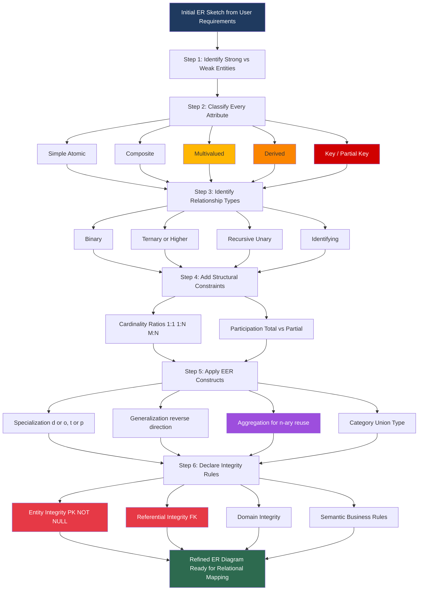
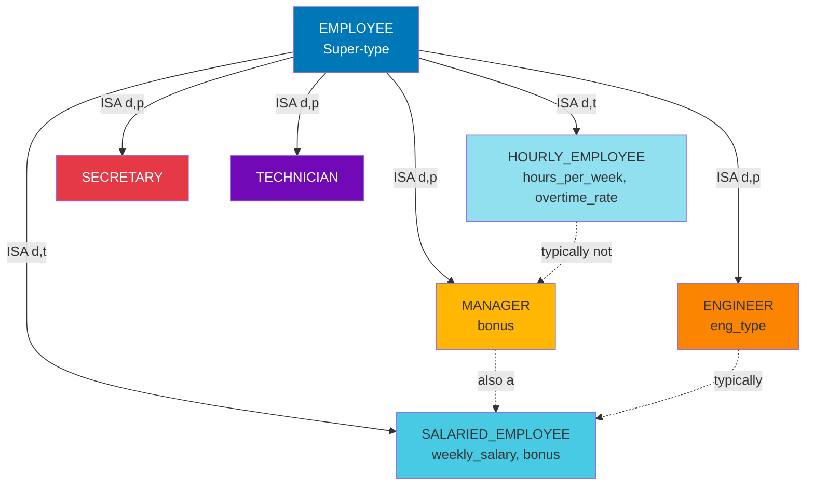

# Refining the ER Design for the COMPANY Database

> **APJ ABDUL KALAM TECHNOLOGICAL UNIVERSITY (KTU) | 2024 SCHEME**
> - **Branch:** B.Tech in Computer Science & Engineering (CSE)
> - **Semester:** Semester 4
> - **Course:** PCCST402 - DATABASE MANAGEMENT SYSTEMS
> - **Module:** Module 1: Introduction to Databases
> - **Topic:** Refining the ER Design for the COMPANY Database

<!-- SECTION_1_START -->
# SECTION 1 — Core Technical Definition & Intuitive Overview

## 1.1 Formal Definition (KTU 2024 Syllabus Terminology)

> [!IMPORTANT]
> **Refining the ER Design** is the iterative process of taking an *initial conceptual ER schema* (built from user requirements) and systematically improving it by **resolving design ambiguities, choosing correct attribute classifications, eliminating redundancies, identifying weak/specialized entity types, and enforcing integrity constraints** so that the schema accurately, completely, and efficiently represents the *mini-world* (universe of discourse) of the **COMPANY** database.

The *COMPANY* database is the canonical example used in Elmasri & Navathe-style textbooks. It models a typical organizational universe of discourse with **employees, departments, projects, dependents, and locations**, and the *refinement* step is what transforms a coarse initial diagram into a publishable conceptual schema suitable for mapping to a relational schema.

## 1.2 Intuitive Analogy (Plain-English Picture)

Think of designing a house. The **initial ER diagram** is like a *rough hand-drawn sketch* on a napkin — walls, doors, and rooms are roughly indicated. **Refining the ER design** is what an architect does next:

- Decides which **walls are load-bearing** (mandatory participation) vs **decorative partitions** (optional).
- Splits a generic *"Living Space"* into a specialized *"Kitchen"* and *"Bedroom"* (**Specialization**).
- Merges two nearly identical rooms from two different floors into one shared *staircase* module (**Generalization**).
- Notes that *"Address"* is not one thing — it is `{Street, City, State, Pincode}` (**Composite attribute**).
- Marks that an employee may have **zero, one, or many** phone numbers (**Multivalued attribute**).
- Marks that *"Age"* is computed from *"BirthDate"* — don't store it twice (**Derived attribute**).
- Notes that a *Dependent* has no meaning without an *Employee* — it is a **Weak Entity** held up by its parent.

> [!NOTE]
> In short, **refinement = cleanup + completeness + constraint enforcement** before the ER diagram is mapped to relations.

## 1.3 The COMPANY Mini-World — Canonical Requirements

The **COMPANY** database represents an organization with the following real-world facts:

1. The company is organized into **departments**.
2. Each department has a **unique name**, a **unique number**, a **manager** (an employee), and one or more **locations**.
3. A department **controls** a number of **projects**.
4. Each project has a **unique name**, a **unique number**, a **single location**, and is controlled by one department.
5. We store each employee's **name, SSN (unique), address, salary, sex, birth date**, and the **department** they work for.
6. Each employee is assigned to **one department** but may work on **several projects**.
7. We record the **number of hours per week** an employee works on each project.
8. We record the **direct supervisor** of each employee.
9. Each employee may have **dependents** (spouse, children, etc.) with first name, sex, birth date, and relationship.
10. Employees can be categorized (e.g., *Salaried*, *Hourly*) and by job type (*Engineer*, *Technician*, *Secretary*, *Manager*).

## 1.4 Standard Metrics & Symbols Used in the Refined ER Diagram

| ER Symbol | Meaning |
|---|---|
| **Rectangle** | Entity Type |
| **Double Rectangle** | Weak Entity Type |
| **Diamond** | Relationship Type |
| **Double Diamond** | Identifying Relationship |
| **Ellipse** | Attribute |
| **Double Ellipse** | Multivalued Attribute |
| **Dashed Ellipse** | Derived Attribute |
| **Underlined Ellipse** | Key Attribute |
| **Circle-with-ellipse** | Composite Attribute sub-parts |
| **ISA Triangle / Circle with "d" or "o"** | Specialization / Generalization |
| **1, N, M** on edges | Cardinality ratio |
| **Single / Double line** | Total / Partial participation |

> [!VISUALIZATION CONTROL]
> **Concept:** Top-down refinement tree showing how the *Initial ER* is progressively enriched.
> **GeoGebra / Desmos Input Equations:** Not applicable (this is a schema/ER design topic, not analytic geometry). Use **draw.io / Lucidchart / Mermaid** instead for an ER diagram.
> **Visual Description:** Imagine a tree rooted at "Initial ER Design" with branches: Attributes→{Simple, Composite, Multivalued, Derived}; Entities→{Strong, Weak}; Relationships→{Degree, Role, Recursive}; Constraints→{Cardinality, Participation}; EER→{Specialization, Generalization, Aggregation, Category/Union}.
<!-- SECTION_1_END -->

<!-- SECTION_2_START -->
# SECTION 2 — Deep Theoretical Analysis & KTU High-Yield Cheat Sheet

## 2.1 The Refinement Pipeline (Step-by-Step Logic)

The refinement of the COMPANY ER design proceeds through **seven ordered refinement steps**. Each step is mandatory for a high-quality KTU answer.

### Step 1 — Refine Entity Types
- Confirm strong entities: **EMPLOYEE, DEPARTMENT, PROJECT**.
- Confirm weak entities: **DEPENDENT** (dependent has no unique SSN, exists only because of an EMPLOYEE).
- Confirm the **identifying relationship**: *DEPENDENT_OF* (or *DEPENDENTS*).

### Step 2 — Refine Attributes of Each Entity
For **EMPLOYEE**:
- **Key:** `SSN` (Social Security Number — unique, not null).
- **Composite:** `Name` → `{Fname, Minit, Lname}`.
- **Composite:** `Address` → `{Number, Street, Apt#, City, State, Zip}`.
- **Simple, single-valued, stored:** `Sex`, `BirthDate`, `Salary`.
- **Derived:** `Age` (computed from BirthDate and current date).

For **DEPARTMENT**:
- **Key:** `Dnumber`.
- **Simple, single-valued:** `Dname` (must be unique — hence also a candidate key).
- **Multivalued:** `Locations` (a department may have many offices).
- **Derived (optional):** `Num_employees` (count of controlled employees).

For **PROJECT**:
- **Key:** `Pnumber`.
- **Simple, stored:** `Pname`, `Plocation`.
- **Derived (optional):** `Num_employees_assigned`.

For **DEPENDENT** (weak):
- **Partial key:** `Dependent_name` (only unique within one employee).
- **Simple, stored:** `Sex`, `BirthDate`, `Relationship` (to employee).

### Step 3 — Refine Relationship Types

| Relationship | Type | Between | Cardinality | Participation |
|---|---|---|---|---|
| **WORKS_FOR** | Binary | EMPLOYEE ↔ DEPARTMENT | N:1 | Total on EMPLOYEE, Partial on DEPARTMENT |
| **CONTROLS** | Binary | DEPARTMENT ↔ PROJECT | 1:N | Partial on DEPARTMENT, Total on PROJECT |
| **MANAGES** | Binary | DEPARTMENT ↔ EMPLOYEE | 1:1 | Partial on both (only managers) |
| **SUPERVISION** | Unary/Recursive | EMPLOYEE ↔ EMPLOYEE | 1:N | Partial on supervisor role, Total on supervisee role |
| **WORKS_ON** | Binary | EMPLOYEE ↔ PROJECT | M:N | Total on both |
| **DEPENDENTS_OF** | Identifying | EMPLOYEE ↔ DEPENDENT | 1:N | Total on DEPENDENT, Partial on EMPLOYEE |
| **DEPT_LOCATIONS** | Multivalued attribute OR weak entity | DEPARTMENT ↔ LOCATION | 1:N | — |

**Attribute on WORKS_ON:** `Hours` (an attribute of the M:N relationship, not of either entity).

### Step 4 — Add Structural Constraints
- **Cardinality ratios** (1:1, 1:N, M:N) are written on the edges.
- **Participation constraints** are shown as single (partial) or double (total) lines.
- **Cardinality limits (min, max)** can be shown as `(min, max)` near each entity end (Min-Max notation).

### Step 5 — Apply EER Concepts (Enhanced ER)
- **Specialization on EMPLOYEE** based on *pay basis*:
  - **{Salaried_Employee, Hourly_Employee}** — disjoint, total.
- **Specialization on EMPLOYEE** based on *job type*:
  - **{Secretary, Engineer, Technician, Manager}** — disjoint, **partial** (an employee may not fit one of these classes; some may fit multiple if `d` is relaxed to `o`).
- **Generalization** is the reverse viewpoint: collect the specialized subtypes and lift their common attributes into a generic supertype.

### Step 6 — Apply Aggregation (When Needed)
- **Problem:** A relationship cannot directly participate in another relationship.
- **Example:** We want to record *which employee supervises work on which project* — i.e., the relationship `SUPERVISION` (among employees) and `WORKS_ON` (employees on projects) need a ternary "supervises-worked-on" link.
- **Solution:** Treat `(EMPLOYEE, PROJECT, WORKS_ON)` as a single aggregated entity and let `SUPERVISION` relate the supervisor to this aggregate.

### Step 7 — State Integrity Constraints Explicitly
- **Entity Integrity:** No primary-key attribute of a base relation may be `NULL`.
- **Referential Integrity:** A foreign key must either match a primary-key value in the referenced relation or be `NULL`.
- **Domain Integrity:** Attribute values must lie in the declared domain.
- **Key / Unique constraints:** e.g., `Dname` is unique, `Pname` is unique.
- **Semantic constraints:** e.g., "An employee cannot manage more than one department" (business rule).

## 2.2 KTU Formula / Notation Sheet

> [!NOTE]
> ER modeling is **declarative**, not numeric — but the *refinement decisions* follow a deterministic notation system. The cheat sheet below is the complete KTU high-yield reference.

| Symbol / Notation | Meaning | KTU Usage |
|---|---|---|
| $E_1 \xrightarrow{\text{1:N}} E_2$ | Cardinality 1:N from $E_1$ to $E_2$ | "One dept controls many projects" |
| $\text{Total}(R, E)$ | Every $e \in E$ must participate in $R$ | "Every employee must work for some department" |
| $\text{Partial}(R, E)$ | $E$ may not participate in $R$ | "Not every employee manages a department" |
| $\text{ISA}(E_{\text{sub}}, E_{\text{sup}})$ | $E_{\text{sub}}$ is a specialization of $E_{\text{sup}}$ | "HOURLY_EMP ISA EMPLOYEE" |
| $d$ / $o$ | Disjoint / Overlapping specialization | "An employee is either Salaried or Hourly, not both" |
| $t$ / $p$ (sometimes) | Total / Partial specialization | "Every employee must be Salaried or Hourly" |
| $\text{WEAK}(E)$ | Entity $E$ has no complete key | "DEPENDENT is weak, key = SSN + Dependent_name" |
| $\text{AGG}(R)$ | Relationship $R$ aggregated into a higher-level entity | "WORKS_ON aggregated, then SUPERVISES relates" |
| $\pi_{A_1,A_2}(R)$ | Conceptual projection (relational analogy) | For designing attributes of subtypes |
| $\text{DERIVED}(A)$ | Attribute $A$ is computed, not stored | "Age is derived from BirthDate" |
| $\text{MULTI}(A)$ | $A$ can take a set of values | "Locations, Phone_numbers" |
| $\text{COMPOSITE}(A)$ | $A$ decomposes into sub-parts | "Name = Fname + Minit + Lname" |

### Composite vs Multivalued vs Derived — Decision Table

| If the attribute … | Then classify as |
|---|---|
| Has meaningful sub-parts (e.g., Address → Street, City) | **Composite** |
| Can take multiple values per entity instance (e.g., Phone numbers) | **Multivalued** |
| Can be computed from other stored attributes (e.g., Age from DOB) | **Derived** |
| Has no sub-parts and one value per instance (e.g., Salary) | **Simple (atomic)** |

### Specialization / Generalization Predicate

> [!IMPORTANT]
> A **predicate-defined** specialization uses a condition like $p : (\text{Salary} > 0)$ or $p : (\text{Job\_type} = \text{'Engineer'})$. **Attribute-defined** specialization uses the value of a single attribute of the supertype. **User-defined** specialization has no explicit condition; membership is decided case by case.

## 2.3 Real-World Utility of Refinement

- **Software Engineering:** Refinement is the conceptual analogue of *refactoring* — same data, cleaner representation.
- **Industry Usage:** Database designers at firms like Oracle, SAP, and Infosys run refinement passes before generating the physical DDL. Tools such as **ER/Studio, IBM InfoSphere, SAP PowerDesigner** automate the EER → Relational mapping.
- **AI / Data Engineering:** Refined schemas feed into *knowledge graphs* and *ontology design* (e.g., schema.org, Wikidata) where the same ISA / aggregation ideas apply.
- **Why it matters:** An unrefined schema leads to **update anomalies, redundancy, and loss of semantic fidelity** during relational mapping.
<!-- SECTION_2_END -->

<!-- SECTION_3_START -->
# SECTION 3 — Step-by-Step Derivations, Mapping Rules & Symbolic Implementation

## 3.1 Refinement Decision Walk-Through (No Steps Skipped)

We now perform the full refinement of the COMPANY ER diagram, with every transition explicit.

### 3.1.1 Starting Point — Initial ER Sketch
From user requirements, the analyst has identified:

- **Entities:** EMPLOYEE, DEPARTMENT, PROJECT, DEPENDENT, LOCATION.
- **Relationships:** WORKS_FOR, CONTROLS, MANAGES, SUPERVISION, WORKS_ON, DEPENDENTS_OF, LOCATED_AT.
- **Initial Attributes:** Name, SSN, Salary, Dname, Dnumber, Pname, Pnumber, etc.

The *initial* design is correct in topology but ambiguous in attribute typing and constraint specification.

### 3.1.2 Refining EMPLOYEE — Attribute Walk

Given the attribute `Name` of EMPLOYEE in the initial sketch:

$$
\text{Name}_{\text{raw}} \;\longrightarrow\; \text{Name}_{\text{composite}} = \{\text{Fname},\; \text{Minit},\; \text{Lname}\}
$$

**Logic:** A name is *not atomic*; the company needs to sort by last name and address by first name. Hence composite.

Given the attribute `Address`:

$$
\text{Address}_{\text{raw}} \;\longrightarrow\; \text{Address}_{\text{composite}} = \{\text{Number},\; \text{Street},\; \text{Apt\#},\; \text{City},\; \text{State},\; \text{Zip}\}
$$

Given `BirthDate` and a potential `Age` attribute:

$$
\text{Age} = \text{CurrentDate} - \text{BirthDate}
$$

**Decision:** Mark `Age` as **derived** (dashed ellipse). It is *not stored* in the EMPLOYEE relation; it is computed at query time.

Given `Salary` and an alternative attribute `Hourly_Rate`:

$$
\text{Decision: introduce specialization } \{ \text{SALARIED\_EMPLOYEE},\; \text{HOURLY\_EMPLOYEE} \}
$$

The *single* `Salary` attribute of the initial EMPLOYEE is **moved down** to the appropriate subtype — `Salary` belongs to `SALARIED_EMPLOYEE`, while `Hours_per_week` and `Overtime_rate` belong to `HOURLY_EMPLOYEE`.

### 3.1.3 Refining DEPARTMENT — Multivalued Locations

Initial sketch has `Locations` as a *single* attribute. Since a department may have many offices:

$$
\text{Locations} : \text{MULTIVALUED} \;\Longrightarrow\; \text{two design choices:}
$$

1. Keep as **multivalued attribute** (double ellipse) — chosen when locations are atomic strings.
2. Promote to a **weak entity** `DEPT_LOCATION` with key `(Dnumber, Location)` — chosen when more attributes (e.g., `Office_size`, `Floor`) are needed.

For the *textbook COMPANY* database, the **multivalued attribute** treatment is preferred.

### 3.1.4 Refining DEPENDENT — Weak Entity Construction

A *Dependent* has no SSN; its identity is `Dependent_name`, but two different employees could have a dependent named "Alice". Hence:

$$
\text{Key of DEPENDENT} = \text{SSN of owning EMPLOYEE} \;+\; \text{Dependent\_name}
$$

$$
\text{Key}_{\text{DEP}} = \text{SSN} \;\Vert\; \text{Dependent\_name} \quad \text{(concatenation)}
$$

This makes DEPENDENT a **weak entity** and the relationship `DEPENDENTS_OF` (or `DEPENDENT_OF`) the **identifying relationship**.

### 3.1.5 Refining SUPERVISION — Recursive Relationship

A *Supervises* relationship connects an EMPLOYEE to another EMPLOYEE. We need **role labels**:

$$
\text{SUPERVISION}(\text{Supervisor} : \text{EMPLOYEE},\; \text{Supervisee} : \text{EMPLOYEE})
$$

Cardinality: 1:N — one supervisor supervises many supervisees; each supervisee has at most one direct supervisor. Participation: **partial on supervisor, total on supervisee** (every employee except the top boss has a supervisor).

### 3.1.6 Refining WORKS_ON — Relationship Attribute

WORKS_ON is M:N. The number of hours cannot be on EMPLOYEE (a worker on many projects) or on PROJECT (a project with many workers). Therefore:

$$
\text{Hours} \;\text{is an attribute of the M:N relationship } \text{WORKS\_ON}
$$

### 3.1.7 EER Refinement — Specialization

Apply two orthogonal specializations to EMPLOYEE:

**Specialization $S_1$** (by pay method):
$$
\text{EMPLOYEE} \;\xrightarrow{\text{ISA}}\; \{\text{SALARIED\_EMPLOYEE},\; \text{HOURLY\_EMPLOYEE}\},\quad d,\; \text{total}
$$

**Specialization $S_2$** (by job type):
$$
\text{EMPLOYEE} \;\xrightarrow{\text{ISA}}\; \{\text{SECRETARY},\; \text{ENGINEER},\; \text{TECHNICIAN},\; \text{MANAGER}\},\quad d,\; \text{partial}
$$

Note: A MANAGER (job type) is a SALARIED_EMPLOYEE (pay method) — these are **two different specialization lattices** on the same supertype, *orthogonal*.

### 3.1.8 Aggregation Refinement

Suppose we want to record: *"For each project, an employee works `Hours` and is supervised by `Super_ssn`."* 

The naive ternary `SUPERVISES(Supervisor, Employee, Project, Hours)` is illegal because `SUPERVISES` and `WORKS_ON` overlap on `(Employee, Project)`.

**Aggregation solution:**

$$
\text{AGGREGATE} = \text{WORKS\_ON}(\text{Employee},\; \text{Project},\; \text{Hours})
$$

$$
\text{New relationship: SUPERVISION}(\text{Supervisor},\; \text{AGGREGATE})
$$

The aggregate is now a higher-level entity that participates in SUPERVISION.

## 3.2 Symbolic / Python Implementation of the Refined Schema

```python
# Refined COMPANY database schema (conceptual model expressed in Python dataclasses)
# Reflects the post-refinement ER design — strong entities, weak entities, specializations.

from dataclasses import dataclass, field
from typing import Optional, List, Set
from datetime import date


# ---------- Strong Entities ----------
@dataclass
class Department:
    dnumber: int                       # PRIMARY KEY (entity-integrity: NOT NULL)
    dname: str                         # UNIQUE candidate key
    locations: Set[str] = field(default_factory=set)   # MULTIVALUED attribute
    # Aggregation: each department is managed by exactly one employee (1:1, partial)
    manager_ssn: Optional[str] = None  # FOREIGN KEY -> Employee.ssn

    def num_employees(self, employees: List["Employee"]) -> int:
        """Derived attribute — computed, not stored."""
        return sum(1 for e in employees if e.dno == self.dnumber)


@dataclass
class Project:
    pnumber: int                       # PRIMARY KEY
    pname: str                         # UNIQUE
    plocation: str                     # simple, single-valued
    controlling_dno: int               # FOREIGN KEY -> Department.dnumber


@dataclass
class Employee:
    ssn: str                           # PRIMARY KEY (entity integrity)
    fname: str                         # composite Name -> {fname, minit, lname}
    minit: Optional[str]
    lname: str
    sex: str
    birthdate: date
    salary: Optional[float] = None     # belongs to Salaried_Employee subtype
    hourly_rate: Optional[float] = None  # belongs to Hourly_Employee subtype
    dno: int                           # WORKS_FOR -> Department (total participation)
    super_ssn: Optional[str] = None    # SUPERVISION (recursive) — partial on supervisor role

    @property
    def age(self) -> int:
        """Derived attribute — Age computed from BirthDate."""
        today = date.today()
        return today.year - self.birthdate.year - (
            (today.month, today.day) < (self.birthdate.month, self.birthdate.day)
        )


# ---------- Weak Entity ----------
@dataclass
class Dependent:
    essn: str                          # FOREIGN KEY + part of composite key
    dependent_name: str                # PARTIAL KEY (discriminator)
    sex: str
    birthdate: date
    relationship: str

    # Composite key (essn, dependent_name) — IDENTIFYING via DEPENDENTS_OF
    def __hash__(self):
        return hash((self.essn, self.dependent_name))


# ---------- EER Specializations (subtype attributes) ----------
@dataclass
class SalariedEmployee(Employee):
    weekly_salary: float = 0.0
    # Could store stock_options, bonus, etc.
    pass


@dataclass
class HourlyEmployee(Employee):
    hours_per_week: float = 0.0
    overtime_rate: float = 0.0
    # Salary becomes: hours_per_week * hourly_rate
    pass


@dataclass
class Engineer(Employee):
    eng_type: str = "Software"          # e.g., "Hardware", "Software", "Civil"
    pass


@dataclass
class Manager(Employee):
    bonus: float = 0.0
    # Manager ISA SalariedEmployee conceptually, but we keep inheritance flexible
    pass


# ---------- M:N Relationship Attribute ----------
@dataclass
class WorksOn:
    essn: str
    pno: int
    hours: float                       # attribute of the M:N relationship

    def __hash__(self):
        return hash((self.essn, self.pno))


# ---------- Aggregation Example ----------
@dataclass
class SupervisesWork:
    supervisor_ssn: str                # FK -> Employee.ssn
    works_on: WorksOn                  # the AGGREGATED entity
    pass


# ---------- Referential-Integrity Sanity Check ----------
def assert_referential_integrity(emps: List[Employee], depts: List[Department],
                                 projects: List[Project], dependents: List[Dependent]):
    dnumbers = {d.dnumber for d in depts}
    ssn_set = {e.ssn for e in emps}
    pnumbers = {p.pnumber for p in projects}

    for e in emps:
        assert e.dno in dnumbers, f"Referential violation: Employee {e.ssn} -> Dept {e.dno}"
        if e.super_ssn is not None:
            assert e.super_ssn in ssn_set, f"Recursive FK violation: {e.ssn} -> {e.super_ssn}"

    for p in projects:
        assert p.controlling_dno in dnumbers, f"FK violation: Project {p.pnumber} -> Dept {p.controlling_dno}"

    for d in dependents:
        assert d.essn in ssn_set, f"FK violation (weak entity): Dependent -> Employee {d.essn}"

    print("All referential-integrity constraints satisfied.")
```

## 3.3 Mapping the Refined ER to Relations (For Completeness)

> [!NOTE]
> Mapping is the bridge between conceptual (ER) and logical (relational) design. The KTU 2024 syllabus lists this as a Module 2 topic, but the *refined ER* is the *input* to that mapping, so we summarise the rules here.

| ER Construct | Mapping Rule |
|---|---|
| Strong Entity $E$ | Create relation $R_E$ with all simple attributes; key is the primary key. |
| Weak Entity $W$ | Create relation $R_W$ with simple attributes of $W$ + primary key of owner; PK = (owner's PK + partial key). |
| 1:1 Relationship $R$ | FK on the side with **total** participation; or merge. |
| 1:N Relationship $R$ | FK on the **N-side** referencing the 1-side. |
| M:N Relationship $R$ | New relation $R$ with PKs of both participating entities + attributes of $R$. |
| Multivalued Attribute $A$ of $E$ | New relation $R_A$ with PK of $E$ and $A$; PK = (PK of $E$, $A$). |
| Specialization $E\{S_1,\dots,S_n\}$ | Multiple options: (a) multiple relations for subtypes, (b) multiple relations for all, (c) single relation with type-attribute, (d) one relation per supertype + union. |
| Aggregation | Treat aggregate as a new entity; map as above. |
| Derived Attribute | **Not mapped** — computed at runtime. |
| Composite Attribute | Map only the simple atomic sub-parts. |
<!-- SECTION_3_END -->

<!-- SECTION_4_START -->
# SECTION 4 — Structural Diagrams & Schematics

## 4.1 The Refined COMPANY ER Diagram (Mermaid ER Representation)

```mermaid
erDiagram
    EMPLOYEE {
        string ssn PK
        string fname
        string minit
        string lname
        date   birthdate
        string sex
        float  salary
        string address_number
        string address_street
        string address_apt
        string address_city
        string address_state
        string address_zip
        int    age DERIVED
        int    dno FK
        string super_ssn FK
    }

    DEPARTMENT {
        int    dnumber PK
        string dname UK
        string locations MULTI
        int    num_employees DERIVED
        string manager_ssn FK
    }

    PROJECT {
        int    pnumber PK
        string pname UK
        string plocation
        int    controlling_dno FK
    }

    DEPENDENT {
        string essn FK
        string dependent_name PK
        string sex
        date   birthdate
        string relationship
    }

    SALARIED_EMPLOYEE {
        float weekly_salary
        float bonus
    }

    HOURLY_EMPLOYEE {
        float hours_per_week
        float overtime_rate
    }

    ENGINEER {
        string eng_type
    }

    MANAGER {
        float bonus
    }

    WORKS_ON {
        float hours
    }

    EMPLOYEE      ||--o{ DEPENDENT    : "DEPENDENTS_OF (identifying, 1:N)"
    DEPARTMENT    ||--o{ EMPLOYEE     : "WORKS_FOR (1:N, total on E side)"
    DEPARTMENT    ||--o{ PROJECT      : "CONTROLS (1:N)"
    DEPARTMENT    ||--o| EMPLOYEE     : "MANAGES (1:1, partial)"
    EMPLOYEE      ||--o{ PROJECT      : "WORKS_ON (M:N)"
    EMPLOYEE      ||--o{ EMPLOYEE     : "SUPERVISION (recursive, 1:N)"

    EMPLOYEE      ||--|| SALARIED_EMPLOYEE : "ISA d,t (pay-basis specialization)"
    EMPLOYEE      ||--|| HOURLY_EMPLOYEE   : "ISA d,t (pay-basis specialization)"
    EMPLOYEE      ||--o{ ENGINEER          : "ISA d,p (job-type specialization)"
    EMPLOYEE      ||--o{ MANAGER           : "ISA d,p (job-type specialization)"

    WORKS_ON      ||--o{ SUPERVISES_WORK  : "AGGREGATION (supervisor on works-on)"

```

## 4.2 Refinement-Decision Flow (Sequential Processing Topology)



## 4.3 Specialization Lattice on EMPLOYEE (Subgraph)


<!-- SECTION_4_END -->

<!-- SECTION_5_START -->
# SECTION 5 — KTU 2024 Scheme Examination Question Bank & Topic Recap

> [!NOTE]
> All questions are aligned to **CO1** (Understand the fundamental concepts of database systems) and **CO2** (Apply ER/EER modeling for real-world scenarios), with cognitive levels spanning *Remember* to *Apply* / *Analyze* on the Revised Bloom's Taxonomy.

---

## 5.1 Part A — Short Answer Questions (3 Marks Each)

### Q1. `[KTU University Exam - July 2024]`
**Explain the difference between a *composite attribute*, a *multivalued attribute*, and a *derived attribute* in the context of the COMPANY database. Give one example of each from the COMPANY schema. [3 Marks]**
**Mapped CO:** CO2 | **RBT Level:** Understand

**Model Answer (Valuation Key):**
- **[Composite — 1 Mark]:** An attribute composed of multiple meaningful sub-parts. Example: `Name` of EMPLOYEE = `{Fname, Minit, Lname}`; `Address` = `{Number, Street, Apt#, City, State, Zip}`.
- **[Multivalued — 1 Mark]:** An attribute that can hold *more than one value* for a single entity instance. Example: `Locations` of DEPARTMENT — a department may operate from many cities/offices.
- **[Derived — 1 Mark]:** An attribute whose value is *computed* from other stored attributes and is not physically stored. Example: `Age` of EMPLOYEE — derived as `(CurrentDate − BirthDate)`.

---

### Q2. `[KTU University Exam - Dec 2023]`
**What is a *weak entity type*? Why is `DEPENDENT` modelled as a weak entity in the COMPANY database? [3 Marks]**
**Mapped CO:** CO1 | **RBT Level:** Remember / Understand

**Model Answer (Valuation Key):**
- **[Definition — 1 Mark]:** A weak entity type is an entity type whose instances **cannot be uniquely identified by their own attributes alone**; they require the primary key of a related (owner/identifying) entity.
- **[DEPENDENT Reasoning — 1 Mark]:** `DEPENDENT` has no globally unique identifier (e.g., no SSN); two different employees could each have a dependent named "Alice". The *partial key* is `Dependent_name`, which is unique *only* within a given employee's family.
- **[Identifying Relationship — 1 Mark]:** The relationship `DEPENDENTS_OF` (or `DEPENDENT_OF`) is the **identifying relationship** between EMPLOYEE (owner) and DEPENDENT (weak entity). The full key of DEPENDENT is the **concatenation** `(ESSN, Dependent_name)`. DEPENDENT exhibits *existence-dependence*: it has no meaning in the database without its owning EMPLOYEE.

---

## 5.2 Part B — Long Answer Questions (14 Marks Each, with Internal Choice)

> **KTU ESE Pattern (2024 Scheme):** Each Module carries a 14-mark question with internal choice (A or B). Sub-parts typically split as **(a) 7 marks** and **(b) 7 marks**, escalating in cognitive level.

---

### Question A `[KTU University Exam - July 2024 Style]`

**(a) [7 Marks — Understand/Apply]:**  
Describe the **seven refinement steps** that an ER designer follows when refining the initial ER design of the COMPANY database. For each step, give a **concrete example** drawn from the COMPANY schema.

**(b) [7 Marks — Apply]:**  
Apply the **EER Specialization / Generalization** concept to the EMPLOYEE entity type of the COMPANY database. Design *two orthogonal specialization lattices* and justify whether each is **disjoint/overlapping (d/o)** and **total/partial (t/p)**. Mention the trade-offs of mapping them into relations.

**Model Answer:**

**(a) Seven Refinement Steps — Step-by-Step [7 Marks]**

| Step | Description | COMPANY Example | Marks |
|---|---|---|---|
| 1. Refine Entity Types | Distinguish strong vs weak | DEPENDENT is weak (no own key) | 1 |
| 2. Refine Attributes | Classify simple, composite, multivalued, derived, key | Name → composite; Locations → multivalued; Age → derived; SSN → key | 1.5 |
| 3. Refine Relationship Types | Identify binary, recursive, identifying | SUPERVISION (recursive); DEPENDENTS_OF (identifying) | 1 |
| 4. Add Cardinality Ratios | 1:1, 1:N, M:N on edges | WORKS_FOR 1:N; WORKS_ON M:N | 0.5 |
| 5. Add Participation Constraints | Total (double) vs partial (single) | EMPLOYEE totally participates in WORKS_FOR | 0.5 |
| 6. Apply EER (Specialization/Generalization/Aggregation) | ISA hierarchies | Salaried/Hourly specialization on EMPLOYEE | 1.5 |
| 7. Declare Integrity Constraints | Entity, Referential, Domain, Semantic | Entity: SSN NOT NULL; Referential: Dno → DEPARTMENT | 1 |

**Incremental Valuation Markers:**
- `[Listing the 7 steps correctly: 2 Marks]`
- `[One valid COMPANY example per step: 3 Marks]`
- `[Justification of classification choice: 1 Mark]`
- `[Clear schematic / bullet separation of step from example: 1 Mark]`

**(b) Two Orthogonal Specialization Lattices [7 Marks]**

**Lattice 1 — Pay-Basis Specialization** [2.5 Marks]

$$
\text{EMPLOYEE} \xrightarrow{\text{ISA},\; d,\; t} \{ \text{SALARIED\_EMPLOYEE},\; \text{HOURLY\_EMPLOYEE} \}
$$

- **Disjoint (d):** an employee is paid either by salary *or* by the hour — not both.
- **Total (t):** every employee must belong to *one* of the two subtypes.
- **Predicate-defined:** $p_1 : (\text{has attribute } \text{Weekly\_Salary})$; $p_2 : (\text{has attribute } \text{Hours\_per\_week})$.
- **Attribute migration:** `Salary` migrates down to `SALARIED_EMPLOYEE`; `Hours_per_week`, `Overtime_rate` belong to `HOURLY_EMPLOYEE`.

**Lattice 2 — Job-Type Specialization** [2.5 Marks]

$$
\text{EMPLOYEE} \xrightarrow{\text{ISA},\; d,\; p} \{ \text{SECRETARY},\; \text{ENGINEER},\; \text{TECHNICIAN},\; \text{MANAGER} \}
$$

- **Disjoint (d):** a single employee holds *one* job-type designation at a time.
- **Partial (p):** an employee might not fit any of these four categories (e.g., a generic clerk).
- **Attribute-defined** on `Job_type` attribute.

**Mapping Trade-offs (the four standard options):** [2 Marks]
- **Option 1 — Multiple relations (one per subtype):** cleanest semantics, no NULLs, but expensive joins to recompose a full employee record.
- **Option 2 — Multiple relations (supertype + all subtypes):** supports both general and subtype-specific queries, but redundant storage of supertype key.
- **Option 3 — Single relation with type-attribute:** fastest queries, but NULLs for non-applicable subtype columns (waste).
- **Option 4 — Supertype + union view (Category):** used when subtyping is non-total or cross-cutting.

> [!WARNING]
> **Examiner's Pitfall — Do NOT confuse `d/o` with `t/p`.** *Disjoint vs Overlapping* refers to whether an entity instance can belong to **multiple subtypes simultaneously**. *Total vs Partial* refers to whether **every** supertype instance must belong to *some* subtype. These are *orthogonal* axes. A 2024 KTU paper explicitly tested this distinction — losing 2 marks here is common.

**Incremental Valuation Markers for (b):**
- `[Defining ISA on EMPLOYEE: 1 Mark]`
- `[Justifying d vs o for Lattice 1: 1 Mark]`
- `[Justifying t vs p for Lattice 1: 1 Mark]`
- `[Defining Lattice 2 with d and p: 1 Mark]`
- `[Trade-off discussion of mapping options: 2 Marks]`
- `[Drawing the specialization diagram: 1 Mark]`

---

### Question B `[KTU University Exam - Dec 2023 Style]` *(Alternative Choice)*

**(a) [7 Marks — Apply]:**  
Draw the **refined ER diagram** for the COMPANY database covering **EMPLOYEE, DEPARTMENT, PROJECT, DEPENDENT**. Clearly show:  
(i) key attributes,  
(ii) composite & multivalued attributes,  
(iii) the recursive `SUPERVISION` relationship,  
(iv) cardinality ratios and participation (total/partial) for every relationship.

**(b) [7 Marks — Analyze]:**  
Explain **aggregation** in EER modeling. Construct a scenario from the COMPANY database that **necessitates** the use of aggregation (rather than a ternary relationship). Show how the aggregated entity participates in the higher-level relationship.

**Model Answer:**

**(a) Refined ER Diagram for COMPANY [7 Marks]`

**Entities and Key Attributes (Mermaid textual fallback — draw on paper for exam):**

```
EMPLOYEE [strong]
   Key: SSN (underlined)
   Composite: Name{Fname, Minit, Lname}
   Composite: Address{Number, Street, Apt#, City, State, Zip}
   Simple: Sex, BirthDate, Salary
   Derived: Age  (dashed ellipse)
   
DEPARTMENT [strong]
   Key: Dnumber
   Simple (unique): Dname
   Multivalued: Locations   (double ellipse)
   
PROJECT [strong]
   Key: Pnumber
   Simple (unique): Pname
   Simple: Plocation
   
DEPENDENT [weak — double rectangle]
   Partial key: Dependent_name
   Simple: Sex, BirthDate, Relationship
```

**Relationships and Constraints:**

```
WORKS_FOR       (DEPARTMENT 1 : N EMPLOYEE)   — partial on DEPARTMENT, total on EMPLOYEE
CONTROLS        (DEPARTMENT 1 : N PROJECT)    — partial on DEPARTMENT, total on PROJECT
MANAGES         (DEPARTMENT 1 : 1 EMPLOYEE)   — partial on both
SUPERVISION     (EMPLOYEE 1 : N EMPLOYEE)     — recursive; role labels Supervisor / Supervisee
WORKS_ON        (EMPLOYEE M : N PROJECT)      — relationship attribute: Hours
DEPENDENTS_OF   (EMPLOYEE 1 : N DEPENDENT)    — identifying relationship (double diamond)
```

**Incremental Valuation Markers for (a):**
- `[Listing all 4 entity types correctly with key marking: 2 Marks]`
- `[Showing composite/multivalued/derived attributes: 2 Marks]`
- `[Recursive SUPERVISION with role labels: 1 Mark]`
- `[All cardinalities and participation lines: 2 Marks]`

**(b) Aggregation — Concept and Scenario [7 Marks]**

**Concept [2 Marks]:** Aggregation is an EER abstraction in which a **relationship (along with its participating entities)** is treated as a single higher-level **entity**, so that this aggregate can participate in further relationships. It is used when a relationship itself needs to relate to another entity — something a standard ER model forbids.

**Scenario from COMPANY [3 Marks]:**  
We want to record, *"For each (Employee, Project) pair that the employee works on, who supervises that work assignment?"*  
- The natural reading is a **ternary** relationship `SUPERVISES(Supervisor, Employee, Project)` *plus* the `Hours` attribute carried over from `WORKS_ON`.
- However, ternary `SUPERVISES` and binary `WORKS_ON` would both contain `(Employee, Project)` redundantly, and standard ER does not allow a relationship to participate in another relationship.

**Solution Using Aggregation [2 Marks]:**
- Treat `WORKS_ON(Employee, Project, Hours)` as an **aggregated entity** $W$.
- Define a new relationship `SUPERVISION(Supervisor, W)` where $W$ is the aggregate.
- This cleanly models *supervisor-of-an-assignment* without redundancy.

**Incremental Valuation Markers for (b):**
- `[Defining aggregation as a higher-level abstraction: 2 Marks]`
- `[Constructing a valid COMPANY scenario: 1 Mark]`
- `[Showing why a plain ternary fails: 1 Mark]`
- `[Drawing the aggregated entity inside the higher-level relationship: 2 Marks]`
- `[Mapping implications (PK of aggregate, FK in super-relationship): 1 Mark]`

---

## 5.3 KTU Examiner's Valuation Warnings

> [!WARNING]
> **Pitfall 1 — Confusing weak entity with multivalued attribute.**  
> A *Dependent* is conceptually an *object* in the mini-world, not a "value" of the employee. Promote it to a weak entity (or a strong entity with surrogate key) — *not* a multivalued attribute. **Loss: 2 marks** in Part B.

> [!WARNING]
> **Pitfall 2 — Forgetting the *identifying relationship* symbol.**  
> A weak entity requires a **double-diamond** identifying relationship. If you draw a single diamond, the KTU examiner will deduct marks even if the rest of the schema is correct. **Loss: 1 mark**.

> [!WARNING]
> **Pitfall 3 — Wrong cardinality on SUPERVISION.**  
> Common student error: writing M:N for the recursive SUPERVISION relationship. The correct answer is **1:N** — one supervisor supervises many supervisees; one supervisee has at most one *direct* supervisor. **Loss: 1 mark**.

> [!WARNING]
> **Pitfall 4 — Storing derived attributes.**  
> `Age`, `Num_employees`, `Total_salary_per_dept` must be marked **derived (dashed ellipse)** and not stored. Storing them in the relation causes **update anomalies**. **Loss: 1–2 marks** in Part B.

> [!WARNING]
> **Pitfall 5 — Confusing `d/o` and `t/p` in specialization.**  
> These are *independent* axes. *Disjoint/Overlapping* = can an entity instance belong to **more than one** subtype at the same time? *Total/Partial* = must **every** supertype instance belong to *some* subtype? Conflating them is a 2024 KTU favourite deduction. **Loss: 2 marks**.

> [!WARNING]
> **Pitfall 6 — Omitting role labels on recursive relationships.**  
> Drawing `SUPERVISION(EMPLOYEE, EMPLOYEE)` without labelling the *Supervisor* and *Supervisee* roles loses a mark. The recursion is *unclear* without roles. **Loss: 1 mark**.

> [!WARNING]
> **Pitfall 7 — Drawing a ternary relationship when aggregation is required.**  
> If the relationship itself needs to participate in another relationship, *do not* draw a ternary. Use **aggregation** — a rectangle drawn around the relationship diamond. **Loss: 2 marks**.

---

## 5.4 Topic Recap & Important Things to Remember

> **Rapid-Revision Checklist — `Refining the ER Design for the COMPANY Database`**

- **Refinement Goal** — convert a *rough ER sketch* into a *complete, constraint-rich EER schema* ready for relational mapping.
- **Seven-step pipeline** — Entities → Attributes → Relationships → Cardinality → Participation → EER → Integrity.
- **Attribute classification is the most-tested sub-topic** in KTU 2024:
  - *Key* (underlined)
  - *Composite* (sub-ellipses)
  - *Multivalued* (double ellipse)
  - *Derived* (dashed ellipse)
  - *Simple / atomic* (single ellipse)
- **EMPLOYEE attributes** — `SSN` (key), `Name` (composite), `Address` (composite), `Sex` (simple), `BirthDate` (simple), `Salary` (simple, migrates to Salaried subtype), `Age` (derived).
- **DEPARTMENT attributes** — `Dnumber` (key), `Dname` (unique), `Locations` (multivalued), optional derived `Num_employees`.
- **PROJECT attributes** — `Pnumber` (key), `Pname` (unique), `Plocation` (simple).
- **DEPENDENT is a weak entity** — partial key `Dependent_name`; full key is `(ESSN, Dependent_name)`; identifying relationship is `DEPENDENTS_OF`.
- **WORKS_FOR** — 1:N (dept → employee), total on EMPLOYEE, partial on DEPARTMENT.
- **CONTROLS** — 1:N (dept → project), partial on DEPARTMENT, total on PROJECT.
- **MANAGES** — 1:1, partial on both sides; the manager is an employee who also heads a department.
- **SUPERVISION** — recursive, 1:N, role-labelled `Supervisor` / `Supervisee`, total on Supervisee, partial on Supervisor.
- **WORKS_ON** — M:N, with `Hours` as a *relationship attribute* (not on either entity).
- **EER Specialization on EMPLOYEE:**
  - By *pay method*: `{SALARIED_EMPLOYEE, HOURLY_EMPLOYEE}`, **disjoint, total** (`d, t`).
  - By *job type*: `{SECRETARY, ENGINEER, TECHNICIAN, MANAGER}`, **disjoint, partial** (`d, p`).
- **Generalization** = reverse-direction of specialization; same diagram, opposite viewpoint.
- **Aggregation** = relationship promoted to a higher-level entity so it can participate in another relationship. Used in COMPANY for the *"supervisor of (employee, project, hours) assignment"* pattern.
- **Category (Union Type)** = a subclass formed by the **union** of two or more supertypes (rare in COMPANY; mentioned in advanced EER).
- **Integrity rules to declare** — entity integrity (PK NOT NULL), referential integrity (FK matches PK or is NULL), domain integrity, semantic/business rules.
- **Mapping to relations** (preview for Module 2) — 1:1 → FK on total side; 1:N → FK on N-side; M:N → new relation; multivalued → new relation; weak entity → new relation with owner's PK; specialization → four design options.
- **Visual ER symbols you MUST draw correctly** in the exam: double rectangle (weak), double diamond (identifying relationship), double ellipse (multivalued), dashed ellipse (derived), underlined ellipse (key), ISA triangle (specialization).
- **Common formula-like facts to memorize:**
  - $\text{PK of weak entity} = \text{PK of owner} \;\cup\; \text{partial key}$
  - $\text{Disjoint + Total} \;\Rightarrow\; \text{no NULL subtype membership possible}$
  - $\text{Overlapping + Partial} \;\Rightarrow\; \text{most general, most NULLs}$
- **One-line takeaway:** *Refinement is the act of turning "it has a name" into a precise, mappable, integrity-respecting conceptual schema — every attribute classified, every entity typed (strong/weak), every relationship constrained (cardinality + participation), and every real-world subclass captured (specialization / generalization / aggregation) — so the COMPANY mini-world is represented without ambiguity, redundancy, or loss.*
<!-- SECTION_5_END -->
