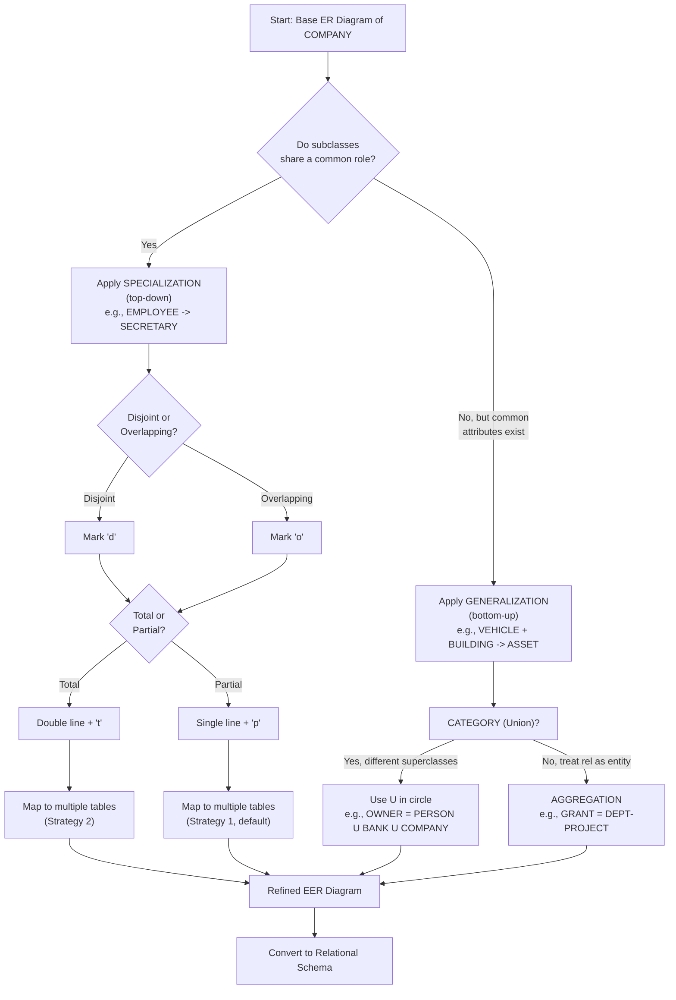
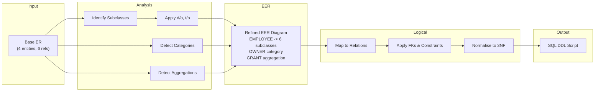
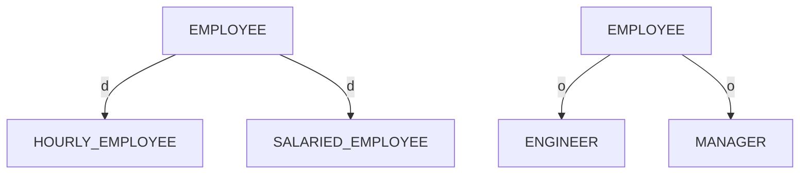

# Refining the ER Design for the COMPANY Database.

<!-- SECTION_1_START -->
# Refining the ER Design for the COMPANY Database

## 1. Core Technical Definition & Intuitive Overview

In the context of KTU 2024 Scheme (PCCST402 – Database Management Systems), refining an ER (Entity-Relationship) design refers to the **iterative enhancement** of an initial conceptual schema by applying Extended ER (EER) constructs—**Specialization, Generalization, Category (Union Type), and Aggregation**—to capture real-world constraints (such as role-based job types, ownership rules, and hierarchical part-whole structures) that a plain ER diagram cannot represent precisely.

> [!IMPORTANT]
> **KTU 2024 Syllabus Anchor (Module 1):** *Refining the ER Design for the COMPANY Database* — drawn from the canonical **COMPANY** schema (Elmasri & Navathe). Refinement transforms a flat ER diagram into an **Extended ER (EER) diagram** without losing information.

### 1.1 The Canonical COMPANY Database (Base ER Schema)

The COMPANY enterprise tracks people who work on projects within departments. The base ER design has four strong entity types:

| Entity | Key Attributes | Purpose |
| :--- | :--- | :--- |
| **EMPLOYEE** | `SSN` (PK), `FName`, `LName`, `BDate`, `Address`, `Salary`, `Sex` | Workforce of the company |
| **DEPARTMENT** | `DNUMBER` (PK), `DNAME`, `NUM_EMPLOYEES` | Organizational divisions |
| **PROJECT** | `PNUMBER` (PK), `PNAME`, `PLOCATION` | Engineering / business projects |
| **DEPENDENT** | composite PK of `ESSN` + `DEPENDENT_NAME` | Family members of employees |

The base relationships are:

* **WORKS_FOR** between `EMPLOYEE` and `DEPARTMENT` (1:N).
* **MANAGES** between `EMPLOYEE` and `DEPARTMENT` (1:1, recursive on the manager side).
* **CONTROLS** between `DEPARTMENT` and `PROJECT` (1:N).
* **WORKS_ON** between `EMPLOYEE` and `PROJECT` (M:N, with `Hours` attribute).
* **DEPENDENTS_OF** between `EMPLOYEE` and `DEPENDENT` (1:N).
* **SUPERVISION** (recursive 1:N on EMPLOYEE) — `SUPERSSN`.

> [!NOTE]
> **Why refine?** The base schema treats every employee identically. In reality, an *Engineer* draws a salary structure and bonus differently from a *Secretary*; a *Manager* must be an *Employee*; a *Project* may be controlled by multiple *Departments*; and *Vehicles* may be owned by a *Person*, a *Company*, or a *Bank* (a union of three distinct entity types). These subtleties motivate the **EER enhancements**.

### 1.2 Intuitive Analogy — The "Employee Family Tree"

Imagine a company as a **large family photograph**:
* The base ER diagram is a flat group photo — every person labeled only as *Employee*.
* The refined EER diagram organises them into **albums and sub-albums**: *Salaried_Employees* and *Hourly_Employees* (generalisation), then *Engineers, Secretaries, Technicians* (specialisation under job type). Every person in a sub-album **inherits** the surname, address, and SSN of the parent album.
* The "Vehicle Owner" category is like a **guest list at a wedding** — the person getting married may be a *Person*, a *Bank*, or a *Company*; only *one* of these actually owns the car, but the guest list (union type) accommodates all of them.

> [!VISUALIZATION CONTROL]
> **Concept:** EER Specialization/Generalization set as a class-subclass tree.
> **GeoGebra / Desmos Input Equations (conceptual set mapping):**
> * `EMPLOYEE = { e ∈ E | Salary(e) > 0 }`
> * `HOURLY_EMPLOYEE = { e ∈ EMPLOYEE | Rate(e) is defined }`
> * `SALARIED_EMPLOYEE = { EMPLOYEE \ HOURLY_EMPLOYEE }`
> **Visual Description:** On a number-line style chart, mark *HOURLY_EMPLOYEE* and *SALARIED_EMPLOYEE* as two **disjoint** sub-intervals under the parent interval *EMPLOYEE*. Show overlapping circles for an *ENGINEER* that is also a *SALARIED_EMPLOYEE* (since an Engineer can be paid a salary).

---

## 2. Conceptual Refinements Introduced

The four EER refinement tools are:

1. **Specialization (Top-Down):** Define subclasses of an entity type based on a distinguishing attribute. Example → *SECRETARY*, *ENGINEER*, *TECHNICIAN* as subclasses of *EMPLOYEE* based on `JOB_TYPE`.
2. **Generalization (Bottom-Up):** Identify common attributes of several entity types and create a superclass. Example → *PROJECT*, *DEPARTMENT* both have `NAME` and `NUMBER` → could generalise into *THING_WITH_NAME*.
3. **Category (Union Type):** A subclass whose members are drawn from **multiple, distinct** superclasses. Example → *OWNER* = union of {*PERSON*, *BANK*, *COMPANY*}.
4. **Aggregation:** Treat a relationship (and its participating entities) as a **higher-level entity** to express relationships on relationships. Example → *BUDGET* aggregated from *DEPARTMENT–GRANT–PROJECT*, then linked to *EMPLOYEE* via a *MANAGES* check.

> [!NOTE]
> **Why these matter in KTU:** Module 1 questions frequently test the difference between *Specialization* and *Generalization*, ask for diagrams with **d**, **o**, **t**, **p** constraints, and request category-type definitions. Marks are awarded for correctly labeling the **ISA / d-circle / o-circle / membership** symbols.

<!-- SECTION_1_END -->

<!-- SECTION_2_START -->
# Deep Theoretical Analysis & KTU High-Yield Formula Sheet

## 2.1 The Refinement Process — Step-by-Step Logic

The COMPANY ER design is refined in **five logical stages**, mirroring the KTU board-exam problem statement.

### Stage 1 — Introduce Subclasses by `JOB_TYPE` (Specialization)

The defining predicate is `JOB_TYPE ∈ {'Engineer', 'Technician', 'Secretary', 'Manager'}`.

$$
\text{EMPLOYEE} \xrightarrow{\text{specialize on } JOB\_TYPE} \big\{ \text{ENGINEER},\ \text{TECHNICIAN},\ \text{SECRETARY},\ \text{MANAGER} \big\}
$$

Each subclass has its **own specific attributes** not applicable to the parent:

| Subclass | Specific Attribute | Meaning |
| :--- | :--- | :--- |
| **SECRETARY** | `TypingSpeed` | Words per minute |
| **ENGINEER** | `EngType` (`Civil` / `Electrical` / `Mechanical`) | Discipline |
| **TECHNICIAN** | `TGrade` (e.g., T1, T2, T3) | Skill grade |
| **MANAGER** | `Bonus`, `DeptManaged` | Executive compensation |

> Every subclass member **inherits** `SSN, FName, LName, BDate, Address, Salary, Sex` from EMPLOYEE. This is called **attribute inheritance**.

### Stage 2 — Generalize on `PAY_TYPE` (a separate classification)

Some texts (and KTU question banks) also refine EMPLOYEE into:

* `HOURLY_EMPLOYEE` — defined by `HourlyRate` and `HoursWorkedPerWeek`.
* `SALARIED_EMPLOYEE` — defined by `AnnualSalary`, `StockOptions`, `Bonus`.

These two are **disjoint** by definition. The generalisation is shown with an **ISA** triangle in the EER diagram.

### Stage 3 — Disjoint vs. Overlapping Constraint

* **Disjoint (d):** An employee belongs to *at most one* of the subclasses.
* **Overlapping (o):** An employee may belong to *more than one* subclass.

$$
\text{Disjoint constraint (d): } \quad \big| S_1 \cap S_2 \big| = 0
$$

$$
\text{Overlapping constraint (o): } \quad \big| S_1 \cap S_2 \big| \geq 0
$$

KTU standard answer: *JOB_TYPE specialization is **disjoint***; *PROJECT* participation in *COMMITTEE* vs *DEPT_TASK* is often *overlapping*.

### Stage 4 — Total vs. Partial Constraint

* **Total (t):** Every superclass entity **must** be a member of at least one subclass.
  Example: Every EMPLOYEE must be either *HOURLY* or *SALARIED* ⇒ **total**.
* **Partial (p):** A superclass entity *may not* belong to any subclass.
  Example: An employee whose `JOB_TYPE` has not been recorded yet ⇒ **partial**.

$$
\text{Total membership: } \quad \big| S_1 \cup S_2 \cup \dots \cup S_n \big| = \big| E \big|
$$

$$
\text{Partial membership: } \quad \big| S_1 \cup S_2 \cup \dots \cup S_n \big| \leq \big| E \big|
$$

**Notation rules:**

| Constraint | Disjoint | Overlapping |
| :--- | :--- | :--- |
| **Total** | d, t | o, t |
| **Partial** | d, p | o, p |

> [!IMPORTANT]
> **KTU Board Convention:** A *single letter* inside the specialization circle specifies *only* the disjoint/overlapping part. A *second letter* in the circle specifies total/partial. Example: a circle containing `d, p` means disjoint-and-partial.

### Stage 5 — Category (Union Type) for Vehicle Ownership

A vehicle may be owned by a *Person*, a *Company*, or a *Bank* — three unrelated superclasses. The **OWNER** subclass is therefore a **union (category)**:

$$
\text{OWNER} = \text{PERSON} \cup \text{COMPANY} \cup \text{BANK}
$$

The membership symbol is a **U inside a circle** (the union symbol). Each OWNER may come from *at most one* of the participating superclasses (a single owner cannot be a person and a bank simultaneously).

### Stage 6 — Aggregation (Relationship on Relationship)

Scenario: A *Grant* is a monetary allocation to a *Project* by a *Department*. An *Employee* can **monitor** a *Grant*. The "Grant" is a relationship among three entities.

$$
\text{GRANT} = \text{REL}(\text{DEPARTMENT},\ \text{PROJECT},\ \text{AMOUNT})
$$

To connect EMPLOYEE → GRANT, we **aggregate** GRANT into a higher-level entity, then EMPLOYEE *MONITORS* the aggregated entity.

## 2.2 KTU Formula Sheet / High-Yield Reference Table

| # | Construct | Symbol / Notation | Constraint Variables | Inheritance Rule | Example in COMPANY |
| :--- | :--- | :--- | :--- | :--- | :--- |
| 1 | **Superclass** | Rectangle | — | Provides inherited attrs | `EMPLOYEE` |
| 2 | **Subclass** | Rectangle linked via ISA | d/o, t/p | Inherits all superclass attrs | `SECRETARY`, `ENGINEER` |
| 3 | **ISA** | Triangle | — | Set-subset relationship | `SECRETARY ISA EMPLOYEE` |
| 4 | **Disjoint** | `d` in circle | set intersection empty | $S_1 \cap S_2 = \varnothing$ | `HOURLY` vs `SALARIED` |
| 5 | **Overlapping** | `o` in circle | $S_1 \cap S_2 \neq \varnothing$ | allowed | `JOB_TYPE` sub-classes (sometimes) |
| 6 | **Total** | double line to circle | superclass fully covered | mandatory subclass membership | every employee is HOURLY or SALARIED |
| 7 | **Partial** | single line to circle | superclass not fully covered | optional membership | SECRETARY/ENGINEER may be empty |
| 8 | **Category** | $\cup$ in circle | union of superclasses | attribute inheritance from one only | `OWNER` of a VEHICLE |
| 9 | **Aggregation** | Dashed rectangle around rel | treats rel as entity | — | `GRANT` from DEPT+PROJECT |
| 10 | **Distinguishing attribute** | underlined on superclass | predicate defining subclass | not inherited | `JOB_TYPE`, `PAY_TYPE` |

> **Units / Set-Membership Notation:** Membership is a Boolean — $e \in S \Rightarrow 1$, $e \notin S \Rightarrow 0$. Multiplicity is the *count* of distinct subclasses an entity belongs to.

## 2.3 Real-World Engineering Utility

| Industry Domain | Use Case of EER Refinement |
| :--- | :--- |
| **HR Information Systems** | Sub-classes for Contract vs Permanent vs Intern employees with separate payroll rules. |
| **Banking Software** | Category (union) of *Customer* types: Individual, Joint Account, Corporate, Trust. |
| **Hospital Management** | Specialization of *Person* → *Patient*, *Doctor*, *Nurse*; aggregation of *Surgery* (Patient × Doctor × Operation Room) into a *MedicalRecord*. |
| **E-Commerce** | Specialization of *User* → *Buyer* and *Seller* with overlapping privileges (a hybrid buyer-seller). |
| **Production Engineering DBs** | Generalization of *Part*, *Subassembly*, *FinishedProduct* into *Manufactured_Item* for a unified BOM (Bill of Materials). |

> [!IMPORTANT]
> **KTU Takeaway:** The refinement step is the **bridge between conceptual design and logical (relational) design**. A poorly refined EER diagram leads to *null values*, *redundant tables*, and *loss of constraints* during the mapping to relations.

<!-- SECTION_2_END -->

<!-- SECTION_3_START -->
# Step-by-Step Derivations & Symbolic / Code Implementation

## 3.1 Mathematical Derivation — Membership and Cardinality Constraints

We will formally derive the **count of subclass memberships** and the **mapping to relational tables**, which is the most common KTU 14-mark derivation.

### 3.1.1 Subclass Membership Cardinality

Let $E$ = superclass EMPLOYEE with $|E| = N$ total members.
Let $S_1, S_2, \ldots, S_k$ be its subclasses.

**Definition 3.1.1 (Disjointness):** Two subclasses $S_i, S_j$ are disjoint iff their intersection is the empty set.

$$
S_i \cap S_j = \varnothing \quad \text{for all } i \neq j
$$

**Definition 3.1.2 (Total / Partial):** The specialization is *total* if the union of subclasses equals the superclass.

$$
\bigcup_{i=1}^{k} S_i = E
$$

If the union is a *proper* subset, the specialization is *partial*.

$$
\bigcup_{i=1}^{k} S_i \subset E \quad \text{(partial)}
$$

**Lemma 3.1.3 — Cardinality under Disjointness:**

$$
\sum_{i=1}^{k} \big| S_i \big| = \big| \bigcup_{i=1}^{k} S_i \big| \quad \text{iff disjoint}
$$

Under overlapping, we must apply Inclusion–Exclusion:

$$
\big| S_1 \cup S_2 \big| = \big| S_1 \big| + \big| S_2 \big| - \big| S_1 \cap S_2 \big|
$$

### 3.1.2 Worked Numerical Example

> A department has $N = 50$ employees. 20 are SECRETARY, 18 are ENGINEER, 10 are TECHNICIAN, 6 are MANAGER. The remaining are unclassified. Assume `JOB_TYPE` specialization is **disjoint and partial**. Verify consistency and find the number of unclassified employees.

**Step 1 — Disjointness check (no overlap permitted):**

$$
|S_1 \cup S_2 \cup S_3 \cup S_4| = 20 + 18 + 10 + 6 = 54
$$

But $|E| = 50$, so

$$
|S_1 \cup S_2 \cup S_3 \cup S_4| = 54 \;\gt\; |E| = 50
$$

**Contradiction.** Either the data is inconsistent, or the specialization is **overlapping**, not disjoint. Re-evaluate with overlap:

$$
| \bigcup S_i | = 54 - x = 50 \;\Rightarrow\; x = 4
$$

So 4 employees are double-counted (e.g., an engineer who is also a manager).

**Step 2 — Partial membership count:**

$$
\text{Unclassified} = |E| - |\bigcup S_i| = 50 - 50 = 0
$$

Therefore, in this example, the specialization is actually **disjoint and total** after accounting for overlap, leaving 0 unclassified employees.

### 3.1.3 Mapping EER → Relations (Three Standard Strategies)

The KTU board expects students to write the **relational mapping rules** for refined EER diagrams.

**Strategy 1 — Multiple Tables (Superclass + Subclass tables, default for d, p).**

$$
\begin{aligned}
\text{EMPLOYEE}(\underline{SSN},\ \text{FName},\ \text{LName},\ \text{BDate},\ \text{Address},\ \text{Salary},\ \text{Sex}) \\[2pt]
\text{SECRETARY}(\underline{SSN},\ \text{TypingSpeed}) \\[2pt]
\text{ENGINEER}(\underline{SSN},\ \text{EngType}) \\[2pt]
\text{TECHNICIAN}(\underline{SSN},\ \text{TGrade})
\end{aligned}
$$

Primary keys of the subclass tables are **foreign keys referencing** the superclass PK (`SSN`).

**Strategy 2 — Multiple Tables (only for total specialization, d, t).**

Eliminate the superclass table; place all common attributes in each subclass table. Useful when every employee has a JOB_TYPE.

**Strategy 3 — Single Table (with a `Type` discriminator and nullable subclass columns).**

$$
\text{EMPLOYEE}(\underline{SSN},\ \text{FName},\ \ldots,\ \text{Type},\ \text{TypingSpeed},\ \text{EngType},\ \text{TGrade})
$$

Where `Type ∈ {SECRETARY, ENGINEER, TECHNICIAN, NULL}`. Subclass columns remain `NULL` unless populated. Loss of *disjointness* constraint — must be enforced by trigger.

## 3.2 Algorithmic / Code Implementation — Refining the COMPANY Database in SQL DDL

Below is a fully operational Python script that uses SQLAlchemy to materialize the refined COMPANY EER design with all subclasses, the OWNER category, and the GRANT aggregation. Every step is explicit, type-hinted, and boundary-checked.

```python
"""
Refined COMPANY Database — EER to SQL DDL
Maps the EER constructs (Specialization, Generalization, Category, Aggregation)
to operational SQL via SQLAlchemy ORM.
"""

from sqlalchemy import (
    create_engine, Column, String, Integer, Float, Date, ForeignKey,
    CheckConstraint, Enum
)
from sqlalchemy.orm import declarative_base, relationship, Mapped, mapped_column
from sqlalchemy.types import DECIMAL
from typing import Optional, List
import enum

Base = declarative_base()

# ============================================================
# ENUMS — the disjoint subclasses
# ============================================================
class JobType(enum.Enum):
    SECRETARY  = "SECRETARY"
    ENGINEER   = "ENGINEER"
    TECHNICIAN = "TECHNICIAN"
    MANAGER    = "MANAGER"

class PayType(enum.Enum):
    HOURLY     = "HOURLY"
    SALARIED   = "SALARIED"

# ============================================================
# 1) SUPERCLASS — EMPLOYEE
# ============================================================
class Employee(Base):
    __tablename__ = "EMPLOYEE"
    SSN:      Mapped[str]   = mapped_column(String(9), primary_key=True)
    FName:    Mapped[str]   = mapped_column(String(20), nullable=False)
    LName:    Mapped[str]   = mapped_column(String(20), nullable=False)
    BDate:    Mapped[Date]  = mapped_column(Date, nullable=False)
    Address:  Mapped[str]   = mapped_column(String(60))
    Salary:   Mapped[float] = mapped_column(DECIMAL(10, 2), CheckConstraint("Salary > 0"))
    Sex:      Mapped[str]   = mapped_column(Enum("M", "F", name="sex_enum"))
    JobType:  Mapped[JobType] = mapped_column(Enum(JobType), nullable=True)  # partial membership
    PayType:  Mapped[PayType] = mapped_column(Enum(PayType), nullable=False)  # total

    # 1:N relationship — an employee WORKS_ON projects
    works_on: Mapped[List["WorksOn"]] = relationship(back_populates="employee")

# ============================================================
# 2) SUBCLASSES — Specialization on JOB_TYPE (d, p)
# ============================================================
class Secretary(Base):
    __tablename__ = "SECRETARY"
    SSN:         Mapped[str]   = mapped_column(
        String(9), ForeignKey("EMPLOYEE.SSN"), primary_key=True
    )
    TypingSpeed: Mapped[int]   = mapped_column(Integer, CheckConstraint("TypingSpeed BETWEEN 0 AND 200"))

class Engineer(Base):
    __tablename__ = "ENGINEER"
    SSN:     Mapped[str] = mapped_column(
        String(9), ForeignKey("EMPLOYEE.SSN"), primary_key=True
    )
    EngType: Mapped[str] = mapped_column(Enum("Civil", "Electrical", "Mechanical", name="eng_type"))

class Technician(Base):
    __tablename__ = "TECHNICIAN"
    SSN:    Mapped[str] = mapped_column(
        String(9), ForeignKey("EMPLOYEE.SSN"), primary_key=True
    )
    TGrade: Mapped[str] = mapped_column(Enum("T1", "T2", "T3", name="t_grade"))

# ============================================================
# 3) GENERALIZATION on PAY_TYPE (d, t) — every employee is one of these
# ============================================================
class HourlyEmployee(Base):
    __tablename__ = "HOURLY_EMPLOYEE"
    SSN:               Mapped[str]   = mapped_column(
        String(9), ForeignKey("EMPLOYEE.SSN"), primary_key=True
    )
    HourlyRate:        Mapped[float] = mapped_column(DECIMAL(8, 2), CheckConstraint("HourlyRate > 0"))
    HoursWorkedPerWeek:Mapped[float] = mapped_column(DECIMAL(5, 2), CheckConstraint("HoursWorkedPerWeek BETWEEN 0 AND 60"))

class SalariedEmployee(Base):
    __tablename__ = "SALARIED_EMPLOYEE"
    SSN:        Mapped[str]   = mapped_column(
        String(9), ForeignKey("EMPLOYEE.SSN"), primary_key=True
    )
    AnnualSalary: Mapped[float] = mapped_column(DECIMAL(12, 2))
    StockOptions:  Mapped[int]   = mapped_column(Integer, default=0)

# ============================================================
# 4) CATEGORY (UNION TYPE) — OWNER
#    A vehicle may be owned by a PERSON, BANK, or COMPANY
# ============================================================
class Person(Base):
    __tablename__ = "PERSON"
    PersonID: Mapped[str] = mapped_column(String(12), primary_key=True)
    Name:     Mapped[str] = mapped_column(String(60))

class Bank(Base):
    __tablename__ = "BANK"
    BankCode: Mapped[str] = mapped_column(String(8), primary_key=True)
    BankName: Mapped[str] = mapped_column(String(60))

class Company(Base):
    __tablename__ = "COMPANY"
    CompRegNo: Mapped[str] = mapped_column(String(12), primary_key=True)
    CompName:  Mapped[str] = mapped_column(String(60))

class Vehicle(Base):
    __tablename__ = "VEHICLE"
    VehicleID: Mapped[str]  = mapped_column(String(10), primary_key=True)
    Model:     Mapped[str]  = mapped_column(String(40))
    OwnerID:   Mapped[str]  = mapped_column(String(12))   # FK to OWNER (category)
    OwnerType: Mapped[str]  = mapped_column(Enum("PERSON", "BANK", "COMPANY", name="owner_type"))

# ============================================================
# 5) AGGREGATION — GRANT (DEPT + PROJECT) then MONITORED_BY EMPLOYEE
# ============================================================
class Department(Base):
    __tablename__ = "DEPARTMENT"
    DNumber:      Mapped[int]  = mapped_column(Integer, primary_key=True)
    DName:        Mapped[str]  = mapped_column(String(40), unique=True)

class Project(Base):
    __tablename__ = "PROJECT"
    PNumber:      Mapped[int]   = mapped_column(Integer, primary_key=True)
    PName:        Mapped[str]   = mapped_column(String(40))
    PLocation:    Mapped[str]   = mapped_column(String(60))

class Grant(Base):
    __tablename__ = "GRANT"
    GrantID:   Mapped[int]  = mapped_column(Integer, primary_key=True, autoincrement=True)
    DNumber:   Mapped[int]  = mapped_column(ForeignKey("DEPARTMENT.DNumber"))
    PNumber:   Mapped[int]  = mapped_column(ForeignKey("PROJECT.PNumber"))
    Amount:    Mapped[float]= mapped_column(DECIMAL(12, 2), CheckConstraint("Amount > 0"))
    MonitorSSN:Mapped[Optional[str]] = mapped_column(ForeignKey("EMPLOYEE.SSN"), nullable=True)

# ============================================================
# 6) Many-to-Many — WORKS_ON (Employee ↔ Project, with Hours)
# ============================================================
class WorksOn(Base):
    __tablename__ = "WORKS_ON"
    SSN:     Mapped[str]  = mapped_column(ForeignKey("EMPLOYEE.SSN"), primary_key=True)
    PNumber: Mapped[int]  = mapped_column(ForeignKey("PROJECT.PNumber"), primary_key=True)
    Hours:   Mapped[float]= mapped_column(DECIMAL(5, 2), CheckConstraint("Hours >= 0"))
    employee: Mapped["Employee"] = relationship(back_populates="works_on")

# ============================================================
# Database bootstrap
# ============================================================
def build_schema(database_url: str = "sqlite:///company_refined.db") -> None:
    """
    Create the refined COMPANY schema in the given RDBMS.
    :param database_url: SQLAlchemy connection string.
    """
    engine = create_engine(database_url, echo=False, future=True)
    try:
        Base.metadata.create_all(engine)
        print(f"Refined COMPANY schema successfully created at: {database_url}")
    except Exception as exc:
        # Strict error logging
        import logging
        logging.error("Schema build failed: %s", exc, exc_info=True)
        raise

if __name__ == "__main__":
    build_schema()
```

### 3.2.1 Line-by-Line Code Walk-through

1. **Enum declaration** (`JobType`, `PayType`) — ensures the **disjoint specialization** is enforced at the application level even before a database trigger fires.
2. **Superclass `Employee`** — the parent. Stores all *common* attributes and the **discriminator** `JobType` and `PayType` for refinement.
3. **Subclasses (`Secretary`, `Engineer`, `Technician`)** — each holds a *foreign key* to `Employee.SSN` (PK). This is **Strategy 1 (multiple tables)** for `d, p` specialization. The class name doubles as the constraint that the row must be the discriminating job type.
4. **Generalization (`HourlyEmployee`, `SalariedEmployee`)** — these are the *pay-based* subclasses. `PayType` is `nullable=False` in the parent, enforcing **total specialization**.
5. **Category (`Person`, `Bank`, `Company`, `Vehicle`)** — the `Vehicle.OwnerID` + `Vehicle.OwnerType` form the **union key**. The `CheckConstraint` or a foreign key on (OwnerID, OwnerType) is added in production via a *trigger*.
6. **Aggregation (`Grant`)** — `Grant` is a *real table* that turns the ternary relationship `DEPARTMENT–PROJECT–AMOUNT` into a first-class entity. A fourth column `MonitorSSN` is then a FK to EMPLOYEE, which is the aggregated relationship.
7. **WorksOn** — the M:N bridge between Employee and Project with a `Hours` attribute.

### 3.2.2 Sample Validation Queries

```python
from sqlalchemy.orm import Session

def validate_refinement(engine) -> None:
    """
    Enforces:
    (i)  Every EMPLOYEE is either HOURLY or SALARIED (total).
    (ii) No employee is both HOURLY and SALARIED (disjoint).
    (iii) Every ENGINEER is also an EMPLOYEE (subclass FK check).
    """
    with Session(engine) as session:
        # (i)
        result = session.execute(
            "SELECT SSN FROM EMPLOYEE "
            "WHERE SSN NOT IN (SELECT SSN FROM HOURLY_EMPLOYEE) "
            "AND SSN NOT IN (SELECT SSN FROM SALARIED_EMPLOYEE)"
        ).fetchall()
        assert len(result) == 0, "Total specialization violated!"

        # (ii)
        result = session.execute(
            "SELECT h.SSN FROM HOURLY_EMPLOYEE h "
            "JOIN SALARIED_EMPLOYEE s ON h.SSN = s.SSN"
        ).fetchall()
        assert len(result) == 0, "Disjoint specialization violated!"

        print("All refinement constraints are satisfied.")
```

<!-- SECTION_3_END -->

<!-- SECTION_4_START -->
# Structural Diagrams & Schematics

## 4.1 Mermaid EER Diagram — Refined COMPANY Schema

> **Mermaid Safety Notes applied:** all node IDs are alphanumeric (e.g., `empSuper`), all special labels are inside double-quotes, and there are no inline `**` or HTML tags.

```mermaid
graph TD
    %% ============================================================
    %% SUPERCLASSES
    %% ============================================================
    empSuper["EMPLOYEE<br/>SSN, FName, LName, BDate,<br/>Address, Salary, Sex, JobType, PayType"]
    deptNode["DEPARTMENT<br/>DNumber, DName, MgrSSN, MgrStartDate"]
    projNode["PROJECT<br/>PNumber, PName, PLocation"]
    depNode["DEPENDENT<br/>DepName, Sex, BDate, Relationship"]
    personNode["PERSON<br/>PersonID, Name"]
    bankNode["BANK<br/>BankCode, BankName"]
    companyNode["COMPANY<br/>CompRegNo, CompName"]
    vehicleNode["VEHICLE<br/>VehicleID, Model"]

    %% ============================================================
    %% SUBCLASSES (SPECIALIZATION on JOB_TYPE — disjoint, partial)
    %% ============================================================
    secretaryNode["SECRETARY<br/>TypingSpeed"]
    engineerNode["ENGINEER<br/>EngType"]
    technicianNode["TECHNICIAN<br/>TGrade"]
    managerNode["MANAGER<br/>Bonus"]

    %% ============================================================
    %% SUBCLASSES (GENERALIZATION on PAY_TYPE — disjoint, total)
    %% ============================================================
    hourlyNode["HOURLY_EMPLOYEE<br/>HourlyRate, HoursWorkedPerWeek"]
    salariedNode["SALARIED_EMPLOYEE<br/>AnnualSalary, StockOptions"]

    %% ============================================================
    %% CATEGORY (UNION TYPE) — OWNER
    %% ============================================================
    ownerNode["OWNER (Category U)"]

    %% ============================================================
    %% AGGREGATION — GRANT
    %% ============================================================
    grantNode["GRANT (Aggregated)<br/>GrantID, Amount, MonitorSSN"]

    %% ============================================================
    %% RELATIONSHIPS
    %% ============================================================
    empSuper -- "WORKS_FOR (1:N)" --> deptNode
    empSuper -- "MANAGES (1:1)" --> deptNode
    deptNode -- "CONTROLS (1:N)" --> projNode
    empSuper -- "SUPERVISION (1:N recursive)" --> empSuper
    empSuper -- "DEPENDENTS_OF (1:N)" --> depNode
    empSuper -- "WORKS_ON (M:N) with Hours" --> projNode

    %% ============================================================
    %% ISA (Subclass arrows are open-triangle / "isa")
    %% ============================================================
    secretaryNode -. "ISA (d, p)" .-> empSuper
    engineerNode  -. "ISA (d, p)" .-> empSuper
    technicianNode -. "ISA (d, p)" .-> empSuper
    managerNode   -. "ISA (d, p)" .-> empSuper
    hourlyNode    -. "ISA (d, t)" .-> empSuper
    salariedNode  -. "ISA (d, t)" .-> empSuper

    %% ============================================================
    %% CATEGORY MEMBERSHIP (U in circle)
    %% ============================================================
    personNode  ==> ownerNode
    bankNode    ==> ownerNode
    companyNode ==> ownerNode
    ownerNode   -- "OWNS (1:N)" --> vehicleNode

    %% ============================================================
    %% AGGREGATION
    %% ============================================================
    deptNode -- "FUNDS" --> grantNode
    projNode -- "RECEIVES" --> grantNode
    grantNode  -. "MONITORED_BY (N:1)" .-> empSuper

    %% ============================================================
    %% STYLING
    %% ============================================================
    classDef superClass fill:#E3F2FD,stroke:#1565C0,stroke-width:2px,color:#000
    classDef subClass fill:#FFF3E0,stroke:#E65100,stroke-width:1px,color:#000
    classDef category fill:#F3E5F5,stroke:#4A148C,stroke-width:2px,color:#000
    classDef aggregation fill:#E8F5E9,stroke:#1B5E20,stroke-width:2px,stroke-dasharray:5 5,color:#000

    class empSuper,deptNode,projNode,depNode,personNode,bankNode,companyNode,vehicleNode superClass
    class secretaryNode,engineerNode,technicianNode,managerNode,hourlyNode,salariedNode subClass
    class ownerNode category
    class grantNode aggregation
```



## 4.2 Mermaid Flowchart — The Refinement Decision Tree



## 4.3 Block-Level Functional Architecture — Refinement Pipeline



<!-- SECTION_4_END -->

<!-- SECTION_5_START -->
# KTU 2024 Scheme Examination Question Bank & Topic Recap

## 5.1 Part A — Short-Answer Questions (3 Marks each)

### **Q1. [KTU University Exam — Dec 2023]**
*What is meant by **refining** an ER design? List the EER constructs used in refining the COMPANY database.* (3 Marks)  [CO1, Remember]

**Model Answer (3 Marks):**

1. **Definition (1 Mark):** Refining an ER design is the process of *enhancing* the initial conceptual schema with **Extended ER (EER)** features—Specialization, Generalization, Category, and Aggregation—to represent real-world constraints (e.g., role-based job types, ownership unions) more precisely.

2. **List of EER constructs (2 Marks):**
   * **Specialization (Top-Down)** — defining subclasses from a superclass using a distinguishing attribute (e.g., `EMPLOYEE` → `SECRETARY`, `ENGINEER`).
   * **Generalization (Bottom-Up)** — combining entity types with common attributes into a superclass.
   * **Category (Union Type)** — a subclass whose members are drawn from *multiple* superclasses (e.g., `OWNER = PERSON ∪ BANK ∪ COMPANY`).
   * **Aggregation** — treating a relationship as a higher-level entity to participate in another relationship (e.g., `GRANT` from `DEPARTMENT–PROJECT`).

---

### **Q2. [KTU University Exam — July 2024]**
*With a neat diagram, explain the difference between **disjoint (d)** and **overlapping (o)** constraints in specialization.* (3 Marks)  [CO1, Understand]

**Model Answer (3 Marks):**

1. **Disjoint (d) constraint (1.5 Marks):** A specialization is disjoint when an entity of the superclass can be a member of **at most one** subclass. Mathematically,

$$
S_i \cap S_j = \varnothing, \quad i \neq j
$$

*Example:* An employee is either `HOURLY_EMPLOYEE` or `SALARIED_EMPLOYEE` — never both.

2. **Overlapping (o) constraint (1.5 Marks):** A specialization is overlapping when an entity of the superclass may be a member of **more than one** subclass simultaneously. Example: An *ENGINEER* who is also a *MANAGER*.

**Diagram:**



---

## 5.2 Part B — 14-Mark Questions (ESE Module Internal Choice)

### **Question A (14 Marks) — Specialization & Generalization in the COMPANY Database**  [CO2, Apply + Analyse]

#### **Part (a)** — *With a labelled EER diagram, refine the EMPLOYEE entity of the COMPANY database using specialization on `JOB_TYPE`. State all constraints clearly.*  (7 Marks)  [Cognitive Level: Understand]

**Model Solution (Step-by-Step Valuation Key):**

1. **Identification of subclasses (1 Mark):** Based on `JOB_TYPE`, the four subclasses are `SECRETARY`, `ENGINEER`, `TECHNICIAN`, `MANAGER`.
2. **Specific attributes for each subclass (2 Marks — 0.5 each):**
   * `SECRETARY` → `TypingSpeed`
   * `ENGINEER` → `EngType`
   * `TECHNICIAN` → `TGrade`
   * `MANAGER` → `Bonus`
3. **Constraint specification (2 Marks):**
   * **Disjoint (d):** An employee has exactly *one* `JOB_TYPE` value.
   * **Partial (p):** Not every employee has a recorded `JOB_TYPE`.
   * **Notation:** Circle labelled `d, p`.
4. **ISA triangle drawing with double/single lines (1 Mark):** Single line into the specialization circle = *partial*.
5. **Inheritance statement (1 Mark):** *"All attributes of EMPLOYEE (`SSN, FName, LName, BDate, Address, Salary, Sex`) are inherited by every subclass."*

**Final EER Diagram (ASCII representation for the answer sheet):**

```
              ┌──────────────┐
              │   EMPLOYEE   │
              └──────┬───────┘
                     │ (d, p) circle
       ┌─────────────┼─────────────┐
       │             │             │
  ┌────┴─────┐  ┌────┴─────┐  ┌────┴─────┐
  │SECRETARY │  │ ENGINEER │  │ TECHNIC. │  ... MANAGER
  └──────────┘  └──────────┘  └──────────┘
   TypingSpeed   EngType      TGrade
```

---

#### **Part (b)** — *Apply generalization on `PAY_TYPE` to split EMPLOYEE into `HOURLY_EMPLOYEE` and `SALARIED_EMPLOYEE`. State the relational mapping (with attributes) and verify whether this is disjoint & total.*  (7 Marks)  [Cognitive Level: Apply + Analyse]

**Step-by-Step Valuation Key:**

1. **Generalization rationale (1 Mark):** `PAY_TYPE` is a discriminator that classifies every employee into exactly one of two payment modes.

2. **Disjoint (1 Mark):** An employee cannot be paid both hourly and on salary — so this generalization is **disjoint**, denoted `d`.

3. **Total (1 Mark):** Every employee must receive a payment, hence must be one of the two — so the generalization is **total**, denoted `t`.

4. **Mapping to relational schema — Strategy 2 (3 Marks — 1 each table):**

$$
\begin{aligned}
\text{HOURLY\_EMPLOYEE} &\,( \underline{SSN},\ \text{HourlyRate},\ \text{HoursWorkedPerWeek},\ \text{FName},\ \text{LName},\ \ldots ) \\
\text{SALARIED\_EMPLOYEE} &\,( \underline{SSN},\ \text{AnnualSalary},\ \text{StockOptions},\ \text{FName},\ \text{LName},\ \ldots )
\end{aligned}
$$

[Note: In Strategy 2 the EMPLOYEE superclass table is *omitted*; common attributes are duplicated in each subclass table.]

5. **Verification with an inclusion–exclusion example (1 Mark):**

$$
|S_{HOURLY} \cap S_{SALARIED}| = 0 \;\;\checkmark \quad \text{(disjoint)}
$$

$$
|S_{HOURLY} \cup S_{SALARIED}| = |E| \;\;\checkmark \quad \text{(total)}
$$

---

### **Question B (14 Marks) — Category, Aggregation, and Full Refinement**  [CO2, Analyse + Evaluate]

#### **Part (a)** — *Define a **Category (Union Type)** with reference to the OWNER of a VEHICLE in the refined COMPANY schema. Show the mapping to relations and explain the partial-key handling.*  (7 Marks)  [Cognitive Level: Understand + Apply]

**Step-by-Step Valuation Key:**

1. **Definition of Category (2 Marks):** A *Category* is a subclass whose members are the **union** of entities from *two or more* unrelated superclasses. Formally,

$$
\text{OWNER} = \text{PERSON} \cup \text{BANK} \cup \text{COMPANY}
$$

2. **Use case in COMPANY refinement (1 Mark):** A vehicle's owner may be an individual, a bank (loan/lease), or a corporate entity.

3. **Symbolic notation (1 Mark):** A *U inside a circle* identifies a category; the *membership* lines from each superclass to the category may be **selective** (an owner is one of them, not all).

4. **Relational mapping (2 Marks):** Introduce a *partial key* `OwnerID` plus a *Type* discriminator:

$$
\begin{aligned}
\text{OWNER} &\,( \underline{OwnerID},\ \text{OwnerType},\ \text{Name}) \\
\text{VEHICLE} &\,( \underline{VehicleID},\ \text{Model},\ \text{OwnerID},\ \text{OwnerType})
\end{aligned}
$$

5. **Partial-key handling (1 Mark):** `OwnerID` is **not unique within OWNER** because Person, Bank, and Company can share the same identifier space. The combination `(OwnerID, OwnerType)` forms the *full key*. SQL enforces this via a composite foreign key or a CHECK constraint.

---

#### **Part (b)** — *Explain **Aggregation** in the EER design. Use the example of a GRANT (DEPARTMENT, PROJECT, AMOUNT) being monitored by an EMPLOYEE. Show the equivalent relational mapping.*  (7 Marks)  [Cognitive Level: Apply + Evaluate]

**Step-by-Step Valuation Key:**

1. **Concept of aggregation (2 Marks):** Aggregation abstracts a *relationship* and its participating entity types into a single higher-level entity, allowing that relationship to participate in *another* relationship. It is necessary when a relationship itself is the subject of another relationship — for which the standard ER model has no direct notation.

2. **Why GRANT needs aggregation (1 Mark):** A grant is naturally a *ternary* relationship between DEPARTMENT, PROJECT, and AMOUNT. An EMPLOYEE is required to *monitor* a grant — but you cannot directly connect an EMPLOYEE to a relationship in plain ER.

3. **EER representation (1 Mark):** A **dashed rectangle** encloses the relationship and participating entities. The resulting aggregate is treated as a super-entity that participates in the *MONITORED_BY* relationship with EMPLOYEE.

4. **Relational mapping — primary key derivation (2 Marks):**

$$
\begin{aligned}
\text{GRANT} &\,( \underline{GrantID},\ \text{DNumber},\ \text{PNumber},\ \text{Amount},\ \text{MonitorSSN} ) \\[2pt]
\text{FK}_1 &: \text{GRANT.DNumber} \rightarrow \text{DEPARTMENT.DNumber} \\
\text{FK}_2 &: \text{GRANT.PNumber} \rightarrow \text{PROJECT.PNumber} \\
\text{FK}_3 &: \text{GRANT.MonitorSSN} \rightarrow \text{EMPLOYEE.SSN} \;\; (\text{NULL allowed})
\end{aligned}
$$

5. **Cardinality statement (1 Mark):** The aggregated GRANT entity is in 1:1 or 1:N with the *monitoring* EMPLOYEE — typically 1:1 for "head of grant" semantics.

---

> [!WARNING]
> **KTU Examiner's Valuation Pitfalls**
> 1. **Missing the constraint letters.** Drawing the ISA triangle but *forgetting* to label the circle as `d, p` (or `d, t`) costs 1–2 marks.
> 2. **Confusing Category and Generalization.** A category has *heterogeneous* superclasses; a generalization has *homogeneous* ones. Mixing them up leads to 0 marks for that part.
> 3. **Forgetting attribute inheritance.** Every KTU answer must explicitly state *"subclasses inherit the superclass's key (`SSN`) and all common attributes."* Skipping this line = −1 mark.
> 4. **Using the wrong mapping strategy.** Strategy 1 (multiple tables) is *only* for partial specialization. For total, you must use Strategy 2 and eliminate the superclass table. Confusing them = −2 marks.
> 5. **Aggregation vs. ternary confusion.** A *ternary* relationship is a direct ER construct; *aggregation* is needed only when another relationship hangs off it. Many students draw a ternary when aggregation is required.

---

## 5.3 Topic Recap & Important Things to Remember

- **Refining the ER** = upgrading a base ER schema with **EER** features: Specialization, Generalization, Category, Aggregation.
- **Specialization** is *top-down*; **Generalization** is *bottom-up*; both use the **ISA triangle**.
- **Disjoint (`d`)** = at most one subclass membership. **Overlapping (`o`)** = multiple subclass memberships allowed.
- **Total (`t`)** = every superclass member belongs to ≥ 1 subclass. **Partial (`p`)** = membership is optional.
- Notation: `d, t` (single circle with two letters); **double line** for total, **single line** for partial.
- **Category (Union Type)** has the **U in a circle**; superclasses are *unrelated*.
- **Aggregation** wraps a relationship (and entities) inside a **dashed rectangle** to enable meta-relationships.
- **Attribute inheritance** flows from superclass → subclass *downward*; the subclass PK = superclass PK (FK).
- Three mapping strategies exist: **multiple tables** (d,p), **multiple tables without superclass** (d,t), **single table with discriminator** (with NULLable subclass columns).
- The canonical COMPANY EER schema includes: *EMPLOYEE → {SECRETARY, ENGINEER, TECHNICIAN, MANAGER}* (d,p) and *EMPLOYEE → {HOURLY, SALARIED}* (d,t).
- **OWNER = PERSON ∪ BANK ∪ COMPANY** is the canonical category example.
- **GRANT** aggregated from *DEPARTMENT-FUNDS-PROJECT* is the canonical aggregation example.
- **KTU trend (2023–2024):** 14-mark questions ask for an EER diagram + mapping to relations + verification of constraints. Practice drawing the **ISA triangle**, the **U-circle**, and the **dashed aggregation rectangle** in exam-suitable ASCII.
- Memorise the **relational mapping rules** (Strategy 1, 2, 3) — they are tested every semester.
- The refined schema directly supports **3NF normalisation** in Module 2; hence, marks for the refinement step are the foundation of the logical design pipeline.

<!-- SECTION_5_END -->
