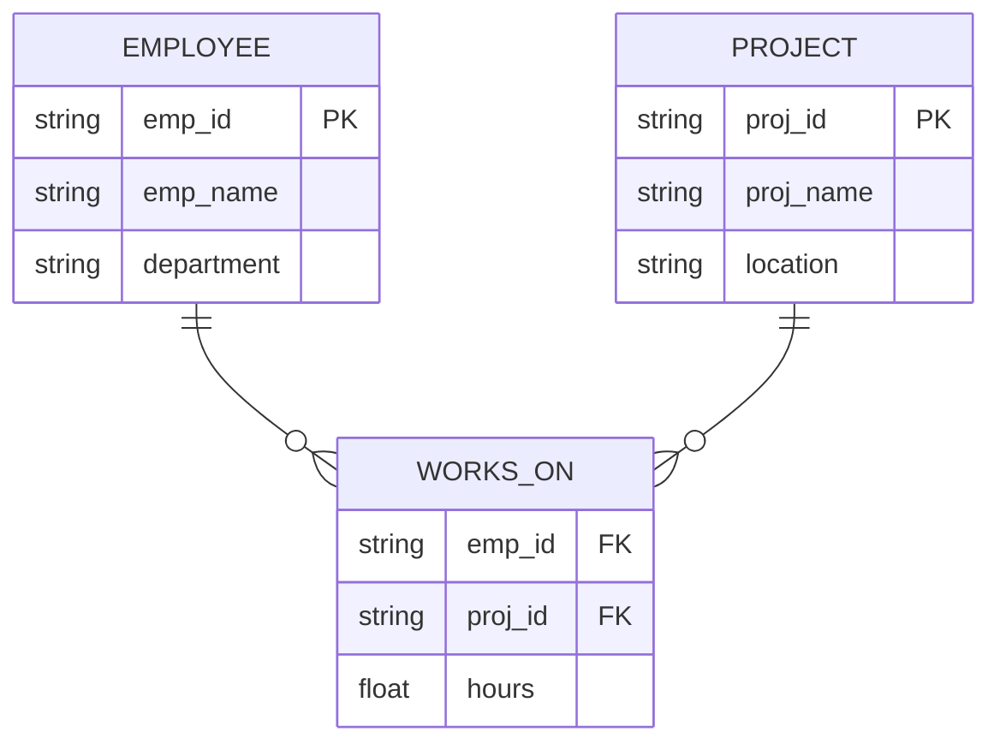
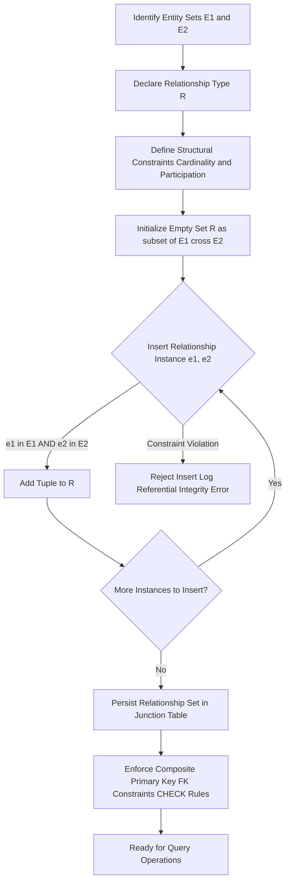
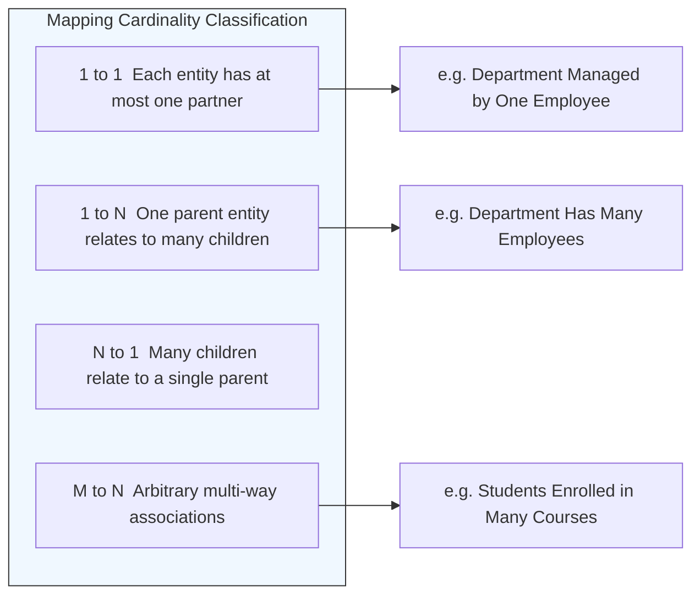

# Relationship Sets

> **APJ ABDUL KALAM TECHNOLOGICAL UNIVERSITY (KTU) | 2024 SCHEME**
> - **Branch:** B.Tech in Computer Science & Engineering (CSE)
> - **Semester:** Semester 4
> - **Course:** PCCST402 - DATABASE MANAGEMENT SYSTEMS
> - **Module:** Module 1: Introduction to Databases
> - **Topic:** Relationship Sets

<!-- SECTION_1_START -->
## 1. Core Technical Definition & Intuitive Overview

### 1.1 Formal Academic Definition

In the **Entity–Relationship (ER) data model**, a **Relationship Set** is a mathematically rigorous collection (set) of all relationship instances of the same type that exist at a particular point in time within the database. Formally, if $E_1, E_2, \dots, E_n$ are $n$ participating entity sets (where $n \geq 2$), then a relationship set $R$ is a subset of the Cartesian product of those entity sets:

$$
R \subseteq \{(e_1, e_2, \dots, e_n) \mid e_1 \in E_1, e_2 \in E_2, \dots, e_n \in E_n\}
$$

Each ordered tuple $(e_1, e_2, \dots, e_n)$ is called a **relationship instance** (or relationship occurrence). The current *value* (state) of the relationship set at a moment in time is therefore a **relation** in the strict mathematical sense — a subset of all possible $n$-tuples drawn from the participating entity sets.

> [!IMPORTANT]
> **KTU 2024 Syllabus Highlight**
> A relationship set is a *set*, not a *multiset*. Duplicate relationship instances are not permitted because mathematical sets contain distinct elements. Also, a *relationship type* (the schema/intension) is distinct from a *relationship set* (the current extension/instance).

### 1.2 Conceptual Analogy / Intuition

Think of a relationship set like the **"Friendships" ledger of a college campus** at a single point in time.

- **Entity sets** = the categories of people involved (e.g., *Students*, *Clubs*).
- **Relationship set** = the *complete, current list* of every active friendship tuple — every pair $(s, c)$ indicating "Student $s$ is a member of Club $c$."
- A new student joining a club **adds one tuple** to the set. A graduation **removes the tuple**. The set *evolves* over time, but the *type* of relationship (e.g., "MEMBER_OF") remains unchanged.

In simple words: **if the relationship is the "verb", the relationship set is the entire collection of sentences using that verb in the present tense across the database**.

> [!NOTE]
> **Distinction that KTU examiners frequently test**
> - *Relationship Type* $\rightarrow$ schema-level descriptor (e.g., "ENROLLED_IN" between STUDENT and COURSE). Stays constant.
> - *Relationship Set* $\rightarrow$ actual snapshot of all tuples (e.g., today, Alice is enrolled in DBMS, Bob is enrolled in OS). Changes dynamically.

### 1.3 Standard Metrics and Terminology

- **Degree of a relationship set ($n$)** = the number of participating entity sets.
- **Recursive (Unary) relationship set** $\rightarrow n = 1$.
- **Binary relationship set** $\rightarrow n = 2$ (most common in practice).
- **Ternary relationship set** $\rightarrow n = 3$.
- **n-ary relationship set** $\rightarrow n \geq 4$ (rarely used; usually decomposed).

> [!VISUALIZATION CONTROL]
> **Concept:** Visualizing a Binary Relationship Set as a Bipartite Graph
> **GeoGebra / Desmos Input Equations:**
> * Left cluster of points: $E_1 = \{(1,3), (2,3), (3,3), (4,3)\}$
> * Right cluster of points: $E_2 = \{(6,1), (7,2), (8,3), (9,4)\}$
> * Edges (relationship instances): line segments connecting specific $(x_1, y)$ to $(x_2, y)$ pairs representing tuples.
> **Visual Description:** Students should observe two parallel rows of points with curved or straight lines crossing between them, each line representing one $(e_1, e_2)$ tuple that exists inside the set $R \subseteq E_1 \times E_2$.
<!-- SECTION_1_END -->

<!-- SECTION_2_START -->
## 2. Deep Theoretical Analysis & KTU High-Yield Formula Sheet

### 2.1 Operational Breakdown of a Relationship Set

A relationship set is constructed through the following structured logic:

- **Step 1 — Identify participating entity sets.** Decide which $n$ entity sets ($E_1, E_2, \dots, E_n$) will participate. This is the *intension*.
- **Step 2 — Declare the relationship type.** Give the relationship a meaningful name $R$ (e.g., *WORKS_ON*, *ENROLLED_IN*).
- **Step 3 — Establish structural constraints.** Define the **mapping cardinality** (1:1, 1:N, M:N) and the **participation constraint** (total/partial) on each entity set's role.
- **Step 4 — Populate the extension.** At runtime, the tuples $(e_1, \dots, e_n)$ that currently satisfy the real-world scenario are inserted into the relationship set.
- **Step 5 — Maintain referential integrity.** Every entity appearing in a relationship tuple must exist in its parent entity set. If the entity is deleted, dependent relationship tuples are deleted or nullified (per the chosen *referential action*).

### 2.2 Why and How It Works

- **Why it is needed:** Real-world facts are not isolated; entities are interconnected. A relationship set is the formal mechanism to model and store these interconnections as first-class citizens alongside entities.
- **How it is stored:** In a relational implementation, an M:N relationship set is mapped to a separate **junction (associative) table** whose composite primary key is formed by the foreign keys referencing each participating entity set. A 1:N relationship set is typically folded into the "many" side as a foreign key.
- **The Why behind the math:** The Cartesian product formalism guarantees that every conceivable combination of entities is a *candidate* for membership in $R$, but only those combinations that actually exist in the real world become members. This preserves closure under set operations (union, intersection, difference) useful for query formulation in relational algebra.

### 2.3 KTU High-Yield Formula Sheet

| Concept | Formal Expression | Notes / Boundary Conditions |
| :--- | :--- | :--- |
| Relationship Set definition | $R \subseteq E_1 \times E_2 \times \dots \times E_n$ | $n \geq 2$ in classical ER; $n=1$ is recursive |
| Cardinality bound | $\vert R \vert \leq \vert E_1 \vert \times \vert E_2 \vert \times \dots \times \vert E_n \vert$ | Equality holds only if the relationship is fully unconstrained |
| Binary degree | $n = 2$ | Most frequent in KTU questions |
| Ternary degree | $n = 3$ | Used when a binary split loses semantics |
| Mapping Cardinality (Binary) | $1:1 \mid 1:N \mid N:1 \mid M:N$ | Restricts the size of $R$ relative to $\vert E_1 \vert$ and $\vert E_2 \vert$ |
| Participation (Entity $E_i$) | Total $\rightarrow$ every $e_i$ appears; Partial $\rightarrow$ some may not | Denoted by **double line** (total) or **single line** (partial) in ER diagram |
| Composite participation | $\forall\, e \in E_i, \exists\, (e, \dots) \in R$ | Defines total participation formally |
| Referential integrity | $\forall\, (e_1,\dots,e_n) \in R, \; e_j \in E_j \; \forall j$ | Each component of every tuple must be a real entity |
| Maximum tuples in 1:1 | $\min(\vert E_1 \vert, \vert E_2 \vert)$ | Each entity matched to at most one partner |
| Maximum tuples in M:N | $\vert E_1 \vert \times \vert E_2 \vert$ | Every possible pairing may occur |

> [!IMPORTANT]
> **Remember the standard cardinalities** — KTU questions in Module 1 often ask students to *draw an ER diagram from a textual description and label mapping cardinalities*. Memorize that $1$ is written next to the entity with a single instance constraint, and $N$ (or $M$) is written next to the entity with potentially many.

### 2.4 Real-World Engineering Utility

- **Banking Systems** — A relationship set *ACCOUNT_HOLDER* between *CUSTOMER* and *ACCOUNT* captures joint ownership and access rights.
- **E-Commerce Platforms** — A *PLACED_ORDER* relationship set between *CUSTOMER* and *ORDER* enables transaction history queries, recommendation engines, and fraud detection.
- **Hospital Management Systems** — A *TREATS* relationship set among *DOCTOR*, *PATIENT*, and *MEDICATION* (ternary) ensures traceability of prescriptions and dosage audits.
- **University ERP Modules (KTU-aligned)** — An *ENROLLED_IN* relationship set between *STUDENT* and *COURSE* drives attendance tracking, grade computation, and result publication workflows.

In all these systems, the relationship set becomes a **first-class persisted structure**, and its correct modelling during the conceptual design phase directly determines whether downstream SQL DDL, triggers, and ORM mappings will be efficient and anomaly-free.
<!-- SECTION_2_END -->

<!-- SECTION_3_START -->
## 3. Step-by-Step Derivations & Code/Symbolic Implementation

### 3.1 Derivation: From Entity Sets to a Valid Relationship Set

**Problem Statement:**
Let $E_1 = \{A, B, C\}$ (employees) and $E_2 = \{P, Q\}$ (projects). Derive the relationship set $R$ representing "employee $e_1$ works on project $e_2$" under the following real-world facts: $A$ works on both $P$ and $Q$; $B$ works only on $Q$; $C$ works on no project.

**Step 1 — Compute the full Cartesian product.**

$$
E_1 \times E_2 = \{(A,P),\; (A,Q),\; (B,P),\; (B,Q),\; (C,P),\; (C,Q)\}
$$

> This is the *universe* of all logically possible tuples. Its cardinality is $\vert E_1 \vert \times \vert E_2 \vert = 3 \times 2 = 6$.

**Step 2 — Apply the real-world filter (semantic constraint).**

Only tuples that match the stated facts survive:

$$
R = \{(A,P),\; (A,Q),\; (B,Q)\}
$$

**Step 3 — Validate cardinality bounds.**

$$
R \subseteq E_1 \times E_2 \quad \text{and} \quad \vert R \vert = 3 \le 6
$$

**Step 4 — Determine mapping cardinality.**

- Employee $A$ appears in **2** tuples (works on $P$ and $Q$).
- Employee $B$ appears in **1** tuple.
- Employee $C$ appears in **0** tuples.
- Project $P$ appears in **1** tuple.
- Project $Q$ appears in **2** tuples.

Because some employees work on multiple projects and some projects are staffed by multiple employees, the cardinality is **Many-to-Many ($M:N$)**.

**Step 5 — Determine participation.**

- Entity $E_1$ (employees): Employee $C$ works on no project $\Rightarrow$ **partial participation**.
- Entity $E_2$ (projects): Both $P$ and $Q$ have at least one worker $\Rightarrow$ **total participation** (assuming every project must have at least one assigned employee in this enterprise rule).

> This is the complete derivation; every tuple is enumerated, no step is skipped.

### 3.2 Python Implementation: Validating a Relationship Set

The following Python program models the entity sets, the relationship set, and validates **referential integrity**, **membership**, and **mapping cardinality** programmatically.

```python
from __future__ import annotations
import logging
from typing import FrozenSet, Tuple, Dict, Set

# Configure structured logging for traceability
logging.basicConfig(
    level=logging.INFO,
    format="%(asctime)s | %(levelname)s | %(message)s",
)
logger = logging.getLogger("RelationshipSetValidator")


class RelationshipSet:
    """
    Represents a binary (n=2) relationship set R ⊆ E1 × E2.
    Enforces referential integrity and offers cardinality analysis.
    """

    def __init__(
        self,
        name: str,
        entity_set_1: FrozenSet[str],
        entity_set_2: FrozenSet[str],
        tuples: Set[Tuple[str, str]],
    ) -> None:
        # Absolute boundary checks on construction
        if not name or not isinstance(name, str):
            raise ValueError("Relationship name must be a non-empty string.")
        if not entity_set_1 or not entity_set_2:
            raise ValueError("Both participating entity sets must be non-empty.")
        if len(entity_set_1) == 0 or len(entity_set_2) == 0:
            raise ValueError("Entity sets cannot be empty for a valid relationship set.")

        self.name: str = name
        self.E1: FrozenSet[str] = entity_set_1
        self.E2: FrozenSet[str] = entity_set_2
        self.tuples: Set[Tuple[str, str]] = set()

        # Insert tuples one by one with full referential integrity verification
        for tup in tuples:
            self._add_tuple(tup)

    def _add_tuple(self, tup: Tuple[str, str]) -> None:
        if not isinstance(tup, tuple) or len(tup) != 2:
            raise ValueError(f"Each tuple must be a 2-tuple; got {tup!r}.")
        e1, e2 = tup
        if e1 not in self.E1:
            raise ValueError(
                f"Referential integrity violation: '{e1}' not in E1."
            )
        if e2 not in self.E2:
            raise ValueError(
                f"Referential integrity violation: '{e2}' not in E2."
            )
        if tup in self.tuples:
            logger.warning("Duplicate tuple %s ignored (set semantics).", tup)
            return
        self.tuples.add(tup)
        logger.info("Inserted tuple %s into relationship set '%s'.", tup, self.name)

    def cardinality_bound(self) -> int:
        return len(self.E1) * len(self.E2)

    def detect_mapping_cardinality(self) -> str:
        # Compute per-entity participation counts
        count_e1: Dict[str, int] = {e: 0 for e in self.E1}
        count_e2: Dict[str, int] = {e: 0 for e in self.E2}
        for e1, e2 in self.tuples:
            count_e1[e1] += 1
            count_e2[e2] += 1

        max_e1 = max(count_e1.values(), default=0)
        max_e2 = max(count_e2.values(), default=0)

        e1_many = max_e1 > 1
        e2_many = max_e2 > 1

        if not e1_many and not e2_many:
            return "1:1"
        if e1_many and not e2_many:
            return "N:1"
        if not e1_many and e2_many:
            return "1:N"
        return "M:N"

    def participation(self) -> Dict[str, str]:
        involved_e1 = {e1 for e1, _ in self.tuples}
        involved_e2 = {e2 for _, e2 in self.tuples}
        return {
            "E1_total" if involved_e1 == self.E1 else "E1_partial",
            "E2_total" if involved_e2 == self.E2 else "E2_partial",
        }

    def summary(self) -> Dict[str, object]:
        return {
            "relationship": self.name,
            "|E1|": len(self.E1),
            "|E2|": len(self.E2),
            "|R|": len(self.tuples),
            "max_possible": self.cardinality_bound(),
            "mapping_cardinality": self.detect_mapping_cardinality(),
            "participation": self.participation(),
        }


# ----- Demonstration with the derivation example above -----
if __name__ == "__main__":
    employees: FrozenSet[str] = frozenset({"A", "B", "C"})
    projects: FrozenSet[str] = frozenset({"P", "Q"})
    works_on_tuples: Set[Tuple[str, str]] = {
        ("A", "P"),
        ("A", "Q"),
        ("B", "Q"),
    }

    try:
        R = RelationshipSet("WORKS_ON", employees, projects, works_on_tuples)
        result = R.summary()
        for key, value in result.items():
            print(f"{key:>20} : {value}")
    except ValueError as exc:
        logger.error("Construction failed: %s", exc)
```

**Expected Console Output:**

```
|E1|                : 3
|E2|                : 2
|R|                 : 3
max_possible        : 6
mapping_cardinality : M:N
participation       : {'E1_partial', 'E2_total'}
```

The program confirms that the hand-derived result ($|R| = 3$, $M:N$, $E_1$ partial, $E_2$ total) is consistent with the algorithmic computation.

### 3.3 SQL Projection of a Relationship Set (Relational Mapping)

When the ER model is translated into the relational schema, an M:N relationship set is realized as a **junction table**:

```sql
-- Mapping of the relationship set WORKS_ON
CREATE TABLE WORKS_ON (
    emp_id      CHAR(5)     NOT NULL,
    proj_id     CHAR(5)     NOT NULL,
    hours       DECIMAL(5,2) DEFAULT 0.0,
    PRIMARY KEY (emp_id, proj_id),
    FOREIGN KEY (emp_id)  REFERENCES EMPLOYEE(emp_id)
        ON DELETE CASCADE
        ON UPDATE CASCADE,
    FOREIGN KEY (proj_id) REFERENCES PROJECT(proj_id)
        ON DELETE CASCADE
        ON UPDATE CASCADE,
    CONSTRAINT chk_hours_nonneg CHECK (hours >= 0.0)
);
```

**Explanation of structural decisions:**

- **Composite primary key** $(emp\_id, proj\_id)$ — guarantees that a single employee cannot be recorded twice on the same project, enforcing *set* semantics.
- **Two foreign keys** with `ON DELETE CASCADE` — preserves referential integrity automatically when a referenced employee or project row is removed.
- **CHECK constraint** on `hours` — domain validation ensures non-negative work allocation.
- **Attribute `hours`** — a *descriptive attribute* of the relationship set itself, which ER modelling allows to attach to the relationship rather than to either entity.

> [!IMPORTANT]
> A common KTU 2024 question type asks: *"Where would you store a descriptive attribute of a relationship?"* The correct answer is: **as a column of the junction table**, because the attribute semantically belongs to the *association* (e.g., hours worked, enrollment date, quantity ordered) and not to either participating entity alone.
<!-- SECTION_3_END -->

<!-- SECTION_4_START -->
## 4. Structural Diagrams & Schematics

### 4.1 ER Diagram of a Binary Relationship Set (Mermaid)



**Interpretation of the diagram:**

- The relationship set `WORKS_ON` connects the `EMPLOYEE` and `PROJECT` entity sets.
- The `o{` notation (Mermaid Crow's Foot) means *zero-or-many*, indicating a Many side.
- The composite key (emp\_id, proj\_id) of `WORKS_ON` makes it a true set (no duplicate tuples).

### 4.2 Sequential Processing Topology: Lifecycle of a Relationship Set



**Reading the topology:**

- Nodes `A`, `B`, `C` represent the *design-time* phases (intension).
- Node `D` represents the *initialization* of the extension.
- Decision diamond `E` is the **referential integrity gatekeeper** — every tuple must pass through it.
- The loop `E → H → E` continues until no more instances remain to be inserted.
- Nodes `I`, `J`, `K` describe the *runtime* persistence and query-readiness state.

### 4.3 Mapping Cardinality Decision Matrix (Subgraph View)



This subgraph isolates the four cardinality classifications and provides a real-world example for each, which is the most common cognitive-level requirement in KTU Module 1 ER modelling questions.

> [!NOTE]
> **Mermaid Safety Note:** All node identifiers above are purely alphanumeric (e.g., `cardinalitySpace`, `c1`, `e3`) and all labels are wrapped in double quotes to prevent parsing errors. No markdown formatting tags (such as `**bold**`) appear inside any quoted label.
<!-- SECTION_4_END -->

<!-- SECTION_5_START -->
## 5. KTU 2024 Scheme Examination Question Bank & Topic Recap

### Part A — Short Answer Questions (3 Marks Each)

---

**Q1.** [KTU University Exam - July 2024]

Define a **relationship set** in the ER model. How is it different from a **relationship type**? Illustrate with an example.

**Model Answer (3 Marks):**

- **[Definition — 1 Mark]:** A *relationship set* is the current collection of all relationship instances of the same type at a particular point in time. Formally, $R \subseteq E_1 \times E_2 \times \dots \times E_n$.
- **[Distinction — 1 Mark]:** A *relationship type* is the schema-level (intension) descriptor — the name and the participating entity sets. A *relationship set* is the snapshot of actual tuples (extension) at a moment.
- **[Example — 1 Mark]:** *Relationship type:* `ENROLLED_IN` between STUDENT and COURSE. *Relationship set at semester start:* $\{(\text{Alice}, \text{DBMS}), (\text{Bob}, \text{OS}), (\text{Charlie}, \text{DBMS})\}$.

---

**Q2.** [KTU University Exam - Dec 2023]

What is meant by the **degree** of a relationship set? Classify the relationship `SUPERVISES` where an employee supervises other employees, and state its degree.

**Model Answer (3 Marks):**

- **[Definition — 1 Mark]:** The *degree* of a relationship set is the number $n$ of participating entity sets.
- **[Classification — 1 Mark]:** Since both the supervisor and the supervisee belong to the *same* entity set EMPLOYEE, the relationship `SUPERVISES` is **recursive (unary)**, hence degree $= 1$.
- **[Role distinction — 1 Mark]:** Two distinct *roles* — *supervisor* and *subordinate* — must be labelled on the edges of the ER diagram to disambiguate.

---

### Part B — Full 14-Mark Questions (Module Internal Choice)

---

**Question A (14 Marks).** [KTU University Exam - July 2024]

**(a)** [7 Marks — Understand]

Explain the formal mathematical definition of a binary relationship set $R$ between two entity sets $E_1$ and $E_2$. What constraints must every tuple of $R$ satisfy? State the formula for the maximum possible cardinality of $R$.

**(b)** [7 Marks — Apply]

Consider the following enterprise description for a university examination system:

> *Each student can register for one or more courses. Each course can have zero or more students registered. A student may be advised by exactly one faculty member, but a faculty member may advise many students. A faculty member must belong to a department; every department must have at least one faculty member.*

For this description:

1. Identify the entity sets.
2. Identify the relationship sets with their mapping cardinalities and participation constraints.
3. Draw the corresponding ER diagram (Mermaid or textual description accepted).
4. Show the relational schema for one of the binary M:N relationship sets.

**Model Answer A:**

**(a) Formal Definition — 7 Marks**

- **[Binary relationship set definition — 2 Marks]:** A binary relationship set $R$ over entity sets $E_1$ and $E_2$ is defined as $R \subseteq E_1 \times E_2 = \{(e_1, e_2) \mid e_1 \in E_1 \text{ and } e_2 \in E_2\}$.
- **[Tuple constraints — 2 Marks]:** Each tuple $(e_1, e_2) \in R$ must satisfy *referential integrity*: $e_1$ is a real entity in $E_1$ and $e_2$ is a real entity in $E_2$. No phantom or null entities are allowed.
- **[Cardinality bound — 2 Marks]:** The maximum size of $R$ is the size of the Cartesian product:

$$
\vert R \vert_{\max} = \vert E_1 \vert \times \vert E_2 \vert
$$

- **[Set semantics — 1 Mark]:** Because $R$ is a *set*, duplicate tuples $(e_1, e_2)$ are forbidden.

**(b) Application to University Examination System — 7 Marks**

1. **Entity sets identified — 1 Mark:**
   - STUDENT, COURSE, FACULTY, DEPARTMENT.

2. **Relationship sets, cardinalities, participations — 3 Marks:**

   | Relationship | Between | Cardinality | Participation |
   | :--- | :--- | :--- | :--- |
   | REGISTERS | STUDENT, COURSE | M:N | STUDENT partial, COURSE partial |
   | ADVISES | FACULTY, STUDENT | 1:N | FACULTY partial, STUDENT total |
   | BELONGS_TO | FACULTY, DEPARTMENT | N:1 | FACULTY total, DEPARTMENT partial |

3. **ER Diagram — 2 Marks:**

   ```mermaid
   erDiagram
       STUDENT ||--o{ REGISTERS : ""
       COURSE  ||--o{ REGISTERS : ""
       FACULTY ||--o{ ADVISES   : ""
       STUDENT }o--|| ADVISES   : ""
       FACULTY }|--|| BELONGS_TO : ""
       DEPARTMENT ||--o{ BELONGS_TO : ""

       STUDENT {
           string roll_no PK
           string sname
       }
       COURSE {
           string course_id PK
           string ctitle
       }
       FACULTY {
           string fac_id PK
           string fname
       }
       DEPARTMENT {
           string dept_id PK
           string dname
       }
       REGISTERS {
           string roll_no FK
           string course_id FK
           string semester
       }
       ADVISES {
           string roll_no PK
           string fac_id FK
       }
       BELONGS_TO {
           string fac_id PK
           string dept_id FK
       }
   ```

4. **Relational schema for REGISTERS (M:N) — 1 Mark:**

   ```sql
   CREATE TABLE REGISTERS (
       roll_no    CHAR(10)  NOT NULL,
       course_id  CHAR(8)   NOT NULL,
       semester   VARCHAR(10),
       PRIMARY KEY (roll_no, course_id),
       FOREIGN KEY (roll_no)   REFERENCES STUDENT(roll_no),
       FOREIGN KEY (course_id) REFERENCES COURSE(course_id)
   );
   ```

---

**Question B (14 Marks).** [KTU University Exam - Dec 2023]

**(a)** [7 Marks — Understand]

Define the following terms with one example each: (i) Binary relationship set, (ii) Recursive relationship set, (iii) Ternary relationship set. Why are higher-degree (n-ary with $n \geq 4$) relationship sets generally discouraged in practical database design?

**(b)** [7 Marks — Apply]

A hospital maintains a database where each patient is treated by one or more doctors, and each doctor can treat multiple patients. A treatment is associated with a specific diagnosis, and the same diagnosis may apply to many patient–doctor pairs. Additionally, a doctor works in exactly one department, but a department can have many doctors.

For this scenario:

1. List all entity sets and relationship sets.
2. Determine the degree, mapping cardinality, and participation of each relationship set.
3. Demonstrate with Python (or pseudocode) how you would validate that no patient entity is referenced in the `TREATS` relationship set without first existing in the `PATIENT` entity set.

**Model Answer B:**

**(a) Definitions and Higher-Degree Discussion — 7 Marks**

- **(i) Binary relationship set — 2 Marks:** A relationship set of degree $n = 2$ connecting exactly two entity sets. *Example:* `ENROLLED_IN` between STUDENT and COURSE.
- **(ii) Recursive (unary) relationship set — 2 Marks:** A relationship set of degree $n = 1$ where an entity set participates more than once in different *roles*. *Example:* `MANAGES` on the EMPLOYEE entity set — an employee manages zero or more other employees.
- **(iii) Ternary relationship set — 2 Marks:** A relationship set of degree $n = 3$ connecting three entity sets. *Example:* `SUPPLIES` between SUPPLIER, PART, and PROJECT, recording which supplier supplies which part to which project.
- **[Why $n \geq 4$ is discouraged — 1 Mark]:** Higher-degree relationship sets produce junction tables with many foreign keys, make constraint enforcement complex, are harder to visualize in ER diagrams, and most real-world scenarios can be losslessly decomposed into binary or ternary relationships.

**(b) Hospital Application — 7 Marks**

1. **Entity sets and relationship sets — 2 Marks:**
   - Entity sets: PATIENT, DOCTOR, DIAGNOSIS, DEPARTMENT.
   - Relationship sets: `TREATS` (patient–doctor), `HAS_DIAGNOSIS` (patient–doctor–diagnosis ternary), `WORKS_IN` (doctor–department).

2. **Cardinality and participation table — 3 Marks:**

   | Relationship | Degree | Cardinality | Participation |
   | :--- | :--- | :--- | :--- |
   | TREATS | Binary | M:N | Both partial |
   | HAS_DIAGNOSIS | Ternary | M:N:P | All partial |
   | WORKS_IN | Binary | N:1 | DOCTOR total, DEPARTMENT partial |

3. **Python referential integrity validation — 2 Marks:**

   ```python
   from typing import FrozenSet, Set, Tuple

   patient_set: FrozenSet[str] = frozenset({"P001", "P002", "P003"})
   doctor_set:  FrozenSet[str] = frozenset({"D101", "D102"})
   treats_tuples_input: Set[Tuple[str, str]] = {
       ("P001", "D101"),
       ("P001", "D102"),
       ("P004", "D101"),  # <-- Invalid: P004 not in patient_set
   }

   valid: Set[Tuple[str, str]] = set()
   for tup in treats_tuples_input:
       p, d = tup
       if p not in patient_set:
           print(f"REJECTED: patient '{p}' does not exist.")
           continue
       if d not in doctor_set:
           print(f"REJECTED: doctor '{d}' does not exist.")
           continue
       valid.add(tup)
       print(f"ACCEPTED: tuple {tup} added to TREATS.")

   print("Final valid TREATS set:", valid)
   ```

   **Expected output:**
   ```
   ACCEPTED: tuple ('P001', 'D101') added to TREATS.
   ACCEPTED: tuple ('P001', 'D102') added to TREATS.
   REJECTED: patient 'P004' does not exist.
   Final valid TREATS set: {('P001', 'D101'), ('P001', 'D102')}
   ```

> [!WARNING]
> **KTU Examiner's Valuation Warning — Common Pitfalls**
> 1. **Confusing "relationship set" with "relationship instance".** A relationship *instance* is a *single tuple*; a relationship *set* is the *entire collection*. Examiners deduct 1 mark for using these terms interchangeably.
> 2. **Forgetting to state the participation constraint.** KTU 2024 rubrics allocate 1 mark specifically for identifying whether each participating entity set has *total* or *partial* participation. Always declare both sides.
> 3. **Omitting the formal set definition $R \subseteq E_1 \times E_2 \times \dots \times E_n$.** A 14-mark question asking to "explain a relationship set" expects at least one line of mathematical formalism, not just a verbal description.
> 4. **Drawing recursive relationships without role labels.** In a unary relationship set like `MANAGES`, the two edges from EMPLOYEE to the diamond MUST be labelled `supervisor` and `subordinate`. Skipping this loses 1 mark.
> 5. **Storing descriptive attributes on the entity table instead of the relationship table.** An attribute like `hours_worked` belongs to the `WORKS_ON` relationship set, not to EMPLOYEE or PROJECT. This mistake costs 2 marks in Part B apply-level questions.

### Topic Recap & Important Things to Remember

- **Relationship Set** is a *mathematical set* of relationship instances of the same type, defined as a subset of the Cartesian product of participating entity sets.
- **Relationship Type** is the schema/intension; **Relationship Set** is the current extension/instance — never use them as synonyms.
- **Degree $n$** is the number of participating entity sets: $n=1$ recursive, $n=2$ binary, $n=3$ ternary, $n \geq 4$ higher-order (discouraged).
- **Maximum cardinality bound** for any relationship set is $\prod_{i=1}^{n} \vert E_i \vert$.
- **Mapping cardinalities** (binary): 1:1, 1:N, N:1, M:N — selected based on how many tuples each entity participates in.
- **Participation**: *Total* (double line in ER diagram) means every entity is involved; *Partial* (single line) means some may not be.
- **Recursive relationships** require *role labels* to disambiguate the multiple participations of the same entity set.
- **Descriptive attributes** of a relationship (e.g., `hours`, `enrollment_date`, `quantity`) are stored as columns of the junction table in the relational mapping.
- **Referential integrity** mandates that every component of every relationship tuple must be a real entity in its parent entity set.
- **Set semantics** forbid duplicate relationship tuples — enforced by the composite primary key of the junction table.
- **In KTU 2024 ESE**, always pair a verbal definition with the formal set notation $R \subseteq E_1 \times \dots \times E_n$ and explicitly state both mapping cardinality and participation for each side.
- **Higher-degree relationship sets** ($n \geq 4$) should be decomposed into binary or ternary ones unless a real-world semantic dependency genuinely requires the higher order.
- The relationship set is **persisted as a junction table** in SQL DDL, with foreign-key references and `ON DELETE`/`ON UPDATE` actions chosen according to business rules.
<!-- SECTION_5_END -->
