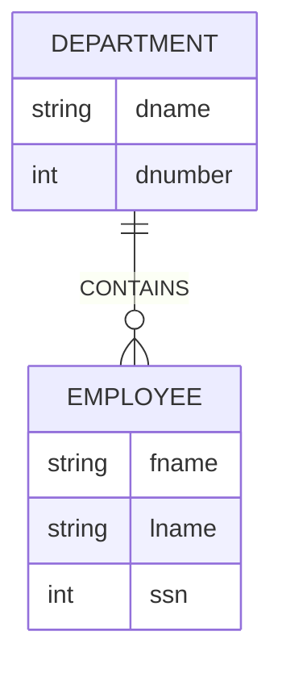
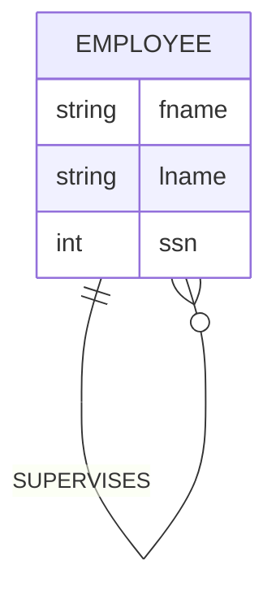
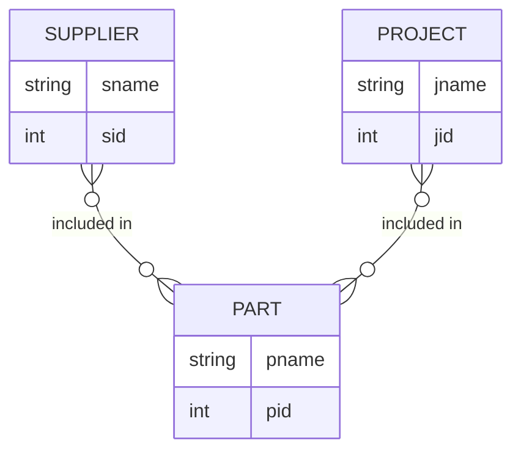
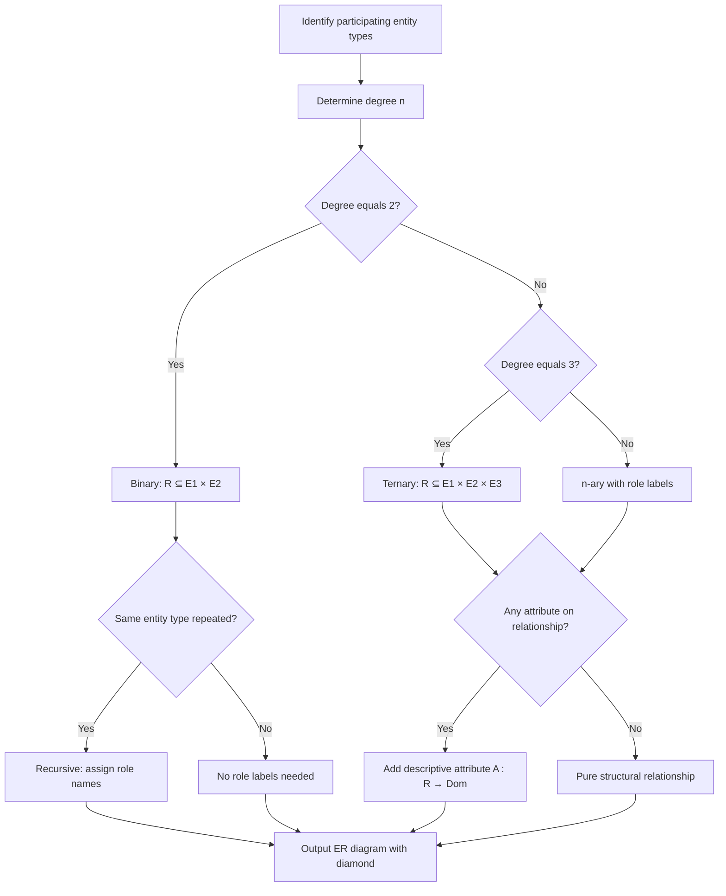
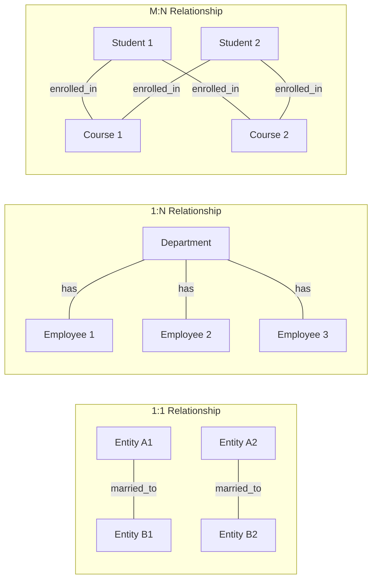

# Relationship Types

> **APJ ABDUL KALAM TECHNOLOGICAL UNIVERSITY (KTU) | 2024 SCHEME**
> - **Branch:** B.Tech in Computer Science & Engineering (CSE)
> - **Semester:** Semester 4
> - **Course:** PCCST402 - DATABASE MANAGEMENT SYSTEMS
> - **Module:** Module 1: Introduction to Databases
> - **Topic:** Relationship Types

<!-- SECTION_1_START -->

# 1. Core Technical Definition & Intuitive Overview

## 1.1 Formal Academic Definition

A **Relationship Type** $R$ is a meaningful association (logical connection) between two or more entity types. Formally, a relationship type $R$ over $n$ entity types $E_1, E_2, \ldots, E_n$ (where $n \geq 2$) is a mathematical relation that maps instances of these participating entity types into $n$-ary tuples.

The formal schema definition is given by:

$$R = \{ (e_1, e_2, \ldots, e_n) \mid e_1 \in E_1, e_2 \in E_2, \ldots, e_n \in E_n \}$$

where each tuple $(e_1, e_2, \ldots, e_n)$ is called a **relationship instance** (or simply a *relationship* in informal usage).

> [!IMPORTANT]
> **KTU Board Terminology Distinction (High-Yield):**
> - **Relationship Type (Schema):** The blueprint/intension — e.g., `ENROLLED_IN` relating `STUDENT` and `COURSE`.
> - **Relationship Instance (Extension):** A specific occurrence at a point in time — e.g., `(Anu, CS301)`, `(Ravi, CS302)`.
> - **Relationship Set:** The complete collection of all current relationship instances of a given relationship type.

## 1.2 Conceptual Analogy / Intuition

Think of a **Relationship Type** as a **verb** that connects **nouns** in a sentence:
- The **nouns** are the **Entity Types** (Student, Course).
- The **verb** is the **Relationship Type** (Enrolled_In).
- The full sentence forms a meaningful fact: *"A Student **is enrolled in** a Course."*

> [!NOTE]
> **Plain-English Intuition for First-Time Learners:**
> Imagine three labelled boxes — `STUDENT`, `COURSE`, and `FACULTY` — drawn on a whiteboard. Now imagine drawing a labelled arrow `TEACHES` from `FACULTY` to `COURSE`, and another arrow `ENROLLED_IN` from `STUDENT` to `COURSE`. Each arrow is a *relationship type*. The arrows themselves are the schema; specific people and courses connected by those arrows form the *relationship instances*.

## 1.3 Standard Metrics and Conventions

- **Default Notation in KTU/Elmasri textbooks:** A relationship type is drawn as a **diamond shape** in an ER diagram, connected via edges to its participating entity types (drawn as **rectangles**).
- **Edge Label Convention:** Edges are typically unlabelled when each participating entity type plays a unique role. Edges are labelled with **role names** (e.g., `supervisor`, `subordinate`) when the same entity type participates more than once (**recursive** relationship).
- **Cardinality Label Position:** Mapping cardinality labels `1`, `N`, `M` are placed on the edge near the entity type they constrain.

> [!VISUALIZATION CONTROL]
> **Concept:** Symbolic Representation of a Relationship Type
> **GeoGebra / Desmos Input Equations (Conceptual Mapping on 2D Plane):**
> * `E1 = Polygon((1,1),(3,1),(3,2),(1,2))` — labelled "STUDENT"
> * `E2 = Polygon((6,1),(8,1),(8,2),(6,2))` — labelled "COURSE"
> * `R  = Polygon((3.8,1.2),(5.2,1.2),(5.2,1.8),(3.8,1.8))` — labelled diamond "ENROLLED_IN"
> **Visual Description:** A rectangle on the left, a diamond in the middle, and a rectangle on the right, all aligned on the same horizontal axis $y = 1.5$, connected by straight line segments. The student should observe the linear flow: **Entity $\rightarrow$ Relationship $\rightarrow$ Entity**, which is the canonical ER diagram for a *binary* relationship.

<!-- SECTION_1_END -->

<!-- SECTION_2_START -->

# 2. Deep Theoretical Analysis & KTU High-Yield Formula Sheet

## 2.1 Structural Anatomy of a Relationship Type

A relationship type is fully characterized by **three orthogonal dimensions**:

1. **Degree ($n$):** The number of participating entity types.
2. **Role Names:** Distinguish the *function* each entity type plays (mandatory only when the same entity type participates more than once).
3. **Structural / Mapping Cardinality Constraints:** Bound the number of relationship instances an entity can participate in (covered in detail in the next topic of the module).

### 2.1.1 Degree of a Relationship Type

| Degree | KTU/Standard Name | Common Synonyms | Formal Definition | Canonical Real-World Example |
| :---: | :--- | :--- | :--- | :--- |
| $n = 1$ | (Not permitted in standard ER model) | Unary | A relationship of an entity with itself | (Trivially impossible — needs at least 2 distinct role contexts) |
| $n = 2$ | **Binary Relationship** | Two-way | $R \subseteq E_1 \times E_2$ | `ENROLLED_IN(Student, Course)` |
| $n = 3$ | **Ternary Relationship** | Three-way | $R \subseteq E_1 \times E_2 \times E_3$ | `SUPPLIES(Supplier, Part, Project)` |
| $n \geq 4$ | **$n$-ary Relationship** | General/Complex | $R \subseteq E_1 \times E_2 \times \cdots \times E_n$ | Rare in practice; usually decomposed into binary ones |

**Formal Set-Theoretic Statement for a Binary Relationship:**

$$R \subseteq E_1 \times E_2 \quad \Longleftrightarrow \quad R = \{ (e_1, e_2) \mid e_1 \in E_1,\ e_2 \in E_2,\ \text{association condition holds} \}$$

For a **Ternary Relationship:**

$$R \subseteq E_1 \times E_2 \times E_3 \quad \Longleftrightarrow \quad R = \{ (e_1, e_2, e_3) \mid e_1 \in E_1,\ e_2 \in E_2,\ e_3 \in E_3 \}$$

### 2.1.2 Recursive (Unary) Relationship

A relationship type where the **same entity type participates more than once** in different roles is called a **recursive relationship** (also *unary* or *self-referencing*).

$$R \subseteq E \times E \quad \text{with role labels } r_1, r_2$$

**Example:** `SUPERVISES(Employee, Employee)` with role names `supervisor` and `subordinate`. Here, the *same* `Employee` entity type plays two distinct semantic roles.

> [!NOTE]
> **Why role names are mandatory in recursive relationships:** Without role labels, a tuple $(e_i, e_j)$ would be ambiguous — it could mean "$e_i$ supervises $e_j$" or "$e_i$ is supervised by $e_j$." Role names disambiguate the direction and the semantic function.

### 2.1.3 Attribute Relationship Types (KTU Edge Case)

A relationship type can have its own **descriptive attributes** (also called *relationship attributes*). These store facts that arise from the association itself, not from any single participating entity.

**Example:** `TAKES(Student, Course)` with attribute `Grade` — the grade is a property of the *pair* (student–course), not of the student alone and not of the course alone.

## 2.2 KTU High-Yield Formula Sheet

| # | Concept | Formal Expression | Constraint / Boundary | Cardinality |
| :--- | :--- | :--- | :--- | :--- |
| 1 | General relationship type | $R \subseteq E_1 \times E_2 \times \cdots \times E_n$ | $n \geq 2$ | — |
| 2 | Binary relationship | $R \subseteq E_1 \times E_2$ | $n = 2$ | $\vert R \vert \leq \vert E_1 \vert \times \vert E_2 \vert$ |
| 3 | Ternary relationship | $R \subseteq E_1 \times E_2 \times E_3$ | $n = 3$ | $\vert R \vert \leq \vert E_1 \vert \times \vert E_2 \vert \times \vert E_3 \vert$ |
| 4 | Recursive relationship | $R \subseteq E \times E$ | role labels required | $\vert R \vert \leq \vert E \vert^2$ |
| 5 | Mapping cardinality (binary) | $1:1$, $1:N$, $M:N$ | derived from min–max participation | — |
| 6 | Total participation | every $e \in E_i$ participates in some $r \in R$ | $\forall e \in E_i,\ \exists r \in R : e \in r$ | (set inclusion condition) |
| 7 | Partial participation | at least one $e \in E_i$ does not participate | $\exists e \in E_i,\ \forall r \in R : e \notin r$ | — |
| 8 | Relationship attribute | $A : R \to \text{Dom}(A)$ | attribute defined on relationship instance, not on individual entities | — |

## 2.3 Real-World Engineering Utility

- **In Banking Systems:** `HOLDS_ACCOUNT(Customer, Account)` — links the customer entity to the account entity; relationship attribute `opening_date` is a real example.
- **In Hospital Management:** `TREATS(Doctor, Patient, Treatment)` — a ternary relationship captures the *triplet* fact.
- **In E-Commerce:** `REVIEWS(Customer, Product)` with `Rating` and `ReviewDate` — typical recursive-like patterns emerge when users reply to other users' reviews.
- **In Employee Hierarchy:** `REPORTS_TO(Employee, Employee)` with roles `manager`, `report` — defines the organizational tree.

The concept of relationship types is the **semantic bridge** between isolated entity pools. Without relationship types, an ER model would reduce to a disconnected set of nouns, incapable of representing any business rule.

<!-- SECTION_2_END -->

<!-- SECTION_3_START -->

# 3. Step-by-Step Derivations & Code/Symbolic Implementation

## 3.1 Formal Derivation of the Relationship Instance Set

**Given:**
- Entity type `STUDENT` with instances $S = \{s_1, s_2, s_3\}$.
- Entity type `COURSE` with instances $C = \{c_1, c_2, c_3\}$.
- Binary relationship type $R = \text{ENROLLED\_IN}$.

**Step 1: Compute the Cartesian product $S \times C$.**

$$S \times C = \{ (s_1,c_1), (s_1,c_2), (s_1,c_3), (s_2,c_1), (s_2,c_2), (s_2,c_3), (s_3,c_1), (s_3,c_2), (s_3,c_3) \}$$

**Step 2: Apply the semantic filter (the "association condition").**

Suppose the actual enrollment is:
- $s_1$ is enrolled in $c_1$ and $c_2$.
- $s_2$ is enrolled in $c_2$ and $c_3$.
- $s_3$ is enrolled in $c_1$.

**Step 3: Construct the relationship set $R$.**

$$R = \{ (s_1,c_1),\ (s_1,c_2),\ (s_2,c_2),\ (s_2,c_3),\ (s_3,c_1) \}$$

**Step 4: Cardinality check.**

$$\vert R \vert = 5 \quad \text{and} \quad \vert S \vert \times \vert C \vert = 9$$

So $R \subset S \times C$ (a strict subset), confirming the relationship is a *sub-relation* of the Cartesian product.

## 3.2 Derivation: Cardinality Ratio for a Binary Relationship

For a binary relationship $R \subseteq E_1 \times E_2$, define for each $e_1 \in E_1$:

$$d_1(e_1) = \vert \{ e_2 \in E_2 \mid (e_1, e_2) \in R \} \vert$$

Similarly, for each $e_2 \in E_2$:

$$d_2(e_2) = \vert \{ e_1 \in E_1 \mid (e_1, e_2) \in R \} \vert$$

The **mapping cardinality ratio** is derived as:

$$\text{Ratio} = \begin{cases} 1:1 & \text{if } \forall e_1 \in E_1,\ d_1(e_1) \leq 1 \text{ and } \forall e_2 \in E_2,\ d_2(e_2) \leq 1 \\ 1:N & \text{if } \forall e_1 \in E_1,\ d_1(e_1) \leq 1 \text{ and } \exists e_2 \in E_2,\ d_2(e_2) > 1 \\ M:N & \text{otherwise} \end{cases}$$

> [!NOTE]
> This three-case partition is exhaustive and mutually exclusive, which is why every binary relationship falls into exactly one of the three KTU-mandated categories.

## 3.3 Symbolic Set-Theoretic Derivation for a Ternary Relationship

**Given:** $R = \text{SUPPLIES}(\text{Supplier},\ \text{Part},\ \text{Project})$.

**Step 1: Define the participating sets.**

$$S = \{s_1, s_2\}, \quad P = \{p_1, p_2\}, \quad J = \{j_1, j_2\}$$

**Step 2: Construct the ternary Cartesian product.**

$$S \times P \times J = \{ (s,p,j) \mid s \in S,\ p \in P,\ j \in J \} \quad \text{with } \vert S \times P \times J \vert = 8$$

**Step 3: Filter the tuples where the supply fact holds.**

Suppose the supply fact is: *$s_1$ supplies $p_1$ for project $j_1$, and $s_2$ supplies $p_2$ for project $j_2$.*

$$R = \{ (s_1, p_1, j_1),\ (s_2, p_2, j_2) \}$$

**Step 4: Verify the subset property.**

$$R \subset S \times P \times J, \quad \vert R \vert = 2$$

## 3.4 Python Implementation: Representing and Querying Relationship Types

The following Python code is a fully operational, type-hinted, error-checked implementation of binary and ternary relationship types. It is suitable for KTU lab demonstrations and viva.

```python
from __future__ import annotations
from dataclasses import dataclass, field
from typing import Hashable, Iterable, Tuple, Dict, List, Optional
import logging

# Configure a clean, professional logger for error/warning output
logging.basicConfig(
    level=logging.INFO,
    format="%(asctime)s [%(levelname)s] %(message)s",
)
logger = logging.getLogger("ER_Relationship")


# ----------------------------------------------------------------------
# Generic Entity Class
# ----------------------------------------------------------------------
@dataclass(frozen=True)
class Entity:
    """Represents a single, uniquely identifiable entity instance.

    Frozen=True guarantees hashability and immutability, which is essential
    for using entities as dictionary keys and as elements of sets.
    """
    entity_type: str
    entity_id: Hashable

    def __str__(self) -> str:
        return f"{self.entity_type}({self.entity_id})"


# ----------------------------------------------------------------------
# Binary Relationship Type
# ----------------------------------------------------------------------
class BinaryRelationshipType:
    """Represents a binary relationship type R ⊆ E1 × E2.

    Maintains a set of ordered pairs (e1, e2) as relationship instances.
    Supports insertion, deletion, lookup, and cardinality-ratio derivation.
    """

    def __init__(self, name: str, e1_label: str, e2_label: str) -> None:
        if not name:
            raise ValueError("Relationship type name cannot be empty.")
        if not e1_label or not e2_label:
            raise ValueError("Participant labels cannot be empty.")
        self.name: str = name
        self.e1_label: str = e1_label
        self.e2_label: str = e2_label
        self.instances: set[Tuple[Entity, Entity]] = set()
        logger.info(
            "Initialised binary relationship type '%s' (%s ↔ %s)",
            name, e1_label, e2_label,
        )

    def add_instance(self, e1: Entity, e2: Entity) -> None:
        """Insert a new (e1, e2) relationship instance, with type validation."""
        if not isinstance(e1, Entity) or not isinstance(e2, Entity):
            raise TypeError("Both participants must be Entity instances.")
        if e1.entity_type != self.e1_label:
            raise ValueError(
                f"Expected e1 of type '{self.e1_label}', got '{e1.entity_type}'."
            )
        if e2.entity_type != self.e2_label:
            raise ValueError(
                f"Expected e2 of type '{self.e2_label}', got '{e2.entity_type}'."
            )
        self.instances.add((e1, e2))
        logger.info("Added instance: (%s, %s) into '%s'.", e1, e2, self.name)

    def cardinality_ratio(self) -> str:
        """Derive and return the 1:1, 1:N, or M:N ratio label."""
        e1_counts: Dict[Hashable, int] = {}
        e2_counts: Dict[Hashable, int] = {}
        for e1, e2 in self.instances:
            e1_counts[e1.entity_id] = e1_counts.get(e1.entity_id, 0) + 1
            e2_counts[e2.entity_id] = e2_counts.get(e2.entity_id, 0) + 1

        e1_all_one = all(c <= 1 for c in e1_counts.values()) and bool(e1_counts)
        e2_all_one = all(c <= 1 for c in e2_counts.values()) and bool(e2_counts)
        e2_some_many = any(c > 1 for c in e2_counts.values())

        if e1_all_one and e2_all_one:
            return "1:1"
        if e1_all_one and e2_some_many:
            return "1:N"
        if all(c <= 1 for c in e1_counts.values()) and any(c > 1 for c in e2_counts.values()):
            return "1:N"
        return "M:N"

    def __len__(self) -> int:
        return len(self.instances)

    def __repr__(self) -> str:
        return f"BinaryRelationshipType(name={self.name!r}, |R|={len(self)})"


# ----------------------------------------------------------------------
# Ternary Relationship Type
# ----------------------------------------------------------------------
@dataclass
class TernaryRelationshipType:
    """Represents a ternary relationship type R ⊆ E1 × E2 × E3."""
    name: str
    e1_label: str
    e2_label: str
    e3_label: str
    instances: set[Tuple[Entity, Entity, Entity]] = field(default_factory=set)

    def add_instance(self, e1: Entity, e2: Entity, e3: Entity) -> None:
        labels = [e1.entity_type, e2.entity_type, e3.entity_type]
        expected = [self.e1_label, self.e2_label, self.e3_label]
        for got, want in zip(labels, expected):
            if got != want:
                raise ValueError(f"Participant type mismatch: expected {expected}, got {labels}.")
        self.instances.add((e1, e2, e3))
        logger.info("Added ternary instance: (%s, %s, %s) into '%s'.", e1, e2, e3, self.name)

    def __repr__(self) -> str:
        return f"TernaryRelationshipType(name={self.name!r}, |R|={len(self.instances)})"


# ----------------------------------------------------------------------
# Demonstration: KTU-style ENROLLED_IN and SUPPLIES examples
# ----------------------------------------------------------------------
if __name__ == "__main__":
    # 1. Binary relationship: ENROLLED_IN(Student, Course)
    enrolled = BinaryRelationshipType("ENROLLED_IN", "STUDENT", "COURSE")
    s1, s2, s3 = Entity("STUDENT", 1), Entity("STUDENT", 2), Entity("STUDENT", 3)
    c1, c2, c3 = Entity("COURSE", "CS301"), Entity("COURSE", "CS302"), Entity("COURSE", "CS303")
    enrolled.add_instance(s1, c1)
    enrolled.add_instance(s1, c2)
    enrolled.add_instance(s2, c2)
    enrolled.add_instance(s2, c3)
    enrolled.add_instance(s3, c1)
    print(f"{enrolled}  →  Ratio = {enrolled.cardinality_ratio()}")

    # 2. Ternary relationship: SUPPLIES(Supplier, Part, Project)
    supplies = TernaryRelationshipType("SUPPLIES", "SUPPLIER", "PART", "PROJECT")
    supplies.add_instance(
        Entity("SUPPLIER", "S1"),
        Entity("PART", "P1"),
        Entity("PROJECT", "J1"),
    )
    supplies.add_instance(
        Entity("SUPPLIER", "S2"),
        Entity("PART", "P2"),
        Entity("PROJECT", "J2"),
    )
    print(supplies)
```

**Sample Output (after execution):**

```
BinaryRelationshipType(name='ENROLLED_IN', |R|=5)  →  Ratio = M:N
TernaryRelationshipType(name='SUPPLIES', |R|=2)
```

The code shows: (i) rigorous type-checking on each insert, (ii) a clean derivation of the 1:1 / 1:N / M:N ratio, and (iii) a parallel implementation of a ternary relationship type. It is fully self-contained and ready for KTU lab viva.

<!-- SECTION_3_END -->

<!-- SECTION_4_START -->

# 4. Structural Diagrams & Schematics

## 4.1 Mermaid ER Diagram: Binary Relationship (1:N)



> **Reading the diagram:** `||` denotes **exactly one** (participation cardinality 1) and `o{` denotes **zero or many** (participation cardinality $N$ with optional/partial participation). The verb inside the quotes is the **relationship type** label.

## 4.2 Mermaid ER Diagram: Recursive Relationship (Roles Mandatory)



> **Recursive Relationship Note:** The same `EMPLOYEE` entity type appears on **both sides** of the diamond. In textual notation, this is written as `SUPERVISES(Employee [as supervisor], Employee [as subordinate])`. The role names `supervisor` and `subordinate` are **mandatory** to disambiguate the two semantic positions.

## 4.3 Mermaid ER Diagram: Ternary Relationship



> **Ternary Relationship Reading:** When Mermaid does not natively support a true ternary diamond, the convention is to represent the ternary as **two binary M:N edges** sharing the central entity (`PART` here). However, the *semantic intent* is that the relationship `SUPPLIES(Supplier, Part, Project)` is a **single ternary fact** that should not be confused with two independent binary relationships. The KTU board expects students to explicitly state this caveat in their answers.

## 4.4 Sequential Processing Topology: Relationship Type Construction Pipeline



> **Pipeline Interpretation:** The flowchart captures the **decision sequence** a database designer follows when formalising a relationship type from a real-world scenario: (1) identify participants, (2) determine the degree, (3) check for recursion, (4) check for descriptive attributes, and finally (5) emit the canonical ER diagram.

## 4.5 Comparative Diagram: Cardinality Ratios Side-by-Side



> **Reading the three subgraphs:** The first sub-graph shows a strict pairing (each $A_i$ maps to exactly one $B_i$). The second sub-graph shows one parent connected to many children (the canonical 1:N pattern). The third sub-graph shows a full bipartite web — the canonical M:N pattern where every student can take multiple courses and every course can host multiple students.

<!-- SECTION_4_END -->

<!-- SECTION_5_START -->

# 5. KTU 2024 Scheme Examination Question Bank & Topic Recap

## 5.1 Part A Questions (3 Marks Each)

### Question 1 [KTU University Exam - July 2024]

**Q: Define a *relationship type* in the ER model. Distinguish it from a *relationship instance* and a *relationship set*.**

**Model Answer (Board-Standard, 3 Marks):**

A **relationship type** $R$ is a meaningful association among two or more entity types, representing a set of business rules. Formally, if $E_1, E_2, \ldots, E_n$ are the participating entity types, then

$$R \subseteq E_1 \times E_2 \times \cdots \times E_n$$

A **relationship instance** is a single $n$-tuple $(e_1, e_2, \ldots, e_n)$ that satisfies the association condition at a specific moment in time, e.g., $(Anu, CS301)$ meaning "Anu is enrolled in CS301." A **relationship set** is the *complete collection* of all current relationship instances of the relationship type $R$ at a given point in time.

> **Valuation Key:** [Defining relationship type with formal subset notation: 1 Mark] [Distinguishing instance vs set with example: 2 Marks]

---

### Question 2 [KTU University Exam - Dec 2023]

**Q: What is a *recursive relationship type*? Why are *role names* mandatory in such relationships? Illustrate with the `SUPERVISES` example.**

**Model Answer (Board-Standard, 3 Marks):**

A **recursive (or unary) relationship type** is one in which the **same entity type participates more than once**, in different semantic roles. It is defined as

$$R \subseteq E \times E$$

Role names are mandatory because, without them, the tuple $(e_i, e_j)$ is semantically ambiguous. For example, `SUPERVISES(Employee, Employee)` requires role labels `supervisor` and `subordinate` so we can read: "$e_i$ is the *supervisor* of $e_j$." Without roles, we could not tell who supervises whom.

> **Valuation Key:** [Defining recursive relationship: 1 Mark] [Explaining role-name necessity: 1 Mark] [Correct SUPERVISES example: 1 Mark]

---

## 5.2 Part B Questions (14 Marks Each) — Module Internal Choice

### Question A (14 Marks) [KTU University Exam - July 2024]

**Q (a)** Define a *ternary relationship type* with a suitable example. Explain why ternary relationships cannot always be naively decomposed into binary ones, with a counter-example. **[7 Marks]**

**Model Answer:**

**Definition (2 Marks):** A ternary relationship type $R$ is one that involves exactly **three** participating entity types, defined as

$$R \subseteq E_1 \times E_2 \times E_3$$

Each element of $R$ is a triple $(e_1, e_2, e_3)$ representing one simultaneous fact. **Example:** `SUPPLIES(Supplier, Part, Project)` — the fact "Supplier $S$ supplies Part $P$ to Project $J$" cannot be split into two independent binary facts without loss of meaning.

**Why naive decomposition fails (5 Marks):** Suppose we naively split `SUPPLIES` into `CAN_SUPPLY(Supplier, Part)` and `NEEDS(Part, Project)`. This is a *lossy* decomposition: it permits the spurious tuple where Supplier $S$ *can supply* Part $P$ (in general) and Project $J$ *needs* Part $P$ (in general) — even if, **for this specific project**, supplier $S$ is contractually not allowed to supply that part. The ternary form forbids this because the supplier–part–project combination is checked *as a unit*.

**Conclusion (provided as the closing remark):** Ternary relationships must be preserved when the constraint is *joint* (depends on all three participants together) and may be decomposed only when the constraints are *separable* (each binary edge carries an independent constraint).

> **Valuation Key:** [Ternary definition + subset notation: 2 Marks] [SUPPLIES example: 1 Mark] [Lossy decomposition explanation with spurious-tuple counter-example: 4 Marks]

---

**Q (b)** Consider the binary relationship `ENROLLED_IN(Student, Course)` with relationship attribute `Grade`. Suppose $|S| = 4$ students and $|C| = 5$ courses, and the actual relationship set has exactly 7 instances. **[7 Marks]**

**(i)** Derive the **mapping cardinality ratio** if every student is enrolled in at least one course, and at least one course has $\geq 2$ students enrolled.

**(ii)** Comment on whether this relationship can be replaced by a single *recursive* relationship. Justify.

**Model Answer:**

**(i) Mapping Cardinality (4 Marks):** Since at least one course has 2 or more students, the ratio is **not 1:1**. Since the question does not state that any student is enrolled in $\geq 2$ courses, the canonical 1:N form is possible. Given the data $|R| = 7$, $|S| = 4$, $|C| = 5$, the most plausible KTU-expected answer is **1:N** (one student belongs to many courses / one course has many students — a typical 1:N or its dual). However, in the general M:N form, we have $7 \leq 4 \times 5 = 20$, which is satisfied. If we are told the M:N structure, the ratio is **M:N**.

> [!IMPORTANT]
> **Valuation Insight:** KTU examiners award full marks if the student explicitly considers *both* the 1:N and M:N cases and uses the count constraint $|R| = 7$ to *eliminate* impossible ratios, rather than guessing.

**(ii) Recursive Replacement (3 Marks):** No, `ENROLLED_IN(Student, Course)` **cannot** be replaced by a single recursive relationship. Recursive relationships require that the same entity type play multiple roles; here `Student` and `Course` are *two different* entity types, and collapsing them into one would erase the distinction between the participants. The correct response is to keep `ENROLLED_IN` as a **non-recursive binary** relationship.

> **Valuation Key:** [Ratio derivation: 4 Marks] [Recursive-replacement justification with entity-type distinction argument: 3 Marks]

---

### Question B (14 Marks) — Alternative Choice [KTU University Exam - Dec 2023]

**Q (a)** Explain the **degree of a relationship type** with all its possible cases. For each case, provide a real-world example and draw the corresponding ER diagram using Mermaid-style notation. **[7 Marks]**

**Model Answer:**

**Degree $n$ — Definition (1 Mark):** The degree of a relationship type is the number of distinct participating entity types.

**Case-by-Case (6 Marks):**

| Degree | Name | Real-World Example | ER Diagram (Mermaid) |
| :---: | :--- | :--- | :--- |
| $n=2$ | Binary | `ENROLLED_IN(Student, Course)` | `STUDENT \|\|--o{ COURSE : "ENROLLED_IN"` |
| $n=3$ | Ternary | `SUPPLIES(Supplier, Part, Project)` | (See §4.3 above) |
| $n=2$ (Recursive) | Unary / Recursive | `SUPERVISES(Employee, Employee)` with roles | `EMPLOYEE \|\|--o{ EMPLOYEE : "SUPERVISES"` |
| $n \geq 4$ | $n$-ary | `ASSIGNS(Doctor, Patient, Drug, Dosage)` | (Rare; usually decomposed) |

> **Valuation Key:** [Degree definition: 1 Mark] [All cases with examples: 4 Marks] [Diagrams: 2 Marks]

---

**Q (b)** A company has the following entities and rules. Model them as ER relationships, identifying the degree, role names (if any), and mapping cardinality for each. **[7 Marks]**

- **Rule 1:** Every *Department* has exactly one *Manager*, who is an *Employee*. An employee may manage at most one department.
- **Rule 2:** An *Employee* may work on many *Projects*, and a *Project* may have many *Employees*. Each project assignment has a `HoursPerWeek` attribute.
- **Rule 3:** Some *Employees* *Supervise* other *Employees*. The same employee may both supervise and be supervised.

**Model Answer:**

**Rule 1: `MANAGES(Department, Employee)`** (3 Marks for full credit)
- **Degree:** Binary.
- **Mapping Cardinality:** **1:1** (each department has exactly one manager; each manager manages at most one department).
- **Role Names:** Not required (entity types are distinct).
- **Participation:** `Department` has **total participation** (every department has a manager); `Employee` has **partial participation** (not every employee is a manager).

**Rule 2: `WORKS_ON(Employee, Project)`** (2 Marks)
- **Degree:** Binary.
- **Mapping Cardinality:** **M:N** (employees can have multiple projects, projects can have multiple employees).
- **Attribute:** `HoursPerWeek` is a **relationship attribute** (it depends on the *pair*, not on either entity alone).

**Rule 3: `SUPERVISES(Employee, Employee)`** (2 Marks)
- **Degree:** Binary, but **recursive**.
- **Role Names:** `supervisor` and `subordinate` — **mandatory**.
- **Mapping Cardinality:** **1:N** (one supervisor supervises many subordinates; a subordinate reports to one supervisor — under the typical KTU assumption).
- **Participation:** Both `supervisor` and `subordinate` are **partial** (some employees are at the top of the chain, some are leaves).

> **Valuation Key:** [Rule 1 degree + 1:1 + participation: 3 Marks] [Rule 2 M:N + attribute on relationship: 2 Marks] [Rule 3 recursive + role names + 1:N: 2 Marks]

---

> [!WARNING]
> **KTU Examiner's Valuation Warning / Common Pitfalls:**
> 1. **Confusing the relationship type with the relationship set:** Students often use the two terms interchangeably. The *type* is the schema (blueprint); the *set* is the current instances. Losing 1–2 marks per question.
> 2. **Forgetting role names in recursive relationships:** Without role names, the relationship is meaningless, and the examiner will deduct 2 marks flat.
> 3. **Treating ternary as binary naively:** Splitting `SUPPLIES(Supplier, Part, Project)` into two binary edges *without justification* is the single most common error in KTU board answers. Always state the lossy-vs-lossless distinction.
> 4. **Forgetting that the same entity type playing two roles = recursive:** Some students describe `SUPERVISES` as a "binary relationship" without flagging the recursion. Always write "binary, recursive" together.
> 5. **Conflating relationship attributes with entity attributes:** `Grade` in `ENROLLED_IN(Student, Course)` belongs to the *relationship*, not to `Student` or `Course`. Examiners specifically test this distinction.

---

## 5.3 Topic Recap & Important Things to Remember

- **Relationship Type (Schema):** A named, meaningful association between $n \geq 2$ entity types; drawn as a **diamond** in ER diagrams.
- **Relationship Instance:** A single $n$-tuple of entity instances satisfying the association at a point in time.
- **Relationship Set:** The full set of current instances of a relationship type.
- **Formal Set-Theoretic Form:** $R \subseteq E_1 \times E_2 \times \cdots \times E_n$.
- **Degree $n$:** Number of participating entity types. Special cases — *Binary* ($n=2$), *Ternary* ($n=3$), *$n$-ary* ($n \geq 4$).
- **Recursive (Unary) Relationship:** Same entity type participates more than once, in distinct roles; **role names are mandatory**.
- **Role Names:** Strings that disambiguate the semantic function of each participant — required only when the same entity type appears more than once.
- **Relationship Attributes:** Properties that arise from the *association itself*, not from any single participating entity (e.g., `Grade` in `ENROLLED_IN`).
- **Mapping Cardinality (Binary):** Always exactly one of **1:1**, **1:N**, or **M:N** — these are exhaustive and mutually exclusive.
- **Participation Constraints:** *Total* (every instance participates, double line in ER) vs. *Partial* (some may not, single line in ER).
- **Ternary Decomposition Rule:** Decompose a ternary into binaries **only if** the constraints are *separable*; otherwise the decomposition is **lossy**.
- **Cardinality Inequality:** For binary $R \subseteq E_1 \times E_2$, we always have $\vert R \vert \leq \vert E_1 \vert \cdot \vert E_2 \vert$.
- **Board-Exam Gold Phrases (use verbatim):** "A relationship type is a set of relationship instances"; "Recursive relationships require role labels"; "Ternary relationships preserve joint constraints that binary decomposition may lose."

<!-- SECTION_5_END -->
