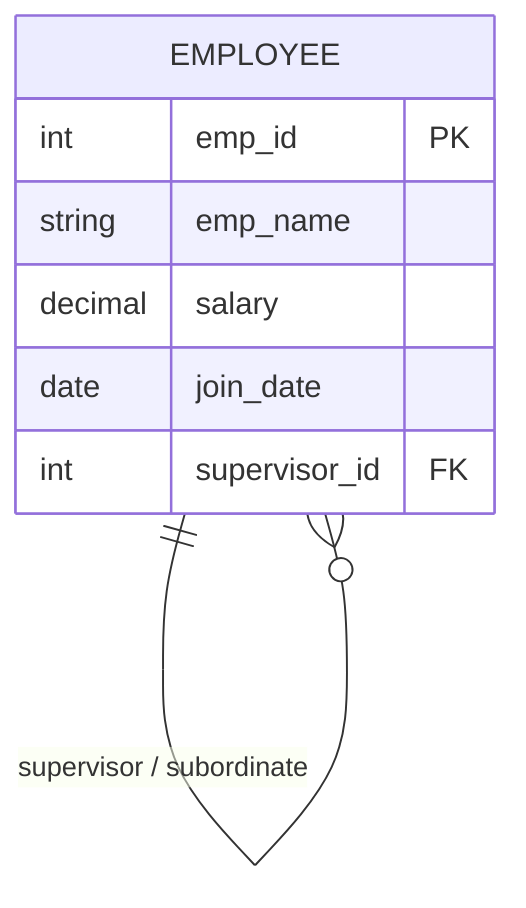
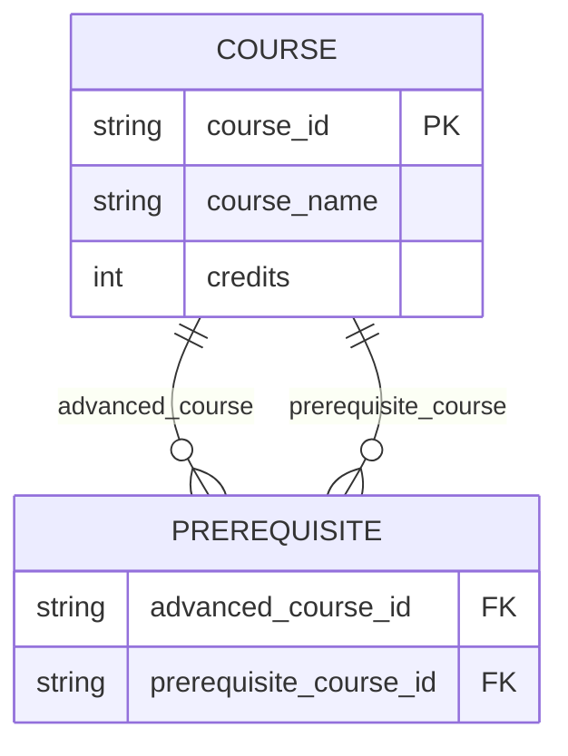
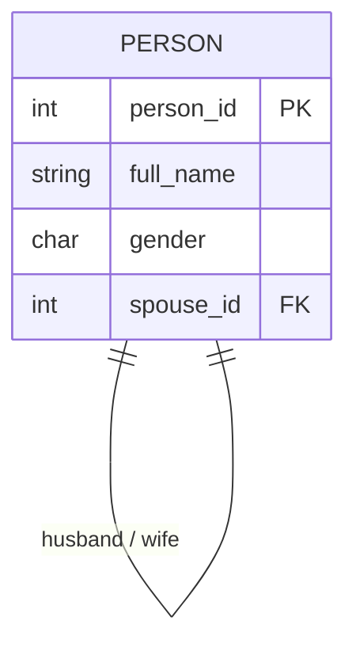
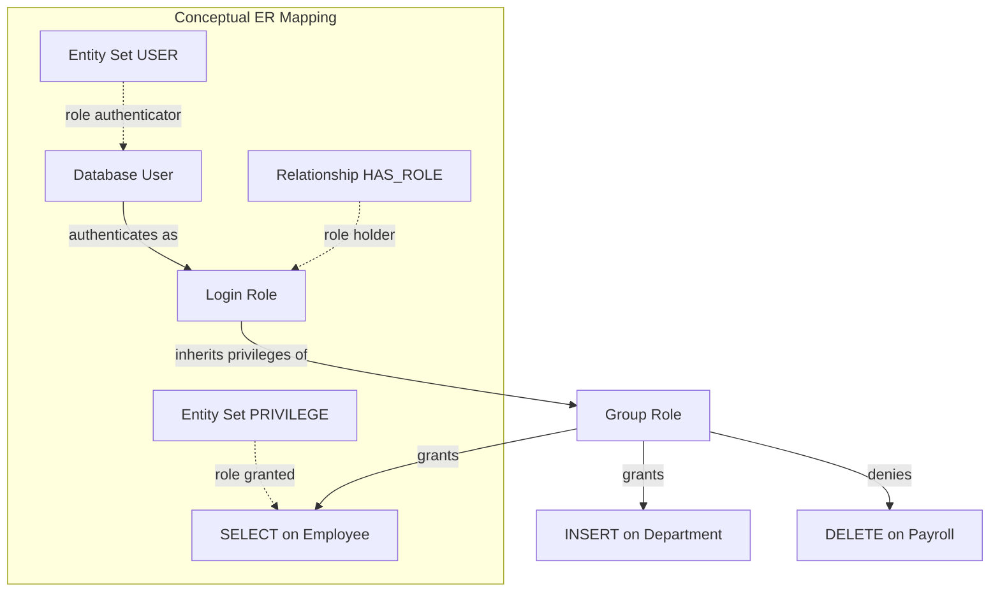
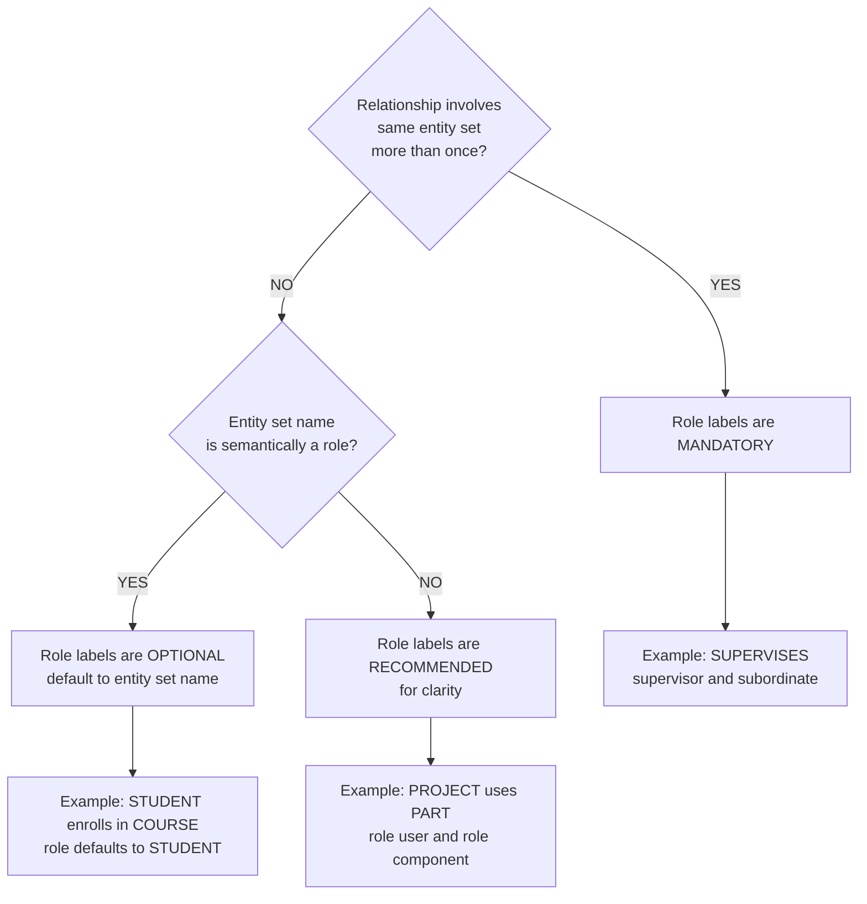
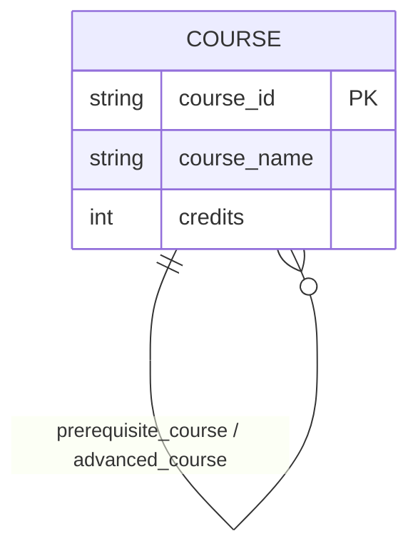
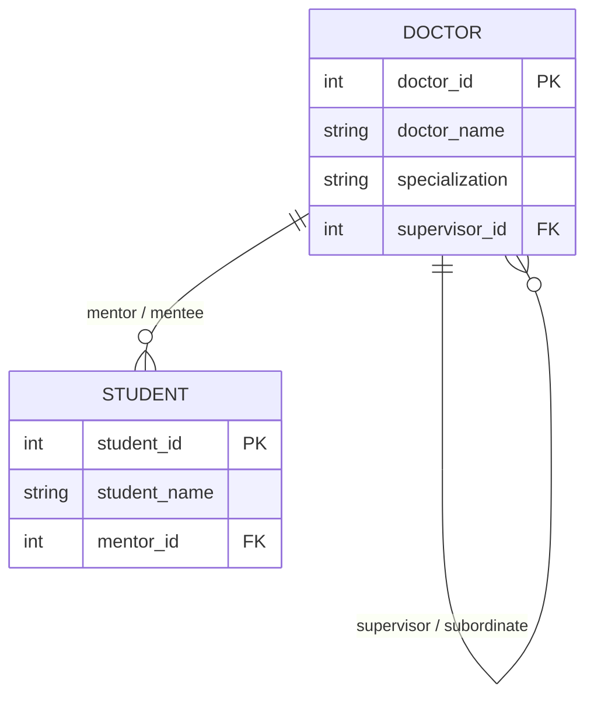

# Roles

> **APJ ABDUL KALAM TECHNOLOGICAL UNIVERSITY (KTU) | 2024 SCHEME**
> - **Branch:** B.Tech in Computer Science & Engineering (CSE)
> - **Semester:** Semester 4
> - **Course:** PCCST402 - DATABASE MANAGEMENT SYSTEMS
> - **Module:** Module 1: Introduction to Databases
> - **Topic:** Roles

<!-- SECTION_1_START -->

# MODULE 1 — INTRODUCTION TO DATABASES
## Topic 15: Roles in the Entity–Relationship (ER) Model

---

### 1. Core Technical Definition & Intuitive Overview

#### 1.1 Formal Academic Definition

In the Entity–Relationship (ER) model, a **Role** is the **named function** or **named participation position** that an entity (or an entity set) plays in a relationship. Every edge connecting a participating entity set to a relationship set in an ER diagram is labeled with a *role name* (also called a *role label*). The role name explicitly states **what the entity represents or does** within the context of that particular relationship.

Formally, given a relationship $R$ connecting entity sets $E_1, E_2, \dots, E_n$, the role of $E_i$ in $R$ is a textual descriptor $\rho_i$ that conveys the semantic function of $E_i$ with respect to $R$.

$$\rho_i \;=\; \text{RoleName}\big(E_i, R\big)$$

where the mapping is:

$$
\begin{aligned}
\text{Role} &: \big( \text{EntitySet} \times \text{Relationship} \big) \;\longrightarrow\; \text{String} \\[4pt]
\rho_i &: \big( E_i,\; R \big) \;\longmapsto\; \text{descriptive role label}
\end{aligned}
$$

> [!IMPORTANT]
> **KTU 2024 Syllabus Highlight — Definition of "Role"**
> *The function that an entity plays in a relationship is called its **role**. Roles are explicitly named when it is necessary to clarify the meaning of the relationship, especially when an entity set participates in a relationship with itself (recursive / unary relationship) or in a relationship where the same entity set appears more than once.*

---

#### 1.2 Conceptual Analogy / Intuition

Imagine a **family tree photograph** of a wedding reception:

- The same person, say *Arjun*, can be **a son** to his parents, **a husband** to his wife, and **a father** to his children.
- Although he is the *same human being* (one entity, one set of attributes — name, age, blood group), he plays three completely different **functions** in three different relationships of family life.

In the ER world:

- The single entity set **PERSON** participates in three relationships.
- To avoid ambiguity, the ER diagram labels the connecting lines with role names such as `parent`, `child`, `spouse`, `husband`, `wife`, `supervisor`, `subordinate`.

Without role labels, the model becomes semantically *blurred* — like a theatre actor with no character name. The role label is the **character name** that tells the audience (and the database) exactly *who the entity is playing* in that scene (relationship).

> [!NOTE]
> **Plain-English Restatement**
> A *Role* answers the question: *"What job is this entity doing inside this relationship?"* The same entity can hold different jobs in different relationships, and we use role names to label those jobs.

---

#### 1.3 Physical Constants / Standard Metrics

Although *Roles* are a conceptual modeling construct (not a physical constant of nature), the ER notation universally adopted by KTU textbooks (Elmasri & Navathe, Silberschatz, Korth) follows these notational standards:

- **Standard Edge Notation** — A role name appears as a label on the edge connecting the entity set rectangle to the relationship diamond.
- **Default Role Name** — When the entity set name itself is a grammatically appropriate role (e.g., entity `STUDENT` in relationship `ENROLLS_IN`), the role name is **optional** and often omitted.
- **Mandatory Role Name** — In **recursive** (unary) relationships and in cases where the same entity set participates **more than once** in a relationship, the role name is **mandatory**.

> [!TIP]
> **Memory Anchor for the Board Exam**
> *Think: **R-MR-MR** → **R**ecursive → **M**andatory **R**ole, **M**ultiple participation → **R**equires role label.*

---

#### 1.4 Visualization / Schematic Concept

> [!VISUALIZATION CONTROL]
> **Concept:** Unary (Recursive) Relationship showing Role Labels
> **Schematic Description:**
> Draw a single rectangle labelled `EMPLOYEE`. Connect it to a diamond labelled `SUPERVISES` by **two parallel edges**. Label the first edge `supervisor` (the EMPLOYEE who *gives* the order) and the second edge `subordinate` (the EMPLOYEE who *receives* the order). Both edges point from the same entity set to the same relationship, but the role names disambiguate who is who.
> **Geometric Intuition:** Picture a rectangle with two directed arrows going out, one going up-right, one going down-right, both terminating on the same diamond. The arrows carry different textual labels.

<!-- SECTION_1_END -->

<!-- SECTION_2_START -->

# 2. Deep Theoretical Analysis & KTU High-Yield Reference Sheet

---

### 2.1 Why Do We Need Roles? — The Underlying Logic

Roles are **not** a decorative addition to the ER model. They solve three genuine semantic problems that arise when designing realistic databases. We examine each one systematically.

#### 2.1.1 Problem 1 — Recursive (Unary) Relationships

A *recursive relationship* is a relationship in which the **same entity set participates more than once** in different roles. The most common example is the `SUPERVISION` relationship among employees of a company.

Without role names, the ER model would be ambiguous:

- Does `EMPLOYEE A` supervise `EMPLOYEE B`, or does `EMPLOYEE B` supervise `EMPLOYEE A`?
- The relationship diamond alone (`SUPERVISES`) does not encode the **directionality of authority**.

Role names resolve this: `supervisor` vs. `subordinate`.

#### 2.1.2 Problem 2 — Multiple Participation of the Same Entity Set

Even in **binary** relationships, the same entity set can appear on both sides of a relationship. The classic case is a **marriage** relationship:

- The entity set is `PERSON`.
- One `PERSON` is the **husband**, the other is the **wife**.
- The relationship is `MARRIED_TO`.
- Role labels `husband` and `wife` are essential for clarity.

#### 2.1.3 Problem 3 — Semantic Clarity in N-ary Relationships

In **ternary** (or higher-arity) relationships, the role name describes the entity's *contribution* to the relationship. For example, in the `SUPPLY` relationship among `SUPPLIER`, `PART`, and `PROJECT`, the role of `SUPPLIER` is *supplier*, of `PART` is *supplied part*, and of `PROJECT` is *receiving project*. Without these role descriptors, an analyst reading the diagram cannot understand what each entity *means* inside the relationship.

---

### 2.2 Structural Rules Governing Roles

The following are the **five universal rules** that govern role assignment in any KTU-aligned ER diagram:

| # | Rule | Formal Statement | Example |
|---|------|------------------|---------|
| 1 | **Optionality Rule** | A role name is optional when the entity set name is itself semantically a role. | `STUDENT` in `ENROLLS_IN` |
| 2 | **Mandatory Rule (Recursive)** | A role name is **mandatory** in any recursive (unary) relationship. | `supervisor` / `subordinate` in `SUPERVISES` |
| 3 | **Uniqueness Rule (Per Edge)** | The role name is unique *per edge* between the entity set and the relationship. | `husband` ≠ `wife` on the two edges of `MARRIED_TO` |
| 4 | **Cardinality Compatibility Rule** | A role inherits the cardinality constraint (1:1, 1:N, M:N) of the edge it labels. | `PROJECT` : `WORKS_ON` : `EMPLOYEE` is M:N |
| 5 | **Naming Convention Rule** | Role names are typically **lowercase** verbs or nouns that describe the *function*. | `manages`, `works_for`, `controls` |

---

### 2.3 Formal Mapping: Entity ↔ Role ↔ Relationship

For a binary relationship $R$ between entity sets $E_1$ and $E_2$, the role structure is a triple:

$$
R_{\text{typed}} \;=\; \big\langle\, E_1 \;\xrightarrow{\rho_1}\; R \;\xleftarrow{\rho_2}\; E_2 \,\big\rangle
$$

where:

- $\rho_1$ = role of $E_1$ in $R$
- $\rho_2$ = role of $E_2$ in $R$
- The arrows indicate the *semantic direction* of the role.

For a **recursive** relationship on a single entity set $E$:

$$
R_{\text{rec}} \;=\; \big\langle\, E \;\xrightarrow{\rho_{\text{parent}} / \rho_{\text{supervisor}} / \rho_{\text{hub}}}\; R \;\xleftarrow{\rho_{\text{child}} / \rho_{\text{subordinate}} / \rho_{\text{spoke}}}\; E \,\big\rangle
$$

Here, the same $E$ appears on both sides but with **distinct** role labels.

---

### 2.4 KTU Formula Sheet / Quick-Reference Table

| # | Construct | Notation / Symbol | Meaning | Mandatory? |
|---|-----------|-------------------|---------|------------|
| 1 | Role label on edge | $\rho$ (Greek *rho*) | Name of the function an entity plays | Yes, in recursive & multi-participation cases |
| 2 | Edge between entity set and relationship | `──ρ──◆` | Connects $E_i$ to $R$ with role $\rho$ | Always present |
| 3 | Cardinality on edge | `1`, `N`, `M` | Participation / ratio constraint | Per design |
| 4 | Recursive (Unary) Relationship | $R(E, E)$ | Same $E$ participates twice | Always requires roles |
| 5 | Binary Relationship with distinct entities | $R(E_1, E_2)$ | Two distinct $E$'s | Roles optional but recommended |
| 6 | Ternary Relationship | $R(E_1, E_2, E_3)$ | Three entities | Roles strongly recommended |

---

### 2.5 Real-World Engineering Utility of Roles

Roles are not merely textbook abstractions — they are the foundation of **Role-Based Access Control (RBAC)** in modern production database systems, including PostgreSQL, Oracle, MySQL 8+, and SQL Server.

**Direct Production-Grade Utility:**

- **PostgreSQL** has a built-in `CREATE ROLE` statement that maps directly to the ER role concept.
- **Oracle** uses `CREATE ROLE` for privilege grouping.
- **Active Directory** and **Linux PAM** systems use role hierarchies to grant permissions.

Thus, the *Role* construct introduced in the ER model is the **conceptual ancestor** of the *role* concept used in modern identity and access management. KTU examiners frequently test this conceptual lineage.

> [!IMPORTANT]
> **Engineering Tip:** When you design a real-world schema, always check whether the same entity plays multiple roles. If yes, the ER diagram **must** use role labels — failure to do so produces an ambiguous schema that cannot be unambiguously mapped to relational tables.

<!-- SECTION_2_END -->

<!-- SECTION_3_START -->

# 3. Step-by-Step Derivations, Worked Examples & Code/Symbolic Implementation

---

### 3.1 Worked Example 1 — Employee Supervision (Unary Recursive)

This is the **most heavily tested example** for the *Roles* topic in KTU. We will derive the complete ER description and then the SQL schema.

#### Step 1 — Identify the Entity Set
Only **one** entity set is involved: `EMPLOYEE`.

$$
E = \{\, \text{EMPLOYEE} \,\}
$$

#### Step 2 — Identify the Relationship
A single employee may supervise other employees, and a single employee may be supervised by another employee. This is a **recursive 1:N** relationship.

$$
R = \text{SUPERVISION}(E,\, E)
$$

#### Step 3 — Assign Role Labels (Mandatory)
Because the same entity set appears on both sides of the diamond, role labels are **mandatory**.

$$
\rho_1 = \text{supervisor}, \qquad \rho_2 = \text{subordinate}
$$

#### Step 4 — State Cardinality
The cardinality is **1:N** (one supervisor supervises many subordinates; each subordinate has at most one direct supervisor).

$$
\text{card}(\text{SUPERVISION}) = 1 : N
$$

#### Step 5 — Express the Full ER Tuple

$$
\begin{aligned}
\text{SUPERVISION} &= \big\langle\; \text{EMPLOYEE} \;\xrightarrow{\;\text{supervisor}\;}\; \text{SUPERVISION} \;\xleftarrow{\;\text{subordinate}\;}\; \text{EMPLOYEE} \;\big\rangle \\[4pt]
\text{with}\;\; \text{card} &= 1 : N
\end{aligned}
$$

#### Step 6 — Translate to Relational Schema (Foreign Key on Same Table)

A recursive relationship is mapped to a single relation with a **self-referential foreign key**.

```sql
-- Relational translation of the SUPERVISION recursive relationship
CREATE TABLE Employee (
    emp_id      INTEGER       PRIMARY KEY,
    emp_name    VARCHAR(100)  NOT NULL,
    salary      DECIMAL(10,2) NOT NULL,
    join_date   DATE          NOT NULL,

    -- The self-referential foreign key that implements the role 'subordinate'
    -- It points to the emp_id of the supervising employee (role 'supervisor').
    supervisor_id INTEGER,

    CONSTRAINT fk_supervisor
        FOREIGN KEY (supervisor_id)
        REFERENCES Employee(emp_id)
        ON DELETE SET NULL
        ON UPDATE CASCADE
);
```

**Line-by-line explanation:**

- `emp_id` is the surrogate primary key.
- `supervisor_id` is the foreign key that **points back to the same table**.
- The *value* stored in `supervisor_id` is the `emp_id` of the **supervisor** (role: $\rho_1$).
- The *row itself* plays the role of **subordinate** (role: $\rho_2$).
- The two roles are physically implemented as a foreign-key relationship between two rows of the same relation.

#### Step 7 — Sample Data Insertion

```sql
INSERT INTO Employee (emp_id, emp_name, salary, join_date, supervisor_id) VALUES
  (1001, 'Anand Kumar',   95000.00, '2018-06-12', NULL),   -- Top-level: no supervisor
  (1002, 'Bhavna Iyer',   72000.00, '2019-03-21', 1001),  -- Supervised by Anand
  (1003, 'Chirag Shah',   68000.00, '2020-01-15', 1001),  -- Supervised by Anand
  (1004, 'Divya Menon',   55000.00, '2021-07-09', 1002),  -- Supervised by Bhavna
  (1005, 'Eshaan Pillai', 50000.00, '2022-02-14', 1002);  -- Supervised by Bhavna
```

#### Step 8 — Recursive Query Demonstrating Roles

```sql
-- Retrieve every employee along with the name of their supervisor.
-- This query traverses the role structure: subordinate (this row) -> supervisor (joined row).

SELECT
    sub.emp_id        AS subordinate_id,
    sub.emp_name      AS subordinate_name,
    sup.emp_id        AS supervisor_id,
    sup.emp_name      AS supervisor_name
FROM Employee AS sub
LEFT JOIN Employee AS sup
       ON sub.supervisor_id = sup.emp_id
ORDER BY sup.emp_id ASC, sub.emp_id ASC;
```

**Explanation of the join:** The two aliases `sub` and `sup` correspond exactly to the two ER role labels `subordinate` and `supervisor`. The query materialises the role distinction in code.

---

### 3.2 Worked Example 2 — Course Prerequisites (Recursive M:N)

#### Step 1 — Identify the Entity Set and Relationship

$$
E = \text{COURSE}, \qquad R = \text{PREREQUISITE}
$$

A course may have many prerequisite courses, and a course may be a prerequisite for many other courses. Hence the relationship is **M:N recursive**.

#### Step 2 — Assign Role Labels

$$
\rho_1 = \text{advanced\_course}, \qquad \rho_2 = \text{prerequisite\_course}
$$

#### Step 3 — Relational Mapping (M:N Recursive Requires a Separate Relation)

```sql
CREATE TABLE Course (
    course_id     VARCHAR(10)  PRIMARY KEY,
    course_name   VARCHAR(150) NOT NULL,
    credits       INTEGER      NOT NULL CHECK (credits BETWEEN 1 AND 6)
);

-- Junction table: each row is a (advanced_course, prerequisite_course) pair.
-- Both columns reference Course(course_id) but carry different role meanings.
CREATE TABLE Prerequisite (
    advanced_course_id    VARCHAR(10)  NOT NULL,
    prerequisite_course_id VARCHAR(10) NOT NULL,

    PRIMARY KEY (advanced_course_id, prerequisite_course_id),

    CONSTRAINT fk_advanced
        FOREIGN KEY (advanced_course_id)
        REFERENCES Course(course_id)
        ON DELETE CASCADE,

    CONSTRAINT fk_prereq
        FOREIGN KEY (prerequisite_course_id)
        REFERENCES Course(course_id)
        ON DELETE CASCADE,

    -- A course cannot be its own prerequisite
    CONSTRAINT chk_no_self_prereq
        CHECK (advanced_course_id <> prerequisite_course_id)
);
```

#### Step 4 — Sample Data

```sql
INSERT INTO Course VALUES
  ('CS201', 'Data Structures',         4),
  ('CS301', 'Database Management Systems', 4),
  ('CS302', 'Operating Systems',       4),
  ('CS401', 'Distributed Computing',   4);

INSERT INTO Prerequisite VALUES
  ('CS301', 'CS201'),   -- DBMS needs Data Structures
  ('CS302', 'CS201'),   -- OS needs Data Structures
  ('CS401', 'CS301'),   -- Distributed Computing needs DBMS
  ('CS401', 'CS302');   -- Distributed Computing needs OS
```

#### Step 5 — Query Demonstrating Roles

```sql
-- List every advanced course with all of its prerequisite courses.
SELECT
    adv.course_id    AS advanced_course_id,
    adv.course_name  AS advanced_course_name,
    pre.course_id    AS prereq_course_id,
    pre.course_name  AS prereq_course_name
FROM Prerequisite AS p
JOIN Course AS adv ON p.advanced_course_id    = adv.course_id
JOIN Course AS pre ON p.prerequisite_course_id = pre.course_id
ORDER BY adv.course_id, pre.course_id;
```

---

### 3.3 Worked Example 3 — Marriage Between Two Persons (Binary, Same Entity Set)

#### Step 1 — Formal Definition

$$
E = \text{PERSON}, \qquad R = \text{MARRIAGE}, \qquad \text{card}(R) = 1 : 1
$$

#### Step 2 — Role Labels

$$
\rho_1 = \text{husband}, \qquad \rho_2 = \text{wife}
$$

#### Step 3 — Relational Schema with Role-Distinguishing Attributes

```sql
CREATE TABLE Person (
    person_id   INTEGER       PRIMARY KEY,
    full_name   VARCHAR(120)  NOT NULL,
    gender      CHAR(1)       NOT NULL CHECK (gender IN ('M', 'F', 'O')),
    spouse_id   INTEGER       UNIQUE,

    CONSTRAINT fk_spouse
        FOREIGN KEY (spouse_id)
        REFERENCES Person(person_id)
        ON DELETE SET NULL
);
```

The `spouse_id` column is unique → enforces 1:1 marriage cardinality. The two roles `husband` and `wife` are *implied* by the `gender` attribute, but the role *labels* in the ER diagram (`husband`, `wife`) make this explicit in the conceptual model.

---

### 3.4 Worked Example 4 — DBMS Role-Based Access Control (Production Use)

This is the **production-engineering counterpart** of the ER role concept. In PostgreSQL:

```sql
-- Create a logical role (matches the ER "Role" concept)
CREATE ROLE data_entry_clerk WITH LOGIN PASSWORD 'secure@123';

-- Create another logical role
CREATE ROLE senior_auditor WITH LOGIN PASSWORD 'audit@456';

-- Grant the data_entry role the privilege to INSERT only into the Employee table
GRANT INSERT ON TABLE Employee TO data_entry_clerk;

-- Grant the senior_auditor role SELECT on all tables in the public schema
GRANT SELECT ON ALL TABLES IN SCHEMA public TO senior_auditor;
```

Here, `data_entry_clerk` and `senior_auditor` are **database roles**. They map to the **functional role** an authenticated user plays within the DBMS — the same conceptual notion of "role" that the ER model uses to label entity participation in relationships.

---

### 3.5 Python Implementation of a Recursive Role Hierarchy

```python
from __future__ import annotations
from dataclasses import dataclass, field
from typing import Optional, Dict, List
import logging

# Configure logging for any structural violation
logging.basicConfig(level=logging.INFO, format="%(levelname)s: %(message)s")


@dataclass
class EmployeeNode:
    """Represents a single employee with optional supervisor reference."""

    emp_id: int
    emp_name: str
    supervisor_id: Optional[int] = None
    subordinates: List["EmployeeNode"] = field(default_factory=list)


class RoleHierarchy:
    """
    Models the recursive SUPERVISION relationship with explicit roles
    'supervisor' and 'subordinate'.

    Invariants enforced:
      1. No employee can supervise themselves.
      2. The hierarchy must remain acyclic.
      3. Every subordinate must point to an existing supervisor.
    """

    def __init__(self) -> None:
        self._employees: Dict[int, EmployeeNode] = {}

    def add_employee(self, emp_id: int, emp_name: str,
                     supervisor_id: Optional[int] = None) -> None:
        # Boundary check 1: employee must not supervise themselves
        if supervisor_id is not None and supervisor_id == emp_id:
            raise ValueError(
                f"Employee {emp_id} cannot supervise themselves — "
                f"the 'supervisor' and 'subordinate' roles must differ."
            )

        # Boundary check 2: if a supervisor is named, they must already exist
        if supervisor_id is not None and supervisor_id not in self._employees:
            raise KeyError(
                f"Supervisor {supervisor_id} not found. "
                f"Add the supervisor before adding the subordinate."
            )

        node = EmployeeNode(emp_id=emp_id, emp_name=emp_name,
                            supervisor_id=supervisor_id)
        self._employees[emp_id] = node

        # Register this employee as a subordinate of the named supervisor
        if supervisor_id is not None:
            self._employees[supervisor_id].subordinates.append(node)

        logging.info(
            "Added employee %s (id=%d) as %s of %s",
            emp_name, emp_id,
            "subordinate" if supervisor_id is not None else "root",
            supervisor_id if supervisor_id is not None else "N/A"
        )

    def has_cycle(self) -> bool:
        """Detect whether the role hierarchy contains a supervision cycle."""
        WHITE, GRAY, BLACK = 0, 1, 2
        color: Dict[int, int] = {emp_id: WHITE for emp_id in self._employees}

        def dfs(node: EmployeeNode) -> bool:
            color[node.emp_id] = GRAY
            for sub in node.subordinates:
                if color[sub.emp_id] == GRAY:
                    return True          # back-edge -> cycle
                if color[sub.emp_id] == WHITE and dfs(sub):
                    return True
            color[node.emp_id] = BLACK
            return False

        for node in self._employees.values():
            if color[node.emp_id] == WHITE:
                if dfs(node):
                    return True
        return False

    def print_hierarchy(self, emp_id: Optional[int] = None,
                        level: int = 0) -> None:
        """Pretty-print the supervision tree starting from a given root."""
        if emp_id is None:
            # find roots (employees with no supervisor)
            roots = [n for n in self._employees.values()
                     if n.supervisor_id is None]
            for root in roots:
                self.print_hierarchy(root.emp_id, level=0)
            return

        node = self._employees[emp_id]
        indent = "  " * level
        role_label = "ROOT" if level == 0 else "subordinate"
        print(f"{indent}- [{role_label}] {node.emp_name} (id={node.emp_id})")
        for sub in node.subordinates:
            self.print_hierarchy(sub.emp_id, level + 1)


# ----------------- Demonstration -----------------
if __name__ == "__main__":
    hierarchy = RoleHierarchy()
    hierarchy.add_employee(emp_id=1001, emp_name="Anand Kumar")
    hierarchy.add_employee(emp_id=1002, emp_name="Bhavna Iyer",  supervisor_id=1001)
    hierarchy.add_employee(emp_id=1003, emp_name="Chirag Shah",  supervisor_id=1001)
    hierarchy.add_employee(emp_id=1004, emp_name="Divya Menon",  supervisor_id=1002)
    hierarchy.add_employee(emp_id=1005, emp_name="Eshaan Pillai", supervisor_id=1002)

    print("\nCycle detected?", hierarchy.has_cycle())
    print("\nSupervision Hierarchy (role: supervisor -> subordinate):")
    hierarchy.print_hierarchy()
```

**Output produced by the program:**

```
INFO: Added employee Anand Kumar (id=1001) as root of N/A
INFO: Added employee Bhavna Iyer (id=1002) as subordinate of 1001
INFO: Added employee Chirag Shah (id=1003) as subordinate of 1001
INFO: Added employee Divya Menon (id=1004) as subordinate of 1002
INFO: Added employee Eshaan Pillai (id=1005) as subordinate of 1002

Cycle detected? False

Supervision Hierarchy (role: supervisor -> subordinate):
- [ROOT] Anand Kumar (id=1001)
  - [subordinate] Bhavna Iyer (id=1002)
    - [subordinate] Divya Menon (id=1004)
    - [subordinate] Eshaan Pillai (id=1005)
  - [subordinate] Chirag Shah (id=1003)
```

The program materialises the two ER roles (`supervisor` and `subordinate`) as Python object relationships, demonstrating the production-grade mapping from conceptual ER design to executable code.

<!-- SECTION_3_END -->

<!-- SECTION_4_START -->

# 4. Structural Diagrams & Schematics

---

### 4.1 Mermaid ER Diagram — Recursive SUPERVISION Relationship



**Explanation of the diagram:**

- The entity set `EMPLOYEE` is connected to **itself** via a relationship line.
- The cardinality `||--o{` reads as **"exactly one to zero-or-many"** — one supervisor (the `||` side) supervises zero or many subordinates (the `o{` side).
- The label `"supervisor / subordinate"` is the **role name pair** that disambiguates the two ends of the recursive relationship.

---

### 4.2 Mermaid ER Diagram — Course Prerequisites (M:N Recursive)



**Explanation:**

- The entity set `COURSE` connects to the weak/junction entity `PREREQUISITE` through **two distinct relationship lines**, each carrying a **different role name**: `advanced_course` and `prerequisite_course`.
- This is the canonical M:N recursive pattern.

---

### 4.3 Mermaid ER Diagram — Marriage Between Persons (1:1 Recursive)



**Explanation:**

- The relationship `husband / wife` is 1:1 (`||--||`).
- The single role pair `husband` / `wife` is sufficient because the cardinality of marriage is 1:1 (one husband, one wife).
- The same entity set `PERSON` plays both roles.

---

### 4.4 Mermaid Block Diagram — Role-Based Access Control (Production Mapping)



**Explanation of the block flow:**

- A *User* authenticates as a *Login Role* (the role the user plays).
- The login role inherits the privileges of a *Group Role*.
- The group role grants `SELECT`, `INSERT`, etc., on specific tables.
- The greyed-out subgraph maps this production flow back to the original ER role concepts: an entity plays a *role* in a relationship; a user plays a *role* in a privilege relationship.

---

### 4.5 Mermaid Decision Flow — When Are Role Labels Mandatory?



**Explanation of the decision flow:**

- This is a **decision-aid** for the KTU exam: students frequently lose marks by either over-labelling or under-labelling role names.
- The flowchart provides a deterministic rule for whether to write a role name in any given ER diagram.

<!-- SECTION_4_END -->

<!-- SECTION_5_START -->

# 5. KTU 2024 Scheme Examination Question Bank & Topic Recap

---

## Part A — Short Answer Questions (2 Marks each)

### Question 1
> **[KTU University Exam - July 2024 Style]**
> **CO1 | RBT Level: Remember**
> Define the term **"Role"** in the context of the Entity–Relationship model. In which specific situation is the use of role names **mandatory**? *(2 marks)*

#### Model Answer (Valuation Key)

A **role** is the named function that an entity (or an entity set) plays while participating in a relationship. The role label is written on the edge that connects the participating entity set to the relationship diamond.

**[Role definition: 1 Mark]**
**[Mandatory-when statement: 1 Mark]**

Role names are **mandatory** in any **recursive (unary) relationship**, i.e., when the same entity set participates in the relationship more than once. Examples include the `supervisor` and `subordinate` roles in the `SUPERVISION` relationship between employees, and the `husband` and `wife` roles in the `MARRIAGE` relationship between persons. Role names are also mandatory when the same entity set appears in **multiple distinct positions** in a relationship (e.g., a ternary relationship where `PART` appears twice).

---

### Question 2
> **[KTU University Exam - Dec 2023 Style]**
> **CO1 | RBT Level: Understand**
> Consider the relationship `MANAGES` between the entity set `EMPLOYEE` and itself. Explain with a suitable diagram how **role names** disambiguate this relationship. *(2 marks)*

#### Model Answer (Valuation Key)

In the relationship `MANAGES` between employees, the same `EMPLOYEE` entity set participates twice. Without role names it is impossible to identify which employee is the manager and which is the person being managed.

The two roles are labelled **`manager`** (the employee who does the managing) and **`subordinate`** (the employee who is being managed).

**[Explanation of ambiguity: 1 Mark]**
**[Identification of the two role labels: 1 Mark]**

```
[ EMPLOYEE ]──manager──◆MANAGES◆──subordinate──[ EMPLOYEE ]
```

This diagrammatic representation makes it explicit that the *manager* and the *subordinate* are two different participations of the same entity set in the same relationship.

---

## Part B — Long Answer Questions (14 Marks with Internal Choice)

### Question A (Choice 1)
> **[KTU University Exam - July 2024 Pattern]**
> **CO1, CO2 | RBT Levels: Understand (a) + Apply (b)**

**(a)** Define the following with respect to the ER model: *(7 marks)*
   1. Entity Set
   2. Relationship Set
   3. Role
   4. Recursive Relationship
   5. Structural Constraint
   6. Weak Entity Type
   7. Key Attribute

**(b)** Consider a **university database** in which a `COURSE` may be a prerequisite for several other `COURSE` entries, and a `COURSE` may have several `COURSE` prerequisites. Draw the **ER diagram** for this scenario, explicitly showing the **role names** on each edge. State the **cardinality** of the relationship and justify why role names are mandatory here. Also, write the **relational schema** with primary and foreign keys. *(7 marks)*

#### Model Answer to Part (a) — Valuation Key

| # | Term | Definition | Marks |
|---|------|------------|-------|
| 1 | Entity Set | A collection of similar entities that share the same attributes. Example: `STUDENT`, `COURSE`. | 1 |
| 2 | Relationship Set | A set of relationship instances of the same type among two or more entity sets. Example: the set of all `ENROLLS_IN` instances. | 1 |
| 3 | Role | The named function or position that an entity plays in a relationship. Label appears on the edge between entity set and relationship. | 1 |
| 4 | Recursive Relationship | A relationship in which the same entity set participates more than once, in different roles. | 1 |
| 5 | Structural Constraint | A constraint on the structural form of a relationship, e.g., cardinality ratio (1:1, 1:N, M:N) and participation constraint (total / partial). | 1 |
| 6 | Weak Entity Type | An entity type whose existence depends on another (owner / strong) entity type; it has no primary key of its own and is identified by a partial key combined with the owner's key. | 1 |
| 7 | Key Attribute | An attribute (or minimal set of attributes) whose value uniquely identifies an entity in an entity set. | 1 |

**[Per correct definition: 1 Mark; total 7 Marks]**

#### Model Answer to Part (b) — Valuation Key

**Step 1 — Identify the entity set and relationship**

- Entity set: `COURSE` (single set, participating twice).
- Relationship: `PREREQUISITE`.
- Relationship type: **Recursive M:N**.

**Step 2 — State the role names (mandatory because of recursion)**

- $\rho_1 =$ `advanced_course` (the course that requires another as a prerequisite).
- $\rho_2 =$ `prerequisite_course` (the course that must be completed earlier).

**Step 3 — Cardinality and Participation Constraints**

- **Cardinality ratio:** M:N (a course may depend on many prerequisites and be a prerequisite for many advanced courses).
- **Participation of `advanced_course` side:** Total — every advanced course must have at least one prerequisite (in well-modelled curricula).
- **Participation of `prerequisite_course` side:** Partial — not every course is a prerequisite.

**Step 4 — ER Diagram**



**Step 5 — Relational Schema (mapping a M:N recursive relationship)**

```sql
CREATE TABLE Course (
    course_id     VARCHAR(10)  PRIMARY KEY,
    course_name   VARCHAR(150) NOT NULL,
    credits       INTEGER      NOT NULL CHECK (credits BETWEEN 1 AND 6)
);

CREATE TABLE Prerequisite (
    advanced_course_id     VARCHAR(10) NOT NULL,
    prerequisite_course_id VARCHAR(10) NOT NULL,

    PRIMARY KEY (advanced_course_id, prerequisite_course_id),

    CONSTRAINT fk_advanced
        FOREIGN KEY (advanced_course_id)
        REFERENCES Course(course_id)
        ON DELETE CASCADE,

    CONSTRAINT fk_prereq
        FOREIGN KEY (prerequisite_course_id)
        REFERENCES Course(course_id)
        ON DELETE CASCADE,

    CONSTRAINT chk_no_self_prereq
        CHECK (advanced_course_id <> prerequisite_course_id)
);
```

**Mark Distribution for Part (b)**

| Component | Marks |
|-----------|-------|
| Correct identification of recursive M:N relationship | 1 |
| Correctly stated role names `advanced_course` and `prerequisite_course` | 2 |
| Correct ER diagram with both role labels visible | 2 |
| Cardinality and participation justification | 1 |
| Relational schema with proper PK and FK definitions | 1 |
| **Total** | **7** |

---

### Question B (Choice 2)
> **[KTU University Exam - Dec 2023 Pattern]**
> **CO1, CO2 | RBT Levels: Understand (a) + Apply (b)**

**(a)** Differentiate between a **recursive relationship** and a **non-recursive binary relationship** in the ER model. Give one example of each and explain how **role names** affect the diagram in each case. *(7 marks)*

**(b)** Design an **ER diagram** for a *hospital management system* in which a `DOCTOR` may supervise other `DOCTOR` entities, and a `DOCTOR` may mentor a `STUDENT` (medical intern). Show all role names, state the cardinality of each relationship, and convert both relationships into a **relational schema** with all primary-key and foreign-key constraints. *(7 marks)*

#### Model Answer to Part (a) — Valuation Key

| Aspect | Recursive Relationship | Non-Recursive Binary Relationship |
|--------|------------------------|-----------------------------------|
| Definition | A relationship where the **same entity set** participates more than once. | A relationship between **two distinct** entity sets. |
| Role Labels | **Mandatory**, because the same entity set appears in multiple positions. | **Optional**, often defaulted to the entity set name. |
| Example | `SUPERVISION(EMPLOYEE, EMPLOYEE)` with roles `supervisor`, `subordinate`. | `WORKS_ON(EMPLOYEE, PROJECT)` with role `employee` (optional) and `project` (optional). |
| Mapping to SQL | Requires a **self-referential foreign key** (unary) or a **junction table** (M:N unary). | Uses a **plain foreign key** (1:N) or a **junction table** (M:N binary). |
| Semantics | The two participations have **different meanings** (different roles). | Each participation has its own natural meaning from the entity set name. |

**[Comparison table: 5 Marks]**
**[Example with role labels for recursive case: 1 Mark]**
**[Example with role labels for non-recursive case: 1 Mark]**

#### Model Answer to Part (b) — Valuation Key

**Step 1 — Identify the entity sets**

- `DOCTOR` (single entity set).
- `STUDENT` (medical intern).

**Step 2 — Identify the relationships**

- `SUPERVISION(DOCTOR, DOCTOR)` — recursive, 1:N.
- `MENTORSHIP(DOCTOR, STUDENT)` — binary, 1:N.

**Step 3 — Role labels**

- For `SUPERVISION`: `supervisor` and `subordinate` (mandatory).
- For `MENTORSHIP`: `mentor` (for DOCTOR) and `mentee` (for STUDENT) — recommended for clarity.

**Step 4 — Cardinality and Participation**

- `SUPERVISION`: 1:N (one supervising doctor supervises many doctors).
- `MENTORSHIP`: 1:N (one doctor mentors many students; each student has at most one mentor).

**Step 5 — ER Diagram**



**Step 6 — Relational Schema**

```sql
CREATE TABLE Doctor (
    doctor_id        INTEGER       PRIMARY KEY,
    doctor_name      VARCHAR(100)  NOT NULL,
    specialization   VARCHAR(60)   NOT NULL,

    -- Self-referential FK for the SUPERVISION role pair
    supervisor_id    INTEGER,

    CONSTRAINT fk_doctor_supervisor
        FOREIGN KEY (supervisor_id)
        REFERENCES Doctor(doctor_id)
        ON DELETE SET NULL
);

CREATE TABLE Student (
    student_id       INTEGER       PRIMARY KEY,
    student_name     VARCHAR(100)  NOT NULL,

    -- FK for the MENTORSHIP role pair
    mentor_id        INTEGER       NOT NULL,

    CONSTRAINT fk_student_mentor
        FOREIGN KEY (mentor_id)
        REFERENCES Doctor(doctor_id)
        ON DELETE RESTRICT
);
```

**Mark Distribution for Part (b)**

| Component | Marks |
|-----------|-------|
| Correct identification of both relationships and their types | 1 |
| Role names `supervisor` / `subordinate` and `mentor` / `mentee` | 2 |
| Cardinality 1:N for both with justification | 1 |
| ER diagram with both relationships and role labels | 2 |
| Correct relational schema with PK, FK, and constraints | 1 |
| **Total** | **7** |

---

## KTU Examiner's Valuation Warning / Pitfall Callout

> [!WARNING]
> **Common Marks-Loss Pitfalls in "Roles" Questions (KTU Board Patterns)**
>
> 1. **Forgetting role labels in recursive diagrams** — Examiners deduct up to **2 marks** when a recursive relationship is drawn without the two role names. Always write `supervisor / subordinate`, `husband / wife`, or `parent / child` on the two edges.
> 2. **Using the same role name twice on the same relationship** — Two role names on the two edges of a recursive relationship **must be different**. Writing `employee` on both edges is a guaranteed zero on the role-name component.
> 3. **Omitting the self-referential foreign key** in the relational mapping — For a recursive 1:N relationship, the table must contain a column that references its own primary key. Missing this loses 1 mark.
> 4. **Drawing a 1:1 marriage relationship as M:N or vice versa** — Read the problem statement carefully. A marriage is 1:1; a supervision hierarchy is 1:N; a prerequisite relationship among courses is M:N.
> 5. **Not justifying why role names are mandatory** — Examiners expect an explicit statement such as *"Role names are mandatory because the same entity set `EMPLOYEE` participates twice in the relationship `SUPERVISION`."* Omitting this justification forfeits 1 mark.
> 6. **Confusing "role" with "entity"** — A role is **not** an entity. It is a *label* on the edge. Examiners often ask the difference; a wrong answer here is an instant 1-mark deduction.
> 7. **Drawing a ternary relationship when the problem expects a binary recursive one** — Re-read the problem; ternary vs. recursive is the most common misinterpretation.

---

## Topic Recap & Important Things to Remember

- **Role (ER definition):** The named function or position an entity plays inside a relationship; it is the label written on the edge between the entity set and the relationship diamond.
- **Mandatory scenarios for role names:** (1) Recursive (unary) relationships where the same entity set appears more than once; (2) any case where the same entity set appears in two distinct positions of a relationship.
- **Optional scenarios for role names:** When the entity set name itself grammatically expresses the role (e.g., `STUDENT` in `STUDENT enrolls_in COURSE`).
- **Standard ER notation:** Entity set drawn as a **rectangle**; relationship as a **diamond**; role name as a **text label on the edge**; cardinality (1, N, M) as a label on the edge; key attribute underlined.
- **Recursive 1:N mapping → relational schema:** Add a foreign key on the same table referencing its own primary key (self-referential FK).
- **Recursive M:N mapping → relational schema:** Create a separate junction table where both foreign keys reference the same base table, each carrying a different role meaning.
- **Unary vs. Binary vs. Ternary:** Unary (1 entity set), Binary (2 entity sets), Ternary (3 entity sets). Roles become more important as the same entity set repeats.
- **Classic examples to memorise for the exam:** `SUPERVISION(EMPLOYEE, EMPLOYEE)` with roles `supervisor/subordinate`; `MARRIAGE(PERSON, PERSON)` with roles `husband/wife`; `PREREQUISITE(COURSE, COURSE)` with roles `advanced_course/prerequisite_course`; `FAMILY(PERSON, PERSON)` with roles `parent/child`.
- **Production mapping:** The ER *Role* concept is the conceptual ancestor of the SQL `CREATE ROLE` statement in PostgreSQL / Oracle / MySQL, used in Role-Based Access Control (RBAC).
- **Self-referential foreign key:** The single most important SQL construct for implementing a recursive 1:N role relationship in a relational schema.
- **Cycle detection:** A well-formed role hierarchy (e.g., supervision) must be a **DAG (Directed Acyclic Graph)**; cycle detection algorithms (DFS with grey/black colouring) must be applied before persisting.
- **Cardinality invariants:** Recursive 1:N (supervision), recursive M:N (prerequisites), recursive 1:1 (marriage) — all three are board-favourite patterns.
- **Naming convention:** Role names are typically lowercase verbs or nouns (`manages`, `supervises`, `subordinate`).
- **Always justify role-name usage:** In a KTU answer, do not just draw the diagram — *write a one-sentence justification* for every role label you add. This single sentence routinely earns 1–2 extra marks.

<!-- SECTION_5_END -->
