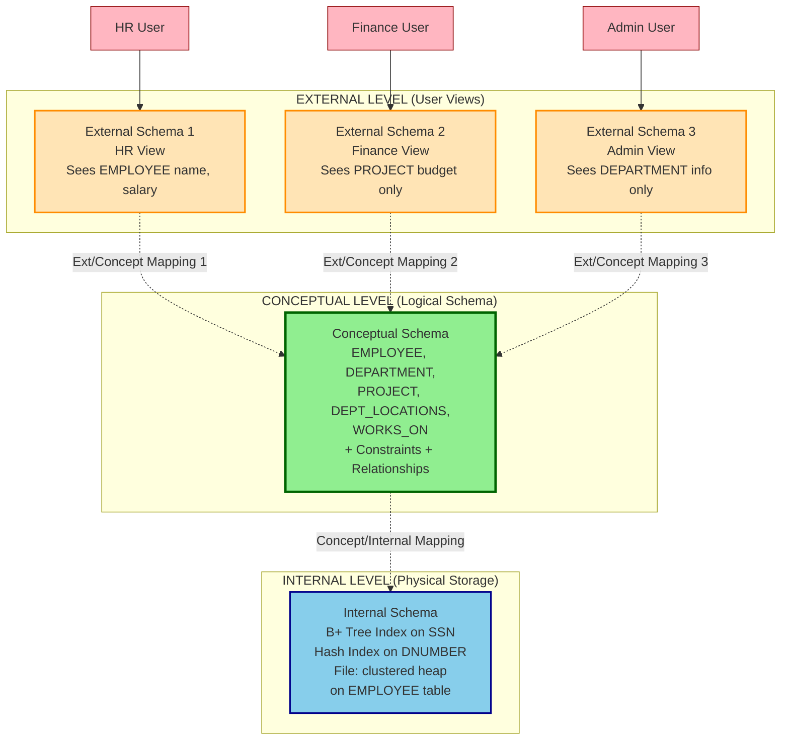
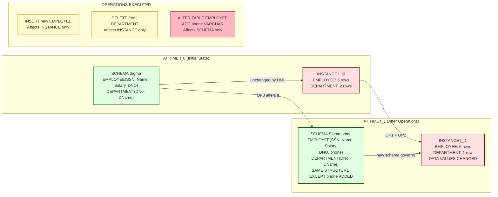
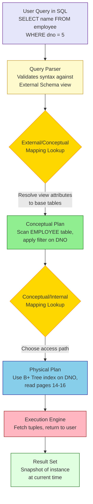

# Schemas and Instances

> **APJ ABDUL KALAM TECHNOLOGICAL UNIVERSITY (KTU) | 2024 SCHEME**
> - **Branch:** B.Tech in Computer Science & Engineering (CSE)
> - **Semester:** Semester 4
> - **Course:** PCCST402 - DATABASE MANAGEMENT SYSTEMS
> - **Module:** Module 1: Introduction to Databases
> - **Topic:** Schemas and Instances

<!-- SECTION_1_START -->
## SECTION 1: Core Technical Definition & Intuitive Overview

### 1.1 Formal Definition (KTU 2024 Syllabus Terminology)

In the context of Database Management Systems (DBMS), the database is understood to possess two essential structural components: the **Schema** and the **Instance**.

**Database Schema (also called Intension):**
The *schema* of a database is its **logical structure** or **design description**. It is the overall logical/physical description of the entire database as envisioned by the database designers. The schema specifies:
- The data types that each field/attribute will hold.
- The constraints that govern the data.
- The relationships that exist among the data items.
- The names of tables (relations), their attributes, and their domains.

> [!IMPORTANT]
> **Board Examiner Definition:** A database schema is the *skeleton* structure that represents the logical view of the entire database. It is formulated at the time of database design and is *not expected to change frequently*.

**Database Instance (also called Extension, State, or Snapshot):**
The *instance* of a database is the **set of data (tuples/records)** stored in the database at a particular moment in time. The instance changes over time as the database is updated with new data, deletions, and modifications.

> [!NOTE]
> **Board Examiner Definition:** A database instance is a *snapshot* of the data currently held in the database at a given instant of time. The instance changes every time the database is updated (INSERT, UPDATE, DELETE).

### 1.2 Conceptual Analogy and Intuitive Overview

**Analogy 1: The Architectural Blueprint vs. The Actual Building**
Imagine a civil engineer designs a multi-storey building. The **blueprint** drawn on paper specifies:
- Number of rooms, dimensions, columns, beam positions
- Material specifications
- It does NOT change once approved (unless renovation is planned)

This blueprint is the **SCHEMA** of the building.

Now, the building is constructed. On **Day 1**, Room 101 is empty. On **Day 2**, Room 101 has 3 occupants. On **Day 3**, Room 101 is again empty. The "occupancy state" of the building at any single moment is the **INSTANCE** of the building.

$$\text{Schema} = \text{Blueprint (Structure, rarely changes)}$$
$$\text{Instance} = \text{Occupancy State at time } t \text{ (frequently changes)}$$

**Analogy 2: Object-Oriented Programming (Java/C++) Parallel**
- A **Java Class** is analogous to a *Schema*: it defines fields, types, and methods.
- An **Object (Instance of the Class)** is analogous to a *Database Instance*: it holds actual runtime data.

> [!TIP]
> **Memory Aid:** "Schema = STRUCTURE, Instance = SNAPSHOT." In any board exam, if asked to differentiate, always begin with this two-word summary.

### 1.3 GeoGebra / Desmos Visualization Callout

> [!VISUALIZATION CONTROL]
> **Concept:** Time-Indexed Schema Invariance vs Instance Variability
> **Visualization Logic (Conceptual Coordinates):**
> Let the x-axis represent *Time* ($t_0 < t_1 < t_2 < t_3$).
> Let the y-axis represent *Number of Attributes defined in Schema* and *Number of Tuples stored in Instance*.
> **Plot 1 (Schema line):** A horizontal line $S(t) = k$ (constant), since the schema structure does not change between time stamps.
> **Plot 2 (Instance line):** A step function $I(t)$ that jumps up/down as INSERT/DELETE operations occur.
> **Visual Description:** The student should observe that the schema line is a flat horizontal line over time, whereas the instance line is a fluctuating step function, illustrating that the schema is stable while the instance is dynamic.

### 1.4 The Three Levels of Schema in DBMS Architecture

In the standard **Three-Schema Architecture** (covered next in your module), each level has its own schema:

1. **Internal Schema (Physical Schema):** Describes the physical storage structure of the database — how data is stored on disk, indexing methods, file organization, data compression, and encryption.

2. **Conceptual Schema (Logical Schema):** Describes the logical structure of the entire database — entities, data types, constraints, relationships, but hides physical storage details. There is **only ONE conceptual schema per database**.

3. **External Schemas (Subschemas / User Views):** Describes the portion of the database that is relevant to a particular user group. Multiple external schemas may exist (one per user view).

> [!IMPORTANT]
> **KTU Board Pattern:** Questions frequently ask *"How many conceptual schemas does a database have?"* — The answer is **ONE**. A database has only one conceptual schema but may have multiple external schemas and one internal schema.
<!-- SECTION_1_END -->

<!-- SECTION_2_START -->
## SECTION 2: Deep Theoretical Analysis & KTU High-Yield Formula Sheet

### 2.1 Operational Breakdown of Schemas and Instances

**Why do we separate Schema from Instance?**

The separation is the **foundational principle** that enables *Data Independence* — the ability to modify the schema definition at one level of the database architecture without affecting the schema definition at the next higher level.

**How does the DBMS handle this distinction?**

The DBMS maintains two distinct catalogs in its system tables:
- **Data Dictionary / System Catalog:** Stores the schema (metadata — "data about data").
- **Data Files / Tablespaces:** Stores the actual instance (user data).

**Logical Flow of an SQL Operation:**

| Step | DBMS Action | Touches Schema? | Touches Instance? |
| :--- | :--- | :--- | :--- |
| 1 | `CREATE TABLE Student(...)` | YES (defines new structure) | NO (no rows yet) |
| 2 | `INSERT INTO Student VALUES(...)` | NO (structure unchanged) | YES (new tuple added) |
| 3 | `ALTER TABLE Student ADD age INT` | YES (structure modified) | NO (existing rows unchanged) |
| 4 | `DELETE FROM Student WHERE id=5` | NO (structure unchanged) | YES (tuple removed) |

### 2.2 KTU High-Yield Formula Sheet / Cheat Sheet

| Concept | Symbol / Notation | Description | Frequency in DB Lifecycle |
| :--- | :--- | :--- | :--- |
| Schema (Intension) | $S$ or $\Sigma$ | Logical structure; set of relation schemas $R(R_1, R_2, ..., R_n)$ | Changes rarely (design time) |
| Instance (Extension) | $I_t$ or $\sigma_t$ | Set of tuples at time $t$ | Changes frequently (runtime) |
| Relation Schema | $R(A_1, A_2, ..., A_n)$ | Table name with attribute list | Defined at design time |
| Relation State | $r(R)$ | Set of $n$-tuples $\{t_1, t_2, ..., t_m\}$ at time $t$ | Changes with DML |
| Cardinality | $\vert r(R) \vert$ | Number of tuples in current state | Dynamic |
| Degree | $\deg(R)$ | Number of attributes in $R$ | Static (unless ALTER TABLE) |
| Domain | $\text{dom}(A_i)$ | Set of allowable values for attribute $A_i$ | Static |
| Primary Schema | $S_{conceptual}$ | One per database | Single |
| Subschema | $S_{external}^i$ | Multiple per database | Multiple (one per view) |
| Internal Schema | $S_{physical}$ | One per database | Single |

> [!NOTE]
> **Critical Board Notation Tip:** Always write relation schema as $R(A_1 : D_1, A_2 : D_2, ...)$ where $A_i$ is the attribute name and $D_i$ is its domain. The relation state at time $t$ is written as $r_t(R)$ or simply $r(R)$ when $t$ is implicit.

### 2.3 Mapping Between Schemas

When a user issues a query, the DBMS must transform it across three levels:

$$\text{External Schema} \xleftrightarrow{\text{External/Conceptual Mapping}} \text{Conceptual Schema} \xleftrightarrow{\text{Conceptual/Internal Mapping}} \text{Internal Schema}$$

**Purpose of these mappings:**
- They provide a **translation mechanism** that allows the DBMS to convert a request from one level's representation to another.
- The mappings are stored in the data dictionary and consulted during query processing.

### 2.4 Real-World Utility in Production Engineering

In production-grade systems (e.g., banking, e-commerce, healthcare):

1. **Schema Versioning Tools** (e.g., Flyway, Liquibase) — track schema changes (DDL) as versioned migration scripts. This is schema evolution in practice.
2. **Point-in-Time Recovery** — backup/restore systems rely on the concept of "instance at time $t$" being restorable from logs.
3. **Database DevOps** — separate *schema management* (handled by DBAs, slow) from *data management* (handled by applications, fast).
4. **Multi-tenant SaaS systems** — each tenant has the *same schema* but *different instances* of data.

### 2.5 Distinguishing Schema Mutations vs Instance Mutations

A mutation (change) is classified based on what it alters:

| Type of Mutation | Affects Schema? | Affects Instance? | SQL Examples |
| :--- | :--- | :--- | :--- |
| Schema Evolution (DDL) | YES | Indirectly | CREATE, ALTER, DROP, RENAME, TRUNCATE |
| Instance Update (DML) | NO | YES | INSERT, UPDATE, DELETE, MERGE |
| Transaction Control | NO | Indirectly (visibility) | COMMIT, ROLLBACK, SAVEPOINT |
| Access Control (DCL) | NO | NO (privileges only) | GRANT, REVOKE |
<!-- SECTION_2_END -->

<!-- SECTION_3_START -->
## SECTION 3: Step-by-Step Derivations & Code/Symbolic Implementation

### 3.1 Formal Mathematical Definition of Schema and Instance

Let $\mathcal{R} = \{R_1, R_2, ..., R_n\}$ be the set of relation schemas that make up a database. Each $R_i$ is a tuple of the form:

$$R_i = (A_{i,1}, A_{i,2}, ..., A_{i,k_i})$$

where $A_{i,j}$ is the $j$-th attribute of relation $R_i$, and $k_i = \deg(R_i)$.

**Step-by-Step Definition:**

**Step 1:** Define the domain of each attribute.

$$\text{For each } A_{i,j}, \text{ we have } \text{dom}(A_{i,j})$$

**Step 2:** Define the relation schema as the named structure.

$$R_i = (\text{relation\_name}, A_{i,1}, A_{i,2}, ..., A_{i,k_i}, \text{PRIMARY KEY}(...), \text{FOREIGN KEY}(...))$$

**Step 3:** Define the database schema (conceptual schema) as the collection of all relation schemas.

$$\Sigma = \{R_1, R_2, ..., R_n\}$$

**Step 4:** Define the instance (relation state) of $R_i$ at time $t$ as a set of $k_i$-tuples.

$$r_t(R_i) \subseteq \text{dom}(A_{i,1}) \times \text{dom}(A_{i,2}) \times ... \times \text{dom}(A_{i,k_i})$$

**Step 5:** Define the database instance at time $t$ as the collection of all current relation states.

$$I_t = \{r_t(R_1), r_t(R_2), ..., r_t(R_n)\}$$

**Step 6:** The transition between instances due to a DML operation is modelled as:

$$I_{t+1} = f(I_t, \text{operation})$$

where $f$ is the database state transition function corresponding to the DML command.

### 3.2 Worked Example: The COMPANY Database Schema

**Step 1: Define the schema using SQL DDL (Data Definition Language).**

The schema definition explicitly uses the *intension* — what the database structure will look like.

```sql
-- ============================================
-- SCHEMA DEFINITION (Intension)
-- This part defines the STRUCTURE of the database.
-- It is stored in the data dictionary and rarely changes.
-- ============================================

CREATE SCHEMA COMPANY_AUTHORIZED_BY_Babu;

-- Relation: EMPLOYEE
CREATE TABLE EMPLOYEE (
    FNAME       VARCHAR(20)    NOT NULL,
    MINIT       CHAR,
    LNAME       VARCHAR(20)    NOT NULL,
    SSN         CHAR(9)        NOT NULL,
    BDATE       DATE,
    ADDRESS     VARCHAR(50),
    SEX         CHAR,
    SALARY      DECIMAL(10,2),
    SUPERSSN    CHAR(9),
    DNO         INT            NOT NULL,
    CONSTRAINT PK_EMPLOYEE PRIMARY KEY (SSN),
    CONSTRAINT FK_EMPLOYEE_DEPT FOREIGN KEY (DNO) 
        REFERENCES DEPARTMENT(DNUMBER),
    CONSTRAINT FK_EMPLOYEE_SUPER FOREIGN KEY (SUPERSSN) 
        REFERENCES EMPLOYEE(SSN)
);

-- Relation: DEPARTMENT
CREATE TABLE DEPARTMENT (
    DNAME       VARCHAR(20)    NOT NULL,
    DNUMBER     INT            NOT NULL,
    MGRSSN      CHAR(9),
    MGRSTARTDATE DATE,
    CONSTRAINT PK_DEPARTMENT PRIMARY KEY (DNUMBER),
    CONSTRAINT FK_DEPT_EMP FOREIGN KEY (MGRSSN) 
        REFERENCES EMPLOYEE(SSN)
);

-- Relation: DEPT_LOCATIONS
CREATE TABLE DEPT_LOCATIONS (
    DNUMBER     INT            NOT NULL,
    DLOCATION   VARCHAR(20)    NOT NULL,
    CONSTRAINT PK_DEPT_LOC PRIMARY KEY (DNUMBER, DLOCATION),
    CONSTRAINT FK_DEPT_LOC_DEPT FOREIGN KEY (DNUMBER) 
        REFERENCES DEPARTMENT(DNUMBER)
);

-- Relation: PROJECT
CREATE TABLE PROJECT (
    PNAME       VARCHAR(20)    NOT NULL,
    PNUMBER     INT            NOT NULL,
    PLOCATION   VARCHAR(20),
    DNUM        INT            NOT NULL,
    CONSTRAINT PK_PROJECT PRIMARY KEY (PNUMBER),
    CONSTRAINT FK_PROJECT_DEPT FOREIGN KEY (DNUM) 
        REFERENCES DEPARTMENT(DNUMBER)
);

-- Relation: WORKS_ON
CREATE TABLE WORKS_ON (
    ESSN        CHAR(9)        NOT NULL,
    PNO         INT            NOT NULL,
    HOURS       DECIMAL(4,1),
    CONSTRAINT PK_WORKS_ON PRIMARY KEY (ESSN, PNO),
    CONSTRAINT FK_WO_EMP FOREIGN KEY (ESSN) 
        REFERENCES EMPLOYEE(SSN),
    CONSTRAINT FK_WO_PROJ FOREIGN KEY (PNO) 
        REFERENCES PROJECT(PNUMBER)
);
```

**Step 2: Define the initial instance (Extension) using SQL DML.**

The instance is the *current data* that the schema holds. The following INSERT statements establish the initial state.

```sql
-- ============================================
-- INSTANCE POPULATION (Extension)
-- This part fills the schema with ACTUAL DATA.
-- Each INSERT changes the current state I_t to I_{t+1}.
-- ============================================

INSERT INTO EMPLOYEE VALUES 
    ('John', 'B', 'Smith', '123456789', '1965-01-09', 
     '731 Fondren, Houston, TX', 'M', 30000, '333445555', 5),
    ('Franklin', 'T', 'Wong', '333445555', '1955-12-08', 
     '638 Voss, Houston, TX', 'M', 40000, '888665555', 5),
    ('Alicia', 'J', 'Zelaya', '999887777', '1968-01-19', 
     '3321 Castle, Spring, TX', 'F', 25000, '987654321', 4),
    ('Jennifer', 'S', 'Wallace', '987654321', '1941-06-20', 
     '291 Berry, Bellaire, TX', 'F', 43000, '888665555', 4),
    ('Ramesh', 'K', 'Narayan', '666884444', '1962-09-15', 
     '975 Fire Oak, Humble, TX', 'M', 38000, '333445555', 5),
    ('Joyce', 'A', 'English', '453453453', '1972-07-31', 
     '5631 Rice, Houston, TX', 'F', 25000, '333445555', 5),
    ('Ahmad', 'V', 'Jabbar', '987987987', '1969-03-29', 
     '980 Dallas, Houston, TX', 'M', 25000, '987654321', 4),
    ('James', 'E', 'Borg', '888665555', '1937-11-10', 
     '450 Stone, Houston, TX', 'M', 55000, NULL, 1);

INSERT INTO DEPARTMENT VALUES 
    ('Research', 5, '333445555', '1988-05-22'),
    ('Administration', 4, '987654321', '1995-01-01'),
    ('Headquarters', 1, '888665555', '1981-06-19');

INSERT INTO DEPT_LOCATIONS VALUES 
    (1, 'Houston'),
    (4, 'Stafford'),
    (5, 'Bellaire'),
    (5, 'Sugarland'),
    (5, 'Houston');

INSERT INTO PROJECT VALUES 
    ('ProductX', 1, 'Bellaire', 5),
    ('ProductY', 2, 'Sugarland', 5),
    ('ProductZ', 3, 'Houston', 5),
    ('Computerization', 10, 'Stafford', 4),
    ('Reorganization', 20, 'Houston', 1),
    ('Newbenefits', 30, 'Stafford', 4);

INSERT INTO WORKS_ON VALUES 
    ('123456789', 1, 32.5),
    ('123456789', 2, 7.5),
    ('333445555', 2, 10.0),
    ('333445555', 3, 10.0),
    ('333445555', 10, 10.0),
    ('333445555', 20, 10.0),
    ('999887777', 30, 30.0),
    ('999887777', 10, 10.0),
    ('987987987', 10, 35.0),
    ('987987987', 30, 5.0),
    ('987654321', 30, 20.0),
    ('987654321', 20, 15.0),
    ('888665555', 20, NULL);
```

**Step 3: Demonstrating a State Transition (Instance Mutation).**

Before the operation, let $I_{t_0}$ be the database state with the above tuples.
After the following DELETE operation, the state transitions to $I_{t_1}$.

```sql
-- State transition: I_{t_0}  -->  I_{t_1}
DELETE FROM EMPLOYEE 
WHERE FNAME = 'James' AND LNAME = 'Borg';

-- Result: I_{t_1} is the same as I_{t_0} but without the 
-- (James, E, Borg, 888665555, ...) tuple.
-- Schema Sigma is UNCHANGED. Only instance I_t changed.
```

**Step 4: Demonstrating a Schema Mutation.**

```sql
-- Schema evolution: Sigma  -->  Sigma'
-- This changes the INTENSION itself.
ALTER TABLE EMPLOYEE 
    ADD COLUMN EMAIL VARCHAR(100);

-- Now Sigma' = Sigma U {EMPLOYEE now has 11 attributes}
-- Cardinality of I_t (number of tuples) is UNCHANGED.
-- Degree of EMPLOYEE (number of attributes) increased by 1.
```

### 3.3 Symbolic State Transition Representation

Let the EMPLOYEE relation state at time $t_0$ be:

$$r_{t_0}(\text{EMPLOYEE}) = \{t_1, t_2, t_3, t_4, t_5, t_6, t_7, t_8\}$$

where each $t_i$ is a 10-tuple corresponding to the inserted rows.

**Operation:** `DELETE FROM EMPLOYEE WHERE SSN = '888665555'`

This is the set difference:

$$r_{t_1}(\text{EMPLOYEE}) = r_{t_0}(\text{EMPLOYEE}) - \{t_8\}$$

$$r_{t_1}(\text{EMPLOYEE}) = \{t_1, t_2, t_3, t_4, t_5, t_6, t_7\}$$

Thus:

$$\vert r_{t_0}(\text{EMPLOYEE}) \vert = 8 \quad \text{and} \quad \vert r_{t_1}(\text{EMPLOYEE}) \vert = 7$$

The cardinality decreased by 1, but the degree $\deg(\text{EMPLOYEE}) = 10$ is unchanged.

### 3.4 Python Implementation: Schema Introspection vs Instance Retrieval

```python
"""
schema_vs_instance_demo.py
Demonstrates the difference between schema (structure) and instance (data).
Uses sqlite3 for a self-contained, deterministic example.
"""

import sqlite3
import logging
from typing import List, Tuple, Dict, Any

# Configure structured logging
logging.basicConfig(
    level=logging.INFO,
    format="%(asctime)s | %(levelname)s | %(message)s"
)
logger = logging.getLogger(__name__)


def fetch_schema(conn: sqlite3.Connection, table: str) -> List[Tuple[Any, ...]]:
    """
    Retrieves the SCHEMA (intension) of a table.
    This is the structural metadata stored in sqlite_master / PRAGMA.
    """
    try:
        cursor = conn.execute(f"PRAGMA table_info({table})")
        schema = cursor.fetchall()
        if not schema:
            logger.error(f"Table '{table}' does not exist in schema.")
            return []
        return schema
    except sqlite3.Error as e:
        logger.error(f"Schema retrieval failed: {e}")
        return []


def fetch_instance(conn: sqlite3.Connection, table: str) -> List[Tuple[Any, ...]]:
    """
    Retrieves the INSTANCE (extension) of a table — current snapshot of tuples.
    """
    try:
        cursor = conn.execute(f"SELECT * FROM {table}")
        instance = cursor.fetchall()
        return instance
    except sqlite3.Error as e:
        logger.error(f"Instance retrieval failed: {e}")
        return []


def main() -> None:
    # --- Step 1: Connect to in-memory DB ---
    conn = sqlite3.connect(":memory:")
    conn.execute("PRAGMA foreign_keys = ON")

    # --- Step 2: Define SCHEMA (intension) ---
    conn.execute("""
        CREATE TABLE STUDENT (
            ROLL_NO   INTEGER PRIMARY KEY,
            NAME      TEXT    NOT NULL,
            CGPA      REAL    CHECK (CGPA BETWEEN 0.0 AND 10.0),
            BRANCH    TEXT    NOT NULL
        )
    """)
    conn.commit()
    logger.info("Schema defined: STUDENT(RollNo, Name, CGPA, Branch)")

    # --- Step 3: Fetch and display the schema (structure only) ---
    schema = fetch_schema(conn, "STUDENT")
    print("\n=== SCHEMA (Intension) ===")
    print(f"{'cid':<5}{'name':<12}{'type':<10}{'notnull':<8}{'dflt':<10}{'pk':<5}")
    for col in schema:
        print(f"{col[0]:<5}{col[1]:<12}{col[2]:<10}{col[3]:<8}"
              f"{str(col[4]):<10}{col[5]:<5}")
    print(f"\nDegree deg(STUDENT) = {len(schema)} (constant)")

    # --- Step 4: Populate INSTANCE (extension) ---
    conn.executemany(
        "INSERT INTO STUDENT VALUES (?, ?, ?, ?)",
        [
            (101, "Anand",   9.2, "CSE"),
            (102, "Bhavana", 8.8, "CSE"),
            (103, "Chitra",  9.5, "ECE"),
        ]
    )
    conn.commit()

    # --- Step 5: Fetch and display the instance (data only) ---
    instance = fetch_instance(conn, "STUDENT")
    print("\n=== INSTANCE (Extension) at t_0 ===")
    for row in instance:
        print(row)
    print(f"\nCardinality |r_t0(STUDENT)| = {len(instance)}")

    # --- Step 6: Modify the instance (state transition) ---
    conn.execute("DELETE FROM STUDENT WHERE ROLL_NO = 103")
    conn.commit()

    instance_t1 = fetch_instance(conn, "STUDENT")
    print("\n=== INSTANCE (Extension) at t_1 after DELETE ===")
    for row in instance_t1:
        print(row)
    print(f"\nCardinality |r_t1(STUDENT)| = {len(instance_t1)}")
    print("Schema degree is STILL 4 (unchanged).")

    # --- Step 7: Modify the schema (intension change) ---
    conn.execute("ALTER TABLE STUDENT ADD COLUMN EMAIL TEXT")
    conn.commit()
    schema_v2 = fetch_schema(conn, "STUDENT")
    print(f"\n=== SCHEMA after ALTER ===")
    print(f"Degree deg(STUDENT) is now = {len(schema_v2)} (changed!)")
    print("Instance tuple count is STILL 2 (unchanged by DDL).")

    conn.close()


if __name__ == "__main__":
    main()
```

**Expected Output Summary:**

```
=== SCHEMA (Intension) ===
cid  name        type       notnull  dflt       pk
0    ROLL_NO     INTEGER    0        None       1
1    NAME        TEXT       1        None       0
2    CGPA        REAL       0        None       0
3    BRANCH      TEXT       1        None       0

Degree deg(STUDENT) = 4 (constant)

=== INSTANCE (Extension) at t_0 ===
(101, 'Anand', 9.2, 'CSE')
(102, 'Bhavana', 8.8, 'CSE')
(103, 'Chitra', 9.5, 'ECE')

Cardinality |r_t0(STUDENT)| = 3

=== INSTANCE (Extension) at t_1 after DELETE ===
(101, 'Anand', 9.2, 'CSE')
(102, 'Bhavana', 8.8, 'CSE')

Cardinality |r_t1(STUDENT)| = 2
Schema degree is STILL 4 (unchanged).
```

> [!TIP]
> **Board Tip:** When answering practical questions, always cite both cardinality (changing) and degree (static, unless DDL is used). This demonstrates that you understand schema-instance distinction at the operational level.
<!-- SECTION_3_END -->

<!-- SECTION_4_START -->
## SECTION 4: Structural Diagrams & Schematics

### 4.1 Mermaid Diagram: Three-Schema Architecture with Mappings



### 4.2 Mermaid Diagram: Schema vs Instance Time Evolution



### 4.3 Mermaid Diagram: Mapping Mechanisms (Functional Flow)



### 4.4 Block-Level Functional Architecture: Schema Catalog vs Data Store

| Component | Stores | Modifies via | Frequency | Owner |
| :--- | :--- | :--- | :--- | :--- |
| Data Dictionary (System Catalog) | Schema definitions, constraints, indexes, user privileges, statistics | DDL: CREATE, ALTER, DROP | Rare (design time / major releases) | Database Administrator (DBA) |
| Data Files / Tablespaces | Tuples, attribute values, BLOBs, CLOBs | DML: INSERT, UPDATE, DELETE, MERGE | Frequent (every transaction) | Application / End User |
| Transaction Log / Redo Log | Sequence of state transitions $I_{t} \to I_{t+1}$ | Implicit (autonomous) | Very frequent (every commit) | DBMS Engine |
| Statistics Catalog | Cardinality, histograms, distribution info | ANALYZE / DBMS_STATS | Periodic | Query Optimizer |
<!-- SECTION_4_END -->

<!-- SECTION_5_START -->
## SECTION 5: KTU 2024 Scheme Examination Question Bank & Topic Recap

---

### PART A: Short Answer Questions (3 Marks Each)

---

**Q1. [KTU University Exam - Dec 2023]**
**Differentiate between Database Schema and Database Instance with suitable examples. (3 Marks)**
*Mapped CO: CO1 | RBT Level: Understand*

**Model Answer (Board Standard):**

| Aspect | Database Schema (Intension) | Database Instance (Extension) |
| :--- | :--- | :--- |
| **Definition** | The logical structure or design of the database | The actual data stored at a particular moment |
| **Also Called** | Intension | Extension, State, Snapshot |
| **Nature** | Static, rarely changes | Dynamic, changes with every update |
| **Stored In** | Data dictionary / System catalog | Data files / Tablespaces |
| **Example** | `STUDENT(ROLL_NO, NAME, CGPA, BRANCH)` definition | The 5000 current student records in the table |
| **Analogy** | Variable declaration in a program | Current value of the variable at runtime |

**[Valuation Key: Clear tabular differentiation: 2 Marks; One concrete example: 1 Mark]**

---

**Q2. [KTU University Exam - July 2024]**
**Explain the concept of an External Schema (Subschema). Why can a database have multiple external schemas but only one conceptual schema? (3 Marks)**
*Mapped CO: CO1, CO2 | RBT Level: Remember, Understand*

**Model Answer:**

An **External Schema** (also called a **subschema** or **user view**) is a description of the portion of the database that is relevant to a particular user or user group. Each user or application sees only the data they need and is shielded from the rest of the database.

**Multiple external schemas are allowed because:**
- Different user groups have different *information needs* (HR needs salary, Sales needs region, Admin needs department).
- Security and access control are easier when views are separated.
- The same underlying data can be presented in different formats.

**Only ONE conceptual schema exists because:**
- The conceptual schema represents the **unified, integrated logical view of the entire enterprise**.
- Having multiple conceptual schemas would lead to redundancy and inconsistency in data definition.
- All external schemas must map to a *single source of truth* in the conceptual layer.

**[Valuation Key: Definition of external schema: 1 Mark; Reason for multiplicity: 1 Mark; Reason for single conceptual schema: 1 Mark]**

---

### PART B: Long Answer Questions (14 Marks Each)

---

> [!IMPORTANT]
> **KTU 2024 Pattern:** Part B Module 1 questions carry 14 marks. Each question has internal choice. Both alternatives are given below. Solve ANY ONE.

---

#### QUESTION A (14 Marks)

**(a) [7 Marks]** Define the following terms with one example each: (i) Database Schema, (ii) Database Instance, (iii) Internal Schema, (iv) Conceptual Schema, (v) External Schema.
*Mapped CO: CO1 | RBT Level: Remember*

**(b) [7 Marks]** With a neat diagram, describe the **Three-Schema Architecture** of a DBMS. Explain the role of mappings between schemas and discuss how this architecture supports **Logical Data Independence** and **Physical Data Independence**.
*Mapped CO: CO2 | RBT Level: Understand, Apply*

**Model Answer:**

**(a) Definitions with Examples (7 Marks)**

**(i) Database Schema (1 Mark):**
The overall logical structure of the entire database. Example: A set of relation schemas $\Sigma = \{\text{EMPLOYEE}, \text{DEPARTMENT}, \text{ PROJECT}\}$.

**(ii) Database Instance (1 Mark):**
The collection of all tuples currently stored in the database at a specific time. Example: At 10:00 AM today, EMPLOYEE contains 8500 rows and DEPARTMENT contains 50 rows.

**(iii) Internal Schema (1 Mark):**
Describes the physical storage structure of the database. Example: EMPLOYEE data is stored as a clustered B+ tree file ordered by SSN, with secondary indexes on DNO and LNAME.

**(iv) Conceptual Schema (1 Mark):**
Describes the logical structure of the entire database, hiding physical storage details. There is exactly one conceptual schema per database. Example: EMPLOYEE(SSN PK, FNAME, LNAME, DNO FK), with the constraint that DNO must exist in DEPARTMENT.

**(v) External Schema (1 Mark):**
A description of a portion of the database relevant to a specific user group. Example: An HR user sees EMPLOYEE(FNAME, LNAME, SALARY), but not SUPERSSN or BDATE.

**Additional structural logic (2 Marks):**
Each schema exists at a different level of abstraction: External (highest, user-facing) → Conceptual (logical, global) → Internal (lowest, physical).

**[Valuation Key for (a): Five definitions: 5 Marks; Coherent introductory sentence linking them: 2 Marks]**

---

**(b) Three-Schema Architecture and Data Independence (7 Marks)**

**Step 1: Draw the three-schema diagram (3 Marks)**

```
  External Level:  [Ext Schema 1]  [Ext Schema 2]  [Ext Schema 3]
                          \             |             /
                           \            |            /
   Conceptual Level:        [  Conceptual Schema  ]
                                    |
   Internal Level:               [ Internal Schema ]

   Mappings:  External/Conceptual Mapping (one per external schema)
              Conceptual/Internal Mapping (one only)
```

**Step 2: Role of Mappings (2 Marks)**

The mappings translate requests and results across abstraction levels:
- **External/Conceptual Mapping:** Translates a user query (referencing external view names) into operations on the conceptual schema. Example: User says "show me department managers" — the mapping translates the external view `MANAGER` into the conceptual query on `DEPARTMENT.MGRSSN`.
- **Conceptual/Internal Mapping:** Translates conceptual-level operations into physical-level operations (file scans, index lookups, page reads). Example: Translating a conceptual "find employees in department 5" into a B+ tree search on the DNO index.

**Step 3: Logical Data Independence (1 Mark)**

The capacity to change the **conceptual schema** without affecting external schemas or application programs.

Example: Adding a new attribute `EMAIL` to EMPLOYEE in the conceptual schema. Existing external schemas that did not include EMAIL are unaffected, and applications that did not reference EMAIL continue to work unchanged.

**Step 4: Physical Data Independence (1 Mark)**

The capacity to change the **internal schema** without affecting the conceptual schema.

Example: Changing the EMPLOYEE file from a heap organization to a B+ tree on SSN. The conceptual schema (and hence all external schemas and applications) remains identical. Only the conceptual/internal mapping is updated.

**[Valuation Key for (b): Diagram: 3 Marks; Mappings explanation: 2 Marks; Logical independence example: 1 Mark; Physical independence example: 1 Mark]**

---

#### QUESTION B (14 Marks) — Alternative Choice

**(a) [7 Marks]** What is meant by the **state of a relation**? Explain the concept of **relation schema**, **relation state**, **degree**, and **cardinality** with a suitable example. Show how the state changes when (i) an INSERT, (ii) a DELETE, and (iii) an ALTER TABLE operation is performed.
*Mapped CO: CO1, CO2 | RBT Level: Understand, Apply*

**(b) [7 Marks]** Consider a UNIVERSITY database with the following relations:
- STUDENT(SSN, Name, BDate, Major)
- COURSE(CourseId, CName, Dept)
- ENROLL(SSN, CourseId, Grade)

Write the **schema** (intension) using SQL DDL with proper primary keys and foreign key constraints. Then write 5 INSERT statements to create an **instance** (extension). Demonstrate one state transition of each: DML-only and DDL-only.
*Mapped CO: CO1, CO2, CO3 | RBT Level: Apply, Analyze*

**Model Answer:**

**(a) Relation Schema, State, Degree, Cardinality (7 Marks)**

**Relation Schema (1.5 Marks):** A relation schema $R(A_1 : D_1, A_2 : D_2, ..., A_n : D_n)$ specifies the relation name $R$, the list of attributes $A_i$, and their corresponding domains $D_i$. It is the *intension* of the relation.

Example: `STUDENT(SSN: CHAR(9), Name: VARCHAR(50), Major: VARCHAR(20))`

**Relation State (1.5 Marks):** A relation state $r(R)$ is a *set* of $n$-tuples $t$ where each $t \in \text{dom}(A_1) \times \text{dom}(A_2) \times ... \times \text{dom}(A_n)$. It is the *current extension* of the relation schema.

Example: $r(\text{STUDENT}) = \{(\text{'12345'}, \text{'Anand'}, \text{'CSE'}), (\text{'67890'}, \text{'Bhavana'}, \text{'ECE'})\}$

**Degree (1 Mark):** The degree $\deg(R)$ is the number of attributes $n$ in the relation schema. It is a *static* property that changes only when DDL (ALTER TABLE) is issued.

Example: $\deg(\text{STUDENT}) = 3$

**Cardinality (1 Mark):** The cardinality $\vert r(R) \vert$ is the number of tuples in the current relation state. It is a *dynamic* property that changes with every INSERT/DELETE.

Example: $\vert r(\text{STUDENT}) \vert = 2$

**State Transitions (2 Marks):**

| Operation | Effect on Schema? | Effect on Instance? | Example |
| :--- | :--- | :--- | :--- |
| INSERT INTO STUDENT VALUES (...) | NO | YES — cardinality increases by 1 | $\vert r \vert$ becomes 3 |
| DELETE FROM STUDENT WHERE SSN = '12345' | NO | YES — cardinality decreases by 1 | $\vert r \vert$ becomes 1 |
| ALTER TABLE STUDENT ADD GPA DECIMAL(3,2) | YES — degree increases by 1 | NO | $\deg$ becomes 4, $\vert r \vert$ unchanged |

**[Valuation Key for (a): Four definitions: 4 Marks; Working with example: 1 Mark; Three state transitions shown clearly: 2 Marks]**

---

**(b) UNIVERSITY Database — Schema and Instance Implementation (7 Marks)**

**Step 1: Schema Definition (3 Marks)**

```sql
CREATE SCHEMA UNIVERSITY;

CREATE TABLE STUDENT (
    SSN      CHAR(9)     NOT NULL,
    NAME     VARCHAR(50) NOT NULL,
    BDATE    DATE,
    MAJOR    VARCHAR(20),
    CONSTRAINT PK_STUDENT PRIMARY KEY (SSN)
);

CREATE TABLE COURSE (
    COURSEID CHAR(6)     NOT NULL,
    CNAME    VARCHAR(50) NOT NULL,
    DEPT     VARCHAR(20),
    CONSTRAINT PK_COURSE PRIMARY KEY (COURSEID)
);

CREATE TABLE ENROLL (
    SSN      CHAR(9)     NOT NULL,
    COURSEID CHAR(6)     NOT NULL,
    GRADE    CHAR(2),
    CONSTRAINT PK_ENROLL PRIMARY KEY (SSN, COURSEID),
    CONSTRAINT FK_ENROLL_STU FOREIGN KEY (SSN) 
        REFERENCES STUDENT(SSN) ON DELETE CASCADE,
    CONSTRAINT FK_ENROLL_CRS FOREIGN KEY (COURSEID) 
        REFERENCES COURSE(COURSEID) ON DELETE CASCADE
);
```

**Step 2: Instance Population (2 Marks)**

```sql
INSERT INTO STUDENT VALUES 
    ('S001', 'Anand Kumar',   '2002-04-12', 'Computer Science'),
    ('S002', 'Bhavana Raj',   '2001-11-30', 'Electrical'),
    ('S003', 'Chitra Nair',   '2002-06-15', 'Computer Science'),
    ('S004', 'Deepak Menon',  '2001-09-22', 'Mechanical'),
    ('S005', 'Esha Pillai',   '2002-01-08', 'Computer Science');

INSERT INTO COURSE VALUES 
    ('CS201', 'Data Structures',     'Computer Science'),
    ('CS305', 'Database Systems',    'Computer Science'),
    ('EE210', 'Circuit Theory',      'Electrical'),
    ('ME301', 'Thermodynamics',     'Mechanical');

INSERT INTO ENROLL VALUES 
    ('S001', 'CS201', 'A'),
    ('S001', 'CS305', 'B'),
    ('S002', 'EE210', 'A'),
    ('S003', 'CS201', 'A'),
    ('S005', 'CS305', 'A');
```

**Step 3: DML-Only State Transition (1 Mark)**

```sql
-- State transition I_{t0}  -->  I_{t1}
DELETE FROM STUDENT WHERE SSN = 'S004';
-- Cardinality of STUDENT changed: 5  -->  4
-- Schema Sigma is UNCHANGED.
```

**Step 4: DDL-Only State Transition (1 Mark)**

```sql
-- Schema evolution: Sigma  -->  Sigma'
ALTER TABLE STUDENT ADD COLUMN EMAIL VARCHAR(100);
-- Degree of STUDENT changed: 4  -->  5
-- Cardinality of STUDENT unchanged.
```

**[Valuation Key for (b): Correct DDL with all keys/constraints: 3 Marks; INSERT statements valid: 2 Marks; DML transition: 1 Mark; DDL transition: 1 Mark]**

---

> [!WARNING]
> **KTU Examiner's Valuation Warning / Common Pitfalls:**
> 1. **Do not confuse the three-schema levels.** External = user views (multiple). Conceptual = global logical view (one). Internal = physical storage (one). Mixing these up costs 2-3 marks.
> 2. **Cardinality vs Degree confusion.** Many students write "cardinality" when they mean "degree." Remember: degree = columns (attributes), cardinality = rows (tuples).
> 3. **Forgetting to state which level of schema is being changed** when discussing data independence. Always specify "Conceptual schema change" for logical independence and "Internal schema change" for physical independence.
> 4. **Writing "schema changes" for DML operations.** INSERT/DELETE/UPDATE change the *instance*, NEVER the schema. This is a guaranteed mark deduction.
> 5. **Foreign key constraints not declared.** When asked to write DDL, always include PRIMARY KEY, FOREIGN KEY, and CHECK constraints — partial DDL loses marks.
> 6. **Tuple order matters in SQL INSERT.** The values must match the order of columns as defined in the schema; otherwise the insertion fails.

---

### TOPIC RECAP & IMPORTANT THINGS TO REMEMBER

- **Schema (Intension)** = the *logical structure* and design of the database. It defines tables, attributes, data types, constraints, and relationships. It is **static** and stored in the **data dictionary**.

- **Instance (Extension / State / Snapshot)** = the *actual data* (tuples) in the database at a particular moment in time. It is **dynamic** and changes with every INSERT, UPDATE, or DELETE.

- **Three-Schema Architecture Levels (top to bottom):**
  1. **External Schema (Subschema / User View)** — multiple per database; tailored to user needs; provides security and customization.
  2. **Conceptual Schema (Logical Schema)** — exactly **one** per database; the unified enterprise-wide logical view; hides physical details.
  3. **Internal Schema (Physical Schema)** — exactly **one** per database; describes physical storage, indexing, and file organization.

- **Mappings (stored in the catalog):**
  - External/Conceptual Mapping — translates between user views and global logical view.
  - Conceptual/Internal Mapping — translates between logical operations and physical storage operations.

- **Data Independence:**
  - **Logical Data Independence** = capacity to change the *conceptual schema* (e.g., add a new attribute) without affecting external schemas or application programs.
  - **Physical Data Independence** = capacity to change the *internal schema* (e.g., re-organize files, add indexes) without affecting the conceptual schema.

- **DDL vs DML:**
  - **DDL (Data Definition Language)** — `CREATE`, `ALTER`, `DROP`, `TRUNCATE`, `RENAME` — affects **SCHEMA** (intension).
  - **DML (Data Manipulation Language)** — `SELECT`, `INSERT`, `UPDATE`, `DELETE`, `MERGE` — affects **INSTANCE** (extension).
  - **DCL (Data Control Language)** — `GRANT`, `REVOKE` — affects neither directly; only privileges.
  - **TCL (Transaction Control Language)** — `COMMIT`, `ROLLBACK`, `SAVEPOINT` — affects instance visibility, not structure.

- **Degree vs Cardinality (High-Yield Distinction):**
  - **Degree** = number of *attributes* (columns) in a relation = $n$. **Static** (changes only with DDL).
  - **Cardinality** = number of *tuples* (rows) in a relation state = $\vert r(R) \vert$. **Dynamic** (changes with every DML).

- **Key Distinctions Summary Table:**

  | Property | Schema | Instance |
  | :--- | :--- | :--- |
  | Synonym | Intension | Extension |
  | Type | Design-time artifact | Runtime snapshot |
  | Stored in | Data dictionary / System catalog | Data files / Tablespaces |
  | Changed by | DBA, schema migrations | Application, end user, transactions |
  | Frequency of change | Rare (months/years) | Frequent (milliseconds) |
  | Modelled as | Set of relation schemas $\Sigma = \{R_1, ..., R_n\}$ | Set of relation states $I_t = \{r_t(R_1), ..., r_t(R_n)\}$ |

- **Analogy Lock:** Blueprint vs Building. Class definition vs Object. Variable type vs Current value. Type definition vs Runtime value. **(Use any one in your exam answer for full marks.)**

- **Board Exam Keywords to Use:** "intension", "extension", "data dictionary", "state transition", "DDL vs DML", "three-schema architecture", "logical/physical data independence", "cardinality/degree".

- **One Conceptual Mantra for the Exam:** *"Schema tells you WHAT the data looks like. Instance tells you WHAT the data IS, right now."*
<!-- SECTION_5_END -->
