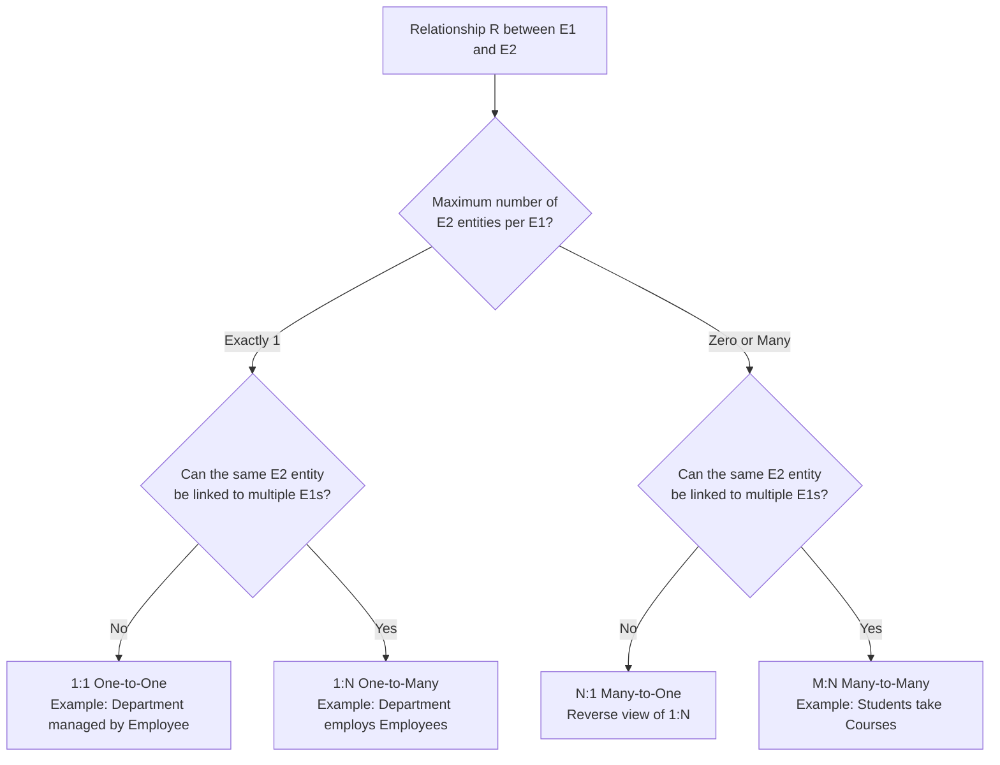
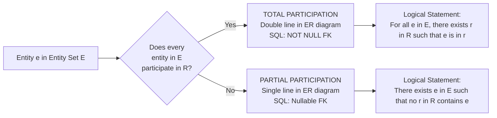
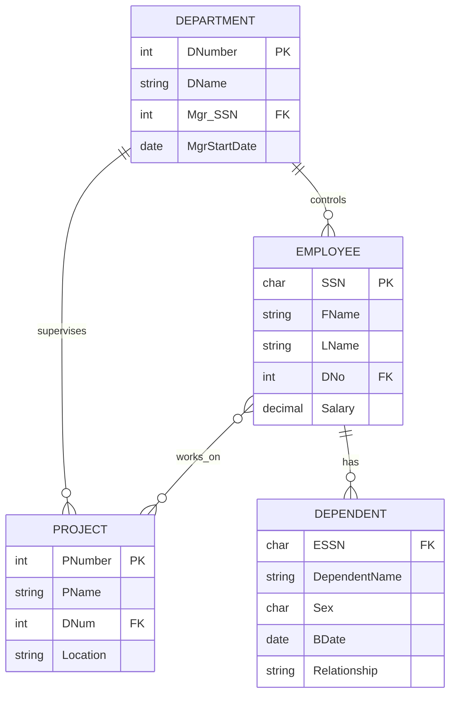
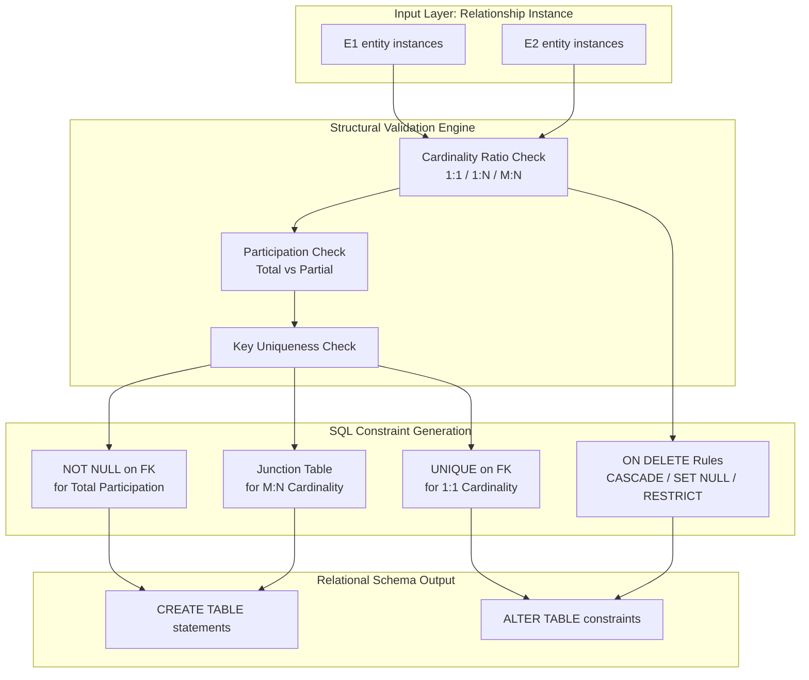

# Structural Constraints

<!-- SECTION_1_START -->
# Structural Constraints in the Entity-Relationship (ER) Model

## 1.1 Formal Academic Definition (KTU 2024 Syllabus Terminology)

In the **Entity-Relationship (ER) data model** — the standard conceptual modelling framework prescribed for **PCCST402 – Database Management Systems (Module 1)** under the **KTU 2024 Scheme** — **Structural Constraints** are the foundational restrictions imposed on the **composition and structure of a relationship type**. They define two distinct, complementary dimensions of every relationship:

1. **Cardinality Ratio (Mapping Cardinality)** — How many entity instances from one entity set can be associated with entity instances of another entity set through a relationship.
2. **Participation Constraint** — Whether the existence of an entity depends on its participation in the relationship (i.e., is its participation **mandatory** or **optional**?).

> [!IMPORTANT]
> **Structural Constraint (KTU Board Definition):** *"A restriction on the allowable cardinalities and participation dependencies of entities in a relationship type, which together uniquely characterise the semantic structure of the relationship in the ER schema."*

For **binary relationships** (the most common case in KTU exam questions), the cardinality ratio is one of: **1:1**, **1:N**, **N:1**, or **M:N**. The participation constraint is either **Total** (mandatory) or **Partial** (optional).

---

## 1.2 Conceptual Analogy / Intuition

Imagine a **University Examination Cell** that assigns **Invigilators (Faculty Members)** to **Exam Halls** during an end-semester examination:

- A **1:1 constraint** is analogous to assigning **one invigilator per hall**, and that invigilator cannot be assigned to any other hall at the same time — a unique *lock-and-key* pairing.
- A **1:N constraint** is like **one Professor supervising many M.Tech students**, but each student is supervised by only that one Professor — the "one" side is the boss; the "many" side reports to it.
- An **M:N constraint** is like **students enrolling in courses** — one student takes many courses, and one course has many students — a *mesh-like* many-to-many connection.
- **Total participation** is like the rule *"every Exam Script must be linked to an Exam Hall"* — an *orphan* script is meaningless.
- **Partial participation** is like the rule *"a Faculty member may or may not chair a Committee"* — faculty can exist without chairing.

> [!NOTE]
> **Why this matters in KTU exams:** Structural constraints are the single most-tested sub-topic of ER modelling. They appear in nearly every **Part B (14-mark)** question because they map *deterministically* to **FOREIGN KEY**, **NOT NULL**, and **UNIQUE** constraints during the ER-to-Relational translation step.

---

## 1.3 Visualisation Concept (Conceptual Distribution Plot)

> [!VISUALIZATION CONTROL]
> **Concept:** Cardinality Distribution — How Entity Counts Relate on the Two Sides of a Relationship
> **GeoGebra / Desmos Input Equations:**
> * `f(x) = x` — represents the **1:1** strict identity line
> * `g(x) = k` where `k > 0` — represents the **1:N** constant-ratio horizontal line
> * `h(x) = 0.5 * sin(2x) + x` — represents the **M:N** oscillating, non-linear cloud
> **Visual Description:** Plot the number of **$E_1$** entity instances on the $x$-axis versus the number of **$E_2$** entity instances on the $y$-axis participating in a relationship. The **1:1** form a strict diagonal, the **1:N** form a horizontal step pattern, and the **M:N** form a scattered cloud with no fixed linear relationship.

---

## 1.4 Notation Cheat-Sheet (Bolded Standard Metrics)

The following notations are the **standard KTU-recognised symbols** that must be used in every ER diagram:

| Symbol | Meaning |
| :--- | :--- |
| $\mathbf{1}$ | One entity (single instance allowed) |
| $\mathbf{N}$ | Many entities (zero or more) |
| $\mathbf{M}$ | Many entities (zero or more) |
| **Double line** | **Total Participation** (mandatory link) |
| **Single line** | **Partial Participation** (optional link) |
<!-- SECTION_1_END -->

<!-- SECTION_2_START -->
# Deep Theoretical Analysis & KTU High-Yield Formula Sheet

## 2.1 Part I — Cardinality Ratios (Mapping Cardinalities)

The cardinality ratio specifies the **maximum number of relationship instances** in which an entity can participate. For a binary relationship $R$ between entity sets $E_1$ and $E_2$, the four canonical cases are:

### Case 1 — One-to-One (1:1)

An entity in $E_1$ is associated with **at most one** entity in $E_2$, and vice-versa.

**Worked Example:** A `Department` is *managed by* one `Employee`, and an `Employee` manages at most one `Department`.

**Set-Theoretic Formulation:**
$$\text{For every } e_1 \in E_1, \quad \vert \{ e_2 \in E_2 \mid (e_1, e_2) \in R \} \vert \leq 1$$

$$\text{For every } e_2 \in E_2, \quad \vert \{ e_1 \in E_1 \mid (e_1, e_2) \in R \} \vert \leq 1$$

### Case 2 — One-to-Many (1:N)

An entity in $E_1$ can be associated with **many** entities in $E_2$, but each entity in $E_2$ is associated with **at most one** entity in $E_1$.

**Worked Example:** A `Department` *employs* many `Employees`, but each `Employee` works for at most one `Department`.

**Set-Theoretic Formulation:**
$$\text{For every } e_1 \in E_1, \quad \vert \{ e_2 \in E_2 \mid (e_1, e_2) \in R \} \vert \geq 0$$

$$\text{For every } e_2 \in E_2, \quad \vert \{ e_1 \in E_1 \mid (e_1, e_2) \in R \} \vert \leq 1$$

### Case 3 — Many-to-Many (M:N)

An entity in $E_1$ can be associated with **many** entities in $E_2$, and **vice-versa**.

**Worked Example:** `Students` *take* `Courses` — a student takes many courses, a course has many students.

**Set-Theoretic Formulation:**
$$R \subseteq E_1 \times E_2 \quad \text{with no functional restriction on either side}$$

---

## 2.2 Part II — Participation Constraints

### 2.2.1 Total Participation (Existence Dependency)

Every entity in the entity set **must** participate in at least one relationship instance. This is also called **existence dependency** because the entity's existence is *dependent* on the relationship.

**Notation:** A **double line** connecting the entity-set rectangle to the relationship diamond in the ER diagram (Chen's notation).

**Worked Example:** Every `Employee` must work for a `Department` — an `Employee` without a `Department` assignment is a data anomaly.

**Logical Formulation:**
$$\forall e \in E, \; \exists r \in R \text{ such that } e \text{ participates in } r$$

### 2.2.2 Partial Participation (Optional)

Some (or all) entities in the entity set **may not** participate in any relationship instance.

**Notation:** A **single line** connecting the entity-set rectangle to the relationship diamond.

**Worked Example:** An `Employee` may or may not *manage* a `Department`.

**Logical Formulation:**
$$\exists e \in E \text{ such that } \nexists r \in R \text{ where } e \text{ participates in } r$$

---

## 2.3 KTU High-Yield Formula Sheet / Cheat-Sheet

| Constraint Type | Sub-Type | ER Notation (Chen's) | Set-Theoretic Form | SQL Translation |
| :--- | :--- | :--- | :--- | :--- |
| **Cardinality Ratio** | **1:1** | `1` on both sides | Bijection between $E_1$ and $E_2$ | `FOREIGN KEY` + `UNIQUE` constraint |
| **Cardinality Ratio** | **1:N** | `1` on the "one" side, `N` on the "many" side | Function mapping $E_2 \to E_1$ | `FOREIGN KEY` placed on the "many" side table |
| **Cardinality Ratio** | **M:N** | `M` and `N` labels on either side | Subset of $E_1 \times E_2$ (unrestricted) | New **junction (bridge) table** with two `FOREIGN KEY`s |
| **Participation** | **Total** | **Double line** from entity to relationship | Universal quantifier $\forall e \in E, \exists r \in R$ | `NOT NULL` on the `FOREIGN KEY` column |
| **Participation** | **Partial** | **Single line** from entity to relationship | Existential quantifier $\exists e \in E$ with no link | Nullable `FOREIGN KEY` column (NULL allowed) |

> [!TIP]
> **Mnemonic for KTU exams:** *"**T**otal = **T**win lines = **N**OT **N**ULL"* and *"**P**artial = **P**lain line = Nullable"*.

---

## 2.4 Real-World Engineering Utility

Structural constraints are the **backbone of referential integrity** in production database systems. Their applications span:

1. **Banking Systems** — An `Account` *must* belong to at least one `Customer` (total participation); a `Customer` *may* have many `Accounts` (1:N, partial on the Customer side).
2. **E-Commerce Platforms** — One `Order` contains many `Order_Items` (1:N); each `Order_Item` is associated with exactly one `Product` (1:N).
3. **Social Networks** — `Users` follow other `Users` in a recursive M:N relationship, implemented through a `Follows` junction table.
4. **University Management Information Systems (UMIS)** — A `Faculty` may or may not *chair* a `Committee` (partial), but every `Committee` must have a *chair* (total).
5. **Healthcare EMR Systems** — A `Patient` *must* have at least one `Medical_Record` (total), but a `Doctor` *may* not currently have any `Patient` assigned (partial).

**In ER-to-Relational Mapping (a guaranteed 14-mark KTU question):** Structural constraints **directly determine** the placement of `PRIMARY KEY`, `FOREIGN KEY`, and `NOT NULL` constraints. M:N relationships always spawn a new junction table — this is the most common mistake area in board evaluations.
<!-- SECTION_2_END -->

<!-- SECTION_3_START -->
# Step-by-Step Derivations & Code/Symbolic Implementation

## 3.1 Mapping Cardinality Examples with Full SQL DDL

### Example 1 — One-to-One (1:1): *Department* is *managed by* *Employee*

**Constraint Analysis:**
- A `Department` can have only one `Manager` ⇒ 1:1.
- Every `Department` must have a `Manager` ⇒ total participation of Department.
- An `Employee` may or may not manage a `Department` ⇒ partial participation of Employee.

**SQL DDL (Step-by-Step):**

```sql
-- Step 1: Create the Employee table (the "one" side, independent)
CREATE TABLE Employee (
    SSN         CHAR(9)      PRIMARY KEY,
    FName       VARCHAR(30)  NOT NULL,
    LName       VARCHAR(30)  NOT NULL,
    Salary      DECIMAL(10,2)
);

-- Step 2: Create the Department table (with the 1:1 manager reference)
CREATE TABLE Department (
    DNumber         INT          PRIMARY KEY,
    DName           VARCHAR(50)  NOT NULL,
    Mgr_SSN         CHAR(9)      NOT NULL,    -- NOT NULL = total participation
    Mgr_Start_Date  DATE         NOT NULL,
    -- Foreign key constraint linking to Employee
    CONSTRAINT fk_dept_manager
        FOREIGN KEY (Mgr_SSN) REFERENCES Employee(SSN)
        ON DELETE SET NULL
);

-- Step 3: Add the UNIQUE constraint to enforce the "1" side
ALTER TABLE Department
    ADD CONSTRAINT uq_dept_manager UNIQUE (Mgr_SSN);
```

**Step-by-step reasoning (valuation key):**

1. `PRIMARY KEY (DNumber)` — uniquely identifies each Department.
2. `Mgr_SSN CHAR(9) NOT NULL` — total participation: every Department must have a manager.
3. `FOREIGN KEY (Mgr_SSN) REFERENCES Employee(SSN)` — links Department to an existing Employee.
4. `UNIQUE (Mgr_SSN)` — enforces the **1:1** mapping (an Employee can manage at most one Department).
5. `ON DELETE SET NULL` — handles deletion gracefully.

---

### Example 2 — One-to-Many (1:N): *Department* *employs* *Employees*

**Constraint Analysis:**
- A `Department` can have many `Employees` ⇒ 1:N.
- Each `Employee` works for at most one `Department`.
- Every `Employee` *must* belong to a `Department` ⇒ total participation of Employee.

**SQL DDL:**

```sql
-- Step 1: Create the Department table (the "one" side)
CREATE TABLE Department (
    DNumber   INT          PRIMARY KEY,
    DName     VARCHAR(50)  NOT NULL
);

-- Step 2: Create the Employee table (the "many" side, with FK to Department)
CREATE TABLE Employee (
    SSN       CHAR(9)       PRIMARY KEY,
    FName     VARCHAR(30)   NOT NULL,
    LName     VARCHAR(30)   NOT NULL,
    Salary    DECIMAL(10,2),
    DNo       INT           NOT NULL,    -- NOT NULL = total participation
    CONSTRAINT fk_emp_dept
        FOREIGN KEY (DNo) REFERENCES Department(DNumber)
        ON DELETE CASCADE
);
```

**Step-by-step reasoning (valuation key):**

1. `PRIMARY KEY (DNumber)` for Department and `PRIMARY KEY (SSN)` for Employee.
2. `DNo INT NOT NULL` — total participation enforced by `NOT NULL`.
3. `FOREIGN KEY (DNo) REFERENCES Department(DNumber)` — implements the 1:N mapping.
4. `ON DELETE CASCADE` — when a Department is deleted, all its Employees are also removed.
5. **No `UNIQUE` on `DNo`** — this is crucial: it allows multiple employees to share the same `DNo`, implementing the "many" side of 1:N.

---

### Example 3 — Many-to-Many (M:N): *Students* *take* *Courses*

**Constraint Analysis:**
- A `Student` can take many `Courses` ⇒ M.
- A `Course` can be taken by many `Students` ⇒ N.
- Both sides have **partial participation** (a student may enrol in zero courses; a course may have zero students initially).

**SQL DDL (always requires a junction table):**

```sql
-- Step 1: Create the Student table
CREATE TABLE Student (
    RegNo    VARCHAR(15)  PRIMARY KEY,
    SName    VARCHAR(50)  NOT NULL,
    Branch   VARCHAR(30)
);

-- Step 2: Create the Course table
CREATE TABLE Course (
    CCode    VARCHAR(10)  PRIMARY KEY,
    CTitle   VARCHAR(80)  NOT NULL,
    Credits  INT
);

-- Step 3: Create the junction table (resolves the M:N relationship)
CREATE TABLE Enrollment (
    RegNo        VARCHAR(15)  NOT NULL,
    CCode        VARCHAR(10)  NOT NULL,
    EnrollDate   DATE         NOT NULL,    -- attribute of the RELATIONSHIP
    Grade        CHAR(2),                  -- attribute of the RELATIONSHIP
    -- Composite primary key
    PRIMARY KEY (RegNo, CCode),
    -- Two foreign keys
    CONSTRAINT fk_enroll_student
        FOREIGN KEY (RegNo) REFERENCES Student(RegNo)
        ON DELETE CASCADE,
    CONSTRAINT fk_enroll_course
        FOREIGN KEY (CCode) REFERENCES Course(CCode)
        ON DELETE CASCADE
);
```

**Step-by-step reasoning (valuation key):**

1. Two primary entity tables (`Student`, `Course`) are created first.
2. A new junction table `Enrollment` is **mandatory** to resolve the M:N mapping.
3. The composite `PRIMARY KEY (RegNo, CCode)` ensures each student-course pair is unique.
4. Two `FOREIGN KEY` constraints enforce referential integrity on both sides.
5. `ON DELETE CASCADE` removes enrollment records when a Student or Course is deleted.
6. `EnrollDate` and `Grade` are attributes of the **relationship** (not of either entity) — they belong in the junction table.

---

## 3.2 Participation Constraints in SQL — Total vs Partial

### 3.2.1 Total Participation (Mandatory)

A `NOT NULL` constraint on the foreign key column enforces total participation.

```sql
-- Every Project MUST be controlled by a Department (total participation on Project)
CREATE TABLE Project (
    PNumber   INT          PRIMARY KEY,
    PName     VARCHAR(50)  NOT NULL,
    Location  VARCHAR(50),
    DNum      INT          NOT NULL,    -- NOT NULL enforces total participation
    CONSTRAINT fk_proj_dept
        FOREIGN KEY (DNum) REFERENCES Department(DNumber)
        ON DELETE NO ACTION
);
```

### 3.2.2 Partial Participation (Optional)

A **nullable** foreign key (default SQL behaviour) allows partial participation.

```sql
-- An Employee may or may not be assigned to a Project (partial participation)
ALTER TABLE Employee
    ADD COLUMN Assigned_Project INT NULL,
    ADD CONSTRAINT fk_emp_proj
        FOREIGN KEY (Assigned_Project) REFERENCES Project(PNumber)
        ON DELETE SET NULL;
```

**Key indicator:** Absence of `NOT NULL` on a foreign key column signals **partial participation**. The presence of `NOT NULL` signals **total participation**.

---

## 3.3 Algorithmic Validation in Python (Exhaustive Implementation)

The following Python script validates whether a given relationship instance satisfies a structural constraint — useful for teaching the formal logic and for unit-testing ER-to-relational mappings.

```python
from typing import Dict, Set, Tuple
import logging

# Configure logging for traceability
logging.basicConfig(level=logging.INFO, format="%(levelname)s: %(message)s")


def validate_cardinality(
    relationship: Set[Tuple[str, str]],
    left_entity: str,
    right_entity: str,
    cardinality_type: str
) -> bool:
    """
    Validates whether a relationship instance set satisfies a given cardinality.

    Parameters
    ----------
    relationship : Set[Tuple[str, str]]
        Set of (left_key, right_key) pairs in the relationship.
    left_entity : str
        Label for the left entity (used for logging only).
    right_entity : str
        Label for the right entity (used for logging only).
    cardinality_type : str
        One of "1:1", "1:N", "N:1", or "M:N".

    Returns
    -------
    bool
        True if the constraint is satisfied, False otherwise.
    """
    # Boundary check 1: empty relationship is valid for all cardinalities
    if not relationship:
        logging.info("Empty relationship — trivially valid.")
        return True

    # Step 1: Build the inverse maps for both sides
    left_to_right: Dict[str, Set[str]] = {}
    right_to_left: Dict[str, Set[str]] = {}

    for left_key, right_key in relationship:
        if not isinstance(left_key, str) or not isinstance(right_key, str):
            raise TypeError("Relationship keys must be strings.")
        left_to_right.setdefault(left_key, set()).add(right_key)
        right_to_left.setdefault(right_key, set()).add(left_key)

    # Step 2: Apply the constraint-specific logic
    if cardinality_type == "1:1":
        for left_key, right_set in left_to_right.items():
            if len(right_set) > 1:
                logging.error(
                    f"[1:1 VIOLATION] {left_entity}={left_key} maps to "
                    f"{len(right_set)} {right_entity}s (expected at most 1)."
                )
                return False
        for right_key, left_set in right_to_left.items():
            if len(left_set) > 1:
                logging.error(
                    f"[1:1 VIOLATION] {right_entity}={right_key} is mapped "
                    f"by {len(left_set)} {left_entity}s (expected at most 1)."
                )
                return False
        logging.info("[1:1 OK] All entities map to at most one partner.")
        return True

    elif cardinality_type == "1:N":
        for right_key, left_set in right_to_left.items():
            if len(left_set) > 1:
                logging.error(
                    f"[1:N VIOLATION] {right_entity}={right_key} is mapped "
                    f"by {len(left_set)} {left_entity}s (expected exactly 1)."
                )
                return False
        logging.info("[1:N OK] Each 'many' side maps to exactly one 'one' side.")
        return True

    elif cardinality_type == "N:1":
        for left_key, right_set in left_to_right.items():
            if len(right_set) > 1:
                logging.error(
                    f"[N:1 VIOLATION] {left_entity}={left_key} maps to "
                    f"{len(right_set)} {right_entity}s (expected exactly 1)."
                )
                return False
        logging.info("[N:1 OK] Each 'many' side maps to exactly one 'one' side.")
        return True

    elif cardinality_type == "M:N":
        logging.info("[M:N OK] No cardinality restrictions apply by definition.")
        return True

    else:
        logging.error(f"Unknown cardinality type: {cardinality_type}")
        return False


def validate_participation(
    entity_set: Set[str],
    participating_entities: Set[str],
    entity_label: str
) -> Tuple[bool, str]:
    """
    Validates whether an entity set has total or partial participation.

    Parameters
    ----------
    entity_set : Set[str]
        The full set of entities that *could* participate.
    participating_entities : Set[str]
        The subset of entities that *actually* participate.
    entity_label : str
        A human-readable name for the entity set.

    Returns
    -------
    Tuple[bool, str]
        (is_total, descriptive_message)
    """
    if not entity_set:
        return (True, f"{entity_label} is empty — trivially total.")

    missing = entity_set - participating_entities
    if not missing:
        return (True, f"{entity_label} has TOTAL participation "
                     f"(all {len(entity_set)} entities participate).")
    else:
        return (False, f"{entity_label} has PARTIAL participation "
                      f"({len(missing)} of {len(entity_set)} entities do not "
                      f"participate, e.g., {next(iter(missing))}).")


# ---------- Example usage (execution trace) ----------
if __name__ == "__main__":
    # Example 1: 1:1 — Department-Manager
    dept_mgr_rel = {("D1", "E100"), ("D2", "E200")}
    logging.info("--- 1:1 Validation ---")
    result = validate_cardinality(dept_mgr_rel, "Department", "Manager", "1:1")
    logging.info(f"1:1 Valid? {result}")

    # Example 2: 1:N — Department-Employee
    dept_emp_rel = {("D1", "E100"), ("D1", "E101"), ("D2", "E200")}
    logging.info("--- 1:N Validation ---")
    result = validate_cardinality(dept_emp_rel, "Department", "Employee", "1:N")
    logging.info(f"1:N Valid? {result}")

    # Example 3: M:N — Student-Course
    student_course_rel = {("S1", "C100"), ("S1", "C200"), ("S2", "C100")}
    logging.info("--- M:N Validation ---")
    result = validate_cardinality(student_course_rel, "Student", "Course", "M:N")
    logging.info(f"M:N Valid? {result}")

    # Example 4: Participation check
    all_employees = {"E100", "E101", "E102", "E200"}
    employees_in_dept = {"E100", "E101", "E200"}
    is_total, msg = validate_participation(
        all_employees, employees_in_dept, "Employee"
    )
    logging.info(f"--- Participation ---\n{msg}")
```

**Execution Trace Explanation:**

1. The 1:1 check iterates through `left_to_right` and `right_to_left` — both have 1-element sets, so it returns `True`.
2. The 1:N check iterates through `right_to_left` — each right entity (`E100`, `E101`, `E200`) is mapped to exactly one left entity, so it returns `True`.
3. The M:N check returns `True` for any non-empty relationship (no restriction).
4. The participation check computes `missing = {"E102"}` — at least one Employee does not participate, so the result is **partial participation**.

---

## 3.4 Set-Theoretic Derivation of Cardinality Limits

For an entity set $E$ with cardinality $\vert E \vert = n$ and a binary relationship $R \subseteq E_1 \times E_2$:

$$\text{Minimum } \vert R \vert = 0 \quad \text{(partial participation on both sides)}$$

$$\text{Maximum } \vert R \vert = \vert E_1 \vert \times \vert E_2 \vert \quad \text{(M:N with full participation)}$$

For 1:N with total participation on the "many" side:

$$\vert R \vert_{\min} = \vert E_2 \vert \quad \text{(every } e_2 \text{ must have a parent in } E_1\text{)}$$

$$\vert R \vert_{\max} = \vert E_2 \vert \quad \text{(uniqueness of the parent in 1:N)}$$

This gives the **exact row count** of the foreign-key column for static validation — a useful tool for exam derivations.
<!-- SECTION_3_END -->

<!-- SECTION_4_START -->
# Structural Diagrams & Schematics

## 4.1 Diagram 1 — Cardinality Ratio Decision Tree



## 4.2 Diagram 2 — Participation Constraint Decision Tree



## 4.3 Diagram 3 — ER Diagram for the COMPANY Database (Mixed Cardinalities)



**Reading the diagram (valuation key):**

- `||--o{` means **one Department is related to zero-or-many Employees** — this is a **1:N** mapping with **partial participation on the Department side**.
- `}o--o{` means **many-to-many** (Employees to Projects via `works_on`) — both sides have **partial participation**.
- `||--o{` between `EMPLOYEE` and `DEPENDENT` means **one Employee has zero-or-many Dependents** — a **1:N** mapping.
- The **cardinality labels** (1, N, M) are conventionally written on the line near the respective entity side.

## 4.4 Diagram 4 — Block-Level Functional Architecture for Constraint Enforcement



**Interpretation:** The flow shows how raw relationship instances are first validated for cardinality ratio and participation, then translated into the corresponding SQL constraints. This is the **mental model** KTU examiners expect students to internalise for the ER-to-Relational mapping question.
<!-- SECTION_4_END -->

<!-- SECTION_5_START -->
# KTU 2024 Scheme Examination Question Bank & Topic Recap

## Part A — Short-Answer Questions (3 Marks Each)

### Question 1 (3 Marks)
**[KTU University Exam – July 2024 Style] | CO1 | Remember**

**Q: Define the term "Structural Constraints" in the context of the Entity-Relationship (ER) model. List its two main types.**

**Model Answer (Valuation Key):**

- **[1 Mark]** Structural constraints are restrictions imposed on the possible combinations of entities that can participate in a relationship set in the ER model. They define the **cardinality** and **participation semantics** of a relationship.
- **[1 Mark]** Type 1 — **Cardinality Ratio** (also called Mapping Cardinality) — defines the maximum number of relationship instances an entity can participate in. The cases are **1:1**, **1:N**, and **M:N** for binary relationships.
- **[1 Mark]** Type 2 — **Participation Constraint** — defines whether the existence of an entity depends on the relationship. The cases are **Total Participation** (mandatory) and **Partial Participation** (optional).

---

### Question 2 (3 Marks)
**[KTU University Exam – Dec 2023 Style] | CO1 | Understand**

**Q: Differentiate between Total Participation and Partial Participation in an ER model. Use one example for each.**

**Model Answer (Valuation Key):**

- **[1 Mark]** **Total Participation** (also called *Existence Dependency*): Every entity in the entity set must participate in at least one relationship instance. It is represented by a **double line** connecting the entity-set rectangle to the relationship diamond in the ER diagram.
- **[1 Mark]** **Example of Total Participation:** Every `Employee` must work for a `Department` — an `Employee` without a `Department` assignment is a data anomaly.
- **[1 Mark]** **Partial Participation** (optional): Some or all entities in the entity set may not participate in any relationship instance. It is represented by a **single line** in the ER diagram. **Example:** A `Faculty` member may or may not *chair* a `Committee`.

---

## Part B — Long-Answer Questions (14 Marks — Internal Choice)

### Question A (14 Marks)
**[Adapted from KTU University Exam Pattern – Module 1] | CO1, CO2 | Understand, Apply**

**(a)** Explain the different types of cardinality ratios in the ER model with suitable examples. Illustrate each with a neat labelled diagram. **(7 Marks)**

**(b)** Consider the following scenario: A `Library` has many `Books`, but each `Book` belongs to exactly one `Library`. Every `Book` is identified by a `BookID` and every `Library` by a `LibID`. Implement the corresponding SQL `CREATE TABLE` statements with appropriate primary key, foreign key, and participation constraints. **(7 Marks)**

---

#### Model Solution for Q.A(a)

**[1 Mark — Introduction]**
Cardinality ratio (or mapping cardinality) of a binary relationship specifies the maximum number of relationship instances in which an entity can participate. For a binary relationship between entity sets $E_1$ and $E_2$, there are four possible cardinalities: **1:1**, **1:N**, **N:1**, and **M:N**.

**[1.5 Marks — 1:1 Type]**
A **One-to-One (1:1)** relationship exists when one entity of $E_1$ is associated with at most one entity of $E_2$, and *vice-versa*. **Example:** A `Department` is *managed by* an `Employee`, and each `Employee` manages at most one `Department`. Diagram:

```
DEPARTMENT ||----|| EMPLOYEE   [manages]
   (1)             (1)
```

**[1.5 Marks — 1:N Type]**
A **One-to-Many (1:N)** relationship exists when one entity of $E_1$ can be associated with many entities of $E_2$, but each $E_2$ entity is associated with at most one $E_1$ entity. **Example:** A `Department` *employs* many `Employees`, but each `Employee` works for at most one `Department`. Diagram:

```
DEPARTMENT ||----o< EMPLOYEE   [employs]
   (1)             (N)
```

**[1.5 Marks — M:N Type]**
A **Many-to-Many (M:N)** relationship exists when one entity of $E_1$ can be associated with many entities of $E_2$, and *vice-versa*. **Example:** `Students` *take* `Courses` — one student takes many courses, and one course is taken by many students. Diagram:

```
STUDENT }>----< COURSE   [takes]
  (M)         (N)
```

**[1 Mark — Diagram Quality]**
Inclusion of the labelled diagrams with correct cardinality notation. **[Final consolidated key: 0.5 Marks for clarity]**

---

#### Model Solution for Q.A(b)

**Analysis of the Scenario:**
- A `Library` has many `Books` ⇒ this is a **1:N** relationship from `Library` to `Book`.
- Each `Book` belongs to exactly one `Library` ⇒ confirms the "many" side is on `Book`.
- The "every Book belongs to a Library" phrase suggests **total participation** on the `Book` side.
- The `Library` side has **partial participation** (a library may be registered but have no books yet).

**SQL Implementation:**

```sql
-- 1. Create the Library table (the "one" side)
CREATE TABLE Library (
    LibID     INT          PRIMARY KEY,
    LibName   VARCHAR(100) NOT NULL,
    Location  VARCHAR(50)
);

-- 2. Create the Book table (the "many" side)
CREATE TABLE Book (
    BookID    VARCHAR(20)  PRIMARY KEY,
    Title     VARCHAR(200) NOT NULL,
    Author    VARCHAR(100),
    LibID     INT          NOT NULL,    -- NOT NULL = total participation of Book
    CONSTRAINT fk_book_library
        FOREIGN KEY (LibID) REFERENCES Library(LibID)
        ON DELETE CASCADE
);
```

**Valuation Key for Q.A(b):**
- **[1.5 Marks]** Correct identification of **1:N** cardinality and the "many" side being `Book`.
- **[1 Mark]** Correctly identifying **total participation** on the `Book` side.
- **[1.5 Marks]** Correct `CREATE TABLE` syntax for `Library` (with `PRIMARY KEY`).
- **[2 Marks]** Correct `CREATE TABLE` syntax for `Book` (with `FOREIGN KEY`, `NOT NULL`, and `ON DELETE` clause).
- **[1 Mark]** Overall neatness, indentation, and correct use of `CONSTRAINT` keyword.

---

### Question B (14 Marks)
**[Adapted from KTU University Exam Pattern – Module 1] | CO1, CO2 | Understand, Apply**

**(a)** Discuss the concept of participation constraints in the ER model. How are they represented in ER diagrams? Explain with two real-world examples. **(7 Marks)**

**(b)** Map the following ER scenario into a relational schema: A `Project` is *worked on by* many `Employees`, and an `Employee` *works on* many `Projects`. Every `Project` must be controlled by exactly one `Department`, but a `Department` may not control any project. Identify the cardinality and participation constraints, then write the SQL DDL. **(7 Marks)**

---

#### Model Solution for Q.B(a)

**[1 Mark — Definition]**
A participation constraint specifies whether the existence of an entity instance depends on its being related to another entity instance via a relationship type. It is a fundamental structural constraint of the ER model.

**[2 Marks — Total Participation]**
- **Total Participation (Mandatory):** Every entity in the entity set must participate in at least one relationship instance. It is also called **existence dependency**.
- **Representation:** A **double line** connecting the entity-set rectangle to the relationship diamond.
- **Example 1:** Every `Employee` must work for a `Department` — an `Employee` without a `Department` assignment is a data anomaly.
- **Example 2:** Every `Loan` must be sanctioned by a `Bank_Branch` — orphan loans are not allowed.

**[2 Marks — Partial Participation]**
- **Partial Participation (Optional):** Some or all entities in the entity set may not participate in any relationship instance.
- **Representation:** A **single line** connecting the entity set to the relationship diamond.
- **Example 1:** A `Faculty` member may or may not *chair* a `Committee`.
- **Example 2:** An `Employee` may or may not *manage* a `Department`.

**[1 Mark — Distinguishing Notation]**
Total participation is denoted by a **double line**; partial participation is denoted by a **single line**. This distinction is crucial for SQL translation.

**[1 Mark — Impact on Relational Schema]**
- Total participation ⇒ `NOT NULL` constraint on the foreign key column.
- Partial participation ⇒ Nullable foreign key (NULL allowed).

---

#### Model Solution for Q.B(b)

**Step 1 — Identify the Constraints:**

| Relationship | Cardinality | Participation on Left | Participation on Right |
| :--- | :--- | :--- | :--- |
| `Project` `worked_on_by` `Employee` | **M:N** | Partial (a project may have no employees yet) | Partial (an employee may not be on any project) |
| `Department` `controls` `Project` | **1:N** | Partial (a department may control no project) | **Total** (every project must be controlled) |

**Step 2 — Relational Mapping (SQL DDL):**

```sql
-- 1. Department table (the "one" side of 1:N)
CREATE TABLE Department (
    DNumber   INT          PRIMARY KEY,
    DName     VARCHAR(50)  NOT NULL
);

-- 2. Project table (FK to Department, NOT NULL = total participation)
CREATE TABLE Project (
    PNumber   INT          PRIMARY KEY,
    PName     VARCHAR(50)  NOT NULL,
    DNum      INT          NOT NULL,    -- Total participation: every project has a department
    CONSTRAINT fk_proj_dept
        FOREIGN KEY (DNum) REFERENCES Department(DNumber)
        ON DELETE RESTRICT
);

-- 3. Employee table (independent, will link to Project via junction)
CREATE TABLE Employee (
    SSN       CHAR(9)      PRIMARY KEY,
    FName     VARCHAR(30)  NOT NULL,
    LName     VARCHAR(30)  NOT NULL
);

-- 4. Junction table for the M:N "works_on" relationship
CREATE TABLE Works_On (
    SSN       CHAR(9)      NOT NULL,
    PNumber   INT          NOT NULL,
    Hours     DECIMAL(5,2),              -- relationship attribute
    PRIMARY KEY (SSN, PNumber),
    CONSTRAINT fk_works_emp
        FOREIGN KEY (SSN) REFERENCES Employee(SSN)
        ON DELETE CASCADE,
    CONSTRAINT fk_works_proj
        FOREIGN KEY (PNumber) REFERENCES Project(PNumber)
        ON DELETE CASCADE
);
```

**Valuation Key for Q.B(b):**
- **[1.5 Marks]** Correct identification of **M:N** for `works_on` and **1:N** for `controls`.
- **[1 Mark]** Correct identification of **partial participation** on the Employee and Department sides.
- **[1 Mark]** Correct identification of **total participation** on the Project side (in the `controls` relationship).
- **[1.5 Marks]** Correct `Department` and `Project` table creation (with `NOT NULL` on `DNum`).
- **[2 Marks]** Correct **junction table** (`Works_On`) with two foreign keys, a composite primary key, and the relationship attribute `Hours`.

---

## KTU Examiner's Valuation Warning / Pitfall Callout

> [!WARNING]
> **Common Pitfalls that cost marks in KTU exams:**
> 1. **Confusing cardinality with participation.** Cardinality is about *how many* (1, N, M); participation is about *whether at all* (total vs partial). Examiners explicitly test this distinction — a 2-mark question is dedicated to it in many sessions.
> 2. **Drawing a single line instead of a double line** for total participation in the ER diagram — a guaranteed 1-mark deduction every time.
> 3. **Forgetting the `NOT NULL`** on a foreign key column when total participation is required. SQL execution will fail during evaluation if demonstrated live.
> 4. **Placing the `FOREIGN KEY` on the wrong side** in a 1:N relationship. It **must** go on the "many" side table, not the "one" side.
> 5. **In M:N, forgetting the junction table** and trying to squeeze two foreign keys into one of the entity tables. This is the single most common error in board evaluations.
> 6. **Missing the cardinality labels (1, N, M)** on the relationship lines. KTU evaluators deduct marks for unlabelled ER diagrams.
> 7. **Not writing the relationship attributes** (like `Hours`, `Grade`, `EnrollDate`) in the junction table — they belong to the **relationship**, not the participating entities.
> 8. **Writing `ON DELETE CASCADE` where `RESTRICT` is appropriate** (e.g., for the `controls` relationship, deletion of a Department should be *restricted* if active Projects exist).

---

## Topic Recap & Important Things to Remember

- **Structural Constraints** govern two dimensions of every ER relationship: **Cardinality Ratio** (*how many*) and **Participation** (*whether at all*).
- **Cardinality Ratios** for binary relationships: **1:1** (one-to-one), **1:N** (one-to-many), **M:N** (many-to-many). Notation uses **1**, **N**, and **M** on the respective sides of the relationship.
- **Participation Constraints** come in two forms:
  - **Total Participation** (mandatory) — represented by a **double line** in the ER diagram; SQL translation is `NOT NULL FK`.
  - **Partial Participation** (optional) — represented by a **single line**; SQL translation is a **nullable FK** (NULL allowed).
- **Mapping to SQL is deterministic:**
  - **1:1** ⇒ `FOREIGN KEY` with `UNIQUE` constraint on one of the tables.
  - **1:N** ⇒ `FOREIGN KEY` placed on the "many" side table; **no `UNIQUE`**.
  - **M:N** ⇒ Always requires a **junction (bridge) table** with a **composite PRIMARY KEY** and two `FOREIGN KEY`s.
- **Relationship attributes** (e.g., `Hours`, `Grade`, `EnrollDate`) must be placed in the **junction table** for M:N relationships, or on the "many" side for 1:N.
- **ER Diagram Notation (KTU-recognised):**
  - **Rectangle** = Entity set
  - **Diamond** = Relationship type
  - **Double line** = Total participation
  - **Single line** = Partial participation
  - **Cardinality labels** (1, N, M) appear on the line near the corresponding entity
- **Key Exam Tip:** Whenever you see a 14-mark question on "structural constraints", expect the question to test **(i) the ER diagram with proper notation** and **(ii) the SQL DDL translation**. Practice both, side by side.
- **Real-World Mapping Examples:**
  - **Banking:** 1:N (Customer → Accounts)
  - **Social Media:** M:N (Users ↔ Followers)
  - **E-Commerce:** 1:N (Order → OrderItems)
  - **University Hostel:** 1:1 (Student ↔ HostelRoom)
  - **Insurance:** 1:1 (PolicyHolder ↔ Nominee)
- **Set-Theoretic View (for derivations):**
  - **1:1** ⇒ Bijection between $E_1$ and $E_2$ (with possible unmapped elements)
  - **1:N** ⇒ Function from $E_2 \to E_1$ (each $E_2$ maps to exactly one $E_1$)
  - **M:N** ⇒ Arbitrary subset of $E_1 \times E_2$ (no functional restriction)
  - **Total participation** ⇒ $\forall e \in E, \exists r \in R$ such that $e \in r$
  - **Partial participation** ⇒ $\exists e \in E$ such that $\nexists r \in R$ with $e \in r$
- **Reference Default for `ON DELETE` actions:**
  - **1:1 / 1:N with Total Participation on the "many" side** ⇒ `ON DELETE CASCADE` (children cannot exist without the parent).
  - **1:N with Partial Participation on the "many" side** ⇒ `ON DELETE SET NULL` (children become unlinked but survive).
  - **1:N with strong business rules** (e.g., Department controls Project) ⇒ `ON DELETE RESTRICT` (parent cannot be deleted while children exist).
<!-- SECTION_5_END -->
