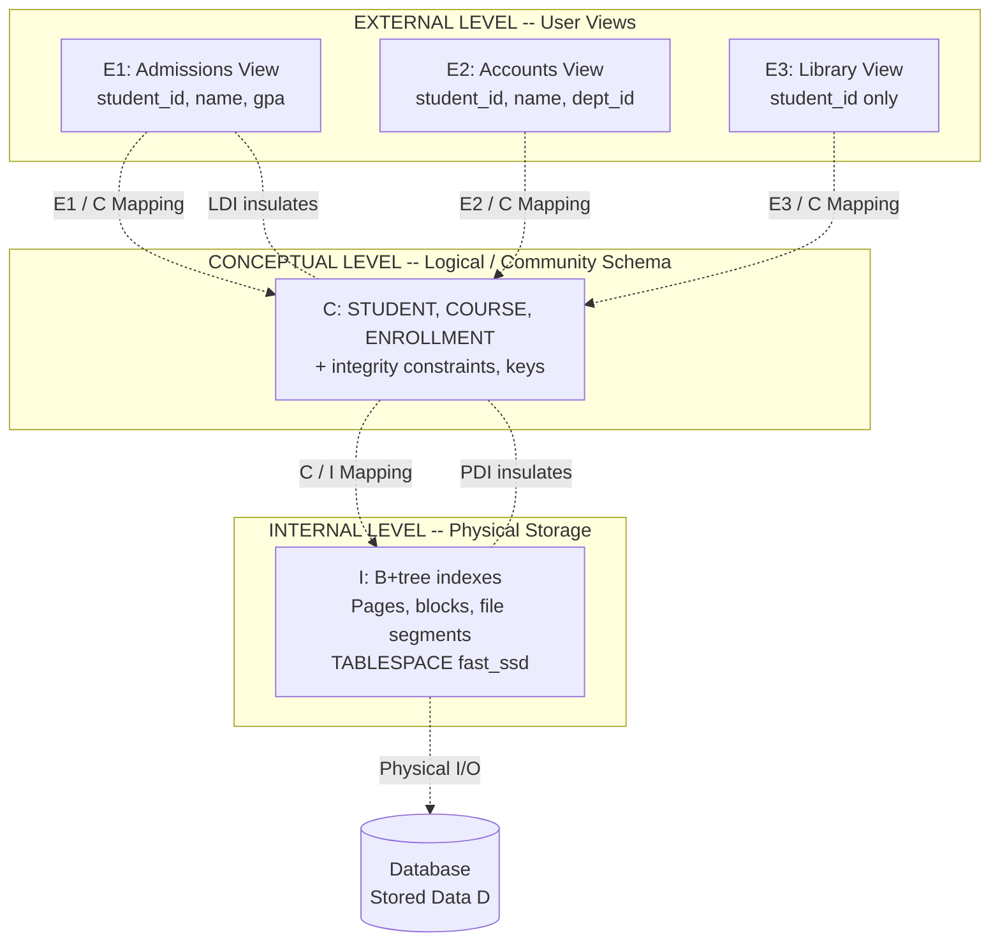
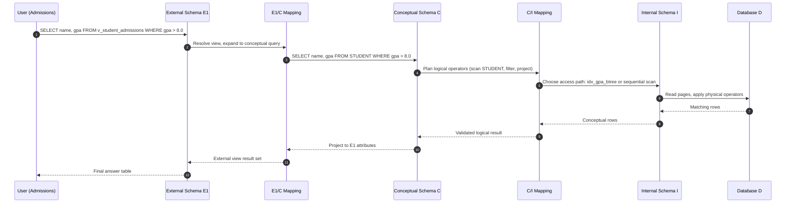
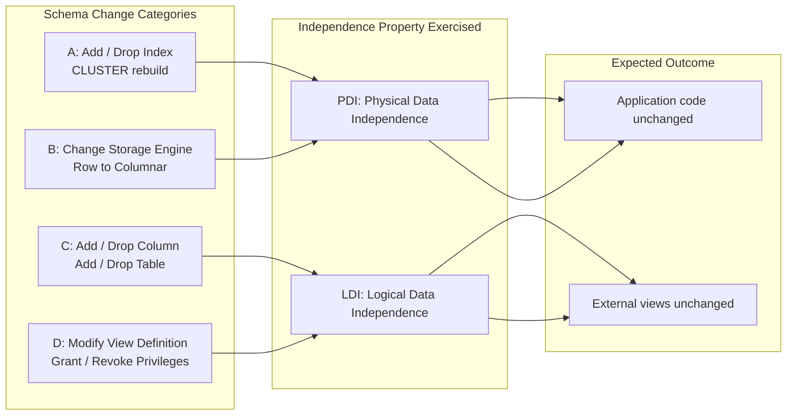

# Three-Schema Architecture and Data Independence

> **APJ ABDUL KALAM TECHNOLOGICAL UNIVERSITY (KTU) | 2024 SCHEME**
> - **Branch:** B.Tech in Computer Science & Engineering (CSE)
> - **Semester:** Semester 4
> - **Course:** PCCST402 - DATABASE MANAGEMENT SYSTEMS
> - **Module:** Module 1: Introduction to Databases
> - **Topic:** Three-Schema Architecture and Data Independence

<!-- SECTION_1_START -->
# 1. Core Technical Definition & Intuitive Overview

## 1.1 Formal Definition

The **Three-Schema Architecture** (also called the **ANSI/SPARC Architecture**) is a classical database design framework proposed by the *American National Standards Institute / Standards Planning And Requirements Committee* (ANSI/SPARC, 1975). It is a logical separation framework used to insulate user applications from the physical database, achieved by dividing the database system into three distinct levels of abstraction:

> [!IMPORTANT]
> **Three-Schema Architecture (ANSI/SPARC):**
> A framework that decouples the external user applications, the logical/community view of data, and the internal/physical storage structure of a database into three independent schema levels, with explicit **mappings** defined between them.

The three levels of data abstraction are:

1. **Internal Level (Physical Schema):** Describes the *physical storage structure* of the database — file organization, indexing methods, access paths, data compression, encryption, and record placement on disk.
2. **Conceptual Level (Logical Schema):** Describes the *structure of the entire database* for a community of users — entity types, data types, relationships, integrity constraints, and operations. It hides physical storage details and presents a unified logical view.
3. **External Level (View Schema / Sub-schemas):** Describes the *portion of the database* relevant to a particular user group. Each external view hides parts of the conceptual schema that are not of interest to that user.

> [!NOTE]
> **Data Independence (DI):** The capacity to change the schema definition at one level of the database system without requiring a change in the schema definition at the next higher level. Two forms exist: **Logical Data Independence (LDI)** and **Physical Data Independence (PDI)**.

## 1.2 Conceptual Analogy — The Multi-Storey Building

Imagine a large corporate building (the **database**):

- The **External Level** is what each tenant sees from their own office window. A tenant on the 10th floor sees only the skyline on the north side; a tenant on the 5th floor sees the park on the south side. Both see the *same building* but have *personalized partial views*.
- The **Conceptual Level** is the building's **architectural blueprint** — the unified plan that says: there are 25 floors, X offices per floor, a central elevator, etc. It does not concern itself with which tenants are in which rooms.
- The **Internal Level** is the **foundation, plumbing, electrical wiring, and structural steel** — the actual physical reality that the blueprint hides from public view.

Now, if the building management **renovates the 12th floor** (analogous to changing the physical storage format), tenants on other floors should not be affected. This is **Physical Data Independence**. Similarly, if a new wing is added to the blueprint (analogous to adding a new entity type in the conceptual schema), individual tenant views should be insulated where possible. This is **Logical Data Independence**.

## 1.3 GeoGebra / Desmos Visualization Note

> [!VISUALIZATION CONTROL]
> **Concept:** Hierarchical layering of database schema levels (often shown as a 3-layer stack or 3-tier pyramid).
> **GeoGebra / Desmos Input Equations:**
> * Layer boundaries (conceptual): $y = 1$, $y = 2$, $y = 3$ with shaded regions between them.
> * Mapping arrows: parametric lines $\big(x(t),\, y(t)\big) = (t,\, 2.5 - 0.05t)$ for downward mappings.
> **Visual Description:** Three horizontal bands stacked vertically — External (top, $y \in [2,\, 3]$), Conceptual (middle, $y \in [1,\, 2]$), Internal (bottom, $y \in [0,\, 1]$) — with diagonal mapping arrows crossing the boundaries, indicating bidirectional transformations between adjacent levels.

<!-- SECTION_1_END -->

<!-- SECTION_2_START -->
# 2. Deep Theoretical Analysis & KTU High-Yield Formula Sheet

## 2.1 Layer-by-Layer Operational Analysis

### 2.1.1 External Level (View / Sub-schema)

- Represents the way individual user applications or user groups perceive the data.
- Multiple external views can coexist over the same conceptual schema.
- Hides sensitive data (e.g., a clerk's view of `EMPLOYEE` may hide the `SALARY` column).
- Defined typically using a subset of the data model (e.g., `CREATE VIEW ... AS SELECT ...` in SQL).

### 2.1.2 Conceptual Level (Logical / Community Schema)

- Represents the *unified, complete* logical structure of the entire database.
- Defines all entity types, attributes, relationships, integrity constraints (keys, referential integrity, check constraints), and the operations allowed.
- Independent of any specific application program or physical storage concern.
- Defined in SQL via `CREATE TABLE`, `ALTER TABLE`, and constraint clauses.

### 2.1.3 Internal Level (Physical / Storage Schema)

- Describes the *physical storage details*: file format, blocking factor, access paths (indexes, hashing), record clustering, free-space management, and data compression.
- Influences performance characteristics dramatically (seek time, scan time, join cost).
- Often transparent to the typical application developer; controlled by the **Database Administrator (DBA)**.

### 2.1.4 Schema Mappings

The DBMS software must maintain **mappings** that translate requests and results between adjacent levels:

$$
\text{External/Conceptual Mapping} \; (E \leftrightarrow C)
$$
$$
\text{Conceptual/Internal Mapping} \; (C \leftrightarrow I)
$$

When a user issues a query, the DBMS:
1. Parses the **External Schema** to validate user permissions and view definitions.
2. Uses the **External/Conceptual Mapping** to translate it into a conceptual-level operation.
3. Uses the **Conceptual/Internal Mapping** to translate it into a physical-level operation.
4. Executes against the stored data and propagates the result back up.

## 2.2 Types of Data Independence

| Property | Logical Data Independence (LDI) | Physical Data Independence (PDI) |
|---|---|---|
| **Definition** | Capacity to change the *conceptual schema* without affecting external schemas or application programs. | Capacity to change the *internal schema* without affecting the conceptual schema. |
| **Affects Which Levels?** | Conceptual $\rightarrow$ External | Internal $\rightarrow$ Conceptual $\rightarrow$ External |
| **Typical Changes** | Add/remove entity types, attributes, relationships; split tables; rename columns. | Change storage devices, indexing strategy, file organization, compression. |
| **Difficulty to Achieve** | Harder (semantic changes ripple to applications). | Easier (most DBMS engines support it natively). |
| **Real-World Trigger** | New business requirement, e.g., adding a `DEPARTMENT` table. | DBA re-organizes a B+-tree index, switches from row to columnar storage, migrates to SSD. |
| **Layer in 3-Schema Model** | Insulates **External** from **Conceptual**. | Insulates **Conceptual** from **Internal**. |

## 2.3 High-Yield Quick-Reference Cheat Sheet

| Symbol / Term | Meaning / Role in 3-Schema |
|---|---|
| $E_i$ | An individual external schema (user view) $i$. |
| $C$ | The single conceptual schema (community logical view). |
| $I$ | The single internal schema (physical storage). |
| $E_i / C$ | External-to-Conceptual mapping. |
| $C / I$ | Conceptual-to-Internal mapping. |
| $D$ | Database (the actual stored data). |
| LDI | Logical Data Independence — change in $C$ transparent to $E_i$. |
| PDI | Physical Data Independence — change in $I$ transparent to $C$ and $E_i$. |

## 2.4 Why This Architecture Matters in Real Engineering

- **Application Portability:** Application code written against a stable external view survives internal performance re-tuning.
- **Security:** Sensitive fields can be excluded from specific external schemas — a fundamental defence-in-depth strategy.
- **Multi-Tenancy:** SaaS systems host multiple tenants on one physical database, each with a tailored external view over a shared conceptual schema.
- **Performance Tuning:** DBAs may aggressively rebuild the internal schema (indexes, partitions, storage engines) without rewriting business logic.
- **Migration:** During RDBMS-to-RDBMS migration (e.g., Oracle to PostgreSQL), the conceptual schema is preserved while internal and (sometimes) external schemas change — a textbook application of data independence.

<!-- SECTION_2_END -->

<!-- SECTION_3_START -->
# 3. Step-by-Step Derivations & Code/Symbolic Implementation

Because this topic is **conceptual / architectural** rather than purely mathematical, the "derivation" here traces the *logical descent of a query* through the three schema levels, the *impact of schema changes* under each form of data independence, and the *symbolic SQL realisation* of each level. Every transition is made explicit.

## 3.1 Analytical Derivation — The Three-Level Schema Stack

We define the three levels formally as functions over a domain of data items $\mathcal{D}$.

**Step 1 — Define the Physical Storage Domain.**
Let the raw on-disk representation of records be a set of bytes partitioned into pages:
$$
P = \{p_1, p_2, \ldots, p_n\}, \quad |P| = n \text{ pages}
$$

**Step 2 — Define the Internal Schema.**
The internal schema $I$ is a mapping from the logical data items to physical pages:
$$
I : \mathcal{L} \rightarrow P
$$
where $\mathcal{L}$ is the set of logical records (rows). $I$ includes ordering, clustering, indexes, and compression schemes.

**Step 3 — Define the Conceptual Schema.**
The conceptual schema $C$ defines the global logical structure over the universe of discourse $\mathcal{U}$:
$$
C : \mathcal{U} \rightarrow \mathcal{L}
$$
where $\mathcal{L}$ is the union of all logical record types (e.g., `STUDENT`, `COURSE`, `ENROLLMENT`).

**Step 4 — Define the External Schema.**
Each external schema $E_i$ is a *projection / restriction* of $C$ visible to user group $i$:
$$
E_i = \pi_i(C) = \{c \in C \; \vert \; c \text{ satisfies the access predicate of user } i\}
$$

**Step 5 — Compose the Query Translation Pipeline.**
A query $q$ written against $E_i$ is translated as:
$$
q_{exec} = I \circ C \circ E_i^{-1}(q)
$$
where $\circ$ denotes function composition and $E_i^{-1}$ resolves the user's view reference back to the conceptual entities.

**Step 6 — Reaffirm Data Independence Algebraically.**

- **Physical Data Independence:** $\forall\, I' \neq I$, $\forall\, C, \forall\, E_i : \; I'(C(E_i^{-1}(q))) = I(C(E_i^{-1}(q)))$.
  That is, the executed query result is invariant under changes to the internal schema $I$.
- **Logical Data Independence:** $\forall\, C' \neq C$ (preserving the relevant fragment), $\forall\, E_i : \; \pi_i(C'(\cdot)) = \pi_i(C(\cdot))$.
  External views that do not depend on the altered fragment continue to function unchanged.

## 3.2 Symbolic SQL Realisation of the Three Levels

The following Python-style pseudocode using SQL DDL demonstrates how the three levels are realised in a relational DBMS:

```sql
-- ============================================================
-- LEVEL 1: INTERNAL SCHEMA (Physical)  -- Often DBA-managed
-- ============================================================
-- Example (PostgreSQL syntax): create a clustered B+-tree index
-- and a table-space on a fast SSD for hot data.
CREATE TABLESPACE fast_ssd LOCATION '/ssd/pgdata';
CREATE TABLE STUDENT (
    student_id   INTEGER      NOT NULL,
    name         VARCHAR(80)  NOT NULL,
    dob          DATE,
    gpa          NUMERIC(4,2)
) TABLESPACE fast_ssd;

-- Physical access path (index):
CREATE INDEX idx_student_id_btree ON STUDENT USING BTREE (student_id);

-- A change HERE = change in I (Internal Schema).
-- Example PDI scenario: replace the BTREE with a HASH index.
-- DROP INDEX idx_student_id_btree;
-- CREATE INDEX idx_student_id_hash ON STUDENT USING HASH (student_id);
-- The above should NOT require any change to the conceptual
-- schema or the application views (PDI).

-- ============================================================
-- LEVEL 2: CONCEPTUAL SCHEMA (Logical / Community View)
-- ============================================================
-- Add a new column "department_id" to STUDENT (LDI scenario).
ALTER TABLE STUDENT
    ADD COLUMN department_id CHAR(4);

ALTER TABLE STUDENT
    ADD CONSTRAINT pk_student PRIMARY KEY (student_id);

ALTER TABLE STUDENT
    ADD CONSTRAINT fk_student_dept
    FOREIGN KEY (department_id) REFERENCES DEPARTMENT(dept_id);

-- The conceptual schema C is what most developers see.
-- It defines entities, attributes, keys, and integrity rules.

-- ============================================================
-- LEVEL 3: EXTERNAL SCHEMA (User Views / Sub-schemas)
-- ============================================================
-- View 1: Admissions office sees names and GPAs only.
CREATE VIEW v_student_admissions AS
    SELECT student_id, name, gpa
    FROM   STUDENT;

-- View 2: Accounts office sees names and department only.
CREATE VIEW v_student_accounts AS
    SELECT student_id, name, department_id
    FROM   STUDENT;

-- View 3: Library system sees only IDs (for linking to loans).
CREATE VIEW v_student_library AS
    SELECT student_id
    FROM   STUDENT;

-- A change to the conceptual schema (e.g., adding department_id)
-- does NOT break the library view v_student_library -- the column
-- is simply not selected. This demonstrates LDI for that view.
```

## 3.3 Python Diagnostic — Verifying Which Level a Schema Change Affects

The following Python code illustrates a *diagnostic helper* a DBA or build pipeline could use to classify a migration script and predict whether it threatens logical or physical data independence.

```python
from __future__ import annotations
import re
from dataclasses import dataclass
from typing import Literal

Level = Literal["EXTERNAL", "CONCEPTUAL", "INTERNAL"]
Threat = Literal["LDI_VIOLATION", "PDI_VIOLATION", "SAFE"]


@dataclass
class MigrationRule:
    pattern: re.Pattern[str]
    level: Level
    independence_threat: Threat
    description: str


# Rule catalogue (simplified but realistic).
RULES: list[MigrationRule] = [
    MigrationRule(
        pattern=re.compile(r"CREATE\s+(UNIQUE\s+)?INDEX", re.IGNORECASE),
        level="INTERNAL",
        independence_threat="SAFE",
        description="Index change is purely a physical access-path modification.",
    ),
    MigrationRule(
        pattern=re.compile(r"ALTER\s+TABLE.*ADD\s+COLUMN", re.IGNORECASE),
        level="CONCEPTUAL",
        independence_threat="LDI_VIOLATION",
        description="Adding a column changes the conceptual schema and may break views.",
    ),
    MigrationRule(
        pattern=re.compile(r"CREATE\s+OR\s+REPLACE\s+VIEW", re.IGNORECASE),
        level="EXTERNAL",
        independence_threat="SAFE",
        description="External view change is local to the user group.",
    ),
    MigrationRule(
        pattern=re.compile(r"CLUSTER\s+", re.IGNORECASE),
        level="INTERNAL",
        independence_threat="SAFE",
        description="CLUSTER reorganises physical storage (PDI-safe).",
    ),
    MigrationRule(
        pattern=re.compile(r"ALTER\s+TABLE.*DROP\s+COLUMN", re.IGNORECASE),
        level="CONCEPTUAL",
        independence_threat="LDI_VIOLATION",
        description="Dropping a column is a strong conceptual change.",
    ),
]


def classify(sql: str) -> tuple[Level, Threat, str]:
    """Classify a SQL migration snippet by the 3-schema level it touches."""
    for rule in RULES:
        if rule.pattern.search(sql):
            return rule.level, rule.independence_threat, rule.description
    return "CONCEPTUAL", "SAFE", "Unrecognised statement -- default to conceptual review."


if __name__ == "__main__":
    samples = [
        "CREATE INDEX idx_student_id_btree ON STUDENT(student_id);",
        "ALTER TABLE STUDENT ADD COLUMN department_id CHAR(4);",
        "CREATE OR REPLACE VIEW v_student_library AS SELECT student_id FROM STUDENT;",
        "CLUSTER STUDENT USING idx_student_id_btree;",
    ]
    for s in samples:
        level, threat, desc = classify(s)
        print(f"[{level:11s}] [{threat:15s}] -> {desc}")
```

**Sample Output Trace:**

```text
[INTERNAL   ] [SAFE           ] -> Index change is purely a physical access-path modification.
[CONCEPTUAL ] [LDI_VIOLATION  ] -> Adding a column changes the conceptual schema and may break views.
[EXTERNAL   ] [SAFE           ] -> External view change is local to the user group.
[INTERNAL   ] [SAFE           ] -> CLUSTER reorganises physical storage (PDI-safe).
```

This trace makes the relationship between *schema artefacts* and *data-independence threats* empirically visible — a frequent KTU exam requirement.

<!-- SECTION_3_END -->

<!-- SECTION_4_START -->
# 4. Structural Diagrams & Schematics

## 4.1 The Three-Schema Architecture — Block Diagram

The following Mermaid block diagram depicts the three schema levels, the database they collectively manage, and the explicit mappings between adjacent layers.



## 4.2 Query Translation Flow — Sequence Topology

The following Mermaid sequence diagram traces a single `SELECT` issued by the Admissions user through the three levels.



## 4.3 Data-Independence Impact Matrix

The following block diagram maps typical schema changes to the data-independence property they exercise.



<!-- SECTION_4_END -->

<!-- SECTION_5_START -->
# 5. KTU 2024 Scheme Examination Question Bank & Topic Recap

> **Mark Distribution Reminder (KTU 2024 Scheme ESE Pattern):**
> - Part A: Short-answer questions, typically **3 marks** each.
> - Part B: Descriptive questions, typically **14 marks** each, with **internal choice** between two alternatives.
> - Every sub-part must be answered with both a *definition* and a *diagram / example* wherever applicable to score full marks.

---

## 5.1 Part A — Short Answer Questions (3 Marks Each)

### Question 1 [KTU University Exam - July 2024 style | CO1 | Remember/Understand]
**Define the Three-Schema Architecture. List its three levels and state the purpose of each.**

**Model Answer (Valuation Key):**
- **[1 Mark]** The Three-Schema Architecture (ANSI/SPARC) is a framework that separates the user applications from the physical database by providing three independent levels of data abstraction.
- **[1 Mark]** **External Level** — describes the portion of the database relevant to a particular user group (user view / sub-schema).
- **[0.5 Mark]** **Conceptual Level** — describes the logical structure of the entire database for a community of users (logical / community schema).
- **[0.5 Mark]** **Internal Level** — describes the physical storage structure of the database (physical schema).

---

### Question 2 [KTU University Exam - Dec 2023 style | CO1 | Understand]
**Differentiate between logical data independence and physical data independence.**

**Model Answer (Valuation Key):**

| Basis of Difference | Logical Data Independence (LDI) | Physical Data Independence (PDI) |
|---|---|---|
| **Level insulated** | Conceptual $\rightarrow$ External | Internal $\rightarrow$ Conceptual (and External) |
| **Type of schema change** | Add / drop entity, attribute, relationship | Reorganise storage, indexes, file format |
| **Difficulty** | Harder to achieve | Easier to achieve |
| **Example** | Adding a new `DEPARTMENT` table | Switching a B+-tree index to a hash index |

**[1 Mark each for 2 valid differences, 1 Mark for a clear example.]**

---

## 5.2 Part B — Descriptive Questions (14 Marks Each, Internal Choice)

> For each question, a full **14-mark** answer must include: a labelled diagram (**2–3 marks**), a clear definition (**2 marks**), step-wise explanation (**6–7 marks**), and a relevant example or application (**2 marks**).

### Question A [CO1, CO2 | Understand + Apply | 14 Marks]

**(a) Explain the three levels of data abstraction in the ANSI/SPARC architecture with a neat diagram.** **[7 Marks]**

**Model Answer (Valuation Key):**

1. **Introduction — [1 Mark]**
   The ANSI/SPARC architecture (1975) divides a DBMS into three levels of abstraction, providing independence between applications and the physical database.

2. **External Level — [1.5 Marks]**
   Also called the *view* or *sub-schema* level. Each user group sees only the portion of the database relevant to it. Example: an *Accounts* user may see `STUDENT(student_id, name, dept_id)` while a *Library* user sees only `STUDENT(student_id)`.

3. **Conceptual Level — [1.5 Marks]**
   Represents the unified logical view of the entire database — entity types (e.g., `STUDENT`, `COURSE`), relationships, integrity constraints, and security policies. Independent of physical storage and any specific application.

4. **Internal Level — [1.5 Marks]**
   Describes physical storage: file organisation, indexing, record placement, compression, encryption, block size, etc. Managed by the DBA.

5. **Diagram — [1.5 Marks]**
   *(Student must draw a three-tier stacked diagram showing External on top, Conceptual in the middle, Internal at the bottom, with bidirectional mapping arrows `E/C` and `C/I`, and the actual Database at the base.)*

**(b) Discuss the concept of data independence. Explain its two types with suitable examples.** **[7 Marks]**

**Model Answer (Valuation Key):**

1. **Definition — [1 Mark]**
   Data independence is the capacity to change the schema at one level of a database system without having to change the schema at the next higher level.

2. **Logical Data Independence (LDI) — [2.5 Marks]**
   - Insulates **external schemas** from changes in the **conceptual schema**.
   - *Example:* Adding a new column `department_id` to the `STUDENT` table. The `v_student_library` view (which selects only `student_id`) continues to function unchanged.
   - *Achieving it is hard* because semantic changes often ripple up to applications that use the altered entity.

3. **Physical Data Independence (PDI) — [2.5 Marks]**
   - Insulates the **conceptual schema** (and hence external schemas) from changes in the **internal schema**.
   - *Example:* Replacing a B+-tree index on `student_id` with a hash index, or migrating the table from HDD to SSD. Application code and view definitions are untouched.
   - *Achieving it is easier* — most commercial RDBMS engines provide it.

4. **Significance — [1 Mark]**
   Enables application portability, performance tuning without code changes, and easier DBMS migration.

---

### Question B [CO1, CO2 | Understand + Apply | 14 Marks]

**(a) With a neat diagram, explain the Three-Schema Architecture. State the importance of mappings between schema levels.** **[7 Marks]**

**Model Answer (Valuation Key):**

1. **Definition of Architecture — [1 Mark]**
   The Three-Schema Architecture is the ANSI/SPARC framework that separates the database into External, Conceptual, and Internal levels, with explicit mappings maintained by the DBMS software.

2. **Diagram — [2 Marks]**
   *(A correct three-tier block diagram showing the three levels and the two mapping arrows is required for full credit.)*

3. **Explanation of Each Level — [2 Marks]**
   External (user views), Conceptual (logical/community schema), Internal (physical storage). One-line description of each expected.

4. **Role of Mappings — [2 Marks]**
   - **External/Conceptual Mapping (E/C):** Translates user requests from a view in terms of the conceptual entities and relationships.
   - **Conceptual/Internal Mapping (C/I):** Translates conceptual operations into physical access paths, file operations, and I/O calls.
   - These mappings are *what enable data independence* — when the lower schema changes, only the relevant mapping is updated; higher-level schemas and applications remain unaffected.

**(b) A university database has student records. The Registrar's office views it differently from the Accounts office. How does the Three-Schema Architecture support this? Discuss with examples of logical and physical data independence.** **[7 Marks]**

**Model Answer (Valuation Key):**

1. **Scenario Mapping to External Level — [1.5 Marks]**
   The Registrar and the Accounts office are two distinct *user groups*, each with its own **external schema (view)**. E.g.:
   - `v_registrar` exposes `student_id, name, dob, programme, year_of_study`.
   - `v_accounts` exposes `student_id, name, fee_balance, scholarship_status`.

2. **Conceptual Schema Support — [1.5 Marks]**
   Both views are projections over the **same conceptual schema** `STUDENT(student_id, name, dob, programme, year_of_study, fee_balance, scholarship_status)`. Thus a single logical schema serves multiple user communities — a core purpose of the architecture.

3. **Logical Data Independence Example — [2 Marks]**
   Suppose the university adds a new column `hostel_room_no` to the `STUDENT` table. The Registrar view may or may not include it; the Accounts view continues to work as before because it never selected that column. *LDI is demonstrated* — the conceptual schema changed but the Accounts application's view and code remained intact.

4. **Physical Data Independence Example — [2 Marks]**
   The DBA decides to partition the `STUDENT` table horizontally by `programme` and move the `ENGINEERING` partition to a faster SSD tablespace. The conceptual schema, the two views, and all application code continue to function without modification. *PDI is demonstrated* — the physical storage changed but no higher-level artefact needed updating.

---

## 5.3 KTU Examiner's Valuation Warning / Pitfall Callout

> [!WARNING]
> **Common Mark-Deduction Pitfalls in this Topic**
> 1. **Forgetting the diagram.** KTU examiners routinely allocate **2–3 of the 14 marks** to a neat, labelled three-tier diagram. A text-only answer loses those marks outright.
> 2. **Conflating "logical schema" with "conceptual schema".** In the KTU syllabus (and the Elmasri/Navathe textbook used by most Kerala colleges), the **Conceptual Schema = Logical Schema** at the *community* level. Do not invent a separate "logical schema" tier.
> 3. **Reversing LDI and PDI.** Remember: **LDI = change in Conceptual, insulation of External.** **PDI = change in Internal, insulation of Conceptual (and External).** Mixing these up costs the comparison marks.
> 4. **Omitting mappings.** A description of the three levels *without* mentioning the E/C and C/I mappings is incomplete. Mappings are what *realise* data independence.
> 5. **Writing SQL syntax errors.** When demonstrating external views, use the exact syntax `CREATE VIEW v_name AS SELECT ...`. Use proper aliases for renamed columns.
> 6. **Treating data independence as automatic.** State explicitly *which* DBMS feature (catalog, data dictionary, optimiser) supports it. Vague phrasing loses marks.

---

## 5.4 Topic Recap & Important Things to Remember

- **Three-Schema Architecture** = ANSI/SPARC framework with **External**, **Conceptual**, and **Internal** levels.
- **External Level** = user views / sub-schemas; multiple can coexist.
- **Conceptual Level** = single unified logical schema of the entire database; community view.
- **Internal Level** = physical storage schema; managed by the DBA.
- **Two Mappings** must exist: $E/C$ and $C/I$ — they are the *mechanism* by which the architecture is realised.
- **Logical Data Independence (LDI):** change in **Conceptual** schema does not affect **External** schemas. *Harder* to achieve. Example: add a new attribute.
- **Physical Data Independence (PDI):** change in **Internal** schema does not affect **Conceptual** or **External** schemas. *Easier* to achieve. Example: rebuild an index, migrate storage.
- **Why it matters:** application portability, security via view restriction, painless performance tuning, simpler DBMS migration.
- **SQL Realisation:** External $\rightarrow$ `CREATE VIEW`; Conceptual $\rightarrow$ `CREATE TABLE`, `CONSTRAINT`; Internal $\rightarrow$ `TABLESPACE`, `INDEX`, `CLUSTER`.
- **Frequent KTU Exam Hooks:** diagram of the three levels, differences between LDI and PDI, real-world scenarios involving schema changes, role of the DBA.
- **Memory Mnemonic:** **"ELC-I"** — **E**xternal on top, **L**ogical (Conceptual) in middle, **C** — wait, simpler: top-to-bottom = **E, C, I** (External, Conceptual, Internal).
- **Pitfall to avoid:** Do **not** equate "External" with "Application" — applications *use* external schemas, but the external schema itself is the *definition* of what the application can see.
<!-- SECTION_5_END -->
