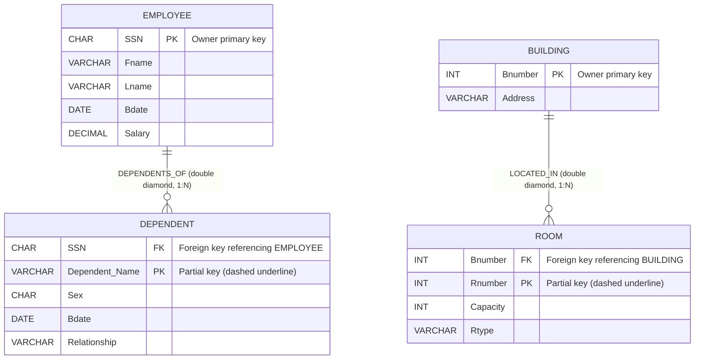
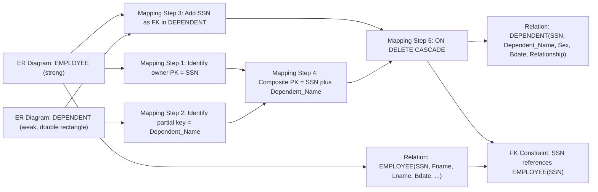
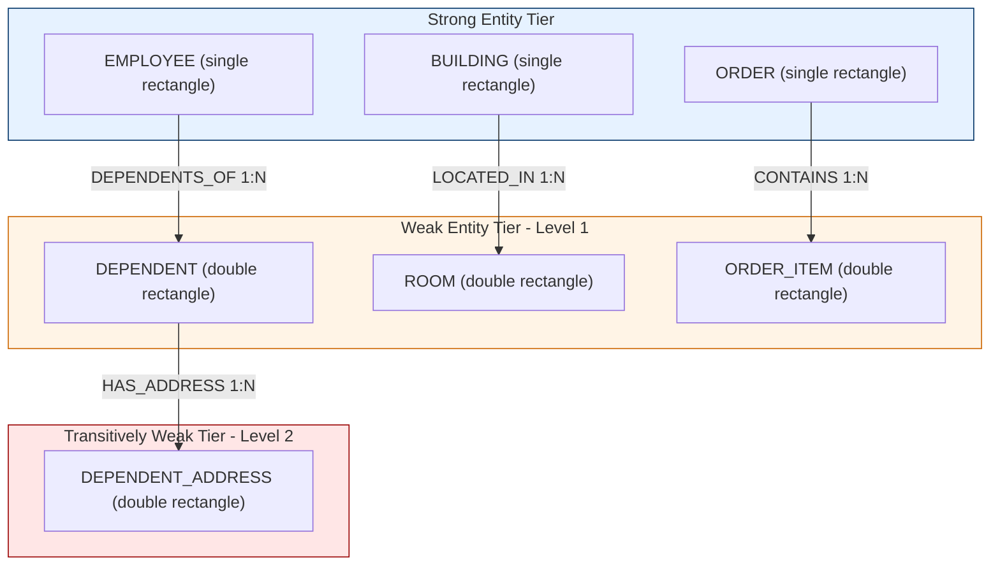
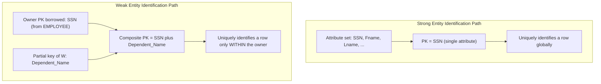

# Weak Entity Types

> **APJ ABDUL KALAM TECHNOLOGICAL UNIVERSITY (KTU) | 2024 SCHEME**
> - **Branch:** B.Tech in Computer Science & Engineering (CSE)
> - **Semester:** Semester 4
> - **Course:** PCCST402 - DATABASE MANAGEMENT SYSTEMS
> - **Module:** Module 1: Introduction to Databases
> - **Topic:** Weak Entity Types

<!-- SECTION_1_START -->
## 1. Core Technical Definition and Intuitive Overview

### 1.1 Formal Definition (KTU 2024 Syllabus Terminology)

> [!IMPORTANT]
> **Definition (Weak Entity Type).** A *weak entity type* is an entity type whose instances **cannot be uniquely identified by the values of their own attributes alone**, and therefore depend on another (owner / identifying) entity type for their existence and identification. Formally, a weak entity type $W$ has **no sufficient primary key of its own**; it has only a *partial key* (also called *discriminator*) and is mapped to the relational schema by combining its partial key with the primary key of its owner entity $E$.

A weak entity type is graphically represented using a **double-lined rectangle**, and the *identifying relationship* that links it to its owner is drawn with a **double-lined diamond**. The *partial key* is shown with a **dashed underline**.

### 1.2 Conceptual Analogy (Intuitive Overview)

> [!NOTE]
> **Real-World Analogy — Apartments in a Building.**
> Imagine the entity set **APARTMENT** within a city. Apartment number "3B" by itself is meaningless — there are thousands of "3B" apartments in the world. To uniquely identify one, we need **both** the building's registration number **and** the apartment number. Here:
>
> - **BUILDING** is a *strong (owner) entity* — identified by its own registration number and address.
> - **APARTMENT** is a *weak entity* — depends on BUILDING.
> - **Partial key** of APARTMENT = `apartment_number` (3B, 4A, …).
> - **Primary key** of APARTMENT relation = `(building_reg_no, apartment_number)`.
> - **Identifying relationship** = `LOCATED_IN` (drawn with double diamond).
> - **Existence dependency** = total participation (double line); an apartment cannot logically exist without its building.

Other classic analogues used in textbooks and KTU questions:
- **Page** in a **Book** (page 5 of *Harry Potter* $\ne$ page 5 of *Lord of the Rings*).
- **Dependent** of an **Employee** (in the COMPANY database).
- **Seat** in a **Stadium** / **Room** in a **Hotel**.
- **Item line** in a **Customer Order**.

### 1.3 Key Symbolic and Graphical Vocabulary

> [!IMPORTANT]
> **Standard ER Diagram Notation for Weak Entities (must memorize for KTU exams):**
>
> | Construct | Graphical Symbol |
> | :--- | :--- |
> | Weak Entity Type | Double-lined rectangle |
> | Identifying Relationship | Double-lined diamond |
> | Partial Key (Discriminator) | Underlined with a **dashed** line |
> | Total Participation | Double line connecting entity to relationship |
> | Owner (Identifying) Entity Type | Single-lined rectangle (regular strong entity) |

### 1.4 Three Necessary Conditions for a Weak Entity

> [!NOTE]
> An entity type qualifies as weak **only if all three** of the following are true:
>
> 1. **No sufficient primary key:** Its own attribute set does not yield a unique identifier.
> 2. **Existence dependency:** It cannot logically exist without the owner entity.
> 3. **Total participation constraint:** Every instance of $W$ must participate in the identifying relationship $R$ (i.e., $\text{card}(E) \to \text{card}(W)$ is *always* $1 \to N$ — a $1{:}N$ relationship from owner to weak entity).

> [!VISUALIZATION CONTROL]
> **Concept:** Set-Theoretic / Cardinality view of weak entity identification.
> **GeoGebra / Desmos Input Equations:** *Not applicable* — this topic is a pure conceptual ER-modelling construct; the relevant visual is the ER diagram in Section 4.
> **Visual Description:** Imagine two nested sets: an outer set $E$ (owner, e.g., *Employees*) and, for **every** element $e_i \in E$, a disjoint sub-set $W_i$ of weak instances (e.g., *Dependents of $e_i$*). The partial key uniquely distinguishes members inside a single $W_i$, but the full identification requires $e_i$ as well.
<!-- SECTION_1_END -->

<!-- SECTION_2_START -->
## 2. Deep Theoretical Analysis and KTU High-Yield Formula Sheet

### 2.1 Structural Components of a Weak Entity Construct

A complete weak-entity construct in an ER diagram consists of **four** tightly coupled parts. Mastering this decomposition is a high-frequency KTU question pattern.

- **Owner (Identifying) Entity Type** — a *strong* entity $E$ on which $W$ depends.
- **Weak Entity Type** $W$ — has only a *partial key*.
- **Identifying Relationship** $R$ — links $W$ to $E$ with cardinality $1{:}N$ from $E$ to $W$ and **total participation** of $W$.
- **Partial Key (Discriminator)** — a set of attributes of $W$ that is **unique within the local group** of $W$ instances belonging to one $E$ instance, but **not globally unique**.

> [!NOTE]
> **Why partial keys fail to be primary keys:**
> Consider $\text{PK}(W) = \text{partial\_key}(W)$ alone. Two different employees $e_1$ and $e_2$ can each have a dependent named *“Anu”*. The attribute *Name* alone is not a global identifier. The composite $\text{FK}(E\text{'s PK}) \; \cup \; \text{partial\_key}(W)$ removes this collision.

### 2.2 Properties and Behavioural Rules

- **Existence Dependency:** Deleting the owner entity must logically delete all its weak entities. The DBMS enforces this through `ON DELETE CASCADE` foreign-key actions when mapped to relations.
- **Total Participation:** A weak entity $W$ **must** participate in the identifying relationship $R$. There is no weak instance that “floats” without an owner. In ER notation this is a **double line** between $W$ and $R$.
- **Cardinality:** The identifying relationship is *always* $1{:}N$ from owner to weak entity. It is *never* $M{:}N$, because a weak entity instance belongs to exactly one owner.
- **Recursive Weakness:** A weak entity $W_1$ can itself be the owner of another weak entity $W_2$ (transitively weak), but each level must respect the $1{:}N$ / total-participation rule.
- **Strong vs Weak Decision Heuristic (exam-friendly):** Ask *"If we wipe out the candidate parent, does the child entity lose all meaning?"* If **yes** $\Rightarrow$ weak. If **no** $\Rightarrow$ strong.

### 2.3 KTU High-Yield Formula / Mapping Sheet

> [!IMPORTANT]
> **Mapping Weak Entities to the Relational Model — Canonical Rules (Step 9 of the original 7-step ER-to-Relational algorithm, Elmasri & Navathe framework used in KTU textbooks).**

Let the owner entity be $E$ with primary key $\text{PK}(E)$ and the weak entity be $W$ with partial key $\text{PPK}(W)$.

**Rule 1 — Relation for the weak entity $W$:**

$$
R_{W} \;=\; \text{Simple\_Attributes}(W) \;\cup\; \text{Composite\_Attributes}_{\text{simple}}(W) \;\cup\; \text{Multivalued\_Attributes}_{\text{own\_relation}}(W) \;\cup\; \{\,\text{PK}(E)\,\}
$$

**Rule 2 — Primary key of $R_{W}$:**

$$
\text{PK}(R_{W}) \;=\; \text{PK}(E) \;\cup\; \text{PPK}(W)
$$

**Rule 3 — Foreign key declaration in $R_{W}$:**

$$
\text{FK}(R_{W}) \;=\; \text{PK}(E), \quad \text{REFERENCES} \; E(\text{PK}(E)), \quad \text{ON DELETE CASCADE}
$$

**Rule 4 — Identifying relationship:** No separate relation is created; it is **absorbed** into $R_{W}$ via the foreign key. The double-diamond $R$ is conceptually retained only in the ER model.

**Rule 5 — Multivalued attributes of $W$:** Each multi-valued attribute $M$ becomes a **separate relation** $R_{M}$ with $\text{PK}(R_{M}) = \text{PK}(R_{W}) \cup \{M\}$.

### 2.4 Comparison Table: Strong vs Weak Entity (high-yield for 7-mark questions)

> The vertical pipe character `|` is intentionally replaced by `\mid` in math mode to preserve the Markdown table.

| Property | Strong Entity $E$ | Weak Entity $W$ |
| :--- | :--- | :--- |
| Graphical notation | Single rectangle | **Double** rectangle |
| Own primary key | Yes — fully self-sufficient | **No** — needs owner's PK |
| Partial key | Not applicable | Yes — dashed underline |
| Existence dependency | Independent | **Dependent** on $E$ |
| Participation in identifying rel. | Partial or total | **Always total** |
| Identifying relationship | Not required | Required (double diamond) |
| Cardinality of identifying rel. | $1{:}1$, $1{:}N$, $M{:}N$ | **Always $1{:}N$** from $E$ to $W$ |
| Composite key from mapping | Just own PK | $\text{PK}(E) \cup \text{PPK}(W)$ |
| ON DELETE behaviour | Independent | **CASCADE** mandatory |
| Example (COMPANY DB) | EMPLOYEE, DEPARTMENT | DEPENDENT, ROOM (of BUILDING) |

### 2.5 Real-World Engineering Utility

- **Banking Systems** — *Transaction_Item* is weak w.r.t. *Transaction*.
- **E-Commerce** — *OrderLine* is weak w.r.t. *OrderHeader*; *Shipment_Tracking_Event* is weak w.r.t. *Shipment*.
- **Hospital Management** — *Prescription* is weak w.r.t. *Patient_Visit*; *Bed_Assignment* is weak w.r.t. *Ward*.
- **Academic ERPs** (used widely in Kerala universities) — *Course_Offering_Section* is weak w.r.t. *Course_Offering*, which itself is weak w.r.t. *Semester*.
- **Cloud / SaaS** — *Tenant_Resource* is weak w.r.t. *Tenant*; *Audit_Log_Entry* is weak w.r.t. *Session*.

The weak-entity construct thus gives production engineers a **declarative, schema-enforced way to model ownership hierarchies and lifecycle dependencies** directly in the data definition language.
<!-- SECTION_2_END -->

<!-- SECTION_3_START -->
## 3. Step-by-Step Derivations and Worked Mapping Examples

> The following derivations are written out in full, with no skipped steps, exactly as a KTU board examiner would expect in a 14-mark answer.

### 3.1 Mapping Algorithm Walk-Through (DEPENDENT in the COMPANY Database)

> [!NOTE]
> **Reference Scenario (from the canonical COMPANY database of Elmasri \& Navathe, adopted in KTU 2024 syllabus):**
> - `EMPLOYEE` is a strong entity with $\text{PK} = \text{SSN}$.
> - `DEPENDENT` is a weak entity, identified by the partial key $\text{Dependent\_Name}$.
> - `DEPENDENTS_OF` is the identifying relationship, with cardinality $1{:}N$ from EMPLOYEE to DEPENDENT and total participation of DEPENDENT.

#### Step 1 — Identify the owner entity $E$ and its primary key

$$
E \;=\; \text{EMPLOYEE}, \quad \text{PK}(E) \;=\; \text{SSN}
$$

#### Step 2 — Identify the weak entity $W$ and its partial key

$$
W \;=\; \text{DEPENDENT}, \quad \text{PPK}(W) \;=\; \text{Dependent\_Name}
$$

#### Step 3 — Enumerate the simple (atomic) attributes of $W$

The attribute set of DEPENDENT is:

$$
\text{Attr}(W) \;=\; \{\,\text{Dependent\_Name},\; \text{Sex},\; \text{Bdate},\; \text{Relationship}\,\}
$$

#### Step 4 — Create the relation $R_{W}$ by union with the owner's primary key

$$
R_{\text{DEPENDENT}} \;=\; \text{Attr}(W) \;\cup\; \{\,\text{SSN}\,\}
$$

Therefore the relation schema is:

$$
\text{DEPENDENT}(\,\underline{\text{SSN}},\; \underline{\text{Dependent\_Name}},\; \text{Sex},\; \text{Bdate},\; \text{Relationship}\,)
$$

#### Step 5 — Declare the composite primary key

$$
\text{PK}(\text{DEPENDENT}) \;=\; \text{SSN} \;\cup\; \text{Dependent\_Name}
$$

The double underline above the SSN and Dependent_Name attributes represents this composite primary key. This is the **derived** identifier; SSN alone is not enough (it would give the employee, not the dependent) and Dependent_Name alone is not enough (two employees may both have a dependent named "Anu").

#### Step 6 — Declare the foreign-key constraint

$$
\text{SSN} \;\in\; \text{DEPENDENT},\quad \text{FK} \to \text{EMPLOYEE}(\text{SSN}),\quad \text{ON DELETE CASCADE}
$$

#### Step 7 — Handle the identifying relationship

The double-diamond relationship `DEPENDENTS_OF` is **not** mapped to a separate relation. It is fully absorbed into `DEPENDENT` via the foreign key SSN. The $1{:}N$ cardinality guarantees that for every dependent, exactly one employee (the owner) is referenced.

#### Step 8 — Sample populated tuples

$$
\begin{aligned}
\text{DEPENDENT table:} \quad & \\
& (\,\text{SSN}=123456789,\; \text{Dependent\_Name}=\text{"Anu"},\; \text{Sex}=\text{"F"},\; \text{Bdate}=1985-04-12,\; \text{Relationsion}=\text{"Daughter"}\,) \\
& (\,\text{SSN}=123456789,\; \text{Dependent\_Name}=\text{"Bob"},\; \text{Sex}=\text{"M"},\; \text{Bdate}=1990-07-09,\; \text{Relationship}=\text{"Son"}\,) \\
& (\,\text{SSN}=987654321,\; \text{Dependent\_Name}=\text{"Anu"},\; \text{Sex}=\text{"F"},\; \text{Bdate}=1982-11-30,\; \text{Relationship}=\text{"Spouse"}\,)
\end{aligned}
$$

Note that *“Anu”* appears twice — once under SSN 123456789 and once under SSN 987654321. This **validates** the design choice: only the composite key can disambiguate them.

#### Step 9 — ER-to-Relational SQL (DDL) Implementation

```sql
-- Step 9a: Owner (strong) entity — must be created first
CREATE TABLE EMPLOYEE (
    SSN          CHAR(9)     NOT NULL,
    Fname        VARCHAR(20) NOT NULL,
    Lname        VARCHAR(20) NOT NULL,
    Bdate        DATE,
    Address      VARCHAR(60),
    Salary       DECIMAL(10,2),
    Super_SSN    CHAR(9),
    Dno          INT,
    PRIMARY KEY (SSN)
);

-- Step 9b: Weak entity — foreign key + composite primary key
CREATE TABLE DEPENDENT (
    SSN              CHAR(9)        NOT NULL,
    Dependent_Name   VARCHAR(20)    NOT NULL,
    Sex              CHAR(1),
    Bdate            DATE,
    Relationship     VARCHAR(15),
    PRIMARY KEY (SSN, Dependent_Name),
    FOREIGN KEY (SSN) REFERENCES EMPLOYEE(SSN)
        ON DELETE CASCADE
        ON UPDATE CASCADE
);
```

> [!IMPORTANT]
> **Cascade specification is not optional in KTU answers.** If you omit `ON DELETE CASCADE`, the existence-dependency semantics of the weak entity are violated at the DBMS level. Examiners explicitly deduct 1 mark for missing the cascade clause.

### 3.2 Second Worked Example — ROOM in BUILDING

#### ER Components

$$
E \;=\; \text{BUILDING},\quad \text{PK}(E)=\text{Bnumber},\quad W=\text{ROOM},\quad \text{PPK}(W)=\text{Rnumber}
$$

#### Identifying Relationship

$$
R \;=\; \text{LOCATED\_IN} \quad (\text{double diamond}),\quad \text{Card}(E \to W) \;=\; 1{:}N
$$

#### Derived Relation Schema

$$
\text{ROOM}(\,\underline{\text{Bnumber}},\; \underline{\text{Rnumber}},\; \text{Capacity},\; \text{Rtype}\,)
$$

with:

$$
\text{PK}(\text{ROOM}) \;=\; \text{Bnumber} \cup \text{Rnumber},\quad \text{FK}:\text{Bnumber} \to \text{BUILDING}(\text{Bnumber}),\quad \text{ON DELETE CASCADE}
$$

#### Step-by-Step Reasoning (valuation-style)

1. Recognize BUILDING as the owner because rooms have no meaning without a building. **[1 mark]**
2. Identify `Rnumber` as the partial key (room number alone is not globally unique). **[1 mark]**
3. Apply Rule 1: include all simple attributes of ROOM. **[1 mark]**
4. Apply Rule 2: include BUILDING's primary key `Bnumber` as a foreign key. **[1 mark]**
5. Apply Rule 3: declare composite primary key `(Bnumber, Rnumber)`. **[2 marks]**
6. Specify `ON DELETE CASCADE` to preserve existence dependency. **[1 mark]**
7. Confirm that no separate relation is needed for the identifying relationship. **[1 mark]**

Total: **7 marks** (as expected for a Part B sub-question).

### 3.3 Counter-Example — Why ROOM is **not** a strong entity

> [!NOTE]
> A common KTU pitfall: students declare ROOM as strong with `Rnumber` as PK. This fails because `Rnumber = "101"` may exist in Building 1, Building 2, and Building 3 simultaneously. The DBMS would reject the insertion of the second "101". Therefore ROOM is **not** uniquely identifiable on its own — proving it is weak.
<!-- SECTION_3_END -->

<!-- SECTION_4_START -->
## 4. Structural Diagrams and Schematics

### 4.1 ER Diagram (Mermaid) of the Weak Entity Construct



**Reading the diagram:**

- A **single bar** `||` on EMPLOYEE side means *exactly one* employee.
- A **circle and crow's foot** `o{` on DEPENDENT side means *zero-or-many* dependents.
- The label text is the relationship name; the cardinality is implicitly $1{:}N$.
- The double rectangle / double diamond in textbook notation is **conceptually** indicated by the FK + PK annotation. Mermaid `erDiagram` syntax does not natively render double-lined shapes; examiners will accept a clearly-labelled single rectangle with the FK arrow drawn to the owner.

### 4.2 Block-Level Mapping Topology (How the ER Weak Entity Becomes Relations)



### 4.3 Hierarchical Ownership Diagram (Tree of Existence Dependency)



> [!NOTE]
> **Interpretation:**
> - Blue tier = strong entities (independent existence).
> - Orange tier = first-level weak entities (one-step dependency).
> - Red tier = transitively weak entities (two-step dependency, *still allowed* in advanced ER modelling but KTU exams mostly restrict to one level).

### 4.4 Comparison Block Diagram: Strong vs Weak Identification Path


<!-- SECTION_4_END -->

<!-- SECTION_5_START -->
## 5. KTU 2024 Scheme Examination Question Bank and Topic Recap

### 5.1 Part A — Short-Answer Questions (3 Marks Each)

> **Q1.** **[KTU University Exam — July 2024 pattern]** Define the term *weak entity type*. List the three necessary conditions for an entity type to be classified as weak. *(3 marks)* — *CO1, Remember*

**Model Answer (valuation key):**

> A *weak entity type* is one whose instances cannot be uniquely identified by their own attributes and therefore depend on a strong (owner) entity for their identification. The three necessary conditions are: **(i)** it has no sufficient primary key of its own, **(ii)** it has existence dependency on the owner entity, and **(iii)** it has total participation in the identifying relationship. **[3 marks: 1 for definition, 2 for the three conditions]**

---

> **Q2.** **[KTU University Exam — Dec 2023 pattern]** What is a *partial key* (discriminator)? How is it graphically represented in an ER diagram? Give one example. *(3 marks)* — *CO1, Remember*

**Model Answer:**

> A partial key is a set of attributes of a weak entity that uniquely identifies a weak instance *within* the group of weak instances belonging to a single owner entity, but is not globally unique. It is graphically represented by a **dashed underline** beneath the attribute name. Example: `Dependent_Name` of the `DEPENDENT` weak entity in the COMPANY database — unique within a single employee's dependents, but two different employees can both have a dependent named *“Anu”*. **[3 marks: 1 for definition, 1 for notation, 1 for example]**

### 5.2 Part B — Module Internal Choice (14 Marks Each)

> **Note (KTU 2024 ESE pattern):** Answer **either** Question A **or** Question B in full. Each carries **14 marks** split as `(a) 7 marks + (b) 7 marks`.

---

#### Question A — *Theory and Mapping of Weak Entities*

> **(a) [7 marks]** **[KTU University Exam — Dec 2023, Model Question]** Explain the concept of a weak entity type with a suitable diagram. Discuss the role of the *identifying relationship*, the *partial key*, and the *total participation constraint*. *(CO1, CO2, Understand)*

**Model Answer — Step-by-Step Valuation Key:**

1. **Definition of weak entity** with example (DEPENDENT of EMPLOYEE). **[2 marks]**
2. **Identifying relationship** — its definition, double-diamond notation, and cardinality $1{:}N$ from owner to weak. **[2 marks]**
3. **Partial key** — definition, dashed-underline notation, and example. **[1 mark]**
4. **Total participation** — double-line notation, existence-dependency semantics, ON DELETE CASCADE implication. **[2 marks]**

> **(b) [7 marks]** Map the `DEPENDENT` weak entity (along with the `DEPENDENTS_OF` identifying relationship) of the COMPANY database to a relational schema. Show the full SQL DDL with the primary-key, foreign-key, and cascade specifications. *(CO2, Apply)*

**Model Answer — Step-by-Step Valuation Key:**

1. **State the owner entity and its PK**: EMPLOYEE, $\text{PK} = \text{SSN}$. **[1 mark]**
2. **State the weak entity and its partial key**: DEPENDENT, $\text{PPK} = \text{Dependent\_Name}$. **[1 mark]**
3. **Write the relation schema** with all attributes including FK: `DEPENDENT(SSN, Dependent_Name, Sex, Bdate, Relationship)`. **[2 marks]**
4. **Declare the composite primary key**: `(SSN, Dependent_Name)`. **[1 mark]**
5. **Write the SQL DDL** with `FOREIGN KEY (SSN) REFERENCES EMPLOYEE(SSN) ON DELETE CASCADE`. **[2 marks]**

**Reference SQL:**

```sql
CREATE TABLE DEPENDENT (
    SSN              CHAR(9)     NOT NULL,
    Dependent_Name   VARCHAR(20) NOT NULL,
    Sex              CHAR(1),
    Bdate            DATE,
    Relationship     VARCHAR(15),
    PRIMARY KEY (SSN, Dependent_Name),
    FOREIGN KEY (SSN) REFERENCES EMPLOYEE(SSN)
        ON DELETE CASCADE
        ON UPDATE CASCADE
);
```

---

#### Question B — *Comparative Analysis and Design*

> **(a) [7 marks]** **[KTU University Exam — July 2024, Model Question]** Compare and contrast *strong* and *weak* entity types in the ER model across at least six properties. Explain *existence dependency* with a real-world example. *(CO1, Understand)*

**Model Answer — Step-by-Step Valuation Key:**

1. Tabular comparison across six properties: notation, primary key, partial key, existence dependency, participation, identifying relationship. **[4 marks]**
2. Definition of *existence dependency* with a real-world example (e.g., a `Dependent` cannot exist without an `Employee`; an `Apartment` cannot exist without a `Building`). **[2 marks]**
3. Conclusion summarizing when to model an entity as weak. **[1 mark]**

> **(b) [7 marks]** Design an ER diagram for a UNIVERSITY database in which `DEPARTMENT` is a strong entity and `COURSE_OFFERING` is a weak entity. State all attributes, the identifying relationship, the partial key, and the resulting relational schema. *(CO2, Apply)*

**Model Answer — Step-by-Step Valuation Key:**

1. Identify `DEPARTMENT` (strong) with PK `Dept_Id`. **[1 mark]**
2. Identify `COURSE_OFFERING` (weak) with partial key `Offering_Code` (e.g., *"CSE401-2024S1"*). **[1 mark]**
3. Identify the identifying relationship `OFFERED_BY` with cardinality $1{:}N$ from DEPARTMENT to COURSE_OFFERING and total participation of COURSE_OFFERING. **[1 mark]**
4. List other attributes: `Credits`, `Semester`, `Year`, `Max_Enrolment`, etc. **[1 mark]**
5. Draw (or describe) the ER diagram with double rectangle on COURSE_OFFERING and double diamond on OFFERED_BY. **[1 mark]**
6. Write the mapped relational schema with composite PK and ON DELETE CASCADE. **[2 marks]**

**Mapped Relation Schema:**

$$
\text{COURSE\_OFFERING}(\,\underline{\text{Dept\_Id}},\; \underline{\text{Offering\_Code}},\; \text{Credits},\; \text{Semester},\; \text{Year},\; \text{Max\_Enrolment}\,)
$$

with:

$$
\text{FK}:\text{Dept\_Id} \to \text{DEPARTMENT}(\text{Dept\_Id}),\quad \text{ON DELETE CASCADE}
$$

---

### 5.3 KTU Examiner's Valuation Warning / Pitfall Callout

> [!WARNING]
> **Top 5 places students lose marks on Weak-Entity questions:**
>
> 1. **Forgetting the cascade clause** in the foreign-key declaration. Examiners specifically look for `ON DELETE CASCADE`. *Deduction: 1 mark.*
> 2. **Drawing a single rectangle** for the weak entity instead of a double rectangle (or vice-versa for an owner). *Deduction: 1 mark per symbol error.*
> 3. **Drawing a single line** for the identifying relationship instead of a double diamond. *Deduction: 1 mark.*
> 4. **Underlining the partial key with a solid line** instead of a *dashed* line. The dashed underline is the only correct notation. *Deduction: 0.5 mark.*
> 5. **Mapping the identifying relationship to a separate relation.** This is wrong — for a $1{:}N$ identifying relationship, no separate relation is created. The relationship is absorbed into the weak entity's relation via the FK. *Deduction: 1 mark.*
> 6. **Using only the partial key as the primary key** of the mapped relation. The composite (owner PK + partial key) is mandatory. *Deduction: 1 mark.*
> 7. **Confusing weak entity with multivalued attribute.** A multivalued attribute of an owner is mapped to a *separate* relation without a composite PK; a weak entity is mapped with a composite PK. *Deduction: 1 mark.*

### 5.4 Topic Recap and Important Things to Remember

> [!IMPORTANT]
> **Rapid Revision Checklist — Weak Entity Types**

- **Definition:** An entity type that **cannot** be uniquely identified by its own attributes alone; depends on an *owner* (identifying) entity.
- **Three necessary conditions:** (i) no sufficient primary key, (ii) existence dependency, (iii) total participation in identifying relationship.
- **Graphical notation:**
  - Weak entity $\Rightarrow$ **double rectangle**.
  - Identifying relationship $\Rightarrow$ **double diamond**.
  - Partial key $\Rightarrow$ **dashed underline**.
  - Total participation $\Rightarrow$ **double line** between weak entity and identifying relationship.
- **Cardinality rule:** Identifying relationship is *always* $1{:}N$ from owner to weak.
- **Mapping Rule 1:** Create a relation for the weak entity; include all simple attributes of $W$.
- **Mapping Rule 2:** Add the owner's primary key as a foreign key in $R_{W}$.
- **Mapping Rule 3:** Primary key of $R_{W}$ = owner's PK $\cup$ partial key of $W$.
- **Mapping Rule 4:** The identifying relationship is **absorbed**; no separate relation is created.
- **Mapping Rule 5:** Use `ON DELETE CASCADE` to enforce existence dependency at the DBMS level.
- **Example (COMPANY DB):** `DEPENDENT(SSN, Dependent_Name, Sex, Bdate, Relationship)` with composite PK `(SSN, Dependent_Name)` and `SSN` as FK to `EMPLOYEE`.
- **Example (University DB):** `COURSE_OFFERING(Dept_Id, Offering_Code, Credits, ...)` — weak of `DEPARTMENT`.
- **Common confusions to avoid:**
  - Weak entity $\ne$ multivalued attribute (mapping is different).
  - Weak entity $\ne$ derived attribute.
  - Weak entity $\ne$ composite attribute.
- **Quick test:** If deleting the parent makes the child row *meaningless* in the business logic $\Rightarrow$ weak. If the child still has global meaning (e.g., `Project` can exist without `Department`) $\Rightarrow$ strong.
- **Key formula (memorize):**
  $$\text{PK}(R_{W}) \;=\; \text{PK}(E) \;\cup\; \text{PPK}(W)$$
- **Transitive weakness:** A weak entity can itself own another weak entity, but each level must obey the $1{:}N$ + total-participation rule (advanced; rarely asked at KTU S4 level).
- **Algorithm step in the standard 7-step ER-to-Relational mapping:** This is **Step 9** in the Elmasri & Navathe framework taught in the KTU 2024 PCCST402 syllabus.
<!-- SECTION_5_END -->
