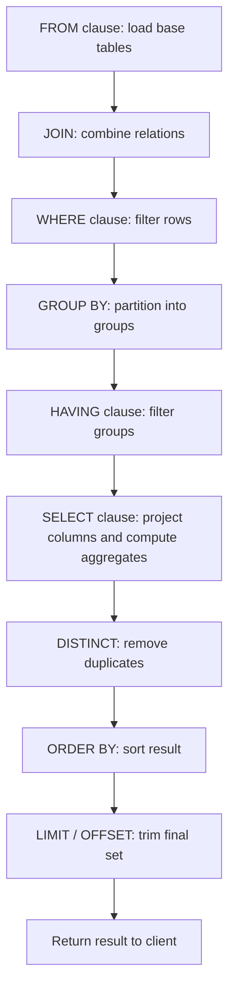
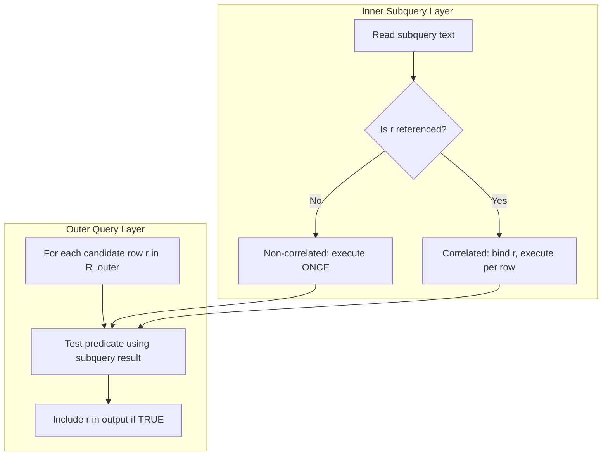
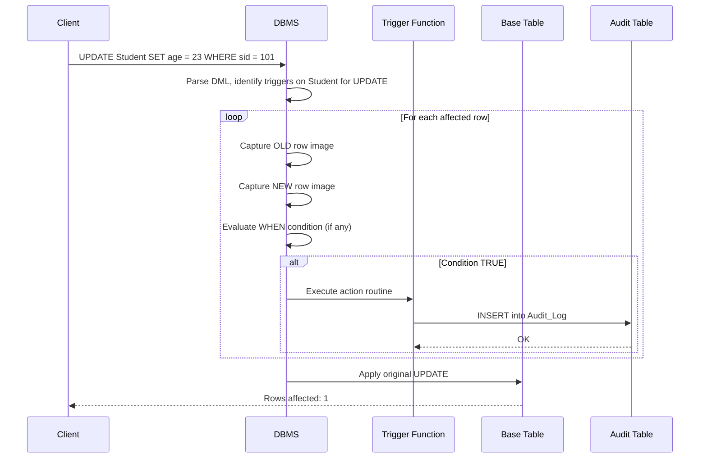
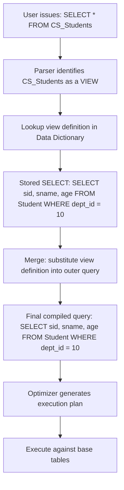
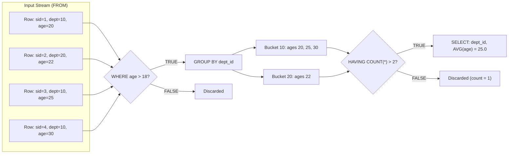

# Complex queries: Nested queries, Aggregate functions, Views, Assertions, and Triggers

<!-- SECTION_1_START -->
# 1. Core Technical Definition & Intuitive Overview

## 1.1 Nested Queries (Subqueries)

**Formal Definition (KTU 2024 Syllabus Terminology):**
A *nested query* (or *subquery*) is a `SELECT` statement that is embedded within the `WHERE`, `FROM`, or `HAVING` clause of another SQL query, known as the *outer query*. The inner query is executed first, and its result set is consumed by the outer query to filter, compare, or compute values.

**Classification by Correlation:**
- **Non-Correlated Subquery:** Inner query is *independent* of the outer query — it executes exactly once and the result is reused.
- **Correlated Subquery:** Inner query *references* columns of the outer query — it executes *once per row* of the outer query (akin to a row-by-row `for` loop).

**Classification by Returned Values:**
- **Scalar Subquery:** Returns exactly one single value (one row, one column). Used with comparison operators like `=`, `<`, `>`.
- **Row Subquery:** Returns a single row with multiple columns. Used with row constructors like `(a, b)`.
- **Table Subquery:** Returns a set of rows and columns. Used with `IN`, `NOT IN`, `EXISTS`, `ANY`, `ALL`.

> [!IMPORTANT]
> **Syllabus Highlight:** KTU 2024 specifically tests three operators with subqueries — `IN`, `EXISTS`/`NOT EXISTS`, and comparison operators combined with `ANY` / `ALL`. Master the distinction between `IN` (set membership) and `EXISTS` (existence test with correlation).

**Intuitive Analogy:**
Imagine a librarian asked: *"Find the names of all students who borrowed the most popular book."*
1. First, the librarian counts which book has the highest borrow count (inner query returns a single value — the maximum count).
2. Then, the librarian filters the borrow records to find students matching that count (outer query uses the scalar result).

This two-stage "lookup → filter" pattern is exactly what a non-correlated subquery performs.

---

## 1.2 Aggregate Functions

**Formal Definition:**
Aggregate functions perform a *summarizing calculation* across a set of rows and return a single consolidated value. The five standard aggregate functions defined by SQL (and tested in KTU) are:

- `COUNT(*)` — Number of rows in the result set.
- `COUNT([DISTINCT] column)` — Number of non-NULL (or distinct) values in a column.
- `SUM(column)` — Total of all non-NULL numeric values.
- `AVG(column)` — Arithmetic mean of non-NULL numeric values.
- `MIN(column)` / `MAX(column)` — Smallest / largest value (works on numeric, string, and date types).

These functions are used in conjunction with the `GROUP BY` clause to partition the relation into groups, and the `HAVING` clause to filter *after* aggregation (unlike `WHERE`, which filters *before* aggregation).

> [!NOTE]
> **Critical Rule (Often Tested):** `WHERE` cannot reference aggregate results. You **must** use `HAVING` to apply conditions on aggregated values. Example: `SELECT dept, AVG(salary) FROM emp WHERE age > 25 GROUP BY dept HAVING AVG(salary) > 50000;`

**Intuitive Analogy:**
Think of an Excel **pivot table**. You drop a category (say "Department") into the row area (`GROUP BY`), pick a numeric column ("Salary"), choose `SUM` or `AVG` (the aggregate), and then apply a filter on the *result* (`HAVING`). That's the entire pipeline.

> [!VISUALIZATION CONTROL]
> **Concept:** Execution order of a SQL query with `GROUP BY` and `HAVING`
> **Pipeline Stages (logical order of evaluation):**
> 1. `FROM` + `JOIN` → builds working set
> 2. `WHERE` → filters individual rows
> 3. `GROUP BY` → partitions into groups
> 4. `HAVING` → filters entire groups
> 5. `SELECT` → projects columns and computes aggregates
> 6. `ORDER BY` / `LIMIT` → final sorting
> **Visual Description:** Imagine a horizontal conveyor belt where raw rows enter at `FROM`, get weeded out at `WHERE`, are bucketed at `GROUP BY`, have buckets discarded at `HAVING`, are summarized at `SELECT`, and finally sorted at `ORDER BY`.

---

## 1.3 Views

**Formal Definition:**
A *view* is a **virtual relation** defined by a stored SQL `SELECT` query. It does not physically store data (in most cases); instead, the DBMS materializes the result *on demand* by re-executing the underlying query each time the view is referenced.

> [!IMPORTANT]
> **Syllabus Highlight:** A view is a "named query." Modifications made to base tables through an updatable view *immediately reflect* in the view, and vice versa, because the data is physically stored only in the base tables.

**Types of Views in KTU Scope:**
1. **Simple Updatable View:** Built from a single base table, no aggregate, no `DISTINCT`, no `GROUP BY`. Both `INSERT` and `UPDATE` are permitted.
2. **View with `WITH CHECK OPTION`:** Ensures that any `INSERT` or `UPDATE` through the view must satisfy the view's own `WHERE` clause — preventing "phantom" rows that vanish when re-queried.
3. **Read-Only (Non-Updatable) View:** Contains `JOIN`, `GROUP BY`, `HAVING`, aggregate functions, or `DISTINCT`. Can only be used in `SELECT` queries.

**Intuitive Analogy:**
A view is a *saved filter* on a spreadsheet. It is not a separate copy of the data — it is a persistent formula (the stored `SELECT` query) that you can re-run anytime to see a specific projection. If the underlying data changes, the view's next invocation returns the updated result.

---

## 1.4 Assertions

**Formal Definition:**
An *assertion* is a named constraint that specifies a *predicate* (a boolean condition) that **must always be true** for the entire database. Unlike triggers, assertions are declarative — you state *what* must hold, and the DBMS rejects any `INSERT`, `UPDATE`, or `DELETE` that would violate the predicate.

> [!NOTE]
> **Standard vs. Implementations:** `CREATE ASSERTION` is part of the **SQL standard**, but most commercial DBMSs (Oracle, MySQL) do not implement it. PostgreSQL deprecated it. KTU 2024 includes assertions in the syllabus primarily for *conceptual and exam-theoretical purposes* (you may be asked to write the syntax even if no live engine supports it fully).

**Intuitive Analogy:**
An assertion is like a *company-wide policy* — "No employee may earn more than the CEO." Every transaction (hiring, raise, promotion) is checked against this rule. If any transaction would break the policy, it is refused at the door.

---

## 1.5 Triggers

**Formal Definition:**
A *trigger* is a procedural block of code (SQL + control-flow statements) that is *automatically executed* by the DBMS in response to a specified data-modification event (`INSERT`, `UPDATE`, `DELETE`) on a specified table. Triggers implement **Event-Condition-Action (ECA)** semantics.

**Key Components of a Trigger:**
- **Event:** `BEFORE` / `AFTER` / `INSTEAD OF` combined with `INSERT` / `UPDATE` / `DELETE`.
- **Condition (Optional):** A `WHEN` clause that further filters whether the action runs.
- **Action:** The procedural body (often `BEGIN ... END` with multiple statements) executed when the trigger fires.
- **Granularity:** `FOR EACH ROW` (fires per affected row) or `FOR EACH STATEMENT` (fires once per statement).

**Special References inside the Action Body:**
- `OLD.column` — value of the column *before* the change (available for `UPDATE` and `DELETE`; `NULL` for `INSERT`).
- `NEW.column` — value of the column *after* the change (available for `UPDATE` and `INSERT`; `NULL` for `DELETE`).

> [!IMPORTANT]
> **Syllabus Highlight:** KTU frequently tests the availability matrix of `OLD` and `NEW`:
>
> | Trigger Event | OLD available? | NEW available? |
> |---------------|----------------|----------------|
> | `INSERT`      | No (NULL)      | Yes            |
> | `UPDATE`      | Yes            | Yes            |
> | `DELETE`      | Yes            | No (NULL)      |

**Intuitive Analogy:**
A trigger is an *automatic email alert* on a bank account. The event is "balance changes" (`UPDATE`), the condition is "balance drops below ₹1000" (`WHEN NEW.balance < 1000`), and the action is "send SMS" (`INSERT INTO alerts ...`). You don't have to remember to check; the system watches for you.

<!-- SECTION_1_END -->

<!-- SECTION_2_START -->
# 2. Deep Theoretical Analysis & KTU High-Yield Formula Sheet

## 2.1 Nested Query — Operational Semantics

### 2.1.1 Non-Correlated Subquery Execution
The DBMS follows a strict 3-step operational pattern:

1. **Compile & Plan:** The query parser converts the SQL into an execution tree. The subquery is identified as a *dependent operator node* that must resolve before the outer filter applies.
2. **Execute Inner Query:** The subquery runs **exactly once**, producing a *result set* (scalar, row, or table).
3. **Substitute & Execute Outer Query:** The result set is plugged into the outer query's predicate. The outer query runs once over its base tables using the substituted values.

### 2.1.2 Correlated Subquery Execution
For each candidate row *r* in the outer query's source:

1. Bind *r*'s column values to the correlated references inside the subquery.
2. Execute the subquery with these bindings to obtain a value or boolean.
3. Test the outer predicate using the subquery's result.
4. If true, keep *r* in the output; else discard.

> **Performance Implication:** Correlated subqueries are *O(n × m)* — they scale poorly on large relations. SQL optimizers often rewrite them internally as `JOIN`s with `GROUP BY` for performance. The classic `EXISTS` correlated subquery is the canonical example of this pattern.

### 2.1.3 The Three Critical Operators

**`IN` vs. `EXISTS`:**
- `IN` checks set membership using the subquery's result as a list. Typically non-correlated.
- `EXISTS` checks whether the subquery returns *at least one row*. Always correlated in practice.
- **Equivalence (often tested):** `NOT IN` and `NOT EXISTS` produce the *same result* only when the subquery has no `NULL`s. If `NULL` is present, `NOT IN` returns `UNKNOWN` (treated as `FALSE`), while `NOT EXISTS` may return `TRUE`.

**`ANY` and `ALL`:**
- `> ANY (subquery)` means *strictly greater than at least one* of the values — equivalent to `> MIN(subquery)`.
- `> ALL (subquery)` means *strictly greater than every* value — equivalent to `> MAX(subquery)`.
- `< ANY` → less than max; `< ALL` → less than min.

---

## 2.2 Aggregate Functions — The Reduction Operator

Aggregates are formally a *monoid* operation over a multi-set (bag) of values. The formal definition uses the reduction operator $\bigoplus$:

$$ \text{AGG}(R) = \bigoplus_{t \in R} f(t) $$

where $R$ is a relation (or group partition), $t$ is a tuple, and $f$ is a value-extraction function. For example, `SUM(salary)` computes:

$$ \text{SUM}(R) = \sum_{t \in R} t.\text{salary} \quad \text{over all } t \text{ where } t.\text{salary} \neq \text{NULL} $$

**Null Handling Rule:** All aggregates (except `COUNT(*)`) **ignore** `NULL` values. This is why `COUNT(*)` may differ from `COUNT(column)`.

### 2.2.1 `GROUP BY` Partitioning

When a `GROUP BY col1, col2, ...` clause is present, the relation is partitioned into equivalence classes where all rows share the same values of the grouping columns. Each partition becomes one output row of the grouped query.

> **Selection Rule:** Every column in the `SELECT` list must either be inside an aggregate function *or* appear in the `GROUP BY` clause. SQL will reject queries that violate this — a frequent KTU exam trap.

### 2.2.2 `HAVING` vs. `WHERE`

| Feature | `WHERE` | `HAVING` |
|---------|---------|----------|
| Evaluated | Before grouping | After grouping |
| Can use aggregates? | **No** | **Yes** |
| Filters | Individual rows | Whole groups |
| Applies to | Base table rows | Grouped partitions |

---

## 2.3 Views — Logical Independence Layer

A view is formally a *named derived relation*:

$$ V = \sigma_p(\pi_{a_1, a_2, \dots}(R_1 \bowtie R_2 \bowtie \dots)) $$

When a query references a view $V$, the DBMS performs **view resolution** (also called *view merging* or *query modification*): it substitutes the view's defining query in place of the view name, then optimizes the combined statement as a single query plan.

### 2.3.1 Updatability Criteria (SQL:1999 Standard)

A view is **updatable** if and only if **all** of the following are true:
1. The `FROM` clause references exactly **one** base table (or one updatable view).
2. No `DISTINCT`, `GROUP BY`, `HAVING`, aggregate, or set operation is present.
3. No `JOIN`, `UNION`, `INTERSECT`, or `EXCEPT` is present.
4. Every column of the base table not in the view's projection is *nullable* or has a default.

> **Engine Caveat:** PostgreSQL implements an *automatic updatable view* rule matching the above. MySQL is similar. Oracle requires `INSTEAD OF` triggers for non-updatable views to support DML.

---

## 2.4 Assertions — Declarative Integrity Constraints

An assertion is a *table-level* constraint checked against the *entire database* (not just one row). Formally, an assertion $A$ over relations $R_1, R_2, \dots$ is a predicate $P(R_1, R_2, \dots)$ such that:

$$ \forall \sigma \in \text{DB States}, \quad P(\sigma(R_1), \sigma(R_2), \dots) = \text{TRUE} $$

The DBMS must reject any transaction that would leave the database in a state where $P$ is false. Checking an arbitrary predicate can be expensive — the engine may need to re-evaluate the assertion on every modification.

---

## 2.5 Triggers — Event-Condition-Action Rules

A trigger is formally a 4-tuple:

$$ T = (E, C, A, G) $$

where:
- $E$ = triggering event (`INSERT` / `UPDATE` / `DELETE`, possibly on specific columns)
- $C$ = optional condition predicate (`WHEN` clause)
- $A$ = action routine (procedural SQL / PL blocks)
- $G$ = granularity (`FOR EACH ROW` or `FOR EACH STATEMENT`)

### 2.5.1 Trigger Execution Cycle

1. The DBMS processes a DML statement.
2. For each affected row (or once per statement, depending on $G$):
   a. Capture `OLD` and `NEW` row images.
   b. Evaluate the `WHEN` condition $C$.
   c. If $C$ is true (or omitted), execute the action $A$.
3. The original DML completes (or is aborted if a trigger raises an error / `SIGNAL SQLSTATE`).

> [!NOTE]
> **Ordering:** When multiple triggers exist on the same event, `BEFORE` triggers fire in the order they were created, then the DML, then `AFTER` triggers in creation order. This is implementation-defined and frequently tested.

---

## 2.6 KTU High-Yield Formula & Syntax Cheat Sheet

| Construct | SQL Syntax | When to Use |
|-----------|------------|-------------|
| Scalar subquery | `WHERE col = (SELECT ...)` | Need a single comparison value |
| `IN` subquery | `WHERE col IN (SELECT ...)` | Membership in a set |
| `EXISTS` | `WHERE EXISTS (SELECT 1 ...)` | "Has at least one match" test |
| `ANY` | `WHERE col > ANY (SELECT ...)` | Greater than *some* member |
| `ALL` | `WHERE col > ALL (SELECT ...)` | Greater than *every* member |
| `GROUP BY` | `SELECT dept, AVG(sal) FROM emp GROUP BY dept` | Bucket rows by category |
| `HAVING` | `... HAVING COUNT(*) > 5` | Filter on aggregated values |
| Simple view | `CREATE VIEW v AS SELECT ...` | Save a reusable projection |
| Updatable view w/ check | `CREATE VIEW v AS SELECT ... WHERE ... WITH CHECK OPTION` | Prevent vanishing inserts |
| Assertion | `CREATE ASSERTION name CHECK (predicate)` | Database-wide invariant |
| Row-level trigger | `CREATE TRIGGER ... FOR EACH ROW ...` | React per-row with `OLD`/`NEW` |
| Statement-level trigger | `CREATE TRIGGER ... FOR EACH STATEMENT ...` | React once per SQL statement |
| `BEFORE` trigger | `CREATE TRIGGER ... BEFORE INSERT ON T ...` | Validate / modify before write |
| `AFTER` trigger | `CREATE TRIGGER ... AFTER UPDATE ON T ...` | Log / cascade / notify after write |

---

## 2.7 Real-World Engineering Utility

- **Nested queries** power reporting tools (BI dashboards) that compute derived KPIs — e.g., "Show all products priced above the average of their category."
- **Aggregate functions** drive *OLAP cubes*, financial summaries, and ML feature engineering (mean encoding, count-based features).
- **Views** are the foundation of *row-level security* in production: an `HR_view` exposes only non-sensitive columns to general users while the base table is locked down.
- **Assertions** model hard business invariants — "Sum of all loan amounts to a single customer ≤ ₹10 lakh" — and reject illegal states atomically.
- **Triggers** implement *audit logging*, *denormalized counter maintenance* (e.g., `likes_count` on a post), *cascade-soft-delete* workflows, and *event-driven microservices* in the database layer.

<!-- SECTION_2_END -->

<!-- SECTION_3_START -->
# 3. Step-by-Step Derivations & Code/Symbolic Implementation

## 3.1 Working Schema (Used Throughout)

To keep all examples internally consistent, we use the following **University** database.

```sql
CREATE TABLE Student (
    sid      INT PRIMARY KEY,
    sname    VARCHAR(50) NOT NULL,
    age      INT,
    dept_id  INT
);

CREATE TABLE Course (
    cid      INT PRIMARY KEY,
    cname    VARCHAR(50) NOT NULL,
    credits  INT
);

CREATE TABLE Enroll (
    sid      INT,
    cid      INT,
    grade    CHAR(2),
    PRIMARY KEY (sid, cid),
    FOREIGN KEY (sid) REFERENCES Student(sid),
    FOREIGN KEY (cid) REFERENCES Course(cid)
);
```

> [!NOTE]
> The `Enroll` table is a *junction relation* resolving the M:N relationship between `Student` and `Course`.

---

## 3.2 Nested Query Derivations

### 3.2.1 Non-Correlated Scalar Subquery

**Problem:** Find the names of students older than the average age of all students.

**Step-by-Step Logic:**
1. The inner subquery `SELECT AVG(age) FROM Student` computes a single scalar: the average age.
2. The outer query compares each student's `age` against this scalar.
3. Filter and project `sname`.

**SQL Implementation:**
```sql
SELECT sname
FROM   Student
WHERE  age > (SELECT AVG(age) FROM Student);
```

**Manual Execution Walk-Through (Assume data: ages = 18, 19, 20, 22, 21):**
- Inner: `AVG(age) = (18 + 19 + 20 + 22 + 21) / 5 = 100 / 5 = 20.0`
- Outer: keep students where `age > 20.0` → keep age 22 and 21.

**Multi-line Equation Form:**

$$
\text{Result} = \pi_{\text{sname}}\bigl(\sigma_{\text{age} > \bar{A}}\,(S)\bigr), \quad \bar{A} = \frac{1}{\vert S \vert} \sum_{t \in S} t.\text{age}
$$

where $\bar{A}$ is the inner scalar and $S$ is the `Student` relation.

---

### 3.2.2 Correlated Subquery with `EXISTS`

**Problem:** Find the names of students who are enrolled in **at least one** course.

**Step-by-Step Logic:**
1. For each candidate student row *s* in the outer `Student` table...
2. ...the inner subquery checks if *any* row in `Enroll` matches `e.sid = s.sid`.
3. If yes (i.e., `EXISTS` returns `TRUE`), include *s* in the output.

**SQL Implementation:**
```sql
SELECT sname
FROM   Student s
WHERE  EXISTS (
       SELECT 1
       FROM   Enroll e
       WHERE  e.sid = s.sid
       );
```

**Manual Walk-Through (Assume Sid 1, 2, 3, 4; Enroll has rows for Sid 1 and 3):**
- For *s* with `sid = 1`: inner returns a row → `EXISTS = TRUE` → keep.
- For *s* with `sid = 2`: inner returns no row → `EXISTS = FALSE` → skip.
- For *s* with `sid = 3`: keep.
- For *s* with `sid = 4`: skip.

> [!IMPORTANT]
> The `SELECT 1` inside `EXISTS` is a *convention* — only the *existence* of any row matters, not the projected value. Some prefer `SELECT *`, but `SELECT 1` is marginally faster on some engines.

---

### 3.2.3 Negation: `NOT EXISTS` — Classic "Find Students Enrolled in ALL Courses"

**Problem:** Find students who are enrolled in **every** course.

**Logical Trick:** A student is enrolled in *all* courses **iff** there is **no course** in which they are **not** enrolled. This is the classic application of double negation.

**SQL Implementation:**
```sql
SELECT sname
FROM   Student s
WHERE  NOT EXISTS (
       SELECT 1
       FROM   Course c
       WHERE  NOT EXISTS (
              SELECT 1
              FROM   Enroll e
              WHERE  e.sid = s.sid AND e.cid = c.cid
              )
       );
```

**Reading the Predicate (Universal Quantifier Translation):**
- Outer: $\forall s \in S$, the result includes $s$ if...
- First `NOT EXISTS`: ...there is **no** course $c$...
- Second `NOT EXISTS`: ...for which $s$ has **no** enrollment.

This translates to $\forall c \in C, \exists e \in E$ such that $e.\text{sid} = s.\text{sid} \land e.\text{cid} = c.\text{cid}$.

---

## 3.3 Aggregate Function Derivations

### 3.3.1 `GROUP BY` and `HAVING` — Department Statistics

**Problem:** For each department, show the average age of students, but only for departments that have **more than 2 students**.

**SQL Implementation:**
```sql
SELECT   dept_id, AVG(age) AS avg_age, COUNT(*) AS num_students
FROM     Student
GROUP BY dept_id
HAVING   COUNT(*) > 2;
```

**Step-by-Step Evaluation:**

1. `FROM Student` → read all rows.
2. `GROUP BY dept_id` → partition into groups $G_1, G_2, \dots$ by `dept_id`.
3. `COUNT(*)` per group → $n_k = \vert G_k \vert$.
4. `AVG(age)` per group → $\bar{a}_k$.
5. `HAVING COUNT(*) > 2` → drop groups with $n_k \le 2$.
6. `SELECT` → project `(dept_id, avg_age, num_students)`.

**Symbolic Form:**

$$
\text{Result} = \bigl\{ (d, \bar{a}_d, n_d) \;\big|\; d = \pi_{\text{dept\_id}}(S), \; \bar{a}_d = \frac{1}{n_d}\sum_{t \in G_d} t.\text{age}, \; n_d = \vert G_d \vert, \; n_d > 2 \bigr\}
$$

where $G_d$ is the group of tuples with `dept_id = d`.

---

### 3.3.2 Counting with `DISTINCT`

**Problem:** How many distinct students have at least one enrollment?

```sql
SELECT COUNT(DISTINCT sid) AS active_students
FROM   Enroll;
```

**Walk-Through:** `DISTINCT sid` removes duplicate `sid` values from the bag of enrollments, leaving the set of unique enrollees. `COUNT` returns the cardinality of that set.

---

## 3.4 View Implementations

### 3.4.1 Simple Updatable View

```sql
CREATE VIEW CS_Students AS
SELECT sid, sname, age
FROM   Student
WHERE  dept_id = 10;
```

**Updatable?** ✅ Yes — single base table, no aggregates, no `DISTINCT`, no `JOIN`.

**Test the Update:**
```sql
UPDATE CS_Students SET age = 21 WHERE sid = 101;
```
This is rewritten internally as:
```sql
UPDATE Student SET age = 21 WHERE sid = 101 AND dept_id = 10;
```

### 3.4.2 View with `WITH CHECK OPTION`

```sql
CREATE VIEW Young_Students AS
SELECT sid, sname, age
FROM   Student
WHERE  age < 20
WITH CHECK OPTION;
```

**Behavior:** Any `INSERT` or `UPDATE` that produces a row violating `age < 20` is **rejected**. This prevents "disappearing rows" — rows that pass the DML but then vanish when re-queried through the view.

**Test:**
```sql
INSERT INTO Young_Students VALUES (200, 'Ravi', 25);
-- ERROR: CHECK OPTION violation: age = 25 fails age < 20
```

### 3.4.3 Non-Updatable Aggregation View

```sql
CREATE VIEW Dept_Stats AS
SELECT   dept_id, COUNT(*) AS num, AVG(age) AS avg_age
FROM     Student
GROUP BY dept_id;
```

**Updatable?** ❌ No — contains `COUNT(*)` and `AVG(age)`. Any attempt at `UPDATE` or `INSERT` through this view is rejected by the standard.

---

## 3.5 Assertion Implementation

**Problem:** No student may be enrolled in more than 5 courses.

```sql
CREATE ASSERTION MaxFiveCourses
CHECK (
    NOT EXISTS (
        SELECT sid
        FROM   Enroll
        GROUP BY sid
        HAVING COUNT(*) > 5
    )
);
```

**Walk-Through:**
1. The inner query groups enrollments by `sid` and counts.
2. The outer `NOT EXISTS` returns `TRUE` if *no* student exceeds 5 enrollments.
3. The `CHECK` constraint requires the inner predicate to be `TRUE` always.
4. The DBMS verifies this on every `INSERT` to `Enroll` (and every `DELETE` that would reduce a count, in the strict reading).

---

## 3.6 Trigger Implementation (Exhaustive)

### 3.6.1 `BEFORE INSERT` Trigger — Auto-Stamp Registration Time

**Problem:** Whenever a new student is inserted, automatically set their `age` to `18` if the provided value is `NULL` or invalid (`< 16`).

**SQL Implementation (PostgreSQL dialect — KTU standard):**
```sql
CREATE OR REPLACE FUNCTION set_default_age()
RETURNS TRIGGER
LANGUAGE plpgsql
AS $$
BEGIN
    -- Enforce minimum age policy
    IF NEW.age IS NULL OR NEW.age < 16 THEN
        NEW.age := 18;
    END IF;
    RETURN NEW;  -- MANDATORY: return the row to proceed with the INSERT
END;
$$;

CREATE TRIGGER trg_set_default_age
BEFORE INSERT ON Student
FOR EACH ROW
EXECUTE FUNCTION set_default_age();
```

**Test:**
```sql
INSERT INTO Student (sid, sname, age, dept_id) VALUES (300, 'Anu', 12, 10);
-- After trigger: NEW.age = 18 → row inserted with age 18.
```

### 3.6.2 `AFTER UPDATE` Trigger — Maintain a Denormalized Counter

**Problem:** Maintain a `num_enrolled` column on `Course`, updated automatically whenever a row is added or removed from `Enroll`.

**SQL Implementation:**
```sql
-- Step 1: Add the counter column (assumes Course has a num_enrolled column)
ALTER TABLE Course ADD COLUMN num_enrolled INT DEFAULT 0;

-- Step 2: Create the supporting function for INSERTs
CREATE OR REPLACE FUNCTION inc_enrolled()
RETURNS TRIGGER
LANGUAGE plpgsql
AS $$
BEGIN
    UPDATE Course
    SET    num_enrolled = num_enrolled + 1
    WHERE  cid = NEW.cid;
    RETURN NEW;
END;
$$;

-- Step 3: Bind the trigger
CREATE TRIGGER trg_inc_enrolled
AFTER INSERT ON Enroll
FOR EACH ROW
EXECUTE FUNCTION inc_enrolled();
```

**Symmetric `AFTER DELETE` Trigger:**
```sql
CREATE OR REPLACE FUNCTION dec_enrolled()
RETURNS TRIGGER
LANGUAGE plpgsql
AS $$
BEGIN
    UPDATE Course
    SET    num_enrolled = num_enrolled - 1
    WHERE  cid = OLD.cid;       -- OLD is used for DELETE
    RETURN OLD;
END;
$$;

CREATE TRIGGER trg_dec_enrolled
AFTER DELETE ON Enroll
FOR EACH ROW
EXECUTE FUNCTION dec_enrolled();
```

> [!NOTE]
> **Row-level** triggers can modify *other tables* (called "trigger chaining") — this is how cascading behavior is implemented. But a trigger **cannot** modify the table it is bound to in a way that would cause infinite recursion.

### 3.6.3 `AFTER UPDATE` Trigger — Audit Log

**Problem:** Whenever a student's age is changed, log the change into an `Audit_Log` table.

**SQL Implementation:**
```sql
CREATE TABLE Audit_Log (
    log_id      SERIAL PRIMARY KEY,
    sid         INT,
    old_age     INT,
    new_age     INT,
    changed_at  TIMESTAMP DEFAULT CURRENT_TIMESTAMP
);

CREATE OR REPLACE FUNCTION log_age_change()
RETURNS TRIGGER
LANGUAGE plpgsql
AS $$
BEGIN
    -- Only log if age actually changed
    IF OLD.age IS DISTINCT FROM NEW.age THEN
        INSERT INTO Audit_Log (sid, old_age, new_age)
        VALUES (OLD.sid, OLD.age, NEW.age);
    END IF;
    RETURN NEW;
END;
$$;

CREATE TRIGGER trg_log_age_change
AFTER UPDATE ON Student
FOR EACH ROW
EXECUTE FUNCTION log_age_change();
```

> [!IMPORTANT]
> **`IS DISTINCT FROM` is NULL-safe** — it returns `TRUE` if one operand is `NULL` and the other is not. The standard `OLD.age <> NEW.age` returns `NULL` (treated as `FALSE`) when either side is `NULL`, which would skip the log. Use `IS DISTINCT FROM` to handle the `NULL` case correctly.

---

## 3.7 Comparative Table: Real-World Case Frameworks

| Concept | Engineering Scenario | Regulatory / Systemic Constraint |
|---------|----------------------|----------------------------------|
| **Nested Query** | "Show all flights overbooked above industry average" | IATA passenger rights regulations |
| **Aggregate + HAVING** | Quarterly revenue reports showing under-performing regions | SEBI disclosure norms (Material Weakness) |
| **View** | Hospital dashboard showing anonymized patient records | HIPAA Privacy Rule (45 CFR §164.514) |
| **Assertion** | "Loan principal × interest ≤ borrower income × 5" | RBI Prudential Norms on Lending |
| **Trigger** | Auto-flagging transactions > ₹50,000 in AML system | PMLA (Prevention of Money Laundering Act) audit trail |

<!-- SECTION_3_END -->

<!-- SECTION_4_START -->
# 4. Structural Diagrams & Schematics

## 4.1 SQL Query Execution Pipeline

The following Mermaid block shows the logical order in which a SQL engine evaluates clauses, which is critical for understanding why `WHERE` cannot reference aggregates but `HAVING` can.



**Reading the Diagram:** The arrows are strictly left-to-right. Note that `WHERE` (step C) executes *before* `GROUP BY` (step D), which is why `WHERE` cannot reference aggregate results. `HAVING` (step E) is the *only* clause that can reference aggregates because it executes *after* grouping.

---

## 4.2 Nested Query Architecture (Correlated vs Non-Correlated)



**Key Insight:** The branch at `I2` is the *single decision* that classifies a subquery. If any column of an outer row is referenced in the inner text, the engine binds it per row — this is "correlation" and is what makes correlated subqueries scale as $O(n \times m)$ in the worst case.

---

## 4.3 Trigger Execution Topology (ECA Model)



**Operational Notes:**
- The `BEFORE` trigger would fire *before* the `Apply original UPDATE` step, allowing the trigger to *modify* `NEW.*` values.
- The `AFTER` trigger fires *after* the base table is updated (as shown), making it ideal for audit logs and denormalized counters.
- `FOR EACH STATEMENT` granularity would collapse the inner loop into a single execution — useful for batch operations where per-row overhead matters.

---

## 4.4 View Resolution Process



**Key Insight:** The view is never physically executed in isolation. The DBMS performs *query modification* — it expands the view definition and treats the original user query as a single query against the base tables. This is why the view's data is always "live" with respect to the base tables.

---

## 4.5 Aggregation Pipeline (Conceptual Bucket Model)



**Reading the Diagram:** The two-stage filtering (`WHERE` then `HAVING`) and the bucket-based grouping visually demonstrate why `WHERE` operates on *rows* while `HAVING` operates on *groups*. The `DROP` nodes show rows/groups removed at each stage.

<!-- SECTION_4_END -->

<!-- SECTION_5_START -->
# 5. KTU 2024 Scheme Examination Question Bank & Topic Recap

## Part A — Short Answer Questions (3 Marks Each)

### Question 1: Nested Query
**[KTU University Exam — July 2024]** *CO1, Understand*

**Q: Differentiate between correlated and non-correlated subqueries with a suitable example for each.**

**Model Answer (3 Marks — 1 Mark per point + 1 for example):**

A **non-correlated subquery** is independent of the outer query. It executes **once**, produces a result, and the outer query uses that result. Example: finding students older than the average age.

```sql
SELECT sname FROM Student
WHERE age > (SELECT AVG(age) FROM Student);
```

A **correlated subquery** references one or more columns of the outer query. It executes **once per row** of the outer query, with the outer row's values bound to the inner query. Example: finding students who are enrolled in at least one course.

```sql
SELECT sname FROM Student s
WHERE EXISTS (SELECT 1 FROM Enroll e WHERE e.sid = s.sid);
```

**Key Difference:** Non-correlated subqueries are evaluated once and are generally faster; correlated subqueries re-evaluate for every outer row and have $O(n \times m)$ complexity.

**Valuation Key Points:**
- [Stating definition of non-correlated: 1 Mark]
- [Stating definition of correlated: 1 Mark]
- [Correct distinguishing example: 1 Mark]

---

### Question 2: Aggregate Functions
**[KTU University Exam — Dec 2023]** *CO2, Remember*

**Q: Write SQL to find the total number of courses and the average credits per course from the `Course` table.**

**Model Answer (3 Marks):**

```sql
SELECT COUNT(*)    AS total_courses,
       AVG(credits) AS avg_credits
FROM   Course;
```

**Walk-Through:**
- `COUNT(*)` returns the number of rows in the `Course` table.
- `AVG(credits)` returns the arithmetic mean of the `credits` column, ignoring `NULL` values.
- The result is a single row with two columns.

**Valuation Key Points:**
- [Correct use of COUNT: 1 Mark]
- [Correct use of AVG: 1 Mark]
- [Aliasing / Output clarity: 1 Mark]

---

## Part B — Long Answer Questions (14 Marks Each, Internal Choice)

> [!WARNING]
> **KTU Examiner's Valuation Warning / Pitfall Callout:**
> 1. **Subquery braces:** Always enclose subqueries in parentheses `()`. Many students lose marks by writing `WHERE col IN SELECT ...` instead of `WHERE col IN (SELECT ...)`.
> 2. **HAVING vs. WHERE trap:** Do not place aggregate functions inside `WHERE`. Use `HAVING` for `COUNT(*) > N`, `AVG(x) > v`, etc.
> 3. **`NEW` vs. `OLD`:** In an `INSERT` trigger, `OLD` is `NULL`; in a `DELETE` trigger, `NEW` is `NULL`. Returning the wrong reference will throw a runtime error.
> 4. **Updatable views:** Do not claim a view is updatable if it has `JOIN`, `GROUP BY`, `DISTINCT`, or aggregates. The examiner will deduct a mark per incorrect claim.
> 5. **`WITH CHECK OPTION`:** State explicitly that the option enforces the view's `WHERE` predicate on `INSERT`/`UPDATE`. Half the marks are for stating the *behavior*, not just the syntax.
> 6. **Trigger return value:** `BEFORE` triggers must `RETURN NEW` (or `NULL` to abort the row). `AFTER` triggers also conventionally `RETURN NULL`. Forgetting to `RETURN NEW` in a `BEFORE INSERT` trigger causes the insert to silently fail.

---

### Question A (14 Marks)
**[KTU University Exam — July 2024]** *CO2, Apply*

**Q (a) [7 Marks, Understand]:** Consider the schema:
- `Student(sid, sname, age, dept_id)`
- `Course(cid, cname, credits)`
- `Enroll(sid, cid, grade)`

Write SQL queries for the following:

**(i) [3 Marks]** Find the names of all students who are **not** enrolled in any course.

**(ii) [4 Marks]** For each course, find the `cid`, `cname`, and the **number of distinct students** enrolled in it. Display only those courses with more than 2 enrollments.

---

**Q (b) [7 Marks, Apply]:** Create a view called `HighCreditCourses` that shows `cid`, `cname`, and `credits` for all courses with `credits > 3`. Ensure that any insertion into this view that violates the `credits > 3` rule is rejected. Also write a query to update a course's credits through this view, and describe what happens if you attempt to insert a course with `credits = 2`.

---

### Model Solution — Question A

**Part (a)(i) — [3 Marks]:**
```sql
SELECT sname
FROM   Student s
WHERE  NOT EXISTS (
       SELECT 1
       FROM   Enroll e
       WHERE  e.sid = s.sid
       );
```

**Walk-Through:**
- For each student $s$, the inner subquery checks if *any* enrollment exists with matching `sid`.
- `NOT EXISTS` retains $s$ only when the inner query returns *no rows*.
- The use of `NOT EXISTS` (not `NOT IN`) avoids the `NULL` pitfall in set membership.

**Valuation Key Points:**
- [Correct use of `NOT EXISTS` with correlation: 2 Marks]
- [Final query logic: 1 Mark]

---

**Part (a)(ii) — [4 Marks]:**
```sql
SELECT   c.cid, c.cname, COUNT(DISTINCT e.sid) AS num_students
FROM     Course c
         LEFT JOIN Enroll e ON c.cid = e.cid
GROUP BY c.cid, c.cname
HAVING   COUNT(DISTINCT e.sid) > 2;
```

**Walk-Through:**
1. `LEFT JOIN` ensures courses with zero enrollments are still listed (with `num_students = 0`).
2. `GROUP BY c.cid, c.cname` partitions by course.
3. `COUNT(DISTINCT e.sid)` counts unique students (a student enrolled twice via re-attempts would still count as 1).
4. `HAVING` filters out courses with 2 or fewer distinct enrollees.

**Valuation Key Points:**
- [Use of `LEFT JOIN` (or equivalent) to retain courses with no enrollments: 1 Mark]
- [Correct `COUNT(DISTINCT e.sid)`: 1 Mark]
- [Correct `GROUP BY` columns: 1 Mark]
- [Correct `HAVING` predicate: 1 Mark]

---

**Part (b) — [7 Marks]:**
```sql
CREATE VIEW HighCreditCourses AS
SELECT cid, cname, credits
FROM   Course
WHERE  credits > 3
WITH CHECK OPTION;
```

**Update query:**
```sql
UPDATE HighCreditCourses
SET    credits = 5
WHERE  cid = 101;
```

This is rewritten by the DBMS as:
```sql
UPDATE Course SET credits = 5 WHERE cid = 101 AND credits > 3;
```

**Attempted Insertion of `credits = 2`:**
```sql
INSERT INTO HighCreditCourses VALUES (200, 'Intro to AI', 2);
```
The DBMS will **reject** this insertion with a `WITH CHECK OPTION violation` error (or `ORA-01402: view WITH CHECK OPTION where-clause violation` in Oracle). The reason: the new row has `credits = 2`, which violates the view's `WHERE credits > 3` clause, and `WITH CHECK OPTION` enforces that all modifications through the view must satisfy the view's defining predicate.

**Valuation Key Points:**
- [Correct view syntax with `WITH CHECK OPTION`: 2 Marks]
- [Valid update query: 1 Mark]
- [Explanation of view rewriting: 1 Mark]
- [Correct behavior description on `credits = 2` insert: 2 Marks]
- [Mention of error / rejection: 1 Mark]

---

### Question B (14 Marks)
**[KTU University Exam — Dec 2023]** *CO3, Apply*

**Q (a) [7 Marks, Apply]:** Write an SQL `CREATE TABLE` statement for a `Library` table with columns `book_id`, `title`, `author`, `price`, and `pub_year`. Then write a single SQL query that:
- Shows the **author** and the **total number of books** they have written.
- Shows the **minimum and maximum price** across all their books.
- Filters to only those authors who have written **more than 3 books** AND have at least one book published after the year 2020.

**(i) [3 Marks]** Provide the `CREATE TABLE` statement.

**(ii) [4 Marks]** Provide the query.

---

**Q (b) [7 Marks, Apply]:** Design a **trigger** on the `Library` table such that:
- Whenever a new book is **inserted** with a `price` less than ₹100, the trigger should automatically set the price to ₹100 (a "minimum price" policy).
- Whenever a book's `price` is **updated** to a value greater than 2× its previous value, the trigger should **abort** the update (i.e., the new price should not be applied).

Provide:
**(i) [3 Marks]** The trigger function.
**(ii) [2 Marks]** The trigger creation statement binding the function to the `Library` table.
**(iii) [2 Marks]** A test `INSERT` and `UPDATE` showing the trigger's effect.

---

### Model Solution — Question B

**Part (a)(i) — [3 Marks]:**
```sql
CREATE TABLE Library (
    book_id    INT PRIMARY KEY,
    title      VARCHAR(100) NOT NULL,
    author     VARCHAR(50)  NOT NULL,
    price      DECIMAL(8,2) CHECK (price > 0),
    pub_year   INT CHECK (pub_year > 0)
);
```

**Valuation Key Points:**
- [Correct column types: 1 Mark]
- [Primary key and NOT NULL: 1 Mark]
- [Reasonable `CHECK` constraints: 1 Mark]

---

**Part (a)(ii) — [4 Marks]:**
```sql
SELECT   author,
         COUNT(*)      AS num_books,
         MIN(price)    AS min_price,
         MAX(price)    AS max_price
FROM     Library
WHERE    pub_year > 2020
GROUP BY author
HAVING   COUNT(*) > 3;
```

**Walk-Through:**
1. `WHERE pub_year > 2020` filters to books published after 2020.
2. `GROUP BY author` partitions by author.
3. Aggregates (`COUNT`, `MIN`, `MAX`) compute per-author statistics.
4. `HAVING COUNT(*) > 3` keeps only authors with more than 3 such books.

> [!IMPORTANT]
> **Subtle Pitfall:** The `WHERE pub_year > 2020` filter is applied *before* `GROUP BY`. This means we count only post-2020 books per author. If the intent was "any author with at least 3 books total, plus at least one post-2020 book," the query structure would need to change (e.g., use a subquery with `EXISTS`). The exam answer should match the *stated* problem.

**Valuation Key Points:**
- [Correct `GROUP BY`: 1 Mark]
- [Correct use of all three aggregates: 1 Mark]
- [Correct `WHERE` placement: 1 Mark]
- [Correct `HAVING` filter: 1 Mark]

---

**Part (b)(i) — [3 Marks]: Trigger function**
```sql
CREATE OR REPLACE FUNCTION library_price_policy()
RETURNS TRIGGER
LANGUAGE plpgsql
AS $$
BEGIN
    -- Policy 1: minimum price on INSERT
    IF TG_OP = 'INSERT' AND NEW.price < 100 THEN
        NEW.price := 100;
    END IF;

    -- Policy 2: prevent doubling on UPDATE
    IF TG_OP = 'UPDATE' AND NEW.price > 2 * OLD.price THEN
        RAISE EXCEPTION 'Price cannot be more than 2x the previous value: old=%, new=%',
            OLD.price, NEW.price;
    END IF;

    IF TG_OP = 'INSERT' THEN
        RETURN NEW;
    ELSE
        RETURN NEW;
    END IF;
END;
$$;
```

**Part (b)(ii) — [2 Marks]: Trigger binding**
```sql
CREATE TRIGGER trg_library_price_policy
BEFORE INSERT OR UPDATE ON Library
FOR EACH ROW
EXECUTE FUNCTION library_price_policy();
```

**Part (b)(iii) — [2 Marks]: Tests**

```sql
-- Test 1: INSERT with low price → should be auto-corrected to 100
INSERT INTO Library VALUES (1, 'DBMS Primer', 'Ramakrishnan', 50, 2023);
-- Effect: Trigger fires, sets NEW.price := 100. Row inserted with price 100.

-- Test 2: UPDATE doubling price → should be aborted
UPDATE Library SET price = 500 WHERE book_id = 1;  -- current price is 100
-- Effect: 500 > 2 * 100 = 200 → RAISE EXCEPTION → UPDATE rolled back.
-- The book's price remains 100.
```

**Valuation Key Points:**
- [Function correctly handles both policies: 2 Marks]
- [Proper trigger binding with `BEFORE INSERT OR UPDATE`: 1 Mark]
- [Test SQL demonstrating both behaviors: 2 Marks]
- [Correct use of `RAISE EXCEPTION` to abort: 1 Mark]
- [Mention of rollback: 1 Mark]

---

## Topic Recap & Important Things to Remember

- **Subquery Classification:** Master the difference between *correlated* (re-evaluated per outer row) and *non-correlated* (evaluated once) subqueries — a high-frequency KTU question.
- **`IN` vs. `EXISTS`:** `IN` performs set membership (typically non-correlated); `EXISTS` performs an existence test (always correlated). `NOT IN` with `NULL`s is a *famous* trap — prefer `NOT EXISTS` for safety.
- **`ANY` / `ALL` Shortcuts:** `> ANY` = `> MIN`; `> ALL` = `> MAX`. Similarly for `<` and equality.
- **Aggregate Null Handling:** All aggregates (except `COUNT(*)`) ignore `NULL`s. The `WHERE` clause cannot reference aggregates — use `HAVING`.
- **`GROUP BY` Rule:** Every non-aggregated column in `SELECT` must appear in `GROUP BY`. SQL will reject violations.
- **View Updatability:** Single base table + no `JOIN`/`GROUP BY`/`DISTINCT`/aggregates = updatable. Otherwise read-only.
- **`WITH CHECK OPTION`:** Prevents inserts/updates that violate the view's `WHERE` clause — protecting against "vanishing rows."
- **Assertion Standard vs. Reality:** `CREATE ASSERTION` is in the SQL standard, but most commercial DBMSs do not implement it. Be ready to write the syntax for the exam even if you cannot run it on your local engine.
- **Trigger `OLD`/`NEW` Matrix:** `INSERT` → only `NEW`; `DELETE` → only `OLD`; `UPDATE` → both. Memorize this table — KTU tests it directly.
- **Trigger Timing:** `BEFORE` for validation and modification of `NEW`; `AFTER` for logging, cascading, and side effects. `INSTEAD OF` is used on views to make them updatable.
- **Trigger Granularity:** `FOR EACH ROW` (per row, with `OLD`/`NEW`) vs. `FOR EACH STATEMENT` (once per DML). Row-level is more common in practice.
- **Return Values:** `BEFORE` triggers must return `NEW` (or `NULL` to cancel the row). Forgetting this silently fails the DML.
- **Trigger Chaining:** A trigger can modify other tables (cascade behavior), but modifying the *same* table in a way that re-fires the trigger causes infinite recursion — the engine detects and aborts this.
- **`IS DISTINCT FROM`:** Use this in trigger conditions to safely compare values that may be `NULL`; standard `<>` returns `UNKNOWN` (treated as `FALSE`) when either side is `NULL`.
- **Combined Triggers:** A single trigger declaration can fire on multiple events using `BEFORE INSERT OR UPDATE ON Table` syntax, and the trigger function can branch on the special variable `TG_OP` (`'INSERT'`, `'UPDATE'`, `'DELETE'`).
- **Recap Cheat Pattern:** Whenever you see a KTU question asking for "a constraint that is *always* true for the database," think assertion. For "a constraint that fires *only* on a specific event," think trigger. For "a saved query," think view.

<!-- SECTION_5_END -->
