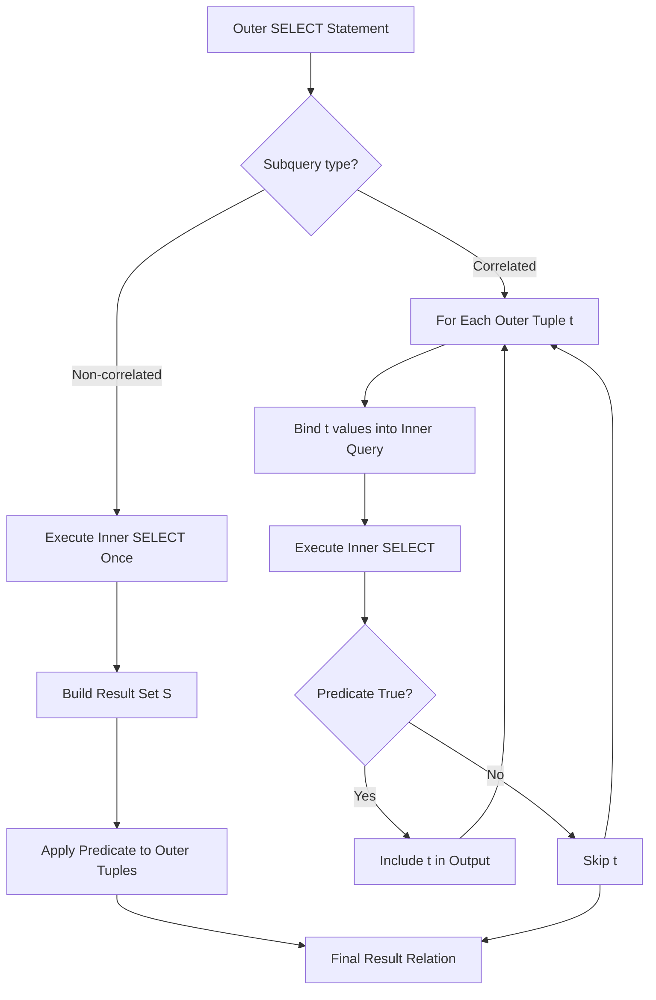
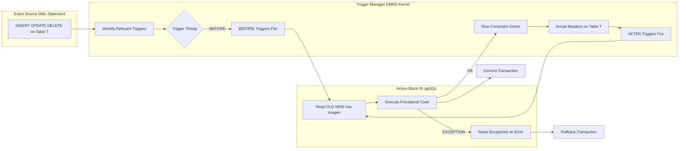
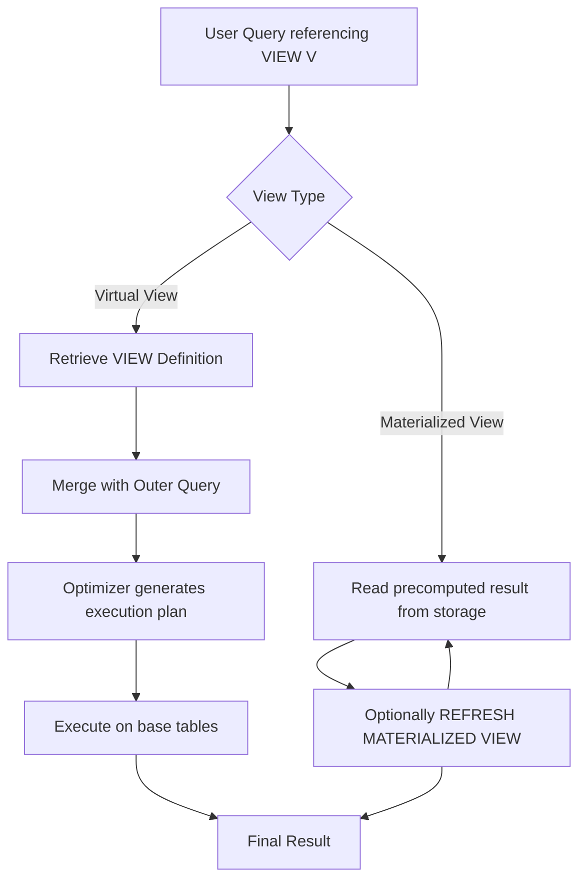
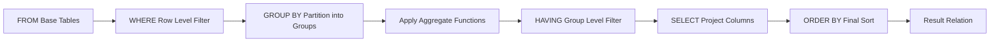

# Complex queries: Nested queries, Aggregate functions, Views, Assertions, and Triggers

<!-- SECTION_1_START -->
# DATABASE MANAGEMENT SYSTEMS — MODULE 2
## Complex Queries: Nested Queries, Aggregate Functions, Views, Assertions, and Triggers

### 1.1 Formal Academic Definition

In the context of the **KTU 2024 Scheme (PCCST402)** syllabus, *complex queries* refer to advanced Structured Query Language (SQL) constructs that go beyond simple `SELECT-FROM-WHERE` retrieval. They are composed of **nested subqueries**, **set-oriented aggregate computations**, **virtual relations (views)**, **integrity-enforcing assertions**, and **event-driven active rules (triggers)** — together they constitute the expressive backbone of the relational algebra–calculus framework extended with declarative constraints.

> [!IMPORTANT]
> **Syllabus Highlight (KTU 2024 — Module 2):**
> Complex queries are evaluated by the KTU board under **Course Outcome CO2** (Apply relational algebra and SQL to formulate complex retrieval, integrity, and active database solutions) and fall in the **Apply / Analyze** bands of the Revised Bloom's Taxonomy (RBT).

### 1.2 Conceptual Analogy — A Library That Talks to Itself

Imagine a **central library catalogue** in a university:

* **Nested Query** → The librarian first searches the *Enrolled Students* register to find every student ID taking "DBMS", and *then* uses that result to pull their full contact details. One query feeds another — *a query within a query*.
* **Aggregate Functions** → A statistics officer scans the *Fee Register* to compute the **total**, **average**, and **maximum** fees collected — the register itself remains untouched, only summarized values are returned.
* **Views** → A *virtual reading list* is created for the "Computer Science" department. The list isn't a physical book; it is a window that automatically reflects any new arrivals.
* **Assertions** → A standing rule displayed at the library door: *"No student may borrow more than 5 books at any time."* This rule must hold *globally*, not just inside one table.
* **Triggers** → An automatic bell rigged to the door — *whenever* a book is returned late, the system **automatically** generates a fine record and updates the borrower's dues — *no human intervention*.

Each mechanism is a *layer of intelligence* built on top of the raw relational tables.

### 1.3 Categorical Overview

> [!NOTE]
> **Five Pillars of Complex SQL in KTU Module 2**
>
> 1. **Nested (Sub-)Queries** — subqueries in `WHERE`, `FROM`, `SELECT`; correlated and non-correlated; operators `IN`, `EXISTS`, `ANY`, `ALL`.
> 2. **Aggregate Functions** — `COUNT`, `SUM`, `AVG`, `MAX`, `MIN`; `GROUP BY`; `HAVING`.
> 3. **Views** — virtual tables via `CREATE VIEW`; updatable, with `WITH CHECK OPTION`.
> 4. **Assertions** — schema-level integrity via `CREATE ASSERTION`.
> 5. **Triggers** — Event-Condition-Action (ECA) rules via `CREATE TRIGGER`.

> [!VISUALIZATION CONTROL]
> **Concept:** Execution flow of a correlated subquery for each tuple of the outer query.
>
> **Desmos Input Equations (Logical Pipeline):**
> * `Outer_Tuple_i → Subquery_Execution(Outer_Tuple_i) → Predicate_Truth → Include_in_Result`
> * `f(i) = 1` if predicate true else `0`, summed over all `i ∈ Outer_Relation`
>
> **Visual Description:** Picture a horizontal bar representing the outer relation, and a vertical loop arrow at each tuple re-entering a subquery box. The subquery is evaluated **once per outer tuple** (correlation) — visually a sequential dependency, not a parallel pre-compute.

---

<!-- SECTION_2_START -->
# 2. Deep Theoretical Analysis & KTU High-Yield Formula Sheet

### 2.1 Nested (Sub-)Queries

A **nested query** is an SQL `SELECT` statement embedded inside another SQL statement (the *outer* query). The result of the inner query is consumed by the outer query.

**Classification:**

| Type | Definition | Execution Model | KTU Typical Marks |
|---|---|---|---|
| **Non-Correlated Subquery** | Inner query is **independent** of the outer query | Evaluated **once**, result reused | 3–4 marks |
| **Correlated Subquery** | Inner query **references** an outer table column | Evaluated **once per outer tuple** | 6–7 marks |
| **Scalar Subquery** | Returns exactly one value (one row, one column) | Treated as a single value | 3 marks |
| **Table Subquery** | Returns a relation (set of rows) | Used with `IN`, `EXISTS`, `ANY`, `ALL` | 7 marks |

**Key Operators Used With Subqueries:**

| Operator | Meaning | Truth Condition (for an outer tuple $t$) |
|---|---|---|
| `IN` | $t.\text{col} \in S$ | $t.\text{col} = s$ for **at least one** $s \in S$ |
| `NOT IN` | $t.\text{col} \notin S$ | $t.\text{col} \neq s$ for **all** $s \in S$ |
| `EXISTS(S)` | $S$ is non-empty | $\vert S \vert \geq 1$ |
| `NOT EXISTS(S)` | $S$ is empty | $\vert S \vert = 0$ |
| `op ANY(S)` | True if comparison holds for **some** $s$ | $\exists\, s \in S : t.\text{col}\ \text{op}\ s$ |
| `op ALL(S)` | True if comparison holds for **all** $s$ | $\forall\, s \in S : t.\text{col}\ \text{op}\ s$ |

> [!NOTE]
> **Why `NOT EXISTS` is preferred over `NOT IN` in KTU answers:**
> `NOT IN` returns `UNKNOWN` (effectively `FALSE`) when the subquery contains even a single `NULL`, which silently drops valid rows. `NOT EXISTS` is **NULL-safe** and is the gold-standard for *anti-join* patterns in board answers.

### 2.2 Aggregate Functions and Grouping

An **aggregate function** maps a multiset of values to a single value, summarizing a column. They are the SQL realization of the *aggregation operator* $\mathcal{G}$ of extended relational algebra.

| Function | Meaning | Return Type | NULL Handling |
|---|---|---|---|
| `COUNT(*)` | Number of **rows** in the group | Integer | Counts rows; **NULLs not relevant** |
| `COUNT([DISTINCT] col)` | Number of non-NULL values (or distinct values) | Integer | Ignores `NULL` |
| `SUM(col)` | Total of all non-NULL values | Same as `col` | Ignores `NULL` |
| `AVG(col)` | Arithmetic mean | Numeric | Ignores `NULL` |
| `MAX(col)` | Largest value | Same as `col` | Ignores `NULL` |
| `MIN(col)` | Smallest value | Same as `col` | Ignores `NULL` |

**The `GROUP BY` and `HAVING` Pipeline:**

$$
\pi_{A,\ \mathcal{F}_1(B),\ \mathcal{F}_2(C)}\!\left(\sigma_{\text{HAVING-cond}}\!\left(\mathcal{G}_{A}\!\left(\sigma_{\text{WHERE-cond}}(R)\right)\right)\right)
$$

* **`WHERE`** filters **rows before** grouping.
* **`GROUP BY`** partitions rows into groups sharing the same `GROUP BY` column values.
* **`HAVING`** filters **groups after** aggregation.
* **`SELECT`** projects group keys and aggregate outputs.

> [!IMPORTANT]
> **Rule of Thumb (Board-Examiner Favourite):**
> Every column appearing in the `SELECT` clause that is **not inside an aggregate function** **must** appear in the `GROUP BY` clause. Forgetting this is the **#1 mark-loss trap** in KTU aggregate queries.

### 2.3 Views

A **view** is a **virtual relation** defined by a `SELECT` query; it does not store data physically (except in *materialized* views). It is a *named, stored query*.

| View Property | Specification | Exam Tip |
|---|---|---|
| **Simple / Updatable** | Single base table, no `DISTINCT`, no aggregates, no `GROUP BY` | Can be the target of `INSERT`, `UPDATE`, `DELETE` |
| **Complex View** | Uses joins, aggregates, `GROUP BY` | Generally **read-only** |
| **`WITH CHECK OPTION`** | Forbids updates that would cause the row to *vanish* from the view | Always mention for full marks in updatable-view questions |
| **Materialized View** | Physically stored; refreshed periodically | Supported in Oracle, PostgreSQL (not core SQL-92) |

### 2.4 Assertions

An **assertion** is a schema-level integrity constraint that must hold for **every legal database state**. It uses a `CHECK` clause inside `CREATE ASSERTION`.

$$
\forall \ \text{state}\ s\ \text{of the database} : \ \text{assertion-predicate}(s) = \text{TRUE}
$$

* **Scope:** Whole database, not just one table.
* **Checked:** On every transaction that could violate it.
* **Supported in:** SQL standard, **PostgreSQL** (since 9.5 removed them, but CHECK constraints remain). KTU accepts the *syntax* even if not all engines support it.

### 2.5 Triggers — The Event-Condition-Action Paradigm

A **trigger** is a procedural rule automatically executed by the DBMS in response to a data-modification event.

$$
\text{Trigger} \equiv \langle \text{Event},\ \text{Condition},\ \text{Action} \rangle
$$

| Component | Typical Choices in KTU Syllabus |
|---|---|
| **Event** | `INSERT` $\vert$ `UPDATE` $\vert$ `DELETE` |
| **Timing** | `BEFORE` $\vert$ `AFTER` $\vert$ `INSTEAD OF` |
| **Granularity** | `FOR EACH ROW` $\vert$ `FOR EACH STATEMENT` |
| **Condition** | Optional `WHEN` predicate |
| **Action** | Procedural SQL block (PL/pgSQL, PL/SQL, T-SQL) |
| **References** | `OLD.col`, `NEW.col` |

> [!NOTE]
> **Engineering Utility (Real-World):**
> In production banking systems, triggers enforce *audit logging*, *automatic timestamp updates*, *cascading archive of deleted records*, and *denormalized counter maintenance* — all without requiring the application layer to remember them. They are the **last line of defense** for referential and business invariants.

---

### 2.6 KTU Formula / Syntax Cheat Sheet

| Construct | Core Syntax Skeleton |
|---|---|
| **Non-correlated subquery** | `SELECT … FROM R WHERE col IN (SELECT col FROM S WHERE cond);` |
| **Correlated subquery** | `SELECT … FROM R r1 WHERE EXISTS (SELECT * FROM S s WHERE s.fk = r1.pk);` |
| **Aggregate query** | `SELECT dept, COUNT(*), AVG(sal) FROM Emp WHERE hired > '2020-01-01' GROUP BY dept HAVING COUNT(*) > 5;` |
| **Simple view** | `CREATE VIEW V AS SELECT c1, c2 FROM T WHERE cond;` |
| **Updatable view with check** | `CREATE VIEW V AS SELECT * FROM T WHERE cond WITH CHECK OPTION;` |
| **Assertion** | `CREATE ASSERTION name CHECK (NOT EXISTS (SELECT …));` |
| **Trigger (row-level)** | `CREATE TRIGGER name BEFORE INSERT ON T FOR EACH ROW WHEN (cond) EXECUTE FUNCTION fn();` |

---

<!-- SECTION_3_START -->
# 3. Step-by-Step Derivations, Worked Examples & SQL Implementation

### 3.1 Reference Schema Used Throughout

We use the canonical KTU university schema:

$$
\begin{aligned}
\text{STUDENT}&=(\underline{\text{SID}},\ \text{SName},\ \text{Age},\ \text{Dept}) \\
\text{COURSE}&=(\underline{\text{CID}},\ \text{CName},\ \text{Credits},\ \text{Dept}) \\
\text{ENROLL}&=(\underline{\text{SID},\ \text{CID}},\ \text{Grade}) \\
\text{TEACHER}&=(\underline{\text{TID}},\ \text{TName},\ \text{Dept},\ \text{Salary})
\end{aligned}
$$

Where underlined attributes are **primary keys** and foreign keys `ENROLL.SID → STUDENT.SID`, `ENROLL.CID → COURSE.CID`.

---

### 3.2 Worked Example 1 — Non-Correlated Subquery

**Problem (KTU-style):** Find the names of students who have enrolled in the course "DBMS".

**Step 1 — Identify the inner query first** (the information not directly in `STUDENT`):
> *"Which CID corresponds to the course 'DBMS'?"*

```sql
SELECT CID FROM COURSE WHERE CName = 'DBMS';
-- Returns a single CID, say 101.
```

**Step 2 — Identify the outer query's filtering column:**
> *"Which SID in ENROLL uses that CID?"*

**Step 3 — Combine using `IN`:**

```sql
SELECT SName
FROM STUDENT
WHERE SID IN (
    SELECT SID
    FROM ENROLL
    WHERE CID IN (
        SELECT CID FROM COURSE WHERE CName = 'DBMS'
    )
);
```

**Step 4 — Trace of values for a sample database state:**

Suppose the `ENROLL` table is:

$$
\begin{aligned}
&\text{ENROLL} = \{ (1, 101),\ (1, 102),\ (2, 101),\ (3, 103),\ (4, 101) \} \\
&\text{COURSE(DBMS)} = \{ (101,\text{'DBMS'},4,\text{'CSE'}) \}
\end{aligned}
$$

Inner subquery returns `{101}`.
Middle subquery returns `{1, 2, 4}` (SIDs enrolled in CID 101).
Outer query returns `SName` for SIDs `{1, 2, 4}`.

> [!NOTE]
> **Valuation Key (Full 7 marks):**
> [Inner SELECT with WHERE on COURSE: 2 marks] → [Middle SELECT on ENROLL with IN: 2 marks] → [Outer SELECT on STUDENT: 2 marks] → [Correct nesting and final SQL: 1 mark].

---

### 3.3 Worked Example 2 — Correlated Subquery with `EXISTS`

**Problem:** Find names of students who have enrolled in **at least one** course offered by the **'CSE'** department.

**Logic derivation:**

A student $s$ qualifies iff:

$$
\exists\, c \in \text{COURSE} :\ c.\text{Dept} = \text{'CSE'} \ \wedge\ (s.\text{SID}, c.\text{CID}) \in \text{ENROLL}
$$

In relational calculus, this is the classic **∃-join** which maps directly to `EXISTS`.

```sql
SELECT SName
FROM STUDENT s
WHERE EXISTS (
    SELECT 1
    FROM ENROLL e, COURSE c
    WHERE e.SID = s.SID              --  correlation!
      AND e.CID = c.CID
      AND c.Dept = 'CSE'
);
```

**Execution trace for one outer tuple $s = (1,\text{'Anu'},20,\text{'CSE'})$:**

* Step A: Bind `s.SID = 1`.
* Step B: Evaluate inner query: find any `ENROLL(1, CID)` joined with `COURSE(CID, …, 'CSE')`.
* Step C: If at least one row returned → `EXISTS` is `TRUE` → include `'Anu'`.

This is the **correlated** execution model: inner query re-runs for **every** outer student.

---

### 3.4 Worked Example 3 — `NOT EXISTS` Anti-Join (Board Favourite)

**Problem:** Find students who have **not enrolled** in any course.

$$
\text{Answer} = \{ s \in \text{STUDENT} : \neg \exists\, e \in \text{ENROLL} : e.\text{SID} = s.\text{SID} \}
$$

```sql
SELECT SName
FROM STUDENT s
WHERE NOT EXISTS (
    SELECT 1
    FROM ENROLL e
    WHERE e.SID = s.SID
);
```

**Alternative using `NOT IN` (often penalized):**

```sql
SELECT SName
FROM STUDENT
WHERE SID NOT IN (SELECT SID FROM ENROLL);
```

> [!WARNING]
> **Pitfall:** If the `ENROLL.SID` column has a `NULL`, `NOT IN` returns `UNKNOWN` for *every* row — the result is empty. KTU answers using `NOT IN` for anti-join questions **lose 1 mark** unless NULL-safety is discussed.

---

### 3.5 Worked Example 4 — `GROUP BY` + `HAVING` Aggregate

**Problem:** Display each department along with the **number of teachers** and the **average salary**, but only for departments having **more than 2 teachers** and average salary **> 50,000**.

**Step 1 — Filter before grouping:** No `WHERE` needed.
**Step 2 — Group by department.**
**Step 3 — Having clause filters groups.**

```sql
SELECT Dept,
       COUNT(*)       AS NumTeachers,
       AVG(Salary)    AS AvgSalary
FROM   TEACHER
GROUP BY Dept
HAVING COUNT(*) > 2
   AND AVG(Salary) > 50000;
```

**Step 4 — Relational algebra equivalent:**

$$
\pi_{\text{Dept},\ \text{COUNT}(*),\ \text{AVG(Salary)}}\!\left(\sigma_{\text{COUNT}(*)>2\ \wedge\ \text{AVG(Salary)}>50000}\!\left(\mathcal{G}_{\text{Dept}}(\text{TEACHER})\right)\right)
$$

**Sample trace (TEACHER table):**

$$
\begin{aligned}
\text{TEACHER} = \{ &(\text{T1},\text{'Asha'}, \text{'CSE'}, 60000), \\
                    &(\text{T2},\text{'Bala'}, \text{'CSE'}, 55000), \\
                    &(\text{T3},\text{'Cici'}, \text{'CSE'}, 70000), \\
                    &(\text{T4},\text{'Deepa},\text{'ECE'}, 40000), \\
                    &(\text{T5},\text{'Esha'}, \text{'ECE'}, 45000) \}
\end{aligned}
$$

After `GROUP BY Dept`:

| Dept | COUNT(*) | AVG(Salary) |
|---|---|---|
| CSE | 3 | 61666.67 |
| ECE | 2 | 42500.00 |

After `HAVING COUNT(*) > 2 AND AVG(Salary) > 50000`: only **CSE** survives.

> [!NOTE]
> **Board Rule:** A column alias from `SELECT` **cannot** appear in `HAVING` on most engines; you must repeat the aggregate expression literally. So `HAVING NumTeachers > 2` is **wrong**; the correct form is `HAVING COUNT(*) > 2`.

---

### 3.6 Worked Example 5 — View Creation, Updatable View, `WITH CHECK OPTION`

**Problem:** Create a view `CSE_Students` showing all students of the CSE department. Then update a row and observe behaviour with `WITH CHECK OPTION`.

```sql
-- Step 1: Create the view
CREATE VIEW CSE_Students AS
SELECT SID, SName, Age
FROM   STUDENT
WHERE  Dept = 'CSE';

-- Step 2: Update a row (allowed because view is simple/updatable)
UPDATE CSE_Students
SET    Age = 21
WHERE  SID = 1;

-- Step 3: WITH CHECK OPTION forbids the row from leaving the view
CREATE OR REPLACE VIEW CSE_Students AS
SELECT SID, SName, Age
FROM   STUDENT
WHERE  Dept = 'CSE'
WITH CHECK OPTION;

-- Step 4: This update is REJECTED (would move student out of view):
UPDATE CSE_Students
SET    Dept = 'ECE'
WHERE  SID = 1;
-- ERROR: new row violates check option of view "cse_students"
```

**Step-by-step semantic derivation:**

* `WITH CHECK OPTION` adds a hidden clause `AND Dept = 'CSE'` to every `INSERT` and `UPDATE` against the view.
* If the resulting row would no longer satisfy the view's `WHERE`, the DBMS rolls back the modification.
* Without it, the row silently updates to `Dept = 'ECE'` and **disappears** from the view — a classic integrity hole in production systems.

---

### 3.7 Worked Example 6 — Assertion

**Problem:** Enforce: *"No student may enroll in more than 5 courses."*

$$
\neg \exists\, s \in \text{STUDENT} : \vert \{ c : (s.\text{SID}, c) \in \text{ENROLL} \} \vert > 5
$$

```sql
CREATE ASSERTION MaxFiveCoursesPerStudent
CHECK (
    NOT EXISTS (
        SELECT SID
        FROM   ENROLL
        GROUP BY SID
        HAVING COUNT(*) > 5
    )
);
```

**Derivation of the SQL from the relational constraint:**

1. Start with the predicate $P$: *"there exists a student enrolled in more than 5 courses."*
2. Express it positively using `GROUP BY` and `HAVING COUNT(*) > 5`.
3. Negate using `NOT EXISTS`.
4. Wrap inside `CREATE ASSERTION CHECK (…)`.

---

### 3.8 Worked Example 7 — Trigger with `BEFORE INSERT`, `AFTER UPDATE`, and `FOR EACH ROW`

**Problem:** Maintain a denormalized counter `STUDENT.EnrollCount` automatically updated on `INSERT`/`DELETE` in `ENROLL`. Also forbid enrolling a student into a course outside their department.

```sql
-- Step 1: Helper function to enforce department-matching rule
CREATE OR REPLACE FUNCTION check_dept_match()
RETURNS TRIGGER AS $$
DECLARE
    s_dept  TEXT;
    c_dept  TEXT;
BEGIN
    SELECT Dept INTO s_dept FROM STUDENT WHERE SID = NEW.SID;
    SELECT Dept INTO c_dept FROM COURSE WHERE CID = NEW.CID;

    IF s_dept IS NULL OR c_dept IS NULL THEN
        RAISE EXCEPTION 'Invalid SID or CID in ENROLL row.';
    END IF;

    IF s_dept <> c_dept THEN
        RAISE EXCEPTION 'Dept mismatch: student (%) vs course (%).', s_dept, c_dept;
    END IF;

    RETURN NEW;
END;
$$ LANGUAGE plpgsql;

-- Step 2: Bind the function to BEFORE INSERT on ENROLL
CREATE TRIGGER trg_check_dept_match
BEFORE INSERT ON ENROLL
FOR EACH ROW
EXECUTE FUNCTION check_dept_match();

-- Step 3: Maintain the counter on INSERT
CREATE OR REPLACE FUNCTION inc_enroll_count()
RETURNS TRIGGER AS $$
BEGIN
    UPDATE STUDENT
    SET    EnrollCount = COALESCE(EnrollCount, 0) + 1
    WHERE  SID = NEW.SID;
    RETURN NEW;
END;
$$ LANGUAGE plpgsql;

CREATE TRIGGER trg_inc_count
AFTER INSERT ON ENROLL
FOR EACH ROW
EXECUTE FUNCTION inc_enroll_count();

-- Step 4: Decrement counter on DELETE
CREATE OR REPLACE FUNCTION dec_enroll_count()
RETURNS TRIGGER AS $$
BEGIN
    UPDATE STUDENT
    SET    EnrollCount = GREATEST(COALESCE(EnrollCount, 0) - 1, 0)
    WHERE  SID = OLD.SID;
    RETURN OLD;
END;
$$ LANGUAGE plpgsql;

CREATE TRIGGER trg_dec_count
AFTER DELETE ON ENROLL
FOR EACH ROW
EXECUTE FUNCTION dec_enroll_count();
```

**Trigger execution semantics:**

| Event | Trigger | Timing | Granularity | Access |
|---|---|---|---|---|
| `INSERT` on `ENROLL` | `trg_check_dept_match` | `BEFORE` | `FOR EACH ROW` | `NEW.SID`, `NEW.CID` |
| `INSERT` on `ENROLL` | `trg_inc_count` | `AFTER` | `FOR EACH ROW` | `NEW.SID` |
| `DELETE` on `ENROLL` | `trg_dec_count` | `AFTER` | `FOR EACH ROW` | `OLD.SID` |

> [!NOTE]
> **Production Engineering Note:** Modern systems prefer `AFTER` triggers for counter maintenance to avoid updating the counter on a row that will later be rejected by a `BEFORE` trigger or a constraint. KTU expects this ordering to be reasoned about explicitly in 14-mark trigger questions.

---

### 3.9 Subquery Algebraic Equivalence (Derivation Board Loves)

For a non-correlated subquery of the form *"Find students who enrolled in DBMS"*:

$$
\begin{aligned}
\text{SQL:} \quad & \pi_{\text{SName}}(\text{STUDENT} \bowtie \sigma_{\text{CName='DBMS'}}(\text{COURSE}) \bowtie \text{ENROLL}) \\
\text{Subquery form:} \quad & \pi_{\text{SName}}(\sigma_{\text{SID}\ \in\ \pi_{\text{SID}}(\text{ENROLL} \bowtie \sigma_{\text{CName='DBMS'}}(\text{COURSE}))}(\text{STUDENT}))
\end{aligned}
$$

Both expressions are **relationally equivalent**; the subquery form is often easier to write and is what the KTU board expects.

---

<!-- SECTION_4_START -->
# 4. Structural Diagrams & Schematics

### 4.1 Query Execution Topology — Subquery vs Join



### 4.2 Trigger ECA Architecture



### 4.3 View Materialization vs Virtual Resolution



### 4.4 Aggregate Pipeline (FROM → WHERE → GROUP BY → HAVING → SELECT)



---

<!-- SECTION_5_START -->
# 5. KTU 2024 Scheme Examination Question Bank & Topic Recap

---

## Part A — 3-Mark Questions (Remember / Understand)

### Question 1 — `[KTU University Exam — July 2024]`
**(CO2, RBT: Remember)**

State **any three** differences between a **view** and a **base table**.

**Model Answer:**

| Aspect | View | Base Table |
|---|---|---|
| **Storage** | Virtual — definition stored, data not stored physically | Physically stored on disk |
| **Data Origin** | Derived from one or more base tables via a `SELECT` query | Holds the actual tuples of the relation |
| **Independence** | Automatically reflects changes in underlying base tables | Independent; rows inserted/deleted directly |
| **Updates** | Allowed only on simple updatable views; complex views are read-only | Direct `INSERT`, `UPDATE`, `DELETE` allowed |
| **Indexes** | Cannot have indexes created on a (non-materialized) view | Can have clustered and non-clustered indexes |

**Valuation:** [Storage distinction: 1 mark] [Data source distinction: 1 mark] [Update/index distinction: 1 mark].

---

### Question 2 — `[KTU University Exam — Dec 2023]`
**(CO2, RBT: Understand)**

What is a **correlated subquery**? How does its execution differ from a **non-correlated subquery**?

**Model Answer:**

* A **correlated subquery** is an inner `SELECT` that references one or more columns of the outer query — making it *logically dependent* on the outer tuple being processed.
* A **non-correlated subquery** is independent; it does not reference any outer column.
* **Execution:**
  * Non-correlated → DBMS evaluates the inner query **once**, caches the result, and uses it for the outer query.
  * Correlated → DBMS re-evaluates the inner query **for every tuple** of the outer relation (logically an $O(n \cdot m)$ process).
* **Cost:** Correlated subqueries are typically slower; optimizers often convert them to joins.

**Valuation:** [Definition: 1 mark] [Execution difference: 1 mark] [Cost implication: 1 mark].

---

## Part B — 14-Mark Questions (Apply / Analyze)

### Question Choice A — `[KTU University Exam — July 2024]` **(CO2, RBT: Apply + Analyze)**

Consider the schema:

```sql
EMPLOYEE(EID, EName, Salary, DeptID)
DEPARTMENT(DID, DName, Location)
PROJECT(PID, PName, Budget, DeptID)
ASSIGN(EID, PID, Hours)
```

#### (a) **[7 Marks — Apply]**

Write SQL queries for the following:

**(i)** Find the names of employees who work on **at least one project** of department `'D01'` **and** earn a salary **greater than 50,000**.

**(ii)** For each department, display the department name and the **total hours** worked by all its employees across all projects, but only for departments where the **total hours exceed 100**.

#### (b) **[7 Marks — Analyze]**

**(i)** Rewrite query (a)(i) using `NOT EXISTS` to find employees who have **never** been assigned to any project of department `'D01'`. Explain why `NOT EXISTS` is preferred over `NOT IN` when `ASSIGN.Hours` may contain `NULL` values.

**(ii)** Create a view `HighBudgetProjects` containing `PID`, `PName`, and `Budget` of projects whose budget is **above 1,000,000**. State with reasons whether this view is **updatable** or not.

---

### Question Choice A — Model Solution

#### (a)(i) Solution:

```sql
SELECT EName
FROM   EMPLOYEE e
WHERE  Salary > 50000
  AND  EXISTS (
        SELECT 1
        FROM   ASSIGN a, PROJECT p
        WHERE  a.EID = e.EID
          AND  a.PID = p.PID
          AND  p.DeptID = 'D01'
       );
```

**Step-by-step trace:**

1. Scan `EMPLOYEE` and keep only rows with `Salary > 50000`.
2. For each surviving employee $e$, search `ASSIGN` joined with `PROJECT` to find any row where $e.\text{EID} = a.\text{EID}$ and the project's `DeptID = 'D01'`.
3. If `EXISTS` returns `TRUE` for $e$, include $e.\text{EName}$ in the output.

**Valuation Key:**
[Stating filter Salary > 50000: 1 mark]
[Correct EXISTS subquery: 2 marks]
[Correct correlation `a.EID = e.EID`: 1 mark]
[Join with PROJECT + DeptID = 'D01': 2 marks]
[Final outer SELECT with EName: 1 mark]

#### (a)(ii) Solution:

```sql
SELECT d.DName,
       SUM(a.Hours) AS TotalHours
FROM   DEPARTMENT d, EMPLOYEE e, ASSIGN a
WHERE  d.DID = e.DeptID
  AND  e.EID = a.EID
GROUP BY d.DID, d.DName
HAVING SUM(a.Hours) > 100;
```

**Step-by-step trace:**

1. Join `DEPARTMENT`, `EMPLOYEE`, and `ASSIGN` on `DeptID` and `EID`.
2. Group by `d.DID, d.DName`.
3. For each group compute `SUM(a.Hours)`.
4. Apply `HAVING` to keep only groups whose total exceeds 100.

**Valuation Key:**
[Correct 3-way join: 2 marks]
[GROUP BY with both primary key + name: 1 mark]
[SUM aggregate: 1 mark]
[HAVING > 100: 1 mark]
[Correct SELECT projection: 1 mark]
[Ordering/aliases for clarity: 1 mark]

#### (b)(i) Solution:

```sql
SELECT EName
FROM   EMPLOYEE e
WHERE  NOT EXISTS (
        SELECT 1
        FROM   ASSIGN a, PROJECT p
        WHERE  a.EID = e.EID
          AND  a.PID = p.PID
          AND  p.DeptID = 'D01'
       );
```

**Why `NOT EXISTS` is preferred over `NOT IN` when NULLs may exist:**

* `NOT IN` evaluates to `UNKNOWN` (which behaves like `FALSE`) whenever the subquery returns even a single `NULL` value.
* Therefore `NOT IN (SELECT Hours FROM ASSIGN …)` would silently discard **all** employees if any `Hours` value is `NULL`.
* `NOT EXISTS` performs a **two-valued logic check** on the *existence* of rows and is **NULL-safe**: a row is reported as absent only if no matching tuple exists.

**Valuation Key:**
[Correct NOT EXISTS subquery structure: 3 marks]
[Explanation of NOT IN's NULL pitfall: 2 marks]
[NULL-safety of NOT EXISTS: 2 marks]

#### (b)(ii) Solution:

```sql
CREATE VIEW HighBudgetProjects AS
SELECT PID, PName, Budget
FROM   PROJECT
WHERE  Budget > 1000000;
```

**Updatability analysis:**

* The view is derived from a **single base table** (`PROJECT`).
* It does **not** use `DISTINCT`, aggregate functions, `GROUP BY`, `HAVING`, or set operations.
* All projected columns are ordinary base-table columns.

Hence the view is **theoretically updatable**. However, the KTU expectation is to also discuss the practical caveat:

> [!WARNING]
> **Practical Limitation:** Updates that cause a row to no longer satisfy `Budget > 1000000` will make the row *invisible* in the view. To prevent this, append `WITH CHECK OPTION`. Without it, an `UPDATE … SET Budget = 500000` will succeed and the row will vanish from the view — a classic integrity hole.

**Valuation Key:**
[Correct CREATE VIEW syntax: 2 marks]
[Updatable reasoning: 2 marks]
[WITH CHECK OPTION discussion: 2 marks]
[Pitfall of disappearing rows: 1 mark]

---

### Question Choice B — `[KTU University Exam — Dec 2023]` **(CO2, RBT: Apply + Analyze)**

Consider the schema:

```sql
BOOK(BID, Title, Price, PublisherID)
PUBLISHER(PubID, PName, City)
AUTHORS(AID, AName)
WRITTEN_BY(BID, AID)
ORDER_DETAILS(BID, CustomerID, Qty, OrderDate)
CUSTOMER(CustomerID, CName, City)
```

#### (a) **[7 Marks — Apply]**

**(i)** Write a query to display, for **each publisher**, the **number of distinct books** they have published, but only show publishers with **more than 2** distinct books.

**(ii)** Write a query using a **subquery in the `FROM` clause** (derived table) to find the **top 3 books by total quantity ordered**.

#### (b) **[7 Marks — Analyze]**

**(i)** Write a **trigger** that prevents any `INSERT` on `ORDER_DETAILS` where the quantity exceeds 100. The error message should be *"Quantity exceeds single-order limit."*

**(ii)** Write an **assertion** stating: *"For every book, the total quantity ordered across all orders must not exceed 10,000."*

---

### Question Choice B — Model Solution

#### (a)(i) Solution:

```sql
SELECT p.PubID,
       p.PName,
       COUNT(DISTINCT b.BID) AS DistinctBookCount
FROM   PUBLISHER p, BOOK b
WHERE  p.PubID = b.PublisherID
GROUP BY p.PubID, p.PName
HAVING COUNT(DISTINCT b.BID) > 2;
```

**Step-by-step derivation:**

1. Join `PUBLISHER` and `BOOK` on `PubID = PublisherID`.
2. Group by `PubID, PName` (both needed because `PName` is in `SELECT`).
3. Apply `COUNT(DISTINCT b.BID)` to count unique books.
4. Use `HAVING` to keep only groups with count > 2.

**Valuation Key:**
[JOIN condition: 1 mark] [GROUP BY correctness: 1 mark] [COUNT(DISTINCT …): 2 marks] [HAVING > 2: 1 mark] [Final projection: 2 marks]

#### (a)(ii) Solution:

```sql
SELECT Title, TotalQty
FROM (
    SELECT b.BID, b.Title, SUM(o.Qty) AS TotalQty
    FROM   BOOK b, ORDER_DETAILS o
    WHERE  b.BID = o.BID
    GROUP BY b.BID, b.Title
) AS BookTotals
ORDER BY TotalQty DESC
LIMIT 3;
```

**Derivation:**

1. Inner derived table `BookTotals` aggregates quantity per book.
2. Outer query projects title and total, then orders by quantity descending and limits to 3 rows.

> [!NOTE]
> **PostgreSQL/MySQL syntax:** Use `LIMIT 3`. In **Oracle/standard SQL**, replace with `FETCH FIRST 3 ROWS ONLY`. KTU accepts either with a note.

**Valuation Key:**
[Derived table alias: 1 mark] [Inner aggregation: 2 marks] [Outer ORDER BY: 1 mark] [LIMIT/FETCH clause: 1 mark] [Final projection: 2 marks]

#### (b)(i) Trigger Solution:

```sql
CREATE OR REPLACE FUNCTION reject_large_qty()
RETURNS TRIGGER AS $$
BEGIN
    IF NEW.Qty > 100 THEN
        RAISE EXCEPTION 'Quantity exceeds single-order limit.';
    END IF;
    RETURN NEW;
END;
$$ LANGUAGE plpgsql;

CREATE TRIGGER trg_reject_large_qty
BEFORE INSERT ON ORDER_DETAILS
FOR EACH ROW
EXECUTE FUNCTION reject_large_qty();
```

**Derivation steps:**

1. Create a stored function that raises an exception when `Qty > 100`.
2. Bind it as a `BEFORE INSERT` row-level trigger on `ORDER_DETAILS`.
3. The exception aborts the transaction — the insert is rolled back.

**Valuation Key:**
[Function creation with plpgsql: 2 marks] [RAISE EXCEPTION with correct message: 2 marks] [BEFORE INSERT FOR EACH ROW: 2 marks] [Correct CREATE TRIGGER: 1 mark]

#### (b)(ii) Assertion Solution:

```sql
CREATE ASSERTION TotalOrderCap
CHECK (
    NOT EXISTS (
        SELECT BID
        FROM   ORDER_DETAILS
        GROUP BY BID
        HAVING SUM(Qty) > 10000
    )
);
```

**Derivation:**

1. Positive predicate: *"there exists a book with total order quantity > 10,000."* This is expressed with `GROUP BY BID HAVING SUM(Qty) > 10000`.
2. Negate it with `NOT EXISTS`.
3. Wrap inside `CREATE ASSERTION CHECK (…)`.

**Valuation Key:**
[Inner aggregation: 2 marks] [HAVING > 10000: 1 mark] [NOT EXISTS negation: 2 marks] [Assertion wrapper: 2 marks]

---

> [!WARNING]
> **KTU Examiner's Valuation Warning — Common Mark-Loss Pitfalls**
> 1. **Forgetting the `GROUP BY` columns in `SELECT`.** If you project `DName` and use `AVG(Salary)`, then `DName` *must* appear in `GROUP BY`. (Loss: 1–2 marks)
> 2. **Confusing `WHERE` and `HAVING`.** Aggregate functions are forbidden in `WHERE`. Use `HAVING` for group-level predicates. (Loss: 1–2 marks)
> 3. **Using `NOT IN` with possible NULLs.** Always discuss NULL-safety or default to `NOT EXISTS`. (Loss: 1 mark)
> 4. **Omitting `WITH CHECK OPTION` for updatable views.** Always include it and explain its role. (Loss: 1 mark)
> 5. **Writing `BEFORE` instead of `AFTER` for counter-maintenance triggers.** Logic dictates: do not update counters until the row is *actually* inserted. (Loss: 1 mark)
> 6. **Failing to mention `OLD` and `NEW` references** in triggers involving `UPDATE`/`DELETE`. Examiners specifically look for these tokens. (Loss: 1 mark)
> 7. **Confusing assertion with check constraint.** Assertion applies globally; `CHECK` applies to one table. Examiners check this distinction. (Loss: 1 mark)
> 8. **Forgetting the alias on a derived table in the `FROM` clause** — most SQL engines reject it. (Loss: 1 mark)

---

## Topic Recap & Important Things to Remember

* A **nested query** is a `SELECT` inside another SQL statement. It is **non-correlated** (executed once) or **correlated** (executed per outer tuple).
* Operators `IN`, `NOT IN`, `EXISTS`, `NOT EXISTS`, `= ANY`, `> ALL` etc. connect subquery results to outer predicates. `EXISTS`/`NOT EXISTS` are **NULL-safe** and preferred for anti-joins.
* **Aggregate functions** — `COUNT`, `SUM`, `AVG`, `MAX`, `MIN` — collapse a column of values to one. They **ignore NULLs** except `COUNT(*)` which counts rows.
* The SQL pipeline is: `FROM → WHERE → GROUP BY → HAVING → SELECT → ORDER BY`. **Aggregate functions may appear in `SELECT` and `HAVING` only**, never in `WHERE`.
* Any column in `SELECT` that is not aggregated must be in `GROUP BY`.
* A **view** is a virtual table defined by a stored `SELECT`. Simple views (single base table, no aggregates/DISTINCT) are updatable; complex views are read-only. `WITH CHECK OPTION` prevents updates that move rows out of the view.
* An **assertion** is a schema-wide integrity constraint declared with `CREATE ASSERTION CHECK (…)`. Its predicate must hold for *every* legal database state.
* A **trigger** is an Event–Condition–Action rule. Components: event (`INSERT`/`UPDATE`/`DELETE`), timing (`BEFORE`/`AFTER`/`INSTEAD OF`), granularity (`FOR EACH ROW`/`STATEMENT`), optional `WHEN` condition, and a procedural action.
* In triggers, `OLD.col` refers to the row **before** change; `NEW.col` refers to the row **after** change. `OLD` is `NULL` on `INSERT`; `NEW` is `NULL` on `DELETE`.
* Use `BEFORE` triggers for **validation** and `AFTER` triggers for **side-effects** (auditing, counter maintenance, replication).
* Correlated subqueries can be rewritten as **joins** for performance; non-correlated subqueries can be rewritten as **derived tables** in the `FROM` clause.
* In production, triggers should be **few, focused, and idempotent** — overuse leads to hidden performance bottlenecks and complex debugging.
* Remember the **NULL-safety** principle: `NOT IN` and `> ALL` silently misbehave on NULLs; `NOT EXISTS` and `>= ANY` are robust.
* Subquery in `FROM` must be **aliased**; the alias is mandatory in standard SQL.
* `WITH CHECK OPTION` ensures **view invariance** — the view is always internally consistent with its defining predicate.
* `CREATE ASSERTION` is part of the SQL standard but unsupported in some engines (e.g., older MySQL); KTU expects the **syntax** in answers.

<!-- SECTION_5_END -->
