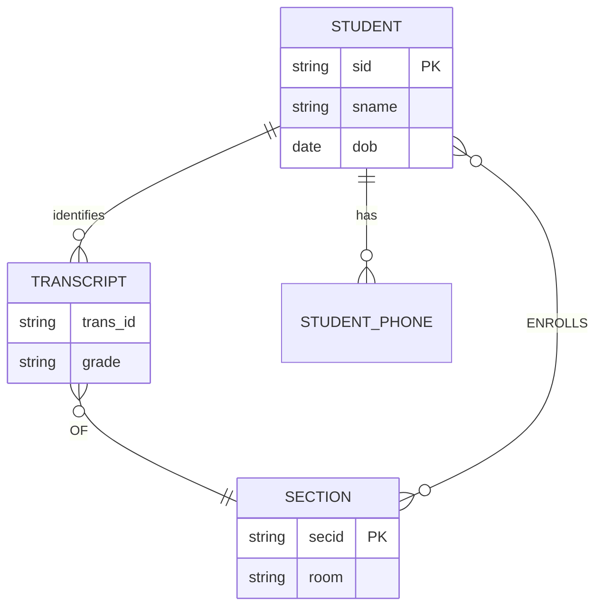
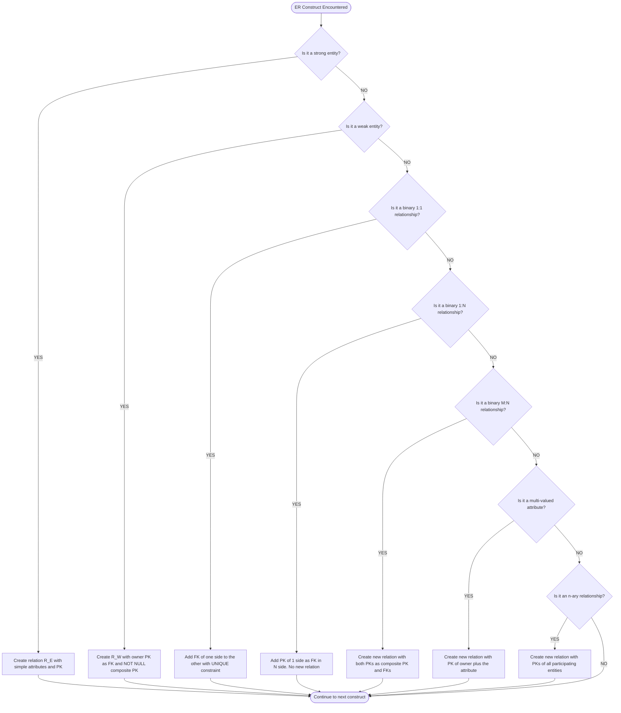
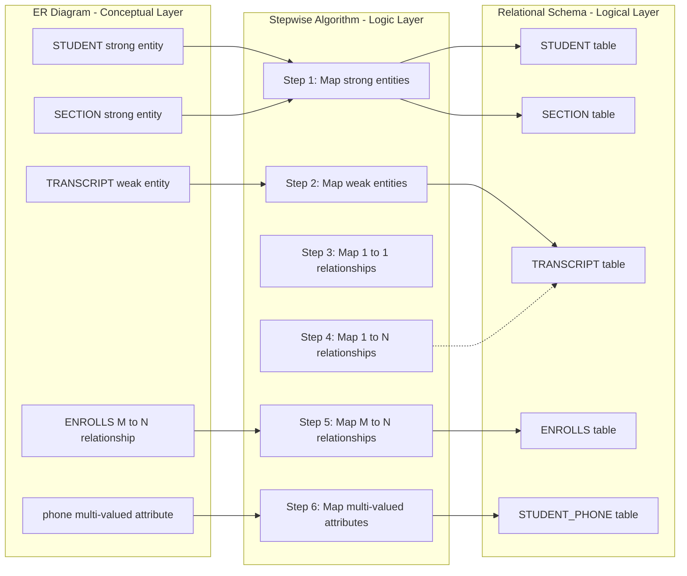
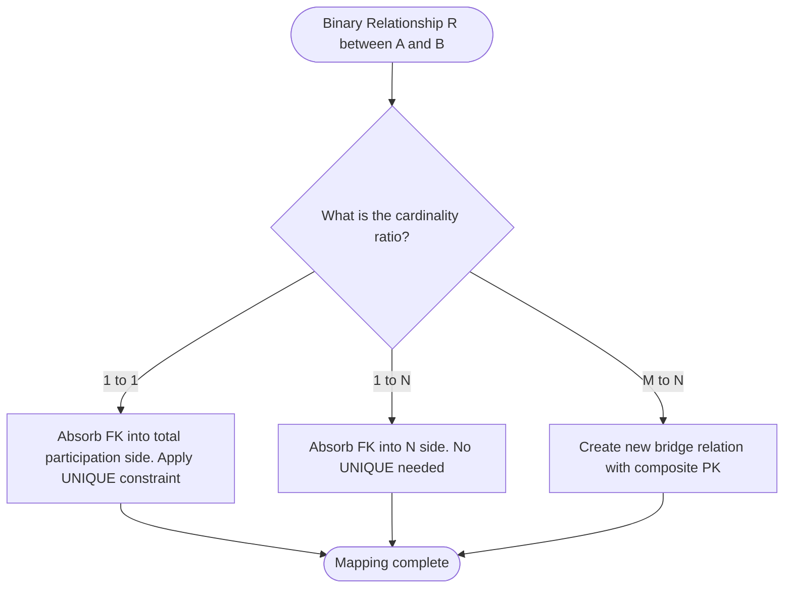
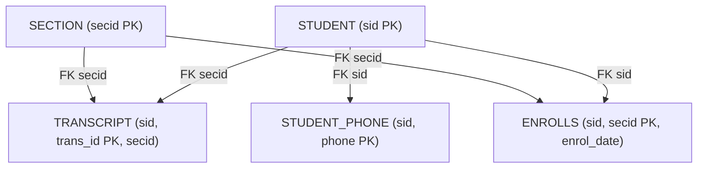

# ER-to-Relational Mapping: Mapping regular/weak entities, binary relationships, and multi-valued attributes

<!-- SECTION_1_START -->
# ER-to-Relational Mapping: Foundations & Intuitive Overview

## 1.1 Formal Academic Definition

**ER-to-Relational Mapping** is the formal, algorithmic translation procedure that converts a conceptual **Entity-Relationship (ER) diagram** — which is a high-level, semantic blueprint of a mini-world — into an equivalent **relational schema** consisting of a set of **relations (tables)**, **attributes (columns)**, **primary keys**, and **foreign keys**. This transformation is essential because ER models are excellent for *understanding* and *communicating* data requirements, while relational models are what is *actually implemented* in an **RDBMS** such as PostgreSQL, MySQL, or Oracle.

In KTU 2024 Scheme terminology, the mapping is taught as a **seven-step systematic algorithm** proposed originally by Elmasri & Navathe, where each step handles a specific ER construct:

1. Mapping of regular (strong) entity sets
2. Mapping of weak entity sets
3. Mapping of binary 1:1 relationship sets
4. Mapping of binary 1:N relationship sets
5. Mapping of binary M:N relationship sets
6. Mapping of multi-valued attributes
7. Mapping of higher-degree (ternary, n-ary) relationship sets

> [!IMPORTANT]
> **Syllabus Highlight (PCCST402 – Module 2):** The current module focuses on **Steps 1, 3, 4, 5, and 6** — i.e., regular entities, weak entities, all three binary cardinalities, and multi-valued attributes. The student must master both the **rule** and the **resulting relational schema** for each step.

## 1.2 Conceptual Analogy — The "Architect's Blueprint to House" Metaphor

Imagine you are an architect who has drawn a beautiful **blueprint** of a house. The blueprint shows rooms (entities), doors connecting rooms (relationships), and labels on the walls (attributes). A builder cannot construct the house from the blueprint alone — the builder needs a **material list with exact dimensions, lumber counts, and nail quantities** (a relational schema).

The blueprint is your **ER diagram** — semantically rich, visually intuitive, but not directly executable.
The material list is your **relational schema** — precise, structured, and ready for construction by the **RDBMS engine**.

**Mapping rules are the standard conversion table** that tells the architect: *every room in the blueprint becomes a table; every door becomes a foreign-key column; every room label becomes a column; double-doors (multi-valued attributes) get their own auxiliary storage room (a separate table).*

## 1.3 The Underlying Principle — Lossless & Dependency-Preserving

A correct ER-to-Relational mapping is **lossless-join**, meaning that joining the resulting tables on their foreign keys reconstructs the original ER information **without producing spurious tuples**. It is also **dependency-preserving**, meaning all functional dependencies of the original ER world remain enforceable via keys and constraints in the relational schema.

> [!NOTE]
> **Core Definition — Lossless-Join Decomposition:**
> A decomposition of relation $R$ into $R_1$ and $R_2$ is lossless if and only if the common attributes of $R_1$ and $R_2$ form a **key** for at least one of the relations. Formally:
>
> $$R_1 \cap R_2 \rightarrow R_1 \quad \text{or} \quad R_1 \cap R_2 \rightarrow R_2$$
>
> KTU examiners frequently test this property as a 3-mark Part A question after the mapping procedure.

## 1.4 Visual Concept — An ER Diagram in Action

Consider a tiny university mini-world with the following ER components:

> [!VISUALIZATION CONTROL]
> **Concept:** Canonical ER diagram for the Student–Course–Section mini-world (used throughout this note).
> **Visual Description:** A rectangle labelled **STUDENT** with oval attributes `sid`, `sname`, `dob`, and a double-lined oval `phone` (multi-valued). A rectangle **SECTION** with `secid`, `room`. A diamond **ENROLLS** connecting them (M:N). A double-lined rectangle **TRANSCRIPT** (weak entity) connected via identifying double-diamond **OF** to **SECTION**.

We will systematically transform this ER diagram into relational tables as we progress through Sections 2 and 3.

<!-- SECTION_1_END -->

<!-- SECTION_2_START -->
# Deep Theoretical Analysis & KTU High-Yield Formula Sheet

## 2.1 Step 1 — Mapping of Regular (Strong) Entity Sets

**Rule:** For each **strong entity set** $E$ in the ER diagram, create a relation $R$ that includes:
- All **simple (atomic) attributes** of $E$.
- The **primary key attribute(s)** of $E$ (which becomes the **primary key** of $R$).
- For **composite attributes**, include only their **constituent simple attributes** (do not create a column for the composite itself).

**Example:** `STUDENT(sid, sname, dob)` — where `sid` is the primary key.

## 2.2 Step 2 — Mapping of Weak Entity Sets

**Rule:** For each **weak entity set** $W$ with **owner entity set** $E$:
- Create a relation $R_W$ that includes all simple attributes of $W$.
- Include the **primary key of the owner** $E$ as a **foreign key** in $R_W$.
- The **primary key of $R_W$** is the **combination** of the owner's primary key and the **partial key (discriminator)** of $W$.
- A **foreign-key + NOT NULL** constraint enforces the **total participation** of $W$ in the identifying relationship.

**Example:** `TRANSCRIPT(trans_id, sid, secid, grade)` where `{trans_id, sid}` is the partial-key combo and `sid` is a foreign key referencing `STUDENT`.

> [!IMPORTANT]
> **Why does a weak entity get its own table instead of being merged with the owner?**
> Because weak entities often have **multiple instances per owner** (e.g., multiple transcripts per student). Merging would violate **1NF** and introduce multi-valued dependencies. The separate table preserves **lossless join** via the composite primary key.

## 2.3 Step 3 — Mapping of Binary 1:1 Relationship Sets

**Rule:** Given two entity sets $A$ and $B$ participating in a 1:1 relationship $R$ with attributes $\alpha_1, \alpha_2, \dots$:
- Identify the entity set with **total participation** (if one exists) — this is typically the **mandatory side**.
- Add the **primary key of the other side** as a **foreign key** in the relation of the **totally participating** side.
- Include the descriptive attributes $\alpha_i$ of $R$ as additional columns in the same relation.
- The foreign key must have a **UNIQUE** constraint (to enforce the 1:1 cardinality).

**Alternative (when neither side has total participation):** Either side may absorb the foreign key; this is a designer choice.

**Example:** Suppose `DEPARTMENT` (1) — (1) `OFFICE` via relationship `HAS_OFFICE`. Then:
- `DEPARTMENT(did, dname, office_id)` where `office_id` is a FK referencing `OFFICE` with `UNIQUE` constraint.

## 2.4 Step 4 — Mapping of Binary 1:N Relationship Sets

**Rule:** For a 1:N relationship $R$ between entity sets $A$ (the "1" side) and $B$ (the "N" side):
- **Do NOT create a new relation** for $R$.
- Add the **primary key of $A$** as a **foreign key** in the relation corresponding to $B$ (the "many" side).
- Include any descriptive attributes of $R$ as columns in $B$.

**Rationale:** Because each $B$ instance relates to at most one $A$ instance, the relationship can be encoded *inside* $B$ without violating 1NF. The cardinal ratio guarantees no multi-valued dependency.

**Example:** `STUDENT(sid, sname, dob, dept_id)` where `dept_id` is FK referencing `DEPARTMENT(did)`.

## 2.5 Step 5 — Mapping of Binary M:N Relationship Sets

**Rule:** For an M:N relationship $R$ between $A$ and $B$:
- **Create a NEW relation** $S$.
- Include the primary keys of **both** $A$ and $B$ as foreign keys in $S$.
- The **primary key of $S$** is the **combination** of these two foreign keys.
- Include any descriptive attributes of $R$ as columns in $S$.

**Example:** `ENROLLS(sid, secid, enrol_date)` with `PRIMARY KEY(sid, secid)`.

> [!CAUTION]
> **KTU Pitfall:** Students often forget to include descriptive attributes like `enrol_date` in the new M:N relation. Examiners deduct 2 marks specifically for this omission.

## 2.6 Step 6 — Mapping of Multi-Valued Attributes

**Rule:** For a multi-valued attribute $M$ of entity $E$ with primary key $pk$:
- **Create a NEW relation** $R_M$.
- Include the primary key $pk$ of $E$ as a foreign key in $R_M$.
- Include the multi-valued attribute $M$ as a column.
- The **primary key of $R_M$** is the **combination** $(pk, M)$.

**Example:** A student may have multiple `phone` numbers, so create:
`STUDENT_PHONE(sid, phone)` with `PRIMARY KEY(sid, phone)`.

## 2.7 KTU Formula Sheet — Master Mapping Rules Table

| # | ER Construct | Mapping Action | Primary Key of Resulting Relation | Foreign Keys Introduced | New Relation Created? |
|---|---|---|---|---|---|
| 1 | **Strong entity $E$** | Relation $R_E$ with all simple attributes | Primary key of $E$ | None | Yes (one per strong entity) |
| 2 | **Weak entity $W$** (owner $E$) | Relation $R_W$ with simple + partial-key attributes | $PK(E) \cup \text{partial\_key}(W)$ | $PK(E)$ with **NOT NULL** | Yes (one per weak entity) |
| 3 | **Binary 1:1** $R(A, B)$ | Add $PK$ of one side as FK in the other (prefer **total participation** side); add UNIQUE | Unchanged from entity relations | One FK with **UNIQUE** constraint | No |
| 4 | **Binary 1:N** $R(A, B)$ | Add $PK(A)$ as FK inside $R_B$ | Unchanged from $R_B$ | One FK in $R_B$ | No |
| 5 | **Binary M:N** $R(A, B)$ | New relation $R_S$ with $PK(A), PK(B), \text{attrs}(R)$ | $PK(A) \cup PK(B)$ | Two FKs referencing $A$ and $B$ | **Yes (mandatory)** |
| 6 | **Multi-valued attribute** $M$ of $E$ | New relation $R_M$ with $PK(E)$ and $M$ | $PK(E) \cup \{M\}$ | $PK(E)$ referencing $E$ | **Yes (mandatory)** |

## 2.8 Real-World Engineering Utility

In production engineering environments, this mapping algorithm is embedded inside **CASE tools** (e.g., Oracle Designer, IBM InfoSphere, ER/Studio, PowerDesigner, MySQL Workbench). When a database architect draws an ER diagram, the tool **auto-generates the corresponding SQL DDL** (`CREATE TABLE` statements) using exactly the rules above. Mastering these rules allows engineers to **debug** auto-generated schemas, **optimize** them by merging or splitting relations, and **reverse-engineer** legacy databases back into ER diagrams for documentation and modernization.

<!-- SECTION_2_END -->

<!-- SECTION_3_START -->
# Step-by-Step Derivations, Mappings & SQL Implementation

## 3.1 Canonical Worked Example — University Database ER Diagram

We will use the following ER diagram throughout this section. Read every attribute and cardinality carefully.

**Entities:**
- **STUDENT** (strong): attributes $\rightarrow$ `sid` (PK), `sname`, `dob`
- **SECTION** (strong): attributes $\rightarrow$ `secid` (PK), `room`
- **TRANSCRIPT** (weak, owner = STUDENT): partial key $\rightarrow$ `trans_id`; attribute $\rightarrow$ `grade`

**Relationships:**
- **ENROLLS** between STUDENT and SECTION, cardinality **M:N**, attribute $\rightarrow$ `enrol_date`
- **OF** between TRANSCRIPT and SECTION, identifying relationship, cardinality **N:1**

**Multi-valued attribute:**
- `phone` of STUDENT

**Reference ER Diagram (Mermaid):**



## 3.2 Derivation — Step 1: Mapping the Strong Entity STUDENT

**Logic:** Every strong entity becomes a relation. We include its simple attributes and designate its primary key.

**Relational Schema:**

$$\text{STUDENT}(\underline{\text{sid}}, \text{sname}, \text{dob})$$

Underline denotes the primary key.

**SQL DDL:**

```sql
CREATE TABLE STUDENT (
    sid   CHAR(10)     NOT NULL,
    sname VARCHAR(100) NOT NULL,
    dob   DATE         NOT NULL,
    CONSTRAINT pk_student PRIMARY KEY (sid)
);
```

## 3.3 Derivation — Step 1: Mapping the Strong Entity SECTION

**Logic:** Same rule applied to SECTION.

**Relational Schema:**

$$\text{SECTION}(\underline{\text{secid}}, \text{room})$$

**SQL DDL:**

```sql
CREATE TABLE SECTION (
    secid CHAR(10)     NOT NULL,
    room  VARCHAR(20)  NOT NULL,
    CONSTRAINT pk_section PRIMARY KEY (secid)
);
```

## 3.4 Derivation — Step 2: Mapping the Weak Entity TRANSCRIPT

**Logic:**
1. Create a new relation for TRANSCRIPT.
2. Include its own attribute `grade` and the partial key `trans_id`.
3. The owner STUDENT contributes its primary key `sid` as a foreign key.
4. The composite primary key is the union of the owner's PK and the partial key.

**Relational Schema:**

$$\text{TRANSCRIPT}(\underline{\text{sid}}, \underline{\text{trans\_id}}, \text{grade}, \text{secid})$$

**Key Reasoning:** A student can have many transcripts (one per section), and each transcript belongs to exactly one section. The partial key `trans_id` alone is **not unique** across the database — only within the context of a single `sid`. Hence the composite key.

**SQL DDL:**

```sql
CREATE TABLE TRANSCRIPT (
    sid      CHAR(10)    NOT NULL,
    trans_id CHAR(5)     NOT NULL,
    grade    CHAR(2),
    secid    CHAR(10)    NOT NULL,
    CONSTRAINT pk_transcript PRIMARY KEY (sid, trans_id),
    CONSTRAINT fk_transcript_student
        FOREIGN KEY (sid) REFERENCES STUDENT(sid)
        ON DELETE CASCADE
        ON UPDATE CASCADE,
    CONSTRAINT fk_transcript_section
        FOREIGN KEY (secid) REFERENCES SECTION(secid)
);
```

> [!NOTE]
> **Engineer's Note:** The `ON DELETE CASCADE` clause enforces **total participation** at the DBMS level: if a STUDENT tuple is deleted, all dependent TRANSCRIPT tuples are automatically removed, preventing dangling references and preserving referential integrity.

## 3.5 Derivation — Step 3: Mapping the 1:1 Relationship (Hypothetical)

Suppose we have an additional relationship `OFFICE_ASSIGNMENT` between `DEPARTMENT` (1) and `FACULTY` (1) with attribute `since_date`. DEPARTMENT has total participation.

**Logic:**
1. Choose the side with total participation (DEPARTMENT) to absorb the foreign key.
2. Add `fid` (PK of FACULTY) to DEPARTMENT as a UNIQUE foreign key.
3. Add `since_date` to DEPARTMENT.

**Relational Schema:**

$$\text{DEPARTMENT}(\underline{\text{did}}, \text{dname}, \text{fid}^{\text{UNIQUE}}, \text{since\_date})$$

$$\text{FACULTY}(\underline{\text{fid}}, \text{fname})$$

**SQL DDL:**

```sql
CREATE TABLE DEPARTMENT (
    did        CHAR(10)     NOT NULL,
    dname      VARCHAR(100) NOT NULL,
    fid        CHAR(10)     NOT NULL UNIQUE,
    since_date DATE         NOT NULL,
    CONSTRAINT pk_department PRIMARY KEY (did),
    CONSTRAINT fk_dept_faculty FOREIGN KEY (fid) REFERENCES FACULTY(fid)
);
```

## 3.6 Derivation — Step 4: Mapping the 1:N Relationship (TRANSCRIPT – SECTION)

The identifying relationship **OF** between TRANSCRIPT (N) and SECTION (1) is a 1:N relationship.

**Logic:**
1. Identify the "many" side: TRANSCRIPT.
2. Identify the "one" side: SECTION.
3. Add `secid` (PK of SECTION) as a foreign key inside TRANSCRIPT — **which we already did in Step 3.4** because the identifying relationship's FK was absorbed there.
4. Descriptive attributes of OF (none in this example) would be added to TRANSCRIPT.

**Conclusion:** No new relation is needed. The mapping of Step 3.4 already satisfies Step 4.

## 3.7 Derivation — Step 5: Mapping the M:N Relationship ENROLLS

**Logic:**
1. A student may enrol in many sections, and a section may contain many students — this is M:N.
2. Create a brand-new relation `ENROLLS`.
3. Foreign keys: `sid` referencing STUDENT, `secid` referencing SECTION.
4. Primary key: composite of both.
5. Descriptive attribute `enrol_date` must be included.

**Relational Schema:**

$$\text{ENROLLS}(\underline{\text{sid}}, \underline{\text{secid}}, \text{enrol\_date})$$

**SQL DDL:**

```sql
CREATE TABLE ENROLLS (
    sid        CHAR(10) NOT NULL,
    secid      CHAR(10) NOT NULL,
    enrol_date DATE     NOT NULL,
    CONSTRAINT pk_enrolls PRIMARY KEY (sid, secid),
    CONSTRAINT fk_enrolls_student
        FOREIGN KEY (sid) REFERENCES STUDENT(sid),
    CONSTRAINT fk_enrolls_section
        FOREIGN KEY (secid) REFERENCES SECTION(secid)
);
```

## 3.8 Derivation — Step 6: Mapping the Multi-Valued Attribute `phone`

**Logic:**
1. `phone` is multi-valued — a single student can have 0, 1, or many phone numbers.
2. 1NF prohibits storing multiple values in a single column.
3. Create a new relation `STUDENT_PHONE` with `sid` (FK) and `phone`.
4. Composite primary key.

**Relational Schema:**

$$\text{STUDENT\_PHONE}(\underline{\text{sid}}, \underline{\text{phone}})$$

**SQL DDL:**

```sql
CREATE TABLE STUDENT_PHONE (
    sid   CHAR(10)    NOT NULL,
    phone VARCHAR(15) NOT NULL,
    CONSTRAINT pk_student_phone PRIMARY KEY (sid, phone),
    CONSTRAINT fk_phone_student
        FOREIGN KEY (sid) REFERENCES STUDENT(sid)
        ON DELETE CASCADE
);
```

## 3.9 Final Consolidated Relational Schema

After applying all six steps, our mini-world is represented by **five relations**:

$$
\begin{aligned}
\text{STUDENT}(\underline{\text{sid}}, \text{sname}, \text{dob}) \\
\text{SECTION}(\underline{\text{secid}}, \text{room}) \\
\text{TRANSCRIPT}(\underline{\text{sid}}, \underline{\text{trans\_id}}, \text{grade}, \text{secid}) \\
\text{ENROLLS}(\underline{\text{sid}}, \underline{\text{secid}}, \text{enrol\_date}) \\
\text{STUDENT\_PHONE}(\underline{\text{sid}}, \underline{\text{phone}})
\end{aligned}
$$

> [!TIP]
> **Verification Checklist for the Student:**
> - Number of strong entities = Number of base relations $\rightarrow$ 2 (STUDENT, SECTION). ✓
> - Number of weak entities = Additional relations $\rightarrow$ 1 (TRANSCRIPT). ✓
> - Number of M:N relationships = Additional relations $\rightarrow$ 1 (ENROLLS). ✓
> - Number of multi-valued attributes = Additional relations $\rightarrow$ 1 (STUDENT\_PHONE). ✓
> - Number of 1:1 and 1:N relationships = NO new relations (absorbed as FKs). ✓
>
> **Total relations = 2 + 1 + 1 + 1 = 5.** ✓

## 3.10 Lossless-Join Verification (Using Common-Attribute Theorem)

For the most complex case — the TRANSCRIPT relation and its owner STUDENT — let us verify lossless join.

Decomposition: STUDENT $\cap$ TRANSCRIPT = $\{$ sid $\}$.

The FD: $\text{sid} \rightarrow \text{sname}, \text{dob}$ (because `sid` is the PK of STUDENT).

Therefore, $\text{sid} \rightarrow \text{STUDENT}$, satisfying the lossless-join theorem. Similarly for the other relations, the FK-PK intersections guarantee lossless joins across the entire schema.

<!-- SECTION_3_END -->

<!-- SECTION_4_START -->
# Structural Diagrams & Schematics

## 4.1 Master Mapping Flowchart — The ER-to-Relational Decision Tree

The following Mermaid flowchart shows the **decision logic** a designer (or an examiner's marking scheme) follows when classifying each ER construct and choosing the correct mapping action.



## 4.2 Sequential Processing Topology — Mapping the University ER Schema

This diagram illustrates the **order in which relations are produced** when the seven-step algorithm is executed on the canonical university ER diagram.



## 4.3 Cardinality Decision Matrix (Block-Level View)



## 4.4 Resulting Schema — Star-Style Relationship View



> [!NOTE]
> **Reading the Star Diagram:** Central entity STUDENT radiates foreign-key references to its satellite relations. SECTION is shared between TRANSCRIPT and ENROLLS, which is why the diagram is **partially star, partially mesh**.

<!-- SECTION_4_END -->

<!-- SECTION_5_START -->
# KTU 2024 Scheme Examination Question Bank & Topic Recap

---

## Part A — Short Answer Questions (3 Marks Each)

### Question 1: Define Multi-Valued Attribute. How is it mapped to a relational schema?
**`[KTU University Exam — July 2024]`** &nbsp;&nbsp; **CO2 &nbsp; | &nbsp; Remember**

**Model Answer (3 Marks):**

A **multi-valued attribute** is an attribute that can hold **multiple independent values** for a single entity instance. In ER notation, it is depicted by a **double-lined oval**.

**Mapping Rule:**
1. Create a new relation $R$ containing the primary key of the owner entity and the multi-valued attribute itself.
2. The primary key of $R$ is the **combination** of the owner entity's PK and the multi-valued attribute.

**Example:** A STUDENT may have multiple `phone` numbers:

$$\text{STUDENT\_PHONE}(\underline{\text{sid}}, \underline{\text{phone}})$$

**[Valuation Key: Definition 1 Mark + Mapping Rule 1 Mark + Example 1 Mark = 3 Marks]**

---

### Question 2: What is the role of a foreign key when mapping a 1:N binary relationship?
**`[KTU University Exam — Dec 2023]`** &nbsp;&nbsp; **CO2 &nbsp; | &nbsp; Understand**

**Model Answer (3 Marks):**

In a **1:N binary relationship** $R$ between entity $A$ (1-side) and $B$ (N-side), the foreign key plays a **structural encoding role**:

1. The **primary key of the 1-side entity $A$** is added as a **foreign key column** inside the relation corresponding to the **N-side entity $B$**.
2. This single column **encodes the relationship** without requiring a new table.
3. The cardinal ratio (1:N) guarantees that each tuple in $B$ references **at most one** tuple in $A$, so no multi-valued dependency arises.

**Example:** `STUDENT(sid, sname, dept_id)` where `dept_id` is a foreign key referencing `DEPARTMENT(did)`.

**[Valuation Key: FK role explained 1 Mark + Why no new table 1 Mark + Example 1 Mark = 3 Marks]**

---

## Part B — Long Answer Questions (14 Marks Each, with Internal Choice)

### Question A: ER-to-Relational Mapping for Library Database
**`[KTU University Exam — Dec 2024]`** &nbsp;&nbsp; **CO2, CO3 &nbsp; | &nbsp; Apply, Analyze**

Consider the following ER diagram for a **Library Management System**:

- **BOOK** (strong entity): attributes $\rightarrow$ `ISBN` (PK), `title`, `price`
- **PUBLISHER** (strong entity): attributes $\rightarrow$ `pub_id` (PK), `pname`, `city`
- **AUTHOR** (strong entity): attributes $\rightarrow$ `auth_id` (PK), `aname`
- **PUBLISHES** between BOOK and PUBLISHER, cardinality **1:N** (one publisher publishes many books, each book has exactly one publisher)
- **WRITTEN_BY** between BOOK and AUTHOR, cardinality **M:N**, attribute $\rightarrow$ `royalty_pct`
- **COPIES** (weak entity, owner = BOOK): partial key $\rightarrow$ `copy_no`; attribute $\rightarrow$ `shelf_location`
- Multi-valued attribute $\rightarrow$ `genre` of BOOK

**Tasks:**
**(a)** Map the entire ER diagram to a relational schema. Clearly state the primary keys and foreign keys for every relation. **[7 Marks]**

**(b)** Write the complete SQL DDL (`CREATE TABLE` statements) for **all** resulting relations, including all primary-key, foreign-key, NOT NULL, and UNIQUE constraints. **[7 Marks]**

#### Model Solution

### Part (a) — Relational Schema Mapping [7 Marks]

**Step 1: Map Strong Entities**

$$
\begin{aligned}
\text{BOOK}(\underline{\text{ISBN}}, \text{title}, \text{price}) \\
\text{PUBLISHER}(\underline{\text{pub\_id}}, \text{pname}, \text{city}) \\
\text{AUTHOR}(\underline{\text{auth\_id}}, \text{aname})
\end{aligned}
$$

**[Stating three strong-entity relations with their PKs: 1 Mark]**

**Step 2: Map Weak Entity COPIES**

$$\text{COPIES}(\underline{\text{ISBN}}, \underline{\text{copy\_no}}, \text{shelf\_location})$$

Where `ISBN` is a foreign key referencing BOOK and **NOT NULL**, and the composite primary key is `(ISBN, copy_no)`.

**[Identifying weak entity rule and applying composite key: 1 Mark]**

**Step 3: Map 1:N Relationship PUBLISHES**

No new relation. Add `pub_id` as a foreign key inside BOOK:

$$\text{BOOK}(\underline{\text{ISBN}}, \text{title}, \text{price}, \text{pub\_id})$$

**[1:N mapping absorbed as FK: 1 Mark]**

**Step 4: Map M:N Relationship WRITTEN_BY**

$$\text{WRITTEN\_BY}(\underline{\text{ISBN}}, \underline{\text{auth\_id}}, \text{royalty\_pct})$$

Where `ISBN` references BOOK and `auth_id` references AUTHOR.

**[M:N new bridge relation with descriptive attribute: 2 Marks]**

**Step 5: Map Multi-Valued Attribute `genre`**

$$\text{BOOK\_GENRE}(\underline{\text{ISBN}}, \underline{\text{genre}})$$

**[Multi-valued attribute mapped as separate table: 1 Mark]**

**Final Consolidated Schema:**

$$
\begin{aligned}
&\text{BOOK}(\underline{\text{ISBN}}, \text{title}, \text{price}, \text{pub\_id}) \\
&\text{PUBLISHER}(\underline{\text{pub\_id}}, \text{pname}, \text{city}) \\
&\text{AUTHOR}(\underline{\text{auth\_id}}, \text{aname}) \\
&\text{COPIES}(\underline{\text{ISBN}}, \underline{\text{copy\_no}}, \text{shelf\_location}) \\
&\text{WRITTEN\_BY}(\underline{\text{ISBN}}, \underline{\text{auth\_id}}, \text{royalty\_pct}) \\
&\text{BOOK\_GENRE}(\underline{\text{ISBN}}, \underline{\text{genre}})
\end{aligned}
$$

**[Final schema boxed: 1 Mark]**

### Part (b) — Complete SQL DDL [7 Marks]

```sql
-- Table 1: PUBLISHER (no dependencies, created first)
CREATE TABLE PUBLISHER (
    pub_id CHAR(10)     NOT NULL,
    pname  VARCHAR(100) NOT NULL,
    city   VARCHAR(50)  NOT NULL,
    CONSTRAINT pk_publisher PRIMARY KEY (pub_id)
);

-- Table 2: BOOK (depends on PUBLISHER)
CREATE TABLE BOOK (
    ISBN   CHAR(13)     NOT NULL,
    title  VARCHAR(200) NOT NULL,
    price  DECIMAL(8,2) NOT NULL CHECK (price > 0),
    pub_id CHAR(10)     NOT NULL,
    CONSTRAINT pk_book PRIMARY KEY (ISBN),
    CONSTRAINT fk_book_publisher
        FOREIGN KEY (pub_id) REFERENCES PUBLISHER(pub_id)
        ON DELETE RESTRICT
        ON UPDATE CASCADE
);

-- Table 3: AUTHOR (independent)
CREATE TABLE AUTHOR (
    auth_id CHAR(10)     NOT NULL,
    aname   VARCHAR(100) NOT NULL,
    CONSTRAINT pk_author PRIMARY KEY (auth_id)
);

-- Table 4: COPIES (weak entity, depends on BOOK)
CREATE TABLE COPIES (
    ISBN           CHAR(13)    NOT NULL,
    copy_no        INT         NOT NULL,
    shelf_location VARCHAR(50) NOT NULL,
    CONSTRAINT pk_copies PRIMARY KEY (ISBN, copy_no),
    CONSTRAINT fk_copies_book
        FOREIGN KEY (ISBN) REFERENCES BOOK(ISBN)
        ON DELETE CASCADE
        ON UPDATE CASCADE
);

-- Table 5: WRITTEN_BY (M:N bridge, depends on BOOK and AUTHOR)
CREATE TABLE WRITTEN_BY (
    ISBN        CHAR(13)     NOT NULL,
    auth_id     CHAR(10)     NOT NULL,
    royalty_pct DECIMAL(5,2) NOT NULL CHECK (royalty_pct BETWEEN 0 AND 100),
    CONSTRAINT pk_written_by PRIMARY KEY (ISBN, auth_id),
    CONSTRAINT fk_wb_book  FOREIGN KEY (ISBN) REFERENCES BOOK(ISBN),
    CONSTRAINT fk_wb_author FOREIGN KEY (auth_id) REFERENCES AUTHOR(auth_id)
);

-- Table 6: BOOK_GENRE (multi-valued attribute, depends on BOOK)
CREATE TABLE BOOK_GENRE (
    ISBN  CHAR(13)    NOT NULL,
    genre VARCHAR(30) NOT NULL,
    CONSTRAINT pk_book_genre PRIMARY KEY (ISBN, genre),
    CONSTRAINT fk_bg_book FOREIGN KEY (ISBN) REFERENCES BOOK(ISBN)
        ON DELETE CASCADE
);
```

**[Valuation Key: Correct table creation order with dependency handling 2 Marks + All 6 tables with PKs 2 Marks + All FKs with correct referential actions 2 Marks + CHECK constraints and NOT NULLs 1 Mark = 7 Marks]**

---

### Question B (Internal Choice Alternative): Hospital Database Mapping
**`[KTU University Exam — July 2023]`** &nbsp;&nbsp; **CO2, CO3 &nbsp; | &nbsp; Apply, Analyze**

Consider a **Hospital Database** with the following ER constructs:

- **PATIENT** (strong): `pid` (PK), `pname`, `age`
- **DOCTOR** (strong): `doc_id` (PK), `dname`, `specialization`
- **TREATS** between DOCTOR and PATIENT, cardinality **1:N** (a patient is treated by exactly one doctor, but a doctor treats many patients)
- **WARD** (strong): `ward_id` (PK), `ward_name`, `capacity`
- **ADMITTED_TO** between PATIENT and WARD, cardinality **M:N**, attribute $\rightarrow$ `admit_date`, `discharge_date`
- **DEPENDENT** (weak, owner = DOCTOR): partial key $\rightarrow$ `dep_name`; attributes $\rightarrow$ `relation`, `age`
- Multi-valued attribute $\rightarrow$ `phone` of PATIENT

**Tasks:**
**(a)** Derive the complete relational schema from the given ER diagram, identifying primary keys, foreign keys, and the cardinality of each mapped relationship. **[7 Marks]**

**(b)** For the M:N relationship ADMITTED_TO, write the SQL DDL with appropriate constraints and explain how the **lossless-join property** is preserved. **[7 Marks]**

#### Model Solution Outline

### Part (a) — Schema Derivation [7 Marks]

**Strong entities:**
$$\text{PATIENT}(\underline{\text{pid}}, \text{pname}, \text{age}, \text{doc\_id})$$

$$\text{DOCTOR}(\underline{\text{doc\_id}}, \text{dname}, \text{specialization})$$

$$\text{WARD}(\underline{\text{ward\_id}}, \text{ward\_name}, \text{capacity})$$

**TREATS (1:N)** $\rightarrow$ `doc_id` absorbed as FK inside PATIENT (shown above). **[1 Mark]**

**ADMITTED_TO (M:N) bridge relation:**
$$\text{ADMITTED\_TO}(\underline{\text{pid}}, \underline{\text{ward\_id}}, \text{admit\_date}, \text{discharge\_date})$$

**[M:N new relation with descriptive attributes: 2 Marks]**

**DEPENDENT (weak entity, owner = DOCTOR):**
$$\text{DEPENDENT}(\underline{\text{doc\_id}}, \underline{\text{dep\_name}}, \text{relation}, \text{age})$$

**[Weak entity composite key + FK: 1 Mark]**

**Multi-valued `phone`:**
$$\text{PATIENT\_PHONE}(\underline{\text{pid}}, \underline{\text{phone}})$$

**[Multi-valued table: 1 Mark]**

### Part (b) — SQL DDL for ADMITTED_TO + Lossless-Join Proof [7 Marks]

```sql
CREATE TABLE ADMITTED_TO (
    pid            CHAR(10) NOT NULL,
    ward_id        CHAR(10) NOT NULL,
    admit_date     DATE     NOT NULL,
    discharge_date DATE,
    CONSTRAINT pk_admitted_to PRIMARY KEY (pid, ward_id),
    CONSTRAINT fk_at_patient FOREIGN KEY (pid) REFERENCES PATIENT(pid),
    CONSTRAINT fk_at_ward    FOREIGN KEY (ward_id) REFERENCES WARD(ward_id),
    CONSTRAINT chk_dates CHECK (discharge_date IS NULL OR discharge_date >= admit_date)
);
```

**Lossless-Join Proof:**

Consider the decomposition when we join `ADMITTED_TO` with `PATIENT`:

$$\text{ADMITTED\_TO} \cap \text{PATIENT} = \{\text{pid}\}$$

Since `pid` is the **primary key of PATIENT**, the FD `pid` $\rightarrow$ `pname, age, doc_id` holds. Therefore:

$$\text{pid} \rightarrow \text{PATIENT}$$

By the **Heath's Theorem / common-attribute lossless-join criterion**, the join `ADMITTED_TO ⋈ PATIENT` is lossless. Similarly for `ADMITTED_TO ⋈ WARD` on `ward_id`.

**[Valuation Key: Correct DDL 3 Marks + Intersection identified 1 Mark + FD statement 2 Marks + Lossless conclusion 1 Mark = 7 Marks]**

---

> [!WARNING]
> **KTU Examiner's Valuation Pitfall Callout:**
>
> 1. **Forgetting descriptive attributes:** When mapping a 1:1, 1:N, or M:N relationship with attributes (e.g., `admit_date` in ADMITTED_TO), students often create the FK or bridge table but **omit the descriptive attributes**. Deducted: **2 Marks**.
>
> 2. **Missing UNIQUE on 1:1 FKs:** In a 1:1 relationship, the foreign key column on either side must have a **UNIQUE** constraint. Omitting this allows two rows on the other side to reference the same row, effectively converting the cardinality to 1:N — a logic error. Deducted: **1 Mark**.
>
> 3. **Weak entity PK error:** Students often make the partial key alone the primary key of a weak entity, or forget the FK to the owner. The PK **must** be the composite of owner PK + partial key. Deducted: **2 Marks**.
>
> 4. **Multi-valued attribute left as a single column:** Storing `phone = '9876543210, 9123456789'` in one column **violates 1NF**. Always create a separate table. Deducted: **2 Marks**.
>
> 5. **Not writing the order of CREATE TABLE statements:** Foreign keys must reference existing tables. Students who write `BOOK` before `PUBLISHER` in DDL get DDL execution errors during lab exams. Deducted: **1 Mark**.

---

## Topic Recap & Important Things to Remember

- **ER-to-Relational mapping is a seven-step systematic algorithm.** Module 2 of PCCST402 covers the first six steps: strong entity, weak entity, binary 1:1, binary 1:N, binary M:N, and multi-valued attribute.
- **Strong entities always produce their own table.** Primary key = original entity's primary key. No foreign keys introduced.
- **Weak entities always produce their own table.** Primary key = owner's PK + partial key. Owner's PK is a foreign key with **NOT NULL** to enforce total participation.
- **1:1 relationships do NOT produce a new table.** The foreign key is added to the entity side with **total participation** (or any side if neither is total). The FK must have a **UNIQUE** constraint.
- **1:N relationships do NOT produce a new table.** The FK is added to the **N-side** entity's table. No UNIQUE constraint needed.
- **M:N relationships ALWAYS produce a new bridge table.** The PK is the composite of both participating entities' PKs. Both are foreign keys. Descriptive attributes of the relationship go into this table.
- **Multi-valued attributes ALWAYS produce a new table.** The PK is the composite of the owner's PK and the multi-valued attribute. This is essential to comply with **1NF**.
- **Lossless-join property** is preserved if, for every decomposition, the common attributes form a key for at least one of the relations: $R_1 \cap R_2 \rightarrow R_1$ or $R_1 \cap R_2 \rightarrow R_2$.
- **Referential integrity actions** (`ON DELETE CASCADE`, `ON DELETE RESTRICT`, etc.) should be specified for all foreign keys during DDL generation.
- **Composite attributes** in ER are flattened: only their constituent simple attributes appear as columns; the composite name itself is **not** a column.
- **Designer discretion applies only to 1:1 mappings** when neither side has total participation — all other mappings are deterministic.
- **Order of DDL execution matters:** Create parent (referenced) tables **before** child (referencing) tables to avoid foreign-key constraint violations during schema creation.
- **Final relation count formula:** For an ER diagram with $S$ strong entities, $W$ weak entities, $B_{MN}$ M:N relationships, and $M$ multi-valued attributes, the total number of relations is:

$$N_{\text{relations}} = S + W + B_{MN} + M$$

The 1:1 and 1:N relationships contribute **zero** new relations.

<!-- SECTION_5_END -->
