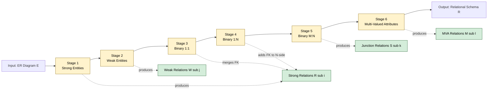
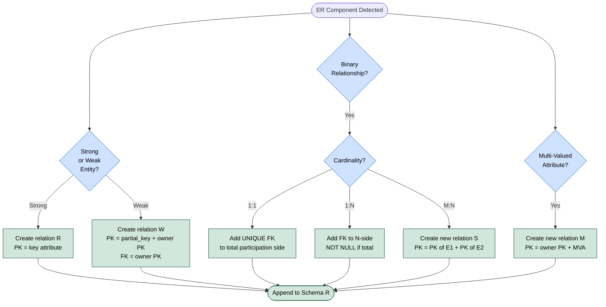
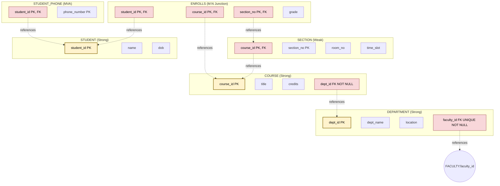

# ER-to-Relational Mapping: Mapping regular/weak entities, binary relationships, and multi-valued attributes

<!-- SECTION_1_START -->

# ER-to-Relational Mapping

## 1.1 Formal Definition (KTU 2024 Syllabus Terminology)

**ER-to-Relational Mapping** is the systematic, algorithmic procedure used during the logical design phase of a database to translate the conceptual schema described by an **Entity-Relationship (ER) Diagram** into an equivalent **Relational Schema** (a collection of valid relations / tables). The mapping must preserve the **semantics**, **constraints** (keys, cardinalities, participation), and **structural integrity** of the original ER model.

In the KTU 2024 Scheme (PCCST402) syllabus, this procedure is covered under Module 2 and forms the direct precursor to writing **SQL DDL** (`CREATE TABLE`) statements.

> [!IMPORTANT]
> **Core Mapping Guarantee:** Every valid ER diagram $E$ must be transformed into an equivalent relational schema $R$ such that every instance $r$ of $R$ preserves the information and constraints of some instance $e$ of $E$, and vice-versa. This is called **information preservation** under the mapping $\mathcal{M} : E \rightarrow R$.

### 1.2 Conceptual Analogy — The "Architect's Blueprint" Intuition

Imagine the **ER Diagram** as the **architect's blueprint** of a building, drawn with rectangles, diamonds, and ovals (visual, conceptual). The **Relational Schema** is the **civil engineer's actual construction plan**, written in strict tabular form with columns, rows, and load-bearing constraints.

- The **architect** thinks in *objects* (rooms, doors, people).
- The **civil engineer** must convert these into *load-bearing structures* (tables, columns, foreign keys).
- Just as a stair must be reinforced as a *staircase-slab* and *support beam* in the construction plan, an ER *entity* must be reinforced as a *relation* with a *primary key* in the relational schema.

The rules covered in this note are the **standard conversion codes** — the exact "translation dictionary" between blueprint and construction.

> [!NOTE]
> **Standard Reference:** The mapping rules followed in KTU are those formally stated by **Elmasri & Navathe** (Chapter 7, *Fundamentals of Database Systems*). These are the textbook rules used in the KTU board valuation keys.

### 1.3 Key Components of an ER Model (Quick Recap)

- **Regular (Strong) Entity:** An entity that has its own independent existence and a unique primary key (e.g., `Student`, `Course`).
- **Weak Entity:** An entity that cannot be uniquely identified by its own attributes alone; it depends on a **strong (owner) entity** for identification (e.g., `Section` depends on `Course`, `Dependent` depends on `Employee`).
- **Binary Relationship:** A relationship connecting exactly **two** entity sets. Cardinalities are $1:1$, $1:N$, or $M:N$.
- **Multi-Valued Attribute (MVA):** An attribute that can hold **multiple values** for a single entity instance (e.g., a student may have multiple `phone_number`s).

### 1.4 Standard Metrics and Symbols

| Symbol | Meaning |
|---|---|
| **PK** | Primary Key |
| **FK** | Foreign Key |
| **PK, FK** | Composite / Partial Key (used in weak entities) |
| **U** | Unique constraint |
| **NOT NULL** | Total participation enforcement |

> [!VISUALIZATION CONTROL]
> **Concept:** ER-to-Relational mapping flow (Pipeline view)
> **GeoGebra / Desmos Input Equations:** *Not applicable (discrete mapping pipeline)*
> **Visual Description:** Picture a left-to-right pipeline. On the left sits the ER diagram (rectangles for entities, diamonds for relationships, ovals for attributes, double-ovals for multi-valued attributes, double-rectangles for weak entities). On the right sits the relational schema — a stack of named tables with columns, primary keys (underlined), and foreign keys (dashed arrows). The mapping rules act as the **conveyor belt** carrying each component from left to right.

---

<!-- SECTION_1_END -->

<!-- SECTION_2_START -->

# Deep Theoretical Analysis & KTU High-Yield Formula Sheet

## 2.1 The Six-Stage Mapping Pipeline

The translation from an ER diagram to a relational schema is executed in **six ordered stages**. Each stage produces a specific set of relational structures.

1. **Stage 1 — Regular (Strong) Entities:** Create one relation $R$ for every strong entity.
2. **Stage 2 — Weak Entities:** Create one relation $W$ for every weak entity, including the **owner's PK as FK** and forming a **composite PK** of partial-key + owner's PK.
3. **Stage 3 — Binary 1:1 Relationships:** Combine with one side (preferably the side with **total participation**) using FK.
4. **Stage 4 — Binary 1:N Relationships:** Place FK on the **"N" side** referencing the "1" side.
5. **Stage 5 — Binary M:N Relationships:** Create a **new dedicated relation** $S$ with FKs to both participating entities (FKs together form the composite PK).
6. **Stage 6 — Multi-Valued Attributes:** Create a **new relation $M$** containing the FK to the owner entity and the MVA; (FK, MVA) together form the composite PK.

> [!TIP]
> **Examiner Heuristic:** KTU questions are often phrased as *"Map the given ER diagram to a relational schema."* You are expected to produce the final list of relations (names + attributes + keys + FKs). You do **not** need to write full `CREATE TABLE` SQL unless specifically asked.

## 2.2 KTU High-Yield Formula Sheet / Cheat Sheet

| # | ER Component | Mapping Rule | Relation Structure | Primary Key |
|---|---|---|---|---|
| 1 | **Regular (Strong) Entity** $E$ with simple attributes $A_1, A_2, \dots, A_n$ | One relation $R$ | $R(A_1, A_2, \dots, A_n)$ | $\text{PK}(R) = A_i$ (the key attribute) |
| 2 | **Weak Entity** $W$ with partial key $p$ and owner $E$ | One relation $W$; include owner's PK as FK | $W(p, A_1, A_2, \dots, \text{PK of } E)$ | $\text{PK}(W) = \{p, \text{PK}(E)\}$ (composite) |
| 3 | **Binary 1:1 Relationship** $R$ between $E_1$ and $E_2$ | Add FK to either side (preferably total participation side) | Merge with one side | FK must be **UNIQUE** + **NOT NULL** |
| 4 | **Binary 1:N Relationship** $R$ from $E_1$ (1-side) to $E_2$ (N-side) | Add FK on the **N-side** | Extend $E_2$'s relation | FK is NOT NULL if **total participation** of $E_2$ |
| 5 | **Binary M:N Relationship** $R$ between $E_1$ and $E_2$, with descriptive attribute $A$ | New dedicated relation $S$ | $S(\text{PK of } E_1, \text{PK of } E_2, A, \dots)$ | $\text{PK}(S) = \{\text{PK}(E_1), \text{PK}(E_2)\}$ |
| 6 | **Multi-Valued Attribute** $M$ of entity $E$ | New relation $M$ | $M(\text{PK of } E, M)$ | $\text{PK}(M) = \{\text{PK}(E), M\}$ |
| 7 | **N-ary / Unary / Ternary** | (Out of scope for this note; reserved for higher modules) | — | — |

> [!WARNING]
> **Pipe Character Rule in Tables:** All cardinality labels inside table cells use the form `1:1`, `1:N`, `M:N` (colon-separated, **no vertical pipe `|`**) to prevent markdown table parser breakage.

## 2.3 Engineering Utility of ER-to-Relational Mapping

In real-world production engineering, this mapping is the **core step** in the **logical design** phase of any database application. The mapped relational schema is then handed off to:

- **SQL DDL Generators** (e.g., Hibernate, SQLAlchemy ORM) that auto-generate `CREATE TABLE` scripts.
- **Database Migration Tools** (Flyway, Liquibase) used in DevOps pipelines.
- **Schema Validators** that enforce referential integrity, foreign-key cascades, and uniqueness.

> A flawed ER-to-Relational mapping in this stage propagates into **data anomalies, redundancy, and integrity violations** for the entire application lifecycle.

---

<!-- SECTION_2_END -->

<!-- SECTION_3_START -->

# Step-by-Step Derivations and Code/Symbolic Implementation

## 3.1 Reference Example ER Diagram (Used Throughout This Note)

Consider the following **University ER Diagram** as the running example:

**Entities:**

- **Department** *(strong)* with attributes: `dept_id` (PK), `dept_name`, `location`.
- **Course** *(strong)* with attributes: `course_id` (PK), `title`, `credits`.
- **Section** *(weak entity)* with partial key `section_no`; owner is `Course`.
- **Student** *(strong)* with attributes: `student_id` (PK), `name`, `dob`, and a **multi-valued attribute** `phone_number`.

**Relationships:**

- **Offers** ($1:N$): One **Department** offers many **Courses**.
- **Enrolls** ($M:N$): Many **Students** enroll in many **Sections**; descriptive attribute `grade`.
- **Manages** ($1:1$): One **Department** is managed by one **Faculty** *(additional entity, introduced just for 1:1 demo)*.

> For simplicity and KTU alignment, this note will use the four core rules from the topic scope: *regular entity, weak entity, binary relationships, multi-valued attribute*.

---

## 3.2 Stage 1 — Mapping a Regular (Strong) Entity

### 3.2.1 Rule (Formal)

For every regular (strong) entity type $E$ with simple attributes $\{A_1, A_2, \dots, A_n\}$, create a relation $R$ that includes all the simple attributes. Choose one of the key attributes of $E$ as the **primary key** of $R$.

### 3.2.2 Applied to Example

**Entity: `Department`**

- Simple attributes: `dept_id`, `dept_name`, `location`.
- Key attribute: `dept_id`.

**Mapped Relation:**

$$
\text{Department}(\underline{\text{dept\_id}},\; \text{dept\_name},\; \text{location})
$$

The underline `$\underline{\text{dept\_id}}$` denotes the **primary key** of the relation.

### 3.2.3 Corresponding SQL DDL

```sql
CREATE TABLE Department (
    dept_id   CHAR(5)      NOT NULL,
    dept_name VARCHAR(50)  NOT NULL,
    location  VARCHAR(50),
    PRIMARY KEY (dept_id)
);
```

> [!NOTE]
> **Mark Allocation Hint (KTU):** Stating the correct relation name with all attributes and correctly underlining the primary key fetches **2 marks** out of 3 in a 3-mark question.

### 3.2.4 Mapping for `Course`

**Mapped Relation:**

$$
\text{Course}(\underline{\text{course\_id}},\; \text{title},\; \text{credits},\; \text{dept\_id})
$$

- `dept_id` is included here as a **foreign key** because the **Offers** relationship ($1:N$) places the FK on the N-side, i.e., on `Course`. This is the *result of Stage 4* applied jointly.
- The FK declaration is deferred to **Stage 4** below.

---

## 3.3 Stage 2 — Mapping a Weak Entity

### 3.3.1 Rule (Formal)

For each weak entity type $W$ with owner entity type $E$:

1. Create a relation $W$ that includes all simple (partial) attributes of $W$.
2. Include the **primary key of $E$** as a **foreign key** in $W$.
3. The **primary key of $W$** is the **partial key** of $W$ combined with the **primary key of $E$** (composite key).

### 3.3.2 Applied to Example

**Weak Entity: `Section`** with partial key `section_no`; owner is `Course` (PK: `course_id`).

**Mapped Relation:**

$$
\text{Section}(\underline{\text{course\_id}},\; \underline{\text{section\_no}},\; \text{room\_no},\; \text{time\_slot})
$$

- The composite primary key is the union $\{\text{course\_id}, \text{section\_no}\}$.
- The foreign key `course_id` references `Course(course_id)`.
- A weak entity relation **always** has a composite PK — never a single-column PK.

### 3.3.3 Corresponding SQL DDL

```sql
CREATE TABLE Section (
    course_id  CHAR(6)      NOT NULL,
    section_no CHAR(2)      NOT NULL,
    room_no    VARCHAR(10),
    time_slot  VARCHAR(20),
    PRIMARY KEY (course_id, section_no),
    FOREIGN KEY (course_id) REFERENCES Course(course_id)
        ON DELETE CASCADE
        ON UPDATE CASCADE
);
```

> [!IMPORTANT]
> **Why `ON DELETE CASCADE`?** A weak entity has **existence dependence** on its owner. If the owner (`Course`) is deleted, all its `Section` rows must be deleted automatically to maintain referential integrity.

---

## 3.4 Stage 3 — Mapping a Binary 1:1 Relationship

### 3.4.1 Rule (Formal)

For each binary 1:1 relationship type $R$ between entity types $E_1$ and $E_2$:

1. Identify the **participation constraints** (total vs. partial) of $E_1$ and $E_2$ in $R$.
2. Choose the relation $S$ corresponding to the entity type with **total participation** (this is the *preferred* side).
3. Include the **primary key of the other entity** as a **foreign key** in $S$.
4. The FK must be declared **UNIQUE** (since the relationship is $1:1$, no entity can participate in more than one such relationship instance).

### 3.4.2 Applied to Example

**Relationship: `Manages`** ($1:1$ between `Department` and `Faculty`).

Assume `Department` has **total participation** (every department must be managed by some faculty) and `Faculty` has **partial participation**.

**Mapped Action:** Include `faculty_id` as a UNIQUE FK inside the `Department` relation.

$$
\text{Department}(\underline{\text{dept\_id}},\; \text{dept\_name},\; \text{location},\; \text{faculty\_id}^{U})
$$

where $U$ denotes UNIQUE and NOT NULL (enforced because of total participation of Department).

### 3.4.3 Corresponding SQL DDL

```sql
ALTER TABLE Department
    ADD COLUMN faculty_id CHAR(8) NOT NULL UNIQUE,
    ADD CONSTRAINT fk_dept_faculty
        FOREIGN KEY (faculty_id) REFERENCES Faculty(faculty_id);
```

---

## 3.5 Stage 4 — Mapping a Binary 1:N Relationship

### 3.5.1 Rule (Formal)

For each binary $1:N$ relationship type $R$ from $E_1$ (1-side) to $E_2$ (N-side):

1. Identify the "1" side and the "N" side.
2. Include the **primary key of the 1-side entity ($E_1$) as a foreign key** in the relation corresponding to the **N-side entity ($E_2$)**.
3. The FK is set to **NOT NULL** if $E_2$ has **total participation** in $R$.

> No new relation is created. The 1:N relationship is absorbed by extending the N-side relation.

### 3.5.2 Applied to Example

**Relationship: `Offers`** ($1:N$ from `Department` to `Course`).

- $E_1$ = `Department` (1-side).
- $E_2$ = `Course` (N-side).
- Assume every `Course` is offered by some `Department` (total participation of `Course`).

**Mapped Action:** Add `dept_id` as a NOT NULL FK into the `Course` relation.

$$
\text{Course}(\underline{\text{course\_id}},\; \text{title},\; \text{credits},\; \text{dept\_id}^{NN})
$$

where $NN$ denotes NOT NULL.

### 3.5.3 Corresponding SQL DDL

```sql
CREATE TABLE Course (
    course_id CHAR(6)      NOT NULL,
    title     VARCHAR(100) NOT NULL,
    credits   INT          NOT NULL CHECK (credits BETWEEN 1 AND 6),
    dept_id   CHAR(5)      NOT NULL,
    PRIMARY KEY (course_id),
    FOREIGN KEY (dept_id) REFERENCES Department(dept_id)
        ON DELETE RESTRICT
        ON UPDATE CASCADE
);
```

### 3.5.4 Derivation of the FK Placement Rule (Why N-side, not 1-side?)

- Suppose we placed the FK on the **1-side** (`Department`). Then each row in `Department` would need to store **multiple** `course_id`s — which violates **First Normal Form (1NF)**.
- Placing the FK on the **N-side** allows each `Course` row to hold **exactly one** `dept_id` — atomic, 1NF-compliant, and efficient to query.

---

## 3.6 Stage 5 — Mapping a Binary M:N Relationship

### 3.6.1 Rule (Formal)

For each binary $M:N$ relationship type $R$ between $E_1$ and $E_2$:

1. Create a **new relation $S$** (a *relationship set* / *junction table*).
2. Include the **primary keys of both** $E_1$ and $E_2$ as **foreign keys** in $S$.
3. Include any **descriptive attributes** of $R$ in $S$.
4. The **primary key of $S$** is the **combination** of the two FKs (composite key).

### 3.6.2 Applied to Example

**Relationship: `Enrolls`** ($M:N$ between `Student` and `Section`) with descriptive attribute `grade`.

**Mapped New Relation:**

$$
\text{Enrolls}(\underline{\text{student\_id}},\; \underline{\text{course\_id}},\; \underline{\text{section\_no}},\; \text{grade})
$$

- Composite PK: $\{\text{student\_id}, \text{course\_id}, \text{section\_no}\}$.
- The triple $\{\text{course\_id}, \text{section\_no}\}$ is itself the PK of `Section`, so the FK must include both.

### 3.6.3 Corresponding SQL DDL

```sql
CREATE TABLE Enrolls (
    student_id CHAR(8)  NOT NULL,
    course_id  CHAR(6)  NOT NULL,
    section_no CHAR(2)  NOT NULL,
    grade      CHAR(2)  CHECK (grade IN ('A+','A','B','B','C','D','F')),
    PRIMARY KEY (student_id, course_id, section_no),
    FOREIGN KEY (student_id) REFERENCES Student(student_id)
        ON DELETE CASCADE,
    FOREIGN KEY (course_id, section_no) REFERENCES Section(course_id, section_no)
        ON DELETE CASCADE
);
```

> [!TIP]
> **Junction Tables in Industry:** In production systems (e.g., user-roles, product-tags, order-items), the junction table is the workhorse of $M:N$ relationships. It is also called an *associative entity*, *bridge table*, or *link table*.

---

## 3.7 Stage 6 — Mapping a Multi-Valued Attribute

### 3.7.1 Rule (Formal)

For each multi-valued attribute $M$ of an entity $E$:

1. Create a **new relation $M'$**.
2. Include the **primary key of $E$** as a **foreign key** in $M'$.
3. Include the multi-valued attribute $M$ itself as a column in $M'$.
4. The **primary key of $M'$** is the **combination** of the FK and the MVA.

### 3.7.2 Applied to Example

**Multi-Valued Attribute:** `phone_number` of `Student`.

**Mapped New Relation:**

$$
\text{Student\_Phone}(\underline{\text{student\_id}},\; \underline{\text{phone\_number}})
$$

### 3.7.3 Corresponding SQL DDL

```sql
CREATE TABLE Student_Phone (
    student_id   CHAR(8)      NOT NULL,
    phone_number VARCHAR(15)  NOT NULL,
    PRIMARY KEY (student_id, phone_number),
    FOREIGN KEY (student_id) REFERENCES Student(student_id)
        ON DELETE CASCADE
        ON UPDATE CASCADE
);
```

> [!IMPORTANT]
> **Why a separate relation?** First Normal Form (1NF) forbids storing multiple atomic values in a single column. A separate relation is the only 1NF-compliant representation of a multi-valued attribute.

---

## 3.8 Final Consolidated Relational Schema (for the Running Example)

$$
\begin{aligned}
&\text{Department}\big(\underline{\text{dept\_id}},\; \text{dept\_name},\; \text{location},\; \text{faculty\_id}^{U}\big) \\
&\text{Course}\big(\underline{\text{course\_id}},\; \text{title},\; \text{credits},\; \text{dept\_id}^{NN}\big) \\
&\text{Section}\big(\underline{\text{course\_id}},\; \underline{\text{section\_no}},\; \text{room\_no},\; \text{time\_slot}\big) \\
&\text{Student}\big(\underline{\text{student\_id}},\; \text{name},\; \text{dob}\big) \\
&\text{Enrolls}\big(\underline{\text{student\_id}},\; \underline{\text{course\_id}},\; \underline{\text{section\_no}},\; \text{grade}\big) \\
&\text{Student\_Phone}\big(\underline{\text{student\_id}},\; \underline{\text{phone\_number}}\big)
\end{aligned}
$$

> **Reading the schema:** An underline below an attribute marks it as part of the primary key. Superscript $U$ means UNIQUE FK; $NN$ means NOT NULL FK. Composite keys span across the underlined attributes.

---

## 3.9 Quick Decision Flowchart (Algebraic Form)

Let $\mathcal{M}$ denote the mapping function from ER to Relational. Then:

$$
\mathcal{M}(E) =
\begin{cases}
R\big(\text{PK}(E),\; \text{simple\_attrs}(E)\big) & \text{if } E \text{ is strong entity} \\
W\big(\text{PK}(\text{Owner}(E)),\; \text{partial\_key}(E),\; \text{attrs}(E)\big) & \text{if } E \text{ is weak entity} \\
S\big(\text{PK}(E_1),\; \text{PK}(E_2),\; \text{desc\_attrs}(R)\big) & \text{if } R \text{ is } M\!:\!N \\
\text{Add FK to N-side relation} & \text{if } R \text{ is } 1\!:\!N \\
\text{Add UNIQUE FK to total side} & \text{if } R \text{ is } 1\!:\!1 \\
M'\big(\text{PK}(E),\; \text{MVA}\big) & \text{if } M \text{ is multi-valued attribute of } E
\end{cases}
$$

---

<!-- SECTION_3_END -->

<!-- SECTION_4_START -->

# Structural Diagrams & Schematics

## 4.1 Source ER Diagram (Conceptual View) — Mermaid Flowchart

The following Mermaid diagram depicts the **ER model** of the running University example, with the conventional ER symbols encoded in plain text labels (since Mermaid cannot natively render double-rectangles / ovals / diamonds).

```mermaid
graph TD
    classDef strongEntity fill:#1f4e79,stroke:#0b2545,color:#ffffff,stroke-width:2px
    classDef weakEntity fill:#7a9cc6,stroke:#0b2545,color:#000000,stroke-width:3px,stroke-dasharray:5 5
    classDef relationship fill:#f4b400,stroke:#7a5c00,color:#000000,stroke-width:2px
    classDes mva fill:#d4edda,stroke:#155724,color:#000000

    dept["DEPARTMENT<br/>PK: dept_id<br/>dept_name, location"]
    course["COURSE<br/>PK: course_id<br/>title, credits"]
    section["SECTION (WEAK ENTITY)<br/>Partial Key: section_no<br/>room_no, time_slot"]
    student["STUDENT<br/>PK: student_id<br/>name, dob"]
    faculty["FACULTY<br/>PK: faculty_id<br/>name, designation"]

    offers["OFFERS<br/>Relationship (1:N)"]
    enrolls["ENROLLS<br/>Relationship (M:N)<br/>descr: grade"]
    manages["MANAGES<br/>Relationship (1:1)"]
    phoneMVA[/"phone_number (MVA)"/]

    dept -- 1 --> offers
    course -- N --> offers
    course -- 1 --> section
    section -- "identifying" --> course
    student -- M --> enrolls
    section -- N --> enrolls
    dept -- 1 --> manages
    faculty -- 1 --> manages
    student -. has .-> phoneMVA

    class dept,course,student,faculty strongEntity
    class section weakEntity
    class offers,enrolls,manages relationship
    class phoneMVA mva
```

> **Legend:** Solid blue boxes = strong entities; light blue dashed-border box = weak entity; gold diamonds = relationships; green parallelogram = multi-valued attribute. Bold lines (the `course -> section` link) denote the **identifying relationship** of a weak entity.

---

## 4.2 Mapping Process Pipeline — Mermaid Flowchart

The following Mermaid flowchart visualizes the **six-stage mapping pipeline** introduced in Section 2.1.



> **Reading the diagram:** Boxes $B$ through $G$ represent the six ordered mapping stages. Each stage emits intermediate relational structures (green outputs) that are unioned into the final schema $R$.

---

## 4.3 Decision Logic Tree — "Which Rule to Apply?"



---

## 4.4 Final Relational Schema — Visual Table-List Architecture



> **Reading the schema graph:** Yellow boxes are primary keys, red boxes are foreign keys. Dashed arrows indicate FK reference directions. Note that the **Enrolls** relation has *three* PK columns (one of which is itself a composite FK to Section).

---

<!-- SECTION_4_END -->

<!-- SECTION_5_START -->

# KTU 2024 Scheme Examination Question Bank & Topic Recap

## 5.1 Part A — Short Answer Questions (3 Marks Each)

### Question A1 `[KTU University Exam - July 2024]`
**CO2 | RBT Level: Remember**

**Q: Define a *weak entity* in an ER diagram. Why is a separate mapping rule required for weak entities during ER-to-Relational mapping?**

**Model Answer (3 Marks):**

> A **weak entity** is an entity type whose instances cannot be uniquely identified by their own attributes alone and which depends on another entity (called the **owner** or **identifying entity**) for unique identification. The identifying relationship is depicted as a **double-diamond**, and the weak entity as a **double-rectangle**.
>
> A **separate mapping rule** is required because:
> 1. The weak entity has no **standalone primary key** — its PK is a combination of a **partial (discriminator) key** and the **owner's PK**.
> 2. The relation must include the **owner's PK as a foreign key** to maintain the identifying link.
> 3. **Cascading delete** semantics must be enforced because the weak entity has *existence dependence* on the owner.
>
> *(Valuation key: [Definition: 1 mark], [Two of the three points: 1.5 marks], [Final wrap-up: 0.5 mark])*

---

### Question A2 `[KTU University Exam - Dec 2023]`
**CO2 | RBT Level: Understand**

**Q: Why are binary $M:N$ relationships mapped to a *new* relation, while binary $1:N$ relationships are mapped using a foreign key on the N-side? Justify with a normalization argument.**

**Model Answer (3 Marks):**

> A binary $1:N$ relationship can be absorbed by placing the **PK of the 1-side as a foreign key** on the N-side relation because each N-side entity is related to **at most one** 1-side entity — hence a single FK column can capture the relationship without violating **First Normal Form (1NF)**.
>
> In contrast, a binary $M:N$ relationship cannot be represented by a single FK column, because a single row on either side may relate to **multiple** rows on the other side. Storing multiple values in one column would violate **1NF**. Therefore, a **new junction (associative) relation** is created whose primary key is the **combination** of the two participating entities' PKs.
>
> *(Valuation key: [1NF argument for 1:N: 1.5 marks], [1NF violation argument for M:N: 1 mark], [Conclusion: 0.5 mark])*

---

## 5.2 Part B — Full-Question Bank (14 Marks Each, Internal Choice)

### Question B-A `[KTU University Exam - Model Paper 2024]`
**CO2, CO3 | RBT Level: Apply + Analyze**

> Consider the following ER diagram for a *Library Management System*. Map it to a relational schema, showing all relations, primary keys, foreign keys, and participation constraints. Justify each mapping decision.
>
> **Entities:**
> - `Book` (strong): `book_id` (PK), `title`, `isbn`, `year`.
> - `Copy` (weak): partial key `copy_no`; owner = `Book`.
> - `Member` (strong): `member_id` (PK), `name`, `join_date`.
>
> **Relationships:**
> - `Published_By` ($M:N$): between `Book` and `Publisher` (with attribute `pub_year`).
> - `Borrows` ($1:N$): one `Member` borrows many `Copies`, with attribute `due_date`.
> - **Multi-valued attribute** of `Member`: `email`.

**Part (a) — 7 Marks** *(Understand / Apply): Map the regular and weak entities.*

**Model Answer:**

**Regular Entity `Book`:**

$$
\text{Book}\big(\underline{\text{book\_id}},\; \text{title},\; \text{isbn},\; \text{year}\big)
$$

**Regular Entity `Member`:**

$$
\text{Member}\big(\underline{\text{member\_id}},\; \text{name},\; \text{join\_date}\big)
$$

**Weak Entity `Copy`:**

The weak entity `Copy` has partial key `copy_no` and owner `Book`. According to the weak-entity mapping rule:

$$
\text{Copy}\big(\underline{\text{book\_id}},\; \underline{\text{copy\_no}},\; \text{shelf\_location},\; \text{status}\big)
$$

- Composite PK: $\{\text{book\_id}, \text{copy\_no}\}$.
- `book_id` is also a **FK** referencing `Book(book_id)`.
- Existence dependence requires `ON DELETE CASCADE`.

**Regular Entity `Publisher`** (introduced for the $M:N$):

$$
\text{Publisher}\big(\underline{\text{pub\_id}},\; \text{pub\_name},\; \text{city}\big)
$$

> *(Valuation key: [Each correct relation: 1 mark × 4 = 4 marks], [Underlined PKs correctly identified: 1.5 marks], [Composite PK justification for weak entity: 1.5 marks])*

**Part (b) — 7 Marks** *(Apply / Analyze): Map the relationships and the multi-valued attribute.*

**Model Answer:**

**Binary $M:N$ Relationship `Published_By` (between `Book` and `Publisher`):**

According to the $M:N$ mapping rule, create a new relation with the PKs of both participants as a composite PK. Include the descriptive attribute `pub_year`:

$$
\text{Published\_By}\big(\underline{\text{book\_id}},\; \underline{\text{pub\_id}},\; \text{pub\_year}\big)
$$

- `book_id` is FK to `Book`.
- `pub_id` is FK to `Publisher`.

**Binary $1:N$ Relationship `Borrows` (one `Member` borrows many `Copies`):**

According to the $1:N$ mapping rule, place the FK of the 1-side (`Member`) on the N-side (`Copy`). Assume total participation of `Copy`:

$$
\text{Copy}\big(\underline{\text{book\_id}},\; \underline{\text{copy\_no}},\; \text{shelf\_location},\; \text{status},\; \text{member\_id}^{NN},\; \text{due\_date}\big)
$$

- `member_id` is FK to `Member`, declared NOT NULL because of total participation of `Copy` in `Borrows`.
- `due_date` is the descriptive attribute of the `Borrows` relationship.

**Multi-Valued Attribute `email` of `Member`:**

Create a new relation with the PK of `Member` plus the MVA, together forming the composite PK:

$$
\text{Member\_Email}\big(\underline{\text{member\_id}},\; \underline{\text{email}}\big)
$$

- `member_id` is FK to `Member`.

> *(Valuation key: [M:N junction relation correctly built: 2 marks], [1:N FK placement on N-side with NOT NULL justification: 2 marks], [MVA relation correctly built with composite PK: 1.5 marks], [Descriptive attribute placement: 1 mark], [Overall schema consistency: 0.5 mark])*

---

### Question B-B `[KTU University Exam - July 2024]`
**CO2, CO3 | RBT Level: Apply + Analyze**

> Consider the following ER diagram for a *Hospital Management System*:
>
> **Entities:**
> - `Doctor` (strong): `doctor_id` (PK), `name`, `specialization`.
> - `Patient` (strong): `patient_id` (PK), `name`, `dob`.
> - `Consultation` (weak): partial key `consult_date`; owner = `Patient`; attribute `notes`.
>
> **Relationships:**
> - `Attends` ($M:N$): between `Doctor` and `Patient`, with attribute `fee`.
> - `Head_Of` ($1:1$): `Doctor` heads a `Department` (total participation of `Department`).
> - **Multi-valued attribute** of `Doctor`: `certification`.

**Part (a) — 7 Marks** *(Understand / Apply): Map all the entities.*

**Model Answer:**

**Strong Entity `Doctor`:**

$$
\text{Doctor}\big(\underline{\text{doctor\_id}},\; \text{name},\; \text{specialization},\; \text{dept\_id}^{U,NN}\big)
$$

- `dept_id` is included here as a UNIQUE NOT NULL FK because of the $1:1$ `Head_Of` relationship in which `Department` has total participation (mapped jointly with the $1:1$ rule).

**Strong Entity `Patient`:**

$$
\text{Patient}\big(\underline{\text{patient\_id}},\; \text{name},\; \text{dob}\big)
$$

**Strong Entity `Department`** (introduced for the $1:1$):

$$
\text{Department}\big(\underline{\text{dept\_id}},\; \text{dept\_name},\; \text{num\_beds}\big)
$$

**Weak Entity `Consultation`:**

$$
\text{Consultation}\big(\underline{\text{patient\_id}},\; \underline{\text{consult\_date}},\; \text{notes}\big)
$$

- Composite PK: $\{\text{patient\_id}, \text{consult\_date}\}$.
- `patient_id` is FK to `Patient`, with `ON DELETE CASCADE` due to existence dependence.

> *(Valuation key: [Each of the 4 relations correctly drawn: 1.5 marks × 4 = 6 marks], [Underlined PKs and composite PK logic: 1 mark])*

**Part (b) — 7 Marks** *(Apply / Analyze): Map the relationships and the multi-valued attribute.*

**Model Answer:**

**Binary $M:N$ Relationship `Attends` (between `Doctor` and `Patient`):**

$$
\text{Attends}\big(\underline{\text{doctor\_id}},\; \underline{\text{patient\_id}},\; \text{fee}\big)
$$

- Composite PK: $\{\text{doctor\_id}, \text{patient\_id}\}$.
- Both columns are FKs to their respective strong entities.

**Binary $1:1$ Relationship `Head_Of` (between `Doctor` and `Department`):**

Since `Department` has **total participation**, the FK is placed on the `Department` side. The FK is **UNIQUE** (to enforce $1:1$) and **NOT NULL** (to enforce total participation of `Department`).

This rule was already applied when we drew `Department` and `Doctor` above; no new relation is created.

**Multi-Valued Attribute `certification` of `Doctor`:**

$$
\text{Doctor\_Cert}\big(\underline{\text{doctor\_id}},\; \underline{\text{certification}}\big)
$$

- Composite PK: $\{\text{doctor\_id}, \text{certification}\}$.
- `doctor_id` is FK to `Doctor`.

> *(Valuation key: [M:N junction relation correctly built: 2.5 marks], [1:1 FK placement on total-participation side with UNIQUE + NOT NULL: 2 marks], [MVA relation correctly built: 1.5 marks], [Composite-PK and FK declarations: 1 mark])*

---

## 5.3 KTU Examiner's Valuation Warning / Pitfall Callout

> [!WARNING]
> **Common Mark-Deduction Pitfalls in ER-to-Relational Mapping Questions:**
>
> 1. **Forgetting to mark the owner's PK as FK in a weak-entity relation.** The weak entity's relation *must* have an explicit FK declaration referencing the owner.
> 2. **Omitting the UNIQUE constraint** on the FK of a $1:1$ relationship. Without UNIQUE, the schema silently degenerates into a $1:N$ — losing the original $1:1$ semantics.
> 3. **Wrong composite-PK construction for $M:N$ relations.** A common mistake is using only one of the two FKs as the PK, which corrupts the relationship.
> 4. **Storing multi-valued attributes inside the entity's own relation.** This is a direct 1NF violation and will cost **full marks** for that stage.
> 5. **Forgetting to underline the primary key** in the written answer. The KTU evaluator awards marks only when PKs are explicitly shown as underlined.
> 6. **Placing FKs on the 1-side** of a $1:N$ relationship. This is a classic trap and always leads to loss of marks.
> 7. **Not enforcing `NOT NULL`** on FKs of total participation. Participation constraints are part of the mapping; ignoring them loses marks.

---

## 5.4 Topic Recap & Important Things to Remember

- **ER-to-Relational Mapping** is a **six-stage deterministic algorithm**: regular entity $\rightarrow$ weak entity $\rightarrow$ $1:1$ $\rightarrow$ $1:N$ $\rightarrow$ $M:N$ $\rightarrow$ multi-valued attribute.
- A **strong entity** maps to a relation with its own PK; a **weak entity** maps to a relation with a **composite PK** of partial key + owner PK.
- **Binary $1:1$** relationships are mapped by placing a **UNIQUE FK** on the side with **total participation** (if it exists); if both sides have total participation, either side is acceptable.
- **Binary $1:N$** relationships are mapped by placing the **FK of the 1-side on the N-side**; set `NOT NULL` if the N-side has total participation.
- **Binary $M:N$** relationships require a **new junction relation** whose composite PK is the union of both participating PKs; descriptive attributes of the relationship are stored in the junction relation.
- **Multi-valued attributes (MVAs)** are mapped to a **new relation** whose composite PK is `{owner_PK, MVA}` — this is mandated by **First Normal Form (1NF)**.
- **Existence dependence** of weak entities and total participation constraints translate to **`ON DELETE CASCADE`** and **`NOT NULL`** clauses in SQL DDL.
- **Pipe character rule:** When writing cardinality labels, use `1:1`, `1:N`, `M:N` (colon format) — **never use `|`** inside markdown tables.
- **Subscript/superscript rule:** Use LaTeX math mode for any indexed/annotated attribute name (e.g., $\text{dept\_id}^{U}$, $\text{dept\_id}^{NN}$) to keep them isolated from markdown formatting.
- **Key visual:** Always **underline** the PK attributes in the written relational schema; mark UNIQUE FKs with $U$ and NOT NULL FKs with $NN$ for clarity.
- **Industrial relevance:** Junction tables, weak-entity cascades, and MVA tables are the everyday workhorses of real-world relational database design (e-commerce, healthcare, banking, social networks).

---

<!-- SECTION_5_END -->
