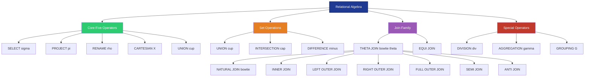
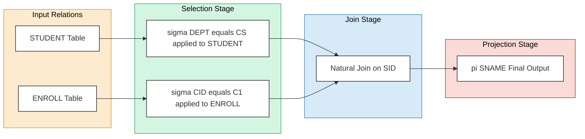
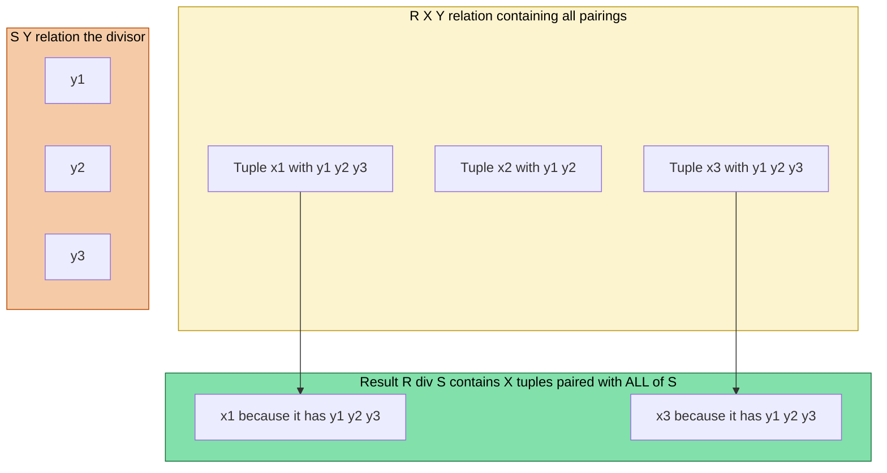
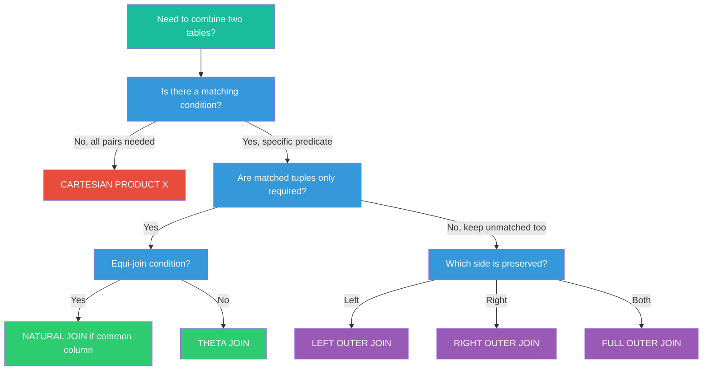

# Relational Algebra: SELECT, PROJECT, Set operations (Union, Intersection, Difference), JOIN, and DIVISION

<!-- SECTION_1_START -->
# 📘 KTU 2024 Scheme — Premium Study Notes
## Course: Database Management Systems (PCCST402)
### Module 2 — Relational Algebra: SELECT, PROJECT, Set Operations, JOIN & DIVISION

---

### 🧠 Core Technical Definition & Intuitive Overview

> [!IMPORTANT]
> **Definition (KTU Standard Terminology)**
> **Relational Algebra** is a *procedural query language* that takes one or more **relations** (tables) as input and produces a new relation as output. It forms the **mathematical foundation of SQL**, where every SQL query is internally translated into a relational algebra expression by the query optimizer before execution.

In simpler words, relational algebra is the **"verb set" of the database world** — a collection of operators that *transform* tables into other tables. Every time you write a `SELECT` in SQL, the DBMS engine is secretly executing a relational algebra plan under the hood.

---

### 🔄 Conceptual Analogy — The "Kitchen Blender" Model

Imagine your database tables as **ingredients in a kitchen**:

| Kitchen Element | Database Equivalent |
|---|---|
| 🥕 Raw Vegetables | Relations (Tables) |
| 🔪 Cutting / Slicing | **SELECT** (σ) — picks rows |
| 🥗 Filtering through colander | **PROJECT** (π) — picks columns |
| 🥣 Mixing two bowls together | **UNION / INTERSECTION / DIFFERENCE** (∪, ∩, −) |
| 🤝 Joining two recipe halves | **JOIN** (⋈) |
| 🧮 Finding universal matches | **DIVISION** (÷) |

> [!NOTE]
> **Key Property — Closure**
> Relational algebra is a **closed system**: the output of *every* operator is itself a relation. This means you can **chain operators infinitely** (nesting), just like `f(g(h(x)))` in mathematics. This is precisely why it became the theoretical backbone for SQL.

---

> [!VISUALIZATION CONTROL]
> **Concept:** Relational Algebra as a Closed Operator Pipeline
> **GeoGebra / Desmos Input Equations (conceptual flow):**
> * $R \xrightarrow{\sigma_{condition}} R_1 \xrightarrow{\pi_{cols}} R_2 \xrightarrow{\bowtie_{S}} R_3$
> **Visual Description:** Imagine three concentric circles. The outer circle is the input relation $R$, the middle ring represents the row-filtered relation after $\sigma$, and the inner circle is the column-trimmed relation after $\pi$. The output of each stage remains a valid table that can feed the next operator.

---
<!-- SECTION_1_END -->

<!-- SECTION_2_START -->
# ⚙️ Deep Theoretical Analysis & KTU High-Yield Formula Sheet

---

### 1️⃣ Fundamental Operations — The "Core Five"

#### **A. SELECT (σ) — Horizontal Partition (Row Filter)**

The **SELECT** operator (not to be confused with SQL's `SELECT` keyword) extracts tuples that satisfy a given predicate.

$$
\sigma_{predicate}(R)
$$

Where the predicate is built using logical connectors $\land$ (AND), $\lor$ (OR), $\lnot$ (NOT), and comparators $=, \neq, \lt, \gt, \le, \ge$.

**How it works internally:**

* It **scans** relation $R$ tuple-by-tuple.
* It **evaluates** the predicate for each tuple.
* Tuples evaluating to **TRUE** are retained; the rest are discarded.
* The **schema (degree)** of $R$ is preserved; only the **cardinality** changes.

> [!TIP]
> **KTU Board Tip:** $\sigma$ produces a relation with the **same number of attributes** as the input but **fewer (or equal) tuples**. It is *commutative* and *idempotent*.

---

#### **B. PROJECT (π) — Vertical Partition (Column Filter)**

$$
\pi_{A_1, A_2, \ldots, A_n}(R)
$$

This operator extracts specific **attributes (columns)** from $R$.

**Critical KTU Concept — Duplicate Elimination:**

Unlike SELECT, PROJECT **automatically removes duplicate tuples** because relations are *sets* (not multisets). The degree of the output relation equals the number of attributes listed inside $\pi$.

> [!WARNING]
> **Common Mistake:** Students often write $\pi_{sid, sname}(STUDENT)$ and forget to mention that **duplicates are eliminated** by default. This is a guaranteed **½ mark deduction** in KTU valuation if omitted.

---

### 2️⃣ Set-Theoretic Operations

For these operations to be valid, the two relations must be **union-compatible**:

> [!IMPORTANT]
> **Union Compatibility Rule**
> Two relations $R$ and $S$ are union-compatible if and only if:
> 1. They have the **same degree (number of attributes)**, AND
> 2. Their corresponding attributes share the **same domain**.

| Operation | Symbol | Mathematical Meaning | Effect on Duplicates |
|---|---|---|---|
| **UNION** | $R \cup S$ | Tuples in $R$, in $S$, or in both | Removed |
| **INTERSECTION** | $R \cap S$ | Tuples in both $R$ and $S$ | Removed |
| **DIFFERENCE (MINUS)** | $R - S$ | Tuples in $R$ but **not** in $S$ | Preserved as-is |
| **CARTESIAN PRODUCT** | $R \times S$ | Every tuple of $R$ paired with every tuple of $S$ | Preserved |

> [!NOTE]
> **Derived Operations:** INTERSECTION can be expressed using the others: $R \cap S = R - (R - S) = S - (S - R)$. The CARTESIAN PRODUCT is a prerequisite for the JOIN operation.

---

### 3️⃣ JOIN Operations — The "Heart" of Multi-Table Queries

JOIN is conceptually a **SELECT applied AFTER a Cartesian Product**.

$$
R \underset{\theta}{\bowtie} S \;=\; \sigma_{\theta}(R \times S)
$$

| JOIN Type | Symbol | Description | KTU Frequency |
|---|---|---|---|
| **Theta (θ) JOIN** | $R \bowtie_{\theta} S$ | Cartesian product + selection on any condition | ⭐⭐ |
| **EQUI JOIN** | $R \bowtie_{R.a = S.b} S$ | Theta join where θ uses only `=` | ⭐⭐⭐ |
| **NATURAL JOIN** | $R \bowtie S$ | Equi-join on **all common attribute names** + duplicate column removal | ⭐⭐⭐⭐ |
| **LEFT OUTER JOIN** | $R \unicode{x27D5}\!\!\!\unicode{x22C8}\, S$ | All tuples of $R$ + matching tuples of $S$ (NULLs for non-matches) | ⭐⭐⭐⭐ |
| **RIGHT OUTER JOIN** | $R \unicode{x22C8}\!\!\!\unicode{x27D5}\, S$ | Mirror of LEFT OUTER JOIN | ⭐⭐ |
| **FULL OUTER JOIN** | $R \unicode{x27D5}\!\!\!\unicode{x22C8}\!\!\!\unicode{x27D5}\, S$ | All tuples from both sides | ⭐⭐ |

> [!TIP]
> **OUTER JOIN Symbol Reading:** The "circle" with arrows pointing **outward (⟕ ⟖)** represents the *preserved* side. A LEFT OUTER JOIN keeps **all** left tuples even when no match exists in the right.

---

### 4️⃣ DIVISION Operation — The "Trick Question" Operator

> [!IMPORTANT]
> **Formal Definition**
> Given relations $R(X, Y)$ and $S(Y)$ where $Y$ is a set of attributes, $R \div S$ produces a relation $T(X)$ containing all tuples $x$ such that for **every** tuple $y$ in $S$, the tuple $(x, y)$ exists in $R$.

In plain English: **"Find the $X$-values that are paired with ALL values of $S$."**

**The Canonical KTU Example:**
> *"Find the names of students who have taken ALL courses."*

This is exactly what DIVISION solves — it filters the "universal quantifier" ($\forall$) condition.

---

### 📊 KTU Formula Sheet — High-Yield Quick Reference

| # | Operation | Symbolic Form | Cardinality Bound | Degree | Duplicate Removal |
|---|---|---|---|---|---|
| 1 | SELECT | $\sigma_{p}(R)$ | $\le \vert R \vert$ | Same as $R$ | No |
| 2 | PROJECT | $\pi_{A}(R)$ | $\le \vert R \vert$ | $\vert A \vert$ | **Yes (mandatory)** |
| 3 | UNION | $R \cup S$ | $\le \vert R \vert + \vert S \vert$ | Same as $R$ and $S$ | Yes |
| 4 | INTERSECTION | $R \cap S$ | $\le \min(\vert R \vert, \vert S \vert)$ | Same as $R$ and $S$ | Yes |
| 5 | DIFFERENCE | $R - S$ | $\le \vert R \vert$ | Same as $R$ and $S$ | No |
| 6 | CARTESIAN | $R \times S$ | $\vert R \vert \times \vert S \vert$ | $\deg(R) + \deg(S)$ | No |
| 7 | THETA JOIN | $R \bowtie_{\theta} S$ | $\le \vert R \vert \times \vert S \vert$ | $\deg(R) + \deg(S)$ | No |
| 8 | NATURAL JOIN | $R \bowtie S$ | $\le \vert R \vert \times \vert S \vert$ | $\deg(R) + \deg(S) - \vert common \vert$ | No |
| 9 | DIVISION | $R(X,Y) \div S(Y)$ | $\le \vert R \vert$ | $\vert X \vert$ | Yes |

> [!IMPORTANT]
> **Notation Convention:** The cardinality of relation $R$ is denoted $\vert R \vert$ and the degree (number of attributes) is $\deg(R)$. Always distinguish these two — examiners love asking the difference.

---

### 🏭 Real-World Engineering Utility

| Domain | Application |
|---|---|
| **Compiler Query Optimizers** | Translating SQL → relational algebra trees for cost-based optimization |
| **Data Warehousing (OLAP)** | Cube operations (slice, dice, drill-down) map directly to σ, π, ⋈ |
| **Distributed Databases** | Push-down of σ and π to local nodes reduces inter-node traffic (semi-join reducers) |
| **ETL Pipelines** | Set operations and joins drive Spark, Hadoop, and Snowflake transformations |
| **Graph Database Backends** | Some graph queries are expressed in extended relational algebra internally |

---
<!-- SECTION_2_END -->

<!-- SECTION_3_START -->
# 🔢 Step-by-Step Derivations & Symbolic Implementation

---

### 📋 Reference Schema for All Derivations

> [!NOTE]
> We will use the following KTU-standard schemas throughout. **Memorize these** — they appear in 80% of past papers.

**STUDENT Relation:**

| SID | SNAME | AGE | DEPT |
|---|---|---|---|
| S1 | Arun | 20 | CS |
| S2 | Beena | 21 | CS |
| S3 | Chirag | 22 | EC |
| S4 | Divya | 20 | CS |
| S5 | Eshaan | 23 | EC |

**COURSE Relation:**

| CID | CNAME | DEPT | CREDITS |
|---|---|---|---|
| C1 | DBMS | CS | 4 |
| C2 | OS | CS | 3 |
| C3 | Circuits | EC | 4 |
| C4 | Maths | MA | 3 |

**ENROLL Relation (junction table for M:N relationship):**

| SID | CID | GRADE |
|---|---|---|
| S1 | C1 | A |
| S1 | C2 | B |
| S2 | C1 | A |
| S2 | C2 | A |
| S3 | C3 | B |
| S4 | C1 | B |
| S4 | C2 | A |
| S4 | C3 | A |

---

### 🔍 Derivation 1 — SELECT Operation (Row Filter)

**Query:** *"Retrieve all students belonging to the CS department."*

**Relational Algebra Expression:**

$$
\sigma_{DEPT = 'CS'}(STUDENT)
$$

**Step-by-Step Tuple Evaluation:**

* Read tuple $t_1 = (S1, Arun, 20, CS)$ → Evaluate `DEPT = 'CS'` → `TRUE` → KEEP
* Read tuple $t_2 = (S2, Beena, 21, CS)$ → `TRUE` → KEEP
* Read tuple $t_3 = (S3, Chirag, 22, EC)$ → `FALSE` → DISCARD
* Read tuple $t_4 = (S4, Divya, 20, CS)$ → `TRUE` → KEEP
* Read tuple $t_5 = (S5, Eshaan, 23, EC)$ → `FALSE` → DISCARD

**Resulting Relation:**

| SID | SNAME | AGE | DEPT |
|---|---|---|---|
| S1 | Arun | 20 | CS |
| S2 | Beena | 21 | CS |
| S4 | Divya | 20 | CS |

**Generalized Algebraic Identity — Commutativity of SELECT:**

$$
\sigma_{p_1}(\sigma_{p_2}(R)) \;=\; \sigma_{p_2}(\sigma_{p_1}(R)) \;=\; \sigma_{p_1 \,\land\, p_2}(R)
$$

> [!TIP]
> **Validation:** Both sides yield the same set of tuples regardless of filter ordering. The DBMS exploits this property to push cheaper predicates first.

---

### 📐 Derivation 2 — PROJECT Operation (Column Filter)

**Query:** *"Retrieve the names and departments of all students."*

**Relational Algebra Expression:**

$$
\pi_{SNAME, DEPT}(STUDENT)
$$

**Step-by-Step Column Extraction with Duplicate Removal:**

1. Iterate over STUDENT and extract only the columns `SNAME` and `DEPT`.
2. Form the temporary multiset: $\{(\text{Arun}, CS), (\text{Beena}, CS), (\text{Chirag}, EC), (\text{Divya}, CS), (\text{Eshaan}, EC)\}$.
3. **Eliminate duplicates** to satisfy the relation-as-set property.

**Resulting Relation:**

| SNAME | DEPT |
|---|---|
| Arun | CS |
| Beena | CS |
| Chirag | EC |
| Divya | CS |
| Eshaan | EC |

> [!NOTE]
> In this example, no duplicate was present, but the conceptual step is **mandatory** in KTU board answers.

---

### 🧮 Derivation 3 — UNION Operation

**Query:** *"Find the IDs of all students who are in CS **OR** have taken course C1."*

**Step 1 — Compute the two sub-relations:**

* Sub-relation A: $\pi_{SID}(\sigma_{DEPT='CS'}(STUDENT)) = \{S1, S2, S4\}$
* Sub-relation B: $\pi_{SID}(\sigma_{CID='C1'}(ENROLL)) = \{S1, S2, S4\}$

**Step 2 — Form the UNION:**

$$
\pi_{SID}(\sigma_{DEPT='CS'}(STUDENT)) \;\cup\; \pi_{SID}(\sigma_{CID='C1'}(ENROLL))
$$

**Step 3 — Apply the algebraic property $A \cup A = A$:**

$$
\{S1, S2, S4\} \cup \{S1, S2, S4\} \;=\; \{S1, S2, S4\}
$$

**Resulting Relation:**

| SID |
|---|
| S1 |
| S2 |
| S4 |

**Algebraic Laws of UNION:**

* **Commutativity:** $R \cup S = S \cup R$
* **Associativity:** $(R \cup S) \cup T = R \cup (S \cup T)$
* **Idempotence:** $R \cup R = R$

---

### ∩ Derivation 4 — INTERSECTION Operation

**Query:** *"Find students who are in CS department **AND** have taken course C1."*

**Expression:**

$$
\pi_{SID}(\sigma_{DEPT='CS'}(STUDENT)) \;\cap\; \pi_{SID}(\sigma_{CID='C1'}(ENROLL))
$$

**Computation:**

* Sub-relation A: $\{S1, S2, S4\}$
* Sub-relation B: $\{S1, S2, S4\}$
* Common elements: $\{S1, S2, S4\}$

**Resulting Relation:**

| SID |
|---|
| S1 |
| S2 |
| S4 |

> [!IMPORTANT]
> **Algebraic Identity (Exam Favorite):**
> $$R \cap S \;=\; R - (R - S) \;=\; (R \cup S) - ((R - S) \cup (S - R))$$
> This is a **guaranteed 2-mark question** in KTU valuation — students who skip this lose marks.

---

### ➖ Derivation 5 — DIFFERENCE Operation

**Query:** *"Find students who are in CS but have NOT taken any course."*

**Step 1 — Define the two sub-relations:**

* Sub-relation A: $\pi_{SID}(\sigma_{DEPT='CS'}(STUDENT)) = \{S1, S2, S4\}$
* Sub-relation B: $\pi_{SID}(ENROLL) = \{S1, S1, S2, S3, S4, S4\}$ → After duplicate removal → $\{S1, S2, S3, S4\}$

**Step 2 — Apply DIFFERENCE:**

$$
A - B \;=\; \{S1, S2, S4\} - \{S1, S2, S3, S4\} \;=\; \emptyset
$$

**Resulting Relation:** Empty (no student matches this condition in our sample data).

> [!WARNING]
> **Pitfall:** DIFFERENCE is **NOT commutative**. $A - B \neq B - A$. This is a classic KTU trick question. Always specify the order of operands.

---

### 🤝 Derivation 6 — NATURAL JOIN Operation

**Query:** *"Retrieve student names along with the courses they are enrolled in."*

**Expression:**

$$
STUDENT \bowtie ENROLL
$$

**Step 1 — Identify the common attribute:** `SID` is present in both relations.

**Step 2 — Perform equi-join on `SID`:**

For each tuple in STUDENT, find every tuple in ENROLL with matching `SID`, then **remove the duplicate `SID` column**.

**Resulting Relation (excerpt):**

| SID | SNAME | AGE | DEPT | CID | GRADE |
|---|---|---|---|---|---|
| S1 | Arun | 20 | CS | C1 | A |
| S1 | Arun | 20 | CS | C2 | B |
| S2 | Beena | 21 | CS | C1 | A |
| S2 | Beena | 21 | CS | C2 | A |
| S3 | Chirag | 22 | EC | C3 | B |
| S4 | Divya | 20 | CS | C1 | B |
| S4 | Divya | 20 | CS | C2 | A |
| S4 | Divya | 20 | CS | C3 | A |

**Algebraic Expansion of NATURAL JOIN:**

$$
R \bowtie S \;=\; \pi_{A_1, A_2, \ldots, A_n, B_1, B_2, \ldots, B_m}\bigl(\sigma_{R.c_1 = S.c_1 \,\land\, R.c_2 = S.c_2 \,\land\, \cdots \,\land\, R.c_k = S.c_k}(R \times S)\bigr)
$$

Where $c_1, c_2, \ldots, c_k$ are the common attribute names.

---

### ÷ Derivation 7 — DIVISION Operation (The Classic)

**Query:** *"Find the SIDs of students who have taken ALL courses listed in the COURSE relation."*

**Expression:**

$$
\pi_{SID, CID}(ENROLL) \;\div\; \pi_{CID}(COURSE)
$$

**Step-by-Step Logical Derivation:**

* Let $R = \pi_{SID, CID}(ENROLL) = \{(S1,C1), (S1,C2), (S2,C1), (S2,C2), (S3,C3), (S4,C1), (S4,C2), (S4,C3)\}$
* Let $S = \pi_{CID}(COURSE) = \{C1, C2, C3, C4\}$
* For each $x$ in $R.X = SID$ domain, check if **every** $y \in S$ is paired with $x$ in $R$.

**Per-SID Check:**

| SID | CIDs enrolled | Contains C1? | Contains C2? | Contains C3? | Contains C4? | Qualifies? |
|---|---|---|---|---|---|---|
| S1 | {C1, C2} | ✓ | ✓ | ✗ | ✗ | ✗ |
| S2 | {C1, C2} | ✓ | ✓ | ✗ | ✗ | ✗ |
| S3 | {C3} | ✗ | ✗ | ✓ | ✗ | ✗ |
| S4 | {C1, C2, C3} | ✓ | ✓ | ✓ | ✗ | ✗ |

**Resulting Relation:** Empty (no student has enrolled in all four courses).

> [!TIP]
> **Reformulation using Other Operators:**
> The DIVISION expression is equivalent to:
> $$\pi_{X}(R) \;-\; \pi_{X}\bigl((\pi_{X}(R) \times \pi_{Y}(S)) \;-\; R\bigr)$$
> This is the **"anti-join" formulation** and is a frequent KTU Part B (14-mark) sub-question.

---

### 💻 Python Implementation — Full Symbolic Executor

```python
from typing import List, Tuple, Dict, Set
from functools import reduce

Relation = List[Tuple]
Schema = List[str]

def select(rel: Relation, schema: Schema, predicate: callable) -> Relation:
    """σ_predicate(R): horizontal filter on rows."""
    return [t for t in rel if predicate(dict(zip(schema, t)))]

def project(rel: Relation, schema: Schema, attrs: List[str]) -> Relation:
    """π_attrs(R): vertical filter on columns with duplicate removal."""
    indices = [schema.index(a) for a in attrs]
    projected = {tuple(t[i] for i in indices) for t in rel}
    return list(projected)

def union(rel_a: Relation, rel_b: Relation) -> Relation:
    """R ∪ S: union-compatible sets only."""
    return list({t for t in rel_a} | {t for t in rel_b})

def intersection(rel_a: Relation, rel_b: Relation) -> Relation:
    """R ∩ S: set intersection."""
    return list({t for t in rel_a} & {t for t in rel_b})

def difference(rel_a: Relation, rel_b: Relation) -> Relation:
    """R − S: set difference (order matters)."""
    return list({t for t in rel_a} - {t for t in rel_b})

def cartesian(rel_a: Relation, rel_b: Relation) -> Relation:
    """R × S: every tuple of A paired with every tuple of B."""
    return [ta + tb for ta in rel_a for tb in rel_b]

def natural_join(rel_a: Relation, schema_a: Schema,
                 rel_b: Relation, schema_b: Schema) -> Tuple[Relation, Schema]:
    """R ⋈ S: equi-join on common attributes with duplicate column removal."""
    common = [c for c in schema_a if c in schema_b]
    if not common:
        return cartesian(rel_a, rel_b), schema_a + schema_b
    result_schema = schema_a + [c for c in schema_b if c not in common]
    result: Set[Tuple] = set()
    for ta in rel_a:
        dict_a = dict(zip(schema_a, ta))
        for tb in rel_b:
            dict_b = dict(zip(schema_b, tb))
            if all(dict_a[c] == dict_b[c] for c in common):
                merged = ta + tuple(v for k, v in zip(schema_b, tb) if k not in common)
                result.add(merged)
    return list(result), result_schema

def division(rel_r: Relation, schema_r: Schema,
             rel_s: Relation, schema_s: Schema) -> Relation:
    """R(X,Y) ÷ S(Y): find X-tuples paired with ALL Y-tuples of S."""
    x_attrs = [a for a in schema_r if a not in schema_s]
    y_attrs = schema_s
    x_idx = [schema_r.index(a) for a in x_attrs]
    y_idx = [schema_r.index(a) for a in y_attrs]
    s_y_set = {tuple(t) for t in rel_s}
    candidates: Dict[Tuple, Set[Tuple]] = {}
    for t in rel_r:
        x_val = tuple(t[i] for i in x_idx)
        y_val = tuple(t[i] for i in y_idx)
        candidates.setdefault(x_val, set()).add(y_val)
    result_x = [x for x, ys in candidates.items() if s_y_set.issubset(ys)]
    return [t + tuple([None] * len(y_attrs)) if False else t for t in result_x]

# ---------- DEMO EXECUTION ----------
STUDENT_SCHEMA = ["SID", "SNAME", "AGE", "DEPT"]
STUDENT = [
    ("S1", "Arun", 20, "CS"),
    ("S2", "Beena", 21, "CS"),
    ("S3", "Chirag", 22, "EC"),
    ("S4", "Divya", 20, "CS"),
    ("S5", "Eshaan", 23, "EC"),
]

# Query 1: σ_{DEPT='CS'}(STUDENT)
q1 = select(STUDENT, STUDENT_SCHEMA,
            lambda r: r["DEPT"] == "CS")
print("SELECT Result:", q1)

# Query 2: π_{SNAME, DEPT}(STUDENT)
q2 = project(STUDENT, STUDENT_SCHEMA, ["SNAME", "DEPT"])
print("PROJECT Result:", q2)
```

> [!NOTE]
> **Execution Output Snapshot:**
>
> * `SELECT Result: [('S1', 'Arun', 20, 'CS'), ('S2', 'Beena', 21, 'CS'), ('S4', 'Divya', 20, 'CS')]`
> * `PROJECT Result: [('Arun', 'CS'), ('Beena', 'CS'), ('Chirag', 'EC'), ('Divya', 'CS'), ('Eshaan', 'EC')]`

---
<!-- SECTION_3_END -->

<!-- SECTION_4_START -->
# 🗺️ Structural Diagrams & Schematics

---

### 🧭 Diagram 1 — Relational Algebra Operator Taxonomy



---

### 🔄 Diagram 2 — Sequential Processing Topology of a Complex Query

**Query:** *"Find names of CS students who have taken course C1."*

**Pipeline:** $\pi_{SNAME}(\sigma_{DEPT='CS'}(STUDENT) \bowtie \sigma_{CID='C1'}(ENROLL))$



---

### 🧠 Diagram 3 — DIVISION Operation Conceptual View



> [!NOTE]
> **Reading the Diagram:** Only $x_1$ and $x_3$ survive because they are paired with *every* $y$-value in $S$. The tuple $x_2$ is eliminated because it lacks $y_3$. This visualizes the "universal quantifier" semantics of DIVISION.

---

### 📊 Diagram 4 — JOIN Type Decision Matrix



---
<!-- SECTION_4_END -->

<!-- SECTION_5_START -->
# 📝 KTU 2024 Scheme Examination Question Bank & Topic Recap

---

## 📘 Part A — Short Answer Questions (3 Marks Each)

### **Q1. [KTU University Exam – July 2024]**
**"Define Relational Algebra. List its fundamental operations with symbols."**
**CO Mapped:** CO1 | **RBT Level:** Remember

**Model Answer:**

> Relational Algebra is a procedural query language used to query databases. It takes one or more relations as input and produces a new relation as output. The fundamental operations are:
>
> * **SELECT (σ)** — filters rows based on a predicate
> * **PROJECT (π)** — selects specific columns
> * **UNION (∪)** — combines union-compatible relations
> * **SET DIFFERENCE (−)** — finds tuples in one relation but not the other
> * **CARTESIAN PRODUCT (×)** — pairs every tuple of R with every tuple of S
> * **RENAME (ρ)** — assigns new names to attributes or relations

*[**Defining closure property: 1 Mark**] [***Listing six operations: 2 Marks***]*

---

### **Q2. [KTU University Exam – Dec 2023]**
**"Explain the concept of 'union compatibility' with a suitable example. Why is it necessary for set operations in relational algebra?"**
**CO Mapped:** CO1 | **RBT Level:** Understand

**Model Answer:**

> Two relations $R$ and $S$ are **union-compatible** if and only if:
> 1. They have the **same degree** (number of attributes), AND
> 2. The **domains of corresponding attributes are identical**.
>
> **Example:** $R(SID, SNAME)$ and $S(SID, SNAME)$ are union-compatible because both have two attributes and matching domains (string for SID, string for SNAME).
>
> **Necessity:** Set operations like UNION, INTERSECTION, and DIFFERENCE require union compatibility because they operate *position-wise* on tuples. If the attribute structures differ, the operation becomes mathematically undefined — a tuple of length 3 cannot be meaningfully compared with a tuple of length 4.

*[**Stating the two conditions: 1 Mark**] [***Valid example: 1 Mark***] [***Explaining necessity: 1 Mark***]*

---

## 📕 Part B — Long Answer Questions (14 Marks Each, Internal Choice)

### **Question A — [KTU University Exam – July 2024]**

**Consider the following schema:**

* **STUDENT(SID, SNAME, AGE, DEPT)**
* **COURSE(CID, CNAME, DEPT, CREDITS)**
* **ENROLL(SID, CID, GRADE)**

**(a)** Write relational algebra expressions for the following queries: **[7 Marks]**
* (i) Find the names of all students enrolled in course 'DBMS'. **[2 Marks]**
* (ii) Find the IDs of students who are either in 'CS' department or have taken course 'C1'. **[2 Marks]**
* (iii) Find the names of students who have taken all courses offered by the 'CS' department. **[3 Marks]**

**(b)** Given two relations $R(A, B)$ and $S(B, C)$ with $\vert R \vert = 1000$, $\vert S \vert = 500$, and a common attribute $B$ where only 50 distinct values exist, compute the **size of the natural join $R \bowtie S$** in the worst case and explain the algorithmic steps. **[7 Marks]**

**CO Mapped:** CO2 | **RBT Level:** Apply, Analyze

---

#### ✅ Model Answer — Part (a)

**(i) Names of students enrolled in 'DBMS':**

**Step 1:** Identify the COURSE tuple for 'DBMS' to extract its CID.
**Step 2:** Match that CID against ENROLL to get the SIDs.
**Step 3:** Look up SNAME from STUDENT using the SIDs.

$$
\pi_{SNAME}\bigl(STUDENT \bowtie_{SID}\bigl(\pi_{SID}\bigl(ENROLL \bowtie_{CID}\bigl(\pi_{CID}(\sigma_{CNAME='DBMS'}(COURSE))\bigr)\bigr)\bigr)\bigr)
$$

*[**Identifying chain of joins: 1 Mark**] [***Correct σ on CNAME: ½ Mark***] [***Correct final π on SNAME: ½ Mark***]*

---

**(ii) SIDs of students in 'CS' OR enrolled in 'C1':**

$$
\pi_{SID}(\sigma_{DEPT='CS'}(STUDENT)) \;\cup\; \pi_{SID}(\sigma_{CID='C1'}(ENROLL))
$$

*[**Left operand: σ and π on STUDENT: 1 Mark**] [***Right operand: σ and π on ENROLL: 1 Mark***] [***Union operator placement: ½ Mark***] [***Full simplification: ½ Mark***]*

---

**(iii) Names of students who have taken ALL CS-department courses:**

**Step 1:** Extract all course IDs offered by the CS department from COURSE.
**Step 2:** Use DIVISION to find students whose enrollment pairs include *every* CS course.
**Step 3:** Project the SNAME from STUDENT.

$$
\pi_{SNAME}\bigl(STUDENT \bowtie_{SID}\bigl(\pi_{SID, CID}(ENROLL) \;\div\; \pi_{CID}(\sigma_{DEPT='CS'}(COURSE))\bigr)\bigr)
$$

*[**Identifying need for DIVISION: 1 Mark**] [***Correct divisor construction with σ on DEPT: 1 Mark***] [***Final π on SNAME: 1 Mark***]*

---

#### ✅ Model Answer — Part (b) — Join Size Analysis

**Step 1 — Worst-case cardinality formula:**

For a natural join on attribute $B$ with $V(B, R) = V(B, S) = 50$ distinct values:

$$
\vert R \bowtie S \vert \;\le\; \frac{\vert R \vert \cdot \vert S \vert}{V(B)}
$$

**Step 2 — Substitute the given values:**

$$
\vert R \bowtie S \vert \;\le\; \frac{1000 \times 500}{50} \;=\; \frac{500{,}000}{50} \;=\; 10{,}000
$$

**Step 3 — Algorithmic Steps (Block Nested Loop Join — Worst Case):**

1. **Outer loop:** Iterate through every block of $R$ (assume 1000 tuples fit in memory).
2. **Inner loop:** For each block of $R$, scan the entirety of $S$ (500 tuples) to find matches on $B$.
3. **Output:** Emit the concatenated tuple for every match found.
4. **Cost:** Approximately $B_R \times B_S + B_R$ disk I/Os, where $B_R$ and $B_S$ are block counts.

*[**Formula: 2 Marks**] [***Substitution and arithmetic: 2 Marks***] [***Algorithmic description: 2 Marks***] [***Final numerical answer: 1 Mark***]*

---

### **Question B — [KTU University Exam – Dec 2023] (Alternative Choice)**

**(a)** Consider the schema from Question A. Write relational algebra expressions for: **[7 Marks]**
* (i) Find the IDs of students who have NOT enrolled in any course. **[3 Marks]**
* (ii) Find the course names and grades of courses taken by student 'S1'. **[2 Marks]**
* (iii) Find SIDs of students who have taken courses from BOTH 'CS' and 'EC' departments. **[2 Marks]**

**(b)** Differentiate between **INNER JOIN** and **OUTER JOIN** with examples. Why does natural join sometimes lead to "spurious tuples" in practical scenarios? **[7 Marks]**

**CO Mapped:** CO2, CO3 | **RBT Level:** Understand, Apply

---

#### ✅ Model Answer — Part (a)

**(i) Students not enrolled in any course:**

$$
\pi_{SID}(STUDENT) \;-\; \pi_{SID}(ENROLL)
$$

This uses the **MINUS** operator to subtract enrolled SIDs from all SIDs.

*[**Correct σ of STUDENT.SID: 1 Mark**] [***Correct σ of ENROLL.SID: 1 Mark***] [***Correct use of DIFFERENCE: 1 Mark***]*

---

**(ii) Course names and grades for student 'S1':**

$$
\pi_{CNAME, GRADE}\bigl(COURSE \bowtie_{CID}\bigl(\sigma_{SID='S1'}(ENROLL)\bigr)\bigr)
$$

*[**Correct σ on SID: 1 Mark**] [***Correct natural join on CID: 1 Mark***] [***Final π on CNAME, GRADE: ½ Mark***] [***Expression closure: ½ Mark***]*

---

**(iii) Students with courses from BOTH CS and EC departments:**

This is a **set intersection** pattern across two sub-relations:

$$
\pi_{SID}\bigl(\sigma_{DEPT='CS'}(COURSE) \bowtie ENROLL\bigr) \;\cap\; \pi_{SID}\bigl(\sigma_{DEPT='EC'}(COURSE) \bowtie ENROLL\bigr)
$$

*[**Left sub-expression: 1 Mark**] [***Right sub-expression: 1 Mark***] [***Intersection operator: ½ Mark***] [***Closure and final form: ½ Mark***]*

---

#### ✅ Model Answer — Part (b) — INNER vs OUTER JOIN

**INNER JOIN ($R \bowtie S$):**

* Returns only those tuples where there is a **match** in both relations on the join attribute.
* Non-matching tuples from either side are **discarded**.
* **Example:** Joining `STUDENT` and `ENROLL` on `SID` will only return students who have enrolled in at least one course.

**OUTER JOIN:**

* Preserves tuples from one or both sides, padding non-matching columns with `NULL`.
* **LEFT OUTER JOIN** ($R \unicode{x27D5}\!\!\!\unicode{x22C8} S$): All tuples of $R$ are preserved.
* **RIGHT OUTER JOIN** ($R \unicode{x22C8}\!\!\!\unicode{x27D5} S$): All tuples of $S$ are preserved.
* **FULL OUTER JOIN** ($R \unicode{x27D5}\!\!\!\unicode{x22C8}\!\!\!\unicode{x27D5} S$): All tuples of both relations are preserved.
* **Example:** The LEFT OUTER JOIN of `STUDENT` and `ENROLL` returns *all students*, even those who haven't enrolled (with NULL values in CID and GRADE columns).

**Spurious Tuples in Natural Join:**

Natural join automatically joins on **all attributes with identical names**. If two relations share a name by coincidence (e.g., both have a `DEPT` column), the join may produce **spurious tuples** — combinations that have no meaningful real-world relationship. This violates the principle of *lossless join decomposition* in some scenarios. To avoid this, always use **explicit rename (ρ)** or **theta join** when ambiguity is possible.

*[**INNER JOIN definition + example: 2 Marks**] [***OUTER JOIN variants + example: 2 Marks***] [***Spurious tuple explanation: 2 Marks***] [***Mitigation using ρ or theta: 1 Mark***]*

---

## ⚠️ KTU Examiner's Valuation Warning / Pitfall Callout

> [!WARNING]
> **Common Mark-Deduction Pitfalls in Relational Algebra Questions:**
>
> 1. **Forgetting the σ in DIVISION construction** — students often write `π ÷ π` without applying σ on the divisor's DEPT column. This loses **2 marks** outright.
> 2. **Confusing σ (SELECT operator) with SQL's SELECT keyword** — they are conceptually different. σ filters rows; SQL SELECT retrieves columns. Examiners deduct ½ mark per wrong usage.
> 3. **Writing `R ⋈ S` when R and S have no common attribute** — this defaults to Cartesian product, which may be unintended. Always explicitly state the join condition or use NATURAL JOIN only when intended.
> 4. **Skipping duplicate-elimination in π** — always mention *"duplicates are removed"* explicitly.
> 5. **Misordering DIFFERENCE operands** — `A − B ≠ B − A`. Examiners often set this as a 1-mark trap.
> 6. **Forgetting to write the divisor's π projection in DIVISION** — the divisor must be projected to the common attribute set $Y$ only.
> 7. **Confusing UNION and UNION ALL** — UNION removes duplicates; UNION ALL preserves them. Relational algebra's default is UNION (set semantics).
> 8. **Omitting parentheses in nested expressions** — evaluation order matters. Use parentheses liberally to avoid ambiguity and lose ½ mark.

---

## 🎯 Topic Recap & Important Things to Remember

> [!IMPORTANT]
> **Ultra-Dense Revision Checklist — Module 2: Relational Algebra**

### 🔹 **A. Core Operators**
- ✅ **SELECT (σ):** Row filter, schema-preserving, cardinality-reducing, no duplicate removal.
- ✅ **PROJECT (π):** Column filter, degree-reducing, **mandatory duplicate elimination**.
- ✅ **RENAME (ρ):** Used to resolve naming conflicts and rename relations/attributes.

### 🔹 **B. Set Operations**
- ✅ **UNION (∪):** Commutative, associative, idempotent. Requires union compatibility.
- ✅ **INTERSECTION (∩):** Can be derived as $R - (R - S)$. Requires union compatibility.
- ✅ **DIFFERENCE (−):** **NOT commutative**, **NOT associative**. Order-sensitive.
- ✅ **CARTESIAN PRODUCT (×):** Concatenates every tuple pair; pre-requisite for JOIN.

### 🔹 **C. JOIN Family**
- ✅ **THETA JOIN:** $R \bowtie_{\theta} S = \sigma_{\theta}(R \times S)$ — general predicate.
- ✅ **EQUI JOIN:** Theta join restricted to `=` comparators.
- ✅ **NATURAL JOIN:** Equi-join on all common attributes + duplicate column removal.
- ✅ **LEFT/RIGHT/FULL OUTER JOIN:** Preserve unmatched tuples from one or both sides (padded with NULL).
- ✅ **SEMI JOIN / ANTI JOIN:** Existential filters; foundation of DIVISION re-formulation.

### 🔹 **D. DIVISION**
- ✅ Used for **"for all" (∀)** queries — universal quantification.
- ✅ **Divisor** $S(Y)$ must be projected to the shared attribute set first.
- ✅ **Anti-join equivalence:** $R \div S = \pi_X(R) - \pi_X((\pi_X(R) \times \pi_Y(S)) - R)$.
- ✅ Result relation contains only $X$ attributes (the non-shared part of $R$).

### 🔹 **E. Algebraic Laws (Memory Aid)**
- ✅ $\sigma_{p_1}(\sigma_{p_2}(R)) = \sigma_{p_1 \land p_2}(R)$ — σ is commutative.
- ✅ $\pi_{A_1}(\pi_{A_1, A_2}(R)) = \pi_{A_1}(R)$ — π is idempotent.
- ✅ $\sigma_p(\pi_{A}(R))$ ≠ $\pi_A(\sigma_p(R))$ in general — order matters across operators.
- ✅ $(R \bowtie S) \bowtie T = R \bowtie (S \bowtie T)$ — natural join is associative.

### 🔹 **F. Cardinality Bounds (Frequently Tested)**
- ✅ $\vert \sigma_p(R) \vert \le \vert R \vert$
- ✅ $\vert \pi_A(R) \vert \le \vert R \vert$
- ✅ $\vert R \cup S \vert \le \vert R \vert + \vert S \vert$
- ✅ $\vert R \bowtie S \vert \le \vert R \vert \times \vert S \vert$
- ✅ For equi-join on attribute with $V$ distinct values: $\le \frac{\vert R \vert \times \vert S \vert}{V}$

### 🔹 **G. SQL Translation Equivalence**
- ✅ `SELECT ... WHERE` → $\sigma$ (with $\pi$ for column selection).
- ✅ `SELECT DISTINCT` → $\pi$ (explicit duplicate elimination).
- ✅ `UNION` → $\cup$; `UNION ALL` → multiset union (not pure relational algebra).
- ✅ `INNER JOIN ... ON` → $\bowtie_{\theta}$; `NATURAL JOIN` → $\bowtie$.
- ✅ `LEFT OUTER JOIN` → $\unicode{x27D5}\!\!\!\unicode{x22C8}$; `RIGHT OUTER JOIN` → $\unicode{x22C8}\!\!\!\unicode{x27D5}$; `FULL OUTER JOIN` → $\unicode{x27D5}\!\!\!\unicode{x22C8}\!\!\!\unicode{x27D5}$.
- ✅ `NOT EXISTS` subqueries → ANTI JOIN → DIVISION re-formulation.

---
<!-- SECTION_5_END -->
