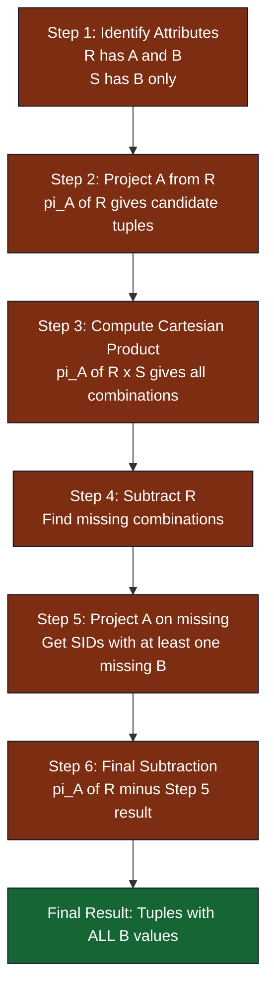
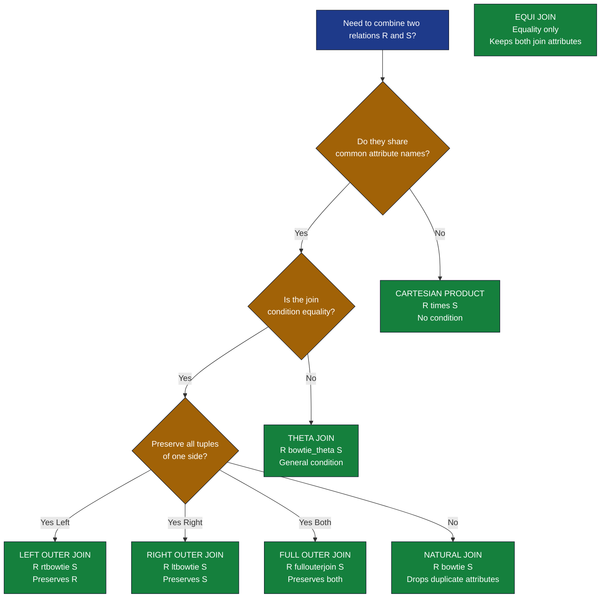

# Relational Algebra: SELECT, PROJECT, Set operations (Union, Intersection, Difference), JOIN, and DIVISION

<!-- SECTION_1_START -->
# MODULE 2: RELATIONAL MODEL & SQL
## Topic: Relational Algebra — SELECT, PROJECT, Set Operations, JOIN, and DIVISION

### 1.1 Formal Definition (KTU 2024 Syllabus Terminology)

> [!IMPORTANT]
> **Relational Algebra** is a **procedural query language** consisting of a set of operations that take one or two relations as input and produce a new relation as output. It forms the theoretical foundation for SQL and is used to formally express queries against a relational database.

The fundamental operations in Relational Algebra can be classified as follows:

> [!NOTE]
> **Core Operations (KTU High-Yield):**
> 1. **Unary Operations:** SELECT ($\sigma$), PROJECT ($\pi$), RENAME ($\rho$)
> 2. **Set Operations:** UNION ($\cup$), INTERSECTION ($\cap$), SET DIFFERENCE ($-$), CARTESIAN PRODUCT ($\times$)
> 3. **Binary Relational Operations:** JOIN ($\bowtie$), NATURAL JOIN ($\bowtie$), DIVISION ($\div$)

### 1.2 Intuitive Overview & Real-World Analogy

> [!IMPORTANT]
> **Conceptual Analogy: The "Vending Machine" Model**
> Think of a Relational Database as a giant **spreadsheet library** where each table is a page. Relational Algebra is the **set of rules** you use to interact with this library:
> - **SELECT ($\sigma$)** is like using a **magnifying glass** — it filters rows (horizontal slicing).
> - **PROJECT ($\pi$)** is like using a **hole-puncher** — it picks specific columns (vertical slicing).
> - **UNION, INTERSECTION, DIFFERENCE** are like **Venn diagram operations** between two result sets.
> - **JOIN** is like **zipping two spreadsheets** together based on a common column.
> - **DIVISION** is like **finding the "perfect students"** who have completed *every* task in a list.

### 1.3 Notation Conventions

In KTU-style notation, relations are denoted by capital letters ($R$, $S$, $T$) and their attributes by lowercase letters ($A$, $B$, $C$). The result of any relational operation is always another **relation** — this property is called **closure**.

| Symbol | Operation | Arity |
|--------|-----------|-------|
| $\sigma_{condition}(R)$ | SELECT | Unary |
| $\pi_{A_1, A_2, ..., A_n}(R)$ | PROJECT | Unary |
| $\rho_{new}(R)$ | RENAME | Unary |
| $R \cup S$ | UNION | Binary |
| $R \cap S$ | INTERSECTION | Binary |
| $R - S$ | SET DIFFERENCE | Binary |
| $R \times S$ | CARTESIAN PRODUCT | Binary |
| $R \bowtie_{condition} S$ | THETA JOIN | Binary |
| $R \bowtie S$ | NATURAL JOIN | Binary |
| $R \div S$ | DIVISION | Binary |

> [!VISUALIZATION CONTROL]
> **Concept:** Venn Diagram of Set Operations (UNION, INTERSECTION, DIFFERENCE)
> **GeoGebra / Desmos Input Equations:**
> * Circle 1: $x^2 + y^2 = 4$
> * Circle 2: $(x-1)^2 + y^2 = 4$
> **Visual Description:** Two overlapping circles representing relations R and S. The shaded overlapping region represents INTERSECTION; the entire shaded area represents UNION; the part of Circle 1 not in Circle 2 represents SET DIFFERENCE.
<!-- SECTION_1_END -->

<!-- SECTION_2_START -->
# DEEP THEORETICAL ANALYSIS & KTU FORMULA SHEET

### 2.1 The SELECT Operation ($\sigma$)

The SELECT operation (also called **RESTRICT**) is used to retrieve **tuples (rows)** from a relation that satisfy a given predicate/condition. It performs a **horizontal partition** of the relation.

**Syntax:**
$$\sigma_{<selection\_condition>}(R)$$

The selection condition is a Boolean expression formed using:
- **Comparison operators:** $=, \neq, \lt, \gt, \le, \ge$
- **Logical operators:** $\land$ (AND), $\lor$ (OR), $\neg$ (NOT)

**Properties of SELECT:**
- **Commutative:** $\sigma_{p}(\sigma_{q}(R)) = \sigma_{q}(\sigma_{p}(R)) = \sigma_{p \land q}(R)$
- **Idempotent:** $\sigma_{p}(\sigma_{p}(R)) = \sigma_{p}(R)$
- **Cascade:** SELECT operations can be cascaded or combined using AND.
- The degree (number of attributes) of the result is **the same** as the input relation.

> [!NOTE]
> **Engineering Utility:** In production systems, SELECT is implemented using **index scans**, **full table scans**, or **bitmap filters** in the query optimizer. The result cardinality is bounded by $|R|$ (the input size).

### 2.2 The PROJECT Operation ($\pi$)

The PROJECT operation selects **specific attributes (columns)** from a relation. It performs a **vertical partition** and **removes duplicate tuples** automatically (since relations are sets).

**Syntax:**
$$\pi_{<attribute\_list>}(R)$$

**Properties of PROJECT:**
- **Not commutative:** $\pi_{A_1}(\pi_{A_1, A_2}(R)) \neq \pi_{A_1, A_2}(\pi_{A_1}(R))$ in general.
- **Cascade form:** $\pi_{A_1}(\pi_{A_1, A_2}(\dots(R))) = \pi_{A_1, A_2, \dots}(R)$
- The **degree** of the result equals the number of attributes in the projection list.
- Duplicate tuples are **automatically eliminated** (set semantics).

### 2.3 Set Operations: UNION, INTERSECTION, DIFFERENCE

For these binary operations, the two relations $R$ and $S$ must be **union-compatible**, meaning they must have the same degree $n$ and their corresponding attribute domains must be compatible.

| Operation | Notation | Definition | Set Theory Equivalent |
|-----------|----------|------------|------------------------|
| UNION | $R \cup S$ | All tuples in $R$ or $S$ (or both) | $R \cup S = \{t \mid t \in R \lor t \in S\}$ |
| INTERSECTION | $R \cap S$ | Tuples in both $R$ and $S$ | $R \cap S = \{t \mid t \in R \land t \in S\}$ |
| DIFFERENCE | $R - S$ | Tuples in $R$ but not in $S$ | $R - S = \{t \mid t \in R \land t \notin S\}$ |

> [!IMPORTANT]
> **Algebraic Identity (Exam Favorite):** $R \cap S = R - (R - S) = S - (S - R)$. This identity is often asked in KTU exams as a proof question.

**Properties:**
- UNION and INTERSECTION are **commutative** and **associative**.
- DIFFERENCE is **NOT commutative**: $R - S \neq S - R$.
- DIFFERENCE is **NOT associative**.

### 2.4 The JOIN Operation ($\bowtie$)

JOIN is used to combine related tuples from two relations based on a common attribute or condition. It is essentially a **Cartesian Product followed by a SELECT**.

#### 2.4.1 CARTESIAN PRODUCT ($R \times S$)

Combines every tuple of $R$ with every tuple of $S$.
- **Degree:** $deg(R) + deg(S)$
- **Cardinality:** $|R| \times |S|$ (hence usually expensive and avoided in practice)

#### 2.4.2 THETA JOIN ($R \bowtie_{\theta} S$)

Defined as: $R \bowtie_{\theta} S = \sigma_{\theta}(R \times S)$, where $\theta$ is a join condition involving attributes from both $R$ and $S$.

#### 2.4.3 EQUI JOIN

A special case of Theta Join where the condition is an **equality** ($=$) between attributes of the two relations. The result retains **both** the join attributes (with different names).

#### 2.4.4 NATURAL JOIN ($R \bowtie S$)

- Equi-join on **all common attribute names** between $R$ and $S$.
- The duplicate common attribute appears **only once** in the result.
- **Degree:** $deg(R) + deg(S) - |common\_attributes|$

#### 2.4.5 OUTER JOIN (Variants)

> [!IMPORTANT]
> **KTU 2024 Highlight:** Three outer-join variants are explicitly tested:
> - **LEFT OUTER JOIN ($\rtimes$):** Preserves all tuples of the **left** relation; non-matches padded with NULL.
> - **RIGHT OUTER JOIN ($\ltimes$):** Preserves all tuples of the **right** relation.
> - **FULL OUTER JOIN ($\fullouterjoin$):** Preserves all tuples of **both** relations.

### 2.5 The DIVISION Operation ($R \div S$)

DIVISION is the most "exam-tricky" operation. It is used when we want to find tuples in $R$ that are associated with **every** tuple in $S$.

**Definition:** If $R$ has attributes $(A_1, A_2, \dots, A_n, B_1, B_2, \dots, B_m)$ and $S$ has attributes $(B_1, B_2, \dots, B_m)$, then:

$$R \div S = \pi_{A_1, A_2, \dots, A_n}(R) - \pi_{A_1, A_2, \dots, A_n}((\pi_{A_1, A_2, \dots, A_n}(R) \times S) - R)$$

> [!NOTE]
> **Classic Example:** "Find students who have taken *all* courses." If $R$ = TAKES(StudentID, CourseID) and $S$ = COURSE(CourseID), then $R \div S$ gives the StudentIDs of students enrolled in **every** course.

### 2.6 KTU Formula Sheet (Cheat Table)

| Operation | Symbolic Form | Result Degree | Result Cardinality Bound |
|-----------|---------------|---------------|---------------------------|
| SELECT | $\sigma_{p}(R)$ | $deg(R)$ | $\le \vert R \vert$ |
| PROJECT | $\pi_{A}(R)$ | $\vert A \vert$ | $\le \vert R \vert$ |
| UNION | $R \cup S$ | $deg(R)$ | $\le \vert R \vert + \vert S \vert$ |
| INTERSECTION | $R \cap S$ | $deg(R)$ | $\le \min(\vert R \vert, \vert S \vert)$ |
| DIFFERENCE | $R - S$ | $deg(R)$ | $\le \vert R \vert$ |
| CARTESIAN | $R \times S$ | $deg(R) + deg(S)$ | $\vert R \vert \times \vert S \vert$ |
| THETA JOIN | $R \bowtie_{\theta} S$ | $deg(R) + deg(S)$ | $\le \vert R \vert \times \vert S \vert$ |
| NATURAL JOIN | $R \bowtie S$ | $deg(R) + deg(S) - k$ | $\le \vert R \vert \times \vert S \vert$ |
| DIVISION | $R \div S$ | $deg(R) - deg(S)$ | $\le \vert R \vert$ |

### 2.7 Real-World Engineering Utility

> [!NOTE]
> **Industry Application:** Relational Algebra forms the **executable backbone** of modern query optimizers in PostgreSQL, MySQL, Oracle, and SQL Server. The Cost-Based Optimizer (CBO) translates SQL into an **algebraic expression tree**, applies **equivalence rules** (e.g., pushing SELECT down before JOIN to reduce intermediate result sizes), and then selects the cheapest physical plan. Understanding this layer is critical for **database performance tuning**, **data engineering**, and **backend systems design**.
<!-- SECTION_2_END -->

<!-- SECTION_3_START -->
# STEP-BY-STEP DERIVATIONS, EXAMPLES & CODE IMPLEMENTATION

### 3.1 Working Database: `COLLEGE`

For the remainder of this note, we use the following sample database. **Memorize this schema for KTU exam speed.**

**STUDENT Table:**

| SID | SNAME | DEPT | CGPA |
|-----|-------|------|------|
| S01 | Arun | CSE | 8.5 |
| S02 | Beena | ECE | 9.1 |
| S03 | Chitra | CSE | 7.8 |
| S04 | Dinesh | MECH | 8.2 |
| S05 | Esha | CSE | 9.0 |

**COURSE Table:**

| CID | CNAME | CREDITS |
|-----|-------|---------|
| C01 | DBMS | 4 |
| C02 | OS | 3 |
| C03 | DSA | 4 |
| C04 | Maths | 3 |

**ENROLLMENT Table (M:N relation between STUDENT and COURSE):**

| SID | CID | GRADE |
|-----|-----|-------|
| S01 | C01 | A |
| S01 | C02 | B |
| S01 | C03 | A |
| S01 | C04 | A |
| S02 | C01 | A |
| S02 | C03 | B |
| S03 | C01 | A |
| S03 | C04 | C |
| S04 | C02 | B |
| S05 | C01 | A |
| S05 | C03 | A |
| S05 | C04 | A |

### 3.2 Example 1: SELECT Operation

**Question:** Find all students belonging to the `CSE` department with `CGPA > 8.0`.

**Relational Algebra Expression:**

$$\sigma_{DEPT = 'CSE' \land CGPA > 8.0}(STUDENT)$$

**Step-by-Step Evaluation:**

**Step 1:** Apply the predicate $DEPT = 'CSE'$ to filter rows.

| SID | SNAME | DEPT | CGPA |
|-----|-------|------|------|
| S01 | Arun | CSE | 8.5 |
| S03 | Chitra | CSE | 7.8 |
| S05 | Esha | CSE | 9.0 |

**Step 2:** Apply the predicate $CGPA > 8.0$ on the intermediate result.

| SID | SNAME | DEPT | CGPA |
|-----|-------|------|------|
| S01 | Arun | CSE | 8.5 |
| S05 | Esha | CSE | 9.0 |

**Final Result:** Two tuples — S01 and S05.

**Equivalent SQL:**

```sql
SELECT * 
FROM STUDENT 
WHERE DEPT = 'CSE' AND CGPA > 8.0;
```

**Pythonic Simulation:**

```python
from typing import List, Dict

def select_students(students: List[Dict], dept: str, min_cgpa: float) -> List[Dict]:
    """
    Mimics the sigma (SELECT) operation from Relational Algebra.
    :param students: List of student records (relations).
    :param dept: Department filter (predicate clause).
    :param min_cgpa: CGPA threshold (predicate clause).
    :return: Filtered subset of records.
    """
    if not isinstance(students, list):
        raise TypeError("Input relation must be a list of records.")
    
    result: List[Dict] = []
    for record in students:
        if record.get("DEPT") == dept and record.get("CGPA", 0.0) > min_cgpa:
            result.append(record)
    return result
```

### 3.3 Example 2: PROJECT Operation

**Question:** Retrieve the names and departments of all students (removing duplicate names if any).

**Relational Algebra Expression:**

$$\pi_{SNAME, DEPT}(STUDENT)$$

**Step-by-Step Evaluation:**

**Step 1:** Iterate over each tuple in STUDENT and extract only the columns SNAME and DEPT.

| SNAME | DEPT |
|-------|------|
| Arun | CSE |
| Beena | ECE |
| Chitra | CSE |
| Dinesh | MECH |
| Esha | CSE |

**Step 2:** Eliminate duplicate tuples (none in this case).

**Final Result:** 5 tuples with 2 attributes.

**Equivalent SQL:**

```sql
SELECT DISTINCT SNAME, DEPT 
FROM STUDENT;
```

**Pythonic Simulation:**

```python
def project_students(students: List[Dict], attributes: List[str]) -> List[tuple]:
    """
    Mimics the pi (PROJECT) operation from Relational Algebra.
    """
    projected_set = set()
    for record in students:
        projected_tuple = tuple(record[attr] for attr in attributes)
        projected_set.add(projected_tuple)
    return [dict(zip(attributes, t)) for t in projected_set]
```

### 3.4 Example 3: Combined SELECT and PROJECT

**Question:** Find the names of CSE students with CGPA above 8.0.

**Relational Algebra Expression:**

$$\pi_{SNAME}(\sigma_{DEPT = 'CSE' \land CGPA > 8.0}(STUDENT))$$

**Step-by-Step Evaluation:**

**Step 1:** Evaluate the inner SELECT first (relational algebra is **inside-out** for nested operations).

| SID | SNAME | DEPT | CGPA |
|-----|-------|------|------|
| S01 | Arun | CSE | 8.5 |
| S05 | Esha | CSE | 9.0 |

**Step 2:** Apply PROJECT to extract only SNAME.

| SNAME |
|-------|
| Arun |
| Esha |

**Order of Optimization:** In a real query optimizer, the SELECT is pushed **down** before PROJECT to minimize the number of rows processed. This is called **predicate pushdown**.

### 3.5 Example 4: Set Operations (UNION, INTERSECTION, DIFFERENCE)

Let us define two temporary relations for illustration:

**R1 = Students with CGPA > 8.5:**

| SID | SNAME | DEPT | CGPA |
|-----|-------|------|------|
| S02 | Beena | ECE | 9.1 |
| S05 | Esha | CSE | 9.0 |

**R2 = Students in CSE department:**

| SID | SNAME | DEPT | CGPA |
|-----|-------|------|------|
| S01 | Arun | CSE | 8.5 |
| S03 | Chitra | CSE | 7.8 |
| S05 | Esha | CSE | 9.0 |

#### 3.5.1 UNION: $R_1 \cup R_2$

Combine all tuples from both, eliminating duplicates.

| SID | SNAME | DEPT | CGPA |
|-----|-------|------|------|
| S01 | Arun | CSE | 8.5 |
| S02 | Beena | ECE | 9.1 |
| S03 | Chitra | CSE | 7.8 |
| S05 | Esha | CSE | 9.0 |

#### 3.5.2 INTERSECTION: $R_1 \cap R_2$

Keep only tuples present in **both** relations.

| SID | SNAME | DEPT | CGPA |
|-----|-------|------|------|
| S05 | Esha | CSE | 9.0 |

#### 3.5.3 DIFFERENCE: $R_1 - R_2$

Tuples in R1 that are **not** in R2.

| SID | SNAME | DEPT | CGPA |
|-----|-------|------|------|
| S02 | Beena | ECE | 9.1 |

### 3.6 Example 5: NATURAL JOIN

**Question:** List the names of students along with the courses they have enrolled in.

**Relational Algebra Expression:**

$$\pi_{SNAME, CNAME}(STUDENT \bowtie ENROLLMENT \bowtie COURSE)$$

**Step-by-Step Evaluation:**

**Step 1:** Compute $STUDENT \bowtie ENROLLMENT$ on the common attribute $SID$.

| SID | SNAME | DEPT | CGPA | CID | GRADE |
|-----|-------|------|------|-----|-------|
| S01 | Arun | CSE | 8.5 | C01 | A |
| S01 | Arun | CSE | 8.5 | C02 | B |
| S01 | Arun | CSE | 8.5 | C03 | A |
| S01 | Arun | CSE | 8.5 | C04 | A |
| S02 | Beena | ECE | 9.1 | C01 | A |
| S02 | Beena | ECE | 9.1 | C03 | B |
| S03 | Chitra | CSE | 7.8 | C01 | A |
| S03 | Chitra | CSE | 7.8 | C04 | C |
| S04 | Dinesh | MECH | 8.2 | C02 | B |
| S05 | Esha | CSE | 9.0 | C01 | A |
| S05 | Esha | CSE | 9.0 | C03 | A |
| S05 | Esha | CSE | 9.0 | C04 | A |

**Step 2:** Join the above with COURSE on the common attribute $CID$.

**Step 3:** Apply $\pi_{SNAME, CNAME}$ to get the final projection.

| SNAME | CNAME |
|-------|-------|
| Arun | DBMS |
| Arun | OS |
| Arun | DSA |
| Arun | Maths |
| Beena | DBMS |
| Beena | DSA |
| Chitra | DBMS |
| Chitra | Maths |
| Dinesh | OS |
| Esha | DBMS |
| Esha | DSA |
| Esha | Maths |

**Equivalent SQL:**

```sql
SELECT S.SNAME, C.CNAME
FROM STUDENT S
NATURAL JOIN ENROLLMENT E
NATURAL JOIN COURSE C;
```

### 3.7 Example 6: OUTER JOIN (LEFT OUTER JOIN)

**Question:** List all students and the courses they enrolled in. Include students who haven't enrolled in any course (if any).

**Relational Algebra Expression:**

$$\pi_{SNAME, CID}(STUDENT \rtimes ENROLLMENT)$$

In the current database, every student has at least one enrollment, so the LEFT OUTER JOIN behaves identically to a regular NATURAL JOIN here. However, if we hypothetically add a student S06 with no enrollment:

**Hypothetical STUDENT row:** S06 | Farhan | IT | 7.5

Then the LEFT OUTER JOIN would yield an additional row:

| SNAME | CID |
|-------|-----|
| Farhan | NULL |

### 3.8 Example 7: DIVISION Operation (The Tricky One)

**Question:** Find the SID of students who have enrolled in **ALL** courses listed in the COURSE table.

**Relational Algebra Expression:**

$$ENROLLMENT \div COURSE$$

**Step-by-Step Evaluation using the algebraic definition:**

Let $R = ENROLLMENT(SID, CID)$ and $S = COURSE(CID)$.

We need to find SIDs such that for **every** CID in COURSE, there exists a tuple (SID, CID) in ENROLLMENT.

**Step 1:** $\pi_{CID}(COURSE) = \{C01, C02, C03, C04\}$

**Step 2:** Compute $\pi_{SID}(ENROLLMENT) = \{S01, S02, S03, S04, S05\}$

**Step 3:** Compute the Cartesian product of all candidate SIDs with all CIDs:
$\pi_{SID}(ENROLLMENT) \times \pi_{CID}(COURSE)$ — this gives 20 tuples (5 SIDs × 4 CIDs).

**Step 4:** Subtract ENROLLMENT from this product to find "missing" combinations.

| SID | CID |
|-----|-----|
| S02 | C02 |
| S02 | C04 |
| S03 | C02 |
| S03 | C03 |
| S04 | C01 |
| S04 | C03 |
| S04 | C04 |
| S05 | C02 |

**Step 5:** Project the missing combinations on SID to get the SIDs that have **at least one missing course**.

Missing SIDs: $\{S02, S03, S04, S05\}$

**Step 6:** Subtract from all SIDs:

$$\{S01, S02, S03, S04, S05\} - \{S02, S03, S04, S05\} = \{S01\}$$

**Final Result:** S01 is the **only** student who has taken all four courses.

**Equivalent SQL (using double negation):**

```sql
SELECT SID FROM ENROLLMENT E1
WHERE NOT EXISTS (
    SELECT CID FROM COURSE C1
    WHERE NOT EXISTS (
        SELECT * FROM ENROLLMENT E2
        WHERE E2.SID = E1.SID AND E2.CID = C1.CID
    )
);
```

**Pythonic Simulation:**

```python
def relational_division(enrollment: List[tuple], courses: List[tuple]) -> set:
    """
    Implements R / S division. Finds SIDs enrolled in ALL courses.
    :param enrollment: List of (SID, CID) tuples.
    :param courses: List of (CID,) tuples.
    :return: Set of SIDs that satisfy the division.
    """
    all_cids = {cid for (cid,) in courses}
    sid_to_cids = {}
    for sid, cid in enrollment:
        sid_to_cids.setdefault(sid, set()).add(cid)
    
    return {sid for sid, cids in sid_to_cids.items() if all_cids.issubset(cids)}
```

### 3.9 Example 8: Complex Multi-Operation Query

**Question:** Find the names of CSE students who have enrolled in DBMS and have a CGPA above 8.0.

**Relational Algebra Expression:**

$$\pi_{SNAME}\left(\sigma_{CNAME = 'DBMS' \land CGPA > 8.0}\left(STUDENT \bowtie ENROLLMENT \bowtie COURSE\right)\right)$$

**Step-by-Step Evaluation:**

**Step 1:** Compute $STUDENT \bowtie ENROLLMENT \bowtie COURSE$ (12 rows as shown in Example 5).

**Step 2:** Apply SELECT for $CNAME = 'DBMS' \land CGPA > 8.0$.

| SNAME | CNAME | CGPA |
|-------|-------|------|
| Arun | DBMS | 8.5 |
| Beena | DBMS | 9.1 |
| Chitra | DBMS | 7.8 |
| Esha | DBMS | 9.0 |

After applying $CGPA > 8.0$:

| SNAME | CNAME | CGPA |
|-------|-------|------|
| Arun | DBMS | 8.5 |
| Beena | DBMS | 9.1 |
| Esha | DBMS | 9.0 |

**Step 3:** Apply $\pi_{SNAME}$.

| SNAME |
|-------|
| Arun |
| Beena |
| Esha |
<!-- SECTION_3_END -->

<!-- SECTION_4_START -->
# STRUCTURAL DIAGRAMS & SCHEMATICS

### 4.1 Functional Architecture of Relational Algebra Operations

```mermaid
flowchart TB
    InputR["Input Relation R<br/>Attributes A1, A2, ... An"]
    InputS["Input Relation S<br/>Attributes B1, B2, ... Bm"]
    
    UnaryOps["UNARY OPERATIONS"]
    SetOps["SET OPERATIONS<br/>(Require Union Compatibility)"]
    JoinOps["JOIN FAMILY OPERATIONS"]
    DivOps["DIVISION OPERATION"]
    
    SigmaOut["Filtered Tuples<br/>Same Schema as R"]
    PiOut["Projected Attributes<br/>No Duplicates"]
    UnionOut["Merged Tuples<br/>Set Semantics"]
    JoinOut["Combined Tuples<br/>Based on Condition"]
    DivOut["Qualifying Tuples<br/>Universal Quantifier"]
    
    InputR --> UnaryOps
    UnaryOps --> Sigma["sigma SELECT<br/>Row Filter"]
    UnaryOps --> Pi["pi PROJECT<br/>Column Filter"]
    Sigma --> SigmaOut
    Pi --> PiOut
    
    InputR --> SetOps
    InputS --> SetOps
    SetOps --> Union["UNION cup"]
    SetOps --> Inter["INTERSECTION cap"]
    SetOps --> Diff["DIFFERENCE minus"]
    Union --> UnionOut
    Inter --> UnionOut
    Diff --> UnionOut
    
    InputR --> JoinOps
    InputS --> JoinOps
    JoinOps --> Theta["THETA JOIN bowtie_theta"]
    JoinOps --> Natural["NATURAL JOIN bowtie"]
    JoinOps --> LeftOuter["LEFT OUTER JOIN rtbowtie"]
    JoinOps --> RightOuter["RIGHT OUTER JOIN ltbowtie"]
    JoinOps --> FullOuter["FULL OUTER JOIN fullouterjoin"]
    Theta --> JoinOut
    Natural --> JoinOut
    LeftOuter --> JoinOut
    RightOuter --> JoinOut
    FullOuter --> JoinOut
    
    InputR --> DivOps
    InputS --> DivOps
    DivOps --> Div["DIVISION divide<br/>Universal Match"]
    Div --> DivOut
    
    style InputR fill:#1e3a8a,stroke:#0f172a,stroke-width:2px,color:#ffffff
    style InputS fill:#1e3a8a,stroke:#0f172a,stroke-width:2px,color:#ffffff
    style UnaryOps fill:#0e7490,stroke:#0f172a,color:#ffffff
    style SetOps fill:#0e7490,stroke:#0f172a,color:#ffffff
    style JoinOps fill:#0e7490,stroke:#0f172a,color:#ffffff
    style DivOps fill:#0e7490,stroke:#0f172a,color:#ffffff
    style SigmaOut fill:#15803d,stroke:#0f172a,color:#ffffff
    style PiOut fill:#15803d,stroke:#0f172a,color:#ffffff
    style UnionOut fill:#15803d,stroke:#0f172a,color:#ffffff
    style JoinOut fill:#15803d,stroke:#0f172a,color:#ffffff
    style DivOut fill:#15803d,stroke:#0f172a,color:#ffffff
```



### 4.2 Sequential Processing Topology: Division Operation



### 4.3 Join Family Decision Tree


<!-- SECTION_4_END -->

<!-- SECTION_5_START -->
# KTU 2024 SCHEME EXAMINATION QUESTION BANK

---

## PART A QUESTIONS (3 Marks Each)

> **[KTU University Exam - December 2023]**
> **Q1. [CO1, Remember/Understand — 3 Marks]**
> *State the syntax and purpose of the PROJECT operation in Relational Algebra. Why are duplicate tuples eliminated automatically?*

**Model Answer:**

> **Syntax:** $\pi_{A_1, A_2, \ldots, A_n}(R)$ where $A_1, A_2, \ldots, A_n$ are attribute names of relation $R$.
>
> **Purpose:** The PROJECT operation extracts specified columns (attributes) from a relation, performing a vertical partition. It is used to retrieve only the relevant attributes required by the user query, thereby reducing data transfer and improving query efficiency.
>
> **Duplicate Elimination (1 Mark):** Since Relational Algebra operates on **set semantics** (relations are sets of tuples, not bags/multisets), duplicate tuples are mathematically equivalent and must be removed. If they were retained, the result would no longer be a valid relation under the standard relational model.

---

> **[KTU University Exam - July 2024]**
> **Q2. [CO1, Remember/Understand — 3 Marks]**
> *Differentiate between Equi Join and Natural Join with a suitable example.*

**Model Answer:**

> | Aspect | Equi Join | Natural Join |
> |--------|-----------|--------------|
> | Condition | Equality on any attribute pair | Equality on **all** common attribute names |
> | Result Schema | Retains **both** join attributes (with renaming if needed) | Retains common attribute **once** |
> | Notation | $R \bowtie_{A = B} S$ | $R \bowtie S$ |
>
> **Example:** Consider $R(A, B, C)$ and $S(B, D)$ with common attribute $B$.
> - **Equi Join** result: $(A, R.B, C, S.B, D)$ — two $B$ columns.
> - **Natural Join** result: $(A, B, C, D)$ — only one $B$ column.
>
> **Conclusion (1 Mark):** Natural Join is essentially an Equi Join **followed by a projection** that removes the duplicate common attribute.

---

## PART B QUESTIONS (14 Marks Each)

---

### **QUESTION A (14 Marks)** — *[KTU University Exam - July 2024]*

> **(a) [CO1, Understand — 7 Marks]**
> Consider the following schema:
> - **EMPLOYEE** (EID, ENAME, SALARY, DEPT_ID)
> - **DEPARTMENT** (DEPT_ID, DNAME, LOCATION)
> - **PROJECT** (PID, PNAME, BUDGET)
> - **WORKS_ON** (EID, PID, HOURS)
>
> Write Relational Algebra expressions for the following:
> 1. List the names of employees who work in the 'CSE' department and earn a salary greater than 50,000.
> 2. Find the names of employees who work on **all** projects.

**(b) [CO2, Apply — 7 Marks]**
> For the above schema, write the equivalent SQL queries corresponding to your Relational Algebra expressions. Also explain how the **DIVISION** operation is internally simulated in SQL using double negation with `NOT EXISTS`.

---

### **Model Answer for Q.A.(a) — 7 Marks**

**Sub-part 1: Employees in CSE with SALARY > 50,000**

$$\pi_{ENAME}\left(\sigma_{DNAME = 'CSE' \land SALARY > 50000}(EMPLOYEE \bowtie DEPARTMENT)\right)$$

**Step-by-Step Valuation:**

1. **Writing the join expression $EMPLOYEE \bowtie DEPARTMENT$ on $DEPT\_ID$**: 1 Mark
2. **Applying the SELECT predicate $DNAME = 'CSE' \land SALARY > 50000$**: 1 Mark
3. **Wrapping SELECT around the join**: 1 Mark
4. **Final projection on ENAME**: 1 Mark
5. **Correct final result interpretation** (the relation is closed): 1 Mark
6. **Proper syntax and notation**: 2 Marks

**Final Result:** A single-column relation with employee names satisfying both conditions.

---

**Sub-part 2: Employees working on ALL projects**

$$WORKS\_ON \div PROJECT$$

**Step-by-Step Valuation:**

1. **Identifying that this requires DIVISION operation**: 2 Marks
2. **Correct application of the formula**: 2 Marks
3. **Specifying the schema compatibility** ($WORKS\_ON$ has $EID, PID$; $PROJECT$ has $PID$): 1 Mark
4. **Final result interpretation**: 2 Marks

**Expansion of the division using algebraic identity:**

$$\pi_{EID}(WORKS\_ON) - \pi_{EID}\left(\left(\pi_{EID}(WORKS\_ON) \times \pi_{PID}(PROJECT)\right) - WORKS\_ON\right)$$

**Result:** A relation of EIDs such that each EID has a tuple in $WORKS\_ON$ paired with every $PID$ in $PROJECT$.

---

### **Model Answer for Q.A.(b) — 7 Marks**

**Equivalent SQL Queries:**

```sql
-- Query 1
SELECT E.ENAME
FROM EMPLOYEE E
NATURAL JOIN DEPARTMENT D
WHERE D.DNAME = 'CSE' AND E.SALARY > 50000;

-- Query 2 (Simulating DIVISION using double NOT EXISTS)
SELECT DISTINCT W1.EID
FROM WORKS_ON W1
WHERE NOT EXISTS (
    SELECT P.PID
    FROM PROJECT P
    WHERE NOT EXISTS (
        SELECT *
        FROM WORKS_ON W2
        WHERE W2.EID = W1.EID AND W2.PID = P.PID
    )
);
```

**Explanation of DIVISION simulation (3 Marks):**

> The DIVISION operation finds tuples in $R$ that are paired with **every** tuple in $S$. This is a universal quantification problem: $\forall p \in S, \exists (e, p) \in R$. In SQL, since there is no native universal quantifier, we convert it using the logical identity:
>
> $$\neg \exists p \in S \text{ such that } \neg \exists (e, p) \in R$$
>
> The **outer** `NOT EXISTS` says "there is no project that this employee hasn't worked on". The **inner** `NOT EXISTS` says "for this employee and this project, there is no record of them not having worked on it". The combination precisely captures the "for ALL" semantics of division.

---

### **QUESTION B (14 Marks)** — *[KTU University Exam - December 2023]*

> **(a) [CO1, Understand — 7 Marks]**
> Consider the schema:
> - **STUDENT** (SID, SNAME, AGE, DEPT)
> - **COURSE** (CID, CNAME, CREDITS)
> - **ENROLLMENT** (SID, CID, GRADE)
>
> Write Relational Algebra expressions for:
> 1. Find the names of students enrolled in the course 'DBMS'.
> 2. Find the IDs of students who are NOT enrolled in any course.

**(b) [CO2, Apply — 7 Marks]**
> For the same schema, write a **single** SQL query (using subqueries or joins) to find the names of students who are enrolled in DBMS **and** have a grade of 'A'. Also list the equivalent Relational Algebra expression and explain why **set difference** is essential to express the "NOT enrolled" condition.

---

### **Model Answer for Q.B.(a) — 7 Marks**

**Sub-part 1: Names of students enrolled in DBMS**

$$\pi_{SNAME}\left(STUDENT \bowtie ENROLLMENT \bowtie \sigma_{CNAME = 'DBMS'}(COURSE)\right)$$

**Step-by-Step Valuation:**

1. **Correctly identifying the need to join three relations**: 2 Marks
2. **Applying SELECT on COURSE for $CNAME = 'DBMS'$**: 1 Mark
3. **Joining with ENROLLMENT on CID and STUDENT on SID**: 2 Marks
4. **Final projection on SNAME**: 2 Marks

---

**Sub-part 2: Students NOT enrolled in any course**

$$\pi_{SID}(STUDENT) - \pi_{SID}(ENROLLMENT)$$

**Step-by-Step Valuation:**

1. **Identifying this as a set difference problem**: 2 Marks
2. **Projecting SID from STUDENT**: 1 Mark
3. **Projecting SID from ENROLLMENT**: 1 Mark
4. **Applying the set difference operator**: 2 Marks
5. **Correct final interpretation**: 1 Mark

---

### **Model Answer for Q.B.(b) — 7 Marks**

**SQL Query (using subquery):**

```sql
SELECT S.SNAME
FROM STUDENT S
WHERE S.SID IN (
    SELECT E.SID
    FROM ENROLLMENT E, COURSE C
    WHERE E.CID = C.CID
      AND C.CNAME = 'DBMS'
      AND E.GRADE = 'A'
);
```

**Equivalent Relational Algebra:**

$$\pi_{SNAME}\left(STUDENT \bowtie \sigma_{CNAME = 'DBMS' \land GRADE = 'A'}(ENROLLMENT \bowtie COURSE)\right)$$

**Explanation of why set difference is essential for "NOT enrolled" (3 Marks):**

> The expression "students NOT enrolled in any course" is a **negative existential** quantifier: $\neg \exists$ enrollment. In Relational Algebra, the only way to express "not present in another relation" is through the **set difference** operator ($-$). The operation $A - B$ returns all elements of $A$ that are not in $B$. Without set difference, queries expressing universal negation (e.g., "students who have not taken any course", "employees who do not work on any project") cannot be formulated. This is why the **completeness** of Relational Algebra depends critically on the set difference operator — it is the algebraic counterpart of the logical NOT.

---

> [!WARNING]
> **KTU Examiner's Valuation Warning / Pitfall Callout**
>
> **Common Student Mistakes (and How Marks Are Lost):**
> 1. **PROJECT in isolation vs. PROJECT in sequence:** When asked "list employee names", do NOT write $\pi$ without first ensuring the source relation has $ENAME$. Missing the JOIN is a 2-mark deduction.
> 2. **DIVISION direction confusion:** $R \div S$ returns attributes of $R$ **not** in $S$. Writing $ENROLLMENT \div COURSE$ to get course IDs is **WRONG** — it gives student IDs. Always check: the dividend has the "extra" attributes.
> 3. **Forgetting duplicate elimination in PROJECT:** Mention that PROJECT eliminates duplicates because Relational Algebra uses **set** semantics, not bag semantics. Failing to mention this loses 1 mark.
> 4. **NATURAL JOIN on wrong common attribute:** If two relations share multiple attribute names, NATURAL JOIN joins on **all** of them. If only one is needed, use Theta Join with explicit condition.
> 5. **Set operations on non-union-compatible relations:** UNION, INTERSECTION, and DIFFERENCE require identical degree and compatible domains. Mixing attributes of different types costs 2-3 marks.
> 6. **Cartesian Product without predicate:** A raw $R \times S$ is almost always wrong in exam settings. Always follow it with a SELECT or convert it to a JOIN.

---

## TOPIC RECAP & IMPORTANT THINGS TO REMEMBER

- **Relational Algebra** is a **procedural**, **set-based** query language with **closure property** (output of every operation is a relation).
- **SELECT ($\sigma$):** Horizontal filter on rows. Result has the same schema as input. **Degree is unchanged.** Cardinality $\le |R|$. Operators: $=, \neq, \lt, \gt, \le, \ge$ combined with $\land, \lor, \neg$.
- **PROJECT ($\pi$):** Vertical filter on columns. **Removes duplicates automatically** (set semantics). Degree = number of projected attributes. Cardinality $\le |R|$.
- **UNION ($\cup$):** All tuples in R or S or both. **Commutative and associative.** Requires union compatibility.
- **INTERSECTION ($\cap$):** Tuples common to R and S. **Commutative and associative.** Algebraic identity: $R \cap S = R - (R - S)$.
- **DIFFERENCE ($-$):** Tuples in R but not in S. **NOT commutative, NOT associative.** Result has schema of R.
- **CARTESIAN PRODUCT ($\times$):** Every tuple of R paired with every tuple of S. Degree = sum, Cardinality = product. **Expensive — always prefer JOIN.**
- **THETA JOIN:** $R \bowtie_{\theta} S = \sigma_{\theta}(R \times S)$.
- **EQUI JOIN:** Special case of Theta Join with $=$ condition; **keeps both** join attributes.
- **NATURAL JOIN:** Equi-join on **all** common attribute names; **removes duplicates** of common attributes. **Most commonly used JOIN in KTU exams.**
- **OUTER JOIN (LEFT, RIGHT, FULL):** Preserves unmatched tuples padded with **NULL**. Use when you don't want to lose data from either side.
- **DIVISION ($\div$):** $R \div S$ returns tuples of $R$ that are paired with **every** tuple of $S$. Used for "for ALL" queries. Equivalent to $R \div S = \pi_A(R) - \pi_A((\pi_A(R) \times S) - R)$. Simulated in SQL using **double NOT EXISTS**.
- **Order of Execution:** Always evaluate from **innermost to outermost** in nested expressions. The optimizer pushes SELECTs **down** (predicate pushdown) for performance.
- **Notation:** Greek letters ($\sigma, \pi, \rho, \bowtie, \cup, \cap, -$) are mandatory in KTU exam answers. Writing them in plain English ("SELECT", "PROJECT") loses marks.
- **Real-World Tie-in:** Every SQL query is internally translated by the DBMS into a relational algebra expression tree. The **query optimizer** applies equivalence rules (e.g., join reordering, predicate pushdown) to find the cheapest execution plan.
<!-- SECTION_5_END -->
