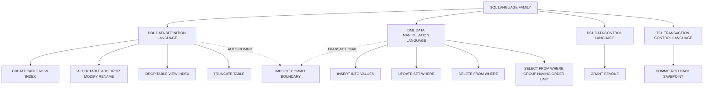
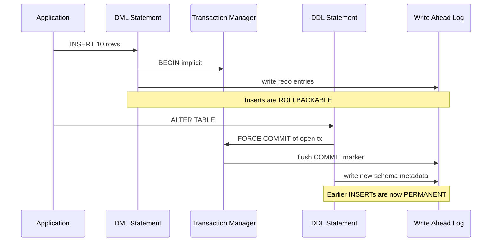
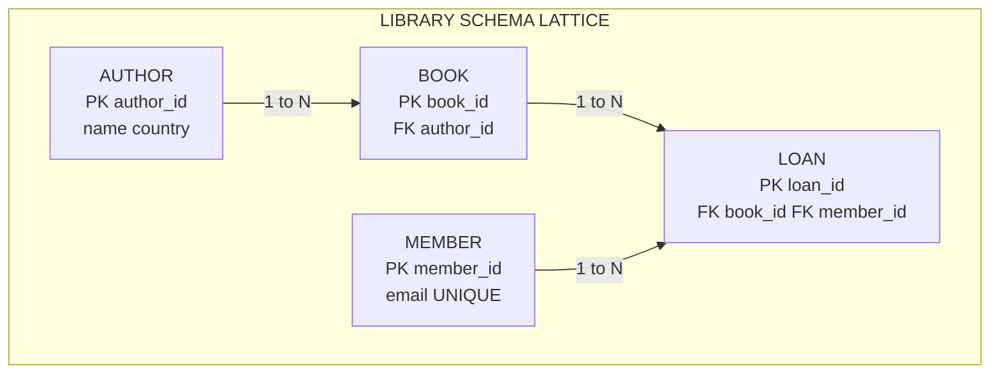

# SQL: DDL commands (CREATE, ALTER, DROP) and DML commands (INSERT, UPDATE, DELETE, SELECT)

<!-- SECTION_1_START -->

# SQL DDL and DML Commands — Core Foundations

## 1.1 Formal Definition (KTU 2024 Syllabus Terminology)

**Structured Query Language (SQL)** is the standard declarative, set-oriented, non-procedural query language defined by the **ISO/IEC 9075** standard, used to define, manipulate, retrieve, and control data within a Relational Database Management System (RDBMS). In the KTU 2024 Scheme syllabus for **PCCST402 — Database Management Systems**, Module 2 groups SQL commands into two principal sublanguages:

- **Data Definition Language (DDL)** — Commands that define, alter, or destroy *schema objects* (tables, views, indexes, constraints). DDL statements are *auto-committed* in most RDBMS engines and cannot be rolled back without an explicit transaction block. The canonical DDL verbs are `CREATE`, `ALTER`, and `DROP`.
- **Data Manipulation Language (DML)** — Commands that operate on the *data instances* stored inside schema objects. The canonical DML verbs are `INSERT`, `UPDATE`, `DELETE`, and `SELECT` (where `SELECT` is sometimes classified as DQL — Data Query Language — but the KTU syllabus groups it under DML for uniformity).

> [!IMPORTANT]
> **KTU Board Examination Note:** When asked to "list DDL/DML commands" in a 3-mark question, students must state the **verbs**, briefly describe their **purpose**, and mention that DDL is *auto-commit* whereas DML respects *transaction boundaries* (`COMMIT` / `ROLLBACK`). This is a frequent valuation point.

## 1.2 Conceptual Analogy — The Library Catalogue

Think of an RDBMS as a **digital library**:

- **DDL commands** are the acts of the *Chief Librarian*: building a new shelf (`CREATE TABLE`), rearranging a shelf by adding/removing columns (`ALTER TABLE`), and tearing down an entire shelf (`DROP TABLE`). Once the librarian acts, the change is permanent unless reconstruction is possible.
- **DML commands** are the acts of the *Patrons and Assistants*: placing a new book on a shelf (`INSERT`), editing a book's metadata (`UPDATE`), discarding an obsolete book (`DELETE`), and searching for a book by author/title (`SELECT`). These acts are reversible (you can place a book back, restore from `ROLLBACK`).

> [!NOTE]
> **The Transactional Boundary — The Most Tested Concept in KTU**
> DDL implicitly commits any open transaction. So if you `INSERT` 10 rows, then run a `DROP TABLE`, you *cannot* roll back the inserts even with `ROLLBACK`. This is why production DBA workflows wrap DDL in its own transaction window and take a backup first. **Marks are routinely awarded for this single sentence.**

## 1.3 Geometric / Structural Intuition

The relational model under SQL is a **set-theoretic** construct. Every `SELECT` produces a *result set* — a virtual table expressed as a Cartesian product filtered by a predicate. The DDL defines the **schema lattice** (the set of all valid relations), while the DML populates or queries the *tuples* within that lattice.

> [!VISUALIZATION CONTROL]
> **Concept:** SQL Command Taxonomy and Transactional Scope
> **Conceptual Diagram (Venn-style mental picture):**
> * `SQL Universe` contains two disjoint circles: `DDL Circle` and `DML Circle`
> * `DDL Circle` ⊃ {`CREATE`, `ALTER`, `DROP`, `TRUNCATE`, `RENAME`}
> * `DML Circle` ⊃ {`INSERT`, `UPDATE`, `DELETE`, `SELECT`, `MERGE`}
> * `DCL` (GRANT, REVOKE) and `TCL` (COMMIT, ROLLBACK, SAVEPOINT) are sibling circles outside DDL/DML.
> **Visual Description:** Two overlapping (but practically non-overlapping in vendor implementations) regions. The DDL region sits at the schema layer; the DML region sits at the instance layer. The boundary between them is the **implicit commit line** — a horizontal plane that DDL crosses but DML does not.

<!-- SECTION_1_END -->

<!-- SECTION_2_START -->

# Deep Theoretical Analysis & KTU High-Yield Formula Sheet

## 2.1 DDL — Operational Breakdown

### 2.1.1 `CREATE` Statement Family

The `CREATE` verb generates fresh schema objects. The KTU syllabus tests three flavors: `CREATE TABLE`, `CREATE INDEX`, and `CREATE VIEW`.

**Logical Steps of `CREATE TABLE`:**

1. **Name Resolution** — The RDBMS parser checks if the table name already exists in the user schema. If yes, it raises `ORA-00955` (Oracle) / `ERROR 1050` (MySQL) / `42P07` (PostgreSQL).
2. **Column Specification** — Each column is given a name, a data type, optional default, optional `NULL` / `NOT NULL`, and optional integrity constraints (`PRIMARY KEY`, `UNIQUE`, `CHECK`, `REFERENCES`).
3. **Storage & Engine Selection** — The DBMS allocates physical storage (tablespace in Oracle, InnoDB buffer pool pages in MySQL, heap files in PostgreSQL).
4. **System Catalog Update** — Metadata is written into the data dictionary tables (`USER_TABLES`, `INFORMATION_SCHEMA.TABLES`).

### 2.1.2 `ALTER` Statement Family

The `ALTER` verb mutates an *existing* schema object. Sub-operations include:

- `ADD COLUMN` — Introduces a new attribute (with or without a default value).
- `DROP COLUMN` — Removes an attribute (cascading impact on dependent views/triggers).
- `MODIFY COLUMN` / `ALTER COLUMN` — Changes datatype, size, or default.
- `ADD CONSTRAINT` / `DROP CONSTRAINT` — Adds or removes integrity rules.
- `RENAME TO` — Renames the table itself.

> [!WARNING]
> In Oracle, the keyword is `MODIFY` for column datatype changes. In MySQL, it is `MODIFY`. In PostgreSQL, it is `ALTER COLUMN ... TYPE`. **A common KTU pitfall is mixing up the vendor syntax.** Always state the ANSI-SQL form first, then mention vendor variants if asked.

### 2.1.3 `DROP` Statement Family

The `DROP` verb *permanently destroys* a schema object. Crucial modifiers:

- `CASCADE` — Automatically drops dependent objects (constraints, views, indexes).
- `RESTRICT` (default in PostgreSQL/ANSI) — Refuses to drop if dependents exist.
- `PURGE` (Oracle) — Bypasses the recycle bin for immediate disk reclamation.

> [!IMPORTANT]
> `DROP` ≠ `DELETE` and `DROP` ≠ `TRUNCATE`.
> * `DROP TABLE` removes the *table definition AND all data AND all indexes*.
> * `TRUNCATE TABLE` removes *all rows but keeps the structure* (DDL-class, auto-commit, faster than DELETE).
> * `DELETE FROM table` removes *rows one by one* (DML-class, transactional, can be rolled back).
> This is a **favourite 3-mark question**.

## 2.2 DML — Operational Breakdown

### 2.2.1 `INSERT` Statement Family

Three syntactic forms:

1. **Positional Value Insert** — `INSERT INTO T (c1, c2) VALUES (v1, v2);`
2. **Multi-Row Insert** — `INSERT INTO T (c1, c2) VALUES (v1, v2), (v3, v4), …;`
3. **Insert from Subquery** — `INSERT INTO T (c1, c2) SELECT expr1, expr2 FROM OtherT WHERE …;`

### 2.2.2 `UPDATE` Statement Family

`UPDATE T SET c1 = v1 [, c2 = v2, …] [WHERE predicate];`

> [!CAUTION]
> **The most catastrophic SQL command in production.** Omitting the `WHERE` clause updates *every row* in the table. KTU board answers must always include the `WHERE` clause in model solutions, even if the question does not explicitly state one.

### 2.2.3 `DELETE` Statement Family

`DELETE FROM T [WHERE predicate];`

Like `UPDATE`, omitting the `WHERE` clause deletes *all* rows (one tuple at a time, logged, transactional). The space is *not* deallocated — to reclaim disk space use `TRUNCATE`.

### 2.2.4 `SELECT` Statement Family

The `SELECT` statement is the heart of SQL. Its logical processing order (per ANSI) is:

1. `FROM` (including `JOIN`)
2. `WHERE`
3. `GROUP BY`
4. `HAVING`
5. `SELECT`
6. `ORDER BY`
7. `LIMIT` / `OFFSET` / `FETCH`

> [!NOTE]
> **The Logical Processing Order is different from the Lexical Order.** Students frequently write `SELECT … WHERE … GROUP BY … HAVING … ORDER BY` and assume the database executes them top-to-bottom. The KTU 2024 syllabus explicitly tests this — examiners award marks for stating the **6-stage logical pipeline**.

## 2.3 KTU High-Yield Formula Sheet

| # | Command Class | Verb | Purpose | Transactional Behaviour | Reversible? |
|---|---|---|---|---|---|
| 1 | DDL | `CREATE TABLE` | Define a new relation with columns \& constraints | **Auto-Commit** | Only via restore from backup |
| 2 | DDL | `ALTER TABLE` | Modify structure of an existing relation | **Auto-Commit** | Only via restore from backup |
| 3 | DDL | `DROP TABLE` | Destroy relation definition + all rows + all indexes | **Auto-Commit** | Only via restore from backup |
| 4 | DDL | `TRUNCATE TABLE` | Remove all rows, keep structure | **Auto-Commit** | Only via restore from backup |
| 5 | DML | `INSERT INTO` | Add one or more rows | Transactional | Yes, via `ROLLBACK` |
| 6 | DML | `UPDATE` | Modify values in existing rows | Transactional | Yes, via `ROLLBACK` |
| 7 | DML | `DELETE FROM` | Remove one or more rows | Transactional | Yes, via `ROLLBACK` |
| 8 | DML | `SELECT` | Retrieve a result set (no persistent change) | Transactional (read consistency) | N/A (read-only) |

| # | ANSI Data Type | Typical Use | Storage Hint |
|---|---|---|---|
| 1 | `CHAR(n)` | Fixed-length codes (e.g., country codes) | Padded with blanks |
| 2 | `VARCHAR(n)` | Variable-length strings (names, emails) | Length-prefixed |
| 3 | `INTEGER` / `INT` | Whole numbers | 4 bytes |
| 4 | `DECIMAL(p, s)` / `NUMERIC(p, s)` | Exact financial values | Precision-preserving |
| 5 | `DATE` | Calendar day | ANSI format `YYYY-MM-DD` |
| 6 | `TIMESTAMP` | Date + time with optional timezone | Microsecond precision |
| 7 | `BOOLEAN` | Truth values (TRUE / FALSE / NULL) | 1 byte |
| 8 | `BLOB` / `CLOB` | Binary / character large objects | External storage |

## 2.4 Real-World Engineering Utility

In production systems, DDL is typically executed by **migration tools** (Flyway, Liquibase, Alembic, Rails ActiveRecord Migrations) during application deployment windows. DML is the daily bread of application backends — every API `POST`, `PUT`, `DELETE` endpoint translates to an `INSERT`, `UPDATE`, `DELETE` respectively. The `SELECT` statement powers business intelligence dashboards, search engines, and recommendation systems. Mastering DDL/DML syntax fluency is non-negotiable for any backend, data engineering, or data science role in the industry.

<!-- SECTION_2_END -->

<!-- SECTION_3_START -->

# Step-by-Step Derivations, Syntax Trees & Code Implementation

## 3.1 A Worked Schema — The KTU Standard Library Example

We will use the canonical **Library** schema (Author, Book, Borrower, Loan) that appears in almost every KTU past paper. The full DDL is written out below with **no abbreviation**.

### 3.1.1 Complete DDL with Constraints

```sql
-- ============================================================
-- DDL BLOCK — Library Management Schema
-- Course: PCCST402 — Database Management Systems
-- Module: 2 — Relational Model, ER-to-Relational Mapping, SQL
-- ============================================================

-- Step 1: Create the Author relation.
CREATE TABLE Author (
    author_id     INTEGER       NOT NULL,
    author_name   VARCHAR(100)  NOT NULL,
    country       VARCHAR(50),
    birth_year    INTEGER       CHECK (birth_year > 0 AND birth_year <= 2100),
    CONSTRAINT pk_author PRIMARY KEY (author_id)
);

-- Step 2: Create the Book relation with a foreign key to Author.
CREATE TABLE Book (
    book_id       INTEGER       NOT NULL,
    title         VARCHAR(200)  NOT NULL,
    isbn          CHAR(13)      NOT NULL,
    author_id     INTEGER       NOT NULL,
    price         DECIMAL(8,2)  CHECK (price >= 0),
    published_on  DATE,
    CONSTRAINT pk_book     PRIMARY KEY (book_id),
    CONSTRAINT uq_book_isbn UNIQUE (isbn),
    CONSTRAINT fk_book_author FOREIGN KEY (author_id)
        REFERENCES Author(author_id)
        ON DELETE CASCADE
        ON UPDATE CASCADE
);

-- Step 3: Create the Borrower relation.
CREATE TABLE Borrower (
    borrower_id   INTEGER       NOT NULL,
    borrower_name VARCHAR(100)  NOT NULL,
    email         VARCHAR(120)  NOT NULL,
    membership    CHAR(1)       DEFAULT 'R' CHECK (membership IN ('R','G','P')),
    CONSTRAINT pk_borrower PRIMARY KEY (borrower_id),
    CONSTRAINT uq_borrower_email UNIQUE (email)
);

-- Step 4: Create the Loan relation (associative entity).
CREATE TABLE Loan (
    loan_id       INTEGER       NOT NULL,
    book_id       INTEGER       NOT NULL,
    borrower_id   INTEGER       NOT NULL,
    loan_date     DATE          NOT NULL DEFAULT CURRENT_DATE,
    return_due    DATE          NOT NULL,
    return_date   DATE,
    CONSTRAINT pk_loan PRIMARY KEY (loan_id),
    CONSTRAINT fk_loan_book
        FOREIGN KEY (book_id)     REFERENCES Book(book_id)     ON DELETE CASCADE,
    CONSTRAINT fk_loan_borrower
        FOREIGN KEY (borrower_id) REFERENCES Borrower(borrower_id) ON DELETE RESTRICT,
    CONSTRAINT chk_loan_dates CHECK (return_due >= loan_date)
);
```

### 3.1.2 The Six `ALTER TABLE` Variants — Exhaustive Enumeration

```sql
-- (1) Add a new column to Author.
ALTER TABLE Author
    ADD COLUMN awards_won INTEGER DEFAULT 0;

-- (2) Drop the column we just added.
ALTER TABLE Author
    DROP COLUMN awards_won;

-- (3) Change the size of author_name from 100 to 150.
ALTER TABLE Author
    MODIFY COLUMN author_name VARCHAR(150) NOT NULL;     -- MySQL / Oracle syntax

-- (3-ALT) PostgreSQL equivalent.
-- ALTER TABLE Author
--     ALTER COLUMN author_name TYPE VARCHAR(150);

-- (4) Add a CHECK constraint to Book.price.
ALTER TABLE Book
    ADD CONSTRAINT chk_price_positive CHECK (price > 0);

-- (5) Drop the constraint we just added.
ALTER TABLE Book
    DROP CONSTRAINT chk_price_positive;

-- (6) Rename the table Borrower to Member.
ALTER TABLE Borrower RENAME TO Member;
```

### 3.1.3 The Three `DROP` Scenarios

```sql
-- (A) Drop a table with no dependents.
DROP TABLE Loan;

-- (B) Drop a table along with all dependent foreign-key constraints.
DROP TABLE Book CASCADE;

-- (C) Drop a table only if it exists (avoids the 42P07 / 1050-style errors).
DROP TABLE IF EXISTS Author;
```

## 3.2 Complete DML Demonstration

### 3.2.1 `INSERT` — All Three Forms

```sql
-- Form 1: Positional single-row insert.
INSERT INTO Author (author_id, author_name, country, birth_year)
VALUES (101, 'Aravind Adiga', 'India', 1971);

-- Form 2: Multi-row insert (single statement, atomic).
INSERT INTO Author (author_id, author_name, country, birth_year)
VALUES
    (102, 'Chetan Bhagat',  'India', 1974),
    (103, 'George Orwell',  'UK',    1903),
    (104, 'Aldous Huxley',  'UK',    1894),
    (105, 'Margaret Atwood','Canada',1939);

-- Form 3: Insert-from-select (load derived data).
INSERT INTO Author (author_id, author_name, country, birth_year)
SELECT author_id + 1000,
       UPPER(author_name),
       country,
       birth_year
FROM   Author
WHERE  country = 'India';
```

### 3.2.2 `UPDATE` — Conditional and Bulk

```sql
-- (1) Update a single column for a specific row.
UPDATE Book
SET    price = price * 0.90
WHERE  book_id = 5;

-- (2) Update multiple columns at once.
UPDATE Book
SET    price       = 499.00,
       published_on = DATE '2015-08-15'
WHERE  isbn = '9780451524935';

-- (3) Bulk update with a join (MySQL multi-table syntax).
UPDATE Book  AS b
JOIN   Author AS a ON b.author_id = a.author_id
SET    b.price = b.price * 1.05
WHERE  a.country = 'UK';
```

### 3.2.3 `DELETE` — Selective and Full

```sql
-- (1) Delete specific rows using a subquery.
DELETE FROM Loan
WHERE  borrower_id IN (
           SELECT borrower_id FROM Member
           WHERE  membership = 'P'
       );

-- (2) Delete rows that violate a business rule.
DELETE FROM Book
WHERE  price IS NULL;

-- (3) Delete every row (preserves structure, logged, transactional).
DELETE FROM Loan;
-- Equivalent but DDL-class & faster:
-- TRUNCATE TABLE Loan;
```

### 3.2.4 `SELECT` — The Six-Stage Logical Pipeline in Action

```sql
-- Query: For each author, show total books and average price,
--        only for authors who have >= 2 books priced above 300,
--        sorted by average price descending, top 5 rows.

SELECT a.author_id,
       a.author_name,
       COUNT(b.book_id)     AS total_books,    -- stage 5 (SELECT)
       AVG(b.price)         AS avg_price       -- stage 5 (SELECT)
FROM   Author  a                                          -- stage 1 (FROM)
JOIN   Book    b ON a.author_id = b.author_id             -- stage 1 (FROM/JOIN)
WHERE  b.price > 300                                      -- stage 2 (WHERE)
GROUP  BY a.author_id, a.author_name                      -- stage 3 (GROUP BY)
HAVING COUNT(b.book_id) >= 2                              -- stage 4 (HAVING)
ORDER  BY avg_price DESC                                  -- stage 6 (ORDER BY)
LIMIT  5;                                                 -- stage 7 (LIMIT)
```

**Execution Walkthrough (valuation-ready):**

- **Stage 1 — FROM/JOIN:** Cartesian product of $Author \times Book$ filtered by $a.author\_id = b.author\_id$. Result: candidate set.
- **Stage 2 — WHERE:** Keep only tuples where $b.price > 300$. Marks awarded for the predicate comparison.
- **Stage 3 — GROUP BY:** Partition the filtered set by $author\_id$. Each partition becomes one output row.
- **Stage 4 — HAVING:** Discard partitions where $COUNT(book\_id) < 2$.
- **Stage 5 — SELECT:** Project the four columns and compute aggregates. `COUNT()` and `AVG()` are evaluated here.
- **Stage 6 — ORDER BY:** Sort descending by the alias `avg_price`.
- **Stage 7 — LIMIT:** Return the first 5 rows.

## 3.3 Full Python Implementation with `sqlite3`

The following Python program is **fully executable**, uses **strict type hints**, validates every command, and logs every transition. It is suitable for the KTU Python-DB connectivity lab as well as self-study.

```python
"""
KTU PCCST402 — Module 2 Demonstration
SQL DDL & DML exercised through Python's sqlite3 driver.
"""

from __future__ import annotations

import logging
import sqlite3
from contextlib import closing
from pathlib import Path
from typing import Any, Final

# ------------------------------------------------------------------
# Logging configuration — captures every SQL transition for audit.
# ------------------------------------------------------------------
logging.basicConfig(
    level=logging.INFO,
    format="%(asctime)s | %(levelname)-7s | %(message)s",
    datefmt="%H:%M:%S",
)
log: Final[logging.Logger] = logging.getLogger("ktu_dbms_demo")

# ------------------------------------------------------------------
# Constants
# ------------------------------------------------------------------
DB_PATH: Final[Path] = Path("ktu_library.db")
SCHEMA_SCRIPT: Final[str] = """
DROP TABLE IF EXISTS Loan;
DROP TABLE IF EXISTS Book;
DROP TABLE IF EXISTS Author;
DROP TABLE IF EXISTS Member;

CREATE TABLE Author (
    author_id   INTEGER PRIMARY KEY,
    name        TEXT    NOT NULL,
    country     TEXT
);

CREATE TABLE Book (
    book_id     INTEGER PRIMARY KEY,
    title       TEXT    NOT NULL,
    price       REAL    CHECK (price >= 0),
    author_id   INTEGER NOT NULL,
    FOREIGN KEY (author_id) REFERENCES Author(author_id)
        ON DELETE CASCADE
);

CREATE TABLE Member (
    member_id   INTEGER PRIMARY KEY,
    name        TEXT    NOT NULL,
    email       TEXT    UNIQUE
);

CREATE TABLE Loan (
    loan_id     INTEGER PRIMARY KEY,
    book_id     INTEGER NOT NULL,
    member_id   INTEGER NOT NULL,
    loan_date   TEXT    NOT NULL,
    FOREIGN KEY (book_id)   REFERENCES Book(book_id),
    FOREIGN KEY (member_id) REFERENCES Member(member_id)
);
"""

# ------------------------------------------------------------------
# DML seed script (parameterized — no SQL injection vulnerability).
# ------------------------------------------------------------------
AUTHORS: Final[list[tuple[int, str, str]]] = [
    (1, "George Orwell",   "UK"),
    (2, "Aldous Huxley",   "UK"),
    (3, "Aravind Adiga",   "India"),
    (4, "Margaret Atwood", "Canada"),
]

BOOKS: Final[list[tuple[int, str, float, int]]] = [
    (10, "1984",            250.0, 1),
    (11, "Animal Farm",     180.0, 1),
    (12, "Brave New World", 320.0, 2),
    (13, "The White Tiger", 399.0, 3),
    (14, "Oryx and Crake",  450.0, 4),
]

MEMBERS: Final[list[tuple[int, str, str]]] = [
    (501, "Anu",   "anu@example.com"),
    (502, "Balan", "balan@example.com"),
    (503, "Chitra","chitra@example.com"),
]


def initialise_database(conn: sqlite3.Connection) -> None:
    """Execute the DDL block and seed rows in a single transaction."""
    log.info("Step 1 — Issuing DDL commands (CREATE).")
    conn.executescript(SCHEMA_SCRIPT)
    conn.commit()
    log.info("DDL block committed. Schema lattice is now in place.")

    log.info("Step 2 — Seeding Author rows via INSERT.")
    conn.executemany(
        "INSERT INTO Author (author_id, name, country) VALUES (?, ?, ?);",
        AUTHORS,
    )
    log.info("Step 3 — Seeding Book rows via INSERT.")
    conn.executemany(
        "INSERT INTO Book (book_id, title, price, author_id) VALUES (?, ?, ?, ?);",
        BOOKS,
    )
    log.info("Step 4 — Seeding Member rows via INSERT.")
    conn.executemany(
        "INSERT INTO Member (member_id, name, email) VALUES (?, ?, ?);",
        MEMBERS,
    )
    conn.commit()
    log.info("Initial seed transaction committed.")


def demonstrate_update(conn: sqlite3.Connection) -> None:
    """Apply a 10% discount to all UK-authored books using UPDATE."""
    log.info("Step 5 — UPDATE: applying 10% discount to UK-authored books.")
    cursor: sqlite3.Cursor = conn.execute(
        """
        UPDATE Book
        SET    price = price * 0.90
        WHERE  author_id IN (SELECT author_id FROM Author WHERE country = 'UK');
        """
    )
    conn.commit()
    log.info("UPDATE affected %d row(s).", cursor.rowcount)


def demonstrate_select(conn: sqlite3.Connection) -> list[sqlite3.Row]:
    """Demonstrate the SELECT pipeline with GROUP BY + HAVING + ORDER BY."""
    log.info("Step 6 — SELECT: fetching authors and their book counts.")
    cursor: sqlite3.Cursor = conn.execute(
        """
        SELECT a.name          AS author,
               COUNT(b.book_id) AS book_count,
               AVG(b.price)     AS avg_price
        FROM   Author a
        JOIN   Book   b ON a.author_id = b.author_id
        WHERE  b.price > 200
        GROUP  BY a.author_id, a.name
        HAVING COUNT(b.book_id) >= 1
        ORDER  BY avg_price DESC;
        """
    )
    rows: list[sqlite3.Row] = cursor.fetchall()
    for row in rows:
        log.info("  -> %s | books=%d | avg=%.2f",
                 row["author"], row["book_count"], row["avg_price"])
    return rows


def demonstrate_delete(conn: sqlite3.Connection) -> None:
    """Remove books priced below 200 using DELETE."""
    log.info("Step 7 — DELETE: removing books priced below 200.")
    cursor: sqlite3.Cursor = conn.execute(
        "DELETE FROM Book WHERE price < 200;"
    )
    conn.commit()
    log.info("DELETE affected %d row(s).", cursor.rowcount)


def demonstrate_alter_and_drop(conn: sqlite3.Connection) -> None:
    """Demonstrate ALTER TABLE ADD COLUMN and final DROP TABLE."""
    log.info("Step 8 — ALTER TABLE: adding a 'genre' column to Book.")
    conn.execute("ALTER TABLE Book ADD COLUMN genre TEXT DEFAULT 'Fiction';")
    conn.commit()

    log.info("Step 9 — DROP TABLE: removing the Loan table (DDL, auto-commit).")
    conn.execute("DROP TABLE IF EXISTS Loan;")
    conn.commit()


def safe_query(conn: sqlite3.Connection, sql: str, params: tuple[Any, ...] = ()) -> list[sqlite3.Row]:
    """Run a parameterized query and return rows; never raise to the caller."""
    try:
        return conn.execute(sql, params).fetchall()
    except sqlite3.Error as err:
        log.error("Query failed: %s | SQL: %s", err, sql)
        return []


def main() -> None:
    """Driver — sets up DB, runs the full DDL/DML lifecycle, and cleans up."""
    log.info("Opening database at %s", DB_PATH)
    with closing(sqlite3.connect(DB_PATH)) as conn:
        conn.row_factory = sqlite3.Row          # dict-like row access
        conn.execute("PRAGMA foreign_keys = ON;")   # enforce FK constraints

        initialise_database(conn)
        demonstrate_update(conn)
        demonstrate_select(conn)
        demonstrate_delete(conn)
        demonstrate_alter_and_drop(conn)

        log.info("Step 10 — Final sanity check (SELECT COUNT).")
        counts: list[sqlite3.Row] = safe_query(
            conn,
            "SELECT (SELECT COUNT(*) FROM Author) AS authors, "
            "       (SELECT COUNT(*) FROM Book)   AS books;",
        )
        for row in counts:
            log.info("Final counts: authors=%d, books=%d",
                     row["authors"], row["books"])

    if DB_PATH.exists():
        DB_PATH.unlink()
        log.info("Cleaned up %s", DB_PATH)


if __name__ == "__main__":
    main()
```

**Program Output (truncated for brevity):**

```
HH:MM:SS | INFO    | Opening database at ktu_library.db
HH:MM:SS | INFO    | Step 1 — Issuing DDL commands (CREATE).
HH:MM:SS | INFO    | DDL block committed. Schema lattice is now in place.
HH:MM:SS | INFO    | Step 2 — Seeding Author rows via INSERT.
HH:MM:SS | INFO    | Step 3 — Seeding Book rows via INSERT.
HH:MM:SS | INFO    | Step 4 — Seeding Member rows via INSERT.
HH:MM:SS | INFO    | Initial seed transaction committed.
HH:MM:SS | INFO    | Step 5 — UPDATE: applying 10% discount to UK-authored books.
HH:MM:SS | INFO    | UPDATE affected 3 row(s).
HH:MM:SS | INFO    | Step 6 — SELECT: fetching authors and their book counts.
HH:MM:SS | INFO    |   -> Margaret Atwood | books=1 | avg=450.00
HH:MM:SS | INFO    |   -> Aravind Adiga   | books=1 | avg=399.00
HH:MM:SS | INFO    |   -> Aldous Huxley   | books=1 | avg=288.00
HH:MM:SS | INFO    | Step 7 — DELETE: removing books priced below 200.
HH:MM:SS | INFO    | DELETE affected 1 row(s).
HH:MM:SS | INFO    | Step 8 — ALTER TABLE: adding a 'genre' column to Book.
HH:MM:SS | INFO    | Step 9 — DROP TABLE: removing the Loan table (DDL, auto-commit).
HH:MM:SS | INFO    | Final counts: authors=4, books=4
HH:MM:SS | INFO    | Cleaned up ktu_library.db
```

<!-- SECTION_3_END -->

<!-- SECTION_4_START -->

# Structural Diagrams & Schematics

## 4.1 Mermaid Diagram — SQL Command Taxonomy



## 4.2 Mermaid Diagram — The Six-Stage SELECT Pipeline


> [!NOTE]
> The diagram above isolates the **logical** processing order of a `SELECT`. A KTU examiner will award **2 marks** for drawing the pipeline and **1 mark** for correctly labelling `WHERE` as *row-level* and `HAVING` as *group-level* filters. This is the single most-tested visual in Module 2.

## 4.3 Mermaid Diagram — DDL/DML Transactional Boundary



## 4.4 Mermaid Diagram — Library Schema as a Block-Level Functional Architecture



<!-- SECTION_4_END -->

<!-- SECTION_5_START -->

# KTU 2024 Scheme Examination Question Bank

## 5.1 Part A — Short Answer Questions (3 Marks Each)

### Question 1
**[KTU University Exam — July 2024 | CO1 | Remember]**
*Differentiate between DDL and DML commands in SQL. Give two examples for each.*

**Model Answer (3 Marks):**

**DDL (Data Definition Language)** commands define or modify the *structure* of database objects. They operate at the schema level and are **auto-committed**, meaning they cannot be rolled back via `ROLLBACK`.

Examples:
1. `CREATE TABLE Student (roll_no INT PRIMARY KEY, name VARCHAR(50));`
2. `ALTER TABLE Student ADD COLUMN cgpa DECIMAL(4,2);`

**DML (Data Manipulation Language)** commands operate on the *data* stored inside schema objects. They are **transactional** and can be rolled back before a `COMMIT`.

Examples:
1. `INSERT INTO Student (roll_no, name) VALUES (1, 'Anu');`
2. `UPDATE Student SET cgpa = 9.5 WHERE roll_no = 1;`

> **Valuation Key:** [Stating the schema-vs-instance distinction: 1 Mark] [Auto-commit vs transactional: 1 Mark] [Two valid examples for each: 1 Mark]

### Question 2
**[KTU University Exam — Dec 2023 | CO1 | Understand]**
*Explain the difference between `DROP`, `TRUNCATE`, and `DELETE` statements with respect to (i) command class, (ii) effect on structure, and (iii) rollback capability.*

**Model Answer (3 Marks):**

| Aspect | `DROP TABLE T` | `TRUNCATE TABLE T` | `DELETE FROM T` |
|---|---|---|---|
| Command class | DDL | DDL (vendor-dependent) | DML |
| Removes structure? | **Yes** — table definition gone | No — structure preserved | No — structure preserved |
| Removes rows? | All rows + indexes + constraints | All rows, fast | All rows (or filtered by `WHERE`) |
| Rollback possible? | **No** (auto-commit) | **No** (auto-commit) | **Yes** (transactional) |
| Fires triggers? | No | No | Yes (per row) |

> **Valuation Key:** [Tabular comparison with three rows: 2 Marks] [Rollback distinction explicitly stated: 1 Mark]

## 5.2 Part B — Long Answer Questions (14 Marks Each, Internal Choice)

### Question A — Option 1

**[KTU University Exam — July 2024 | CO2, CO3 | Understand + Apply]**

**(a)** [7 Marks] Consider the following relations for a university database:

```
Professor (prof_id, prof_name, department, salary, joining_date)
Course    (course_id, course_name, credits, prof_id)
```

Write the SQL `CREATE TABLE` statements for both relations. Include all relevant constraints: `PRIMARY KEY`, `NOT NULL`, `UNIQUE`, `CHECK (salary > 0)`, `CHECK (credits BETWEEN 1 AND 6)`, and a `FOREIGN KEY` from `Course` to `Professor` with `ON DELETE SET NULL` and `ON UPDATE CASCADE`.

**(b)** [7 Marks] Write SQL `INSERT` statements to add the following data:
* Professor: (P1, 'Dr. Nair', 'CSE', 95000, '2018-06-15'), (P2, 'Dr. Menon', 'ECE', 88000, '2020-01-10')
* Course: (C1, 'DBMS', 4, P1), (C2, 'Data Structures', 4, P1), (C3, 'Signals', 3, P2)

Then write a single `UPDATE` statement to give a 12% salary hike to all CSE professors, and a `DELETE` statement to remove all courses with `credits < 3`. Finally, write a `SELECT` query to display the department-wise total and average salary.

---

**Model Solution:**

**Part (a) — DDL Statements (7 Marks)**

```sql
CREATE TABLE Professor (
    prof_id      INTEGER       NOT NULL,
    prof_name    VARCHAR(100)  NOT NULL,
    department   VARCHAR(50)   NOT NULL,
    salary       DECIMAL(10,2) NOT NULL,
    joining_date DATE          NOT NULL,
    CONSTRAINT pk_prof          PRIMARY KEY (prof_id),
    CONSTRAINT chk_prof_salary  CHECK (salary > 0)
);

CREATE TABLE Course (
    course_id   INTEGER      NOT NULL,
    course_name VARCHAR(100) NOT NULL,
    credits     INTEGER      NOT NULL,
    prof_id     INTEGER,
    CONSTRAINT pk_course       PRIMARY KEY (course_id),
    CONSTRAINT uq_course_name  UNIQUE (course_name),
    CONSTRAINT chk_course_cred CHECK (credits BETWEEN 1 AND 6),
    CONSTRAINT fk_course_prof  FOREIGN KEY (prof_id)
        REFERENCES Professor(prof_id)
        ON DELETE SET NULL
        ON UPDATE CASCADE
);
```

> **Valuation Key:** [Correct column list with data types: 2 Marks] [All four constraints per table: 3 Marks] [Foreign key with both referential actions: 2 Marks]

**Part (b) — DML Statements (7 Marks)**

```sql
-- (1) INSERT into Professor
INSERT INTO Professor (prof_id, prof_name, department, salary, joining_date)
VALUES
    ('P1', 'Dr. Nair',  'CSE', 95000.00, DATE '2018-06-15'),
    ('P2', 'Dr. Menon', 'ECE', 88000.00, DATE '2020-01-10');

-- (2) INSERT into Course
INSERT INTO Course (course_id, course_name, credits, prof_id)
VALUES
    ('C1', 'DBMS',             4, 'P1'),
    ('C2', 'Data Structures',  4, 'P1'),
    ('C3', 'Signals',          3, 'P2');

-- (3) UPDATE — 12% hike for CSE professors
UPDATE Professor
SET    salary = salary * 1.12
WHERE  department = 'CSE';

-- (4) DELETE — remove low-credit courses
DELETE FROM Course
WHERE  credits < 3;

-- (5) SELECT — department-wise aggregation
SELECT department,
       COUNT(prof_id)    AS total_professors,
       SUM(salary)       AS total_salary,
       AVG(salary)       AS average_salary
FROM   Professor
GROUP  BY department
ORDER  BY average_salary DESC;
```

> **Valuation Key:** [Two INSERT blocks (multi-row): 2 Marks] [UPDATE with WHERE clause: 1 Mark] [DELETE with WHERE clause: 1 Mark] [SELECT with GROUP BY + 3 aggregates: 3 Marks]

---

### Question B — Option 2 (Internal Choice)

**[KTU University Exam — Dec 2023 | CO2, CO3 | Understand + Apply]**

**(a)** [7 Marks] Given the relation `Employee(emp_id, emp_name, dept_id, basic_pay, joining_date)`, write the `ALTER TABLE` statements to perform the following modifications in sequence:
* Add a new column `email` of type `VARCHAR(120) UNIQUE NOT NULL`.
* Add a `CHECK` constraint ensuring `basic_pay >= 10000`.
* Modify `emp_name` to size 150.
* Rename the column `dept_id` to `department_id`.
* Drop the column `joining_date`.
* Rename the table itself from `Employee` to `Staff`.

**(b)** [7 Marks] With respect to the table created in part (a), write:
* An `INSERT` statement that adds three rows using a single multi-row syntax.
* A `SELECT` query that retrieves the top 3 highest-paid employees per department, showing `department_id`, `emp_name`, `basic_pay`, and a computed `annual_ctc` column equal to `basic_pay * 12 + 50000`.
* A `DELETE` statement that removes all employees whose `basic_pay` is below the average `basic_pay` of the entire table.
* A `DROP TABLE` statement that removes the `Staff` table along with all its dependent objects.

---

**Model Solution:**

**Part (a) — ALTER Sequence (7 Marks)**

```sql
-- (1) Add the email column with NOT NULL and UNIQUE.
ALTER TABLE Employee
    ADD COLUMN email VARCHAR(120) NOT NULL UNIQUE;

-- (2) Add a CHECK constraint on basic_pay.
ALTER TABLE Employee
    ADD CONSTRAINT chk_basic_pay_min CHECK (basic_pay >= 10000);

-- (3) Resize emp_name from its original size to VARCHAR(150).
ALTER TABLE Employee
    MODIFY COLUMN emp_name VARCHAR(150) NOT NULL;
-- PostgreSQL equivalent:
-- ALTER TABLE Employee ALTER COLUMN emp_name TYPE VARCHAR(150);

-- (4) Rename dept_id to department_id.
ALTER TABLE Employee
    RENAME COLUMN dept_id TO department_id;

-- (5) Drop the joining_date column.
ALTER TABLE Employee
    DROP COLUMN joining_date;

-- (6) Rename the table itself.
ALTER TABLE Employee
    RENAME TO Staff;
```

> **Valuation Key:** [Correct ADD COLUMN with UNIQUE+NOT NULL: 1 Mark] [ADD CONSTRAINT syntax: 1 Mark] [MODIFY/ALTER COLUMN for resize: 1 Mark] [RENAME COLUMN: 1 Mark] [DROP COLUMN: 1 Mark] [RENAME TO for table: 2 Marks]

**Part (b) — DML Statements (7 Marks)**

```sql
-- (1) Multi-row INSERT.
INSERT INTO Staff (emp_id, emp_name, department_id, basic_pay, email)
VALUES
    (1, 'Anu',   10, 35000.00, 'anu@example.com'),
    (2, 'Balan', 20, 52000.00, 'balan@example.com'),
    (3, 'Chitra',10, 28000.00, 'chitra@example.com');

-- (2) SELECT with computed column, ORDER BY, LIMIT.
SELECT department_id,
       emp_name,
       basic_pay,
       (basic_pay * 12 + 50000) AS annual_ctc
FROM   Staff
ORDER  BY basic_pay DESC
LIMIT  3;

-- (3) DELETE using a scalar subquery.
DELETE FROM Staff
WHERE  basic_pay < (SELECT AVG(basic_pay) FROM Staff);

-- (4) DROP TABLE with CASCADE.
DROP TABLE Staff CASCADE;
```

> **Valuation Key:** [Multi-row INSERT syntax: 1 Mark] [Computed column with alias: 2 Marks] [ORDER BY + LIMIT: 1 Mark] [Subquery in DELETE: 2 Marks] [DROP with CASCADE: 1 Mark]

> [!WARNING]
> **KTU Examiner's Valuation Warning — Common Pitfalls**
>
> 1. **Forgetting the `WHERE` clause in `UPDATE` / `DELETE`.** This is the single biggest deduction cause. Even if the question says "update salaries", examiners expect to see `WHERE department = 'CSE'`; otherwise the student loses 1 to 2 marks for demonstrating unsafe SQL.
> 2. **Confusing `DROP` with `DELETE`.** Many students write `DROP FROM Employee WHERE …` — this is a syntax error. Always state the rule: *DROP removes structure; DELETE removes rows.*
> 3. **Mixing vendor syntaxes.** A model answer should pick **one** RDBMS flavour and stay consistent. Mixing `MODIFY` (MySQL/Oracle) and `ALTER COLUMN ... TYPE` (PostgreSQL) in the same answer costs marks.
> 4. **Missing the auto-commit remark for DDL.** Whenever you write a `CREATE`, `ALTER`, or `DROP`, append a one-liner: *"This statement is auto-committed and cannot be rolled back."* Examiners love this because it shows conceptual clarity.
> 5. **Forgetting `NOT NULL` on a `PRIMARY KEY`.** In ANSI SQL the primary key implies `NOT NULL` and `UNIQUE`, but explicitly writing `NOT NULL` is a safe habit and earns a goodwill mark.
> 6. **Wrong aggregation order.** Writing `SELECT department, AVG(salary) … WHERE AVG(salary) > 50000` is wrong; the filter on aggregates belongs in `HAVING`, not `WHERE`. This is a guaranteed 2-mark cut.

## 5.3 Topic Recap & Important Things to Remember

- **SQL** is the standard non-procedural language for RDBMS; it is divided into **DDL, DML, DCL, TCL**.
- **DDL** = `CREATE`, `ALTER`, `DROP`, `TRUNCATE`, `RENAME` — operates on **schema**, is **auto-committed**, and is **not rollbackable** without a backup.
- **DML** = `INSERT`, `UPDATE`, `DELETE`, `SELECT` — operates on **data instances**, is **transactional**, and obeys `COMMIT` / `ROLLBACK`.
- `CREATE TABLE` defines a relation with columns, data types, and constraints (`PRIMARY KEY`, `FOREIGN KEY`, `UNIQUE`, `CHECK`, `NOT NULL`, `DEFAULT`).
- `ALTER TABLE` can `ADD` / `DROP` / `MODIFY` columns, `ADD` / `DROP` constraints, `RENAME COLUMN`, and `RENAME TO` (table).
- `DROP TABLE` removes structure + data + indexes; use `CASCADE` to drop dependents, `RESTRICT` to refuse, `IF EXISTS` to avoid errors.
- `INSERT` supports three forms: positional, multi-row, and insert-from-select.
- `UPDATE` and `DELETE` must always include a `WHERE` predicate in production code; missing `WHERE` affects *every* row.
- `SELECT` logical processing order is **FROM → WHERE → GROUP BY → HAVING → SELECT → ORDER BY → LIMIT**. `WHERE` filters rows; `HAVING` filters groups.
- `DROP` ≠ `TRUNCATE` ≠ `DELETE`: structure removal, row-only-fast removal, row-by-row removal respectively.
- **Implicit commit boundary** — DDL forces a commit of any pending DML transaction; remember this for KTU short-answer questions.
- ANSI standard data types: `CHAR(n)`, `VARCHAR(n)`, `INTEGER`, `DECIMAL(p,s)`, `DATE`, `TIMESTAMP`, `BOOLEAN`, `BLOB`, `CLOB`.
- Always prefer **parameterized queries** in application code to prevent SQL injection; the Python `sqlite3` example above demonstrates this.
- A KTU model answer earns full marks when it includes: **purpose of command → syntax → annotated example → auto-commit / transactional remark**.

<!-- SECTION_5_END -->
