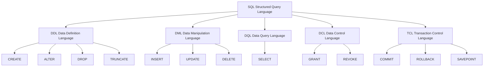
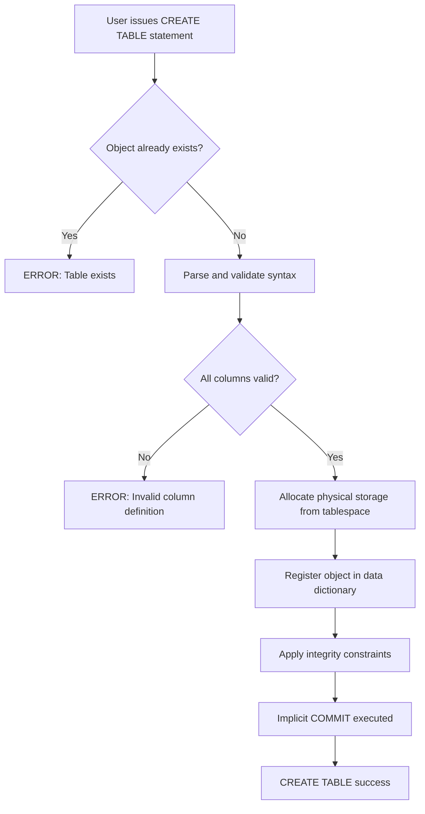
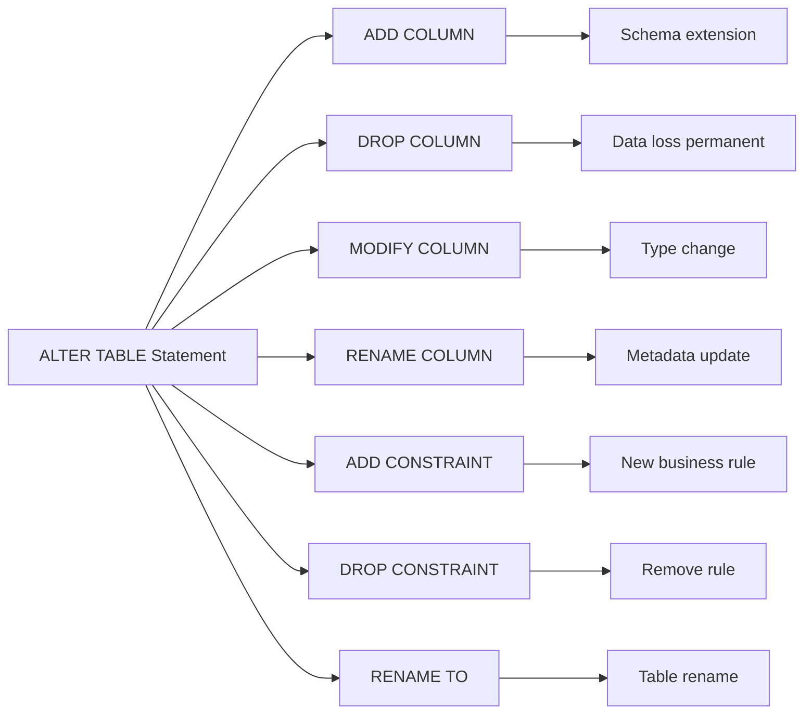
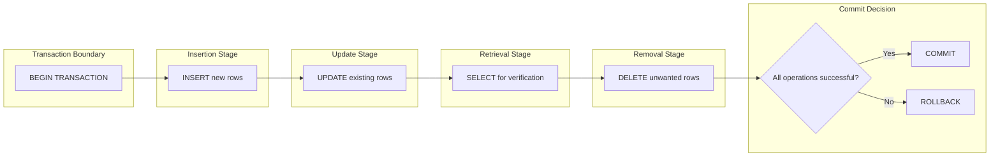
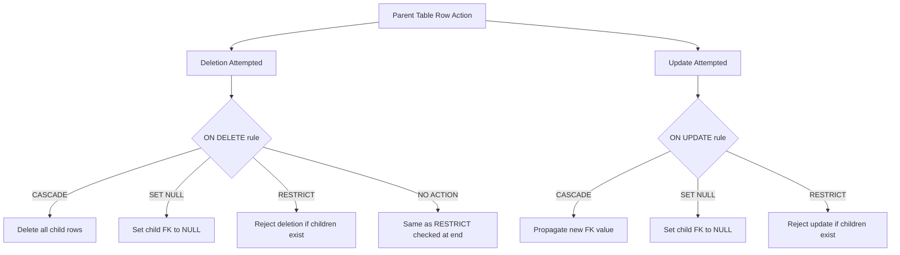

# SQL: DDL commands (CREATE, ALTER, DROP) and DML commands (INSERT, UPDATE, DELETE, SELECT)

<!-- SECTION_1_START -->

# SQL DDL \& DML: The Building Blocks of Database Interaction

> [!IMPORTANT]
> **KTU 2024 Scheme | PCCST402 | Module 2 | High-Weightage Topic**
> This note covers the **structural** (DDL) and **manipulative** (DML) sublanguages of SQL, which together form the foundation for every relational database interaction tested in KTU End Semester Examinations.

## 1.1 Formal Academic Definition

**Structured Query Language (SQL)** is the standard declarative, set-oriented, non-procedural query language defined by the **ISO/IEC 9075** standard, used to define, manipulate, retrieve, and control data in a **Relational Database Management System (RDBMS)**. Within SQL, two critical sublanguages are:

- **Data Definition Language (DDL)** — A subset of SQL used to define, alter, and remove the **schema** (structural blueprint) of database objects such as tables, views, indexes, and constraints. The primary DDL commands are `CREATE`, `ALTER`, and `DROP`. DDL statements are **auto-committed**, meaning their effects are permanently recorded in the data dictionary upon successful execution.
- **Data Manipulation Language (DML)** — A subset of SQL used to insert, modify, retrieve, and delete the **data** (instances/tuples) stored within schema objects. The core DML commands are `INSERT`, `UPDATE`, `DELETE`, and `SELECT` (often called DQL — Data Query Language in strict classification, but grouped with DML in the KTU 2024 syllabus).

> [!NOTE]
> **Syllabus Highlight:** As per the **KTU 2024 Scheme (PCCST402, Module 2)**, students are expected to write syntactically correct `CREATE TABLE` statements (with all integrity constraints), perform schema evolution using `ALTER`, and execute all four DML commands with appropriate `WHERE` predicates and subqueries.

## 1.2 Conceptual Analogy: SQL as Architecture \& Construction

Imagine you are constructing a multi-storey library:

| SQL Concept | Real-World Analogy | Role |
|-------------|-------------------|------|
| `CREATE DATABASE` | Buying the land | Allocates physical storage space |
| `CREATE TABLE` | Drawing the floor plan | Defines room structure (columns \& types) |
| **DDL Constraints** (`PRIMARY KEY`, `FOREIGN KEY`, `CHECK`) | Building codes \& locks | Enforce structural integrity |
| `INSERT` | Placing books on shelves | Populates rows (tuples) into the table |
| `UPDATE` | Replacing torn pages | Modifies existing data in place |
| `DELETE` | Discarding obsolete books | Removes tuples that violate business rules |
| `SELECT` | Searching for a book | Retrieves data without modifying it |
| `ALTER TABLE` | Renovation / extension | Adds new columns (rooms) to existing table |
| `DROP TABLE` | Demolition | Permanently removes the entire structure and data |

> [!TIP]
> **Geometric Intuition:** Think of a relational table as a **2D matrix** in $n$-dimensional space, where each **column** is a fixed **coordinate axis** (attribute domain) and each **row** is a discrete **point** (tuple) in that space. DDL defines the **axes and their units**, while DML plots, moves, and erases **points** on this grid.

## 1.3 Standard Data Types Used in DDL (Quick Reference)

| Category | Common Types | Storage Notes |
|----------|-------------|---------------|
| Exact Numeric | `INT`, `SMALLINT`, `BIGINT`, `DECIMAL(p,s)` | `DECIMAL` preserves precision for financial data |
| Approximate Numeric | `FLOAT`, `REAL`, `DOUBLE PRECISION` | Avoid for monetary calculations |
| Character | `CHAR(n)`, `VARCHAR(n)` | `CHAR` pads with blanks; `VARCHAR` is variable |
| Date/Time | `DATE`, `TIME`, `TIMESTAMP`, `INTERVAL` | Format: `YYYY-MM-DD` (ISO 8601) |
| Boolean | `BOOLEAN` | Stores `TRUE`, `FALSE`, or `UNKNOWN` (`NULL`) |
| Large Objects | `BLOB`, `CLOB` | Binary / Character Large Objects |

<!-- SECTION_1_END -->

<!-- SECTION_2_START -->

# Deep Theoretical Analysis \& KTU High-Yield Formula Sheet

## 2.1 The SQL Command Taxonomy

SQL is broadly partitioned into five sublanguages. Understanding this hierarchy is **frequently tested** in KTU Part A questions.

$$
\text{SQL} = \underbrace{\text{DDL}}_{\text{Schema}} \cup \underbrace{\text{DML}}_{\text{Data}} \cup \underbrace{\text{DQL}}_{\text{SELECT}} \cup \underbrace{\text{DCL}}_{\text{Security}} \cup \underbrace{\text{TCL}}_{\text{Transactions}}
$$

> [!IMPORTANT]
> **Auto-Commit Property of DDL:** Unlike DML, which can be rolled back using `ROLLBACK` (when inside a transaction), DDL statements trigger an **implicit `COMMIT`** in most RDBMS (Oracle, PostgreSQL, MySQL). This is a high-frequency KTU viva question.

## 2.2 DDL Command Breakdown

### 2.2.1 `CREATE` — The Foundation Command
`CREATE` is used to instantiate new database objects. The two most critical forms are `CREATE DATABASE` and `CREATE TABLE`.

**Operational Logic Steps:**
1. Verify the user has `CREATE` privilege on the parent object.
2. Check if an object with the same name already exists (use `IF NOT EXISTS` to avoid error).
3. Validate all column definitions, data types, and constraints.
4. Allocate physical storage pages from the tablespace.
5. Register the object in the **system catalog** (data dictionary).
6. Commit the change (auto-commit).

### 2.2.2 `ALTER` — Schema Evolution
`ALTER TABLE` modifies an existing table's structure without dropping it. Allowed operations:
- `ADD` — append a new column or constraint.
- `DROP COLUMN` — remove an existing column (data is lost permanently).
- `MODIFY` / `ALTER COLUMN` — change data type, size, or default of an existing column.
- `RENAME TO` / `RENAME COLUMN` — rename the table or a column.
- `ADD CONSTRAINT` / `DROP CONSTRAINT` — manage integrity rules.

### 2.2.3 `DROP` — Irreversible Removal
`DROP` permanently deletes the object **and all its data** from the database. There is no `UNDO` (unless a backup exists). The `CASCADE` option also drops dependent objects (views, constraints, foreign keys).

> [!WARNING]
> **`DROP` vs `TRUNCATE`:** A frequent KTU pitfall. `DROP TABLE` removes the **structure** (definition) too; `TRUNCATE TABLE` removes only the **rows** but preserves the structure. `TRUNCATE` is a DDL command (auto-committed) and is **faster** than `DELETE` because it does not generate individual row delete logs.

## 2.3 DML Command Breakdown

### 2.3.1 `INSERT` — Tuple Insertion
Three principal forms:
- **Single-row insert** with explicit values.
- **Multi-row insert** using a single `INSERT` statement with comma-separated `VALUES` tuples.
- **Insert from query** using `INSERT INTO ... SELECT ... FROM ...`.

### 2.3.2 `UPDATE` — In-Place Modification
Syntax modifies one or more columns of existing rows filtered by a `WHERE` predicate. **Omitting the `WHERE` clause updates EVERY row** in the table — the most common cause of data loss in production systems.

### 2.3.3 `DELETE` — Tuple Removal
Removes rows matching a `WHERE` predicate. Like `UPDATE`, omitting `WHERE` deletes all rows. `DELETE` is logged and can be rolled back; `TRUNCATE` cannot.

### 2.3.4 `SELECT` — The Retriever
`SELECT` is the most powerful and frequently examined command. The logical execution order (different from syntactic order) is:

$$
\text{FROM} \rightarrow \text{WHERE} \rightarrow \text{GROUP BY} \rightarrow \text{HAVING} \rightarrow \text{SELECT} \rightarrow \text{DISTINCT} \rightarrow \text{ORDER BY} \rightarrow \text{LIMIT}
$$

**Essential Predicates \& Operators Used in `WHERE` / `HAVING`:**

| Operator | Purpose | Example |
|----------|---------|---------|
| `=`, `<>`, `<`, `>`, `<=`, `>=` | Comparison | `cgpa >= 8.5` |
| `AND`, `OR`, `NOT` | Logical connectives | `dept = 'CSE' AND cgpa > 9` |
| `BETWEEN ... AND ...` | Inclusive range | `dob BETWEEN '2003-01-01' AND '2003-12-31'` |
| `IN (val1, val2, ...)` | Set membership | `dept IN ('CSE','IT','ECE')` |
| `LIKE 'pattern'` | String pattern match | `name LIKE 'A%'` |
| `IS NULL` / `IS NOT NULL` | Nullity test | `email IS NOT NULL` |
| Aggregate: `COUNT()`, `SUM()`, `AVG()`, `MAX()`, `MIN()` | Set reduction | `COUNT(*)`, `AVG(cgpa)` |

## 2.4 KTU High-Yield Formula / Syntax Sheet

| Command | Core Syntax Template | Use Case |
|---------|---------------------|----------|
| `CREATE DATABASE` | `CREATE DATABASE db_name;` | Initialize a logical database |
| `CREATE TABLE` | `CREATE TABLE t (col dtype [CONSTRAINT], ...);` | Define relation schema |
| `ALTER TABLE ADD` | `ALTER TABLE t ADD col datatype [CONSTRAINT];` | Schema extension |
| `ALTER TABLE DROP` | `ALTER TABLE t DROP COLUMN col;` | Remove obsolete column |
| `DROP TABLE` | `DROP TABLE t [CASCADE \| RESTRICT];` | Permanent deletion |
| `INSERT` | `INSERT INTO t [(cols)] VALUES (vals) [, (vals)];` | Add row(s) |
| `UPDATE` | `UPDATE t SET col=val [WHERE cond];` | Modify rows |
| `DELETE` | `DELETE FROM t [WHERE cond];` | Remove rows |
| `SELECT` | `SELECT [DISTINCT] expr FROM t [WHERE] [GROUP BY] [HAVING] [ORDER BY] [LIMIT];` | Retrieve data |

**Integrity Constraints (Frequently Tested):**

| Constraint | Function | Example |
|------------|----------|---------|
| `PRIMARY KEY` | Uniquely identifies a row (NOT NULL + UNIQUE) | `reg_no VARCHAR(15) PRIMARY KEY` |
| `FOREIGN KEY ... REFERENCES` | Enforces referential integrity | `FOREIGN KEY (dept_id) REFERENCES Dept(id)` |
| `UNIQUE` | Disallows duplicate values (allows one NULL in some DBs) | `email VARCHAR(50) UNIQUE` |
| `NOT NULL` | Disallows missing values | `name VARCHAR(50) NOT NULL` |
| `CHECK` | Domain / business rule enforcement | `CHECK (cgpa >= 0 AND cgpa <= 10)` |
| `DEFAULT` | Supplies a value when none is provided | `status CHAR(1) DEFAULT 'A'` |

## 2.5 Real-World Engineering Utility

In production-grade systems (e-commerce, banking, healthcare), these commands power:

- **DDL** → Database migration tools (Flyway, Liquibase) generate `CREATE` / `ALTER` scripts for **version-controlled schema evolution**.
- **DML** → **OLTP (Online Transaction Processing)** workloads (inserting orders, updating inventory) and **OLAP (Online Analytical Processing)** queries (business reporting dashboards).
- **Industry usage:** A backend microservice (Node.js, Spring Boot, Django) issues parametrized `INSERT` / `UPDATE` / `SELECT` statements via **JDBC / ODBC / ORM (Hibernate)** drivers. Mastering raw SQL is essential for debugging ORM-generated queries and for **performance tuning** of complex multi-join reports.

<!-- SECTION_2_END -->

<!-- SECTION_3_START -->

# Step-by-Step Derivations \& SQL Implementation

> [!NOTE]
> We will use a unified **University Academic Schema** throughout this section. This is the same pattern used in KTU model question papers. Pay close attention to constraint syntax — it is the most heavily weighted sub-topic.

## 3.1 Reference Schema: University Database

We design three relations to demonstrate all DDL and DML features:

$$\text{Department}(\underline{\text{dept\_id}}, \text{dept\_name}, \text{hod\_name})$$

$$\text{Student}(\underline{\text{reg\_no}}, \text{student\_name}, \text{dob}, \text{cgpa}, \text{dept\_id}, \text{email})$$

$$\text{Course}(\underline{\text{course\_id}}, \text{course\_title}, \text{credits}, \text{dept\_id})$$

$$\text{Enrollment}(\underline{\text{reg\_no}}, \underline{\text{course\_id}}, \underline{\text{semester}}, \text{grade})$$

## 3.2 Exhaustive DDL Implementation

### 3.2.1 Step-by-Step: Creating the `Department` Table

```sql
-- Step 1: Create the database (logical container)
CREATE DATABASE IF NOT EXISTS UniversityDB;

-- Step 2: Select / use the database
USE UniversityDB;

-- Step 3: Create the parent table Department
CREATE TABLE Department (
    dept_id    VARCHAR(5)     NOT NULL,
    dept_name  VARCHAR(50)    NOT NULL,
    hod_name   VARCHAR(50),
    CONSTRAINT pk_dept PRIMARY KEY (dept_id),
    CONSTRAINT uq_dept_name UNIQUE (dept_name),
    CONSTRAINT chk_dept_id CHECK (dept_id LIKE 'D%')
);
```

**Line-by-Line Explanation:**

- `CREATE DATABASE IF NOT EXISTS UniversityDB;` → Creates a logical database only if no existing one has the same name. The `IF NOT EXISTS` clause prevents the `ERROR 1007` (database exists) failure.
- `USE UniversityDB;` → Switches the **current schema** context so that subsequent unqualified references resolve to tables inside this database.
- `dept_id VARCHAR(5) NOT NULL` → Declares a variable-length string column of max 5 characters that cannot store `NULL`.
- `CONSTRAINT pk_dept PRIMARY KEY (dept_id)` → Names the primary-key constraint `pk_dept` for easy reference in error messages and `ALTER` statements.
- `CONSTRAINT uq_dept_name UNIQUE (dept_name)` → Enforces no two departments can share the same name.
- `CONSTRAINT chk_dept_id CHECK (dept_id LIKE 'D%')` → A **domain integrity** rule requiring every department ID to begin with the letter `D` (e.g., `D001`, `D015`).

### 3.2.2 Step-by-Step: Creating the `Student` Table with Foreign Key

```sql
CREATE TABLE Student (
    reg_no       VARCHAR(15)    NOT NULL,
    student_name VARCHAR(50)    NOT NULL,
    dob          DATE,
    cgpa         DECIMAL(4,2)   DEFAULT 0.00,
    dept_id      VARCHAR(5),
    email        VARCHAR(50),
    CONSTRAINT pk_student PRIMARY KEY (reg_no),
    CONSTRAINT fk_student_dept FOREIGN KEY (dept_id)
        REFERENCES Department(dept_id)
        ON DELETE SET NULL
        ON UPDATE CASCADE,
    CONSTRAINT uq_student_email UNIQUE (email),
    CONSTRAINT chk_student_cgpa CHECK (cgpa >= 0 AND cgpa <= 10)
);
```

**Referential Action Semantics:**

- `ON DELETE SET NULL` → If a referenced `Department` row is deleted, the `dept_id` of dependent `Student` rows is **set to `NULL`** instead of rejecting the deletion.
- `ON UPDATE CASCADE` → If the `dept_id` in `Department` is updated, the change **propagates** automatically to all referencing `Student` rows.

### 3.2.3 Step-by-Step: Creating the `Course` and `Enrollment` Tables

```sql
CREATE TABLE Course (
    course_id    VARCHAR(10)    NOT NULL,
    course_title VARCHAR(100)   NOT NULL,
    credits      INT            NOT NULL,
    dept_id      VARCHAR(5),
    CONSTRAINT pk_course PRIMARY KEY (course_id),
    CONSTRAINT fk_course_dept FOREIGN KEY (dept_id)
        REFERENCES Department(dept_id)
        ON DELETE SET NULL,
    CONSTRAINT chk_course_credits CHECK (credits BETWEEN 1 AND 5)
);

CREATE TABLE Enrollment (
    reg_no    VARCHAR(15)   NOT NULL,
    course_id VARCHAR(10)   NOT NULL,
    semester  VARCHAR(10)   NOT NULL,
    grade     CHAR(2)       DEFAULT 'NA',
    CONSTRAINT pk_enrollment PRIMARY KEY (reg_no, course_id, semester),
    CONSTRAINT fk_enroll_student FOREIGN KEY (reg_no)
        REFERENCES Student(reg_no) ON DELETE CASCADE,
    CONSTRAINT fk_enroll_course FOREIGN KEY (course_id)
        REFERENCES Course(course_id) ON DELETE CASCADE,
    CONSTRAINT chk_grade CHECK (grade IN ('S','A','B','C','D','E','F','NA'))
);
```

> [!IMPORTANT]
> **Composite Primary Key:** The `Enrollment` table uses three columns together as its primary key, implementing the **many-to-many relationship** between students and courses (a classic KTU ER-to-Relational mapping outcome).

## 3.3 Exhaustive `ALTER TABLE` Implementations

```sql
-- Operation 1: ADD a new column (mobile number)
ALTER TABLE Student
ADD COLUMN mobile_no VARCHAR(10);

-- Operation 2: ADD a new constraint after table creation
ALTER TABLE Student
ADD CONSTRAINT chk_mobile_len CHECK (LENGTH(mobile_no) = 10);

-- Operation 3: MODIFY an existing column's data type
ALTER TABLE Student
MODIFY COLUMN mobile_no VARCHAR(15);

-- Operation 4: RENAME a column
ALTER TABLE Student
RENAME COLUMN mobile_no TO phone;

-- Operation 5: DROP a column permanently
ALTER TABLE Student
DROP COLUMN phone;

-- Operation 6: DROP a constraint
ALTER TABLE Student
DROP CONSTRAINT chk_mobile_len;

-- Operation 7: RENAME the entire table
ALTER TABLE Student
RENAME TO StudentMaster;
```

## 3.4 Exhaustive DML Implementation

### 3.4.1 `INSERT` — All Three Variants

**Variant 1: Single-row insertion with explicit column list**

```sql
INSERT INTO Department (dept_id, dept_name, hod_name)
VALUES ('D001', 'Computer Science', 'Dr. Suresh Kumar');
```

**Variant 2: Multi-row insertion in a single statement**

```sql
INSERT INTO Department (dept_id, dept_name, hod_name) VALUES
    ('D002', 'Information Technology', 'Dr. Anita Roy'),
    ('D003', 'Electronics', 'Dr. Rajeev Menon'),
    ('D004', 'Mechanical', 'Dr. Vinod Prasad');
```

**Variant 3: Insert with omitted columns (relies on `DEFAULT` or `NULL`)**

```sql
INSERT INTO Department (dept_id, dept_name)
VALUES ('D005', 'Civil Engineering');
-- hod_name becomes NULL automatically
```

**Variant 4: Insert from a subquery (`INSERT ... SELECT`)**

```sql
INSERT INTO Student (reg_no, student_name, dept_id, cgpa)
SELECT 'KTU2024B001', 'Anjali Sharma', dept_id, 9.2
FROM Department
WHERE dept_name = 'Computer Science';
```

### 3.4.2 `UPDATE` — In-Place Modification

```sql
-- Increase credits of all 4-credit courses by 1
UPDATE Course
SET credits = credits + 1
WHERE credits = 4;

-- Reassign all students from 'D005' to 'D004' (subquery in WHERE)
UPDATE Student
SET dept_id = (SELECT dept_id FROM Department WHERE dept_name = 'Mechanical')
WHERE dept_id = (SELECT dept_id FROM Department WHERE dept_name = 'Civil Engineering');
```

### 3.4.3 `DELETE` — Tuple Removal

```sql
-- Delete a specific student
DELETE FROM Student
WHERE reg_no = 'KTU2024B001';

-- Delete all students with CGPA < 5
DELETE FROM Student
WHERE cgpa < 5.0;

-- TRUNCATE — DDL alternative for bulk delete (auto-committed, faster)
TRUNCATE TABLE Student;
```

### 3.4.4 `SELECT` — The Complete Retrieval Toolkit

**Query 1: Projection with `DISTINCT` and `ORDER BY`**

```sql
SELECT DISTINCT dept_id
FROM Student
ORDER BY dept_id ASC;
```

**Query 2: Aggregate functions with `GROUP BY` and `HAVING`**

```sql
-- Find departments with more than 50 students and average CGPA > 7.5
SELECT dept_id, COUNT(*) AS total_students, AVG(cgpa) AS avg_cgpa
FROM Student
GROUP BY dept_id
HAVING COUNT(*) > 50 AND AVG(cgpa) > 7.5
ORDER BY avg_cgpa DESC;
```

**Query 3: Pattern matching using `LIKE`**

```sql
-- Find all students whose name starts with 'A' and ends with 'a'
SELECT reg_no, student_name, cgpa
FROM Student
WHERE student_name LIKE 'A%a';
```

**Query 4: Set membership with `IN` and nullity check**

```sql
-- Students in CSE or IT departments who have provided an email
SELECT reg_no, student_name, email
FROM Student
WHERE dept_id IN ('D001', 'D002')
  AND email IS NOT NULL;
```

**Query 5: Subquery in `WHERE` (Correlated)**

```sql
-- Find students scoring above their department average
SELECT s.reg_no, s.student_name, s.cgpa
FROM Student s
WHERE s.cgpa > (
    SELECT AVG(s2.cgpa)
    FROM Student s2
    WHERE s2.dept_id = s.dept_id
);
```

## 3.5 Derived Insights \& Engineering Utility

> [!TIP]
> **Performance Insight:** Always create an `INDEX` on columns that appear frequently in `WHERE`, `JOIN`, or `ORDER BY` clauses. For example, `CREATE INDEX idx_student_dept ON Student(dept_id);` accelerates department-wise lookups from $O(n)$ to $O(\log n)$ in B-Tree indexed scans.

> [!IMPORTANT]
> **Transaction Safety Pattern:** In production code, always wrap multi-step DML operations inside a `BEGIN ... COMMIT` / `ROLLBACK` block to maintain **ACID** properties — a core Database Management System principle covered under Module 1 of PCCST402.

<!-- SECTION_3_END -->

<!-- SECTION_4_START -->

# Structural Diagrams \& Schematics

## 4.1 SQL Command Classification Hierarchy



## 4.2 CREATE TABLE Logical Execution Flow



## 4.3 ALTER TABLE Operation Matrix



## 4.4 DML Statement Processing Topology



## 4.5 Referential Integrity Action Mapping (Mermaid)



<!-- SECTION_4_END -->

<!-- SECTION_5_START -->

# KTU 2024 Scheme Examination Question Bank \& Topic Recap

## 5.1 Part A: Short Answer Questions (3 Marks Each)

### Question 1
**[KTU University Exam – July 2024] | CO1 | Bloom Level: Remember**

**(a) Differentiate between DDL and DML commands in SQL. Give two examples of each.** **[3 Marks]**

**Model Answer:**

| Aspect | DDL (Data Definition Language) | DML (Data Manipulation Language) |
|--------|-------------------------------|----------------------------------|
| Purpose | Defines / alters the **schema** (structure) | Manipulates **data** within the schema |
| Effect on data | Does not directly manipulate rows | Operates on table rows (tuples) |
| Auto-commit | Yes (implicitly committed) | No (can be rolled back within a transaction) |
| Example 1 | `CREATE TABLE` | `INSERT INTO` |
| Example 2 | `ALTER TABLE` | `UPDATE` / `DELETE` |

**Valuation Key:** [Tabular comparison with 4 distinguishing features: 2 Marks] [Correct examples: 1 Mark]

---

### Question 2
**[KTU University Exam – Dec 2023] | CO1 | Bloom Level: Understand**

**(b) What is the difference between `DROP TABLE` and `TRUNCATE TABLE`? State one scenario where each is preferred.** **[3 Marks]**

**Model Answer:**

- `DROP TABLE Student;` → **Removes the entire table definition AND all its data** from the database. The table no longer exists. All associated indexes, triggers, and constraints are also removed.
- `TRUNCATE TABLE Student;` → **Removes only the rows (data)** from the table but **preserves the table structure**, constraints, and indexes. It is a DDL operation (auto-committed) and is faster than `DELETE` because it deallocates whole data pages.

**Preferred Scenarios:**
- Use `DROP TABLE` when **the table itself is no longer needed** (e.g., removing a deprecated `temp_2020` table from the schema).
- Use `TRUNCATE TABLE` when **the schema is reused** but all old data must be cleared (e.g., clearing a `staging_area` log table before a fresh ETL load).

**Valuation Key:** [Definition of DROP: 1 Mark] [Definition of TRUNCATE: 1 Mark] [Scenario distinction: 1 Mark]

---

## 5.2 Part B: 14-Mark Questions (Module Internal Choice)

### Question A (Choice 1)
**[KTU University Exam – July 2024 Model Paper] | CO2 | Bloom Level: Apply**

Consider the following relational schema for a library management system:

$$\text{Books}(\underline{\text{book\_id}}, \text{title}, \text{author}, \text{price}, \text{publisher}, \text{year})$$

$$\text{Members}(\underline{\text{member\_id}}, \text{name}, \text{phone}, \text{join\_date}, \text{membership\_type})$$

$$\text{Issue}(\underline{\text{issue\_id}}, \text{book\_id}, \text{member\_id}, \text{issue\_date}, \text{due\_date}, \text{return\_date})$$

**(a)** Write the `CREATE TABLE` statements for all three tables with appropriate **primary keys**, **foreign keys**, **NOT NULL**, **UNIQUE**, and **CHECK** constraints. The `price` of a book must be greater than **0**, and `membership_type` must be one of `'GOLD'`, `'SILVER'`, or `'PLATINUM'`. **[7 Marks]**

**(b)** Write the following SQL queries:
- **(i)** Insert three records into the `Books` table. **[1 Mark]**
- **(ii)** Display the `title` and `price` of all books published after 2020, ordered by price descending. **[2 Marks]**
- **(iii)** For each `membership_type`, display the total number of members and the earliest `join_date`. **[2 Marks]**
- **(iv)** Delete all `Issue` records where the book has not been returned (i.e., `return_date IS NULL`) and the `issue_date` is older than 365 days. **[2 Marks]**

---

### Model Solution for Question A

#### Part (a) — Table Creation

```sql
CREATE TABLE Books (
    book_id    INT           NOT NULL,
    title      VARCHAR(100)  NOT NULL,
    author     VARCHAR(50)   NOT NULL,
    price      DECIMAL(8,2)  NOT NULL,
    publisher  VARCHAR(50),
    year       INT,
    CONSTRAINT pk_books PRIMARY KEY (book_id),
    CONSTRAINT chk_books_price CHECK (price > 0),
    CONSTRAINT chk_books_year  CHECK (year BETWEEN 1900 AND 2030)
);

CREATE TABLE Members (
    member_id        INT          NOT NULL,
    name             VARCHAR(50)  NOT NULL,
    phone            VARCHAR(10),
    join_date        DATE         NOT NULL,
    membership_type  VARCHAR(10)  NOT NULL,
    CONSTRAINT pk_members PRIMARY KEY (member_id),
    CONSTRAINT uq_members_phone UNIQUE (phone),
    CONSTRAINT chk_members_type
        CHECK (membership_type IN ('GOLD', 'SILVER', 'PLATINUM'))
);

CREATE TABLE Issue (
    issue_id     INT          NOT NULL,
    book_id      INT          NOT NULL,
    member_id    INT          NOT NULL,
    issue_date   DATE         NOT NULL,
    due_date     DATE         NOT NULL,
    return_date  DATE,
    CONSTRAINT pk_issue PRIMARY KEY (issue_id),
    CONSTRAINT fk_issue_book
        FOREIGN KEY (book_id) REFERENCES Books(book_id)
        ON DELETE CASCADE ON UPDATE CASCADE,
    CONSTRAINT fk_issue_member
        FOREIGN KEY (member_id) REFERENCES Members(member_id)
        ON DELETE CASCADE ON UPDATE CASCADE,
    CONSTRAINT chk_issue_dates
        CHECK (due_date >= issue_date)
);
```

**Valuation Key for Part (a):**
- [Defining `Books` with PK and `CHECK(price > 0)`: 2 Marks]
- [Defining `Members` with PK, `UNIQUE(phone)`, and `CHECK` for `membership_type`: 2 Marks]
- [Defining `Issue` with composite PK reference, both FK declarations, and `ON DELETE CASCADE`: 3 Marks]

#### Part (b) — DML Solutions

**Sub-part (i):** Insert three records
```sql
INSERT INTO Books (book_id, title, author, price, publisher, year) VALUES
    (101, 'Database System Concepts', 'Korth', 750.00, 'McGraw-Hill', 2021),
    (102, 'Operating System Principles', 'Silberschatz', 820.50, 'Wiley', 2019),
    (103, 'Computer Networks', 'Tanenbaum', 695.00, 'Pearson', 2022);
```
[Valuation: 1 Mark for correct syntax with 3 rows]

**Sub-part (ii):** Books after 2020, sorted by price descending
```sql
SELECT title, price
FROM Books
WHERE year > 2020
ORDER BY price DESC;
```
[Correct SELECT-WHERE-ORDER BY structure: 2 Marks]

**Sub-part (iii):** Group by membership type
```sql
SELECT membership_type,
       COUNT(*)        AS total_members,
       MIN(join_date)  AS earliest_join
FROM Members
GROUP BY membership_type;
```
[Correct GROUP BY clause: 1 Mark] [Correct aggregate usage: 1 Mark]

**Sub-part (iv):** Conditional DELETE with date arithmetic
```sql
DELETE FROM Issue
WHERE return_date IS NULL
  AND issue_date < (CURRENT_DATE - INTERVAL '365' DAY);
```
[Correct `IS NULL` predicate: 1 Mark] [Correct date condition: 1 Mark]

---

### Question B (Choice 2 — Alternative to Question A)
**[KTU University Exam – Dec 2023 Model Paper] | CO2 | Bloom Level: Apply + Analyze**

Consider the same `Books`, `Members`, and `Issue` schema defined above.

**(a)** Write the `ALTER TABLE` statements to perform the following schema evolutions on the `Books` table:
- Add a new column `category` of type `VARCHAR(20)`.
- Add a `CHECK` constraint ensuring `category` is one of `'TECHNICAL'`, `'NOVEL'`, `'REFERENCE'`.
- Increase the size of the `publisher` column to `VARCHAR(100)`.
- Rename the column `year` to `publication_year`.
- Drop the `publisher` column permanently. **[7 Marks]**

**(b)** Write the following SQL statements:
- **(i)** `UPDATE` the `price` of all books by `Korth` to `price * 1.10` (a 10\% price increase). **[2 Marks]**
- **(ii)** `UPDATE` the `membership_type` of all members whose `name` starts with `'A'` to `'PLATINUM'`. **[2 Marks]**
- **(iii)** Write a `SELECT` query using a **subquery** to find the names of members who have issued at least one book. **[3 Marks]**
- **(iv)** Write a `SELECT` query using `GROUP BY` and `HAVING` to find `book_id`s that have been issued more than 5 times. **[3 Marks]**

---

### Model Solution for Question B

#### Part (a) — `ALTER TABLE` Sequence

```sql
-- Step 1: Add the new column
ALTER TABLE Books
ADD COLUMN category VARCHAR(20);

-- Step 2: Add the CHECK constraint
ALTER TABLE Books
ADD CONSTRAINT chk_books_category
    CHECK (category IN ('TECHNICAL', 'NOVEL', 'REFERENCE'));

-- Step 3: Modify the publisher column size
ALTER TABLE Books
MODIFY COLUMN publisher VARCHAR(100);

-- Step 4: Rename year to publication_year
ALTER TABLE Books
RENAME COLUMN year TO publication_year;

-- Step 5: Drop the publisher column
ALTER TABLE Books
DROP COLUMN publisher;
```

**Valuation Key for Part (a):**
- [Correct ADD COLUMN syntax: 1 Mark]
- [Correct ADD CONSTRAINT with `CHECK` enumeration: 2 Marks]
- [Correct MODIFY column type: 1 Mark]
- [Correct RENAME COLUMN: 1 Mark]
- [Correct DROP COLUMN: 2 Marks]

#### Part (b) — DML Solutions

**Sub-part (i):** Bulk price update with `LIKE`
```sql
UPDATE Books
SET price = price * 1.10
WHERE author LIKE '%Korth%';
```
[Correct `UPDATE-SET-WHERE`: 1 Mark] [Arithmetic expression: 1 Mark]

**Sub-part (ii):** Conditional update with `LIKE` pattern
```sql
UPDATE Members
SET membership_type = 'PLATINUM'
WHERE name LIKE 'A%';
```
[Correct pattern: 1 Mark] [Predicate logic: 1 Mark]

**Sub-part (iii):** Subquery — members who issued books
```sql
SELECT name
FROM Members
WHERE member_id IN (
    SELECT DISTINCT member_id
    FROM Issue
);
```
[Correct outer SELECT: 1 Mark] [Correct `IN` subquery with `DISTINCT`: 2 Marks]

**Sub-part (iv):** `GROUP BY` with `HAVING`
```sql
SELECT book_id, COUNT(*) AS issue_count
FROM Issue
GROUP BY book_id
HAVING COUNT(*) > 5;
```
[Correct GROUP BY: 1 Mark] [Correct HAVING with aggregate: 2 Marks]

---

> [!WARNING]
> **KTU Examiner's Valuation Pitfall Callout**
>
> 1. **Always name your constraints** using `CONSTRAINT constraint_name ...` — unnamed constraints make `DROP CONSTRAINT` operations impossible and lose 1–2 marks in Part B.
> 2. **Foreign keys must reference existing unique / primary keys.** Defining `FOREIGN KEY (dept_id) REFERENCES Department(dept_id)` where `dept_id` is not a PK in `Department` is a common syntactic error.
> 3. **Never omit the `WHERE` clause** in `UPDATE` or `DELETE` unless the question explicitly demands a full-table operation. Examiners specifically test whether students understand this destructive behavior.
> 4. **`CHECK` constraints must be written inside parentheses** — `CHECK category IN (...)` is a syntax error; it must be `CHECK (category IN (...))`.
> 5. **Date arithmetic syntax varies by RDBMS**: use `CURRENT_DATE - INTERVAL '365' DAY` (PostgreSQL) or `DATE_SUB(CURRENT_DATE, INTERVAL 365 DAY)` (MySQL). Mention the target RDBMS in your answer if asked.
> 6. **Subqueries in `WHERE` returning multiple rows** must use `IN`, `ANY`, or `ALL` — never `=` (which causes a single-row subquery error).
> 7. **`HAVING` is for aggregates; `WHERE` is for rows.** Using `WHERE COUNT(*) > 5` is a classic KTU blunder.

---

## 5.3 Topic Recap \& Important Things to Remember

> [!TIP]
> **Rapid Revision Checklist — SQL DDL \& DML (Module 2, PCCST402)**

### DDL Essentials
- `CREATE` defines new schema objects; `IF NOT EXISTS` clause avoids duplicate-object errors.
- `ALTER` performs schema evolution — supported sub-operations are `ADD`, `DROP`, `MODIFY`, `RENAME`, and constraint management.
- `DROP` permanently removes the **object and its data**; `TRUNCATE` removes only the **rows** but preserves the structure.
- DDL commands are **auto-committed** (cannot be rolled back in most RDBMS).

### Integrity Constraints
- `PRIMARY KEY` = `NOT NULL` + `UNIQUE` (only one per table).
- `FOREIGN KEY ... REFERENCES parent(col)` enforces referential integrity; pair with `ON DELETE` / `ON UPDATE` actions (`CASCADE`, `SET NULL`, `RESTRICT`, `NO ACTION`).
- `CHECK` enforces domain integrity (value range or enumeration).
- `DEFAULT` provides a fallback value when none is supplied.
- `UNIQUE` allows one `NULL` in most RDBMS but disallows duplicate non-null values.

### DML Essentials
- `INSERT` supports three forms: single-row, multi-row, and `INSERT ... SELECT`.
- `UPDATE` modifies existing rows; **always** include a `WHERE` predicate to avoid mass updates.
- `DELETE` removes rows; use `TRUNCATE` for faster bulk removal (auto-committed, non-rollback-able).
- `SELECT` follows a logical execution order: `FROM` → `WHERE` → `GROUP BY` → `HAVING` → `SELECT` → `DISTINCT` → `ORDER BY` → `LIMIT`.

### Key Predicates to Master
- `BETWEEN ... AND ...` (inclusive range)
- `IN (set)` (membership)
- `LIKE 'pattern'` with `%` (any sequence) and `_` (single character)
- `IS NULL` / `IS NOT NULL` (nullity test)
- `AND`, `OR`, `NOT` (logical connectives)

### Aggregate Functions (require `GROUP BY` for grouped results)
- `COUNT(*)`, `COUNT(DISTINCT col)`, `SUM(col)`, `AVG(col)`, `MAX(col)`, `MIN(col)`.

### KTU-Specific Exam Tips
- Always **declare the schema first** before writing queries.
- Use **explicit column lists** in `INSERT` (never rely on column order alone).
- For `GROUP BY` queries, every non-aggregated column in `SELECT` must appear in `GROUP BY`.
- For `DELETE`/`UPDATE` involving date arithmetic, **state the RDBMS assumption** explicitly.
- Practice writing **subqueries with `IN`, `EXISTS`, and correlated references** — they appear in nearly every KTU 14-mark Part B question.

<!-- SECTION_5_END -->
