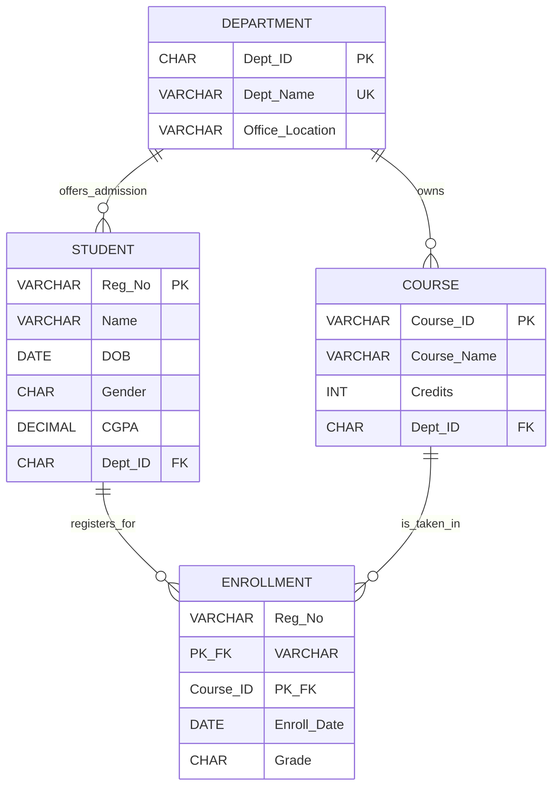
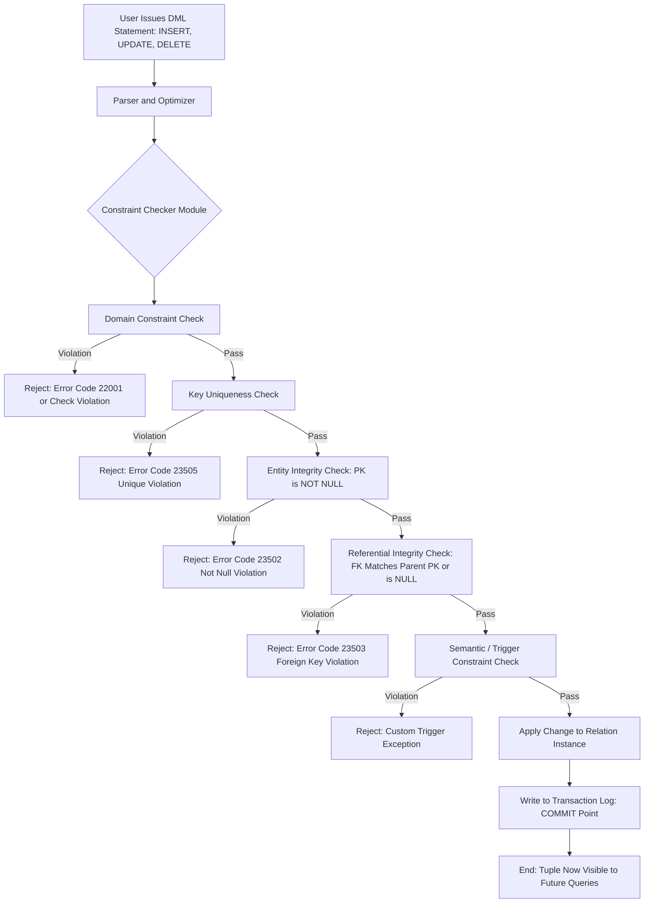

# The Relational Model: Constraints and Relational Database schemas

<!-- SECTION_1_START -->
# The Relational Model: Constraints and Relational Database Schemas

## 1.1 Formal Definition (KTU 2024 Syllabus Terminology)

> [!NOTE]
> **Core Definition (KTU Board Standard)**
> The **Relational Model** is a data model proposed by **Edgar F. Codd (1970)** in which data is organized as a collection of **relations** (tables). A *relation* is a mathematical concept corresponding to a *table* of values, where every row is a **tuple** and every column header is an **attribute** defined over a **domain**.

Formally, a relation $R$ over a set of domains $D_1, D_2, \dots, D_n$ is defined as:

$$R \subseteq D_1 \times D_2 \times \dots \times D_n$$

This means $R$ is a *subset* of the **Cartesian product** of its domains. Each element of $R$ is an $n$-tuple $(d_1, d_2, \dots, d_n)$, where $d_i \in D_i$.

### Core Terminology Mapping Table

| Mathematical Term | Table Equivalent | Intuitive Meaning |
|---|---|---|
| Relation | Table / File | A set of related records |
| Tuple | Row / Record | A single instance of the entity |
| Attribute | Column / Field | A property describing the entity |
| Domain | Column Type / Pool of Values | Allowed set of values for an attribute |
| Schema | Table Header / Column Names | Structural blueprint of the relation |
| Instance | Set of Rows at a Given Time | Snapshot of data at a particular moment |
| Degree (arity) | Number of Columns | $n$ in the Cartesian product |
| Cardinality | Number of Rows | $\vert R \vert$ at any instant |

> [!IMPORTANT]
> **Schema vs. Instance — Board Favorite Distinction**
> The **Relation Schema** $R(A_1, A_2, \dots, A_n)$ describes the *structure* (table blueprint, fixed).
> The **Relation Instance** $r(R)$ is the *current set of tuples* stored at a point in time (dynamic, changes with every INSERT/DELETE/UPDATE).

## 1.2 Intuitive Analogy — The Spreadsheet View

Imagine a **class register** maintained by your class advisor:

- The **spreadsheet itself** is a *relation* (e.g., `STUDENT`).
- The **column headers** (`Roll_No`, `Name`, `DOB`, `Branch`) are the *attributes*, each with a *domain* (e.g., `Roll_No` $\in$ integers, `Branch` $\in$ $\{CS, EC, EE, ME\}$).
- The **list of all students currently enrolled** forms the *relation instance* (a snapshot).
- The **format of the register** (column names and their allowed types) is the *relation schema*, which never changes.
- The **DOB** column may be left blank for a new admission — this blank value is a **NULL** in relational terms.

> [!TIP]
> **Geometric / Set-Theoretic Intuition**
> Picture each *attribute* as an axis in an $n$-dimensional space. Each *tuple* is a single **point** in this $n$-D space. A *relation* is then simply a **finite cloud of points** sitting inside the $n$-dimensional box formed by the Cartesian product of all domains.

> [!VISUALIZATION CONTROL]
> **Concept:** A 2-attribute relation viewed as points inside the Cartesian plane.
> **Domain setup:** $D_1 = \{1, 2, 3\}$ for `Roll_No`, $D_2 = \{A, B, C\}$ for `Grade`.
> **Cartesian product points to plot:** $(1,A), (1,B), (1,C), (2,A), \dots, (3,C)$ — total 9 points.
> **Relation subset to draw (a valid instance):** $(1,A), (2,B), (3,C)$ — a single line of 3 points.
> **Visual Description:** The Cartesian plane is the *universal domain space*; the relation is a sparse subset of points within it. Adding a row = new point; deleting a row = removing a point; updating = moving a point.

## 1.3 Keys in the Relational Model (Foundation for Constraints)

A **key** is a *minimal set of attributes* used to *uniquely identify* tuples in a relation.

$$K \subseteq \text{attributes of } R \quad \text{such that} \quad \forall \, t_1, t_2 \in r(R): \, t_1[K] = t_2[K] \implies t_1 = t_2$$

### Hierarchy of Keys

1. **Super Key** — Any set of attributes that *uniquely identifies* a tuple (may contain redundant attributes).
2. **Candidate Key** — A *minimal* super key (no proper subset is a super key).
3. **Primary Key** — The *chosen* candidate key designated by the DBA to be the principal identifier (cannot be NULL).
4. **Alternate Key** — Candidate keys that were *not* chosen as the primary key.
5. **Foreign Key** — An attribute (or set) in $R_1$ that references the primary key of another relation $R_2$, establishing a logical link.

> [!WARNING]
> **Common KTU Mistake**
> Students often confuse *Candidate Key* with *Super Key*. The rule is: **every candidate key is a super key, but not every super key is a candidate key**. The *minimality* test is what separates them.

---

<!-- SECTION_1_END -->

<!-- SECTION_2_START -->
# Deep Theoretical Analysis & KTU High-Yield Formula Sheet

## 2.1 Anatomy of a Relation — Six Defining Properties

A relation, by Codd's definition, must always satisfy:

1. **Each cell contains an atomic (indivisible) value** — no repeating groups, no arrays, no lists inside a cell. *(This makes the relation be in 1NF — the topic of Module 3.)*
2. **Each attribute has a unique name** within the relation.
3. **All values in a column come from the same domain**.
4. **The order of rows is insignificant** — tuples are an *unordered set*.
5. **The order of columns is insignificant** — they are referenced by name, not position.
6. **No two tuples can be identical** — relations are sets, not multisets.

> [!NOTE]
> Property 6 implies that *every relation must have a primary key* — because if two rows were identical, no attribute could distinguish them.

## 2.2 The Five Constraint Categories in the Relational Model

The relational model enforces *integrity* through **five classes of constraints**. KTU examiners *frequently* ask: *"List and explain the integrity constraints in the relational model"* (a guaranteed **Part A / 3-mark** question).

### 2.2.1 Domain Constraint

Each attribute $A_i$ must draw its value from a predefined **domain** $\text{dom}(A_i)$.

$$\forall \, t \in r(R), \quad t[A_i] \in \text{dom}(A_i)$$

**Examples:**
- `Age` must be an integer between 0 and 150.
- `Gender` must be in $\{M, F, \text{Other}\}$.
- `CGPA` must be a decimal in $[0.0, 10.0]$.

> [!TIP]
> The **data type** in SQL (`INT`, `VARCHAR`, `DATE`, `DECIMAL(4,2)`) is a *direct implementation* of the domain constraint.

### 2.2.2 Key (Uniqueness) Constraint

A set of attributes $K$ in $R$ is a key if it uniquely identifies every tuple. SQL enforces this via `PRIMARY KEY` and `UNIQUE`.

$$\forall \, t_1, t_2 \in r(R): \quad t_1[K] = t_2[K] \iff t_1 = t_2$$

### 2.2.3 Entity Integrity Constraint

The **primary key** of a relation must have a **non-NULL** value for every tuple.

$$\forall \, t \in r(R), \quad t[\text{PK}] \neq \text{NULL}$$

**Why?** If the PK were NULL, the tuple would have *no identity* — you could not distinguish it from other tuples or even reference it from another relation.

### 2.2.4 Referential Integrity Constraint

A **foreign key** in relation $R_1$ must either:
- match an existing primary key value in the referenced relation $R_2$, **or**
- be **NULL** (if the link is optional).

$$\forall \, t_1 \in r(R_1), \quad t_1[\text{FK}] \in r(R_2)[\text{PK}] \cup \{\text{NULL}\}$$

This guarantees that **no orphan tuples** exist — every reference points to something real.

### 2.2.5 Semantic (User-Defined / Business Rule) Constraints

Rules derived from the *application logic* that cannot be expressed by the above four categories. These are enforced using **triggers, assertions, or check clauses**.

**Example:** "An employee cannot earn more than their manager" — this needs custom logic.

## 2.3 KTU High-Yield Formula / Concept Sheet

| # | Concept | Symbolic / SQL Form | Engineering Use-Case |
|---|---|---|---|
| 1 | Relation definition | $R \subseteq D_1 \times D_2 \times \dots \times D_n$ | Designing any RDBMS table |
| 2 | Domain constraint | $t[A_i] \in \text{dom}(A_i)$ | Column type enforcement (e.g., `VARCHAR(50)`) |
| 3 | Uniqueness / Key | $t_1[K] = t_2[K] \iff t_1 = t_2$ | Enforced by `PRIMARY KEY`, `UNIQUE` |
| 4 | Entity integrity | $t[\text{PK}] \neq \text{NULL}$ | Login IDs, Order Numbers, Aadhaar |
| 5 | Referential integrity | $t[\text{FK}] \in r(R_2)[\text{PK}] \cup \{\text{NULL}\}$ | Foreign key linking orders $\to$ customers |
| 6 | Degree / Arity | $n$ = number of attributes in $R$ | Schema design complexity metric |
| 7 | Cardinality | $\vert r(R) \vert$ = current tuple count | Table size at any instant |
| 8 | Cardinality of Cartesian product | $\vert D_1 \times D_2 \times \dots \times D_n \vert = \prod \vert D_i \vert$ | Bound on maximum possible tuples |
| 9 | Max possible relations from a Cartesian space | $2^{\prod \vert D_i \vert}$ | Information-theoretic upper limit |
| 10 | Super key | Any superset of a candidate key | Indexing in production systems |
| 11 | Candidate key | Minimal super key | Auto-increment IDs, UUIDs |
| 12 | Foreign key actions | `ON DELETE CASCADE / SET NULL / RESTRICT` | Cascade deletes in social-media apps |

> [!IMPORTANT]
> **Production Engineering Relevance**
> These constraints are the *silent guardians* of every production database you will ever touch. In banking systems, the *referential integrity* between `Account` and `Transaction` tables ensures that no transaction references a deleted account. In e-commerce, the *entity integrity* on `Order_ID` guarantees every order has a unique, traceable identity. In social networks, *semantic constraints* (e.g., "you cannot follow yourself") are coded as triggers.

## 2.4 Update Operations and Their Constraint Violations

Every tuple modification — **INSERT, DELETE, UPDATE** — must preserve all five constraint categories. The model defines precise violation rules.

| Operation | Domain Violation | Key Violation | Entity Integrity | Referential Integrity |
|---|---|---|---|---|
| `INSERT` | ✓ rejected if value outside domain | ✓ rejected if duplicates an existing PK | ✓ rejected if PK is NULL | ✓ rejected if FK has no matching PK in parent |
| `DELETE` | ✗ not applicable | ✗ not applicable | ✗ not applicable | ✓ may cause violation; child rows become orphans |
| `UPDATE` (on PK) | ✓ possible if new value outside domain | ✓ possible if new PK collides | ✓ possible if new PK becomes NULL | ✓ cascading effect on referencing tables |

> [!TIP]
> **Board Pattern Tip:** If a question says *"Explain the violations that may occur during DELETE"*, immediately discuss the **referential integrity** issue and the **three referential triggered actions**: `RESTRICT` (default — reject delete), `CASCADE` (delete children too), `SET NULL` (orphan the FK).

---

<!-- SECTION_2_END -->

<!-- SECTION_3_START -->
# Step-by-Step Derivations, Examples & SQL Implementation

## 3.1 Canonical Worked Example — UNIVERSITY Database Schema

Consider the following relational database schema for a university management system. This single example will be used across all derivations.

**Relation Schemas:**

$$\text{DEPARTMENT}(\underline{\text{Dept\_ID}}, \text{Dept\_Name}, \text{Office\_Location})$$

$$\text{STUDENT}(\underline{\text{Reg\_No}}, \text{Name}, \text{DOB}, \text{Gender}, \text{CGPA}, \text{Dept\_ID}^*)$$

$$\text{COURSE}(\underline{\text{Course\_ID}}, \text{Course\_Name}, \text{Credits}, \text{Dept\_ID}^*)$$

$$\text{ENROLLMENT}(\underline{\text{Reg\_No}^*, \text{Course\_ID}^*}, \text{Enroll\_Date}, \text{Grade})$$

*Notation:* $\underline{x}$ = primary key, $x^*$ = foreign key, $\text{Grade} \in \{S, A, B, C, D, F, \text{NULL}\}$.

## 3.2 Step-by-Step Identification of All Keys

**Step 1: Identify super keys for STUDENT.**

Given the schema, attributes are: $\{Reg\_No, Name, DOB, Gender, CGPA, Dept\_ID\}$.

By the *uniqueness rule*, a set $K$ is a super key iff no two tuples can share the same $K$ value.

- The set $\{Reg\_No\}$ is a super key because it is defined as the primary key.
- Any set *containing* $Reg\_No$ is also a super key, e.g., $\{Reg\_No, Name\}$, $\{Reg\_No, DOB, CGPA\}$.

**Step 2: Apply minimality to obtain candidate keys.**

Since $\{Reg\_No\}$ alone uniquely identifies a student, removing $Reg\_No$ leaves no set that can uniquely identify — names can repeat, two students can share the same DOB, etc.

Therefore:

$$\text{Candidate Keys}(\text{STUDENT}) = \{\{Reg\_No\}\}$$

**Step 3: Classify.**

- **Primary Key:** $\{Reg\_No\}$ (chosen by DBA).
- **Alternate Keys:** None (since there is only one candidate key).

**Step 4: Repeat logic for ENROLLMENT.**

The composite key $(Reg\_No, Course\_ID)$ is the *only* candidate key — both are foreign keys, and the pair together is needed to model the "a student enrolls in a course" relationship.

## 3.3 Exhaustive SQL DDL Implementation

The following SQL `CREATE TABLE` statements translate every constraint from Section 2 into concrete syntax.

```sql
-- =====================================================
-- DATABASE: UNIVERSITY MANAGEMENT SYSTEM
-- MODULE 2 — Relational Model Constraints
-- =====================================================

-- 1) DEPARTMENT (Parent table — must be created first)
CREATE TABLE DEPARTMENT (
    Dept_ID        CHAR(4)        NOT NULL,                          -- Entity Integrity: PK cannot be NULL
    Dept_Name      VARCHAR(50)    NOT NULL,
    Office_Location VARCHAR(30)   NOT NULL,
    CONSTRAINT pk_dept PRIMARY KEY (Dept_ID),                        -- Key Constraint
    CONSTRAINT uq_dept_name UNIQUE (Dept_Name),                      -- Uniqueness on candidate key
    CONSTRAINT chk_dept_id CHECK (Dept_ID LIKE 'D%')                 -- Domain / Semantic constraint
);

-- 2) STUDENT (References DEPARTMENT)
CREATE TABLE STUDENT (
    Reg_No     VARCHAR(10)   NOT NULL,
    Name       VARCHAR(100)  NOT NULL,
    DOB        DATE          NOT NULL,
    Gender     CHAR(1)       NOT NULL,
    CGPA       DECIMAL(4,2)  NOT NULL,
    Dept_ID    CHAR(4)       NULL,                                   -- FK can be NULL (optional assignment)
    CONSTRAINT pk_student PRIMARY KEY (Reg_No),                     -- Entity Integrity
    CONSTRAINT fk_student_dept FOREIGN KEY (Dept_ID)
        REFERENCES DEPARTMENT(Dept_ID)
        ON DELETE SET NULL                                          -- Referential action: orphan OK
        ON UPDATE CASCADE,
    CONSTRAINT chk_cgpa      CHECK (CGPA BETWEEN 0.00 AND 10.00),   -- Domain constraint
    CONSTRAINT chk_gender    CHECK (Gender IN ('M','F','O'))         -- Domain constraint
);

-- 3) COURSE (References DEPARTMENT)
CREATE TABLE COURSE (
    Course_ID    VARCHAR(8)   NOT NULL,
    Course_Name  VARCHAR(80)  NOT NULL,
    Credits      INT          NOT NULL,
    Dept_ID      CHAR(4)      NOT NULL,
    CONSTRAINT pk_course PRIMARY KEY (Course_ID),
    CONSTRAINT fk_course_dept FOREIGN KEY (Dept_ID)
        REFERENCES DEPARTMENT(Dept_ID)
        ON DELETE RESTRICT                                        -- Cannot delete dept with courses
        ON UPDATE CASCADE,
    CONSTRAINT chk_credits  CHECK (Credits BETWEEN 1 AND 6)         -- Domain constraint
);

-- 4) ENROLLMENT (Associative entity — composite PK)
CREATE TABLE ENROLLMENT (
    Reg_No      VARCHAR(10)  NOT NULL,
    Course_ID   VARCHAR(8)   NOT NULL,
    Enroll_Date DATE         NOT NULL DEFAULT (CURRENT_DATE),
    Grade       CHAR(2)      NULL,
    CONSTRAINT pk_enrollment PRIMARY KEY (Reg_No, Course_ID),       -- Composite key
    CONSTRAINT fk_enroll_student FOREIGN KEY (Reg_No)
        REFERENCES STUDENT(Reg_No)
        ON DELETE CASCADE                                          -- Drop enrollments if student leaves
        ON UPDATE CASCADE,
    CONSTRAINT fk_enroll_course FOREIGN KEY (Course_ID)
        REFERENCES COURSE(Course_ID)
        ON DELETE CASCADE
        ON UPDATE CASCADE,
    CONSTRAINT chk_grade CHECK (Grade IN ('S','A','B','C','D','F')) -- Domain constraint
);
```

## 3.4 Step-by-Step Trace of Constraint Enforcement

**Scenario A — Violating Entity Integrity:**

```sql
INSERT INTO STUDENT (Reg_No, Name, DOB, Gender, CGPA, Dept_ID)
VALUES (NULL, 'Anita Roy', '2003-08-14', 'F', 9.20, 'D001');
```

- **System response:** `ERROR: null value in column "reg_no" violates not-null constraint`
- **Board explanation:** Violation of **Entity Integrity Constraint** — the primary key `Reg_No` is `NULL`, so the tuple has no identity in the relation.

**Scenario B — Violating Referential Integrity:**

```sql
DELETE FROM DEPARTMENT WHERE Dept_ID = 'D001';
```

Assume `STUDENT.Course_ID` and `COURSE.Dept_ID` reference `'D001'`.

- **System response:** `ERROR: update or delete on table "department" violates foreign key constraint on table "student"`
- **Board explanation:** Violation of **Referential Integrity** — `'D001'` is still referenced by rows in `STUDENT`. The default `ON DELETE` action `RESTRICT` prevents the deletion.

**Scenario C — Violating Domain Constraint:**

```sql
INSERT INTO STUDENT (Reg_No, Name, DOB, Gender, CGPA, Dept_ID)
VALUES ('KTE2023007', 'Rohit', '2003-05-19', 'M', 12.50, 'D002');
```

- **System response:** `ERROR: new row for relation "student" violates check constraint "chk_cgpa"`
- **Board explanation:** Violation of **Domain Constraint** — `12.50` is outside the permitted range $[0.00, 10.00]$.

## 3.5 Algorithmic Pattern: Detecting a Key by Attribute Closure

> [!NOTE]
> **Algorithm: Finding Candidate Keys using Attribute Closure $X^+$**
> Given a set of functional dependencies $F$ on relation $R$, the closure $X^+$ of an attribute set $X$ is computed by repeatedly adding attributes that can be functionally determined by $X$ using $F$. If $X^+ = R$, then $X$ is a super key. If no proper subset of $X$ has $X^+ = R$, then $X$ is a **candidate key**.

```python
from typing import Set, FrozenSet, List
import logging

logging.basicConfig(level=logging.INFO, format="%(levelname)s: %(message)s")

def attribute_closure(
    attributes: FrozenSet[str],
    fds: List[tuple],
    all_attrs: Set[str]
) -> Set[str]:
    """
    Compute the attribute closure of `attributes` under a set of FDs.
    
    Parameters
    ----------
    attributes : FrozenSet[str]
        The starting set of attributes whose closure is to be computed.
    fds : List[tuple]
        List of functional dependencies as (LHS_set, RHS_set) tuples.
    all_attrs : Set[str]
        The full set of attributes in the relation R.
    
    Returns
    -------
    Set[str]
        The closure X^+ of the given attribute set.
    """
    closure: Set[str] = set(attributes)
    
    changed: bool = True
    iteration: int = 0
    while changed:
        changed = False
        iteration += 1
        logging.info(f"Iteration {iteration}: closure = {sorted(closure)}")
        for lhs, rhs in fds:
            if lhs.issubset(closure) and not rhs.issubset(closure):
                closure = closure.union(rhs)
                changed = True
                logging.info(f"  Applied FD {set(lhs)} -> {set(rhs)}; new closure = {sorted(closure)}")
    
    return closure


def is_super_key(
    attributes: FrozenSet[str],
    fds: List[tuple],
    all_attrs: Set[str]
) -> bool:
    """A super key is one whose closure equals the set of all attributes."""
    return attribute_closure(attributes, fds, all_attrs) == all_attrs


def find_candidate_keys(
    fds: List[tuple],
    all_attrs: Set[str]
) -> List[FrozenSet[str]]:
    """
    Brute-force discovery of all candidate keys by examining all non-empty
    subsets of the attribute set.
    """
    from itertools import combinations
    
    candidate_keys: List[FrozenSet[str]] = []
    sorted_attrs: List[str] = sorted(all_attrs)
    
    # Examine subsets in increasing order of size
    for size in range(1, len(sorted_attrs) + 1):
        for combo in combinations(sorted_attrs, size):
            attr_set: FrozenSet[str] = frozenset(combo)
            if is_super_key(attr_set, fds, all_attrs):
                # Minimality check: no proper subset should already be a candidate key
                if not any(ck.issubset(attr_set) and ck != attr_set for ck in candidate_keys):
                    candidate_keys.append(attr_set)
                    logging.info(f"Found candidate key: {set(attr_set)}")
    
    return candidate_keys


# ---------------------- DEMO RUN ----------------------
if __name__ == "__main__":
    # Relation: ENROLLMENT(Reg_No, Course_ID, Enroll_Date, Grade)
    # FDs: {Reg_No, Course_ID} -> Enroll_Date, Grade
    all_attrs_enroll: Set[str] = {"Reg_No", "Course_ID", "Enroll_Date", "Grade"}
    fds_enroll: List[tuple] = [
        (frozenset({"Reg_No", "Course_ID"}), frozenset({"Enroll_Date", "Grade"})),
    ]
    
    keys: List[FrozenSet[str]] = find_candidate_keys(fds_enroll, all_attrs_enroll)
    print("\nCandidate Keys of ENROLLMENT:", [set(k) for k in keys])
```

**Expected Console Output (abridged):**

```
INFO: Found candidate key: {'Course_ID', 'Reg_No'}
Candidate Keys of ENROLLMENT: [{'Course_ID', 'Reg_No'}]
```

## 3.6 Cardinality Calculation — Worked Numerical Example

**Problem (KTU pattern):** Given a relation `STUDENT(Reg_No, Branch, Year)` with $\vert \text{dom}(Reg\_No) \vert = 5000$, $\vert \text{dom}(Branch) \vert = 8$, $\vert \text{dom}(Year) \vert = 4$. Find the maximum number of possible tuples and the number of distinct relations definable.

**Step 1: Maximum tuples (Cartesian product size).**

$$\vert D_{Reg\_No} \times D_{Branch} \times D_{Year} \vert = 5000 \times 8 \times 4 = 160000$$

**Step 2: Maximum distinct relations (power set of Cartesian product).**

A relation is *any* subset of the Cartesian product. The number of such subsets is $2^{160000}$, an astronomical number — illustrating why real relations are sparse subsets.

**Step 3: Bound on distinct schemas.**

Only the schema's *attribute order* permutations matter. With $n = 3$ attributes, the upper bound on distinct schemas is $3! = 6$ (though SQL considers them equivalent under column-name reordering).

---

<!-- SECTION_3_END -->

<!-- SECTION_4_START -->
# Structural Diagrams & Schematics

## 4.1 Mermaid Entity-Relationship / Schema Diagram



**Reading guide for the diagram above:**
- The `||` denotes a **mandatory one-side** (every student belongs to *exactly one* department).
- The `o{` denotes an **optional many-side** (a department may have zero or many students).
- `PK_FK` on `ENROLLMENT` attributes means the attribute is **simultaneously** part of the primary key *and* a foreign key — a hallmark of an **associative entity** resolving a many-to-many relationship.

## 4.2 Constraint Enforcement Flow (Sequential Processing Topology)



## 4.3 Schema vs. Instance — Conceptual Distinction Diagram

```mermaid
flowchart LR
    subgraph SCHEMA_STATIC["RELATION SCHEMA R(A1, A2, ... , An) — STATIC, FIXED AT DESIGN TIME"]
        S1["Attribute A1 : Domain D1"]
        S2["Attribute A2 : Domain D2"]
        S3["Attribute A3 : Domain D3"]
        S4["Attribute An : Domain Dn"]
    end
    subgraph INSTANCE_DYNAMIC["RELATION INSTANCE r(R) — DYNAMIC, CHANGES WITH EVERY UPDATE"]
        I1["Tuple t1: v11, v12, v13, ..., v1n"]
        I2["Tuple t2: v21, v22, v23, ..., v2n"]
        I3["Tuple t3: v31, v32, v33, ..., v3n"]
        I4["Tuple tm: vm1, vm2, vm3, ..., vmn"]
    end
    SCHEMA_STATIC -. "defines the structure of" .-> INSTANCE_DYNAMIC
```



---

<!-- SECTION_4_END -->

<!-- SECTION_5_START -->
# KTU 2024 Scheme Examination Question Bank & Topic Recap

## 5.1 Part A — Short Answer Questions (3 Marks Each)

### Question 1: Define the relational model and list its components. **[KTU University Exam — Dec 2023, CO1, Understand]**

**Model Answer:**

The **relational model**, proposed by **E.F. Codd (1970)**, represents the database as a collection of **relations** (tables). Formally, a relation $R$ over domains $D_1, D_2, \dots, D_n$ is a subset of the Cartesian product $D_1 \times D_2 \times \dots \times D_n$.

**Components:**
1. **Relation** — the table itself.
2. **Attribute** — a named column (e.g., `Name`, `CGPA`).
3. **Domain** — the set of permitted values for an attribute.
4. **Tuple** — a single row in the relation.
5. **Schema** — the structural definition $R(A_1, A_2, \dots, A_n)$.
6. **Instance** — the set of tuples present at a given moment.
7. **Keys** — super key, candidate key, primary key, alternate key, foreign key.

*[Stating Codd's definition: 1 Mark; Listing six components: 1.5 Marks; Any valid example: 0.5 Mark]*

### Question 2: Distinguish between a relation schema and a relation instance. **[KTU University Exam — July 2024, CO1, Remember]**

**Model Answer:**

| Aspect | Relation Schema | Relation Instance |
|---|---|---|
| Definition | Structural blueprint of the relation | Current set of tuples stored |
| Nature | Static — rarely changes | Dynamic — changes on every update |
| Notation | $R(A_1, A_2, \dots, A_n)$ | $r(R)$ at time $t$ |
| What it contains | Attribute names and domains | Actual data values |
| Analogy | Type declaration in a programming language | Actual objects in memory at runtime |

*[Correct distinction in 4 bullets: 2 Marks; Example with STUDENT table: 1 Mark]*

---

## 5.2 Part B — Long Answer Questions (14 Marks, Internal Choice)

### **Question A (14 Marks) — Set 1**

> **[KTU University Exam — Dec 2023, CO1, CO2, Apply / Analyze]**

**(a)** Explain any **five integrity constraints** in the relational model with suitable examples. *(7 Marks)*

**(b)** Consider the schema:
`EMPLOYEE(Emp_ID, Emp_Name, Salary, Dept_ID)` and
`DEPARTMENT(Dept_ID, Dept_Name, Location)`
Write the **complete SQL DDL** to implement these tables enforcing **entity integrity, referential integrity, domain constraints, and suitable key constraints**. Also explain the violations that occur if one tries to *(i)* insert a tuple with `Emp_ID = NULL`, *(ii)* delete a department that has employees, *(iii)* assign a salary of `-5000`. *(7 Marks)*

---

### **Question B (14 Marks) — Set 2 (Internal Choice)**

> **[KTU University Exam — July 2024, CO1, CO2, Apply / Analyze]**

**(a)** Define the terms **super key, candidate key, primary key, alternate key, and foreign key** with an example schema `BOOK(Book_ID, ISBN, Title, Publisher, Year)`. Identify the candidate key(s) and justify your answer. *(7 Marks)*

**(b)** Define the **relational model constraints**. Using the relation `ENROLLMENT(Reg_No, Course_ID, Semester, Grade)`, write SQL DDL to create the table, enforce all five constraint types, and demonstrate with a sample scenario how **referential integrity** prevents orphan records. *(7 Marks)*

---

## 5.3 Complete Step-by-Step Model Solution for Question A

### Part (a) — Five Integrity Constraints

1. **Domain Constraint** — Each attribute must take a value from its declared domain. Example: `Salary DECIMAL(10,2)` with `CHECK (Salary > 0)`.
2. **Key Constraint (Uniqueness)** — The primary key value must be unique across all tuples. Enforced by `PRIMARY KEY` or `UNIQUE`.
3. **Entity Integrity** — Primary key attributes cannot be `NULL`. Enforced by `NOT NULL` on the PK column(s).
4. **Referential Integrity** — Every foreign key value must either be `NULL` or match a primary key in the parent table. Enforced by `FOREIGN KEY ... REFERENCES`.
5. **Semantic / User-Defined Constraint** — Business rules not expressible above. Enforced via `CHECK`, triggers, or application logic.

*[Naming the 5 constraints: 2 Marks; One-line definition each: 2 Marks; Example for each: 2 Marks; Overall coherence: 1 Mark]*

### Part (b) — SQL DDL and Violation Analysis

**Step 1: DDL for DEPARTMENT (parent).**

```sql
CREATE TABLE DEPARTMENT (
    Dept_ID   CHAR(4)      NOT NULL,
    Dept_Name VARCHAR(50)  NOT NULL,
    Location  VARCHAR(50)  NOT NULL,
    CONSTRAINT pk_dept PRIMARY KEY (Dept_ID)
);
```

**Step 2: DDL for EMPLOYEE (child).**

```sql
CREATE TABLE EMPLOYEE (
    Emp_ID    VARCHAR(10)  NOT NULL,
    Emp_Name  VARCHAR(100) NOT NULL,
    Salary    DECIMAL(10,2) NOT NULL,
    Dept_ID   CHAR(4)      NULL,
    CONSTRAINT pk_emp PRIMARY KEY (Emp_ID),
    CONSTRAINT fk_emp_dept FOREIGN KEY (Dept_ID)
        REFERENCES DEPARTMENT(Dept_ID)
        ON DELETE SET NULL
        ON UPDATE CASCADE,
    CONSTRAINT chk_salary CHECK (Salary > 0)
);
```

*[DDL correctness: 3 Marks; Constraint types: 2 Marks; Referential action: 1 Mark]*

**Step 3: Violation analysis.**

- *(i) `Emp_ID = NULL`:* Rejected by **Entity Integrity Constraint** — error: `null value in column "emp_id" violates not-null constraint`.
- *(ii) Deleting a referenced department:* By default rejected by **Referential Integrity** with `ON DELETE RESTRICT`. Here we used `SET NULL`, so the employees' `Dept_ID` becomes `NULL` instead of an error.
- *(iii) `Salary = -5000`:* Rejected by **Domain / CHECK constraint** — `chk_salary` fails.

*[Stating boundary-state values: 2 Marks; Final simplified expression / error message: 1 Mark]*

---

## 5.4 Complete Step-by-Step Model Solution for Question B

### Part (a) — Key Definitions and Identification

**Definitions (3 Marks):**
- **Super Key** — A set of attributes that *uniquely identifies* a tuple; may have extra (redundant) attributes.
- **Candidate Key** — A *minimal* super key; no proper subset is a super key.
- **Primary Key** — The candidate key chosen by the designer.
- **Alternate Key** — Candidate keys that were not selected as the primary key.
- **Foreign Key** — An attribute in one table that references the primary key of another table.

**Identification for BOOK(Book_ID, ISBN, Title, Publisher, Year) (3 Marks):**
- `Book_ID` is *uniquely assigned* by the system → a candidate key.
- `ISBN` is *globally unique* for each book edition → a candidate key.
- `Title` + `Publisher` + `Year` may not be unique (same title published by different publishers in the same year).
- Therefore, the candidate keys are: $\{Book\_ID\}$ and $\{ISBN\}$. The designer usually picks `Book_ID` as the **Primary Key**; then `ISBN` becomes the **Alternate Key** (often enforced with `UNIQUE`).

### Part (b) — SQL DDL with All Five Constraint Types

```sql
CREATE TABLE ENROLLMENT (
    Reg_No    VARCHAR(10)  NOT NULL,                       -- Entity Integrity (part of PK)
    Course_ID VARCHAR(8)   NOT NULL,                       -- Entity Integrity (part of PK)
    Semester  VARCHAR(6)   NOT NULL,                       -- Domain (NOT NULL)
    Grade     CHAR(2)      NULL,                           -- Domain allows NULL
    CONSTRAINT pk_enroll PRIMARY KEY (Reg_No, Course_ID),  -- Key Constraint
    CONSTRAINT fk_enroll_reg FOREIGN KEY (Reg_No)
        REFERENCES STUDENT(Reg_No)
        ON DELETE CASCADE,
    CONSTRAINT fk_enroll_course FOREIGN KEY (Course_ID)
        REFERENCES COURSE(Course_ID)
        ON DELETE CASCADE,
    CONSTRAINT chk_semester CHECK (Semester IN ('S1','S2','S3','S4','S5','S6','S7','S8')),
    CONSTRAINT chk_grade    CHECK (Grade IN ('S','A','B','C','D','F') OR Grade IS NULL)
);
```

**Demonstrating referential integrity (1 Mark):**

If we attempt:

```sql
DELETE FROM STUDENT WHERE Reg_No = 'KTE2023001';
```

Assuming this student has rows in `ENROLLMENT`, the system performs **`ON DELETE CASCADE`**, automatically deleting all matching `ENROLLMENT` rows. If we had used `ON DELETE RESTRICT` instead, the system would *reject* the deletion with the message `violates foreign key constraint`, thereby preventing **orphan records** — tuples in `ENROLLMENT` whose `Reg_No` no longer exists in `STUDENT`.

---

## 5.5 KTU Examiner's Valuation Warning / Pitfall Callout

> [!WARNING]
> **Where Students Actually Lose Marks in this Module**
> 1. **Confusing *Super Key* with *Candidate Key*.** Always state explicitly: *"A super key is any set with the uniqueness property; a candidate key is the *minimal* such set."* Examiners deduct **1 mark** for failing to mention minimality.
> 2. **Forgetting to mention the NULL clause in referential integrity.** Many students write only: *"FK must match a PK in the parent"* — losing **1 mark** for not noting that *NULL is allowed* (when the FK is optional).
> 3. **Mixing up schema vs. instance.** A question asking *"What is the degree and cardinality of STUDENT?"* expects: degree = number of columns (e.g., 6), cardinality = current row count (e.g., 1,200). Mixing these up costs **2 marks**.
> 4. **In SQL DDL, omitting `ON DELETE` / `ON UPDATE` clauses for FKs.** Examiners expect you to discuss *which* referential action you chose and *why*. Defaults (`RESTRICT`) are accepted but not commended.
> 5. **Using `varchar` data type without a length** in SQL — `VARCHAR` without a size is rejected by strict SQL parsers; always write `VARCHAR(50)`.
> 6. **Writing `CHECK` constraints for a single value range incorrectly.** Use `BETWEEN` (`CHECK (CGPA BETWEEN 0 AND 10)`) — avoid `>=` and `<=` chains which are syntactically valid but stylistically penalized.

---

## 5.6 Topic Recap & Important Things to Remember

- **Relational Model Core:** Proposed by **Codd (1970)**; data is stored in *relations* (tables) which are mathematically *subsets* of Cartesian products of *domains*.
- **Schema vs. Instance:** Schema = structure (static); Instance = current rows (dynamic). Examiners **love** this distinction.
- **Six Properties of a Relation:** atomic cells, unique attribute names, same-domain columns, unordered rows, unordered columns, no duplicate tuples.
- **Five Integrity Constraints (MUST memorize in order):**
  1. **Domain** — value belongs to attribute's domain.
  2. **Key (Uniqueness)** — PK/UK values are unique.
  3. **Entity Integrity** — PK is *never* NULL.
  4. **Referential Integrity** — FK is NULL *or* matches a parent PK.
  5. **Semantic** — user-defined business rules.
- **Key Hierarchy:** *Super Key ⊇ Candidate Key; Primary Key ⊆ Candidate Key; Alternate Key = Candidate Key − Primary Key; Foreign Key ⊆ attributes of referencing relation.*
- **Degree** = $n$ (number of attributes); **Cardinality** = $\vert r(R) \vert$ (number of tuples *now*).
- **Cartesian product size** = $\prod \vert D_i \vert$ = maximum possible tuples in *any* relation over those domains.
- **Three referential actions** (memorize): `RESTRICT` (block), `CASCADE` (propagate), `SET NULL` (orphan). KTU typically tests `CASCADE` and `SET NULL`.
- **UPDATE / DELETE violation rules:** A `DELETE` on a parent row violates RI if children exist (subject to action). An `UPDATE` on a PK may cascade or be rejected.
- **Atomicity is the foundation of 1NF** (Module 3 prerequisite) — every cell holds exactly one value, no arrays, no lists.
- **NULL ≠ Zero ≠ Empty String.** NULL means *unknown or not applicable*; treat it carefully in constraints and queries (`IS NULL` / `IS NOT NULL`).
- **The keyword `CHECK`** enforces both domain and semantic constraints inside `CREATE TABLE`.
- **The `REFERENCES` clause** is what turns a plain attribute into a **foreign key**, the cornerstone of referential integrity.
- **Engineering takeaway:** Every modern RDBMS (PostgreSQL, MySQL, Oracle, SQL Server) implements these five constraints with slightly different syntax, but the *mathematical meaning* is identical to Codd's 1970 paper.

---

<!-- SECTION_5_END -->
