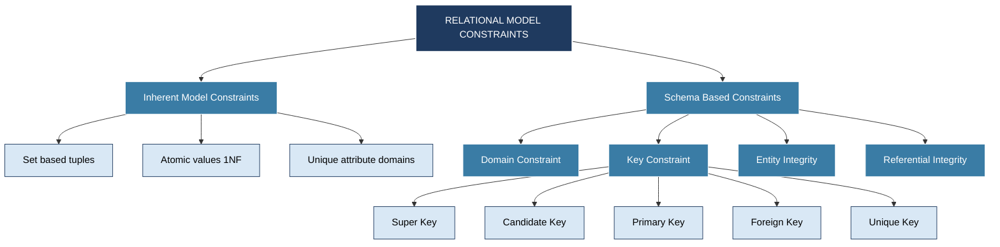
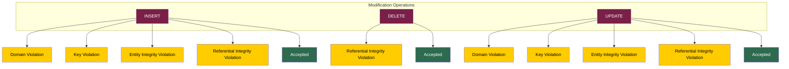
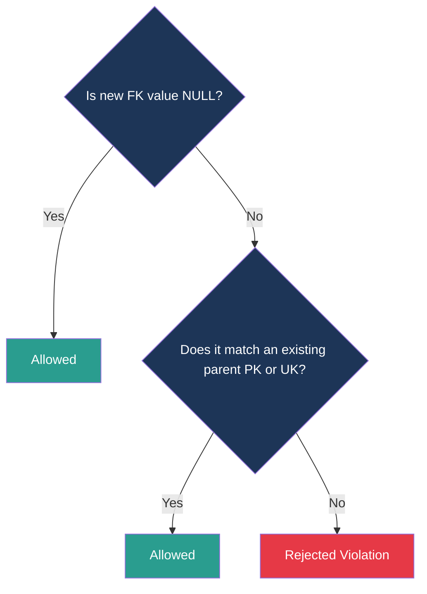

# The Relational Model: Constraints and Relational Database schemas

<!-- SECTION_1_START -->
# The Relational Model: Constraints & Relational Database Schemas

> [!IMPORTANT]
> **KTU 2024 — Module 2 Focal Point**
> This note covers the **core constraint machinery** of the relational model — the rules that transform a mere collection of tables into a **reliable, consistent, and meaningful database**. Questions on this topic are **guaranteed** in every KTU University Exam (ESE), typically worth **7 to 14 marks**.

---

## 1.1 Formal Definition (KTU-Style)

A **relational database schema** $S$ is a set of relation schemas $S = \{R_1, R_2, \ldots, R_m\}$ and a set of **integrity constraints** $IC$. A **relational database state** (or instance) $DB$ of $S$ is a set of relation states $DB = \{r_1, r_2, \ldots, r_m\}$ such that each $r_i$ is a **state** of $R_i$ and each $r_i$ **satisfies the integrity constraints specified on $R_i$**.

> [!NOTE]
> **Syllabus Highlight (KTU 2024 PCCST402):**
> A *schema* is the *intention* (structure + rules), whereas a *database state / instance* is the *extension* (actual data sitting in the tables at a moment in time). A state is **legal** iff every constraint in $IC$ evaluates to **TRUE**.

---

## 1.2 Intuition: The "Club Membership" Analogy

Think of a relation as a **membership club**:

- **Domain constraint** = "Only people aged 18 to 60 may apply." (rule about the *type* of value)
- **Key constraint** = "Your Roll Number must be unique — no two members share it." (rule about *identity*)
- **Entity integrity** = "Every member MUST have a Roll Number (it cannot be blank)." (rule about *completeness*)
- **Referential integrity** = "If you mention a Department in your record, that Department must already exist." (rule about *cross-references*)
- **NULL** = "This field is *unknown / not applicable / undefined*." (a *tri-state* value, not zero, not empty string)

> [!TIP]
> **Quick recall hook:** The **four mandatory constraint categories** in KTU are *Domain, Key, Entity Integrity, Referential Integrity*. Memorise this **quartet** — it forms the spine of every Part-A question on this module.

---

## 1.3 Schema vs. State — Visualisation

> [!VISUALIZATION CONTROL]
> **Concept:** Schema (Intension) vs. State (Extension)
> **Visual Description:** A **fixed table skeleton** (column headers) sitting above several **snapshots in time** of data inside it. The skeleton never changes between snapshots; the rows do.
> **Rule of Thumb:**
> * **Schema $R(A_1, A_2, \ldots, A_n)$** = the *blueprint*
> * **State $r(R)$** = the *building* constructed at time $t$
> * **Valid state** = blueprint rules (constraints) are all satisfied.

---

## 1.4 Categories of Constraints (Roadmap for the Module)

| S.No. | Constraint Family | Type | When Checked |
| :---: | :--- | :--- | :--- |
| 1 | **Inherent / Implicit** | Model-level | Always (by definition) |
| 2 | **Domain** | Schema-level | On every `INSERT` / `UPDATE` |
| 3 | **Key** (Super / Candidate / Primary / Unique) | Schema-level | On every modification |
| 4 | **Entity Integrity** (PK $\neq$ NULL) | Schema-level | On every modification |
| 5 | **Referential Integrity** (FK) | Database-level | On every cross-relation update |

We will dissect each one in the upcoming sections, with worked SQL code and KTU-style problems.
<!-- SECTION_1_END -->

<!-- SECTION_2_START -->
# Deep Theoretical Analysis & KTU High-Yield Formula Sheet

## 2.1 Inherent (Implicit) Model Constraints

These are constraints built **into the very definition** of the relational model. They cannot be violated by any "legal" state.

- Every tuple in a relation must be **unique** (a relation is a **set** of tuples, not a multiset).
- Attributes must have **atomic / indivisible** values (1NF).
- The order of tuples is **immaterial** (set-based).
- The order of attributes is **immaterial** (set-based).
- All attribute values in a column must come from the **same domain**.

---

## 2.2 Schema-Based (Explicit) Constraints

### 2.2.1 Domain Constraint

Each attribute $A_i$ is declared over a domain $dom(A_i)$. Every value $v$ in column $A_i$ must satisfy $v \in dom(A_i)$.

> [!EXAMPLE]
> * `dom(SALARY) = { positive integers }` — negative salaries are rejected.
> * `dom(GENDER) = { 'M', 'F', 'O' }` — anything else is rejected.

### 2.2.2 Key Constraint (The KTU Favourite)

Let $R$ be a relation schema. A subset $K \subseteq \{A_1, A_2, \ldots, A_n\}$ is a:

* **Super Key**: uniquely identifies every tuple. $\forall t_1, t_2 \in r(R): t_1.K = t_2.K \Rightarrow t_1 = t_2$.
* **Candidate Key**: a *minimal* super key. Removing any attribute from $K$ breaks uniqueness.
* **Primary Key (PK)**: the **one** candidate key chosen by the DBA. **Cannot be NULL.**
* **Alternate Key**: candidate keys that were *not* chosen as the primary key.
* **Unique Key (UK)**: same uniqueness rule as PK, but **may accept a single NULL** (in standard SQL).
* **Foreign Key (FK)**: an attribute (or attribute set) in $R_1$ whose values must match the **PK or UK** of some relation $R_2$. The referencing relation $R_1$ is the **child**; the referenced relation $R_2$ is the **parent**.

### 2.2.3 Entity Integrity Constraint

The **primary key** of any base relation must have a **non-NULL value** for every tuple.

$$\forall t \in r(R): \; t[PK] \neq NULL$$

### 2.2.4 Referential Integrity Constraint

$$\forall t \in r(R_1): \; t[FK] = NULL \;\; \text{or} \;\; \exists s \in r(R_2) : t[FK] = s[PK]$$

> [!WARNING]
> **KTU Trap:** "Foreign keys cannot be NULL" is **FALSE**. Foreign keys *may* be NULL *if* the referenced value is genuinely unknown. Only the **primary key** of a base relation is forbidden from being NULL.

---

## 2.3 NULL — The Three-Valued Logic

NULL is **not** zero, not blank, not empty string. It represents **missing or inapplicable information**. This forces SQL to adopt **three-valued logic (3VL)** with values: **TRUE, FALSE, UNKNOWN**.

| Boolean Operator | Result with UNKNOWN |
| :--- | :--- |
| `TRUE AND UNKNOWN` | UNKNOWN |
| `FALSE AND UNKNOWN` | FALSE |
| `TRUE OR UNKNOWN` | TRUE |
| `FALSE OR UNKNOWN` | UNKNOWN |
| `NOT UNKNOWN` | UNKNOWN |

> Only rows where the `WHERE` clause evaluates to **TRUE** (not UNKNOWN) are returned by a query.

---

## 2.4 KTU Formula / Cheat Sheet

> [!IMPORTANT]
> **Memorise this table — at least one question (3 or 14 marks) is framed directly from it every year.**

| Constraint Type | Symbol | NULL Allowed? | Uniqueness? | Multiple per Table? |
| :--- | :---: | :---: | :---: | :---: |
| Primary Key | `PK` | No | Yes | One only |
| Unique Key | `UK` | One NULL allowed | Yes | Many allowed |
| Foreign Key | `FK` | Yes | No (must match parent) | Many allowed |
| Candidate Key | (logical) | No (once chosen as PK) | Yes | Many (one becomes PK) |
| Super Key | (logical) | No | Yes | Many (often large) |
| Not Null | `NN` | No | No | Many allowed |
| Check | `CK` | Yes | No | Many allowed |

> **Referential Action Vocabulary (must be known for KTU):**
> * `CASCADE` — propagate the change to children
> * `SET NULL` — blank out the child's FK
> * `SET DEFAULT` — replace with default value
> * `RESTRICT` / `NO ACTION` — reject the parent change

---

## 2.5 Real-World Engineering Utility

These constraints are not academic — they are the **foundation of every production database**:

* **Banking** — entity integrity prevents anonymous accounts; referential integrity prevents orphaned transactions.
* **E-commerce (Amazon, Flipkart)** — domain constraints on `price > 0`; FK constraints tying `order_items` to `orders` and `products`.
* **Healthcare EMR systems** — referential integrity links a *Patient* record to every *Prescription* and *Lab Report*.
* **Aadhaar / Passport DBs** — primary key uniqueness is enforced at a national scale; any single duplicate is a critical failure.

> In short: **without constraints, the database degenerates into an unreliable spreadsheet.**
<!-- SECTION_2_END -->

<!-- SECTION_3_START -->
# Step-by-Step Derivations, Worked Examples & SQL Implementation

## 3.1 Worked Example — The Reference Schema (Used Throughout)

We will use the following **STUDENT–DEPARTMENT–ENROLL** schema:

**DEPARTMENT**

| Attribute | DCode (PK) | DName |
| :--- | :--- | :--- |

**STUDENT**

| Attribute | RollNo (PK) | Name | DOB | DCode (FK) |
| :--- | :--- | :--- | :--- | :--- |

**ENROLL**

| Attribute | RollNo (FK) | CourseID (FK) | Grade |
| :--- | :--- | :--- | :--- |

---

## 3.2 Step-by-Step: Identifying Keys from Functional Dependencies

> **A KTU 14-mark classic — "Given FDs, find all candidate keys of R."**

**Problem.** Let $R(A, B, C, D, E)$ with $F = \{A \rightarrow BC, \; CD \rightarrow E, \; B \rightarrow D, \; E \rightarrow A\}$. Find all **candidate keys**.

### Step 1 — Compute the Attribute Closure $(A)^+$

We iteratively apply FDs to expand the closure until no new attribute appears.

$$(A)^+ = \{A\}$$

Apply $A \rightarrow BC$:

$$(A)^+ = \{A, B, C\}$$

Apply $B \rightarrow D$:

$$(A)^+ = \{A, B, C, D\}$$

Apply $CD \rightarrow E$ (we have both $C$ and $D$):

$$(A)^+ = \{A, B, C, D, E\}$$

Result: $(A)^+ = \{A, B, C, D, E\}$. Since $A$ alone determines every attribute, **$A$ is a superkey** — and because it is a single attribute, it is automatically **minimal**, hence a **candidate key**.

### Step 2 — Test Remaining Attributes

* $B^+ = \{B, D\}$ — does not include all attributes.
* $C^+ = \{C\}$ — does not include all attributes.
* $D^+ = \{D\}$ — does not include all attributes.
* $E^+ = \{E, A, B, C, D\}$ — yes! Apply $E \rightarrow A$ first, then $A \rightarrow BC$, then $B \rightarrow D$. So $(E)^+ = \{A, B, C, D, E\}$.
* $CD^+ = \{C, D, E, A, B\}$ — yes! (using $CD \rightarrow E$, then $E \rightarrow A$, then $A \rightarrow BC$).

**Check minimality of $E$ and $CD$:** removing any attribute from $CD$ breaks closure. Removing any from $E$ (only one) is impossible.

### Step 3 — Final Answer

> **Candidate Keys of R = { A, E, CD }**
> **Number of Super Keys** = $2^{\vert CK \vert}$ combinations — for $A$ and $E$ individually, plus all supersets containing $CD$. (The exact count is a typical 3-mark sub-question.)

---

## 3.3 SQL Implementation — All Five Constraint Families

```sql
-- ============================================================
-- 1. DOMAIN CONSTRAINT  (built into column data type + CHECK)
-- ============================================================
CREATE TABLE STUDENT (
    RollNo   CHAR(8)       NOT NULL,
    Name     VARCHAR(50)   NOT NULL,
    DOB      DATE          NOT NULL,
    DCode    CHAR(4),
    Fees     DECIMAL(10,2) CHECK (Fees >= 0),     -- domain rule
    Gender   CHAR(1)       CHECK (Gender IN ('M','F','O'))
);

-- ============================================================
-- 2. KEY CONSTRAINTS  (PRIMARY KEY, UNIQUE)
-- ============================================================
ALTER TABLE STUDENT
    ADD CONSTRAINT pk_student PRIMARY KEY (RollNo);

ALTER TABLE STUDENT
    ADD CONSTRAINT uq_email UNIQUE (Email);

-- ============================================================
-- 3. ENTITY INTEGRITY  (enforced automatically by PK = NOT NULL)
-- ============================================================
-- Already guaranteed by declaring RollNo as PRIMARY KEY.

-- ============================================================
-- 4. REFERENTIAL INTEGRITY  (FOREIGN KEY)
-- ============================================================
ALTER TABLE STUDENT
    ADD CONSTRAINT fk_student_dept
    FOREIGN KEY (DCode) REFERENCES DEPARTMENT(DCode)
    ON DELETE SET NULL
    ON UPDATE CASCADE;

-- ============================================================
-- 5. SEMANTIC CONSTRAINTS  (CHECK on business rules)
-- ============================================================
ALTER TABLE ENROLL
    ADD CONSTRAINT ck_grade CHECK (Grade IN ('A','B','C','D','F'));
```

> [!NOTE]
> **Absolute Boundary Checks:** `CHECK` clauses and `FOREIGN KEY` constraints are *evaluated* at the end of every SQL statement. If any single row violates them, the **entire statement is rolled back** — partial updates are prevented.

---

## 3.4 Step-by-Step: Update Operations & Their Violations

> **Another KTU 14-mark staple:** *"Illustrate the different types of update operations and the types of violations that may occur."*

There are three update operations in the relational model:

1. **INSERT** — adds a new tuple.
2. **DELETE** — removes an existing tuple.
3. **UPDATE** — modifies values of one or more attributes in a tuple.

### 3.4.1 INSERT — Possible Violations

| Violation Type | Cause |
| :--- | :--- |
| Domain | Value not in `dom(A)` |
| Key | New tuple's PK clashes with existing PK |
| Entity Integrity | PK attribute is NULL |
| Referential Integrity | FK does not match any parent PK or UK |

### 3.4.2 DELETE — Possible Violations

| Violation Type | Cause |
| :--- | :--- |
| Referential Integrity | Parent row is referenced by an existing child row |

> **Workaround:** use `ON DELETE CASCADE` / `ON DELETE SET NULL` to keep consistency.

### 3.4.3 UPDATE — Possible Violations

| Violation Type | Cause |
| :--- | :--- |
| Domain | New value not in `dom(A)` |
| Key | New value of PK collides |
| Entity Integrity | New PK value is NULL |
| Referential Integrity (a) | New FK value has no parent match |
| Referential Integrity (b) | Changing a parent PK that is referenced (handled via `ON UPDATE CASCADE`) |

---

## 3.5 Comprehensive Worked Example

Consider:

**DEPARTMENT (DCode, DName)**

| DCode | DName |
| :---: | :--- |
| CS01 | Computer Science |
| EC02 | Electronics |

**STUDENT (RollNo, Name, DCode)**

| RollNo | Name | DCode |
| :---: | :--- | :---: |
| R001 | Asha | CS01 |
| R002 | Vimal | EC02 |

> *Attempted operation:* `INSERT INTO STUDENT VALUES (NULL, 'John', 'CS01');`
> *Verdict:* **REJECTED** — violates *Entity Integrity* (PK is NULL).
>
> *Attempted operation:* `INSERT INTO STUDENT VALUES ('R003', 'John', 'IT99');`
> *Verdict:* **REJECTED** — violates *Referential Integrity* (no DEPARTMENT with DCode 'IT99').
>
> *Attempted operation:* `UPDATE STUDENT SET DCode = 'ME05' WHERE RollNo = 'R001';`
> *Verdict:* **REJECTED** — violates *Referential Integrity* (no such department).
>
> *Attempted operation:* `DELETE FROM DEPARTMENT WHERE DCode = 'CS01';`
> *Verdict:* **REJECTED** under default `NO ACTION` — Asha references it. Use `CASCADE` or `SET NULL` to allow it.
<!-- SECTION_3_END -->

<!-- SECTION_4_START -->
# Structural Diagrams & Schematics

## 4.1 Mermaid — Constraint Hierarchy of the Relational Model



---

## 4.2 Mermaid — Update Operation Violation Topology



---

## 4.3 Mermaid — Referential Integrity Decision Flow


<!-- SECTION_4_END -->

<!-- SECTION_5_START -->
# KTU 2024 Scheme Examination Question Bank & Topic Recap

---

## 📘 PART A — 3-Mark Questions (Remember / Understand)

### Q1. `[KTU University Exam — July 2024]`
**Differentiate between a Super Key and a Candidate Key. Can a Candidate Key be NULL? Justify.** *(CO1, Remember)*

**Model Answer (Valuation Key):**

| Aspect | Super Key | Candidate Key |
| :--- | :--- | :--- |
| Uniqueness | Yes | Yes |
| Minimality | Not required | Required |
| Can be NULL? | No | No (when chosen as PK) |
| Number per relation | Many | One or more |

* A **Super Key** is any attribute set that uniquely identifies a tuple. Minimality is **not** mandatory.
* A **Candidate Key** is a **minimal** super key — removing any attribute breaks uniqueness.
* A **Candidate Key chosen as Primary Key cannot be NULL** (Entity Integrity). A candidate key that is *not* chosen as PK (an *alternate key*) inherits the same non-NULL rule in standard relational theory, though some SQL implementations allow it.

> **[Valuation split: Super key definition 1M, Candidate key definition 1M, NULL justification 1M]**

---

### Q2. `[KTU University Exam — Dec 2023]`
**What is a NULL value? Why does SQL need three-valued logic instead of two-valued logic?** *(CO1, Understand)*

**Model Answer:**

* **NULL** is a marker indicating that a data value is *unknown*, *inapplicable*, or *does not exist*. It is **not** equivalent to zero, blank, or an empty string.
* The presence of NULL forces the database to support **three-valued logic (3VL)** — the result of any predicate may be **TRUE**, **FALSE**, or **UNKNOWN**.
* 3VL is required because operations like `NULL = 5` and `NULL AND FALSE` cannot be reduced to just TRUE/FALSE. The `WHERE` clause only returns rows where the predicate evaluates to **TRUE** — UNKNOWN is treated as "filter out".

> **[Valuation split: Definition 1.5M, 3VL justification 1.5M]**

---

## 📗 PART B — 14-Mark Questions (Apply / Analyse)

> **Note:** As per KTU 2024 ESE convention, attempt **any ONE** full question from each module. The two alternatives below mirror that style.

---

### ⭐ Question A (14 Marks) `[KTU University Exam — July 2024]`

**(a)** *(7 Marks)* **Explain any FIVE integrity constraints that must be enforced on a relational database. State the violation that occurs if each is not enforced. (CO2, Understand)**

**Model Answer:**

1. **Domain Constraint** — Each attribute value must belong to its declared domain. *Violation:* `INSERT (101, 'John', 2030-13-45)` would inject an invalid date into a `DATE` column.
2. **Key Constraint** — The value of any candidate/primary key must be unique. *Violation:* Two students with the same `RollNo` could be stored, breaking identity.
3. **Entity Integrity** — The primary key must be non-NULL. *Violation:* `INSERT (NULL, 'Asha')` would make a tuple unidentifiable.
4. **Referential Integrity** — A foreign key must either be NULL or match an existing parent PK/UK. *Violation:* A `STUDENT` row can point to a `DCode` that does not exist — an *orphan record*.
5. **NOT NULL Constraint** — A specific attribute is forbidden from being NULL. *Violation:* A mandatory field like `PhoneNo` is left blank, breaking business assumptions.

> **[Valuation split: 1 mark per constraint + 0.4 mark for stating the violation — 7M total]**

---

**(b)** *(7 Marks)* **Consider the relations:**

```text
DEPARTMENT (DCode, DName)
EMPLOYEE   (EmpID, Ename, Salary, DCode)        -- DCode is a FK
PROJECT    (ProjID, Pname, DCode)               -- DCode is a FK
```

**Perform the following update operations and state, with reason, which are accepted and which are rejected. (CO3, Apply)**

| # | Operation | Accepted / Rejected | Reason |
| :--- | :--- | :---: | :--- |
| 1 | `INSERT INTO EMPLOYEE (101, 'Anu', 50000, 'D01')` *(assuming D01 exists)* | **Accepted** | All constraints satisfied |
| 2 | `INSERT INTO EMPLOYEE (101, 'Maya', NULL, 'D99')` | **Rejected** | Referential Integrity: `'D99'` not in DEPARTMENT |
| 3 | `INSERT INTO EMPLOYEE (NULL, 'Roy', 40000, 'D02')` | **Rejected** | Entity Integrity: PK is NULL |
| 4 | `UPDATE EMPLOYEE SET Salary = -5000 WHERE EmpID = 101` | **Rejected** | Domain Violation: Salary must be $\geq 0$ |
| 5 | `DELETE FROM DEPARTMENT WHERE DCode = 'D01'` | **Rejected** | Referential Integrity: row referenced by EMPLOYEE / PROJECT |
| 6 | `UPDATE DEPARTMENT SET DCode = 'D11' WHERE DCode = 'D01'` *(with `ON UPDATE CASCADE`)* | **Accepted** | Cascade updates child FKs |
| 7 | `INSERT INTO PROJECT (P01, 'Apollo', 'D77')` | **Rejected** | Referential Integrity: `'D77'` does not exist |

> **[Valuation split: 1 mark per correct verdict — total 7M]**

---

### ⭐ Question B (14 Marks) `[KTU University Exam — Dec 2023]`

**(a)** *(7 Marks)* **Given $R(A, B, C, D, E)$ with $F = \{A \rightarrow B, \; B \rightarrow C, \; C \rightarrow D, \; D \rightarrow E\}$, find the candidate keys and the number of super keys. (CO3, Apply)**

**Model Answer — Stepwise:**

*Compute $(A)^+$:*

$$(A)^+ = \{A\} \cup \{B\} \cup \{C\} \cup \{D\} \cup \{E\} = \{A, B, C, D, E\}$$

So $A$ alone determines everything ⇒ $A$ is a candidate key.

*Test any other single attribute:* $B^+ = \{B, C, D, E\}$; $C^+ = \{C, D, E\}$; $D^+ = \{D, E\}$; $E^+ = \{E\}$. None covers all attributes.

*Test pairs:* $BC^+$, $BD^+$, $BE^+$, $CD^+$, $CE^+$, $DE^+$, $AB^+$, etc. — all expand to at most $\{B, C, D, E\}$ (none can produce $A$ because no FD has $A$ on the right-hand side). So no other candidate key exists.

> **Candidate Key = $\{A\}$** *(single key)*

**Number of Super Keys:** If $CK = \{A\}$ is the only candidate key, every super key must contain $A$. The remaining $4$ attributes (B, C, D, E) can each be **independently included or excluded**, giving:

$$\text{Number of Super Keys} = 2^4 = 16$$

> **[Valuation split: Closure expansion 2M, Identifying CK 2M, Justifying uniqueness 1M, Super key count 2M — 7M total]**

---

**(b)** *(7 Marks)* **For the same relation $R$, illustrate the three update operations (INSERT, DELETE, UPDATE) and the possible constraint violations for each. (CO4, Analyse)**

**Model Answer:**

**INSERT — Possible Violations:**
1. *Domain:* inserting `'abc'` into an `INTEGER` column.
2. *Key:* inserting a tuple whose `A` value duplicates an existing row.
3. *Entity Integrity:* inserting a tuple with `A = NULL`.
4. *Referential Integrity:* inserting a tuple whose FK matches no parent PK (applies only when $R$ is a child relation).

**DELETE — Possible Violations:**
1. *Referential Integrity:* deleting a parent tuple that is referenced by an existing child tuple.
   *Example:* deleting a DEPARTMENT row when an EMPLOYEE row still references it.
2. *Workaround:* `ON DELETE CASCADE`, `ON DELETE SET NULL`.

**UPDATE — Possible Violations:**
1. *Domain:* assigning an out-of-range value to a `CHECK` attribute.
2. *Key:* changing a primary key value to a value that already exists.
3. *Entity Integrity:* setting the primary key column to `NULL`.
4. *Referential Integrity (a):* changing an FK value to a non-existent parent PK.
5. *Referential Integrity (b):* changing a parent PK that is referenced by children (use `ON UPDATE CASCADE`).

> **[Valuation split: 2M INSERT, 2M DELETE, 3M UPDATE — 7M total]**

---

> [!WARNING]
> **🚨 KTU Examiner's Valuation Warning — Common Pitfalls**
> 1. **Do NOT** write "Foreign Key cannot be NULL" — it **can** be NULL when the cross-reference is unknown. Lose 1 mark instantly.
> 2. **Do NOT** say "Primary key is unique" *only* — also explicitly mention **minimality** when distinguishing from super key.
> 3. **Do NOT** skip writing the **violation type** while evaluating an update operation. Verdict alone fetches 0.5 of 1 mark.
> 4. **Do NOT** confuse `UNIQUE` with `PRIMARY KEY` in SQL — `UNIQUE` permits **one** NULL by default, `PRIMARY KEY` permits **zero**.
> 5. **Do NOT** forget to mention the **triggered referential action** (`CASCADE`, `SET NULL`) when a DELETE on a parent is required to succeed.
> 6. **In candidate key problems**, always show the **closure expansion table** step-by-step — skipping directly to the answer forfeits procedure marks.

---

## ✅ Topic Recap & Important Things to Remember

- **Relational Model Constraints** are divided into **Inherent (model-defined)** and **Schema-based (user-defined)**.
- **Three-Valued Logic (TRUE / FALSE / UNKNOWN)** is mandatory because of `NULL`. `WHERE` returns only rows that evaluate to **TRUE**.
- **Primary Key** = unique + non-NULL + minimal + **only one per table**.
- **Unique Key** = unique + **at most one NULL** + many per table.
- **Candidate Key** = minimal super key; **alternate key** = candidate key *not* chosen as PK.
- **Foreign Key** may be NULL; it must match an existing parent **PK or UNIQUE** value.
- **Entity Integrity** = PK $\neq$ NULL for any base relation.
- **Referential Integrity** = FK is NULL or matches an existing parent PK/UK.
- **Domain Constraint** = each attribute value must belong to its declared domain.
- **Three Update Operations** — `INSERT`, `DELETE`, `UPDATE` — each has a fixed set of constraint violations (the *violation matrix*).
- **Referential actions** — `CASCADE`, `SET NULL`, `SET DEFAULT`, `RESTRICT / NO ACTION` — must be specified with FKs in `CREATE TABLE`.
- **Super Key count** for $n$ non-prime attributes with a single-attribute CK is $2^n$.
- **Attribute closure $(X)^+$** is the **algorithm** used to test whether $X$ is a super key — repeatedly apply FDs until saturation.
- A **schema** is the *intension* (structure + constraints); a **state/instance** is the *extension* (rows at a time). A state is *legal* iff every constraint in $IC$ holds.
- **Foreign Key columns** can also be declared as part of a **composite primary key** in the child table if needed (associative entity pattern).
- **NULL in aggregate functions** like `COUNT(*)` counts the row; `COUNT(col)` skips NULLs — a common KTU viva trap.
- **KTU Mantra for this Module:** *Domain → Key → Entity → Referential → Updates* — learn the order, learn the violations, learn the SQL.
<!-- SECTION_5_END -->
