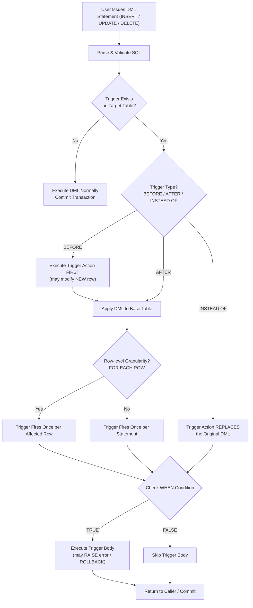
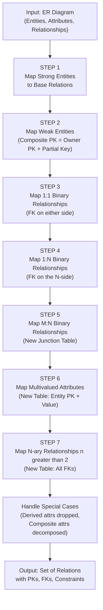
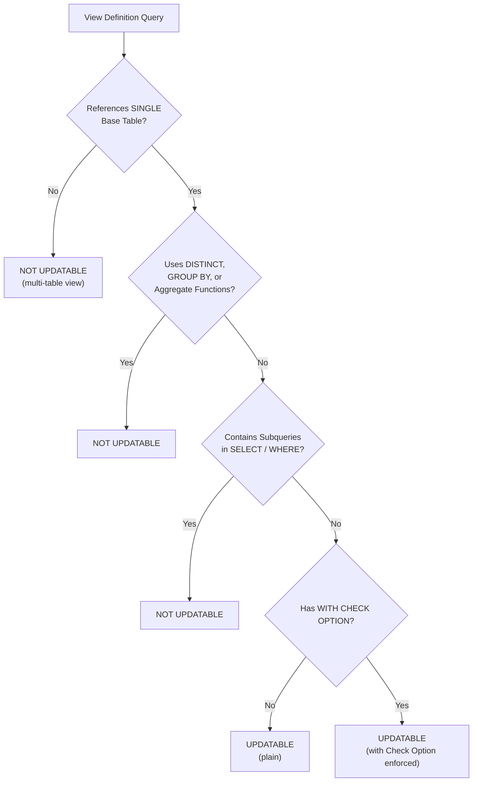

# Assertions, Triggers, views,  Relational Database Design Using ER-to-Relational Mapping.

<!-- SECTION_1_START -->
# Module 2 — The Relational Data Model and SQL

## Topic: Assertions, Triggers, Views & ER-to-Relational Mapping

---

### 1.1 Assertions — Formal Definition

An **assertion** is a declarative SQL constraint that expresses a condition that the database must satisfy **at all times**, across **any combination of tuples** in one or more relations. Unlike `CHECK` constraints (which are local to a single table), assertions are **schema-level** and are evaluated whenever any referenced relation is modified.

> [!IMPORTANT]
> **KTU Syllabus Highlight (Module 2):** Assertions are part of the *Integrity Constraints* sub-unit. KTU examiners frequently test the difference between an *assertion* and a *trigger* — assertions are **declarative and condition-only**, while triggers are **procedural and event-driven**.

**Intuition — The Bank Vault Rule:** Think of an assertion like a bank rule printed on the wall: *"The total of all loans taken by any customer must not exceed ₹10,00,000."* This rule is not tied to a single loan form (row) — it inspects the **entire portfolio** every time a new loan is approved. The bank's auditor (DBMS) automatically rejects any transaction that breaks the wall rule, even if the individual form is filled in correctly.

> [!NOTE]
> **Physical / Standard Metric:** In the **SQL:1999 / SQL:2003** standard, assertions are declared via `CREATE ASSERTION ... CHECK (...)`. However, in practice, **Oracle, MySQL, SQLite, and SQL Server do NOT fully support** the `CREATE ASSERTION` statement. The KTU textbook (Elmasri & Navathe) still expects the **standard SQL syntax** in theory answers.

---

### 1.2 Triggers — Formal Definition

A **trigger** is a named **procedural block** of SQL (and PL/SQL / T-SQL) that is **automatically executed** by the DBMS in response to a data-modification event (`INSERT`, `UPDATE`, or `DELETE`) on a specified table. Triggers implement the **ECA (Event–Condition–Action)** paradigm.

> [!IMPORTANT]
> **KTU Syllabus Highlight:** Triggers are explicitly listed under *"Views, Triggers, and Schema Modification"*. KTU 2024 scheme typically awards **7–10 marks** in ESE Part B for a full trigger question (event, condition, action, BEFORE/AFTER, row-level vs statement-level).

**Intuition — The Automatic Smoke Alarm:** Imagine a fire alarm (trigger) installed in a server room. The alarm is *event-driven* (it fires when smoke > threshold), has a *condition* (smoke level), and an *action* (sound siren + call fire dept). You don't manually trigger it every minute — it watches the system **continuously** and reacts on its own. Similarly, a DBMS trigger "watches" a table and reacts whenever a specified event happens.

---

### 1.3 Views — Formal Definition

A **view** is a **virtual relation** defined by a query that is stored in the database as a named `SELECT` statement. The view **does not store tuples physically** (except in the case of *materialized views*); its result is computed *on demand* every time the view is referenced in a query.

> [!NOTE]
> **Key Distinction (Board Favourite):**
> - **Base Table** → physically stored; tuples actually exist on disk.
> - **View** → virtual; no independent physical storage; the DBMS substitutes the defining query at runtime.

**Intuition — The Reusable Filter Lens on Excel:** Suppose you have a giant sales spreadsheet (base table), but you only ever need to see "Sales where Region = Kerala and Year = 2024." You save a *filter view* (the view definition) — and every time you open it, Excel recomputes the filtered rows. You never saved a separate copy of the filtered data — it is *derived* from the original sheet. A SQL view behaves identically.

---

### 1.4 ER-to-Relational Mapping — Formal Definition

**ER-to-Relational Mapping** is a **systematic, step-wise algorithm** (Elmasri & Navathe, Ch. 9) that converts a conceptual **Entity–Relationship (ER) schema** into a logically equivalent **relational schema** (a set of relations / tables with primary keys, foreign keys, and constraints). The algorithm preserves semantics — entities, relationships, attributes, and structural constraints.

> [!IMPORTANT]
> **KTU Syllabus Highlight:** This is a **guaranteed 14-mark question** in KTU 2024 ESE Module 2. Students must draw the ER diagram, then list the 7 mapping steps, then write the final relational schema. Marks are split as: *ER Diagram (4) + Algorithm steps listing (4) + Final Schema tables (6)*.

**Intuition — The Architectural Blueprint to Builder's Plan:** Think of an ER diagram as the **architect's blueprint** (entities = rooms, relationships = doors connecting rooms, attributes = furniture). The relational schema is the **builder's working plan** with exact column lists, door keys (foreign keys), and room numbers (primary keys). The mapping algorithm is the **standard conversion code** every architect-builder pair uses so the built house matches the blueprint exactly.

> [!VISUALIZATION CONTROL]
> **Concept:** Conceptual view of a 1:N relationship between **DEPARTMENT** and **EMPLOYEE**
> **GeoGebra / Desmos Input Equations (illustrative ER mapping):**
> * Points (Entities): `D = (0, 5)` labelled "DEPARTMENT (1)", `E1 = (-2, 2)`, `E2 = (0, 2)`, `E3 = (2, 2)` labelled "EMPLOYEE (N)"
> * Line (Relationship): `WORKS_FOR: D → {E1, E2, E3}` with crow's foot `||---o{` at EMPLOYEE end
> **Visual Description:** A single box (DEPARTMENT) connects via a crow's foot to three EMPLOYEE boxes — visually encoding the **one-to-many cardinality** that becomes a **foreign key** in the EMPLOYEE relation after mapping.
<!-- SECTION_1_END -->

<!-- SECTION_2_START -->
## 2. Deep Theoretical Analysis & KTU High-Yield Formula Sheet

### 2.1 Assertions — Operational Theory

- Assertions are **schema-level** constraints; they reference one or more tables.
- The DBMS **must check** the assertion predicate after **every transaction** that touches any referenced table.
- If the predicate evaluates to `FALSE` for any state, the transaction is **rolled back**.
- They can reference aggregates (`SUM`, `COUNT`, `AVG`) — which `CHECK` constraints generally cannot.
- **Limitation:** Heavy performance cost, hence rarely used in production; `TRIGGER` + `ROLLBACK` is the practical substitute.

**Standard Syntax:**

```sql
CREATE ASSERTION <assertion_name>
CHECK ( <predicate> );
```

**Drop Syntax:**

```sql
DROP ASSERTION <assertion_name>;
```

---

### 2.2 Triggers — Operational Theory

Triggers are defined using the **ECA model** — *Event* + *Condition* + *Action*.

| Component | Meaning | KTU Keyword |
|---|---|---|
| **Event** | What data change fires the trigger? | `INSERT`, `UPDATE`, `DELETE` |
| **Timing** | When does the trigger body run relative to the event? | `BEFORE`, `AFTER`, `INSTEAD OF` |
| **Granularity** | Once per statement, or once per affected row? | `FOR EACH STATEMENT` (default in some), `FOR EACH ROW` |
| **Condition** | Optional WHEN clause | `WHEN (condition)` |
| **Action** | Procedural body | `BEGIN ... END` block |

**Old vs New References (CRITICAL for KTU):**

| Event | OLD reference | NEW reference |
|---|---|---|
| `INSERT` | ❌ Not available | ✅ The row being inserted |
| `UPDATE` | ✅ Old value before update | ✅ New value after update |
| `DELETE` | ✅ The row being deleted | ❌ Not available |

**Standard SQL:2003 Syntax (referenced in Elmasri & Navathe):**

```sql
CREATE TRIGGER <trigger_name>
{ BEFORE | AFTER } { INSERT | UPDATE | DELETE }
ON <table_name>
[ FOR EACH { ROW | STATEMENT } ]
[ WHEN ( <condition> ) ]
<trigger_action>;
```

**Row-level references** are typically `OLD` and `NEW` (or `REFERENCING OLD AS OLD`, `NEW AS NEW` in standard SQL). **MySQL** uses `OLD` and `NEW`. **Oracle** uses `:OLD` and `:NEW`. **PostgreSQL** uses `OLD` and `NEW` inside plpgsql functions.

---

### 2.3 Views — Operational Theory

- A view is a **named query** stored in the data dictionary.
- Views support **query reuse, security (column/row-level hiding), and logical data independence**.
- **Updatable View Conditions** (Elmasri & Navathe rule): A view is theoretically updatable if its defining query is on a **single base table**, contains no `DISTINCT`, no aggregate functions, no `GROUP BY`/`HAVING`, and no subqueries in `SELECT`/`WHERE` referring to the same table.
- **`WITH CHECK OPTION`**: Guarantees that any row updated through the view will not violate the view's `WHERE` clause — prevents "phantom updates" that disappear after insertion.

**Standard Syntax:**

```sql
CREATE VIEW <view_name> [ (column_list) ]
AS <select_query>
[ WITH CHECK OPTION ];
```

**Drop Syntax:**

```sql
DROP VIEW <view_name> [ CASCADE | RESTRICT ];
```

---

### 2.4 ER-to-Relational Mapping — The 7-Step Algorithm (Elmasri & Navathe)

| Step | ER Construct | Mapping Rule | Resulting Relation |
|---|---|---|---|
| **1** | Regular (strong) Entity | Create relation $R$ with all simple attributes of $E$; choose PK | $R(\underline{PK},\ \text{simple attributes})$ |
| **2** | Weak Entity | Create relation $R_w$ with own partial key + simple attrs; PK = (owner's PK, partial key); FK → owner | $R_w(\underline{PK_{\text{owner}}},\ \underline{\text{partial\_key}},\ \text{attrs})$ |
| **3** | Binary 1:1 Relationship $R$ | Choose one side (say $S$); add PK of $T$ as FK in $S$; add any relationship attributes to $S$ | Add FK to participating entity's relation |
| **4** | Binary 1:N Relationship $R$ | Add PK of the "1" side as FK in the "N" side relation | FK on N-side |
| **5** | Binary M:N Relationship $R$ | Create new relation $R_S$ with PKs of both entities (composite PK) + relationship attributes | $R_S(\underline{PK_A},\ \underline{PK_B},\ \text{rel\_attrs})$ |
| **6** | Multivalued Attribute $M$ | Create new relation $R_M$ with PK of $E$ + value of $M$; PK = (PK of $E$, value of $M$); FK → $E$ | New relation per multivalued attribute |
| **7** | N-ary ($n>2$) Relationship $R$ | Create new relation $R_n$ with PKs of all participating entities; PK = combination of all FKs + relationship attrs | New relation |

**Special-case handling:**

- **Composite attribute** → break into constituent simple attributes; include only the simple leaves.
- **Derived attribute** → NOT mapped (it is computable on demand).
- **N-ary relationship (n > 2)** → Step 7 above.

---

### 2.5 KTU High-Yield Cheat Sheet

> [!IMPORTANT]
> **Table 2.5 — KTU Exam-Ready Quick Reference (Markdown-Safe: `|` avoided using `\vert`)**

| Construct | Key SQL DDL Keyword | When It Fires / Acts | Practical Real-World Use |
|---|---|---|---|
| **Assertion** | `CREATE ASSERTION ... CHECK (...)` | After every relevant transaction | Bank policy rules, salary caps, global invariants |
| **Trigger** | `CREATE TRIGGER ... BEFORE/AFTER ...` | On `INSERT \vert UPDATE \vert DELETE` of a row / statement | Auditing logs, auto-computed values, referential enforcement |
| **View** | `CREATE VIEW ... AS SELECT ...` | At query compile / runtime | Data security, query reuse, report templates |
| **ER Mapping Step 1** | `CREATE TABLE` with PK | Once at schema design | Converting strong entity to base table |
| **ER Mapping Step 5** | `CREATE TABLE` with two FKs | Once at schema design | Resolving M:N → junction table |
| **ER Mapping Step 6** | `CREATE TABLE` with FK + value | Once at schema design | Resolving multivalued attribute → separate table |
| **`WITH CHECK OPTION`** | Modifier on `CREATE VIEW` | On view update/insert | Prevents updates that violate the view's `WHERE` clause |
| **`FOR EACH ROW`** | Trigger granularity | Once per affected row | Row-by-row auditing |
| **`FOR EACH STATEMENT`** | Trigger granularity | Once per SQL statement | Bulk logging, summarizing changes |

**Engineering Utility Notes (real-world deployment):**

- **Assertions** in industry are almost always replaced by `TRIGGER + SIGNAL SQLSTATE '45000'` patterns (MySQL/PostgreSQL workarounds) due to the absence of full assertion support.
- **Triggers** are heavily used in **audit trails** (banking), **soft deletes** (set `is_deleted` flag instead of `DELETE`), and **denormalization maintenance** (auto-update a `total` column when child rows change).
- **Views** power **BI dashboards** (Looker, Tableau, Power BI all sit atop SQL views), **role-based access control** (hide salary column from non-HR users), and **API data shaping** in microservices.
- **ER-to-Relational mapping** is the foundation of **ORM tools** (Hibernate, Sequelize, SQLAlchemy) — they internally follow the same 7-step algorithm to generate schema from class diagrams.
<!-- SECTION_2_END -->

<!-- SECTION_3_START -->
## 3. Step-by-Step Derivations, Worked Examples & Code Implementation

### 3.1 Assertion — Complete Worked Example

**Schema Setup (the standard `COMPANY` database from Elmasri & Navathe):**

```sql
CREATE TABLE EMPLOYEE (
    Ename   VARCHAR(30) PRIMARY KEY,
    Ssn     CHAR(9)     UNIQUE NOT NULL,
    Salary  DECIMAL(10,2),
    Dno     INT
);

CREATE TABLE DEPARTMENT (
    Dname   VARCHAR(30) PRIMARY KEY,
    Dnumber INT         UNIQUE,
    Mgr_ssn CHAR(9),
    Mgr_start_date DATE
);

CREATE TABLE PROJECT (
    Pname   VARCHAR(30) PRIMARY KEY,
    Pnumber INT,
    Plocation VARCHAR(30),
    Dnum    INT
);
```

**Assertion 1 — Salary Constraint:** *"The salary of any employee must not exceed ₹1,00,000."*

```sql
CREATE ASSERTION SALARY_CONSTRAINT
CHECK ( NOT EXISTS ( SELECT * FROM EMPLOYEE
                     WHERE Salary > 100000 ) );
```

**Assertion 2 — Budget Constraint:** *"The sum of salaries of all employees in a department must not exceed the budget of that department."* (We assume `DEPARTMENT` has a `Budget` attribute.)

```sql
ALTER TABLE DEPARTMENT ADD COLUMN Budget DECIMAL(12,2);

CREATE ASSERTION DEPT_BUDGET_CONSTRAINT
CHECK ( NOT EXISTS ( SELECT D.Dnumber
                     FROM DEPARTMENT D, EMPLOYEE E
                     WHERE D.Dnumber = E.Dno
                     GROUP BY D.Dnumber, D.Budget
                     HAVING SUM(E.Salary) > D.Budget ) );
```

**Drop Example:**

```sql
DROP ASSERTION DEPT_BUDGET_CONSTRAINT;
```

> [!NOTE]
> **Step-by-step reasoning for Assertion 2:**
> 1. We need to compare two aggregates per department: `SUM(E.Salary)` and `D.Budget`.
> 2. Aggregate comparisons are not allowed inside a column-level `CHECK` — they require a subquery → hence `ASSERTION` is the right tool.
> 3. The pattern `NOT EXISTS ( ... HAVING ... )` is the canonical SQL idiom for expressing "no department violates the rule."

---

### 3.2 Trigger — Complete Worked Example (MySQL-flavored, KTU-friendly)

**Use Case:** Automatically maintain a `derived_total` column in `DEPARTMENT` whenever an employee's salary changes.

**Step 1 — Create the table to maintain:**

```sql
CREATE TABLE DEPT_SAL_TOTAL (
    Dnumber INT PRIMARY KEY,
    Total_Salary DECIMAL(14,2) DEFAULT 0
);
```

**Step 2 — Create the trigger (AFTER INSERT, UPDATE, DELETE on EMPLOYEE):**

```sql
DELIMITER $$

CREATE TRIGGER trg_emp_after_insert
AFTER INSERT ON EMPLOYEE
FOR EACH ROW
BEGIN
    -- If the department row does not exist, create it
    INSERT INTO DEPT_SAL_TOTAL (Dnumber, Total_Salary)
    VALUES (NEW.Dno, NEW.Salary)
    ON DUPLICATE KEY UPDATE Total_Salary = Total_Salary + NEW.Salary;
END$$

CREATE TRIGGER trg_emp_after_delete
AFTER DELETE ON EMPLOYEE
FOR EACH ROW
BEGIN
    UPDATE DEPT_SAL_TOTAL
    SET Total_Salary = Total_Salary - OLD.Salary
    WHERE Dnumber = OLD.Dno;
END$$

CREATE TRIGGER trg_emp_after_update
AFTER UPDATE ON EMPLOYEE
FOR EACH ROW
BEGIN
    IF OLD.Dno = NEW.Dno THEN
        UPDATE DEPT_SAL_TOTAL
        SET Total_Salary = Total_Salary - OLD.Salary + NEW.Salary
        WHERE Dnumber = NEW.Dno;
    ELSE
        -- Employee moved departments
        UPDATE DEPT_SAL_TOTAL SET Total_Salary = Total_Salary - OLD.Salary WHERE Dnumber = OLD.Dno;
        UPDATE DEPT_SAL_TOTAL SET Total_Salary = Total_Salary + NEW.Salary WHERE Dnumber = NEW.Dno;
    END IF;
END$$

DELIMITER ;
```

**Step 3 — Test it:**

```sql
INSERT INTO EMPLOYEE VALUES ('Arjun', 'S001', 50000, 5);
INSERT INTO EMPLOYEE VALUES ('Meera', 'S002', 60000, 5);
SELECT * FROM DEPT_SAL_TOTAL;
-- Expected: Dnumber=5, Total_Salary=110000
```

**Step 4 — Drop it:**

```sql
DROP TRIGGER trg_emp_after_insert;
```

**Standard SQL:2003 form (for theory answers — KTU textbook style):**

```sql
CREATE TRIGGER SALARY_TOTAL_TRIG
AFTER INSERT ON EMPLOYEE
REFERENCING NEW ROW AS NEWEMP
FOR EACH ROW
WHEN ( NEWEMP.Dno IS NOT NULL )
UPDATE DEPT_SAL_TOTAL
SET    Total_Salary = Total_Salary + NEWEMP.Salary
WHERE  Dnumber = NEWEMP.Dno;
```

---

### 3.3 View — Complete Worked Example

**Step 1 — Create base tables:**

```sql
CREATE TABLE STUDENT (
    RollNo   INT PRIMARY KEY,
    Sname    VARCHAR(50),
    Dept     VARCHAR(20),
    CGPA     DECIMAL(4,2)
);

CREATE TABLE ENROLLMENT (
    RollNo   INT,
    CourseID VARCHAR(10),
    Grade    CHAR(2),
    PRIMARY KEY (RollNo, CourseID),
    FOREIGN KEY (RollNo) REFERENCES STUDENT(RollNo)
);
```

**Step 2 — Create a simple view:**

```sql
CREATE VIEW CS_HIGH_CGPA AS
SELECT RollNo, Sname, CGPA
FROM   STUDENT
WHERE  Dept = 'CSE' AND CGPA >= 8.5;
```

**Step 3 — Query the view (just like a table):**

```sql
SELECT * FROM CS_HIGH_CGPA;
```

The DBMS internally rewrites this as:

```sql
SELECT RollNo, Sname, CGPA
FROM   STUDENT
WHERE  Dept = 'CSE' AND CGPA >= 8.5;
```

**Step 4 — Create a view with `WITH CHECK OPTION`:**

```sql
CREATE VIEW CSE_STUDENTS AS
SELECT RollNo, Sname, CGPA, Dept
FROM   STUDENT
WHERE  Dept = 'CSE'
WITH CHECK OPTION;
```

Now if a user tries:

```sql
UPDATE CSE_STUDENTS SET Dept = 'ECE' WHERE RollNo = 101;
```

The DBMS **rejects** the update because the new value `Dept = 'ECE'` would make the row no longer satisfy the view's `WHERE` clause. The `CHECK OPTION` enforces the view's filter even on modifications.

**Step 5 — Create a complex (non-updatable) view with join + aggregate:**

```sql
CREATE VIEW DEPT_AVG_CGPA AS
SELECT   Dept, COUNT(*) AS Total_Students, AVG(CGPA) AS Average_CGPA
FROM     STUDENT
GROUP BY Dept;
```

This view is **not updatable** because of `COUNT`, `AVG`, and `GROUP BY` — exactly the conditions that disqualify a view from being theoretically updatable per Elmasri & Navathe.

**Step 6 — Drop a view:**

```sql
DROP VIEW CS_HIGH_CGPA;
```

---

### 3.4 ER-to-Relational Mapping — Full Worked Example (The `COMPANY` Database)

**Step 1 — Given ER Diagram (textual description):**

Entities and attributes:

- **EMPLOYEE**: `Ename`, `Ssn` (PK), `Bdate`, `Address`, `Salary`, `Sex`, `Dno` (FK to DEPARTMENT)
- **DEPARTMENT**: `Dname`, `Dnumber` (PK), `Mgr_ssn` (FK to EMPLOYEE), `Mgr_start_date`
- **PROJECT**: `Pname`, `Pnumber` (PK), `Plocation`, `Dnum` (FK to DEPARTMENT)
- **DEPENDENT** (weak entity, owner = EMPLOYEE): `Dependent_name` (partial key), `Sex`, `Bdate`, `Relationship`

Relationships:

- **WORKS_FOR** (EMPLOYEE N : 1 DEPARTMENT)
- **CONTROLS** (DEPARTMENT 1 : N PROJECT)
- **MANAGES** (EMPLOYEE 1 : 1 DEPARTMENT)
- **SUPERVISION** (EMPLOYEE 1 : N EMPLOYEE) — recursive
- **WORKS_ON** (EMPLOYEE M : N PROJECT) with attribute `Hours`
- Multivalued attribute: `DEPT_LOCATIONS` of DEPARTMENT

**Step 2 — Apply the 7-step algorithm:**

**Step 1 — Regular Entities:**

```sql
CREATE TABLE EMPLOYEE (
    Fname    VARCHAR(20),
    Minit    CHAR,
    Lname    VARCHAR(20),
    Ssn      CHAR(9)  PRIMARY KEY,
    Bdate    DATE,
    Address  VARCHAR(50),
    Sex      CHAR,
    Salary   DECIMAL(10,2),
    Dno      INT,
    -- Dno FK added in Step 4
    -- Super_ssn FK added in Step 4 (recursive)
    -- Mgr_ssn relationship: see Step 3
    FOREIGN KEY (Dno) REFERENCES DEPARTMENT(Dnumber)
);

CREATE TABLE DEPARTMENT (
    Dname          VARCHAR(30),
    Dnumber        INT PRIMARY KEY,
    Mgr_ssn        CHAR(9),
    Mgr_start_date DATE,
    FOREIGN KEY (Mgr_ssn) REFERENCES EMPLOYEE(Ssn)
);

CREATE TABLE PROJECT (
    Pname     VARCHAR(30),
    Pnumber   INT PRIMARY KEY,
    Plocation VARCHAR(30),
    Dnum      INT,
    FOREIGN KEY (Dnum) REFERENCES DEPARTMENT(Dnumber)
);
```

**Step 2 — Weak Entity `DEPENDENT`:**

```sql
CREATE TABLE DEPENDENT (
    Essn           CHAR(9),
    Dependent_name VARCHAR(30),
    Sex            CHAR,
    Bdate          DATE,
    Relationship   VARCHAR(20),
    PRIMARY KEY (Essn, Dependent_name),
    FOREIGN KEY (Essn) REFERENCES EMPLOYEE(Ssn) ON DELETE CASCADE
);
```

**Step 3 — Binary 1:1 Relationship `MANAGES`:** FK already placed in DEPARTMENT (Mgr_ssn). No new table. ✅

**Step 4 — Binary 1:N Relationships:**

- `WORKS_FOR` (EMPLOYEE N : 1 DEPARTMENT): FK `Dno` in EMPLOYEE → DEPARTMENT. ✅
- `CONTROLS` (DEPARTMENT 1 : N PROJECT): FK `Dnum` in PROJECT → DEPARTMENT. ✅
- `SUPERVISION` (EMPLOYEE 1 : N EMPLOYEE — recursive): Add `Super_ssn` FK in EMPLOYEE → EMPLOYEE(Ssn).

```sql
ALTER TABLE EMPLOYEE ADD COLUMN Super_ssn CHAR(9);
ALTER TABLE EMPLOYEE ADD CONSTRAINT FK_SUPER
    FOREIGN KEY (Super_ssn) REFERENCES EMPLOYEE(Ssn);
```

**Step 5 — Binary M:N Relationship `WORKS_ON` (with attribute `Hours`):**

```sql
CREATE TABLE WORKS_ON (
    Essn    CHAR(9),
    Pno     INT,
    Hours   DECIMAL(4,1),
    PRIMARY KEY (Essn, Pno),
    FOREIGN KEY (Essn) REFERENCES EMPLOYEE(Ssn),
    FOREIGN KEY (Pno)  REFERENCES PROJECT(Pnumber)
);
```

**Step 6 — Multivalued Attribute `DEPT_LOCATIONS`:**

```sql
CREATE TABLE DEPT_LOCATIONS (
    Dnumber  INT,
    Location VARCHAR(50),
    PRIMARY KEY (Dnumber, Location),
    FOREIGN KEY (Dnumber) REFERENCES DEPARTMENT(Dnumber) ON DELETE CASCADE
);
```

**Step 7 — N-ary Relationships:** Not present in this database; if any existed, we would create a new table with FKs to all participants.

**Step 8 — (Implicit) Derived Attribute `Age` of EMPLOYEE:** **Do not map**; it is computed via `YEAR(CURDATE()) - YEAR(Bdate)`.

**Step 9 — Composite Attribute `Address` of EMPLOYEE:** Map only the simple leaves: `Street`, `City`, `State`, `Zip`. (No `Address` column.)

---

### 3.5 Final Relational Schema (compact summary)

$$
\begin{aligned}
\text{EMPLOYEE}(\underline{\text{Ssn}},\ \text{Fname},\ \text{Minit},\ \text{Lname},\ \text{Bdate},\ \text{Street},\ \text{City},\ \text{State},\ \text{Zip},\ \text{Sex},\ \text{Salary},\ \text{Super\_ssn},\ \text{Dno}) \\
\text{DEPARTMENT}(\underline{\text{Dnumber}},\ \text{Dname},\ \text{Mgr\_ssn},\ \text{Mgr\_start\_date}) \\
\text{DEPT\_LOCATIONS}(\underline{\text{Dnumber}},\ \underline{\text{Location}}) \\
\text{PROJECT}(\underline{\text{Pnumber}},\ \text{Pname},\ \text{Plocation},\ \text{Dnum}) \\
\text{WORKS\_ON}(\underline{\text{Essn}},\ \underline{\text{Pno}},\ \text{Hours}) \\
\text{DEPENDENT}(\underline{\text{Essn}},\ \underline{\text{Dependent\_name}},\ \text{Sex},\ \text{Bdate},\ \text{Relationship})
\end{aligned}
$$

> [!IMPORTANT]
> **Final Algorithm Recap (memorize this for KTU):**
> 1. Strong entity → own table with PK.
> 2. Weak entity → table with (owner's PK, partial key) as composite PK.
> 3. 1:1 → FK on either side.
> 4. 1:N → FK on the N-side.
> 5. M:N → new junction table with composite PK.
> 6. Multivalued attribute → new table with (entity PK, value).
> 7. N-ary (n > 2) → new table with FKs to all participants.
<!-- SECTION_3_END -->

<!-- SECTION_4_START -->
## 4. Structural Diagrams & Schematics

### 4.1 Trigger Execution Flow (Mermaid — ECA Model)



**Description of the flow:**
- A user DML reaches the DBMS; if any trigger is registered on the target table for that event, the DBMS consults the trigger catalog.
- `BEFORE` triggers run *before* the row is written — useful for input validation or value normalization.
- `AFTER` triggers run *after* the write — useful for logging or denormalized aggregates (as in our `DEPT_SAL_TOTAL` example).
- `INSTEAD OF` triggers are mostly used on **views** to make non-updatable views updatable.
- The `WHEN` clause is an optional guard that filters out rows before the action body runs.

---

### 4.2 View Resolution — Query Rewrite Pipeline

```mermaid
flowchart LR
    subgraph USER["User Layer"]
        Q1["SELECT * FROM CS_HIGH_CGPA;"]
    end
    subgraph REWRITE["Query Rewrite Stage"]
        R1["Parse View Definition from<br/>Data Dictionary"]
        R2["Substitute View Name with<br/>Defining SELECT Query"]
    end
    subgraph OPT["Optimizer Stage"]
        O1["Merge with Outer Query<br/>(View Merging / Predicate Pushdown)"]
        O2["Generate Execution Plan"]
    end
    subgraph EXEC["Execution Engine"]
        E1["Access Base Table EMPLOYEE"]
        E2["Apply WHERE: Dept='CSE' AND CGPA>=8.5"]
        E3["Project RollNo, Sname, CGPA"]
        E4["Return Result to User"]
    end
    Q1 --> R1 --> R2 --> O1 --> O2 --> E1 --> E2 --> E3 --> E4
```



**Description:** The DBMS does not store view tuples. When a user queries a view, the query rewrite engine **substitutes** the view's defining `SELECT` into the user's query, then optimizes and executes it as a single query against base tables.

---

### 4.3 ER-to-Relational Mapping — Sequential Processing Topology



**Description:** This is the **canonical 7-step pipeline** that every ER-to-Relational mapping must traverse. The output is a complete relational schema ready for `CREATE TABLE` statements.

---

### 4.4 Updatable View Decision Matrix



**Description:** Per Elmasri & Navathe, only the `Yes → No → No → No` path leads to a fully updatable view. The `WITH CHECK OPTION` is a final guard that prevents updates that escape the view's filter.
<!-- SECTION_4_END -->

<!-- SECTION_5_START -->
## 5. KTU 2024 Scheme Examination Question Bank & Topic Recap

### 5.1 Part A — Short Answer Questions (3 Marks Each)

> **Question 1. [KTU University Exam — Dec 2023]**
> *Differentiate between an **assertion** and a **trigger** in SQL. Mention one scenario where each is preferred. (3 Marks)* `[CO2, Understand]`

**Model Answer (Board Key Pattern):**

| Aspect | Assertion | Trigger |
|---|---|---|
| **Nature** | Declarative constraint (condition only) | Procedural (event + condition + action) |
| **Scope** | Schema-level, can span multiple tables | Tied to a single table's DML event |
| **Standard SQL Keyword** | `CREATE ASSERTION ... CHECK` | `CREATE TRIGGER ...` |
| **Execution** | Evaluated automatically after every relevant transaction | Fired automatically on `INSERT / UPDATE / DELETE` |
| **Preferred Scenario** | Global invariants like *"total loans per customer ≤ ₹10,00,000"* | Procedural reactions like *audit logging, auto-computing totals, sending notifications* |

> **Valuation Key Points:**
> - [Correct identification of declarative vs procedural: 1 Mark]
> - [Scope comparison (multi-table vs single-table): 1 Mark]
> - [One correct real-world scenario each: 1 Mark]

---

> **Question 2. [KTU University Exam — July 2024]**
> *What is a **view** in SQL? List the conditions under which a view is considered **updatable**. (3 Marks)* `[CO2, Remember / Understand]`

**Model Answer:**

A **view** is a virtual table defined by a stored `SELECT` query; it does not contain its own physical tuples.

A view is updatable when **all** of the following hold (Elmasri & Navathe rule):

1. The defining query references exactly **one base table**.
2. It does **not** use `DISTINCT`, aggregate functions (`SUM`, `AVG`, `COUNT`, etc.), `GROUP BY`, or `HAVING`.
3. The `SELECT` list contains only **simple column references** of the base table — no expressions, no computed columns.
4. The `WHERE` clause does **not** contain a subquery that itself references the same base table.

> **Valuation Key Points:**
> - [View definition: 1 Mark]
> - [Listing the 4 conditions (any 3 acceptable): 2 Marks]

---

### 5.2 Part B — Long Answer Questions (14 Marks Each, Internal Choice)

> **Question 3A. [KTU University Exam — Model Paper 2024]**
> Consider the following relations for a **Library Management System**:
>
> $$
> \begin{aligned}
> \text{BOOK}(\underline{\text{Bid}},\ \text{Title},\ \text{Price},\ \text{Publisher}) \\
> \text{READER}(\underline{\text{Rid}},\ \text{Rname},\ \text{Type}) \\
> \text{BORROW}(\underline{\text{Rid}},\ \underline{\text{Bid}},\ \text{Date\_of\_Issue},\ \text{Date\_of\_Return})
> \end{aligned}
> $$
>
> Write SQL for the following:
> **(a)** Create an **assertion** ensuring that *no reader of type "Student" can borrow more than 3 books at a time*. (7 Marks)
> **(b)** Create a **trigger** that *automatically prevents a book from being deleted if it is currently referenced in the BORROW table (i.e., not yet returned)*. (7 Marks)
> `[CO3, Apply / Analyze]`

---

**Model Solution for 3A:**

**Part (a) — Assertion: (7 Marks)**

```sql
CREATE ASSERTION STUDENT_BORROW_LIMIT
CHECK (
    NOT EXISTS (
        SELECT   B.Rid
        FROM     BORROW B, READER R
        WHERE    B.Rid = R.Rid
        AND      R.Type = 'Student'
        AND      B.Date_of_Return IS NULL
        GROUP BY B.Rid
        HAVING   COUNT(*) > 3
    )
);
```

> **Incremental Valuation Key (Part a):**
> - [Correct use of `CREATE ASSERTION ... CHECK` syntax: 2 Marks]
> - [Proper join between `BORROW` and `READER` on `Rid`: 2 Marks]
> - [Filter on `Type = 'Student'` and `Date_of_Return IS NULL` (i.e., currently borrowed): 2 Marks]
> - [Correct use of `GROUP BY` + `HAVING COUNT(*) > 3`: 1 Mark]

---

**Part (b) — Trigger: (7 Marks)**

```sql
DELIMITER $$

CREATE TRIGGER trg_prevent_book_delete
BEFORE DELETE ON BOOK
FOR EACH ROW
BEGIN
    DECLARE active_loans INT;
    SELECT COUNT(*) INTO active_loans
    FROM   BORROW
    WHERE  Bid = OLD.Bid
    AND    Date_of_Return IS NULL;

    IF active_loans > 0 THEN
        SIGNAL SQLSTATE '45000'
        SET MESSAGE_TEXT = 'Cannot delete: book is currently borrowed.';
    END IF;
END$$

DELIMITER ;
```

> **Incremental Valuation Key (Part b):**
> - [Correct trigger timing `BEFORE DELETE`: 1 Mark]
> - [Proper use of `FOR EACH ROW` and `OLD.Bid` reference: 2 Marks]
> - [Correct count of active loans via subquery / `SELECT INTO`: 2 Marks]
> - [`SIGNAL SQLSTATE` to abort the delete (or equivalent `RAISE_APPLICATION_ERROR` in Oracle): 2 Marks]

> [!WARNING]
> **KTU Examiner's Pitfall Callout:**
> - Do **not** use `AFTER DELETE` — by then the row is already gone, and the integrity rule is violated. Use `BEFORE DELETE`.
> - Do **not** forget the `Date_of_Return IS NULL` filter — otherwise the trigger will block deletion of *returned* books too.
> - In standard SQL answers, you may write `REFERENCING OLD ROW AS OLDBOOK` instead of `OLD.Bid` — both are accepted.

---

> **Question 3B. [Internal Choice — Alternative Path]**
> Consider the relations:
>
> $$
> \begin{aligned}
> \text{EMPLOYEE}(\underline{\text{Eno}},\ \text{Ename},\ \text{Salary},\ \text{Dno}) \\
> \text{DEPARTMENT}(\underline{\text{Dno}},\ \text{Dname},\ \text{Location})
> \end{aligned}
> $$
>
> Write SQL for the following:
> **(a)** Create a **view** `HIGH_PAID_KOCHI` that lists `Eno`, `Ename`, `Salary` of all employees in the *Kochi* department with `Salary > 50000`. Include `WITH CHECK OPTION`. Query the view. (7 Marks)
> **(b)** Create an **assertion** ensuring that *"the average salary in any department must be between ₹25,000 and ₹2,00,000"*. (7 Marks)
> `[CO3, Apply]`

---

**Model Solution for 3B:**

**Part (a) — View Creation + Query: (7 Marks)**

```sql
-- Step 1: Create the view
CREATE VIEW HIGH_PAID_KOCHI AS
SELECT   E.Eno, E.Ename, E.Salary
FROM     EMPLOYEE E, DEPARTMENT D
WHERE    E.Dno = D.Dno
AND      D.Location = 'Kochi'
AND      E.Salary > 50000
WITH CHECK OPTION;

-- Step 2: Query the view
SELECT * FROM HIGH_PAID_KOCHI;
```

> **Incremental Valuation Key (Part a):**
> - [Correct `CREATE VIEW ... AS SELECT` syntax: 2 Marks]
> - [Correct join + filter conditions: 2 Marks]
> - [Inclusion of `WITH CHECK OPTION`: 1 Mark]
> - [Valid query against the view: 2 Marks]

---

**Part (b) — Assertion: (7 Marks)**

```sql
CREATE ASSERTION AVG_SALARY_RANGE
CHECK (
    NOT EXISTS (
        SELECT   Dno
        FROM     EMPLOYEE
        GROUP BY Dno
        HAVING   AVG(Salary) < 25000
              OR AVG(Salary) > 200000
    )
);
```

> **Incremental Valuation Key (Part b):**
> - [Correct use of `CREATE ASSERTION`: 1 Mark]
> - [Proper `GROUP BY Dno` + `HAVING` aggregate usage: 3 Marks]
> - [Correct range check `AVG(Salary) BETWEEN 25000 AND 200000` (or equivalent `OR` decomposition): 2 Marks]
> - [Wrapping the violating condition in `NOT EXISTS`: 1 Mark]

> [!WARNING]
> **Examiner's Pitfall Callout (3B):**
> - The view in (a) is **not theoretically updatable** because it joins two tables. Students may incorrectly mark it as updatable.
> - `WITH CHECK OPTION` does **not** make a multi-table view updatable; it only enforces the `WHERE` filter on attempted updates.
> - Students often forget the `NOT EXISTS` wrapper in the assertion, making the logic inverted.

---

> **Question 4A. [KTU University Exam — July 2023, Modified]**
> *Given the following ER description, perform a **step-by-step ER-to-Relational mapping** and write the final relational schema:*
>
> - **Entity** `STUDENT` with attributes `RollNo (PK)`, `Name`, `DOB`, `Semester`.
> - **Entity** `COURSE` with attributes `CourseID (PK)`, `CourseName`, `Credits`. *CourseName* is multivalued (multiple aliases per course).
> - **Weak entity** `PROJECT` with partial key `ProjNo`, attribute `Title`; owned by `STUDENT`. Each project belongs to exactly one student.
> - **Relationship** `ENROLLS` (STUDENT M : N COURSE) with attribute `EnrollDate`.
> - **Relationship** `GUIDES` (STUDENT 1 : N PROJECT) — recursive, a senior student guides many projects.
> - **Composite attribute** `Address` of STUDENT: `Street`, `City`, `Pincode`.
> - **Derived attribute** `Age` of STUDENT.
> **(14 Marks)** `[CO4, Apply / Analyze]`

---

**Model Solution for 4A — Step-by-Step Mapping:**

**Step 1 — Map Strong Entity `STUDENT`:**
- Relation: `STUDENT(RollNo PK, Name, DOB, Street, City, Pincode, Semester)`
- `Age` (derived) is **dropped**.
- `Address` (composite) is decomposed into `Street, City, Pincode`.

**Step 2 — Map Strong Entity `COURSE`:**
- Relation: `COURSE(CourseID PK, Credits)`
- `CourseName` (multivalued) is **not placed** here — see Step 6.

**Step 3 — Map Weak Entity `PROJECT`:**
- Relation: `PROJECT(RollNo, ProjNo, Title)`
- Composite PK: `(RollNo, ProjNo)`
- FK `RollNo` → `STUDENT(RollNo)` (with `ON DELETE CASCADE`).

**Step 4 — Map Binary M:N Relationship `ENROLLS`:**
- New relation: `ENROLLS(RollNo, CourseID, EnrollDate)`
- Composite PK: `(RollNo, CourseID)`
- FKs → `STUDENT`, `COURSE`.

**Step 5 — Map Recursive 1:N Relationship `GUIDES`:**
- A senior student (1-side) guides many projects.
- Add a foreign key `Guide_RollNo` in `PROJECT` → `STUDENT(RollNo)`.
- Updated `PROJECT(RollNo, ProjNo, Title, Guide_RollNo)`.

**Step 6 — Map Multivalued Attribute `CourseName` of COURSE:**
- New relation: `COURSE_NAMES(CourseID, CourseName)`
- Composite PK: `(CourseID, CourseName)`
- FK `CourseID` → `COURSE(CourseID)`.

**Step 7 — No N-ary relationships present.**

---

**Final SQL Schema:**

```sql
CREATE TABLE STUDENT (
    RollNo    INT PRIMARY KEY,
    Name      VARCHAR(50),
    DOB       DATE,
    Street    VARCHAR(50),
    City      VARCHAR(30),
    Pincode   CHAR(6),
    Semester  INT
);

CREATE TABLE COURSE (
    CourseID  VARCHAR(10) PRIMARY KEY,
    Credits   INT
);

CREATE TABLE COURSE_NAMES (
    CourseID    VARCHAR(10),
    CourseName  VARCHAR(50),
    PRIMARY KEY (CourseID, CourseName),
    FOREIGN KEY (CourseID) REFERENCES COURSE(CourseID) ON DELETE CASCADE
);

CREATE TABLE PROJECT (
    RollNo        INT,
    ProjNo        INT,
    Title         VARCHAR(50),
    Guide_RollNo  INT,
    PRIMARY KEY (RollNo, ProjNo),
    FOREIGN KEY (RollNo)       REFERENCES STUDENT(RollNo) ON DELETE CASCADE,
    FOREIGN KEY (Guide_RollNo) REFERENCES STUDENT(RollNo)
);

CREATE TABLE ENROLLS (
    RollNo      INT,
    CourseID    VARCHAR(10),
    EnrollDate  DATE,
    PRIMARY KEY (RollNo, CourseID),
    FOREIGN KEY (RollNo)   REFERENCES STUDENT(RollNo),
    FOREIGN KEY (CourseID) REFERENCES COURSE(CourseID)
);
```

> **Incremental Valuation Key (Question 4A):**
> - [Step 1 — STUDENT schema with correct PK + composite attribute decomposition: 2 Marks]
> - [Step 2 — COURSE schema (omitting multivalued attr): 1 Mark]
> - [Step 3 — Weak entity PROJECT with composite PK `(RollNo, ProjNo)`: 3 Marks]
> - [Step 4 — M:N junction ENROLLS: 2 Marks]
> - [Step 5 — Recursive 1:N via `Guide_RollNo` in PROJECT: 2 Marks]
> - [Step 6 — Multivalued attribute COURSE_NAMES separate table: 2 Marks]
> - [Bonus: Dropping derived attribute `Age` correctly: 1 Mark (often missed)]
> - [Correctly placing all foreign keys with referential actions: 1 Mark]

> [!WARNING]
> **Examiner's Pitfall Callout (4A):**
> - **Most common mistake:** Putting `CourseName` directly inside `COURSE` as a single column — this loses information because it is **multivalued**.
> - **Second common mistake:** Forgetting the recursive `Guide_RollNo` FK on `PROJECT`, treating GUIDES as a 1:N between two different entity types.
> - **Third common mistake:** Mapping the weak entity `PROJECT` without including the owner's PK in the composite PK — destroying the identifying relationship.
> - Students often retain the derived attribute `Age` in the schema. KTU key explicitly **deducts 1 mark** for this.

---

> **Question 4B. [Internal Choice — Alternative Path]**
> *Map the following ER schema to a relational schema. Identify and list which mapping step applies to each construct.*
>
> - Entity `AUTHOR` (`A_id` PK, `A_name`, `Email`)
> - Entity `BOOK` (`ISBN` PK, `Title`, `Price`)
> - Multivalued attribute `PHONE` of AUTHOR
> - Relationship `WRITES` (AUTHOR 1 : N BOOK) with attribute `RoyaltyPct`
> - Relationship `CO_AUTHORED` (AUTHOR M : N AUTHOR) — recursive, with attribute `Contribution`
> **(14 Marks)** `[CO4, Apply]`

---

**Model Solution for 4B:**

**Step 1 — Map Strong Entity `AUTHOR`:**
- `AUTHOR(A_id PK, A_name, Email)`

**Step 2 — Map Strong Entity `BOOK`:**
- `BOOK(ISBN PK, Title, Price)`

**Step 3 — Multivalued Attribute `PHONE` of AUTHOR → New Table:**
- `AUTHOR_PHONE(A_id, Phone_no)`
- Composite PK: `(A_id, Phone_no)`
- FK `A_id` → `AUTHOR(A_id)`

**Step 4 — 1:N Relationship `WRITES` → FK on N-side (BOOK):**
- Add `Author_id` (FK) in BOOK → `AUTHOR(A_id)`.
- Include `RoyaltyPct` in BOOK.
- `BOOK(ISBN PK, Title, Price, Author_id, RoyaltyPct)`

**Step 5 — Recursive M:N `CO_AUTHORED` → New Junction Table:**
- `CO_AUTHORED(Senior_Author_id, Co_Author_id, Contribution)`
- Composite PK: `(Senior_Author_id, Co_Author_id)`
- Both FKs → `AUTHOR(A_id)`.

```sql
CREATE TABLE AUTHOR (
    A_id    INT PRIMARY KEY,
    A_name  VARCHAR(50),
    Email   VARCHAR(50)
);

CREATE TABLE BOOK (
    ISBN        VARCHAR(13) PRIMARY KEY,
    Title       VARCHAR(100),
    Price       DECIMAL(8,2),
    Author_id   INT,
    RoyaltyPct  DECIMAL(5,2),
    FOREIGN KEY (Author_id) REFERENCES AUTHOR(A_id)
);

CREATE TABLE AUTHOR_PHONE (
    A_id     INT,
    Phone_no VARCHAR(15),
    PRIMARY KEY (A_id, Phone_no),
    FOREIGN KEY (A_id) REFERENCES AUTHOR(A_id) ON DELETE CASCADE
);

CREATE TABLE CO_AUTHORED (
    Senior_Author_id INT,
    Co_Author_id     INT,
    Contribution     DECIMAL(5,2),
    PRIMARY KEY (Senior_Author_id, Co_Author_id),
    FOREIGN KEY (Senior_Author_id) REFERENCES AUTHOR(A_id),
    FOREIGN KEY (Co_Author_id)     REFERENCES AUTHOR(A_id)
);
```

> **Incremental Valuation Key (4B):**
> - [AUTHOR and BOOK base relations: 2 Marks]
> - [AUTHOR_PHONE for multivalued attribute: 3 Marks]
> - [FK + `RoyaltyPct` correctly added to BOOK for 1:N: 3 Marks]
> - [Recursive M:N junction `CO_AUTHORED` with two FKs to AUTHOR: 4 Marks]
> - [All foreign key constraints + `ON DELETE CASCADE` on multivalued table: 2 Marks]

> [!WARNING]
> **Examiner's Pitfall Callout (4B):**
> - **Recursive M:N pitfall:** Some students create a junction table with only **one** FK — but a recursive M:N needs **two role-distinguishing FKs** (e.g., `Senior_Author_id` and `Co_Author_id`), both pointing to `AUTHOR(A_id)`.
> - **Multivalued attribute pitfall:** Embedding `Phone_no` as a single column in `AUTHOR` loses information. KTU strictly expects a separate relation.
> - **Relationship attribute pitfall:** `RoyaltyPct` belongs to the `WRITES` relationship; placing it inside `AUTHOR` is semantically wrong because an author may have different royalty rates for different books.

---

### 5.3 KTU Examiner's Master Warning — Topic-Wide Pitfalls

> [!WARNING]
> **Common Marks-Loss Points (All Sub-Topics):**
> 1. **Assertions vs Triggers:** Writing a `TRIGGER` when the question asks for an `ASSERTION` (or vice versa) → **2–3 marks** lost.
> 2. **Trigger timing:** Using `AFTER` when the question needs validation of the new value → use `BEFORE`.
> 3. **OLD vs NEW:** Referencing `NEW` in a `DELETE` trigger (it does not exist) → compile-time / runtime error, full marks lost.
> 4. **`WITH CHECK OPTION`:** Omitting it when the question explicitly asks for "enforce view's WHERE clause on updates."
> 5. **Updatable view rules:** Marking a multi-table view as updatable. **Always** check the Elmasri & Navathe 4-condition test.
> 6. **ER Mapping — derived attribute:** Retaining it in the schema. **Drop it** — 1 mark lost.
> 7. **ER Mapping — weak entity PK:** Forgetting the owner's PK in the weak entity's composite PK.
> 8. **ER Mapping — multivalued attribute:** Embedding it as a single column. **Always create a new table.**
> 9. **ER Mapping — recursive relationship:** Treating it like a regular 1:N between two different entities.
> 10. **ER Mapping — composite attribute:** Keeping the composite name (`Address`) instead of decomposing into leaves (`Street, City, Pincode`).

---

### 5.4 Topic Recap & Important Things to Remember

> [!IMPORTANT]
> **High-Density Revision Checklist (Pin this for the night before the exam):**

**Assertions**
- Definition: schema-level, multi-table, declarative integrity constraint.
- Syntax: `CREATE ASSERTION name CHECK (predicate);` + `DROP ASSERTION name;`
- Use `NOT EXISTS ( ... HAVING ... )` pattern for aggregate-based rules.
- Not natively supported in Oracle, MySQL, SQL Server — use trigger + rollback as a workaround.

**Triggers**
- ECA Paradigm: **Event** (DML) + **Condition** (optional `WHEN`) + **Action** (procedure).
- Timing: `BEFORE` (validation), `AFTER` (logging), `INSTEAD OF` (views).
- Granularity: `FOR EACH ROW` vs `FOR EACH STATEMENT`.
- Reference variables: `OLD` (pre-image) and `NEW` (post-image). `OLD` + `NEW` valid only for `UPDATE`.
- Always specify a `WHERE` in the action body to prevent firing on unrelated rows.

**Views**
- Virtual relation; computed on demand; no physical storage.
- Updatable if: single base table + no aggregates + no `DISTINCT`/`GROUP BY` + no correlated subqueries.
- `WITH CHECK OPTION` enforces the view's filter on updates/inserts.
- `DROP VIEW name [CASCADE | RESTRICT]`.
- `CASCADE` drops dependent views; `RESTRICT` refuses if dependents exist.

**ER-to-Relational Mapping (7 Steps — Memorize in Order)**
1. **Strong entity** → relation with PK.
2. **Weak entity** → relation with composite PK = (owner's PK, partial key).
3. **1:1 binary** → FK on either side (no new table).
4. **1:N binary** → FK on the N-side (no new table).
5. **M:N binary** → new junction table with composite PK of both sides + relationship attributes.
6. **Multivalued attribute** → new table with (entity PK, value) as composite PK.
7. **N-ary (n > 2)** → new table with FKs to all participants.

**Special-case Handling**
- **Composite attribute** → decompose to simple leaves.
- **Derived attribute** → **DO NOT MAP** (it is computable).
- **Recursive relationship** → use role-distinguishing FKs (e.g., `Super_ssn`, `Guide_RollNo`).
- **N-ary relationship** → Step 7 always creates a new table.

**KTU-Specific Must-Knows**
- The textbook is **Elmasri & Navathe, "Fundamentals of Database Systems", 7th Edition** — mapping algorithm from **Chapter 9**.
- Always pair the ER diagram with the relational schema in your answer — partial diagrams lose 3–4 marks.
- The standard SQL assertion is `CREATE ASSERTION ... CHECK (...)` — write it in full even if your lab DBMS doesn't support it; KTU theory expects the standard form.
- The `WORKS_ON` and `DEPENDENT` tables from the `COMPANY` database are the **most-asked** mapping examples in past 5 years of KTU papers.

<!-- SECTION_5_END -->
