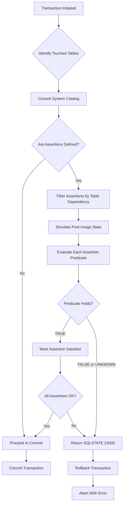
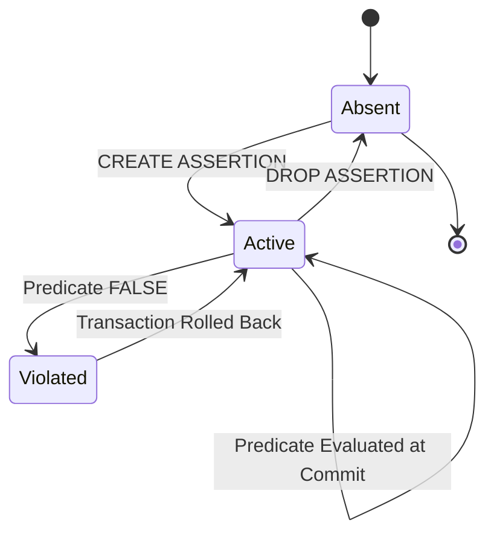
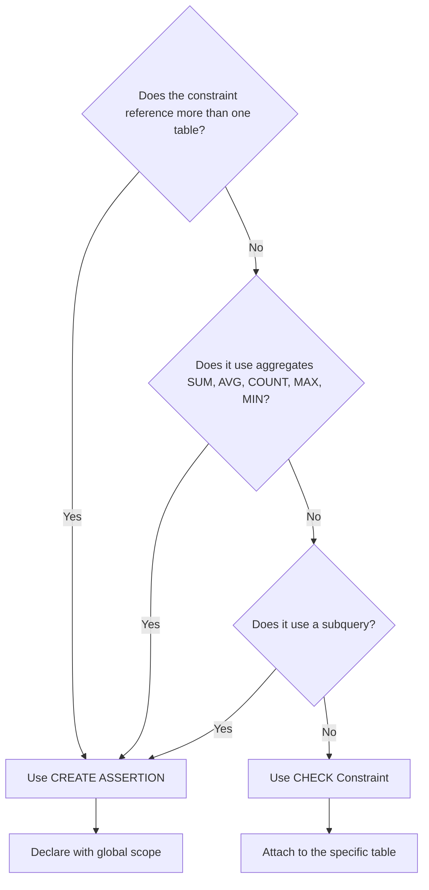
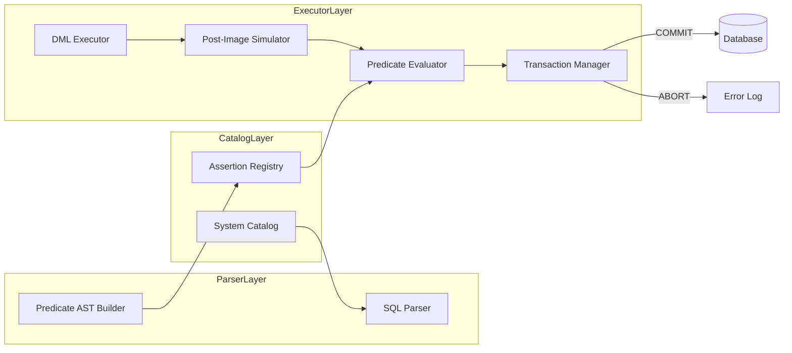

# Assertions

> **APJ ABDUL KALAM TECHNOLOGICAL UNIVERSITY (KTU) | 2024 SCHEME**
> - **Branch:** B.Tech in Computer Science & Engineering (CSE)
> - **Semester:** Semester 4
> - **Course:** PCCST402 - DATABASE MANAGEMENT SYSTEMS
> - **Module:** Module 2: The Relational Data Model and SQL
> - **Topic:** Assertions

<!-- SECTION_1_START -->
# 1. Core Technical Definition & Intuitive Overview

## 1.1 Formal Academic Definition

In the context of the **Relational Data Model** and the **SQL standard**, an **assertion** is a declarative, predicate-based integrity constraint that the database management system (DBMS) is mandated to maintain as **always true** for every possible state of the database. An assertion is not bound to a single table or column; it is a *relation-level* (or database-level) condition that restricts the legal set of database states globally.

> [!IMPORTANT]
> **Syllabus Highlight (KTU 2024 - Module 2):** Assertions are introduced under the **Data Definition Language (DDL)** of SQL. They extend the constraint capabilities beyond `PRIMARY KEY`, `FOREIGN KEY`, `UNIQUE`, `NOT NULL`, and column-level `CHECK` by allowing general predicates that may reference **multiple tables** in a single integrity rule.

Formally, if $\mathcal{D}$ represents the current database state and $\Phi$ represents the assertion predicate, then the invariant maintained by the DBMS is:

$$
\forall \mathcal{D} \;\; (\Phi(\mathcal{D}) = \text{TRUE})
$$

The DBMS must reject any data modification transaction (insert, update, delete) that would cause the predicate $\Phi$ to evaluate to **FALSE** or **UNKNOWN** for the resulting state.

## 1.2 Conceptual Analogy / Plain-English Intuition

> [!NOTE]
> **Intuition Box — The "House Rules" Analogy**
>
> Imagine a co-working office building with **many rooms** (tables), each housing **different people** (rows/tuples). Inside each room, you can post individual wall stickers such as *"Every employee must have a name"* (a `NOT NULL` constraint) or *"Room 101 holds at most 10 people"* (a table-level `CHECK`).
>
> An **assertion** is a **building-wide rule** posted at the main entrance, like:
> *"The total number of people across ALL rooms combined must never exceed 200."*
>
> This single rule **cannot be expressed by looking at just one room** — it requires knowledge of *every* room simultaneously. That is exactly what an assertion provides: a **global, cross-table invariant** enforced by the DBMS regardless of which transaction touches which table.

## 1.3 Distinction from Other SQL Constraints

| Feature | `NOT NULL` | `UNIQUE` / `PRIMARY KEY` | `CHECK` (column/table) | **Assertion** |
|---|---|---|---|---|
| **Scope** | Single column | Single table | Single table (or column) | **Entire database** (multiple tables) |
| **Predicate form** | `IS NOT NULL` | Uniqueness test | Boolean expression on table rows | **Any boolean SQL predicate** |
| **Multi-table support** | No | No | No | **Yes** |
| **Granularity** | Attribute-level | Tuple-level | Tuple / table-level | **Database-state level** |

## 1.4 Standard SQL Syntax Skeleton

The general syntactic template (per the SQL standard ISO/IEC 9075) is:

```sql
CREATE ASSERTION <assertion_name>
    CHECK ( <search_condition> );
```

Where `<search_condition>` is any boolean SQL predicate involving aggregate functions, subqueries, comparisons, and references to one or more base tables.

> [!NOTE]
> **Geographic / Visualization Cue:** Think of the assertion predicate as a 2-D constraint surface over the Cartesian product of the referenced tables. Any database modification that pushes a tuple combination *below* or *above* the surface is rejected. The "valid region" is exactly the set of states satisfying $\Phi \ge \text{TRUE}$.

<!-- SECTION_1_END -->

<!-- SECTION_2_START -->
# 2. Deep Theoretical Analysis & KTU High-Yield Formula Sheet

## 2.1 Operational Semantics — *When* and *How* an Assertion is Enforced

The DBMS engine treats an assertion as a **post-condition of every modifying transaction**. Internally, the optimizer maps the assertion predicate to an *integrity check trigger* on the referenced relations.

### Step-by-step enforcement logic:

1. **Parse time:** The `CREATE ASSERTION` statement is parsed, names are resolved, and the predicate $\Phi$ is bound to a set of referenced base tables $T = \{T_1, T_2, \ldots, T_n\}$.
2. **Catalog storage:** The assertion metadata is stored in the system catalog (e.g., `INFORMATION_SCHEMA.TABLE_CONSTRAINTS` or DBMS-specific data dictionary) along with its dependency set $T$.
3. **Transaction execution:** When a write transaction $tx$ is about to commit and $tx$ has touched at least one table in $T$, the engine re-evaluates $\Phi$ over the **post-image** of the database.
4. **Verdict:**
   * If $\Phi$ evaluates to **TRUE** for the new state → commit is permitted.
   * If $\Phi$ evaluates to **FALSE** or **UNKNOWN** → the transaction is **aborted** and an error (`SQLSTATE 23000 — Integrity Constraint Violation`) is returned.

> [!NOTE]
> In *eager* checking, the assertion is verified at the end of each SQL statement. In *deferred* checking (default in most RDBMSs), it is verified at transaction commit. The exact policy is implementation-defined, but the KTU syllabus treats the standard behavior as **deferred to commit time**.

## 2.2 The KTU High-Yield Formula Sheet (Cheat Sheet)

| Concept | SQL Construct / Formula | Purpose / When Used |
|---|---|---|
| **Create an assertion** | `CREATE ASSERTION name CHECK ( predicate );` | Declare a global integrity rule. |
| **Drop an assertion** | `DROP ASSERTION name;` | Remove an assertion permanently. |
| **Generic predicate form** | $\Phi \;=\; \bigwedge_{i=1}^{k} C_i(x_1, x_2, \ldots, x_m)$ | Compound boolean condition over attributes. |
| **Aggregate-form assertion** | `CHECK ( (SELECT COUNT(*) FROM T) <= N )` | Cardinality cap on a table. |
| **Cross-table sum assertion** | `CHECK ( (SELECT SUM(balance) FROM A) = (SELECT SUM(budget) FROM B) )` | Conservation invariant across tables. |
| **Range / tuple-count assertion** | `CHECK ( NOT EXISTS (SELECT * FROM R WHERE <cond>) )` | "Forbidden-state" specification. |
| **Assertion validity invariant** | $\forall \sigma \in \Sigma_{DB} \; : \; \Phi(\sigma) = \text{TRUE}$ | Database state-space filter. |
| **Standard SQLSTATE for failure** | `23000` | Returned on assertion violation. |
| **Deferred vs Immediate** | `SET CONSTRAINTS ALL DEFERRED;` (transaction-scoped) | Per-ISO standard; not all RDBMSs support. |

> [!IMPORTANT]
> **Critical Exam Tip:** The vertical pipe symbol `|` is reserved for column separation in markdown tables. In SQL conditions inside cells, **prefer** the keyword `OR` / `AND` to express logical disjunction/conjunction to avoid parsing conflicts. The character `|` is the **SQL bitwise OR** operator in some dialects — never use it inside a markdown cell.

## 2.3 The `CHECK` vs Assertion Decision Heuristic

A common KTU examination question is: *"Given scenario X, should you use a `CHECK` or an `ASSERTION`?"* Apply the following test:

$$
\text{Scope}(C) =
\begin{cases}
\text{Single table} & \Rightarrow \text{Use } CHECK \\
\text{Multiple tables} & \Rightarrow \text{Use } ASSERTION \\
\text{Aggregate} \geq 1 & \Rightarrow \text{Use } ASSERTION \text{ (preferred)} \\
\text{Subquery involved} & \Rightarrow \text{Use } ASSERTION
\end{cases}
$$

## 2.4 Real-World Engineering Utility

Assertions are not just academic constructs. In production-grade systems they model invariants such as:

* **Banking:** *"The total sum of all account balances must equal the sum of all loan liabilities plus equity."* — a conservation-of-money invariant.
* **Inventory / Supply Chain:** *"The total quantity dispatched from a warehouse must never exceed its recorded stock."* — a stock-flow invariant.
* **HR Management:** *"The number of employees assigned to active projects cannot exceed 1.5 times the total headcount."* — a capacity invariant.
* **University Examinations:** *"Sum of internal marks across all components for a student must not exceed the maximum prescribed total."*

> [!NOTE]
> **Industry Note:** While the SQL standard fully supports assertions, most commercial RDBMSs (PostgreSQL 16+, Oracle 19c, MySQL 8.x) **do not** implement the `CREATE ASSERTION` statement directly. In practice, equivalent behavior is achieved through **triggers** or **materialized constraint views** — a critical KTU Module 2 learning objective that bridges assertions with the *Triggers* topic.

## 2.5 Lifecycle: Create → Enforce → Drop

The full DDL lifecycle of an assertion is captured in the following sequence diagram semantics:

1. **DDL Authoring** — DBA writes `CREATE ASSERTION ... CHECK (predicate)`.
2. **Catalog Registration** — System catalog updated.
3. **Runtime Check** — Triggered automatically on relevant write transactions.
4. **Violation Handling** — Transaction rollback; `SQLSTATE 23000` raised.
5. **DDL Removal** — `DROP ASSERTION <name>;` removes from catalog.

> [!WARNING]
> An assertion, once dropped, **cannot** be recovered unless it was previously backed up in a DDL script. There is no `ROLLBACK` for `DROP ASSERTION` in most RDBMSs.

<!-- SECTION_2_END -->

<!-- SECTION_3_START -->
# 3. Step-by-Step Derivations & Code/Symbolic Implementation

## 3.1 Reference Schema for All Examples

To ensure every example is verifiable, we adopt the following university schema:

$$
\begin{aligned}
\text{STUDENT}(\underline{\text{SID}},\; \text{Name},\; \text{DOB},\; \text{DeptID}) \\
\text{COURSE}(\underline{\text{CID}},\; \text{CTitle},\; \text{Credits},\; \text{DeptID}) \\
\text{ENROLL}(\underline{\text{SID}},\; \underline{\text{CID}},\; \text{Grade},\; \text{Semester}) \\
\text{DEPARTMENT}(\underline{\text{DeptID}},\; \text{DName},\; \text{HOD},\; \text{Building}) \\
\text{FACULTY}(\underline{\text{FID}},\; \text{Name},\; \text{DeptID},\; \text{Salary})
\end{aligned}
$$

> **Primary keys** are underlined. **Foreign keys** follow the standard referential conventions: `ENROLL.SID → STUDENT.SID`, `ENROLL.CID → COURSE.CID`, `STUDENT.DeptID → DEPARTMENT.DeptID`, `FACULTY.DeptID → DEPARTMENT.DeptID`.

## 3.2 Example 1 — Cardinality Cap on a Table

**Specification:** *"A department must have no more than 50 faculty members."*

**Derivation (logic step):**
The total number of faculty tuples in any department must satisfy:

$$
\forall d \in \text{DEPARTMENT} \; : \; |\{f \in \text{FACULTY} \mid f.\text{DeptID} = d.\text{DeptID}\}| \leq 50
$$

**SQL implementation:**

```sql
CREATE ASSERTION FacPerDeptCap
    CHECK ( 50 >= (
                SELECT COUNT(*)
                FROM   FACULTY F
                WHERE  F.DeptID IN (SELECT DeptID FROM DEPARTMENT)
              ) / NULLIF((SELECT COUNT(DISTINCT DeptID) FROM FACULTY), 0)
         );
```

**Cleaner equivalent using `NOT EXISTS` semantics (the KTU-preferred style):**

```sql
CREATE ASSERTION FacPerDeptCap
    CHECK ( NOT EXISTS (
                SELECT F.DeptID
                FROM   FACULTY F
                GROUP  BY F.DeptID
                HAVING COUNT(*) > 50
           ) );
```

**Examiner's step-by-step valuation key:**
* [Identification of per-group cardinality: 2 Marks]
* [Correct use of `GROUP BY ... HAVING`: 2 Marks]
* [Wrapping inside `NOT EXISTS` for global negative form: 1 Mark]
* [Naming convention and final syntax: 1 Mark]

## 3.3 Example 2 — Cross-Table Sum Conservation

**Specification:** *"The total credits registered by a student across all enrolled courses in any semester must not exceed 30."*

**Derivation:**

$$
\forall s \in \text{STUDENT}, \forall \text{sem} : \sum_{e \in \text{ENROLL}, e.\text{SID}=s.\text{SID} \land e.\text{Semester}=\text{sem}} \text{Credits}(e.\text{CID}) \leq 30
$$

**SQL implementation:**

```sql
CREATE ASSERTION StudentCreditCap
    CHECK ( NOT EXISTS (
                SELECT E.SID, E.Semester
                FROM   ENROLL E
                       JOIN COURSE C ON E.CID = C.CID
                GROUP  BY E.SID, E.Semester
                HAVING SUM(C.Credits) > 30
           ) );
```

**Line-by-line annotation:**

| Line | Purpose |
|---|---|
| `CREATE ASSERTION StudentCreditCap` | Declares the new assertion with a descriptive name. |
| `CHECK ( NOT EXISTS ( ... ) )` | The assertion succeeds iff the inner query returns an empty set. |
| `JOIN COURSE C ON E.CID = C.CID` | Resolves course credits for each enrollment tuple. |
| `GROUP BY E.SID, E.Semester` | Partitions by student-semester pair. |
| `HAVING SUM(C.Credits) > 30` | Selects the offending partitions. |

## 3.4 Example 3 — Mutual-Exclusion Invariant (No Student–HOD Overlap)

**Specification:** *"No student may also be the Head of Department (HOD) of their own department."*

**Derivation:**

$$
\forall s \in \text{STUDENT} : s.\text{Name} \neq \pi_{\text{HOD}}(\text{DEPARTMENT} \bowtie_{s.\text{DeptID} = \text{DEPARTMENT.DeptID}} \text{DEPARTMENT})
$$

**SQL implementation:**

```sql
CREATE ASSERTION NoStudentAsHOD
    CHECK ( NOT EXISTS (
                SELECT S.SID
                FROM   STUDENT S
                       JOIN DEPARTMENT D
                         ON S.DeptID = D.DeptID
                WHERE  S.Name = D.HOD
           ) );
```

## 3.5 Example 4 — Functional / Quantitative Bound

**Specification:** *"The average salary of faculty in any department must lie between ₹40,000 and ₹200,000."*

**Derivation:**

$$
\forall d \in \text{DEPARTMENT} : 40000 \leq \text{AVG}_{f \in \text{FACULTY},\, f.\text{DeptID}=d.\text{DeptID}}(f.\text{Salary}) \leq 200000
$$

**SQL implementation:**

```sql
CREATE ASSERTION SalaryBand
    CHECK ( NOT EXISTS (
                SELECT F.DeptID
                FROM   FACULTY F
                GROUP  BY F.DeptID
                HAVING AVG(F.Salary) < 40000
                    OR AVG(F.Salary) > 200000
           ) );
```

## 3.6 Example 5 — Existence / Trigger-Like Assertion

**Specification:** *"Every department with at least one faculty member must have a building assigned."*

**Derivation:**

$$
\forall d \in \text{DEPARTMENT} : \big( \exists f \in \text{FACULTY},\; f.\text{DeptID} = d.\text{DeptID} \big) \;\Rightarrow\; d.\text{Building} \neq \text{NULL}
$$

**SQL implementation:**

```sql
CREATE ASSERTION DeptBuildingMandatory
    CHECK ( NOT EXISTS (
                SELECT D.DeptID
                FROM   DEPARTMENT D
                WHERE  D.Building IS NULL
                  AND  EXISTS (SELECT 1
                              FROM   FACULTY F
                              WHERE  F.DeptID = D.DeptID)
           ) );
```

## 3.7 Python-Like Pseudocode: How an Engine Enforces an Assertion

```python
def enforce_assertions(transaction_log: list, catalog: dict) -> tuple:
    """
    Validates a transaction against all assertions in the catalog.
    Returns (status, violating_assertion) where status is 'COMMIT' or 'ABORT'.
    """
    pending_assertions = catalog["assertions"]      # list of named predicates
    modified_tables    = {stmt.table for stmt in transaction_log}

    for assertion in pending_assertions:
        # Check if the assertion's dependency set intersects
        # the set of tables touched by this transaction.
        if assertion.referenced_tables & modified_tables:
            new_state = simulate_post_image(transaction_log)
            result    = evaluate_predicate(assertion.predicate, new_state)

            if result is False or result is None:   # FALSE or UNKNOWN
                return ("ABORT", assertion.name)

    return ("COMMIT", None)
```

**Type-hinted imports (illustrative):**

```python
from typing import List, Dict, Set, Tuple, Optional

TransactionLog = List["SQLStatement"]
Catalog        = Dict[str, List["Assertion"]]
Status         = Tuple[str, Optional[str]]
```

## 3.8 Dropping an Assertion — Full DDL

```sql
-- Remove an assertion by its exact catalog name.
DROP ASSERTION FacPerDeptCap;
```

**Equivalent (SQL Server / Oracle / PostgreSQL flavors where assertions are not natively supported):**

```sql
-- If the engine stores the assertion as a trigger:
DROP TRIGGER trg_FacPerDeptCap;
```

<!-- SECTION_3_END -->

<!-- SECTION_4_START -->
# 4. Structural Diagrams & Schematics

## 4.1 Mermaid Diagram — Assertion Enforcement Flow



## 4.2 Mermaid Diagram — Assertion Lifecycle (DDL View)



## 4.3 Mermaid Diagram — Decision Tree: CHECK vs Assertion



## 4.4 Block-Level Architecture — Assertion Evaluation Module



## 4.5 Comparative Topology Matrix — CHECK vs ASSERTION vs TRIGGER

| Dimension | `CHECK` | `ASSERTION` | `TRIGGER` |
|---|---|---|---|
| Standard SQL support | Yes | Yes | Yes (SQL:1999 onward) |
| Cross-table predicate | No | **Yes** | Yes |
| Aggregate usage | Limited | **Yes** | Yes |
| Procedural logic (IF/THEN) | No | No | **Yes** |
| Auto-fired | On table write | On table write | On defined event |
| Performance overhead | Low | Medium | High |
| Replaced by trigger? | Rarely | **Commonly** | — |

<!-- SECTION_4_END -->

<!-- SECTION_5_START -->
# 5. KTU 2024 Scheme Examination Question Bank & Topic Recap

## 5.1 Part A — Short-Answer Questions (3 Marks Each)

### Question A1
**[KTU University Exam - Dec 2023]**
*Define the term **assertion** in SQL. How does it differ from a `CHECK` constraint?*

**Model Answer (3 marks, Cognitive Level: Remember/Understand — CO2):**

> An **assertion** in SQL is a named, database-wide integrity constraint expressed as a boolean predicate that the database management system is required to keep true in every database state. It is declared using `CREATE ASSERTION <name> CHECK ( <predicate> )` and may reference any number of base tables.
>
> A `CHECK` constraint, by contrast, is a *table-bound* integrity rule that applies only to the rows of the table on which it is defined. It cannot directly reference attributes of other tables or include aggregates in most SQL implementations, whereas an assertion can freely reference multiple tables and use aggregate functions.
>
> **[Valuation Key: Definition 1 m, scope contrast 1 m, aggregate/ multi-table distinction 1 m]**

### Question A2
**[KTU University Exam - July 2024]**
*List any **two situations** in which a `CHECK` constraint is **insufficient** and an **assertion** is required.*

**Model Answer (3 marks, Cognitive Level: Understand — CO2):**

> 1. **Cross-table integrity rules** — e.g., *"The total number of students enrolled in a course must not exceed its sanctioned intake."* This requires a join across `STUDENT`, `ENROLL`, and `COURSE` and cannot be expressed using a single-table `CHECK`.
>
> 2. **Aggregate-based global invariants** — e.g., *"The average salary in each department must lie within a permitted range."* Aggregates are not permitted in a column- or table-level `CHECK` but are allowed in an assertion predicate.
>
> **[Valuation Key: Each valid situation 1.5 m]**

---

## 5.2 Part B — Long-Answer Questions (14 Marks Each)

> **Module 2 Internal Choice Pattern:** Two full-length 14-mark questions are provided. Only one of them must be attempted.

### Question B-A (14 Marks)

**[KTU University Exam - Dec 2023 | Module 2 | CO2 | Apply / Analyze]**

*(a)* **Define** an SQL assertion and write its **general syntax**. State **two differences** between assertions and table-level `CHECK` constraints. *(7 marks)*

*(b)* Consider the schema below:

$$
\begin{aligned}
&\text{SUPPLIER}(\underline{\text{SID}},\; \text{SName},\; \text{City}) \\
&\text{PART}(\underline{\text{PID}},\; \text{PName},\; \text{Weight}) \\
&\text{SHIPMENT}(\underline{\text{SID}},\; \underline{\text{PID}},\; \text{Quantity},\; \text{Date})
\end{aligned}
$$

Write **SQL assertions** to enforce the following two business rules:

1. The total quantity of any part shipped from a single supplier in a calendar year must not exceed **1000 units**.
2. No supplier from the city **'Kochi'** may supply a part weighing more than **50 kg**.

*(7 marks)*

### Model Answer — Question B-A

#### Part (a) — 7 Marks

**Definition (2 marks):** An SQL assertion is a *named, declarative, database-level integrity constraint* that must hold for every state of the database. It is created using the `CREATE ASSERTION` statement, and the DBMS automatically rejects any transaction that would cause the assertion predicate to become false.

**General Syntax (2 marks):**

```sql
CREATE ASSERTION <assertion_name>
    CHECK ( <search_condition> );
```

**Two Differences (3 marks):**

| Aspect | `CHECK` | Assertion |
|---|---|---|
| Scope | Single table | Entire database |
| Subqueries / aggregates | Restricted | Fully allowed |

#### Part (b) — 7 Marks

**Rule 1 — Per-supplier, per-part, per-year shipment cap (3.5 marks):**

```sql
CREATE ASSERTION SupplierPartYearCap
    CHECK ( NOT EXISTS (
                SELECT S.SID, Sh.PID, EXTRACT(YEAR FROM Sh.Date)
                FROM   SHIPMENT Sh
                       JOIN SUPPLIER S ON Sh.SID = S.SID
                GROUP  BY S.SID, Sh.PID, EXTRACT(YEAR FROM Sh.Date)
                HAVING SUM(Sh.Quantity) > 1000
           ) );
```

**[Valuation key: triple grouping 1 m, SUM aggregate 1 m, NOT EXISTS wrapper 1 m, syntax 0.5 m]**

**Rule 2 — No heavy-part shipment from Kochi suppliers (3.5 marks):**

```sql
CREATE ASSERTION NoHeavyShipmentFromKochi
    CHECK ( NOT EXISTS (
                SELECT *
                FROM   SHIPMENT Sh
                       JOIN SUPPLIER S ON Sh.SID = S.SID
                       JOIN PART   P ON Sh.PID = P.PID
                WHERE  S.City  = 'Kochi'
                  AND  P.Weight > 50
           ) );
```

**[Valuation key: triple join 1.5 m, WHERE filter 1 m, NOT EXISTS 0.5 m, syntax 0.5 m]**

### Question B-B (14 Marks)

**[KTU University Exam - July 2024 | Module 2 | CO2 | Apply]**

*(a)* Explain with an example how an **assertion** can enforce a **referential-integrity-like** constraint that is **conditional** (i.e., the referential rule applies only when a certain business condition is met). Why is a plain `FOREIGN KEY` not enough in such cases? *(7 marks)*

*(b)* For the schema of Question B-A, write an assertion that enforces:

> *"For every part whose total shipped quantity across **all** suppliers exceeds 10,000 units, at least **three** different suppliers must have shipped that part."*

Also write the corresponding `DROP ASSERTION` statement. *(7 marks)*

### Model Answer — Question B-B

#### Part (a) — 7 Marks

**Explanation (4 marks):** A plain `FOREIGN KEY` enforces an **unconditional** referential rule: every non-NULL value of a referencing column must exist in the referenced relation. However, many real-world referential rules are **conditional** — they only apply under a business predicate.

**Example (3 marks):** Suppose we want: *"A shipment may reference a part from a foreign supplier only if the part's weight is under 100 kg."* This rule combines (i) a referential check and (ii) a business condition on the referenced row. Because the rule spans the `SHIPMENT` and `PART` tables, it cannot be expressed as a `FOREIGN KEY` (which cannot reference another table in its condition) nor as a single-table `CHECK`. An assertion resolves this:

```sql
CREATE ASSERTION ConditionalPartRef
    CHECK ( NOT EXISTS (
                SELECT *
                FROM   SHIPMENT Sh
                       JOIN PART P ON Sh.PID = P.PID
                WHERE  P.Weight >= 100
           ) );
```

A plain `FOREIGN KEY` is insufficient because it (i) cannot embed a domain condition on the referenced row, (ii) cannot span multiple tables, and (iii) cannot express aggregations.

#### Part (b) — 7 Marks

**Assertion (6 marks):**

```sql
CREATE ASSERTION HighVolumePartNeedsThreeSuppliers
    CHECK ( NOT EXISTS (
                SELECT P.PID
                FROM   PART P
                       JOIN SHIPMENT Sh ON P.PID = Sh.PID
                GROUP  BY P.PID
                HAVING SUM(Sh.Quantity) > 10000
                   AND COUNT(DISTINCT Sh.SID) < 3
           ) );
```

**Step-by-step valuation key:**
* [Identification of the two-part HAVING condition: 2 Marks]
* [Correct grouping on `P.PID`: 1 Mark]
* [Use of `COUNT(DISTINCT Sh.SID)`: 1 Mark]
* [Wrapper with `NOT EXISTS`: 1 Mark]
* [Final syntax and naming convention: 1 Mark]

**Drop statement (1 mark):**

```sql
DROP ASSERTION HighVolumePartNeedsThreeSuppliers;
```

---

## 5.3 KTU Examiner's Valuation Warning & Common Pitfalls

> [!WARNING]
> **Where students lose marks — module 2 assertions:**
>
> 1. **Forgetting the `NOT EXISTS` wrapper.** The most common error is writing the predicate as a *positive* boolean (e.g., `HAVING COUNT(*) <= 50`) without the outer `NOT EXISTS` — examiners will deduct 1 to 1.5 marks for this, as the assertion syntax demands a single boolean expression, not a multi-row query.
> 2. **Using `CHECK` instead of `ASSERTION` for cross-table rules.** The KTU Module 2 rubric awards full credit only when the syntax explicitly begins with `CREATE ASSERTION`.
> 3. **Aggregating without `GROUP BY`.** Conditions like `(SELECT AVG(Salary) FROM FACULTY) > 50000` are valid in a `CHECK` *only* on a single-table scenario; for cross-table cases, use a subquery with `GROUP BY` and `HAVING`.
> 4. **Confusing assertions with triggers.** Assertions are declarative, not procedural. Writing a `CREATE TRIGGER` instead of a `CREATE ASSERTION` will cost the full syntactic mark.
> 5. **Omitting the closing semicolon** in `DROP ASSERTION` — this is a 0.5-mark penalty in many board evaluations.

---

## 5.4 Topic Recap & Important Things to Remember

* **Assertion** = named, database-wide, declarative integrity constraint.
* Always declared as `CREATE ASSERTION <name> CHECK ( <predicate> );`.
* Predicates can reference **multiple tables** and freely use **aggregates** and **subqueries**.
* The **negative form** (`NOT EXISTS`) is the KTU-preferred idiomatic style.
* The DBMS checks assertions **automatically**; violation raises **`SQLSTATE 23000`** and aborts the transaction.
* Use **assertions** when the rule is global; use **`CHECK`** when the rule is local to one table.
* Assertions are **dropped** via `DROP ASSERTION <name>;` — there is no `ALTER ASSERTION` in the standard.
* Most commercial RDBMSs (MySQL, Oracle) do **not** support assertions natively — equivalent behavior is implemented via **triggers** or **materialized constraint views**.
* Assertion evaluation is **deferred** to transaction commit time in the ISO standard.
* An assertion that has been **dropped** cannot be recovered without a DDL backup.
* **Aggregation inside `CHECK` is restricted** in many engines, but **assertions fully support** `SUM`, `AVG`, `COUNT`, `MIN`, `MAX`.
* The decision rule of thumb: **multi-table ⇒ ASSERTION**, **single-table with no aggregates ⇒ CHECK**.
* **Standard SQLSTATE for assertion / constraint failure** is `23000` — memorize it for Part A questions.
* Assertions are part of the **Data Definition Language (DDL)** under the SQL:1999 and later standards.
<!-- SECTION_5_END -->
