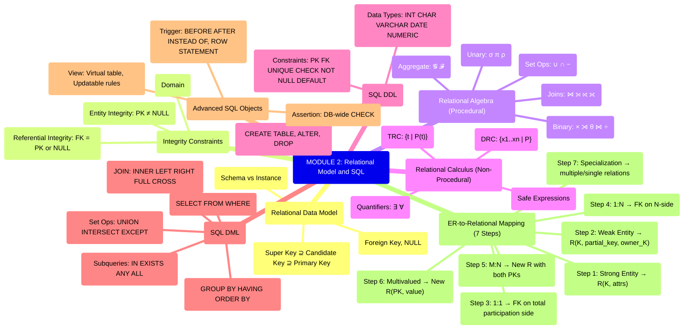

# MODULE CHEAT SHEET: The Relational Data Model and SQL

---

## 1. CORE CONCEPT MATRIX

| # | Topic | Core Definition | Cognitive Level | Primary Utility |
|---|-------|----------------|-----------------|-----------------|
| 1 | **Relation** | A subset of the Cartesian product of domains; represented as a table of values | Understand | Foundation of relational theory |
| 2 | **Tuple** | A row in a relation representing a single record | Remember | Data element grouping |
| 3 | **Attribute** | A named column of a relation, role-playing a domain | Remember | Schema definition |
| 4 | **Domain $D_i$** | A set of atomic, indivisible values with a name and data type | Understand | Value constraint |
| 5 | **Schema $R(A_1, A_2, \ldots, A_n)$** | Relation name + attributes; the *intension* | Apply | Structural blueprint |
| 6 | **Instance / State** | A specific set of tuples at a given time; the *extension* | Apply | Snapshot data |
| 7 | **Super Key** | Set of attributes that uniquely identifies a tuple | Apply | Identity guarantee |
| 8 | **Candidate Key** | Minimal super key (no proper subset is a super key) | Analyze | Selection of PK |
| 9 | **Primary Key (PK)** | The chosen candidate key, not null | Apply | Main identifier |
| 10 | **Alternate Key** | Candidate keys not chosen as PK | Remember | Optional identifier |
| 11 | **Foreign Key (FK)** | Attribute referencing PK of another (or same) relation | Apply | Referential link |
| 12 | **NULL** | Value unknown / doesn't exist / undefined | Remember | Missing marker |
| 13 | **Domain Constraint** | Every attribute must be an atomic value from its domain | Understand | Type safety |
| 14 | **Entity Integrity** | PK attributes cannot be NULL | Apply | Tuple identity |
| 15 | **Referential Integrity** | Every FK value must match a PK in referenced relation or be NULL | Apply | Cross-relation consistency |
| 16 | **Selection ($\sigma$)** | Unary RA op: picks tuples satisfying predicate | Apply | Horizontal filter |
| 17 | **Projection ($\pi$)** | Unary RA op: picks specified columns (with $\subseteq$ deduplication) | Apply | Vertical filter |
| 18 | **Cartesian Product ($\times$)** | Binary RA op: combines every tuple of R with every tuple of S | Apply | Raw combination |
| 19 | **Join ($\bowtie$)** | $\sigma_{predicate}(R \times S)$; conditional combination | Apply | Logical pairing |
| 20 | **Natural Join ($\bowtie$)** | Join on equal common attributes (auto-deduplicated) | Analyze | Equi-join shortcut |
| 21 | **Outer Join** | Preserves unmatched tuples (LEFT/RIGHT/FULL) padded with NULL | Analyze | Lossless combination |
| 22 | **Division ($\div$)** | Returns tuples in R that match all tuples of S | Analyze | Universal quantifier |
| 23 | **Tuple Relational Calculus (TRC)** | Non-procedural: $\{t \mid P(t)\}$ | Analyze | Declarative query |
| 24 | **Domain Relational Calculus (DRC)** | Non-procedural over domain variables | Analyze | Declarative query |
| 25 | **DDL** | Defines schema: CREATE, ALTER, DROP | Apply | Structure definition |
| 26 | **DML** | Manipulates data: SELECT, INSERT, UPDATE, DELETE | Apply | Data operation |
| 27 | **Assertion** | A constraint over the whole database (CREATE ASSERTION) | Apply | Global integrity |
| 28 | **Trigger** | ECA rule: Event-Condition-Action, automatic execution | Apply | Reactive logic |
| 29 | **View** | Virtual table derived from base tables (no physical storage) | Apply | Custom schema, security |
| 30 | **ER-to-Relational Mapping** | Algorithm: 7-step conversion of EER diagram to relations | Apply | Design implementation |
| 31 | **Update Anomalies** | Insert / Delete / Update / Modification anomalies | Analyze | Rationale for normalization |
| 32 | **Closure $F^+$** | Set of all FDs derivable from F | Analyze | Key inference |

---

## 2. THE MASTER FORMULA SHEET

### 2.1 Relational Algebra Operators

| Operator | Symbol | Type | Definition | Notation | Result Arity |
|----------|--------|------|------------|----------|--------------|
| Selection | $\sigma$ | Unary | Filter rows | $\sigma_{predicate}(R)$ | Same as R |
| Projection | $\pi$ | Unary | Filter columns | $\pi_{A_1,A_2,\ldots,A_n}(R)$ | Degree = n |
| Cartesian Product | $\times$ | Binary | All pairings | $R \times S$ | Degree = m+n |
| Union | $\cup$ | Binary | Set union | $R \cup S$ | Same schema |
| Set Difference | $-$ | Binary | Tuples in R not in S | $R - S$ | Same schema |
| Rename | $\rho$ | Unary | Rename relation/attrs | $\rho_{S(A_1,\ldots,A_n)}(R)$ | Same |
| Theta Join | $\bowtie_{\theta}$ | Binary | Conditional join | $R \bowtie_{\theta} S \equiv \sigma_{\theta}(R \times S)$ | m+n |
| Equi-Join | $\bowtie_{A=B}$ | Binary | Join on equality | $R \bowtie_{A=B} S$ | m+n (dup cols) |
| Natural Join | $\bowtie$ | Binary | Join on common attrs | $R \bowtie S$ | m+n-$|$common$\vert$ |
| Left Outer Join | ⟕ | Binary | Keep all R tuples | $R \ ⟕ \ S$ | m+n |
| Right Outer Join | ⟖ | Binary | Keep all S tuples | $R \ ⟖ \ S$ | m+n |
| Full Outer Join | ⟗ | Binary | Keep all tuples | $R \ ⟗ \ S$ | m+n |
| Semi-Join | $\ltimes$ | Binary | Left tuples with match | $R \ltimes S$ | Degree of R |
| Anti-Join | $\rhd$ | Binary | Left tuples without match | $R \rhd S$ | Degree of R |
| Division | $\div$ | Binary | Universal match | $R \div S$ | m-n |
| Assignment | $\leftarrow$ | — | Store intermediate | $T \leftarrow \sigma_{...}(R)$ | — |
| Generalized Projection | $\pi_{F_1,F_2,\ldots,F_n}$ | Unary | Arithmetic expressions | $\pi_{A_1, A_2+50}(R)$ | n |
| Aggregate Functions | $\mathcal{F}$ | Unary | $\mathcal{G}_{1},\ldots,\mathcal{G}_{n} \mathcal{F}_{max, avg}(R)$ | Grouping + aggregates | Compacted |

### 2.2 RA Operator Precedence (Highest → Lowest)

| Priority | Operators |
|----------|-----------|
| 1 (Highest) | $\sigma, \pi, \rho$ (Unary) |
| 2 | $\times, \bowtie, \div$ |
| 3 (Lowest) | $\cup, \cap, -$ |

### 2.3 Set Operation Compatibility

| Property | Requirement |
|----------|-------------|
| **Union Compatibility** | Same number of attributes + same (or compatible) domains |
| $\cup$ | $R \cup S = \{t \mid t \in R \lor t \in S\}$ |
| $\cap$ | $R \cap S = \{t \mid t \in R \land t \in S\} = R - (R-S)$ |
| $-$ | $R - S = \{t \mid t \in R \land t \notin S\}$ |

### 2.4 Calculus Form (Declarative Foundation)

| Calculus | General Form | Variables | Result |
|----------|--------------|-----------|--------|
| **TRC** | $\{t \mid P(t)\}$ | Tuple $t$ | Set of tuples |
| **DRC** | $\{x_1, x_2, \ldots, x_n \mid P(x_1,\ldots,x_n)\}$ | Domain $x_i$ | Set of domain values |

**Existential Quantifier**: $\exists t \in R (Q(t))$ — *at least one*
**Universal Quantifier**: $\forall t \in R (Q(t))$ — *all*; can be rewritten: $\forall t \in R (Q(t)) \equiv \neg\exists t \in R (\neg Q(t))$

### 2.5 ER-to-Relational Mapping (7-Step Algorithm)

| Step | ER Construct | Mapping Rule | Schema Output |
|------|--------------|--------------|---------------|
| **1** | Strong Entity Set $E$ | Create relation | $E(K_E, \text{simple\_attrs})$ where $K_E$ = PK |
| **2** | Weak Entity Set $W$ (owner $E$) | Create relation | $W(K_W, \text{partial\_key}, K_E)$ where $K_E$ = FK to $E$; PK = $(K_W, K_E)$ |
| **3** | 1:1 Relationship $R$ between $E_1, E_2$ | Choose one side | Add $K_{E_2}$ as FK in $E_1$ (or vice versa); total participation side preferred |
| **4** | 1:N Relationship $R$ (1-side $E_1$, N-side $E_2$) | Add to N-side | Add $K_{E_1}$ as FK in $E_2$ |
| **5** | M:N Relationship $R$ between $E_1, E_2$ | New relation | $R(K_{E_1}, K_{E_2}, \text{relationship\_attrs})$ with both as FK; PK = $(K_{E_1}, K_{E_2})$ |
| **6** | Multivalued Attribute $A$ of $E$ | New relation | $E\_A(K_E, A)$ PK = $(K_E, A)$ |
| **7** | Specialization / Generalization | 3 options | (a) Multiple relations: super + sub; (b) Subclass-only relations; (c) Single relation with type attribute |

### 2.6 SQL Constraint Quick Reference

| Constraint | Syntax | Applies To |
|------------|--------|------------|
| Primary Key | `PRIMARY KEY` | Column / Table level |
| Unique | `UNIQUE` | Allows NULL (only once in SQL-92) |
| Not Null | `NOT NULL` | Column only |
| Default | `DEFAULT <value>` | Column only |
| Check | `CHECK (condition)` | Column / Table |
| Foreign Key | `REFERENCES table(col)` | Column / Table |
| ON DELETE | `CASCADE \vert SET NULL \vert SET DEFAULT \vert NO ACTION` | FK |
| ON UPDATE | `CASCADE \vert SET NULL \vert SET DEFAULT \vert NO ACTION` | FK |

### 2.7 Aggregate & Set Operators in SQL

| SQL Clause | Function | Example |
|------------|----------|---------|
| `COUNT(*) \vert COUNT(DISTINCT col)` | Count tuples | `COUNT(*)` |
| `SUM(col)` | Sum numeric | `SUM(salary)` |
| `AVG(col)` | Average | `AVG(age)` |
| `MIN(col) \vert MAX(col)` | Extremes | `MAX(marks)` |
| `UNION \vert UNION ALL` | Combine (all/all w/ dup) | `$Q_1$ UNION $Q_2$` |
| `INTERSECT` | Common | `$Q_1$ INTERSECT $Q_2$ |
| `EXCEPT` (MINUS in Oracle) | Difference | `$Q_1$ EXCEPT $Q_2$` |
| `GROUP BY` | Partition | `GROUP BY dept` |
| `HAVING` | Filter groups | `HAVING AVG(sal) > 50000` |

### 2.8 Join Types in SQL

| SQL Syntax | Equivalent |
|------------|------------|
| `R CROSS JOIN S` | $R \times S$ |
| `R INNER JOIN S ON <cond>` | $R \bowtie_{cond} S$ |
| `R NATURAL JOIN S` | $R \bowtie S$ |
| `R LEFT OUTER JOIN S ON <cond>` | $R \ ⟕ \ S$ |
| `R RIGHT OUTER JOIN S ON <cond>` | $R \ ⟖ \ S$ |
| `R FULL OUTER JOIN S ON <cond>` | $R \ ⟗ \ S$ |

### 2.9 View Operations

| Operation | Updatable? | WITH CHECK OPTION? |
|-----------|-----------|---------------------|
| `CREATE VIEW V AS <query>` | Depends | Optional |
| Single base table + no aggregates | ✅ Yes | ✅ Recommended |
| JOIN, GROUP BY, DISTINCT, aggregate | ❌ No | N/A |
| `DROP VIEW V [CASCADE \vert RESTRICT]` | Removes definition | — |

### 2.10 Trigger Anatomy

```sql
CREATE TRIGGER trigger_name
{BEFORE | AFTER | INSTEAD OF} {INSERT | UPDATE | DELETE}
ON table_name
[FOR EACH {ROW | STATEMENT}]
[WHEN (condition)]
{REFERENCING OLD AS old_row NEW AS new_row}
BEGIN
  -- SQL action statements
END;
```

**Row-level**: fires per row (use `:OLD`, `:NEW` in Oracle / `@old`, `@new` in MySQL)
**Statement-level**: fires once per SQL statement (default in some systems)

### 2.11 Assertion Syntax

```sql
CREATE ASSERTION assertion_name
CHECK ( <predicate_over_any_table> );
```
**Note**: Checking is expensive; often implemented via triggers in practice (Oracle/PostgreSQL don't support assertions directly).

### 2.12 Key Inferences (Closure)

| Property | Formula |
|----------|---------|
| **Attribute Closure** | $X^+ = \{A \mid X \rightarrow A \in F^+\}$ |
| **Super Key Check** | $X$ is a super key iff $X^+ \supseteq R$ |
| **Candidate Key** | $X$ is CK iff $X$ is super key AND no proper subset is super key |
| **Canonical Cover $F_c$** | Minimal equivalent set of FDs; $F_c \equiv F$ |

---

## 3. HIGH-YIELD EXAM CHECKPOINTS

### 🎯 Relational Algebra (MUST MEMORIZE)

- **Division**: $R(A,B) \div S(B) = \pi_A(R) - \pi_A((\pi_A(R) \times S) - R)$
- **Natural Join**: $R \bowtie S = \pi_{A_1,\ldots,A_n,B_1,\ldots,B_m}(\sigma_{R.C_1=S.C_1 \land \ldots \land R.C_k=S.C_k}(R \times S))$
- **$R \bowtie S = (R \bowtie S) \cup (R \bowtie S) \cup (R \bowtie S)$** = Theta + Outer parts
- **Anti-Join Identity**: $R - \pi_R(R \bowtie S) = R \rhd S$
- **Theta Join Commutativity**: $R \bowtie_{\theta} S = S \bowtie_{\theta} R$
- **Cartesian Product**: $R \times S = \pi_{R.A_1,\ldots,R.A_m, S.B_1,\ldots,S.B_n}(R \bowtie R.A_1 < S.B_1 S)$

### 🎯 Tuple Relational Calculus (TRC)

- **Formula**: $\{t \mid P(t)\}$
- **Safe Expression**: All values in result must belong to the *domain of the expression* (finite result)
- **Quantifier Conversion**: $\forall t (Q(t)) \equiv \neg\exists t(\neg Q(t))$
- **Division in TRC**: Find all $t \in R$ such that $\forall s \in S, \exists u \in R(t[A]=u[A] \land s[B]=u[B])$

### 🎯 Domain Relational Calculus (DRC)

- **Formula**: $\{x_1, x_2, \ldots, x_n \mid P(x_1, \ldots, x_n)\}$
- **Atoms**: $R(x_1,\ldots,x_n)$ — tuple in relation; $x_i \ \theta \ x_j$ — comparison; $x_i \ \theta \ c$ — const
- **QBE uses DRC concept** (Query-by-Example)

### 🎯 SQL Critical Patterns

- **Correlated Subquery**: Inner query references outer query attribute
- **EXISTS vs IN**: `EXISTS` checks non-empty; `IN` checks membership
- **ALL / ANY**: `>ALL(SELECT...)` = greater than max; `>ANY(SELECT...)` = greater than min
- **NULL Tricky**: `NULL = NULL` is **UNKNOWN**, not TRUE; `IS NULL` for comparison
- **3-Valued Logic**: TRUE, FALSE, UNKNOWN; WHERE keeps only TRUE
- **GROUP BY rule**: Every non-aggregated SELECT column MUST be in GROUP BY
- **HAVING vs WHERE**: WHERE filters rows *before* grouping; HAVING filters *groups*

### 🎯 Views - Critical Theory

- **View is virtual**: No physical storage of data (except *materialized views*)
- **Updatable View Conditions** (all must hold):
  1. Single base table (no JOIN)
  2. No DISTINCT, GROUP BY, HAVING, aggregate
  3. All NOT NULL columns present (no derived cols)
- **WITH CHECK OPTION**: Prevents UPDATE/INSERT that would make the row *invisible* in the view
- **DROP VIEW ... CASCADE**: Removes dependent objects

### 🎯 Triggers - Critical Theory

- **BEFORE trigger**: May prevent the operation (e.g., set NEW column)
- **AFTER trigger**: For audit logging, side effects
- **INSTEAD OF**: Mainly for views to make them updatable
- **Activation Time**: BEFORE triggers → constraints → AFTER triggers (per row in row-level)
- **Mutating table error**: Can't read the same table being modified in row-level trigger (Oracle)

### 🎯 ER-to-Relational — Most Repeated Algorithm

- **Strong entity** → own relation with PK
- **Weak entity** → own relation with owner's PK as FK; combined PK
- **1:1** → FK on the side with **total participation** (always use the "mandatory" side)
- **1:N** → FK on the **N-side**
- **M:N** → **NEW relation** with both PKs as composite PK
- **Multivalued attribute** → **NEW relation** with (PK, value); composite PK
- **n-ary relationship** → **NEW relation** with all participating entities' PKs

### 🎯 Constraint Hierarchy (Highest to Lowest)

1. **Assertion / Trigger** (database-wide, complex)
2. **Table-level CHECK** (row-level, multi-column)
3. **Column-level CHECK** (single column, single row)
4. **NOT NULL, UNIQUE, PRIMARY KEY, FOREIGN KEY**

---

## 4. EXAMINER'S WARNING GUIDE (Valuation Insights)

### ⚠️ Common Student Mistakes

| # | Mistake | Correct Way | Marks Lost |
|---|---------|-------------|------------|
| 1 | Writing $\pi_{A,B}(R)$ in SQL as `SELECT A B FROM R` | `SELECT DISTINCT A, B FROM R` | 1–2 |
| 2 | Forgetting that **Projection removes duplicates** in pure RA | Use $\pi$ only when duplicates don't matter or use $\pi'$ | 1–2 |
| 3 | Using `=` with NULL | Use `IS NULL` / `IS NOT NULL` | 1–2 |
| 4 | Writing `R ⋈ S` in natural join when schemas differ | State common attributes explicitly or use theta join | 2–3 |
| 5 | Confusing **Cartesian product** with natural join | $\times$ = all pairs; $\bowtie$ = matching pairs | 2–3 |
| 6 | **Domain compatibility** missed in UNION/MINUS | Same degree + same domain | 1–2 |
| 7 | Writing `MINUS` in standard SQL | `EXCEPT` is ANSI/ISO standard | 0.5 |
| 8 | Foreign Key missing `REFERENCES` clause | `F_id INT REFERENCES Dept(D_id)` | 1–2 |
| 9 | Asserting `PRIMARY KEY` allows NULL | PK ⊆ NOT NULL always | 1–2 |
| 10 | Confusing candidate key with super key | CK ⊆ SK; CK is **minimal** | 1–2 |
| 11 | `UNION` vs `UNION ALL` | `UNION` = distinct (sort/eliminate); `UNION ALL` = keep dups | 1–2 |
| 12 | In ER mapping, putting FK on the **1-side** for 1:N | FK must be on the **N-side** | 2–3 |
| 13 | Using HAVING without GROUP BY in aggregates | Either aggregate single group OR use aggregate without GROUP BY | 1–2 |
| 14 | Trigger not specifying FOR EACH ROW vs STATEMENT | Always specify; default is statement-level in some DBs | 1 |
| 15 | Order of WHERE, GROUP BY, HAVING, ORDER BY | `SELECT → FROM → WHERE → GROUP BY → HAVING → ORDER BY` | 2 |

### 📝 Presentation Guidelines

- **Always write the query as a tree of operations** for RA questions; box final expression
- **Show intermediate relations** with $\leftarrow$ for partial credit on complex queries
- **Use double quotes for relation names with spaces** in SQL
- **Indent nested subqueries** — readability earns partial marks
- **In ER mapping**: Always state the **Step number** (1–7) used
- **For views/triggers**: Include the **complete syntax** (no shortcuts)
- **For assertions**: Mention that the system checks on every relevant update

### 🎁 Bonus Mark Triggers (Examiner's Favs)

1. Use `RENAME TO` in ALTER TABLE (students often forget)
2. Mention **referenced constraint modes**: `DEFERRABLE` / `NOT DEFERRABLE`
3. Note `ON DELETE CASCADE` removes dependent rows automatically
4. State that **SQL is based on Tuple Relational Calculus**
5. In TRC/DRC, mention that **safety** ensures finite results
6. In division problems, recognize the **"for all"** pattern: *"Find suppliers who supply all parts"*

### 🔥 Guaranteed Exam Favorites (Practice These!)

- Find employees earning **more than all** in dept X → `> ALL(SELECT sal FROM ...)`
- Find students taking **all courses** of a particular dept → Division
- RA expression for **anti-semi-join**: $R - \pi_{R.*}(R \bowtie S)$
- **Two NULLs in SQL are not equal** — show with `NOT EXISTS` for `NOT IN`
- Write **3 equivalent queries** for the same problem using JOIN, subquery, and set ops
- ER mapping: Convert a University DB (Dept, Course, Student, Professor) with M:N enrollment
- Trigger: Audit log for salary changes (BEFORE/AFTER UPDATE)

---

## 5. QUICK-REVISION DIAGRAM (MERMAID)



---

## 📌 LAST-MINUTE MEMORY ANCHORS

> **"Sigma = rows, Pi = columns, Rho = rename"**
> **"Division = 'for all' = −π_A((π_A(R)×S) − R)"**
> **"PK ⊆ NOT NULL ⊆ UNIQUE ⊆ Superkey"**
> **"1:1 → FK on mandatory side; 1:N → FK on N-side; M:N → new table"**
> **"SQL ⊇ TRC; Safe calculus = finite result; Triggers = ECA"**
> **"View with JOIN/GROUP/AGG = NOT updatable"**

**Best of luck for your ESE! 🚀**
