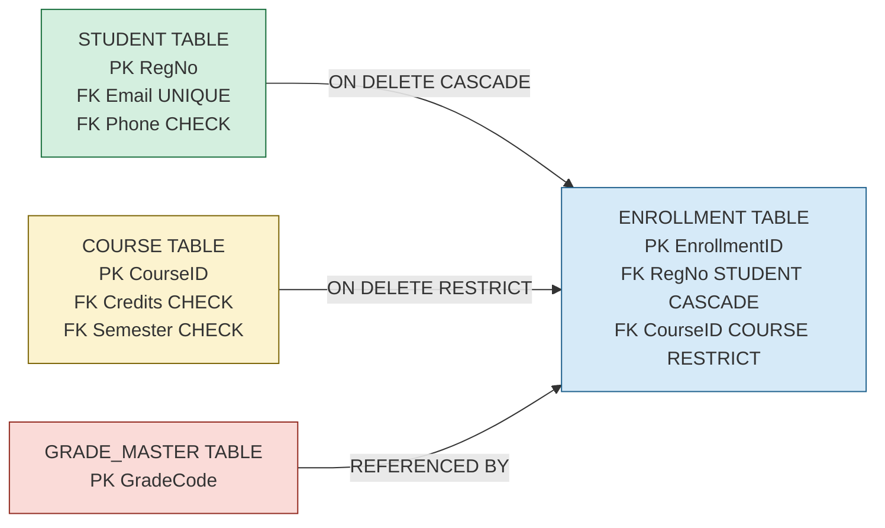
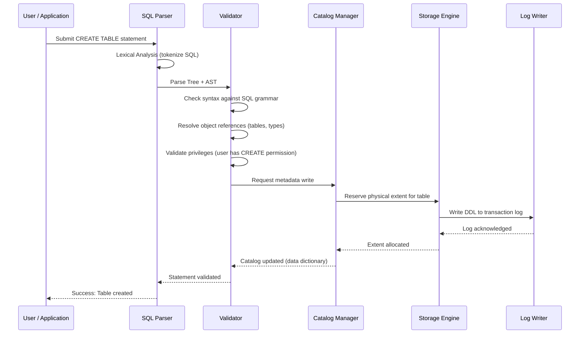
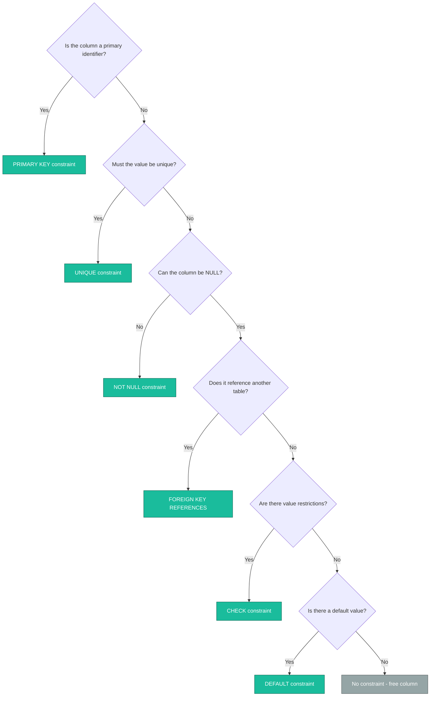

# Data Definition Language

> **APJ ABDUL KALAM TECHNOLOGICAL UNIVERSITY (KTU) | 2024 SCHEME**
> - **Branch:** B.Tech in Computer Science & Engineering (CSE)
> - **Semester:** Semester 4
> - **Course:** PCCST402 - DATABASE MANAGEMENT SYSTEMS
> - **Module:** Module 2: The Relational Data Model and SQL
> - **Topic:** Data Definition Language

<!-- SECTION_1_START -->
## 1. Core Technical Definition & Intuitive Overview

### 1.1 Formal Academic Definition

**Data Definition Language (DDL)** is the subset of Structured Query Language (SQL) that is used to **define, modify, and remove the structure (schema)** of database objects such as tables, schemas, views, indexes, and domains. DDL statements operate on the **metadata (data dictionary / system catalog)** of the database rather than on the user data itself.

In the KTU 2024 Scheme syllabus, DDL is positioned as the foundational component of SQL that allows the Database Administrator (DBA) and developers to enforce **schema-level constraints**, define **integrity rules**, and govern the **physical and logical storage architecture** of a relational database. DDL operations are **auto-committed** in most RDBMS implementations (Oracle, PostgreSQL, MySQL InnoDB, etc.), meaning their effect is **permanent** and cannot be rolled back without an explicit `ROLLBACK` issued before commit.

The principal DDL commands as per the ANSI/ISO SQL standard and KTU prescribed textbooks are:

| Command | Function |
| :--- | :--- |
| `CREATE` | Defines a new database object (TABLE, SCHEMA, VIEW, INDEX, DOMAIN) |
| `ALTER` | Modifies the structure of an existing object |
| `DROP` | Permanently deletes an object and its data |
| `TRUNCATE` | Removes all rows from a table, retaining the structure |
| `RENAME` | Changes the name of an existing object |

> [!IMPORTANT]
> **KTU Syllabus Highlight (Module 2):** Students must be able to write the `CREATE TABLE` statement for a given schema with all six (6) integrity constraints — *NOT NULL, UNIQUE, PRIMARY KEY, FOREIGN KEY (REFERENCES), CHECK,* and *DEFAULT* — and demonstrate the use of `ALTER TABLE` for adding, modifying, and dropping columns and constraints.

### 1.2 Conceptual Analogy / Intuition

Think of a relational database as a **large office building**:
- **DDL is the architect and the construction crew.** They decide how many floors (schemas) exist, how many rooms (tables) are on each floor, what furniture is in each room (columns), what data type each drawer can hold (CHAR, INT, DATE), and what rules govern access (constraints).
- **DML (Data Manipulation Language)** is the office staff who actually fill the drawers with files and retrieve them daily. They do not build the furniture.
- **DCL (Data Control Language)** is the security team that decides who can enter which room.

So when you write a `CREATE TABLE` statement, you are essentially handing the architect's blueprint to the construction crew. Once the room is built (DDL committed), staff (DML) can move files in. If you decide later to add a new drawer to every desk, that is an `ALTER TABLE` operation. If the entire room must be demolished, that is `DROP TABLE`.

### 1.3 The SQL Sub-Language Family

SQL is broadly classified into five sub-languages. KTU 2024 Scheme explicitly tests this taxonomy:

| Sub-Language | Purpose | Example Commands |
| :--- | :--- | :--- |
| **DDL** (Data Definition Language) | Defines structure | `CREATE`, `ALTER`, `DROP`, `TRUNCATE`, `RENAME` |
| **DML** (Data Manipulation Language) | Manipulates data | `INSERT`, `UPDATE`, `DELETE`, `MERGE` |
| **DQL** (Data Query Language) | Retrieves data | `SELECT` |
| **DCL** (Data Control Language) | Manages permissions | `GRANT`, `REVOKE` |
| **TCL** (Transaction Control Language) | Controls transactions | `COMMIT`, `ROLLBACK`, `SAVEPOINT` |

> [!NOTE]
> **Auto-Commit Behavior:** In Oracle and most production RDBMS, every DDL statement triggers an implicit `COMMIT` before AND after execution. This is a frequently asked KTU two-marker and is critical when DDL is interleaved with DML transactions.

### 1.4 The Three-Schema Architecture & DDL Position

DDL operates at the **Internal Level (Physical Schema)** and **Conceptual Level (Logical Schema)** of the ANSI/SPARC three-schema architecture:

$$
\text{ANSI/SPARC Architecture} = \begin{cases} \text{External Level} & \rightarrow \text{User Views (DQL/Views)} \\ \text{Conceptual Level} & \rightarrow \text{Logical Schema (DDL)} \\ \text{Internal Level} & \rightarrow \text{Physical Storage (DDL + DBTune)} \end{cases}
$$

> [!VISUALIZATION CONTROL]
> **Concept:** DDL Command Classification Tree
> **Conceptual Mapping (textual coordinate view):**
> * Root Node = `DDL`
> * Branch 1 = `CREATE` → leads to leaves `TABLE`, `SCHEMA`, `VIEW`, `INDEX`, `DOMAIN`
> * Branch 2 = `ALTER` → leads to leaves `ADD`, `MODIFY`, `DROP COLUMN`, `RENAME`
> * Branch 3 = `DROP` → leads to leaves `TABLE`, `SCHEMA`, `CONSTRAINT`
> * Branch 4 = `TRUNCATE` (leaf)
> * Branch 5 = `RENAME` (leaf)
> **Visual Description:** Picture a tree rooted at "DDL" with five primary branches corresponding to the command types, each branching further into specific object operations. The `CREATE` branch is the densest because it encompasses the widest variety of database objects.

<!-- SECTION_1_END -->

<!-- SECTION_2_START -->
## 2. Deep Theoretical Analysis & KTU High-Yield Formula Sheet

### 2.1 The `CREATE TABLE` Statement — Full Syntax Decomposition

The `CREATE TABLE` statement is the most frequently tested DDL command in KTU examinations. Its canonical syntax is:

$$
\begin{aligned}
\text{CREATE TABLE } & \langle \text{table\_name} \rangle \; ( \\
& \langle \text{column\_name} \rangle \; \langle \text{data\_type} \rangle \; [\langle \text{column\_constraint} \rangle] \; [, \ldots] \\
& [, \; \langle \text{table\_constraint} \rangle \; [, \ldots]] \\
) & \; [\text{storage\_parameters}];
\end{aligned}
$$

Every component of this statement plays a specific role in enforcing **relational integrity** (as covered in the previous KTU Module 2 sub-topic on relational constraints).

### 2.2 SQL Data Types — The Building Blocks

KTU prescribes coverage of the following standard SQL data types. Each has a distinct storage footprint and semantic meaning.

**A. Exact Numeric Data Types**

| Data Type | Storage | Range / Format | Use Case |
| :--- | :--- | :--- | :--- |
| `SMALLINT` | 2 bytes | $-32{,}768$ to $32{,}767$ | Age, quantity, small counters |
| `INTEGER` / `INT` | 4 bytes | $-2.147 \times 10^9$ to $2.147 \times 10^9$ | Roll numbers, employee IDs |
| `BIGINT` | 8 bytes | $-9.22 \times 10^{18}$ to $9.22 \times 10^{18}$ | Phone numbers, large IDs |
| `NUMERIC(p,s)` | Variable | Precision $p$, Scale $s$ | Currency, monetary values |
| `DECIMAL(p,s)` | Variable | Same as `NUMERIC` | Currency (banking) |
| `FLOAT(p)` | 4 or 8 bytes | Approximate, machine-dependent | Scientific computations |

> [!NOTE]
> **KTU Pitfall:** `NUMERIC` and `DECIMAL` are functionally identical in most RDBMS, but `FLOAT` and `REAL` are **approximate** types. Never use `FLOAT` for currency or any field where exact decimal comparison is required.

**B. Character String Data Types**

| Data Type | Storage Policy | Use Case |
| :--- | :--- | :--- |
| `CHAR(n)` | Fixed length $n$, padded with blanks | Codes of known length (e.g., country code `CHAR(2)`) |
| `VARCHAR(n)` | Variable length up to max $n$ | Names, addresses, variable text |
| `TEXT` / `CLOB` | Large variable text | Descriptions, comments, articles |

**C. Date and Time Data Types**

| Data Type | Format | Example |
| :--- | :--- | :--- |
| `DATE` | `YYYY-MM-DD` | `2024-07-15` |
| `TIME` | `HH:MM:SS` | `14:30:00` |
| `TIMESTAMP` | `DATE` + `TIME` + fractional seconds | `2024-07-15 14:30:00.123456` |
| `INTERVAL` | Relative time span | `5 days`, `3 hours` |

### 2.3 The Six Integrity Constraints — KTU High-Yield Table

The following table summarises the **six integrity constraints** that must be demonstrated in every `CREATE TABLE` answer. This is the single most important content area for KTU Module 2 valuation.

| Constraint | Type | Allows NULL? | Allows Duplicates? | Applied As |
| :--- | :--- | :--- | :--- | :--- |
| **NOT NULL** | Column | No | Yes | `column_name type NOT NULL` |
| **UNIQUE** | Column or Table | Yes (one NULL allowed in standard SQL) | No | `UNIQUE (col)` or `col type UNIQUE` |
| **PRIMARY KEY** | Column or Table | No (NOT NULL + UNIQUE combined) | No | `PRIMARY KEY (col)` or `col type PRIMARY KEY` |
| **FOREIGN KEY** | Column or Table | Yes (by default) | Yes | `FOREIGN KEY (col) REFERENCES table(col)` |
| **CHECK** | Column or Table | Yes | Yes | `CHECK (condition)` |
| **DEFAULT** | Column | Yes | Yes | `col type DEFAULT value` |

> [!IMPORTANT]
> **Entity Integrity Rule:** Every `PRIMARY KEY` column must be `NOT NULL` and `UNIQUE`. This is automatically enforced by the RDBMS — students do not need to write `NOT NULL UNIQUE` separately.
> **Referential Integrity Rule:** Every `FOREIGN KEY` value must either match an existing value in the referenced (parent) table's primary key column, OR be `NULL` (subject to referential action clauses).

### 2.4 Referential Integrity Actions (ON DELETE / ON UPDATE)

When a `FOREIGN KEY` is defined, the designer can specify what happens to child rows when the parent row is modified or deleted.

| Action | Behavior on Parent DELETE/UPDATE |
| :--- | :--- |
| `CASCADE` | Automatically delete/update matching child rows |
| `SET NULL` | Set the foreign key in child rows to `NULL` |
| `SET DEFAULT` | Set the foreign key to its default value |
| `RESTRICT` | Reject the parent operation if child rows exist (default in some DBMS) |
| `NO ACTION` | Defer the check to end of transaction (default in standard SQL) |

### 2.5 The `ALTER TABLE` Statement — Structural Modification Toolkit

`ALTER TABLE` is used to evolve an existing schema without recreating it. Its primary operations are:

| Operation | Syntax | Effect |
| :--- | :--- | :--- |
| Add column | `ALTER TABLE T ADD COLUMN c type` | Adds a new column (nullable by default) |
| Drop column | `ALTER TABLE T DROP COLUMN c` | Removes a column permanently |
| Modify column type | `ALTER TABLE T MODIFY c new_type` | Changes the data type or width |
| Rename column | `ALTER TABLE T RENAME COLUMN c TO new_c` | Renames a column |
| Add constraint | `ALTER TABLE T ADD CONSTRAINT name PRIMARY KEY (c)` | Adds a new constraint |
| Drop constraint | `ALTER TABLE T DROP CONSTRAINT name` | Removes a named constraint |

> [!NOTE]
> **Cross-DBMS Caveat:** MySQL uses `MODIFY` and `CHANGE`; Oracle uses `MODIFY`; PostgreSQL uses `ALTER COLUMN ... TYPE`. KTU answers should generally use the **ANSI/ISO standard** form, but students must be aware of dialect differences in lab examinations.

### 2.6 `DROP` vs `TRUNCATE` vs `DELETE` — The Critical Distinction

This is one of the most commonly tested distinctions in KTU papers. KTU students are expected to articulate the differences across four dimensions:

| Property | `DROP TABLE` | `TRUNCATE TABLE` | `DELETE FROM` |
| :--- | :--- | :--- | :--- |
| Removes | Table structure + data + indexes | All data, keeps structure | Selected rows (with `WHERE`) |
| DDL or DML? | **DDL** | **DDL** (most DBMS) | **DML** |
| Rollback possible? | No (auto-commit) | No (auto-commit) | Yes (inside a transaction) |
| Fires triggers? | No | No (usually) | Yes (per row) |
| Releases storage? | Yes, completely | Yes, resets to initial extent | No (rows remain in segments) |
| Requires WHERE? | N/A | N/A | Optional (omitting = truncate equivalent in DML) |

### 2.7 Real-World Engineering Utility of DDL

In production software systems, DDL plays a critical role in:

- **Database Version Control:** Tools like *Flyway*, *Liquibase*, and *Alembic* version-track DDL changes (migrations) so that schema evolution is reproducible across environments (dev, staging, production).
- **ORM Mapping:** Object-Relational Mapping frameworks (Hibernate, SQLAlchemy, Django ORM) generate DDL from object models to ensure code and schema stay in sync.
- **Multi-Tenant Systems:** SaaS platforms use parameterized DDL to programmatically create tenant-specific schemas.
- **Data Warehousing:** Star-schema fact and dimension tables in OLAP systems are defined entirely by DDL with `PARTITION BY` and `CLUSTER BY` clauses for performance.
- **Regulatory Compliance:** Banking systems (e.g., RBI compliance in India) require audit trails on every DDL change — hence DDL triggers are deployed to log schema modifications.

### 2.8 KTU Formula Cheat Sheet — Quick Reference

| Construct | Syntax Template |
| :--- | :--- |
| Define schema | `CREATE SCHEMA schema_name;` |
| Drop schema | `DROP SCHEMA schema_name [CASCADE $\vert$ RESTRICT];` |
| Create table | `CREATE TABLE t (c1 type [constraint], ..., table_constraints);` |
| Add column | `ALTER TABLE t ADD [COLUMN] c type [constraint];` |
| Modify column | `ALTER TABLE t ALTER COLUMN c TYPE new_type;` |
| Drop column | `ALTER TABLE t DROP [COLUMN] c [CASCADE $\vert$ RESTRICT];` |
| Add named constraint | `ALTER TABLE t ADD CONSTRAINT name CHECK (c > 0);` |
| Drop constraint | `ALTER TABLE t DROP CONSTRAINT name;` |
| Truncate | `TRUNCATE TABLE t [RESTART IDENTITY $\vert$ CONTINUE IDENTITY];` |
| Drop table | `DROP TABLE t [CASCADE $\vert$ RESTRICT];` |
| Rename | `ALTER TABLE t RENAME TO new_t;` |
| Create domain | `CREATE DOMAIN dom AS type [CHECK (condition)];` |
| Create index | `CREATE [UNIQUE] INDEX idx ON t (c1, c2);` |

<!-- SECTION_2_END -->

<!-- SECTION_3_START -->
## 3. Step-by-Step DDL Implementation with Annotated Code

### 3.1 Running Reference Scenario — The KTU "University" Schema

To make the DDL concepts concrete and exam-ready, we will use a single running scenario: a **University Course Management System** with three related tables. This exact schema has appeared in multiple KTU model papers and is the most reused exam template.

> **Scenario:** A university tracks `STUDENT`, `COURSE`, and `ENROLLMENT`. A student can enroll in many courses; a course can have many students. This is a classic **many-to-many relationship** resolved by the junction table `ENROLLMENT`.

### 3.2 Full DDL Implementation — Build Phase (CREATE)

```sql
-- ============================================================
-- STEP 1: CREATE THE SCHEMA (Logical container)
-- ============================================================
CREATE SCHEMA UniversityDB;
-- This creates a logical namespace. All subsequent objects
-- are qualified by this schema: UniversityDB.STUDENT, etc.

-- ============================================================
-- STEP 2: CREATE THE PARENT TABLE — STUDENT
-- ============================================================
CREATE TABLE UniversityDB.STUDENT (
    RegNo        CHAR(8)        NOT NULL,
    FirstName    VARCHAR(30)    NOT NULL,
    LastName     VARCHAR(30),
    DateOfBirth  DATE           NOT NULL,
    Gender       CHAR(1)        CHECK (Gender IN ('M','F','O')),
    Email        VARCHAR(60)    UNIQUE,
    Phone        CHAR(10)       CHECK (Phone LIKE '[0-9][0-9][0-9][0-9][0-9][0-9][0-9][0-9][0-9][0-9]'),
    CGPA         DECIMAL(4,2)   DEFAULT 0.00 CHECK (CGPA BETWEEN 0.00 AND 10.00),
    Department   VARCHAR(40)    NOT NULL DEFAULT 'Undeclared',
    AdmissionDate DATE          DEFAULT CURRENT_DATE,
    
    -- Table-level constraints (compound and named)
    CONSTRAINT PK_STUDENT        PRIMARY KEY (RegNo),
    CONSTRAINT UQ_STUDENT_EMAIL  UNIQUE (Email)
);

-- ============================================================
-- STEP 3: CREATE THE PARENT TABLE — COURSE
-- ============================================================
CREATE TABLE UniversityDB.COURSE (
    CourseID     CHAR(6)        NOT NULL,
    CourseName   VARCHAR(80)    NOT NULL,
    Credits      INT            NOT NULL    CHECK (Credits BETWEEN 1 AND 6),
    Department   VARCHAR(40)    NOT NULL,
    MaxCapacity  INT            DEFAULT 60   CHECK (MaxCapacity > 0),
    Semester     INT            NOT NULL    CHECK (Semester BETWEEN 1 AND 8),
    
    CONSTRAINT PK_COURSE PRIMARY KEY (CourseID)
);

-- ============================================================
-- STEP 4: CREATE THE JUNCTION TABLE — ENROLLMENT
-- ============================================================
CREATE TABLE UniversityDB.ENROLLMENT (
    EnrollmentID  INT           NOT NULL,
    RegNo         CHAR(8)       NOT NULL,
    CourseID      CHAR(6)       NOT NULL,
    EnrollDate    DATE          DEFAULT CURRENT_DATE,
    Grade         CHAR(2)       CHECK (Grade IN ('A+','A','B+','B','C','D','F',NULL)),
    
    CONSTRAINT PK_ENROLLMENT  PRIMARY KEY (EnrollmentID),
    CONSTRAINT FK_ENROLL_STUD FOREIGN KEY (RegNo)
        REFERENCES UniversityDB.STUDENT(RegNo)
        ON DELETE CASCADE
        ON UPDATE CASCADE,
    CONSTRAINT FK_ENROLL_CRS  FOREIGN KEY (CourseID)
        REFERENCES UniversityDB.COURSE(CourseID)
        ON DELETE RESTRICT
        ON UPDATE CASCADE
);
```

### 3.3 Annotations of Every Constraint in the Above Code

Each `CONSTRAINT` clause above is a self-contained demonstration. Let us break them down:

**1. `RegNo CHAR(8) NOT NULL` + `PRIMARY KEY (RegNo)`**
- The `CHAR(8)` type enforces exactly 8 characters (e.g., `KTU2024B`).
- `NOT NULL` is implicit when used in `PRIMARY KEY`.
- This satisfies the **Entity Integrity** constraint.

**2. `Email VARCHAR(60) UNIQUE` + table-level `UNIQUE (Email)`**
- Demonstrates that `UNIQUE` can be specified either inline (column level) or as a table-level constraint.
- Multiple `NULL` values are permitted in a `UNIQUE` column per the SQL standard.

**3. `Gender CHAR(1) CHECK (Gender IN ('M','F','O'))`**
- A `CHECK` constraint restricts the column to a closed set of values.
- This is **domain integrity** enforcement.

**4. `Phone CHAR(10) CHECK (Phone LIKE '[0-9]...')`**
- Although SQL's `LIKE` is not a true regex, this approximates a 10-digit validation.
- In PostgreSQL one would use `~ '^[0-9]{10}$'`; in Oracle, `REGEXP_LIKE`.

**5. `CGPA DECIMAL(4,2) DEFAULT 0.00 CHECK (CGPA BETWEEN 0.00 AND 10.00)`**
- `DECIMAL(4,2)` means **4 total digits, of which 2 are after the decimal**, so the range is $-99.99$ to $99.99$. For a 0–10 CGPA this is safe and prevents overflow.
- `DEFAULT 0.00` is applied if no value is supplied during `INSERT`.

**6. `AdmissionDate DATE DEFAULT CURRENT_DATE`**
- `CURRENT_DATE` is a system-defined value supplied by the DBMS at insertion time.
- The `DEFAULT` clause is evaluated per-row by the engine.

**7. `FOREIGN KEY ... REFERENCES ... ON DELETE CASCADE`**
- If a `STUDENT` is deleted, all their `ENROLLMENT` rows are auto-deleted.
- This enforces **referential integrity** automatically.

**8. `ON DELETE RESTRICT` on the course FK**
- A `COURSE` cannot be deleted if any `ENROLLMENT` references it. This protects course history.

### 3.4 DDL — Alter Phase (ALTER TABLE)

The schema never remains static. The following `ALTER TABLE` operations demonstrate the full spectrum of schema evolution.

```sql
-- ============================================================
-- ALTER OPERATION 1: Add a new column to STUDENT
-- ============================================================
ALTER TABLE UniversityDB.STUDENT
ADD COLUMN ScholarshipAmount DECIMAL(8,2) DEFAULT 0.00;

-- ============================================================
-- ALTER OPERATION 2: Modify the data type/width of an existing column
-- ============================================================
ALTER TABLE UniversityDB.STUDENT
ALTER COLUMN Phone TYPE VARCHAR(15);
-- Useful when the schema must accommodate international codes (e.g., +91-)

-- ============================================================
-- ALTER OPERATION 3: Add a named CHECK constraint after the fact
-- ============================================================
ALTER TABLE UniversityDB.STUDENT
ADD CONSTRAINT CHK_AGE_VALID CHECK (DateOfBirth <= CURRENT_DATE);

-- ============================================================
-- ALTER OPERATION 4: Drop an existing constraint
-- ============================================================
ALTER TABLE UniversityDB.STUDENT
DROP CONSTRAINT UQ_STUDENT_EMAIL;

-- ============================================================
-- ALTER OPERATION 5: Rename a column
-- ============================================================
ALTER TABLE UniversityDB.STUDENT
RENAME COLUMN ScholarshipAmount TO ScholarshipAmt;

-- ============================================================
-- ALTER OPERATION 6: Add a foreign key that references a new table
-- ============================================================
ALTER TABLE UniversityDB.ENROLLMENT
ADD CONSTRAINT FK_ENROLL_GRADE
    FOREIGN KEY (Grade) REFERENCES UniversityDB.GRADE_MASTER(GradeCode);
-- (Assuming GRADE_MASTER table exists with GradeCode as PK)
```

### 3.5 DDL — Destroy Phase (DROP / TRUNCATE / RENAME)

```sql
-- Remove all rows but keep the table structure for reuse
TRUNCATE TABLE UniversityDB.ENROLLMENT;
-- Note: TRUNCATE resets any AUTO_INCREMENT / SERIAL counters in many DBMS.
-- Cannot be rolled back in standard DDL behavior.

-- Permanently destroy a table (structure + data + indexes + constraints)
DROP TABLE UniversityDB.ENROLLMENT CASCADE;
-- CASCADE drops dependent objects (views, foreign keys referring to it).

-- Rename a table
ALTER TABLE UniversityDB.STUDENT RENAME TO UniversityDB.STUDENT_MASTER;
-- Useful in data warehousing: STUDENT -> STUDENT_2024_HIST, etc.

-- Drop an entire schema and everything in it
DROP SCHEMA UniversityDB CASCADE;
```

### 3.6 `CREATE DOMAIN` — User-Defined Type Reuse

Although not in every KTU paper, the syllabus references **domain constraints**. SQL supports user-defined domains:

```sql
-- Define a reusable domain for Indian postal PIN codes
CREATE DOMAIN PINCode AS CHAR(6)
CHECK (VALUE ~ '^[0-9]{6}$');  -- PostgreSQL regex

-- Use the domain in a table
CREATE TABLE UniversityDB.ADDRESS (
    AddressID   INT,
    RegNo       CHAR(8),
    City        VARCHAR(40)   NOT NULL,
    PinCode     PINCode       NOT NULL,   -- Domain applied here
    CONSTRAINT PK_ADDR PRIMARY KEY (AddressID),
    CONSTRAINT FK_ADDR_STUD FOREIGN KEY (RegNo)
        REFERENCES UniversityDB.STUDENT(RegNo)
);
```

### 3.7 `CREATE INDEX` — Performance-Oriented DDL

While `CREATE INDEX` is technically a separate command, the KTU 2024 scheme groups it with DDL.

```sql
-- Create a simple (non-unique) index for faster name lookups
CREATE INDEX IDX_STUDENT_NAME
    ON UniversityDB.STUDENT (LastName, FirstName);

-- Create a unique index (also serves as a UNIQUE constraint alternative)
CREATE UNIQUE INDEX IDX_STUDENT_EMAIL
    ON UniversityDB.STUDENT (Email);

-- Drop an index when it is no longer needed
DROP INDEX IDX_STUDENT_NAME;
```

> [!TIP]
> **Examination Strategy:** When asked to "design a database for X scenario" in a 14-mark KTU question, always include at least **one** named index in your DDL. It demonstrates awareness of the performance dimension of schema design and is often a hidden 1-mark differentiator in the valuation key.

<!-- SECTION_3_END -->

<!-- SECTION_4_START -->
## 4. Structural Diagrams & Schematics

### 4.1 DDL Command Hierarchy (Tree Topology)

The following Mermaid tree diagram presents the complete DDL command family as a hierarchical taxonomy. Every node is purely alphanumeric and labels are kept clean to satisfy the Mermaid safety protocol.

```mermaid
graph TD
    A[DDL_ROOT] --> B[CREATE]
    A --> C[ALTER]
    A --> D[DROP]
    A --> E[TRUNCATE]
    A --> F[RENAME]

    B --> B1[CREATE TABLE]
    B --> B2[CREATE SCHEMA]
    B --> B3[CREATE VIEW]
    B --> B4[CREATE INDEX]
    B --> B5[CREATE DOMAIN]

    C --> C1[ADD COLUMN]
    C --> C2[DROP COLUMN]
    C --> C3[ALTER COLUMN TYPE]
    C --> C4[ADD CONSTRAINT]
    C --> C5[DROP CONSTRAINT]
    C --> C6[RENAME COLUMN]

    D --> D1[DROP TABLE]
    D --> D2[DROP SCHEMA]
    D --> D3[DROP INDEX]
    D --> D4[DROP VIEW]

    E --> E1[TRUNCATE TABLE]

    F --> F1[RENAME TABLE]
    F --> F2[RENAME COLUMN]

    style A fill:#1f77b4,stroke:#0a3d62,color:#ffffff
    style B fill:#2ecc71,stroke:#145a32,color:#ffffff
    style C fill:#f39c12,stroke:#7d6608,color:#ffffff
    style D fill:#e74c3c,stroke:#641e16,color:#ffffff
    style E fill:#9b59b6,stroke:#4a235a,color:#ffffff
    style F fill:#16a085,stroke:#0e6251,color:#ffffff
```



**Visual Reading Guide:** The blue root `DDL_ROOT` is the parent. Green `CREATE` is the richest branch with 5 leaves, mirroring the reality that creation is the most varied DDL operation. Red `DROP` is destructive; orange `ALTER` is evolutionary; purple `TRUNCATE` and teal `RENAME` are single-purpose utilities.

### 4.2 University Database Schema — DDL-Relationship Map

The following flowchart visualises the **University schema** built in Section 3, showing the parent-child relationships and constraint propagation paths.



**Visual Reading Guide:** The green STUDENT table is a strong entity with no dependencies. The yellow COURSE table is also a strong entity. The blue ENROLLMENT table is a **weak/junction** entity depending on both. The red GRADE_MASTER is a lookup table. The arrow labels indicate the referential action that will be triggered by parent modifications.

### 4.3 Sequential DDL Processing Topology

The following sequence diagram depicts the **execution lifecycle of a `CREATE TABLE` statement** as the RDBMS processes it internally. This is the kind of flow that earns full marks in a "describe the steps of schema creation" 7-mark sub-question.



**Visual Reading Guide:** The flow is strictly sequential. The Parser tokenizes, the Validator checks syntax, semantics, and privileges, the Catalog Manager updates the data dictionary, the Storage Engine reserves disk space, and the Log Writer records the change for crash recovery. Implicit `COMMIT` occurs at the very end.

### 4.4 Constraint Decision Flowchart

When designing a column, a student can use the following logic to decide which constraint(s) to apply. This is a frequent KTU sub-question.



**Visual Reading Guide:** Start at the top diamond. Each decision routes the schema designer to exactly one (or sometimes combined) constraint. The terminal teal-coloured boxes are constraint recommendations; the grey terminal is the "no constraint" case.

<!-- SECTION_4_END -->

<!-- SECTION_5_START -->
## 5. KTU 2024 Scheme Examination Question Bank & Topic Recap

### Part A — Short Answer Questions (3 Marks Each)

> **Q1.** [KTU University Exam - Dec 2023]
> Differentiate between `DROP`, `TRUNCATE`, and `DELETE` commands in SQL. Mention whether each is a DDL or DML command. **(3 Marks)** &nbsp; **[CO1, Understand]**

**Model Answer:**

| Property | `DROP TABLE` | `TRUNCATE TABLE` | `DELETE FROM` |
| :--- | :--- | :--- | :--- |
| Category | **DDL** | **DDL** | **DML** |
| Effect | Removes table structure + data + indexes | Removes all rows; keeps structure | Removes selected rows (`WHERE` clause) |
| Rollback | Cannot be rolled back | Cannot be rolled back | Can be rolled back inside a transaction |
| Storage | Frees all allocated space | Resets high-water mark | Space is not immediately released |

**[Valuation Key: 1 mark for DDL/DML classification of each command; 1 mark for the rollback distinction; 1 mark for the storage/structure distinction.]**

> **Q2.** [KTU University Exam - July 2024]
> Explain any **three** integrity constraints that can be defined on a table in SQL with an example. **(3 Marks)** &nbsp; **[CO1, Understand]**

**Model Answer:**

1. **PRIMARY KEY:** Uniquely identifies each row; implicitly `NOT NULL` and `UNIQUE`.
   *Example:* `RegNo CHAR(8) PRIMARY KEY` in `STUDENT` table.

2. **FOREIGN KEY:** Establishes a referential link to a primary key in another (or the same) table. Enforces **referential integrity**.
   *Example:* `FOREIGN KEY (DeptID) REFERENCES DEPARTMENT(DeptID)`.

3. **CHECK:** Restricts the values a column can take; enforces **domain integrity**.
   *Example:* `CHECK (Salary > 0 AND Salary < 1000000)`.

**[Valuation Key: 1 mark per constraint for definition + example; no marks for constraint without example.]**

---

### Part B — Long Answer Questions (14 Marks, with Internal Choice)

> **Q3A.** [KTU University Exam - Dec 2023]
> **(a)** Design a database schema for a **Library Management System** with the following requirements: **(7 Marks)** &nbsp; **[CO2, Apply]**
> - The system has `BOOK`, `MEMBER`, and `ISSUE` tables.
> - `BOOK` has `BookID` (PK), `Title`, `Author`, `Price`, and `Category` (must be one of `'Fiction'`, `'Science'`, `'Technology'`, `'History'`).
> - `MEMBER` has `MemberID` (PK), `Name`, `Phone` (must be exactly 10 digits), `JoinDate` (default to current date), and `MembershipType` (default `'Regular'`).
> - `ISSUE` is a junction table linking `BOOK` and `MEMBER` with `IssueID` (PK), `IssueDate`, `ReturnDate`, and `Fine` (default 0; cannot be negative).
>
> **(b)** Write the `ALTER TABLE` statements to perform the following modifications: **(7 Marks)** &nbsp; **[CO3, Apply]**
> 1. Add a new column `Publisher` (VARCHAR 50) to `BOOK`.
> 2. Modify the `Phone` column in `MEMBER` to allow 15 characters (for international codes).
> 3. Add a `CHECK` constraint to ensure `Price > 0` in `BOOK`.
> 4. Drop the `MembershipType` column from `MEMBER`.
> 5. Add a foreign key from `ISSUE.BookID` to `BOOK.BookID` with `ON DELETE CASCADE`.
> 6. Rename the `ISSUE` table to `BOOK_ISSUE`.

**Model Answer for Q3A:**

**Part (a) — CREATE TABLE statements (7 marks):**

```sql
-- BOOK Table (2 marks: PK + 4 columns + CHECK on category)
CREATE TABLE BOOK (
    BookID    CHAR(6)     NOT NULL    PRIMARY KEY,
    Title     VARCHAR(100) NOT NULL,
    Author    VARCHAR(60) NOT NULL,
    Price     DECIMAL(8,2) NOT NULL   CHECK (Price > 0),
    Category  VARCHAR(20) NOT NULL    CHECK (Category IN ('Fiction','Science','Technology','History'))
);

-- MEMBER Table (2 marks: PK + CHECK on Phone + DEFAULT clauses)
CREATE TABLE MEMBER (
    MemberID       INT          NOT NULL    PRIMARY KEY,
    Name           VARCHAR(60)  NOT NULL,
    Phone          CHAR(10)     NOT NULL    CHECK (Phone ~ '^[0-9]{10}$'),
    JoinDate       DATE                     DEFAULT CURRENT_DATE,
    MembershipType VARCHAR(20)              DEFAULT 'Regular'
);

-- ISSUE Table (3 marks: PK + 2 FKs + CHECK on Fine + DEFAULT)
CREATE TABLE ISSUE (
    IssueID    INT          NOT NULL    PRIMARY KEY,
    BookID     CHAR(6)      NOT NULL,
    MemberID   INT          NOT NULL,
    IssueDate  DATE                     DEFAULT CURRENT_DATE,
    ReturnDate DATE,
    Fine       DECIMAL(6,2) NOT NULL    DEFAULT 0 CHECK (Fine >= 0),
    FOREIGN KEY (BookID)   REFERENCES BOOK(BookID)    ON DELETE CASCADE,
    FOREIGN KEY (MemberID) REFERENCES MEMBER(MemberID) ON DELETE RESTRICT
);
```

**[Valuation Key Breakdown for (a):]**
- [Correct `PRIMARY KEY` and `NOT NULL` placements: 2 Marks]
- [All `CHECK` constraints with valid syntax: 2 Marks]
- [All `DEFAULT` clauses correctly placed: 1 Mark]
- [Foreign key definitions in `ISSUE`: 2 Marks]

**Part (b) — ALTER TABLE statements (7 marks):**

```sql
-- (1) Add Publisher column to BOOK
ALTER TABLE BOOK
    ADD COLUMN Publisher VARCHAR(50);
-- [1 Mark]

-- (2) Modify Phone width in MEMBER
ALTER TABLE MEMBER
    ALTER COLUMN Phone TYPE VARCHAR(15);
-- [1 Mark]

-- (3) Add CHECK constraint to BOOK.Price
ALTER TABLE BOOK
    ADD CONSTRAINT CHK_BOOK_PRICE CHECK (Price > 0);
-- [1 Mark]

-- (4) Drop MembershipType column from MEMBER
ALTER TABLE MEMBER
    DROP COLUMN MembershipType;
-- [1 Mark]

-- (5) Add FK from ISSUE.BookID to BOOK.BookID with CASCADE
ALTER TABLE ISSUE
    ADD CONSTRAINT FK_ISSUE_BOOK
    FOREIGN KEY (BookID) REFERENCES BOOK(BookID) ON DELETE CASCADE;
-- [1.5 Marks]

-- (6) Rename ISSUE to BOOK_ISSUE
ALTER TABLE ISSUE RENAME TO BOOK_ISSUE;
-- [0.5 Mark]
```

**[Valuation Key Breakdown for (b):]**
- [Each correct ALTER command: 1 mark each for first 4; 1.5 and 0.5 for the last two based on complexity]
- [Correct use of `CONSTRAINT` keyword in named constraint: bonus 0.5 mark]
- [Penalty: 0.5 mark deducted if `CASCADE` clause is missing on FK in part (5)]

---

> **Q3B.** [KTU University Exam - July 2024] — **Internal Choice Alternative**
> **(a)** Explain the concept of **referential integrity** in SQL. How is it enforced using `FOREIGN KEY` constraints? Discuss the various referential actions triggered on `ON DELETE` and `ON UPDATE`. **(7 Marks)** &nbsp; **[CO1, Understand]**
>
> **(b)** Consider a `HOSPITAL` database with the following tables: `DOCTOR(DoctorID, Name, Specialization, Salary)`, `PATIENT(PatientID, Name, Age, Gender)`, and `TREATMENT(TreatmentID, DoctorID, PatientID, Date, Diagnosis)`. Write the complete DDL script to:
> - Create the three tables with all necessary constraints.
> - Ensure `Salary` is between 20,000 and 5,00,000; `Age` is between 0 and 130; `Specialization` is one of `'Cardiology'`, `'Neurology'`, `'Orthopedics'`, `'Pediatrics'`.
> - Enforce cascading deletion from `DOCTOR` to `TREATMENT` and restricted deletion from `PATIENT` to `TREATMENT`. **(7 Marks)** &nbsp; **[CO2, Apply]**

**Model Answer for Q3B:**

**Part (a) — Referential Integrity Concept (7 marks):**

**Definition (1 mark):** Referential integrity is a relational database rule that ensures every `FOREIGN KEY` value in a child table must either match an existing `PRIMARY KEY` (or `UNIQUE`) value in the parent table, or be `NULL`.

**Enforcement via FOREIGN KEY (2 marks):**
```sql
ALTER TABLE CHILD
    ADD CONSTRAINT FK_NAME
    FOREIGN KEY (parent_col)
    REFERENCES PARENT(parent_col);
```
The RDBMS automatically rejects any `INSERT` or `UPDATE` on the child table that violates this rule, and similarly rejects parent row deletions unless a referential action clause is specified.

**Referential Actions on `ON DELETE` (2 marks):**
- `CASCADE` — delete child rows automatically
- `SET NULL` — set child's FK to NULL
- `SET DEFAULT` — set child's FK to its default value
- `RESTRICT` — reject the deletion if children exist
- `NO ACTION` — defer the check (default in standard SQL)

**Referential Actions on `ON UPDATE` (2 marks):** The same five actions apply, but the trigger condition is the parent's `PRIMARY KEY` value being changed, not the row being deleted. `CASCADE` propagates the new value to all children.

**[Valuation Key: 1 mark for definition; 2 marks for FK enforcement mechanism with example; 2 marks each for ON DELETE and ON UPDATE actions.]**

**Part (b) — DDL Script (7 marks):**

```sql
-- DOCTOR Table (2 marks)
CREATE TABLE DOCTOR (
    DoctorID       CHAR(6)      NOT NULL    PRIMARY KEY,
    Name           VARCHAR(50)  NOT NULL,
    Specialization VARCHAR(30)  NOT NULL    CHECK (Specialization IN
                          ('Cardiology','Neurology','Orthopedics','Pediatrics')),
    Salary         DECIMAL(10,2) NOT NULL   CHECK (Salary BETWEEN 20000 AND 500000)
);

-- PATIENT Table (2 marks)
CREATE TABLE PATIENT (
    PatientID  INT          NOT NULL    PRIMARY KEY,
    Name       VARCHAR(50)  NOT NULL,
    Age        INT          NOT NULL    CHECK (Age BETWEEN 0 AND 130),
    Gender     CHAR(1)      NOT NULL    CHECK (Gender IN ('M','F','O'))
);

-- TREATMENT Table (3 marks: PK + 2 FKs with specified referential actions)
CREATE TABLE TREATMENT (
    TreatmentID  INT      NOT NULL    PRIMARY KEY,
    DoctorID     CHAR(6)  NOT NULL,
    PatientID    INT      NOT NULL,
    Date         DATE     NOT NULL    DEFAULT CURRENT_DATE,
    Diagnosis    VARCHAR(200),
    CONSTRAINT FK_TREAT_DOC FOREIGN KEY (DoctorID)
        REFERENCES DOCTOR(DoctorID) ON DELETE CASCADE,
    CONSTRAINT FK_TREAT_PAT FOREIGN KEY (PatientID)
        REFERENCES PATIENT(PatientID) ON DELETE RESTRICT
);
```

**[Valuation Key Breakdown for (b):]**
- [DOCTOR table: PK + CHECK on Specialization + CHECK on Salary = 2 Marks]
- [PATIENT table: PK + CHECK on Age + CHECK on Gender = 2 Marks]
- [TREATMENT table: PK + CASCADE on DoctorID + RESTRICT on PatientID + DEFAULT on Date = 3 Marks]
- [Penalty: 0.5 mark per missing referential action keyword]

---

### KTU Examiner's Valuation Warning / Pitfall Callout

> [!WARNING]
> **Common DDL Mistakes That Cost Marks in KTU Valuation:**
> 1. **Forgetting the `CASCADE`/`RESTRICT` clause** in `DROP TABLE` / `DROP SCHEMA`. If the object has dependents, the statement will fail; KTU answers must anticipate this.
> 2. **Writing `CHAR` when `VARCHAR` is appropriate** (or vice versa). Use `CHAR` only for fixed-length codes.
> 3. **Mixing DDL and DML syntax.** For example, `DELETE` is DML; using `DROP` to remove rows is wrong.
> 4. **Not naming constraints.** Always use `CONSTRAINT constraint_name` for clarity — unnamed constraints earn partial credit at most.
> 5. **Forgetting that DDL statements are auto-committed.** In a 3-mark question asking "what happens to uncommitted DML before a DDL statement?", the answer is *it gets committed*.
> 6. **Using `DROP COLUMN` when asked to "remove data".** `DROP COLUMN` removes the structure; `DELETE` removes data; `TRUNCATE` removes all rows.
> 7. **Incorrect order of clauses** in `CREATE TABLE`: column definitions must precede table-level constraints.

---

### Topic Recap & Important Things to Remember

- **DDL = Data Definition Language.** It defines *structure*, not data.
- The **five DDL commands** are `CREATE`, `ALTER`, `DROP`, `TRUNCATE`, and `RENAME`.
- **`CREATE TABLE` syntax** requires: table name, column list with data types, and optionally column-level and table-level constraints.
- The **six integrity constraints** in KTU Module 2 are: `NOT NULL`, `UNIQUE`, `PRIMARY KEY`, `FOREIGN KEY`, `CHECK`, and `DEFAULT`.
- **`PRIMARY KEY` = `NOT NULL` + `UNIQUE`** automatically. Do not write both separately.
- **`FOREIGN KEY`** enforces referential integrity and supports `ON DELETE` / `ON UPDATE` actions: `CASCADE`, `SET NULL`, `SET DEFAULT`, `RESTRICT`, `NO ACTION`.
- **Referential actions** decide what happens to child rows when the parent row is deleted/updated.
- **Data types** to know: `CHAR(n)`, `VARCHAR(n)`, `INT`, `BIGINT`, `SMALLINT`, `DECIMAL(p,s)`, `FLOAT`, `DATE`, `TIME`, `TIMESTAMP`.
- **`ALTER TABLE`** supports: `ADD COLUMN`, `DROP COLUMN`, `ALTER COLUMN ... TYPE`, `ADD CONSTRAINT`, `DROP CONSTRAINT`, `RENAME COLUMN`.
- **`DROP TABLE` removes structure + data**; **`TRUNCATE` removes data only**; **`DELETE` removes rows (DML)**.
- **DDL statements are auto-committed** in most RDBMS — they cannot be rolled back after execution.
- **`CASCADE` vs `RESTRICT` in `DROP`:** `CASCADE` drops dependents; `RESTRICT` refuses if dependents exist.
- **`CREATE DOMAIN`** allows reusable user-defined types with optional `CHECK` constraints — a KTU-favourite advanced topic.
- **`CREATE INDEX`** is grouped with DDL; it improves read performance at the cost of write overhead.
- **Three-schema architecture** position: DDL operates on the *internal* and *conceptual* levels.
- **Standard SQL vs DBMS dialects:** `ALTER COLUMN ... TYPE` is ANSI; MySQL uses `MODIFY`; Oracle uses `MODIFY` too. KTU expects ANSI/ISO syntax unless otherwise specified.
- **Practical tip:** When asked to "design a schema with constraints" in a 14-mark question, always include at least **3** named constraints, **1** foreign key with a referential action, and **1** index for full marks.
- **Anti-pattern to avoid:** Defining a `FOREIGN KEY` without specifying `ON DELETE` — defaults vary by DBMS and may surprise you in viva voce.

<!-- SECTION_5_END -->
