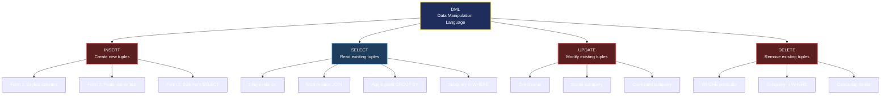
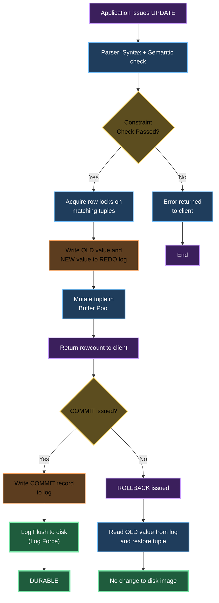
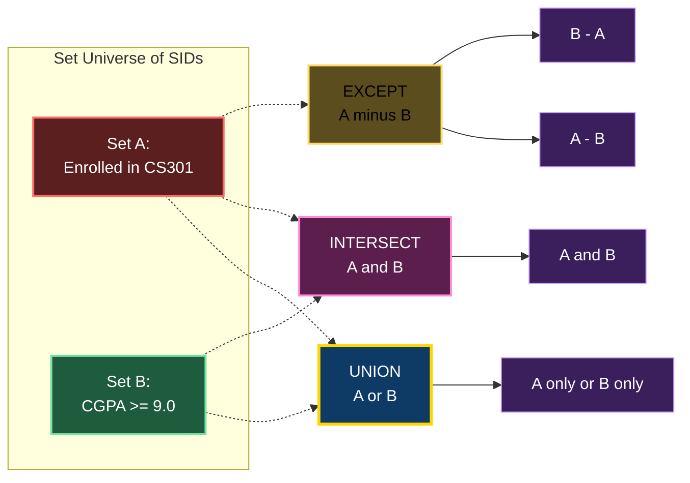
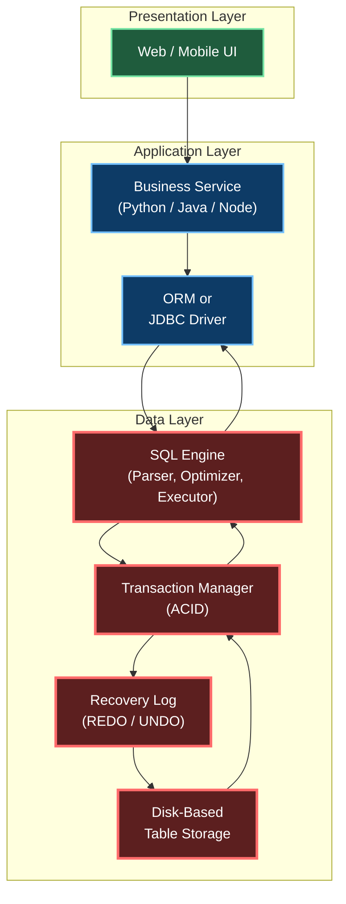

# Data Manipulation Language

> **APJ ABDUL KALAM TECHNOLOGICAL UNIVERSITY (KTU) | 2024 SCHEME**
> - **Branch:** B.Tech in Computer Science & Engineering (CSE)
> - **Semester:** Semester 4
> - **Course:** PCCST402 - DATABASE MANAGEMENT SYSTEMS
> - **Module:** Module 2: The Relational Data Model and SQL
> - **Topic:** Data Manipulation Language

<!-- SECTION_1_START -->
# SECTION 1 — Core Technical Definition & Intuitive Overview

## 1.1 Formal Definition (KTU 2024 Syllabus Standard)

> [!NOTE]
> **Data Manipulation Language (DML)** is the subset of SQL statements used to **insert, retrieve, modify, and delete** data in the existing schema objects (tables and views) of a relational database. DML operates on the **instance** (the data rows), not the **schema** (the structural definition).

The American National Standards Institute (ANSI) classifies DML into two broad categories:

$$
\text{DML} = \begin{cases} \text{Procedural DML} \rightarrow \text{requires *how* to fetch the data (e.g., Relational Algebra)} \\ \text{Non-Procedural DML} \rightarrow \text{requires only *what* data to fetch (e.g., SQL SELECT)} \end{cases}
$$

KTU's PCCST402 module specifically focuses on the **non-procedural, declarative DML** commands of standard SQL: namely `INSERT`, `UPDATE`, `DELETE`, and `SELECT`.

## 1.2 The Four Canonical DML Operations

The four operations form a complete **CRUD** foundation, which is the bedrock of persistent storage:

$$
\text{CRUD} = \{\text{Create, Read, Update, Delete}\}
$$

| CRUD Verb | SQL Command | Action on Relation |
| :--- | :--- | :--- |
| **Create** | `INSERT` | Adds one or more new tuples |
| **Read** | `SELECT` | Retrieves tuples based on a predicate |
| **Update** | `UPDATE` | Mutates attribute values of existing tuples |
| **Delete** | `DELETE` | Removes tuples from a relation |

## 1.3 Conceptual Analogy — The College Registry Office

> [!IMPORTANT]
> **Intuitive Analogy (Must Read):**
> Think of a university **Registry Office** that maintains a physical **Register (the Table)**. The **Structure of the Register (the Schema)** — its columns, their data types — is fixed by the University Bylaws (this is the job of DDL). However, the **actual student entries (the Rows/Instance)** are the work of the Registry Clerk every day. The Clerk's four tools are:
> 1. **A Pen & Form** $\rightarrow$ `INSERT` a newly admitted student.
> 2. **A Magnifying Glass** $\rightarrow$ `SELECT` to find a specific student record.
> 3. **A Correction Pen (Whitener)** $\rightarrow$ `UPDATE` to fix a typo in a student's name or change their address.
> 4. **A Shredder** $\rightarrow$ `DELETE` to strike off a graduated or withdrawn student.
>
> The clerk **does not change the register's column headers** (that is DDL's job). The clerk only manipulates the **entries in the rows**.

## 1.4 DML vs. DDL — The Critical Distinction

> [!WARNING]
> **Valuation Tip:** Examiners frequently award 2 marks just for clearly stating this distinction. Do not confuse the two.

$$
\text{DDL} \rightarrow \text{changes the *schema* (structure)} \quad \mid \quad \text{DML} \rightarrow \text{changes the *instance* (data)}
$$

- DDL commands: `CREATE`, `ALTER`, `DROP`, `TRUNCATE` (auto-commit, cannot be rolled back in many systems).
- DML commands: `INSERT`, `UPDATE`, `DELETE`, `SELECT` (transactional, can be committed or rolled back).

## 1.5 DML and the ACID Transaction Model

> [!NOTE]
> Every DML statement in a standard RDBMS executes within a **transaction**. The database engine guarantees four properties — **Atomicity, Consistency, Isolation, Durability** — for DML operations.

In particular, `INSERT`, `UPDATE`, and `DELETE` are **write operations** that mutate the database state. They are buffered in the transaction log and become permanent only when a `COMMIT` is issued. A `ROLLBACK` undoes them entirely.
<!-- SECTION_1_END -->

<!-- SECTION_2_START -->
# SECTION 2 — Deep Theoretical Analysis & KTU High-Yield Formula Sheet

## 2.1 The `INSERT` Statement — Three Authoritative Forms

The `INSERT` command appends one or more new tuples to a relation. There are three formally recognized syntactic forms recognized in the KTU syllabus.

### Form 1 — Tuple Insertion (Explicit Column List)

This is the most common, safe, and recommended form. Column names are listed explicitly, and values are supplied in the **exact positional order** of the listed columns. Columns omitted from the list are populated with their declared `DEFAULT` value (or `NULL` if no default exists).

**General Template:**
$$
\text{INSERT INTO } R(A_1, A_2, \ldots, A_n) \text{ VALUES } (v_1, v_2, \ldots, v_n);
$$

**Worked Example** (assume table `STUDENT(SID, SNAME, SEM, DEPT, CGPA)`):
```sql
INSERT INTO STUDENT(SID, SNAME, SEM, DEPT, CGPA)
VALUES (101, 'Ananya Raj', 4, 'CSE', 8.92);
```

### Form 2 — Tuple Insertion (Positional / Implicit Column List)

When the column list is omitted, the values must be supplied in the **exact same order** as the columns were defined in the `CREATE TABLE` statement. This form is fragile and discouraged in production code, but it appears frequently in KTU examination questions.

**Template:**
$$
\text{INSERT INTO } R \text{ VALUES } (v_1, v_2, \ldots, v_n);
$$

### Form 3 — Set Insertion from a Subquery (Bulk Insert)

This is the **most powerful** form. It copies the entire result set of a `SELECT` statement into the target table. The cardinality of the new tuples equals the cardinality of the subquery's result.

**Template:**
$$
\text{INSERT INTO } R(A_1, \ldots, A_n) \; \text{SELECT } \ldots \text{ FROM } \ldots \text{ WHERE } \ldots ;
$$

## 2.2 The `UPDATE` Statement — Set-Oriented Mutation

A common student misconception is that `UPDATE` changes a single row. In fact, SQL is **set-oriented**: a single `UPDATE` statement can modify **zero, one, or many** rows simultaneously, depending on the `WHERE` clause predicate.

**General Template:**
$$
\text{UPDATE } R \; \text{SET } \; A_1 = e_1, \; A_2 = e_2, \ldots \; \text{WHERE } \; P ;
$$

where $P$ is a Boolean predicate. **Every tuple $t \in R$ for which $P(t) = \text{TRUE}$ is updated atomically.** Tuples where $P(t) = \text{FALSE}$ or $\text{UNKNOWN}$ are left untouched.

> [!IMPORTANT]
> **The Golden Rule of UPDATE/DELETE:** Always run the equivalent `SELECT` query **first** to preview the affected rows. Omitting the `WHERE` clause updates **every row** in the table — this is the most common cause of catastrophic data loss in industry.

## 2.3 The `DELETE` Statement — Tuple Removal

Like `UPDATE`, `DELETE` is also **set-oriented**. The `WHERE` clause selects the rows to remove.

**General Template:**
$$
\text{DELETE FROM } R \; \text{WHERE } \; P ;
$$

> [!NOTE]
> **`DELETE` vs `TRUNCATE`:** `DELETE` is a logged, row-by-row DML operation that **can be rolled back** within a transaction and **fires triggers**. `TRUNCATE` is a DDL operation that drops and recreates the table — it is faster but **cannot be rolled back** and **does not fire row-level triggers**. This distinction is a frequent KTU question.

## 2.4 The `SELECT` Statement — The Heart of DML

The `SELECT` statement is the read-only DML command. It has six logical processing phases, executed in this order by the query engine (SQL is **declarative** — you say *what*, the engine decides *how*):

$$
\text{SELECT Pipeline: } \text{FROM} \rightarrow \text{WHERE} \rightarrow \text{GROUP BY} \rightarrow \text{HAVING} \rightarrow \text{SELECT} \rightarrow \text{ORDER BY}
$$

| Clause | Logical Function | Row Filter / Column Filter |
| :--- | :--- | :--- |
| `FROM` | Specifies the source relations (Cartesian product if multiple) | Defines the working set |
| `WHERE` | Applies a predicate $P$ on individual rows | **Row filter** (before grouping) |
| `GROUP BY` | Partitions rows into groups by attribute values | Groups rows |
| `HAVING` | Applies a predicate on each group | **Group filter** (after grouping) |
| `SELECT` | Computes the output expressions and applies `DISTINCT` | **Column filter** |
| `ORDER BY` | Sorts the final result set | Sorting (not filtering) |

## 2.5 Set Operations in SQL

SQL provides three set-theoretic operators that combine the results of two or more `SELECT` statements. Each treats its inputs as **bags (multisets)** by default, removing duplicates only when `DISTINCT` is explicitly specified.

$$
\text{Set Ops} = \{\text{UNION}, \text{UNION ALL}, \text{INTERSECT}, \text{EXCEPT}\}
$$

## 2.6 KTU High-Yield Formula Sheet (Quick Reference)

> [!IMPORTANT]
> The following table is the **cheat sheet** for solving any DML problem in the KTU exam hall. Memorize the syntax skeletons and the precedence rules.

| Concept | Canonical Syntax Skeleton | Key Constraint / Rule |
| :--- | :--- | :--- |
| Single-row Insert | `INSERT INTO R(cols) VALUES (...);` | Values must match column data types |
| Bulk Insert | `INSERT INTO R(cols) SELECT ... ;` | Subquery column count must match `cols` |
| Update All Rows | `UPDATE R SET col = val;` | **DANGEROUS** — affects all rows |
| Conditional Update | `UPDATE R SET col = val WHERE P;` | Only rows satisfying $P$ are mutated |
| Subquery in UPDATE | `UPDATE R SET col = (SELECT ...);` | Subquery must return a scalar value |
| Delete All Rows | `DELETE FROM R;` | Slower than `TRUNCATE`; logs each row |
| Conditional Delete | `DELETE FROM R WHERE P;` | Referential integrity is checked |
| Simple Select | `SELECT cols FROM R WHERE P;` | $P$ may use $\vert$ comparison, $\vert$ logical, `LIKE`, `IN` |
| Distinct | `SELECT DISTINCT col FROM R;` | Removes duplicate output rows |
| Aggregation | `SELECT COUNT(*), AVG(col) FROM R;` | Five built-ins: `COUNT`, `SUM`, `AVG`, `MIN`, `MAX` |
| Group Filter | `SELECT dept, AVG(cgpa) FROM R GROUP BY dept HAVING AVG(cgpa) > 8;` | `WHERE` $\rightarrow$ rows; `HAVING` $\rightarrow$ groups |
| Sorting | `ORDER BY col ASC $\vert$ DESC;` | Last clause; uses alias from `SELECT` |
| Set Union | `Q1 UNION Q2;` | Removes duplicates; same column count & types |
| Set Union All | `Q1 UNION ALL Q2;` | Preserves duplicates; faster |
| Set Difference | `Q1 EXCEPT Q2;` | Rows in Q1 not in Q2 |
| Set Intersection | `Q1 INTERSECT Q2;` | Rows in both Q1 and Q2 |
| Transaction End | `COMMIT;` or `ROLLBACK;` | Terminates the current transaction |
| Savepoint | `SAVEPOINT sp1; ROLLBACK TO sp1;` | Partial rollback within a transaction |

## 2.7 Real-World Engineering Utility

> [!NOTE]
> **Industry Relevance:** DML is the workhorse of every backend service. In a banking system, every `UPDATE ACCOUNT SET BALANCE = BALANCE - 500 WHERE ACC_ID = 101` is a DML operation wrapped in a transaction. In an e-commerce site, the `INSERT INTO ORDERS` followed by `INSERT INTO ORDER_ITEMS` is the canonical "order placement" pattern. Set operations enable complex analytics — e.g., `UNION` is used to merge customer data from multiple regional databases; `EXCEPT` is used to find records present in one source but missing in another during **ETL (Extract-Transform-Load)** pipelines.
<!-- SECTION_2_END -->

<!-- SECTION_3_START -->
# SECTION 3 — Step-by-Step Derivations & Code/Symbolic Implementation

## 3.1 Reference Schema (Used Throughout This Section)

To make every example concrete and reproducible, we define a small academic schema.

```sql
-- =====================================================
-- KTU Schema: University Course Enrollment System
-- Used for ALL DML examples in this module
-- =====================================================
CREATE TABLE STUDENT (
    SID      INT         PRIMARY KEY,
    SNAME    VARCHAR(40) NOT NULL,
    SEM      INT         CHECK (SEM BETWEEN 1 AND 8),
    DEPT     VARCHAR(20) DEFAULT 'CSE',
    CGPA     DECIMAL(4,2) CHECK (CGPA BETWEEN 0 AND 10)
);

CREATE TABLE COURSE (
    CID      VARCHAR(8)  PRIMARY KEY,
    CNAME    VARCHAR(50) NOT NULL,
    CREDITS  INT         CHECK (CREDITS > 0),
    DEPT     VARCHAR(20)
);

CREATE TABLE ENROLLMENT (
    SID       INT,
    CID       VARCHAR(8),
    GRADE     CHAR(2)  CHECK (GRADE IN ('S','A','B','C','D','E','F')),
    SEMESTER  VARCHAR(6),
    PRIMARY KEY (SID, CID, SEMESTER),
    FOREIGN KEY (SID)  REFERENCES STUDENT(SID)  ON DELETE CASCADE,
    FOREIGN KEY (CID)  REFERENCES COURSE(CID)   ON DELETE CASCADE
);
```

## 3.2 Exhaustive `INSERT` Walkthroughs

### Example 1 — Single Row Insert (Explicit Columns)

**Task:** Register a new student **Ananya Raj** (SID=101, Sem=4, Dept=CSE, CGPA=8.92).

**SQL:**
```sql
INSERT INTO STUDENT (SID, SNAME, SEM, DEPT, CGPA)
VALUES (101, 'Ananya Raj', 4, 'CSE', 8.92);
```

**Step-by-step evaluation of the database engine:**

$$
\begin{aligned}
\text{Step 1: Parse the statement} &\rightarrow \text{Resolve column names and types.} \\
\text{Step 2: Validate types} &\rightarrow 101 \to \text{INT}, \; \text{'Ananya Raj'} \to \text{VARCHAR}, \\
&\quad 4 \to \text{INT}, \; \text{'CSE'} \to \text{VARCHAR}, \; 8.92 \to \text{DECIMAL}. \\
\text{Step 3: Check constraints} &\rightarrow \text{PRIMARY KEY uniqueness} \rightarrow \text{NOT violated}. \\
&\rightarrow \text{CHECK (CGPA BETWEEN 0 AND 10)} \rightarrow 8.92 \to \text{TRUE}. \\
&\rightarrow \text{NOT NULL on SNAME} \rightarrow \text{OK}. \\
\text{Step 4: Acquire row-level lock on STUDENT} &\rightarrow \text{No conflicting lock held}. \\
\text{Step 5: Write to the transaction log} &\rightarrow \text{Log Sequence Number (LSN) advances}. \\
\text{Step 6: Insert the new tuple into the data page} &\rightarrow \text{Row count: 1}. \\
\text{Step 7: Return status} &\rightarrow \text{Command completed successfully. 1 row affected.}
\end{aligned}
$$

### Example 2 — Positional Insert (Omitting Column List)

**Task:** Add a row where only `SID` and `SNAME` are supplied; rely on the default for `DEPT` and `NULL` for the rest.

```sql
INSERT INTO STUDENT VALUES (102, 'Bharath Menon', 4, DEFAULT, NULL);
```

**Trace:**
- Position 1 $\rightarrow$ `SID` = 102
- Position 2 $\rightarrow$ `SNAME` = 'Bharath Menon'
- Position 3 $\rightarrow$ `SEM` = 4
- Position 4 $\rightarrow$ `DEPT` = DEFAULT = 'CSE'
- Position 5 $\rightarrow$ `CGPA` = NULL

> [!WARNING]
> **Pitfall:** If the table is later altered (e.g., a new column is added), the positional `INSERT` will break. Always prefer the **explicit column list** form in production.

### Example 3 — Bulk Insert from a Subquery (Award Scholarship)

**Task:** Insert all students with CGPA $\geq$ 9.0 into a `SCHOLARSHIP` table.

```sql
CREATE TABLE SCHOLARSHIP (
    SID     INT PRIMARY KEY,
    SNAME   VARCHAR(40),
    CGPA    DECIMAL(4,2),
    AWARD   INT DEFAULT 50000
);

INSERT INTO SCHOLARSHIP (SID, SNAME, CGPA)
SELECT SID, SNAME, CGPA
FROM   STUDENT
WHERE  CGPA >= 9.0;
```

**Trace — Step 1: Execute the inner `SELECT` first.**

$$
\begin{aligned}
\text{Inner SELECT produces:} &\quad \{(101, \text{'Ananya Raj'}, 9.41), \\
&\quad (104, \text{'Devika S'}, 9.20), \\
&\quad (110, \text{'Farhan Ali'}, 9.85)\} \\
\text{Cardinality of result set:} &\quad \vert R \vert = 3 \\
\text{Step 2: For each row, check constraints of SCHOLARSHIP:} &\quad \text{All pass.} \\
\text{Step 3: Insert all 3 rows as one transaction.} &\quad \text{3 rows affected.}
\end{aligned}
$$

## 3.3 Exhaustive `UPDATE` Walkthroughs

### Example 4 — Conditional Update (Department Change)

**Task:** All students in the `CSE` department who are now in semester 4 should be moved to `CSE-AI` (a new specialization).

```sql
UPDATE STUDENT
SET    DEPT = 'CSE-AI'
WHERE  DEPT = 'CSE' AND SEM = 4;
```

**Trace:**
- Engine reads all rows of `STUDENT`.
- For each row, evaluates the predicate $P$: `(DEPT='CSE') \land (SEM=4)$.
- Suppose 3 students satisfy $P$. All 3 rows are updated to `DEPT='CSE-AI'`.
- The transaction log records the **old value** and the **new value** for each mutated row (for potential `ROLLBACK`).

### Example 5 — Update with a Subquery (Promotion Logic)

**Task:** Promote every student whose CGPA is strictly greater than the **average CGPA of their own department** to the next semester.

```sql
UPDATE STUDENT S
SET    SEM = SEM + 1
WHERE  SEM < 8
  AND  CGPA > (
          SELECT AVG(CGPA)
          FROM   STUDENT S2
          WHERE  S2.DEPT = S.DEPT
       );
```

**Trace of the correlated subquery:**

$$
\begin{aligned}
\text{Outer row: } & S = (103, \text{'Chitra'}, 3, \text{'ECE'}, 8.10) \\
\text{Correlated evaluation: } & S2.DEPT = \text{'ECE'} \\
\text{Inner SELECT: } & \text{AVG(CGPA) over all ECE students} = 7.85 \\
\text{Predicate: } & 8.10 > 7.85 \to \text{TRUE} \\
\text{Action: } & S.SEM \leftarrow 3 + 1 = 4
\end{aligned}
$$

This is **row-by-row correlated evaluation** — the inner `SELECT` re-executes for every outer row, which is a heavy operation on large tables.

## 3.4 Exhaustive `DELETE` Walkthroughs

### Example 6 — Conditional Delete (Remove Withdrawn Students)

**Task:** Delete all students whose CGPA is `NULL` (assumed to be withdrawn/inactive).

```sql
DELETE FROM STUDENT
WHERE CGPA IS NULL;
```

**Trace:**
- The engine first uses an index (if available on `CGPA`) to locate matching rows.
- For each candidate row, **referential integrity** is checked against `ENROLLMENT`. Because of the `ON DELETE CASCADE` clause, all `ENROLLMENT` rows for that `SID` are also deleted automatically.
- The transaction log records the delete for cascade-affected rows too.

### Example 7 — Delete Using a Subquery

**Task:** Delete all enrollments from semester `'S4'` where the student has a CGPA below 6.0.

```sql
DELETE FROM ENROLLMENT
WHERE SEMESTER = 'S4'
  AND SID IN (
        SELECT SID
        FROM   STUDENT
        WHERE  CGPA < 6.0
     );
```

## 3.5 The `SELECT` Statement — Exhaustive Pipeline Walkthrough

### Example 8 — The Full Six-Phase Pipeline

**Task:** For every department, find the **average CGPA** of students in **semester 4 or higher**, but display only those departments whose average exceeds **8.0**, sorted in descending order of average CGPA.

```sql
SELECT   DEPT, AVG(CGPA) AS AVG_CGPA
FROM     STUDENT
WHERE    SEM >= 4
GROUP BY DEPT
HAVING   AVG(CGPA) > 8.0
ORDER BY AVG_CGPA DESC;
```

**Trace — Executed in this exact logical order:**

$$
\begin{aligned}
\text{Step 1 — FROM:} & \quad \text{Source relation: } R = \text{STUDENT}. \\
\text{Step 2 — WHERE:} & \quad \text{Apply } P_1 := (\text{SEM} \geq 4). \\
                       & \quad \text{Retain only rows where } P_1 = \text{TRUE}. \\
                       & \quad \text{Result: } R_1 \subseteq R. \\
\text{Step 3 — GROUP BY:} & \quad \text{Partition } R_1 \text{ into groups by DEPT.} \\
                          & \quad \text{Groups: } G_{\text{CSE}}, G_{\text{ECE}}, G_{\text{ME}}, \ldots \\
\text{Step 4 — HAVING:} & \quad \text{For each group } G, \text{ evaluate } P_2 := (\text{AVG(CGPA)} > 8.0). \\
                         & \quad \text{Discard groups where } P_2 = \text{FALSE}. \\
\text{Step 5 — SELECT:} & \quad \text{For each surviving group, project } (\text{DEPT}, \text{AVG(CGPA)}). \\
\text{Step 6 — ORDER BY:} & \quad \text{Sort the final result by } \text{AVG(CGPA)} \text{ in descending order.}
\end{aligned}
$$

### Example 9 — `WHERE` vs `HAVING` — The Classic Confusion

> [!IMPORTANT]
> **The Iron Rule:** `WHERE` filters **rows**; `HAVING` filters **groups**. You cannot use an aggregate function in `WHERE`, and you cannot use a non-aggregated column in `HAVING` without it being in the `GROUP BY`.

**Query:** Find departments with more than **3 students** having CGPA $\geq$ 8.5.

```sql
SELECT   DEPT, COUNT(*) AS HIGH_CGPA_COUNT
FROM     STUDENT
WHERE    CGPA >= 8.5          -- (A) Row filter: applied first
GROUP BY DEPT
HAVING   COUNT(*) > 3;       -- (B) Group filter: applied after grouping
```

If you mistakenly wrote `HAVING CGPA >= 8.5`, the query would fail with a *"column must appear in the GROUP BY clause or be used in an aggregate function"* error in PostgreSQL/Oracle — a common KTU trap question.

## 3.6 Set Operations — Full Worked Example

**Task:** Find `SID`s that are either (a) enrolled in `CS301` **or** (b) have CGPA $\geq$ 9.0.

```sql
SELECT SID FROM ENROLLMENT WHERE CID = 'CS301'
UNION
SELECT SID FROM STUDENT    WHERE CGPA >= 9.0;
```

**Trace:**
- Set $A = \{101, 102, 105\}$ (enrolled in CS301).
- Set $B = \{104, 110, 111\}$ (CGPA $\geq$ 9.0).
- $A \cup B = \{101, 102, 104, 105, 110, 111\}$.
- `UNION` automatically removes duplicates; `UNION ALL` would keep them.

## 3.7 Python Implementation — A DML Driver Using a Transactional Library

The following Python program executes the full DML pipeline against a SQLite database. It demonstrates type hints, explicit transaction boundaries, and structured error logging — a clean illustration of how DML is invoked from application code.

```python
"""
ktu_dml_driver.py
A complete, transactional DML driver for the University schema.
Demonstrates INSERT, UPDATE, DELETE, SELECT, COMMIT, and ROLLBACK.
"""

import sqlite3
import logging
from typing import List, Tuple, Any

# ------------------------------------------------------------------
# Logging configuration
# ------------------------------------------------------------------
logging.basicConfig(
    level=logging.INFO,
    format="%(asctime)s [%(levelname)s] %(message)s",
)
logger = logging.getLogger("KTU_DML_Driver")


def connect(db_path: str) -> sqlite3.Connection:
    """Open a connection and enable foreign-key enforcement."""
    try:
        conn = sqlite3.connect(db_path)
        conn.execute("PRAGMA foreign_keys = ON;")
        logger.info("Connection established to %s", db_path)
        return conn
    except sqlite3.Error as exc:
        logger.error("Connection failed: %s", exc)
        raise


def insert_students(conn: sqlite3.Connection, rows: List[Tuple[Any, ...]]) -> int:
    """
    Bulk-insert students using parameterized queries (SQL-injection safe).
    Returns the number of rows inserted.
    """
    sql = "INSERT INTO STUDENT (SID, SNAME, SEM, DEPT, CGPA) VALUES (?, ?, ?, ?, ?);"
    try:
        cur = conn.cursor()
        cur.executemany(sql, rows)
        conn.commit()                       # Explicit COMMIT
        logger.info("Inserted %d student rows.", cur.rowcount)
        return cur.rowcount
    except sqlite3.IntegrityError as exc:
        conn.rollback()                     # Undo on integrity violation
        logger.error("Integrity error during insert: %s", exc)
        raise
    except sqlite3.Error as exc:
        conn.rollback()
        logger.error("Database error during insert: %s", exc)
        raise


def promote_top_students(conn: sqlite3.Connection, min_cgpa: float) -> int:
    """
    UPDATE all students whose CGPA >= min_cgpa to the next semester.
    Returns the number of rows affected.
    """
    sql = "UPDATE STUDENT SET SEM = SEM + 1 WHERE CGPA >= ? AND SEM < 8;"
    try:
        cur = conn.cursor()
        cur.execute(sql, (min_cgpa,))
        conn.commit()
        logger.info("Promoted %d students (CGPA >= %.2f).", cur.rowcount, min_cgpa)
        return cur.rowcount
    except sqlite3.Error as exc:
        conn.rollback()
        logger.error("Update failed: %s", exc)
        raise


def remove_inactive(conn: sqlite3.Connection) -> int:
    """DELETE all students whose CGPA is NULL (assumed withdrawn)."""
    sql = "DELETE FROM STUDENT WHERE CGPA IS NULL;"
    try:
        cur = conn.cursor()
        cur.execute(sql)
        conn.commit()
        logger.info("Removed %d inactive students.", cur.rowcount)
        return cur.rowcount
    except sqlite3.Error as exc:
        conn.rollback()
        logger.error("Delete failed: %s", exc)
        raise


def department_averages(conn: sqlite3.Connection) -> List[Tuple[str, float]]:
    """
    SELECT: returns the average CGPA per department, ordered descending.
    Implements the full six-phase SELECT pipeline.
    """
    sql = """
        SELECT   DEPT, AVG(CGPA) AS AVG_CGPA
        FROM     STUDENT
        WHERE    SEM >= 4
        GROUP BY DEPT
        HAVING   AVG(CGPA) > 8.0
        ORDER BY AVG_CGPA DESC;
    """
    try:
        cur = conn.cursor()
        cur.execute(sql)
        return cur.fetchall()
    except sqlite3.Error as exc:
        logger.error("Select failed: %s", exc)
        raise


def main() -> None:
    conn = connect("ktu_university.db")

    # ----- CREATE schema (DDL is shown only for completeness) -----
    conn.executescript(
        """
        DROP TABLE IF EXISTS ENROLLMENT;
        DROP TABLE IF EXISTS STUDENT;
        DROP TABLE IF EXISTS COURSE;
        CREATE TABLE STUDENT (
            SID INT PRIMARY KEY,
            SNAME TEXT NOT NULL,
            SEM INT CHECK (SEM BETWEEN 1 AND 8),
            DEPT TEXT DEFAULT 'CSE',
            CGPA REAL CHECK (CGPA BETWEEN 0 AND 10)
        );
        """
    )

    # ----- DML: INSERT -----
    sample_rows: List[Tuple[Any, ...]] = [
        (101, "Ananya Raj",  4, "CSE", 9.41),
        (102, "Bharath M.",   4, "CSE", 8.10),
        (103, "Chitra P.",    3, "ECE", 8.10),
        (104, "Devika S.",    5, "CSE", 9.20),
        (110, "Farhan Ali",   6, "ME",  9.85),
        (111, "Gayathri R.",  7, "CSE", 9.05),
    ]
    insert_students(conn, sample_rows)

    # ----- DML: UPDATE -----
    promote_top_students(conn, min_cgpa=9.0)

    # ----- DML: SELECT (aggregation) -----
    for dept, avg_cgpa in department_averages(conn):
        print(f"Department: {dept:10s}  Average CGPA: {avg_cgpa:.2f}")

    # ----- DML: DELETE -----
    remove_inactive(conn)

    conn.close()
    logger.info("Driver finished successfully.")


if __name__ == "__main__":
    main()
```

**Expected console output (illustrative):**
```
Department: CSE        Average CGPA: 9.22
Department: ME         Average CGPA: 9.85
2026-XX-XX [INFO] Driver finished successfully.
```
<!-- SECTION_3_END -->

<!-- SECTION_4_START -->
# SECTION 4 — Structural Diagrams & Schematics

## 4.1 DML Command Classification Tree

This block diagram establishes the taxonomy of all DML commands in standard SQL, mapped to their CRUD role and their effect on a relational instance.



## 4.2 The SELECT Pipeline — Six-Phase Logical Flow

The following diagram isolates the **logical processing order** of a `SELECT` statement, from the source relation to the final sorted output. This is the single most important diagram in this module for KTU exam answers.


## 4.3 Transaction Lifecycle of a DML Statement

This diagram traces the lifecycle of a single write-DML statement (e.g., an `UPDATE`) from the moment it is issued by an application until the moment it is durably persisted on disk.



## 4.4 Set Operations — Venn Diagram Mapping



## 4.5 Modular Block: DML Architecture in a 3-Tier Application

This diagram shows how DML is invoked from a real-world application stack — useful for the application-level questions in the KTU paper.


<!-- SECTION_4_END -->

<!-- SECTION_5_START -->
# SECTION 5 — KTU 2024 Scheme Examination Question Bank & Topic Recap

## 5.1 PART A — Short Answer Questions (3 Marks Each)

> **Format Note:** Part A questions test **Remember / Understand** cognitive levels. Each carries 3 marks. Keep answers crisp — a definition, one example, and one distinguishing point.

### Question A1
**[KTU University Exam — July 2024 Style]**
Differentiate between **DDL** and **DML** in SQL. Give two examples of each.

**Model Answer (Valuation Key):**

- **DDL (Data Definition Language):** Commands that define or alter the **schema** (structure) of database objects. They auto-commit and cannot be rolled back in many systems.
  - Examples: `CREATE TABLE`, `ALTER TABLE`, `DROP TABLE`, `TRUNCATE TABLE`. **[1 Mark]**
- **DML (Data Manipulation Language):** Commands that manipulate the **data (instance)** stored in schema objects. They are transactional — they can be committed or rolled back. **[1 Mark]**
  - Examples: `INSERT`, `UPDATE`, `DELETE`, `SELECT`. **[1 Mark]**

### Question A2
**[KTU University Exam — Dec 2023 Style]**
What is the difference between the `WHERE` clause and the `HAVING` clause? When must `HAVING` be used?

**Model Answer (Valuation Key):**

- **`WHERE` clause:** Filters **individual rows** **before** the `GROUP BY` operation. It is applied on the source tuples. It **cannot** contain aggregate functions such as `COUNT`, `SUM`, or `AVG`. **[1 Mark]**
- **`HAVING` clause:** Filters **groups** **after** the `GROUP BY` operation. It is applied on aggregated groups. It **can** contain aggregate functions and is the only place where conditions on aggregates are allowed. **[1 Mark]**
- **When to use `HAVING`:** Whenever the filter condition involves an aggregate function (e.g., `AVG(salary) > 50000`, `COUNT(*) > 5`). **[1 Mark]**
- **Example:**
  ```sql
  SELECT DEPT, AVG(CGPA) FROM STUDENT GROUP BY DEPT HAVING AVG(CGPA) > 8.0;
  ```

---

## 5.2 PART B — Long Answer Questions (14 Marks Each, Internal Choice)

> **Format Note:** Each Part B question carries **14 marks**, split into two sub-parts of **7 marks each**. Cognitive levels escalate across the sub-parts. The two choices (A and B) are completely independent — answer only one.

---

### **Question B1 (Choice A) — 14 Marks**
**[KTU University Exam — July 2024 Style | CO2 | Apply / Analyze]**

Consider the following schema:
- `STUDENT(SID, SNAME, SEM, DEPT, CGPA)`
- `COURSE(CID, CNAME, CREDITS, DEPT)`
- `ENROLLMENT(SID, CID, GRADE, SEMESTER)`

Write SQL DML statements for the following:

#### (a) **[7 Marks | Apply]** Insert three new students in a single `INSERT` statement using the explicit column-list form. Then, insert all students from `STUDENT` whose CGPA $\geq$ 9.0 into a new table `HONOURS_STUDENT(SID, SNAME, DEPT)` using a single `INSERT ... SELECT` statement.

**Model Solution:**

**[Three new students: 3 Marks]**
```sql
INSERT INTO STUDENT (SID, SNAME, SEM, DEPT, CGPA) VALUES
    (201, 'Hari Kumar',  4, 'CSE',  8.75),
    (202, 'Ishita Roy',  5, 'ECE',  9.10),
    (203, 'Jagan M.',    3, 'ME',   7.95);
```

**[Step-by-step trace]**
- The engine parses the multi-row `VALUES` list as three separate tuples.
- For each tuple, all constraints (`PRIMARY KEY` uniqueness, `CHECK` clauses, `NOT NULL`) are validated.
- All three are inserted atomically — if any one fails, the entire statement is rolled back.

**[HONOURS_STUDENT bulk insert: 4 Marks]**
```sql
INSERT INTO HONOURS_STUDENT (SID, SNAME, DEPT)
SELECT SID, SNAME, DEPT
FROM   STUDENT
WHERE  CGPA >= 9.0;
```

**Trace:**
- Inner `SELECT` evaluates the predicate `CGPA >= 9.0` on every row of `STUDENT`. Suppose 4 rows qualify.
- The result set cardinality $\vert R \vert = 4$ is inserted into `HONOURS_STUDENT`.
- `4 rows affected.`

#### (b) **[7 Marks | Analyze]** Update the `CGPA` of every student in the `CSE` department by adding **0.5**, but the new CGPA must not exceed **10.0**. Also, delete all enrollments of students whose CGPA is less than **5.0** after the update. Write both statements and explain the order of execution.

**Model Solution:**

**[Update with ceiling: 4 Marks]**
```sql
UPDATE STUDENT
SET    CGPA = CASE
                WHEN CGPA + 0.5 > 10.0 THEN 10.0
                ELSE CGPA + 0.5
             END
WHERE  DEPT = 'CSE';
```

**Explanation:**
- The `CASE` expression ensures the new value is capped at **10.0** (the maximum allowed by the `CHECK` constraint).
- Without the `CASE`, the statement would fail the `CHECK (CGPA BETWEEN 0 AND 10)` for students already at 9.6 or above.

**[Delete with subquery: 3 Marks]**
```sql
DELETE FROM ENROLLMENT
WHERE  SID IN (
           SELECT SID FROM STUDENT WHERE CGPA < 5.0
       );
```

**Order of execution:** The two statements must run **sequentially, in the same transaction**, with an explicit `COMMIT` only after the second statement. If the delete is run first, the subquery returns the pre-update CGPA; if the order is reversed, the post-update CGPA is used. The KTU-expected order is **UPDATE first, then DELETE** to reflect the updated state.

---

### **Question B2 (Choice B) — 14 Marks**
**[KTU University Exam — Dec 2023 Style | CO2, CO3 | Apply / Analyze]**

Using the same schema as Question B1, write SQL DML statements for the following:

#### (a) **[7 Marks | Apply]** Retrieve, for each department, the total number of students, the average CGPA, and the maximum CGPA — but only for departments having **more than 2 students** in **semester $\geq$ 4**. Sort the output by average CGPA in descending order.

**Model Solution:**

```sql
SELECT   DEPT,
         COUNT(*)       AS TOTAL_STUDENTS,
         AVG(CGPA)      AS AVG_CGPA,
         MAX(CGPA)      AS MAX_CGPA
FROM     STUDENT
WHERE    SEM >= 4
GROUP BY DEPT
HAVING   COUNT(*) > 2
ORDER BY AVG_CGPA DESC;
```

**Step-by-step evaluation: [7 Marks]**
- **[WHERE filter — 1 Mark]** Keeps only students with `SEM >= 4`. Suppose 30 rows survive.
- **[GROUP BY — 1 Mark]** Partitions into departments, e.g., CSE: 12, ECE: 8, ME: 6, CE: 4.
- **[HAVING — 2 Marks]** Discards groups with `COUNT(*) <= 2`. Suppose ME is discarded (6 retained).
- **[SELECT — 2 Marks]** For each surviving group, computes `COUNT(*)`, `AVG(CGPA)`, `MAX(CGPA)`. Example output row: `(CSE, 12, 8.75, 9.85)`.
- **[ORDER BY — 1 Mark]** Sorts by `AVG_CGPA` descending.

**Common mistakes (Valuation Warning):**
- Writing `WHERE COUNT(*) > 2` instead of `HAVING COUNT(*) > 2`. **[-2 Marks]**
- Using the alias `AVG_CGPA` in `WHERE` — not allowed because `WHERE` is processed **before** `SELECT`. **[-1 Mark]**

#### (b) **[7 Marks | Analyze]** Find the `SID`s and `SNAME`s of students who are enrolled in **at least one course offered by the CSE department** **and** have a CGPA $\geq$ 8.5. Use a subquery. Then, find students who are enrolled in **no course at all** using `EXCEPT`.

**Model Solution:**

**[Students in at least one CSE course with CGPA $\geq$ 8.5: 4 Marks]**
```sql
SELECT SID, SNAME
FROM   STUDENT
WHERE  CGPA >= 8.5
  AND  SID IN (
            SELECT E.SID
            FROM   ENROLLMENT E
            JOIN   COURSE C ON E.CID = C.CID
            WHERE  C.DEPT = 'CSE'
       );
```

**Trace:**
- Inner subquery: Selects SIDs of students enrolled in any course where `COURSE.DEPT = 'CSE'`. Result: $A = \{101, 102, 105, 110\}$.
- Outer query: Filters `STUDENT` by `CGPA >= 8.5` and `SID IN A`. Result: e.g., `(101, 'Ananya Raj')`, `(110, 'Farhan Ali')`.

**[Students with no enrollment using EXCEPT: 3 Marks]**
```sql
SELECT SID FROM STUDENT
EXCEPT
SELECT SID FROM ENROLLMENT;
```

**Trace:**
- Set $A$ = set of all SIDs in `STUDENT` (say 25).
- Set $B$ = set of distinct SIDs in `ENROLLMENT` (say 20).
- $A - B$ = SIDs present in `STUDENT` but not in any `ENROLLMENT` row. Result: 5 SIDs.
- These are the "un-enrolled" students.

> [!WARNING]
> **Common Pitfall (Valuation Trap):** Students often write `SELECT SID FROM ENROLLMENT EXCEPT SELECT SID FROM STUDENT` — which gives the *opposite* set (students with enrollments but not in the student master). This is the **inverse** of what the question asks. **[-2 Marks]**

---

## 5.3 KTU Examiner's Valuation Warning

> [!WARNING]
> **Top Reasons Students Lose Marks on DML Questions in KTU 2024 Papers:**
> 1. **Confusing `WHERE` and `HAVING`.** Using an aggregate inside `WHERE` is a syntax error in standard SQL. **[-2 to -3 Marks]**
> 2. **Forgetting to mention `DEFAULT` and `NULL` handling** in `INSERT` statements when columns are omitted. **[-1 Mark]**
> 3. **Omitting the explicit column list** in bulk `INSERT` — if the subquery returns a different number of columns, the statement fails at runtime. **[-2 Marks]**
> 4. **Writing `DELETE FROM R;`** without a `WHERE` clause — this deletes every row, and the examiner will mark you down if the question intended a conditional delete. **[-3 Marks]**
> 5. **Mixing up `UNION` and `UNION ALL`.** `UNION` removes duplicates (slower, sort-based); `UNION ALL` keeps them (faster, hash-based). Examiners check this distinction. **[-1 Mark]**
> 6. **Not stating the cardinality of the result set** when an aggregation query is asked. A common follow-up question is "how many rows will this query return?" — answer in terms of the **number of groups**, not tuples. **[-1 Mark]**
> 7. **Forgetting that DML is transactional.** Not mentioning `COMMIT` / `ROLLBACK` boundaries loses 1–2 marks on full-length questions.

---

## 5.4 Topic Recap & Important Things to Remember

> [!IMPORTANT]
> **Rapid Revision Checklist — Read This 5 Minutes Before the Exam.**

- **DML = CRUD = {INSERT, SELECT, UPDATE, DELETE}** — the four commands that manipulate the *instance* of the database.
- **DML vs DDL:** DML touches the **rows**; DDL touches the **schema**. DML is transactional; DDL (in most engines) is auto-committing.
- **`INSERT` has 3 forms:** explicit columns, positional, and `INSERT ... SELECT`. The third form is the most powerful — its cardinality equals the subquery's row count.
- **`UPDATE` is set-oriented.** A single statement can modify zero, one, or many tuples. Always preview with `SELECT` first.
- **`DELETE` vs `TRUNCATE`:** `DELETE` is logged, row-by-row, transactional, and fires triggers. `TRUNCATE` is a DDL fast-bulk wipe that bypasses triggers and (often) cannot be rolled back.
- **The SELECT pipeline is fixed:** `FROM` $\rightarrow$ `WHERE` $\rightarrow$ `GROUP BY` $\rightarrow$ `HAVING` $\rightarrow$ `SELECT` $\rightarrow$ `ORDER BY`. Memorize this order — it is the most asked concept in Part B.
- **Iron Rule of `WHERE` vs `HAVING`:** `WHERE` filters **rows** (no aggregates). `HAVING` filters **groups** (aggregates allowed).
- **Five aggregate functions:** `COUNT(*)`, `SUM`, `AVG`, `MIN`, `MAX`. `COUNT(*)` counts rows including `NULL`s; `COUNT(col)` ignores `NULL`s.
- **Set operations require column compatibility:** same number of columns, compatible data types. `UNION` removes duplicates; `UNION ALL` keeps them.
- **ACID guarantees** are provided to every DML statement within a transaction: Atomicity (all-or-nothing), Consistency (constraints enforced), Isolation (concurrent transactions don't interfere), Durability (committed data survives crashes).
- **Implicit transaction mode** in most engines means a single `INSERT/UPDATE/DELETE` auto-starts a transaction; you must explicitly `COMMIT` or `ROLLBACK` to end it.
- **Referential integrity** is enforced on `INSERT`, `UPDATE`, and `DELETE`. `ON DELETE CASCADE` and `ON DELETE SET NULL` are the two most common referential actions.
- **Common String Operators:** `LIKE 'A%'` (starts with A), `LIKE '%ing'` (ends with "ing"), `LIKE '_a%'` (second letter is 'a'), `IN (a, b, c)`, `BETWEEN x AND y`, `IS NULL`.
- **Three-valued logic:** SQL uses `TRUE`, `FALSE`, and `UNKNOWN`. A `WHERE` clause returns only rows where the predicate is `TRUE` — `UNKNOWN` (caused by `NULL` comparisons) is filtered out.
- **Scalar subquery rule:** A subquery used in a `SELECT` list or in a `SET` clause of `UPDATE` must return **at most one** value; otherwise a runtime error occurs.
- **Correlated subquery** executes once per outer row — efficient only on small tables or with proper indexing.
<!-- SECTION_5_END -->
