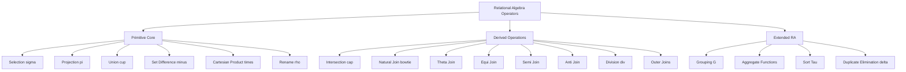
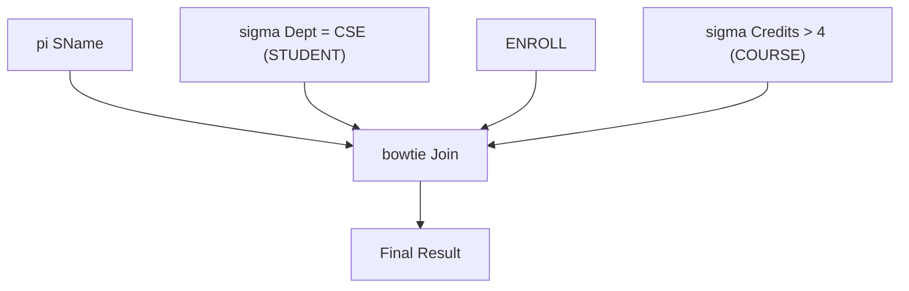
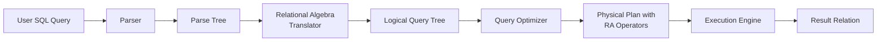
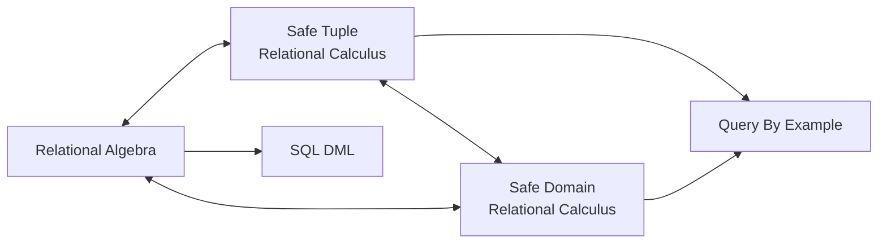
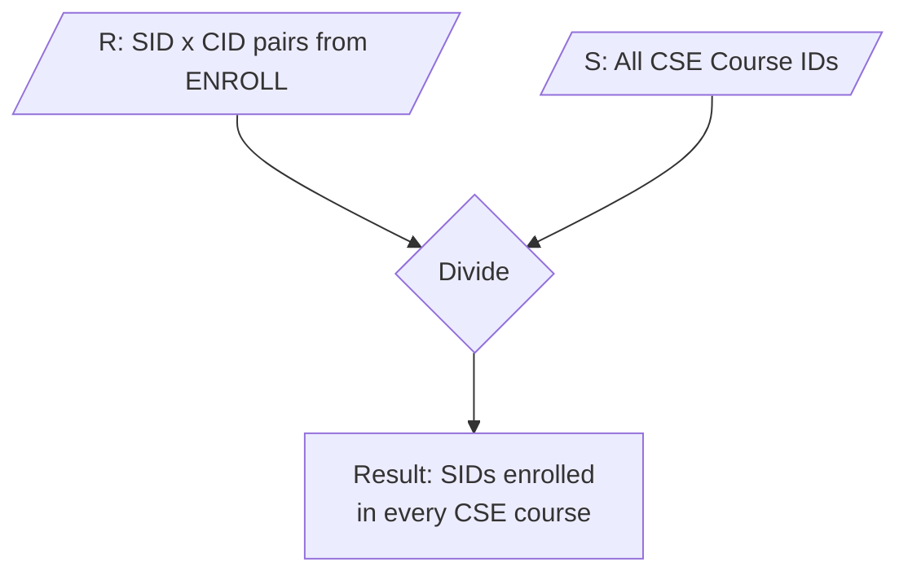

# Relational Algebra and Relational Calculus

> **APJ ABDUL KALAM TECHNOLOGICAL UNIVERSITY (KTU) | 2024 SCHEME**
> - **Branch:** B.Tech in Computer Science & Engineering (CSE)
> - **Semester:** Semester 4
> - **Course:** PCCST402 - DATABASE MANAGEMENT SYSTEMS
> - **Module:** Module 2: The Relational Data Model and SQL
> - **Topic:** Relational Algebra and Relational Calculus

<!-- SECTION_1_START -->

# 1. Core Technical Definition & Intuitive Overview

## 1.1 Relational Algebra (RA)

**Relational Algebra** is a **procedural query language** that takes one or more relations as input and produces a new relation as output. It consists of a set of operators (each accepting relations as operands and returning a relation) that can be composed to express any query. Because the result of every operation is itself a relation, operations can be nested, making the language **closure property** compliant.

> [!NOTE]
> **KTU Board Definition (Formal):**  
> *Relational Algebra is a procedural query language consisting of a set of operations that take one or two relations as input and produce a new relation as their output. It forms the theoretical foundation of SQL query execution and query optimization in modern RDBMS engines.*

**The six fundamental (primitive) operations of Relational Algebra are:**

1. **Selection ($\sigma$)** — Filters tuples (rows) based on a condition.
2. **Projection ($\pi$)** — Selects specific attributes (columns).
3. **Union ($\cup$)** — Combines tuples from two relations (set semantics).
4. **Set Difference ($-$)** — Returns tuples present in one relation but not the other.
5. **Cartesian Product ($\times$)** — Concatenates every tuple of one relation with every tuple of another.
6. **Rename ($\rho$)** — Renames the result relation or its attributes.

Derived (additional) operations include Intersection ($\cap$), Natural Join ($\bowtie$), $\theta$-Join, Equi-Join, Semi-Join, Anti-Join, Division ($\div$), Left/Right/Full Outer Joins, and Assignment ($\leftarrow$).

## 1.2 Relational Calculus (RC)

**Relational Calculus** is a **non-procedural (declarative) query language** that describes *what* is to be retrieved rather than *how* to retrieve it. It uses **predicate logic** (first-order logic) expressions to specify a set of tuples that satisfy a given condition. The two standard variants are:

- **Tuple Relational Calculus (TRC):** Variables range over **tuples** of a relation.
  $$\{ t \mid P(t) \}$$
- **Domain Relational Calculus (DRC):** Variables range over **domain values** (single column values).
  $$\{ <x_1, x_2, \ldots, x_n> \mid P(x_1, x_2, \ldots, x_n) \}$$

> [!IMPORTANT]
> **Syllabus Highlight (CO2, Understand):**  
> Relational Algebra and the safe variants of Tuple Relational Calculus and Domain Relational Calculus are **equally expressive** (Codd's Theorem). Every query expressible in one can be expressed in the others. However, **only the safe sub-set of TRC/DRC guarantees a finite answer** and is used in practice. Unsafe queries (those whose truth depends on infinite domains) are not allowed in KTU examinations.

## 1.3 Conceptual Analogy

> [!TIP]
> **Intuition: The Bakery Shop Counter**  
> Imagine a bakery with two tables — one of *Customers* and one of *Orders*.  
> • **Selection** is like telling the waiter: *"Bring me only the gold-member customers."* (Row filter.)  
> • **Projection** is like: *"I just want to see the name and phone number."* (Column filter.)  
> • **Cartesian Product** is like pairing *every* customer with *every* order (cross-table explosion).  
> • **Natural Join** is the smart version: pair customer with their *own* orders by matching the customer ID (intelligent cross-table filter).  
> • **Division** is the advanced one: *"Find customers who have ordered ALL types of pastries."*  
>  
> **Relational Algebra** is the *recipe* (step-by-step cooking instructions).  
> **Relational Calculus** is the *dish description* on the menu (*"a creamy mushroom entrée with garlic bread"*) — you only describe the result, not the cooking process.

## 1.4 Comparison Snapshot

> [!NOTE]
> | Aspect | Relational Algebra | Relational Calculus |
> |---|---|---|
> | Type | Procedural | Non-procedural (declarative) |
> | Based on | Set theory / algebra | Predicate (first-order) logic |
> | Specifies | **How** to compute | **What** to retrieve |
> | Variables | None (operator-based) | Tuple ($t$) or Domain ($x_i$) |
> | Used by | Query optimizers, query trees | QBE, foundations of SQL `WHERE` |
> | Safety | Always safe (closure) | Must enforce safety (finite result) |
> | Expressive Power | Equivalent to safe TRC/DRC | Equivalent to RA (Codd's Theorem) |

<!-- SECTION_1_END -->

<!-- SECTION_2_START -->

# 2. Deep Theoretical Analysis & KTU High-Yield Formula Sheet

## 2.1 Unary Relational Operations

### 2.1.1 Selection ($\sigma$)

The **selection** operation on relation $R$ with predicate $F$ returns all tuples whose attribute values satisfy $F$.

$$\sigma_{\text{predicate}}(R)$$

The predicate $F$ is a Boolean expression built from:

- **Operands:** constants or attribute names of $R$.
- **Comparison operators:** $=, \neq, \lt, \le, \gt, \ge$.
- **Logical connectives:** $\wedge$ (AND), $\vee$ (OR), $\neg$ (NOT).

**Properties of Selection:**

- **Idempotent:** $\sigma_{F_1}(\sigma_{F_1}(R)) = \sigma_{F_1}(R)$
- **Commutative:** $\sigma_{F_1}(\sigma_{F_2}(R)) = \sigma_{F_2}(\sigma_{F_1}(R)) = \sigma_{F_1 \wedge F_2}(R)$
- **Distributive over $\cup, \cap, -$:** $\sigma_{F}(R \cup S) = \sigma_{F}(R) \cup \sigma_{F}(S)$

> [!IMPORTANT]
> **KTU Pitfall:** The result schema of $\sigma$ is **identical** to the input schema. Only the tuple set is reduced.

### 2.1.2 Projection ($\pi$)

The **projection** operation on relation $R$ over attribute list $A$ returns a relation containing only those attributes, with duplicate tuples eliminated (set semantics).

$$\pi_{A_1, A_2, \ldots, A_n}(R)$$

**Properties of Projection:**

- **Idempotent** (when applied twice with the same attribute list): $\pi_{A}(\pi_{A}(R)) = \pi_{A}(R)$
- **NOT commutative** in general: $\pi_{A_1}(\pi_{A_1, A_2}(R)) \neq \pi_{A_2}(\pi_{A_1}(\pi_{A_1, A_2}(R)))$ — projection on fewer attributes loses information.
- **Distributive over union:** $\pi_{A}(R \cup S) = \pi_{A}(R) \cup \pi_{A}(S)$ (true for set union; must be careful with multiset semantics).

> [!IMPORTANT]
> **KTU Board Note:** Projection **removes duplicate tuples**. This is the single most-tested property in KTU 2-mark and 3-mark questions.

### 2.1.3 Rename ($\rho$)

The **rename** operator gives a new name to a result relation or to its attributes. It is essential for disambiguating attribute names across multiple relations (especially before Cartesian product or self-joins).

$$\rho_{S(B_1, B_2, \ldots, B_n)}(E)$$

This renames the result of expression $E$ to $S$ with attributes $B_1, B_2, \ldots, B_n$.

## 2.2 Binary Set-Theoretic Operations

For $\cup, \cap, -$ to be valid, the two operand relations must be **union-compatible** — same number of attributes and corresponding domains.

### 2.2.1 Union ($\cup$)

$$R \cup S = \{ t \mid t \in R \vee t \in S \}$$

### 2.2.2 Set Difference ($-$)

$$R - S = \{ t \mid t \in R \wedge t \notin S \}$$

### 2.2.3 Intersection ($\cap$) — Derived

$$R \cap S = R - (R - S) = S - (S - R)$$

### 2.2.4 Cartesian Product ($\times$)

$$R \times S = \{ t_R \circ t_S \mid t_R \in R \wedge t_S \in S \}$$

where $\circ$ denotes tuple concatenation. The result schema is the union of attributes of $R$ and $S$ (with qualified prefixes if attribute names overlap).

## 2.3 Join Operations (Derived)

### 2.3.1 Theta-Join ($R \bowtie_\theta S$)

$$R \bowtie_\theta S = \sigma_\theta(R \times S)$$

A Cartesian product followed by a selection using predicate $\theta$.

### 2.3.2 Equi-Join

A theta-join where $\theta$ contains only equality conditions.

### 2.3.3 Natural Join ($R \bowtie S$)

Equi-join on **all common attribute names** between $R$ and $S$, followed by removal of duplicate common attributes. Formally:

$$R \bowtie S = \pi_{A_1, A_2, \ldots, A_n, B_1, B_2, \ldots, B_m} \big( \sigma_{R.A_k = S.A_k \, \forall \, k} (R \times S) \big)$$

where $A_1, A_2, \ldots, A_n$ are attributes unique to $R$, $A_k$ are common attributes, and $B_1, B_2, \ldots, B_m$ are attributes unique to $S$.

### 2.3.4 Outer Joins

- **Left Outer Join ($R \mathrel{\text{⟕}} S$):** All tuples of $R$ preserved; non-matches padded with `NULL`.
- **Right Outer Join ($R \mathrel{\text{⟖}} S$):** All tuples of $S$ preserved.
- **Full Outer Join ($R \mathrel{\text{⟗}} S$):** Both sides preserved.

## 2.4 Division ($\div$)

The **division** operator $R \div S$ returns tuples in $R$ that are paired with **every** tuple of $S$ over the common attributes. It is used to answer *"for all"* type queries.

**Definition:** If $R$ has attributes $(A_1, \ldots, A_n, B_1, \ldots, B_m)$ and $S$ has attributes $(B_1, \ldots, B_m)$, then:

$$R \div S = \{ t \mid \forall s \in S, \; \exists r \in R \text{ such that } r[A_i] = t[A_i] \text{ and } r[B_j] = s[B_j] \, \forall j \}$$

**Equivalence using primitive operations:**

$$R \div S = \pi_{A}(R) - \pi_{A}\big( (\pi_{A}(R) \times S) - R \big)$$

## 2.5 Aggregate Functions and Grouping (Extended RA)

Extended RA adds functions such as $\text{COUNT}, \text{SUM}, \text{AVG}, \text{MIN}, \text{MAX}$ and the **grouping** operator $\mathcal{G}$.

$$\mathcal{G}_{\text{SUM(Salary)} \rightarrow \text{Total}, \, \text{Dept}}(\text{EMPLOYEE})$$

## 2.6 Tuple Relational Calculus (TRC)

A TRC query has the form:

$$\{ t \mid P(t) \}$$

where $P$ is a predicate built using:
- Tuple variables $t, u, v, \ldots$
- Conditions $t.A \; \theta \; c$ or $t.A \; \theta \; s.B$ (where $A,B$ are attributes, $c$ is a constant)
- Existential quantifier: $\exists \, u \in R (Q(u))$
- Universal quantifier: $\forall \, u \in R (Q(u))$
- Boolean connectives $\wedge, \vee, \neg$

**Safety Constraint:** Every tuple variable $t$ in the result must have its value in the **domain of the expression** $P$ (i.e., appearing in some relation referenced by $P$). The DBMS enforces this via *dom(P)*.

## 2.7 Domain Relational Calculus (DRC)

A DRC query has the form:

$$\{ <x_1, x_2, \ldots, x_n> \mid P(x_1, x_2, \ldots, x_n) \}$$

where each $x_i$ is a **domain variable** that ranges over the values of a single attribute. Predicates can be:

- $R(x_1, x_2, \ldots, x_n)$ — tuple membership in relation $R$.
- $x \; \theta \; y$ or $x \; \theta \; c$ — domain-level conditions.
- Quantifiers over domain variables.

## 2.8 KTU Formula Cheat Sheet

> [!NOTE]
> | # | Operation | Symbol | Type | Result Schema | Special Rule |
> |---|---|---|---|---|---|
> | 1 | Selection | $\sigma_{F}(R)$ | Unary | Same as $R$ | Removes tuples, keeps attributes |
> | 2 | Projection | $\pi_{L}(R)$ | Unary | Subset of $R$'s attributes | Removes duplicates |
> | 3 | Union | $R \cup S$ | Binary | Union-compatible with $R,S$ | Set semantics |
> | 4 | Set Difference | $R - S$ | Binary | Union-compatible with $R,S$ | Non-commutative |
> | 5 | Cartesian Product | $R \times S$ | Binary | $R$'s attrs $\cup$ $S$'s attrs | May need renaming |
> | 6 | Rename | $\rho_{S}(R)$ | Unary | Same as $R$ | Used in joins |
> | 7 | Intersection | $R \cap S$ | Binary (derived) | Same as $R$ | $R \cap S = R - (R - S)$ |
> | 8 | Natural Join | $R \bowtie S$ | Binary (derived) | $R$ attrs $\cup$ $S$ attrs (dedup) | Equi-join on common attrs |
> | 9 | Theta-Join | $R \bowtie_{\theta} S$ | Binary (derived) | Same as Cartesian Product | Predicate $\theta$ on attrs |
> | 10 | Division | $R \div S$ | Binary (derived) | $R$'s non-common attrs | "For all" queries |

> [!TIP]
> **Engineering Utility:** Relational Algebra expressions are the **internal representation of SQL queries** in every commercial RDBMS query optimizer (Oracle, PostgreSQL, MySQL). The optimizer builds a **query tree** of RA operators and applies transformation rules (e.g., pushing selections down, join reordering) to minimize I/O cost — this is the practical heart of database performance engineering.

## 2.9 Transformation / Equivalence Rules (for Optimization)

| Rule | Equivalence |
|---|---|
| 1 | $\sigma_{F_1 \wedge F_2}(R) \equiv \sigma_{F_1}(\sigma_{F_2}(R))$ |
| 2 | $\sigma_{F_1}(\sigma_{F_2}(R)) \equiv \sigma_{F_2}(\sigma_{F_1}(R))$ |
| 3 | $\pi_{L_1}(\pi_{L_2}(R)) \equiv \pi_{L_1}(R)$ when $L_1 \subseteq L_2$ |
| 4 | $\sigma_{F}(\pi_{L}(R)) \equiv \pi_{L}(\sigma_{F}(R))$ when $F$ uses only $L$ |
| 5 | $\pi_{L}(R \bowtie S) \equiv \pi_{L}( (\pi_{X}(R)) \bowtie (\pi_{Y}(S)))$ — *push projection into join* |
| 6 | $\sigma_{F}(R \bowtie S) \equiv (\sigma_{F}(R)) \bowtie S$ when $F$ uses only $R$'s attrs — *push selection into join* |
| 7 | $R \bowtie (S \bowtie T) \equiv (R \bowtie S) \bowtie T$ — *associative* |

<!-- SECTION_2_END -->

<!-- SECTION_3_START -->

# 3. Step-by-Step Derivations & Symbolic Implementation

> **Reference Schema (used throughout this section):**
>
> - **STUDENT** ($\underline{\text{SID}}$, SName, Age, Dept)
> - **COURSE** ($\underline{\text{CID}}$, CName, Credits, Dept)
> - **ENROLL** ($\underline{\text{SID}, \text{CID}}$, Grade)
>
> Underlined attributes form the **primary key**. SID and CID in ENROLL are **foreign keys** referencing STUDENT and COURSE respectively.

---

## 3.1 Worked Example 1 — Building a Complex RA Expression

**Query Q1:** *"Retrieve the names of students in the 'CSE' department who are enrolled in courses worth more than 4 credits."*

**Step 1 — Identify the data sources (relations):** STUDENT, COURSE, ENROLL.

**Step 2 — Filter early (Selection):** Apply predicates on the base relations.

$$
\text{Temp}_1 \;=\; \sigma_{\text{Dept} = \text{'CSE'}}(\text{STUDENT})
$$

$$
\text{Temp}_2 \;=\; \sigma_{\text{Credits} > 4}(\text{COURSE})
$$

**Step 3 — Combine using Natural Join:** Join the filtered relations on matching keys.

$$
\text{Temp}_3 \;=\; \text{Temp}_1 \;\bowtie\; \text{ENROLL} \;\bowtie\; \text{Temp}_2
$$

Note: The common attribute between ENROLL and COURSE is **CID**; between STUDENT and ENROLL is **SID**. The natural join is associative, so the order is irrelevant.

**Step 4 — Project the desired attributes:**

$$
\text{Result} \;=\; \pi_{\text{SName}}(\text{Temp}_3)
$$

**Final RA Expression:**

$$
\pi_{\text{SName}} \Big( \sigma_{\text{Dept} = \text{'CSE'}}(\text{STUDENT}) \;\bowtie\; \text{ENROLL} \;\bowtie\; \sigma_{\text{Credits} > 4}(\text{COURSE}) \Big)
$$

**Step 5 — Validation against SQL (for student verification):**

```sql
SELECT DISTINCT S.SName
FROM STUDENT S, ENROLL E, COURSE C
WHERE S.Dept = 'CSE'
  AND E.Credits > 4
  AND S.SID = E.SID
  AND E.CID = C.CID;
```

---

## 3.2 Worked Example 2 — The "For All" Query (Division)

**Query Q2:** *"Find the SIDs of students who are enrolled in **every** course offered by the 'CSE' department."*

This is the classic **division** pattern. The dividend $R$ is (Student × Course) combinations, the divisor $S$ is the set of all CSE courses.

**Step 1 — Build the divisor (courses offered by CSE):**

$$
S \;=\; \pi_{\text{CID}}\big(\sigma_{\text{Dept} = \text{'CSE'}}(\text{COURSE})\big)
$$

**Step 2 — Build the dividend (SID, CID) pairs from ENROLL:**

$$
R \;=\; \pi_{\text{SID, CID}}(\text{ENROLL})
$$

**Step 3 — Apply division:**

$$
\text{Result} \;=\; R \;\div\; S
$$

**Equivalent using primitive operations** (full expansion):

$$
\text{Result} \;=\; \pi_{\text{SID}}(R) \;-\; \pi_{\text{SID}}\Big( \big(\pi_{\text{SID}}(R) \times S\big) \;-\; R \Big)
$$

**Step-by-step walk-through of the expansion:**

1. $\pi_{\text{SID}}(R)$ gives all student IDs in the ENROLL table.
2. $\pi_{\text{SID}}(R) \times S$ gives the **expected** (Student, Course) pairs.
3. $\big(\pi_{\text{SID}}(R) \times S\big) - R$ gives the **missing** pairs (Student enrolled in course $c$ that they are *not* enrolled in).
4. $\pi_{\text{SID}}(\ldots)$ extracts the SID of any student with at least one missing course.
5. Subtracting from all SIDs yields the students with **no** missing courses — i.e., enrolled in *every* CSE course.

**TRC Form:**

$$
\{ t.\text{SID} \mid t \in \text{ENROLL} \;\wedge\; \neg \big( \exists c \in \text{COURSE} \big( c.\text{Dept} = \text{'CSE'} \;\wedge\; \neg \big( \exists e \in \text{ENROLL} \big( e.\text{SID} = t.\text{SID} \;\wedge\; e.\text{CID} = c.\text{CID} \big) \big) \big) \big) \}
$$

> [!IMPORTANT]
> **"$\forall$" translates to "$\neg \exists \neg$"** in calculus. This is a heavily tested transformation in KTU exams.

**DRC Form:**

$$
\{ <s> \mid \exists n, a, d \; (\text{STUDENT}(s, n, a, d)) \;\wedge\; \forall cid \; \big( \exists n_c, cr, dc \; (\text{COURSE}(cid, n_c, cr, dc) \;\wedge\; dc = \text{'CSE'}) \;\rightarrow\; \text{ENROLL}(s, cid, g) \big) \}
$$

---

## 3.3 Worked Example 3 — Multi-Step Query with Self-Join

**Query Q3:** *"Find pairs of students (S1, S2) who belong to the same department but have different SIDs."*

**Step 1 — Rename STUDENT twice to avoid attribute ambiguity:**

$$
S_1 \;=\; \rho_{S_1}(\text{STUDENT}), \qquad S_2 \;=\; \rho_{S_2}(\text{STUDENT})
$$

**Step 2 — Cartesian product (or natural join with extra condition):**

$$
T \;=\; S_1 \;\times\; S_2
$$

**Step 3 — Apply predicate (same department, different SID):**

$$
\text{Result} \;=\; \pi_{S_1.\text{SName}, S_2.\text{SName}}\big( \sigma_{S_1.\text{Dept} = S_2.\text{Dept} \,\wedge\, S_1.\text{SID} \lt S_2.\text{SID}}(T) \big)
$$

The strict inequality $S_1.\text{SID} \lt S_2.\text{SID}$ prevents duplicate (S1, S2) and (S2, S1) pairs.

---

## 3.4 Worked Example 4 — TRC/DRC Translation from RA

**Query Q4:** *"Retrieve the SName and Grade of every student enrolled in a course."*

**Relational Algebra:**

$$
\pi_{\text{SName, Grade}}(\text{STUDENT} \;\bowtie\; \text{ENROLL})
$$

**Tuple Relational Calculus:**

$$
\{ t \mid \exists s \in \text{STUDENT} \;( t[\text{SName}] = s[\text{SName}] \;\wedge\; \exists e \in \text{ENROLL} \;( e[\text{SID}] = s[\text{SID}] \;\wedge\; t[\text{Grade}] = e[\text{Grade}] ) ) \}
$$

**Domain Relational Calculus:**

$$
\{ <n, g> \mid \exists sid, a, d \; ( \text{STUDENT}(sid, n, a, d) \;\wedge\; \text{ENROLL}(sid, cid, g) ) \}
$$

Here $n$ and $g$ are the free (output) domain variables; $sid, a, d, cid$ are bound (existentially quantified) variables.

---

## 3.5 Safety in Relational Calculus

A calculus expression is **safe** if all values in the result come from the **domain of the expression** itself — the set of all values either appearing as constants in $P$ or in any tuple of relations mentioned in $P$.

> [!WARNING]
> **Unsafe Query Example (KTU may ask to identify):**
> $$\{ t \mid \neg (t \in \text{STUDENT}) \}$$
> This asks for *"all tuples not in STUDENT"*. Without a domain restriction, this is infinite (since any tuple of any relation anywhere is "not in STUDENT"). The system enforces safety by restricting the result to $\text{dom}(P)$, which is finite.

**Equivalent safe version:**

$$
\{ t.\text{SID}, t.\text{SName}, t.\text{Age}, t.\text{Dept} \mid \text{STUDENT}(t.\text{SID}, t.\text{SName}, t.\text{Age}, t.\text{Dept}) \;\wedge\; t \notin \text{STUDENT} \}
$$

But this is **trivially empty** — the right approach is to add a domain predicate.

---

## 3.6 Algorithmic Implementation (Python Sketch)

Below is a complete, runnable Python module that implements the **six primitive RA operators** on a tiny in-memory dataset. This is purely for conceptual reinforcement; production systems use a C++-based executor.

```python
from typing import Any, Dict, List, Tuple, Callable, Set

# Type alias for a relation: list of tuples (each tuple is a row as a tuple)
Relation = List[Tuple[Any, ...]]
# Type alias for a schema: list of attribute names
Schema = List[str]


def project(rel: Relation, schema: Schema, attrs: List[str]) -> Relation:
    """
    pi_attrs(R): keep only the specified attrs and remove duplicates.
    """
    indices = [schema.index(a) for a in attrs]
    seen: Set[Tuple[Any, ...]] = set()
    out: Relation = []
    for row in rel:
        new_row = tuple(row[i] for i in indices)
        if new_row not in seen:
            seen.add(new_row)
            out.append(new_row)
    return out


def select(rel: Relation, schema: Schema, predicate: Callable[[Tuple], bool]) -> Relation:
    """
    sigma_predicate(R): keep only tuples satisfying predicate(row).
    """
    return [row for row in rel if predicate(row)]


def union_rel(r1: Relation, r2: Relation) -> Relation:
    """
    R union S: set union on tuple collections.
    Assumes union-compatible schemas.
    """
    return list({tuple(r) for r in r1} | {tuple(r) for r in r2})


def difference(r1: Relation, r2: Relation) -> Relation:
    """
    R - S: tuples in R but not in S.
    """
    s2 = {tuple(r) for r in r2}
    return [r for r in r1 if tuple(r) not in s2]


def cartesian_product(r1: Relation, r2: Relation) -> Relation:
    """
    R x S: all combinations of tuples from R and S.
    """
    return [a + b for a in r1 for b in r2]


def rename(schema: Schema, new_schema: Schema) -> Schema:
    """
    rho: returns a renamed schema. Operationally, only metadata changes.
    """
    if len(schema) != len(new_schema):
        raise ValueError("Rename: schema length mismatch")
    return list(new_schema)


# ---------------- DEMO ----------------
if __name__ == "__main__":
    # Tiny STUDENT relation
    student_schema = ["SID", "SName", "Age", "Dept"]
    student_data = [
        (1, "Asha", 20, "CSE"),
        (2, "Rahul", 21, "CSE"),
        (3, "Meera", 22, "ECE"),
    ]

    # Q1: Names of CSE students
    cse_filter = lambda r: r[student_schema.index("Dept")] == "CSE"
    cse_students = select(student_data, student_schema, cse_filter)
    names = project(cse_students, student_schema, ["SName"])
    print("CSE Student Names:", names)  # [('Asha',), ('Rahul',)]
```

**Explanation of the code:**

- `project` preserves uniqueness using a `set` to enforce relational set semantics.
- `select` accepts a predicate callable, allowing arbitrary Boolean expressions.
- `cartesian_product` uses list-comprehension for all pairings; for large relations, this would consume exponential memory.
- `rename` in this Python model is metadata-only; real engines propagate renames through subsequent operations.

---

## 3.7 Translation of TRC $\rightarrow$ RA (Mapping Algorithm)

| Calculus Construct | RA Translation |
|---|---|
| $\{ t \mid R(t) \}$ | $R$ |
| $\{ t \mid R(t) \wedge P(t) \}$ | $\sigma_{P}(R)$ |
| $\{ t \mid R(t) \wedge \exists u \in S (Q(u)) \}$ | $\pi_{t.\text{attrs}}(R \bowtie \pi_{\text{needed}}(\sigma_{Q}(S)))$ |
| $\{ t \mid R(t) \wedge \forall u \in S (Q(u) \rightarrow P(t,u)) \}$ | Use set difference trick: $R - (\pi_{A}(R) \times \pi_{B}(S) - \text{desired})$ |
| $\{ t \mid P_1(t) \vee P_2(t) \}$ | $E_1 \cup E_2$ where $E_i$ translates $P_i$ |
| $\{ t \mid \neg P(t) \}$ | $U - \pi_{\text{attrs}}(E)$ where $U$ is the active domain and $E$ translates $P$ |

<!-- SECTION_3_END -->

<!-- SECTION_4_START -->

# 4. Structural Diagrams & Schematics

## 4.1 Operator Hierarchy in Relational Algebra



**Reading:** The top-level split shows the three taxonomies of RA operators — Primitive (the irreducible six), Derived (constructible from primitives), and Extended (added for real-world SQL semantics like `GROUP BY`).

## 4.2 Query Tree for Q1 (Worked Example 1)



**Reading:** Leaves are base relations; the root is the final projection. This is the exact tree a query optimizer would construct and then heuristically reorder (e.g., push selections below the join to reduce intermediate result size).

## 4.3 Query Processing Flow: From SQL to Result



**Reading:** This is the *practical significance* of RA in KTU syllabus — the RA expression is the **intermediate logical plan** between parsing and execution. Every commercial optimizer rewrites the RA tree for performance.

## 4.4 TRC vs DRC vs RA — Expressive Equivalence Map



**Reading:** The double-headed arrows between RA, safe TRC, and safe DRC represent Codd's Theorem of equivalent expressiveness. Single arrows show their influence on real query languages.

## 4.5 Division Operator — Visual Intuition



**Reading:** Dividend $R$ contains (Student, Course) enrollments. Divisor $S$ contains all CSE courses. The result is the set of students whose enrollment set **covers** $S$ as a subset.

<!-- SECTION_4_END -->

<!-- SECTION_5_START -->

# 5. KTU 2024 Scheme Examination Question Bank & Topic Recap

> **Reference Schema (used in questions below):**
>
> - **STUDENT** ($\underline{\text{SID}}$, SName, Age, Dept)
> - **COURSE** ($\underline{\text{CID}}$, CName, Credits, Dept)
> - **ENROLL** ($\underline{\text{SID}, \text{CID}}$, Grade)

---

## Part A — Short Answer Questions (2 × 3 Marks = 6 Marks)

### Question 1 [KTU University Exam - July 2024 model] — 3 Marks

**Differentiate between Relational Algebra and Relational Calculus. State Codd's Theorem of equivalent expressiveness.** \[CO2, Remember/Understand\]

**Model Answer (board key):**

| Basis | Relational Algebra | Relational Calculus |
|---|---|---|
| Paradigm | Procedural | Non-procedural (declarative) |
| Foundation | Set theory, algebra | Predicate (first-order) logic |
| Specifies | *How* to compute the result | *What* result is required |
| Variables | None (uses operator notation) | Tuple variables ($t$) or Domain variables ($x_i$) |
| Order of operations | Explicit, ordered | Implied by predicate structure |
| Example | $\pi_{\text{SName}}(\sigma_{\text{Dept}='\text{CSE}'}(\text{STUDENT}))$ | $\{ t.\text{SName} \mid \text{STUDENT}(t) \wedge t.\text{Dept} = '\text{CSE}' \}$ |

**[Codd's Theorem: 1 Mark]** *The safe sub-set of Tuple Relational Calculus and the safe sub-set of Domain Relational Calculus are each equivalent in expressive power to Relational Algebra. Every query expressible in one formalism can be expressed in the other.*

> [!WARNING]
> **Common Mistake (Valuation Pitfall):**  
> Do NOT write *"Relational Calculus is more powerful than Relational Algebra"* — this is a frequent KTU answer and **earns zero marks** for the expressiveness question. Always state the theorem with the word **"safe"**.

### Question 2 [KTU University Exam - Dec 2023 model] — 3 Marks

**Explain the Natural Join operation with an example. How is it different from a Cartesian Product followed by a Selection?** \[CO2, Understand\]

**Model Answer:**

**Natural Join ($R \bowtie S$):** An equi-join on all attributes with the same name in $R$ and $S$, with duplicate common attributes removed from the result. The condition of equality is *implicit* on the common attributes.

**Example:**

- $R(\text{SID}, \text{SName}, \text{Dept}) = \{(1, \text{Asha}, \text{CSE}), (2, \text{Rahul}, \text{ECE})\}$
- $S(\text{SID}, \text{CID}, \text{Grade}) = \{(1, \text{CS101}, \text{A}), (2, \text{CS102}, \text{B}), (3, \text{CS103}, \text{C})\}$
- $R \bowtie S = \{(\text{SID}, \text{SName}, \text{Dept}, \text{CID}, \text{Grade})\}$ matching on the common attribute SID:
  $\{ (1, \text{Asha}, \text{CSE}, \text{CS101}, \text{A}), (2, \text{Rahul}, \text{ECE}, \text{CS102}, \text{B}) \}$

**Key Differences from $\sigma(R \times S)$:** \[2 Marks\]

- **Implicit vs Explicit Condition:** Natural join auto-detects common attributes; Cartesian + Selection requires the user to write the equality predicate.
- **Attribute Set:** Natural join deduplicates the common column; Cartesian + Selection keeps both copies (qualified by relation name).
- **Efficiency:** Most optimizers can use hash/index lookups on common attributes for natural join; Cartesian product typically scans both relations in full.
- **Lossy vs Lossless:** Natural join is always lossless on common keys; arbitrary $\theta$-joins may be lossy.

> [!WARNING]
> **Common Mistake:**  
> Saying *"Natural Join = Cartesian Product followed by Selection"* without specifying **equi-join on common attributes only** loses 1 mark in KTU valuation.

---

## Part B — Long Answer Questions (Internal Choice: Either A or B)

### Question A — 14 Marks

**A. (a)** Explain the following Relational Algebra operations with suitable examples: **(7 Marks)** \[CO2, Understand\] — *Examiners may ask any 4–5 operations; we cover all six primitives + Division for completeness.*

**(i) Selection ($\sigma$):** Filters rows based on a condition; the schema is unchanged.

**Example:** $\sigma_{\text{Dept} = \text{'CSE'}}(\text{STUDENT})$ — keeps only CSE students. **[1 Mark]**

**(ii) Projection ($\pi$):** Selects columns; removes duplicate rows.

**Example:** $\pi_{\text{SName, Dept}}(\text{STUDENT})$ — keeps only name and department, no duplicates. **[1 Mark]**

**(iii) Union ($R \cup S$):** Combines two union-compatible relations; both must have identical schemas.

**Example:** $\pi_{\text{Dept}}(\text{STUDENT}) \cup \pi_{\text{Dept}}(\text{COURSE})$ — all departments present in either table. **[1 Mark]**

**(iv) Set Difference ($R - S$):** Returns tuples in $R$ that are not in $S$.

**Example:** $\pi_{\text{CID}}(\text{COURSE}) - \pi_{\text{CID}}(\text{ENROLL})$ — courses with no enrollment. **[1 Mark]**

**(v) Cartesian Product ($R \times S$):** Concatenates every tuple of $R$ with every tuple of $S$.

**Example:** $\text{STUDENT} \times \text{ENROLL}$ — all student-enrollment combinations (including invalid SID matches). **[1 Mark]**

**(vi) Division ($R \div S$):** "For all" type queries.

**Example:** Find SIDs of students enrolled in every course of the CSE department:

$$
R = \pi_{\text{SID, CID}}(\text{ENROLL}), \quad S = \pi_{\text{CID}}(\sigma_{\text{Dept}=\text{'CSE'}}(\text{COURSE})), \quad \text{Result} = R \div S
$$

**[1 Mark]**

**(vii) Rename ($\rho$):** Renames a relation and/or its attributes; necessary before self-joins.

**Example:** $\rho_{S_1}(\text{STUDENT})$ before a self-join to find pairs of students in the same department. **[1 Mark]**

---

**A. (b)** Write Relational Algebra expressions for the following queries on the schema above: **(7 Marks)** \[CO2, Apply\]

**Query 1:** *"Retrieve the names of students who have enrolled in at least one course with credits greater than 4."*

**Solution:**

$$
\pi_{\text{SName}} \big( \text{STUDENT} \;\bowtie\; \text{ENROLL} \;\bowtie\; \sigma_{\text{Credits} > 4}(\text{COURSE}) \big)
$$

**[Logical flow: 1 Mark; Correct operators: 1 Mark; Final expression: 1 Mark]**

**Query 2:** *"Find the SIDs of students who have not enrolled in any course."*

**Solution:**

$$
\pi_{\text{SID}}(\text{STUDENT}) \;-\; \pi_{\text{SID}}(\text{ENROLL})
$$

**[3 Marks]**

> [!WARNING]
> **Valuation Warning:**  
> Do not use natural join when an attribute name appears in both relations but with **different meanings** (e.g., `Dept` in STUDENT vs `Dept` in COURSE). Use a $\theta$-join with explicit qualification in such cases: $\text{STUDENT}.\text{Dept} = \text{COURSE}.\text{Dept}$.

---

### Question B (Alternative) — 14 Marks

**B. (a)** Explain **Tuple Relational Calculus (TRC)** and **Domain Relational Calculus (DRC)** with two example queries each. State the **safety condition** for calculus expressions. **(7 Marks)** \[CO2, Understand\]

**Model Answer:**

**Tuple Relational Calculus (TRC):** Queries have the form $\{ t \mid P(t) \}$ where $t$ is a tuple variable ranging over tuples of a relation and $P$ is a predicate built from logical connectives, quantifiers, and atomic conditions on tuple components. **[1 Mark]**

**Example 1 (TRC):** Names of CSE students.

$$
\{ t.\text{SName} \mid \text{STUDENT}(t) \wedge t.\text{Dept} = \text{'CSE'} \}
$$

**[1 Mark]**

**Example 2 (TRC with $\exists$):** SIDs of students enrolled in CS101.

$$
\{ t.\text{SID} \mid \text{ENROLL}(t) \wedge \exists c \in \text{COURSE} \, ( c.\text{CID} = t.\text{CID} \wedge c.\text{CName} = \text{'CS101'} ) \}
$$

**[1 Mark]**

**Domain Relational Calculus (DRC):** Queries have the form $\{ <x_1, x_2, \ldots, x_n> \mid P(x_1, \ldots, x_n) \}$ where each $x_i$ ranges over the values of a single attribute (domain). **[1 Mark]**

**Example 1 (DRC):** Names of CSE students.

$$
\{ <n> \mid \exists sid, a, d \; ( \text{STUDENT}(sid, n, a, d) \wedge d = \text{'CSE'} ) \}
$$

**[1 Mark]**

**Example 2 (DRC with $\forall$):** SIDs of students enrolled in *every* course.

$$
\{ <s> \mid \forall c, n, cr, d \, ( \text{COURSE}(c, n, cr, d) \rightarrow \exists g \; ( \text{ENROLL}(s, c, g) ) ) \}
$$

**[1 Mark]**

**Safety Condition:** A calculus expression $\{ t \mid P(t) \}$ is **safe** if every value appearing in any tuple of the result is drawn from $\text{dom}(P)$, the **active domain** of $P$ — the set of all constants mentioned in $P$ and all values appearing in any relation referenced in $P$. Unsafe expressions (e.g., $\{ t \mid \neg R(t) \}$) can produce infinite results and are disallowed. **[1 Mark]**

---

**B. (b)** Consider the schema above. Express the following queries in **(i) Relational Algebra, (ii) TRC, and (iii) DRC**: **(7 Marks)** \[CO2, Apply\]

**Query:** *"Retrieve the names of all students along with the names of courses they are enrolled in, for students belonging to the 'CSE' department only."*

**(i) Relational Algebra Solution:** **[3 Marks]**

$$
\pi_{\text{SName, CName}}\big( \sigma_{\text{Dept} = \text{'CSE'}}(\text{STUDENT}) \;\bowtie\; \text{ENROLL} \;\bowtie\; \text{COURSE} \big)
$$

**[Filter on STUDENT: 1 Mark | Natural join chain: 1 Mark | Final projection: 1 Mark]**

**(ii) TRC Solution:** **[2 Marks]**

$$
\{ t \mid \exists s \in \text{STUDENT} \, ( s.\text{Dept} = \text{'CSE'} \wedge t[\text{SName}] = s[\text{SName}] \wedge \exists e \in \text{ENROLL} \, ( e.\text{SID} = s.\text{SID} \wedge \exists c \in \text{COURSE} \, ( c.\text{CID} = e.\text{CID} \wedge t[\text{CName}] = c[\text{CName}] ) ) ) \}
$$

**(iii) DRC Solution:** **[2 Marks]**

$$
\{ <n, nc> \mid \exists sid, a, d \, ( \text{STUDENT}(sid, n, a, d) \wedge d = \text{'CSE'} \wedge \exists cid, g, cr, dc \, ( \text{ENROLL}(sid, cid, g) \wedge \text{COURSE}(cid, nc, cr, dc) ) ) \}
$$

> [!WARNING]
> **Valuation Warning (Examiner's Pitfall Callout):**
>
> 1. **Mixing up $\forall$ and $\exists$:** The $\forall$ quantifier in calculus translates to "$\neg \exists \neg$" in RA. Forgetting the negation is a **3-mark loss** in KTU valuation.
> 2. **Forgetting DISTINCT in $\pi$:** Projection removes duplicates. Writing $\pi$ over a non-key attribute and not stating that duplicates are removed loses a mark.
> 3. **Natural Join on ambiguous attributes:** Joining STUDENT and COURSE on `Dept` (a non-key common attribute) is *not* what the question asks. Use the foreign key (SID-CID) chain.
> 4. **Unsafe TRC/DRC:** If the predicate includes $\neg$ without a corresponding $\exists$ from a finite relation, the expression is **unsafe** and **not allowed** in KTU answer scripts.
> 5. **Order of quantifiers matters:** $\forall u \in R \, \exists v \in S (P)$ is different from $\exists v \in S \, \forall u \in R (P)$. Examiners **test this specifically**.

---

## Topic Recap & Important Things to Remember

> [!IMPORTANT]
> **Rapid Revision Checklist for KTU Board Exams**
>
> ✅ **Six primitive operators** of RA: $\sigma, \pi, \cup, -, \times, \rho$.
> ✅ **Closure property:** the result of any RA operation is a relation, enabling composition.
> ✅ **Selection** filters rows; schema unchanged; **commutative** and **idempotent**.
> ✅ **Projection** filters columns; **removes duplicates**; **NOT commutative** with itself.
> ✅ **Union-compatible** schema required for $\cup, \cap, -$.
> ✅ **Natural Join** = equi-join on common attributes + duplicate elimination; **lossless** on common keys.
> ✅ **Cartesian Product** is the *most expensive* operator — avoid it where possible.
> ✅ **Division** solves *"for all"* queries; defined as $R \div S = \pi_A(R) - \pi_A((\pi_A(R) \times S) - R)$.
> ✅ **Rename ($\rho$)** is essential for self-joins and for resolving attribute name conflicts.
> ✅ **Extended RA** adds aggregation ($\mathcal{G}$), sorting ($\tau$), and outer joins — needed for full SQL expressivity.
> ✅ **Codd's Theorem:** Safe TRC $\equiv$ Safe DRC $\equiv$ Relational Algebra in expressive power.
> ✅ **TRC variables** range over *tuples*; **DRC variables** range over *domain values*.
> ✅ **Safety** = every result value must be in $\text{dom}(P)$; the active domain is finite.
> ✅ **$\forall$ translates to "$\neg \exists \neg$"** — the single most-tested translation rule.
> ✅ **Query optimizers** use RA equivalence rules (push selection, push projection, join reordering) to minimize cost.
> ✅ **Equivalence rule for selection + join push-down:** $\sigma_F(R \bowtie S) \equiv (\sigma_F(R)) \bowtie S$ when $F$ uses only $R$'s attributes.
> ✅ **RA is the internal representation** of every SQL query inside an RDBMS query engine.

<!-- SECTION_5_END -->
