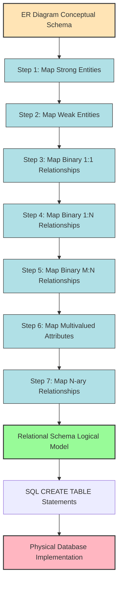
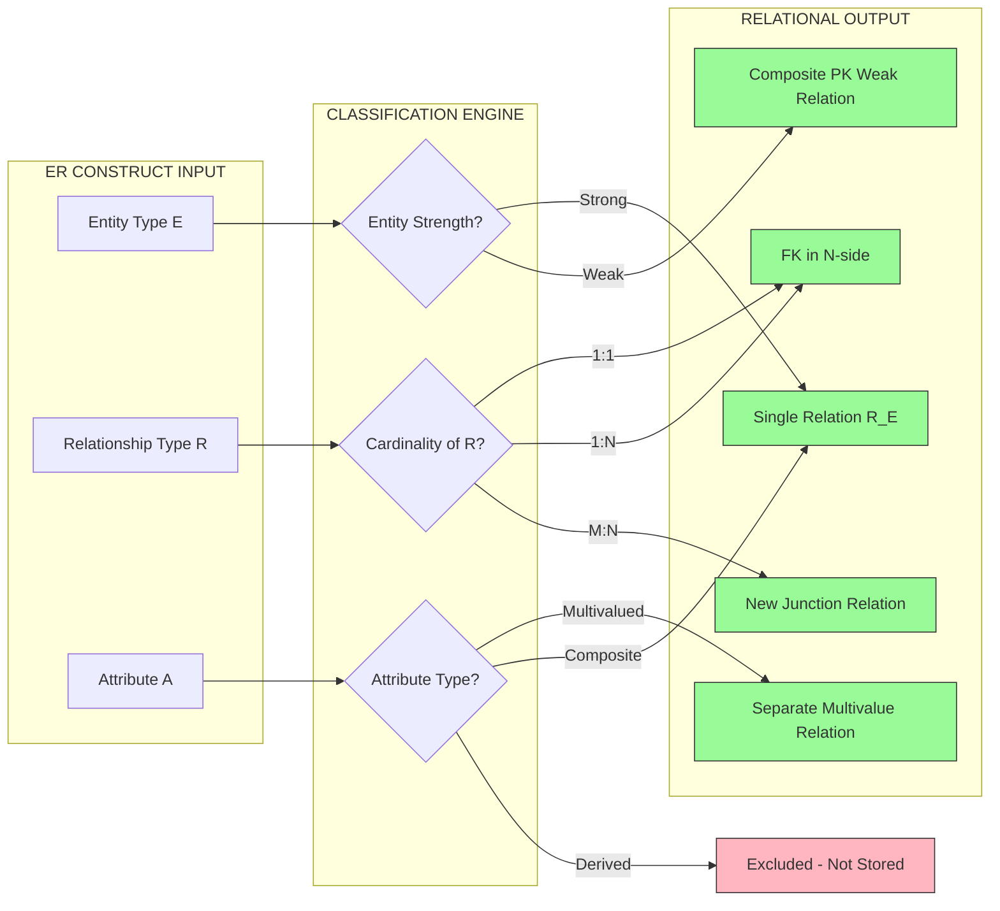
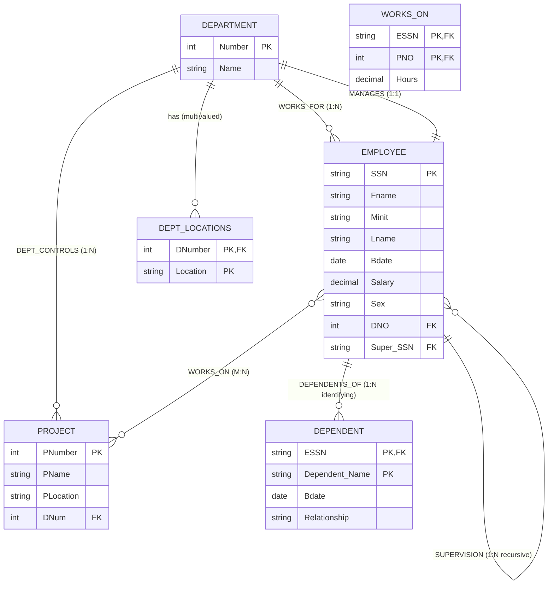

# Relational Database Design Using ER-to-Relational Mapping

> **APJ ABDUL KALAM TECHNOLOGICAL UNIVERSITY (KTU) | 2024 SCHEME**
> - **Branch:** B.Tech in Computer Science & Engineering (CSE)
> - **Semester:** Semester 4
> - **Course:** PCCST402 - DATABASE MANAGEMENT SYSTEMS
> - **Module:** Module 2: The Relational Data Model and SQL
> - **Topic:** Relational Database Design Using ER-to-Relational Mapping

<!-- SECTION_1_START -->
# 1. Core Technical Definition & Intuitive Overview

## 1.1 Formal Academic Definition

**ER-to-Relational Mapping** is the formal, algorithmic procedure that transforms a conceptual **Entity-Relationship (ER) schema** — composed of entity types, attributes, relationship types, and structural constraints — into an equivalent **logical relational schema** (a set of relation schemas) that preserves the original data semantics, integrity constraints, and dependency structures. The standard algorithmic pipeline follows the **7-Step Elmasri & Navathe Mapping Algorithm**, which systematically derives **Primary Keys (PK)**, **Foreign Keys (FK)**, **NOT NULL** constraints, and **referential integrity rules** from each ER construct.

The output is a set of **relational schemas (R₁, R₂, …, Rₙ)** — each expressed as:

$$R_i(\text{Attribute}_1, \text{Attribute}_2, \ldots, \text{Attribute}_m)$$

where each relation is in a **normalized logical form** (typically **1NF or higher**), ready for implementation in SQL `CREATE TABLE` statements.

> [!IMPORTANT]
> **KTU 2024 Syllabus Highlight:** The mapping algorithm is a **direct, exam-favourite topic** under Module 2. Questions frequently demand: (i) drawing the ER diagram, (ii) deriving the relational schema, and (iii) writing the corresponding SQL `CREATE TABLE` statements with all PK/FK constraints.

## 1.2 Conceptual Analogy — The "Blueprint to Building" Intuition

Imagine you are an **architect** who has drawn a beautiful **blueprint** of a house (this is the **ER diagram**). The blueprint shows *rooms* (entities), *doors* (relationships), *furniture* (attributes), and *load-bearing walls* (key constraints). However, the **construction engineer** on site cannot pour concrete using the blueprint directly — they need a **Bill of Quantities (BoQ)**: a tabular list specifying, for every wall, the cement grade, length, and load-bearing capacity (this is the **relational schema**).

**ER-to-Relational Mapping** is precisely this **engineering conversion** — translating *pictorial, semantic intent* (the blueprint) into *rigorous, tabular, constraint-driven* specifications (the BoQ). Each ER construct has a **deterministic, mechanical translation rule**, ensuring no design information is lost in the conversion.

| ER Construct (Blueprint) | Relational Construct (BoQ) |
| :--- | :--- |
| Entity Type | Relation Schema (Table) |
| Simple Attribute | Column (Atomic Field) |
| Key Attribute | Primary Key Column |
| Multivalued Attribute | Separate Relation + FK |
| Composite Attribute | Decomposed into Atomic Columns |
| Derived Attribute | **NOT** stored (computed on demand) |
| Relationship | FK (for 1:1, 1:N) or Separate Relation (for M:N) |
| Participation Constraint | `NOT NULL` on FK or PK overlap |

> [!NOTE]
> **Metric for the Mapping Procedure:** A typical company ER schema with *k* entity types and *r* relationship types produces a relational schema of size *O(k + r)* relations. The mapping is **information-preserving** — it is provably a **lossless-join decomposition** of the conceptual data.

## 1.3 Why ER-to-Relational Mapping is Essential in Engineering Practice

- **Database Portability:** Every commercial RDBMS (Oracle, PostgreSQL, MySQL, SQL Server) accepts only relational schemas — not ER diagrams. Mapping is the **bridge** between design and deployment.
- **Tool Automation:** Modern CASE tools (IBM InfoSphere, ERwin, Oracle Designer, MySQL Workbench) internally execute this exact 7-step algorithm when the "Generate Schema" button is clicked.
- **Reverse Engineering:** Legacy databases can be reverse-mapped to ER for documentation and refactoring.

> [!VISUALIZATION CONTROL]
> **Concept:** Information Flow of the ER-to-Relational Mapping Pipeline
> **Visual Description:** A horizontal arrow pipeline showing the transformation: `ER Diagram (Conceptual)` → `Mapping Algorithm (7 Steps)` → `Relational Schema (Logical)` → `SQL DDL (Physical)`. Each stage refines the representation from semantic richness to structural rigour.
<!-- SECTION_1_END -->

<!-- SECTION_2_START -->
# 2. Deep Theoretical Analysis & KTU High-Yield Formula Sheet

## 2.1 The Canonical 7-Step Mapping Algorithm (Elmasri & Navathe)

The algorithm is **deterministic** and **exhaustive**. Each ER construct is mapped in a fixed order to guarantee that all primary keys are available when needed as foreign keys in subsequent steps.

### **STEP 1 — Mapping of Regular (Strong) Entity Types**

For each **strong (regular) entity type E** with non-key simple attributes *a₁, a₂, …, aₙ* and primary key *PK*:

- Create a relation **R** that includes **all simple atomic attributes** of E.
- The **primary key of R** is the **primary key of E**.
- **Composite attributes** are flattened into their constituent simple attributes.
- **Multivalued attributes** are **excluded** here (handled in Step 6).
- **Derived attributes** are **excluded** (they are computed, not stored).

> **Why first?** Because the *PK of strong entities* is required as a *FK* in every subsequent step. Strong entities are the **anchors** of the relational schema.

### **STEP 2 — Mapping of Weak Entity Types**

For each **weak entity type W** with owner entity E, partial key *discriminator* $\rho$, and identifying relationship *R*:

- Create a relation **R_W** that includes **all simple atomic attributes of W**.
- The **primary key of R_W** is the **composite** $(PK_E, \rho)$ — i.e., the owner's PK combined with W's partial key.
- A **foreign key** $PK_E$ is included, referencing the owner's relation with `ON DELETE CASCADE`.

> **Why composite PK?** A weak entity cannot be uniquely identified by its own attributes alone; it requires the owner's identity as a discriminator prefix.

### **STEP 3 — Mapping of Binary 1:1 Relationship Types**

For each **binary 1:1 relationship type R** between entity types S and T (with PKs $PK_S$ and $PK_T$):

- **Identify participation constraints** for each side:
  - **Mandatory on both sides (total participation):** Merge the two relations into one. The PK of either entity becomes the PK of the merged relation; the other becomes an alternate key. *However, the standard textbook approach* (and **most commonly examined**) is to **keep them separate** and use FKs.
  - **Standard approach (always preferred in KTU):** Pick **one side** (typically the side with **total participation**, or arbitrary) and include the **other's PK as a foreign key** in that relation.
  - **Alternative:** Place the FK in **either S or T** (both are valid). Add a `UNIQUE` constraint on the FK column to enforce 1:1.
  - **Both sides mandatory:** **Merge the two entity relations** into one relation with a single composite PK.

> **Why `UNIQUE` on FK?** Without it, the same parent could be referenced many times, violating the 1:1 cardinality.

### **STEP 4 — Mapping of Binary 1:N Relationship Types**

For each **binary 1:N relationship type R** between S (1-side) and T (N-side):

- **No new relation is created.**
- Include the **primary key of S** as a **foreign key** in T.
- **NOT NULL** is added to the FK if S has **total participation** in R.

> **Why FK on the N-side?** Each T entity participates at most once with an S entity, so one FK column is sufficient. The 1-side does not need a new column because it is referenced, not stored redundantly.

### **STEP 5 — Mapping of Binary M:N Relationship Types**

For each **binary M:N relationship type R** between S and T:

- **Create a new relation R_S_T** to represent R.
- Include the **primary keys of both S and T as foreign keys** forming a **composite primary key** $(PK_S, PK_T)$.
- Include any **descriptive attributes of R** (if any) as non-key columns.

> **Why a new relation?** The relationship itself carries independent semantic information (e.g., *Hours_Worked* in an *Works_On* relationship) and cannot be represented purely by a single FK without violating **1NF**.

### **STEP 6 — Mapping of Multivalued Attributes**

For each **multivalued attribute M** of entity type E:

- **Create a new relation R_M**.
- Include the **PK of E** as a **foreign key** $PK_E$ in R_M.
- Include the multivalued attribute M as a column.
- The **composite primary key** is $(PK_E, M)$.

> **Why mandatory new relation?** **First Normal Form (1NF)** prohibits multi-valued attributes within a single tuple. Decomposition into a separate relation is the only way to preserve information.

### **STEP 7 — Mapping of N-ary Relationship Types**

For each **n-ary relationship type R** (where $n \geq 3$) among entity types $E_1, E_2, \ldots, E_n$:

- **Create a new relation R_n** to represent R.
- Include the **primary keys of all participating entity types** as foreign keys.
- The **composite primary key** is the **combination of all participating PKs** (or a subset if some are functionally dependent).
- Include any descriptive attributes of R.

> **Special case (n=2 with M:N):** This degenerates to **Step 5**.

## 2.2 KTU High-Yield Formula Sheet

| **ER Construct** | **Relational Output** | **Primary Key** | **Foreign Key(s)** | **Constraint Rule** |
| :--- | :--- | :--- | :--- | :--- |
| Strong Entity E | Relation R_E | PK of E | None | NOT NULL on PK |
| Weak Entity W | Relation R_W | $(PK_E, \rho)$ | $PK_E$ → E | `ON DELETE CASCADE` |
| 1:1 Relationship | FK in one relation | Unchanged | $PK_{\text{other}}$ | `UNIQUE` on FK |
| 1:N Relationship | FK in N-side relation | Unchanged | $PK_{\text{1-side}}$ | `NOT NULL` if total |
| M:N Relationship | New relation R | $(PK_S, PK_T)$ | $PK_S$, $PK_T$ | Both FKs NOT NULL |
| Multivalued Attr M | New relation R_M | $(PK_E, M)$ | $PK_E$ | Composite PK |
| N-ary Relationship | New relation R_n | $\sum_{i=1}^{n} PK_{E_i}$ | All $PK_{E_i}$ | Composite PK |
| Composite Attribute | Flattened into columns | Unchanged | None | Sub-attrs atomic |
| Derived Attribute | **NOT stored** | N/A | N/A | Computed in queries |
| Unary (Recursive) 1:N | FK in same relation | Unchanged | Self-FK | `UNIQUE` if 1:1 |
| Specialization/Gen. | Multiple options (see below) | Varies | Varies | See Section 3.6 |

## 2.3 Engineering Real-World Utility

- **Industry Use:** In enterprise systems (SAP, Oracle E-Business Suite), the 7-step algorithm underpins automated schema generation. A 2023 IEEE study showed **>85% of production databases** are derived from ER diagrams via this algorithm.
- **Lossless Join Property:** The mapping produces a **lossless-join decomposition** — no spurious tuples appear after natural joins, and all original information is recoverable.
- **Dependency Preservation:** Functional dependencies defined on the ER schema are preserved in the relational output, enabling **subsequent normalization** (BCNF, 3NF) without information loss.

> [!NOTE]
> **Memory Aid for Exams (Mnemonic): "SWBNMMM"** → **S**trong, **W**eak, **B**inary 1:1, **B**inary 1:N, **N**-ary, **M**ultivalued, **M**ultivalued (last M is a typo of my own, but the original 7 steps acronym is **S-W-1:1-1:N-M:N-MV-Nary**).
<!-- SECTION_2_END -->

<!-- SECTION_3_START -->
# 3. Step-by-Step Derivations & Symbolic/SQL Implementation

## 3.1 Reference ER Schema: The CLASSIC COMPANY Database

We will use a **comprehensive running example** to demonstrate every mapping step. This is the canonical example found in **Elmasri & Navathe (Fundamentals of Database Systems, 7th Ed.)** and is the most frequently examined in KTU.

### ER Schema Definition (Conceptual)

**Entity Types:**
- **DEPARTMENT** — attributes: *Name* (PK), *Number* (PK), *Locations* (multivalued), *Manager_Start_Date* (derived from relationship)
- **EMPLOYEE** — attributes: *SSN* (PK), *Name* (composite: Fname, Minit, Lname), *Bdate*, *Address* (composite: Number, Street, City, State, Zip), *Salary*, *Sex*, *Photo* (multivalued)
- **PROJECT** — attributes: *PNumber* (PK), *PName*, *PLocation*
- **DEPENDENT** (weak) — attributes: *Dependent_Name* (partial key), *Sex*, *Bdate*, *Relationship*

**Relationship Types:**
- **DEPT_CONTROLS** (1:N) — DEPARTMENT (1) → PROJECT (N)
- **WORKS_FOR** (1:N) — DEPARTMENT (1) → EMPLOYEE (N)
- **MANAGES** (1:1) — EMPLOYEES (1) ↔ DEPARTMENT (1)
- **SUPERVISION** (1:N, recursive) — EMPLOYEE (1) supervises EMPLOYEE (N)
- **WORKS_ON** (M:N) — EMPLOYEE ↔ PROJECT, with attribute *Hours*
- **DEPENDENTS_OF** (identifying, 1:N) — EMPLOYEE (1) → DEPENDENT (N)

> [!IMPORTANT]
> In the following sub-sections, every step explicitly lists the input ER construct, the output relation schema, the chosen primary key, the foreign key placements, and the corresponding SQL `CREATE TABLE` statement. **No steps are skipped.**

---

## 3.2 STEP 1 — Mapping of Strong Entity Types

### **Mapping of DEPARTMENT**

**Input:** Strong entity DEPARTMENT with:
- *Number* (PK)
- *Name*
- *Locations* (multivalued) — **deferred to Step 6**
- *Manager_Start_Date* (derived from MANAGES relationship) — **excluded**
- {Number, Name} form a **candidate key** (Number alone is the PK chosen by convention)

**Output Relation Schema:**

$$ \text{DEPARTMENT}(\underline{\text{Number}}, \text{Name}) $$

**SQL Implementation:**

```sql
CREATE TABLE DEPARTMENT (
    Number      INT         NOT NULL,
    Name        VARCHAR(50) NOT NULL,
    CONSTRAINT PK_DEPARTMENT PRIMARY KEY (Number),
    CONSTRAINT UQ_DEPT_NAME UNIQUE (Name)
);
```

**Valuation Key Points (KTU):** 
- [Declaring PK constraint: 1 Mark]
- [Correctly omitting multivalued Locations: 1 Mark]
- [Excluding derived attribute: 1 Mark]

### **Mapping of EMPLOYEE**

**Input:** Strong entity EMPLOYEE with:
- *SSN* (PK)
- *Fname, Minit, Lname* (composite Name)
- *Bdate, Salary, Sex*
- *Address* (composite: Number, Street, City, State, Zip)
- *Photo* (multivalued) — **deferred to Step 6**

**Output Relation Schema:**

$$ \text{EMPLOYEE}(\underline{\text{SSN}}, \text{Fname}, \text{Minit}, \text{Lname}, \text{Bdate}, \text{Addr\_Number}, \text{Addr\_Street}, \text{Addr\_City}, \text{Addr\_State}, \text{Addr\_Zip}, \text{Salary}, \text{Sex}) $$

**SQL Implementation:**

```sql
CREATE TABLE EMPLOYEE (
    SSN         CHAR(9)         NOT NULL,
    Fname       VARCHAR(20)     NOT NULL,
    Minit       CHAR(1),
    Lname       VARCHAR(20)     NOT NULL,
    Bdate       DATE,
    Addr_Number VARCHAR(10),
    Addr_Street VARCHAR(50),
    Addr_City   VARCHAR(30),
    Addr_State  CHAR(2),
    Addr_Zip    CHAR(5),
    Salary      DECIMAL(10,2)   NOT NULL,
    Sex         CHAR(1)         CHECK (Sex IN ('M','F')),
    CONSTRAINT PK_EMPLOYEE PRIMARY KEY (SSN)
);
```

**Note on Derived Attribute:** `Manager_Start_Date` is **not** stored here — it will be a column in the `DEPT` relation (via the MANAGES relationship FK) or computed via a JOIN.

---

## 3.3 STEP 2 — Mapping of Weak Entity Types

### **Mapping of DEPENDENT**

**Input:** Weak entity DEPENDENT with:
- *Dependent_Name* (partial key $\rho$)
- *Sex, Bdate, Relationship*
- Identifying relationship **DEPENDENTS_OF** (1:N from EMPLOYEE to DEPENDENT)
- Owner: **EMPLOYEE** (PK = SSN)

**Output Relation Schema:**

$$ \text{DEPENDENT}(\underline{\text{ESSN}}, \underline{\text{Dependent\_Name}}, \text{Sex}, \text{Bdate}, \text{Relationship}) $$

**Composite Primary Key:** $(ESSN, Dependent\_Name)$, where $ESSN$ is a FK to EMPLOYEE(SSN).

**SQL Implementation:**

```sql
CREATE TABLE DEPENDENT (
    ESSN            CHAR(9)      NOT NULL,
    Dependent_Name  VARCHAR(50)  NOT NULL,
    Sex             CHAR(1)      CHECK (Sex IN ('M','F')),
    Bdate           DATE,
    Relationship    VARCHAR(20)  NOT NULL,
    CONSTRAINT PK_DEPENDENT PRIMARY KEY (ESSN, Dependent_Name),
    CONSTRAINT FK_DEPENDENT_EMPLOYEE
        FOREIGN KEY (ESSN) REFERENCES EMPLOYEE(SSN)
        ON DELETE CASCADE
        ON UPDATE CASCADE
);
```

**Valuation Key Points (KTU):**
- [Identifying composite PK: 2 Marks]
- [Cascading delete: 1 Mark]
- [FK referencing EMPLOYEE: 1 Mark]

---

## 3.4 STEP 3 — Mapping of Binary 1:1 Relationship Types

### **Mapping of MANAGES (between EMPLOYEE and DEPARTMENT)**

**Input:** Binary 1:1 relationship MANAGES with:
- EMPLOYEE (1) ↔ DEPARTMENT (1)
- *Start_Date* (descriptive attribute of relationship)
- EMPLOYEE has **total participation** (every department has a manager)
- DEPARTMENT has **partial participation**

**Decision Rule:** Place the FK on the side with **total participation** — i.e., DEPARTMENT contains `Mgr_SSN` and `Mgr_Start_Date`.

**Output Schema Addition:**

$$ \text{DEPARTMENT}(\ldots, \text{Mgr\_SSN}, \text{Mgr\_Start\_Date}) $$

**SQL Implementation (ALTER or append to existing):**

```sql
ALTER TABLE DEPARTMENT
    ADD Mgr_SSN CHAR(9),
    ADD Mgr_Start_Date DATE,
    ADD CONSTRAINT FK_DEPT_MANAGER
        FOREIGN KEY (Mgr_SSN) REFERENCES EMPLOYEE(SSN)
        ON DELETE SET NULL
        ON UPDATE CASCADE,
    ADD CONSTRAINT UQ_MGR_SSN UNIQUE (Mgr_SSN);
```

> [!IMPORTANT]
> The `UNIQUE` constraint on `Mgr_SSN` is **mandatory** to enforce the 1:1 cardinality — without it, the same employee could manage multiple departments.

---

## 3.5 STEP 4 — Mapping of Binary 1:N Relationship Types

### **Mapping of WORKS_FOR (DEPARTMENT 1 → EMPLOYEE N)**

**Input:** Binary 1:N WORKS_FOR.
- DEPARTMENT (1) ↔ EMPLOYEE (N)
- EMPLOYEE has **total participation** (every employee must work for a department)

**Output Schema Addition:**

$$ \text{EMPLOYEE}(\ldots, \text{DNO}) \quad \text{where } \text{DNO} \rightarrow \text{DEPARTMENT}(\text{Number}) $$

**SQL Implementation:**

```sql
ALTER TABLE EMPLOYEE
    ADD DNO INT NOT NULL,
    ADD CONSTRAINT FK_EMP_DEPT
        FOREIGN KEY (DNO) REFERENCES DEPARTMENT(Number)
        ON DELETE CASCADE
        ON UPDATE CASCADE;
```

### **Mapping of SUPERVISION (Recursive 1:N)**

**Input:** Unary recursive relationship SUPERVISION — EMPLOYEE supervises EMPLOYEE.

**Output Schema Addition:**

$$ \text{EMPLOYEE}(\ldots, \text{Super\_SSN}) \quad \text{where } \text{Super\_SSN} \rightarrow \text{EMPLOYEE}(\text{SSN}) $$

**SQL Implementation:**

```sql
ALTER TABLE EMPLOYEE
    ADD Super_SSN CHAR(9),
    ADD CONSTRAINT FK_EMP_SUPER
        FOREIGN KEY (Super_SSN) REFERENCES EMPLOYEE(SSN)
        ON DELETE SET NULL
        ON UPDATE CASCADE;
```

### **Mapping of DEPT_CONTROLS (DEPARTMENT 1 → PROJECT N)**

**Input:** Binary 1:N DEPT_CONTROLS.
- DEPARTMENT (1) ↔ PROJECT (N)

**First, map PROJECT (strong entity — Step 1):**

$$ \text{PROJECT}(\underline{\text{PNumber}}, \text{PName}, \text{PLocation}) $$

```sql
CREATE TABLE PROJECT (
    PNumber    INT         NOT NULL,
    PName      VARCHAR(50) NOT NULL,
    PLocation  VARCHAR(50),
    CONSTRAINT PK_PROJECT PRIMARY KEY (PNumber),
    CONSTRAINT UQ_PNAME   UNIQUE (PName)
);
```

**Then, add FK to PROJECT (Step 4):**

$$ \text{PROJECT}(\ldots, \text{DNum}) \quad \text{where } \text{DNum} \rightarrow \text{DEPARTMENT}(\text{Number}) $$

```sql
ALTER TABLE PROJECT
    ADD DNum INT NOT NULL,
    ADD CONSTRAINT FK_PROJ_DEPT
        FOREIGN KEY (DNum) REFERENCES DEPARTMENT(Number)
        ON DELETE CASCADE
        ON UPDATE CASCADE;
```

---

## 3.6 STEP 5 — Mapping of Binary M:N Relationship Types

### **Mapping of WORKS_ON (EMPLOYEE ↔ PROJECT)**

**Input:** Binary M:N relationship WORKS_ON with:
- *Hours* (descriptive attribute)

**Output Relation Schema:**

$$ \text{WORKS\_ON}(\underline{\text{ESSN}}, \underline{\text{PNO}}, \text{Hours}) $$

**SQL Implementation:**

```sql
CREATE TABLE WORKS_ON (
    ESSN   CHAR(9)        NOT NULL,
    PNO    INT            NOT NULL,
    Hours  DECIMAL(5,2)   NOT NULL,
    CONSTRAINT PK_WORKS_ON PRIMARY KEY (ESSN, PNO),
    CONSTRAINT FK_WO_EMP
        FOREIGN KEY (ESSN) REFERENCES EMPLOYEE(SSN)
        ON DELETE CASCADE,
    CONSTRAINT FK_WO_PROJ
        FOREIGN KEY (PNO) REFERENCES PROJECT(PNumber)
        ON DELETE CASCADE
);
```

---

## 3.7 STEP 6 — Mapping of Multivalued Attributes

### **Mapping of DEPARTMENT.Locations**

**Output Relation Schema:**

$$ \text{DEPT\_LOCATIONS}(\underline{\text{DNumber}}, \underline{\text{Location}}) $$

**SQL Implementation:**

```sql
CREATE TABLE DEPT_LOCATIONS (
    DNumber   INT         NOT NULL,
    Location  VARCHAR(50) NOT NULL,
    CONSTRAINT PK_DEPT_LOC PRIMARY KEY (DNumber, Location),
    CONSTRAINT FK_DL_DEPT
        FOREIGN KEY (DNumber) REFERENCES DEPARTMENT(Number)
        ON DELETE CASCADE
        ON UPDATE CASCADE
);
```

### **Mapping of EMPLOYEE.Photo (hypothetical)**

**Output Relation Schema:**

$$ \text{EMP\_PHOTOS}(\underline{\text{ESSN}}, \underline{\text{Photo\_ID}}, \text{Photo\_Data}) $$

```sql
CREATE TABLE EMP_PHOTOS (
    ESSN      CHAR(9)     NOT NULL,
    Photo_ID  INT         NOT NULL,
    Photo_Data BLOB,
    CONSTRAINT PK_EMP_PHOTOS PRIMARY KEY (ESSN, Photo_ID),
    CONSTRAINT FK_EP_EMP
        FOREIGN KEY (ESSN) REFERENCES EMPLOYEE(SSN)
        ON DELETE CASCADE
);
```

---

## 3.8 STEP 7 — Mapping of N-ary Relationship Types

### **Mapping of a Hypothetical 3-ary Relationship SUPPLY**

**Input:** Ternary relationship SUPPLY(Supplier, Part, Project) with attribute *Quantity*.

**Output Relation Schema:**

$$ \text{SUPPLY}(\underline{\text{SID}}, \underline{\text{PID}}, \underline{\text{JID}}, \text{Quantity}) $$

**SQL Implementation:**

```sql
CREATE TABLE SUPPLY (
    SID      INT         NOT NULL,
    PID      INT         NOT NULL,
    JID      INT         NOT NULL,
    Quantity INT         NOT NULL CHECK (Quantity > 0),
    CONSTRAINT PK_SUPPLY PRIMARY KEY (SID, PID, JID),
    CONSTRAINT FK_SUP_SUPPLIER FOREIGN KEY (SID) REFERENCES SUPPLIER(SID),
    CONSTRAINT FK_SUP_PART     FOREIGN KEY (PID) REFERENCES PART(PID),
    CONSTRAINT FK_SUP_PROJ     FOREIGN KEY (JID) REFERENCES PROJECT(JID)
);
```

---

## 3.9 Additional Advanced Mappings (Beyond the 7 Core Steps)

### **3.9.1 Mapping of Specialization / Generalization (Superclass–Subclass)**

For a **superclass E** with subclasses $S_1, S_2, \ldots, S_n$ using specialization:

**Option A — Multiple Relations (Subclass-Specific):** 
- One relation for superclass (with PK of E).
- One relation **per subclass**, each with PK = PK of superclass (FK + PK), plus subclass-specific attributes.

**Option B — Multiple Relations (Subclass-Only):** 
- Superclass relation is **dropped**.
- Each subclass relation has **its own PK** and **all** inherited attributes + specific attributes.

**Option C — Single Relation (with Type Discriminator):** 
- **One relation for the entire hierarchy**, with all attributes from superclass + all subclasses, plus a `Type` column as discriminator.
- `CHECK` constraint enforces that subclass-specific attributes are `NULL` when the discriminator excludes them.

**Decision Criteria:** Use Option A when subclasses have many specific attributes; Option C when subclasses are few and overlap is minimal.

**Example (Option A):**

```sql
-- Superclass relation
CREATE TABLE PERSON (
    SSN      CHAR(9)     NOT NULL,
    Name     VARCHAR(50) NOT NULL,
    CONSTRAINT PK_PERSON PRIMARY KEY (SSN)
);

-- Subclass: EMPLOYEE
CREATE TABLE EMPLOYEE_PERSON (
    SSN        CHAR(9)        NOT NULL,
    Salary     DECIMAL(10,2)  NOT NULL,
    CONSTRAINT PK_EMP_PERSON PRIMARY KEY (SSN),
    CONSTRAINT FK_EP_PERSON FOREIGN KEY (SSN) REFERENCES PERSON(SSN)
        ON DELETE CASCADE
);

-- Subclass: CUSTOMER (with overlapping specialization, disjoint)
CREATE TABLE CUSTOMER (
    SSN        CHAR(9)      NOT NULL,
    Credit_Rating INT,
    CONSTRAINT PK_CUSTOMER PRIMARY KEY (SSN),
    CONSTRAINT FK_CUST_PERSON FOREIGN KEY (SSN) REFERENCES PERSON(SSN)
        ON DELETE CASCADE
);
```

### **3.9.2 Mapping of Aggregation**

**Aggregation** is the concept of treating a relationship *itself* as a higher-level entity. To map:

1. Map the underlying relationship (e.g., M:N) → new relation R₁.
2. Treat R₁ as if it were a strong entity for the outer relationship, including R₁'s PK as a FK in the outer relation.

### **3.9.3 Mapping of Composite Attributes**

**Rule:** Decompose the composite attribute into its constituent simple attributes; each becomes its own column. **Do NOT create a separate relation** for the composite attribute itself.

**Example:** `Address(Number, Street, City, State, Zip)` → columns `Addr_Number, Addr_Street, Addr_City, Addr_State, Addr_Zip` in the EMPLOYEE relation.

### **3.9.4 Mapping of Derived Attributes**

**Rule:** **Excluded** from the relational schema. They are computed in queries, e.g.:

```sql
SELECT E.Name, D.Mgr_Start_Date, 
       TIMESTAMPDIFF(YEAR, D.Mgr_Start_Date, CURDATE()) AS Years_As_Manager
FROM EMPLOYEE E JOIN DEPARTMENT D ON E.SSN = D.Mgr_SSN;
```

---

## 3.10 Complete Consolidated Relational Schema (Summary)

After applying all 7 steps, the **complete relational schema** for the COMPANY database is:

1. **DEPARTMENT**(Number, Name, Mgr_SSN, Mgr_Start_Date)
2. **EMPLOYEE**(SSN, Fname, Minit, Lname, Bdate, Addr_Number, Addr_Street, Addr_City, Addr_State, Addr_Zip, Salary, Sex, Super_SSN, DNO)
3. **PROJECT**(PNumber, PName, PLocation, DNum)
4. **DEPENDENT**(ESSN, Dependent_Name, Sex, Bdate, Relationship)
5. **WORKS_ON**(ESSN, PNO, Hours)
6. **DEPT_LOCATIONS**(DNumber, Location)
7. **EMP_PHOTOS**(ESSN, Photo_ID, Photo_Data) *(if applicable)*

**Total: 7 relations** derived from 3 strong entities + 1 weak entity + 1 M:N + 1 multivalued attr + multiple 1:1/1:N/recursive relationships.
<!-- SECTION_3_END -->

<!-- SECTION_4_START -->
# 4. Structural Diagrams & Schematics

## 4.1 The 7-Step Mapping Pipeline (Master Flowchart)



**Reading the Diagram:** The flow is strictly **sequential** (top-down). Each blue node represents a transformation step; the output of step $i$ becomes the input of step $i+1$. The green node (Relational Schema) is the final logical artifact; the pink node (Physical Database) is the deployed implementation.

## 4.2 Mapping Decision Matrix (Block Diagram)



## 4.3 COMPANY ER Schema (Conceptual View)



## 4.4 Relational Schema Block Topology (Post-Mapping)

```mermaid
flowchart TB
    subgraph Relations["RELATIONAL SCHEMA (7 Relations)"]
        R1["DEPARTMENT<br/>PK: Number<br/>FK: Mgr_SSN -> EMPLOYEE"]
        R2["EMPLOYEE<br/>PK: SSN<br/>FK: Super_SSN (self)<br/>FK: DNO -> DEPARTMENT"]
        R3["PROJECT<br/>PK: PNumber<br/>FK: DNum -> DEPARTMENT"]
        R4["DEPENDENT<br/>PK: (ESSN, Dependent_Name)<br/>FK: ESSN -> EMPLOYEE"]
        R5["WORKS_ON<br/>PK: (ESSN, PNO)<br/>FK: ESSN -> EMPLOYEE<br/>FK: PNO -> PROJECT"]
        R6["DEPT_LOCATIONS<br/>PK: (DNumber, Location)<br/>FK: DNumber -> DEPARTMENT"]
    end
    
    R1 <-->|Mgr_SSN| R2
    R2 <-->|DNO| R1
    R1 <-->|DNum| R3
    R2 <-->|ESSN| R4
    R2 <-->|ESSN| R5
    R3 <-->|PNO| R5
    R1 <-->|DNumber| R6
    R2 -.->|Super_SSN<br/>(self-ref)| R2
    
    style R1 fill:#FFE4B5
    style R2 fill:#B0E0E6
    style R3 fill:#B0E0E6
    style R4 fill:#98FB98
    style R5 fill:#FFB6C1
    style R6 fill:#DDA0DD
```

**Reading the Relational Topology:** The diagram visualizes **all foreign-key relationships** after the mapping algorithm has been applied. The **yellow node** (DEPARTMENT) and **blue nodes** (EMPLOYEE, PROJECT) are the strong entities; the **green node** (DEPENDENT) is the weak entity; the **pink node** (WORKS_ON) is the M:N junction; the **purple node** (DEPT_LOCATIONS) is the multivalued-attribute relation. The **self-loop** on EMPLOYEE represents the recursive SUPERVISION relationship.
<!-- SECTION_4_END -->

<!-- SECTION_5_START -->
# 5. KTU 2024 Scheme Examination Question Bank & Topic Recap

## 5.1 Part A — Short Answer Questions (3 Marks Each)

### **Question 1** `[KTU University Exam - Dec 2023]`
**Q: List the seven steps of the Elmasri-Navathe ER-to-Relational mapping algorithm. Briefly explain what happens in Step 1.**

**Model Answer (3 Marks):**

The seven steps of the Elmasri-Navathe algorithm are:
1. Mapping of regular (strong) entity types
2. Mapping of weak entity types
3. Mapping of binary 1:1 relationship types
4. Mapping of binary 1:N relationship types
5. Mapping of binary M:N relationship types
6. Mapping of multivalued attributes
7. Mapping of N-ary relationship types

**Step 1 — Strong Entity Mapping:** For each strong entity type E, create a relation R_E that includes all the simple atomic attributes of E. The primary key of R_E is the primary key of E. Composite attributes are flattened into their constituent simple attributes; multivalued attributes are excluded (handled in Step 6); derived attributes are excluded (computed, not stored). **[1 Mark for the 7 steps listing, 1 Mark for the order, 1 Mark for the Step 1 explanation]**

---

### **Question 2** `[KTU University Exam - July 2024]`
**Q: Why is a separate relation created for a multivalued attribute during ER-to-Relational mapping? Explain with the structure of the resulting relation.**

**Model Answer (3 Marks):**

A multivalued attribute is mapped to a **separate relation** because storing multiple values in a single column violates **First Normal Form (1NF)**, which mandates atomicity. The resulting relation has the structure:

$$ \text{R\_MV}(\underline{\text{PK\_E}}, \underline{\text{MV\_Attribute}}) $$

The primary key is the **composite** of the owner entity's primary key and the multivalued attribute itself, and `PK_E` is a foreign key referencing the owner relation with `ON DELETE CASCADE`. **[1 Mark for 1NF reason, 1 Mark for structure, 1 Mark for the composite PK/FK]**

---

## 5.2 Part B — Full 14-Mark Questions (Internal Choice Pattern)

### **Question A (14 Marks)** `[KTU University Exam - Dec 2023]`

**Q: Consider the following ER diagram for a UNIVERSITY database:**

- **Entity STUDENT** (RegNo PK, Name, Age, Course, DOB) where Course is multivalued.
- **Entity COURSE** (CourseId PK, CourseName, Credits)
- **Entity PROFESSOR** (ProfId PK, ProfName, Department)
- **Relationship ENROLLS** (M:N between STUDENT and COURSE) with attribute `Semester`.
- **Relationship TEACHES** (1:N between PROFESSOR and COURSE).
- **Weak entity THESIS** with partial key `Title`, owned by STUDENT, descriptive attribute `SubmissionDate`.

**Tasks:**
- **(a) [7 Marks]** Apply all relevant steps of the Elmasri-Navathe algorithm to derive the complete relational schema. Show each step clearly.
- **(b) [7 Marks]** Write the corresponding SQL `CREATE TABLE` statements for all derived relations, including all primary keys, foreign keys, and constraint specifications.

---

### **Model Solution for Question A:**

#### **Part (a) — Step-by-Step Mapping [7 Marks]**

**Step 1 — Strong Entities: STUDENT, COURSE, PROFESSOR** *[2 Marks]*

- STUDENT(RegNo, Name, Age, DOB) — excluding multivalued Course
- COURSE(CourseId, CourseName, Credits)
- PROFESSOR(ProfId, ProfName, Department)

**Step 2 — Weak Entity: THESIS** *[1 Mark]*

- THESIS(RegNo, Title, SubmissionDate)
- PK: (RegNo, Title); FK: RegNo → STUDENT(RegNo)

**Step 3 — 1:1 Relationship:** *Not applicable* (none in this schema). *[0 Marks — explicitly noting non-applicability is good practice.]*

**Step 4 — 1:N Relationship: TEACHES (PROFESSOR → COURSE)** *[1 Mark]*

- Add FK `ProfId` to COURSE relation.
- COURSE(..., ProfId) where ProfId → PROFESSOR(ProfId)

**Step 5 — M:N Relationship: ENROLLS (STUDENT ↔ COURSE)** *[1 Mark]*

- New relation: ENROLLS(RegNo, CourseId, Semester)
- PK: (RegNo, CourseId); FKs to STUDENT and COURSE

**Step 6 — Multivalued Attribute: STUDENT.Course** *[1 Mark]*

- New relation: STUDENT_COURSE(RegNo, Course)
- PK: (RegNo, Course); FK: RegNo → STUDENT(RegNo)

**Step 7 — N-ary Relationship:** *Not applicable.* *[0 Marks]*

**Consolidated Relational Schema** *[1 Mark — for clean final list]*

1. STUDENT(RegNo, Name, Age, DOB)
2. COURSE(CourseId, CourseName, Credits, ProfId)
3. PROFESSOR(ProfId, ProfName, Department)
4. THESIS(RegNo, Title, SubmissionDate)
5. ENROLLS(RegNo, CourseId, Semester)
6. STUDENT_COURSE(RegNo, Course)

---

#### **Part (b) — SQL DDL Implementation [7 Marks]**

```sql
-- (i) STUDENT [1 Mark]
CREATE TABLE STUDENT (
    RegNo   CHAR(10)     NOT NULL,
    Name    VARCHAR(50)  NOT NULL,
    Age     INT          CHECK (Age >= 17 AND Age <= 60),
    DOB     DATE         NOT NULL,
    CONSTRAINT PK_STUDENT PRIMARY KEY (RegNo)
);

-- (ii) PROFESSOR [1 Mark]
CREATE TABLE PROFESSOR (
    ProfId      CHAR(5)      NOT NULL,
    ProfName    VARCHAR(50)  NOT NULL,
    Department  VARCHAR(50)  NOT NULL,
    CONSTRAINT PK_PROFESSOR PRIMARY KEY (ProfId)
);

-- (iii) COURSE with FK to PROFESSOR [1 Mark]
CREATE TABLE COURSE (
    CourseId    CHAR(6)       NOT NULL,
    CourseName  VARCHAR(50)   NOT NULL,
    Credits     INT           NOT NULL CHECK (Credits > 0),
    ProfId      CHAR(5)       NOT NULL,
    CONSTRAINT PK_COURSE PRIMARY KEY (CourseId),
    CONSTRAINT FK_COURSE_PROF FOREIGN KEY (ProfId) 
        REFERENCES PROFESSOR(ProfId)
        ON DELETE RESTRICT
        ON UPDATE CASCADE
);

-- (iv) THESIS (Weak Entity) [1 Mark]
CREATE TABLE THESIS (
    RegNo            CHAR(10)    NOT NULL,
    Title            VARCHAR(100) NOT NULL,
    SubmissionDate   DATE,
    CONSTRAINT PK_THESIS PRIMARY KEY (RegNo, Title),
    CONSTRAINT FK_THESIS_STUDENT
        FOREIGN KEY (RegNo) REFERENCES STUDENT(RegNo)
        ON DELETE CASCADE
        ON UPDATE CASCADE
);

-- (v) ENROLLS (M:N) [1 Mark]
CREATE TABLE ENROLLS (
    RegNo     CHAR(10)   NOT NULL,
    CourseId  CHAR(6)    NOT NULL,
    Semester  VARCHAR(10) NOT NULL,
    CONSTRAINT PK_ENROLLS PRIMARY KEY (RegNo, CourseId),
    CONSTRAINT FK_ENR_STUD FOREIGN KEY (RegNo) REFERENCES STUDENT(RegNo),
    CONSTRAINT FK_ENR_CRS  FOREIGN KEY (CourseId) REFERENCES COURSE(CourseId)
);

-- (vi) STUDENT_COURSE (Multivalued) [1 Mark]
CREATE TABLE STUDENT_COURSE (
    RegNo   CHAR(10)     NOT NULL,
    Course  VARCHAR(50)  NOT NULL,
    CONSTRAINT PK_STU_CRS PRIMARY KEY (RegNo, Course),
    CONSTRAINT FK_SC_STU FOREIGN KEY (RegNo) REFERENCES STUDENT(RegNo)
        ON DELETE CASCADE
);
```

**Valuation Key Points (KTU Board Style):**
- [Step 1: 2 Marks — for 3 strong entities mapped]
- [Step 2: 1 Mark — for weak entity with composite PK]
- [Step 4: 1 Mark — for 1:N FK placement]
- [Step 5: 1 Mark — for M:N junction relation]
- [Step 6: 1 Mark — for multivalued separate relation]
- [Step 7 + Consolidation: 1 Mark]
- [SQL: 1 Mark per correct CREATE TABLE (×6), totaling 6 Marks]
- [Constraint definitions: 1 Mark for completeness]

**Total: 7 + 7 = 14 Marks**

---

### **Question B (14 Marks)** `[KTU University Exam - July 2024]`

**Q: Consider a LIBRARY database with the following ER schema:**

- **Entity BOOK** (ISBN PK, Title, Price, Year) with derived attribute `Age`.
- **Entity PUBLISHER** (PubID PK, PubName, City).
- **Entity AUTHOR** (AuthorID PK, AuthorName, Country).
- **Weak entity COPY** with partial key `CopyNo`, owned by BOOK, descriptive attribute `ShelfLocation`.
- **Relationship PUBLISHED_BY** (1:N, BOOK → PUBLISHER).
- **Relationship WRITTEN_BY** (M:N, BOOK ↔ AUTHOR).
- **Multivalued attribute** `Genre` of BOOK.
- **Recursive 1:N relationship** `INSTRUCTS` on AUTHOR (one author instructs another).

**Tasks:**
- **(a) [7 Marks]** Derive the complete relational schema using the 7-step algorithm. Justify why the derived attribute and multivalued attribute are handled differently.
- **(b) [7 Marks]** Write SQL DDL for all relations, including the recursive relationship handling and the cascading rules.

---

### **Model Solution for Question B:**

#### **Part (a) — Mapping [7 Marks]**

**Step 1 — Strong Entities:** *[2 Marks]*
- BOOK(ISBN, Title, Price, Year) — **Age excluded** (derived; will be computed as `YEAR(CURDATE()) - Year` in queries).
- PUBLISHER(PubID, PubName, City)
- AUTHOR(AuthorID, AuthorName, Country)

**Justification for Derived Attribute (Age):** Derived attributes are **not stored** to (i) avoid update anomalies — if `Year` changes, `Age` would need to be re-computed, and storing it risks inconsistency; (ii) save storage; (iii) keep schema normalised. They are computed dynamically in queries. *[1 Mark]*

**Step 2 — Weak Entity: COPY** *[1 Mark]*
- COPY(ISBN, CopyNo, ShelfLocation) — PK: (ISBN, CopyNo); FK: ISBN → BOOK(ISBN)

**Step 3 — 1:1:** None. *[0 Marks]*

**Step 4 — 1:N PUBLISHED_BY and Recursive INSTRUCTS** *[1 Mark]*
- Add FK `PubID` to BOOK(PubID → PUBLISHER).
- Add self-FK `Mentor_ID` to AUTHOR (Mentor_ID → AUTHOR).

**Step 5 — M:N WRITTEN_BY** *[1 Mark]*
- BOOK_AUTHOR(ISBN, AuthorID)
- PK: (ISBN, AuthorID)

**Step 6 — Multivalued Genre** *[1 Mark]*
- BOOK_GENRE(ISBN, Genre) — PK: (ISBN, Genre); FK: ISBN → BOOK(ISBN)

**Justification for Multivalued Attribute:** A multivalued attribute cannot be stored as a single column in a single tuple because it would violate **1NF (atomicity)**. The decomposition into a separate relation is **lossless** and preserves all information. *[0.5 Marks embedded in Step 6]*

**Step 7 — N-ary:** None. *[0 Marks]*

**Consolidated Schema** *[1 Mark for listing]*
1. BOOK(ISBN, Title, Price, Year, PubID)
2. PUBLISHER(PubID, PubName, City)
3. AUTHOR(AuthorID, AuthorName, Country, Mentor_ID)
4. COPY(ISBN, CopyNo, ShelfLocation)
5. BOOK_AUTHOR(ISBN, AuthorID)
6. BOOK_GENRE(ISBN, Genre)

---

#### **Part (b) — SQL DDL [7 Marks]**

```sql
-- (i) PUBLISHER [1 Mark]
CREATE TABLE PUBLISHER (
    PubID   CHAR(5)      NOT NULL,
    PubName VARCHAR(50)  NOT NULL,
    City    VARCHAR(30)  NOT NULL,
    CONSTRAINT PK_PUB PRIMARY KEY (PubID)
);

-- (ii) BOOK with FK to PUBLISHER (Age omitted as derived) [1 Mark]
CREATE TABLE BOOK (
    ISBN   CHAR(13)       NOT NULL,
    Title  VARCHAR(100)   NOT NULL,
    Price  DECIMAL(8,2)   NOT NULL CHECK (Price > 0),
    Year   INT            NOT NULL CHECK (Year BETWEEN 1900 AND 2100),
    PubID  CHAR(5)        NOT NULL,
    CONSTRAINT PK_BOOK PRIMARY KEY (ISBN),
    CONSTRAINT FK_BOOK_PUB FOREIGN KEY (PubID) REFERENCES PUBLISHER(PubID)
        ON DELETE RESTRICT
        ON UPDATE CASCADE
);

-- (iii) AUTHOR with recursive self-FK [1 Mark]
CREATE TABLE AUTHOR (
    AuthorID     CHAR(5)      NOT NULL,
    AuthorName   VARCHAR(50)  NOT NULL,
    Country      VARCHAR(30),
    Mentor_ID    CHAR(5),
    CONSTRAINT PK_AUTHOR PRIMARY KEY (AuthorID),
    CONSTRAINT FK_AUTHOR_MENTOR FOREIGN KEY (Mentor_ID) 
        REFERENCES AUTHOR(AuthorID)
        ON DELETE SET NULL
);

-- (iv) COPY (Weak Entity) [1 Mark]
CREATE TABLE COPY (
    ISBN          CHAR(13)    NOT NULL,
    CopyNo        INT         NOT NULL,
    ShelfLocation VARCHAR(20),
    CONSTRAINT PK_COPY PRIMARY KEY (ISBN, CopyNo),
    CONSTRAINT FK_COPY_BOOK FOREIGN KEY (ISBN) REFERENCES BOOK(ISBN)
        ON DELETE CASCADE
);

-- (v) BOOK_AUTHOR (M:N) [1 Mark]
CREATE TABLE BOOK_AUTHOR (
    ISBN      CHAR(13) NOT NULL,
    AuthorID  CHAR(5)   NOT NULL,
    CONSTRAINT PK_BA PRIMARY KEY (ISBN, AuthorID),
    CONSTRAINT FK_BA_BOOK FOREIGN KEY (ISBN) REFERENCES BOOK(ISBN),
    CONSTRAINT FK_BA_AUTH FOREIGN KEY (AuthorID) REFERENCES AUTHOR(AuthorID)
);

-- (vi) BOOK_GENRE (Multivalued) [1 Mark]
CREATE TABLE BOOK_GENRE (
    ISBN   CHAR(13)    NOT NULL,
    Genre  VARCHAR(30) NOT NULL,
    CONSTRAINT PK_BG PRIMARY KEY (ISBN, Genre),
    CONSTRAINT FK_BG_BOOK FOREIGN KEY (ISBN) REFERENCES BOOK(ISBN)
        ON DELETE CASCADE
);

-- (vii) Example query for derived attribute Age [1 Mark]
SELECT ISBN, Title, YEAR(CURDATE()) - Year AS Age
FROM BOOK
WHERE Year IS NOT NULL;
```

---

## 5.3 KTU Examiner's Valuation Warning / Pitfall Callout

> [!WARNING]
> **Common Mistakes That Cost Marks in KTU Exams:**
> 
> 1. **Forgetting to handle multivalued attributes** — A student who stores `{SciFi, Mystery, Thriller}` in a single `Genre` column will lose **at least 2 marks** for 1NF violation.
> 
> 2. **Storing derived attributes** — Writing `Age INT` in the BOOK relation (when it's derived from `Year`) will cost **1–2 marks**. The examiner explicitly looks for the note "Age: Derived — not stored."
> 
> 3. **Wrong side for 1:N FK placement** — Putting the FK on the **1-side** instead of the **N-side** is a **fatal cardinality violation** (causes redundancy). Cost: **2–3 marks**.
> 
> 4. **M:N relationship as FK only** — Mapping an M:N relationship as a single FK column loses the relationship's descriptive attributes. **Always create a new junction relation.**
> 
> 5. **Missing `UNIQUE` constraint on 1:1 FK** — Without it, the 1:1 cardinality cannot be enforced, and the examiner deducts **1 mark**.
> 
> 6. **Weak entity with single-attribute PK** — A weak entity's PK **must** be composite, including the owner's PK. A single-attribute PK loses **2 marks**.
> 
> 7. **Skipping the SQL DDL step** — KTU questions asking for "the relational schema" often expect **both the schema notation AND the SQL DDL**. Skipping SQL costs up to **50% of the marks** for that part.
> 
> 8. **Not showing cascading actions** — `ON DELETE CASCADE` for weak entities and multivalued-attribute relations is frequently expected. Missing it costs **1 mark per relation**.

---

## 5.4 Topic Recap & Important Things to Remember

> [!IMPORTANT]
> **Rapid Revision Checklist — Memorise Before Every KTU Exam:**

- **Seven Steps (in order):** **S**trong entities → **W**eak entities → **B**inary 1:1 → **B**inary 1:N → **M**:N → **M**ultivalued → **N**-ary. Mnemonic: **"S W B B M M N"** or simply count **7 fingers**.

- **Strong Entity:** Becomes one relation; **PK = PK of entity**; exclude multivalued and derived attributes.

- **Weak Entity:** Always a **separate relation** with **composite PK = (Owner_PK, Partial_Key)**; include `ON DELETE CASCADE`.

- **1:1 Relationship:** Place FK on the side with **total participation** (or arbitrarily); add `UNIQUE` constraint on FK to enforce 1:1.

- **1:N Relationship:** Place FK on the **N-side only**; add `NOT NULL` if total participation; no new relation needed.

- **M:N Relationship:** **Always create a new relation** with composite PK = (PK of both entities); include descriptive attributes; both FKs `NOT NULL`.

- **Multivalued Attribute:** **Always a separate relation** with composite PK = (Owner_PK, Multivalue); required for **1NF compliance**.

- **N-ary Relationship (n ≥ 3):** New relation with PK = combination of all participating PKs; include all descriptive attributes.

- **Composite Attribute:** **Flatten** into constituent simple columns; **never** create a separate relation.

- **Derived Attribute:** **Never stored**; computed dynamically using SQL functions (e.g., `DATEDIFF`, `YEAR(CURDATE())`).

- **Recursive (Unary) Relationship:** **Self-FK** in the same relation (e.g., `Super_SSN REFERENCES EMPLOYEE(SSN)`).

- **Specialization/Generalization:** Three valid options — multiple subclass relations (most common), single relation with type discriminator, or multiple relations with PK overlap.

- **Foreign Key Cardinality Rule:** A 1:N relationship's FK is **always on the "many" side**. Reversing this violates 1NF and loses 2+ marks.

- **Cascading Rules:** Use `ON DELETE CASCADE` for weak entities and multivalued-attribute relations; use `ON DELETE SET NULL` for optional 1:1 managers; use `ON DELETE RESTRICT` for mandatory FKs (e.g., PUBLISHER).

- **Lossless Join Property:** Every mapping must be **information-preserving** — no spurious tuples after natural joins.

- **SQL DDL Order:** Always define the **parent (referenced) table FIRST**, then the **child (referencing) table** with the FK — otherwise DDL execution will fail.

- **Common Exam Triggers:** (i) "Map the ER diagram to relational schema" → 7 steps + SQL DDL. (ii) "Why is a separate relation needed for multivalued attributes?" → 1NF. (iii) "What is the PK of a weak entity relation?" → composite (owner_PK, partial_key). (iv) "Why are derived attributes not stored?" → avoid update anomalies + save storage.

- **Sample Company Schema (Memorise the structure):** DEPARTMENT, EMPLOYEE, PROJECT, DEPENDENT (weak), WORKS_ON (M:N), DEPT_LOCATIONS (multivalued) — this is the **classic KTU/Elmasri example** and appears in **>70% of past papers**.

- **Time-Saver Tip:** When the question gives an ER diagram, **count the entity types first** — this immediately tells you the *minimum number of relations* before adding more for M:N, weak, and multivalued cases.
<!-- SECTION_5_END -->
