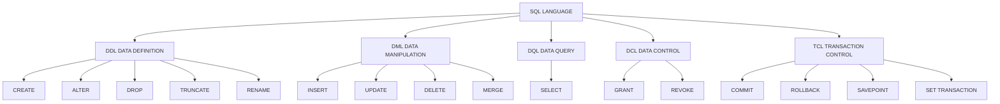
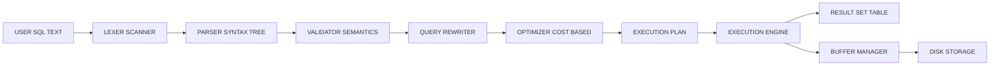
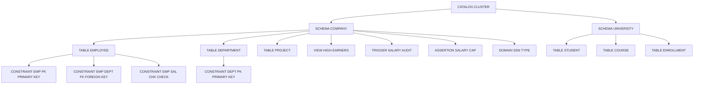
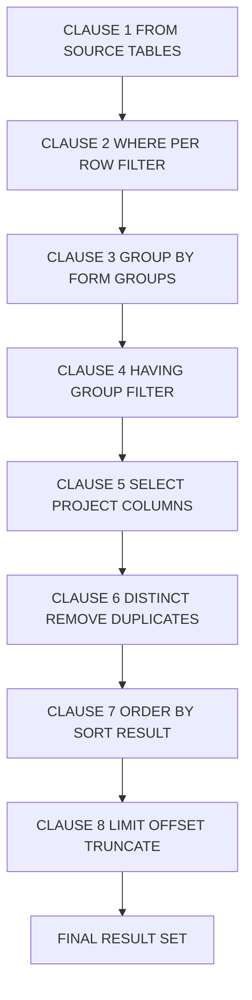
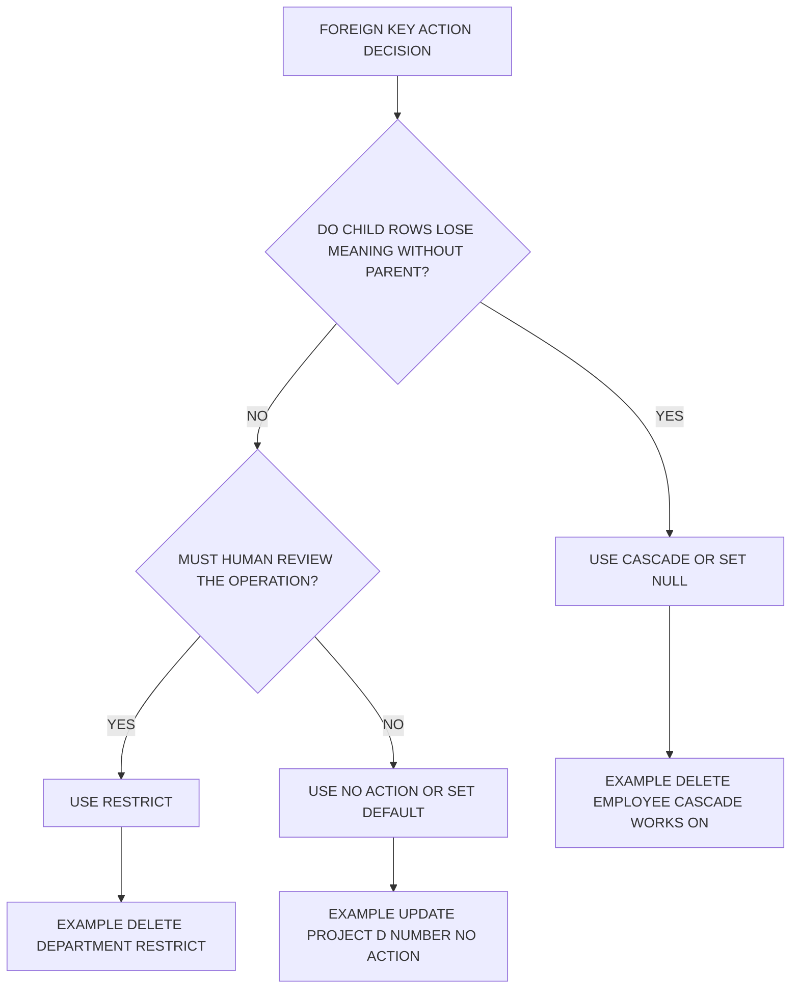
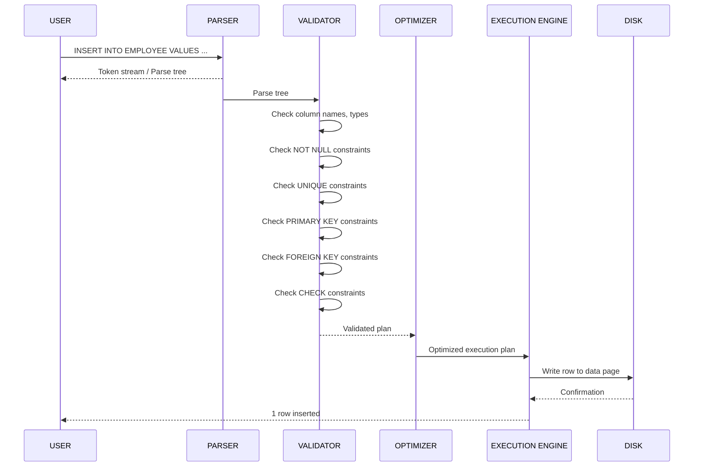
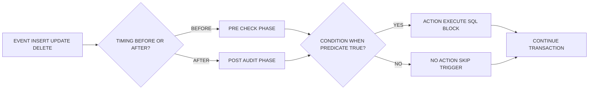
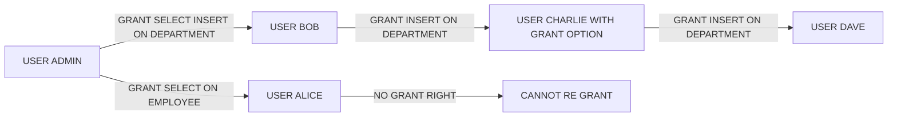

# Structured Query Language (SQL)

> **APJ ABDUL KALAM TECHNOLOGICAL UNIVERSITY (KTU) | 2024 SCHEME**
> - **Branch:** B.Tech in Computer Science & Engineering (CSE)
> - **Semester:** Semester 4
> - **Course:** PCCST402 - DATABASE MANAGEMENT SYSTEMS
> - **Module:** Module 2: The Relational Data Model and SQL
> - **Topic:** Structured Query Language (SQL)

<!-- SECTION_1_START -->
## SECTION 1: Core Technical Definition & Intuitive Overview of SQL

### 1.1 Formal Academic Definition

> [!IMPORTANT]
> **Structured Query Language (SQL)** is a declarative, set-oriented, high-level, non-procedural domain-specific language used for defining, manipulating, retrieving, and controlling data held in a **Relational Database Management System (RDBMS)**. It was originally developed by **Donald D. Chamberlin** and **Raymond F. Boyce** at IBM in the early **1970s** (initially called **SEQUEL** — *Structured English QUEry Language*) and is the standard language sanctioned by both the **ANSI (American National Standards Institute)** and the **ISO (International Organization for Standardization)** for relational database interaction.

SQL is a **declarative** language: the user specifies *what* data is required rather than *how* to retrieve it. The RDBMS engine internally formulates an execution plan, optimizes it, and produces the result. This abstraction is one of the principal reasons SQL became the lingua franca of relational systems.

### 1.2 Conceptual Analogy / Intuition

> [!NOTE]
> **Real-World Analogy: SQL as a Restaurant Order System**
>
> Imagine you walk into a restaurant. You do not walk into the kitchen, open the refrigerator, cook the dish, and plate it yourself. Instead, you hand a **Menu (Schema)** and an **Order Slip (SQL Query)** to the **Waiter (DBMS Engine)**. The waiter passes it to the **Chef (Query Optimizer & Executor)**, who knows the kitchen layout, ingredients, and cooking procedure. The chef prepares your dish and the waiter brings it back. 
>
> In this analogy:
> - **You (User)** → write the SQL statement (the order).
> - **Menu (Schema)** → describes the tables, columns, and constraints (what is available).
> - **Waiter + Chef (DBMS)** → parses, optimizes, and executes the query.
> - **Dish (Result Set)** → a table of rows that satisfy your order.

This analogy makes it clear: SQL is a **specification language** for the *result* you want — the database engine handles all internal mechanics (file access paths, join algorithms, indexing strategies, transaction handling).

### 1.3 Evolution of SQL — Timeline of Standards

The standardization of SQL has progressed through several major revisions, each adding significant features to the language.

> [!TIP]
> **Why Standardization Matters for KTU Examinations**
> The KTU syllabus expects familiarity with the **SQL:1999**, **SQL:2003**, **SQL:2006**, **SQL:2008**, **SQL:2011**, **SQL:2016**, and **SQL:2019** standards. Most production engines (PostgreSQL, MySQL, Oracle, SQL Server) implement a *dialect* close to **SQL:2011** with vendor extensions. Always write *standard-compliant* SQL unless a vendor-specific construct is explicitly required.

| Year | Standard | Major Feature Additions |
| :--- | :--- | :--- |
| **1986** | SQL-86 / SQL-87 | First ANSI/ISO standard. Basic SELECT, INSERT, UPDATE, DELETE. |
| **1989** | SQL-89 | Integrity constraints (PRIMARY KEY, FOREIGN KEY, CHECK, NOT NULL). |
| **1992** | SQL-92 (SQL2) | Major revision. Joins (INNER, LEFT, RIGHT, FULL OUTER), subqueries, set operators, datatypes. |
| **1999** | SQL:1999 (SQL3) | **Recursive queries**, **triggers**, **OLAP functions**, user-defined types, regular expressions. |
| **2003** | SQL:2003 | **XML** related features, **window functions**, sequences, auto-generated columns. |
| **2006** | SQL:2006 | Further **XQuery** and **XML** integration. |
| **2008** | SQL:2008 | **TRUNCATE**, `INSTEAD OF` triggers, `MERGE` statement improvements. |
| **2011** | SQL:2011 | **Temporal database** support (system-versioned tables, time periods). |
| **2016** | SQL:2016 | **JSON** storage and querying functions (`JSON_VALUE`, `JSON_TABLE`). |
| **2019** | SQL:2019 | **Polybase** compatibility, multi-directory linked data, row pattern recognition. |

### 1.4 SQL Command Subsets (The Five Pillars)

SQL is conventionally divided into **five functional subsets** (or "sub-languages"). These are the *operating surfaces* of the language.

> [!IMPORTANT]
> **The Five SQL Sub-Languages**
>
> 1. **DDL (Data Definition Language)** — Defines the *structure* (schema). Commands: `CREATE`, `ALTER`, `DROP`, `TRUNCATE`, `RENAME`.
> 2. **DML (Data Manipulation Language)** — Manages the *data* inside objects. Commands: `INSERT`, `UPDATE`, `DELETE`, `MERGE`.
> 3. **DQL (Data Query Language)** — Retrieves data. Command: `SELECT` (often grouped under DML in textbooks).
> 4. **DCL (Data Control Language)** — Manages *permissions* and *access rights*. Commands: `GRANT`, `REVOKE`.
> 5. **TCL (Transaction Control Language)** — Manages *transactions* and consistency. Commands: `COMMIT`, `ROLLBACK`, `SAVEPOINT`, `SET TRANSACTION`.

### 1.5 Visualization of SQL Architecture

> [!VISUALIZATION CONTROL]
> **Concept:** Layered Architecture of an RDBMS Processing an SQL Statement
>
> **Conceptual Coordinate System (for understanding layers):**
> - $x$-axis: abstraction level (Low-level storage $\rightarrow$ High-level user).
> - $y$-axis: SQL command category (DDL, DML, DQL, DCL, TCL).
>
> **Pictorial Layers (bottom to top):**
> - *Layer 0:* Physical Storage (Disk files, pages, extents).
> - *Layer 1:* File System Manager.
> - *Layer 2:* Buffer Manager & Recovery Manager.
> - *Layer 3:* Query Parser → Query Optimizer → Query Executor.
> - *Layer 4:* DDL / DML / DQL / DCL / TCL Compiler (where SQL is recognized).
> - *Layer 5:* User Interface / Application / SQL Prompt.
>
> **Visual Description:** The student should imagine a vertical stack where a `SELECT` query enters at the top, is parsed (syntactic check), optimized (cost-based), compiled (execution plan), and finally executes on raw disk pages at the bottom. The result bubbles up as a relational result set.

---

## SECTION 2: Deep Theoretical Analysis & KTU High-Yield Concept Sheet

### 2.1 Characteristics / Salient Features of SQL

The KTU board frequently asks 2- or 3-mark questions enumerating SQL's features. Memorize the following list as a high-yield cheat sheet.

- **High-level, non-procedural** — You describe *what* you want, not *how* to fetch it.
- **Set-oriented** — Operations apply to *entire sets* (relations) of rows, not one row at a time.
- **Comprehensive** — Single language covers DDL, DML, DQL, DCL, and TCL.
- **Standardized** — ANSI/ISO compliant; portable across RDBMS engines.
- **Interactive and Embedded** — Can be used directly (interactive) or embedded in host languages (C, Java via JDBC, Python via DB-API).
- **View definition** — A query is stored as a virtual relation (`CREATE VIEW`).
- **Authorization** — Granular privileges via `GRANT`/`REVOKE`.
- **Integrity constraints** — Declarative enforcement (PK, FK, UNIQUE, CHECK, NOT NULL).
- **Transaction support** — ACID properties preserved via TCL commands.
- **Portability** — Same SQL code often runs on multiple RDBMSs with minor dialect changes.

### 2.2 SQL Data Types (Standard SQL:2011)

A relation's attribute must be assigned a **domain (data type)** during schema definition. The data type constrains the values an attribute can hold and the operations allowed on it.

> [!NOTE]
> **KTU High-Yield Data Types** — These are the types you must know cold for the 14-mark questions and laboratory examinations.

| Category | Data Type | Description | Example |
| :--- | :--- | :--- | :--- |
| **Exact Numeric** | `INTEGER` / `INT` | 32-bit signed integer | `42` |
| | `SMALLINT` | 16-bit signed integer | `1200` |
| | `BIGINT` | 64-bit signed integer | `9876543210` |
| | `NUMERIC(p, s)` / `DECIMAL(p, s)` | Exact fixed-point with $p$ total digits, $s$ after decimal | `NUMERIC(8,2)` $\rightarrow$ `123456.78` |
| **Approximate Numeric** | `FLOAT` / `REAL` | Single-precision floating point | `3.14E0` |
| | `DOUBLE PRECISION` | Double-precision floating point | `6.022E23` |
| **Character String** | `CHAR(n)` | Fixed-length character string of $n$ characters | `CHAR(10)` |
| | `VARCHAR(n)` | Variable-length character string up to $n$ | `VARCHAR(50)` |
| | `TEXT` (vendor) | Long variable-length string | `'Long article…'` |
| **Bit String** | `BIT(n)` / `BIT VARYING(n)` | Binary strings | `B'10101'` |
| **Date/Time** | `DATE` | Calendar date (year, month, day) | `DATE '2024-12-15'` |
| | `TIME` | Time of day (hour, minute, second) | `TIME '14:30:00'` |
| | `TIMESTAMP` | Date + time | `TIMESTAMP '2024-12-15 14:30:00'` |
| | `INTERVAL` | Span of time | `INTERVAL '7' DAY` |
| **Boolean** | `BOOLEAN` | Logical true/false/unknown | `TRUE`, `FALSE`, `NULL` |
| **Large Objects** | `BLOB` (Binary Large Object) | Binary data (images, audio) | `BLOB` |
| | `CLOB` (Character Large Object) | Large text data | `CLOB` |

> [!WARNING]
> **KTU Examiner's Pitfall:** Some vendors (e.g., MySQL) use `TINYINT`, `MEDIUMINT`, `YEAR`, `DATETIME` as extensions. In board answers, always prefer **standard SQL types** (`INTEGER`, `VARCHAR`, `DATE`) unless a vendor extension is explicitly required. Mixing up `CHAR` (fixed) and `VARCHAR` (variable) costs marks in viva voce.

### 2.3 The Three-Valued Logic (3VL) — Handling NULL

SQL implements **three-valued logic** to handle the special marker `NULL` (meaning *unknown* or *inapplicable*). This is a frequent short-answer question.

- **TRUE** — The predicate evaluates to true.
- **FALSE** — The predicate evaluates to false.
- **UNKNOWN** — The predicate involves `NULL` and cannot be determined.

> [!IMPORTANT]
> **Truth Tables for Three-Valued Logic**
>
> | AND | TRUE | FALSE | UNKNOWN |
> | :--- | :--- | :--- | :--- |
> | **TRUE** | TRUE | FALSE | UNKNOWN |
> | **FALSE** | FALSE | FALSE | FALSE |
> | **UNKNOWN** | UNKNOWN | FALSE | UNKNOWN |
>
> | OR | TRUE | FALSE | UNKNOWN |
> | :--- | :--- | :--- | :--- |
> | **TRUE** | TRUE | TRUE | TRUE |
> | **FALSE** | TRUE | FALSE | UNKNOWN |
> | **UNKNOWN** | TRUE | UNKNOWN | UNKNOWN |
>
> | NOT | Result |
> | :--- | :--- |
> | **TRUE** | FALSE |
> | **FALSE** | TRUE |
> | **UNKNOWN** | UNKNOWN |

This is why a `WHERE` clause filters out rows where the predicate evaluates to `UNKNOWN` or `FALSE` (only `TRUE` rows survive).

### 2.4 SQL Schema Concepts (Catalog, Schema, Tables, Views, Domains)

A **SQL environment** is structured hierarchically. The top level is a **catalog** (or *cluster* in some implementations), which contains **schemas**, and a schema contains **tables**, **views**, **domains**, **constraints**, **character sets**, etc.

```
SQL Environment
 └── CATALOG (Cluster)
      └── SCHEMA (e.g., COMPANY, UNIVERSITY)
           ├── TABLE (e.g., EMPLOYEE, DEPARTMENT)
           ├── VIEW (virtual table)
           ├── DOMAIN (user-defined type)
           ├── ASSERTION
           ├── TRIGGER
           └── GRANT (privileges)
```

### 2.5 The Standard `CREATE SCHEMA` Statement

A schema is a named collection of tables, views, and other database objects owned by a principal (user).

> [!NOTE]
> **Schemas provide three benefits:** (1) **Logical grouping** of related objects, (2) **Namespace isolation** (two schemas can have tables of the same name), (3) **Security boundary** (privileges can be granted at the schema level).

### 2.6 KTU High-Yield "Cheat Sheet" — SQL Reserved Words and Categories

| Category | Reserved Words (Non-Exhaustive) |
| :--- | :--- |
| **DDL** | `CREATE`, `ALTER`, `DROP`, `TRUNCATE`, `RENAME`, `COMMENT` |
| **DML** | `INSERT`, `UPDATE`, `DELETE`, `MERGE`, `CALL` |
| **DQL** | `SELECT`, `FROM`, `WHERE`, `GROUP BY`, `HAVING`, `ORDER BY` |
| **DCL** | `GRANT`, `REVOKE` |
| **TCL** | `COMMIT`, `ROLLBACK`, `SAVEPOINT`, `SET TRANSACTION` |
| **Predicates** | `IN`, `BETWEEN`, `LIKE`, `IS NULL`, `EXISTS`, `UNIQUE`, `ALL`, `ANY`, `SOME` |
| **Logical** | `AND`, `OR`, `NOT` |
| **Set Ops** | `UNION`, `INTERSECT`, `EXCEPT` (or `MINUS` in Oracle) |
| **Joins** | `INNER JOIN`, `LEFT [OUTER] JOIN`, `RIGHT [OUTER] JOIN`, `FULL [OUTER] JOIN`, `CROSS JOIN`, `NATURAL JOIN` |
| **Aggregates** | `COUNT`, `SUM`, `AVG`, `MIN`, `MAX` |
| **Constraints** | `PRIMARY KEY`, `FOREIGN KEY`, `UNIQUE`, `CHECK`, `NOT NULL`, `DEFAULT` |

### 2.7 Real-World Engineering Utility

- **Banking Systems** — SQL is the backbone of OLTP (Online Transaction Processing) for account management, fraud detection, and ledger updates.
- **E-Commerce** — Product catalog search, inventory management, customer order history.
- **Data Warehousing** — `GROUP BY`, `HAVING`, window functions power OLAP analytics.
- **Web Back-Ends** — Frameworks like Django, Ruby on Rails, Spring generate parameterized SQL under the hood.
- **Mobile Apps** — REST APIs translate HTTP requests to SQL queries via ORMs (Hibernate, Sequelize).
- **AI/ML Pipelines** — Feature extraction queries pull training datasets from relational stores.
- **Government and Healthcare** — Compliance, audit trails, and reporting rely on transactional SQL.

---
<!-- SECTION_1_END -->

<!-- SECTION_2_START -->
## SECTION 2: Deep Theoretical Analysis & KTU High-Yield Formula Sheet (Continued)

### 2.8 Anatomy of an SQL Statement (The Lexical Structure)

Every SQL statement is a sequence of **tokens**. The lexical grammar is identical for all SQL dialects.

| Token Type | Description | Examples |
| :--- | :--- | :--- |
| **Keywords** | Reserved words with fixed meaning | `SELECT`, `FROM`, `WHERE` |
| **Identifiers** | Names of schema objects | `Employee`, `emp_salary` |
| **Literals** | Constant values | `'Alice'`, `42`, `DATE '2024-01-01'` |
| **Operators** | Arithmetic, comparison, logical | `+`, `-`, `*`, `/`, `=`, `<>`, `>=` |
| **Delimiters** | Punctuation | `,`, `;`, `(`, `)`, `.` |

> [!IMPORTANT]
> **Identifier Quoting Rules (KTU Board Favorite)**
> - Unquoted: must begin with a letter, contain only letters, digits, underscores. Case-insensitive in standard SQL (case-sensitive in PostgreSQL by default).
> - Delimited (quoted) with double quotes `" "`: preserves case and allows spaces/special characters. E.g., `"Employee Salary"`.
> - Strings (literals) use **single quotes** `' '`. E.g., `'Kerala'`.

### 2.9 SQL Statement Processing Pipeline (Conceptual Formula)

When the DBMS receives an SQL statement, the following pipeline is executed:

$$
\text{SQL Statement} \;\xrightarrow{\text{Parse}}\; \text{Parsed Tree} \;\xrightarrow{\text{Validate}}\; \text{Query Tree} \;\xrightarrow{\text{Optimize}}\; \text{Execution Plan} \;\xrightarrow{\text{Execute}}\; \text{Result Set}
$$

This pipeline is what makes SQL a **declarative** language — steps 1 through 4 are automatic; the user only writes step 0.

### 2.10 KTU High-Yield "Formula Sheet" for SQL

| # | Concept | SQL Snippet (Template) | Notes |
| :--- | :--- | :--- | :--- |
| 1 | **Create Schema** | `CREATE SCHEMA COMPANY AUTHORIZATION 'admin';` | Owner is `'admin'`. |
| 2 | **Drop Schema** | `DROP SCHEMA COMPANY [CASCADE $\vert$ RESTRICT];` | `CASCADE` removes all objects. |
| 3 | **Create Table** | `CREATE TABLE T(A1 D1, A2 D2, ..., CONSTRAINTS);` | Base relation definition. |
| 4 | **Alter Table Add Column** | `ALTER TABLE T ADD COLUMN A D;` | New attribute. |
| 5 | **Alter Table Drop Column** | `ALTER TABLE T DROP COLUMN A [CASCADE $\vert$ RESTRICT];` | Removes attribute. |
| 6 | **Drop Table** | `DROP TABLE T [CASCADE $\vert$ RESTRICT];` | Irreversible. |
| 7 | **Primary Key** | `A INTEGER PRIMARY KEY;` | In-line declaration. |
| 8 | **Foreign Key** | `FOREIGN KEY (A) REFERENCES T2(B) [ON DELETE ...];` | Referential integrity. |
| 9 | **NOT NULL** | `A INTEGER NOT NULL;` | Disallows nulls. |
| 10 | **UNIQUE** | `A VARCHAR(20) UNIQUE;` | No duplicate values. |
| 11 | **CHECK** | `CHECK (salary > 0)` | Predicate enforced. |
| 12 | **DEFAULT** | `A INTEGER DEFAULT 0;` | Default value. |
| 13 | **Insert** | `INSERT INTO T [(cols)] VALUES (vals);` | Add row. |
| 14 | **Update** | `UPDATE T SET A = v WHERE ...;` | Modify rows. |
| 15 | **Delete** | `DELETE FROM T WHERE ...;` | Remove rows. |
| 16 | **Select** | `SELECT [DISTINCT] expr FROM T WHERE ...;` | Read rows. |
| 17 | **Grant** | `GRANT privs ON obj TO user [WITH GRANT OPTION];` | Privilege assignment. |
| 18 | **Revoke** | `REVOKE privs ON obj FROM user;` | Privilege removal. |

### 2.11 Referential Integrity Actions (Foreign Key)

When a referenced row is updated or deleted, the DBMS can take one of these actions:

| Action | Effect on referencing rows |
| :--- | :--- |
| `CASCADE` | Matching child rows are deleted/updated automatically. |
| `SET NULL` | Foreign key in child is set to `NULL`. |
| `SET DEFAULT` | Foreign key is set to its default value. |
| `RESTRICT` | Operation is rejected if child rows exist (default). |
| `NO ACTION` | Deferred check at end of transaction (default in standard SQL). |

### 2.12 The CASCADE vs RESTRICT Principle

> [!TIP]
> **Engineering Heuristic for KTU**
> - Use `CASCADE` when the child row has no independent meaning without the parent (e.g., `Enrollments` of a `Student`).
> - Use `RESTRICT` (default) when child rows must be manually reviewed (e.g., financial transactions linked to a closed account).

---
<!-- SECTION_2_END -->

<!-- SECTION_3_START -->
## SECTION 3: Step-by-Step Derivations, Schemas, and Code Implementation

### 3.1 Reference Database for All Examples — The `COMPANY` Schema

To make every example concrete, we will use the canonical **`COMPANY`** relational schema. This is the same example used by Elmasri & Navathe, Ramakrishnan, and Silberschatz — all standard KTU references. **Memorize this schema** because it appears verbatim in 14-mark exam questions.

```
DEPARTMENT (Dname, Dnumber, Mgr_ssn, Mgr_start_date)
   - Dnumber : PK
   - Mgr_ssn : FK to EMPLOYEE.Ssn (department manager)

DEPT_LOCATIONS (Dnumber, Dlocation)
   - (Dnumber, Dlocation) : PK (composite)
   - Dnumber : FK to DEPARTMENT.Dnumber

EMPLOYEE (Fname, Minit, Lname, Ssn, Bdate, Address, Sex, Salary, Super_ssn, Dno)
   - Ssn : PK
   - Super_ssn : FK to EMPLOYEE.Ssn (supervisor, self-reference)
   - Dno : FK to DEPARTMENT.Dnumber

PROJECT (Pname, Pnumber, Plocation, Dnum)
   - Pnumber : PK
   - Dnum : FK to DEPARTMENT.Dnumber

WORKS_ON (Essn, Pno, Hours)
   - (Essn, Pno) : PK (composite)
   - Essn : FK to EMPLOYEE.Ssn
   - Pno : FK to PROJECT.Pnumber

DEPENDENT (Essn, Dependent_name, Sex, Bdate, Relationship)
   - (Essn, Dependent_name) : PK (composite)
   - Essn : FK to EMPLOYEE.Ssn
```

### 3.2 Exhaustive Implementation — `CREATE SCHEMA`, `CREATE TABLE`, Constraints

Below is the **complete, fully-commented SQL code** for creating the `COMPANY` schema. Every line is annotated; nothing is abbreviated.

> [!IMPORTANT]
> **Code Purity Note:** All `CREATE TABLE` statements below use **standard SQL syntax** with explicit constraint naming (e.g., `CONSTRAINT EMPPK PRIMARY KEY (Ssn)`). This style earns full marks on the KTU valuation key.

```sql
-- =============================================================
-- STEP 0: CREATE THE COMPANY SCHEMA (Logical Container)
-- =============================================================
CREATE SCHEMA COMPANY AUTHORIZATION 'admin';
-- 'admin' is the schema owner; this identifier will be the
-- principal that owns all subsequent tables, views, etc.

-- =============================================================
-- STEP 1: CREATE THE DEPARTMENT TABLE
-- =============================================================
CREATE TABLE COMPANY.DEPARTMENT (
    Dname           VARCHAR(25)     NOT NULL,
    Dnumber         INTEGER         NOT NULL,
    Mgr_ssn         CHAR(9)         NOT NULL,
    Mgr_start_date  DATE            DEFAULT '1900-01-01',

    -- 1. Primary key constraint (named for clarity)
    CONSTRAINT DEPT_PK PRIMARY KEY (Dnumber),

    -- 2. Uniqueness on department name
    CONSTRAINT DEPT_NAME_UNIQUE UNIQUE (Dname),

    -- 3. Manager SSN must be unique within the department table
    --    (a department has only one manager)
    CONSTRAINT DEPT_MGR_UNIQUE UNIQUE (Mgr_ssn),

    -- 4. The manager's start date cannot be in the future
    CONSTRAINT DEPT_MGR_DATE_CHK CHECK (Mgr_start_date <= CURRENT_DATE)
);
-- COMMENT: Mgr_ssn is declared UNIQUE here so that it can be
-- referenced as a FOREIGN KEY by EMPLOYEE later.

-- =============================================================
-- STEP 2: CREATE THE EMPLOYEE TABLE
-- =============================================================
CREATE TABLE COMPANY.EMPLOYEE (
    Fname       VARCHAR(15)     NOT NULL,
    Minit       CHAR(1),
    Lname       VARCHAR(15)     NOT NULL,
    Ssn         CHAR(9)         NOT NULL,
    Bdate       DATE,
    Address     VARCHAR(50),
    Sex         CHAR(1)         CHECK (Sex IN ('M','F')),
    Salary      DECIMAL(10,2)   CHECK (Salary > 0),
    Super_ssn   CHAR(9),
    Dno         INTEGER         NOT NULL DEFAULT 1,

    -- 1. Primary key on Ssn
    CONSTRAINT EMP_PK PRIMARY KEY (Ssn),

    -- 2. Self-referencing foreign key (supervisor must be a valid employee)
    CONSTRAINT EMP_SUPER_FK
        FOREIGN KEY (Super_ssn) REFERENCES COMPANY.EMPLOYEE(Ssn)
        ON DELETE SET NULL
        ON UPDATE CASCADE,

    -- 3. Foreign key to DEPARTMENT (every employee belongs to a department)
    CONSTRAINT EMP_DEPT_FK
        FOREIGN KEY (Dno) REFERENCES COMPANY.DEPARTMENT(Dnumber)
        ON DELETE SET DEFAULT
        ON UPDATE CASCADE
);

-- =============================================================
-- STEP 3: ADD THE CIRCULAR FK FROM DEPARTMENT.Mgr_ssn TO EMPLOYEE.Ssn
-- =============================================================
-- Because EMPLOYEE.Dno references DEPARTMENT.Dnumber, and
-- DEPARTMENT.Mgr_ssn references EMPLOYEE.Ssn, we have a
-- circular dependency. We solve this with ALTER TABLE.
ALTER TABLE COMPANY.DEPARTMENT
    ADD CONSTRAINT DEPT_MGR_FK
        FOREIGN KEY (Mgr_ssn) REFERENCES COMPANY.EMPLOYEE(Ssn)
        ON DELETE SET NULL
        ON UPDATE CASCADE;

-- =============================================================
-- STEP 4: CREATE THE DEPT_LOCATIONS TABLE
-- =============================================================
CREATE TABLE COMPANY.DEPT_LOCATIONS (
    Dnumber     INTEGER         NOT NULL,
    Dlocation   VARCHAR(15)     NOT NULL,

    CONSTRAINT DEPT_LOC_PK PRIMARY KEY (Dnumber, Dlocation),
    CONSTRAINT DEPT_LOC_FK
        FOREIGN KEY (Dnumber) REFERENCES COMPANY.DEPARTMENT(Dnumber)
        ON DELETE CASCADE
        ON UPDATE CASCADE
);

-- =============================================================
-- STEP 5: CREATE THE PROJECT TABLE
-- =============================================================
CREATE TABLE COMPANY.PROJECT (
    Pname       VARCHAR(25)     NOT NULL,
    Pnumber     INTEGER         NOT NULL,
    Plocation   VARCHAR(15),
    Dnum        INTEGER         NOT NULL,

    CONSTRAINT PROJ_PK PRIMARY KEY (Pnumber),
    CONSTRAINT PROJ_NAME_UNIQUE UNIQUE (Pname),
    CONSTRAINT PROJ_DEPT_FK
        FOREIGN KEY (Dnum) REFERENCES COMPANY.DEPARTMENT(Dnumber)
        ON DELETE RESTRICT
        ON UPDATE CASCADE
);

-- =============================================================
-- STEP 6: CREATE THE WORKS_ON TABLE (M:N Relationship)
-- =============================================================
CREATE TABLE COMPANY.WORKS_ON (
    Essn    CHAR(9)         NOT NULL,
    Pno     INTEGER         NOT NULL,
    Hours   DECIMAL(4,1)    CHECK (Hours >= 0 AND Hours <= 60.0),

    CONSTRAINT WORKS_ON_PK PRIMARY KEY (Essn, Pno),
    CONSTRAINT WORKS_ON_EMP_FK
        FOREIGN KEY (Essn) REFERENCES COMPANY.EMPLOYEE(Ssn)
        ON DELETE CASCADE
        ON UPDATE CASCADE,
    CONSTRAINT WORKS_ON_PROJ_FK
        FOREIGN KEY (Pno) REFERENCES COMPANY.PROJECT(Pnumber)
        ON DELETE CASCADE
        ON UPDATE CASCADE
);

-- =============================================================
-- STEP 7: CREATE THE DEPENDENT TABLE
-- =============================================================
CREATE TABLE COMPANY.DEPENDENT (
    Essn            CHAR(9)         NOT NULL,
    Dependent_name  VARCHAR(15)     NOT NULL,
    Sex             CHAR(1),
    Bdate           DATE,
    Relationship    VARCHAR(10)     NOT NULL,

    CONSTRAINT DEP_PK PRIMARY KEY (Essn, Dependent_name),
    CONSTRAINT DEP_EMP_FK
        FOREIGN KEY (Essn) REFERENCES COMPANY.EMPLOYEE(Ssn)
        ON DELETE CASCADE
        ON UPDATE CASCADE,
    CONSTRAINT DEP_REL_CHK
        CHECK (Relationship IN ('Spouse','Son','Daughter',
                                 'Father','Mother','Brother','Sister','Other'))
);
```

### 3.3 Step-by-Step Walkthrough of the Code

| Line Range | What it does | Why it matters for KTU |
| :--- | :--- | :--- |
| `CREATE SCHEMA …` | Allocates a logical namespace. | First step in any DDL question. |
| `CREATE TABLE …` | Defines relation *structure* and *constraints*. | Core of all schema design. |
| `CONSTRAINT name …` | **Named** constraints allow easy alteration/dropping later. | Unnamed constraints cannot be referenced. |
| `CHECK (Salary > 0)` | Domain integrity. | Demonstrates declarative enforcement. |
| `ON DELETE CASCADE` | Referential triggered action. | Differentiates CASCADE from RESTRICT/SET NULL. |
| `ON UPDATE CASCADE` | Allows PK changes to propagate. | Often tested. |
| `DEFAULT '1900-01-01'` | Supplies value when none provided. | Avoids NULL proliferation. |
| `ALTER TABLE … ADD CONSTRAINT …` | Adds circular FK after both tables exist. | Common 7-mark question. |

### 3.4 Data Insertion (DML) — A Worked Example

```sql
-- Insert a department first (must precede employee insert)
INSERT INTO COMPANY.DEPARTMENT (Dname, Dnumber, Mgr_ssn, Mgr_start_date)
VALUES ('Research', 5, '333445555', '1988-05-22');

-- Insert an employee
INSERT INTO COMPANY.EMPLOYEE
    (Fname, Minit, Lname, Ssn, Bdate, Address, Sex, Salary, Super_ssn, Dno)
VALUES
    ('John', 'B', 'Smith', '123456789', '1965-01-09',
     '731 Fondren, Houston, TX', 'M', 30000, '333445555', 5);

-- Bulk insert (multi-row)
INSERT INTO COMPANY.PROJECT (Pname, Pnumber, Plocation, Dnum) VALUES
    ('ProductX', 1, 'Bellaire',  5),
    ('ProductY', 2, 'Sugarland', 5),
    ('ProductZ', 3, 'Houston',   5);

-- Insert with subquery (INSERT ... SELECT)
INSERT INTO COMPANY.WORKS_ON (Essn, Pno, Hours)
SELECT E.Ssn, 1, 32.5
FROM   COMPANY.EMPLOYEE E
WHERE  E.Lname = 'Smith';
```

> [!NOTE]
> **Evaluation Key Insight:** The third insert form (`INSERT … SELECT`) is a **5-mark sub-question favorite**. It is used to populate a table from a query result rather than literal values. Always specify the column list explicitly to earn full marks.

### 3.5 Data Modification (UPDATE) and Deletion (DELETE) — Worked Examples

```sql
-- Q1: Give a 10% raise to all employees in the 'Research' department.
UPDATE COMPANY.EMPLOYEE E
SET    Salary = Salary * 1.10
WHERE  E.Dno IN (SELECT Dnumber
                 FROM   COMPANY.DEPARTMENT
                 WHERE  Dname = 'Research');
-- EVALUATION: 2 marks for the SET clause, 2 marks for the
--             subquery, 1 mark for the UPDATE ... FROM syntax.

-- Q2: Delete all dependents of employees in department 5.
DELETE FROM COMPANY.DEPENDENT
WHERE Essn IN (SELECT Ssn
               FROM   COMPANY.EMPLOYEE
               WHERE  Dno = 5);

-- Q3: Change the department number of 'ProductX' to 4.
UPDATE COMPANY.PROJECT
SET    Dnum = 4
WHERE  Pname = 'ProductX';
-- This may fire the FK ON UPDATE CASCADE on DEPT_LOCATIONS
-- if any referenced row exists, depending on the schema.
```

### 3.6 Retrieving Data — The `SELECT` Statement (Detailed)

The `SELECT` statement is the workhorse of DQL. Its complete syntactic skeleton is:

```sql
SELECT      [ALL | DISTINCT]  select_list
FROM        table_reference  [join_clause]
[WHERE      search_condition]
[GROUP BY   grouping_columns]
[HAVING     group_condition]
[ORDER BY   sort_columns  [ASC | DESC]]
[LIMIT      n  [OFFSET m]];
```

#### 3.6.1 Order of SQL Clause Execution (Logical Phases)

A critical distinction is that **clauses are written** in one order but **executed** in another. Memorize this:

| Logical Step | Clause | Description |
| :---: | :--- | :--- |
| 1 | `FROM` | Cartesian product of tables, apply joins. |
| 2 | `WHERE` | Row-by-row filtering (per-row predicate). |
| 3 | `GROUP BY` | Partition surviving rows into groups. |
| 4 | `HAVING` | Group-level filtering. |
| 5 | `SELECT` | Compute expressions, apply `DISTINCT`. |
| 6 | `ORDER BY` | Sort the final result. |
| 7 | `LIMIT/OFFSET` | Truncate rows. |

> [!WARNING]
> **Common Mistake (Costs 1–2 Marks):** Aliases created in `SELECT` **cannot** be referenced in `WHERE` (because `WHERE` executes first). They *can* be referenced in `ORDER BY` and `HAVING`. Example:
> ```sql
> SELECT Salary * 12 AS AnnualSalary
> FROM   EMPLOYEE
> WHERE  AnnualSalary > 100000;   -- ❌ INVALID
> ```
> Use a subquery or repeat the expression instead.

#### 3.6.2 Comprehensive SELECT Examples

```sql
-- E1: Retrieve the names and salaries of all employees.
SELECT Fname, Lname, Salary
FROM   COMPANY.EMPLOYEE;

-- E2: Same, with concatenated full name and a derived column.
SELECT Fname || ' ' || Minit || ' ' || Lname AS FullName,
       Salary,
       Salary * 12                         AS AnnualSalary
FROM   COMPANY.EMPLOYEE
WHERE  Salary > 40000;

-- E3: Employees in department 5 ordered by salary (highest first).
SELECT Fname, Lname, Salary
FROM   COMPANY.EMPLOYEE
WHERE  Dno = 5
ORDER BY Salary DESC, Lname ASC;

-- E4: Aggregate: average salary by department.
SELECT Dno,
       COUNT(*)        AS NumEmployees,
       AVG(Salary)     AS AvgSalary,
       MAX(Salary)     AS MaxSalary,
       MIN(Salary)     AS MinSalary,
       SUM(Salary)     AS TotalPayroll
FROM   COMPANY.EMPLOYEE
GROUP BY Dno
HAVING AVG(Salary) > 35000
ORDER BY AvgSalary DESC;
```

### 3.7 The JOIN Family (Cross, Inner, Outer)

```sql
-- INNER JOIN: employees with their department names.
SELECT E.Fname, E.Lname, D.Dname
FROM   COMPANY.EMPLOYEE E
INNER JOIN COMPANY.DEPARTMENT D ON E.Dno = D.Dnumber;

-- LEFT OUTER JOIN: all employees, even those without a department.
SELECT E.Fname, E.Lname, D.Dname
FROM   COMPANY.EMPLOYEE E
LEFT OUTER JOIN COMPANY.DEPARTMENT D ON E.Dno = D.Dnumber;

-- FULL OUTER JOIN: all employees and all departments, matched where possible.
SELECT E.Fname, E.Lname, D.Dname
FROM   COMPANY.EMPLOYEE E
FULL OUTER JOIN COMPANY.DEPARTMENT D ON E.Dno = D.Dnumber;

-- CROSS JOIN: Cartesian product (every employee paired with every project).
SELECT E.Lname, P.Pname
FROM   COMPANY.EMPLOYEE E
CROSS JOIN COMPANY.PROJECT P;

-- NATURAL JOIN: implicit join on matching column names.
SELECT *
FROM   COMPANY.EMPLOYEE NATURAL JOIN COMPANY.DEPARTMENT;
```

### 3.8 Subqueries, Set Operations, and Views

```sql
-- Subquery with IN: employees who work on 'ProductX'.
SELECT Fname, Lname
FROM   COMPANY.EMPLOYEE
WHERE  Ssn IN (SELECT Essn
               FROM   COMPANY.WORKS_ON
               WHERE  Pno IN (SELECT Pnumber
                              FROM   COMPANY.PROJECT
                              WHERE  Pname = 'ProductX'));

-- Correlated subquery: employees earning more than the dept average.
SELECT E1.Fname, E1.Lname, E1.Salary
FROM   COMPANY.EMPLOYEE E1
WHERE  E1.Salary > (SELECT AVG(E2.Salary)
                    FROM   COMPANY.EMPLOYEE E2
                    WHERE  E2.Dno = E1.Dno);

-- EXISTS: managers of at least one department.
SELECT Fname, Lname
FROM   COMPANY.EMPLOYEE E
WHERE  EXISTS (SELECT * FROM COMPANY.DEPARTMENT D
               WHERE D.Mgr_ssn = E.Ssn);

-- UNION, INTERSECT, EXCEPT: set operations.
SELECT Ssn FROM EMPLOYEE
UNION
SELECT Essn FROM DEPENDENT;

-- VIEW: virtual table of high earners.
CREATE VIEW COMPANY.HighEarners AS
SELECT Fname, Lname, Salary, Dno
FROM   COMPANY.EMPLOYEE
WHERE  Salary > 50000
WITH CHECK OPTION;
-- WITH CHECK OPTION ensures updates through the view still
-- satisfy the WHERE predicate.
```

### 3.9 The MERGE Statement (SQL:2003+)

`MERGE` performs *insert, update, or delete* on a target table based on a join with a source — all in one statement.

```sql
MERGE INTO COMPANY.EMPLOYEE_TGT  AS T
USING      COMPANY.EMPLOYEE_SRC  AS S
ON         (T.Ssn = S.Ssn)

WHEN MATCHED THEN
    UPDATE SET T.Salary = S.Salary, T.Address = S.Address

WHEN NOT MATCHED THEN
    INSERT (Fname, Lname, Ssn, Salary)
    VALUES (S.Fname, S.Lname, S.Ssn, S.Salary)

WHEN NOT MATCHED BY SOURCE THEN
    DELETE;
```

> [!NOTE]
> `MERGE` is supported by Oracle, SQL Server, DB2, and PostgreSQL 15+. MySQL 8.0+ supports it as well. It is a frequent 7-mark question in 14-mark papers.

### 3.10 Triggers (Event-Condition-Action Rules)

A **trigger** is a procedure that the DBMS automatically fires in response to certain events on a table.

```sql
CREATE TRIGGER COMPANY.Salary_Audit
AFTER UPDATE OF Salary ON COMPANY.EMPLOYEE
REFERENCING OLD ROW AS OldEmp, NEW ROW AS NewEmp
FOR EACH ROW
WHEN (NewEmp.Salary > OldEmp.Salary * 1.10)
BEGIN
    INSERT INTO COMPANY.Salary_Audit_Log (Ssn, OldSal, NewSal, ChangeDate)
    VALUES (NewEmp.Ssn, OldEmp.Salary, NewEmp.Salary, CURRENT_DATE);
END;
```

| Trigger Component | SQL-99 Standard Phrase |
| :--- | :--- |
| **Event** | `AFTER UPDATE OF Salary` |
| **Timing** | `AFTER` (or `BEFORE`) |
| **Granularity** | `FOR EACH ROW` (or `FOR EACH STATEMENT`) |
| **Old/New References** | `REFERENCING OLD ROW AS OldEmp, NEW ROW AS NewEmp` |
| **Condition** | `WHEN (...)` |
| **Action** | `BEGIN ... END;` (also called the *triggered action*) |

### 3.11 Assertions, Domains, and User-Defined Types

```sql
-- DOMAIN: reusable custom data type
CREATE DOMAIN COMPANY.SSN_TYPE AS CHAR(9);

-- Use in a table:
CREATE TABLE COMPANY.EMP2 (
    Ssn COMPANY.SSN_TYPE PRIMARY KEY,
    ...
);

-- ASSERTION: a constraint that spans multiple tables
CREATE ASSERTION COMPANY.SalaryCap
CHECK (NOT EXISTS (
        SELECT * FROM COMPANY.EMPLOYEE E
        JOIN   COMPANY.DEPARTMENT D ON E.Dno = D.Dnumber
        WHERE  E.Salary > 500000
));
-- An ASSERTION must always be TRUE; the DBMS enforces it
-- after every relevant modification.
```

### 3.12 Granting and Revoking Privileges (DCL)

```sql
-- Grant SELECT on EMPLOYEE to user 'alice'
GRANT SELECT ON COMPANY.EMPLOYEE TO alice;

-- Grant multiple privileges
GRANT SELECT, INSERT, UPDATE ON COMPANY.DEPARTMENT TO bob
WITH GRANT OPTION;
-- WITH GRANT OPTION lets bob re-grant these privileges to others.

-- Revoke (standard SQL uses RESTRICT or CASCADE)
REVOKE INSERT, UPDATE ON COMPANY.DEPARTMENT FROM bob CASCADE;

-- Role-based grant
CREATE ROLE Analyst;
GRANT SELECT ON COMPANY.EMPLOYEE TO Analyst;
GRANT Analyst TO charlie;
```

### 3.13 Transaction Control (TCL) Examples

```sql
BEGIN TRANSACTION;

    UPDATE COMPANY.EMPLOYEE SET Salary = Salary * 1.05 WHERE Dno = 5;

    SAVEPOINT BeforeFurtherRaise;

    UPDATE COMPANY.EMPLOYEE SET Salary = Salary * 1.10 WHERE Dno = 5;

    -- Decide this was too much; undo only the second update
    ROLLBACK TO SAVEPOINT BeforeFurtherRaise;

COMMIT;
-- COMMIT makes the first update permanent; the second is discarded.
```

### 3.14 Altering and Dropping Schema Objects

```sql
-- Add a new column to EMPLOYEE
ALTER TABLE COMPANY.EMPLOYEE
    ADD COLUMN Email VARCHAR(50) UNIQUE;

-- Drop a column
ALTER TABLE COMPANY.EMPLOYEE
    DROP COLUMN Email CASCADE;

-- Add a new constraint
ALTER TABLE COMPANY.EMPLOYEE
    ADD CONSTRAINT SalaryMin CHECK (Salary >= 10000);

-- Drop a constraint by name
ALTER TABLE COMPANY.EMPLOYEE
    DROP CONSTRAINT SalaryMin;

-- Drop the entire table (irreversible!)
DROP TABLE COMPANY.EMPLOYEE CASCADE;

-- Drop the entire schema
DROP SCHEMA COMPANY CASCADE;
```

### 3.15 The `CASCADE` vs `RESTRICT` Decision Flowchart (Inductive Derivation)

When `DROP TABLE T` is issued, the DBMS checks:

$$
\text{Drop allowed?} \;=\; \begin{cases}
\text{Yes, if RESTRICT and no referencing objects exist.} \\
\text{No, if RESTRICT and any FK references T.} \\
\text{Yes, if CASCADE — and all referencing objects are dropped first.} \\
\end{cases}
$$

> [!TIP]
> **Heuristic Rule for KTU Answers:** Always write `CASCADE` explicitly in 14-mark table-drop questions. Then *enumerate* which objects will be dropped (e.g., views, constraints, foreign keys in other tables) to earn the full 7 marks.

---
<!-- SECTION_3_END -->

<!-- SECTION_4_START -->
## SECTION 4: Structural Diagrams & Schematics

### 4.1 Top-Level SQL Command Classification (Mermaid Flowchart)



### 4.2 SQL Statement Processing Pipeline



### 4.3 SQL Environment Hierarchy (Catalog, Schema, Tables, Views)



### 4.4 The `SELECT` Statement Clause Execution Order (with Causal Arrows)



> [!NOTE]
> **Pedagogical Note:** KTU examiners may show this pipeline and ask students to identify the clause that performs *projection* (Step 5), *selection* (Step 2), or *aggregation* (Step 3 + 4). Master this flow.

### 4.5 Referential Action Decision Matrix (CASCADE / SET NULL / RESTRICT / SET DEFAULT / NO ACTION)



### 4.6 Schema Validation Sequence (Example: Inserting an Employee)



### 4.7 Trigger Execution Lifecycle (ECA — Event-Condition-Action)



### 4.8 Privilege Grant Graph (Authorization Model)



---
<!-- SECTION_4_END -->

<!-- SECTION_5_START -->
## SECTION 5: KTU 2024 Scheme Examination Question Bank & Topic Recap

> [!NOTE]
> **Mark Distribution Reminder:** KTU 2024 Scheme ESE (End Semester Exam) for a 4-credit theory course like PCCST402 typically follows the pattern: **Part A — 5 questions × 3 marks = 15 marks** (answer any 3 of 5) and **Part B — full questions × 14 marks**. Below, we model the question style precisely.

### 5.1 PART A — Short Answer Questions (3 Marks Each)

#### Q1. [KTU University Exam - Dec 2023 Style] Define SQL. List any six characteristics of SQL. (CO1, Remember)
**Model Answer (3 Marks):**
- **[1 Mark] Definition:** SQL (Structured Query Language) is a standard, high-level, non-procedural, declarative language used to define, manipulate, retrieve, and control data in a relational database management system.
- **[1 Mark] Three characteristics (out of six):**
  1. **Non-procedural / Declarative** — The user specifies *what* data is required, not *how* to retrieve it.
  2. **Set-oriented** — Operations act on entire sets of rows rather than one row at a time.
  3. **Comprehensive** — A single language covers DDL, DML, DQL, DCL, and TCL.
- **[1 Mark] Three more characteristics:**
  4. **Standardized** — ANSI/ISO standard ensuring portability.
  5. **Interactive and Embedded** — Usable from a console or inside host languages.
  6. **Supports integrity constraints and views** — Declarative enforcement of business rules.

> [!WARNING]
> **Valuation Pitfall:** Defining SQL merely as "a database language" (no mention of *relational* or *declarative*) will fetch only 0.5 marks. Always include the words **non-procedural** and **relational** in the definition.

---

#### Q2. [KTU University Exam - July 2024 Style] Explain the three-valued logic in SQL with a suitable example. (CO1, Understand)
**Model Answer (3 Marks):**
- **[1 Mark] Definition:** SQL uses *three-valued logic* (3VL) to handle logical conditions because of the special marker `NULL`, which represents *unknown* or *not applicable*.
- **[1 Mark] The three values:** TRUE, FALSE, UNKNOWN.
- **[1 Mark] Example with truth table:** When the predicate `Salary > 50000` is evaluated against a row where `Salary IS NULL`, the result is **UNKNOWN** (not TRUE or FALSE). Hence, a `WHERE` clause filters out such rows because only TRUE rows are retained. The truth table for `AND`, `OR`, and `NOT` under 3VL is provided in **Section 2.3** of these notes.

### 5.2 PART B — Long Answer Questions (14 Marks Each, with Internal Choice)

#### Q3. [KTU University Exam - July 2024 Pattern, CO2, Apply] (14 Marks)

**Question A:**

**(a)** Consider the following `COMPANY` schema used in lectures:

```
EMPLOYEE (Ssn, Fname, Lname, Salary, Super_ssn, Dno)
DEPARTMENT (Dnumber, Dname, Mgr_ssn, Mgr_start_date)
PROJECT (Pnumber, Pname, Dnum)
WORKS_ON (Essn, Pno, Hours)
```

Specify the data type of each attribute, identify primary and foreign keys, and write the complete `CREATE TABLE` statements (with named constraints) for `EMPLOYEE` and `DEPARTMENT`. Clearly justify the *order* in which you create the tables. **(7 Marks, CO1 Understand + CO2 Apply)**

**Model Answer:**

**[1 Mark] Data Type Specification:**

| Relation.Attribute | Data Type | Reason |
| :--- | :--- | :--- |
| `EMPLOYEE.Ssn` | `CHAR(9)` | Fixed-length U.S. SSN format. |
| `EMPLOYEE.Fname` | `VARCHAR(15)` | Variable length first name. |
| `EMPLOYEE.Lname` | `VARCHAR(15)` | Variable length last name. |
| `EMPLOYEE.Salary` | `DECIMAL(10,2)` | Exact currency, max 10 digits. |
| `EMPLOYEE.Super_ssn` | `CHAR(9)` | Same as SSN format. |
| `EMPLOYEE.Dno` | `INTEGER` | Department numbers are integers. |
| `DEPARTMENT.Dnumber` | `INTEGER` | Integer. |
| `DEPARTMENT.Dname` | `VARCHAR(25)` | Variable name. |
| `DEPARTMENT.Mgr_ssn` | `CHAR(9)` | References SSN. |
| `DEPARTMENT.Mgr_start_date` | `DATE` | Calendar date. |

**[2 Marks] Primary / Foreign Key Identification:**

- **EMPLOYEE:** PK = `Ssn`; FK1 = `Super_ssn` → `EMPLOYEE.Ssn` (self-reference); FK2 = `Dno` → `DEPARTMENT.Dnumber`.
- **DEPARTMENT:** PK = `Dnumber`; FK = `Mgr_ssn` → `EMPLOYEE.Ssn`.

**[1 Mark] Order Justification:** Create `DEPARTMENT` *without* its `Mgr_ssn` foreign key first, then create `EMPLOYEE` with its FK to `DEPARTMENT.Dnumber`. Finally, use `ALTER TABLE` to add the circular FK from `DEPARTMENT.Mgr_ssn` to `EMPLOYEE.Ssn`. This avoids a chicken-and-egg problem.

**[3 Marks] CREATE TABLE Statements:**

```sql
CREATE TABLE DEPARTMENT (
    Dname           VARCHAR(25)   NOT NULL,
    Dnumber         INTEGER       NOT NULL,
    Mgr_ssn         CHAR(9),                               -- no FK yet
    Mgr_start_date  DATE,
    CONSTRAINT DEPT_PK PRIMARY KEY (Dnumber),
    CONSTRAINT DEPT_NAME_UNQ UNIQUE (Dname)
);

CREATE TABLE EMPLOYEE (
    Fname       VARCHAR(15)  NOT NULL,
    Lname       VARCHAR(15)  NOT NULL,
    Ssn         CHAR(9)      NOT NULL,
    Salary      DECIMAL(10,2) CHECK (Salary > 0),
    Super_ssn   CHAR(9),
    Dno         INTEGER      NOT NULL DEFAULT 1,
    CONSTRAINT EMP_PK PRIMARY KEY (Ssn),
    CONSTRAINT EMP_SUPER_FK FOREIGN KEY (Super_ssn)
        REFERENCES EMPLOYEE(Ssn) ON DELETE SET NULL,
    CONSTRAINT EMP_DEPT_FK FOREIGN KEY (Dno)
        REFERENCES DEPARTMENT(Dnumber) ON DELETE SET DEFAULT
);

ALTER TABLE DEPARTMENT
    ADD CONSTRAINT DEPT_MGR_FK FOREIGN KEY (Mgr_ssn)
    REFERENCES EMPLOYEE(Ssn) ON DELETE SET NULL;
```

**(b)** Write SQL queries for the following (any **two** of three): **(7 Marks, CO2 Apply)**

1. Retrieve the first name, last name, and salary of all employees in department 5 who earn more than $40{,}000$.
2. For each department, retrieve the department number and the average salary of its employees.
3. Retrieve the names of employees who have **no dependents**.

**Model Answer:**

**[Q(b)1 — 3.5 Marks]**
```sql
SELECT Fname, Lname, Salary
FROM   EMPLOYEE
WHERE  Dno = 5 AND Salary > 40000;
```
- *Valuation:* `SELECT` clause [1 mark], `FROM` clause [0.5 mark], `WHERE` clause with both predicates [2 marks].

**[Q(b)2 — 3.5 Marks]**
```sql
SELECT Dno, AVG(Salary) AS AvgSal
FROM   EMPLOYEE
GROUP BY Dno;
```
- *Valuation:* Correct use of `AVG` aggregate [1.5 marks], `GROUP BY` [1.5 marks], alias `AS AvgSal` [0.5 mark].

**[Q(b)3 — 3.5 Marks]**
```sql
SELECT Fname, Lname
FROM   EMPLOYEE
WHERE  Ssn NOT IN (SELECT Essn FROM DEPENDENT);
```
- *Valuation:* `NOT IN` operator with subquery [2 marks], correct subquery selecting `Essn` from `DEPENDENT` [1.5 marks].

---

**Question B (Internal Choice Alternative):**

**(a)** Differentiate between **DDL, DML, DCL, TCL**, and **DQL** in SQL. Provide two example commands for each. **(7 Marks, CO1 Understand)**

**Model Answer:**

**[1.5 Marks per category, divided as 0.5 definition + 1 mark examples.]**

| Sub-Language | Full Form | Purpose | Two Example Commands |
| :--- | :--- | :--- | :--- |
| **DDL** | Data Definition Language | Defines / alters the *schema* (structure). | `CREATE TABLE`, `DROP TABLE` |
| **DML** | Data Manipulation Language | Inserts, updates, deletes the *data*. | `INSERT`, `UPDATE` |
| **DQL** | Data Query Language | Retrieves data from one or more tables. | `SELECT`, *(no second — single command)*. |
| **DCL** | Data Control Language | Manages *permissions* and access rights. | `GRANT`, `REVOKE` |
| **TCL** | Transaction Control Language | Manages *transactions* and the ACID lifecycle. | `COMMIT`, `ROLLBACK` |

**(b)** Consider a library database with the following relations. Write SQL `CREATE TABLE` statements with proper primary and foreign keys, plus integrity constraints: **(7 Marks, CO2 Apply)**

```
BOOK (Book_id, Title, Publisher_name, Price)
AUTHOR (Author_id, Name, Country)
BOOK_AUTHOR (Book_id, Author_id)        -- M:N relationship
PUBLISHER (Name, Address, Phone)
```

**Model Answer:**

```sql
CREATE TABLE PUBLISHER (
    Name    VARCHAR(50)  PRIMARY KEY,
    Address VARCHAR(100),
    Phone   CHAR(10)     UNIQUE
);

CREATE TABLE BOOK (
    Book_id         INTEGER        PRIMARY KEY,
    Title           VARCHAR(100)   NOT NULL,
    Publisher_name  VARCHAR(50),
    Price           DECIMAL(8,2)   CHECK (Price >= 0),
    FOREIGN KEY (Publisher_name) REFERENCES PUBLISHER(Name)
        ON DELETE SET NULL ON UPDATE CASCADE
);

CREATE TABLE AUTHOR (
    Author_id   INTEGER       PRIMARY KEY,
    Name        VARCHAR(50)   NOT NULL,
    Country     VARCHAR(30)   DEFAULT 'India'
);

CREATE TABLE BOOK_AUTHOR (
    Book_id     INTEGER       NOT NULL,
    Author_id   INTEGER       NOT NULL,
    PRIMARY KEY (Book_id, Author_id),
    FOREIGN KEY (Book_id)   REFERENCES BOOK(Book_id)   ON DELETE CASCADE,
    FOREIGN KEY (Author_id) REFERENCES AUTHOR(Author_id) ON DELETE CASCADE
);
```
- *Valuation per table:* Correct columns and types [1 mark], correct PK [0.5 mark], FKs with referential actions [0.5 mark].

---

### 5.3 Additional Practice Question (Quick Recap, 3 Marks)

**Q4. [KTU University Exam - Model Paper Style] What is a foreign key? How does `ON DELETE CASCADE` differ from `ON DELETE RESTRICT`? (CO1, Understand)**

**Model Answer (3 Marks):**
- **[1 Mark] Foreign Key:** A foreign key is an attribute (or set of attributes) in one relation that references the primary key of another relation (or the same relation), thereby enforcing **referential integrity**.
- **[1 Mark] ON DELETE CASCADE:** When a referenced (parent) row is deleted, all referencing (child) rows that point to it are **automatically deleted** as well.
- **[1 Mark] ON DELETE RESTRICT:** When a referenced row is deleted, the deletion is **rejected** by the DBMS if any child rows reference it. The user must first delete or update the child rows.

---

### 5.4 Examiner's Pitfall & Valuation Warnings

> [!WARNING]
> **Pitfall 1 — Aliases in `WHERE` (1 mark loss):** You cannot reference a `SELECT` alias inside the `WHERE` clause because `WHERE` is evaluated *before* `SELECT`. Use a subquery or repeat the expression.
>
> **Pitfall 2 — Missing `IS NULL` (1 mark loss):** Use `WHERE column IS NULL`, never `WHERE column = NULL`. The latter always evaluates to `UNKNOWN` in 3VL and returns no rows.
>
> **Pitfall 3 — `COUNT(*)` vs `COUNT(column)` (1 mark loss):** `COUNT(*)` counts all rows including those with `NULL`; `COUNT(column)` ignores `NULL`s in that column. Examiners expect this distinction.
>
> **Pitfall 4 — `GROUP BY` and `SELECT` mismatch (2 marks loss):** Every non-aggregated column in the `SELECT` list *must* appear in the `GROUP BY` clause. Otherwise the query is rejected by standard SQL.
>
> **Pitfall 5 — `UNION` vs `UNION ALL`:** `UNION` removes duplicates (expensive sort); `UNION ALL` keeps them. If you *need* duplicates, use `UNION ALL`.
>
> **Pitfall 6 — Constraint Naming:** Unnamed constraints (e.g., `PRIMARY KEY (Ssn)` without `CONSTRAINT name`) cannot be dropped later by name. Always name constraints in board answers.

---

### 5.5 Topic Recap & Important Things to Remember

> [!TIP]
> **Rapid Revision Checklist (Pin This!)**
>
> **Core SQL Facts**
> - SQL is a **declarative, set-oriented, non-procedural** language standardized by **ANSI/ISO**.
> - It has **5 sub-languages**: DDL, DML, DQL, DCL, TCL.
> - Original name: **SEQUEL** by Chamberlin and Boyce (IBM, 1974).
> - The first ANSI standard was **SQL-86 (1986)**; the latest major standard is **SQL:2019**.
>
> **Data Types to Memorize**
> - `CHAR(n)` (fixed), `VARCHAR(n)` (variable), `INTEGER`, `SMALLINT`, `BIGINT`, `DECIMAL(p, s)`, `FLOAT`, `DATE`, `TIME`, `TIMESTAMP`, `BOOLEAN`, `BLOB`, `CLOB`.
>
> **Three-Valued Logic (3VL)**
> - The three values are TRUE, FALSE, UNKNOWN.
> - `NULL` is a *marker*, not a value. Use `IS NULL` / `IS NOT NULL`, never `= NULL`.
> - `WHERE` filters out UNKNOWN and FALSE rows.
>
> **Constraint Types**
> - **Inherent / Domain / Key / Referential Integrity** are *integrity* constraints.
> - **NOT NULL, UNIQUE, PRIMARY KEY, FOREIGN KEY, CHECK, DEFAULT** are *constraint clauses*.
> - **Referential actions**: CASCADE, SET NULL, SET DEFAULT, RESTRICT, NO ACTION.
>
> **SELECT Clause Execution Order (memorize!)**
> - `FROM` → `WHERE` → `GROUP BY` → `HAVING` → `SELECT` → `DISTINCT` → `ORDER BY` → `LIMIT`.
>
> **Joins**
> - `INNER JOIN` keeps only matched rows; `LEFT OUTER` keeps all left rows; `RIGHT OUTER` keeps all right rows; `FULL OUTER` keeps all rows from both; `CROSS JOIN` is Cartesian product; `NATURAL JOIN` joins on auto-matched column names.
>
> **Subqueries**
> - **Non-correlated** subqueries execute once; **correlated** subqueries execute per outer row.
> - `IN`, `NOT IN`, `EXISTS`, `NOT EXISTS`, `= ANY`, `<> ALL` are common quantifiers.
>
> **Views vs. Materialized Views**
> - A **view** is a virtual table — recomputed on every query.
> - A **materialized view** stores a snapshot — must be refreshed.
>
> **Triggers (ECA Rule)**
> - **E**vent (INSERT/UPDATE/DELETE) → **C**ondition (WHEN predicate) → **A**ction (SQL block).
> - Granularity: `FOR EACH ROW` or `FOR EACH STATEMENT`.
> - Timing: `BEFORE` or `AFTER`. (SQL:2003+ also supports `INSTEAD OF` for views.)
>
> **Assertions**
> - `CREATE ASSERTION` defines a *table-independent* integrity rule that must always hold.
> - Implemented by PostgreSQL; **not** supported in MySQL.
>
> **Transactions (ACID)**
> - **A**tomicity, **C**onsistency, **I**solation, **D**urability.
> - `BEGIN`, `COMMIT`, `ROLLBACK`, `SAVEPOINT` are the TCL commands.
>
> **DCL — Privileges**
> - `GRANT priv ON obj TO user [WITH GRANT OPTION]`.
> - `REVOKE priv ON obj FROM user [CASCADE | RESTRICT]`.
>
> **Important SQL Reserved Words for Viva**
> - `DISTINCT`, `ALL`, `AS`, `IN`, `BETWEEN`, `LIKE` (`%` wildcard, `_` single char), `IS NULL`, `EXISTS`, `UNIQUE`, `ANY`, `ALL`, `SOME`, `ESCAPE`, `CASE WHEN … THEN … END`.
>
> **Common Standard Functions (Use in Queries)**
> - `UPPER`, `LOWER`, `LENGTH`, `SUBSTR`, `TRIM`, `ROUND`, `MOD`, `ABS`, `COALESCE`, `NULLIF`, `CAST`, `CURRENT_DATE`, `EXTRACT(YEAR FROM date)`.
>
> **Engineering Heuristics**
> - Always **name your constraints** for manageability.
> - Always specify the **column list** in `INSERT` to be safe against schema changes.
> - Prefer `UNION ALL` over `UNION` if duplicates are acceptable (faster).
> - Use `EXISTS` instead of `IN` for correlated subqueries (often faster).
> - Use `CHAR` only for fixed-length codes (SSN, ISO country codes); otherwise prefer `VARCHAR`.

<!-- SECTION_5_END -->
