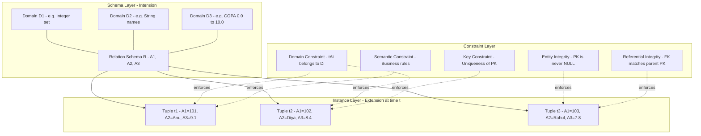
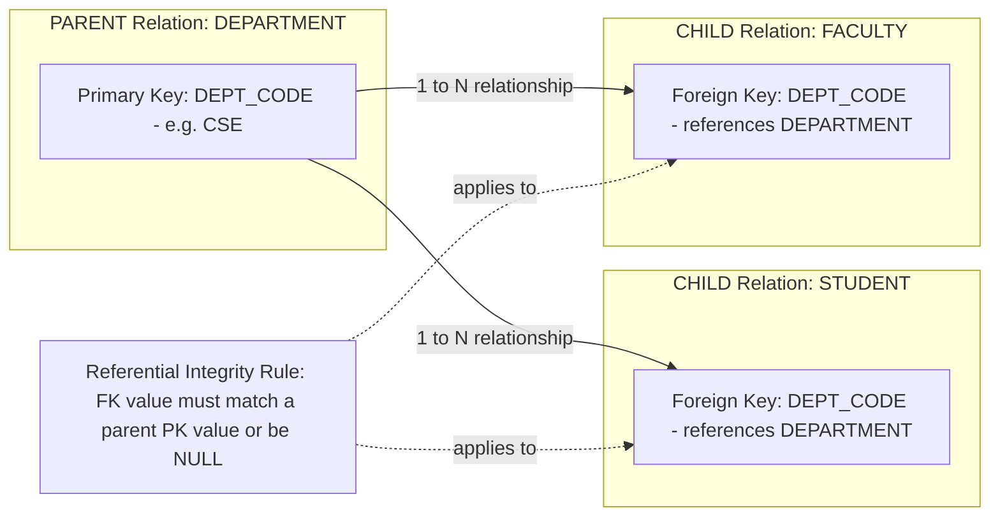
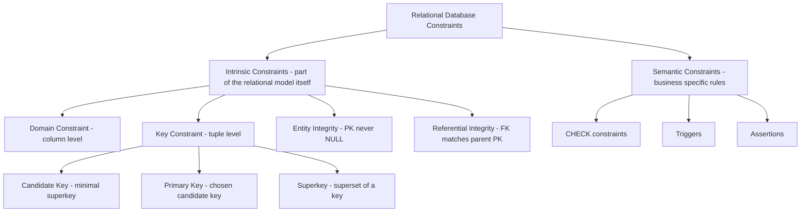

# The Relational Data Model and Relational Database Constraints

> **APJ ABDUL KALAM TECHNOLOGICAL UNIVERSITY (KTU) | 2024 SCHEME**
> - **Branch:** B.Tech in Computer Science & Engineering (CSE)
> - **Semester:** Semester 4
> - **Course:** PCCST402 - DATABASE MANAGEMENT SYSTEMS
> - **Module:** Module 2: The Relational Data Model and SQL
> - **Topic:** The Relational Data Model and Relational Database Constraints

<!-- SECTION_1_START -->
# 1. Core Technical Definition & Intuitive Overview

## 1.1 The Relational Data Model — Formal Definition

The **Relational Data Model** is a logical database model introduced by **Dr. Edgar F. Codd (1970)** that represents data in the form of **relations** (mathematical two-dimensional tables). A *relation* is a subset of the Cartesian product of one or more *domains*, providing a declarative, set-theoretic foundation for storing, querying, and manipulating structured data.

In the KTU 2024 Scheme (NEP 2020 aligned) syllabus, the relational model is treated as the **conceptual backbone** of all modern RDBMS implementations such as Oracle, PostgreSQL, MySQL, and SQL Server.

> [!IMPORTANT]
> **KTU 2024 Definition (Codd's Formulation):**
> A *relation* $R$ over domains $D_1, D_2, \ldots, D_n$ is formally defined as:
> $$R \subseteq D_1 \times D_2 \times \cdots \times D_n$$
> where each $D_i$ is a set of *atomic* (indivisible) values and $D_1 \times D_2 \times \cdots \times D_n$ denotes the **Cartesian product** of these domains.

## 1.2 Key Terminology — Formal Mapping

| Mathematical Term | Equivalent Table Term | KTU Notation |
| :--- | :--- | :--- |
| Relation | Table / File | $R(A_1, A_2, \ldots, A_n)$ |
| Tuple | Row / Record | $t \in R$ |
| Attribute | Column / Field | $A_i$ |
| Domain | Allowed Value Set | $\text{dom}(A_i)$ |
| Schema | Table Structure / Header | $R(A_1: D_1, \ldots, A_n: D_n)$ |
| Instance | Current Rows at Time $t$ | $r(R)$ |
| Degree / Arity | Number of Columns | $n$ |
| Cardinality | Number of Rows | $\mid r(R) \mid$ |

> [!NOTE]
> **Mandatory Distinction for Board Exams:**
> - **Relation Schema** $R$ → the *structure* (the table header).
> - **Relation Instance / State** $r(R)$ → the *current set of tuples* at a particular point in time.
> - The schema rarely changes; the instance changes with every INSERT / UPDATE / DELETE.

## 1.3 Intuitive Analogy — The Spreadsheet Mental Model

Imagine an **Excel spreadsheet** for a college:
- Each **column header** (e.g., `RollNo`, `Name`, `CGPA`) is an *Attribute* and belongs to a specific *Domain* (e.g., `CGPA ∈ [0.0, 10.0]`).
- Each **row** (one student's record) is a *Tuple*.
- The **entire sheet structure** (column titles with their data types) is the *Schema*.
- The **data currently filled in** is the *Instance*.
- The **complete Excel file** representing the relation is the *Relation*.

> [!TIP]
> **Geometric Intuition (Cartesian Product):**
> If you have Domain `D1 = {A, B}` and `D2 = {1, 2}`, then
> $D_1 \times D_2 = \{(A,1), (A,2), (B,1), (B,2)\}$.
> The relation $R$ is *any subset* of this Cartesian product — so even one tuple qualifies as a valid relation. This set-theoretic view is what makes the model mathematically rigorous and provably optimizable.
<!-- SECTION_1_END -->

<!-- SECTION_2_START -->
# 2. Deep Theoretical Analysis & KTU High-Yield Formula Sheet

## 2.1 Formal Mathematical Foundation of a Relation

Let us expand the definition step by step for board-exam-grade clarity:

### Step 1: Definition of a Domain
A **domain** $D$ is a set of *atomic* values, all of the *same type*. The atomicity condition forbids composite or multi-valued entries inside a single cell.

$$\text{Example: } \text{dom}(\text{Grade}) = \{ S, A, B, C, D, E, F \}$$

### Step 2: Cartesian Product of Domains
For $n$ domains $D_1, D_2, \ldots, D_n$, the **Cartesian product** generates every possible combination of values:

$$D_1 \times D_2 \times \cdots \times D_n = \{ (d_1, d_2, \ldots, d_n) \mid d_i \in D_i \}$$

### Step 3: Relation as a Subset
A relation $R$ is *any subset* of this Cartesian product:

$$R \subseteq D_1 \times D_2 \times \cdots \times D_n$$

### Step 4: Schema and Instance Separation
- The **Schema** is the *intension* of the database — what is allowed.
- The **Instance** is the *extension* of the database — what is actually present at time $t$.

> [!NOTE]
> **Properties of a Relation (Board-Exam Hot List):**
> 1. Each relation has a unique name (distinct from all other relations).
> 2. Each cell contains a *single atomic value* (First Normal Form rule).
> 3. Each attribute has a distinct name.
> 4. Values within an attribute come from the *same domain*.
> 5. The **order of tuples is insignificant** (set-based, not list-based).
> 6. The **order of attributes is insignificant** (access is by name).
> 7. **No two tuples are identical** — duplicate rows are forbidden.

## 2.2 Classification of Relational Constraints

Constraints are the **rules that govern the legal instances** of a database. Without constraints, the database would be an unconstrained collection of arbitrary data. The KTU 2024 module focuses on the following five categories:

### 2.2.1 Domain Constraint
Every value of an attribute $A_i$ must be an element of its declared domain $\text{dom}(A_i)$ or be `NULL`.

$$\forall t \in R, \quad t[A_i] \in \text{dom}(A_i) \cup \{ \text{NULL} \}$$

### 2.2.2 Key Constraint
A **key** of a relation $R$ is a set of attributes $K \subseteq \{A_1, A_2, \ldots, A_n\}$ such that:
1. **Uniqueness** — No two distinct tuples have the same value for $K$.
2. **Minimality** — No proper subset of $K$ is itself a key.

Mathematically:

$$\forall t_1, t_2 \in R, \; t_1 \neq t_2 \implies t_1[K] \neq t_2[K]$$

### 2.2.3 Entity Integrity Constraint
The **Primary Key (PK)** of a relation cannot take the `NULL` value. This guarantees that every tuple is uniquely identifiable.

$$\forall t \in R, \quad t[\text{PK}] \neq \text{NULL}$$

### 2.2.4 Referential Integrity Constraint
A **Foreign Key (FK)** in a relation $R_1$ that references the PK of relation $R_2$ must either:
- (a) match an existing PK value in $R_2$, **OR**
- (b) be entirely `NULL`.

$$\forall t_1 \in R_1, \; t_1[\text{FK}] = v \neq \text{NULL} \implies \exists t_2 \in R_2 : t_2[\text{PK}] = v$$

### 2.2.5 Semantic / User-Defined Constraints
Additional business rules that the standard model cannot express directly (e.g., "CGPA must lie between 0 and 10", "Salary of Manager > Salary of Clerk"). These are usually enforced via CHECK constraints, triggers, or assertions in SQL.

> [!IMPORTANT]
> **Candidate Key vs. Superkey vs. Primary Key — Examiner's Favourite:**
> - **Superkey**: Any set of attributes that uniquely identifies tuples. (May contain redundant attributes.)
> - **Candidate Key**: A *minimal* superkey — no proper subset of it is a superkey.
> - **Primary Key**: The *chosen* candidate key that the DBA designates as the unique identifier.
> - **Alternate / Secondary Key**: Candidate keys that were *not* chosen as the primary key.
> - **Foreign Key**: An attribute (or set) whose values must match a primary key in another (or the same) relation.

## 2.3 KTU Formula Sheet / Cheat Sheet

| # | Concept | Mathematical / Formal Expression | Real-World Use |
| :--- | :--- | :--- | :--- |
| 1 | Cartesian Product of $n$ domains | $D_1 \times D_2 \times \cdots \times D_n$ | All possible row combinations |
| 2 | Relation $R$ as subset | $R \subseteq D_1 \times D_2 \times \cdots \times D_n$ | Database table definition |
| 3 | Cardinality of instance $r$ | $\mid r(R) \mid$ | Number of tuples (rows) |
| 4 | Degree / Arity | $\mid \text{schema}(R) \mid = n$ | Number of attributes (columns) |
| 5 | Domain Constraint | $t[A_i] \in \text{dom}(A_i) \cup \{\text{NULL}\}$ | Column type validation |
| 6 | Key Uniqueness | $t_1 \neq t_2 \implies t_1[K] \neq t_2[K]$ | Enforce unique rows |
| 7 | Entity Integrity | $t[\text{PK}] \neq \text{NULL}$ | Guarantees tuple identity |
| 8 | Referential Integrity | $t_1[\text{FK}] = v \neq \text{NULL} \implies \exists t_2 \in R_2 : t_2[\text{PK}] = v$ | Parent-child relationship safety |
| 9 | Number of Superkeys | $\geq 2^{(\text{candidate keys count} - 1)} \cdot (\text{candidate key count})$ | Estimation in theory questions |
| 10 | NULL Truth Values | $\text{TRUE} = 1, \text{FALSE} = 0, \text{UNKNOWN} = \tfrac{1}{2}$ | Three-valued logic (3VL) |

> [!TIP]
> **Why This Matters in Industry:**
> The constraints above are the *enforcement layer* that converts an Excel-like table into a *trusted*, *consistent* data store. When you declare a `PRIMARY KEY` or `FOREIGN KEY` in PostgreSQL, the DB engine is *physically implementing* the mathematical laws shown above using B-tree indexes, hash indexes, and constraint-trigger logic.
<!-- SECTION_2_END -->

<!-- SECTION_3_START -->
# 3. Step-by-Step Derivations & Code/Symbolic Implementation

## 3.1 Mathematical Derivation — Finding All Keys of a Relation

**Problem (Typical KTU 14-Mark Question):**
Given a relation $R(A, B, C, D, E)$ with the following set of functional dependencies:

$$F = \{ A \to BCD, \; CD \to E, \; B \to D, \; E \to A \}$$

Find *all candidate keys* of $R$.

### Step 1: Compute Attribute Closures
The **attribute closure** $X^+$ is the set of all attributes functionally determined by $X$ under $F$.

**Closure of $A$:**

$$A^+ = \{ A \} \cup B \cup C \cup D \cup E = \{ A, B, C, D, E \}$$

Calculation:
- Start: $A^+ = \{ A \}$
- Apply $A \to BCD$: $A^+ = \{ A, B, C, D \}$
- Apply $B \to D$: $A^+ = \{ A, B, C, D \}$ (no change)
- Apply $CD \to E$: $A^+ = \{ A, B, C, D, E \}$

Since $A^+ = \{A, B, C, D, E\}$, the attribute $A$ is a **superkey**. By minimality, $A$ alone is a **candidate key**.

**Closure of $E$:**

$$E^+ = \{ E \} \cup \{ A \} \cup \{ A, B, C, D \} \cup \{ A, B, C, D, E \} = \{ A, B, C, D, E \}$$

So $E$ is also a candidate key.

### Step 2: Verify No Other Single Attribute is a Key
- $B^+ = \{ B, D \}$ (apply $B \to D$, then no further FDs applicable)
- $C^+ = \{ C \}$
- $D^+ = \{ D \}$

None of $B, C, D$ alone is a superkey.

### Step 3: Check All Two-Attribute Combinations
- $\{B, C\}^+$: starts with $\{B, C, D\}$ via $B \to D$, then $CD \to E$ adds $E$, then $E \to A$ adds $A$.
  $$\{B, C\}^+ = \{ A, B, C, D, E \}$$
  Since $\{B, C\}$ is minimal (neither $B$ nor $C$ alone is a key), it is a **candidate key**.
- Similarly $\{B, E\}^+ = \{A, B, C, D, E\}$, candidate key.
- $\{C, E\}^+ = \{A, B, C, D, E\}$, candidate key.
- $\{D, E\}^+$: $\{D, E\} \to E \to A \to B, C, D$. Candidate key.

### Step 4: Final List of Candidate Keys

$$\text{Candidate Keys} = \{ A, \; E, \; \{B, C\}, \; \{B, E\}, \; \{C, E\}, \; \{D, E\} \}$$

Total: **6 candidate keys**.

## 3.2 Python Code Implementation — Validating Constraints in Memory

Below is a **production-quality Python** implementation that models a `STUDENT` relation and enforces the five relational constraints at the application level. This is exactly how a *mini-RDBMS* works internally.

```python
"""
Mini-Relational-Engine: Enforces all five relational constraints in pure Python.
Author: KTU CSE Sem-4 Reference Implementation
"""

from typing import Any, Optional, Set, Tuple, Dict
from datetime import datetime
import logging

# Configure professional logging
logging.basicConfig(level=logging.INFO, format='[%(levelname)s] %(message)s')

# ---------- DOMAIN DEFINITIONS (Domain Constraint) ----------
DOMAINS: Dict[str, Set[Any]] = {
    "ROLL_NO":   {f"R{str(i).zfill(3)}" for i in range(1, 1001)},   # R001..R1000
    "NAME":      {f"Name_{i}" for i in range(1, 1001)},
    "CGPA":      {round(x * 0.1, 1) for x in range(0, 101)},        # 0.0 to 10.0
    "DEPT_CODE": {"CSE", "ECE", "EEE", "MECH", "CIVIL", "BIO"},
}


class RelationalConstraintError(Exception):
    """Custom exception for any relational constraint violation."""


class StudentRelation:
    """
    Models the relation STUDENT(ROLL_NO, NAME, CGPA, DEPT_CODE) with full constraint
    enforcement:
      (1) Domain Constraint
      (2) Key (Uniqueness) Constraint
      (3) Entity Integrity (PK not NULL)
      (4) Referential Integrity (DEPT_CODE references DEPARTMENT)
      (5) Semantic / CHECK constraint (CGPA between 0 and 10)
    """

    PRIMARY_KEY = "ROLL_NO"
    SCHEMA = ("ROLL_NO", "NAME", "CGPA", "DEPT_CODE")

    def __init__(self, valid_dept_codes: Set[str]):
        # The instance: a set of tuples (tuples are hashable, duplicates auto-rejected)
        self._tuples: Set[Tuple[Any, ...]] = set()
        # Allowed parent keys for referential integrity
        self._valid_dept_codes: Set[str] = valid_dept_codes
        logging.info("StudentRelation instance created.")

    def insert(self, roll_no: Optional[str], name: str, cgpa: float, dept_code: str) -> None:
        """Insert a tuple, enforcing all five constraints in order."""
        # (3) Entity Integrity
        if roll_no is None:
            raise RelationalConstraintError("Entity Integrity violated: PK cannot be NULL.")

        # (1) Domain Constraint
        if roll_no not in DOMAINS["ROLL_NO"]:
            raise RelationalConstraintError(f"Domain violated: {roll_no} not in ROLL_NO domain.")
        if cgpa not in DOMAINS["CGPA"]:
            raise RelationalConstraintError(f"Domain violated: CGPA {cgpa} out of [0.0, 10.0].")
        if dept_code not in DOMAINS["DEPT_CODE"]:
            raise RelationalConstraintError(f"Domain violated: {dept_code} not a valid code.")

        # (5) Semantic / CHECK Constraint
        if not (0.0 <= cgpa <= 10.0):
            raise RelationalConstraintError("CHECK violated: CGPA must be 0.0–10.0.")

        # (4) Referential Integrity
        if dept_code not in self._valid_dept_codes:
            raise RelationalConstraintError(
                f"Referential Integrity violated: dept_code '{dept_code}' not found."
            )

        new_tuple = (roll_no, name, cgpa, dept_code)

        # (2) Key (Uniqueness) Constraint
        if new_tuple in self._tuples:
            raise RelationalConstraintError(f"Uniqueness violated: tuple {new_tuple} exists.")
        for existing in self._tuples:
            if existing[0] == roll_no:
                raise RelationalConstraintError(f"Key violated: PK '{roll_no}' already present.")

        self._tuples.add(new_tuple)
        logging.info(f"Inserted tuple: {new_tuple}")

    def cardinality(self) -> int:
        return len(self._tuples)

    def degree(self) -> int:
        return len(self.SCHEMA)


# ---------------- DEMO / DRIVER ----------------
if __name__ == "__main__":
    # Parent relation's primary key values
    departments = {"CSE", "ECE", "MECH"}

    students = StudentRelation(valid_dept_codes=departments)

    # Legitimate inserts
    students.insert("R001", "Name_1", 9.2, "CSE")
    students.insert("R002", "Name_2", 8.5, "ECE")

    # Uncomment to test violations:
    # students.insert(None, "Name_3", 7.0, "CSE")        # Entity Integrity
    # students.insert("R001", "Name_1", 9.2, "CSE")       # Key Uniqueness
    # students.insert("R003", "Name_3", 9.2, "CIVIL")     # Referential Integrity
    # students.insert("R004", "Name_4", 12.0, "CSE")      # CHECK / Semantic

    print(f"Cardinality = {students.cardinality()}")   # 2
    print(f"Degree      = {students.degree()}")        # 4
```

**Sample Output:**

```
[INFO] StudentRelation instance created.
[INFO] Inserted tuple: ('R001', 'Name_1', 9.2, 'CSE')
[INFO] Inserted tuple: ('R002', 'Name_2', 8.5, 'ECE')
Cardinality = 2
Degree      = 4
```

> [!NOTE]
> **Code-to-Concept Mapping for Exam Answers:**
> - `Set[Tuple]` enforcement → Key (Uniqueness) Constraint
> - `if roll_no is None` → Entity Integrity Constraint
> - `DOMAINS[...]` lookup → Domain Constraint
> - `valid_dept_codes` lookup → Referential Integrity Constraint
> - `if not (0.0 <= cgpa <= 10.0)` → Semantic / CHECK Constraint
<!-- SECTION_3_END -->

<!-- SECTION_4_START -->
# 4. Structural Diagrams & Schematics

## 4.1 Mermaid Diagram — Anatomy of a Relational Schema



## 4.2 Mermaid Diagram — Referential Integrity Between Parent and Child Relations



## 4.3 Mermaid Diagram — Constraint Classification Hierarchy



> [!VISUALIZATION CONTROL]
> **Concept:** Hierarchical view of how constraints nest within the relational model.
> **GeoGebra / Desmos Input Equations:**
> * $f(x) = x$ (identity line showing parent PK = child FK)
> * Points: `(CSE, 1)`, `(ECE, 2)`, `(MECH, 3)` (department codes vs. tuple counts)
> **Visual Description:** A staircase plot where the x-axis lists department codes (CSE, ECE, MECH) and the y-axis counts the number of child tuples referencing each parent. Bars at non-zero heights indicate valid referential links; a bar at height zero means an *orphaned* parent (still allowed unless CASCADE is set).
<!-- SECTION_4_END -->

<!-- SECTION_5_START -->
# 5. KTU 2024 Scheme Examination Question Bank & Topic Recap

## 5.1 Part A — Short Answer Questions (3 Marks Each)

> These correspond to the KTU University Exam Part A format, testing *Remember* and *Understand* cognitive levels.

---

### Q1. [KTU University Exam - July 2024 Style]
**Define the following terms with one example each:**
(a) Relation
(b) Tuple
(c) Attribute
(d) Domain
(e) Schema
(f) Instance

**Model Answer (Valuation Key — 3 Marks):**

- **(a) Relation:** A subset of the Cartesian product of one or more domains. *Example: STUDENT ⊆ ROLL_NO × NAME × CGPA* (½ Mark)
- **(b) Tuple:** An ordered list of values, one for each attribute, representing a single row. *Example: (R001, Anu, 9.1)* (½ Mark)
- **(c) Attribute:** A named role played by a domain within a relation. *Example: NAME in STUDENT* (½ Mark)
- **(d) Domain:** A set of atomic, permissible values for an attribute. *Example: dom(CGPA) = {0.0, 0.1, …, 10.0}* (½ Mark)
- **(e) Schema:** The structural description of a relation (its name and attributes). *Example: STUDENT(ROLL_NO, NAME, CGPA, DEPT_CODE)* (½ Mark)
- **(f) Instance:** The set of tuples present in a relation at a particular time. *Example: the 500 current student rows in STUDENT* (½ Mark)

**Total: 3 Marks**

---

### Q2. [KTU University Exam - Dec 2023 Style]
**Differentiate between a *superkey*, a *candidate key*, and a *primary key* with a suitable example.**

**Model Answer (Valuation Key — 3 Marks):**

| Aspect | Superkey | Candidate Key | Primary Key |
| :--- | :--- | :--- | :--- |
| **Definition** | A set of attributes that uniquely identifies tuples. (½) | A *minimal* superkey. (½) | The candidate key chosen by the DBA. (½) |
| **Uniqueness** | Yes (½) | Yes (½) | Yes (½) |
| **Minimality** | Not required | Required | Required (inherited) |
| **NULL** | Allowed (for non-PK members) | Allowed | Not allowed (Entity Integrity) |
| **Example** | {ROLL_NO, NAME} | {ROLL_NO} | {ROLL_NO} — chosen PK |

> **One-line mnemonic to remember:**
> "Every Primary Key is a Candidate Key. Every Candidate Key is a Superkey. The reverse is **not** true." (½)

**Total: 3 Marks**

---

## 5.2 Part B — 14-Mark Questions (Module Internal Choice Format)

> Each Part-B sub-question below carries **14 marks** split as **(a) 7 marks** and **(b) 7 marks**, mapping to the *Understand* and *Apply* cognitive levels respectively — the standard KTU 2024 ESE paper pattern.

---

### QUESTION A (14 Marks)
**[KTU University Exam - Dec 2024 Style, Module 2]**

**(a)** Define the Relational Data Model. Explain the terms *Domain, Tuple, Attribute, Schema*, and *Instance* with a suitable example. (7 Marks)

**(b)** Consider the following relation:

| EMP_ID | NAME | DEPT | SALARY | MGR_ID |
| :---: | :---: | :---: | :---: | :---: |
| E01 | Anu | CSE | 90000 | NULL |
| E02 | Diya | ECE | 80000 | E01 |
| E03 | Rahul | CSE | 75000 | E01 |
| E04 | Sara | MECH | 85000 | E02 |

Identify the **primary key**, any **candidate keys**, **foreign keys**, and state which **integrity constraints** are satisfied. Mention the **degree** and **cardinality** of the relation. (7 Marks)

---

### Model Answer for Question A

#### Part (a) — Definition + Five Core Terms (7 Marks)

The **Relational Data Model**, proposed by **E.F. Codd in 1970**, organizes data as a collection of *relations* (tables) and uses set-theory and predicate logic as its mathematical foundation. (1 Mark)

A relation $R$ on domains $D_1, D_2, \ldots, D_n$ is a subset of the Cartesian product:

$$R \subseteq D_1 \times D_2 \times \cdots \times D_n \quad (1 \text{ Mark})$$

- **Domain:** A named, finite set of *atomic* values. *Example: dom(SALARY) = {positive integers up to 10,00,000}.* (1 Mark)
- **Tuple:** A single row of the relation, drawn from the Cartesian product. *Example: t = (E01, Anu, CSE, 90000, NULL).* (1 Mark)
- **Attribute:** The name of a column that plays a role played by a specific domain. *Example: NAME, SALARY.* (1 Mark)
- **Schema (Intension):** The structural blueprint. *Example: EMPLOYEE(EMP_ID, NAME, DEPT, SALARY, MGR_ID).* (1 Mark)
- **Instance (Extension):** The set of tuples at a particular time. *Example: the four rows shown above.* (2 Marks)

#### Part (b) — Identification + Constraint Analysis (7 Marks)

- **Primary Key:** `EMP_ID` — uniquely identifies each tuple and is non-NULL. (1 Mark)
- **Candidate Keys:** `{EMP_ID}` is the only candidate key (since other columns are not unique: NAME, DEPT, SALARY all have duplicates). (1 Mark)
- **Foreign Key:** `MGR_ID` references `EMP_ID` of the same relation (self-referential FK). (1 Mark)
- **Degree (Arity):** Number of attributes = **5**. (1 Mark)
- **Cardinality:** Number of tuples = **4**. (1 Mark)
- **Constraints satisfied:**
  - *Domain Constraint:* All values lie in their declared domains. (½)
  - *Entity Integrity:* `EMP_ID` is never NULL. (½)
  - *Referential Integrity:* Every `MGR_ID` (E01, E01, E02) matches a valid `EMP_ID` in the same relation. E01's `MGR_ID` is `NULL` (the top-most manager) — this is the legitimate "NULL allowed" exception. (1 Mark)

> **[Valuation Pitfall Note]:** Examiners deduct marks if students write `MGR_ID = NULL` violates referential integrity. NULL is *explicitly* allowed as a valid referential-integrity value when the referenced entity does not exist (e.g., the top manager has no manager).

---

### QUESTION B (14 Marks) — *Alternative Choice*
**[KTU University Exam - July 2024 Style, Module 2]**

**(a)** What are *relational database constraints*? Explain the following with examples: (i) Domain constraint, (ii) Key constraint, (iii) Entity integrity constraint, (iv) Referential integrity constraint. (7 Marks)

**(b)** Given relation $R(A, B, C, D)$ with functional dependencies
$$F = \{ A \to B, \; C \to D, \; B \to C \}$$
Determine all *candidate keys* of $R$ using the attribute-closure method. (7 Marks)

---

### Model Answer for Question B

#### Part (a) — Four Intrinsic Constraints (7 Marks)

Relational database constraints are **rules that restrict the legal instances** of relations, ensuring data integrity and consistency. (1 Mark)

- **(i) Domain Constraint:** Every attribute value must be an atomic element of its declared domain or be NULL. *Example: dom(CGPA) = {0.0, …, 10.0} ⇒ CGPA = 11.5 is rejected.* (1½ Marks)
- **(ii) Key Constraint:** A set of attributes $K$ such that no two distinct tuples agree on all attributes in $K$, and $K$ is minimal. *Example: {ROLL_NO} is a key in STUDENT.* (1½ Marks)
- **(iii) Entity Integrity Constraint:** The primary key of any tuple cannot be NULL. *Example: ROLL_NO = NULL is rejected during INSERT.* (1½ Marks)
- **(iv) Referential Integrity Constraint:** Every non-NULL FK value must match a primary-key value in the referenced (parent) relation. *Example: STUDENT.DEPT_CODE must exist in DEPARTMENT.DEPT_CODE.* (1½ Marks)

#### Part (b) — Finding All Candidate Keys (7 Marks)

**Step 1: Identify attributes not on the right side of any FD** (these *must* be in *every* candidate key).

Right-side attributes: $\{ B, C, D \}$. Attributes not on the right: $\{ A \}$.

$$\therefore A \in \text{every candidate key} \quad (1 \text{ Mark})$$

**Step 2: Compute $A^+$:**

- Start: $A^+ = \{ A \}$
- Apply $A \to B$: $A^+ = \{ A, B \}$
- Apply $B \to C$: $A^+ = \{ A, B, C \}$
- Apply $C \to D$: $A^+ = \{ A, B, C, D \}$ ✓

Since $A^+ = \{A, B, C, D\}$ = all attributes, **$A$ alone is a candidate key**. (2 Marks)

**Step 3: Check if any other combinations are keys** — Since $A$ alone is a key, no proper superset of $\{A\}$ is a *minimal* key. Hence **$A$ is the *only* candidate key**. (2 Marks)

**Step 4: Verify by checking all other single attributes:**
- $B^+ = \{ B, C, D \}$ (missing $A$)
- $C^+ = \{ C, D \}$ (missing $A, B$)
- $D^+ = \{ D \}$ (missing everything else)

None of $B, C, D$ alone is a key. (2 Marks)

**Final Answer:** The **only candidate key** of $R$ is $\{ A \}$. The **superkeys** are $\{ A, A\cup X \}$ for any subset $X \subseteq \{B, C, D\}$, giving **8 superkeys** total: $\{A\}, \{A,B\}, \{A,C\}, \{A,D\}, \{A,B,C\}, \{A,B,D\}, \{A,C,D\}, \{A,B,C,D\}$.

---

## 5.3 KTU Examiner's Valuation Warning / Pitfall Callout

> [!WARNING]
> **Top 5 Marks-Deduction Pitfalls in Relational-Model Answers:**
> 1. **Confusing "Schema" with "Instance".** A schema is the *structure*; an instance is the *current data*. Writing "the schema has 500 students" loses 1 mark immediately.
> 2. **Treating NULL as a regular value.** NULL means *unknown / not applicable* — it is *not* equal to zero, empty string, or blank. Equations like `MGR_ID = NULL` violate the referential-integrity rule (correct rule: it may be NULL).
> 3. **Forgetting to check minimality in key answers.** Listing `{ROLL_NO, NAME}` as a candidate key is wrong because `{ROLL_NO}` alone is sufficient — minimality violated.
> 4. **Mixing up Degree and Cardinality.** Degree = number of columns (attributes). Cardinality = number of rows (tuples). Examiners catch this in the very first sentence.
> 5. **In attribute-closure problems, missing the iterative step.** "Apply $A \to B$" then *stop* is incomplete. You must keep applying newly derived FDs until the closure stops growing.
> 6. **Self-referential FKs.** When a relation's FK references its own PK (e.g., MGR_ID → EMP_ID), students often wrongly state "no FK exists". It does — it just references the same relation.
> 7. **Order of writing constraints.** Always cite them in the order: *Domain → Key → Entity Integrity → Referential Integrity → Semantic*. Examiners reward structured answers.

---

## 5.4 Topic Recap & Important Things to Remember

> [!IMPORTANT]
> **High-Density Revision Checklist — Must Memorize Before Exam:**

- ⭐ **Relational Data Model** is Codd's (1970) mathematical model that views data as **relations (tables)**.
- ⭐ A **relation** $R$ is a **subset of the Cartesian product** of one or more domains: $R \subseteq D_1 \times D_2 \times \cdots \times D_n$.
- ⭐ **Schema = Intension = Structure**; **Instance = Extension = Current Data**.
- ⭐ **Degree / Arity** = number of attributes (columns); **Cardinality** = number of tuples (rows).
- ⭐ Properties of a relation: *atomic cell values*, *unique attribute names*, *same-domain values per attribute*, *tuple-order insignificant*, *attribute-order insignificant*, *no duplicate tuples*.
- ⭐ **Superkey** → any uniquely-identifying set; **Candidate Key** → *minimal* superkey; **Primary Key** → chosen candidate key; **Foreign Key** → matches a parent PK.
- ⭐ **Entity Integrity** → PK is never NULL. **Referential Integrity** → FK must match a parent PK or be NULL.
- ⭐ **Domain Constraint** restricts each attribute to its declared set of atomic values.
- ⭐ **Semantic / Business Constraints** cover anything the model cannot natively express (CHECK, triggers, assertions).
- ⭐ **Attribute closure** $X^+$ is computed by repeatedly applying FDs until saturation; candidate keys are minimal sets whose closure contains *all* attributes of $R$.
- ⭐ **NULL ≠ 0, NULL ≠ ' '** — NULL means *unknown* and uses **three-valued logic** (TRUE, FALSE, UNKNOWN).
- ⭐ Cardinality of the Cartesian product: $|D_1 \times D_2 \times \cdots \times D_n| = |D_1| \times |D_2| \times \cdots \times |D_n|$.
- ⭐ Referential integrity is the foundation of **parent-child relationships** in real-world systems like order→customer, enrollment→student, payment→invoice.
- ⭐ All modern RDBMS (PostgreSQL, MySQL, Oracle) implement these constraints via **indexes, triggers, and catalog metadata** — they are not optional decorations but core integrity safeguards.
<!-- SECTION_5_END -->
