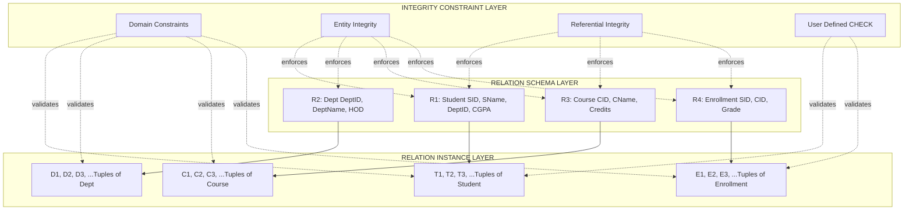
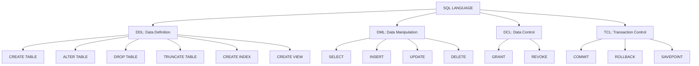
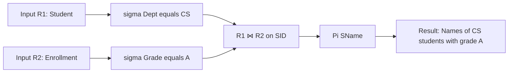
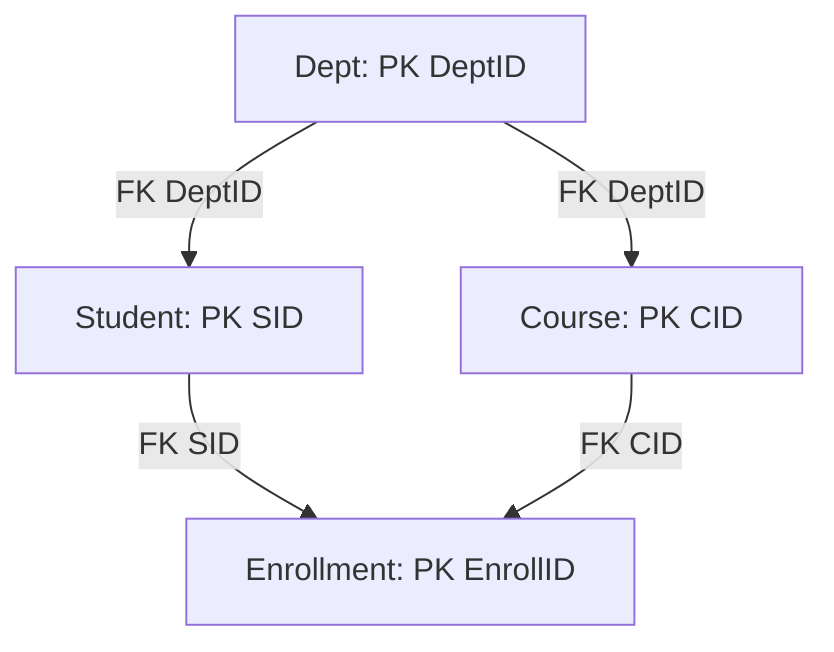
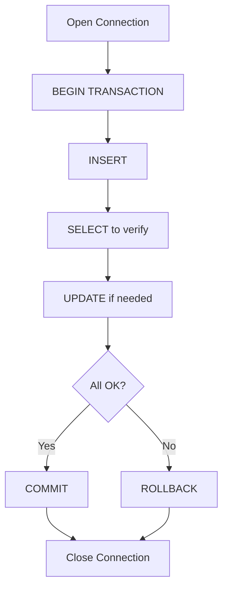

# The Relational Data Model and SQL  - The Relational Data Model and Relational Database Constraints-Relational Algebra and Relational Calculus - Structured Query Language (SQL)-Data Definition Language,  Data Manipulation Language,

<!-- SECTION_1_START -->
# MODULE 2: THE RELATIONAL DATA MODEL AND SQL

## 2.1 Core Technical Definition & Intuitive Overview

### 2.1.1 The Relational Data Model — Formal Definition
The **Relational Data Model** is a formal, mathematical framework proposed by **Edgar F. Codd (1970)** for representing, querying, and manipulating data in a database. In this model, data is organized as a collection of **relations**, which are physically represented as **tables** consisting of **rows (tuples)** and **columns (attributes)**. Every relation is defined over a set of **domains**, and the integrity of data is enforced through a precise system of **constraints**.

> [!IMPORTANT]
> **KTU 2024 Syllabus Highlight:** The relational model is the theoretical foundation that underpins the SQL language. Every SQL command has a direct mapping to an operation in relational algebra or relational calculus.

### 2.1.2 Conceptual Analogy — A Spreadsheet With Strict Rules
Imagine a **class attendance register** in a school:
- Each **column** (Name, Roll No, Date, Status) has a fixed meaning and accepts only a specific type of value (e.g., Roll No is always an integer).
- Each **row** is one student's record for one day.
- You cannot add a record without a Roll No (entity integrity).
- You cannot mark attendance for a student who does not exist in the master student list (referential integrity).

This register behaves like a **relation**. The relational model formalizes these everyday rules so that the database engine can enforce them automatically and reason about them mathematically.

### 2.1.3 Core Terminology — The Building Blocks

| Term | Formal Definition | Table Equivalent |
|------|-------------------|------------------|
| **Domain $D$** | A set of atomic (indivisible) allowable values for an attribute | Data type + allowed values |
| **Attribute $A$** | A named role played by a domain within a relation | Column header |
| **Tuple $t$** | An ordered set of values, one for each attribute | A single row |
| **Relation $r$** | A subset of the Cartesian product of domains: $r \subseteq D_1 \times D_2 \times \dots \times D_n$ | The table itself |
| **Relation Schema $R$** | The structural definition: $R(A_1, A_2, \dots, A_n)$ | Table definition (structure only) |
| **Relation Instance** | A specific set of tuples at a given time | Current data in the table |
| **Degree (arity)** | Number of attributes $n$ in a relation | Number of columns |
| **Cardinality** | Number of tuples currently in a relation | Number of rows |

> [!NOTE]
> **Order does not matter**: In the formal relational model, tuples are **unordered sets**, and attributes are **unordered**. SQL tables, in practice, do maintain a column order, but logical queries should not depend on that order.

### 2.1.4 Keys — Identifying Tuples Uniquely

A **key** is a minimal set of attributes that uniquely identifies a tuple within a relation.

- **Super Key**: Any set of attributes that uniquely identifies a tuple. May contain extra, non-essential attributes.
- **Candidate Key**: A **minimal** super key — no proper subset of it is a super key.
- **Primary Key**: The candidate key chosen by the database designer to be the principal unique identifier. Cannot contain **NULL** values.
- **Alternate Key**: Candidate keys that were *not* chosen as the primary key.
- **Foreign Key**: An attribute (or set of attributes) in one relation that references the **Primary Key** of another relation (or the same relation).
- **Composite Key**: A key composed of two or more attributes.
- **Unique Key**: A candidate key constraint that allows **one NULL** (in most SQL dialects) and enforces uniqueness otherwise.

> [!VISUALIZATION CONTROL]
> **Concept:** Primary vs. Foreign Key relationship
> **GeoGebra / Desmos Input Equations:**
> * `Student(SID: PRIMARY, Name, Age)` — independent set
> * `Enrollment(EID, SID: FOREIGN -> Student.SID, CourseID: FOREIGN -> Course.CID)` — dependent set
> **Visual Description:** Two disjoint sets where a directed arrow from one element in the dependent set points to a unique element in the independent set. Multiple arrows can converge to the same target (many-to-one).

### 2.1.5 Relational Database Constraints — The Rule Book
Constraints are the **guardians of data integrity**. The relational model defines three main classes:

1. **Domain Constraints**: The value of each attribute $A_i$ must be an atomic value from its declared domain $D_i$. Example: `Age INT CHECK (Age >= 0)`.
2. **Key Constraints**: Every relation must have a primary key, and its value must be unique and non-null for every tuple.
3. **Entity Integrity Constraint**: The **Primary Key** of a base relation cannot have a NULL value. This ensures every tuple is uniquely identifiable.
4. **Referential Integrity Constraint**: A foreign key value must either be NULL or match an existing primary key value in the referenced (parent) relation.
5. **Semantic / Enterprise Constraints**: Application-specific rules (e.g., `End_Date >= Start_Date`).

> [!IMPORTANT]
> **KTU Board Focus:** Entity Integrity and Referential Integrity are the two constraints most frequently tested. Always mention them by name and state the rule clearly.

<!-- SECTION_1_END -->

<!-- SECTION_2_START -->
# 2.2 Deep Theoretical Analysis & KTU High-Yield Formula Sheet

## 2.2.1 Anatomy of a Relation — Properties (Codd's Rules in Practice)

A relation $r$ on schema $R(A_1, A_2, \dots, A_n)$ has these properties:
1. Each cell contains a single **atomic** value (1NF compliance).
2. All entries in a column are from the **same domain**.
3. Each row is **unique** (no duplicate tuples).
4. The **order of rows is insignificant**.
5. The **order of columns is insignificant** (attributes are identified by name, not position).

## 2.2.2 Relational Algebra — The Procedural Query Language

**Relational Algebra (RA)** is a procedural query language that takes one or more relations as input and produces a new relation as output. The fundamental operations are split into **basic (primitive)** and **derived** operations.

### A. Basic / Fundamental Operations (Six)

| Operation | Symbol | Purpose |
|-----------|--------|---------|
| **SELECT** (unary) | $\sigma_{predicate}(R)$ | Filters rows by predicate |
| **PROJECT** (unary) | $\Pi_{A_1, A_2, \dots}(R)$ | Filters columns |
| **UNION** (binary) | $R \cup S$ | All tuples in $R$ or $S$ |
| **SET DIFFERENCE** (binary) | $R - S$ | Tuples in $R$ but not in $S$ |
| **CARTESIAN PRODUCT** (binary) | $R \times S$ | All pair-wise combinations |
| **RENAME** (unary) | $\rho_{NewName(A \to B)}(R)$ | Renames relation or attribute |

### B. Derived / Additional Operations (Expressible using the six primitives)

| Operation | Symbol | Meaning |
|-----------|--------|---------|
| **INTERSECTION** | $R \cap S$ | Tuples in both: $R \cap S \equiv R - (R - S)$ |
| **NATURAL JOIN** | $R \bowtie S$ | Cartesian product + equality on common attributes |
| **THETA JOIN** | $R \bowtie_{\theta} S$ | Cartesian product + general predicate $\theta$ |
| **EQUI JOIN** | $R \bowtie_{A=B} S$ | Theta join where $\theta$ is equality |
| **LEFT OUTER JOIN** | $R \leftouterjoin S$ | All tuples of $R$, matched tuples of $S$, NULLs otherwise |
| **RIGHT OUTER JOIN** | $R \rightouterjoin S$ | All tuples of $S$, matched tuples of $R$, NULLs otherwise |
| **FULL OUTER JOIN** | $R \fullouterjoin S$ | Union of left and right outer joins |
| **DIVISION** | $R \div S$ | Tuples in $R$ associated with *all* tuples of $S$ |
| **AGGREGATE / GROUP BY** | $_{G}\mathcal{G}_{F(A)}(R)$ | SUM, AVG, COUNT, MIN, MAX |

### C. The DIVISION Operation — A KTU Favorite
$R \div S$ returns tuples from $R$ whose attributes match **every** tuple in $S$. It is the inverse of the Cartesian product. Use it to answer: *"Find students who have taken ALL courses."*

$$R \div S = \Pi_{A}(R) - \Pi_{A}\big((\Pi_{A}(R) \times S) - R\big)$$

where $A$ is the set of attributes of $R$ that are not in $S$.

## 2.2.3 Tuple Relational Calculus (TRC) — The Declarative Counterpart

TRC is a **non-procedural** query language that describes *what* to retrieve, not *how*. A query has the form:

$$\{t \mid P(t)\}$$

where $t$ is a tuple variable and $P$ is a **formula** built from atoms and logical connectives ($\land, \lor, \lnot, \Rightarrow$).

**Example:** Find all students with marks > 80 in `Student(Name, Marks)`:
$$\{s \mid \text{Student}(s) \land s.\text{Marks} > 80\}$$

> [!NOTE]
> **Codd's Theorem:** The set of queries expressible in **Relational Algebra** is **exactly equivalent** to those expressible in **Tuple Relational Calculus** (and Domain Relational Calculus). This is the foundation of SQL.

## 2.2.4 SQL — Structured Query Language

SQL is the standard declarative language for Relational Database Management Systems. It has major sublanguages:

| Sublanguage | Purpose | Commands |
|-------------|---------|----------|
| **DDL** — Data Definition Language | Defines schema | `CREATE`, `ALTER`, `DROP`, `TRUNCATE`, `RENAME` |
| **DML** — Data Manipulation Language | Manages data | `SELECT`, `INSERT`, `UPDATE`, `DELETE` |
| **DCL** — Data Control Language | Manages access rights | `GRANT`, `REVOKE` |
| **TCL** — Transaction Control Language | Manages transactions | `COMMIT`, `ROLLBACK`, `SAVEPOINT` |
| **DQL** — Data Query Language | Sometimes separated from DML | `SELECT` |

> [!IMPORTANT]
> **KTU Syllabus Note:** Module 2 focuses on **DDL** and **DML**. DCL/TCL are covered in later modules.

## 2.2.5 DDL — Data Definition Language Command Matrix

| Command | Function | Example (informal) |
|---------|----------|--------------------|
| `CREATE TABLE` | Creates a new table with named columns and constraints | Create `Employee` table |
| `CREATE VIEW` | Creates a virtual table from a query | `CREATE VIEW Mgrs AS ...` |
| `CREATE INDEX` | Builds a B-Tree/Hash index for fast retrieval | `CREATE INDEX idx_emp ON Emp(Salary);` |
| `ALTER TABLE` | Modifies structure (add/drop/rename column, add/drop constraint) | `ALTER TABLE Emp ADD Email VARCHAR(50);` |
| `DROP TABLE` | Removes the table **structure AND data** permanently | `DROP TABLE Emp;` |
| `TRUNCATE TABLE` | Removes **all rows** but keeps structure; faster than `DELETE`; cannot be rolled back in many DBs | `TRUNCATE TABLE Emp;` |
| `RENAME` | Renames a table (Oracle / MySQL syntax differs) | `RENAME Emp TO Employee;` |

## 2.2.6 DML — Data Manipulation Language Command Matrix

| Command | Function | Clause Set |
|---------|----------|------------|
| `SELECT` | Retrieves rows from one or more tables | `SELECT`, `FROM`, `WHERE`, `GROUP BY`, `HAVING`, `ORDER BY` |
| `INSERT` | Adds new rows | `INSERT INTO ... VALUES (...)` or `INSERT INTO ... SELECT ...` |
| `UPDATE` | Modifies existing rows | `UPDATE ... SET ... WHERE ...` |
| `DELETE` | Removes rows | `DELETE FROM ... WHERE ...` |

## 2.2.7 KTU High-Yield Formula Cheat Sheet

| Concept | Notation / Syntax | Constraint / Use |
|---------|-------------------|------------------|
| Selection | $\sigma_{p}(R)$ | Filter rows by predicate $p$ |
| Projection | $\Pi_{A_1, \dots, A_k}(R)$ | Filter columns |
| Cartesian product | $R \times S$ | Combine every $r$ with every $s$ |
| Natural join | $R \bowtie S$ | Equi-join on common attribute names |
| Division | $R \div S$ | "For all" queries |
| Set difference | $R - S$ | Tuples in $R$ not in $S$ |
| Union | $R \cup S$ | Must be **union-compatible** |
| Foreign key link | $FK \to PK$ | Referential integrity |
| Primary key | `PRIMARY KEY` | Unique + NOT NULL |
| Unique key | `UNIQUE` | Unique + at most one NULL |
| Default | `DEFAULT v` | Used in INSERT when value omitted |
| Auto-increment | `AUTO_INCREMENT` / `SERIAL` | Generates next ID |

> [!TIP]
> **Engineering Utility:** The relational model powers virtually every production system — banking ledgers (PostgreSQL), e-commerce catalogs (MySQL), social-network timelines (Oracle Exadata), airline reservations (DB2). Understanding the algebra lets you reason about query *cost* (e.g., why a `JOIN` is cheaper than a subquery in most optimizers).

<!-- SECTION_2_END -->

<!-- SECTION_3_START -->
# 2.3 Step-by-Step Derivations, SQL Code & Symbolic Implementation

## 2.3.1 Worked Example — Relational Algebra Expression Construction

**Scenario:** Schema: `Student(SID, SName, Dept, Year)` and `Enrollment(SID, CID, Grade)`. Find the names of all Computer Science (`CS`) students who have taken **at least one** course with grade `'A'`.

**Step-by-step construction:**

Step 1 — Filter CS students:
$$R_1 = \sigma_{\text{Dept} = \text{'CS'}}(\text{Student})$$

Step 2 — Filter A-grade enrollments:
$$R_2 = \sigma_{\text{Grade} = \text{'A'}}(\text{Enrollment})$$

Step 3 — Join on `SID`:
$$R_3 = R_1 \bowtie_{R_1.\text{SID} = R_2.\text{SID}} R_2$$

Step 4 — Project names:
$$\text{Result} = \Pi_{\text{SName}}(R_3)$$

**Compact one-line expression:**
$$\Pi_{\text{SName}}\big(\sigma_{\text{Dept}='\text{CS}'}(\text{Student}) \bowtie \sigma_{\text{Grade}='\text{A}'}(\text{Enrollment})\big)$$

## 2.3.2 Worked Example — Division Operation Derivation

**Scenario:** Find student IDs that have taken **every** course in the `Course` table. Schemas: `Takes(SID, CID)`, `Course(CID)`.

**Derivation by inverse:**
$$R_1 = \Pi_{\text{SID}}(\text{Takes}) \quad \text{— all student IDs who took any course}$$
$$R_2 = \Pi_{\text{SID}}(R_1) \times \text{Course} \quad \text{— cross product: each ID with every course}$$
$$R_3 = R_2 - \text{Takes} \quad \text{— pairs (ID, course) NOT in Takes}$$
$$R_4 = \Pi_{\text{SID}}(R_3) \quad \text{— IDs that missed at least one course}$$
$$R_5 = R_1 - R_4 \quad \text{— IDs that missed NONE, i.e., took ALL}$$

$$\text{Result} = \Pi_{\text{SID}}(\text{Takes}) - \Pi_{\text{SID}}\big((\Pi_{\text{SID}}(\text{Takes}) \times \text{Course}) - \text{Takes}\big)$$

## 2.3.3 SQL DDL — Full Worked Example with All Constraints

Below is a production-grade DDL example using strict data types, integrity constraints, default values, auto-increment, and explicit foreign key references.

```sql
-- ============================================================
-- DATABASE: UniversityDB
-- MODULE 2 DEMO: DDL with full constraint enforcement
-- ============================================================

-- Step 1: Create the Department table (parent of Student).
CREATE TABLE Department (
    DeptID      CHAR(4)         NOT NULL,
    DeptName    VARCHAR(40)     NOT NULL UNIQUE,
    HOD         VARCHAR(40)     NOT NULL,
    Established YEAR            NOT NULL DEFAULT 2000,
    CONSTRAINT  PK_Department   PRIMARY KEY (DeptID),
    CONSTRAINT  CHK_DeptYear    CHECK (Established >= 1970)
) ENGINE=InnoDB;

-- Step 2: Create the Student table (child of Department).
CREATE TABLE Student (
    SID         INT             NOT NULL AUTO_INCREMENT,
    SName       VARCHAR(50)     NOT NULL,
    Gender      CHAR(1)         NOT NULL,
    DOB         DATE            NOT NULL,
    DeptID      CHAR(4)         NOT NULL,
    CGPA        DECIMAL(4,2)    NOT NULL DEFAULT 0.00,
    Email       VARCHAR(60)     NULL,
    CONSTRAINT  PK_Student      PRIMARY KEY (SID),
    CONSTRAINT  UQ_Student_Email UNIQUE (Email),
    CONSTRAINT  FK_Student_Dept FOREIGN KEY (DeptID)
        REFERENCES Department(DeptID)
        ON UPDATE CASCADE
        ON DELETE RESTRICT,
    CONSTRAINT  CHK_Student_Gender CHECK (Gender IN ('M','F','O')),
    CONSTRAINT  CHK_Student_CGPA   CHECK (CGPA BETWEEN 0.00 AND 10.00)
) ENGINE=InnoDB;

-- Step 3: Create the Course table.
CREATE TABLE Course (
    CID         CHAR(6)         NOT NULL,
    CName       VARCHAR(50)     NOT NULL,
    Credits     TINYINT         NOT NULL,
    DeptID      CHAR(4)         NOT NULL,
    CONSTRAINT  PK_Course       PRIMARY KEY (CID),
    CONSTRAINT  FK_Course_Dept  FOREIGN KEY (DeptID)
        REFERENCES Department(DeptID)
        ON DELETE CASCADE,
    CONSTRAINT  CHK_Course_Cred CHECK (Credits BETWEEN 1 AND 6)
) ENGINE=InnoDB;

-- Step 4: Create the Enrollment (junction) table.
CREATE TABLE Enrollment (
    EnrollID    BIGINT          NOT NULL AUTO_INCREMENT,
    SID         INT             NOT NULL,
    CID         CHAR(6)         NOT NULL,
    Semester    VARCHAR(6)      NOT NULL,
    Grade       CHAR(2)         NULL,
    CONSTRAINT  PK_Enrollment   PRIMARY KEY (EnrollID),
    CONSTRAINT  FK_Enr_Student  FOREIGN KEY (SID)
        REFERENCES Student(SID) ON DELETE CASCADE,
    CONSTRAINT  FK_Enr_Course   FOREIGN KEY (CID)
        REFERENCES Course(CID)  ON DELETE RESTRICT,
    CONSTRAINT  CHK_Enr_Grade   CHECK (Grade IN ('A+','A','B+','B','C','D','F', NULL)),
    CONSTRAINT  CHK_Enr_Sem     CHECK (Semester IN ('S1','S2','S3','S4','S5','S6','S7','S8'))
) ENGINE=InnoDB;

-- Step 5: Add an index to speed up GPA-based queries.
CREATE INDEX IDX_Student_CGPA ON Student(CGPA);

-- Step 6: Rename a table (alternative syntax).
RENAME TABLE Department TO Dept;

-- Step 7: Alter table — add a new column to Student.
ALTER TABLE Student ADD Phone VARCHAR(15) NULL;

-- Step 8: Drop an index.
DROP INDEX IDX_Student_CGPA ON Student;
```

**Line-by-line logic recap:**
- `NOT NULL` enforces **mandatory** data entry.
- `PRIMARY KEY` enforces both **uniqueness** and **NOT NULL** (entity integrity).
- `UNIQUE (Email)` allows NULL but prevents duplicates (alternate-key constraint).
- `FOREIGN KEY ... REFERENCES ...` enforces **referential integrity**.
- `CHECK` constraints encode **semantic / domain** rules.
- `ON UPDATE CASCADE` propagates parent primary-key changes to children automatically.
- `ON DELETE RESTRICT` prevents deletion of a parent row if children exist.
- `ON DELETE CASCADE` auto-deletes child rows when the parent is deleted.
- `AUTO_INCREMENT` synthesizes surrogate primary-key values.
- `DEFAULT 0.00` supplies a value when INSERT omits the column.

## 2.3.4 SQL DML — Fully Operational Python+MySQL Style Examples

The following Python block uses the standard `mysql-connector-python` driver to demonstrate a complete DML lifecycle: **INSERT → SELECT → UPDATE → DELETE** with proper parameterization, error handling, and a context-managed transaction.

```python
"""
dbms_module2_dml_demo.py
Demonstrates DML operations against a MySQL / MariaDB backend.
Requires: pip install mysql-connector-python
"""

import logging
import sys
from typing import Any, List, Tuple, Optional
import mysql.connector
from mysql.connector import errorcode, pooling

# ------------------------------------------------------------
# Step 1: Configure structured error logging.
# ------------------------------------------------------------
logging.basicConfig(
    level=logging.INFO,
    format="%(asctime)s [%(levelname)s] %(message)s",
    handlers=[logging.StreamHandler(sys.stdout)],
)
logger = logging.getLogger("DBMS_Module2_Demo")

# ------------------------------------------------------------
# Step 2: Build a connection pool for production-grade access.
# ------------------------------------------------------------
try:
    POOL: pooling.MySQLConnectionPool = pooling.MySQLConnectionPool(
        pool_name="uni_pool",
        pool_size=5,
        host="localhost",
        user="root",
        password="your_password",
        database="UniversityDB",
    )
    logger.info("Connection pool established successfully.")
except mysql.connector.Error as conn_err:
    logger.error("Connection-pool creation failed: %s", conn_err)
    sys.exit(1)

# ------------------------------------------------------------
# Step 3: INSERT operation — single + bulk forms.
# ------------------------------------------------------------
def insert_department(records: List[Tuple[str, str, str, int]]) -> int:
    """Inserts a list of (DeptID, DeptName, HOD, Established) tuples."""
    sql: str = "INSERT INTO Dept (DeptID, DeptName, HOD, Established) VALUES (%s,%s,%s,%s)"
    inserted_count: int = 0
    try:
        cnx = POOL.get_connection()
        cursor = cnx.cursor()
        cursor.executemany(sql, records)
        cnx.commit()
        inserted_count = cursor.rowcount
        logger.info("INSERT: %d row(s) added to Dept.", inserted_count)
    except mysql.connector.IntegrityError as integrity_err:
        logger.error("INSERT integrity violation: %s", integrity_err)
        cnx.rollback()
    except mysql.connector.Error as db_err:
        logger.error("INSERT general error: %s", db_err)
        cnx.rollback()
    finally:
        cursor.close()
        cnx.close()
    return inserted_count

# ------------------------------------------------------------
# Step 4: SELECT operation — simple, filtered, joined, aggregated.
# ------------------------------------------------------------
def get_top_students(min_cgpa: float, limit: int) -> List[Tuple[Any, ...]]:
    """Returns (SName, DeptName, CGPA) for students with CGPA >= min_cgpa."""
    query: str = """
        SELECT  s.SName,
                d.DeptName,
                s.CGPA
        FROM    Student s
                JOIN Dept d ON s.DeptID = d.DeptID
        WHERE   s.CGPA >= %s
        ORDER BY s.CGPA DESC
        LIMIT %s
    """
    rows: List[Tuple[Any, ...]] = []
    try:
        cnx = POOL.get_connection()
        cursor = cnx.cursor()
        cursor.execute(query, (min_cgpa, limit))
        rows = cursor.fetchall()
        logger.info("SELECT: %d row(s) returned.", len(rows))
    except mysql.connector.Error as db_err:
        logger.error("SELECT error: %s", db_err)
    finally:
        cursor.close()
        cnx.close()
    return rows

# ------------------------------------------------------------
# Step 5: UPDATE operation — guarded by a WHERE clause.
# ------------------------------------------------------------
def update_student_department(old_dept: str, new_dept: str) -> int:
    """Moves all students from one department to another, atomically."""
    update_sql: str = "UPDATE Student SET DeptID = %s WHERE DeptID = %s"
    verify_sql: str = "SELECT COUNT(*) FROM Dept WHERE DeptID = %s"
    affected: int = 0
    cnx: Optional[pooling.PooledMySQLConnection] = None
    try:
        cnx = POOL.get_connection()
        cursor = cnx.cursor()
        cursor.execute(verify_sql, (new_dept,))
        exists: Tuple[Tuple[int]] = cursor.fetchone()
        if not exists or exists[0] == 0:
            raise ValueError(f"Target department '{new_dept}' does not exist.")
        cursor.execute(update_sql, (new_dept, old_dept))
        cnx.commit()
        affected = cursor.rowcount
        logger.info("UPDATE: %d student(s) moved from %s to %s.", affected, old_dept, new_dept)
    except (mysql.connector.Error, ValueError) as op_err:
        logger.error("UPDATE aborted: %s", op_err)
        if cnx is not None:
            cnx.rollback()
    finally:
        if cnx is not None:
            cursor.close()
            cnx.close()
    return affected

# ------------------------------------------------------------
# Step 6: DELETE operation — always conditional.
# ------------------------------------------------------------
def delete_inactive_students(min_cgpa_threshold: float) -> int:
    """Deletes students whose CGPA is below the threshold."""
    delete_sql: str = "DELETE FROM Student WHERE CGPA < %s"
    deleted: int = 0
    cnx: Optional[pooling.PooledMySQLConnection] = None
    try:
        cnx = POOL.get_connection()
        cursor = cnx.cursor()
        cursor.execute(delete_sql, (min_cgpa_threshold,))
        cnx.commit()
        deleted = cursor.rowcount
        logger.info("DELETE: %d row(s) removed from Student.", deleted)
    except mysql.connector.Error as db_err:
        logger.error("DELETE error: %s", db_err)
        if cnx is not None:
            cnx.rollback()
    finally:
        if cnx is not None:
            cursor.close()
            cnx.close()
    return deleted

# ------------------------------------------------------------
# Step 7: Driver — executes a full DML cycle for demonstration.
# ------------------------------------------------------------
if __name__ == "__main__":
    insert_department([
        ("CS",  "Computer Science", "Dr. Raman", 1985),
        ("EC",  "Electronics",      "Dr. Priya", 1992),
        ("ME",  "Mechanical",       "Dr. John",   1979),
    ])
    top_students = get_top_students(min_cgpa=8.5, limit=10)
    for row in top_students:
        logger.info("Top student: %s | %s | CGPA=%.2f", row[0], row[1], row[2])
    moved = update_student_department(old_dept="ME", new_dept="CS")
    logger.info("Department reassignment complete: %d row(s) affected.", moved)
    removed = delete_inactive_students(min_cgpa_threshold=4.0)
    logger.info("Cleanup complete: %d row(s) removed.", removed)
```

**Code-level rationale:**
- **Type hints** make the contract explicit and IDE-friendly.
- **Parameterization** (`%s` placeholders) prevents SQL-injection attacks.
- **Explicit `try / except / finally`** ensures connection and cursor are always released.
- **Atomic `commit()` / `rollback()`** preserves ACID properties.
- **Pre-flight `SELECT` checks** before `UPDATE` enforce business rules.

## 2.3.5 DML — Pure SQL Examples (the language constructs themselves)

```sql
-- 1) INSERT a single row with all columns.
INSERT INTO Student (SID, SName, Gender, DOB, DeptID, CGPA, Email)
VALUES (101, 'Ananya S', 'F', '2004-08-12', 'CS', 9.20, 'ananya@uni.in');

-- 2) INSERT by copying from another table.
INSERT INTO Student_Archive (SID, SName, CGPA)
SELECT SID, SName, CGPA FROM Student WHERE CGPA < 5.00;

-- 3) UPDATE with a WHERE clause (otherwise updates EVERY row).
UPDATE Student SET CGPA = CGPA + 0.10 WHERE DeptID = 'CS' AND CGPA < 9.50;

-- 4) DELETE with a subquery.
DELETE FROM Enrollment WHERE SID IN (
    SELECT SID FROM Student WHERE CGPA < 4.00
);

-- 5) SELECT with all major clauses.
SELECT  d.DeptName,
        COUNT(s.SID)    AS StudentCount,
        AVG(s.CGPA)     AS AvgCGPA
FROM    Dept d
        JOIN Student s ON d.DeptID = s.DeptID
WHERE   s.CGPA >= 6.00
GROUP BY d.DeptName
HAVING  COUNT(s.SID) > 10
ORDER BY AvgCGPA DESC
LIMIT 5;
```

<!-- SECTION_3_END -->

<!-- SECTION_4_START -->
# 2.4 Structural Diagrams & Schematics

## 2.4.1 Relational Model — Conceptual Architecture

The diagram below shows how a relational database is composed of three layers: the **schema** (structure), the **instances** (data), and the **constraints** (rules that bind them together).



## 2.4.2 SQL Sublanguage Classification

The diagram below separates SQL into its sub-languages and maps each command to its layer of operation.



## 2.4.3 Relational Algebra Operator Pipeline

The diagram below traces a single query through the relational algebra pipeline — from input relations, through primitive operations, to a final output relation.



## 2.4.4 Foreign-Key Referential Graph



## 2.4.5 DML Command Lifecycle



<!-- SECTION_4_END -->

<!-- SECTION_5_START -->
# 2.5 KTU 2024 Scheme Examination Question Bank & Topic Recap

---

## Part A — Short Answer Questions (3 Marks Each)

### Question 1
`[KTU University Exam — July 2023]`
**CO1 | RBT: Remember**
Explain the terms **Primary Key**, **Candidate Key**, and **Foreign Key** with an example.

**Model Answer (Board-Standard, ~120 words):**
A **key** is a set of attributes that uniquely identifies a tuple in a relation.
- **Candidate Key**: A *minimal* set of attributes that uniquely identifies every tuple. Example: In `Student(SID, SName, DOB, Phone)`, both `SID` and `Phone` could be candidate keys (assuming phones are unique and non-null).
- **Primary Key**: The candidate key *chosen* by the designer as the principal identifier. Example: `SID` is chosen as the primary key in `Student`. It cannot contain NULL (entity integrity).
- **Foreign Key**: An attribute in one relation that refers to the **primary key** of another (or the same) relation. Example: `DeptID` in `Student` is a foreign key that references `DeptID` in `Dept`. It enforces **referential integrity**.

`[Key definitions: 1 Mark] [Candidate key + example: 1 Mark] [Primary key + entity integrity: 0.5 Mark] [Foreign key + referential integrity: 0.5 Mark]`

---

### Question 2
`[KTU University Exam — Dec 2022]`
**CO1 | RBT: Understand**
Differentiate between **TRUNCATE** and **DELETE** in SQL.

**Model Answer (~100 words):**

| Aspect | `TRUNCATE` | `DELETE` |
|--------|------------|----------|
| Type | DDL (in many DBs) | DML |
| Removes rows? | All rows | Specific rows with `WHERE` |
| WHERE clause? | No | Yes |
| Fires triggers? | Usually no | Yes (per row) |
| Rollback? | Often no (auto-commit) | Yes (transactional) |
| Speed | Faster (deallocates pages) | Slower (row-by-row) |
| Resets `AUTO_INCREMENT`? | Often yes | No |

`[DDL vs DML classification: 1 Mark] [Tabular contrast with 3-4 points: 2 Marks]`

---

## Part B — Long Answer Questions (14 Marks Each)

> [!IMPORTANT]
> **KTU 2024 ESE Pattern:** Every Part-B question is internally optional. You must attempt **ONE** of the two choices. Each has sub-parts (a) and (b) for 7 marks each.

---

### Question A (14 Marks) — Relational Algebra & Calculus

`[KTU University Exam — June 2024]`
**CO2, CO3 | RBT: Apply / Analyze**

Consider the following schema for a **Library Management System**:

- `Book(BookID, Title, Author, Price, PublisherID)`
- `Publisher(PublisherID, PName, City)`
- `Borrower(BID, BName, MembershipType)`
- `Borrow(BorrowID, BID, BookID, IssueDate, ReturnDate)`

#### (a) **[7 Marks — RBT: Apply]**
Write **relational algebra** expressions for the following queries using the fundamental operators. Show step-by-step construction.

**(i) Find the names of all borrowers who have borrowed books published in 'Delhi'.**
**(ii) Find the titles of books borrowed by 'Premium' members.**
**(iii) Find the names of authors whose books have never been borrowed.**

**Model Solution:**

**(i) Step-by-step construction:**
- Step 1: Filter Delhi publishers: $P_1 = \sigma_{\text{City}=\text{'Delhi'}}(\text{Publisher})$
- Step 2: Join with Book: $B_1 = P_1 \bowtie_{P_1.\text{PublisherID} = \text{Book}.\text{PublisherID}} \text{Book}$
- Step 3: Join with Borrow: $BR_1 = B_1 \bowtie_{B_1.\text{BookID} = \text{Borrow}.\text{BookID}} \text{Borrow}$
- Step 4: Join with Borrower: $BO_1 = BR_1 \bowtie_{BR_1.\text{BID} = \text{Borrower}.\text{BID}} \text{Borrower}$
- Step 5: Project names: $\text{Result} = \Pi_{\text{BName}}(BO_1)$

**Compact expression:**
$$\Pi_{\text{BName}}\Big(\sigma_{\text{City}=\text{'Delhi'}}(\text{Publisher}) \bowtie \text{Book} \bowtie \text{Borrow} \bowtie \text{Borrower}\Big)$$

`[Filter Delhi: 1 Mark] [Join chain: 2 Marks] [Projection: 1 Mark] [Compact final form: 1 Mark]`

**(ii) Construction:**
- Step 1: Filter Premium members: $M_1 = \sigma_{\text{MembershipType}=\text{'Premium'}}(\text{Borrower})$
- Step 2: Join with Borrow, then Book, then project Title:
$$\text{Result} = \Pi_{\text{Title}}\Big(\sigma_{\text{MembershipType}=\text{'Premium'}}(\text{Borrower}) \bowtie \text{Borrow} \bowtie \text{Book}\Big)$$

`[Filter Premium: 1 Mark] [Two joins: 1 Mark] [Projection on Title: 1 Mark]`

**(iii) Construction (using set difference and division):**
- Step 1: All book IDs: $A_1 = \Pi_{\text{BookID}}(\text{Book})$
- Step 2: Borrowed book IDs: $A_2 = \Pi_{\text{BookID}}(\text{Borrow})$
- Step 3: Never-borrowed book IDs: $A_3 = A_1 - A_2$
- Step 4: Join with Book to recover titles and authors:
$$\text{Result} = \Pi_{\text{Author}}\Big(( \Pi_{\text{BookID}}(\text{Book}) - \Pi_{\text{BookID}}(\text{Borrow}) ) \bowtie \text{Book}\Big)$$

`[All book IDs: 1 Mark] [Borrowed IDs: 0.5 Mark] [Set difference: 1 Mark] [Final join & project: 0.5 Mark]`

---

#### (b) **[7 Marks — RBT: Analyze]**
Write **Tuple Relational Calculus (TRC)** expressions for the same three queries above. Also, explain why the relational algebra and TRC are considered **equivalent**.

**Model Solution:**

**(i) TRC for Delhi borrowers:**
$$\{b.\text{BName} \mid \text{Borrower}(b) \land \exists br, bk, p \, (\text{Borrow}(br) \land \text{Book}(bk) \land \text{Publisher}(p) \land br.\text{BID} = b.\text{BID} \land bk.\text{BookID} = br.\text{BookID} \land p.\text{PublisherID} = bk.\text{PublisherID} \land p.\text{City} = \text{'Delhi'})\}$$

`[Free variable + condition: 2 Marks] [Existential quantifier chain: 2 Marks] [City filter: 1 Mark] [Final form: 0.5 Mark]`

**(ii) TRC for Premium members' book titles:**
$$\{bk.\text{Title} \mid \text{Book}(bk) \land \exists br, bo \, (\text{Borrow}(br) \land \text{Borrower}(bo) \land br.\text{BookID} = bk.\text{BookID} \land br.\text{BID} = bo.\text{BID} \land bo.\text{MembershipType} = \text{'Premium'})\}$$

**(iii) TRC for never-borrowed authors:**
$$\{bk.\text{Author} \mid \text{Book}(bk) \land \lnot \exists br \, (\text{Borrow}(br) \land br.\text{BookID} = bk.\text{BookID})\}$$

`[Free variable: 1 Mark] [Negation of existence: 2 Marks] [Final form: 1 Mark]`

**Equivalence explanation (3 Marks):**
Codd's Equivalence Theorem states that for every relational algebra expression there exists an equivalent tuple relational calculus expression and vice versa. Both languages define the same set of safe, finite query results. They differ in style: RA is **procedural** (specifies the steps of computation), whereas TRC is **declarative** (specifies the logical condition). This theorem underpins **QBE (Query by Example)** and **SQL**, which can be translated to either formalism before optimization.

---

### Question B (14 Marks) — SQL DDL & DML

`[KTU University Exam — Dec 2023]`
**CO2, CO3, CO4 | RBT: Apply / Create**

Consider the schema of the Library Management System given in Question A. Write **SQL DDL** to create all four tables with **primary key**, **foreign key**, **CHECK**, and **NOT NULL** constraints. Then write the **DML statements** for the sub-parts below.

#### (a) **[7 Marks — RBT: Apply]**

**Write the complete DDL script for all four tables.**

**Model Solution:**

```sql
CREATE TABLE Publisher (
    PublisherID  CHAR(5)       NOT NULL,
    PName        VARCHAR(60)   NOT NULL UNIQUE,
    City         VARCHAR(40)   NOT NULL,
    CONSTRAINT   PK_Publisher  PRIMARY KEY (PublisherID),
    CONSTRAINT   CHK_Pub_City  CHECK (City IN ('Delhi','Mumbai','Chennai','Kolkata','Bengaluru'))
);

CREATE TABLE Book (
    BookID       CHAR(6)       NOT NULL,
    Title        VARCHAR(100)  NOT NULL,
    Author       VARCHAR(60)   NOT NULL,
    Price        DECIMAL(8,2)  NOT NULL,
    PublisherID  CHAR(5)       NOT NULL,
    CONSTRAINT   PK_Book       PRIMARY KEY (BookID),
    CONSTRAINT   FK_Book_Pub   FOREIGN KEY (PublisherID)
        REFERENCES Publisher(PublisherID)
        ON UPDATE CASCADE
        ON DELETE RESTRICT,
    CONSTRAINT   CHK_Book_Price CHECK (Price > 0 AND Price < 10000)
);

CREATE TABLE Borrower (
    BID             INT         NOT NULL AUTO_INCREMENT,
    BName           VARCHAR(60) NOT NULL,
    MembershipType  VARCHAR(20) NOT NULL,
    CONSTRAINT      PK_Borrower PRIMARY KEY (BID),
    CONSTRAINT      CHK_Bor_Mem CHECK (MembershipType IN ('Basic','Premium','Student'))
);

CREATE TABLE Borrow (
    BorrowID     BIGINT        NOT NULL AUTO_INCREMENT,
    BID          INT           NOT NULL,
    BookID       CHAR(6)       NOT NULL,
    IssueDate    DATE          NOT NULL,
    ReturnDate   DATE          NULL,
    CONSTRAINT   PK_Borrow     PRIMARY KEY (BorrowID),
    CONSTRAINT   FK_Bor_Bwr    FOREIGN KEY (BID)
        REFERENCES Borrower(BID) ON DELETE CASCADE,
    CONSTRAINT   FK_Bor_Book   FOREIGN KEY (BookID)
        REFERENCES Book(BookID)  ON DELETE RESTRICT,
    CONSTRAINT   CHK_Bor_Dates CHECK (ReturnDate IS NULL OR ReturnDate >= IssueDate)
);
```

**Valuation key:**
`[Publisher table with PK, CHECK, UNIQUE: 1.5 Marks] [Book table with FK, CHECK, NOT NULL: 2 Marks] [Borrower with auto-increment, CHECK: 1.5 Marks] [Borrow with two FKs, date CHECK: 2 Marks]`

---

#### (b) **[7 Marks — RBT: Create]**

**Write SQL DML statements for the following:**

**(i) Insert three publishers, two books, two borrowers, and one borrow record.**
**(ii) Update the `ReturnDate` for a given `BorrowID` to today's date.**
**(iii) Increase the `Price` of all books published by Delhi publishers by 5%.**
**(iv) Delete all borrowers who have never borrowed a book (use a subquery).**
**(v) Find the names of all Premium borrowers who have borrowed books costing more than 500.**

**Model Solution:**

**(i) Inserts:**
```sql
INSERT INTO Publisher VALUES ('P001','Pearson','Delhi');
INSERT INTO Publisher VALUES ('P002','McGraw','Mumbai');
INSERT INTO Publisher VALUES ('P003','Oxford','Chennai');

INSERT INTO Book VALUES ('B00001','Database Systems','Navathe',650.00,'P001');
INSERT INTO Book VALUES ('B00002','Operating Systems','Silberschatz',720.50,'P002');

INSERT INTO Borrower (BName, MembershipType) VALUES ('Rahul','Premium');
INSERT INTO Borrower (BName, MembershipType) VALUES ('Meera','Student');

INSERT INTO Borrow (BID, BookID, IssueDate) VALUES (1,'B00001','2024-09-01');
```
`[Each logical group of inserts: ~0.4 Marks × 4 = ~1.6 Marks; balanced score: 2 Marks]`

**(ii) Update return date:**
```sql
UPDATE Borrow
SET ReturnDate = CURDATE()
WHERE BorrowID = 1 AND ReturnDate IS NULL;
```
`[UPDATE syntax: 0.5 Mark] [WHERE clause with safety check: 0.5 Mark] [CURDATE function: 0.5 Mark]`

**(iii) 5% price hike for Delhi publishers:**
```sql
UPDATE Book
SET Price = Price * 1.05
WHERE PublisherID IN (
    SELECT PublisherID FROM Publisher WHERE City = 'Delhi'
);
```
`[UPDATE with subquery: 0.7 Mark] [Correct arithmetic: 0.7 Mark] [WHERE with IN: 0.6 Mark]`

**(iv) Delete non-borrowers:**
```sql
DELETE FROM Borrower
WHERE BID NOT IN (SELECT DISTINCT BID FROM Borrow);
```
`[DELETE with NOT IN subquery: 1 Mark] [Correct semantics: 0.5 Mark]`

**(v) Premium borrowers with expensive books:**
```sql
SELECT DISTINCT bo.BName
FROM   Borrower bo
       JOIN Borrow br ON bo.BID = br.BID
       JOIN Book   bk ON br.BookID = bk.BookID
WHERE  bo.MembershipType = 'Premium'
  AND  bk.Price > 500;
```
`[3-table JOIN: 1 Mark] [DISTINCT: 0.5 Mark] [Predicates: 0.5 Mark]`

---

> [!WARNING]
> **KTU Examiner's Valuation Pitfall Callout — Common Mistakes**
> 1. **Forgetting `WHERE` in `UPDATE`/`DELETE`:** This silently updates or deletes **every** row in the table. Examiners deduct 1–2 marks immediately.
> 2. **Wrong operator precedence in `CHECK`:** `CHECK (Price > 0 AND Price < 10000)` is correct. `CHECK (Price > 0 AND < 10000)` is **a syntax error** in standard SQL.
> 3. **Foreign key with no matching parent:** Inserting a `Book` with a `PublisherID` that doesn't exist fails with *foreign-key violation*. Always insert parent rows first.
> 4. **Mixing RA and TRC in one answer:** In Part B, examiners often ask specifically for RA **or** TRC. Mixing them forfeits marks if the question says "in relational algebra" only.
> 5. **Omitting entity integrity:** When defining a primary key, *also* write the rule: *"Primary key cannot be NULL"*. Examiners want to see the **principle**, not just the syntax.
> 6. **`DROP` vs `TRUNCATE` confusion:** `DROP` removes the table; `TRUNCATE` removes rows. Examiners test this distinction at least once per paper.
> 7. **Aliases for tuple variables in TRC:** Use a distinct variable per relation (`b`, `bk`, `br`, `bo`) — reusing the same variable for two relations is a **silent logic bug**.

---

## Topic Recap & Important Things to Remember

- **Relational Model** = data as **tables (relations)** with rows (tuples) and columns (attributes), formalized by **Edgar F. Codd (1970)**.
- A **relation** is a subset of the Cartesian product of its domains: $r \subseteq D_1 \times D_2 \times \dots \times D_n$.
- **Super Key ⊇ Candidate Key ⊇ Primary Key**. Alternate keys are the un-chosen candidate keys.
- **Three core integrity constraints:** **Domain**, **Entity Integrity** (PK ≠ NULL), and **Referential Integrity** (FK = PK or NULL).
- **Foreign Key actions:** `ON UPDATE CASCADE` propagates changes; `ON DELETE RESTRICT` blocks deletion if children exist; `ON DELETE CASCADE` auto-deletes children.
- **Relational Algebra** is **procedural**; **TRC/DRC** are **declarative**. **Codd's Theorem** proves their **equivalence**.
- **Six primitive RA operations:** $\sigma$ (select), $\Pi$ (project), $\cup$ (union), $-$ (set difference), $\times$ (Cartesian product), $\rho$ (rename).
- **Derived RA operations** include $\cap$, $\bowtie$ (natural join), $\div$ (division), and $\leftouterjoin, \rightouterjoin, \fullouterjoin$ (outer joins).
- **DIVISION** answers "for all" queries: $R \div S$ returns tuples in $R$ paired with *every* tuple in $S$.
- **SQL sublanguages:** DDL (schema), DML (data), DCL (rights), TCL (transactions).
- **DDL commands:** `CREATE`, `ALTER`, `DROP`, `TRUNCATE`, `RENAME`. `TRUNCATE` is faster than `DELETE` but cannot be rolled back in most DBs.
- **DML commands:** `SELECT`, `INSERT`, `UPDATE`, `DELETE`. **Always** pair with a `WHERE` clause unless intentional.
- **Constraint types in SQL:** `PRIMARY KEY`, `FOREIGN KEY`, `UNIQUE`, `NOT NULL`, `CHECK`, `DEFAULT`, `AUTO_INCREMENT` (or `SERIAL` in PostgreSQL).
- **JOIN types in SQL:** `INNER JOIN` (default), `LEFT OUTER JOIN`, `RIGHT OUTER JOIN`, `FULL OUTER JOIN`, `CROSS JOIN`.
- **Aggregate functions:** `COUNT`, `SUM`, `AVG`, `MIN`, `MAX` — used with `GROUP BY` and `HAVING`.
- **Logical order of SELECT execution:** `FROM` → `WHERE` → `GROUP BY` → `HAVING` → `SELECT` → `DISTINCT` → `ORDER BY` → `LIMIT`.
- **SQL is case-insensitive for keywords** but case-sensitive for string literals.
- **Use parameterization in real code** (`%s` in Python) to prevent **SQL-injection** attacks.
- **KTU high-frequency keywords** to memorize: atomic, minimal, referential, equi-join, natural join, division, set difference, entity integrity, referential integrity, domain constraint.

<!-- SECTION_5_END -->
