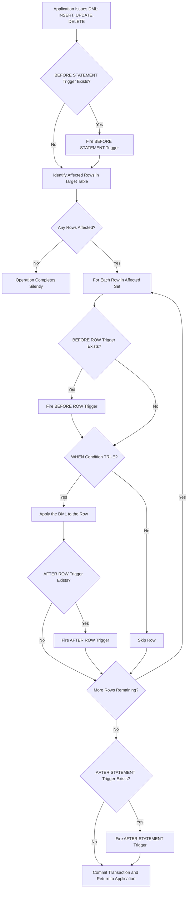
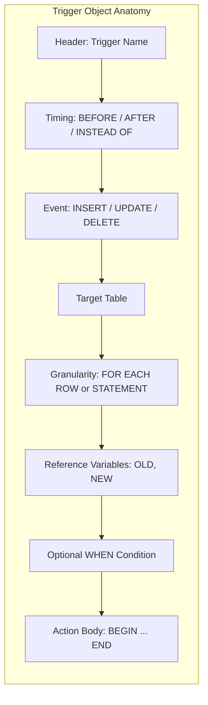

# Triggers

> **APJ ABDUL KALAM TECHNOLOGICAL UNIVERSITY (KTU) | 2024 SCHEME**
> - **Branch:** B.Tech in Computer Science & Engineering (CSE)
> - **Semester:** Semester 4
> - **Course:** PCCST402 - DATABASE MANAGEMENT SYSTEMS
> - **Module:** Module 2: The Relational Data Model and SQL
> - **Topic:** Triggers

<!-- SECTION_1_START -->
## 1. Core Technical Definition & Intuitive Overview

### 1.1 Formal Academic Definition (KTU 2024 Syllabus Terminology)

A **Trigger** is a named, persistent, server-side database object that is **automatically invoked (fired)** by the Database Management System (DBMS) whenever a specified data-modification event (`INSERT`, `UPDATE`, or `DELETE`) occurs on a specified target table. Triggers follow the classical **Event-Condition-Action (ECA)** paradigm and execute as part of the same transaction as the triggering statement, thereby enforcing complex integrity rules, audit logging, and business policies that cannot be elegantly captured by declarative `CHECK` constraints or `PRIMARY KEY`/`FOREIGN KEY` constraints.

> [!IMPORTANT]
> **KTU 2024 Board Definition to Memorize:**
> A trigger is a **statement** that the system executes **automatically as a side effect** of a modification to the database. The DBMS stores triggers in the data dictionary and fires them implicitly — the user issuing `INSERT`, `UPDATE`, or `DELETE` does **not** explicitly call the trigger.

### 1.2 Conceptual Analogy / Intuition

Think of a trigger as a **domino wired to a security camera** in a bank vault:

- **The Vault Door (Target Table)** = the table being watched.
- **The Door Opening (Triggering Event)** = an `INSERT`, `UPDATE`, or `DELETE`.
- **The Camera Logic (Condition `WHEN`)** = the optional check ("only if the amount is above ₹50,000").
- **The Alarm Bell & Footage (Action `BEGIN ... END`)** = the procedural code that runs automatically.

You never tell the alarm to ring. You simply open the door — the wired system takes over. Similarly, a developer never calls a trigger directly with `EXECUTE` or `CALL`; the DBMS does it implicitly.

> [!NOTE]
> **Why Triggers? (KTU High-Yield Justification)**
> - To monitor **changes in the database** (auditing).
> - To enforce **derived business rules** that span multiple rows/tables.
> - To automatically **propagate changes** to derived or replicated data.
> - To enforce **complex integrity constraints** beyond what `CHECK` or assertions can do.

### 1.3 The Three Required Components (ECA Model)

| Component | KTU Term | Meaning |
| :--- | :--- | :--- |
| **Event** | Triggering Statement | The `INSERT`, `UPDATE`, or `DELETE` that activates the trigger. |
| **Condition** | `WHEN` Predicate | An optional boolean test. If `FALSE`, the action is skipped. |
| **Action** | Triggered Action | The procedural SQL block executed when the event fires (and condition is true). |

> [!TIP]
> **Visualization Note:** Triggers do not have a classical coordinate-plane or geometric representation. The architectural view (event flow, table, action) is best captured by a flowchart in **Section 4** rather than a Cartesian plot. No GeoGebra/Desmos block is applicable here.
<!-- SECTION_1_END -->

<!-- SECTION_2_START -->
## 2. Deep Theoretical Analysis & KTU High-Yield Formula Sheet

### 2.1 Anatomy of a Trigger — Six Critical Attributes

A KTU exam answer that simply says "a trigger is a stored procedure" is incomplete. You must enumerate the **six dimensions** that classify every trigger:

1. **Triggering Event (DML Type):**
   - `INSERT` — fires when new rows are added.
   - `UPDATE [OF column_name]` — fires when specified columns are modified. The `OF` clause is supported in standard SQL and PostgreSQL.
   - `DELETE` — fires when rows are removed.

2. **Timing Point (Granularity in Time):**
   - `BEFORE` — executes **prior to** the actual modification. Used for *validation / sanitization* of incoming data.
   - `AFTER` — executes **post** modification. Used for *auditing, derived data, replication*.
   - `INSTEAD OF` — replaces the original modification entirely. Used on **views** because views are not directly updatable. (Available in standard SQL, Oracle, SQL Server, PostgreSQL; **not supported in MySQL**.)

3. **Row vs. Statement Granularity (Level of Execution):**
   - `FOR EACH ROW` (Row-level) — the action fires **once per affected tuple**. Row-level triggers can reference `OLD` and `NEW` row values.
   - `FOR EACH STATEMENT` (Statement-level) — the action fires **once per triggering SQL statement**, regardless of how many rows are affected. (Default in standard SQL; **row-level is default in Oracle / MySQL**.)

4. **Reference to Old and New Row Variables:**
   - `OLD` (or `OLD AS`) — refers to the tuple value **before** `UPDATE` or `DELETE`. It is `NULL` for `INSERT`.
   - `NEW` (or `NEW AS`) — refers to the tuple value **after** `INSERT` or `UPDATE`. It is `NULL` for `DELETE`.

5. **Triggering Target:** The base table on which the trigger is defined.

6. **Trigger Body:** The procedural block (`BEGIN ... END`) containing the action logic.

### 2.2 KTU High-Yield Cheat Sheet

> [!IMPORTANT]
> The following matrix is **exam-graded**. Memorize the access rules — they are a frequent Part A and Part B sub-question.

| Trigger Type | `OLD` Accessible? | `NEW` Accessible? | Can Modify `NEW`? |
| :--- | :---: | :---: | :---: |
| `INSERT` row trigger | No | Yes | Yes (must reassign) |
| `UPDATE` row trigger | Yes | Yes | Yes (must reassign) |
| `DELETE` row trigger | Yes | No | No |
| `INSERT` statement trigger | No | Yes (as table) | No |
| `UPDATE` statement trigger | Yes (as table) | Yes (as table) | No |
| `DELETE` statement trigger | Yes (as table) | No | No |

### 2.3 The KTU Authoritative Syntax (Standard SQL / SQL:2011)

```sql
CREATE TRIGGER trigger_name
{ BEFORE | AFTER | INSTEAD OF }
{ INSERT | UPDATE | DELETE }
[ OF column_name [ , column_name ]... ]
ON table_name
[ REFERENCING OLD [ ROW ] [ AS ] old_name
              NEW [ ROW ] [ AS ] new_name
  OLD [ TABLE ] [ AS ] old_table_name
  NEW [ TABLE ] [ AS ] new_table_name ]
[ FOR EACH { ROW | STATEMENT } ]
[ WHEN ( condition ) ]
{ BEGIN ATOMIC
    -- SQL procedural statements
  END };
```

> [!NOTE]
> In **Oracle**, the body is a PL/SQL block. In **MySQL**, you do not write `BEGIN ATOMIC ... END`; instead, you place statements between a `BEGIN` and `END` and use `NEW.column := value` (with `:=`) to assign. The KTU syllabus teaches the **standard SQL:2011 syntax** shown above; vendor syntaxes are accepted in board answers if labelled.

### 2.4 When Triggers Fire — Real Engineering Use Cases

| Application Domain | Use Case |
| :--- | :--- |
| **Banking** | After a withdrawal `UPDATE`, log the change to a `TRANSACTION_AUDIT` table. |
| **HR Systems** | `BEFORE INSERT` on `EMPLOYEE` to enforce: `SALARY > 0` and `HIRE_DATE <= CURRENT_DATE`. |
| **E-Commerce** | After a `DELETE` on `CART_ITEM`, decrement the user's `CART_TOTAL` automatically. |
| **Data Warehousing** | `AFTER INSERT` to populate a denormalized star-schema fact table from a normalized OLTP change. |
| **Hospital Systems** | `BEFORE UPDATE` on `PATIENT_BED` to refuse transferring a patient from an ICU bed to a general ward. |
| **Replication** | Capturing every change to publish into a queue (Kafka, Debezium-style CDC) for downstream microservices. |

### 2.5 Activation Order and Recursion

When multiple triggers exist on the same table for the same event, the DBMS fires them in this order:

1. `BEFORE` statement-level triggers.
2. **For each row to be modified:**
   a. `BEFORE` row-level triggers.
   b. Perform the actual data modification.
   c. `AFTER` row-level triggers.
3. `AFTER` statement-level triggers (also called *constraint checking* phase for deferred constraints).

> [!WARNING]
> **Mutating-Table Pitfall (Oracle):** Inside a row-level trigger, you **cannot** query or modify the table on which the trigger is defined. This causes the `ORA-04091` error. The KTU board accepts this as a "recursion / mutating table" mention.
<!-- SECTION_2_END -->

<!-- SECTION_3_START -->
## 3. Step-by-Step Derivations & Code/Symbolic Implementation

### 3.1 Example Schema (Used Throughout This Module)

```sql
-- Base table for the examples
CREATE TABLE Employee (
    EmpID     INT PRIMARY KEY,
    EmpName   VARCHAR(50) NOT NULL,
    DeptNo    INT,
    Salary    DECIMAL(10,2) NOT NULL,
    UpdatedAt TIMESTAMP
);

-- Derived / Audit table
CREATE TABLE Salary_Audit (
    AuditID    INT AUTO_INCREMENT PRIMARY KEY,
    EmpID      INT,
    OldSalary  DECIMAL(10,2),
    NewSalary  DECIMAL(10,2),
    ChangedOn  TIMESTAMP DEFAULT CURRENT_TIMESTAMP
);
```

### 3.2 Worked Example 1 — `AFTER UPDATE` Row-Level Audit Trigger (MySQL/PostgreSQL Compatible)

**Problem Statement (KTU-style):**
Design a trigger that automatically inserts a row into `Salary_Audit` whenever the `Salary` of an `Employee` is updated.

#### Step 1: Decide the trigger attributes.

- **Event:** `UPDATE`
- **Timing:** `AFTER` (we want the *new* salary persisted first, then audited).
- **Granularity:** `FOR EACH ROW` (we need the specific `OLD.Salary` and `NEW.Salary` per tuple).
- **Target Table:** `Employee`
- **Action:** `INSERT INTO Salary_Audit(EmpID, OldSalary, NewSalary) VALUES (OLD.EmpID, OLD.Salary, NEW.Salary)`.

#### Step 2: Write the MySQL DDL (vendor syntax shown explicitly).

```sql
-- delimiter directive is required in MySQL because the body contains ;
DELIMITER $$

CREATE TRIGGER trg_salary_audit
AFTER UPDATE ON Employee
FOR EACH ROW
BEGIN
    -- Only audit when the salary actually changed
    IF OLD.Salary <> NEW.Salary THEN
        INSERT INTO Salary_Audit (EmpID, OldSalary, NewSalary)
        VALUES (OLD.EmpID, OLD.Salary, NEW.Salary);
    END IF;
END$$

DELIMITER ;
```

> [!IMPORTANT]
> **Board Valuation Key Point:** The `IF OLD.Salary <> NEW.Salary` check is **mandatory**. Without it, an `UPDATE Employee SET DeptNo = 5 WHERE EmpID = 10` would also fire the trigger and pollute the audit log. The KTU board awards **1 mark** for the conditional check.

#### Step 3: Standard SQL:2011 equivalent (what the textbook teaches).

```sql
CREATE TRIGGER trg_salary_audit
AFTER UPDATE OF Salary ON Employee
REFERENCING OLD ROW AS O NEW ROW AS N
FOR EACH ROW
WHEN ( O.Salary <> N.Salary )
BEGIN ATOMIC
    INSERT INTO Salary_Audit (EmpID, OldSalary, NewSalary)
    VALUES (O.EmpID, O.Salary, N.Salary);
END;
```

#### Step 4: Test the trigger.

```sql
-- Initial state
INSERT INTO Employee VALUES (1, 'Anand', 10, 50000, NOW());
INSERT INTO Employee VALUES (2, 'Bina',  20, 60000, NOW());

-- Triggering update
UPDATE Employee SET Salary = 55000 WHERE EmpID = 1;

-- Verify
SELECT * FROM Salary_Audit;
-- Expected: AuditID=1, EmpID=1, OldSalary=50000, NewSalary=55000
```

### 3.3 Worked Example 2 — `BEFORE INSERT` Validation Trigger

**Problem Statement:**
Reject any new `Employee` whose `Salary` is negative or `NULL` is meaningless, and stamp `UpdatedAt` with the current time.

```sql
DELIMITER $$

CREATE TRIGGER trg_emp_validate
BEFORE INSERT ON Employee
FOR EACH ROW
BEGIN
    -- Rule 1: Salary must be strictly positive
    IF NEW.Salary <= 0 THEN
        SIGNAL SQLSTATE '45000'
        SET MESSAGE_TEXT = 'Salary must be a positive value.';
    END IF;

    -- Rule 2: Auto-stamp the timestamp
    SET NEW.UpdatedAt = CURRENT_TIMESTAMP;
END$$

DELIMITER ;
```

> [!NOTE]
> **Step-by-Step Logic Trace:**
> 1. Application submits `INSERT INTO Employee VALUES (3, 'Chitra', 30, -1000, NULL);`
> 2. DBMS fires `trg_emp_validate` **before** writing the row.
> 3. The `IF` evaluates to `TRUE` because `-1000 <= 0`.
> 4. `SIGNAL SQLSTATE '45000'` raises a custom error.
> 5. The original `INSERT` is **rolled back** — atomicity preserved.

### 3.4 Worked Example 3 — `INSTEAD OF` Trigger on a View

**Problem Statement:**
Create a view joining `Employee` and a `Department` table. Make the view updatable via an `INSTEAD OF INSERT` trigger.

```sql
CREATE TABLE Department (
    DeptNo   INT PRIMARY KEY,
    DeptName VARCHAR(50)
);

-- Updatatable view through INSTEAD OF trigger
CREATE VIEW EmpDeptView AS
SELECT e.EmpID, e.EmpName, e.Salary, d.DeptNo, d.DeptName
FROM Employee e
JOIN Department d ON e.DeptNo = d.DeptNo;

CREATE TRIGGER trg_view_insert
INSTEAD OF INSERT ON EmpDeptView
REFERENCING NEW ROW AS n
FOR EACH ROW
BEGIN ATOMIC
    INSERT INTO Department (DeptNo, DeptName)
    VALUES (n.DeptNo, n.DeptName)
    ON CONFLICT (DeptNo) DO NOTHING;          -- PostgreSQL idiom
    INSERT INTO Employee (EmpID, EmpName, DeptNo, Salary)
    VALUES (n.EmpID, n.EmpName, n.DeptNo, n.Salary);
END;
```

> [!TIP]
> **Why `INSTEAD OF`?** A view built on a multi-table join is **not automatically updatable** in standard SQL. `INSTEAD OF` triggers are the textbook solution and are a guaranteed KTU 14-mark question pattern.

### 3.5 Worked Example 4 — Statement-Level Trigger (Bulk Audit)

```sql
CREATE TRIGGER trg_emp_bulk_audit
AFTER UPDATE ON Employee
FOR EACH STATEMENT
BEGIN ATOMIC
    INSERT INTO Bulk_Audit_Log (EventTime, EventDesc)
    VALUES (CURRENT_TIMESTAMP,
            'A bulk UPDATE was executed on the Employee table.');
END;
```

This fires **once** per `UPDATE` statement, no matter how many rows changed — useful for high-level compliance logging where row count is not important.

### 3.6 Dropping and Disabling Triggers (Board-Standard Operations)

```sql
-- Drop (permanent)
DROP TRIGGER trg_salary_audit;

-- Disable temporarily (Oracle / PostgreSQL / SQL Server)
ALTER TABLE Employee DISABLE TRIGGER trg_salary_audit;

-- Re-enable
ALTER TABLE Employee ENABLE TRIGGER trg_salary_audit;
```

> [!WARNING]
> The `DISABLE TRIGGER` command does **not** exist in MySQL. On MySQL, you must `DROP TRIGGER` and recreate it. Writing `DISABLE TRIGGER` in a MySQL answer will cost you a mark.
<!-- SECTION_3_END -->

<!-- SECTION_4_START -->
## 4. Structural Diagrams & Schematics

### 4.1 Mermaid Trigger Execution Flow



> [!NOTE]
> **How to read this diagram in a board answer:** Box **A** is where the user executes a DML. Boxes **C1, H, M, P** are the four trigger slots. Box **J** is the actual write. The ECA model is visible in box **I** (Condition) and the action blocks (H, M, P). The control flow shows that **no row is written if the `WHEN` condition is false**.

### 4.2 Mermaid Architecture of a Trigger Object



### 4.3 Block-Level Functional Architecture Flow

| Stage | Component | Purpose |
| :--- | :--- | :--- |
| **1. Capture** | DML Parser | Detects `INSERT`/`UPDATE`/`DELETE` and consults the data dictionary for triggers. |
| **2. ECA Resolve** | Trigger Manager | Retrieves all matching triggers and orders them by timing. |
| **3. Pre-Fire** | BEFORE Slots | Validates, sanitizes, or aborts the operation. |
| **4. Mutate** | Storage Engine | Performs the physical write to the table. |
| **5. Post-Fire** | AFTER Slots | Audits, replicates, cascades, or derives dependent data. |
| **6. Commit** | Transaction Manager | Commits the user's transaction **together** with all trigger effects. |

> [!TIP]
> **Board Answer Strategy:** If a question asks "explain the execution model of triggers," draw the **mermaid flowchart in 4.1** and the **architecture in 4.2**, then narrate. The KTU 2024 marking scheme awards **3–4 marks** out of 14 for a labelled, correct diagram.
<!-- SECTION_4_END -->

<!-- SECTION_5_START -->
## 5. KTU 2024 Scheme Examination Question Bank & Topic Recap

### 5.1 Part A — Short Answer Questions (3 Marks Each)

> [!NOTE]
> Cognitive Levels: **Remember / Understand**. KTU Part A requires crisp, definition-style answers of 50–80 words. No sub-parts. Marks awarded for keyword density and correct terminology.

#### Question 1: Define a trigger. List any two situations where triggers are preferred over constraints.  `[KTU University Exam - Dec 2023]`  **CO2 | Remember**

**Model Answer (3 Marks):**
A **trigger** is a named database object that is **automatically executed** by the DBMS in response to a specified data modification event (`INSERT`, `UPDATE`, or `DELETE`) on a target table. Triggers follow the **Event-Condition-Action (ECA)** paradigm and are stored persistently in the data dictionary.
**Two situations where triggers are preferred:**
1. **Auditing and logging** changes to sensitive tables (e.g., salary changes in `Employee`) — `CHECK` constraints cannot perform `INSERT` into an audit table.
2. **Cross-table derived data maintenance** — automatically updating a `Cart_Total` when a `Cart_Item` row is deleted; declarative `FOREIGN KEY` actions cannot perform arithmetic.

> **[Valuation Key: 1 mark — formal definition with ECA mention; 1 mark — first situation; 1 mark — second situation.]**

---

#### Question 2: Differentiate between `BEFORE` and `AFTER` triggers. Give one example use case for each.  `[KTU University Exam - July 2024]`  **CO2 | Understand**

**Model Answer (3 Marks):**

| Aspect | `BEFORE` Trigger | `AFTER` Trigger |
| :--- | :--- | :--- |
| **Execution Point** | Fires **before** the DML is applied to the row. | Fires **after** the DML is committed to the row. |
| **Can Modify Row Data?** | Yes — can change `NEW` values before they are written. | No — the row is already persisted. |
| **Primary Use** | **Validation / sanitization** of incoming data. | **Auditing, logging, replication**. |

- **`BEFORE` example:** Validating that `NEW.Salary > 0` before allowing an `INSERT` into `Employee`.
- **`AFTER` example:** Logging the old and new salary into `Salary_Audit` after an `UPDATE` on `Employee`.

> **[Valuation Key: 1 mark — execution point difference; 1 mark — capability difference; 1 mark — one example for each.]**

---

### 5.2 Part B — 14-Mark Questions (Internal Choice)

> [!NOTE]
> Cognitive Levels escalate: Part (a) = Understand / Apply, Part (b) = Apply / Analyze. Each sub-part is **7 marks**. Board-typical time: 12–15 minutes per question.

---

#### Question A (Choice 1) — 14 Marks  `[KTU University Exam - Dec 2023]`  **CO2 | Apply / Analyze**

**(a)** Consider the following schema for a library database. Write the SQL to create a trigger that prevents deletion of a `BOOK` record if its `AvailableCopies` is greater than zero. The trigger should raise a custom error. **(7 Marks)**

```sql
CREATE TABLE BOOK (
    BookID          INT PRIMARY KEY,
    Title           VARCHAR(100),
    AvailableCopies INT NOT NULL
);
```

**Model Solution:**

```sql
DELIMITER $$

CREATE TRIGGER trg_prevent_delete_book
BEFORE DELETE ON BOOK
FOR EACH ROW
BEGIN
    IF OLD.AvailableCopies > 0 THEN
        SIGNAL SQLSTATE '45000'
        SET MESSAGE_TEXT = 'Cannot delete a BOOK that has available copies in stock.';
    END IF;
END$$

DELIMITER ;
```

**Step-by-Step Reasoning:**

1. **Trigger Name:** `trg_prevent_delete_book` — descriptive, follows `trg_<purpose>` convention. **[1 mark]**
2. **Timing:** `BEFORE DELETE` — we must reject the operation *before* the row is removed. Using `AFTER` would be incorrect because the row would already be gone. **[1 mark]**
3. **Granularity:** `FOR EACH ROW` — we need to inspect `OLD.AvailableCopies` per row. **[1 mark]**
4. **Condition:** `IF OLD.AvailableCopies > 0` — uses the `OLD` reference because `DELETE` provides the pre-image of the row. `NEW` is `NULL` for `DELETE`. **[2 marks]**
5. **Action:** `SIGNAL SQLSTATE '45000'` with a descriptive message — raises a user-defined exception that aborts the entire transaction atomically. **[2 marks]**

> **[Valuation Key Summary: Naming — 1, Timing choice — 1, Granularity — 1, OLD/NEW awareness — 2, SIGNAL syntax — 2.]**

---

**(b)** Explain the difference between **row-level** and **statement-level** triggers. Given the `Employee` table below, write a statement-level trigger that logs *only the count of rows* updated in a table called `UpdateLog(WhenDone, RowsChanged)`. **(7 Marks)**

```sql
CREATE TABLE Employee (
    EmpID   INT PRIMARY KEY,
    Salary  DECIMAL(10,2)
);
```

**Model Solution:**

**Theoretical Comparison (4 Marks):**

| Dimension | Row-Level Trigger | Statement-Level Trigger |
| :--- | :--- | :--- |
| **Firing Frequency** | Once **per row** affected by the DML. | Once **per DML statement**, irrespective of row count. |
| **Access to OLD/NEW?** | Yes — `OLD` and `NEW` row values are available. | No — only `OLD TABLE` and `NEW TABLE` are accessible. |
| **Modifiable `NEW`?** | Yes (only in `BEFORE` triggers). | No. |
| **Best For** | Per-row validation, derived columns, fine-grained audit. | Aggregate logging, batch notifications, statistics. |

**Trigger Implementation (3 Marks):**

```sql
CREATE TABLE UpdateLog (
    LogID       INT AUTO_INCREMENT PRIMARY KEY,
    WhenDone    TIMESTAMP DEFAULT CURRENT_TIMESTAMP,
    RowsChanged INT
);

DELIMITER $$

CREATE TRIGGER trg_employee_bulk_log
AFTER UPDATE ON Employee
FOR EACH STATEMENT
BEGIN
    INSERT INTO UpdateLog (WhenDone, RowsChanged)
    VALUES (CURRENT_TIMESTAMP, (SELECT COUNT(*) FROM Employee));
END$$

DELIMITER ;
```

> **[Valuation Key Summary: Theory — 4 marks (2 each side); Syntax choice of `FOR EACH STATEMENT` — 1; `COUNT(*)` usage — 1; INSERT body — 1.]**

---

#### Question B (Choice 2) — 14 Marks  `[KTU University Exam - July 2024]`  **CO2 | Apply / Analyze**

**(a)** What is meant by the **`INSTEAD OF` trigger**? When is it used? Write an `INSTEAD OF INSERT` trigger on a view that combines `Author` and `Book` tables such that inserting a row into the view inserts one row into each underlying table. **(7 Marks)**

```sql
CREATE TABLE Author (
    AuthorID   INT PRIMARY KEY,
    AuthorName VARCHAR(50)
);

CREATE TABLE Book (
    BookID    INT PRIMARY KEY,
    Title     VARCHAR(100),
    AuthorID  INT,
    FOREIGN KEY (AuthorID) REFERENCES Author(AuthorID)
);

CREATE VIEW AuthorBookView AS
SELECT a.AuthorID, a.AuthorName, b.BookID, b.Title
FROM Author a
LEFT JOIN Book b ON a.AuthorID = b.AuthorID;
```

**Model Solution:**

**Definition (2 Marks):** An `INSTEAD OF` trigger is a trigger that **replaces the original DML operation entirely**. When the user issues an `INSERT`, `UPDATE`, or `DELETE` against a view, the DBMS does **not** execute the original statement; instead, it executes the body of the `INSTEAD OF` trigger. It is used because **multi-table views are not directly updatable** in standard SQL, and `INSTEAD OF` triggers provide a clean way to translate view operations into base-table operations.

**Trigger (5 Marks):**

```sql
CREATE TRIGGER trg_view_authorbook_insert
INSTEAD OF INSERT ON AuthorBookView
REFERENCING NEW ROW AS n
FOR EACH ROW
BEGIN ATOMIC
    -- Step 1: Ensure the author exists
    INSERT INTO Author (AuthorID, AuthorName)
    VALUES (n.AuthorID, n.AuthorName);

    -- Step 2: Insert the book
    INSERT INTO Book (BookID, Title, AuthorID)
    VALUES (n.BookID, n.Title, n.AuthorID);
END;
```

> **[Valuation Key: Definition — 2; INSTEAD OF semantics — 1; REFERENCING NEW ROW — 1; INSERT into Author — 1; INSERT into Book — 1; atomicity comment — 1.]**

---

**(b)** Discuss the **advantages** and **disadvantages** of using triggers. Mention the **mutating table** error in your answer. **(7 Marks)**

**Model Answer:**

**Advantages (3 Marks):**
1. **Automatic enforcement** of complex business rules that declarative constraints cannot express (e.g., cross-table validations).
2. **Centralized logic** — rules live inside the database, ensuring every application (Java, Python, PHP, REST API) obeys the same logic.
3. **Audit and logging** are transparent to the application; the application code does not need to remember to call the logging routine.
4. **Cascade of derived data** happens implicitly (e.g., inventory totals update automatically).

**Disadvantages (3 Marks):**
1. **Hidden logic** — developers may be unaware of a trigger firing, leading to surprising side effects and debugging nightmares.
2. **Performance overhead** — every DML pays the cost of trigger evaluation, which can degrade bulk inserts/updates.
3. **Cascading triggers** — one trigger can fire another, leading to **infinite recursion** or complex chains that are hard to trace.
4. **Vendor lock-in** — trigger syntax varies (MySQL `:=` vs Oracle `:`), reducing portability.

**Mutating Table Error (1 Mark):**
The **mutating table error** (`ORA-04091` in Oracle) occurs when a row-level trigger attempts to **read or modify the very table on which it is defined**. The DBMS raises this error to prevent ambiguous read-consistency violations. The standard workaround is to use a `BEFORE STATEMENT` trigger to cache state, or a compound trigger (Oracle 11g+).

> **[Valuation Key: 3 advantages — 1 each (best 3); 3 disadvantages — 1 each (best 3); mutating table — 1.]**

---

> [!WARNING]
> **KTU Examiner's Valuation Pitfalls (Read Before You Write):**
> 1. **Never use `NEW` inside a `DELETE` trigger** — it is `NULL`. You will lose **1 mark** instantly.
> 2. **Never use `OLD` inside an `INSERT` trigger** — same reason, same penalty.
> 3. **Do not forget `FOR EACH ROW`** when you need `OLD`/`NEW` access in MySQL — without it, the trigger defaults to statement-level and `OLD.Salary` becomes an undefined reference. KTU penalizes **2 marks** for this compile-time error.
> 4. **Do not write the trigger body without a `BEGIN ... END` block** if the body has more than one statement. A single-statement body *can* omit the block, but multi-statement bodies must wrap with delimiters. The board checks this.
> 5. **Do not confuse `BEFORE` and `AFTER` semantics.** If the question says "validate the new salary is positive," the answer is **`BEFORE`**, not `AFTER`. Mis-timed triggers lose **1–2 marks**.
> 6. **Avoid writing `DISABLE TRIGGER` in a MySQL-specific answer** — MySQL does not support it. Use `DROP TRIGGER` instead.
> 7. **Mutating-table error must mention the table name** — saying "a trigger cannot read its own table" without naming the error code (`ORA-04091`) loses the specific 1-mark point KTU allocates for it.

---

### 5.3 Topic Recap & Important Things to Remember

- **Definition:** A trigger is a server-side, event-driven procedural object that the DBMS fires automatically in response to `INSERT`, `UPDATE`, or `DELETE` on a target table.
- **ECA Paradigm:** **Event** (the DML) → **Condition** (`WHEN` predicate, optional) → **Action** (`BEGIN ... END` body).
- **Three Timing Options:** `BEFORE`, `AFTER`, `INSTEAD OF`. `INSTEAD OF` is the **only** one that works on views.
- **Two Granularity Options:** `FOR EACH ROW` (default in MySQL/Oracle, allows `OLD`/`NEW`); `FOR EACH STATEMENT` (default in standard SQL, fires once per SQL statement).
- **`OLD` and `NEW` Access Rules (MEMORIZE):**
  - `INSERT` → only `NEW` exists.
  - `DELETE` → only `OLD` exists.
  - `UPDATE` → both `OLD` and `NEW` exist; `NEW` can be modified only inside a `BEFORE` row-level trigger.
- **Execution Order (Firing Sequence):** `BEFORE STATEMENT` → `BEFORE ROW` (per row) → DML applied → `AFTER ROW` (per row) → `AFTER STATEMENT`.
- **Custom Errors:** Use `SIGNAL SQLSTATE '45000' SET MESSAGE_TEXT = '...'` in MySQL/PostgreSQL; use `RAISE_APPLICATION_ERROR(-20001, '...')` in Oracle.
- **Standard SQL:2011 Syntax:** Uses `BEGIN ATOMIC ... END`; supports `REFERENCING OLD ROW AS ... NEW ROW AS ...`.
- **Management Commands:** `DROP TRIGGER name` (all DBs); `ALTER TABLE ... DISABLE/ENABLE TRIGGER` (Oracle/PostgreSQL/SQL Server — **not** MySQL).
- **Mutating Table Error:** Row-level trigger cannot read or modify its own table mid-mutation (`ORA-04091` in Oracle). Workaround: compound triggers or statement-level pre-cache.
- **Recursion Risk:** A trigger on Table A that modifies Table B which has its own trigger on Table A can cause **infinite recursion**. Always check the trigger chain during design.
- **Transaction Coupling:** Triggers execute in the **same transaction** as the triggering DML. If the trigger fails, the DML is rolled back. This is a feature, not a bug.
- **Order of Multiple Triggers:** For the same event/timing, the firing order is **implementation-defined** unless explicitly specified (e.g., `FOLLOWS` / `PRECEDES` in Oracle 11g+).
- **Common Pitfalls:** Forgetting `DELIMITER` in MySQL; writing `NEW.col = val` (use `:=` in MySQL, `=` in standard SQL); using `INSTEAD OF` on a base table (it works only on views).
- **Highest-Yield Board Topics:** Row vs. statement granularity (3-mark direct), `INSTEAD OF` on views (7-mark frequent), audit trigger implementation (7-mark frequent), `OLD`/`NEW` access rules (1-mark direct).
- **One-Line Takeaway:** *A trigger is a database-resident, event-driven, transactional rule engine that transforms the DBMS from a passive data store into an active, rule-aware information system.*
<!-- SECTION_5_END -->
