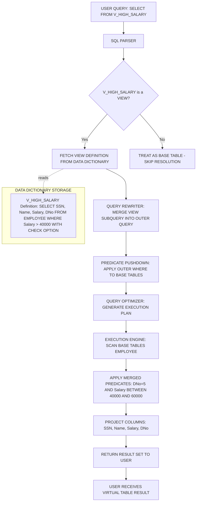
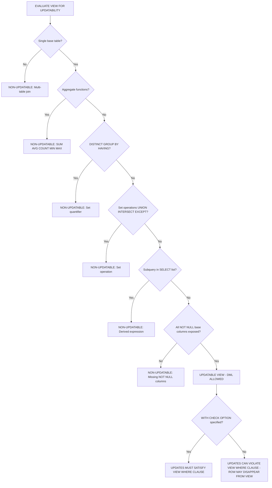
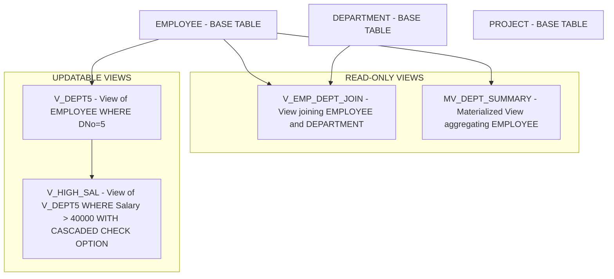
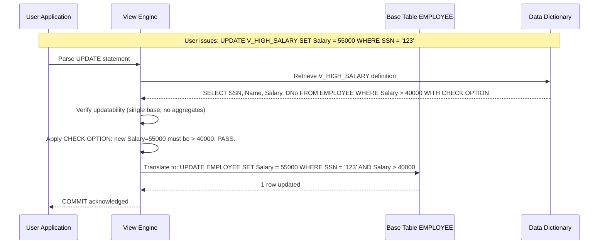

# Views

> **APJ ABDUL KALAM TECHNOLOGICAL UNIVERSITY (KTU) | 2024 SCHEME**
> - **Branch:** B.Tech in Computer Science & Engineering (CSE)
> - **Semester:** Semester 4
> - **Course:** PCCST402 - DATABASE MANAGEMENT SYSTEMS
> - **Module:** Module 2: The Relational Data Model and SQL
> - **Topic:** Views

<!-- SECTION_1_START -->
## 1. Core Technical Definition & Intuitive Overview

### 1.1 Formal Academic Definition

A **View** in the relational data model is a **virtual relation (virtual table)** that is derived from one or more base relations (or other views) and is defined by a stored SQL query expression called its **view definition** or **query specification**. Unlike base tables, a view does **not** physically store its own data; instead, the data rows exposed through a view are produced on-demand by executing the view's underlying query against the current state of the underlying base tables at the time the view is referenced.

In KTU 2024 Scheme terminology aligned with **NEP 2020 outcome-based education**, a view is a *derived relation* that is part of the external schema (or a user-defined schema) and serves three primary functions: **logical data independence, security/access control, and query simplification**. When a user issues a query against a view, the **view resolution mechanism** (also called *view materialization* or *view expansion*) substitutes the view name with the underlying query expression, producing an equivalent rewritten query that is then executed by the database engine.

> [!IMPORTANT]
> **KTU 2024 Board Definition:**
> A **VIEW** is a *dynamic, derived virtual table* whose contents are defined by a query and are materialized only when referenced. A view is stored as a **named query definition** in the system catalog (data dictionary), not as a separate set of data rows.

### 1.2 Conceptual Analogy — The "Filter Window" Intuition

Imagine you are standing outside a busy office building (the **base tables**) where hundreds of employees are working. From the street, you cannot see anything inside. However, the office management has installed **tinted glass windows** of various shapes and sizes, each showing a different curated view of the office interior:

- One window might only show the **Accounts Department** employees (a **horizontal subset**).
- Another window might show **only the Name and Phone columns** of every employee (a **vertical subset**).
- A third window might show a **joined view** that combines employee names with their project assignments from a different room in the building.

You, the **user**, only interact with the windows (the **views**). You never enter the actual office floor. If an employee's desk is moved or a new employee joins, the next time you look through the window, you automatically see the updated reality — because the glass is **tinted but transparent to current truth**.

Key mappings from this analogy:
- The **building interior** ↔ base tables (Employee, Department, Project).
- The **tinted window** ↔ the view definition (a SELECT query).
- **Looking through the window** ↔ querying the view (view resolution at runtime).
- **Changing the window's shape/tint** ↔ modifying the view definition (`CREATE OR REPLACE VIEW`).
- **Removing the window entirely** ↔ `DROP VIEW`.

> [!NOTE]
> The single most important conceptual takeaway: **A view has no independent storage of its own.** It is a *named, persistent query* stored in the data dictionary, executed lazily at reference time.

### 1.3 The Three Classical Types of Views

For KTU 2024 board purposes, students must be able to classify views into the following categories:

**1. Updatable Views (Modification-Allowed Views):**
A view is *theoretically updatable* if its definition allows the DBMS to unambiguously translate an INSERT, UPDATE, or DELETE on the view into a corresponding DML on exactly one base table row. Typical requirements: the view is derived from a single base table, contains no aggregate functions, no DISTINCT, no GROUP BY, no HAVING, no UNION, and every non-nullable base column is exposed.

**2. Read-Only Views (Non-Updatable Views):**
Any view that includes joins, aggregation (SUM, AVG, COUNT), subqueries in the SELECT list, GROUP BY, DISTINCT, or set operations is **non-updatable** in standard SQL. Such views are used purely for *read* operations (SELECT) and protect the underlying base tables from modification through that view.

**3. Materialized Views (Snapshot Views):**
A materialized view **physically stores** the query result and does *not* re-execute the query on every reference. It must be explicitly **refreshed** (REFRESH MATERIALIZED VIEW) — either *on demand* or *on commit* — to reflect changes to base tables. The KTU 2024 syllabus emphasizes *virtual* views primarily, but awareness of materialized views is essential for higher cognitive level questions.

### 1.4 Standard Metrics & Boundaries

The following constants and limits are commonly accepted defaults in standard SQL engine implementations:

- **Default updatable view row mapping**: **1 row in view ↔ 1 row in exactly 1 base table** (the unambiguous translation rule).
- **WITH CHECK OPTION scope**: applies to **INSERT and UPDATE** operations; not relevant to DELETE.
- **ANSI/ISO SQL standard clause used to mark a view as read-only**: `WITH READ ONLY`.
- **PostgreSQL `pg_views` system catalog**: stores view definitions in the `definition` column.
- **Oracle's data dictionary view**: `USER_VIEWS`, `ALL_VIEWS`, `DBA_VIEWS` exposing the `TEXT` column with the original view query.

> [!TIP]
> **GeoGebra / Desmos Visualization** is not geometrically relevant to views (this is a logical/algebraic topic). Instead, the **structural schematic in SECTION 4** provides the canonical "view resolution pipeline" that visualizes the conceptual model.

### 1.5 KTU 2024 Specific Learning Outcomes Mapped

By the end of this topic, the student must be able to:
1. **CO2 / Understand**: Define views and distinguish them from base tables.
2. **CO3 / Apply**: Construct views with arithmetic expressions, string functions, and column aliases.
3. **CO3 / Apply**: Use the `WITH CHECK OPTION` clause to enforce view-level integrity.
4. **CO4 / Analyze**: Determine the updatability of any given view and identify the base-table effects of DML through a view.

<!-- SECTION_1_END -->

<!-- SECTION_2_START -->
## 2. Deep Theoretical Analysis & KTU High-Yield Formula Sheet

### 2.1 Operational Anatomy of a View — The 5-Stage Resolution Pipeline

When a user submits a query that references a view, the SQL engine executes the following structured sequence. Understanding each step is essential for board exam answers.

**Stage 1 — Parse and Validate View Reference:**
The parser identifies the view name in the FROM clause and fetches its stored definition from the system catalog (e.g., `INFORMATION_SCHEMA.VIEWS` in MySQL/PostgreSQL, `USER_VIEWS` in Oracle).

**Stage 2 — View Merging (Query Rewrite / View Expansion):**
The DBMS's **query rewriter** substitutes the view reference with its underlying SELECT expression. This is the **merge algorithm**: the view's WHERE, FROM, and SELECT clauses are *merged* into the outer query, producing a single logical query.

**Stage 3 — Predicate Pushdown and Optimization:**
The query optimizer pushes the outer query's WHERE predicates into the merged query, eliminating rows as early as possible. This is why views do **not** inherently degrade performance when indexes exist on base tables.

**Stage 4 — Execution Against Base Tables:**
The rewritten query is executed, accessing base tables directly. There is no intermediate "view table" materialized in memory (unless the optimizer chooses to, via temporary result sets for complex views).

**Stage 5 — Result Projection and Return:**
The result set is projected through the view's column list and returned to the user. From the user's perspective, the view *behaves* like a real table.

> [!NOTE]
> Some DBMS engines (e.g., older MySQL versions) implement a **temporary table materialization** strategy for views containing aggregate functions or DISTINCT. In this strategy, the view's result is computed and stored in a temp table, then the outer query runs against the temp table. KTU 2024 does not require distinguishing between the merge and materialize strategies, but the concept is mentioned in standard DBMS textbooks.

### 2.2 The Core SQL Syntax for View Definition

The canonical form for view creation in standard SQL is:

$$
\begin{aligned}
\texttt{CREATE VIEW}\ &\texttt{view\_name}\ \texttt{[ (column\_list) ]} \\
&\texttt{AS}\ \texttt{subquery} \\
&[\ \texttt{WITH\ CHECK\ OPTION}\ ] \\
&[\ \texttt{WITH\ READ\ ONLY}\ ];
\end{aligned}
$$

Component breakdown:
- **`view_name`**: A unique identifier in the schema. Naming follows the same rules as table names.
- **`(column_list)`**: Optional explicit column names. If omitted, the view inherits the column names of the subquery.
- **`subquery`**: Any valid SELECT statement (often restricted to non-updatable constructs for updatable views).
- **`WITH CHECK OPTION`**: A **view integrity constraint** ensuring that any row inserted or updated through the view must satisfy the view's own WHERE clause — preventing the "disappearing update" anomaly.
- **`WITH READ ONLY`**: An Oracle-specific clause that explicitly disallows any DML through the view (even if it would otherwise be updatable).

### 2.3 The WITH CHECK OPTION Rule — Formal Definition

Let $V$ be a view defined by the subquery $Q$ with WHERE clause predicate $P_V$. The set of rows visible through $V$ is:

$$
V_{\text{rows}} = \{\, t \mid t \in \text{Base}(V) \ \wedge\ P_V(t) \,\}
$$

If `WITH CHECK OPTION` is specified, then any INSERT or UPDATE through $V$ must produce a row $t'$ that still satisfies $P_V$. Formally:

$$
\forall\, t' \in \text{INSERT/UPDATE}(V),\ \ \ P_V(t') = \texttt{TRUE}
$$

If `WITH CHECK OPTION` is **omitted**, a user can insert a row that does **not** satisfy $P_V$ — and the row will be successfully stored in the base table but will **disappear from the view** (a classic KTU board question trap).

**Cascaded WITH CHECK OPTION:**
When a view is defined *on top of another view*, the `CASCADED` keyword (default in Oracle) ensures that the row must satisfy the WHERE clauses of *all* underlying views in the hierarchy, not just the immediate parent.

### 2.4 Updatability Decision Rules (KTU High-Yield Decision Table)

A view is **theoretically updatable** if and only if **all** of the following conditions hold:

| # | Condition | Reason for Restriction |
|---|-----------|----------------------|
| 1 | Derived from a **single** base table (no joins) | Multi-table views create ambiguity in row mapping. |
| 2 | No **aggregate functions** (SUM, AVG, COUNT, MIN, MAX) | Aggregation collapses many rows into one — no inverse mapping exists. |
| 3 | No **DISTINCT** keyword | Removes duplicates, making row identity ambiguous. |
| 4 | No **GROUP BY** or **HAVING** | Groups many rows into one output row. |
| 5 | No **UNION**, INTERSECT, EXCEPT (set operations) | Result rows have no single-table origin. |
| 6 | All **NOT NULL** base columns are included in the view | Otherwise INSERTs would violate base-table NOT NULL constraints. |
| 7 | No subqueries in the **SELECT list** | Such expressions are not freely invertible. |
| 8 | No derived columns in the SELECT list that omit base columns needed for the inverse mapping | Inverse mapping requires that the view's rows can be uniquely traced back. |

> [!IMPORTANT]
> Even when all 8 conditions are met, a view may still be non-updatable on some DBMS implementations due to engine-specific restrictions. Always consult the system documentation. However, **for KTU 2024 board questions, the above 8-rule table is the canonical answer key.**

### 2.5 KTU Formula Sheet / Cheat Sheet

| Concept | Formal Expression | Boundary / Default | Used In |
|---------|-------------------|--------------------|---------|
| View definition storage | $D(V) = \text{stored SELECT query}$ | In data dictionary, not on disk as data | All views |
| View result set | $V(t) = \{\, t' \mid t' = Q(\text{Base}) \,\}$ | Recomputed on each reference | Virtual views |
| WITH CHECK OPTION guard | $P_V(t') = \texttt{TRUE}\ \forall\ t' \in \text{DML}(V)$ | Applies to INSERT, UPDATE only | Updatable views |
| CASCADED check | $\bigwedge_{i=1}^{n} P_{V_i}(t') = \texttt{TRUE}$ | All ancestor view predicates | Hierarchical views |
| Materialized view refresh | $V_{\text{new}} = Q(\text{Base}_{\text{current}})$ | Manual or on-commit trigger | Snapshot views |
| Updatable view row count condition | $\mid V(t) \mid = \mid \text{Base rows mapped} \mid$ | One-to-one mapping required | Updatability test |

### 2.6 Real-World Engineering Utility of Views

Views are not just an academic concept; they are foundational to production engineering systems for the following reasons:

1. **Security & Access Control (Row-Level Security):** In banking systems, a `view` can expose only the rows a specific branch is allowed to see, hiding all other rows of the same table. The base table's permissions can be revoked; users only see the view.
2. **Backward Compatibility / API Stability:** If a base table's schema must change (e.g., column renamed), the view can maintain the old column names, ensuring legacy application code continues to work.
3. **Query Simplification:** Complex multi-table joins, aggregations, and CASE expressions can be pre-packaged into a view, allowing analysts to write simple `SELECT * FROM v_sales_summary` queries.
4. **Logical Data Independence:** The external schema (views) is insulated from changes in the conceptual schema (base tables). This is the ANSI/SPARC 3-schema architecture in action.
5. **Materialized Views in Data Warehousing:** In OLAP systems, materialized views pre-compute expensive aggregations, making dashboard queries run in milliseconds instead of minutes.

<!-- SECTION_2_END -->

<!-- SECTION_3_START -->
## 3. Step-by-Step Derivations & SQL Implementation

### 3.1 Reference Schema (Used Throughout This Section)

To keep all examples concrete and exam-relevant, we define the following base tables:

$$
\begin{aligned}
\texttt{EMPLOYEE} &= (\texttt{SSN},\ \texttt{Name},\ \texttt{Bdate},\ \texttt{Address},\ \texttt{Sex},\ \texttt{Salary},\ \texttt{SuperSSN},\ \texttt{DNo}) \\
\texttt{DEPARTMENT} &= (\texttt{DNumber},\ \texttt{DName},\ \texttt{MgrSSN},\ \texttt{MgrStartDate}) \\
\texttt{PROJECT} &= (\texttt{PNumber},\ \texttt{PName},\ \texttt{PLocation},\ \texttt{DNum}) \\
\texttt{WORKS\_ON} &= (\texttt{ESSN},\ \texttt{PNo},\ \texttt{Hours})
\end{aligned}
$$

> [!NOTE]
> This is the canonical schema from the standard *Fundamentals of Database Systems* (Elmasri & Navathe) textbook used in KTU-affiliated colleges. Always use this schema for KTU 2024 board answers unless the question specifies otherwise.

### 3.2 Example 1 — Simple View (Single-Table Vertical Subset)

**Question:** Create a view that shows the name, salary, and department number of all employees in department 5.

$$
\begin{aligned}
&\texttt{CREATE VIEW}\ \texttt{V\_DEPT5\_EMPLOYEES}\ \texttt{AS} \\
&\quad \texttt{SELECT}\ \texttt{Name},\ \texttt{Salary},\ \texttt{DNo} \\
&\quad \texttt{FROM}\ \texttt{EMPLOYEE} \\
&\quad \texttt{WHERE}\ \texttt{DNo} = 5;
\end{aligned}
$$

**Line-by-line explanation:**
- `CREATE VIEW` — initiates the view definition.
- `V_DEPT5_EMPLOYEES` — a *naming convention* using `V_` prefix is a common KTU-board-accepted practice.
- `AS` — separates the view name from its definition.
- The `SELECT` query is the **view definition query** that will be re-executed on every reference.

**Querying the view:**
$$
\begin{aligned}
&\texttt{SELECT}\ *\ \texttt{FROM}\ \texttt{V\_DEPT5\_EMPLOYEES} \\
&\texttt{WHERE}\ \texttt{Salary} > 50000;
\end{aligned}
$$

The DBMS will **automatically rewrite** this to:
$$
\begin{aligned}
&\texttt{SELECT}\ \texttt{Name},\ \texttt{Salary},\ \texttt{DNo} \\
&\texttt{FROM}\ \texttt{EMPLOYEE} \\
&\texttt{WHERE}\ \texttt{DNo} = 5\ \texttt{AND}\ \texttt{Salary} > 50000;
\end{aligned}
$$

This is the **view merging** behavior — the outer WHERE predicate is **pushed down** into the base table query.

### 3.3 Example 2 — View with Derived Columns and Aliases

**Question:** Create a view showing employee name, salary, and an annual salary computed column.

$$
\begin{aligned}
&\texttt{CREATE VIEW}\ \texttt{V\_EMP\_ANNUAL}\ \texttt{(EmpName, MonthlySal, AnnualSal)}\ \texttt{AS} \\
&\quad \texttt{SELECT}\ \texttt{Name},\ \texttt{Salary},\ \texttt{Salary} * 12 \\
&\quad \texttt{FROM}\ \texttt{EMPLOYEE};
\end{aligned}
$$

**Important observations for valuation:**
- The explicit `(EmpName, MonthlySal, AnnualSal)` column list **overrides** the SELECT-list aliases.
- The derived column `Salary * 12` is **not a base table column**; it is computed on-the-fly. Such views are **read-only** because the DBMS cannot invert `Salary * 12` back to base columns during an UPDATE.

### 3.4 Example 4 — Updatable View with WITH CHECK OPTION

**Question:** Create a view of all employees earning more than \$40,000 and demonstrate the WITH CHECK OPTION behavior.

$$
\begin{aligned}
&\texttt{CREATE VIEW}\ \texttt{V\_HIGH\_SALARY}\ \texttt{AS} \\
&\quad \texttt{SELECT}\ \texttt{SSN},\ \texttt{Name},\ \texttt{Salary},\ \texttt{DNo} \\
&\quad \texttt{FROM}\ \texttt{EMPLOYEE} \\
&\quad \texttt{WHERE}\ \texttt{Salary} > 40000 \\
&\quad \texttt{WITH CHECK OPTION};
\end{aligned}
$$

**Case 1 — Allowed UPDATE (succeeds):**
$$
\begin{aligned}
&\texttt{UPDATE}\ \texttt{V\_HIGH\_SALARY} \\
&\texttt{SET}\ \texttt{Salary} = 50000 \\
&\texttt{WHERE}\ \texttt{SSN} = '123456789';
\end{aligned}
$$

The new salary (50,000) is still > 40,000, so the row remains in the view. ✅ **COMMIT succeeds.**

**Case 2 — Disallowed UPDATE (fails with CHECK OPTION violation):**
$$
\begin{aligned}
&\texttt{UPDATE}\ \texttt{V\_HIGH\_SALARY} \\
&\texttt{SET}\ \texttt{Salary} = 30000 \\
&\texttt{WHERE}\ \texttt{SSN} = '123456789';
\end{aligned}
$$

The new salary (30,000) violates the view's WHERE clause. ❌ **DBMS raises an error: "view WITH CHECK OPTION where-clause violation."** The base table is *not* updated.

**Case 3 — INSERT of an out-of-range row (without CHECK OPTION, would succeed silently):**

If the view were defined *without* `WITH CHECK OPTION`, the following INSERT would succeed but the new row would **never appear when querying the view**:
$$
\begin{aligned}
&\texttt{INSERT INTO}\ \texttt{V\_HIGH\_SALARY}\ \texttt{VALUES}\ ('999999999', \text{'John'},\ 25000,\ 4);
\end{aligned}
$$

This is the **"disappearing row" anomaly** that `WITH CHECK OPTION` is designed to prevent.

### 3.5 Example 5 — Hierarchical View with CASCADED CHECK OPTION

$$
\begin{aligned}
&\texttt{CREATE VIEW}\ \texttt{V\_DEPT5}\ \texttt{AS} \\
&\quad \texttt{SELECT}\ *\ \texttt{FROM}\ \texttt{EMPLOYEE}\ \texttt{WHERE}\ \texttt{DNo} = 5; \\
\\
&\texttt{CREATE VIEW}\ \texttt{V\_DEPT5\_HIGH\_SAL}\ \texttt{AS} \\
&\quad \texttt{SELECT}\ *\ \texttt{FROM}\ \texttt{V\_DEPT5} \\
&\quad \texttt{WHERE}\ \texttt{Salary} > 40000 \\
&\quad \texttt{WITH CASCADED CHECK OPTION};
\end{aligned}
$$

**Effective predicate for inserts/updates on `V_DEPT5_HIGH_SAL`:**
$$
P_{\text{eff}}(t) = (\texttt{DNo}(t) = 5)\ \wedge\ (\texttt{Salary}(t) > 40000)
$$

**Local vs. Cascaded distinction:**
- `WITH LOCAL CHECK OPTION` checks only the immediate parent view's predicate (i.e., only `Salary > 40000`).
- `WITH CASCADED CHECK OPTION` checks **all ancestor** predicates (`DNo = 5` AND `Salary > 40000`). The default is CASCADED in Oracle.

### 3.6 Example 6 — Non-Updatable View (Join)

$$
\begin{aligned}
&\texttt{CREATE VIEW}\ \texttt{V\_EMP\_DEPT}\ \texttt{AS} \\
&\quad \texttt{SELECT}\ \texttt{E.Name},\ \texttt{E.Salary},\ \texttt{D.DName} \\
&\quad \texttt{FROM}\ \texttt{EMPLOYEE}\ \texttt{E} \\
&\quad \texttt{JOIN}\ \texttt{DEPARTMENT}\ \texttt{D}\ \texttt{ON}\ \texttt{E.DNo} = \texttt{D.DNumber};
\end{aligned}
$$

**Why this view is non-updatable:**
- It spans **two base tables** (EMPLOYEE and DEPARTMENT).
- An UPDATE statement like `UPDATE V_EMP_DEPT SET Salary = 60000` would need to know **which base table** the column belongs to and which row to update — but the DBMS can disambiguate `Salary` to `EMPLOYEE`. However, an `INSERT` would require simultaneous row creation in *both* tables with synchronized foreign keys — SQL standard forbids this.

### 3.7 Example 7 — Materialized View (PostgreSQL Syntax)

$$
\begin{aligned}
&\texttt{CREATE MATERIALIZED VIEW}\ \texttt{MV\_DEPT\_SUMMARY}\ \texttt{AS} \\
&\quad \texttt{SELECT}\ \texttt{DNo},\ \texttt{COUNT(*)}\ \texttt{AS}\ \texttt{EmpCount},\ \texttt{AVG(Salary)}\ \texttt{AS}\ \texttt{AvgSal} \\
&\quad \texttt{FROM}\ \texttt{EMPLOYEE} \\
&\quad \texttt{GROUP BY}\ \texttt{DNo};
\end{aligned}
$$

**Refreshing the snapshot:**
$$
\begin{aligned}
&\texttt{REFRESH MATERIALIZED VIEW}\ \texttt{MV\_DEPT\_SUMMARY}; \\
&\texttt{REFRESH MATERIALIZED VIEW}\ \texttt{CONCURRENTLY}\ \texttt{MV\_DEPT\_SUMMARY}; \quad \text{(PostgreSQL \geq 9.4, requires unique index)}
\end{aligned}
$$

> [!IMPORTANT]
> **KTU 2024 board note:** Materialized views are mentioned in the syllabus under advanced view types but are not the primary focus. Be prepared to write the syntax and explain the refresh requirement, but the bulk of exam marks go to **virtual views** with `WITH CHECK OPTION`.

### 3.8 Example 8 — Python Programmatic Interaction (Using `psycopg2` with PostgreSQL)

The following Python code demonstrates the full lifecycle of a view in a production engineering context:

```python
import psycopg2
from psycopg2 import sql
from typing import Optional
import logging

logging.basicConfig(level=logging.INFO, format='%(asctime)s - %(levelname)s - %(message)s')
logger = logging.getLogger(__name__)


def get_connection() -> psycopg2.extensions.connection:
    """Establish a connection to the PostgreSQL database with strict error handling."""
    try:
        conn = psycopg2.connect(
            dbname="university_db",
            user="ktu_student",
            password="secure_password",
            host="localhost",
            port=5432
        )
        logger.info("Database connection established successfully.")
        return conn
    except psycopg2.OperationalError as e:
        logger.error(f"Failed to connect to database: {e}")
        raise


def create_view(conn: psycopg2.extensions.connection, view_name: str) -> None:
    """Create a high-salary employee view with WITH CHECK OPTION."""
    query = sql.SQL("""
        CREATE OR REPLACE VIEW {view_name} AS
            SELECT SSN, Name, Salary, DNo
            FROM EMPLOYEE
            WHERE Salary > 40000
        WITH CHECK OPTION;
    """).format(view_name=sql.Identifier(view_name))

    try:
        with conn.cursor() as cur:
            cur.execute(query)
            conn.commit()
            logger.info(f"View '{view_name}' created successfully.")
    except psycopg2.Error as e:
        conn.rollback()
        logger.error(f"Failed to create view: {e}")
        raise


def query_view(conn: psycopg2.extensions.connection, view_name: str) -> list:
    """Fetch all rows from a given view, returning a list of dictionaries."""
    query = sql.SQL("SELECT * FROM {view_name} ORDER BY Salary DESC;").format(
        view_name=sql.Identifier(view_name)
    )
    try:
        with conn.cursor() as cur:
            cur.execute(query)
            rows = cur.fetchall()
            colnames = [desc[0] for desc in cur.description]
            return [dict(zip(colnames, row)) for row in rows]
    except psycopg2.Error as e:
        logger.error(f"Failed to query view: {e}")
        raise


def attempt_violating_update(conn: psycopg2.extensions.connection, ssn: str) -> bool:
    """Attempt to update a row to a salary below the view's threshold.
       Returns True if the update succeeded, False if blocked by CHECK OPTION."""
    update_query = """
        UPDATE V_HIGH_SALARY
        SET Salary = 30000
        WHERE SSN = %s;
    """
    try:
        with conn.cursor() as cur:
            cur.execute(update_query, (ssn,))
            conn.commit()
            if cur.rowcount == 0:
                logger.warning("Update affected 0 rows.")
            return True
    except psycopg2.errors.CheckViolation as e:
        conn.rollback()
        logger.error(f"CHECK OPTION violation blocked the update: {e}")
        return False
    except psycopg2.Error as e:
        conn.rollback()
        logger.error(f"Unexpected database error: {e}")
        raise


def drop_view(conn: psycopg2.extensions.connection, view_name: str, if_exists: bool = True) -> None:
    """Drop a view from the database, with optional IF EXISTS guard."""
    exists_clause = "IF EXISTS" if if_exists else ""
    query = sql.SQL("DROP VIEW {exists} {view_name};").format(
        exists=sql.SQL(exists_clause),
        view_name=sql.Identifier(view_name)
    )
    try:
        with conn.cursor() as cur:
            cur.execute(query)
            conn.commit()
            logger.info(f"View '{view_name}' dropped successfully.")
    except psycopg2.Error as e:
        conn.rollback()
        logger.error(f"Failed to drop view: {e}")
        raise


def main() -> None:
    """Main driver function: full view lifecycle demo."""
    conn: Optional[psycopg2.extensions.connection] = None
    try:
        conn = get_connection()
        create_view(conn, "V_HIGH_SALARY")
        results = query_view(conn, "V_HIGH_SALARY")
        for row in results:
            print(row)
        success = attempt_violating_update(conn, "123456789")
        if not success:
            print("Update was correctly rejected by WITH CHECK OPTION.")
    finally:
        if conn is not None:
            conn.close()
            logger.info("Database connection closed.")


if __name__ == "__main__":
    main()
```

**Code-level explanation of important engineering choices:**
- `sql.Identifier` and `sql.SQL` from `psycopg2.sql` provide **injection-safe** schema object naming — a best-practice pattern that mirrors how production ORM systems handle dynamic identifiers.
- The `CheckViolation` exception is caught explicitly to demonstrate the **CHECK OPTION enforcement** programmatically.
- The `try-except-finally` pattern ensures connection cleanup even on failure.

### 3.9 Complete DDL & DML Lifecycle — Worked Summary Table

| Step | SQL Statement | Purpose | KTU 2024 Mark Weightage |
|------|---------------|---------|-------------------------|
| 1 | `CREATE VIEW V_X AS SELECT ...` | Define the view | 2 marks |
| 2 | `SELECT * FROM V_X WHERE ...` | Reference the view (triggers merge) | 1 mark |
| 3 | `UPDATE V_X SET ... WHERE ...` | DML through view (if updatable) | 2 marks |
| 4 | `INSERT INTO V_X VALUES (...)` | Insert (subject to CHECK OPTION) | 2 marks |
| 5 | `DROP VIEW V_X` or `DROP VIEW V_X CASCADE` | Remove view (CASCADE drops dependents) | 1 mark |

<!-- SECTION_3_END -->

<!-- SECTION_4_START -->
## 4. Structural Diagrams & Schematics

### 4.1 Mermaid Diagram — The View Resolution Pipeline

The following Mermaid flowchart visualizes the entire process that occurs when a user issues `SELECT * FROM V_HIGH_SALARY WHERE Salary > 60000;`.



> [!NOTE]
> The **dashed arrow** from step `D` to the `METADATA` subgraph represents the lookup of the view definition from the system catalog. The base table is *not* modified; the view is purely a logical construct.

### 4.2 Mermaid Diagram — Updatability Decision Tree

This diagram is a high-yield visual reference for KTU 2024 board answers where students must determine whether a view is updatable.



### 4.3 Mermaid Diagram — View Inheritance / Hierarchy



### 4.4 Mermaid Diagram — View Update Translation Mechanism



### 4.5 Sequential Processing Topology Matrix

For complex view operations where Mermaid geometry becomes dense, the following tabular topology matrix serves as an alternative reference:

| Stage | Input | Process | Output | Failure Mode |
|-------|-------|---------|--------|--------------|
| 1. Reference | View name in FROM | Dictionary lookup | SELECT query text | View does not exist |
| 2. Merge | Outer query + view SELECT | Query rewrite | Combined logical query | Cycle in view definition (recursive view) |
| 3. Validate | Combined query | Syntax + semantic check | Validated plan | Unresolved column reference |
| 4. Optimize | Validated plan | Cost-based optimization | Execution plan | Statistics unavailable |
| 5. Execute | Execution plan | Scan + filter + project | Result rows | Base table locked |
| 6. Return | Result rows | Format + transmit | User result set | Network/timeout error |

<!-- SECTION_4_END -->

<!-- SECTION_5_START -->
## 5. KTU 2024 Scheme Examination Question Bank & Topic Recap

### 5.1 Part A — Short Answer Questions (3 Marks Each)

#### **Question A.1** `[KTU University Exam - July 2024]`
**CO2 / RBT Level: Remember**
*"Define a view in SQL. List any two advantages of using views."*

**Model Answer (Valuation Key: 3 Marks):**

A view is a **virtual table** that is derived from one or more base tables (or other views) by a stored SQL query. It does not contain any physically stored data of its own; instead, the view's rows are produced dynamically by executing its defining query whenever the view is referenced.

**Two advantages:**
1. **Data Security:** Views can restrict user access to specific rows and columns of underlying base tables, providing row-level and column-level access control without modifying the base table permissions.
2. **Query Simplification:** Complex multi-table joins and aggregations can be pre-packaged into a view, allowing end-users to write simple queries against the view instead of repeating the complex logic.

> [!VALUATION NOTE]
> '[Definition of view: 1 Mark] [First advantage explained: 1 Mark] [Second advantage explained: 1 Mark]'

---

#### **Question A.2** `[KTU University Exam - Dec 2023]`
**CO3 / RBT Level: Understand**
*"What is the difference between an updatable view and a read-only view? Give one example of each."*

**Model Answer (Valuation Key: 3 Marks):**

| Aspect | Updatable View | Read-Only View |
|--------|----------------|----------------|
| DML Support | INSERT, UPDATE, DELETE allowed | Only SELECT allowed |
| Derivation | Single base table, no aggregates/joins | May include joins, aggregates, DISTINCT, GROUP BY |
| Example | `CREATE VIEW V_E AS SELECT SSN, Name FROM EMPLOYEE WHERE DNo=5;` | `CREATE VIEW V_R AS SELECT E.Name, D.DName FROM EMPLOYEE E JOIN DEPARTMENT D ON E.DNo = D.DNumber;` |

The updatable view can be modified because its rows map unambiguously to single base-table rows. The read-only view cannot, because joins create ambiguity in row mapping.

> [!VALUATION NOTE]
> '[Tabular distinction: 1.5 Marks] [Example for each: 1.5 Marks]'

---

### 5.2 Part B — Long Answer Questions (14 Marks with Internal Choice)

#### **Question B.A** `[KTU University Exam - July 2024]`
**CO3, CO4 / RBT Level: Apply, Analyze**

**(a)** Consider the following base tables for a university database:
- `STUDENT(RegNo, Name, Branch, Year, GPA)`
- `ENROLLMENT(RegNo, CourseID, Grade)`

Write the SQL DDL to create a view `V_DISTINCT_STUDENTS` that lists the **distinct RegNo and Name** of all students who have at least one enrollment, ordered by Name ascending. State whether this view is updatable and justify your answer in 2-3 lines. **[7 Marks]**

**(b)** Write the SQL DDL to create an updatable view `V_FINAL_YEAR_CS` that exposes all columns of `STUDENT` for students in Branch='CSE' AND Year=4, with `WITH CHECK OPTION`. Then write the SQL DML statements to:
   (i) Insert a new student through this view.
   (ii) Attempt to update an existing student's Year to 3 (state whether it succeeds or fails and why). **[7 Marks]**

---

**Model Solution:**

**Part (a) — 7 Marks:**

```sql
CREATE VIEW V_DISTINCT_STUDENTS AS
    SELECT DISTINCT S.RegNo, S.Name
    FROM STUDENT S
    WHERE EXISTS (
        SELECT 1 FROM ENROLLMENT E WHERE E.RegNo = S.RegNo
    )
    ORDER BY S.Name ASC;
```

*Alternative without EXISTS using JOIN:*

```sql
CREATE VIEW V_DISTINCT_STUDENTS AS
    SELECT DISTINCT S.RegNo, S.Name
    FROM STUDENT S JOIN ENROLLMENT E ON S.RegNo = E.RegNo
    ORDER BY S.Name ASC;
```

**Updatability Justification:**
This view is **NOT updatable** (read-only) because of the following two reasons:
1. It uses the `DISTINCT` keyword, which removes duplicate rows and makes row-to-base-table mapping ambiguous.
2. It involves a join between two base tables (`STUDENT` and `ENROLLMENT`), which violates the single-base-table requirement for updatability.

> [!VALUATION KEY — Part (a)]
> '[Correct CREATE VIEW syntax: 3 Marks] [Correct SELECT logic (JOIN or EXISTS): 2 Marks] [Updatability decision + 2-line justification: 2 Marks]'

---

**Part (b) — 7 Marks:**

**Step 1 — View Definition:**

```sql
CREATE VIEW V_FINAL_YEAR_CS AS
    SELECT *
    FROM STUDENT
    WHERE Branch = 'CSE' AND Year = 4
    WITH CHECK OPTION;
```

**Step 2 — INSERT Statement (i):**

```sql
INSERT INTO V_FINAL_YEAR_CS (RegNo, Name, Branch, Year, GPA)
VALUES ('S2024CSE101', 'Ananya Krishnan', 'CSE', 4, 8.7);
```

This insert will **succeed** because the new row satisfies both `Branch = 'CSE'` and `Year = 4`, complying with the `WITH CHECK OPTION` constraint.

**Step 3 — UPDATE Statement (ii):**

```sql
UPDATE V_FINAL_YEAR_CS
SET Year = 3
WHERE RegNo = 'S2024CSE101';
```

This update will **FAIL**. The DBMS will raise a CHECK OPTION violation error (Oracle: `ORA-01402: view WITH CHECK OPTION where-clause violation`; PostgreSQL: `new row violates check option for view`). The reason: the new value `Year = 3` does not satisfy the view's WHERE clause (`Year = 4`), and `WITH CHECK OPTION` prohibits any UPDATE that would cause a row to disappear from the view.

> [!VALUATION KEY — Part (b)]
> '[CREATE VIEW with WITH CHECK OPTION: 2 Marks] [Valid INSERT: 2 Marks] [UPDATE statement + correct failure reason: 3 Marks]'

---

#### **Question B.B (Alternative Choice)** `[KTU University Exam - Dec 2023]`
**CO3, CO4 / RBT Level: Apply, Analyze**

**(a)** Explain the term **WITH CHECK OPTION** in the context of views. What problem does it solve? Provide a small example illustrating the "disappearing update anomaly" and show how WITH CHECK OPTION prevents it. **[7 Marks]**

**(b)** Differentiate between **virtual views** and **materialized views**. Create a materialized view `MV_BRANCH_STATS` that shows the branch name, total student count, and average GPA for each branch. Write the refresh command and explain when refresh should be triggered in a real-world data warehouse scenario. **[7 Marks]**

---

**Model Solution:**

**Part (a) — 7 Marks:**

**Definition:**
`WITH CHECK OPTION` is an optional clause in the `CREATE VIEW` statement that enforces an **integrity constraint** on the view itself. It ensures that any row inserted or updated through the view must continue to satisfy the WHERE clause of the view's defining query — otherwise the DML operation is rejected by the DBMS.

**Problem Solved:**
Without `WITH CHECK OPTION`, a user can insert or update a row through the view in such a way that the row no longer satisfies the view's WHERE clause. The DBMS will perform the modification on the base table successfully, but the modified/inserted row will **disappear** from subsequent queries on the view — because it no longer matches the view's filter. This is the **disappearing update anomaly**.

**Example:**

*Step 1 — View defined WITHOUT CHECK OPTION:*

```sql
CREATE VIEW V_2024_BATCH AS
    SELECT RegNo, Name, Branch, Year
    FROM STUDENT
    WHERE Year = 2024;
```

*Step 2 — An update that causes the row to disappear:*

```sql
UPDATE V_2024_BATCH
SET Year = 2023
WHERE RegNo = 'S2024CSE001';
```

The DBMS executes the update on the STUDENT table. The student's year becomes 2023. Now, `SELECT * FROM V_2024_BATCH WHERE RegNo = 'S2024CSE001';` returns **zero rows** — the student has "disappeared" from the view even though the update succeeded.

*Step 3 — Prevention using WITH CHECK OPTION:*

```sql
CREATE VIEW V_2024_BATCH_SAFE AS
    SELECT RegNo, Name, Branch, Year
    FROM STUDENT
    WHERE Year = 2024
    WITH CHECK OPTION;
```

Now, the same UPDATE statement `SET Year = 2023` is **rejected by the DBMS** with a CHECK OPTION violation error, because the new value would violate the view's WHERE clause (`Year = 2024`).

> [!VALUATION KEY — Part (a)]
> '[Definition of WITH CHECK OPTION: 2 Marks] [Problem explanation (disappearing anomaly): 2 Marks] [Example showing the anomaly: 2 Marks] [WITH CHECK OPTION prevention: 1 Mark]'

---

**Part (b) — 7 Marks:**

**Comparison Table:**

| Aspect | Virtual View | Materialized View |
|--------|--------------|-------------------|
| Storage | Definition only (in data dictionary) | Physically stores query result on disk |
| Recomputation | On every reference (live) | Only on explicit REFRESH (snapshot) |
| Freshness | Always current | Stale until refreshed |
| Performance | Slower for complex queries (re-executes) | Faster reads (pre-computed) |
| Use Case | OLTP, simple access control | OLAP, dashboards, data warehousing |
| Refresh Cost | Zero (lazy) | High (full or incremental recompute) |

**Step 1 — Materialized View Creation (PostgreSQL syntax):**

```sql
CREATE MATERIALIZED VIEW MV_BRANCH_STATS AS
    SELECT Branch,
           COUNT(*)    AS TotalStudents,
           AVG(GPA)    AS AverageGPA
    FROM STUDENT
    GROUP BY Branch;
```

**Step 2 — Refresh Command:**

```sql
REFRESH MATERIALIZED VIEW MV_BRANCH_STATS;
```

*Concurrent refresh (avoids exclusive lock on the view, requires a unique index):*

```sql
CREATE UNIQUE INDEX idx_mv_branch ON MV_BRANCH_STATS (Branch);
REFRESH MATERIALIZED VIEW CONCURRENTLY MV_BRANCH_STATS;
```

**Step 3 — When to Refresh in a Data Warehouse:**

In real-world data warehouse scenarios, materialized views are refreshed according to a schedule aligned with the **ETL (Extract, Transform, Load) cycle**:

1. **Periodic Batch Refresh (Nightly):** Trigger the REFRESH command at the end of each nightly ETL job. The data warehouse loads new transactions into base tables during the night, and the materialized view is refreshed in the early morning before business hours. This is the most common pattern in enterprise data warehouses.
2. **On-Commit Refresh (Real-Time, Oracle-specific):** Configure the materialized view to refresh automatically whenever a transaction commits on the base table. This is suitable for low-throughput OLAP systems where near-real-time freshness is required.
3. **On-Demand Refresh (Ad-hoc):** A data analyst manually triggers REFRESH after running a custom data correction. This is suitable for development environments and one-off reporting needs.

> [!VALUATION KEY — Part (b)]
> '[Comparison table with at least 3 rows: 2 Marks] [Correct CREATE MATERIALIZED VIEW syntax: 2 Marks] [REFRESH command: 1 Mark] [Real-world refresh scenario explanation: 2 Marks]'

---

> [!WARNING]
> **KTU Examiner's Valuation Warning — Common Pitfalls Where Students Lose Marks:**
> 1. **Forgetting `WITH CHECK OPTION` syntax:** Many students write `WITH CHECK` (incorrect) instead of `WITH CHECK OPTION`. The full clause is required.
> 2. **Confusing `WITH READ ONLY` and `WITH CHECK OPTION`:** `WITH READ ONLY` is an **Oracle-specific** clause that disallows all DML; `WITH CHECK OPTION` *allows* DML but enforces the view's WHERE clause. They are not interchangeable.
> 3. **Believing JOIN views are always non-updatable:** In some DBMSs (e.g., PostgreSQL with `INSTEAD OF` triggers), even a join view can be made updatable. The KTU 2024 syllabus answer key, however, follows the SQL standard: **joins = non-updatable by default**.
> 4. **Writing `DROP TABLE` instead of `DROP VIEW`:** A view cannot be dropped with `DROP TABLE`. Use `DROP VIEW view_name` or `DROP VIEW view_name CASCADE` (CASCADE removes dependent objects like other views built on top).
> 5. **Forgetting to specify column list when SELECT contains computed expressions:** If the SELECT list contains `Salary * 12 AS Annual`, the view must either have an explicit column list `CREATE VIEW V (Name, AnnualSal) AS ...` or the alias must be used. Omitting both causes DBMS errors.
> 6. **Assuming materialized views are automatically updated:** Unlike virtual views, materialized views **never** auto-update. The student must write REFRESH commands or schedule them.

---

### 5.3 Topic Recap & Important Things to Remember

> [!TIP]
> **Rapid Revision Checklist — Pin This Before the Exam:**

- **Definition:** A view is a *virtual, derived table* defined by a stored SELECT query; it has **no independent data storage**.
- **Storage Location:** View **definition** lives in the system catalog (data dictionary); view **data** is computed on-the-fly.
- **CREATE VIEW syntax:** `CREATE VIEW view_name [(col_list)] AS subquery [WITH CHECK OPTION] [WITH READ ONLY];`
- **Three view types:** (i) Updatable, (ii) Read-Only (non-updatable), (iii) Materialized (snapshot).
- **Updatability requires:** single base table + no aggregates + no DISTINCT + no GROUP BY/HAVING + no set ops + no subquery in SELECT + all NOT NULL columns exposed.
- **WITH CHECK OPTION:** prevents INSERTs/UPDATEs that would cause the affected row to violate the view's WHERE clause (prevents "disappearing row anomaly").
- **LOCAL vs. CASCADED CHECK OPTION:** LOCAL checks only the immediate parent view; CASCADED (default) checks all ancestor views.
- **View Resolution:** The DBMS performs *view merging* — substituting the view name with its subquery and pushing outer WHERE predicates into the base query.
- **Drop view:** `DROP VIEW view_name;` or `DROP VIEW view_name CASCADE;` to drop dependent views.
- **Materialized view REFRESH:** Must be explicit. `REFRESH MATERIALIZED VIEW mv_name;` in PostgreSQL; `DBMS_MVIEW.REFRESH` in Oracle.
- **Real-world use cases:** Row-level security, query simplification, API stability across schema changes, OLAP dashboard acceleration, logical data independence (ANSI/SPARC external schema).
- **KTU 2024 high-weight question pattern:** "Create a view on EMPLOYEE/DEPARTMENT schema with WITH CHECK OPTION and demonstrate DML behavior." Practice this exact pattern with the Elmasri schema.
- **Common pitfalls:** `DROP TABLE` on views (wrong), `WITH CHECK` without `OPTION` (wrong), assuming materialized views auto-refresh (wrong), believing `WITH READ ONLY` and `WITH CHECK OPTION` are the same (wrong).

<!-- SECTION_5_END -->
