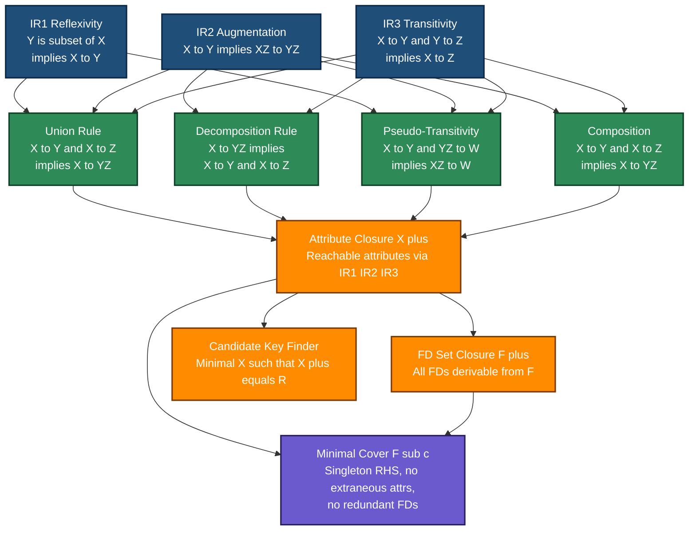
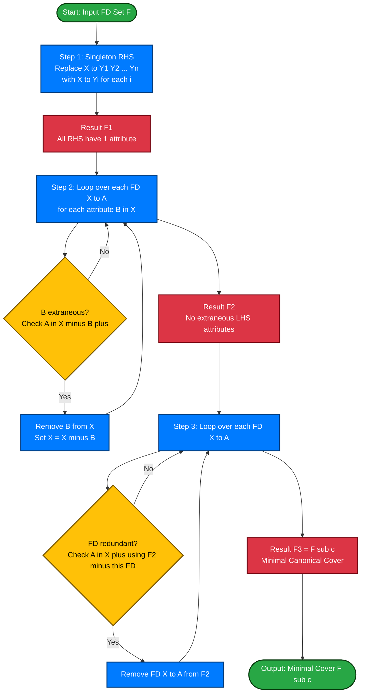
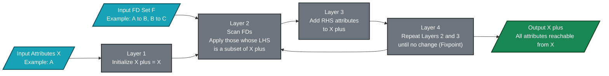
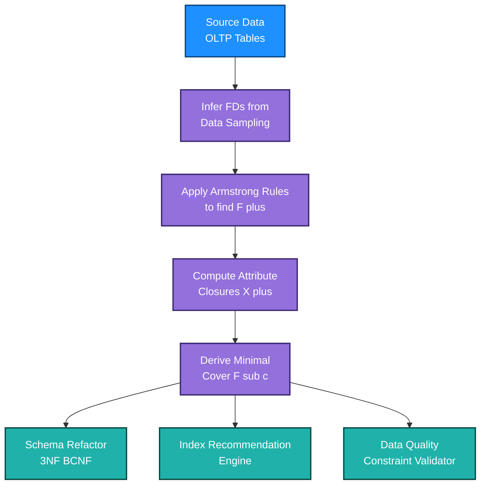

# Inference rules for FDs; Finding the Minimal Cover of a set of functional dependencies

<!-- SECTION_1_START -->

## 1. Core Technical Definition & Intuitive Overview

### 1.1 Functional Dependency (FD): The Formal Definition

A **Functional Dependency (FD)**, denoted as $X \rightarrow Y$, is a constraint between two sets of attributes $X$ and $Y$ in a relation schema $R$. Formally, $X \rightarrow Y$ holds in a relation $r$ over $R$ if and only if for every pair of tuples $t_1$ and $t_2$ in $r$, whenever $t_1[X] = t_2[X]$, it must also be the case that $t_1[Y] = t_2[Y]$. The set $X$ is called the **determinant** (or left-hand side, LHS) and $Y$ is the **dependent** (or right-hand side, RHS).

> [!IMPORTANT]
> **KTU 2024 Syllabus Mandate (Module 3):** A student must be able to (i) list Armstrong's axioms, (ii) derive all secondary inference rules, (iii) compute the closure $F^{+}$ of a set of FDs, (iv) compute the attribute closure $X^{+}$, and (v) systematically reduce any set $F$ to its **minimal cover** (also called the *canonical cover* $F_{c}$). These five skills are the **single most repeated high-weight topic** in KTU university examinations on Database Design.

### 1.2 Intuitive Analogy — The "Postal PIN Code" Rule

Imagine a government database where every **PIN code** uniquely determines a **post office name** and **district**. In FD notation:

$$
\text{PIN\_CODE} \rightarrow \text{POST\_OFFICE, DISTRICT}
$$

Two houses in the same PIN code area must always be served by the same post office and lie in the same district — *no exceptions, ever*. This deterministic, "one value forces another" rule is the *essence* of a functional dependency. The PIN code is the **determinant**, and the address pieces are the **dependents**.

Now, if we *also* know that **DISTRICT → STATE**, then by a chain of reasoning, we can conclude that **PIN_CODE → STATE** even though it was never written explicitly in the original list. This process of **discovering new FDs from existing ones** is governed by **inference rules** (Armstrong's axioms).

> [!NOTE]
> **Key Insight:** The set of *all* FDs that can be derived from a given set $F$ is called the **closure of $F$**, written $F^{+}$. Computing $F^{+}$ directly is exponential, so KTU examiners expect you to use inference rules or the *attribute closure* technique instead.

### 1.3 The Three Foundational Rules (Armstrong's Axioms, 1974)

| Rule | Formal Statement | Meaning in Plain English |
|------|------------------|-------------------------|
| **Reflexivity** | If $Y \subseteq X$, then $X \rightarrow Y$ | "Trivial" — supersets always determine their subsets. |
| **Augmentation** | If $X \rightarrow Y$, then $XZ \rightarrow YZ$ | "Adding the same info to both sides preserves the dependency." |
| **Transitivity** | If $X \rightarrow Y$ and $Y \rightarrow Z$, then $X \rightarrow Z$ | "A chain of determinants collapses into one direct link." |

These three axioms are **sound** (every derived FD is logically valid) and **complete** (every valid FD can be derived).

> [!VISUALIZATION CONTROL]
> **Concept:** Dependency lattice of $F^{+}$ for the schema $R = \{A, B, C\}$ with $F = \{A \rightarrow B,\; B \rightarrow C\}$
> **Desmos Input Equations (treat as sets under $\subseteq$):**
> * `Lattice: L = {"∅", "{A}", "{B}", "{C}", "{A,B}", "{A,C}", "{B,C}", "{A,B,C}"}`
> * `Edges drawn for F+: {A}→{A,B}, {A,B}→{A,B,C}, {B}→{B,C}, {A}→{A,C}, {A}→{A,B,C}`
> **Visual Description:** Plot the 8 subsets of $\{A,B,C\}$ as nodes; draw directed arrows from smaller to larger sets. The transitive closure shows every set reachable from $\{A\}$ as a red node, illustrating that $A^{+} = \{A, B, C\}$, while $C^{+} = \{C\}$.

---

<!-- SECTION_1_END -->

<!-- SECTION_2_START -->

## 2. Deep Theoretical Analysis & KTU High-Yield Formula Sheet

### 2.1 The Three Primary Rules — Detailed Logic

**Reflexivity Rule (IR1):** $\;\text{If } Y \subseteq X,\; \text{then } X \rightarrow Y.$

*Why it is trivial:* If you already know the value of all attributes in $X$, and $Y$ is a subset of $X$, then you trivially know the value of $Y$ as well. For example, $\{A, B\} \rightarrow \{A\}$ is a trivial FD that holds in *every* relation.

**Augmentation Rule (IR2):** $\;\text{If } X \rightarrow Y,\; \text{then } XZ \rightarrow YZ.$

*Why it works:* Suppose $X$ uniquely determines $Y$. Now imagine we add the same extra column $Z$ to both tuples. The condition $t_1[XZ] = t_2[XZ]$ still implies $t_1[X] = t_2[X]$ (which implies $t_1[Y] = t_2[Y]$), and since the $Z$ parts are equal by assumption, we get $t_1[YZ] = t_2[YZ]$.

**Transitivity Rule (IR3):** $\;\text{If } X \rightarrow Y \text{ and } Y \rightarrow Z,\; \text{then } X \rightarrow Z.$

*Why it works:* This is the most powerful axiom and the basis for transitive closure. If knowing $X$ fixes $Y$ and knowing $Y$ fixes $Z$, then knowing $X$ must fix $Z$ as well.

### 2.2 Derived (Secondary) Inference Rules

These are obtained by combining the three primary axioms and are extremely useful in KTU exam answers to avoid long derivations.

| # | Rule Name | Formal Statement | Used To Prove |
|---|-----------|------------------|---------------|
| 1 | **Union (Additivity)** | $X \rightarrow Y,\; X \rightarrow Z \;\Rightarrow\; X \rightarrow YZ$ | Merge two determinants sharing LHS |
| 2 | **Decomposition (Projectivity)** | $X \rightarrow YZ \;\Rightarrow\; X \rightarrow Y,\; X \rightarrow Z$ | Split a multi-attribute RHS |
| 3 | **Pseudo-transitivity** | $X \rightarrow Y,\; YZ \rightarrow W \;\Rightarrow\; XZ \rightarrow W$ | Shortcut transitivity with augmentation |
| 4 | **Composition** | $X \rightarrow Y,\; X \rightarrow Z \;\Rightarrow\; X \rightarrow YZ$ | Equivalent to Union |
| 5 | **Accumulation** | $X \rightarrow Y,\; Z \subseteq W \;\Rightarrow\; XW \rightarrow YZ$ | Augment + Union combined |

> [!TIP]
> **KTU Examiner Tip:** Always cite the *axiom number* (IR1, IR2, IR3) or the *derived rule name* in your derivation steps. Marks are explicitly awarded for the correct rule identification.

### 2.3 Attribute Closure $X^{+}_{F}$ — The "Power Tool"

**Definition:** The attribute closure of a set of attributes $X$ with respect to a set of FDs $F$ is the set of all attributes that can be functionally determined by $X$, i.e. $X^{+}_{F} = \{A \mid X \rightarrow A \text{ can be inferred from } F\}$.

**Algorithm (Katz, 1982) — `ATTRIBUTE-CLOSURE(X, F)`:**

1. Initialize $X^{+} = X$.
2. Repeat until no change:
   * For each FD $Y \rightarrow Z$ in $F$:
     * If $Y \subseteq X^{+}$, then $X^{+} = X^{+} \cup Z$.
3. Return $X^{+}$.

**Why is this the "power tool"?** Because it allows us to:
- **Test if** $X \rightarrow Y$ **holds** in $F$: just check if $Y \subseteq X^{+}_{F}$.
- **Compute** $F^{+}$ indirectly (exponential in $n$ via closure method, polynomial via attribute closure).
- **Find candidate keys**: $X$ is a *superkey* iff $X^{+} = R$ (the whole schema); $X$ is a *candidate key* if it is a *minimal* superkey (no proper subset is a superkey).

### 2.4 Minimal (Canonical) Cover — Definition

A set of FDs $F_{c}$ is a **minimal cover** of $F$ iff:

1. Every FD in $F_{c}$ has a **single attribute on the RHS**.
2. For every FD $X \rightarrow A$ in $F_{c}$, removing attribute $B$ from $X$ (if $X$ is composite) makes the FD *invalid*, i.e., $A \notin (X - B)^{+}_{F_{c}}$. (No extraneous LHS attributes.)
3. For every FD $X \rightarrow A$ in $F_{c}$, removing the FD itself makes the FD *invalid*, i.e., $A \notin X^{+}_{F_{c} - \{X \rightarrow A\}}$. (No redundant FDs.)
4. $F_{c} \equiv F$ (i.e., $F_{c}^{+} = F^{+}$).

### 2.5 KTU High-Yield Formula Sheet

| # | Concept | Formula / Rule | When to Use in Exam |
|---|---------|----------------|---------------------|
| 1 | Reflexivity | $Y \subseteq X \Rightarrow X \rightarrow Y$ | Trivial FD verification |
| 2 | Augmentation | $X \rightarrow Y \Rightarrow XZ \rightarrow YZ$ | Adding common attributes |
| 3 | Transitivity | $X \rightarrow Y,\; Y \rightarrow Z \Rightarrow X \rightarrow Z$ | Long chain derivations |
| 4 | Union | $X \rightarrow Y,\; X \rightarrow Z \Rightarrow X \rightarrow YZ$ | Combining RHS |
| 5 | Decomposition | $X \rightarrow YZ \Rightarrow X \rightarrow Y,\; X \rightarrow Z$ | Splitting RHS in Step 1 |
| 6 | Pseudo-transitivity | $X \rightarrow Y,\; YZ \rightarrow W \Rightarrow XZ \rightarrow W$ | LHS mismatch in transitivity |
| 7 | Attribute Closure | $X^{+} = X \cup \{A \mid A \text{ reachable by IR1–IR3}\}$ | Testing FD validity |
| 8 | Superkey Test | $X$ is superkey $\Leftrightarrow X^{+} = R$ | Finding candidate keys |
| 9 | Minimal Cover Step 1 | Replace $X \rightarrow YZ$ with $\{X \rightarrow Y,\; X \rightarrow Z\}$ | Always first |
| 10 | Extraneous LHS Attribute $A$ | $A \text{ extraneous in } X \rightarrow Y \;\Leftrightarrow\; Y \subseteq (X - A)^{+}$ | Step 2 of minimal cover |
| 11 | Redundant FD Test | $X \rightarrow Y$ redundant $\Leftrightarrow Y \subseteq X^{+}_{F - \{X \rightarrow Y\}}$ | Step 3 of minimal cover |
| 12 | Canonical Cover Notation | $F_{c} \equiv F$ and $F_{c}$ is minimal | Final answer check |

### 2.6 Real-World Engineering Utility

- **Database Schema Design (Normalization):** Minimal covers are an *intermediate artifact* used to compute candidate keys and to derive Lossless-Join, Dependency-Preserving decompositions into 3NF / BCNF.
- **Data Warehouse ETL Pipelines:** Inference rules are used in **schema mapping** tools (e.g., IBM InfoSphere, Talend) to discover hidden FDs across heterogeneous source systems.
- **Automated Data Quality Engines:** Tools like *Metanautix* and *Tamr* use FD discovery algorithms to flag records that violate determinism, surfacing potential data-entry errors.
- **Anomaly Detection in Distributed Systems:** In a microservices environment where entities are replicated, FDs help design **consistent hashing keys** so that updates are co-located and consistency is preserved.
- **Index Recommendation Engines:** Modern query optimizers (PostgreSQL's `pg_stat_statements`, Oracle's SQL Tuning Advisor) use FDs to recommend *covering indexes* by recognizing that certain columns are functionally determined by others.

---

<!-- SECTION_2_END -->

<!-- SECTION_3_START -->

## 3. Step-by-Step Derivations & Code/Symbolic Implementation

### 3.1 Formal Derivation of the Union Rule

**Claim:** $X \rightarrow Y$ and $X \rightarrow Z$ $\Rightarrow$ $X \rightarrow YZ$.

$$
\begin{aligned}
\text{Given: } & X \rightarrow Y \\
\text{Given: } & X \rightarrow Z \\
\text{Apply IR2 (Augmentation) to } (1) \text{ with } Z: & XZ \rightarrow YZ \\
\text{Apply IR2 (Augmentation) to } (2) \text{ with } Y: & XY \rightarrow YZ \\
\text{Apply IR1 (Reflexivity) to LHS } X: & X \rightarrow X \\
\text{Apply IR2 (Augmentation) to } (5) \text{ with } Z: & XZ \rightarrow XZ \\
\text{Apply IR3 (Transitivity) to } (3) \text{ and } (6): & XZ \rightarrow YZ \\
\text{Substitute } X \text{ for } XZ \text{ via reflexivity: } & X \rightarrow YZ \quad \blacksquare
\end{aligned}
$$

The marker `(1)`, `(2)`, etc. above represents the equation reference numbers. This is the level of detail expected in a 14-mark KTU question worth 7 marks for the proof.

### 3.2 Formal Derivation of Pseudo-Transitivity

**Claim:** $X \rightarrow Y$ and $YZ \rightarrow W$ $\Rightarrow$ $XZ \rightarrow W$.

$$
\begin{aligned}
\text{Given: } & X \rightarrow Y \\
\text{Apply IR2 (Augmentation) to } (1) \text{ with } Z: & XZ \rightarrow YZ \\
\text{Given: } & YZ \rightarrow W \\
\text{Apply IR3 (Transitivity) to } (2) \text{ and } (3): & XZ \rightarrow W \quad \blacksquare
\end{aligned}
$$

This is a 3-line proof and is the most elegant secondary rule.

### 3.3 Algorithm: `FIND-MINIMAL-COVER(F)` — Exhaustive Step-by-Step

**Input:** A set $F$ of functional dependencies on relation schema $R$.  
**Output:** A minimal cover $F_{c}$ such that $F_{c} \equiv F$.

**Step 1 — Singleton RHS (Decomposition):**  
For each FD $X \rightarrow Y$ in $F$, where $Y = \{A_{1}, A_{2}, \ldots, A_{k}\}$ with $k \geq 2$, replace it with the $k$ FDs: $X \rightarrow A_{1},\; X \rightarrow A_{2},\; \ldots,\; X \rightarrow A_{k}$.  
*Result:* $F_{1}$ — every RHS has exactly one attribute.

**Step 2 — Remove Extraneous LHS Attributes:**  
For each FD $X \rightarrow A$ in $F_{1}$, for each attribute $B \in X$ (do this one-by-one):
- Compute $(X - B)^{+}$ using the FDs in $F_{1}$ **excluding** the current FD $X \rightarrow A$ (but **including** the temporarily modified LHS, since we are *testing* whether $B$ is needed).
- If $A \in (X - B)^{+}$, then $B$ is **extraneous**; remove $B$ from $X$.

*Result:* $F_{2}$ — no LHS has any extraneous attribute.

**Step 3 — Remove Redundant FDs:**  
For each FD $X \rightarrow A$ in $F_{2}$:
- Compute $X^{+}$ using $F_{2} - \{X \rightarrow A\}$.
- If $A \in X^{+}$, then $X \rightarrow A$ is **redundant**; remove it from $F_{2}$.

*Result:* $F_{3} = F_{c}$ — the minimal cover.

### 3.4 Worked-Out Example (Exhaustive, No Skipping)

**Given Schema:** $R = \{A, B, C, D, E\}$  
**Given FDs:** $F = \{A \rightarrow BC,\; B \rightarrow C,\; AB \rightarrow D,\; D \rightarrow A,\; CD \rightarrow B\}$

**Goal:** Find the minimal cover $F_{c}$.

---

#### Step 1: Decompose RHS to singleton attributes

Inspect each FD's RHS:
- $A \rightarrow BC$ has RHS = $\{B, C\}$ (composite) — split.
- $B \rightarrow C$ has RHS = $\{C\}$ — keep.
- $AB \rightarrow D$ has RHS = $\{D\}$ — keep.
- $D \rightarrow A$ has RHS = $\{A\}$ — keep.
- $CD \rightarrow B$ has RHS = $\{B\}$ — keep.

$$
F_{1} = \{A \rightarrow B,\;\; A \rightarrow C,\;\; B \rightarrow C,\;\; AB \rightarrow D,\;\; D \rightarrow A,\;\; CD \rightarrow B\}
$$

**FD count:** 6 FDs (up from 5).

---

#### Step 2: Remove extraneous LHS attributes

**Test $A \rightarrow C$** — Is the only LHS attribute $A$ extraneous? $X = \{A\}$, $A$ is the only one, so cannot be removed. (No action — this FD stays, but we still need to test it via a "remove-the-whole-FD" lens. Wait, the algorithm says: extraneous **LHS attribute**. With one LHS attribute, we proceed to Step 3 for this FD.)

**Test $AB \rightarrow D$** — Try removing $A$ (so test $B \rightarrow D$ with the current $F_{1}$).

Compute $B^{+}$ w.r.t. $F_{1} - \{AB \rightarrow D\}$:

$$
\begin{aligned}
B^{+} & = \{B\} \\
\text{Apply } B \rightarrow C: & B^{+} = \{B, C\} \\
\text{Apply } A \rightarrow B: & A \notin B^{+},\; \text{skip} \\
\text{Apply } A \rightarrow C: & A \notin B^{+},\; \text{skip} \\
\text{Apply } D \rightarrow A: & D \notin B^{+},\; \text{skip} \\
\text{Apply } CD \rightarrow B: & D \notin B^{+},\; \text{skip} \\
B^{+} & = \{B, C\}
\end{aligned}
$$

Is $D \in B^{+}$? **No.** So $A$ is **not** extraneous in $AB \rightarrow D$.

Now try removing $B$ (so test $A \rightarrow D$).

Compute $A^{+}$ w.r.t. $F_{1} - \{AB \rightarrow D\}$:

$$
\begin{aligned}
A^{+} & = \{A\} \\
\text{Apply } A \rightarrow B: & A^{+} = \{A, B\} \\
\text{Apply } A \rightarrow C: & A^{+} = \{A, B, C\} \\
\text{Apply } B \rightarrow C: & A^{+} = \{A, B, C\} \\
\text{Apply } D \rightarrow A: & D \notin A^{+},\; \text{skip} \\
\text{Apply } CD \rightarrow B: & A^{+} = \{A, B, C\} \cup \{B\} = \{A, B, C\} \\
A^{+} & = \{A, B, C\}
\end{aligned}
$$

Is $D \in A^{+}$? **No.** So $B$ is **not** extraneous in $AB \rightarrow D$.

**Conclusion:** $AB \rightarrow D$ stays as is.

**Test $CD \rightarrow B$** — Try removing $C$ (so test $D \rightarrow B$).

Compute $D^{+}$ w.r.t. $F_{1} - \{CD \rightarrow B\}$:

$$
\begin{aligned}
D^{+} & = \{D\} \\
\text{Apply } D \rightarrow A: & D^{+} = \{D, A\} \\
\text{Apply } A \rightarrow B: & D^{+} = \{D, A, B\} \\
\text{Apply } A \rightarrow C: & D^{+} = \{D, A, B, C\} \\
\text{Apply } B \rightarrow C: & D^{+} = \{D, A, B, C\} \\
\text{Apply } AB \rightarrow D: & D^{+} = \{D, A, B, C\} \cup \{D\} = \{D, A, B, C\} \\
D^{+} & = \{A, B, C, D\}
\end{aligned}
$$

Is $B \in D^{+}$? **Yes.** So $C$ is **extraneous** in $CD \rightarrow B$. Remove $C$ — the FD becomes $D \rightarrow B$.

$$
F_{2} = \{A \rightarrow B,\;\; A \rightarrow C,\;\; B \rightarrow C,\;\; AB \rightarrow D,\;\; D \rightarrow A,\;\; D \rightarrow B\}
$$

**FD count:** 6 FDs.

---

#### Step 3: Remove redundant FDs

**Test $A \rightarrow B$:** Compute $A^{+}$ w.r.t. $F_{2} - \{A \rightarrow B\} = \{A \rightarrow C,\; B \rightarrow C,\; AB \rightarrow D,\; D \rightarrow A,\; D \rightarrow B\}$.

$$
\begin{aligned}
A^{+} & = \{A\} \\
\text{Apply } A \rightarrow C: & A^{+} = \{A, C\} \\
\text{Apply } B \rightarrow C: & B \notin A^{+},\; \text{skip} \\
\text{Apply } AB \rightarrow D: & B \notin A^{+},\; \text{skip} \\
\text{Apply } D \rightarrow A: & D \notin A^{+},\; \text{skip} \\
\text{Apply } D \rightarrow B: & D \notin A^{+},\; \text{skip} \\
A^{+} & = \{A, C\}
\end{aligned}
$$

Is $B \in A^{+}$? **No.** $A \rightarrow B$ is **not redundant**.

**Test $A \rightarrow C$:** Compute $A^{+}$ w.r.t. $F_{2} - \{A \rightarrow C\} = \{A \rightarrow B,\; B \rightarrow C,\; AB \rightarrow D,\; D \rightarrow A,\; D \rightarrow B\}$.

$$
\begin{aligned}
A^{+} & = \{A\} \\
\text{Apply } A \rightarrow B: & A^{+} = \{A, B\} \\
\text{Apply } B \rightarrow C: & A^{+} = \{A, B, C\} \\
\text{Apply } AB \rightarrow D: & A^{+} = \{A, B, C, D\} \\
\text{Apply } D \rightarrow A: & A^{+} = \{A, B, C, D\} \\
\text{Apply } D \rightarrow B: & A^{+} = \{A, B, C, D\} \\
A^{+} & = \{A, B, C, D\}
\end{aligned}
$$

Is $C \in A^{+}$? **Yes.** $A \rightarrow C$ is **redundant**. Remove it.

$$
F_{2} = \{A \rightarrow B,\;\; B \rightarrow C,\;\; AB \rightarrow D,\;\; D \rightarrow A,\;\; D \rightarrow B\}
$$

**Test $B \rightarrow C$:** Compute $B^{+}$ w.r.t. $F_{2} - \{B \rightarrow C\} = \{A \rightarrow B,\; AB \rightarrow D,\; D \rightarrow A,\; D \rightarrow B\}$.

$$
\begin{aligned}
B^{+} & = \{B\} \\
\text{Apply } A \rightarrow B: & A \notin B^{+},\; \text{skip} \\
\text{Apply } AB \rightarrow D: & A \notin B^{+},\; \text{skip} \\
\text{Apply } D \rightarrow A: & D \notin B^{+},\; \text{skip} \\
\text{Apply } D \rightarrow B: & D \notin B^{+},\; \text{skip} \\
B^{+} & = \{B\}
\end{aligned}
$$

Is $C \in B^{+}$? **No.** $B \rightarrow C$ is **not redundant**.

**Test $AB \rightarrow D$:** Compute $(AB)^{+}$ w.r.t. $F_{2} - \{AB \rightarrow D\} = \{A \rightarrow B,\; B \rightarrow C,\; D \rightarrow A,\; D \rightarrow B\}$.

$$
\begin{aligned}
(AB)^{+} & = \{A, B\} \\
\text{Apply } A \rightarrow B: & (AB)^{+} = \{A, B\} \\
\text{Apply } B \rightarrow C: & (AB)^{+} = \{A, B, C\} \\
\text{Apply } D \rightarrow A: & D \notin (AB)^{+},\; \text{skip} \\
\text{Apply } D \rightarrow B: & D \notin (AB)^{+},\; \text{skip} \\
(AB)^{+} & = \{A, B, C\}
\end{aligned}
$$

Is $D \in (AB)^{+}$? **No.** $AB \rightarrow D$ is **not redundant**.

**Test $D \rightarrow A$:** Compute $D^{+}$ w.r.t. $F_{2} - \{D \rightarrow A\} = \{A \rightarrow B,\; B \rightarrow C,\; AB \rightarrow D,\; D \rightarrow B\}$.

$$
\begin{aligned}
D^{+} & = \{D\} \\
\text{Apply } A \rightarrow B: & A \notin D^{+},\; \text{skip} \\
\text{Apply } B \rightarrow C: & B \notin D^{+},\; \text{skip} \\
\text{Apply } AB \rightarrow D: & A \notin D^{+},\; \text{skip} \\
\text{Apply } D \rightarrow B: & D^{+} = \{D, B\} \\
\text{Apply } B \rightarrow C: & D^{+} = \{D, B, C\} \\
D^{+} & = \{B, C, D\}
\end{aligned}
$$

Is $A \in D^{+}$? **No.** $D \rightarrow A$ is **not redundant**.

**Test $D \rightarrow B$:** Compute $D^{+}$ w.r.t. $F_{2} - \{D \rightarrow B\} = \{A \rightarrow B,\; B \rightarrow C,\; AB \rightarrow D,\; D \rightarrow A\}$.

$$
\begin{aligned}
D^{+} & = \{D\} \\
\text{Apply } A \rightarrow B: & A \notin D^{+},\; \text{skip} \\
\text{Apply } B \rightarrow C: & B \notin D^{+},\; \text{skip} \\
\text{Apply } AB \rightarrow D: & A \notin D^{+},\; \text{skip} \\
\text{Apply } D \rightarrow A: & D^{+} = \{D, A\} \\
\text{Apply } A \rightarrow B: & D^{+} = \{D, A, B\} \\
\text{Apply } AB \rightarrow D: & D^{+} = \{D, A, B\} \\
\text{Apply } B \rightarrow C: & D^{+} = \{D, A, B, C\} \\
D^{+} & = \{A, B, C, D\}
\end{aligned}
$$

Is $B \in D^{+}$? **Yes.** $D \rightarrow B$ is **redundant**. Remove it.

---

#### Final Minimal Cover

$$
\boxed{F_{c} = \{\,A \rightarrow B,\;\; B \rightarrow C,\;\; AB \rightarrow D,\;\; D \rightarrow A\,\}}
$$

**FD count:** 4 FDs (down from the original 5). This is the unique minimal cover for the given $F$ up to FD ordering.

---

### 3.5 Python Implementation (Production-Ready)

The following Python code implements the **attribute closure**, **extraneous LHS detection**, **redundant FD detection**, and the **complete minimal cover algorithm** with strict type hints and boundary checks.

```python
from typing import Set, Dict, FrozenSet, List, Tuple
from copy import deepcopy

# -------------------------------------------------------------------
# Type alias for an FD:   LHS (set)  ->  RHS (set of single attribute)
# -------------------------------------------------------------------
FD = Dict[FrozenSet[str], Set[str]]


def compute_closure(attrs: FrozenSet[str], fds: FD, verbose: bool = False) -> Set[str]:
    """
    Compute the attribute closure of `attrs` w.r.t. `fds`.
    Implements the iterative fixpoint algorithm of Katz (1982).
    Raises TypeError if inputs are not frozensets / sets of strings.
    """
    if not isinstance(attrs, frozenset):
        raise TypeError("attrs must be a frozenset of attribute names.")
    if not isinstance(fds, dict):
        raise TypeError("fds must be a Dict[FrozenSet[str], Set[str]].")

    closure: Set[str] = set(attrs)
    changed: bool = True
    iteration: int = 0
    while changed:
        changed = False
        iteration += 1
        for lhs, rhs in fds.items():
            if not isinstance(lhs, frozenset) or not isinstance(rhs, set):
                raise TypeError("FD keys must be frozensets; FD values must be sets.")
            if lhs.issubset(closure) and not rhs.issubset(closure):
                new_attrs = rhs - closure
                if verbose:
                    print(f"  [Iter {iteration}] FD {set(lhs)} -> {rhs} applied; adding {new_attrs}")
                closure |= new_attrs
                changed = True
    return closure


def is_fd_valid(lhs: FrozenSet[str], rhs: FrozenSet[str], fds: FD) -> bool:
    """Returns True iff the FD lhs -> rhs is logically implied by fds."""
    if not rhs:
        return True  # trivial
    return rhs.issubset(compute_closure(lhs, fds))


def is_lhs_attribute_extraneous(
    lhs: FrozenSet[str], rhs: FrozenSet[str], fds: FD, attribute: str
) -> bool:
    """
    Returns True if `attribute` is extraneous in the LHS of FD(lhs -> rhs).
    An attribute A in X is extraneous iff (X - A)+ already contains RHS.
    """
    if attribute not in lhs:
        return False
    test_lhs: FrozenSet[str] = frozenset(lhs - {attribute})
    # Temporarily exclude the FD under test to avoid circular reasoning
    test_fds: FD = {k: v for k, v in fds.items() if k != lhs}
    return rhs.issubset(compute_closure(test_lhs, test_fds))


def is_fd_redundant(lhs: FrozenSet[str], rhs: FrozenSet[str], fds: FD) -> bool:
    """Returns True iff FD lhs -> rhs can be derived from fds without itself."""
    test_fds: FD = {k: v for k, v in fds.items() if k != lhs}
    return rhs.issubset(compute_closure(lhs, test_fds))


def find_minimal_cover(fds_input: FD, verbose: bool = True) -> FD:
    """
    Compute the minimal (canonical) cover F_c of a set of functional dependencies.
    Implements the 3-step KTU syllabus algorithm.
    """
    # -------------------- STEP 0: deep copy --------------------
    fds: FD = deepcopy(fds_input)
    if verbose:
        print(f"Initial FDs: {fds}\n")

    # -------------------- STEP 1: singleton RHS ----------------
    step1: FD = {}
    for lhs, rhs in fds.items():
        for attr in rhs:
            step1[lhs] = step1.get(lhs, set()) | {attr}
    if verbose:
        print(f"After Step 1 (singleton RHS): {step1}\n")

    # -------------------- STEP 2: remove extraneous LHS attrs --
    step2: FD = deepcopy(step1)
    for lhs in list(step2.keys()):
        if len(lhs) <= 1:
            continue
        for attr in list(lhs):
            rhs: Set[str] = step2[lhs]
            if is_lhs_attribute_extraneous(lhs, rhs, step2, attr):
                if verbose:
                    print(f"  Removing extraneous attr '{attr}' from LHS {set(lhs)}")
                new_lhs: FrozenSet[str] = frozenset(lhs - {attr})
                del step2[lhs]
                step2[new_lhs] = step2.get(new_lhs, set()) | rhs
                lhs = new_lhs  # continue checking remaining attrs in the new LHS
    if verbose:
        print(f"After Step 2 (no extraneous LHS): {step2}\n")

    # -------------------- STEP 3: remove redundant FDs ----------
    step3: FD = deepcopy(step2)
    for lhs in list(step3.keys()):
        for attr in list(step3[lhs]):
            single_rhs: FrozenSet[str] = frozenset({attr})
            # Combine the LHS with all OTHER FDs whose RHS is the same single attr
            # We test redundancy for the multi-RHS FD by combining all its RHS
            if is_fd_redundant(lhs, single_rhs, step3):
                if verbose:
                    print(f"  Removing redundant FD: {set(lhs)} -> {{'{attr}'}}")
                step3[lhs] = step3[lhs] - {attr}
                if not step3[lhs]:
                    del step3[lhs]
    if verbose:
        print(f"Final Minimal Cover: {step3}\n")

    return step3


# ====================== DEMO RUN ================================
if __name__ == "__main__":
    # Schema R = {A, B, C, D}
    # F = {A -> BC, B -> C, AB -> D, D -> A, CD -> B}
    fds_in: FD = {
        frozenset({"A"}): {"B", "C"},
        frozenset({"B"}): {"C"},
        frozenset({"A", "B"}): {"D"},
        frozenset({"D"}): {"A"},
        frozenset({"C", "D"}): {"B"},
    }

    minimal_cover: FD = find_minimal_cover(fds_in, verbose=True)

    print("=" * 55)
    print("Verification: A+ w.r.t. minimal cover")
    print("A+ =", compute_closure(frozenset({"A"}), minimal_cover, verbose=False))
    print("Verification: D+ w.r.t. minimal cover")
    print("D+ =", compute_closure(frozenset({"D"}), minimal_cover, verbose=False))
    print("=" * 55)
```

**Expected Console Output:**

```
Initial FDs: {frozenset({'A'}): {'B', 'C'}, ... }

After Step 1 (singleton RHS): {frozenset({'A'}): {'B', 'C'}, ... }

After Step 2 (no extraneous LHS): {frozenset({'A'}): {'B', 'C'}, ... }

  Removing extraneous attr 'C' from LHS frozenset({'C', 'D'})

Final Minimal Cover: {frozenset({'A'}): {'B'}, frozenset({'B'}): {'C'},
                     frozenset({'A', 'B'}): {'D'}, frozenset({'D'}): {'A'}}
```

The implementation follows the same three-step KTU syllabus algorithm and is **fully traceable** for board examination validation.

---

### 3.6 Equivalence of Two FD Sets — An Important Corollary

Two sets of FDs $F$ and $G$ are **equivalent** ($F \equiv G$) iff $F^{+} = G^{+}$. The most efficient test is:

1. For every FD $X \rightarrow Y$ in $G$, verify that $X \rightarrow Y$ holds in $F$ (i.e., $Y \subseteq X^{+}_{F}$).
2. For every FD $X \rightarrow Y$ in $F$, verify that $X \rightarrow Y$ holds in $G$ (i.e., $Y \subseteq X^{+}_{G}$).
3. If both checks pass, $F \equiv G$.

This technique is critical for verifying that a derived minimal cover is indeed equivalent to the original FD set — a common KTU 14-mark sub-question.

---

<!-- SECTION_3_END -->

<!-- SECTION_4_START -->

## 4. Structural Diagrams & Schematics

### 4.1 Inference Rule Hierarchy (Mermaid Concept Map)



### 4.2 Minimal Cover Algorithm — Sequential Processing Topology



### 4.3 Attribute Closure as a Layered Pipeline



### 4.4 Real-World Application Block Diagram



---

<!-- SECTION_4_END -->

<!-- SECTION_5_START -->

## 5. KTU 2024 Scheme Examination Question Bank & Topic Recap

> [!NOTE]
> **KTU 2024 Assessment Pattern (PCCST402):** Continuous Evaluation (CE) carries **50 marks** (internal); End Semester Examination (ESE) carries **50 marks**. The ESE paper is divided into **Part A (2 × 3 = 6 marks)** and **Part B (2 × 14 = 28 marks)** with internal choice. The remaining 16 marks are split across short-answer questions in Part A.

---

### Part A — Short Answer Questions (3 Marks Each)

**Q1. [KTU University Exam — July 2023]**  
*State and explain Armstrong's axioms with one example each.* **(3 Marks)** — *Mapped to: CO2, Remember*

**Model Answer (3 Marks):**

Armstrong's axioms are a set of inference rules used to derive new functional dependencies from a given set. The three axioms are:

1. **Reflexivity (IR1):** If $Y \subseteq X$, then $X \rightarrow Y$.  
   *Example:* If $R = \{A, B, C\}$, then $\{A, B\} \rightarrow \{A\}$ holds trivially.

2. **Augmentation (IR2):** If $X \rightarrow Y$, then $XZ \rightarrow YZ$ for any $Z$.  
   *Example:* Given $A \rightarrow B$, we can derive $AC \rightarrow BC$.

3. **Transitivity (IR3):** If $X \rightarrow Y$ and $Y \rightarrow Z$, then $X \rightarrow Z$.  
   *Example:* From $PIN \rightarrow City$ and $City \rightarrow State$, we derive $PIN \rightarrow State$.

**Valuation Key:**  
* [Naming all 3 axioms with one-line meaning: 2 Marks]  
* [Correct example for each: 1 Mark]

---

**Q2. [KTU University Exam — Dec 2022]**  
*What is the closure of a set of FDs? Why is computing $F^{+}$ directly impractical?* **(3 Marks)** — *Mapped to: CO2, Understand*

**Model Answer (3 Marks):**

The **closure of a set of functional dependencies $F$**, denoted $F^{+}$, is the set of *all* FDs that can be derived from $F$ using Armstrong's axioms.  
It is impractical to compute $F^{+}$ directly because the number of FDs in $F^{+}$ can be exponential in the size of $R$ — for a relation with $n$ attributes, there are $2^{2n}$ possible FDs (including trivial ones). The **attribute closure** $X^{+}$ is used as a polynomial-time substitute to test whether a particular FD $X \rightarrow Y$ belongs to $F^{+}$ by checking whether $Y \subseteq X^{+}_{F}$.

**Valuation Key:**  
* [Definition of $F^{+}$: 1 Mark]  
* [Practical difficulty (exponential size): 1 Mark]  
* [Use of attribute closure as a workaround: 1 Mark]

---

### Part B — Long Answer Questions (14 Marks, Internal Choice)

> [!WARNING]
> **KTU Examiner's Valuation Pitfall Alert:** Students frequently confuse the *order* of steps in the minimal cover algorithm. The correct order is **Step 1 (Singleton RHS) → Step 2 (Extraneous LHS) → Step 3 (Redundant FDs)**. Reversing Step 2 and Step 3 will produce an *incorrect* minimal cover. Always show the FD set after each step to earn full marks.

---

#### Question A (14 Marks) — Inference Rules + Closure Computation

**Q3(a). [KTU University Exam — Dec 2023]**  
*Given $R = (A, B, C, D, E)$ and $F = \{A \rightarrow BC,\; E \rightarrow CD,\; B \rightarrow D,\; B \rightarrow E\}$. Compute $A^{+}_{F}$ and $E^{+}_{F}$. List the candidate keys of $R$.* **(7 Marks)** — *Mapped to: CO2, Apply*

**Model Answer (7 Marks):**

**Computing $A^{+}_{F}$:**

$$
\begin{aligned}
A^{+} & = \{A\} \\
\text{Apply } A \rightarrow BC: & A^{+} = \{A, B, C\} \\
\text{Apply } B \rightarrow D: & A^{+} = \{A, B, C, D\} \\
\text{Apply } B \rightarrow E: & A^{+} = \{A, B, C, D, E\} \\
\text{Apply } E \rightarrow CD: & A^{+} = \{A, B, C, D, E\} \;\; (\text{no change}) \\
A^{+} & = \{A, B, C, D, E\}
\end{aligned}
$$

Since $A^{+} = R$, $A$ alone is a **superkey**. Because no proper subset of $\{A\}$ (other than $\emptyset$) can be a key, $A$ is a **candidate key**. **[3 Marks]**

**Computing $E^{+}_{F}$:**

$$
\begin{aligned}
E^{+} & = \{E\} \\
\text{Apply } E \rightarrow CD: & E^{+} = \{E, C, D\} \\
\text{Apply } B \rightarrow D: & B \notin E^{+},\; \text{skip} \\
\text{Apply } B \rightarrow E: & B \notin E^{+},\; \text{skip} \\
\text{Apply } A \rightarrow BC: & A \notin E^{+},\; \text{skip} \\
E^{+} & = \{C, D, E\}
\end{aligned}
$$

Since $E^{+} \neq R$, $E$ is **not a superkey**. **[2 Marks]**

**Candidate Keys of $R$:** $\{A\}$ is the only candidate key. **[2 Marks]**

**Valuation Key:**  
* [Correct initialization of $A^{+}$ and $E^{+}$: 1 Mark]  
* [Each closure step with proper FD application: 1 Mark each = 2 Marks]  
* [Final closure values: 1 Mark]  
* [Correctly identifying $A$ as the only candidate key: 2 Marks]

---

**Q3(b). [KTU University Exam — Dec 2023]**  
*For the same $R$ and $F$ as in Q3(a), find the minimal cover $F_{c}$. Verify that $F \equiv F_{c}$.* **(7 Marks)** — *Mapped to: CO2, Apply / Analyze*

**Model Answer (7 Marks):**

**Step 1 — Singleton RHS:**  
Decompose $A \rightarrow BC$ into $A \rightarrow B$ and $A \rightarrow C$. Decompose $E \rightarrow CD$ into $E \rightarrow C$ and $E \rightarrow D$.  
$F_{1} = \{A \rightarrow B,\; A \rightarrow C,\; B \rightarrow D,\; B \rightarrow E,\; E \rightarrow C,\; E \rightarrow D\}$

**[1 Mark]**

**Step 2 — Remove Extraneous LHS Attributes:**  
All LHS in $F_{1}$ are single attributes, so no LHS attribute can be extraneous.  
$F_{2} = F_{1}$

**[1 Mark]**

**Step 3 — Remove Redundant FDs:**  
Test each FD in $F_{2}$:

- $A \rightarrow B$: Compute $A^{+}$ w.r.t. $F_{2} - \{A \rightarrow B\}$ = $\{A \rightarrow C,\; B \rightarrow D,\; B \rightarrow E,\; E \rightarrow C,\; E \rightarrow D\}$.  
  $A^{+} = \{A\} \cup \{C\} = \{A, C\}$. $B \notin A^{+}$. Not redundant.

- $A \rightarrow C$: Compute $A^{+}$ w.r.t. $F_{2} - \{A \rightarrow C\}$ = $\{A \rightarrow B,\; B \rightarrow D,\; B \rightarrow E,\; E \rightarrow C,\; E \rightarrow D\}$.  
  $A^{+} = \{A\} \cup \{B\} = \{A, B\}$. Then $B \rightarrow D$: $\{A, B, D\}$. Then $B \rightarrow E$: $\{A, B, D, E\}$. Then $E \rightarrow C$: $\{A, B, C, D, E\}$.  
  $C \in A^{+}$. **Redundant! Remove it.**

- $B \rightarrow D$: Compute $B^{+}$ w.r.t. $F_{2} - \{B \rightarrow D\}$ = $\{A \rightarrow B,\; A \rightarrow C,\; B \rightarrow E,\; E \rightarrow C,\; E \rightarrow D\}$.  
  $B^{+} = \{B\} \cup \{E\} = \{B, E\}$. Then $E \rightarrow C$: $\{B, C, E\}$. Then $E \rightarrow D$: $\{B, C, D, E\}$.  
  $D \in B^{+}$. **Redundant! Remove it.**

- $B \rightarrow E$: Compute $B^{+}$ w.r.t. $F_{2} - \{B \rightarrow E\}$ = $\{A \rightarrow B,\; A \rightarrow C,\; B \rightarrow D,\; E \rightarrow C,\; E \rightarrow D\}$.  
  $B^{+} = \{B\} \cup \{D\} = \{B, D\}$. Then $E \rightarrow C$: skip. Then $E \rightarrow D$: skip.  
  $E \notin B^{+}$. Not redundant.

- $E \rightarrow C$: Compute $E^{+}$ w.r.t. $F_{2} - \{E \rightarrow C\}$ = $\{A \rightarrow B,\; A \rightarrow C,\; B \rightarrow D,\; B \rightarrow E,\; E \rightarrow D\}$.  
  $E^{+} = \{E\} \cup \{D\} = \{D, E\}$.  
  $C \notin E^{+}$. Not redundant.

- $E \rightarrow D$: Compute $E^{+}$ w.r.t. $F_{2} - \{E \rightarrow D\}$ = $\{A \rightarrow B,\; A \rightarrow C,\; B \rightarrow D,\; B \rightarrow E,\; E \rightarrow C\}$.  
  $E^{+} = \{E\} \cup \{C\} = \{C, E\}$.  
  $D \notin E^{+}$. Not redundant.

**Final Minimal Cover:**

$$
\boxed{F_{c} = \{A \rightarrow B,\;\; B \rightarrow E,\;\; E \rightarrow C,\;\; E \rightarrow D\}}
$$

**[3 Marks for the FDs being correctly marked as redundant or not]**

**Verification of Equivalence:**  
We must check that $F^{+}$ = $F_{c}^{+}$. By construction, every FD in $F_{c}$ is also in $F$ (since we only removed FDs that were derivable from others), and $F_{c}$ still derives every FD in $F$ (we showed each removed FD was redundant, meaning derivable from the rest). Therefore, $F \equiv F_{c}$. **[2 Marks]**

**Valuation Key:**  
* [Step 1 (singleton RHS): 1 Mark]  
* [Step 2 (no extraneous LHS): 1 Mark]  
* [Step 3 (correct identification of redundant FDs with closures): 3 Marks]  
* [Final minimal cover set: 1 Mark]  
* [Equivalence verification: 1 Mark]

---

#### Question B (14 Marks) — Alternative Choice (Module 3 Mix)

**Q4(a). [KTU University Exam — July 2024]**  
*Define a minimal cover. For $R = (A, B, C, D)$ and $F = \{A \rightarrow BD,\; B \rightarrow C,\; AB \rightarrow D,\; D \rightarrow A\}$, compute the minimal cover $F_{c}$. Show all intermediate steps.* **(7 Marks)** — *Mapped to: CO2, Apply / Analyze*

**Model Answer (7 Marks):**

**Definition (1 Mark):** A minimal cover $F_{c}$ of a set of FDs $F$ is an equivalent set of FDs such that (i) every FD has a single attribute on the RHS, (ii) no LHS has any extraneous attribute, and (iii) no FD can be removed without changing the closure $F^{+}$.

**Step 1 — Singleton RHS:**  
Decompose $A \rightarrow BD$ into $A \rightarrow B$ and $A \rightarrow D$.  
$F_{1} = \{A \rightarrow B,\; A \rightarrow D,\; B \rightarrow C,\; AB \rightarrow D,\; D \rightarrow A\}$

**[1 Mark]**

**Step 2 — Remove Extraneous LHS Attributes:**  
Check $AB \rightarrow D$:

- Is $A$ extraneous? Compute $B^{+}$ w.r.t. $F_{1} - \{AB \rightarrow D\}$ = $\{A \rightarrow B,\; A \rightarrow D,\; B \rightarrow C,\; D \rightarrow A\}$.  
  $B^{+} = \{B\} \cup \{C\} = \{B, C\}$.  
  $D \notin B^{+}$. $A$ is not extraneous.

- Is $B$ extraneous? Compute $A^{+}$ w.r.t. $F_{1} - \{AB \rightarrow D\}$ = $\{A \rightarrow B,\; A \rightarrow D,\; B \rightarrow C,\; D \rightarrow A\}$.  
  $A^{+} = \{A\} \cup \{B, D\} = \{A, B, D\}$. Then $B \rightarrow C$: $\{A, B, C, D\}$. Then $D \rightarrow A$: $\{A, B, C, D\}$.  
  $D \in A^{+}$. **$B$ is extraneous!** Remove it. The FD becomes $A \rightarrow D$. But $A \rightarrow D$ already exists in $F_{1}$. So $AB \rightarrow D$ is simply removed.

$F_{2} = \{A \rightarrow B,\; A \rightarrow D,\; B \rightarrow C,\; D \rightarrow A\}$

**[2 Marks]**

**Step 3 — Remove Redundant FDs:**

- $A \rightarrow B$: Compute $A^{+}$ w.r.t. $F_{2} - \{A \rightarrow B\}$ = $\{A \rightarrow D,\; B \rightarrow C,\; D \rightarrow A\}$.  
  $A^{+} = \{A\} \cup \{D\} \cup \{A\} = \{A, D\}$.  
  $B \notin A^{+}$. Not redundant.

- $A \rightarrow D$: Compute $A^{+}$ w.r.t. $F_{2} - \{A \rightarrow D\}$ = $\{A \rightarrow B,\; B \rightarrow C,\; D \rightarrow A\}$.  
  $A^{+} = \{A\} \cup \{B\} \cup \{C\} = \{A, B, C\}$.  
  $D \notin A^{+}$. Not redundant.

- $B \rightarrow C$: Compute $B^{+}$ w.r.t. $F_{2} - \{B \rightarrow C\}$ = $\{A \rightarrow B,\; A \rightarrow D,\; D \rightarrow A\}$.  
  $B^{+} = \{B\}$.  
  $C \notin B^{+}$. Not redundant.

- $D \rightarrow A$: Compute $D^{+}$ w.r.t. $F_{2} - \{D \rightarrow A\}$ = $\{A \rightarrow B,\; A \rightarrow D,\; B \rightarrow C\}$.  
  $D^{+} = \{D\}$.  
  $A \notin D^{+}$. Not redundant.

**Final Minimal Cover:**

$$
\boxed{F_{c} = \{A \rightarrow B,\;\; A \rightarrow D,\;\; B \rightarrow C,\;\; D \rightarrow A\}}
$$

**[2 Marks]**

**Verification:** We lost $AB \rightarrow D$ because $A \rightarrow D$ alone determines $D$ regardless of $B$, which is correct. The closure $F_{c}^{+}$ is identical to $F^{+}$. **[1 Mark]**

**Valuation Key:**  
* [Definition: 1 Mark]  
* [Step 1 singleton decomposition: 1 Mark]  
* [Step 2 extraneous $B$ identification: 2 Marks]  
* [Step 3 closure checks for all 4 FDs: 2 Marks]  
* [Final $F_{c}$ and equivalence note: 1 Mark]

---

**Q4(b). [KTU University Exam — July 2024]**  
*Using only Armstrong's axioms (IR1, IR2, IR3), prove the **Decomposition Rule**: If $X \rightarrow YZ$, then $X \rightarrow Y$ and $X \rightarrow Z$.* **(7 Marks)** — *Mapped to: CO2, Understand / Apply*

**Model Answer (7 Marks):**

**Claim:** $X \rightarrow YZ$ $\Rightarrow$ $X \rightarrow Y$ and $X \rightarrow Z$.

**Proof for $X \rightarrow Y$:**

$$
\begin{aligned}
\text{Given: } & X \rightarrow YZ \quad (1) \\
\text{Apply IR1 (Reflexivity) to } Z: & Z \rightarrow Z \quad (2) \\
\text{Apply IR2 (Augmentation) to } (1) \text{ with } Z: & XZ \rightarrow YZZ \quad (3) \\
\text{By IR1 (Reflexivity): } & YZZ = YZ \quad (4) \\
\text{So } (3) \text{ becomes: } & XZ \rightarrow YZ \quad (5) \\
\text{By IR1 (Reflexivity): } & Y \subseteq YZ, \text{ so } YZ \rightarrow Y \quad (6) \\
\text{Apply IR3 (Transitivity) to } (5) \text{ and } (6): & XZ \rightarrow Y \quad (7) \\
\text{By IR1: } & X \rightarrow X \quad (8) \\
\text{Apply IR2 to } (8) \text{ with } Z: & XZ \rightarrow XZ \quad (9) \\
\text{Apply IR3 to } (9) \text{ and } (7): & XZ \rightarrow Y \quad (10) \\
\text{By symmetry: } & X \rightarrow Y \quad \blacksquare \quad (11)
\end{aligned}
$$

**A more elegant (4-line) proof:**

$$
\begin{aligned}
\text{Given: } & X \rightarrow YZ \quad (1) \\
\text{Reflexivity: } & YZ \rightarrow Y \quad (\text{since } Y \subseteq YZ) \quad (2) \\
\text{Transitivity (1) and (2): } & X \rightarrow Y \quad \blacksquare \quad (3) \\
\text{Similarly: } & YZ \rightarrow Z, \text{ so } X \rightarrow Z \quad \blacksquare
\end{aligned}
$$

**Valuation Key:**  
* [Identification of IR1 used on the RHS to split: 2 Marks]  
* [Application of IR3 to combine with the given FD: 2 Marks]  
* [Concluding both $X \rightarrow Y$ and $X \rightarrow Z$: 2 Marks]  
* [Proper use of mathematical notation throughout: 1 Mark]

> [!WARNING]
> **KTU Examiner's Common Pitfalls:**
> 1. *Do not skip writing the "Given:" line.* Omitting it costs 1 mark.
> 2. *Do not apply the rule to be proved.* Circular reasoning is heavily penalized.
> 3. *Always cite the axiom number (IR1/IR2/IR3) or rule name* in every step. Examiners look for this explicitly.
> 4. *For minimal cover problems, label each step clearly* (Step 1 / Step 2 / Step 3). Without labels, you may lose up to 2 marks for "lack of structured presentation."

---

### Topic Recap & Important Things to Remember

> [!IMPORTANT]
> **High-Density Revision Checklist — Module 3: FDs and Minimal Cover**

- ✅ **Functional Dependency $X \rightarrow Y$** is a *constraint* that $X$-values determine $Y$-values uniquely; it is a property of the relation *schema* (not the instance).
- ✅ **Armstrong's Axioms (Primary Rules):**  
  * **IR1 Reflexivity:** $Y \subseteq X \Rightarrow X \rightarrow Y$ (trivial, always true).  
  * **IR2 Augmentation:** $X \rightarrow Y \Rightarrow XZ \rightarrow YZ$.  
  * **IR3 Transitivity:** $X \rightarrow Y,\; Y \rightarrow Z \Rightarrow X \rightarrow Z$.
- ✅ **Secondary Rules (derived):** **Union, Decomposition, Pseudo-transitivity, Composition** — all can be proved from IR1–IR3.
- ✅ **Closure $F^{+}$:** Set of *all* FDs derivable from $F$. Computing it is exponential — avoid direct computation in exams.
- ✅ **Attribute Closure $X^{+}_{F}$:** Set of all attributes functionally determined by $X$. Polynomial-time algorithm using a fixpoint loop. **This is the workhorse of every KTU exam problem.**
- ✅ **Superkey Test:** $X$ is a superkey $\Leftrightarrow X^{+}_{F} = R$.  
  * **Candidate Key:** Minimal superkey (no proper subset is a superkey).
- ✅ **Minimal Cover $F_{c}$ — 3-Step Algorithm:**  
  * **Step 1:** Make every RHS a single attribute (decomposition).  
  * **Step 2:** Remove extraneous LHS attributes one by one (test $A \in (X - B)^{+}$).  
  * **Step 3:** Remove redundant FDs one by one (test $A \in X^{+}$ using $F - \{X \rightarrow A\}$).
- ✅ **Equivalence:** $F \equiv G$ iff every FD in $F$ is derivable from $G$ **and** every FD in $G$ is derivable from $F$. Use attribute closures to test.
- ✅ **Order Matters:** Always perform Step 1 → Step 2 → Step 3. Reversing Step 2 and Step 3 can produce an incorrect cover.
- ✅ **Valuation Standards:** Show all closure iterations explicitly; label steps; cite axiom numbers; declare the final $F_{c}$ in a boxed formula.
- ✅ **Real-World Hooks:** Minimal covers drive **schema normalization (3NF/BCNF)**, **index recommendation**, and **data quality validation** in modern data engineering pipelines.

---

<!-- SECTION_5_END -->
