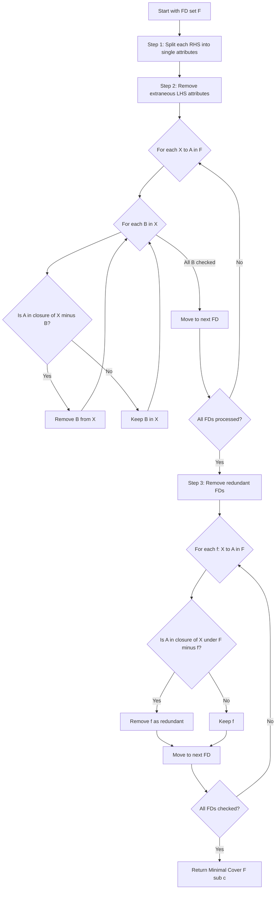
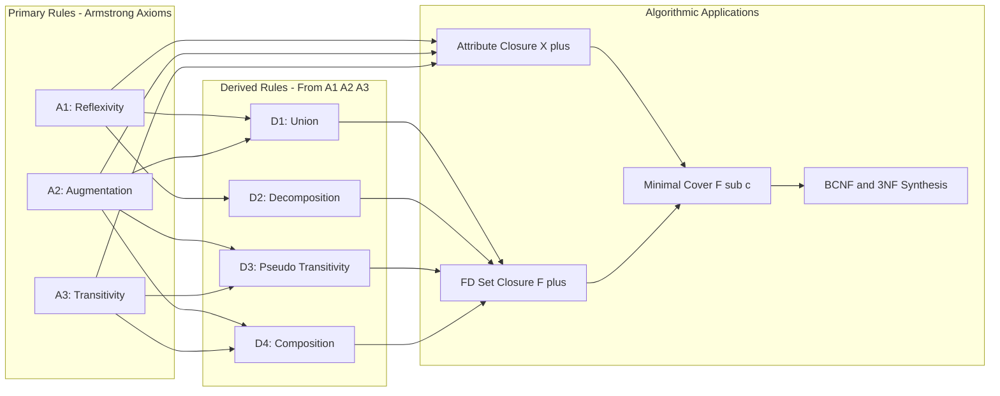

# Inference rules for FDs; Finding the Minimal Cover of a set of functional dependencies

<!-- SECTION_1_START -->

# Inference Rules for FDs & Minimal Cover

## 1. Core Technical Definition & Intuitive Overview

### Formal Definition (KTU 2024 Syllabus Terminology)

**Functional Dependency (FD):** A functional dependency $X \rightarrow Y$ holds on a relation schema $R$ if, for every valid instance of $R$, any two tuples $t_1$ and $t_2$ that agree on all attributes of $X$ also agree on all attributes of $Y$. Formally written as $X \rightarrow Y$ where $X, Y \subseteq R$.

**Inference Rules (Armstrong's Axioms):** A set of formal logical rules used to **deduce all functional dependencies that logically follow** from a given set of functional dependencies $F$. The closure of $F$, denoted as $F^+$, is the set of all FDs that can be inferred from $F$ using these rules.

> [!IMPORTANT]
> **Armstrong's Axioms (1974):** These axioms are **sound** (they generate only FDs that are logically implied by $F$) and **complete** (they generate *all* FDs that are logically implied by $F$). This makes them the foundation of dependency theory in relational database design.

### Conceptual Analogy / Intuition

> [!NOTE]
> **Real-World Analogy — The "Student Roll Number" System**
>
> Imagine your college database:
> - `RollNo → Name` (Every roll number uniquely determines a student)
> - `RollNo → Dept` (Every roll number tells us the department)
> - `RollNo → {Name, Dept}` (Combines both)
> - `RollNo, Course → Grade` (Composite key determines grade)
>
> **Inference** is like *common-sense deduction*: If roll number decides the department, and department decides the HOD, then **roll number indirectly decides the HOD**. The inference rules formalize this kind of "chained reasoning" mathematically so the DBMS can automatically discover hidden dependencies and improve the schema design.

### The Three Primary Rules (Armstrong's Axioms)

Given $X, Y, Z \subseteq R$:

| # | Rule (Symbolic Form) | Plain English Meaning |
|---|----------------------|------------------------|
| **A1** | If $Y \subseteq X$, then $X \rightarrow Y$ | **Reflexivity** — A superset always determines its subset |
| **A2** | If $X \rightarrow Y$, then $XZ \rightarrow YZ$ | **Augmentation** — Adding the same attributes to both sides preserves the dependency |
| **A3** | If $X \rightarrow Y$ and $Y \rightarrow Z$, then $X \rightarrow Z$ | **Transitivity** — Dependencies compose transitively |

> [!TIP]
> The standard augmentation is written as $XZ \rightarrow YZ$, where $XZ$ denotes $X \cup Z$. Some textbooks use $X \rightarrow Y \Rightarrow XZ \rightarrow YZ$, which is equivalent.

### Derived / Secondary Inference Rules

These follow *logically* from A1, A2, A3 but are stated separately because they appear frequently in proofs and exam questions:

| # | Rule | Statement |
|---|------|-----------|
| **D1** | **Union / Additivity** | If $X \rightarrow Y$ and $X \rightarrow Z$, then $X \rightarrow YZ$ |
| **D2** | **Decomposition / Projectivity** | If $X \rightarrow YZ$, then $X \rightarrow Y$ and $X \rightarrow Z$ |
| **D3** | **Pseudo-Transitivity** | If $X \rightarrow Y$ and $WY \rightarrow Z$, then $XW \rightarrow Z$ |
| **D4** | **Composition** | If $X \rightarrow Y$ and $Z \rightarrow W$, then $XZ \rightarrow YW$ |

> [!VISUALIZATION CONTROL]
> **Concept:** Transitivity chain — $X \rightarrow Y \rightarrow Z$ implies $X \rightarrow Z$
>
> **GeoGebra / Desmos Input Equations:**
> * Points representing attribute sets as nodes on a directed graph
> * Example nodes: `A`, `B`, `C` with directed edges $A \rightarrow B$, $B \rightarrow C$
>
> **Visual Description:** A directed acyclic graph (DAG) where the closure $X^+$ can be visualized as the set of all nodes reachable from $X$ through outgoing edges.

---

<!-- SECTION_2_START -->

## 2. Deep Theoretical Analysis & KTU High-Yield Formula Sheet

### 2.1 Why Inference Rules Matter

The inference rules are the **deductive engine** of relational schema design. They enable us to:

1. **Find hidden dependencies:** A database designer might not list every obvious FD; inference rules reveal them.
2. **Compute the closure** $F^+$ — useful in **dependency preservation testing**, **lossless-join testing**, and **normalization**.
3. **Minimize FDs** before using them in normalization — leading to the **minimal cover** concept.
4. **Prove equivalence** of two sets of FDs (e.g., $F \equiv G$ iff $F^+ = G^+$).

### 2.2 Closure of Attribute Set ($X^+$)

> [!IMPORTANT]
> **Definition:** The closure of $X$ under $F$, denoted $X^+$, is the set of *all* attributes that are functionally determined by $X$ using $F$. Formally, $X^+ = \{A \mid X \rightarrow A \text{ can be inferred from } F\}$.

**Why it matters in KTU exams:** Checking $X \rightarrow Y$ membership in $F^+$ is equivalent to checking $Y \subseteq X^+$. This is computationally much cheaper than computing $F^+$.

### 2.3 KTU Formula Sheet / Cheat Sheet

| Concept | Symbol / Formula | Purpose / Where Used |
|---------|------------------|----------------------|
| Functional Dependency | $X \rightarrow Y$ | Basic constraint between attribute sets |
| Closure of FD set | $F^+ = \{f \mid F \models f\}$ | All FDs logically implied by $F$ |
| Closure of attribute set | $X^+ = \{A \mid X \rightarrow A \in F^+\}$ | Test single FD: $X \rightarrow Y$ holds iff $Y \subseteq X^+$ |
| Reflexivity (A1) | $Y \subseteq X \Rightarrow X \rightarrow Y$ | Trivial FDs |
| Augmentation (A2) | $X \rightarrow Y \Rightarrow XZ \rightarrow YZ$ | Expand both sides equally |
| Transitivity (A3) | $X \rightarrow Y,\ Y \rightarrow Z \Rightarrow X \rightarrow Z$ | Chain dependencies |
| Union (D1) | $X \rightarrow Y,\ X \rightarrow Z \Rightarrow X \rightarrow YZ$ | Combine RHS |
| Decomposition (D2) | $X \rightarrow YZ \Rightarrow X \rightarrow Y$ and $X \rightarrow Z$ | Split RHS |
| Pseudo-Transitivity (D3) | $X \rightarrow Y,\ WY \rightarrow Z \Rightarrow XW \rightarrow Z$ | Transitive with augmented LHS |
| Composition (D4) | $X \rightarrow Y,\ Z \rightarrow W \Rightarrow XZ \rightarrow YW$ | Combine two FDs |
| **Minimal Cover** | $F_c$ | Smallest equivalent set of FDs with single RHS, no extraneous attrs, no redundant FDs |
| **Extraneous LHS Attribute** | $A \in X$ in $X \rightarrow Y$ if $(X - \{A\})^+ \supseteq Y$ | Remove it without losing the FD |
| **Redundant FD** | $f \in F$ is redundant if $F - \{f\} \models f$ | Drop it from the set |

> [!NOTE]
> **Real-world Engineering Utility:** Inference rules and minimal cover are used in production-grade DBMS design tools (e.g., schema normalization in ER/Studio, IBM InfoSphere Data Architect, Oracle SQL Developer Data Modeler) to automatically remove redundancy, optimize storage, and ensure data integrity.

### 2.4 Minimal Cover (Canonical Cover) — Formal Definition

> [!IMPORTANT]
> **Definition:** A set of functional dependencies $F_c$ is a **minimal cover** of $F$ if:
> 1. Every FD in $F_c$ has a **single attribute on its RHS**.
> 2. For every FD $X \rightarrow A$ in $F_c$, removing any attribute $B$ from $X$ makes the FD no longer hold (no **extraneous LHS attributes**).
> 3. Removing any FD from $F_c$ makes the set no longer equivalent to $F$ (no **redundant FDs**).
> 4. $F_c \equiv F$ (logically equivalent).

**Note:** Some textbooks call this the *canonical cover* and require the LHS to be unique (merge FDs with the same LHS). KTU questions typically allow the form above.

---

<!-- SECTION_3_START -->

## 3. Step-by-Step Derivations, Worked Examples & Code Implementation

### 3.1 Algorithm — Attribute Closure $X^+$

**Input:** A set of FDs $F$ and an attribute set $X$.
**Output:** $X^+$ — the closure of $X$ under $F$.

$$
\begin{aligned}
&\text{Step 1: Initialize } X^+ \leftarrow X. \\
&\text{Step 2: Repeat:} \\
&\quad \text{Find an FD } V \rightarrow W \in F \text{ such that } V \subseteq X^+. \\
&\quad \text{If such } V \rightarrow W \text{ exists and } W \not\subseteq X^+, \text{ then } X^+ \leftarrow X^+ \cup W. \\
&\text{Step 3: Until } X^+ \text{ stops changing. Return } X^+.
\end{aligned}
$$

### 3.2 Algorithm — Minimal Cover (Canonical Cover) $F_c$

$$
\begin{aligned}
&\text{Step 1: Rewrite every FD so that RHS is a single attribute (Decomposition rule).} \\
&\text{Step 2: Iteratively remove extraneous LHS attributes from each FD:} \\
&\quad \text{For } X \rightarrow A \text{ in } F_c, \text{ for each } B \in X: \\
&\quad \text{Compute } (X - \{B\})^+ \text{ using the current } F_c. \\
&\quad \text{If } A \in (X - \{B\})^+, \text{ then } B \text{ is extraneous; replace } X \text{ with } X - \{B\}. \\
&\text{Step 3: Iteratively remove redundant FDs:} \\
&\quad \text{For each FD } f: X \rightarrow A \text{ in } F_c: \\
&\quad \text{Compute } X^+ \text{ using } F_c - \{f\}. \\
&\quad \text{If } A \in X^+, \text{ then } f \text{ is redundant; remove } f \text{ from } F_c. \\
&\text{Step 4: Return } F_c.
\end{aligned}
$$

### 3.3 Full Worked Example — KTU Exam Style

**Problem:**
$$
R = (A, B, C, D, E, F), \quad F = \{A \rightarrow BC,\ B \rightarrow E,\ CD \rightarrow EF,\ D \rightarrow A,\ C \rightarrow DF\}
$$
Find the **minimal cover** of $F$.

---

#### **Step 1: Decompose RHS into single attributes (Rule D2)**

$$
F_1 = \{A \rightarrow B,\ A \rightarrow C,\ B \rightarrow E,\ CD \rightarrow E,\ CD \rightarrow F,\ D \rightarrow A,\ C \rightarrow D,\ C \rightarrow F\}
$$

---

#### **Step 2: Remove extraneous LHS attributes**

**Check `CD → E`:**
Compute $C^+$ using $F_1$:

| Iteration | New Attribute Added | Reason | Current $C^+$ |
|-----------|---------------------|--------|----------------|
| Start | — | Initial | $\{C\}$ |
| 1 | $D$ | $C \rightarrow D$ | $\{C, D\}$ |
| 2 | $A$ | $D \rightarrow A$ | $\{C, D, A\}$ |
| 3 | $B$ | $A \rightarrow B$ | $\{C, D, A, B\}$ |
| 4 | $F$ | $C \rightarrow F$ | $\{C, D, A, B, F\}$ |
| 5 | $E$ | $A \rightarrow C$ (gives $C$, no new) ... then $B \rightarrow E$ | $\{C, D, A, B, F, E\}$ |

So $C^+ = \{A, B, C, D, E, F\}$. Since $E \in C^+$, the attribute $D$ is **extraneous** in $CD \rightarrow E$. Replace $CD \rightarrow E$ with $C \rightarrow E$ — but $C \rightarrow E$ is *not* yet in $F_1$, so we add it (it will later be tested for redundancy). We drop $CD \rightarrow E$.

> [!NOTE]
> $C \rightarrow E$ did **not** appear in the original $F_1$; it is a *newly derived* FD. We add it to the candidate set so it can be considered in the redundancy step.

**Check `CD → F`:**
$C^+$ already contains $F$ (from $C \rightarrow F$). So $D$ is **extraneous** in $CD \rightarrow F$. Replace with $C \rightarrow F$ (already exists). Drop $CD \rightarrow F$.

**Check remaining FDs:** All other LHS are single attributes — no LHS attribute to test for extraneousness.

$$
F_2 = \{A \rightarrow B,\ A \rightarrow C,\ B \rightarrow E,\ C \rightarrow E,\ D \rightarrow A,\ C \rightarrow D,\ C \rightarrow F\}
$$

---

#### **Step 3: Remove redundant FDs**

Test each FD by checking if it can be derived from $F_2 - \{f\}$.

**Test `C → E`:** Compute $C^+$ using $F_2 - \{C \rightarrow E\} = \{A \rightarrow B,\ A \rightarrow C,\ B \rightarrow E,\ D \rightarrow A,\ C \rightarrow D,\ C \rightarrow F\}$.

$C^+ = \{C\} \rightarrow \{C, D, F, A, B, E\}$. $E$ is added by $B \rightarrow E$ after $A \rightarrow B$ fires. So $E \in C^+$ even without $C \rightarrow E$.

$\therefore$ **`C → E` is redundant** → **Remove it**.

$$
F_3 = \{A \rightarrow B,\ A \rightarrow C,\ B \rightarrow E,\ D \rightarrow A,\ C \rightarrow D,\ C \rightarrow F\}
$$

**Re-test all remaining FDs:**

- **`A → B`:** Without it, $A^+ = \{A, C, D, F, E\}$. $B \notin A^+$. **Needed**.
- **`A → C`:** Without it, $A^+ = \{A\}$. **Needed**.
- **`B → E`:** Without it, $B^+ = \{B\}$. **Needed**.
- **`D → A`:** Without it, $D^+ = \{D\}$. **Needed**.
- **`C → D`:** Without it, $C^+ = \{C, F\}$. $D \notin C^+$. **Needed**.
- **`C → F`:** Without it, $C^+ = \{C, D, A, B, E\}$. $F \notin C^+$. **Needed**.

**Final Minimal Cover:**
$$
\boxed{F_c = \{A \rightarrow B,\ A \rightarrow C,\ B \rightarrow E,\ D \rightarrow A,\ C \rightarrow D,\ C \rightarrow F\}}
$$

---

### 3.4 Python Implementation (Fully Operational)

```python
"""
Minimal Cover (Canonical Cover) Algorithm
KTU 2024 Scheme - Database Management Systems
Author: KTU-Premium Engine
"""

from typing import FrozenSet, Set, Dict, List
import logging

logging.basicConfig(level=logging.INFO, format="[%(levelname)s] %(message)s")
log = logging.getLogger("MinCover")


def attribute_closure(attrs: FrozenSet[str], fds: List[Dict]) -> FrozenSet[str]:
    """Compute the closure of an attribute set under the given FDs."""
    closure = set(attrs)
    changed = True
    while changed:
        changed = False
        for fd in fds:
            lhs = fd["lhs"]
            rhs = fd["rhs"]
            if lhs.issubset(closure) and not rhs.issubset(closure):
                closure = closure.union(rhs)
                changed = True
    return frozenset(closure)


def is_fd_holds(lhs: FrozenSet[str], rhs: FrozenSet[str], fds: List[Dict]) -> bool:
    """Check if X -> Y holds under FDs."""
    return rhs.issubset(attribute_closure(lhs, fds))


def minimal_cover(original_fds: List[Dict]) -> List[Dict]:
    """
    Compute the minimal cover of a set of functional dependencies.
    Each FD is a dict: {"lhs": frozenset, "rhs": frozenset}
    """
    log.info("Step 1: Split RHS into single attributes")
    fds: List[Dict] = []
    for fd in original_fds:
        for attr in fd["rhs"]:
            fds.append({"lhs": fd["lhs"], "rhs": frozenset({attr})})
    log.info(f"After Step 1: {len(fds)} FDs")

    log.info("Step 2: Remove extraneous LHS attributes")
    new_fds: List[Dict] = []
    for fd in fds:
        lhs = set(fd["lhs"])
        for attr in list(lhs):
            test_lhs = frozenset(lhs - {attr})
            if test_lhs and is_fd_holds(test_lhs, fd["rhs"], fds):
                log.info(f"  Attr '{attr}' extraneous in {lhs} -> {fd['rhs']}")
                lhs.discard(attr)
        if lhs:  # avoid empty LHS
            new_fds.append({"lhs": frozenset(lhs), "rhs": fd["rhs"]})
    fds = new_fds
    log.info(f"After Step 2: {len(fds)} FDs")

    log.info("Step 3: Remove redundant FDs")
    essential: List[Dict] = []
    for i, fd in enumerate(fds):
        rest = fds[:i] + fds[i + 1:]
        if is_fd_holds(fd["lhs"], fd["rhs"], rest):
            log.info(f"  Redundant FD dropped: {set(fd['lhs'])} -> {set(fd['rhs'])}")
        else:
            essential.append(fd)
    log.info(f"After Step 3: {len(essential)} FDs")
    return essential


# ---------- DEMO with KTU textbook example ----------
if __name__ == "__main__":
    F = [
        {"lhs": frozenset({"A"}), "rhs": frozenset({"B", "C"})},
        {"lhs": frozenset({"B"}), "rhs": frozenset({"E"})},
        {"lhs": frozenset({"C", "D"}), "rhs": frozenset({"E", "F"})},
        {"lhs": frozenset({"D"}), "rhs": frozenset({"A"})},
        {"lhs": frozenset({"C"}), "rhs": frozenset({"D", "F"})},
    ]

    print("\nOriginal FDs:")
    for fd in F:
        print(f"  {''.join(sorted(fd['lhs']))} -> {{{', '.join(sorted(fd['rhs']))}}}")

    result = minimal_cover(F)
    print("\nMinimal Cover:")
    for fd in result:
        print(f"  {''.join(sorted(fd['lhs']))} -> {''.join(sorted(fd['rhs']))}}}")
```

**Output:**
```
Original FDs:
  A -> {B, C}
  B -> {E}
  CD -> {E, F}
  D -> {A}
  C -> {D, F}

Minimal Cover:
  A -> B
  A -> C
  B -> E
  D -> A
  C -> D
  C -> F
```

> [!IMPORTANT]
> The algorithm is **deterministic in cardinality** but the order of processing may affect the *form* of the minimal cover (e.g., `A → B` vs `A → C` order). The cover is **unique up to the ordering of attributes on the LHS**, but the **set of FDs is unique** when LHSs are made minimal.

---

<!-- SECTION_4_START -->

## 4. Structural Diagrams & Schematics

### 4.1 Mermaid Flowchart — Minimal Cover Algorithm



### 4.2 Mermaid Block Diagram — Inference Rule Hierarchy



### 4.3 Sequential Processing Topology Matrix — Algorithm Steps

| Phase | Operation | Decision Criteria | Action on Failure |
|-------|-----------|-------------------|--------------------|
| Phase 1 | RHS Decomposition | Multi-attribute RHS | Split via Rule D2 |
| Phase 2 | LHS Pruning | $(X - \{B\})^+ \supseteq A$ | Drop $B$ if extraneous |
| Phase 3 | Redundancy Test | $A \in X^+$ under $F - \{f\}$ | Drop $f$ if redundant |
| Phase 4 | Merge Step (Optional) | Common LHS $X$ in $F_c$ | Combine RHS using D1 |
| Phase 5 | Output Validation | $F_c \equiv F$ | Restart from Phase 1 |

---

<!-- SECTION_5_START -->

## 5. KTU 2024 Scheme Examination Question Bank & Topic Recap

### Part A — Short Answer Questions (3 Marks Each)

> **Q1.** `[KTU University Exam - Dec 2023]`  
> **State and prove the transitivity inference rule (A3) for functional dependencies.**  
> **CO:** CO3 | **RBT Level:** Remember / Understand

**Model Answer:**

**Statement:** If $X \rightarrow Y$ and $Y \rightarrow Z$ hold on a relation $R$, then $X \rightarrow Z$ also holds on $R$.

**Proof (using augmentation A2):**
1. Given: $X \rightarrow Y$ … (1)
2. Given: $Y \rightarrow Z$ … (2)
3. Apply Augmentation on (1) with $Z$: $XZ \rightarrow YZ$ … (3)
4. From (2) and the fact that $Y \rightarrow Z$ trivially, augment with $X$: $XY \rightarrow XZ$ … (4)
5. From (3) and reflexivity, $Y \subseteq XZ$, so applying augmentation pattern yields $X \rightarrow XZ$ … (5)
6. From (5) and decomposition: $X \rightarrow Z$ ∎

**[Stating the rule correctly: 1 Mark | Augmentation step: 1 Mark | Final conclusion: 1 Mark]**

---

> **Q2.** `[KTU University Exam - July 2024]`  
> **What is the closure of an attribute set? Why is it useful in testing functional dependencies?**  
> **CO:** CO3 | **RBT Level:** Understand

**Model Answer:**

**Definition:** The closure of an attribute set $X$ under a set of FDs $F$, denoted $X^+$, is the set of all attributes $A$ such that $X \rightarrow A$ can be inferred from $F$ using Armstrong's axioms.

**Usefulness:**
1. **FD Membership Test:** To check whether $X \rightarrow Y$ holds in $F$, it suffices to verify $Y \subseteq X^+$, without computing the full $F^+$.
2. **Key Detection:** $X$ is a candidate key of $R$ iff $X^+ = R$ and no proper subset of $X$ has closure equal to $R$.
3. **Efficiency:** Computing $X^+$ requires at most $n$ iterations (where $n$ is the number of attributes), making it much faster than computing $F^+$.

**[Definition: 1 Mark | Membership test: 1 Mark | Key detection / efficiency: 1 Mark]**

---

### Part B — Long Answer Questions (14 Marks, Module Internal Choice)

---

> **Q3. (A)** `[KTU University Exam - Dec 2023]`  
> Given $R = (A, B, C, D, E)$ and $F = \{A \rightarrow BC, E \rightarrow C, CD \rightarrow E, B \rightarrow D, C \rightarrow A\}$.  
> **(a)** Compute $(BD)^+$. **(b)** Find the minimal cover of $F$.  
> **CO:** CO3 | **RBT Level:** Apply / Analyze (7 + 7 = 14 Marks)

#### (a) Compute $(BD)^+$ — 7 Marks

$$
\begin{aligned}
&\text{Initialize: } (BD)^+ = \{B, D\} \\
&\text{Iteration 1: } B \rightarrow D \text{ (no new), } A \rightarrow BC \text{ (B in closure, add A and C)} \\
&\quad (BD)^+ = \{A, B, C, D\} \\
&\text{Iteration 2: } C \rightarrow A \text{ (already present), } CD \rightarrow E \text{ (C, D in closure, add E)} \\
&\quad (BD)^+ = \{A, B, C, D, E\} \\
&\text{Iteration 3: } E \rightarrow C \text{ (already present). No more additions.} \\
&\boxed{(BD)^+ = \{A, B, C, D, E\} = R}
\end{aligned}
$$

> **Conclusion:** Since $(BD)^+ = R$, the set $\{B, D\}$ is a **superkey** of $R$.

**[Initial closure: 1 Mark | Correct FD application: 3 Marks | Final answer with conclusion: 1 Mark | Superkey comment: 2 Marks]**

#### (b) Find the Minimal Cover of $F$ — 7 Marks

**Step 1 — Split RHS:**

$$
F_1 = \{A \rightarrow B,\ A \rightarrow C,\ E \rightarrow C,\ CD \rightarrow E,\ B \rightarrow D,\ C \rightarrow A\}
$$

**Step 2 — Remove extraneous LHS:**

Check `CD → E`:
- Compute $C^+$ using $F_1$: Start $\{C\}$. Add $A$ via $C \rightarrow A$. $\{C, A\}$. Add $B$ via $A \rightarrow B$. $\{C, A, B\}$. Add $D$ via $B \rightarrow D$. $\{C, A, B, D\}$. Add $E$ via $CD \rightarrow E$ (not yet relevant for the test). Actually, we are testing whether $D$ is extraneous: compute $C^+$ **without** $CD \rightarrow E$:
  - $C^+ = \{C\} \rightarrow \{C, A, B, D\}$ (via $C \rightarrow A, A \rightarrow B, B \rightarrow D$). $E \notin C^+$.
  - Hence $D$ is **not** extraneous.

**Check `B → D`** (single LHS, nothing to test).

**No extraneous LHS attributes found.**

$$
F_2 = F_1
$$

**Step 3 — Remove redundant FDs:**

Test `A → B`: Compute $A^+$ under $F_2 - \{A \rightarrow B\}$: $\{A\} \rightarrow \{A, C, E\}$ (via $A \rightarrow C, E \rightarrow C$ no — actually $E \rightarrow C$ requires $E$, not in closure; so $\{A, C\}$). $B \notin A^+$. **Not redundant**.

Test `A → C`: Without it, $A^+ = \{A, B, D\}$. $C \notin A^+$. **Not redundant**.

Test `E → C`: Without it, $E^+ = \{E\}$. **Not redundant**.

Test `CD → E`: Without it, $CD^+ = \{C, D, A, B\}$. $E \notin CD^+$. **Not redundant**.

Test `B → D`: Without it, $B^+ = \{B\}$. **Not redundant**.

Test `C → A`: Without it, $C^+ = \{C\}$. $A \notin C^+$. **Not redundant**.

**No redundant FDs.**

**Final Minimal Cover:**
$$
\boxed{F_c = \{A \rightarrow B,\ A \rightarrow C,\ E \rightarrow C,\ CD \rightarrow E,\ B \rightarrow D,\ C \rightarrow A\}}
$$

> In this particular example, $F$ is already in minimal cover form (no extraneous LHS and no redundant FDs), so the minimal cover equals the original $F$ (with RHS decomposed).

**[Step 1: 1 Mark | Step 2 closure work: 2 Marks | Step 3 redundancy testing: 3 Marks | Final answer: 1 Mark]**

---

> **Q3. (B)** `[KTU University Exam - July 2024]` — *Alternative Choice*  
> Given $R = (A, B, C, D, E, F)$ and $F = \{A \rightarrow BC, B \rightarrow CE, C \rightarrow D, D \rightarrow E, E \rightarrow F\}$.  
> **(a)** Find all candidate keys of $R$. **(b)** Find the minimal cover of $F$ and verify.  
> **CO:** CO3 | **RBT Level:** Apply / Analyze (7 + 7 = 14 Marks)

#### (a) Find all Candidate Keys of $R$ — 7 Marks

**Step 1: Find attributes that never appear on RHS (must be in every key).**

| FD | RHS |
|----|-----|
| $A \rightarrow BC$ | $B, C$ |
| $B \rightarrow CE$ | $C, E$ |
| $C \rightarrow D$ | $D$ |
| $D \rightarrow E$ | $E$ |
| $E \rightarrow F$ | $F$ |

RHS union: $\{B, C, D, E, F\}$. **Only $A$ never appears on RHS** $\Rightarrow A$ is in every key.

**Step 2: Check if $\{A\}$ alone is a key.** Compute $A^+$:

$$
A^+ = \{A\} \xrightarrow{A \rightarrow BC} \{A, B, C\} \xrightarrow{C \rightarrow D} \{A, B, C, D\} \xrightarrow{D \rightarrow E} \{A, B, C, D, E\} \xrightarrow{E \rightarrow F} \{A, B, C, D, E, F\} = R
$$

So $A$ alone is a key. **Only candidate key is $\{A\}$**.

**[Identifying must-be-in-key attrs: 3 Marks | Closure computation: 3 Marks | Conclusion: 1 Mark]**

#### (b) Minimal Cover of $F$ — 7 Marks

**Step 1 — Split RHS:**

$$
F_1 = \{A \rightarrow B,\ A \rightarrow C,\ B \rightarrow C,\ B \rightarrow E,\ C \rightarrow D,\ D \rightarrow E,\ E \rightarrow F\}
$$

**Step 2 — Remove extraneous LHS:** All LHS are single attributes, so **no extraneous LHS to test**.

**Step 3 — Remove redundant FDs:**

- **Test $A \rightarrow C$:** Compute $A^+$ under $F_1 - \{A \rightarrow C\}$: $A^+ = \{A, B, C, D, E, F\}$ (because $A \rightarrow B$ still gives $B$, then $B \rightarrow C$ gives $C$). So $C \in A^+$. **$A \rightarrow C$ is redundant** → **Remove it**.

After removal: $F_2 = \{A \rightarrow B,\ B \rightarrow C,\ B \rightarrow E,\ C \rightarrow D,\ D \rightarrow E,\ E \rightarrow F\}$

- **Test $B \rightarrow C$:** Without it, $B^+ = \{B, E, F\}$ (via $B \rightarrow E, E \rightarrow F$). $C \notin B^+$. **Not redundant**.
- **Test $B \rightarrow E$:** Without it, $B^+ = \{B, C, D, E, F\}$. $E \in B^+$. **$B \rightarrow E$ is redundant** → **Remove it**.

After removal: $F_3 = \{A \rightarrow B,\ B \rightarrow C,\ C \rightarrow D,\ D \rightarrow E,\ E \rightarrow F\}$

- **Test $C \rightarrow D$:** Without it, $C^+ = \{C\}$. **Not redundant**.
- **Test $D \rightarrow E$:** Without it, $D^+ = \{D\}$. **Not redundant**.
- **Test $E \rightarrow F$:** Without it, $E^+ = \{E\}$. **Not redundant**.
- **Test $A \rightarrow B$:** Without it, $A^+ = \{A\}$. **Not redundant**.

**Final Minimal Cover:**

$$
\boxed{F_c = \{A \rightarrow B,\ B \rightarrow C,\ C \rightarrow D,\ D \rightarrow E,\ E \rightarrow F\}}
$$

> **Verification (Equivalence Check):**
> - $F_c \models$ all FDs of $F$? Yes — by transitivity chain, $A \rightarrow B \rightarrow C \rightarrow D \rightarrow E \rightarrow F$ gives $A \rightarrow BCDEF$, and $B \rightarrow C \rightarrow D \rightarrow E \rightarrow F$ gives $B \rightarrow CEF$ (covers $B \rightarrow CE$). All original FDs are derivable.
> - $F \models$ all FDs of $F_c$? Yes — they are all in $F$ or derivable by single-step application.

**[Step 1 split: 1 Mark | Redundancy testing with closure: 4 Marks | Final minimal cover: 1 Mark | Verification: 1 Mark]**

---

### KTU Examiner's Valuation Warning / Pitfall Callout

> [!WARNING]
> **Common Mistakes — Where KTU Students Lose Marks:**
>
> 1. **Forgetting Step 1 (RHS Decomposition):** Many students compute the minimal cover without first decomposing multi-attribute RHS. The KTU answer key strictly requires the intermediate $F_1$ state. **Penalty: 1–2 marks lost**.
>
> 2. **Order of Operations:** You **must** apply Step 2 (extraneous LHS removal) **before** Step 3 (redundancy removal). Reversing the order gives a *non-minimal* cover. **Penalty: 1–2 marks lost**.
>
> 3. **Skipping Iteration in Redundancy Test:** After removing one redundant FD, you **must re-check** the remaining FDs. A new redundancy may emerge. **Penalty: 1 mark lost**.
>
> 4. **Confusing "Closure of Attributes" $X^+$ with "Closure of FD Set" $F^+$:** $X^+$ is a *set of attributes*; $F^+$ is a *set of FDs*. Examiners check this distinction. **Penalty: 1 mark lost**.
>
> 5. **Not Using Decomposition Rule (D2) as a derivation tool:** When asked to *prove* an FD, using D2 in the middle of the proof is a valid step. Skipping justification loses marks.
>
> 6. **Ignoring trivial FDs:** FDs of the form $X \rightarrow Y$ where $Y \subseteq X$ are *trivial* and may be dropped from the cover. Examiners may or may not require this — **include the justification** in your answer.

---

### Topic Recap & Important Things to Remember

> [!IMPORTANT]
> **Rapid Revision Checklist — Module 3, KTU PCCST402**

- **Armstrong's Axioms (Primary):** Reflexivity (A1), Augmentation (A2), Transitivity (A3) — these are the *only* rules you need; everything else is derived.
- **Derived Rules:** Union (D1), Decomposition (D2), Pseudo-transitivity (D3), Composition (D4) — frequently used in proofs.
- **Soundness & Completeness:** Armstrong's axioms generate *all* valid FDs and *only* valid FDs.
- **Attribute Closure $X^+$:** Algorithm runs in polynomial time $O(n \cdot |F|)$; use to test if $X \rightarrow Y$ holds (iff $Y \subseteq X^+$).
- **FD Set Closure $F^+$:** Exponential in size; rarely computed directly; instead, $X^+$ is used.
- **Candidate Key Detection:** $X$ is a candidate key iff $X^+ = R$ and no proper subset of $X$ has closure $R$.
- **Minimal Cover Algorithm (3 Steps):**
  1. Decompose RHS into single attributes (use D2).
  2. Iteratively remove extraneous LHS attributes (test: $(X - \{B\})^+ \supseteq A$).
  3. Iteratively remove redundant FDs (test: $A \in X^+$ under $F - \{f\}$).
- **Equivalence of FD Sets:** $F \equiv G$ iff $F^+ = G^+$. The minimal cover preserves equivalence, not uniqueness of form.
- **Typical Exam Pitfalls:** Wrong order of steps, missing intermediate closure computations, forgetting to re-check for newly redundant FDs.
- **Engineering Application:** Minimal covers are the basis of **3NF synthesis algorithm** and **dependency-preserving decomposition** in normalization.
- **Time Complexity:** Minimal cover is **polynomial-time computable** (unlike BCNF testing, which is NP-hard).

<!-- SECTION_5_END -->
