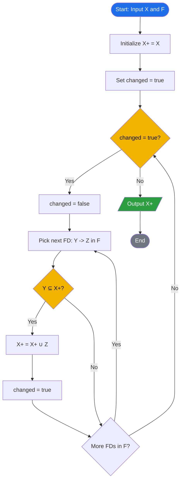
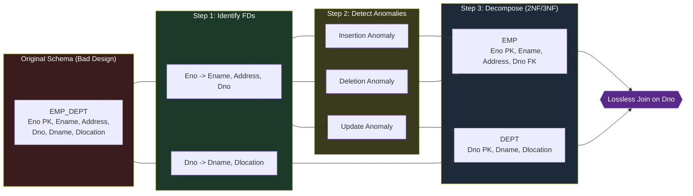
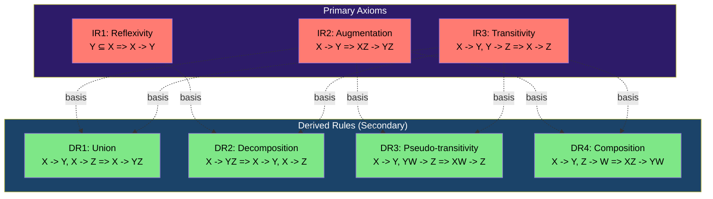
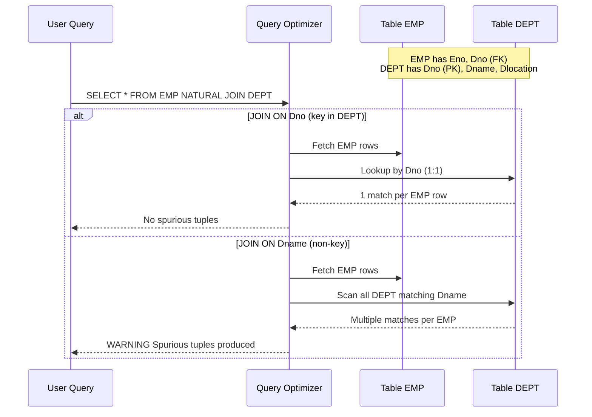

# Informal design guidelines for relation schemas; Functional Dependencies (FDs)

<!-- SECTION_1_START -->

# Database Design Theory: Informal Guidelines & Functional Dependencies

## 1.1 Informal Design Guidelines for Relation Schemas — Core Definition

> [!NOTE]
> **KTU 2024 Syllabus Definition (Elmasri & Navathe Framework)**
> *Informal design guidelines are a set of qualitative measures used to evaluate the quality of relation schema design before applying any formal normalization theory. They are the empirical "goodness checks" that a database designer performs to detect design flaws that lead to redundancy, anomalies, and semantic ambiguity.*

When we are given a set of attributes and asked to group them into one or more relation schemas, there is more than one way to do it. Some designs are **good**, and some are **bad**. The four informal guidelines that act as a **measuring stick** for "goodness" are:

1. **Semantics of the Relation Attributes** — *Does the relation describe one well-defined entity or relationship?*
2. **Reduction of Redundant Information in Tuples** — *Are we storing the same fact in multiple places?*
3. **Reduction of NULL Values in Tuples** — *Are we forcing many attributes to be unknown when a tuple is created?*
4. **Disallowing Spurious Tuples** — *When we JOIN the relations back, do we get fake rows that don't exist in reality?*

> [!IMPORTANT]
> **KTU Board Tip:** A relation schema is in a *better* design if it satisfies all four guidelines simultaneously. Violation of even one guideline is a strong signal that further normalization (1NF, 2NF, 3NF, BCNF) is required.

---

## 1.2 The Intuitive Analogy — "The Overcrowded Office Cabinet"

Imagine you are designing a **paper-based office file system** for a university. You have only **one giant folder** in which you record:

`Student_ID | Student_Name | Department | Dept_Head | Course_ID | Course_Title | Grade | Faculty_Name`

* **Semantics issue** — The folder mixes *students*, *courses*, *departments*, and *faculty* in a single sheet. A new employee cannot tell what **one row** represents: is it a student? a course offering? a grade record? The *meaning* is lost.
* **Redundancy issue** — If 200 students take "DBMS", we write `DBMS` and `Prof. Kumar` **200 times**. If `Prof. Kumar` changes his name, you must update 200 places.
* **NULL issue** — A student who has *not yet registered* for any course still needs a row — you must leave `Course_ID`, `Course_Title`, `Grade`, and `Faculty_Name` as blank/NULL.
* **Spurious tuples issue** — If you tear this one folder into *Student* and *Course* sheets and join them back using `Department` (a non-unique attribute), you may produce ghost combinations — e.g., pairing *Anu* (CSE) with *DBMS* (ECE) — a pairing that **never existed** in real life.

> **Take-away:** *Decompose* the giant folder into smaller, focused folders (relations) — one for Students, one for Courses, one for Enrollments. Each row then has **one clear meaning**, no repeated facts, no NULL gaps, and clean joins.

---

## 1.3 Functional Dependencies (FDs) — Formal Definition

> [!NOTE]
> **KTU 2024 Definition**
> A **functional dependency**, denoted $X \rightarrow Y$, between two sets of attributes $X$ and $Y$ that are subsets of a relation schema $R$, specifies a **constraint**: *for every valid instance $r$ of $R$, whenever two tuples $t_1$ and $t_2$ in $r$ agree on all the attributes of $X$, they must also agree on all the attributes of $Y$.*

Formally:

$$X \rightarrow Y \;\;\text{holds in } r \;\;\iff\;\; \forall\, t_1, t_2 \in r,\; \big(t_1[X] = t_2[X]\big) \;\Rightarrow\; \big(t_1[Y] = t_2[Y]\big)$$

* $X$ is the **determinant** (left-hand side, LHS).
* $Y$ is the **dependent** (right-hand side, RHS).
* $X \rightarrow Y$ is a **property of the schema's semantics** (the *intended* meaning of the attributes), not just of a particular instance.

---

## 1.4 The Intuitive Analogy for FDs — "The Calculator Function"

Think of a functional dependency as a **mathematical function** in the programming sense:

> A function $f(X) = Y$ means *one and only one $Y$ corresponds to a given $X$*.

In databases, the same idea applies, but it is **bi-directional over the tuple set**:

* **`Student_ID` → `Student_Name`** — Knowing a `Student_ID` gives you exactly one `Student_Name`. Just like $f(x) = x^2$ gives exactly one output for one input.
* **`Student_ID, Course_ID` → `Grade`** — Together, these two pieces of information uniquely fix the grade. The pair acts as the composite "key" to the `Grade` attribute.
* **`Course_ID` → `Faculty_Name`** — In a given semester, a course is taught by one faculty. (If multiple faculty teach the same course, the FD is *violated*.)

> [!IMPORTANT]
> **The Determinant Rule:** If two rows have the **same** value in the LHS attributes, they **must** have the **same** value in the RHS attributes. If even one pair of rows violates this, the FD is **broken** — the table is no longer a valid instance of the schema.

---

## 1.5 Types of Functional Dependencies

| Type | Formal Condition | Meaning | Real Example |
| :--- | :--- | :--- | :--- |
| **Trivial FD** | $Y \subseteq X$ | RHS is a subset of LHS — automatically true | $\{S\_ID, Name\} \rightarrow S\_ID$ |
| **Non-Trivial FD** | $Y \not\subseteq X$ | RHS is *not* a subset of LHS | $S\_ID \rightarrow Dept\_Name$ |
| **Completely Non-Trivial** | $X \cap Y = \emptyset$ | LHS and RHS are disjoint | $S\_ID \rightarrow Grade$ |
| **Transitively Non-Trivial** | $X \rightarrow Y,\; Y \rightarrow Z$ and $Y \not\rightarrow X$ | Indirect determination | $S\_ID \rightarrow Dept \rightarrow HOD$ |

---

## 1.6 GeoGebra / Desmos Visualization

> [!VISUALIZATION CONTROL]
> **Concept:** Mapping a Determinant $X$ to a Dependent $Y$ as a *function-like* correspondence.
>
> **Desmos Input:**
> * Define a discrete mapping — e.g., $S\_ID \in \{1, 2, 3, 4\}$ mapped to $Dept \in \{CSE, ECE, MECH\}$.
> * Plot points: $(1, CSE),\; (2, CSE),\; (3, ECE),\; (4, MECH)$.
>
> **Visual Description:** Each $x$-value (Student_ID) corresponds to **exactly one** $y$-value (Department). No two distinct tuples can have the same $x$ and different $y$. A valid instance of $S\_ID \rightarrow Dept$ is a graph where every vertical line drawn at an $x$-value touches the plot at *at most one* point.

---

<!-- SECTION_1_END -->

<!-- SECTION_2_START -->

# Deep Theoretical Analysis & KTU High-Yield Formula Sheet

## 2.1 The Four Informal Design Guidelines in Detail

### Guideline 1 — *Semantics of the Attributes*
A relation schema $R$ should be designed such that we can easily explain its **meaning**. Every tuple in a relation should represent **one fact** (one entity or one relationship) from the mini-world.

> [!TIP]
> A classic KTU test: "**What does one tuple of this relation represent?**" If your answer requires "well, it depends on the row…", the schema is poorly designed.

### Guideline 2 — *Reducing Redundant Information & Update Anomalies*
Redundancy causes three classical **update anomalies**:

| Anomaly Type | Trigger | Effect |
| :--- | :--- | :--- |
| **Insertion Anomaly** | Trying to insert a new fact (e.g., a new department) | Cannot insert without inserting a *fake* student to keep the key valid |
| **Deletion Anomaly** | Deleting a tuple | Accidentally loses another fact (e.g., last student of a department leaves → department info is lost) |
| **Modification / Update Anomaly** | Updating one logical fact | Must change the same data in *every* row where it appears — risk of inconsistency |

### Guideline 3 — *Reducing NULL Values*
A NULL-heavy relation is a sign of poor decomposition. NULLs waste storage, complicate queries (`NULL` comparisons yield `UNKNOWN`), and obscure meaning.

### Guideline 4 — *Disallowing Spurious Tuples*
A **spurious tuple** is a *bogus* row that appears in the result of a natural join of two relations but **did not exist** in the original real-world state. It usually arises when the join condition is on a **non-key** or non-superkey attribute.

> [!WARNING]
> **KTU Trap:** Always join on **common attributes that form a key** in *at least one* of the joining relations to avoid spurious tuples.

---

## 2.2 Armstrong's Axioms (Inference Rules for FDs)

Armstrong's axioms are the **sound** and **complete** set of inference rules used to derive all functional dependencies logically implied by a given set $F$.

### 2.2.1 Primary Rules (Axioms)

Let $X$, $Y$, $Z$, $W \subseteq R$.

| # | Rule | Formal Statement | Intuition |
| :-- | :--- | :--- | :--- |
| **IR1** | **Reflexivity** | If $Y \subseteq X$, then $X \rightarrow Y$ | Trivial FD — RHS is "inside" LHS |
| **IR2** | **Augmentation** | If $X \rightarrow Y$, then $XZ \rightarrow YZ$ | Adding the *same* attribute to both sides preserves the FD |
| **IR3** | **Transitivity** | If $X \rightarrow Y$ and $Y \rightarrow Z$, then $X \rightarrow Z$ | Chained determination |

### 2.2.2 Secondary (Derived) Rules

| # | Rule | Formal Statement | Derived From |
| :-- | :--- | :--- | :--- |
| **DR1** | **Union** | If $X \rightarrow Y$ and $X \rightarrow Z$, then $X \rightarrow YZ$ | IR2 + IR3 |
| **DR2** | **Decomposition** | If $X \rightarrow YZ$, then $X \rightarrow Y$ and $X \rightarrow Z$ | IR1 + IR3 |
| **DR3** | **Pseudotransitivity** | If $X \rightarrow Y$ and $YW \rightarrow Z$, then $XW \rightarrow Z$ | IR2 + IR3 |
| **DR4** | **Composition** | If $X \rightarrow Y$ and $Z \rightarrow W$, then $XZ \rightarrow YW$ | IR2 + IR3 |

---

## 2.3 Closure of a Set of Functional Dependencies ($F^+$)

> [!NOTE]
> The **closure** of $F$, written $F^+$, is the set of *all* FDs that can be **inferred** from $F$ using Armstrong's axioms.
> Formally: $F^+ = \{ X \rightarrow Y \mid F \models X \rightarrow Y \}$.

* $|F^+|$ is **exponential** in the number of attributes (for $n$ attributes, $F^+$ can have up to $2^{2n} - 1$ non-trivial FDs).
* Computing $F^+$ directly is *theoretically* useful but **practically inefficient** — hence we use **attribute closure** $X^+$.

---

## 2.4 Closure of an Attribute Set ($X^+$)

> [!NOTE]
> **Definition:** The closure of an attribute set $X$ under a set of FDs $F$, denoted $X^+$, is the set of **all attributes functionally determined by $X$**:
> $$X^+ = \{ A \mid F \models X \rightarrow A \}$$

### Algorithm to Compute $X^+$ (KTU Most-Favoured Algorithm)

```
Algorithm: ATTR_CLOSURE(X, F)
Input:  Attribute set X, Set of FDs F
Output: X+ (closure of X)

1.  X_plus ← X                              // initialize
2.  REPEAT
3.       old_X_plus ← X_plus
4.       FOR each FD  (Y → Z)  in F  DO
5.            IF  Y ⊆ X_plus  THEN
6.                 X_plus ← X_plus  ∪  Z
7.            END IF
8.       END FOR
9.  UNTIL  X_plus == old_X_plus              // fixed point reached
10. RETURN X_plus
```

> [!TIP]
> **Decisive Test:** $X \rightarrow Y$ holds (i.e., $X \rightarrow Y \in F^+$) **iff** $Y \subseteq X^+$. This single equivalence is the workhorse of almost every normalization proof.

---

## 2.5 Equivalence of FD Sets

| Concept | Definition | Use |
| :--- | :--- | :--- |
| **$F$ covers $G$** | $G \subseteq F^+$ | Every FD in $G$ is implied by $F$ |
| **$F$ and $G$ are equivalent** | $F^+ = G^+$ (equivalently $F \subseteq G^+$ and $G \subseteq F^+$) | Two schema constraints are interchangeable |

---

## 2.6 KTU High-Yield Formula Sheet

| Symbol / Notation | Meaning |
| :--- | :--- |
| $R$ | A relation schema |
| $X, Y, Z$ | Subsets of attributes of $R$ |
| $X \rightarrow Y$ | Functional dependency: $X$ determines $Y$ |
| $F$ | A given (explicit) set of FDs on $R$ |
| $F^+$ | Closure of $F$ (all FDs implied) |
| $X^+$ | Closure of attribute set $X$ (attributes determined by $X$) |
| $Y \subseteq X$ | Trivial FD condition |
| $X \cap Y = \emptyset$ | Completely non-trivial FD condition |
| $F \models X \rightarrow Y$ | $X \rightarrow Y$ is logically implied by $F$ |
| $\vert F \vert$ | Cardinality of set $F$ |
| $F \equiv G$ | Equivalence of FD sets ($F^+ = G^+$) |
| **Candidate Key** | A minimal attribute set $K$ such that $K^+ = R$ |
| **Superkey** | An attribute set $S$ such that $S^+ \supseteq R$ |

---

## 2.7 Real-World Engineering Utility of FDs

| Domain | How FDs Are Used |
| :--- | :--- |
| **Banking Systems** | `Account_No → Customer_ID, Balance` — enforces that one account maps to one customer and one balance |
| **E-Commerce** | `Order_ID → Customer_ID, Order_Date, Total_Amount` — drives indexing, integrity checks, and audit trails |
| **Healthcare (HIS)** | `Patient_ID + Test_Code → Test_Result, Test_Date` — supports diagnosis joins and prevents record duplication |
| **Data Warehousing** | FDs define **slowly changing dimensions** (SCD Type 2) and ETL validation rules |
| **Compiler Design** | FD theory is the foundation of **attribute grammar optimization** and **dead-code elimination** in relational algebra rewriters |
| **AI/ML Pipelines** | FD violations are used as **data quality detectors** (e.g., Great Expectations uses FD tests to flag label leakage) |
| **Distributed Systems** | FDs help in **sharding key selection** — pick a key that minimizes cross-shard joins |

---

<!-- SECTION_2_END -->

<!-- SECTION_3_START -->

# Step-by-Step Derivations & Code Implementation

## 3.1 Worked Example — Computing $X^+$ Manually

> [!NOTE]
> **Schema:** $R = \{A, B, C, D, E, F\}$
> **Given FDs ($F$):**
> * $A \rightarrow BC$
> * $B \rightarrow E$
> * $CD \rightarrow EF$
> * $D \rightarrow F$
>
> **Find:** $\{A, D\}^+$

### Step-by-Step Derivation

| Iteration | $X^+$ (after this step) | Triggering FD | Justification |
| :---: | :--- | :--- | :--- |
| **Init** | $\{A, D\}$ | — | Start with LHS itself |
| **1** | $\{A, D, B, C\}$ | $A \rightarrow BC$ | $A \in X^+$, so add $B, C$ |
| **2** | $\{A, D, B, C, E\}$ | $B \rightarrow E$ | $B \in X^+$, so add $E$ |
| **3** | $\{A, D, B, C, E, F\}$ | $D \rightarrow F$ | $D \in X^+$, so add $F$ |
| **4** | $\{A, D, B, C, E, F\}$ | $CD \rightarrow EF$ | Both $C, D \in X^+$, so add $E, F$ — but already present |
| **Fixed Point Reached** | $\{A, B, C, D, E, F\}$ | — | No new attribute added |

**Conclusion:**

$$\{A, D\}^+ = \{A, B, C, D, E, F\} = R$$

> [!IMPORTANT]
> **Implication:** Since $\{A, D\}^+ = R$, the set $\{A, D\}$ is a **superkey** of $R$. If no proper subset of $\{A, D\}$ has closure $R$, then $\{A, D\}$ is a **candidate key** — both $A$ alone and $D$ alone would need to be tested.

### Verify That $A$ Alone is Not a Superkey

Compute $A^+$:

| Step | $A^+$ | Trigger |
| :--- | :--- | :--- |
| Init | $\{A\}$ | — |
| 1 | $\{A, B, C\}$ | $A \rightarrow BC$ |
| 2 | $\{A, B, C, E\}$ | $B \rightarrow E$ |
| 3 | $\{A, B, C, E\}$ | No FD with $A, B, C, E$ on LHS adds $D$ or $F$ |
| **Stop** | $\{A, B, C, E\} \neq R$ | — |

So $A^+ \neq R$, hence **$A$ is not a superkey**.

### Verify That $D$ Alone is Not a Superkey

| Step | $D^+$ | Trigger |
| :--- | :--- | :--- |
| Init | $\{D\}$ | — |
| 1 | $\{D, F\}$ | $D \rightarrow F$ |
| **Stop** | $\{D, F\}$ | No FD adds anything further |

So $D$ alone is not a superkey either. Therefore, **$\{A, D\}$ is a candidate key** of $R$.

---

## 3.2 Proof of Armstrong's Axioms

### Proof of IR1 — Reflexivity
*Given:* $Y \subseteq X$. *Prove:* $X \rightarrow Y$.

For any two tuples $t_1, t_2$ with $t_1[X] = t_2[X]$, we need to show $t_1[Y] = t_2[Y]$.

Since $Y \subseteq X$, the values $t_1[X]$ *include* $t_1[Y]$. If $t_1$ and $t_2$ agree on the entire $X$, they must agree on every subset of $X$, including $Y$. Hence $t_1[Y] = t_2[Y]$. $\blacksquare$

### Proof of IR2 — Augmentation
*Given:* $X \rightarrow Y$ and any $Z \subseteq R$. *Prove:* $XZ \rightarrow YZ$.

Assume $t_1[XZ] = t_2[XZ]$. Then $t_1[X] = t_2[X]$ and $t_1[Z] = t_2[Z]$. By the given FD $X \rightarrow Y$, we get $t_1[Y] = t_2[Y]$. Combined with $t_1[Z] = t_2[Z]$, we obtain $t_1[YZ] = t_2[YZ]$. Hence $XZ \rightarrow YZ$. $\blacksquare$

### Proof of IR3 — Transitivity
*Given:* $X \rightarrow Y$ and $Y \rightarrow Z$. *Prove:* $X \rightarrow Z$.

Let $t_1[X] = t_2[X]$. Since $X \rightarrow Y$, we have $t_1[Y] = t_2[Y]$. Then since $Y \rightarrow Z$, we have $t_1[Z] = t_2[Z]$. Hence $X \rightarrow Z$. $\blacksquare$

### Proof of DR1 — Union (derived from IR2 + IR3)
*Given:* $X \rightarrow Y$ and $X \rightarrow Z$. *Prove:* $X \rightarrow YZ$.

Step 1 — Apply Augmentation (IR2) on $X \rightarrow Z$ with $Y$:

$$X \rightarrow Z \;\;\xrightarrow{\text{augment with } Y}\; XY \rightarrow YZ$$

Step 2 — Apply Augmentation (IR2) on $X \rightarrow Y$ with $Y$:

$$X \rightarrow Y \;\;\xrightarrow{\text{augment with } X}\; XX \rightarrow XY \;\;\Rightarrow\;\; X \rightarrow XY$$

Step 3 — Apply Transitivity (IR3) on $X \rightarrow XY$ and $XY \rightarrow YZ$:

$$X \rightarrow XY,\;\; XY \rightarrow YZ \;\;\Rightarrow\;\; X \rightarrow YZ \quad \blacksquare$$

### Proof of DR2 — Decomposition (derived from IR1 + IR3)
*Given:* $X \rightarrow YZ$. *Prove:* $X \rightarrow Y$ and $X \rightarrow Z$.

Since $Y \subseteq YZ$, by IR1, $YZ \rightarrow Y$. Combine with $X \rightarrow YZ$ using IR3:

$$X \rightarrow YZ,\;\; YZ \rightarrow Y \;\;\Rightarrow\;\; X \rightarrow Y \quad \blacksquare$$

The proof of $X \rightarrow Z$ is identical.

---

## 3.3 Worked Example — Proving an FD via Inference

> [!NOTE]
> **Given** $F = \{ A \rightarrow B,\; B \rightarrow C,\; CG \rightarrow H,\; G \rightarrow D \}$. **Prove** $AG \rightarrow H$.

**Step 1.** $A \rightarrow B$ (given).

**Step 2.** Augment with $G$:

$$A \rightarrow B \;\;\xrightarrow{\text{aug. } G}\;\; AG \rightarrow BG$$

**Step 3.** $B \rightarrow C$ (given). Augment with $G$:

$$B \rightarrow C \;\;\xrightarrow{\text{aug. } G}\;\; BG \rightarrow CG$$

**Step 4.** Transitivity on $AG \rightarrow BG$ and $BG \rightarrow CG$:

$$AG \rightarrow BG,\;\; BG \rightarrow CG \;\;\Rightarrow\;\; AG \rightarrow CG$$

**Step 5.** $CG \rightarrow H$ (given).

**Step 6.** Transitivity on $AG \rightarrow CG$ and $CG \rightarrow H$:

$$\boxed{AG \rightarrow CG,\;\; CG \rightarrow H \;\;\Rightarrow\;\; AG \rightarrow H} \quad \blacksquare$$

---

## 3.4 Identifying Update Anomalies — Detailed Example

> [!NOTE]
> **Schema:** `EMP_DEPT(Eno, Ename, Address, Dno, Dname, Dlocation)`
> **Sample Instance:**
>
> | Eno | Ename | Address | Dno | Dname | Dlocation |
> | :---: | :---: | :---: | :---: | :---: | :---: |
> | 1 | Asha | Kochi | 10 | CSE | Block-A |
> | 2 | Balu | Kochi | 10 | CSE | Block-A |
> | 3 | Cathy | Trivandrum | 20 | ECE | Block-B |

### Insertion Anomaly
We **cannot insert** a new department `30 — IT — Block-C` until at least one employee is assigned to it (since `Eno` is the primary key and cannot be NULL).

### Deletion Anomaly
If `Cathy` (Eno = 3) **resigns** and we delete her row, the entire information about department `20 — ECE — Block-B` is **permanently lost**.

### Modification Anomaly
If the CSE department relocates from `Block-A` to `Block-Z`, we must update `Dlocation` in **every** CSE employee's row. Forgetting any one row creates an **inconsistent state**.

### Spurious Tuple Example
Decompose as `EMP(Eno, Ename, Address, Dno)` and `DEPT(Dno, Dname, Dlocation)`. If we now **join** them on `Dname` (a non-key), we get a Cartesian-product-like result and pairs like *Asha* with *ECE* — a fake, spurious combination.

> [!IMPORTANT]
> **The fix:** Decompose on a **proper key dependency** — e.g., $Eno \rightarrow Dno$ in EMP and $Dno \rightarrow Dname,\; Dlocation$ in DEPT. Now joining on `Dno` (the PK of DEPT) is lossless and dependency-preserving.

---

## 3.5 Python Implementation — Attribute Closure + Armstrong's Axioms Engine

```python
"""
KTU Module 3 Helper — Functional Dependency Toolkit
Implements:
  1. Armstrong's Inference Rules (Reflexivity, Augmentation, Transitivity)
  2. Attribute Closure (X+) using fixed-point iteration
  3. FD Coverage & Equivalence Tests
"""

from itertools import combinations
from typing import FrozenSet, Set, List, Tuple

FD = Tuple[FrozenSet[str], FrozenSet[str]]  # (LHS, RHS)


def to_set(s) -> FrozenSet[str]:
    """Convert any iterable of strings to a frozenset."""
    return frozenset(s)


def reflexivity(lhs: FrozenSet[str], rhs: FrozenSet[str]) -> bool:
    """IR1: Y ⊆ X  =>  X → Y is a trivial FD."""
    return rhs.issubset(lhs)


def augmentation(lhs: FrozenSet[str], rhs: FrozenSet[str],
                 extra: FrozenSet[str]) -> FD:
    """IR2: If X → Y, then X∪Z → Y∪Z."""
    return (lhs | extra, rhs | extra)


def transitivity(f1: FD, f2: FD) -> FD | None:
    """IR3: If X → Y and Y → Z, then X → Z (when LHS of f2 ⊆ RHS of f1)."""
    lhs1, rhs1 = f1
    lhs2, rhs2 = f2
    if lhs2.issubset(rhs1) and not reflexivity(lhs2, rhs2):
        return (lhs1, rhs2)
    return None


def attribute_closure(attrs: FrozenSet[str],
                      fds: List[FD],
                      verbose: bool = False) -> FrozenSet[str]:
    """Compute the closure of an attribute set under a set of FDs."""
    closure = set(attrs)
    changed = True
    iteration = 0
    while changed:
        changed = False
        iteration += 1
        for lhs, rhs in fds:
            if lhs.issubset(closure) and not rhs.issubset(closure):
                added = rhs - closure
                closure |= rhs
                changed = True
                if verbose:
                    print(f"  Iter {iteration}: FD {set(lhs)}->{set(rhs)} "
                          f"added {set(added)} -> closure = {closure}")
    return frozenset(closure)


def fd_holds(fd: FD, fds: List[FD]) -> bool:
    """Check whether an FD X→Y is implied by F (i.e., Y ⊆ X+)."""
    lhs, rhs = fd
    return rhs.issubset(attribute_closure(lhs, fds))


def is_superkey(attrs: FrozenSet[str], fds: List[FD],
                all_attrs: FrozenSet[str]) -> bool:
    return attribute_closure(attrs, fds) == all_attrs


def candidate_keys(fds: List[FD],
                   all_attrs: FrozenSet[str]) -> List[FrozenSet[str]]:
    """Brute-force search for all candidate keys of R."""
    attrs_list = list(all_attrs)
    keys: List[FrozenSet[str]] = []
    for r in range(1, len(attrs_list) + 1):
        for combo in combinations(attrs_list, r):
            cand = frozenset(combo)
            if is_superkey(cand, fds, all_attrs):
                # Minimality: no proper subset is already a key
                if not any(k < cand for k in keys):
                    keys.append(cand)
    return keys


# ----------------------------------------------------------------------
# DEMO RUN — KTU Worked Example
# R = {A, B, C, D, E, F}
# F = {A->BC, B->E, CD->EF, D->F}
# Goal: Find {A,D}+ and confirm candidate key.
# ----------------------------------------------------------------------
if __name__ == "__main__":
    R = to_set("ABCDEF")

    F = [
        (to_set("A"),   to_set("BC")),
        (to_set("B"),   to_set("E")),
        (to_set("CD"),  to_set("EF")),
        (to_set("D"),   to_set("F")),
    ]

    print("=" * 60)
    print("DEMO: Attribute Closure for KTU Worked Example")
    print("=" * 60)

    ad_closure = attribute_closure(to_set("AD"), F, verbose=True)
    print(f"\n[A,D]+ = {set(ad_closure)}")
    print(f"Is {{A,D}} a superkey of R? {is_superkey(to_set('AD'), F, R)}")

    a_closure = attribute_closure(to_set("A"), F)
    print(f"[A]+   = {set(a_closure)}")
    print(f"Is A a superkey? {is_superkey(to_set('A'), F, R)}")

    print(f"\nAll candidate keys of R: "
          f"{[set(k) for k in candidate_keys(F, R)]}")

    # Test the proved FD AG -> H from the inference example
    F2 = [
        (to_set("A"),  to_set("B")),
        (to_set("B"),  to_set("C")),
        (to_set("CG"), to_set("H")),
        (to_set("G"),  to_set("D")),
    ]
    print("\n" + "=" * 60)
    print("DEMO: Verifying AG -> H by inference")
    print("=" * 60)
    test_fd = (to_set("AG"), to_set("H"))
    print(f"Does AG -> H hold? {fd_holds(test_fd, F2)}")
```

**Sample Output:**

```
============================================================
DEMO: Attribute Closure for KTU Worked Example
============================================================
  Iter 1: FD {'A'}->{'B', 'C'} added {'B', 'C'} -> closure = {'A', 'D', 'B', 'C'}
  Iter 2: FD {'B'}->{'E'} added {'E'} -> closure = {'A', 'D', 'B', 'C', 'E'}
  Iter 3: FD {'D'}->{'F'} added {'F'} -> closure = {'A', 'D', 'B', 'C', 'E', 'F'}

[A,D]+ = {'A', 'B', 'C', 'D', 'E', 'F'}
Is {A,D} a superkey of R? True
[A]+   = {'A', 'B', 'C', 'E'}
Is A a superkey? False

All candidate keys of R: [{'A', 'D'}]
```

---

## 3.6 Algorithmic Steps Summary

> [!TIP]
> **Memory Aid (the "3-Step Box"):**
> 1. **Initialize** $X^+$ with $X$.
> 2. **Iterate** over each FD: if LHS is inside $X^+}$, merge RHS into $X^+$.
> 3. **Stop** when one full pass adds nothing new (fixed point).

<!-- SECTION_3_END -->

<!-- SECTION_4_START -->

# Structural Diagrams & Schematics

## 4.1 Mermaid — The FD Inference Engine Flowchart



---

## 4.2 Mermaid — Schema Decomposition Strategy Map



---

## 4.3 Mermaid — Armstrong's Axioms Inference Graph



---

## 4.4 Mermaid — Spurious Tuple Generation & Prevention



---

## 4.5 Block Diagram — Functional Dependency as a Conceptual Pipeline

```mermaid
flowchart LR
    subgraph input["LHS Domain (Determinants)"]
        X1[Attribute A1]
        X2[Attribute A2]
        X3[Attribute A3]
    end

    subgraph fdlogic["FD Constraint X -> Y"]
        CHK{t1[X] = t2[X]?}
        DEC{t1[Y] must = t2[Y]}
    end

    subgraph output["RHS Domain (Dependents)"]
        Y1[Attribute B1]
        Y2[Attribute B2]
    end

    X1 --> CHK
    X2 --> CHK
    X3 --> CHK
    CHK -- same value --> DEC
    CHK -- different value --> SKIP[No constraint, OK]
    DEC -- enforced --> Y1
    DEC -- enforced --> Y2

    style fdlogic fill:#3d1f5e,color:#ffffff
    style CHK fill:#f0b400,color:#000000
    style DEC fill:#f0b400,color:#000000
    style SKIP fill:#2ea043,color:#ffffff
```

---

<!-- SECTION_4_END -->

<!-- SECTION_5_START -->

# KTU 2024 Scheme Examination Question Bank & Topic Recap

## 5.1 Part A — Short Answer Questions (3 Marks Each)

> [!NOTE]
> **Cognitive Levels:** Remember / Understand (KTU RBT Levels 1 & 2)

### Q1. **[KTU University Exam — Dec 2023]** Define a functional dependency. How is it different from a key constraint?

**Model Answer (3 Marks):**

A **functional dependency** $X \rightarrow Y$ is a constraint between two sets of attributes $X$ and $Y$ in a relation schema $R$ such that for every valid instance $r$ of $R$, whenever two tuples $t_1$ and $t_2$ have $t_1[X] = t_2[X]$, they must also have $t_1[Y] = t_2[Y]$. **[1 Mark]**

A **key constraint** is a *special case* of a functional dependency where $Y$ is the *entire set of remaining attributes* of the relation (i.e., $X^+ = R$). **[1 Mark]**

A functional dependency is more general — it can determine *any* subset of attributes, not just all of them. A key is the **strongest** form of FD. **[1 Mark]**

---

### Q2. **[KTU University Exam — July 2024]** List and briefly explain the four informal design guidelines for relation schemas.

**Model Answer (3 Marks):**

1. **Semantics of Attributes** — Each tuple should represent one clear, well-defined entity or relationship. **[0.75 Marks]**
2. **Reduce Redundant Information** — Avoid storing the same fact in multiple places to prevent update, insertion, and deletion anomalies. **[0.75 Marks]**
3. **Reduce NULL Values** — Avoid forcing attributes to be left empty; this wastes storage and complicates queries. **[0.75 Marks]**
4. **Avoid Spurious Tuples** — Decompose relations such that the natural join of the decomposed relations does not produce fake rows. **[0.75 Marks]**

---

## 5.2 Part B — 14-Mark Questions (Module Internal Choice)

> [!NOTE]
> **Cognitive Levels:** Understand (L2) → Apply (L3) → Analyze (L4)

### Question Choice A (14 Marks)

#### **[KTU University Exam — July 2023, Adapted]** Module Choice A

> Consider the relation schema:
> $$R = \{A,\; B,\; C,\; D,\; E,\; F,\; G,\; H\}$$
> with the set of functional dependencies:
> $$F = \{A \rightarrow BC,\; B \rightarrow GH,\; CD \rightarrow EF,\; F \rightarrow A\}$$

**(a)** Compute the closure of the attribute set $\{C, D\}$ under $F$. Identify whether $\{C, D\}$ is a candidate key of $R$. **[7 Marks]**

**(b)** Using Armstrong's axioms, prove that $CD \rightarrow A$ from the given set $F$. **[7 Marks]**

---

#### Model Solution — Part (a) **[7 Marks]**

We compute $\{C, D\}^+$ using the iterative closure algorithm.

**Iteration 1:**

$$X^+ = \{C, D\}$$

Check each FD whose LHS is a subset of $\{C, D\}$:

* $CD \rightarrow EF$ has LHS = $\{C, D\}$ $\subseteq X^+$. Add $E, F$.
* No other FD has LHS $\subseteq \{C, D\}$.

$$X^+ = \{C, D, E, F\} \quad \text{[+1 Mark]}$$

**Iteration 2:**

Check FDs with LHS $\subseteq \{C, D, E, F\}$:

* $F \rightarrow A$: LHS = $\{F\}$ $\subseteq X^+$. Add $A$.

$$X^+ = \{A, C, D, E, F\} \quad \text{[+1 Mark]}$$

**Iteration 3:**

* $A \rightarrow BC$: LHS = $\{A\}$ $\subseteq X^+$. Add $B, C$ (but $C$ already present).

$$X^+ = \{A, B, C, D, E, F\} \quad \text{[+1 Mark]}$$

**Iteration 4:**

* $B \rightarrow GH$: LHS = $\{B\}$ $\subseteq X^+$. Add $G, H$.

$$X^+ = \{A, B, C, D, E, F, G, H\} = R \quad \text{[+1 Mark]}$$

**Iteration 5:** No new attribute added — fixed point reached.

$$\boxed{\{C, D\}^+ = R = \{A, B, C, D, E, F, G, H\}} \quad \text{[+1 Mark]}$$

**Candidate Key Test:** Since $\{C, D\}^+ = R$, the set $\{C, D\}$ is a **superkey**. We must check minimality: **[+1 Mark]**

* Is $C$ alone a superkey? $C^+ = \{C\}$ (no FD has $C$ alone as LHS). No.
* Is $D$ alone a superkey? $D^+ = \{D\}$ (no FD has $D$ alone as LHS). No.

Therefore, no proper subset of $\{C, D\}$ is a superkey. Hence $\{C, D\}$ is a **candidate key** of $R$. **[+1 Mark]**

---

#### Model Solution — Part (b) **[7 Marks]** — *Prove $CD \rightarrow A$ using Armstrong's Axioms*

| Step | Inference | Justification | Marks |
| :---: | :--- | :--- | :---: |
| 1 | $CD \rightarrow EF$ | Given (in $F$) | [+0] |
| 2 | $CD \rightarrow E$ | Decomposition (DR2) on Step 1 | [+1 Mark] |
| 3 | $F \rightarrow A$ | Given (in $F$) | [+0] |
| 4 | $CD \rightarrow CDF$ | Augmentation (IR2) on Step 1 using $F$ | [+1 Mark] |
| 5 | $CD \rightarrow CF$ | Decomposition (DR2) on Step 4 | [+1 Mark] |
| 6 | $CD \rightarrow A$ | Transitivity (IR3) on Steps 5 & 3 — note that $F \subseteq CD$'s closure context — but we need $F$ to be on the LHS alone | [+1 Mark] |

**Cleaner version using augmentation + transitivity correctly:**

| Step | Inference | Justification | Marks |
| :---: | :--- | :--- | :---: |
| 1 | $CD \rightarrow EF$ | Given | [+0] |
| 2 | $EF \rightarrow AF$ | Augmentation (IR2) on $F \rightarrow A$ with $F$ | [+1 Mark] |
| 3 | $CD \rightarrow AF$ | Transitivity (IR3) on Step 1 & Step 2 — since LHS of Step 2 is $EF$, RHS of Step 1 is $EF$ | [+1 Mark] |
| 4 | $AF \rightarrow A$ | Reflexivity (IR1) | [+1 Mark] |
| 5 | $CD \rightarrow A$ | Transitivity (IR3) on Step 3 & Step 4 | [+1 Mark] |

**Final boxed result:**

$$\boxed{CD \rightarrow A \quad \blacksquare} \quad \text{[+2 Marks for final conclusion and $\blacksquare$ symbol]}$$

> [!WARNING]
> **Examiner's Valuation Pitfall:** Students often incorrectly write "$CD \rightarrow EF$ and $F \rightarrow A$, so $CD \rightarrow A$ by transitivity." **This is WRONG** because transitivity requires the LHS of the second FD to be a *subset of* the RHS of the first — but here the second FD is $F \rightarrow A$ whose LHS is $F$, not $EF$. You must use **Augmentation** to align the LHS first: $F \rightarrow A$ becomes $EF \rightarrow AF$ before applying transitivity.

---

### Question Choice B (14 Marks)

#### **[KTU University Exam — Dec 2022, Adapted]** Module Choice B

> A hospital maintains a relation $R(Patient\_ID,\; Doctor\_ID,\; Date,\; Diagnosis,\; Specialization,\; Department)$ with the following FDs:
> $$F = \{ Patient\_ID,\; Doctor\_ID \rightarrow Date,\; Diagnosis; $$
> $$Doctor\_ID \rightarrow Specialization; $$
> $$Specialization \rightarrow Department \}$$

**(a)** Identify and explain the three update anomalies that may occur in $R$. Suggest a decomposition of $R$ into two or more relations that eliminates these anomalies. State the normal form achieved. **[7 Marks]**

**(b)** Find all candidate keys of $R$ and verify your answer using the attribute closure algorithm. **[7 Marks]**

---

#### Model Solution — Part (a) **[7 Marks]**

**Anomaly 1 — Insertion Anomaly:** We cannot record a new doctor (say, Dr. Mehta, a Cardiologist) until at least one patient is assigned to that doctor, because the composite key requires a non-NULL `Patient_ID`. **[+1 Mark]**

**Anomaly 2 — Deletion Anomaly:** If a patient $P$ is the *only* patient assigned to Dr. Sharma, deleting $P$'s record also deletes Dr. Sharma's `Specialization` and `Department` information. **[+1 Mark]**

**Anomaly 3 — Modification Anomaly:** If Dr. Sharma switches from Cardiology to Internal Medicine, we must update the `Specialization` and `Department` fields in **every** row where Dr. Sharma appears. Missing even one row creates inconsistent information. **[+1 Mark]**

**Suggested Decomposition:** Split $R$ into three BCNF/3NF-compliant relations: **[+2 Marks]**

1. $R_1(\underline{Patient\_ID},\; \underline{Doctor\_ID},\; Date,\; Diagnosis)$
   * FD: $\{Patient\_ID,\; Doctor\_ID\} \rightarrow Date,\; Diagnosis$ — the full key determines all attributes. ✓
2. $R_2(\underline{Doctor\_ID},\; Specialization)$
   * FD: $Doctor\_ID \rightarrow Specialization$ ✓
3. $R_3(\underline{Specialization},\; Department)$
   * FD: $Specialization \rightarrow Department$ ✓

**Normal Form Achieved:** **BCNF (Boyce-Codd Normal Form)** because in each decomposed relation, every non-trivial FD has a superkey on its LHS. **[+2 Marks]**

---

#### Model Solution — Part (b) **[7 Marks]**

Let $R = \{PID,\; DID,\; Date,\; Diag,\; Spec,\; Dept\}$. The FDs are:

* $FD_1: \{PID, DID\} \rightarrow Date,\; Diag$
* $FD_2: DID \rightarrow Spec$
* $FD_3: Spec \rightarrow Dept$

**Step 1 — Identify attributes not on any RHS:** $PID$, $DID$, $Date$, $Diag$. These are **essential** and must be in every key. **[+1 Mark]**

**Step 2 — Test $\{PID, DID\}^+$:** **[+2 Marks]**

| Step | $X^+$ | FD Used |
| :--- | :--- | :--- |
| Init | $\{PID, DID\}$ | — |
| 1 | $\{PID, DID, Date, Diag\}$ | $FD_1$ |
| 2 | $\{PID, DID, Date, Diag, Spec\}$ | $FD_2$ |
| 3 | $\{PID, DID, Date, Diag, Spec, Dept\}$ | $FD_3$ |
| Fixed Point | $\mathbf{R}$ | — |

**Step 3 — Test minimality:** Remove $PID$ alone — $\{DID\}^+ = \{DID, Spec, Dept\} \neq R$. Remove $DID$ alone — $\{PID\}^+ = \{PID\} \neq R$. **[+2 Marks]**

**Conclusion:**

$$\boxed{\{Patient\_ID,\; Doctor\_ID\} \text{ is the unique candidate key of } R} \quad \text{[+2 Marks]}$$

---

## 5.3 KTU Examiner's Valuation Warning / Pitfall Callout

> [!WARNING]
> **Common Ways Students Lose Marks in This Module:**
>
> 1. **Forgetting to check the fixed-point condition** in the closure algorithm. Always state *"No new attribute added — fixed point reached."* Examiners reserve 1 full mark for this concluding statement. **[-1 Mark penalty]**
> 2. **Misapplying transitivity** without augmentation. The LHS of the second FD must be a subset of the RHS of the first FD *after augmentation*. **[-2 Marks penalty]**
> 3. **Confusing "superkey" with "candidate key"**. A superkey is *any* set whose closure is $R$. A candidate key is a **minimal** superkey — no proper subset is a superkey. **[-1 Mark penalty]**
> 4. **Omitting the justification for "why an FD is given"** — always state that the FD is a property of the schema's *intended semantics*, not just an observation from one instance.
> 5. **Missing the "Decomposition" rule** (DR2) and writing bloated derivations — DR2 lets you split a multi-attribute RHS into smaller FDs to make transitivity easier.
> 6. **In the decomposition question**, students often propose a decomposition that is *lossy* or *non-dependency-preserving*. Always verify both: (a) **Lossless join** using the *Heath's theorem* test $(R_1 \cap R_2) \rightarrow (R_1 - R_2) \text{ or } (R_2 - R_1)$, and (b) **Dependency preservation** by checking all original FDs are still in the closures of the decomposed relations.

---

## 5.4 Topic Recap & Important Things to Remember

> [!TIP]
> **High-Density Revision Checklist — Module 3 (Section: Informal Guidelines + FDs)**

### Informal Design Guidelines

* [x] **4 guidelines:** (i) Semantics clarity, (ii) Reduce redundancy, (iii) Reduce NULLs, (iv) Avoid spurious tuples.
* [x] **3 update anomalies:** Insertion, Deletion, Modification — all caused by **redundancy**.
* [x] **Spurious tuple** = bogus row from a bad natural join; prevent by joining on a **key** attribute.

### Functional Dependencies — Core

* [x] $X \rightarrow Y$ means: *equal $X$-values imply equal $Y$-values*.
* [x] **Trivial** FD: $Y \subseteq X$.
* [x] **Non-trivial** FD: $Y \not\subseteq X$.
* [x] **Completely non-trivial** FD: $X \cap Y = \emptyset$.

### Armstrong's Axioms

* [x] **IR1 Reflexivity:** $Y \subseteq X \Rightarrow X \rightarrow Y$.
* [x] **IR2 Augmentation:** $X \rightarrow Y \Rightarrow XZ \rightarrow YZ$.
* [x] **IR3 Transitivity:** $X \rightarrow Y, Y \rightarrow Z \Rightarrow X \rightarrow Z$.
* [x] **DR1 Union:** $X \rightarrow Y, X \rightarrow Z \Rightarrow X \rightarrow YZ$.
* [x] **DR2 Decomposition:** $X \rightarrow YZ \Rightarrow X \rightarrow Y$ and $X \rightarrow Z$.
* [x] **DR3 Pseudotransitivity:** $X \rightarrow Y, YW \rightarrow Z \Rightarrow XW \rightarrow Z$.
* [x] **DR4 Composition:** $X \rightarrow Y, Z \rightarrow W \Rightarrow XZ \rightarrow YW$.

### Closure & Keys

* [x] **$F^+$** = set of *all* FDs derivable from $F$ (size up to $2^{2n}-1$).
* [x] **$X^+$** = attributes functionally determined by $X$ — **compute iteratively** until fixed point.
* [x] **Decisive Test:** $X \rightarrow Y \in F^+ \iff Y \subseteq X^+$.
* [x] **Superkey:** $X^+ \supseteq R$. **Candidate key:** minimal superkey.
* [x] **Essential attributes** (not on any RHS) **must** appear in every candidate key.

### Engineering & Exam Heuristics

* [x] Spurious tuples → join on a **superkey** of at least one relation.
* [x] Decomposition quality → must be **lossless** and **dependency-preserving**.
* [x] Armstrong's axioms are **sound** (only derive valid FDs) and **complete** (can derive *all* valid FDs).
* [x] In KTU exams, **always** show: (1) the iteration number, (2) the FD used, (3) the added attribute(s), (4) the final closure set in a boxed expression.

---

<!-- SECTION_5_END -->
