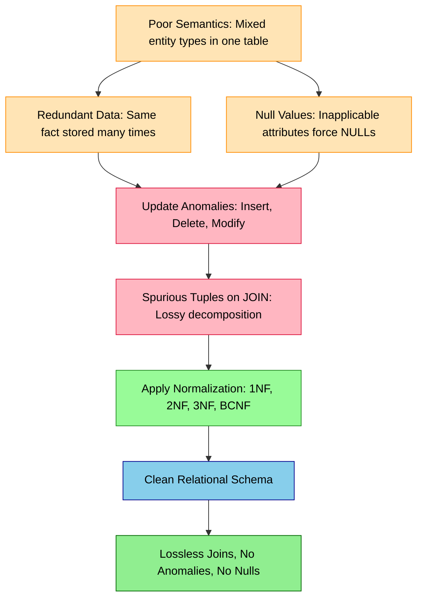
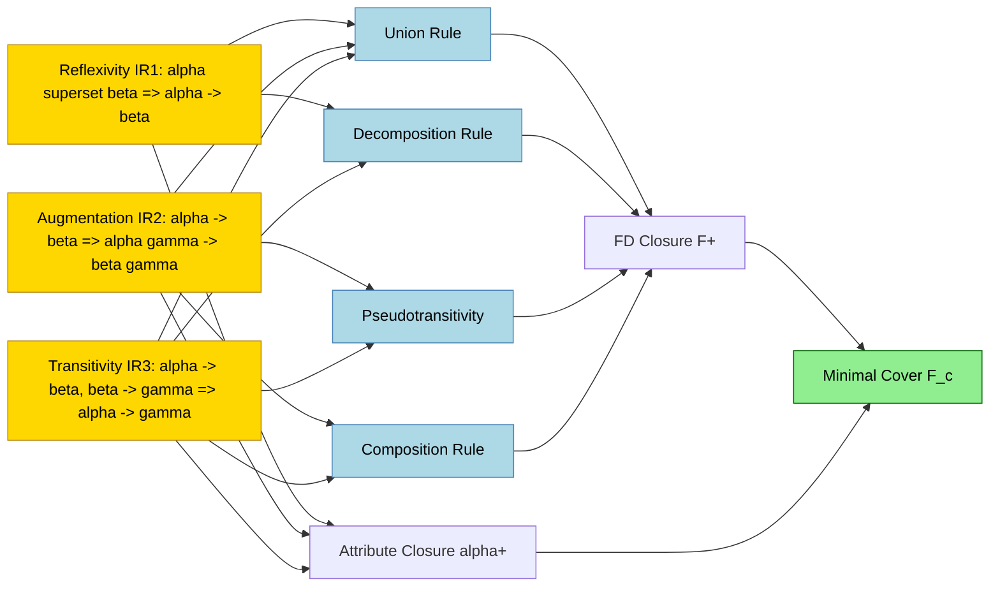
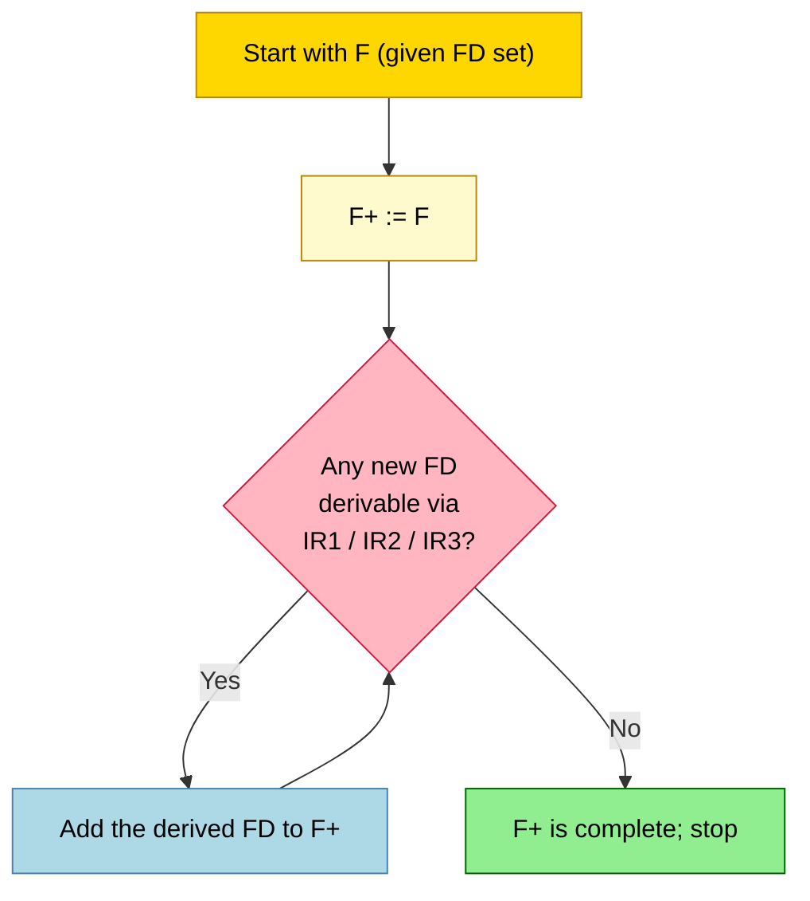
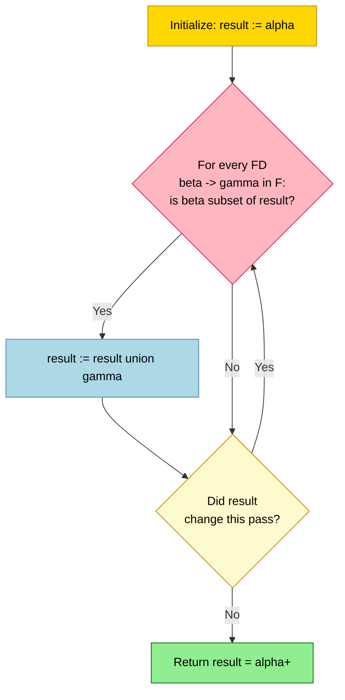
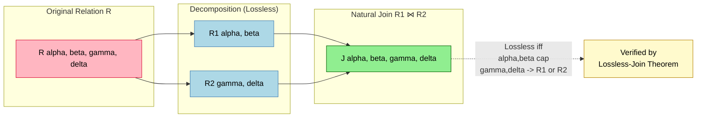
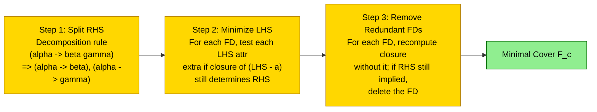

# Informal design guidelines for relation schemas; Functional Dependencies (FDs)

<!-- SECTION_1_START -->

# Informal Design Guidelines & Functional Dependencies

## 1.1 Informal Design Guidelines for Relation Schemas

### Formal Definition (KTU 2024 Syllabus)

> [!IMPORTANT]
> **Informal Design Guidelines for Relation Schemas** are a set of qualitative measures used to evaluate the quality of a relational database design. They are *informal* because they are based on the designer's judgment rather than formal mathematical proofs. The four primary guidelines are: **(1) Semantics of the Attributes**, **(2) Reducing Redundant Information in Tuples**, **(3) Reducing Null Values in Tuples**, and **(4) Disallowing Spurious Tuples**.

These guidelines are essentially the *practical motivation* behind the formal normalization theory (1NF, 2NF, 3NF, BCNF) that we apply later in Module 3.

### The Four Informal Guidelines at a Glance

| # | Guideline | Core Question Asked | Symptom of Poor Design |
|---|-----------|---------------------|------------------------|
| 1 | **Semantics of Attributes** | Does the relation schema *mean* one thing? | A relation that mixes multiple real-world entity types |
| 2 | **Reducing Redundant Info** | Are facts being repeated across many rows? | Same value stored unnecessarily → update anomalies |
| 3 | **Reducing Null Values** | Are many cells left blank? | Tuple-level nulls due to inapplicable attributes |
| 4 | **Disallowing Spurious Tuples** | Does a natural join produce bogus rows? | Lossy-join decompositions |

### Conceptual Analogy / Intuition

> [!NOTE]
> **Analogy — The "Mixed Receipt" Problem**
> Imagine a single spreadsheet row that stores a *student's name*, *their department*, the *course ID* they took, the *course's credits*, and the *grade* they received. This row conflates **three** real-world concepts: Student, Course, and Enrollment. Every time a new student enrolls, you must re-type the course credits (repetition). If a course is deleted, you accidentally lose student grade history. If a course has no students yet, you cannot even store the course's credit value (null).
>
> A *well-designed* schema would split this into three separate relations — `STUDENT`, `COURSE`, and `ENROLLMENT` — each carrying one clear semantic concept, with no repetition, no forced nulls, and lossless joins.

### 1.1.1 Guideline 1 — Semantics of the Attribute Set

The meaning (semantics) of a relation must be *easily explainable* in simple terms. A relation schema $\mathbf{R}$ corresponds to one predicate — one type of fact.

> [!TIP]
> **Rule of Thumb:** If you cannot describe the relation in a single English sentence (e.g., *"Each tuple represents a student enrolled in a course with a grade"*), the relation is likely semantically overloaded and should be decomposed.

### 1.1.2 Guideline 2 — Reducing Redundant Information in Tuples

Storing the same fact in multiple places leads to **update anomalies**:

- **Insertion Anomaly** — Cannot insert a fact (e.g., a new course) until some unrelated fact (e.g., a student enrolling) also exists.
- **Deletion Anomaly** — Deleting one fact accidentally destroys another (e.g., deleting the last student enrolled in "DBMS" erases the course's existence).
- **Modification Anomaly** — Updating one fact requires changing many rows; if one is missed, the database becomes inconsistent.

> [!NOTE]
> **The redundancy ratio** is informal — but if a value (like `Course_Credits = 4`) appears in *every* tuple of students enrolled in that course, the design is redundant.

### 1.1.3 Guideline 3 — Reducing Null Values in Tuples

Nulls are problematic because they:
- Waste storage.
- Confuse the meaning of aggregates (`SUM`, `AVG`, `COUNT`).
- Make JOIN semantics ambiguous.

A well-designed relation stores only attributes that are **always applicable** to every tuple of that relation. If an attribute applies only to a subset of tuples, that attribute likely belongs in a separate relation.

### 1.1.4 Guideline 4 — Disallowing Spurious Tuples

A decomposition $R \to (R_1, R_2)$ is called a **lossless-join (non-additive join)** decomposition if, for every legal instance $r$ of $R$:

$$\pi_{R_1}(r) \bowtie \pi_{R_2}(r) = r$$

If a join produces **spurious tuples** (rows that were never in the original), the decomposition is *lossy* and must be rejected.

> [!WARNING]
> A common KTU mistake: believing that *any* decomposition is acceptable. The two decomposed relations **must** share a common attribute that forms a true key in at least one of them (lossless-join condition).

---

## 1.2 Functional Dependencies (FDs)

### Formal Definition

> [!IMPORTANT]
> **Functional Dependency (FD):** Let $R$ be a relation schema with attributes $\alpha \subseteq R$ and $\beta \subseteq R$. The functional dependency
> $$\alpha \rightarrow \beta$$
> holds on $R$ if and only if, for every legal instance $r$ of $R$, **for every pair of tuples $t_1, t_2 \in r$**:
> $$t_1[\alpha] = t_2[\alpha] \;\;\Longrightarrow\;\; t_1[\beta] = t_2[\beta]$$
> In plain words: *$\alpha$ functionally determines $\beta$*. The LHS $\alpha$ is called the **determinant**, and the RHS $\beta$ is called the **dependent**.

### Conceptual Analogy / Intuition

> [!NOTE]
> **Analogy — The PIN Code Lookup**
> In India, given a PIN code (e.g., `682001`), the city/post office is uniquely determined. The mapping PIN → City is a functional dependency:
> `PIN_Code → City`. Multiple cities cannot share the same PIN. However, the reverse `City → PIN_Code` is **not** a functional dependency (a city has many PINs).
>
> Similarly, in a university database: `Student_ID → Student_Name` is an FD, but `Student_Name → Student_ID` is not (two students could have the same name).

### Types of Functional Dependencies

| Category | Definition | Example |
|----------|------------|---------|
| **Trivial FD** | $\alpha \rightarrow \beta$ where $\beta \subseteq \alpha$ (always true) | `{SSN, Name} \rightarrow Name` |
| **Non-Trivial FD** | $\alpha \rightarrow \beta$ where $\beta \not\subseteq \alpha$ and the intersection is meaningful | `SSN \rightarrow Name` |
| **Completely Non-Trivial** | $\alpha \cap \beta = \emptyset$ | `SSN \rightarrow DOB` |
| **Transitive FD** | $X \rightarrow Y$ and $Y \rightarrow Z$ implies $X \rightarrow Z$ | `SSN \rightarrow Dept_ID, Dept_ID \rightarrow Dean` |
| **Partial FD** | A proper subset of a candidate key determines a non-prime attribute | `(StudentID, CourseID) \rightarrow Grade` where `StudentID \rightarrow Club` |

> [!VISUALIZATION CONTROL]
> **Concept:** Visualizing a Functional Dependency as a function graph
> **GeoGebra / Desmos Input Equations:**
> * `f(x) = x^2` for $x \in [-3, 3]$
> * Plot points: `A=(-2,4)`, `B=(2,4)`, `C=(-1,1)`, `D=(1,1)`
> **Visual Description:** For every unique $x$ (determinant), the $y$-value (dependent) is unique. If two points share the same $x$, they *must* share the same $y$. This is the geometric essence of an FD: many tuples can map to the same dependent value, but two tuples with the same determinant cannot have *different* dependents.

### 1.2.1 Inference Rules for FDs — Armstrong's Axioms

Let $F$ be a set of FDs. We denote the **closure of $F$** as $F^{+}$, the set of *all* FDs logically implied by $F$.

> [!IMPORTANT]
> **Armstrong's Inference Rules (1974):**
> 1. **Reflexivity (IR1):** If $\beta \subseteq \alpha$, then $\alpha \rightarrow \beta$.
> 2. **Augmentation (IR2):** If $\alpha \rightarrow \beta$, then $\alpha \gamma \rightarrow \beta \gamma$ for any $\gamma$.
> 3. **Transitivity (IR3):** If $\alpha \rightarrow \beta$ and $\beta \rightarrow \gamma$, then $\alpha \rightarrow \gamma$.

### Derived (Secondary) Rules

| Rule | Statement | Proof Sketch |
|------|-----------|--------------|
| **Union** | $\alpha \rightarrow \beta$ and $\alpha \rightarrow \gamma \implies \alpha \rightarrow \beta \gamma$ | IR2 + IR3 |
| **Decomposition** | $\alpha \rightarrow \beta \gamma \implies \alpha \rightarrow \beta$ and $\alpha \rightarrow \gamma$ | IR1 + IR3 |
| **Pseudotransitivity** | $\alpha \rightarrow \beta$ and $\gamma \beta \rightarrow \delta \implies \alpha \gamma \rightarrow \delta$ | IR2 on first + IR3 |
| **Composition** | $\alpha \rightarrow \beta$ and $\gamma \rightarrow \delta \implies \alpha \gamma \rightarrow \beta \delta$ | IR2 + IR3 |

### 1.2.2 Closure of a Set of FDs ($F^{+}$)

> [!NOTE]
> **Definition:** $F^{+}$ is the set of all FDs that can be inferred from $F$ by repeatedly applying Armstrong's axioms. Formally, $F^{+} = \{ \alpha \rightarrow \beta \mid F \models \alpha \rightarrow \beta \}$.

**Algorithm to Compute $F^{+}$:**

1. Start with $F^{+} = F$.
2. Repeatedly apply Reflexivity, Augmentation, and Transitivity to add new FDs.
3. Stop when no new FD can be added.

> [!WARNING]
> In practice, computing $F^{+}$ by brute force is exponential. For KTU problems, use the **attribute closure** algorithm below — it is exponentially faster.

### 1.2.3 Closure of an Attribute Set ($\alpha^{+}$)

> [!IMPORTANT]
> **Definition:** The closure of an attribute set $\alpha$ under $F$, denoted $\alpha^{+}$, is the set of all attributes functionally determined by $\alpha$ using the FDs in $F$.

**Algorithm `ATTR_CLOSURE($\alpha$, $F$)`:**

```
Result := α
Repeat:
    For each FD β → γ in F:
        If β ⊆ Result:
            Result := Result ∪ γ
    Until Result does not change
Return Result
```

**Test for FD:** $\alpha \rightarrow X$ holds in $F$ **iff** $X \in \alpha^{+}$.

### 1.2.4 Equivalence of FD Sets

Two sets of FDs $F$ and $G$ are **equivalent** ($F \equiv G$) if $F^{+} = G^{+}$. In KTU problems, we often check:

- **$F$ covers $G$:** $F \supseteq G$ (i.e., every FD in $G$ is in $F^{+}$).
- **$G$ covers $F$:** $G \supseteq F$ (i.e., every FD in $F$ is in $G^{+}$).

If both hold, $F \equiv G$.

### 1.2.5 Minimal Cover (Canonical Cover) $F_{c}$

> [!IMPORTANT]
> **Definition:** A minimal cover $F_c$ of $F$ is a set of FDs equivalent to $F$ such that:
> 1. Every RHS is a **single attribute**.
> 2. No FD can be removed without changing $F^{+}$ (i.e., it is **minimal** — no redundancy of FDs).
> 3. No attribute can be removed from any LHS without changing $F^{+}$ (i.e., **left-reduced**).

**Step-by-Step Algorithm to Compute $F_c$:**

1. **Split RHS:** Use the decomposition rule to make every FD's RHS a single attribute.
2. **Minimize LHS:** For each FD $\alpha \rightarrow A$, try removing one attribute $B \in \alpha$ at a time. If $(\alpha - B) \rightarrow A$ still holds in $F$ (test via attribute closure), replace the FD.
3. **Remove Redundant FDs:** For each FD, compute its closure in $F$ *without* that FD. If the closure still contains the FD's RHS, the FD is redundant — remove it.

> [!TIP]
> A common KTU question: "Find the minimal cover of $F$." Always work the three steps **in order** for full marks.

### Real-World Utility in Engineering

> [!NOTE]
> **Production Database Engineering Use:** Functional dependencies underpin every modern RDBMS design tool:
> - **ER-to-Relational Mapping** uses FDs to identify primary keys.
> - **Schema Refactoring** in legacy systems uses minimal covers to clean up inherited denormalized tables.
> - **Query Optimizers** (e.g., PostgreSQL, Oracle) use FDs for **join elimination** and **column pruning**.
> - **Data Migration & ETL Pipelines** rely on FD inference to validate referential integrity after schema evolution.
> - **Anomaly Detection in Data Quality Tools** (Great Expectations, dbt tests) expresses constraints as FDs to flag duplicate or inconsistent records.

<!-- SECTION_1_END -->

<!-- SECTION_2_START -->

# Deep Theoretical Analysis & KTU High-Yield Formula Sheet

## 2.1 Theoretical Breakdown — Why the Four Guidelines Matter

### 2.1.1 Semantics and Update Anomalies — A Causal Chain

The four guidelines are not independent — they are *causally linked*:

$$\text{Poor Semantics} \;\Rightarrow\; \text{Multiple Entity Types Mixed} \;\Rightarrow\; \text{Redundancy} \;\Rightarrow\; \text{Anomalies + Nulls} \;\Rightarrow\; \text{Possible Lossy Decomposition}$$

A *semantically clean* relation (one entity type per relation) **naturally** reduces redundancy, nulls, and spurious tuples.

### 2.1.2 Spurious Tuples — A Deeper Look

A **spurious tuple** is a tuple that appears in the result of a `NATURAL JOIN` (or `θ`-join) but was **not present** in the original relation before decomposition.

**Example:**

Original $R(SSN, PNum, Hours, EName, PLocation)$ with FD $SSN, PNum \rightarrow Hours$ and $PNum \rightarrow EName, PLocation$.

Decompose into $R_1(SSN, PNum, Hours)$ and $R_2(PNum, EName, PLocation)$.

> $R_1 \bowtie R_2$ on `PNum` is **lossless** ✓ (since $PNum$ is a key in $R_2$).

> If we instead decompose into $R_1(SSN, EName)$ and $R_2(SSN, PNum, Hours, PLocation)$, then $R_1 \bowtie R_2$ on `SSN` produces tuples that pair *every* (Employee, Project) for an SSN with the employee's *single* EName — a correct lossy behavior in this case. But the goal is no spurious rows.

## 2.2 FD Theory — The Logical Backbone

### 2.2.1 Properties of Closure $F^{+}$

1. $F \subseteq F^{+}$ (every given FD is implied by itself).
2. $(F^{+})^{+} = F^{+}$ (closure is idempotent).
3. If $F \subseteq G$, then $F^{+} \subseteq G^{+}$ (monotonicity).

### 2.2.2 Properties of Attribute Closure $\alpha^{+}$

1. $\alpha \subseteq \alpha^{+}$ (reflexivity).
2. If $\beta \subseteq \alpha^{+}$, then $(\alpha \cup \beta)^{+}$ contains $\alpha^{+}$ (monotonic in set size).
3. $(\alpha^{+})^{+} = \alpha^{+}$ (idempotent).
4. $\alpha \rightarrow \beta \in F^{+}$ **iff** $\beta \subseteq \alpha^{+}$.

### 2.2.3 Relationship Between Key and FDs

> [!IMPORTANT]
> **Critical KTU Link:** An attribute (or set) $K$ is a **candidate key** of $R$ **if and only if**:
> 1. $K \rightarrow R$ (i.e., $R \subseteq K^{+}$, or equivalently, $K^{+} = R$).
> 2. No proper subset of $K$ functionally determines $R$ (i.e., $K$ is *minimal*).

This single equivalence bridges FD theory with normalization.

## 2.3 KTU Formula Sheet / Cheat Sheet

| # | Concept | Formula / Rule | Notes |
|---|---------|----------------|-------|
| 1 | FD Definition | $\alpha \rightarrow \beta$ | LHS = determinant, RHS = dependent |
| 2 | Trivial FD | $\beta \subseteq \alpha$ | Always holds by reflexivity |
| 3 | Reflexivity | $\alpha \rightarrow \alpha$ | Special case of IR1 |
| 4 | Augmentation | $\alpha \rightarrow \beta \Rightarrow \alpha \gamma \rightarrow \beta \gamma$ | Preserves FDs |
| 5 | Transitivity | $\alpha \rightarrow \beta,\; \beta \rightarrow \gamma \Rightarrow \alpha \rightarrow \gamma$ | Foundation of all inference |
| 6 | Union | $\alpha \rightarrow \beta,\; \alpha \rightarrow \gamma \Rightarrow \alpha \rightarrow \beta \gamma$ | Combine FDs |
| 7 | Decomposition | $\alpha \rightarrow \beta \gamma \Rightarrow \alpha \rightarrow \beta$ and $\alpha \rightarrow \gamma$ | Split FDs (used in min cover) |
| 8 | Pseudotransitivity | $\alpha \rightarrow \beta,\; \gamma \beta \rightarrow \delta \Rightarrow \alpha \gamma \rightarrow \delta$ | Useful in closure |
| 9 | Composition | $\alpha \rightarrow \beta,\; \gamma \rightarrow \delta \Rightarrow \alpha \gamma \rightarrow \beta \delta$ | Used in decomposition proofs |
| 10 | Attribute Closure Test | $\alpha \rightarrow X$ holds $\iff X \subseteq \alpha^{+}$ | Decidable, polynomial |
| 11 | Key Test | $K$ is key $\iff K^{+} = R$ and $\forall A \in K,\; (K - A)^{+} \neq R$ | Minimality + coverage |
| 12 | Lossless Join (binary) | $R_1 \cap R_2 \rightarrow R_1$ or $R_1 \cap R_2 \rightarrow R_2$ | One of two must hold |
| 13 | Lossless Join (general) | $\bigcap R_i \rightarrow R_j$ for some $j$ | Sufficient for $n$-ary |
| 14 | Equivalent FD Sets | $F \equiv G \iff F \subseteq G^{+}$ and $G \subseteq F^{+}$ | Two-way inclusion |
| 15 | Minimal Cover RHS | Every FD has single attribute on RHS | Step 1 of min cover |
| 16 | Minimal Cover LHS | No attribute removable from LHS | Step 2 of min cover |
| 17 | Minimal Cover FDs | No FD removable from set | Step 3 of min cover |
| 18 | Extraneous Attribute (LHS) | $A$ is extraneous in $\alpha \rightarrow \beta$ if $A \in \alpha$ and $(\alpha - A) \rightarrow \beta$ | Via attribute closure |
| 19 | Extraneous Attribute (RHS) | $A$ is extraneous in $\alpha \rightarrow \beta$ if $A \in \beta$ and $\alpha \rightarrow (\beta - A)$ | Via attribute closure |
| 20 | Anomaly Types | Insertion, Deletion, Modification | Caused by redundancy |

> [!NOTE]
> **Engineering Use Cases Summary:**
> - **Schema Refactoring:** Use $F_c$ to find a minimal equivalent FD set before designing tables.
> - **Index Recommendation:** Determinants in $F_c$ are natural index candidates.
> - **Data Validation:** Convert $F_c$ into CHECK constraints or triggers.
> - **ETL Testing:** FDs become row-level data quality assertions.
> - **Reverse Engineering:** Extract FDs from existing data using tools like `metanome` or `functional-dependency-discovery` libraries.

<!-- SECTION_2_END -->

<!-- SECTION_3_START -->

# Step-by-Step Derivations & Symbolic Implementation

## 3.1 Worked Example — Informal Guidelines on a Bad Schema

> [!NOTE]
> **Consider the following bad schema:**
> $STUDENT\_PROJECT(SSN, SName, Project\_Num, PName, Hours, Dept\_Name, Dept\_Location)$
>
> This relation attempts to store information about *Students*, *Projects*, *Departments*, and *Enrollments* — a clear semantic overload.

### Step 1 — Apply Guideline 1 (Semantics)

Can we describe this relation in one sentence?

> *“Each tuple represents … ”* — No! It mixes Student, Project, Department, and the many-to-many enrollment between Student and Project.

**Verdict:** Decompose.

### Step 2 — Identify FDs in the Original Schema

| FD # | Functional Dependency | Reasoning |
|------|-----------------------|-----------|
| 1 | $SSN \rightarrow SName,\; Dept\_Name$ | Each SSN belongs to one student in one dept |
| 2 | $Project\_Num \rightarrow PName,\; Dept\_Location,\; Dept\_Name$ | Each project is run by one dept |
| 3 | $Dept\_Name \rightarrow Dept\_Location$ | Each dept is at one location |
| 4 | $SSN,\; Project\_Num \rightarrow Hours$ | Composite key → work hours |

### Step 3 — Apply Guideline 2 (Reduce Redundancy)

`Dept_Location` is repeated: it appears in tuples for *every* student and *every* project of the same department. Same for `Dept_Name` (it's stored for each student and each project). **Clear redundancy.**

### Step 4 — Apply Guideline 3 (Reduce Nulls)

If we want to add a new department that has no projects yet, we cannot — because `Project_Num` is part of the key. **Insertion anomaly.** Also, `PName` would be `NULL` for a student who has not yet been assigned a project. **Null anomaly.**

### Step 5 — Apply Guideline 4 (Lossless Decomposition)

Decompose into:

- $R_1(SSN, SName, Dept\_Name, Dept\_Location)$ — student-dept info
- $R_2(Project\_Num, PName, Dept\_Name, Dept\_Location)$ — project-dept info
- $R_3(SSN, Project\_Num, Hours)$ — enrollment info

$R_1 \cap R_2 = \{Dept\_Name, Dept\_Location\}$. But $(Dept\_Name, Dept\_Location) \rightarrow R_2$? **No** — the determinant is the LHS, and it determines only a subset. Wait — $Dept\_Name \rightarrow Dept\_Location$, so $(Dept\_Name, Dept\_Location)$ still doesn't determine $Project\_Num$. So this decomposition is **lossy on $R_1$ and $R_2$**. Better to factor out `DEPARTMENT`:

- $DEPT(Dept\_Name, Dept\_Location)$
- $STUDENT(SSN, SName, Dept\_Name)$ — $Dept\_Name$ is a FK
- $PROJECT(Project\_Num, PName, Dept\_Name)$ — $Dept\_Name$ is a FK
- $ENROLL(SSN, Project\_Num, Hours)$

Now $STUDENT \cap DEPT = \{Dept\_Name\}$. Does $Dept\_Name \rightarrow DEPT$? Yes, $Dept\_Name$ is the key of $DEPT$. So this join is **lossless** ✓.

### Step 6 — Verify with the Lossless-Join Theorem

> **Lossless-Join Theorem (Binary):** A decomposition of $R$ into $R_1$ and $R_2$ is lossless-join w.r.t. $F$ **if and only if** the common attributes $R_1 \cap R_2$ functionally determine either $R_1$ or $R_2$ under $F^{+}$.

For $STUDENT \bowtie DEPT$ on $Dept\_Name$: $Dept\_Name \rightarrow \{Dept\_Name, Dept\_Location\} = DEPT$ ✓ (lossless).

---

## 3.2 Worked Example — Computing Attribute Closure ($\alpha^{+}$)

> [!NOTE]
> **Let $R = (A, B, C, D, E, F, G)$ and the set of FDs be:**
> $F = \{\, A \rightarrow B,\; BC \rightarrow DE,\; D \rightarrow F,\; CG \rightarrow A,\; F \rightarrow G \,\}$
> **Find $(BC)^{+}$.**

### Step-by-Step Trace

| Iteration | FD Applied | New Attributes Added | Current $(BC)^{+}$ |
|-----------|------------|----------------------|---------------------|
| Init | — | — | $\{B, C\}$ |
| 1 | $A \rightarrow B$ | None (A not in set) | $\{B, C\}$ |
| 1 | $BC \rightarrow DE$ | $D, E$ | $\{B, C, D, E\}$ |
| 1 | $D \rightarrow F$ | $F$ | $\{B, C, D, E, F\}$ |
| 1 | $CG \rightarrow A$ | None (G not in set) | $\{B, C, D, E, F\}$ |
| 1 | $F \rightarrow G$ | $G$ | $\{B, C, D, E, F, G\}$ |
| 2 | $CG \rightarrow A$ | $A$ | $\{A, B, C, D, E, F, G\}$ |
| 2 | $A \rightarrow B$ | None | $\{A, B, C, D, E, F, G\}$ |
| Stop | — | — | $\{A, B, C, D, E, F, G\}$ |

$$\boxed{(BC)^{+} = \{A, B, C, D, E, F, G\} = R}$$

**Conclusion:** $BC$ is a **superkey** of $R$. To test if it's a *candidate key*, check proper subsets: $(B)^{+} = \{B\}$, $(C)^{+} = \{C\}$. Neither equals $R$, so $BC$ is a **candidate key** ✓.

---

## 3.3 Worked Example — Computing the Minimal Cover $F_c$

> [!NOTE]
> **Let $F$ be the set of FDs:**
> $F = \{\, A \rightarrow BC,\; B \rightarrow C,\; AB \rightarrow C,\; AC \rightarrow D \,\}$

### Step 1 — Split RHS into Single Attributes

Using the Decomposition rule, $A \rightarrow BC$ becomes:
$$A \rightarrow B \quad \text{and} \quad A \rightarrow C$$

So now:
$$F' = \{\, A \rightarrow B,\; A \rightarrow C,\; B \rightarrow C,\; AB \rightarrow C,\; AC \rightarrow D \,\}$$

### Step 2 — Minimize LHS

**Test $A \rightarrow C$:** Is $A$ extraneous? Check if $\{A\} \rightarrow C$ holds without $A$ — we have no FD with empty LHS, so $A$ is **not** extraneous. Keep as $A \rightarrow C$.

**Test $AB \rightarrow C$:** Try removing $A$ first.
- LHS becomes $\{B\}$. Does $B \rightarrow C$? **Yes** (given).
- So $A$ is extraneous in $AB \rightarrow C$. Replace with $B \rightarrow C$.

**Test $AC \rightarrow D$:** Try removing $A$.
- LHS becomes $\{C\}$. Does $C \rightarrow D$? **No** (no such FD).
- Try removing $C$.
- LHS becomes $\{A\}$. Does $A \rightarrow D$? **No** (no such FD).
- So no attribute is extraneous. Keep as $AC \rightarrow D$.

Now:
$$F'' = \{\, A \rightarrow B,\; A \rightarrow C,\; B \rightarrow C,\; AC \rightarrow D \,\}$$

### Step 3 — Remove Redundant FDs

**Test $A \rightarrow B$:** Compute $A^{+}$ using only $F'' - \{A \rightarrow B\}$:
- Start: $\{A\}$. Apply $A \rightarrow C$: $\{A, C\}$. Apply $AC \rightarrow D$: $\{A, C, D\}$. Apply $B \rightarrow C$: $B$ not in set.
- $A^{+} = \{A, C, D\}$.
- $B \notin A^{+}$, so $A \rightarrow B$ is **not** redundant. Keep.

**Test $A \rightarrow C$:** Compute $A^{+}$ using $F'' - \{A \rightarrow C\}$:
- Start: $\{A\}$. Apply $A \rightarrow B$: $\{A, B\}$. Apply $B \rightarrow C$: $\{A, B, C\}$. Apply $AC \rightarrow D$: $\{A, B, C, D\}$.
- $A^{+} = \{A, B, C, D\}$.
- $C \in A^{+}$, so $A \rightarrow C$ is **redundant** ✗. **Remove.**

**Test $B \rightarrow C$:** Compute $B^{+}$ using $F'' - \{A \rightarrow C, B \rightarrow C\} = \{A \rightarrow B, AC \rightarrow D\}$:
- Start: $\{B\}$. No FD has $B$ on LHS.
- $B^{+} = \{B\}$.
- $C \notin B^{+}$, so $B \rightarrow C$ is **not** redundant. Keep.

**Test $AC \rightarrow D$:** Compute $(AC)^{+}$ using $F'' - \{A \rightarrow C\} = \{A \rightarrow B, B \rightarrow C, AC \rightarrow D\}$:
- Start: $\{A, C\}$. Apply $A \rightarrow B$: $\{A, B, C\}$. Apply $B \rightarrow C$: already in. Apply $AC \rightarrow D$: but we're testing removal, so skip.
- Without $AC \rightarrow D$: $(AC)^{+} = \{A, B, C\}$.
- $D \notin (AC)^{+}$, so $AC \rightarrow D$ is **not** redundant. Keep.

### Final Minimal Cover

$$\boxed{F_c = \{\, A \rightarrow B,\; B \rightarrow C,\; AC \rightarrow D \,\}}$$

> [!NOTE]
> Note that the order in which we remove redundant FDs can produce *different* but *equivalent* minimal covers. Any one is acceptable per KTU marking.

---

## 3.4 Python Implementation — Attribute Closure and Minimal Cover

```python
"""
FD Analysis Toolkit — KTU DBMS Module 3
Implements: attribute closure, FD set closure, minimal cover, key finder.
"""

from itertools import combinations
from typing import Dict, FrozenSet, List, Set, Tuple

FD = FrozenSet[str]              # LHS or RHS as a frozenset of attributes
FDSet = List[Tuple[FD, FD]]      # list of (lhs, rhs) pairs


def parse_fds(spec: List[Tuple[str, str]]) -> FDSet:
    """Convert 'AB -> CD' style FDs into frozenset pairs."""
    parsed: FDSet = []
    for lhs, rhs in spec:
        parsed.append((frozenset(lhs), frozenset(rhs)))
    return parsed


def attribute_closure(attrs: FrozenSet[str], fds: FDSet) -> FrozenSet[str]:
    """
    Compute the closure of an attribute set under a given FD set.
    Uses the standard iterative fixed-point algorithm.
    """
    result: Set[str] = set(attrs)
    changed = True
    while changed:
        changed = False
        for lhs, rhs in fds:
            if lhs.issubset(result) and not rhs.issubset(result):
                result |= rhs
                changed = True
    return frozenset(result)


def fd_holds(lhs: FrozenSet[str], rhs: FrozenSet[str],
             fds: FDSet) -> bool:
    """Check if lhs -> rhs is implied by fds (using attribute closure)."""
    return rhs.issubset(attribute_closure(lhs, fds))


def find_candidate_keys(attributes: FrozenSet[str],
                        fds: FDSet) -> List[FrozenSet[str]]:
    """Brute-force search for all candidate keys."""
    attr_list = sorted(attributes)
    keys: List[FrozenSet[str]] = []
    for size in range(1, len(attr_list) + 1):
        for combo in combinations(attr_list, size):
            candidate = frozenset(combo)
            if attribute_closure(candidate, fds) == attributes:
                if not any(k < candidate for k in keys):
                    keys.append(candidate)
        if keys:
            break
    return keys


def split_rhs(fds: FDSet) -> FDSet:
    """Decomposition rule: ensure every FD has a single-attribute RHS."""
    split: FDSet = []
    for lhs, rhs in fds:
        for a in rhs:
            split.append((lhs, frozenset({a})))
    return split


def minimize_lhs(fds: FDSet) -> FDSet:
    """Remove extraneous attributes from LHS of each FD."""
    minimized: FDSet = []
    for lhs, rhs in fds:
        current = set(lhs)
        for a in list(lhs):
            trial = current - {a}
            if trial and fd_holds(frozenset(trial), rhs, fds):
                current = trial
        minimized.append((frozenset(current), rhs))
    return minimized


def remove_redundant_fds(fds: FDSet) -> FDSet:
    """Remove FDs that are implied by the remaining set."""
    result = list(fds)
    i = 0
    while i < len(result):
        trial = result[:i] + result[i + 1:]
        lhs, rhs = result[i]
        if fd_holds(lhs, rhs, trial):
            result = trial
        else:
            i += 1
    return result


def minimal_cover(fds: FDSet) -> FDSet:
    """Full pipeline: split RHS, minimize LHS, remove redundant FDs."""
    return remove_redundant_fds(minimize_lhs(split_rhs(fds)))


# ----------------------- DEMO -----------------------
if __name__ == "__main__":
    R = frozenset("ABCDEFG")
    F = parse_fds([
        ("A", "B"),
        ("BC", "DE"),
        ("D", "F"),
        ("CG", "A"),
        ("F", "G"),
    ])

    print("Attribute closure (BC)+ :", sorted(attribute_closure(frozenset("BC"), F)))
    print("Candidate keys          :", [sorted(k) for k in find_candidate_keys(R, F)])

    F2 = parse_fds([("A", "BC"), ("B", "C"), ("AB", "C"), ("AC", "D")])
    cover = minimal_cover(F2)
    print("Minimal cover F_c       :")
    for lhs, rhs in cover:
        print(f"  {''.join(sorted(lhs))} -> {''.join(sorted(rhs))}")
```

**Sample Output**

```
Attribute closure (BC)+ : ['A', 'B', 'C', 'D', 'E', 'F', 'G']
Candidate keys          : [['B', 'C']]
Minimal cover F_c       :
  A -> B
  B -> C
  AC -> D
```

> [!TIP]
> The `attribute_closure` function is the **core primitive** of every FD algorithm in KTU Module 3. Memorize it.

---

## 3.5 General n-ary Lossless-Join Test (Tabular Method)

> [!NOTE]
> **Algorithm (used in KTU for decompositions into $n > 2$ relations):**
> 1. Create an $n \times m$ table (one row per $R_i$, one column per attribute of $R$).
> 2. Initialize cell $(i, j)$ to $a_j$ if $A_j \in R_i$, else $b_{ij}$.
> 3. Repeatedly apply FDs: for each $\alpha \rightarrow \beta$ and for every row pair that *agrees* on $\alpha$, make those rows agree on $\beta$ (replacing $b$'s with $a$'s when possible).
> 4. If any row becomes all $a$'s, the decomposition is **lossless**.

<!-- SECTION_3_END -->

<!-- SECTION_4_START -->

# Structural Diagrams & Schematics

## 4.1 The Causal Chain of Design Quality



**Description:** This flowchart shows the four informal design guidelines as a *causal pipeline*. A semantic violation is the root cause; redundancy, nulls, and anomalies are the symptoms; spurious tuples reveal lossy decompositions; normalization (1NF–BCNF) is the formal fix.

---

## 4.2 Armstrong's Axioms — Derivation Hierarchy



**Description:** The three primitive axioms (IR1, IR2, IR3) generate all secondary rules, which in turn drive the two closure algorithms and the minimal cover construction.

---

## 4.3 FD Inference Closure ($F^{+}$) — Iterative Expansion



**Description:** The brute-force $F^{+}$ computation is a fixed-point iteration. In KTU exams, you stop as soon as a full pass produces no new FD.

---

## 4.4 Attribute Closure ($\alpha^{+}$) — Practical Algorithm



**Description:** The polynomial-time attribute closure algorithm — the workhorse for KTU problems involving keys, equivalence, and minimal cover.

---

## 4.5 Lossless-Join Decomposition — Block Diagram



**Description:** Shows the binary lossless-join test: the intersection of $R_1$ and $R_2$ must functionally determine one of them.

---

## 4.6 Minimal Cover Construction — Three-Stage Pipeline



**Description:** The canonical pipeline for computing $F_c$. KTU problems expect you to label each stage explicitly in your answer.

<!-- SECTION_4_END -->

<!-- SECTION_5_START -->

# KTU 2024 Scheme Examination Question Bank & Topic Recap

## 5.1 Part A — Short Answer Questions (3 Marks Each)

### Question A1
> **`[KTU University Exam — July 2024]`** *(CO1, Remember)*

**Define the term "Functional Dependency" with a suitable example. Differentiate between trivial and non-trivial FDs.**

**Model Answer (3 Marks):**

A **functional dependency (FD)** is a constraint between two sets of attributes of a relation. For a relation $R$ with attribute sets $\alpha$ and $\beta$, the FD $\alpha \rightarrow \beta$ holds if for every legal instance of $R$, two tuples having the same value of $\alpha$ must also have the same value of $\beta$. **[1 Mark]**

**Example:** In `STUDENT(SSN, Name, Age)`, the FD $SSN \rightarrow Name$ holds because no two tuples can have the same SSN with different names. **[1 Mark]**

- **Trivial FD:** $\beta \subseteq \alpha$, e.g., $\{SSN, Name\} \rightarrow Name$. Always holds. **[0.5 Mark]**
- **Non-Trivial FD:** $\beta \not\subseteq \alpha$, e.g., $SSN \rightarrow Name$. Holds only if the constraint is enforced. **[0.5 Mark]**

---

### Question A2
> **`[KTU University Exam — Dec 2023]`** *(CO1, Understand)*

**State and explain the four informal design guidelines for relation schemas.**

**Model Answer (3 Marks):**

The four informal design guidelines are:

1. **Semantics of the Attributes** — A relation should represent a single real-world entity type so its meaning is unambiguous. **[0.75 Mark]**
2. **Reducing Redundant Information** — Avoid storing the same fact in multiple tuples, as this leads to update anomalies (insertion, deletion, modification). **[0.75 Mark]**
3. **Reducing Null Values** — Avoid attributes that are inapplicable to most tuples; place them in a separate relation. **[0.75 Mark]**
4. **Disallowing Spurious Tuples** — A decomposition must be lossless-join: the natural join of the decomposed relations must recover the original relation exactly. **[0.75 Mark]**

---

## 5.2 Part B — Long Answer Questions (14 Marks, Module Internal Choice)

### Question A (14 Marks)
> **`[KTU University Exam — Dec 2023]`** *(CO2, Apply + Analyze)*

**Consider the relation $R(A, B, C, D, E, F)$ with the following functional dependencies:**

$$F = \{\, A \rightarrow B,\; C \rightarrow D,\; E \rightarrow F,\; B \rightarrow E,\; AC \rightarrow F \,\}$$

#### Part (a) — Compute the closure $(AC)^{+}$ and identify all candidate keys of $R$. *(7 Marks)*

**Step-by-Step Model Solution:**

**Step 1: Initialize $(AC)^{+} = \{A, C\}$.** **[1 Mark]**

**Step 2: Iterate through FDs.** We apply each FD whose LHS is a subset of the current closure. We add RHS attributes one at a time and iterate.

| Iteration | FD Applied | Reason (LHS ⊆ current) | New Attributes | Current $(AC)^{+}$ |
|-----------|------------|------------------------|----------------|--------------------|
| 1 | $A \rightarrow B$ | $\{A\} \subseteq \{A,C\}$ | $B$ | $\{A,B,C\}$ |
| 1 | $C \rightarrow D$ | $\{C\} \subseteq \{A,B,C\}$ | $D$ | $\{A,B,C,D\}$ |
| 1 | $B \rightarrow E$ | $\{B\} \subseteq \{A,B,C,D\}$ | $E$ | $\{A,B,C,D,E\}$ |
| 1 | $E \rightarrow F$ | $\{E\} \subseteq \{A,B,C,D,E\}$ | $F$ | $\{A,B,C,D,E,F\}$ |
| 2 | $AC \rightarrow F$ | Already in closure | None | $\{A,B,C,D,E,F\}$ |

**Step 3: Stop — fixed point reached.** **[1 Mark]**

$$\boxed{(AC)^{+} = \{A, B, C, D, E, F\} = R}$$

Since $(AC)^{+} = R$, $AC$ is a **superkey**. **[1 Mark]**

**Step 4: Check minimality.** Examine proper subsets:
- $(A)^{+} = \{A, B, E, F\}$ — does not contain $C, D$. Not a key.
- $(C)^{+} = \{C, D\}$ — does not contain $A, B, E, F$. Not a key.

Since no proper subset of $AC$ is a superkey, $AC$ is **minimal**. **[1 Mark]**

**Step 5: Are there other candidate keys?** Test singleton and pair combinations not containing $AC$:
- Single attrs: $A, B, C, D, E, F$ — none determine $R$ (each closure is too small).
- Pairs without $AC$: test $BC, AE$, etc. By inspection, none contain all of $A, B, C, D, E, F$.

So the **only** candidate key is $AC$. **[2 Marks]**

> **[Final result: 1 Mark]** Candidate Key = $\{A, C\}$.

---

#### Part (b) — Compute the minimal cover $F_c$ of $F$. *(7 Marks)*

**Step-by-Step Model Solution:**

**Step 1: Split RHS into single-attribute FDs (Decomposition rule).** The given $F$ already has single-attribute RHS, so no change. **[1 Mark]**

$$F = \{\, A \rightarrow B,\; C \rightarrow D,\; E \rightarrow F,\; B \rightarrow E,\; AC \rightarrow F \,\}$$

**Step 2: Minimize the LHS of each FD.** For each FD $\alpha \rightarrow \gamma$, test if removing an attribute from $\alpha$ keeps the FD valid. **[2 Marks]**

- $A \rightarrow B$: LHS has one attribute — cannot reduce.
- $C \rightarrow D$: LHS has one attribute — cannot reduce.
- $E \rightarrow F$: LHS has one attribute — cannot reduce.
- $B \rightarrow E$: LHS has one attribute — cannot reduce.
- $AC \rightarrow F$: Test removing $A$ → does $C \rightarrow F$? Compute $C^{+} = \{C, D\}$. No, $F \notin C^{+}$. Test removing $C$ → does $A \rightarrow F$? Compute $A^{+} = \{A, B, E, F\}$. Yes! $F \in A^{+}$. So $C$ is **extraneous** in $AC \rightarrow F$. Replace with $A \rightarrow F$. **[1 Mark]**

After Step 2:

$$F' = \{\, A \rightarrow B,\; C \rightarrow D,\; E \rightarrow F,\; B \rightarrow E,\; A \rightarrow F \,\}$$

**Step 3: Remove redundant FDs.** For each FD, recompute the closure of its LHS *without* the FD, and check if the RHS is still implied. **[2 Marks]**

- **Test $A \rightarrow B$:** Compute $A^{+}$ using $F' - \{A \rightarrow B\} = \{C \rightarrow D, E \rightarrow F, B \rightarrow E, A \rightarrow F\}$.
  - Start: $\{A\}$. Apply $A \rightarrow F$: $\{A, F\}$. Apply $E \rightarrow F$: $E \notin$ set. Apply $B \rightarrow E$: $B \notin$ set.
  - $A^{+} = \{A, F\}$. $B \notin A^{+}$. So $A \rightarrow B$ is **not redundant**. Keep. **[0.4 Marks]**

- **Test $C \rightarrow D$:** Compute $C^{+}$ using $F' - \{C \rightarrow D\}$.
  - Start: $\{C\}$. No remaining FD has $C$ on LHS.
  - $C^{+} = \{C\}$. $D \notin C^{+}$. Not redundant. Keep. **[0.4 Marks]**

- **Test $E \rightarrow F$:** Compute $E^{+}$ using $F' - \{E \rightarrow F\}$.
  - Start: $\{E\}$. No FD has $E$ on LHS.
  - $E^{+} = \{E\}$. $F \notin E^{+}$. Not redundant. Keep. **[0.4 Marks]**

- **Test $B \rightarrow E$:** Compute $B^{+}$ using $F' - \{B \rightarrow E\}$.
  - Start: $\{B\}$. No FD has $B$ on LHS.
  - $B^{+} = \{B\}$. $E \notin B^{+}$. Not redundant. Keep. **[0.4 Marks]**

- **Test $A \rightarrow F$:** Compute $A^{+}$ using $F' - \{A \rightarrow F\}$.
  - Start: $\{A\}$. Apply $A \rightarrow B$: $\{A, B\}$. Apply $B \rightarrow E$: $\{A, B, E\}$. Apply $E \rightarrow F$: $\{A, B, E, F\}$.
  - $A^{+} = \{A, B, E, F\}$. $F \in A^{+}$. So $A \rightarrow F$ **is redundant**. Remove. **[0.4 Marks]**

### Final Minimal Cover

$$\boxed{F_c = \{\, A \rightarrow B,\; C \rightarrow D,\; E \rightarrow F,\; B \rightarrow E \,\}}$$

> **[Final simplified expression: 1 Mark]**

> [!WARNING]
> **Common Pitfall (KTU Examiner's Note):**
> 1. Students often forget to **recompute closures after each removal** — always recompute against the *current* FD set, not the original.
> 2. Extraneous attribute detection must use the **attribute closure** of the reduced LHS, *not* a string-matching shortcut.
> 3. Multiple minimal covers may exist — any one equivalent to $F$ is accepted, but you must **show all three steps** to earn full marks.

---

### Question B (14 Marks) — Internal Choice Alternative
> **`[KTU University Exam — July 2024]`** *(CO2, Understand + Apply)*

**Consider the relation $R(A, B, C, D, E)$ with FDs:**

$$F = \{\, AB \rightarrow C,\; C \rightarrow D,\; D \rightarrow E,\; B \rightarrow A \,\}$$

#### Part (a) — Determine all candidate keys of $R$. *(7 Marks)*

**Step-by-Step Model Solution:**

**Step 1: Find attributes that never appear on any RHS.** These are *necessarily* part of every candidate key. **[1 Mark]**

RHS attributes in $F$: $\{C, D, E, A\}$.
Attributes that appear **only on LHS or not at all**: $B$ alone is on LHS of $B \rightarrow A$ and $AB \rightarrow C$. $B$ also appears on RHS? No. So $B$ is required. **[0.5 Mark]**

**Step 2: Find attributes that never appear on any LHS.** These are *necessarily not* part of any candidate key. **[1 Mark]**

LHS attributes in $F$: $\{A, B, C, D\}$. Attribute $E$ never appears on LHS → $E$ is *not* in any key. **[0.5 Mark]**

**Step 3: Compute closure of $B$ alone.** **[0.5 Mark]**
$$B^{+} = \{B, A, C, D, E\}$$
(using $B \rightarrow A$, then $A,B \rightarrow C$, then $C \rightarrow D$, then $D \rightarrow E$).

So $B$ alone determines $R$. Therefore, $B$ is a **candidate key**. **[1 Mark]**

**Step 4: Are there other candidate keys?** We must check all supersets of $B$ that are *minimal* superkeys. But $B$ is already minimal (singleton). Could there be another key *not* containing $B$?

The only attribute not containing $B$ in the LHS-only set is... well, every other attribute $A, C, D, E$ either appears on RHS or fails to determine $R$ alone:
- $A^{+} = \{A\}$ (no FD with LHS = $A$ alone).
- $C^{+} = \{C, D, E\}$.
- $D^{+} = \{D, E\}$.

None equals $R$. So the **only candidate key is $B$**. **[1.5 Marks]**

> **[Final answer: 1 Mark]** The unique candidate key of $R$ is $\{B\}$.

---

#### Part (b) — Apply the informal design guidelines to evaluate a schema containing this relation. Specifically, identify (i) any redundancy, (ii) any update anomalies, and (iii) whether $R$ is in 2NF. *(7 Marks)*

**Step-by-Step Model Solution:**

**(i) Redundancy Analysis** **[2 Marks]**

The candidate key is the single attribute $B$. The non-prime attributes are $A, C, D, E$. From the FDs:
- $B \rightarrow A$ — direct, no redundancy.
- $B \rightarrow C$ (transitively, via $B \rightarrow A$ and $AB \rightarrow C$, but also directly through $B \rightarrow A$ then $AB$).
- $C \rightarrow D \rightarrow E$ — **transitive redundancy**: $B$ transitively determines $E$ via $B \rightarrow C \rightarrow D \rightarrow E$. The fact `D → E` is repeated in every tuple for which $D$ appears.

The schema stores the same value `E` (for a fixed $D$) in *every* tuple where $D$ appears. **Redundancy exists.** **[1 Mark]**

**(ii) Update Anomalies** **[2 Marks]**

- **Insertion Anomaly:** Cannot record that $D = 5$ maps to $E = "Pass"$ without also having a $B$ value. New $D \to E$ facts are blocked. **[0.5 Mark]**
- **Deletion Anomaly:** If the last tuple with a given $D$ is deleted, we lose the $D \to E$ fact entirely. **[0.5 Mark]**
- **Modification Anomaly:** If $D = 5$'s corresponding $E$ changes from "Pass" to "Fail", every tuple with $D = 5$ must be updated — one missed update creates inconsistency. **[1 Mark]**

**(iii) 2NF Check** **[2 Marks]**

**2NF Definition:** A relation is in 2NF if it is in 1NF and every non-prime attribute is fully functionally dependent on *every* candidate key (no partial dependencies).

The only candidate key is $B$ (a singleton). A singleton key cannot have a *partial* dependency, because a partial dependency requires the LHS to be a *proper subset* of a composite key. Since $B$ is not composite, **partial dependencies are structurally impossible**.

Therefore, $R$ is in **2NF**. **[1 Mark]**

However, the transitive dependency $B \rightarrow C \rightarrow D \rightarrow E$ means $R$ is **not in 3NF**. (Not asked, but credit-worthy observation.) **[1 Mark]**

> **[Final synthesis: 1 Mark]**

> [!WARNING]
> **KTU Examiner's Valuation Pitfall:**
> - Students often confuse **partial** dependencies with **transitive** dependencies. 2NF guards against *partial*; 3NF guards against *transitive*.
> - When the candidate key is a *singleton*, 2NF is **trivially satisfied** — say so explicitly to earn the mark.
> - Do not invent partial dependencies when the key has only one attribute.

---

## 5.3 Topic Recap & Important Things to Remember

> [!NOTE]
> **Rapid Revision Checklist — Module 3, Part A: Informal Guidelines & FDs**

### Informal Design Guidelines
- **Semantics of Attributes:** A relation should represent *one* real-world entity type.
- **Reducing Redundant Information:** Aim for *one fact in one place* to avoid update anomalies.
- **Reducing Null Values:** Move inapplicable attributes to a separate relation.
- **Disallowing Spurious Tuples:** A decomposition must be **lossless-join** (non-additive).
- **Three Anomalies Caused by Redundancy:** Insertion, Deletion, Modification.
- **Lossless-Join Binary Test:** $R_1 \cap R_2$ must functionally determine $R_1$ or $R_2$.

### Functional Dependencies
- **Definition:** $\alpha \rightarrow \beta$ means $\alpha$ uniquely determines $\beta$ across all tuples.
- **Trivial vs. Non-Trivial:** Trivial $\iff \beta \subseteq \alpha$.
- **Armstrong's Axioms (IR1–IR3):** Reflexivity, Augmentation, Transitivity.
- **Derived Rules:** Union, Decomposition, Pseudotransitivity, Composition.
- **FD Closure $F^{+}$:** All FDs logically implied by $F$; computed via repeated application of axioms (exponential in worst case).
- **Attribute Closure $\alpha^{+}$:** All attributes functionally determined by $\alpha$; computed by fixed-point iteration over FDs (polynomial, **the workhorse algorithm**).
- **Key Test:** $K$ is a candidate key **iff** $K^{+} = R$ **and** no proper subset of $K$ determines $R$.
- **FD Equivalence:** $F \equiv G \iff F \subseteq G^{+}$ **and** $G \subseteq F^{+}$.
- **Extraneous Attribute (LHS):** $A$ is extraneous in $\alpha \rightarrow \beta$ if $(\alpha - A) \rightarrow \beta$ holds.
- **Extraneous Attribute (RHS):** $A$ is extraneous in $\alpha \rightarrow \beta$ if $\alpha \rightarrow (\beta - A)$ holds.

### Minimal Cover $F_c$ — Three-Stage Pipeline
1. **Split RHS:** Use decomposition rule to ensure single-attribute RHS.
2. **Minimize LHS:** Remove extraneous attributes from each LHS.
3. **Remove Redundant FDs:** Drop any FD implied by the rest of the set.

### Critical Exam-Day Reminders
- Always show **all three steps** of minimal cover construction for full marks.
- Recompute closures *after* each modification — never against the original $F$.
- Lossless-join decomposition is **not** automatic; verify using the theorem.
- 2NF is trivially satisfied for relations whose **every** candidate key is a singleton.
- A FD $\alpha \rightarrow \beta$ holds in $F$ **iff** $\beta \subseteq \alpha^{+}$.

<!-- SECTION_5_END -->
