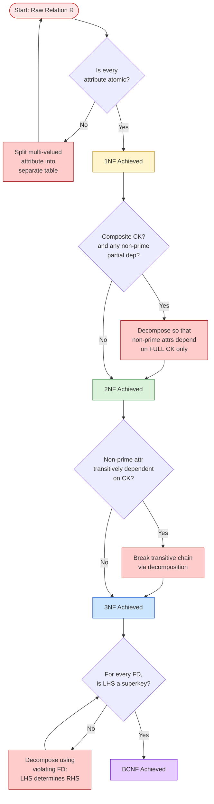
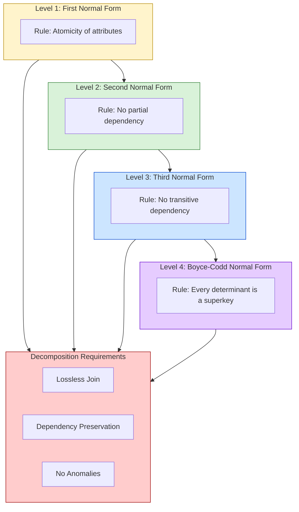
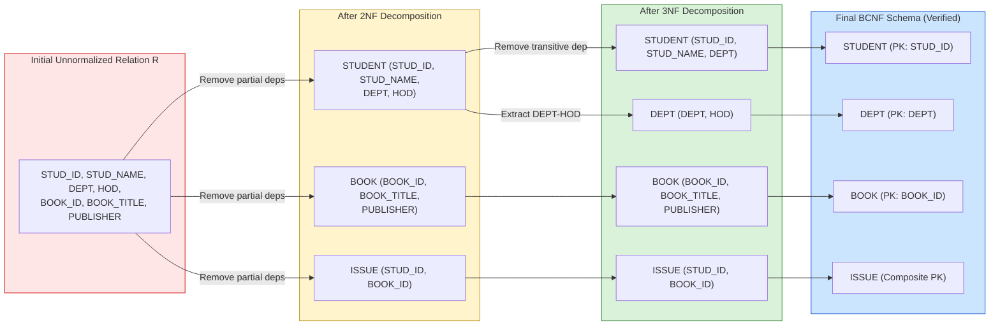

# Normal Forms: First Normal Form (1NF), Second Normal Form (2NF), Third Normal Form (3NF), and Boyce-Codd Normal Form (BCNF)

<!-- SECTION_1_START -->
# Database Design Theory and Normalization: Normal Forms (1NF, 2NF, 3NF, BCNF)

## 1.1 Formal Definition (KTU 2024 Syllabus Terminology)

In the context of Relational Database Design Theory, **Normalization** is a systematic, step-by-step, formal process of decomposing a *poorly-structured relation* (table) into smaller, well-structured relations in order to **minimize data redundancy** and **eliminate undesirable insertion, update, and deletion anomalies**.

A relation is said to be in a particular **Normal Form** if it satisfies a specific set of constraints derived from its **Functional Dependencies (FDs)** and **Candidate Keys (CKs)**.

The hierarchy of normal forms, in increasing order of strictness, is:

$$
\text{1NF} \;\subset\; \text{2NF} \;\subset\; \text{3NF} \;\subset\; \text{BCNF} \;\subset\; \text{4NF} \;\subset\; \text{5NF}
$$

> [!IMPORTANT]
> **Key Syllabus Insight (KTU 2024 - PCCST402 Module 3):**
> A relation in **BCNF** is *guaranteed* to be in 3NF, 2NF, and 1NF. The converse is **NOT** true. A relation in 1NF may violate 2NF, and so on. The "⊂" symbol above denotes **strict subset**, not equality.

### The Four Normal Forms at a Glance

| Normal Form | Core Constraint | Anomaly Removed |
| :--- | :--- | :--- |
| **First Normal Form (1NF)** | Every attribute holds only **atomic (indivisible)** values. No repeating groups or multi-valued attributes. | Multi-valued / repeating group |
| **Second Normal Form (2NF)** | 1NF + No **partial functional dependency** of a non-prime attribute on a candidate key. | Partial dependency |
| **Third Normal Form (3NF)** | 2NF + No **transitive functional dependency** of a non-prime attribute on a candidate key. | Transitive dependency |
| **Boyce-Codd Normal Form (BCNF)** | 3NF + For every non-trivial FD $X \rightarrow Y$, $X$ must be a **superkey** of the relation. | Overlapping candidate keys |

---

## 1.2 Conceptual Analogy & Intuition

> [!NOTE]
> **Plain-English Analogy — The "Messy Student Record Folder"**
>
> Imagine a single physical folder where a college records **every** piece of information about a student. Instead of separate pages, *everything* is scribbled on one giant sheet:
>
> - Roll No, Name, Course, **Phone1, Phone2, Phone3** (multiple phones in one cell — *not atomic*)
> - Roll No $\rightarrow$ Name (fine, this is a clean functional dependency)
> - Roll No $\rightarrow$ Department, Department $\rightarrow$ HOD_Name (this is a *transitive dependency* through Department)
>
> Now, when the HOD changes name, you have to update **every** student's row. This is an **update anomaly**. If a new department is created with no students yet, you **cannot record** the HOD's name — an **insertion anomaly**. If the last student of a department leaves, you **lose** the HOD information — a **deletion anomaly**.
>
> **Normalization is the act of tearing this chaotic sheet into smaller, cleaner, topic-specific folders** — one for *Students*, one for *Departments*, one for *Phones* — linked together using keys.

### Visualizing Attribute Relationships

> [!VISUALIZATION CONTROL]
> **Concept:** Mapping of a candidate key, prime attributes, and non-prime attributes inside a relation.
> **GeoGebra / Desmos Input (Schematic Representation):**
> * Relation $R(A, B, C, D, E)$ with $CK = \{A, B\}$
> * Primes: $A, B$ (orange nodes). Non-Primes: $C, D, E$ (blue nodes).
> * FDs: $A \rightarrow C$, $B \rightarrow D$, $C \rightarrow E$
> **Visual Description:** Students should observe that $A$ and $B$ (orange) act as the "anchor" or "skeleton" of the relation, while $C, D, E$ (blue) are the "satellite" attributes. Any FD that points from one blue node to another (like $C \rightarrow E$) signals a **transitive dependency** — a red flag for 3NF violation.

### Foundational Terminology (Must Memorize)

> [!IMPORTANT]
> - **Prime Attribute**: An attribute that is a **part of *some* candidate key** of the relation.
> - **Non-Prime Attribute**: An attribute that is **NOT** part of any candidate key.
> - **Superkey**: A set of attributes that *uniquely identifies* a tuple, but where removing any attribute would break uniqueness.
> - **Candidate Key**: A *minimal* superkey — no proper subset of it is a superkey.
> - **Trivial FD**: An FD of the form $X \rightarrow Y$ where $Y \subseteq X$ (e.g., $AB \rightarrow A$).
> - **Non-Trivial FD**: $X \rightarrow Y$ where $X \cap Y = \emptyset$ (true constraint).

<!-- SECTION_1_END -->

<!-- SECTION_2_START -->
# Deep Theoretical Analysis: Rules, Logic, and Formula Sheet

## 2.1 Theoretical Breakdown of Each Normal Form

### A. First Normal Form (1NF) — The "Atomicity Rule"

A relation $R$ is in **1NF** if and only if:
1. The **domain of every attribute** contains only **atomic (indivisible) values**.
2. The value of any attribute in a tuple must be a **single value from the domain** of that attribute.
3. There are **no repeating groups** (multi-valued attributes or nested relations inside a single cell).
4. The relation has a **well-defined primary key** (no duplicate tuples).

**Common violations of 1NF:**
- A cell containing comma-separated lists (e.g., `Phone: 9876543, 8765432`)
- A cell containing a JSON blob or array (e.g., `Courses: {DBMS, OS, CN}`)
- Multiple rows for the same primary key with different "list" values.

**How to fix 1NF violations:** Create a new relation that separates the multi-valued attribute into its own table, and re-introduce a **Foreign Key** back to the original relation.

---

### B. Second Normal Form (2NF) — The "No Partial Dependency Rule"

A relation $R$ is in **2NF** if and only if:
1. $R$ is already in **1NF**.
2. **No non-prime attribute is partially dependent on any candidate key**.

> [!IMPORTANT]
> **Partial Dependency** means: if $CK = \{A, B\}$ is a composite key, and $A \rightarrow C$ holds (i.e., a part of the candidate key functionally determines a non-prime attribute $C$), then $R$ violates 2NF.
>
> **Key Insight:** 2NF is **only relevant for relations with composite candidate keys**. A relation with a single-attribute candidate key is *automatically* in 2NF if it is in 1NF.

**How to fix 2NF violations:** Decompose $R$ into two relations:
- $R_1(CK_{\text{part}}, \text{dependent non-prime attrs})$
- $R_2(CK_{\text{full}}, \text{other non-prime attrs})$
where $CK_{\text{part}}$ is the part of the candidate key that was determining the non-prime attribute.

---

### C. Third Normal Form (3NF) — The "No Transitive Dependency Rule"

A relation $R$ is in **3NF** if and only if:
1. $R$ is in **2NF**.
2. **No non-prime attribute is transitively dependent on any candidate key**.
3. Equivalently: for every non-trivial FD $X \rightarrow Y$, either $X$ is a **superkey**, OR $Y$ is a **prime attribute**.

> [!NOTE]
> **Transitive Dependency** occurs when: $A \rightarrow B$ and $B \rightarrow C$, which logically implies $A \rightarrow C$. Here, $A$ is the candidate key, and $C$ is a non-prime attribute determined *through* the intermediate $B$.

**How to fix 3NF violations:** Decompose such that the transitive chain is broken:
- $R_1(A, B)$ where $A \rightarrow B$
- $R_2(B, C)$ where $B \rightarrow C$

---

### D. Boyce-Codd Normal Form (BCNF) — The "Strict Superkey Rule"

A relation $R$ is in **BCNF** if and only if:
1. $R$ is in **3NF**.
2. For **every non-trivial FD** $X \rightarrow Y$ that holds in $R$, $X$ must be a **superkey** of $R$.

> [!WARNING]
> **The Critical Difference Between 3NF and BCNF:**
>
> - In 3NF, an FD $X \rightarrow Y$ is allowed even if $X$ is **not** a superkey, *provided* that $Y$ is a **prime attribute** (part of some candidate key).
> - In BCNF, **no such exception is allowed**. $X$ **must** be a superkey, period.
>
> Therefore, every BCNF relation is in 3NF, but a 3NF relation may still violate BCNF (this happens when the violation involves prime attributes on the right-hand side of an FD where the left-hand side is not a superkey).

**How to fix BCNF violations:** Decompose using the violating FD $X \rightarrow Y$ into:
- $R_1(X \cup Y)$
- $R_2(X \cup (\text{attributes not in } Y))$

---

## 2.2 KTU High-Yield Formula Cheat Sheet

> [!IMPORTANT]
> **The conditions, in plain mathematical form, are summarized below.** This is the table you should reproduce from memory in the exam hall.

| Normal Form | Condition (Logic Form) | What it Removes |
| :--- | :--- | :--- |
| **1NF** | $\forall t \in R,\; \forall A \in \text{Schema}(R):\; t[A] \text{ is atomic}$ | Multi-valued attributes |
| **2NF** | $R \in \text{1NF} \;\land\; \nexists \text{ partial dep on } CK$ | Partial dependency |
| **3NF** | $R \in \text{2NF} \;\land\; \nexists \text{ transitive dep on } CK$ | Transitive dependency |
| **BCNF** | $\forall FD\; X \rightarrow Y \in F^{+},\; X \text{ is a superkey of } R$ | Every non-superkey determinant |

**Test for BCNF:** Compute $X^{+}$ (the closure of $X$). If $X^{+} \neq R$ (i.e., $X$ is not a superkey), then $X \rightarrow Y$ is a BCNF violation.

**Test for 3NF (algorithm form):**
For every FD $X \rightarrow Y$:
- If $X$ is a superkey → ✓ (3NF satisfied by this FD)
- If $Y$ is a prime attribute → ✓ (3NF satisfied by this FD, **but BCNF may still fail**)
- Otherwise → ✗ (3NF violated)

---

## 2.3 Real-World Engineering Utility

> [!NOTE]
> **Where Normalization is Used in Production:**
> - **OLTP (Online Transaction Processing) Systems:** Bank ledgers, e-commerce order systems, hospital records — all demand high-normalized (3NF/BCNF) schemas to ensure **write integrity** and **no anomaly propagation**.
> - **OLAP (Online Analytical Processing) Systems / Data Warehouses:** These systems often *intentionally denormalize* (1NF/2NF) to gain **read performance** for analytical queries and reporting. Star and Snowflake schemas in data warehousing are classic examples.
> - **Microservices & NoSQL:** Modern NoSQL databases (MongoDB, Cassandra) deliberately violate 1NF to store nested JSON documents for performance. The choice of normalization is a **trade-off** between write speed, read speed, and storage cost.

<!-- SECTION_2_END -->

<!-- SECTION_3_START -->
# Step-by-Step Derivations, Closure, and Symbolic Implementation

## 3.1 A Worked-Out Normalization Example (Single Relation → 4NF-Ready)

Consider a **Library Management** relation used in many KTU textbook problems:

### Initial (Unnormalized) Relation

$$
R(\text{STUD\_ID},\; \text{STUD\_NAME},\; \text{DEPT},\; \text{HOD},\; \text{BOOK\_ID},\; \text{BOOK\_TITLE},\; \text{PUBLISHER})
$$

**Given Functional Dependencies (FDs):**
1. $\text{STUD\_ID} \rightarrow \text{STUD\_NAME},\; \text{DEPT}$
2. $\text{DEPT} \rightarrow \text{HOD}$
3. $\text{BOOK\_ID} \rightarrow \text{BOOK\_TITLE},\; \text{PUBLISHER}$
4. $\text{STUD\_ID},\; \text{BOOK\_ID} \rightarrow \text{(Issue Transaction)} \quad \text{(Composite Key determines the issue record)}$

**Candidate Key (CK):** $\{\text{STUD\_ID}, \text{BOOK\_ID}\}$

---

### Step 1: Test for 1NF

*Every attribute must be atomic. Let us assume the relation as given is in 1NF (no multi-valued cells are present).*

**Result: 1NF satisfied ✓**

---

### Step 2: Test for 2NF

Check for **partial dependencies** on the candidate key $\{STUD\_ID, BOOK\_ID\}$:

$$
\begin{aligned}
\text{STUD\_ID} &\rightarrow \text{STUD\_NAME},\; \text{DEPT} \quad &&\text{(Part of CK} \rightarrow \text{Non-Prime)} \quad \rightarrow \text{VIOLATES 2NF} \\
\text{BOOK\_ID} &\rightarrow \text{BOOK\_TITLE},\; \text{PUBLISHER} \quad &&\text{(Part of CK} \rightarrow \text{Non-Prime)} \quad \rightarrow \text{VIOLATES 2NF}
\end{aligned}
$$

**Decomposition to 2NF:**

**Decomposition 1: Decompose partial dependency on STUD\_ID**

$$
\begin{aligned}
R_1 &: (\text{STUD\_ID},\; \text{STUD\_NAME},\; \text{DEPT},\; \text{HOD}) \quad \text{— from FD (1) and (2)} \\
R_2 &: (\text{STUD\_ID},\; \text{BOOK\_ID},\; \text{BOOK\_TITLE},\; \text{PUBLISHER}) \quad \text{— composite issue record}
\end{aligned}
$$

Wait — $R_2$ still has a partial dependency: $BOOK\_ID \rightarrow BOOK\_TITLE, PUBLISHER$. We must decompose $R_2$ further.

**Final 2NF Decomposition:**

$$
\begin{aligned}
\text{STUDENT} &: (\text{STUD\_ID},\; \text{STUD\_NAME},\; \text{DEPT},\; \text{HOD}) \\
\text{BOOK} &: (\text{BOOK\_ID},\; \text{BOOK\_TITLE},\; \text{PUBLISHER}) \\
\text{ISSUE} &: (\text{STUD\_ID},\; \text{BOOK\_ID}) \quad \text{— Junction Table}
\end{aligned}
$$

**Result: 2NF satisfied ✓**

---

### Step 3: Test for 3NF

Look at the STUDENT relation. We have:
- $\text{STUD\_ID} \rightarrow \text{DEPT}$
- $\text{DEPT} \rightarrow \text{HOD}$
- Therefore: $\text{STUD\_ID} \rightarrow \text{HOD}$ (transitively, through DEPT)

This is a **transitive dependency**! Violates 3NF.

**Decomposition to 3NF:**

$$
\begin{aligned}
\text{STUDENT} &: (\text{STUD\_ID},\; \text{STUD\_NAME},\; \text{DEPT}) \\
\text{DEPT} &: (\text{DEPT},\; \text{HOD}) \\
\text{BOOK} &: (\text{BOOK\_ID},\; \text{BOOK\_TITLE},\; \text{PUBLISHER}) \\
\text{ISSUE} &: (\text{STUD\_ID},\; \text{BOOK\_ID})
\end{aligned}
$$

**Result: 3NF satisfied ✓**

---

### Step 4: Test for BCNF

Check every non-trivial FD against the schema:

$$
\begin{aligned}
\text{STUDENT:}\;\; \text{STUD\_ID} &\rightarrow \text{STUD\_NAME},\; \text{DEPT} \quad &&\text{STUD\_ID is a superkey} \quad \rightarrow \checkmark \\
\text{DEPT:}\;\; \text{DEPT} &\rightarrow \text{HOD} \quad &&\text{DEPT is a superkey (single attr)} \quad \rightarrow \checkmark \\
\text{BOOK:}\;\; \text{BOOK\_ID} &\rightarrow \text{BOOK\_TITLE},\; \text{PUBLISHER} \quad &&\text{BOOK\_ID is a superkey} \quad \rightarrow \checkmark \\
\text{ISSUE:}\;\; \text{STUD\_ID},\; \text{BOOK\_ID} &\rightarrow \text{(empty)} \quad &&\text{Composite key is a superkey} \quad \rightarrow \checkmark
\end{aligned}
$$

**Result: BCNF satisfied ✓**

---

## 3.2 Worked Example: A Relation That is in 3NF but NOT in BCNF

Consider a relation $R(A, B, C)$ with FDs:
- $A, B \rightarrow C$
- $C \rightarrow B$

**Step 1: Find Candidate Keys**

$$
\begin{aligned}
(AB)^{+} &= \{A, B, C\} = R \quad \Rightarrow \quad AB \text{ is a superkey. Minimal? Remove } A: (B)^{+} = \{B\} \neq R. \\
&\text{Remove } B: (A)^{+} = \{A\} \neq R. \text{ So } AB \text{ is a candidate key.}
\end{aligned}
$$

Check $C$: $C^{+} = \{C, B\}$. Does it determine $A$? No $A$ in the FDs. So $C$ is **not** a candidate key.

$$
\therefore CK_1 = \{A, B\}
$$

Now consider $AC$: $AC^{+} = \{A, C, B\}$ (since $C \rightarrow B$). So $\{A, C\}$ is also a superkey. Minimal? Remove $A$: $(C)^{+} = \{C, B\} \neq R$. So $\{A, C\}$ is a candidate key.

$$
\therefore CK_2 = \{A, C\}
$$

**Step 2: Identify Prime Attributes**

$$
\text{Primes} = A, B, C \quad \text{(ALL attributes are prime!)}
$$

**Step 3: Test for 3NF**

For the FD $C \rightarrow B$:
- Is $C$ a superkey? **No** ($C^{+} = \{B, C\}$, not all of $R$).
- Is $B$ a prime attribute? **Yes** ($B$ is in candidate key $AB$).
- Therefore: **3NF satisfied** (because the second condition is met).

**Step 4: Test for BCNF**

For the FD $C \rightarrow B$:
- Is $C$ a superkey? **No.**
- BCNF has **no escape clause** for prime attributes.
- Therefore: **BCNF VIOLATED** ✗

**Step 5: Decompose to BCNF using the violating FD $C \rightarrow B$**

$$
\begin{aligned}
R_1 &: (C, B) \quad \text{(from FD } C \rightarrow B \text{)} \\
R_2 &: (A, C) \quad \text{(remaining attribute } A \text{ + determinant } C \text{)}
\end{aligned}
$$

**Lossless join check:** $R_1 \cap R_2 = \{C\}$, and $C \rightarrow B$ in $R_1$, so $C$ is a key of $R_1$. Therefore, the join $R_1 \bowtie R_2$ is **lossless** ✓.

---

## 3.3 Python Symbolic Implementation — Attribute Closure Algorithm

This is the most heavily tested computation in KTU exams. Here is a clean, executable Python implementation:

```python
from typing import FrozenSet, Set, Dict, List

def attribute_closure(
    attributes: FrozenSet[str],
    fds: Dict[FrozenSet[str], FrozenSet[str]]
) -> FrozenSet[str]:
    """
    Computes the closure of 'attributes' under the given set of functional dependencies.
    
    Parameters
    ----------
    attributes : FrozenSet[str]
        The starting set of attributes (e.g., {'A', 'B'}).
    fds : Dict[FrozenSet[str], FrozenSet[str]]
        Mapping of LHS -> RHS of each FD.
    
    Returns
    -------
    FrozenSet[str]
        The full closure (A+) of the input attributes.
    """
    if not attributes:
        return frozenset()
    
    closure: Set[str] = set(attributes)
    changed: bool = True
    
    # Iterate until no new attributes are added to the closure
    while changed:
        changed = False
        for lhs, rhs in fds.items():
            # If every attribute in LHS is already in our closure
            if lhs.issubset(closure):
                # Add RHS attributes to the closure
                new_attrs = rhs - closure
                if new_attrs:
                    closure.update(new_attrs)
                    changed = True
    
    return frozenset(closure)


def is_superkey(
    attributes: FrozenSet[str],
    fds: Dict[FrozenSet[str], FrozenSet[str]],
    all_attrs: FrozenSet[str]
) -> bool:
    """Returns True if 'attributes' is a superkey of the relation."""
    return attribute_closure(attributes, fds) == all_attrs


def is_bcnf(
    fds: Dict[FrozenSet[str], FrozenSet[str]],
    all_attrs: FrozenSet[str]
) -> bool:
    """
    Checks whether the relation schema satisfies BCNF.
    For every FD: LHS must be a superkey.
    """
    for lhs in fds:
        if not is_superkey(lhs, fds, all_attrs):
            return False
    return True


# ---- DEMO: KTU Library Example ----
if __name__ == "__main__":
    # Define FDs from our Library example (3NF version)
    fds_library: Dict[FrozenSet[str], FrozenSet[str]] = {
        frozenset({"STUD_ID"}): frozenset({"STUD_NAME", "DEPT"}),
        frozenset({"DEPT"}):    frozenset({"HOD"}),
        frozenset({"BOOK_ID"}): frozenset({"BOOK_TITLE", "PUBLISHER"}),
    }
    
    all_attrs_student: FrozenSet[str] = frozenset(
        {"STUD_ID", "STUD_NAME", "DEPT", "HOD"}
    )
    
    # 1. Compute closure of STUD_ID
    closure_value = attribute_closure(frozenset({"STUD_ID"}), fds_library)
    print(f"Closure of STUD_ID = {closure_value}")
    # Expected: {STUD_ID, STUD_NAME, DEPT, HOD}
    
    # 2. Check if STUD_ID is a superkey of STUDENT relation
    print(f"Is STUD_ID a superkey? {is_superkey(frozenset({'STUD_ID'}), fds_library, all_attrs_student)}")
    # Expected: True
    
    # 3. Check BCNF for the 2NF STUDENT+DEPT+BOOK combined relation
    print(f"Is the 2NF design in BCNF? {is_bcnf(fds_library, all_attrs_student)}")
    # Expected: False (because of DEPT -> HOD where DEPT is not a superkey)
```

**Expected Output:**
```
Closure of STUD_ID = frozenset({'DEPT', 'HOD', 'STUD_NAME', 'STUD_ID'})
Is STUD_ID a superkey? True
Is the 2NF design in BCNF? False
```

---

## 3.4 SQL Implementation of the Final Normalized Schema

```sql
-- KTU Library System - Fully Normalized to BCNF (3NF+)

CREATE TABLE Department (
    dept_name    VARCHAR(50)  PRIMARY KEY,
    hod_name     VARCHAR(100) NOT NULL
);

CREATE TABLE Student (
    stud_id      VARCHAR(15)  PRIMARY KEY,        -- Single-attribute CK -> 2NF/3NF/BCNF auto
    stud_name    VARCHAR(100) NOT NULL,
    dept_name    VARCHAR(50)  NOT NULL,
    CONSTRAINT fk_student_dept
        FOREIGN KEY (dept_name) REFERENCES Department(dept_name)
        ON UPDATE CASCADE
        ON DELETE RESTRICT
);

CREATE TABLE Book (
    book_id      VARCHAR(15)  PRIMARY KEY,        -- Single-attribute CK -> BCNF auto
    book_title   VARCHAR(200) NOT NULL,
    publisher    VARCHAR(100) NOT NULL
);

CREATE TABLE Issue (
    stud_id      VARCHAR(15),
    book_id      VARCHAR(15),
    issue_date   DATE         NOT NULL DEFAULT CURRENT_DATE,
    PRIMARY KEY (stud_id, book_id),
    CONSTRAINT fk_issue_student
        FOREIGN KEY (stud_id) REFERENCES Student(stud_id)
        ON DELETE CASCADE,
    CONSTRAINT fk_issue_book
        FOREIGN KEY (book_id) REFERENCES Book(book_id)
        ON DELETE CASCADE
);
```

<!-- SECTION_3_END -->

<!-- SECTION_4_START -->
# Structural Diagrams & Schematics

## 4.1 Mermaid Diagram — Normalization Decision Flowchart



---

## 4.2 Mermaid Diagram — Hierarchical Relationship Between Normal Forms



---

## 4.3 Mermaid Diagram — Decomposition Pipeline for the Library Example



---

## 4.4 Decision Matrix — When Each Normal Form Applies

| Scenario | 1NF | 2NF | 3NF | BCNF |
| :--- | :---: | :---: | :---: | :---: |
| Single-attribute candidate key | ✓ | ✓ | Depends on transitive deps | Depends on superkey test |
| Composite key, no partial deps | ✓ | ✓ | Depends on transitive deps | Depends on superkey test |
| Composite key, partial deps exist | ✓ | ✗ | ✗ | ✗ |
| Transitive chain: $CK \rightarrow X \rightarrow Y$ | ✓ | ✓ | ✗ | ✗ |
| FD where LHS is not a superkey, RHS is prime | ✓ | ✓ | ✓ | ✗ |

<!-- SECTION_4_END -->

<!-- SECTION_5_START -->
# KTU 2024 Scheme Examination Question Bank & Topic Recap

---

## 5.1 Part A Questions (3 Marks Each — Short Answer)

### Question 1 [KTU University Exam — July 2024]
**Define First Normal Form (1NF). What constitutes a violation of 1NF? Provide one example.**

**Model Answer (3 Marks):**
A relation is in **First Normal Form (1NF)** if the domain of every attribute contains only **atomic (indivisible) values** and every attribute in a tuple holds a single value from its domain. A violation occurs when a cell contains a **multi-valued attribute** (e.g., a list), a **repeating group** of attributes, or nested relations.

**Example of Violation:**
| STUD_ID | NAME | PHONES |
| :---: | :---: | :---: |
| S01 | Arun | 9876543, 8765432 |

Here, the `PHONES` attribute contains two values in a single cell — this violates 1NF. To fix, decompose into a separate `STUDENT_PHONE(STUD_ID, PHONE_NO)` table.

**Valuation Key:** [Atomic definition: 1 Mark] [Violation identification: 1 Mark] [Example + fix: 1 Mark]

---

### Question 2 [KTU University Exam — Dec 2023]
**Distinguish between 3NF and BCNF with a suitable example.**

**Model Answer (3 Marks):**

| Aspect | 3NF | BCNF |
| :--- | :--- | :--- |
| **Rule for FD $X \rightarrow Y$** | $X$ must be a superkey **OR** $Y$ must be prime | $X$ must be a superkey (no exception) |
| **Strictness** | Less strict | Stricter subset of 3NF |

**Example:** Relation $R(A, B, C)$ with FDs $AB \rightarrow C$ and $C \rightarrow B$. Here, $CK_1 = AB$ and $CK_2 = AC$. All attributes are prime. For FD $C \rightarrow B$, $C$ is not a superkey, but $B$ is prime. Therefore, $R$ is in **3NF** but **NOT in BCNF**.

**Valuation Key:** [Rule difference: 1.5 Marks] [Example: 1.5 Marks]

---

## 5.2 Part B Questions (14 Marks Each — Module Internal Choice)

### Question A (14 Marks) [KTU University Exam — July 2024]

Consider a relation $R(\text{EMP\_ID}, \text{PROJ\_ID}, \text{DEPT}, \text{DEPT\_HEAD}, \text{PROJ\_LOC}, \text{EMP\_NAME}, \text{HOURS})$ with the following functional dependencies:
1. $\text{EMP\_ID} \rightarrow \text{EMP\_NAME}, \text{DEPT}$
2. $\text{DEPT} \rightarrow \text{DEPT\_HEAD}$
3. $\text{PROJ\_ID} \rightarrow \text{PROJ\_LOC}$
4. $\text{EMP\_ID}, \text{PROJ\_ID} \rightarrow \text{HOURS}$

#### Part (a) — 7 Marks [CO3, Understand]
**(a)** Identify the **candidate key** of $R$. Determine the highest normal form that $R$ currently satisfies. Justify your answer with reference to the FDs.

**Model Solution:**

**Step 1: Find Candidate Key.** Try attributes on the LHS of FDs that are not on the RHS of any other FD. $EMP\_ID$ and $PROJ\_ID$ are such attributes. Compute closure:

$$
(\text{EMP\_ID}, \text{PROJ\_ID})^{+} = \{\text{EMP\_ID}, \text{PROJ\_ID}, \text{EMP\_NAME}, \text{DEPT}, \text{DEPT\_HEAD}, \text{PROJ\_LOC}, \text{HOURS}\} = R
$$

Is it minimal? Check subsets:
- $(EMP\_ID)^{+} = \{EMP\_ID, EMP\_NAME, DEPT, DEPT\_HEAD\}$ — missing $PROJ\_ID, PROJ\_LOC, HOURS$.
- $(PROJ\_ID)^{+} = \{PROJ\_ID, PROJ\_LOC\}$ — missing many attributes.

Therefore, the **Candidate Key is $\{EMP\_ID, PROJ\_ID\}$**.

**Step 2: Identify Prime and Non-Prime Attributes.**
- Primes: $EMP\_ID, PROJ\_ID$
- Non-Primes: $EMP\_NAME, DEPT, DEPT\_HEAD, PROJ\_LOC, HOURS$

**Step 3: Test Normal Form.** Check FDs:
- $EMP\_ID \rightarrow EMP\_NAME, DEPT$ — partial dependency (part of CK determines non-prime). ✗ **2NF violated.**

Hence, $R$ is in **1NF only**.

**Valuation Key:** [Candidate key identification with closure: 3 Marks] [Normal form test with reasoning: 4 Marks]

---

#### Part (b) — 7 Marks [CO4, Apply]
**(b)** Normalize $R$ step-by-step up to **BCNF**. Show each decomposition and verify that the final schema preserves dependencies and is lossless.

**Model Solution:**

**Step 1: Decompose to 2NF (Remove Partial Dependencies).**

From $EMP\_ID \rightarrow EMP\_NAME, DEPT$:
$$
R_1(\text{EMP\_ID},\; \text{EMP\_NAME},\; \text{DEPT},\; \text{DEPT\_HEAD}) \quad \text{[DEPT\_HEAD via FD (2)]}
$$

From $PROJ\_ID \rightarrow PROJ\_LOC$:
$$
R_2(\text{PROJ\_ID},\; \text{PROJ\_LOC})
$$

Composite issue table:
$$
R_3(\text{EMP\_ID},\; \text{PROJ\_ID},\; \text{HOURS})
$$

**[Verification: 2NF achieved, partial dependencies removed. Valuation: 2 Marks]**

**Step 2: Decompose to 3NF (Remove Transitive Dependency).**

In $R_1$, observe the transitive chain: $EMP\_ID \rightarrow DEPT \rightarrow DEPT\_HEAD$.

Decompose $R_1$ further:
$$
\begin{aligned}
R_{1a}(\text{EMP\_ID},\; \text{EMP\_NAME},\; \text{DEPT}) \\
R_{1b}(\text{DEPT},\; \text{DEPT\_HEAD})
\end{aligned}
$$

**Updated Schema (3NF):**
$$
\begin{aligned}
\text{EMPLOYEE}(\text{EMP\_ID},\; \text{EMP\_NAME},\; \text{DEPT}) \\
\text{DEPARTMENT}(\text{DEPT},\; \text{DEPT\_HEAD}) \\
\text{PROJECT}(\text{PROJ\_ID},\; \text{PROJ\_LOC}) \\
\text{WORK\_ON}(\text{EMP\_ID},\; \text{PROJ\_ID},\; \text{HOURS})
\end{aligned}
$$

**[Verification: 3NF achieved, transitive chain broken. Valuation: 2 Marks]**

**Step 3: Test for BCNF.**

For every FD, check if LHS is a superkey:

| FD | LHS | Is LHS a superkey in its relation? | BCNF? |
| :--- | :---: | :---: | :---: |
| $EMP\_ID \rightarrow EMP\_NAME, DEPT$ | $EMP\_ID$ | Yes (PK of EMPLOYEE) | ✓ |
| $DEPT \rightarrow DEPT\_HEAD$ | $DEPT$ | Yes (PK of DEPARTMENT) | ✓ |
| $PROJ\_ID \rightarrow PROJ\_LOC$ | $PROJ\_ID$ | Yes (PK of PROJECT) | ✓ |
| $EMP\_ID, PROJ\_ID \rightarrow HOURS$ | $\{EMP\_ID, PROJ\_ID\}$ | Yes (Composite PK of WORK\_ON) | ✓ |

**Result: BCNF Achieved.** No further decomposition needed.

**Step 4: Verify Properties.**
- **Lossless Join:** Each decomposed table's common attribute is a key of at least one table (e.g., $DEPT$ in EMPLOYEE $\bowtie$ DEPARTMENT). ✓
- **Dependency Preservation:** All original FDs (1), (2), (3), (4) are preserved within single tables. ✓

**[Final verification: 2 Marks]** **[Conclusion: 1 Mark]**

---

### Question B (14 Marks) — Alternative [KTU University Exam — Dec 2023]

Consider a relation $R(A, B, C, D, E)$ with FDs: $A \rightarrow BC$, $CD \rightarrow E$, $B \rightarrow D$, $E \rightarrow A$.

#### Part (a) — 7 Marks [CO3, Understand + Apply]
**(a)** Compute the closure of $A$, i.e., $A^{+}$. Use this to determine the **candidate keys** of $R$. Identify prime and non-prime attributes.

**Model Solution:**

**Step 1: Compute $A^{+}$.**
$$
\begin{aligned}
A^{+} &= \{A\} \quad \text{[Initialization]} \\
&\xrightarrow{A \rightarrow BC} \{A, B, C\} \\
&\xrightarrow{B \rightarrow D} \{A, B, C, D\} \\
&\xrightarrow{CD \rightarrow E} \{A, B, C, D, E\} = R
\end{aligned}
$$

So $A$ alone is a **superkey**, and since no proper subset of $\{A\}$ exists, $A$ is a **candidate key**.

**Step 2: Find Other Candidate Keys.** Since $A$ is the only single-attribute candidate key, check pairs involving $E$:
- $E^{+} = \{E, A, B, C, D\}$ (using $E \rightarrow A$, then proceed as above) $= R$. So $E$ alone is also a candidate key? Wait — we need to check if $E$ alone (not in pairs) gives $R$. Yes, $E \rightarrow A$, then $A \rightarrow R$. So $E$ is also a candidate key.

Let us recompute $E^{+}$:
$$
E^{+} = \{E\} \xrightarrow{E \rightarrow A} \{E, A\} \xrightarrow{A \rightarrow BC} \{E, A, B, C\} \xrightarrow{B \rightarrow D} \{E, A, B, C, D\} = R
$$

Therefore, **$E$ is also a candidate key**.

**Step 3: Identify Prime Attributes.**
$$
\text{Primes} = \{A, E\}
$$

**Step 4: Check if any other pairs are CKs.** Pairs with both primes: $\{A, E\}^{+} = R$, but not minimal. Pairs with one prime and a non-prime:
- $AB^{+} = \{A, B, C, D, E\}$ (same as $A^+$) = $R$ — but $A$ is already a CK, so $AB$ is not minimal.
- $AE^{+} = R$ — not minimal.

So the **complete set of candidate keys is $\{A, E\}$**.

**Valuation Key:** [Closure computation: 3 Marks] [Identifying all CKs: 2 Marks] [Prime/non-prime: 2 Marks]

---

#### Part (b) — 7 Marks [CO4, Apply]
**(b)** Find the highest normal form of $R$. If $R$ is not in BCNF, decompose it into BCNF.

**Model Solution:**

**Step 1: Test for 3NF.** Check each FD:
- $A \rightarrow BC$: $A$ is a superkey ✓
- $CD \rightarrow E$: $(CD)^{+} = \{C, D, E, A, B\} = R$. So $CD$ is a superkey ✓
- $B \rightarrow D$: $B$ is not a superkey, but is $D$ a prime attribute? $D$ is not in $\{A, E\}$. So $D$ is **non-prime**. ✗ **3NF violated.**

Hence, $R$ is in **2NF only** (not 3NF).

**Step 2: Decompose Using the Violating FD $B \rightarrow D$.**
$$
\begin{aligned}
R_1(B, D) \\
R_2(A, B, C, E)
\end{aligned}
$$

**Step 3: Verify BCNF of $R_1$.**
- $B \rightarrow D$: $B$ is a superkey (PK) of $R_1$. ✓ BCNF satisfied.

**Step 4: Verify BCNF of $R_2$.** Check FDs that apply to $R_2(A, B, C, E)$:
- $A \rightarrow BC$: $A$ is a superkey ✓
- $CD \rightarrow E$: $C, D \in R_2$? $D$ is **not in $R_2$**. So this FD is lost!
- $B \rightarrow D$: $D$ is not in $R_2$. So this FD is lost!
- $E \rightarrow A$: $E$ is a superkey? $(E)^{+} = \{E, A, B, C\}$ (using $E \rightarrow A$ then $A \rightarrow BC$) = $R_2$. So $E$ is a candidate key of $R_2$. ✓

**Issue Identified:** The decomposition $R_1, R_2$ does **not preserve the FD $B \rightarrow D$** in a single relation. The relation is in BCNF, but we have **dependency loss**.

**Step 5: BCNF with Dependency Preservation (Trade-off Acknowledgment).**

The pure BCNF decomposition is $\{R_1(B, D), R_2(A, B, C, E)\}$, which is in BCNF but loses $B \rightarrow D$ as a "single-table" constraint. In practice, we might choose to use $3NF$ decomposition to preserve dependencies:
$$
\begin{aligned}
R_a(A, B, C) \quad & (A \rightarrow BC) \\
R_b(B, D) \quad & (B \rightarrow D) \\
R_c(C, D, E) \quad & (CD \rightarrow E) \\
R_d(E, A) \quad & (E \rightarrow A)
\end{aligned}
$$

This 3NF decomposition **preserves all FDs** and is **lossless**.

**Valuation Key:** [3NF test: 2 Marks] [BCNF decomposition: 2 Marks] [Dependency preservation discussion: 2 Marks] [Final schema: 1 Mark]

---

## 5.3 KTU Examiner's Valuation Warning

> [!WARNING]
> **Common Mistakes that Cost Marks in KTU Exams:**
>
> 1. **Confusing 2NF and 3NF conditions:** Students often write "no partial dependency" for 3NF — WRONG. That is the 2NF rule. 3NF is about **transitive** dependencies.
> 2. **Forgetting to identify Prime Attributes:** In BCNF questions, examiners explicitly test whether you can list primes correctly. A relation with **all attributes prime** is a common BCNF-violation trap.
> 3. **Skipping the Closure Computation:** KTU examiners award **2-3 marks** purely for the closure $(X^{+})$ table. Showing the iterative steps using $A \rightarrow BC$, $B \rightarrow D$, $CD \rightarrow E$ is **mandatory**.
> 4. **Not Verifying Lossless Join:** After any decomposition, you **must** state which attribute is the common column and confirm it is a key in at least one of the decomposed tables. Skipping this loses 1 mark.
> 5. **Mishandling Multi-Valued Attributes in 1NF:** A cell like `"DBMS, OS, CN"` is **one violation**, not three. The fix is **one new table**, not three updates.
> 6. **Conflating "Superkey" with "Candidate Key":** A superkey can have extra attributes; a candidate key is minimal. The BCNF test specifically uses **superkey** (not candidate key).

---

## 5.4 Topic Recap & Important Things to Remember

> [!IMPORTANT]
> **Rapid Revision Checklist for Exam Day:**
>
> ✅ **1NF Rule:** Atomicity of every attribute. Fix: separate table with FK.
>
> ✅ **2NF Rule:** No partial dependency of a non-prime attribute on a *composite* candidate key. 2NF is **only relevant for composite keys**.
>
> ✅ **3NF Rule:** No transitive dependency $X \rightarrow Y \rightarrow Z$ where $X$ is a candidate key and $Z$ is a non-prime attribute. Allowed loophole: $Y$ may be prime.
>
> ✅ **BCNF Rule:** For every non-trivial FD $X \rightarrow Y$, $X$ **must be a superkey**. No loophole for prime attributes.
>
> ✅ **Hierarchy:** $BCNF \subset 3NF \subset 2NF \subset 1NF$ (strict subset, not equality).
>
> ✅ **Attribute Closure $(A^{+})$:** Iteratively apply FDs until no new attribute is added. Used to verify if a set is a superkey.
>
> ✅ **Algorithm to Find Candidate Key:** Start with attributes that never appear on RHS. If their closure is $R$, it is a CK. If not, combine with other attributes minimally.
>
> ✅ **Lossless Join Test:** $R_1 \cap R_2$ should functionally determine all attributes of either $R_1$ or $R_2$.
>
> ✅ **Dependency Preservation:** Every original FD should be derivable from FDs within a single decomposed table. BCNF does NOT always guarantee this; 3NF does.
>
> ✅ **CK Determination Steps (Algorithm):**
> 1. Find attributes that appear only on the LHS of FDs (never on RHS) — these are **essential**.
> 2. Compute their closure.
> 3. If closure $\neq R$, add one attribute at a time from the LHS-also-on-RHS set until closure $= R$.
> 4. Try multiple combinations; minimal ones are candidate keys.
>
> ✅ **Practical Trade-off:** BCNF is stricter but may lose dependencies. 3NF is the sweet spot for most OLTP systems.
>
> ✅ **Common Pitfall:** A relation with a **single-attribute CK** is automatically in 2NF (no partial dep possible), but may still violate 3NF (transitive dep) and BCNF (non-superkey determinant).
<!-- SECTION_5_END -->
