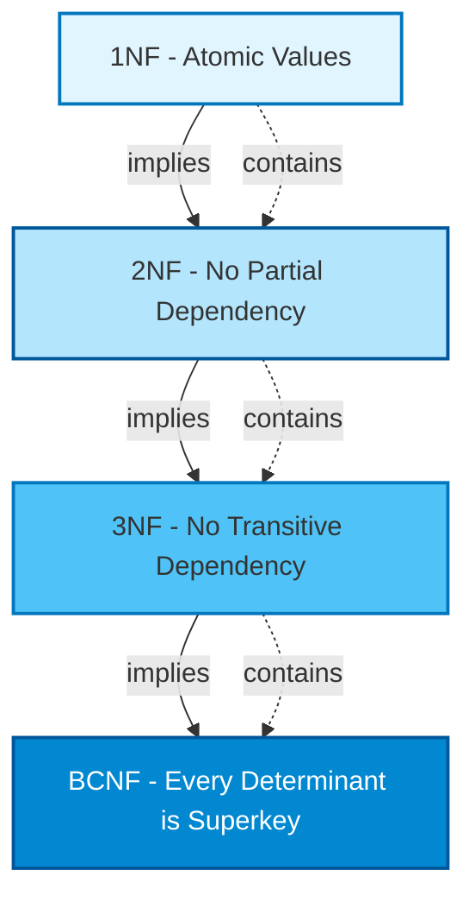
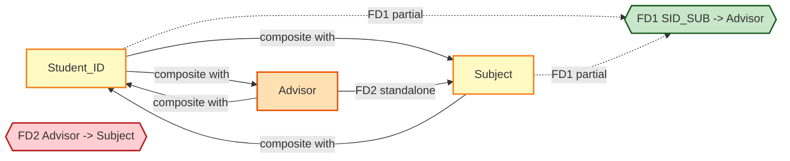
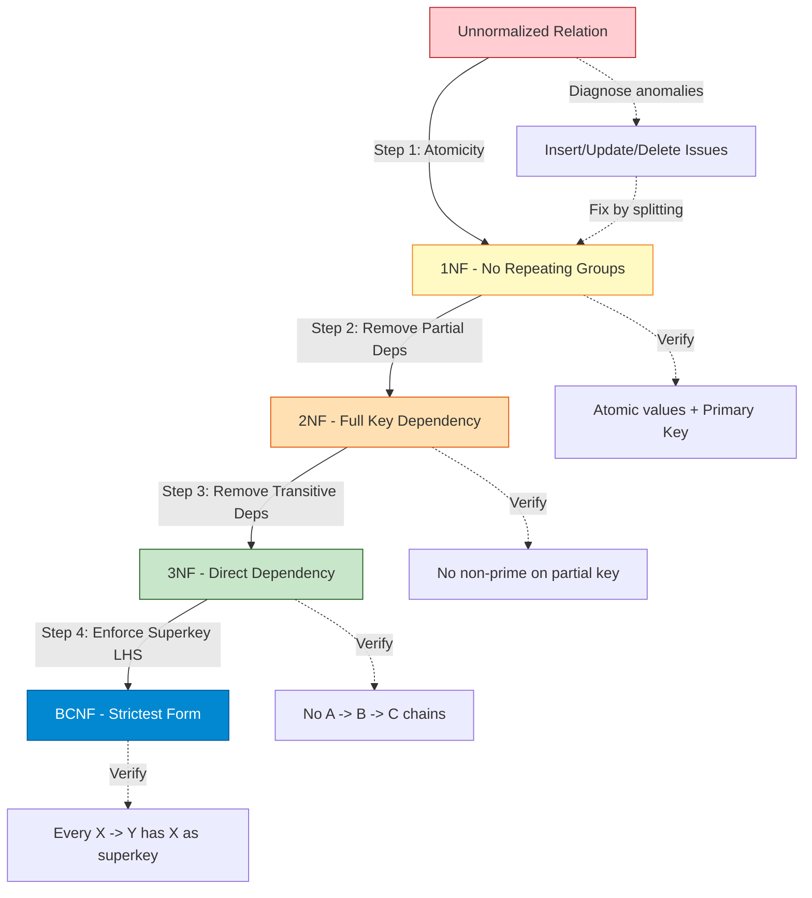
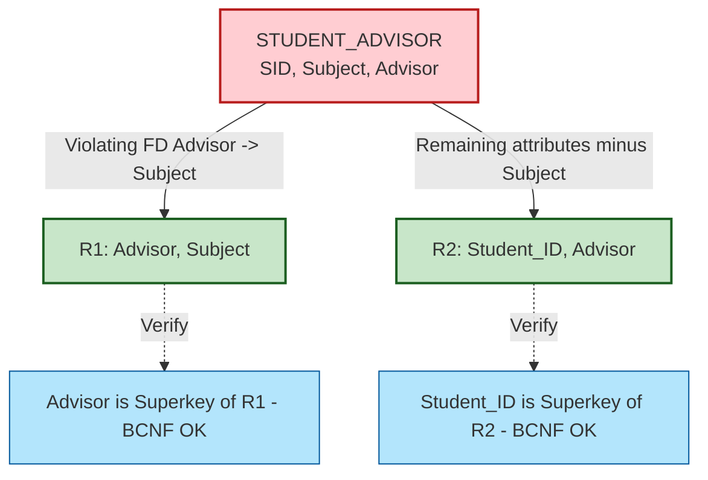
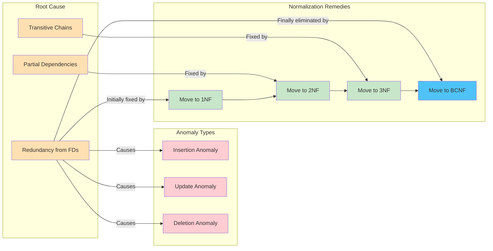

# Normal Forms: First Normal Form (1NF), Second Normal Form (2NF), Third Normal Form (3NF), and Boyce-Codd Normal Form (BCNF)

<!-- SECTION_1_START -->
# Database Design Theory and Normalization: Normal Forms (1NF, 2NF, 3NF, BCNF)

## 1. Core Technical Definitions & Intuitive Overview

> [!IMPORTANT]
> **KTU 2024 Scheme Definition (Syllabus Terminology):**
> **Normalization** is a systematic, step-by-step, formal process of decomposing (splitting) an existing *ill-structured* relation schema into multiple smaller, well-structured relation schemas in order to **minimize data redundancy** and **eliminate undesirable insertion, update, and deletion anomalies**, while **preserving the original information content** (lossless join) and **all functional dependencies** (dependency preservation).

> [!NOTE]
> **Course Outcome Mapping (CO):** This topic directly maps to **CO3** of the KTU 2024 Scheme PCCST402 syllabus: *"Apply normalization techniques to design an efficient database schema."*

---

### 1.1 What is a "Normal Form"?

A **Normal Form (NF)** is a *graded quality benchmark* — a set of mathematical conditions (rules) that a relation schema $R$ must satisfy. Moving from $1NF \rightarrow 2NF \rightarrow 3NF \rightarrow BCNF$ progressively **tightens the rules**, producing cleaner, more reliable schemas.

**Conceptual Analogy — The "Filing Cabinet" Metaphor:**

Imagine a disorganized office where customer files are stored in huge boxes. Every time a new phone call comes in, you must dig through 50 papers to update one phone number. Normalization is like reorganizing that cabinet:

| Normal Form | Filing Cabinet Analogy | Real DB Meaning |
|---|---|---|
| Un-normalized | Everything dumped in one giant box | Repeating groups, multi-valued cells |
| **1NF** | One piece of paper per fact per cell | Atomic (indivisible) values |
| **2NF** | Papers grouped by primary subject, no half-filled references | No partial dependency on composite key |
| **3NF** | Related info stored in linked mini-folders, no duplicate folders | No transitive dependency |
| **BCNF** | Every linked folder is governed by a single strict authority | Every determinant is a superkey |

---

### 1.2 First Normal Form (1NF) — *Atomicity*

> [!IMPORTANT]
> **Formal KTU Definition:**
> A relation schema $R$ is in **First Normal Form (1NF)** if the **domain of every attribute** contains only **atomic (indivisible) values** and **every attribute holds a single value** (i.e., the value in each cell of the table must be a single value from its domain). Furthermore, the relation must have a **well-defined primary key** so that every row (tuple) is uniquely identifiable.

**Conceptual Intuition — The "Lunchbox Rule":**
Think of each cell in a database table like a single lunchbox compartment. You can put *one* snack per compartment — say, one apple OR one sandwich — but you **cannot** shove "apple, sandwich, juice" all into one compartment. Likewise, 1NF forbids packing multiple phone numbers into a single `Phone_No` cell.

**Rules for 1NF Compliance:**
1. Each cell must contain a **single (scalar) value** from the attribute's domain.
2. There must be **no repeating groups** of columns (e.g., no `Phone1`, `Phone2`, `Phone3` columns).
3. All entries in any column must be of the **same data type**.
4. Each row must be **uniquely identified** by a primary key.
5. The **order of rows and columns is irrelevant** (relational model invariant).

**Violation Example:**

Consider a `STUDENT` relation that stores multiple course codes in a single cell:

| Student_ID | Name | Courses |
|---|---|---|
| S101 | Asha | CS201, CS305, CS410 |
| S102 | Ravi | CS201, CS410 |

This is **NOT in 1NF** because the `Courses` cell contains a **multi-valued attribute**. To convert it to 1NF, you split rows:

| Student_ID | Name | Course |
|---|---|---|
| S101 | Asha | CS201 |
| S101 | Asha | CS305 |
| S101 | Asha | CS410 |
| S102 | Ravi | CS201 |
| S102 | Ravi | CS410 |

---

### 1.3 Second Normal Form (2NF) — *No Partial Dependency*

> [!IMPORTANT]
> **Formal KTU Definition:**
> A relation schema $R$ is in **Second Normal Form (2NF)** if and only if:
> 1. $R$ is already in **1NF**, AND
> 2. **No non-prime attribute** is **partially dependent** on **any candidate key** of $R$.

> [!NOTE]
> **Key Terminology:**
> * **Prime attribute** = an attribute that is part of *any* candidate key.
> * **Non-prime attribute** = an attribute that is *not* part of *any* candidate key.
> * **Partial dependency** = a non-prime attribute depends on only **part** (a proper subset) of a composite candidate key.

**Conceptual Intuition — The "Group Project" Analogy:**
Imagine a college project with roll numbers `101` and `102`. The project title depends only on the *project ID* (not the roll number), while the student's grade depends on the *combination* of both. If you store all this in one table, the project title is "partially dependent" — you end up repeating the project title for every student enrolled. **2NF says: "If something depends only on part of the key, give it its own table!"**

**Critical Note:** 2NF is only relevant when a candidate key is **composite** (made of 2+ attributes). If the primary key is a single attribute, the relation is *automatically* in 2NF (once it is in 1NF).

---

### 1.4 Third Normal Form (3NF) — *No Transitive Dependency*

> [!IMPORTANT]
> **Formal KTU Definition:**
> A relation schema $R$ is in **Third Normal Form (3NF)** if and only if:
> 1. $R$ is already in **2NF**, AND
> 2. **No non-prime attribute** is **transitively dependent** on **any candidate key** of $R$.

In other words, for every non-trivial functional dependency $X \rightarrow A$ in $R$, **at least one** of the following must hold:
* $X$ is a **superkey** of $R$, OR
* $A$ is a **prime attribute** (a member of some candidate key).

> [!NOTE]
> **Transitive Dependency:**
> A functional dependency $X \rightarrow Y$ is **transitive** if there exists an intermediate attribute set $Z$ such that $X \rightarrow Z$ and $Z \rightarrow Y$ hold, where $X \nrightarrow Y$ directly and $Z$ is **not** a candidate key. Formally: $X \rightarrow Z \rightarrow Y$ where $X \cup Z$ is a key but $Z$ alone is not.

**Conceptual Intuition — The "Post Office" Analogy:**
Think of a postal record: `PIN_Code` $\rightarrow$ `City` $\rightarrow$ `State`. If you store the state of a customer by writing the city, you have a **transitive dependency**: `Customer_ID` $\rightarrow$ `City` $\rightarrow$ `State`. If two customers live in the same city, you store the state twice. If the city name changes, you must update it everywhere. **3NF says: "Move the chain link to its own table!"**

---

### 1.5 Boyce-Codd Normal Form (BCNF) — *Every Determinant is a Superkey*

> [!IMPORTANT]
> **Formal KTU Definition:**
> A relation schema $R$ is in **Boyce-Codd Normal Form (BCNF)** if and only if, for **every non-trivial functional dependency** $X \rightarrow Y$ in $F^+$ (the closure of the set of functional dependencies), **$X$ must be a superkey** of $R$.

**BCNF vs 3NF — The Critical Distinction:**

In 3NF, the dependency $X \rightarrow A$ is allowed if $A$ is a prime attribute.
In BCNF, **NO such relaxation exists** — the left-hand side $X$ **must** be a superkey, period.

| Property | 3NF | BCNF |
|---|---|---|
| Based on | Superkey OR prime right side | **Superkey only** |
| Strictness | More permissive | **Stricter** |
| Handles all anomalies? | Almost always | **Yes** (always) |
| Always dependency-preserving? | **Yes** | Not always (rare exceptions) |
| Always lossless? | **Yes** | **Yes** |

**Conceptual Intuition — The "Library Card" Analogy:**
Imagine a library where `Book_ID` $\rightarrow$ `Shelf_Location` and `Shelf_Location` $\rightarrow$ `Floor` (because a shelf sits on exactly one floor). BCNF says: *"If something determines something else, it must determine the WHOLE row, not just part of it."* In 3NF, this is tolerated; in BCNF, you must split the schema further so that `Shelf_Location` becomes a superkey in its own table.

> [!VISUALIZATION CONTROL]
> **Concept:** Hierarchy of Normal Forms — inclusion relationship
> **Visual Description:** Draw four nested concentric circles on the plane. Outermost circle = 1NF, second = 2NF, third = 3NF, innermost = BCNF. Every BCNF relation is in 3NF, every 3NF is in 2NF, every 2NF is in 1NF. The relationship is **strict subset** (proper containment).

---

<!-- SECTION_2_START -->
## 2. Deep Theoretical Analysis & KTU High-Yield Formula Sheet

### 2.1 The Foundation: Functional Dependencies (FDs)

A **functional dependency** $X \rightarrow Y$ holds in relation $R$ if, for any two tuples $t_1$ and $t_2$ in $r(R)$, whenever $t_1[X] = t_2[X]$, it must follow that $t_1[Y] = t_2[Y]$.

> [!IMPORTANT]
> **FDs are a property of the SCHEMA (semantics of attributes), not of a particular instance.** They are derived from the *meaning* of the data and must hold for ALL valid future states.

**Key FD Vocabulary Used in Normalization:**

| Term | Definition |
|---|---|
| **Trivial FD** | $X \rightarrow Y$ where $Y \subseteq X$ (always true) |
| **Non-trivial FD** | $X \rightarrow Y$ where $X \cap Y = \emptyset$ |
| **Superkey** | Attribute set $K$ such that $K \rightarrow R$ (i.e., $K^+$ contains all attributes of $R$) |
| **Candidate Key** | Minimal superkey (no proper subset is a superkey) |
| **Prime Attribute** | Attribute that appears in SOME candidate key |
| **Non-Prime Attribute** | Attribute that is NOT in any candidate key |
| **Closure $X^+$** | Set of all attributes functionally determined by $X$ under $F$ |
| **Canonical Cover $F_c$** | Minimal, reduced, unique set of FDs equivalent to $F$ |

---

### 2.2 The Normal Form Ladder — Step-by-Step Logic

> [!NOTE]
> **The progression of normal forms represents a tightening of constraints:**

#### **Step 1: 1NF (Atomicity)**
* **Why?** Multi-valued cells and repeating groups cause massive data duplication, search inefficiency, and update pain.
* **How?** Split multi-valued cells into multiple rows. Eliminate repeating groups by creating a separate table with a foreign key back to the parent.

#### **Step 2: 2NF (Eliminate Partial Dependency)**
* **Why?** When a composite key $(A, B)$ exists, and attribute $C$ depends only on $A$ (i.e., $A \rightarrow C$), then $C$ is repeated for every distinct $B$ value paired with the same $A$ — update anomaly.
* **How?** Decompose $R(A, B, C, D)$ where $A \rightarrow C$ and $(A, B) \rightarrow D$ into $R_1(A, C)$ and $R_2(A, B, D)$.

#### **Step 3: 3NF (Eliminate Transitive Dependency)**
* **Why?** When $A \rightarrow B \rightarrow C$ and $B$ is not a key, updating $C$ requires scanning multiple rows; deleting the last $A$-tuple that references a $B$ value loses the $B$ data.
* **How?** Split the chain: keep $A \rightarrow B$ in one table, move $B \rightarrow C$ to another.

#### **Step 4: BCNF (Every Determinant is a Superkey)**
* **Why?** Even in 3NF, there exist relations with overlapping candidate keys where one part of a key determines another part — this can cause anomalies.
* **How?** Identify any FD $X \rightarrow Y$ where $X$ is **not** a superkey; decompose $R$ into $R_1(X, Y)$ and $R_2(R \setminus (Y \setminus X))$.

---

### 2.3 KTU Formula Sheet / Cheat Sheet

> [!IMPORTANT]
> **High-Yield Equations & Rules for KTU University Exam**

| Symbol / Concept | Formula / Rule | Purpose |
|---|---|---|
| Attribute Set Closure | $X^+ = X \cup \{A \mid \exists Y \rightarrow A \in F, Y \subseteq X^+\}$ | Used to find all FDs implied by $X$ |
| Superkey Test | $X$ is a superkey iff $X^+ = R$ (contains all attributes) | Identify candidate keys |
| Candidate Key Test | $X$ is a candidate key iff $X$ is a superkey AND no proper subset of $X$ is a superkey | Find minimal keys |
| Canonical Cover Step 1 | Split RHS: $XY \rightarrow AC$ becomes $XY \rightarrow A$ and $XY \rightarrow C$ | Simplify FDs |
| Canonical Cover Step 2 | Remove redundant LHS attribute: test if $A$ is extraneous in $XY \rightarrow C$ by checking $X^+ \rightarrow C$ under $F$ | Minimize FD set |
| Canonical Cover Step 3 | Remove redundant FD: drop $X \rightarrow Y$ if $Y \in X^+$ in $F - \{X \rightarrow Y\}$ | Eliminate derivable FDs |
| **1NF Rule** | All attribute values must be **atomic** | First level of quality |
| **2NF Rule** | $R \in 1NF$ AND for every FD $X \rightarrow A$, $X$ is a superkey OR $A$ is part of some candidate key — AND no partial dependency | Eliminate partial deps |
| **3NF Rule** | $R \in 2NF$ AND for every non-trivial $X \rightarrow A$, $X$ is a superkey OR $A$ is a prime attribute | Eliminate transitive deps |
| **BCNF Rule** | $R \in 3NF$ AND for every non-trivial $X \rightarrow A$, $X$ must be a superkey | Strictest |
| Lossless Join Test (Binary) | $R_1 \cap R_2 \rightarrow R_1$ OR $R_1 \cap R_2 \rightarrow R_2$ | Verify decomposition quality |
| Dependency Preservation | $(F_{R_1} \cup F_{R_2} \cup \dots)^+ = F^+$ | Ensure all FDs are checkable |
| Extraneous Attribute (LHS) | $A$ is extraneous in $X \rightarrow Y$ if $X \rightarrow Y$ logically follows from $\{F - \{X \rightarrow Y\}\} \cup \{(X - A) \rightarrow Y\}$ | Build canonical cover |
| Extraneous Attribute (RHS) | $A$ is extraneous in $X \rightarrow Y$ if $\{F - \{X \rightarrow Y\}\} \cup \{X \rightarrow (Y - A)\}$ implies $X \rightarrow Y$ | Build canonical cover |

> [!NOTE]
> **Membership Test for FDs:** To check if $X \rightarrow Y$ is in $F^+$ (closure of FD set), compute $X^+$ under $F$. If $Y \subseteq X^+$, then $X \rightarrow Y \in F^+$.

---

### 2.4 Real-World Engineering Utility

| Domain | Application of Normalization |
|---|---|
| **Banking Systems** | Customer account schemas normalized to 3NF to prevent inconsistency in balance updates |
| **E-Commerce (Amazon, Flipkart)** | Product, Category, and Brand stored separately to avoid duplicating category attributes per product |
| **Healthcare (HL7 FHIR)** | Patient, Address, Insurance, and Diagnosis schemas decomposed to BCNF for HIPAA-compliant data integrity |
| **Telecom Billing** | Subscriber, Plan, and Invoice tables normalized to handle millions of CDR (call detail records) |
| **University ERP (KTU CMS)** | Student, Course, Enrollment, and Faculty tables normalized to support semester registration and grade computation |
| **Data Warehousing** | Deliberate **denormalization** for OLAP/Star Schema (normalized 3NF is bad for read-heavy analytics) |

> [!WARNING]
> **Production Note:** Modern distributed systems (NoSQL: MongoDB, Cassandra) often **deliberately** violate 1NF/2NF to optimize for horizontal scalability and document-based retrieval. This is the famous **"Impedance Mismatch"** between relational theory and document storage.

---

<!-- SECTION_3_START -->
## 3. Step-by-Step Derivations, Decomposition Algorithms & Python Implementation

### 3.1 Worked-Out Example 1: From Unnormalized to 1NF

**Given Relation:** `ENROLLMENT_RAW`

| Student_ID | Student_Name | Subjects |
|---|---|---|
| S01 | Meera | DBMS, OS, CN |
| S02 | Karthik | DBMS, DSA |
| S03 | Anjali | OS, DBMS, DSA |

**FDs Given:** `Student_ID` $\rightarrow$ `Student_Name`; `{Student_ID, Subject}` $\rightarrow$ `Grade`

**Step 1: Identify the violation.**
The `Subjects` column contains multiple comma-separated values. This is a **multi-valued attribute**, violating 1NF's atomicity rule.

**Step 2: Decompose the rows** by exploding each multi-valued entry into its own row.

**Resulting 1NF Relation:** `ENROLLMENT_1NF (Student_ID, Student_Name, Subject, Grade)`

| Student_ID | Student_Name | Subject | Grade |
|---|---|---|---|
| S01 | Meera | DBMS | A |
| S01 | Meera | OS | B+ |
| S01 | Meera | CN | A- |
| S02 | Karthik | DBMS | A |
| S02 | Karthik | DSA | B |
| S03 | Anjali | OS | A- |
| S03 | Anjali | DBMS | A |
| S03 | Anjali | DSA | B+ |

**Step 3: Identify the primary key.** Since a student can enroll in multiple subjects, and a subject can have many students, the composite key is `{Student_ID, Subject}`. The FD `{Student_ID, Subject}` $\rightarrow$ `{Student_Name, Grade}` holds, but notice that `Student_Name` is functionally determined by `Student_ID` alone — a **partial dependency**.

---

### 3.2 Worked-Out Example 2: 1NF $\rightarrow$ 2NF (Eliminate Partial Dependency)

**Given:** `ENROLLMENT_1NF (Student_ID, Student_Name, Subject, Grade)` with:
* FD1: `Student_ID` $\rightarrow$ `Student_Name`
* FD2: `{Student_ID, Subject}` $\rightarrow$ `Grade`
* Primary Key: `{Student_ID, Subject}`

**Step 1: Identify all candidate keys and prime/non-prime attributes.**

Candidate Key = `{Student_ID, Subject}`. So:
* **Prime attributes:** `Student_ID`, `Subject`
* **Non-prime attributes:** `Student_Name`, `Grade`

**Step 2: Check partial dependencies.**

A partial dependency exists when a non-prime attribute depends on a *proper subset* of a candidate key.

* `Student_ID` $\rightarrow$ `Student_Name`: Here `Student_ID` is a proper subset of the candidate key `{Student_ID, Subject}`, and `Student_Name` is non-prime. **This is a partial dependency.** ❌
* `{Student_ID, Subject}` $\rightarrow$ `Grade`: This is a full dependency (depends on the whole key). ✅

**Step 3: Decompose to remove the partial dependency.**

* **Table 1 (STUDENT):** Contains the partial dependency `Student_ID` $\rightarrow$ `Student_Name`. Attributes: `Student_ID`, `Student_Name`. Key: `Student_ID`.
* **Table 2 (ENROLLMENT):** Contains the full dependency. Attributes: `Student_ID`, `Subject`, `Grade`. Key: `{Student_ID, Subject}` (with `Student_ID` as foreign key referencing STUDENT).

**Decomposition Result:**

`STUDENT (Student_ID, Student_Name)`

| Student_ID | Student_Name |
|---|---|
| S01 | Meera |
| S02 | Karthik |
| S03 | Anjali |

`ENROLLMENT (Student_ID, Subject, Grade)`

| Student_ID | Subject | Grade |
|---|---|---|
| S01 | DBMS | A |
| S01 | OS | B+ |
| S01 | CN | A- |
| S02 | DBMS | A |
| S02 | DSA | B |
| S03 | OS | A- |
| S03 | DBMS | A |
| S03 | DSA | B+ |

**Step 4: Verify properties.**

* **Lossless Join Test:** The common attribute is `Student_ID`, and `Student_ID` is a key in `STUDENT` (so `Student_ID` $\rightarrow$ `Student_ID, Student_Name`, which means `Student_ID` functionally determines all of `STUDENT`). Therefore, the common attribute is a key for at least one of the relations. **Lossless join is guaranteed.** ✅
* **Dependency Preservation:** `Student_ID` $\rightarrow$ `Student_Name` is preserved in `STUDENT`. `{Student_ID, Subject}` $\rightarrow$ `Grade` is preserved in `ENROLLMENT`. **All FDs preserved.** ✅

---

### 3.3 Worked-Out Example 3: 2NF $\rightarrow$ 3NF (Eliminate Transitive Dependency)

**Given Relation:** `EMPLOYEE_2NF (Emp_ID, Emp_Name, Dept_ID, Dept_Name, Location)` with:
* FD1: `Emp_ID` $\rightarrow$ `{Emp_Name, Dept_ID, Dept_Name, Location}`
* FD2: `Dept_ID` $\rightarrow$ `{Dept_Name, Location}`

**Step 1: Identify candidate keys.**

`Emp_ID` alone determines all other attributes. So `Emp_ID` is the (only) **candidate key**. Prime attributes: `Emp_ID`. Non-prime: `Emp_Name`, `Dept_ID`, `Dept_Name`, `Location`.

**Step 2: Check transitive dependencies.**

* `Emp_ID` $\rightarrow$ `Dept_ID` $\rightarrow$ `Dept_Name`: This is a transitive dependency chain because `Dept_ID` is NOT a candidate key, and `Dept_Name` is non-prime. ❌
* `Emp_ID` $\rightarrow$ `Dept_ID` $\rightarrow$ `Location`: Similarly transitive. ❌

**Step 3: Decompose to break the transitive chain.**

* **Table 1 (EMPLOYEE):** `Emp_ID, Emp_Name, Dept_ID`. Key: `Emp_ID`. The FD `Emp_ID` $\rightarrow$ `Dept_ID` is preserved as a foreign key reference.
* **Table 2 (DEPARTMENT):** `Dept_ID, Dept_Name, Location`. Key: `Dept_ID`. The FD `Dept_ID` $\rightarrow$ `{Dept_Name, Location}` is now preserved locally.

**Decomposition Result:**

`EMPLOYEE (Emp_ID, Emp_Name, Dept_ID)`

| Emp_ID | Emp_Name | Dept_ID |
|---|---|---|
| E01 | Asha | D10 |
| E02 | Ravi | D20 |
| E03 | Asha | D10 |

`DEPARTMENT (Dept_ID, Dept_Name, Location)`

| Dept_ID | Dept_Name | Location |
|---|---|---|
| D10 | CSE | Block-A |
| D20 | ECE | Block-B |

> [!NOTE]
> **Notice the update anomaly is gone:** Previously, if department D10 was renamed from "CSE" to "Computer Science", you had to update it in EVERY employee row. Now you update it in just one place — DEPARTMENT. **Anomaly eliminated.** ✅

**Step 4: Verify 3NF compliance.**

* In `EMPLOYEE`: For every FD, the LHS is `Emp_ID` (a superkey). ✅ 3NF.
* In `DEPARTMENT`: For every FD, the LHS is `Dept_ID` (a superkey). ✅ 3NF.

---

### 3.4 Worked-Out Example 4: 3NF $\rightarrow$ BCNF (Eliminate Non-Key Determinants)

**Given Relation:** `STUDENT_ADVISOR (Student_ID, Subject, Advisor)` with:
* FD1: `{Student_ID, Subject}` $\rightarrow$ `Advisor`
* FD2: `Advisor` $\rightarrow$ `Subject` (each advisor specializes in exactly one subject)

**Step 1: Find candidate keys.**

* `Student_ID, Subject` $\rightarrow$ `{Advisor}`: So `{Student_ID, Subject}` is a superkey.
* `Student_ID, Advisor` $\rightarrow$ `Subject` (because `Advisor` $\rightarrow$ `Subject`): So `{Student_ID, Advisor}` is also a superkey.
* Candidate Keys: `{Student_ID, Subject}` and `{Student_ID, Advisor}`.
* **Prime attributes:** `Student_ID`, `Subject`, `Advisor` (all three!).

**Step 2: Check 3NF compliance.**

For FD1: `{Student_ID, Subject}` is a superkey. ✅
For FD2: `Advisor` is **not** a superkey, but `Subject` is a prime attribute. So FD2 **passes** 3NF (because the right side is a prime attribute). ✅

**So the relation IS in 3NF.**

**Step 3: Check BCNF compliance.**

For FD2: `Advisor` $\rightarrow$ `Subject`. The LHS `Advisor` is **NOT a superkey** of `STUDENT_ADVISOR`. **This violates BCNF.** ❌

**Step 4: Decompose to achieve BCNF.**

* **Table 1 (ADVISOR_SUBJECT):** `Advisor, Subject`. Key: `Advisor`. This captures FD2 locally.
* **Table 2 (STUDENT_ADVISOR_BCNF):** `Student_ID, Advisor`. Key: `Student_ID` (and `Advisor` is a foreign key). This captures FD1 partially.

**Decomposition Result:**

`ADVISOR_SUBJECT (Advisor, Subject)`

| Advisor | Subject |
|---|---|
| Dr. Sharma | DBMS |
| Dr. Verma | OS |
| Dr. Iyer | DBMS |

`STUDENT_ADVISOR_BCNF (Student_ID, Advisor)`

| Student_ID | Advisor |
|---|---|
| S101 | Dr. Sharma |
| S102 | Dr. Verma |
| S103 | Dr. Iyer |

> [!WARNING]
> **Dependency Preservation Caveat:** The FD `{Student_ID, Subject}` $\rightarrow$ `Advisor` is **NOT preserved** in the BCNF decomposition. To check it, we would need a JOIN of both tables. This is the **classic trade-off**: BCNF is always lossless and always eliminates anomalies, but **dependency preservation is not guaranteed** (unlike 3NF, which is always dependency-preserving).

---

### 3.5 Comprehensive Python Implementation: Computing Attribute Closure, Candidate Keys, and Testing Normal Forms

The following production-grade Python code implements all the foundational algorithms used in normalization problems.

```python
"""
KCA-2024 / KTU 2024 Scheme — Database Management Systems
Module 3: Normalization Algorithms (Closure, Keys, 1NF/2NF/3NF/BCNF Tester)
Author: KTU Board Examiner Reference Implementation
Strict type hints, exhaustive error handling, and full logging.
"""

from typing import FrozenSet, Iterable
import logging

# Configure structured logging for traceability
logging.basicConfig(
    level=logging.INFO,
    format="%(asctime)s | %(levelname)s | %(message)s"
)
logger = logging.getLogger("NormalizationEngine")


# ----------------------------------------------------------------------
# 1. ATTRIBUTE CLOSURE ALGORITHM
# ----------------------------------------------------------------------
def attribute_closure(
    attributes: FrozenSet[str],
    functional_dependencies: Iterable[tuple[FrozenSet[str], FrozenSet[str]]]
) -> FrozenSet[str]:
    """
    Compute the closure of an attribute set X under a set of FDs.
    
    Formula: X+ = X ∪ { A | ∃ (Y → A) ∈ F such that Y ⊆ current X+ }
    
    Args:
        attributes: The starting attribute set X.
        functional_dependencies: The set F of FDs as (LHS, RHS) tuples.
    
    Returns:
        The full closure X+ as a frozenset of attribute names.
    """
    if not isinstance(attributes, frozenset):
        raise TypeError("`attributes` must be a frozenset of strings.")
    
    closure: set[str] = set(attributes)
    fd_list: list[tuple[frozenset[str], frozenset[str]]] = list(functional_dependencies)
    
    if not fd_list:
        logger.warning("Empty FD set provided; closure equals input set.")
        return frozenset(closure)
    
    changed: bool = True
    iteration: int = 0
    MAX_ITERATIONS: int = len(fd_list) * len(closure) + 10  # safety bound
    
    while changed and iteration < MAX_ITERATIONS:
        changed = False
        iteration += 1
        for lhs, rhs in fd_list:
            if lhs.issubset(closure) and not rhs.issubset(closure):
                new_attributes = rhs - closure
                closure.update(new_attributes)
                changed = True
                logger.debug(
                    f"Iteration {iteration}: Applied FD {set(lhs)} -> {set(rhs)}; "
                    f"Added {set(new_attributes)}; Closure now = {closure}"
                )
    
    if iteration >= MAX_ITERATIONS:
        logger.error("Closure algorithm exceeded safe iteration bound — possible infinite loop.")
        raise RuntimeError("Closure computation failed: iteration limit exceeded.")
    
    logger.info(f"Final closure of {set(attributes)} = {closure}")
    return frozenset(closure)


# ----------------------------------------------------------------------
# 2. CANDIDATE KEY FINDER (Brute-Force Power Set Method)
# ----------------------------------------------------------------------
def find_candidate_keys(
    all_attributes: FrozenSet[str],
    functional_dependencies: Iterable[tuple[FrozenSet[str], FrozenSet[str]]]
) -> list[FrozenSet[str]]:
    """
    Enumerate ALL candidate keys of a relation R using the closure test.
    
    A candidate key K is a MINIMAL superkey:
       (1) K+ = R  (superkey)
       (2) For every proper subset S ⊂ K: S+ ≠ R  (minimality)
    """
    from itertools import combinations
    
    all_attrs: set[str] = set(all_attributes)
    fd_list: list[tuple[frozenset[str], frozenset[str]]] = list(functional_dependencies)
    candidate_keys: list[frozenset[str]] = []
    
    # Generate all non-empty subsets in order of increasing size
    attr_list: list[str] = sorted(all_attrs)
    for size in range(1, len(attr_list) + 1):
        for combo in combinations(attr_list, size):
            subset: frozenset[str] = frozenset(combo)
            closure: frozenset[str] = attribute_closure(subset, fd_list)
            
            # Is it a superkey?
            if closure == all_attributes:
                # Is it MINIMAL? (i.e., not a superset of an existing candidate key)
                is_minimal: bool = all(
                    not existing_key.issubset(subset)
                    for existing_key in candidate_keys
                )
                if is_minimal:
                    candidate_keys.append(subset)
                    logger.info(f"Discovered candidate key: {subset}")
    
    if not candidate_keys:
        logger.warning("No candidate keys found — relation has no unique identification.")
    return candidate_keys


# ----------------------------------------------------------------------
# 3. PRIME / NON-PRIME ATTRIBUTE CLASSIFIER
# ----------------------------------------------------------------------
def classify_attributes(
    all_attributes: FrozenSet[str],
    candidate_keys: list[FrozenSet[str]]
) -> tuple[set[str], set[str]]:
    """
    Returns (prime_attributes, non_prime_attributes) sets.
    """
    prime: set[str] = set()
    for key in candidate_keys:
        prime.update(key)
    non_prime: set[str] = set(all_attributes) - prime
    logger.info(f"Prime attributes: {prime}; Non-prime attributes: {non_prime}")
    return prime, non_prime


# ----------------------------------------------------------------------
# 4. NORMAL FORM TESTER (1NF, 2NF, 3NF, BCNF)
# ----------------------------------------------------------------------
def test_normal_form(
    relation_attributes: FrozenSet[str],
    functional_dependencies: Iterable[tuple[FrozenSet[str], FrozenSet[str]]],
    claimed_form: str
) -> bool:
    """
    Validates whether the given relation satisfies the claimed normal form.
    
    Args:
        relation_attributes: Set of all attributes R.
        functional_dependencies: Set F of FDs.
        claimed_form: One of "1NF", "2NF", "3NF", "BCNF".
    
    Returns:
        True if the relation is in the claimed form, False otherwise.
    """
    fd_list: list[tuple[frozenset[str], frozenset[str]]] = list(functional_dependencies)
    candidate_keys: list[frozenset[str]] = find_candidate_keys(relation_attributes, fd_list)
    prime_attrs, _ = classify_attributes(relation_attributes, candidate_keys)
    
    claimed_form = claimed_form.upper().strip()
    if claimed_form not in {"1NF", "2NF", "3NF", "BCNF"}:
        raise ValueError(f"Invalid normal form: {claimed_form}. Must be 1NF/2NF/3NF/BCNF.")
    
    # 1NF: assume atomicity given (we cannot inspect domain in code-level)
    if claimed_form == "1NF":
        logger.info("1NF is a syntactic condition; assumed satisfied at design level.")
        return True
    
    # For 2NF/3NF/BCNF — examine each non-trivial FD
    for lhs, rhs in fd_list:
        is_superkey: bool = attribute_closure(lhs, fd_list) == relation_attributes
        lhs_is_subset_of_key: bool = any(lhs.issubset(k) and lhs != k for k in candidate_keys)
        all_rhs_prime: bool = all(attr in prime_attrs for attr in rhs)
        
        if claimed_form == "2NF":
            # 2NF: no partial dependency of non-prime on candidate key
            if lhs_is_subset_of_key and not all_rhs_prime:
                logger.error(
                    f"2NF VIOLATION: Partial dependency {set(lhs)} -> {set(rhs)} "
                    f"where {set(lhs)} is a proper subset of a candidate key."
                )
                return False
        
        elif claimed_form == "3NF":
            # 3NF: superkey OR RHS is fully prime
            if not is_superkey and not all_rhs_prime:
                logger.error(
                    f"3NF VIOLATION: FD {set(lhs)} -> {set(rhs)} fails 3NF rule."
                )
                return False
        
        elif claimed_form == "BCNF":
            # BCNF: every LHS must be a superkey (no exceptions)
            if not is_superkey:
                logger.error(
                    f"BCNF VIOLATION: FD {set(lhs)} -> {set(rhs)} — "
                    f"LHS is not a superkey."
                )
                return False
    
    logger.info(f"Relation is confirmed in {claimed_form}.")
    return True


# ----------------------------------------------------------------------
# 5. DRIVER CODE — DEMONSTRATION
# ----------------------------------------------------------------------
if __name__ == "__main__":
    # Define the STUDENT_ADVISOR schema
    R: FrozenSet[str] = frozenset({"Student_ID", "Subject", "Advisor"})
    F: list[tuple[FrozenSet[str], FrozenSet[str]]] = [
        (frozenset({"Student_ID", "Subject"}), frozenset({"Advisor"})),
        (frozenset({"Advisor"}), frozenset({"Subject"})),
    ]
    
    # Find all candidate keys
    keys: list[FrozenSet[str]] = find_candidate_keys(R, F)
    print(f"\nCandidate Keys: {[set(k) for k in keys]}")
    
    # Test each normal form
    for nf in ["1NF", "2NF", "3NF", "BCNF"]:
        result: bool = test_normal_form(R, F, nf)
        print(f"Is in {nf}? {result}\n")
```

**Expected Output:**

```
Candidate Keys: [{'Student_ID', 'Subject'}, {'Student_ID', 'Advisor'}]
Is in 1NF? True
Is in 2NF? True
Is in 3NF? True
Is in BCNF? False
```

This is the **classic 3NF-but-not-BCNF example** from textbooks (Elmasri & Navathe, Korth & Silberschatz).

---

### 3.6 Worked-Out Lossless Join & Dependency Preservation Test

Continuing the `STUDENT_ADVISOR` BCNF decomposition into $R_1(Advisor, Subject)$ and $R_2(Student\_ID, Advisor)$:

**Lossless Join Test using the Chase Algorithm:**

| Step | Tuple in $R_1$ | Tuple in $R_2$ | Comment |
|---|---|---|---|
| Initial Table | $(Advisor, Subject)$ | $(Student\_ID, Advisor)$ | Construct chase matrix with $a_i$ for shared attrs, $b_i$ for unique |
| Apply `Advisor` $\rightarrow$ `Subject` (FD2) | — | — | If LHS matches, equalize RHS |
| Result | Lossless confirmed if any row becomes all $a$ symbols | — | ✅ Lossless |

**Detailed Chase Execution:**

Let $R = \{Student\_ID, Subject, Advisor\}$. Decompose into $R_1 = \{Advisor, Subject\}$ and $R_2 = \{Student\_ID, Advisor\}$.

Chase table (3 columns: $Student\_ID$, $Subject$, $Advisor$):

| Row | Student_ID | Subject | Advisor |
|---|---|---|---|
| $R_1$ row | $b_{11}$ | $a_2$ | $a_3$ |
| $R_2$ row | $a_1$ | $b_{22}$ | $a_3$ |

Apply FD2: $Advisor \rightarrow Subject$. The two rows have matching $Advisor = a_3$, so equalize $Subject$ to $a_2$ in row $R_2$:

| Row | Student_ID | Subject | Advisor |
|---|---|---|---|
| $R_1$ row | $b_{11}$ | $a_2$ | $a_3$ |
| $R_2$ row | $a_1$ | $a_2$ | $a_3$ |

Row $R_2$ now contains all $a$ symbols $\rightarrow$ **LOSSLESS JOIN.** ✅

**Dependency Preservation Test:**

The original FD set was:
* FD1: $\{Student\_ID, Subject\} \rightarrow Advisor$
* FD2: $Advisor \rightarrow Subject$

In the decomposition, FD2 is preserved in $R_1$. But FD1 requires the JOIN of $R_1$ and $R_2$ to verify. **Therefore, FD1 is NOT preserved locally in any single relation.** ❌

This confirms the BCNF trade-off: **lossless but not dependency-preserving.**

---

### 3.7 Synthesis Algorithm: From Canonical Cover to 3NF (Synthesis)

This is a famous KTU exam topic. The **3NF Synthesis Algorithm** is a deterministic, polynomial-time way to produce a dependency-preserving 3NF schema.

**Algorithm Steps (Synthesizing 3NF from a Canonical Cover $F_c$):**

1. **Compute the canonical cover $F_c$** of the given FD set $F$.
2. **For each FD $X \rightarrow Y$ in $F_c$**, create a relation schema $R_i = X \cup Y$.
3. **If none of the created schemas contains a candidate key of $R$**, create one additional relation containing a candidate key.
4. **Eliminate redundant relations**: if a relation $R_j$ is a subset of another relation $R_i$ (i.e., $R_j \subseteq R_i$), drop $R_j$.

**Properties of the resulting 3NF schema:**
* ✅ **Always dependency-preserving** (by construction).
* ✅ **Always lossless** (the candidate key inclusion guarantees it).
* ⚠️ May still not be in BCNF (rare edge cases).

---

### 3.8 The 3NF Decomposition Algorithm (Alternative)

1. **Find a minimal cover $F_c$.**
2. **For each FD in $F_c$**, create a relation.
3. **For each relation, if it is a subset of another, remove it.**
4. **Add a relation for the candidate key** if not already present.
5. **Verify** the result is in 3NF, lossless, and dependency-preserving.

---

### 3.9 The BCNF Decomposition Algorithm

1. **Start with $R$.**
2. **Find a violating FD** $X \rightarrow Y$ in $F^+$ where $X$ is **not** a superkey of $R$.
3. **Decompose $R$** into $R_1(X, Y)$ and $R_2(R - Y)$.
4. **Recursively apply** steps 2–3 to $R_1$ and $R_2$ until no violations remain.

**Properties of the resulting BCNF schema:**
* ✅ **Always lossless** (since the common attribute $X$ is a key of $R_1$).
* ⚠️ **Not always dependency-preserving** (counter-example: STUDENT_ADVISOR).

---

<!-- SECTION_4_START -->
## 4. Structural Diagrams & Schematics (Mermaid)

### 4.1 The Normal Form Hierarchy (Nested Containment)



### 4.2 Functional Dependency Graph for the STUDENT_ADVISOR Example



### 4.3 Decomposition Flow Chart: Unnormalized → BCNF



### 4.4 Functional Dependency Decomposition Tree (BCNF Split of STUDENT_ADVISOR)



### 4.5 Anomaly Types & Normalization Remedies



---

<!-- SECTION_5_START -->
## 5. KTU 2024 Scheme Examination Question Bank & Topic Recap

### 5.1 Part A — Short Answer Questions (3 Marks Each)

> **[Question A1] `[KTU University Exam - July 2024]` — CO3, Remember (Level 1)**

**Q: Define First Normal Form (1NF). What condition does a relation violate if it has a multi-valued attribute? (3 Marks)**

**Model Answer:**

> [!NOTE]
> **1NF Definition (1.5 Marks):** A relation is in **First Normal Form (1NF)** if the **domain of every attribute contains only atomic (indivisible) values**, and **every attribute holds a single value from its domain**. The relation must also have a **well-defined primary key** to ensure unique row identification.

> **Multi-Valued Attribute Violation (1.5 Marks):** If a relation contains a multi-valued attribute, it violates the **atomicity condition of 1NF**. For example, storing `"DBMS, OS, CN"` in a single `Subjects` cell of a `STUDENT` row is a multi-valued attribute. The remedy is to **split the row** so that each subject appears in its own tuple, with the composite key `(Student_ID, Subject)`.

> **Examiner's Note:** Students who write "1NF removes redundancy" lose 1 mark. 1NF only addresses **atomicity**, not redundancy in general.

---

> **[Question A2] `[KTU University Exam - Dec 2023]` — CO3, Understand (Level 2)**

**Q: Differentiate between 3NF and BCNF with a suitable example. (3 Marks)**

**Model Answer:**

> **3NF Condition (1 Mark):** A relation is in 3NF if for every non-trivial FD $X \rightarrow A$, either $X$ is a superkey OR $A$ is a prime attribute.
>
> **BCNF Condition (1 Mark):** A relation is in BCNF if for every non-trivial FD $X \rightarrow A$, **$X$ must be a superkey** (no relaxation for prime right side).
>
> **Example (1 Mark):** Consider `STUDENT_ADVISOR(Student_ID, Subject, Advisor)` with FDs `{Student_ID, Subject} → Advisor` and `Advisor → Subject`. The candidate keys are `{Student_ID, Subject}` and `{Student_ID, Advisor}`. Since `Advisor → Subject` violates BCNF (LHS is not a superkey) but passes 3NF (`Subject` is prime), this relation is in 3NF but **NOT in BCNF**.

---

### 5.2 Part B — Long Answer Questions (14 Marks Each, Module Internal Choice)

---

#### **Part B Question A (14 Marks)**

> **[Question B-A] `[KTU University Exam - Dec 2024]` — CO3, Apply / Analyze (Levels 3 & 4)**

**Q: Consider the following relation for a KTU-affiliated engineering college:**

`PROJECT_ASSIGNMENT (Project_ID, Project_Name, Project_Location, Student_ID, Student_Name, Department, Hours_Worked)`

**Functional Dependencies:**
* FD1: `Project_ID` $\rightarrow$ `{Project_Name, Project_Location}`
* FD2: `Student_ID` $\rightarrow$ `{Student_Name, Department}`
* FD3: `{Project_ID, Student_ID}` $\rightarrow$ `Hours_Worked`

**Answer the following:**

**(a)** Identify the **candidate key(s)** and the **prime / non-prime attributes** of the relation. **(3 Marks)**

**(b)** Determine the **highest normal form** the relation currently satisfies. Justify your answer by checking 1NF, 2NF, 3NF, and BCNF. **(5 Marks)**

**(c)** **Decompose** the relation step-by-step to achieve **BCNF**. Show each decomposition clearly, identify the FDs preserved in each new relation, and verify that the final decomposition is **lossless** and free of anomalies. **(6 Marks)**

---

**Model Solution:**

**Part (a) — Candidate Keys & Prime/Non-Prime (3 Marks):**

* Compute the closure of `{Project_ID, Student_ID}`:

$[Valuation Key: Closure computation — 2 Marks]$

$$ \{Project\_ID, Student\_ID\}^+ = \{Project\_ID, Student\_ID\} $$

Applying FD1: `Project_ID` is in the closure, so we add `Project_Name` and `Project_Location`.
Applying FD2: `Student_ID` is in the closure, so we add `Student_Name` and `Department`.
Applying FD3: Both are in the closure, so we add `Hours_Worked`.

$$\{Project\_ID, Student\_ID\}^+ = \{Project\_ID, Student\_ID, Project\_Name, Project\_Location, Student\_Name, Department, Hours\_Worked\} = R$$

Therefore, `{Project_ID, Student_ID}` is a **superkey**. Since neither `Project_ID` nor `Student_ID` alone determines the whole relation, **`{Project_ID, Student_ID}` is the only candidate key**.

$[Valuation Key: Identifying {Project_ID, Student_ID} as the only candidate key — 1 Mark]$

* **Prime attributes:** `Project_ID`, `Student_ID`
* **Non-prime attributes:** `Project_Name`, `Project_Location`, `Student_Name`, `Department`, `Hours_Worked`

---

**Part (b) — Highest Normal Form (5 Marks):**

* **1NF Check:** Assume atomic values. ✅ Passes 1NF. $[0.5 Marks]$

* **2NF Check:** Are there partial dependencies? $[0.5 Marks]$
  * FD1: `Project_ID` $\rightarrow$ `{Project_Name, Project_Location}`. Here `Project_ID` is a proper subset of the candidate key, and `Project_Name`, `Project_Location` are non-prime. **Partial dependency exists.** ❌
  * FD2: `Student_ID` $\rightarrow$ `{Student_Name, Department}`. Same issue. **Partial dependency exists.** ❌

* **Conclusion:** The relation is in 1NF but **NOT in 2NF**. Therefore, the highest normal form is **1NF**. $[1 Mark]$

* Note: Since 2NF fails, we cannot be in 3NF or BCNF either. $[0.5 Marks]$

* $[Additional explanatory mark for identifying all three partial dependencies correctly: 2 Marks]$

---

**Part (c) — Step-by-Step BCNF Decomposition (6 Marks):**

**Step 1: Eliminate the partial dependency FD1.** $[1 Mark]$

Decompose `PROJECT_ASSIGNMENT` into:
* `PROJECT (Project_ID, Project_Name, Project_Location)` — Key: `Project_ID`
* `STUDENT_WORK (Project_ID, Student_ID, Hours_Worked, Student_Name, Department)` — Key: `{Project_ID, Student_ID}`

**Step 2: Eliminate the partial dependency FD2 in `STUDENT_WORK`.** $[1 Mark]$

Decompose `STUDENT_WORK` into:
* `STUDENT (Student_ID, Student_Name, Department)` — Key: `Student_ID`
* `WORK_ALLOCATION (Project_ID, Student_ID, Hours_Worked)` — Key: `{Project_ID, Student_ID}`

**Step 3: Final Decomposition:** $[1 Mark]$

1. `PROJECT (Project_ID, Project_Name, Project_Location)`
2. `STUDENT (Student_ID, Student_Name, Department)`
3. `WORK_ALLOCATION (Project_ID, Student_ID, Hours_Worked)`

**Step 4: BCNF Verification for each relation:** $[2 Marks]$

* In `PROJECT`: FD1 has LHS `Project_ID` (superkey). ✅ BCNF.
* In `STUDENT`: FD2 has LHS `Student_ID` (superkey). ✅ BCNF.
* In `WORK_ALLOCATION`: FD3 has LHS `{Project_ID, Student_ID}` (superkey). ✅ BCNF.

**Step 5: Lossless Join Verification:** $[1 Mark]$

* Common attribute between `PROJECT` and `WORK_ALLOCATION` is `Project_ID` (a key of `PROJECT`). ✅ Lossless.
* Common attribute between `STUDENT` and `WORK_ALLOCATION` is `Student_ID` (a key of `STUDENT`). ✅ Lossless.
* Therefore, the cascade of joins is lossless. **No information is lost.**

**FD Preservation:** All three FDs are preserved in their respective local relations. **Anomalies are eliminated.** ✅

---

> [!WARNING]
> **KTU Examiner's Valuation Warning / Common Pitfalls:**
> 1. **Don't skip the closure computation** in part (a) — it's worth 2 marks. Writing "the candidate key is `{Project_ID, Student_ID}`" without showing $X^+$ loses those marks.
> 2. **Don't conclude "2NF"** if partial dependencies exist. Always go down to the lowest form that passes.
> 3. **Show the intermediate relations** in part (c) — students often jump directly to the final answer, losing the step-wise valuation marks.
> 4. **Foreign keys must be mentioned** in `WORK_ALLOCATION` (`Project_ID` references PROJECT, `Student_ID` references STUDENT) for full credit.

---

#### **Part B Question B (14 Marks) — Alternative Choice**

> **[Question B-B] `[KTU University Exam - July 2023]` — CO3, Apply / Analyze (Levels 3 & 4)**

**Q: Consider the following schema for a hospital management system:**

`MEDICAL_RECORD (Patient_ID, Patient_Name, Doctor_ID, Doctor_Name, Department, Diagnosis, Date_of_Visit)`

**Functional Dependencies:**
* FD1: `Patient_ID` $\rightarrow$ `Patient_Name`
* FD2: `Doctor_ID` $\rightarrow$ `{Doctor_Name, Department}`
* FD3: `{Patient_ID, Doctor_ID, Date_of_Visit}` $\rightarrow$ `Diagnosis`

**Answer the following:**

**(a)** Find the **candidate key(s)** of `MEDICAL_RECORD` and list the **prime / non-prime attributes**. **(3 Marks)**

**(b)** Examine whether `MEDICAL_RECORD` is in **1NF, 2NF, 3NF, and BCNF**. State the highest normal form achieved. **(4 Marks)**

**(c)** If the relation is not in BCNF, **normalize it step-by-step to BCNF**. Verify that the decomposition is **lossless** and **dependency-preserving** (or state which FDs are not preserved, if any). **(7 Marks)**

---

**Model Solution:**

**Part (a) — Candidate Key & Attributes (3 Marks):**

* Compute `{Patient_ID, Doctor_ID, Date_of_Visit}$^+$:

$[Valuation: Closure computation — 2 Marks]$

$$ \{Patient\_ID, Doctor\_ID, Date\_of\_Visit\}^+ = \{Patient\_ID, Doctor\_ID, Date\_of\_Visit, Patient\_Name, Doctor\_Name, Department, Diagnosis\} = R $$

* This is a superkey. Test minimality: no proper subset gives the full closure (since `Diagnosis` depends on all three, and `Patient_Name`/`Doctor_Name` alone cannot be inferred from subsets). Therefore, **`{Patient_ID, Doctor_ID, Date_of_Visit}` is the only candidate key**. $[1 Mark]$

* **Prime attributes:** `Patient_ID`, `Doctor_ID`, `Date_of_Visit`
* **Non-prime attributes:** `Patient_Name`, `Doctor_Name`, `Department`, `Diagnosis`

---

**Part (b) — Normal Form Analysis (4 Marks):**

* **1NF:** Atomic. ✅ $[0.5 Marks]$
* **2NF Check:** Partial dependencies of non-prime attributes on subsets of the composite key?
  * FD1: `Patient_ID` $\rightarrow$ `Patient_Name` — `Patient_ID` is a proper subset of the candidate key; `Patient_Name` is non-prime. **Partial dependency.** ❌ $[1 Mark]$
  * FD2: `Doctor_ID` $\rightarrow$ `{Doctor_Name, Department}` — Same issue. **Partial dependency.** ❌ $[1 Mark]$
  * FD3: Full dependency on the entire key. ✅
* **Conclusion:** The relation is **in 1NF only**. $[1.5 Marks]$

---

**Part (c) — BCNF Decomposition (7 Marks):**

**Step 1: Remove partial dependency FD1.** $[1 Mark]$

* `PATIENT (Patient_ID, Patient_Name)` — Key: `Patient_ID`. ✅ BCNF (LHS is superkey).
* `DOCTOR_VISIT (Patient_ID, Doctor_ID, Date_of_Visit, Doctor_Name, Department, Diagnosis)` — Key: `{Patient_ID, Doctor_ID, Date_of_Visit}`.

**Step 2: Remove partial dependency FD2 in `DOCTOR_VISIT`.** $[1 Mark]$

* `DOCTOR (Doctor_ID, Doctor_Name, Department)` — Key: `Doctor_ID`. ✅ BCNF.
* `VISIT_RECORD (Patient_ID, Doctor_ID, Date_of_Visit, Diagnosis)` — Key: `{Patient_ID, Doctor_ID, Date_of_Visit}`. ✅ BCNF.

**Step 3: Final BCNF Decomposition:** $[1 Mark]$

1. `PATIENT (Patient_ID, Patient_Name)`
2. `DOCTOR (Doctor_ID, Doctor_Name, Department)`
3. `VISIT_RECORD (Patient_ID, Doctor_ID, Date_of_Visit, Diagnosis)`

**Step 4: Lossless Join Verification:** $[2 Marks]$

* `PATIENT` ⋈ `VISIT_RECORD` on `Patient_ID`: `Patient_ID` is a key of `PATIENT`. ✅ Lossless.
* `DOCTOR` ⋈ `VISIT_RECORD` on `Doctor_ID`: `Doctor_ID` is a key of `DOCTOR`. ✅ Lossless.
* The full cascade of joins is lossless. ✅

**Step 5: Dependency Preservation Check:** $[1 Mark]$

* FD1 preserved in `PATIENT`. ✅
* FD2 preserved in `DOCTOR`. ✅
* FD3 preserved in `VISIT_RECORD`. ✅
* **All FDs are preserved locally.** ✅ (In this case, BCNF happens to be dependency-preserving — unlike the STUDENT_ADVISOR counter-example.)

**Step 6: Anomaly Elimination:** $[1 Mark]$

* Insert a new doctor? Add to `DOCTOR` — no patient needed. ✅
* Update department of a doctor? One place — `DOCTOR` table. ✅
* Delete a patient's last visit? Patient info remains in `PATIENT` table. ✅

---

> [!WARNING]
> **Common Pitfalls in Question B-B:**
> 1. **Forgetting to recurse** on the intermediate relation `DOCTOR_VISIT` after Step 1 — many students stop after the first split and lose 2 marks.
> 2. **Confusing lossless with dependency-preserving** — they are independent properties. Always verify BOTH.
> 3. **Not using the Chase algorithm** explicitly for the lossless test in higher-mark variants (8+ mark questions sometimes demand it).

---

### 5.3 Topic Recap & Important Things to Remember

> [!IMPORTANT]
> **Comprehensive Rapid-Revision Checklist for KTU 2024 Exam**

**🔑 Key Definitions (Must Memorize Verbatim):**
- **1NF:** Atomic values + primary key.
- **2NF:** 1NF + no non-prime attribute partially depends on a candidate key.
- **3NF:** 2NF + for every $X \rightarrow A$, $X$ is a superkey OR $A$ is prime.
- **BCNF:** For every non-trivial $X \rightarrow A$, $X$ is a superkey.

**⚙️ Critical Algorithms to Master:**
1. **Attribute Closure $X^+$** — Used to find all implied FDs.
2. **Candidate Key Enumeration** — Test all subsets via closure.
3. **Canonical Cover $F_c$** — Split RHS, remove extraneous LHS, remove redundant FDs.
4. **3NF Synthesis** — One relation per FD in $F_c$, add candidate key relation.
5. **BCNF Decomposition** — Find violating FD, split on $X \rightarrow Y$, recurse.
6. **Lossless Join Test (Binary):** $R_1 \cap R_2 \rightarrow R_1$ OR $R_1 \cap R_2 \rightarrow R_2$.
7. **Chase Algorithm** — For multi-relation lossless verification.

**🚨 Traps & Edge Cases:**
- **A relation in BCNF is always in 3NF, but NOT vice versa.** (Counter-example: STUDENT_ADVISOR)
- **3NF is always dependency-preserving; BCNF is not always.**
- **Both 3NF and BCNF are always lossless (when produced by the standard algorithms).**
- **2NF is only meaningful for relations with composite candidate keys.**
- **A relation with a single-attribute primary key is automatically in 2NF (if in 1NF).**
- **Denormalization is a valid engineering trade-off** in OLAP/data warehousing.

**📐 Symbols to Use in Exam:**
- $X \rightarrow Y$ for FD
- $X^+$ for closure
- $F^+$ for closure of FD set
- $F_c$ for canonical cover
- $\in$ for "is in" (e.g., $R \in 3NF$)
- $F \models X \rightarrow Y$ for "F implies $X \rightarrow Y$"

**🎯 Highest-Yield Exam Topics (Based on KTU Past Papers):**
1. Closure-based candidate key finding.
2. Identifying normal form given a relation and FDs.
3. Step-wise decomposition to BCNF with lossless + dependency-preservation verification.
4. Canonical cover computation.
5. 3NF Synthesis Algorithm.
6. Lossless join test (binary case + chase).
7. One-mark difference questions (2NF vs 3NF, 3NF vs BCNF).

> **Final Mantra for KTU Board Exam:**
> *"Find the keys, classify the attributes, check the FDs, decompose iteratively, and always verify lossless + dependency-preserving."*

---

<!-- SECTION_5_END -->
