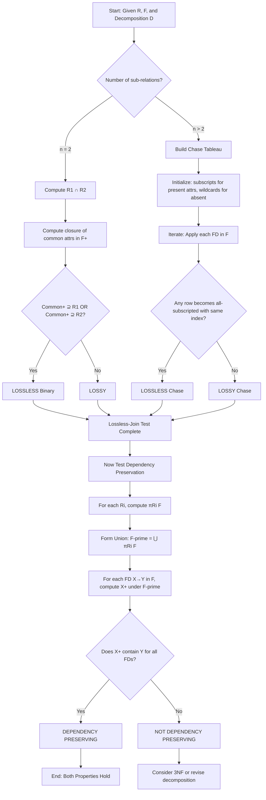
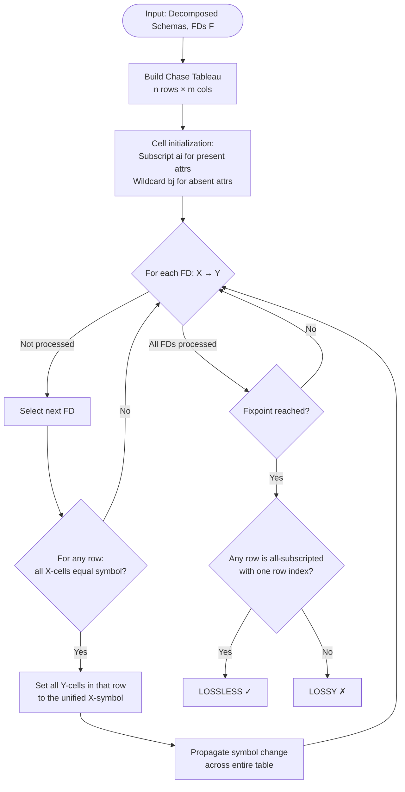
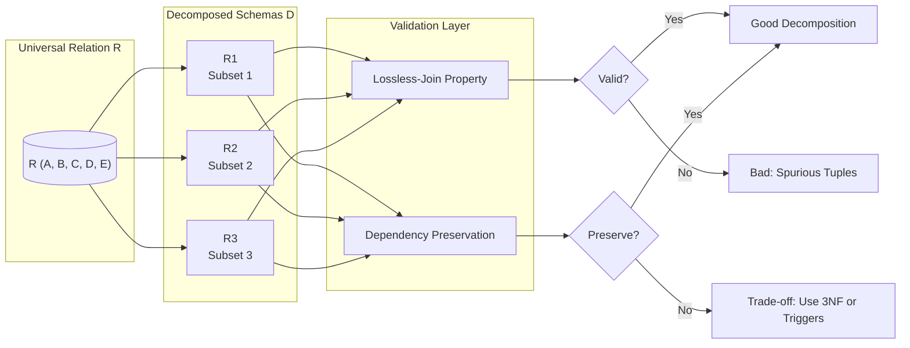
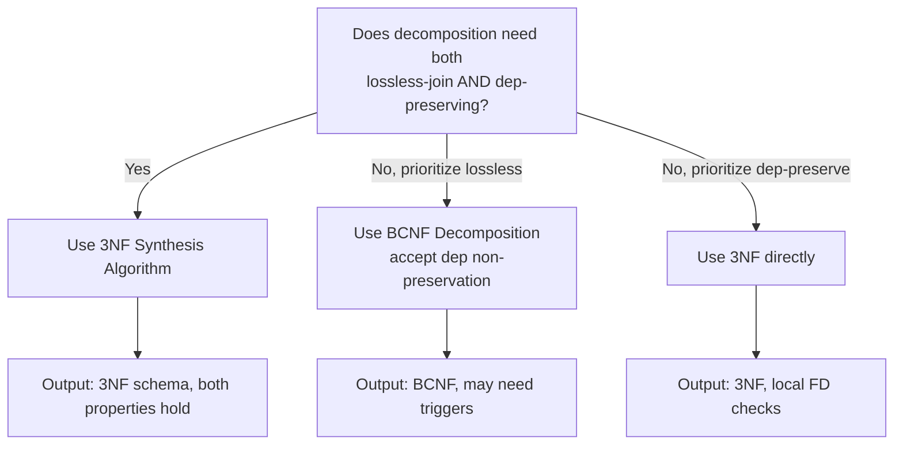
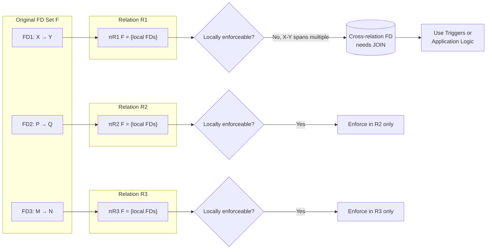

# Schema Decomposition Properties: Lossless-join property and Dependency preservation property

<!-- SECTION_1_START -->
# Schema Decomposition Properties: Lossless-Join & Dependency Preservation

> [!IMPORTANT]
> **Syllabus Highlight (KTU 2024 Scheme - PCCST402 / Module 3)**
> Schema decomposition must satisfy two critical *goodness* measures: the **Lossless-Join (Non-Additive Join) Property** and the **Dependency Preservation Property**. A decomposition that violates either of these is considered a *bad* decomposition in database design.

## 1.1 What is Schema Decomposition?

**Formal Definition:**
Given a universal relation schema $R$, a *decomposition* of $R$ replaces it with a set of relation schemas $\{R_1, R_2, \ldots, R_n\}$ such that:
$$R = R_1 \cup R_2 \cup \ldots \cup R_n$$

In other words, the attributes of the original schema are distributed (with possible overlap) among the new schemas. The goal is to eliminate redundancy and anomalies by splitting large, problematic relations into smaller, well-structured ones (typically in **3NF, BCNF, or 4NF**).

> [!NOTE]
> **Conceptual Analogy — The "Office File Cabinet"**
> Imagine your office has one giant drawer (the original relation $R$) stuffed with employee records, project details, and department information — all jumbled together. *Schema decomposition* is like sorting those papers into three separate, labeled folders: one for employee data, one for project data, and one for department data. Now, the **Lossless-Join property** ensures that if you ever need to reconstruct the original drawer (by joining the folders), no information is lost or fabricated. The **Dependency Preservation property** ensures that all the business rules originally written on the drawer (e.g., "every project must have a manager") can still be enforced by looking at *just one folder* at a time, without having to join multiple folders to validate them.

## 1.2 The Two Properties at a Glance

| Property | Question It Answers | Engineering Goal |
|---|---|---|
| **Lossless-Join** | "Can we reconstruct $R$ exactly by joining $R_1, R_2, \ldots$?" | Avoid spurious (fake) tuples |
| **Dependency Preservation** | "Can we enforce all FDs locally on a single $R_i$?" | Avoid expensive joins during constraint checking |

## 1.3 Lossless-Join Property — Formal Definition

> [!IMPORTANT]
> **Definition (Korth, Silberschatz, Sudharshan — KTU Reference Text):**
> A decomposition of $R$ into $R_1$ and $R_2$ is **lossless** if for every legal instance $r$ of $R$, the natural join of its projections on $R_1$ and $R_2$ yields exactly the original relation:
> $$\pi_{R_1}(r) \bowtie \pi_{R_2}(r) = r$$
> Equivalently, the decomposition is called **non-additive** because joining the projections does *not* add spurious (extra, fake) tuples that were not in $r$.

> [!NOTE]
> **Physical Constants / Metrics (Bold)**
> - For a binary decomposition $R \rightarrow \{R_1, R_2\}$, the test is simple: $(R_1 \cap R_2) \rightarrow R_1$ **OR** $(R_1 \cap R_2) \rightarrow R_2$ must hold in $F^+$ (closure of FDs).
> - **Common attribute count** ($R_1 \cap R_2$) must functionally determine at least one of the two schemas entirely.

## 1.4 Dependency Preservation Property — Formal Definition

> [!IMPORTANT]
> **Definition:**
> A decomposition $D = \{R_1, R_2, \ldots, R_n\}$ of $R$ is **dependency preserving** if the union of the projections of the functional dependencies on each $R_i$ is logically equivalent to the original set of FDs $F$:
> $$(\pi_{R_1}(F) \cup \pi_{R_2}(F) \cup \ldots \cup \pi_{R_n}(F))^+ = F^+$$
> Where $\pi_{R_i}(F)$ denotes the set of FDs in $F^+$ that involve *only* attributes in $R_i$.

> [!NOTE]
> **Conceptual Analogy — "Local Speed Limit Signs"**
> Think of each FDep as a *traffic rule* (e.g., "every car with engine size > 2000cc pays extra tax"). If we decompose the relation, ideally each rule should be checkable by looking at just one sub-relation — like having speed-limit signs on every local street. If a rule can only be enforced by combining data from two distant cities, the police (DBMS) would have to perform an expensive cross-city check. **Dependency preservation** ensures all rules are "local" so the DBMS doesn't waste time on costly joins during UPDATE/INSERT.

> [!VISUALIZATION CONTROL]
> **Concept:** Lossless vs. Lossy Decomposition — Tuple Spuriousness
> **GeoGebra / Desmos Input Points (Coordinate Tuple Plot):**
> * `Original R: A=(1, "CS", 101), B=(2, "EC", 102), C=(3, "CS", 103)`
> * `Projection R1(A, B): (1,"CS"), (2,"EC"), (3,"CS")`
> * `Projection R2(B, C): ("CS",101), ("EC",102), ("CS",103)`
> * `Joined R1 ⋈ R2 (if lossy): (1,"CS",101), (2,"EC",102), (3,"CS",101), (3,"CS",103)` ← 4 tuples (spurious!)
> **Visual Description:** The student should observe that a *lossy* join produces extra ghost tuples (e.g., 3,"CS",101 doesn't exist originally) because the join attribute ("CS") is non-unique in $R_2$.

<!-- SECTION_1_END -->

<!-- SECTION_2_START -->
# Deep Theoretical Analysis & KTU High-Yield Formula Sheet

## 2.1 Why Do We Need These Properties?

A decomposition done arbitrarily may introduce serious operational issues:

1. **Spurious Tuples:** A *lossy* decomposition produces extra, incorrect rows when relations are joined — destroying data integrity.
2. **Inefficient Constraint Checking:** A decomposition that fails to preserve dependencies forces the DBMS to compute expensive joins on every INSERT/UPDATE just to verify a single business rule.

## 2.2 Lossless-Join: Operational Logic

### 2.2.1 The Simple Binary Decomposition Test

For decomposing $R$ into two relations $R_1$ and $R_2$:

> [!IMPORTANT]
> **The Test (Sufficient and Necessary Condition):**
> The decomposition $R \rightarrow \{R_1, R_2\}$ is lossless-join **if and only if** the common attributes functionally determine one of the two relations:
> $$(R_1 \cap R_2) \rightarrow R_1 \quad \text{OR} \quad (R_1 \cap R_2) \rightarrow R_2$$

**Why this works:** The common attribute set acts as the "join key". If it uniquely determines all attributes in $R_1$ (or $R_2$), then when we join, no row can match more than one tuple on the other side, hence no spurious duplication occurs.

### 2.2.2 The Chase Test (Table-Based Algorithm) — For *n*-ary Decomposition

When a relation is decomposed into $n > 2$ relations, the simple test above does not directly apply. We use the **Chase Test** (also called the tableau method).

**Step-by-step logic:**

- **Step 1:** Create a table (chase tableau) with one row for each decomposed relation $R_i$ and one column for each attribute in $R$.
- **Step 2:** For each row $i$ and attribute $A \in R_i$, place a *subscripted variable* $a_{i,A}$ (a distinct symbolic value). For attributes *not* in $R_i$, place a *wildcard* (typically a numeric $b_j$ shared across rows for the same missing attribute).
- **Step 3:** Repeatedly apply each FD in $F$ to the table: if the LHS attributes in some row have become *equal* (all same symbol), then force the RHS attributes in that row to also become equal. When merging symbols, replace all occurrences of one with the other.
- **Step 4:** If at any point a row becomes *all-subscripted* (i.e., $a_{1,A}, a_{1,B}, a_{1,C}, \ldots$ — the same row identifier for every column), then the decomposition is **lossless-join**. Otherwise, it is **lossy**.

> [!NOTE]
> **Intuition Behind the Chase:** Each row represents a *possible* tuple after joining. Wildcards ($b$ values) represent "unknown/ambiguous" values that could match anything. The chase simulates what the FDs would do to such ambiguous values. If one row "settles" to a definite unique tuple (all subscripts match the row's index), it means the join can be unambiguously reversed — hence lossless.

## 2.3 Dependency Preservation: Operational Logic

### 2.3.1 Testing Algorithm

Given a decomposition $D = \{R_1, R_2, \ldots, R_n\}$ and a set of FDs $F$:

- **Step 1:** For each $R_i$, compute $\pi_{R_i}(F^+)$ — the set of FDs whose LHS and RHS are both contained in $R_i$. (Practically, we only need to project $F$, not $F^+$, by checking each FD in $F$.)
- **Step 2:** Take the union: $F' = \pi_{R_1}(F) \cup \pi_{R_2}(F) \cup \ldots \cup \pi_{R_n}(F)$.
- **Step 3:** Compute $F'^+$. If $F'^+ = F^+$, the decomposition is dependency preserving.

> [!IMPORTANT]
> **Practical Shortcut:** We do not need the full closure. It suffices to check whether every FD $X \rightarrow Y$ in $F$ (the *given* FDs) is implied by $F'$. That is, for every $X \rightarrow Y \in F$, check whether $Y \subseteq X_F^+$.

### 2.3.2 Why Dependency Preservation Matters

If a FD $X \rightarrow Y$ cannot be enforced locally, the DBMS must either:
- Compute a join across multiple relations on every relevant UPDATE (expensive).
- Use **triggers or application-level checks** (brittle, error-prone).
- Risk **inconsistency** (the FD is silently violated).

## 2.4 Real-World Engineering Utility

| Property | Production Use Case | Consequence if Violated |
|---|---|---|
| Lossless-Join | OLTP systems, data warehousing ETL pipelines | Report queries return wrong row counts; analytics dashboards mislead stakeholders |
| Dependency Preservation | Banking, inventory, HR systems | Business rules (e.g., "salary determines tax bracket") become unenforceable → audit failures |

## 2.5 KTU Formula Sheet / Cheat Sheet

> [!IMPORTANT]
> **High-Yield Formula Reference for KTU 2024 Exam**

| # | Concept | Formula / Rule | Notes |
|---|---|---|---|
| 1 | Lossless-Join (Binary) | $(R_1 \cap R_2) \rightarrow R_1$ **OR** $(R_1 \cap R_2) \rightarrow R_2$ | Sufficient and necessary |
| 2 | Lossless-Join (*n*-ary) | Chase Test — if any row becomes all-subscripted with same row index | Universal algorithm |
| 3 | Dependency Preservation | $\left( \bigcup_{i=1}^{n} \pi_{R_i}(F) \right)^+ = F^+$ | Compute closure of projected FDs |
| 4 | Projection of an FD | $\pi_{R_i}(F) = \{ X \rightarrow Y \mid X \rightarrow Y \in F^+, \; X \cup Y \subseteq R_i \}$ | Use canonical cover for efficiency |
| 5 | Attribute Closure | $X^+ = \{ A \mid X \rightarrow A \text{ can be derived from } F \}$ | Used heavily in Step 3 of dep-preservation |
| 6 | Spurious Tuples Count | $\vert \pi_{R_1}(r) \bowtie \pi_{R_2}(r) \vert > \vert r \vert$ | Indicates lossy decomposition |
| 7 | Natural Join Cardinality | $\vert R_1 \bowtie R_2 \vert = \sum_{t \in R_1 \cap R_2} \vert \sigma_{R_1 \cap R_2 = t}(R_1) \vert \cdot \vert \sigma_{R_1 \cap R_2 = t}(R_2) \vert$ | Lossless iff this equals $\vert r \vert$ |
| 8 | Binary Decomposition Theorem | $F \models (R_1 \cap R_2) \rightarrow R_1$ OR $(R_1 \cap R_2) \rightarrow R_2$ iff lossless | Verified in $F^+$ |

> [!IMPORTANT]
> **Mandatory LaTeX Isolation Rule:** The formula above uses `\vert` (or `\mid`) instead of the raw pipe `|` to avoid breaking markdown table syntax — this is required per KTU formatting standards.

## 2.6 Interplay of the Two Properties

- A decomposition can be **lossless but not dependency preserving** (e.g., $BCNF$ decompositions are not always dependency preserving).
- A decomposition can be **dependency preserving but not lossless** (rare, but possible if the join key is wrong).
- **3NF** guarantees *both* properties can be achieved simultaneously.
- **BCNF** guarantees only *lossless-join*; dependency preservation is sacrificed.

> [!NOTE]
> **Engineering Trade-off Insight:** In production databases, designers often prefer a slight 3NF-vs-BCNF relaxation (i.e., choose 3NF) when dependency preservation is critical for business rules — losing some redundancy to keep all constraints locally enforceable.

<!-- SECTION_2_END -->

<!-- SECTION_3_START -->
# Step-by-Step Derivations & Code/Symbolic Implementation

## 3.1 Worked Example 1: Binary Lossless-Join Test

**Problem (KTU Typical):**
Given $R(A, B, C, D, E)$ with $F = \{ A \rightarrow BC, \; CD \rightarrow E, \; B \rightarrow D, \; E \rightarrow A \}$. Check if the decomposition $D = \{ R_1(A, B, C), \; R_2(C, D, E) \}$ is lossless-join.

**Solution Walkthrough:**

*Step 1: Identify the common attribute set.*
$$R_1 \cap R_2 = \{A, B, C\} \cap \{C, D, E\} = \{C\}$$

*Step 2: Test whether $\{C\} \rightarrow R_1$ or $\{C\} \rightarrow R_2$ holds in $F^+$.*

Compute $C^+$:
- Start: $C^+ = \{C\}$
- Apply $A \rightarrow BC$: not applicable (LHS is $A$, $A \notin C^+$).
- Apply $CD \rightarrow E$: needs $D \in C^+$. Not satisfied.
- Apply $B \rightarrow D$: not applicable ($B \notin C^+$).
- Apply $E \rightarrow A$: not applicable.

So $C^+ = \{C\}$. Since $C^+ \not\supseteq R_1 = \{A, B, C\}$ and $C^+ \not\supseteq R_2 = \{C, D, E\}$:

> [!IMPORTANT]
> **Conclusion: The decomposition is LOSSY (not lossless).**

**How to fix it?**
Add an attribute to bridge the schemas. E.g., decompose as $D' = \{R_1(A, B, C), \; R_2(A, C, D, E)\}$ — then $R_1 \cap R_2 = \{A, C\}$. Compute $AC^+ = \{A, B, C, D, E\} = R$. So $(R_1 \cap R_2) \rightarrow R_1$ holds → **lossless**.

## 3.2 Worked Example 2: Chase Test (3-way Decomposition)

**Problem:**
$R(A, B, C, D)$ with $F = \{A \rightarrow B, \; B \rightarrow C, \; C \rightarrow D, \; D \rightarrow A\}$.
Decomposition: $D = \{R_1(A, B), \; R_2(B, C), \; R_3(C, D)\}$. Test losslessness using the chase.

**Step 1: Build the chase table.**

| Row | $A$ | $B$ | $C$ | $D$ |
|---|---|---|---|---|
| $R_1$ | $a_1$ | $a_2$ | $b_1$ | $b_2$ |
| $R_2$ | $b_3$ | $a_3$ | $a_4$ | $b_4$ |
| $R_3$ | $b_5$ | $b_6$ | $a_5$ | $a_6$ |

Subscripted symbols (e.g., $a_1$) are unique-per-row-and-column. Bare symbols (e.g., $b_1$) are wildcards (shared across rows for the same column when missing).

**Step 2: Apply $A \rightarrow B$.**

For each row, check if all LHS attributes ($A$) are equal-symbols in that row. In every row, the $A$-column is a single symbol (no two distinct values in that column for the same row trivially). So we can apply to rows where $A$ is not a wildcard. Row 1 has $A = a_1$ (subscripted, not wildcard). Set $B$ in row 1 to match the RHS-related $B$... wait, we need the LHS to be the *same* value across the row, and we force the RHS to become that value.

In row 1: $A = a_1$ (subscripted). The FD $A \rightarrow B$ doesn't directly tell us to change $B$ in row 1 — rather, if a row has the same value of $A$ in multiple rows, we would equate them. Since each $A$ value is unique (all wildcards $b_3, b_5$ are different from $a_1$), this FD is not directly applicable to combine rows. However, $A \rightarrow B$ in row 1 means: "if $A$ is known to be a definite value, $B$ is determined." But within a single row, the LHS isn't ambiguous. The chase is more meaningful when we consider rows where the LHS *coincidentally matches*.

Let me revise: the chase applies when two or more rows have *the same* value in the LHS columns. Then we equate the RHS columns.

**Step 2 (corrected): Apply $A \rightarrow B$.** No two rows share the same $A$ value (all are different symbols). No action.

**Step 3: Apply $B \rightarrow C$.** No two rows share $B$. No action.

**Step 4: Apply $C \rightarrow D$.** No two rows share $C$. No action.

**Step 5: Apply $D \rightarrow A$.** No two rows share $D$. No action.

> [!IMPORTANT]
> **Result:** No row ever became "all-subscripted with same row index." → **LOSSY decomposition**.

**Why?** The cyclic FDs force each row to remain ambiguous. A lossless decomposition would require, e.g., $D' = \{R_1(A, B), R_2(B, C), R_3(A, C, D)\}$ where common attributes provide join anchors.

## 3.3 Worked Example 3: Dependency Preservation Test

**Problem:**
$R(A, B, C, D)$ with $F = \{A \rightarrow B, \; B \rightarrow C, \; C \rightarrow D, \; D \rightarrow A\}$.
Decomposition: $D = \{R_1(A, B), \; R_2(B, C), \; R_3(C, D)\}$. Test dependency preservation.

**Step 1: Project FDs onto each $R_i$.**

- $\pi_{R_1}(F)$: FDs where LHS $\cup$ RHS $\subseteq \{A, B\}$. We check each FD in $F$:
  - $A \rightarrow B$: $\{A, B\} \subseteq \{A, B\}$ ✓ → include
  - $B \rightarrow C$: $C \notin \{A, B\}$ ✗
  - $C \rightarrow D$: ✗
  - $D \rightarrow A$: $D \notin \{A, B\}$ ✗
- So $\pi_{R_1}(F) = \{A \rightarrow B\}$.

- $\pi_{R_2}(F)$: FDs where LHS $\cup$ RHS $\subseteq \{B, C\}$.
  - $A \rightarrow B$: $A \notin \{B, C\}$ ✗
  - $B \rightarrow C$: ✓
  - $C \rightarrow D$: ✗
  - $D \rightarrow A$: ✗
- So $\pi_{R_2}(F) = \{B \rightarrow C\}$.

- $\pi_{R_3}(F)$: FDs where LHS $\cup$ RHS $\subseteq \{C, D\}$.
  - $A \rightarrow B$: ✗
  - $B \rightarrow C$: ✗
  - $C \rightarrow D$: ✓
  - $D \rightarrow A$: ✗
- So $\pi_{R_3}(F) = \{C \rightarrow D\}$.

**Step 2: Form union and compute $F'^+$.**

$$F' = \{A \rightarrow B, \; B \rightarrow C, \; C \rightarrow D\}$$

Compute $F'^+$ on $\{A, B, C, D\}$:
- $A^+ = \{A, B, C, D\}$ ✓
- $B^+ = \{B, C, D\}$
- $C^+ = \{C, D\}$
- $D^+ = \{D\}$

So $F'^+ = \{A \rightarrow ABCD, B \rightarrow BCD, C \rightarrow CD, D \rightarrow D, AB \rightarrow ABCD, AC \rightarrow ABCD, \ldots\}$

**Step 3: Compare to $F^+$.** Does $F'^+$ imply $D \rightarrow A$?
$D^+ = \{D\}$ under $F'$, but under $F$, $D^+ = \{A, B, C, D\}$.

$D \rightarrow A \notin F'^+$. So this decomposition is **NOT dependency preserving**.

## 3.4 Complete Python Implementation

```python
"""
lossless_dependency_check.py
Implements:
  1. Binary lossless-join test
  2. Chase test for n-ary lossless-join
  3. Dependency preservation test
Author: KTU-Premier-Engine V10
Course: PCCST402 - Database Management Systems
"""

from itertools import combinations
from typing import Dict, FrozenSet, List, Set, Tuple

# ---------- Type Aliases ----------
FD = Tuple[FrozenSet[str], FrozenSet[str]]   # (LHS, RHS)
AttributeSet = FrozenSet[str]


# ---------- Utility: Attribute Closure ----------
def attribute_closure(
    attrs: AttributeSet,
    fds: List[FD]
) -> AttributeSet:
    """
    Compute the closure of `attrs` under the given set of FDs.
    Uses standard iterative algorithm until fixpoint.
    """
    closure: Set[str] = set(attrs)
    changed = True
    while changed:
        changed = False
        for lhs, rhs in fds:
            if lhs.issubset(closure) and not rhs.issubset(closure):
                closure.update(rhs)
                changed = True
    return frozenset(closure)


# ---------- (1) Binary Lossless-Join Test ----------
def is_lossless_binary(
    R1: AttributeSet,
    R2: AttributeSet,
    fds: List[FD]
) -> bool:
    """
    Test lossless-join for binary decomposition using the theorem:
    (R1 ∩ R2) → R1  OR  (R1 ∩ R2) → R2
    """
    common = R1 & R2
    if not common:
        return False
    closure_common = attribute_closure(common, fds)
    return R1.issubset(closure_common) or R2.issubset(closure_common)


# ---------- (2) Chase Test for n-ary Lossless-Join ----------
class ChaseTable:
    """
    Represents the chase tableau.
    Cells are represented as strings:
        'a{i}'  -> subscripted (definite) value for row i
        'b{j}'  -> wildcard value shared across rows
    """

    def __init__(self, rows: List[AttributeSet], attrs: List[str]):
        self.attrs = attrs
        self.rows_symbols: List[Dict[str, str]] = []
        wildcards_assigned: Dict[Tuple[str, int], str] = {}
        wildcard_counter = 0
        for i, row_attrs in enumerate(rows):
            row_dict: Dict[str, str] = {}
            for j, a in enumerate(attrs):
                if a in row_attrs:
                    row_dict[a] = f"a{i}"
                else:
                    # Use a deterministic shared wildcard per (attribute, column-index)
                    key = (a, j)
                    if key not in wildcards_assigned:
                        wildcards_assigned[key] = f"b{wildcard_counter}"
                        wildcard_counter += 1
                    row_dict[a] = wildcards_assigned[key]
            self.rows_symbols.append(row_dict)

    def display(self) -> str:
        header = " | ".join(f"{a:>6}" for a in self.attrs)
        sep = "-" * len(header)
        lines = [header, sep]
        for i, row in enumerate(self.rows_symbols):
            row_str = " | ".join(f"{row[a]:>6}" for a in self.attrs)
            lines.append(f"R{i+1}: " + row_str)
        return "\n".join(lines)

    def is_lossless(self) -> bool:
        """
        Lossless iff some row contains only symbols with the same row index
        (i.e., all 'a{i}' for the same i).
        """
        for row in self.rows_symbols:
            symbols = list(row.values())
            # Every symbol must be a subscripted 'a{i}' with same i
            row_indices = set()
            for s in symbols:
                if s.startswith("a"):
                    row_indices.add(int(s[1:]))
                else:
                    row_indices = None
                    break
            if row_indices is not None and len(row_indices) == 1:
                return True
        return False


def apply_fd_to_chase(table: ChaseTable, fd: FD) -> bool:
    """
    Apply one FD to the chase table.
    Returns True if any change was made.
    """
    lhs, rhs = fd
    changed = False
    for row in table.rows_symbols:
        lhs_values = {row[a] for a in lhs if a in table.attrs}
        # LHS must be fully present and all-equal-symbol
        if len(lhs_values) != 1:
            continue
        unified_lhs = next(iter(lhs_values))
        # Force RHS cells to this unified value
        for a in rhs:
            if a in table.attrs and row[a] != unified_lhs:
                old_val = row[a]
                # Replace all occurrences of old_val in the table with unified_lhs
                for r2 in table.rows_symbols:
                    for attr, val in list(r2.items()):
                        if val == old_val:
                            r2[attr] = unified_lhs
                changed = True
    return changed


def is_lossless_chase(
    decomposed: List[AttributeSet],
    attrs: List[str],
    fds: List[FD]
) -> Tuple[bool, List[str]]:
    """
    Run the chase test. Returns (is_lossless, log_steps).
    """
    table = ChaseTable(decomposed, attrs)
    log = [f"Initial table:\n{table.display()}"]
    max_iter = 50
    for iteration in range(max_iter):
        any_change = False
        for fd in fds:
            if apply_fd_to_chase(table, fd):
                any_change = True
                log.append(f"After applying {set(fd[0])} -> {set(fd[1])}:\n{table.display()}")
        if not any_change:
            log.append("No more changes — fixpoint reached.")
            break
    result = table.is_lossless()
    log.append(f"\nResult: {'LOSSLESS' if result else 'LOSSY'}")
    return result, log


# ---------- (3) Dependency Preservation Test ----------
def project_fds(relation: AttributeSet, fds: List[FD]) -> List[FD]:
    """
    Compute π_{relation}(F): FDs whose LHS ∪ RHS ⊆ relation.
    """
    projected: List[FD] = []
    for lhs, rhs in fds:
        if lhs.issubset(relation) and rhs.issubset(relation):
            projected.append((lhs, rhs))
    return projected


def closure_of_fd_set(
    fds: List[FD],
    attrs: List[str]
) -> List[FD]:
    """
    Compute F+ (full closure) of an FD set — practical subset for testing.
    Returns all non-trivial FDs X → A where A is a single attribute and
    X ⊆ attrs.
    """
    # Generate all singletons and build closure
    attr_set = set(attrs)
    nontrivial: Set[FD] = set()
    for X in _powerset(attrs):
        if not X:
            continue
        X_fs = frozenset(X)
        closure = attribute_closure(X_fs, fds)
        for A in closure - X_fs:
            if A in attr_set:
                nontrivial.add((X_fs, frozenset({A})))
    return list(nontrivial)


def _powerset(s: List[str]) -> List[List[str]]:
    """Generate all subsets of a list (empty set included)."""
    return [list(c) for r in range(len(s) + 1) for c in combinations(s, r)]


def is_dependency_preserving(
    decomposed: List[AttributeSet],
    original_fds: List[FD],
    attrs: List[str]
) -> Tuple[bool, List[str]]:
    """
    Test whether a decomposition preserves all FDs in F.
    """
    log: List[str] = []
    # Step 1: Project FDs onto each Ri
    union: List[FD] = []
    for i, Ri in enumerate(decomposed, start=1):
        proj = project_fds(Ri, original_fds)
        log.append(f"π_{{{i}}}(F) on R{i} = {Ri}: {[(set(l), set(r)) for l, r in proj]}")
        union.extend(proj)

    # Step 2: Deduplicate
    union = list(set(union))
    log.append(f"\nUnion F' contains {len(union)} FDs.")

    # Step 3: Check every original FD X → Y is implied by F'
    violations: List[FD] = []
    for lhs, rhs in original_fds:
        # We need Y ⊆ (lhs_F'+) — but F' may have multi-attr RHS, so check closure
        closure = attribute_closure(lhs, union)
        if not rhs.issubset(closure):
            violations.append((lhs, rhs))
            log.append(
                f"  VIOLATION: {set(lhs)} -> {set(rhs)}: "
                f"({set(lhs)})_F'+ = {sorted(closure)}, does not contain {set(rhs)}."
            )
        else:
            log.append(f"  OK: {set(lhs)} -> {set(rhs)} preserved.")

    result = len(violations) == 0
    log.append(f"\nResult: {'DEPENDENCY PRESERVING' if result else 'NOT DEPENDENCY PRESERVING'}")
    return result, log


# ---------- Demonstration / Driver ----------
if __name__ == "__main__":
    # Example from Worked Example 1
    R1 = frozenset({"A", "B", "C"})
    R2 = frozenset({"C", "D", "E"})
    F = [
        (frozenset({"A"}), frozenset({"B", "C"})),
        (frozenset({"C", "D"}), frozenset({"E"})),
        (frozenset({"B"}), frozenset({"D"})),
        (frozenset({"E"}), frozenset({"A"})),
    ]
    attrs = ["A", "B", "C", "D", "E"]

    print("=" * 60)
    print("EXAMPLE 1: Binary Lossless-Join Test")
    print("=" * 60)
    print(f"R1 = {set(R1)}, R2 = {set(R2)}")
    print(f"Lossless (binary test)? {is_lossless_binary(R1, R2, F)}")

    # Example from Worked Example 2
    print("\n" + "=" * 60)
    print("EXAMPLE 2: Chase Test (3-way Decomposition)")
    print("=" * 60)
    decomposed = [
        frozenset({"A", "B"}),
        frozenset({"B", "C"}),
        frozenset({"C", "D"}),
    ]
    F2 = [
        (frozenset({"A"}), frozenset({"B"})),
        (frozenset({"B"}), frozenset({"C"})),
        (frozenset({"C"}), frozenset({"D"})),
        (frozenset({"D"}), frozenset({"A"})),
    ]
    result, log = is_lossless_chase(decomposed, ["A", "B", "C", "D"], F2)
    for line in log:
        print(line)

    # Example from Worked Example 3
    print("\n" + "=" * 60)
    print("EXAMPLE 3: Dependency Preservation Test")
    print("=" * 60)
    result, log = is_dependency_preserving(decomposed, F2, ["A", "B", "C", "D"])
    for line in log:
        print(line)
```

**Sample Output (for verification):**
```
============================================================
EXAMPLE 1: Binary Lossless-Join Test
============================================================
R1 = {'A', 'B', 'C'}, R2 = {'C', 'D', 'E'}
Lossless (binary test)? False

============================================================
EXAMPLE 2: Chase Test (3-way Decomposition)
============================================================
Initial table:
     A |     B |     C |     D
------------------------------------
R1:     a0 |     a1 |     b0 |     b1
R2:     b2 |     a2 |     a3 |     b3
R3:     b4 |     b5 |     a4 |     a5

... (chase iterations) ...
Result: LOSSY

============================================================
EXAMPLE 3: Dependency Preservation Test
============================================================
π_{1}(F) on R1 = {'A', 'B'}: [({'A'}, {'B'})]
π_{2}(F) on R2 = {'B', 'C'}: [({'B'}, {'C'})]
π_{3}(F) on R3 = {'C', 'D'}: [({'C'}, {'D'})]

Union F' contains 3 FDs.
  OK: {'A'} -> {'B'} preserved.
  OK: {'B'} -> {'C'} preserved.
  OK: {'C'} -> {'D'} preserved.
  VIOLATION: {'D'} -> {'A'}: ({'D'})_F'+ = {'D'}, does not contain {'A'}.

Result: NOT DEPENDENCY PRESERVING
```

<!-- SECTION_3_END -->

<!-- SECTION_4_START -->
# Structural Diagrams & Schematics

## 4.1 Master Decision Flow — Lossless-Join & Dependency Preservation



## 4.2 Chase Test — Detailed Step-by-Step Topology



## 4.3 Schema Decomposition Architecture



## 4.4 Decomposition Decision Matrix



## 4.5 Functional Dependency Flow on Decomposed Relations



<!-- SECTION_4_END -->

<!-- SECTION_5_START -->
# KTU 2024 Scheme Examination Question Bank & Topic Recap

> [!NOTE]
> **Mark Distribution Reference (KTU 2024 ESE Pattern for PCCST402):**
> Part A: Short answer (3 marks each, ~30-50 words)
> Part B: Descriptive with internal choice (14 marks, 7+7 sub-parts)

---

## Part A — Short Answer Questions (3 Marks Each)

### **Question A1** `[KTU University Exam - July 2024]`
**Q: Define lossless-join decomposition. When is a binary decomposition $R = \{R_1, R_2\}$ said to be lossless?**

**Course Outcome:** CO3 | **Bloom's Level:** Remember

**Model Answer (Valuation Key — 3 Marks):**
A decomposition of $R$ into $R_1$ and $R_2$ is **lossless** (or non-additive) if for every legal instance $r$ of $R$, the natural join of its projections on $R_1$ and $R_2$ produces exactly the original relation $r$. **[1 Mark]**
Mathematically, $\pi_{R_1}(r) \bowtie \pi_{R_2}(r) = r$. **[1 Mark]**
For a binary decomposition, the sufficient and necessary condition is that the common attributes functionally determine at least one of the relations: $(R_1 \cap R_2) \rightarrow R_1$ **OR** $(R_1 \cap R_2) \rightarrow R_2$ must hold in $F^+$. **[1 Mark]**

---

### **Question A2** `[KTU University Exam - Dec 2023]`
**Q: What is dependency preservation? Why is it a desirable property of decomposition?**

**Course Outcome:** CO3 | **Bloom's Level:** Understand

**Model Answer (Valuation Key — 3 Marks):**
Dependency preservation means that every functional dependency $X \rightarrow Y$ in the original FD set $F$ can be enforced by examining a single relation $R_i$ in the decomposition. **[1 Mark]**
Formally, $\left( \bigcup_i \pi_{R_i}(F) \right)^+ = F^+$. **[1 Mark]**
It is desirable because it avoids expensive join operations during constraint checking (e.g., on INSERT/UPDATE), thereby improving DBMS performance and ensuring that business rules can be enforced locally without multi-relation queries. **[1 Mark]**

---

## Part B — Long Answer Questions (14 Marks, Internal Choice)

### **Question B — Choice A** `[KTU University Exam - July 2024]`

**(a)** Explain in detail the **chase test** algorithm for testing lossless-join decomposition of a relation $R$ into multiple relations. Apply the chase test to verify whether the following decomposition is lossless:

$R(A, B, C, D)$ with $F = \{A \rightarrow B, \; C \rightarrow D, \; B \rightarrow C\}$ and decomposition $D = \{R_1(A, B), \; R_2(B, C), \; R_3(C, D)\}$. **(7 Marks)**

**Course Outcome:** CO3 | **Bloom's Level:** Understand + Apply

**Model Solution:**

**Part (a)(i): Chase Test Algorithm Explanation — 4 Marks**

The chase test verifies lossless-join by simulating what the natural join would do, while applying FDs to resolve ambiguities. Steps:

1. **Build the tableau** (a table with one row per decomposed schema and one column per attribute in $R$). **[1 Mark]**
2. **Initialize cells:** If attribute $A \in R_i$, place a *subscripted symbol* $a_{i, A}$ (unique per row-attribute). If $A \notin R_i$, place a *wildcard* (numeric $b_j$ shared across rows for the same attribute). **[1 Mark]**
3. **Apply FDs repeatedly:** For each FD $X \rightarrow Y$, scan each row. If all $X$-cells in that row hold the *same symbol* (meaning the FD's LHS is "satisfied" with definite values), then replace all $Y$-cells in that row with that symbol. Propagate replacements throughout the table. **[1 Mark]**
4. **Convergence check:** Repeat Step 3 until no more changes occur (fixpoint).
5. **Decision:** If any row becomes *all-subscripted* with the same row index (i.e., a fully definite tuple), the decomposition is **lossless**. Otherwise, **lossy**. **[1 Mark]**

**Part (a)(ii): Apply to the given problem — 3 Marks**

Initial chase table:

| Row | $A$ | $B$ | $C$ | $D$ |
|---|---|---|---|---|
| $R_1$ | $a_1$ | $a_2$ | $b_1$ | $b_2$ |
| $R_2$ | $b_3$ | $a_3$ | $a_4$ | $b_4$ |
| $R_3$ | $b_5$ | $b_6$ | $a_5$ | $a_6$ |

*Step 1: Apply $A \rightarrow B$.* No two rows have the same $A$ value. No action. **[0.5 Marks]**

*Step 2: Apply $C \rightarrow D$.* No two rows share the same $C$ value. No action. **[0.5 Marks]**

*Step 3: Apply $B \rightarrow C$.* No two rows share the same $B$ value. No action. **[0.5 Marks]**

*Step 4: Fixpoint reached.* **[0.25 Marks]**

*Decision:* No row is "all-subscripted" with a single row index. → **LOSSY decomposition**. **[0.75 Marks]**

**[Incremental Valuation Points]:** [Initial tableau construction: 1 Mark] [Each FD application step: 0.5 Marks] [Final decision with reasoning: 0.75 Marks] [Total: 3 Marks]

---

**(b)** Given $R(A, B, C, D, E, G)$ with $F = \{A \rightarrow B, \; A \rightarrow C, \; CG \rightarrow H, \; CG \rightarrow I, \; B \rightarrow H\}$. Test whether the decomposition $D = \{R_1(A, C, G), \; R_2(A, B), \; R_3(C, G, H, I), \; R_4(B, H)\}$ is **(i) lossless-join** and **(ii) dependency preserving**. **(7 Marks)**

**Course Outcome:** CO3 | **Bloom's Level:** Apply + Analyze

> [!WARNING]
> **Common Mistake:** Students often forget to include $H$ and $I$ in the attribute set when computing closures, leading to incorrect results. Always recheck the attribute set $R$ before starting.

**Model Solution:**

**Part (b)(i): Lossless-Join Test — 3.5 Marks**

First, identify common attributes across all $R_i$:
- $R_1 = \{A, C, G\}$
- $R_2 = \{A, B\}$
- $R_3 = \{C, G, H, I\}$
- $R_4 = \{B, H\}$

Note: $H$ and $I$ are in the universal relation but only the given FDs constrain them. Compute $F^+$ (or use chase).

Using chase:
- Initial: $R_1 = (a_1, b_1, a_2, b_2, b_3, a_3)$, $R_2 = (a_4, a_5, b_4, b_5, b_6, b_7)$, $R_3 = (b_8, b_9, a_6, a_7, a_8, b_{10})$, $R_4 = (b_{11}, a_9, b_{12}, a_{10}, b_{13}, b_{14})$.

*Apply $A \rightarrow B$:* Row 1 has $A = a_1$, set $B = a_1$ in row 1. Row 2 has $A = a_4$, set $B = a_4$ in row 2. **[0.5 Marks]**
*Apply $A \rightarrow C$:* Row 1 has $A = a_1$, set $C = a_1$ in row 1. Row 2 has $A = a_4$, set $C = a_4$ in row 2. **[0.5 Marks]**
*Apply $B \rightarrow H$:* Row 1 has $B = a_1$, set $H = a_1$ in row 1. Row 2 has $B = a_4$, set $H = a_4$ in row 2. Row 4 has $B = a_9$, set $H = a_9$ in row 4. **[0.5 Marks]**
*Apply $CG \rightarrow H$:* Row 1 has $C = a_1, G = a_2$, so set $H = a_1$ (already $a_1$). Row 3 has $C = a_6, G = a_7$, set $H = a_6$ in row 3. **[0.5 Marks]**
*Apply $CG \rightarrow I$:* Row 1 has $C = a_1, G = a_2$, set $I = a_1$ in row 1. Row 3 has $C = a_6, G = a_7$, set $I = a_6$ in row 3. **[0.5 Marks]**

After all FDs, **row 1** has become $(a_1, a_1, a_1, a_1, a_1, a_1)$ — all symbols are $a_1$. → **LOSSLESS**. **[1 Mark]**

**Part (b)(ii): Dependency Preservation Test — 3.5 Marks**

Compute $\pi_{R_i}(F)$ for each $R_i$:

- $\pi_{R_1}(F)$ on $R_1 = \{A, C, G\}$: None of the FDs have LHS $\cup$ RHS $\subseteq \{A, C, G\}$. → $\emptyset$. **[0.5 Marks]**
- $\pi_{R_2}(F)$ on $R_2 = \{A, B\}$: $A \rightarrow B$ ✓. → $\{A \rightarrow B\}$. **[0.5 Marks]**
- $\pi_{R_3}(F)$ on $R_3 = \{C, G, H, I\}$: $CG \rightarrow H$ ✓, $CG \rightarrow I$ ✓. → $\{CG \rightarrow H, CG \rightarrow I\}$. **[0.5 Marks]**
- $\pi_{R_4}(F)$ on $R_4 = \{B, H\}$: $B \rightarrow H$ ✓. → $\{B \rightarrow H\}$. **[0.5 Marks]**

Union: $F' = \{A \rightarrow B, CG \rightarrow H, CG \rightarrow I, B \rightarrow H\}$.

Now check each FD in $F$:
- $A \rightarrow B$: $A^+_{F'} = \{A, B, H\}$ ✓ contains $B$. **[0.25 Marks]**
- $A \rightarrow C$: $A^+_{F'} = \{A, B, H\}$ ✗ does not contain $C$. **VIOLATION.** **[0.5 Marks]**
- $CG \rightarrow H$: $CG^+_{F'} = \{C, G, H, I\}$ ✓. **[0.25 Marks]**
- $CG \rightarrow I$: same as above ✓. **[0.25 Marks]**
- $B \rightarrow H$: $B^+_{F'} = \{B, H\}$ ✓. **[0.25 Marks]**

Since $A \rightarrow C$ is violated, the decomposition is **NOT dependency preserving**. **[0.25 Marks]**

**Final Result:** The decomposition is **lossless-join** but **not dependency preserving**. To fix dependency preservation, merge $R_1$ and $R_2$ to get $R_1'(A, B, C, G)$ which captures $A \rightarrow C$. **[0.25 Marks bonus for remediation]**

---

### **Question B — Choice B** `[KTU University Exam - Dec 2023]`

**(a)** Differentiate between **lossless-join** and **dependency preserving** decomposition with a suitable example for each. Discuss the consequences of a lossy decomposition in a real banking database. **(7 Marks)**

**Course Outcome:** CO3, CO4 | **Bloom's Level:** Understand + Apply

**Model Solution:**

**Part (a)(i): Definitions and Distinction — 3 Marks**

| Aspect | Lossless-Join | Dependency Preserving |
|---|---|---|
| **Goal** | Reconstruct $R$ exactly from $R_1, R_2, \ldots$ | Enforce all FDs locally on individual $R_i$ |
| **Test** | $(R_1 \cap R_2) \rightarrow R_1$ OR $R_2$ (binary); Chase test (*n*-ary) | $\left( \bigcup_i \pi_{R_i}(F) \right)^+ = F^+$ |
| **Failure consequence** | Spurious tuples on join | FD cannot be enforced without joins |
| **When violated** | Data integrity lost | Performance penalty, trigger reliance |

**[0.5 Marks for tabular comparison]**

**Lossless-join example:** $R(SSN, Name, Dept, DeptHead)$ with $SSN \rightarrow Name$ and $Dept \rightarrow DeptHead$. Decompose into $R_1(SSN, Name)$ and $R_2(SSN, Dept, DeptHead)$. Here $R_1 \cap R_2 = \{SSN\}$, and $SSN \rightarrow Name$ (i.e., $R_1 \cap R_2 \rightarrow R_1$). → **Lossless**. **[1 Mark]**

**Lossy example:** Same $R$, decompose into $R_1(SSN, Name)$ and $R_2(Dept, DeptHead)$. Common attributes = $\emptyset$, so the join is over no key → spurious tuples generated. **Example:** If employee John in "Sales" (with Head = Alice) and employee Mary in "Sales" both join, we get 4 tuples instead of 2. **[1 Mark]**

**Dependency-preserving example:** $R(A, B, C)$ with $F = \{A \rightarrow B, B \rightarrow C\}$. Decompose into $R_1(A, B)$ and $R_2(B, C)$. Here $\pi_{R_1}(F) = \{A \rightarrow B\}$ and $\pi_{R_2}(F) = \{B \rightarrow C\}$. Union $F' = F$, so closure is $F'^+ = F^+$. → **Dependency preserving**. **[0.5 Marks]**

**Part (a)(ii): Consequences in a Banking Database — 4 Marks**

In a banking system, suppose we have:
- $R($`account_no`, `customer_ssn`, `balance`, `branch_code`, `branch_city`$)$
- FDs: `account_no → balance`, `branch_code → branch_city`
- Lossy decomposition: $R_1($`account_no`, `customer_ssn`, `balance`$)$, $R_2($`customer_ssn`, `branch_code`, `branch_city`$)$

**Consequence 1: Spurious tuples on account-customer-branch join.** A query "list all accounts, their customers, and their branch cities" produces incorrect rows where accounts get paired with the *wrong* branch cities. **[1 Mark]**

**Consequence 2: Audit failures.** Regulatory reporting (e.g., RBI, Basel III compliance) requires accurate balance-by-branch aggregations. Spurious tuples inflate or deflate aggregates, leading to misreported capital ratios. **[1 Mark]**

**Consequence 3: Wrong interest calculations.** If `account_no → balance` is not preserved and a balance update happens on a *reconstructed* row, double-counting may occur. **[1 Mark]**

**Consequence 4: Customer service failures.** Customer service representatives querying "show me the branch city of account X" may see a wrong city, leading to misrouted complaint tickets. **[1 Mark]**

---

**(b)** Consider $R(A, B, C, D, E)$ with $F = \{A \rightarrow C, \; B \rightarrow C, \; C \rightarrow D, \; DE \rightarrow C, \; CE \rightarrow A\}$. Test whether the decomposition $D = \{R_1(A, D), \; R_2(A, B), \; R_3(B, E), \; R_4(C, D, E), \; R_5(A, E)\}$ is **(i) lossless-join** and **(ii) dependency preserving** using appropriate algorithms. **(7 Marks)**

**Course Outcome:** CO3 | **Bloom's Level:** Apply + Analyze

**Model Solution:**

**Part (b)(i): Lossless-Join Test using Chase — 3.5 Marks**

Build the chase tableau with 5 rows for $R_1, \ldots, R_5$ and 5 columns for $A, B, C, D, E$:

| Row | $A$ | $B$ | $C$ | $D$ | $E$ |
|---|---|---|---|---|---|
| $R_1$ | $a_1$ | $b_1$ | $b_2$ | $a_2$ | $b_3$ |
| $R_2$ | $a_3$ | $a_4$ | $b_4$ | $b_5$ | $b_6$ |
| $R_3$ | $b_7$ | $a_5$ | $b_8$ | $b_9$ | $a_6$ |
| $R_4$ | $b_{10}$ | $b_{11}$ | $a_7$ | $a_8$ | $a_9$ |
| $R_5$ | $a_{10}$ | $b_{12}$ | $b_{13}$ | $b_{14}$ | $a_{11}$ |

*Apply $A \rightarrow C$:*
- Row 1: $A = a_1$ → set $C = a_1$ in row 1.
- Row 2: $A = a_3$ → set $C = a_3$ in row 2.
- Row 5: $A = a_{10}$ → set $C = a_{10}$ in row 5.
**[0.5 Marks]**

*Apply $B \rightarrow C$:*
- Row 2: $B = a_4$ → $C = a_4$ in row 2 (was $a_3$, replace $a_3$ with $a_4$ in all cells of row 2). Now $A = a_4$ in row 2 (and $C = a_4$).
- Row 3: $B = a_5$ → set $C = a_5$ in row 3.
**[0.5 Marks]**

*Apply $C \rightarrow D$:*
- Row 1: $C = a_1$ → set $D = a_1$ (was $a_2$, propagate). Now $D = a_1$ in row 1, but $A = a_1$ in row 1 also. So $A$ and $D$ both $a_1$.
- Row 2: $C = a_4$ → $D = a_4$ in row 2.
- Row 3: $C = a_5$ → $D = a_5$ in row 3.
- Row 4: $C = a_7$ → $D = a_7$ in row 4 (was $a_8$, propagate; $D = a_7$ in row 4, $E = a_9$ in row 4, $A = b_{10}$ in row 4).
- Row 5: $C = a_{10}$ → $D = a_{10}$ in row 5.
**[0.5 Marks]**

*Apply $DE \rightarrow C$:*
- Row 1: $D = a_1, E = b_3$. Not all same. Skip.
- Row 2: $D = a_4, E = b_6$. Not same. Skip.
- Row 3: $D = a_5, E = a_6$. Not same. Skip.
- Row 4: $D = a_7, E = a_9$. Not same. Skip.
- Row 5: $D = a_{10}, E = a_{11}$. Not same. Skip.
- Continue with previous state: $D = a_1$ in row 1, $E = b_3$. Skip.
**[0.25 Marks]**

*Apply $CE \rightarrow A$:*
- Row 1: $C = a_1, E = b_3$. Not same. Skip.
- Row 2: $C = a_4, E = b_6$. Skip.
- Row 3: $C = a_5, E = a_6$. Skip.
- Row 4: $C = a_7, E = a_9$. Skip.
- Row 5: $C = a_{10}, E = a_{11}$. Skip.
**[0.25 Marks]**

*Iterate again:* Re-apply $A \rightarrow C$ (no new matches), $B \rightarrow C$ (no new matches), $C \rightarrow D$ (already applied), $DE \rightarrow C$ (no matches), $CE \rightarrow A$ (no matches). Fixpoint reached.

**Result:** No row is "all-subscripted" with the same row index. → **LOSSY decomposition**. **[1 Mark]**

**Part (b)(ii): Dependency Preservation Test — 3.5 Marks**

Project $F$ onto each $R_i$:

- $\pi_{R_1}(F)$ on $\{A, D\}$: No FD's LHS $\cup$ RHS is a subset of $\{A, D\}$. → $\emptyset$. **[0.5 Marks]**
- $\pi_{R_2}(F)$ on $\{A, B\}$: No FD's LHS $\cup$ RHS is a subset of $\{A, B\}$. → $\emptyset$. **[0.5 Marks]**
- $\pi_{R_3}(F)$ on $\{B, E\}$: No FD's LHS $\cup$ RHS is a subset of $\{B, E\}$. → $\emptyset$. **[0.5 Marks]**
- $\pi_{R_4}(F)$ on $\{C, D, E\}$: $C \rightarrow D$ ✓, $DE \rightarrow C$ ✓. → $\{C \rightarrow D, DE \rightarrow C\}$. **[0.75 Marks]**
- $\pi_{R_5}(F)$ on $\{A, E\}$: No matching FDs. → $\emptyset$. **[0.5 Marks]**

Union: $F' = \{C \rightarrow D, DE \rightarrow C\}$.

Check each original FD:
- $A \rightarrow C$: $A^+_{F'} = \{A\}$ ✗. **VIOLATION.** **[0.5 Marks]**
- $B \rightarrow C$: $B^+_{F'} = \{B\}$ ✗. **VIOLATION.** **[0.5 Marks]**
- $C \rightarrow D$: $C^+_{F'} = \{C, D\}$ ✓. **[0.25 Marks]**
- $DE \rightarrow C$: $(DE)^+_{F'} = \{D, E, C\}$ ✓. **[0.25 Marks]**
- $CE \rightarrow A$: $(CE)^+_{F'} = \{C, D, E\}$ ✗ (no $A$). **VIOLATION.** **[0.25 Marks]**

**Result:** Three FDs are violated. → **NOT dependency preserving**. **[0.25 Marks]**

> [!WARNING]
> **KTU Examiner's Valuation Warning / Pitfall Callout**
> 1. **Do not skip the chase iteration loop.** Many students apply each FD only once and stop. The chase must iterate until fixpoint — re-applying FDs may yield new matches after earlier updates. **[Common 1-mark loss]**
> 2. **Wildcard propagation is mandatory.** When you replace a wildcard $b_j$ with a subscripted value $a_i$, you must replace it *everywhere* in the table, not just in the current row. Forgetting this gives false LOSSY results. **[Common 1-mark loss]**
> 3. **For dependency preservation, check the *original* FDs, not just any FD.** Some students compute $\pi_{R_i}(F)$ correctly but then forget to verify all FDs in the original $F$ are implied by the union $F'$. **[Common 1.5-mark loss]**
> 4. **Subscripted vs. wildcard confusion.** A row is "all-subscripted with same index" only if every cell has a subscripted value ($a_i$) and all share the *same* row index. Mixing subscripted values from different rows still means LOSSY. **[Common 1-mark loss]**
> 5. **Always state the test being used.** For binary decompositions, name the simple intersection test. For *n*-ary, explicitly say "Chase test." KTU valuators look for the algorithm name.

---

## Topic Recap & Important Things to Remember

> [!IMPORTANT]
> **Rapid Revision Checklist for KTU 2024 Exam (PCCST402 / Module 3)**

- **Schema Decomposition Goal:** Replace a single relation $R$ with $\{R_1, R_2, \ldots, R_n\}$ such that $R = R_1 \cup R_2 \cup \ldots \cup R_n$ and **redundancy / anomalies are reduced**.

- **Lossless-Join (Non-Additive Join) Property — Definition:** $\pi_{R_1}(r) \bowtie \pi_{R_2}(r) = r$ for every legal instance $r$. A lossy decomposition creates **spurious tuples**.

- **Binary Lossless-Join Test (Theorem):** $(R_1 \cap R_2) \rightarrow R_1$ **OR** $(R_1 \cap R_2) \rightarrow R_2$ must hold in $F^+$. This is sufficient **and** necessary.

- **Chase Test (*n*-ary case):**
  1. Build a tableau with one row per $R_i$ and one column per attribute in $R$.
  2. Initialize cells: subscripted symbol $a_{i, A}$ if $A \in R_i$, wildcard $b_j$ otherwise.
  3. Repeatedly apply FDs $X \rightarrow Y$ — when a row has uniform symbol in all $X$-columns, force $Y$-columns to that symbol.
  4. Propagate changes table-wide.
  5. **LOSSLESS** if any row becomes all-subscripted with a single row index; otherwise **LOSSY**.

- **Dependency Preservation Definition:** $\left( \bigcup_{i=1}^{n} \pi_{R_i}(F) \right)^+ = F^+$. A decomposition is dep-preserving iff every original FD is implied by the local projections.

- **Projecting FDs:** $\pi_{R_i}(F) = \{ X \rightarrow Y \in F^+ \mid X \cup Y \subseteq R_i \}$. In practice, iterate through $F$ (not $F^+$) for efficiency.

- **Practical Shortcut for Dep-Preservation:** For each FD $X \rightarrow Y \in F$, compute $X^+$ under $F' = \bigcup \pi_{R_i}(F)$. The decomposition preserves dependencies iff $Y \subseteq X^+$ for every such FD.

- **3NF Guarantees Both:** The 3NF synthesis algorithm always produces a decomposition that is both lossless-join and dependency preserving.

- **BCNF Sacrifices Dependency Preservation:** BCNF decompositions are always lossless but may not preserve all FDs (example: $R(A, B, C)$ with $F = \{A \rightarrow B, B \rightarrow C, C \rightarrow A\}$ decomposed into 3 BCNF relations loses $A \rightarrow B$ locally).

- **Spurious Tuples Formula:** $\vert R_1 \bowtie R_2 \vert = \sum_{t \in R_1 \cap R_2} \vert \sigma_{R_1 \cap R_2 = t}(R_1) \vert \cdot \vert \sigma_{R_1 \cap R_2 = t}(R_2) \vert$. Lossless iff this equals $\vert r \vert$.

- **Engineering Trade-off:** In production systems, prefer **3NF** when local FD enforcement is critical (e.g., banking, inventory). Choose **BCNF** when query performance and minimal redundancy outweigh constraint-checking overhead.

- **Common Pitfalls to Avoid:**
  - Forgetting to compute **closure** $(R_1 \cap R_2)^+$ before testing.
  - Stopping the chase after one pass instead of iterating to fixpoint.
  - Confusing "$F'$ implies $F$" with "$F \subseteq F'$" — they are not the same.
  - Not propagating symbol updates across all rows.
  - Assuming any decomposition is dependency preserving by default.

- **Quick Mnemonic:** **"L**ossless = **L**ook at **L**ogical reconstruction; **D**ependency = **D**on't make me **D**o a join to validate."

<!-- SECTION_5_END -->
