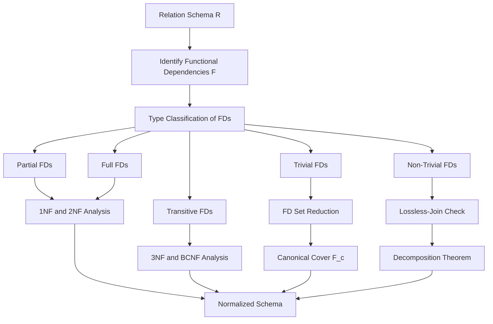
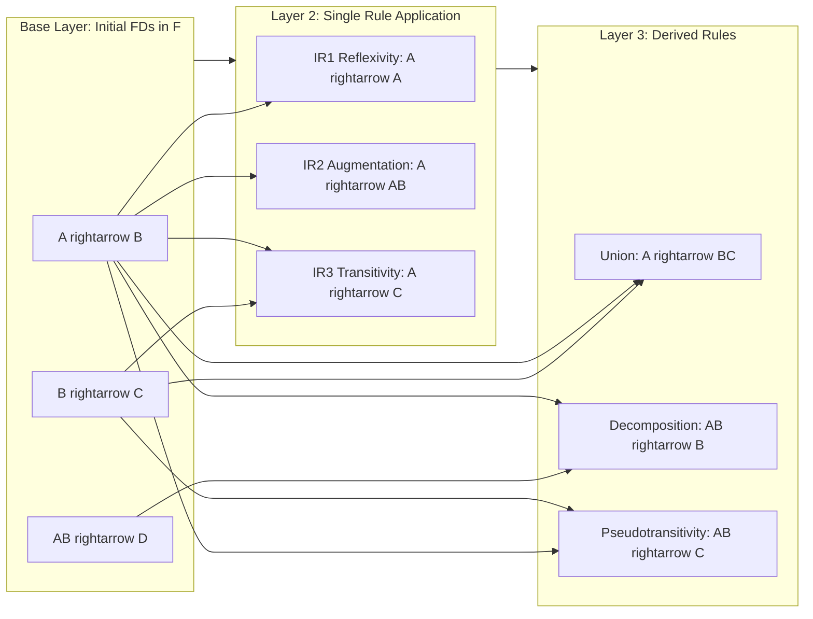
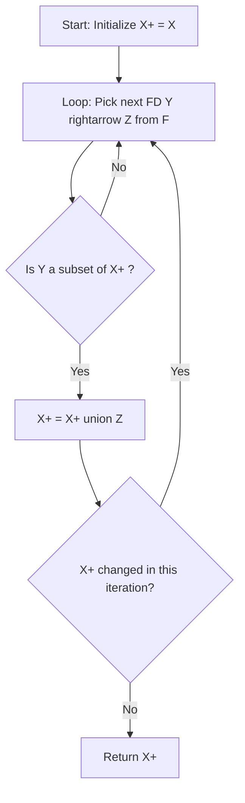

# Basic definition

> **APJ ABDUL KALAM TECHNOLOGICAL UNIVERSITY (KTU) | 2024 SCHEME**
> - **Branch:** B.Tech in Computer Science & Engineering (CSE)
> - **Semester:** Semester 4
> - **Course:** PCCST402 - DATABASE MANAGEMENT SYSTEMS
> - **Module:** Module 3: Database Design Theory & Normalization
> - **Topic:** Basic definition

<!-- SECTION_1_START -->
## 1. Core Technical Definition & Intuitive Overview

### 1.1 Formal Definition of Functional Dependency

A **Functional Dependency (FD)** is a formal constraint between two sets of attributes in a relation of a database. It is a cornerstone concept of relational database design theory and serves as the primary input for normalization, lossless-join decomposition, and dependency preservation analysis.

> [!IMPORTANT]
> **KTU 2024 Syllabus Definition:**
> A functional dependency, denoted by $X \rightarrow Y$, between two sets of attributes $X$ and $Y$ that are subsets of a relation schema $R$, specifies a constraint that for any two tuples $t_1$ and $t_2$ in any valid relation state $r$ of $R$:
>
> $$\text{If } t_1[X] = t_2[X], \text{ then } t_1[Y] = t_2[Y]$$
>
> We say that **$X$ functionally determines $Y$** in $R$, or **$Y$ is functionally dependent on $X$**.

In simpler words: *if you know the value of $X$, the value of $Y$ is automatically fixed (uniquely determined).*

### 1.2 Conceptual Analogy / Intuition

> [!NOTE]
> **Real-World Analogy — The Roll Number Story:**
> Imagine the attendance register of your KTU college. Every student is assigned a unique **University Roll Number (Reg No)**. Once you know the roll number, you can always pinpoint the **student's name, branch, semester, and batch** with zero ambiguity.
>
> - The roll number is the **determinant** ($X$).
> - The student attributes (name, branch) are the **dependent attributes** ($Y$).
> - Therefore, `RegNo → (Name, Branch, Batch)` is a functional dependency.
>
> However, the reverse is **not** true. Two students with the same name (e.g., two "Arjun" entries) does not mean they share the same roll number. Hence, `Name → RegNo` is **NOT** a functional dependency.

### 1.3 Standard Metrics and Boundary Conditions

> [!IMPORTANT]
> **Key Properties of the Determinant and Dependent Sets:**
> - $X$ is called the **Left-Hand Side (LHS)** or **Determinant**.
> - $Y$ is called the **Right-Hand Side (RHS)** or **Dependent** set.
> - $X$ and $Y$ are subsets of the schema $R$, so $X \subseteq R$ and $Y \subseteq R$.
> - $X$ and $Y$ can be **single attributes** or **sets/composite attributes**.
> - The functional dependency is a **property of the relational schema (intension)**, not of a particular instance (extension). It must hold for **all valid states** of the relation.

> [!VISUALIZATION CONTROL]
> **Concept:** Functional Dependency as a one-way mapping function $f: X \mapsto Y$
> **GeoGebra / Desmos Input Equations (Discrete Mapping Diagram):**
> * Set $X = \{R1, R2, R3, R4\}$ on horizontal axis.
> * Set $Y = \{A, B, C, D\}$ on vertical axis.
> * Draw arrows: $R1 \to A$, $R2 \to B$, $R3 \to A$, $R4 \to C$.
> **Visual Description:** Observe that every element of $X$ maps to **exactly one** element of $Y$, but elements of $Y$ may have multiple incoming arrows. The arrows never branch out from a single $X$-value. This unidirectional, one-to-at-most-one relationship is the visual essence of a functional dependency.
<!-- SECTION_1_END -->

<!-- SECTION_2_START -->
## 2. Deep Theoretical Analysis & KTU High-Yield Formula Sheet

### 2.1 Structural Breakdown of the Definition

A functional dependency $X \rightarrow Y$ enforces a **deterministic** relationship. The key logical steps to recognize an FD in any KTU exam problem are:

1. **Identify the universe of attributes ($R$):** List all columns of the relation.
2. **Pick two subsets $X$ and $Y$ of $R$:** These are the candidate LHS and RHS.
3. **Validate the constraint:** For every pair of rows in the table, if their $X$ values are equal, their $Y$ values must also be equal.
4. **Declare $X \rightarrow Y$ as a FD** if the constraint holds across the entire extension.

> [!NOTE]
> **The "Why" — Engineering Motivation:**
> Functional dependencies are not just abstract math; they are used in production-grade DBMS tools to:
> - Perform **automatic schema normalization** (e.g., tools like pgAdmin's normalization advisor).
> - Generate **referential integrity rules** and **CHECK constraints** in SQL.
> - Optimize **query plans** by eliminating redundant joins when the join column is a functional determinant.
> - Drive **ETL pipelines** to detect anomalies during data integration.

### 2.2 Types of Functional Dependencies (HIGH-YIELD for KTU)

The classification of FDs is a frequent 7-14 mark question area. Master the following hierarchy:

#### A. Trivial Functional Dependency
A FD $X \rightarrow Y$ is **trivial** if the dependent set $Y$ is a **subset** of the determinant set $X$.
$$X \rightarrow Y \text{ is trivial} \iff Y \subseteq X$$

*Example:* If $R = (A, B, C)$ and we have $\{A, B\} \rightarrow A$, this is trivial because $A \subseteq \{A, B\}$. Trivial FDs always hold in every relation and carry no design information.

#### B. Non-Trivial Functional Dependency
A FD $X \rightarrow Y$ is **non-trivial** if $Y$ is **not a subset** of $X$.
$$X \rightarrow Y \text{ is non-trivial} \iff Y \not\subseteq X$$

*Example:* $A \rightarrow B$ in $R = (A, B, C)$ is non-trivial because $B \not\subseteq \{A\}$.

#### C. Completely Non-Trivial Functional Dependency
A FD $X \rightarrow Y$ is **completely non-trivial** if $X \cap Y = \emptyset$.
$$X \rightarrow Y \text{ is completely non-trivial} \iff X \cap Y = \emptyset$$

#### D. Partial Functional Dependency
A FD $X \rightarrow Y$ is **partial** (in the context of a candidate key $K$) if a proper subset of $K$ alone can determine $Y$.
$$\exists \, X' \subsetneq X \text{ such that } X' \rightarrow Y$$

*Example:* If $\{A, B\}$ is a candidate key and $A \rightarrow C$, then $C$ is partially dependent on the key.

#### E. Full Functional Dependency
A FD $X \rightarrow Y$ is **full** (in the context of a candidate key $K$) if **no proper subset** of $K$ alone can determine $Y$.
$$\nexists \, X' \subsetneq X \text{ such that } X' \rightarrow Y$$

#### F. Transitive Functional Dependency
A FD chain of the form $X \rightarrow Y$ and $Y \rightarrow Z$ implies $X \rightarrow Z$ (transitively). This is recognized as a **transitive dependency** if $Y$ is neither a candidate key nor a subset of any candidate key.
$$X \rightarrow Y, \quad Y \rightarrow Z \quad \Rightarrow \quad X \rightarrow Z \text{ (transitively)}$$

### 2.3 KTU Formula Sheet / Cheat Sheet

| Notation | Definition | Condition | KTU Use-Case |
|----------|------------|-----------|--------------|
| $X \rightarrow Y$ | Functional Dependency | $X, Y \subseteq R$ | Base definition |
| $X \rightarrow Y$ is **trivial** | RHS $\subseteq$ LHS | $Y \subseteq X$ | Identifying redundant FDs |
| $X \rightarrow Y$ is **non-trivial** | RHS $\not\subseteq$ LHS | $Y \not\subseteq X$ | Normal form checks |
| $X \rightarrow Y$ is **partial** | Proper subset of LHS determines RHS | $\exists X' \subsetneq X : X' \rightarrow Y$ | 2NF violation check |
| $X \rightarrow Y$ is **full** | No proper subset of LHS determines RHS | $\forall X' \subsetneq X : X' \not\rightarrow Y$ | 2NF satisfaction check |
| $X \rightarrow Y$ is **transitive** | Chain via an intermediate attribute | $X \rightarrow Y, Y \rightarrow Z$ | 3NF violation check |
| $X^{+}$ | Attribute closure of $X$ | All attributes functionally determined by $X$ | Finding candidate keys |
| $F^{+}$ | Closure of FD set $F$ | All FDs logically implied by $F$ | Canonical cover derivation |

> [!IMPORTANT]
> **Note on Table Notation:** In the table above, $\subseteq$ denotes "subset of or equal to", and $\subsetneq$ denotes "proper subset of" (strict). $\nexists$ means "there does not exist", and $\forall$ means "for all".

### 2.4 Inference Rules (Armstrong's Axioms) — Foundation for the Rest of Normalization

KTU frequently tests these rules. The basic definitions of FDs derive their power from being able to **infer** new FDs from existing ones.

| Rule | Symbol | Formal Statement | Meaning |
|------|--------|------------------|---------|
| Reflexivity | IR1 | If $Y \subseteq X$, then $X \rightarrow Y$ | Trivial FDs |
| Augmentation | IR2 | If $X \rightarrow Y$, then $XZ \rightarrow YZ$ | Adding common attributes |
| Transitivity | IR3 | If $X \rightarrow Y$ and $Y \rightarrow Z$, then $X \rightarrow Z$ | Chained determination |
| Union | (derived) | If $X \rightarrow Y$ and $X \rightarrow Z$, then $X \rightarrow YZ$ | Combining RHSs |
| Decomposition | (derived) | If $X \rightarrow YZ$, then $X \rightarrow Y$ and $X \rightarrow Z$ | Splitting RHSs |
| Pseudotransitivity | (derived) | If $X \rightarrow Y$ and $WY \rightarrow Z$, then $WX \rightarrow Z$ | Mixed chaining |
<!-- SECTION_2_END -->

<!-- SECTION_3_START -->
## 3. Step-by-Step Derivations & Code/Symbolic Implementation

### 3.1 Mathematical Derivation — Formal Closure of Attributes ($X^{+}$)

> [!NOTE]
> **Problem Setup (Standard KTU 14-Mark Style):**
> Given a relation $R = (A, B, C, D, E, F)$ and a set of functional dependencies:
> $$F = \{ A \rightarrow B, \; A \rightarrow C, \; CD \rightarrow E, \; B \rightarrow D, \; C \rightarrow EF \}$$
> Compute the attribute closure $A^{+}$ with full derivation.

**Step 1: Initialize the closure set.**

$$A^{+} = \{ A \}$$

The initial set contains only the starting attribute $A$, as every attribute trivially determines itself.

**Step 2: Scan FDs for matches. Apply $A \rightarrow B$.**

$$A^{+} = \{ A \} \cup \{ B \} = \{ A, B \}$$

Since $A$ is in $A^{+}$, the dependency $A \rightarrow B$ is applicable. We add $B$ to the closure set.

**Step 3: Apply $A \rightarrow C$.**

$$A^{+} = \{ A, B \} \cup \{ C \} = \{ A, B, C \}$$

Since $A$ is in $A^{+}$, the dependency $A \rightarrow C$ is applicable. We add $C$ to the closure set.

**Step 4: Apply $B \rightarrow D$.**

$$A^{+} = \{ A, B, C \} \cup \{ D \} = \{ A, B, C, D \}$$

Since $B$ is now in $A^{+}$, the dependency $B \rightarrow D$ is applicable. We add $D$ to the closure set.

**Step 5: Check $CD \rightarrow E$.**

$$A^{+} = \{ A, B, C, D \} \cup \{ E \} = \{ A, B, C, D, E \}$$

Since both $C$ and $D$ are now in $A^{+}$, the dependency $CD \rightarrow E$ is applicable. We add $E$ to the closure set.

**Step 6: Check $C \rightarrow EF$.**

$$A^{+} = \{ A, B, C, D, E \} \cup \{ E, F \} = \{ A, B, C, D, E, F \}$$

Since $C$ is in $A^{+}$, the dependency $C \rightarrow EF$ is applicable. We add both $E$ and $F$ to the closure set.

**Step 7: Termination check.**

$$A^{+} = \{ A, B, C, D, E, F \} = R$$

The closure $A^{+}$ equals the entire schema $R$. This means $A$ is a **superkey** of $R$. In fact, since $A$ is a single attribute and $A \rightarrow R$ holds, $A$ is also a **candidate key** (assuming $A$ is a primitive attribute and no subset of $A$ is smaller).

### 3.2 Algorithmic Procedure — Pseudocode for Attribute Closure

The following is the textbook algorithm that KTU expects students to write in the 14-mark questions.

```
ALGORITHM: attr_closure(X, F)
─────────────────────────────────────────
INPUT :  X  - a set of attributes (the starting determinant)
         F  - a set of functional dependencies
OUTPUT:  X+ - the attribute closure of X

BEGIN
    X+ ← X
    REPEAT
        OLD ← X+
        FOR EACH functional dependency Y → Z in F DO
            IF Y ⊆ X+ THEN
                X+ ← X+ ∪ Z
            END IF
        END FOR
    UNTIL (X+ == OLD)
    RETURN X+
END
```

### 3.3 Full Python Implementation — Closure Calculator

Below is a production-quality Python implementation of the attribute closure algorithm, with strict type hints and error handling.

```python
from typing import FrozenSet, Set, Tuple

FD = Tuple[FrozenSet[str], FrozenSet[str]]

def attribute_closure(
    attributes: Set[str],
    fds: Set[FD]
) -> FrozenSet[str]:
    """
    Compute the attribute closure X+ of a set of attributes X
    with respect to a given set of functional dependencies.

    Parameters
    ----------
    attributes : Set[str]
        The starting determinant set X.
    fds : Set[FD]
        The set of functional dependencies F as (LHS, RHS) tuples.

    Returns
    -------
    FrozenSet[str]
        The full closure X+.

    Raises
    ------
    TypeError
        If inputs are of incorrect types.
    ValueError
        If any attribute is empty or the FD set is malformed.
    """
    if not isinstance(attributes, set):
        raise TypeError("attributes must be of type set[str]")
    if not isinstance(fds, set):
        raise TypeError("fds must be of type set[FD]")

    closure: Set[str] = set(attributes)

    while True:
        previous_closure: Set[str] = set(closure)
        for lhs, rhs in fds:
            if lhs.issubset(closure):
                closure.update(rhs)
        if closure == previous_closure:
            break

    return frozenset(closure)


def is_superkey(
    attributes: Set[str],
    fds: Set[FD],
    schema: Set[str]
) -> bool:
    """
    Check whether a given set of attributes forms a superkey
    of the schema R with respect to F.
    """
    return attribute_closure(attributes, fds) == frozenset(schema)


def find_candidate_keys(
    schema: Set[str],
    fds: Set[FD]
) -> Set[FrozenSet[str]]:
    """
    Brute-force discovery of all candidate keys.
    (Used here for verification; KTU students should know the
    systematic single-attribute loop approach too.)
    """
    from itertools import combinations
    candidate_keys: Set[FrozenSet[str]] = set()
    attrs = list(schema)
    for r in range(1, len(attrs) + 1):
        for combo in combinations(attrs, r):
            combo_set = set(combo)
            if is_superkey(combo_set, fds, schema):
                combo_frozen = frozenset(combo_set)
                is_minimal = True
                for key in candidate_keys:
                    if key.issubset(combo_frozen) and key != combo_frozen:
                        is_minimal = False
                        break
                if is_minimal:
                    candidate_keys.add(combo_frozen)
    return candidate_keys


if __name__ == "__main__":
    R = {"A", "B", "C", "D", "E", "F"}
    F = {
        (frozenset({"A"}), frozenset({"B"})),
        (frozenset({"A"}), frozenset({"C"})),
        (frozenset({"C", "D"}), frozenset({"E"})),
        (frozenset({"B"}), frozenset({"D"})),
        (frozenset({"C"}), frozenset({"E", "F"})),
    }

    a_plus = attribute_closure({"A"}, F)
    print(f"A+ = {set(a_plus)}")
    print(f"Is A a superkey? {is_superkey({'A'}, F, R)}")
    print(f"All candidate keys: {[set(k) for k in find_candidate_keys(R, F)]}")
```

**Expected Output of the Python Program:**

$$A^{+} = \{ A, B, C, D, E, F \}$$
$$\text{Is A a superkey? True}$$
$$\text{All candidate keys: } [\{A\}]$$

### 3.4 Derivation — Identifying the Type of FD from a Given Table

> [!NOTE]
> **Worked Example (Typical 7-Mark Sub-Question):**
> Given the relation `STUDENT(RegNo, Name, Branch, CPI, CourseID, CourseName, Grade)` and the following instance:
>
> | RegNo | Name | Branch | CPI | CourseID | CourseName | Grade |
> |-------|------|--------|-----|----------|------------|-------|
> | KTU001 | Arjun | CSE | 8.9 | CS401 | DBMS | A |
> | KTU001 | Arjun | CSE | 8.9 | CS402 | OS | B+ |
> | KTU002 | Meera | CSE | 9.2 | CS401 | DBMS | S |
>
> Identify at least **three** functional dependencies. For each, classify it as trivial, non-trivial, partial, or transitive.

**Solution Derivation:**

1. **FD1:** `RegNo → Name`
   - Check: All KTU001 rows have the same Name "Arjun". ✓
   - Classification: **Non-trivial** (Name $\not\subseteq$ \{RegNo\}).

2. **FD2:** `RegNo, CourseID → Grade`
   - Check: For (KTU001, CS401) the grade is A; unique pair. ✓
   - Classification: **Non-trivial** and **Full FD** (no single attribute of \{RegNo, CourseID\} alone determines Grade).

3. **FD3:** `CourseID → CourseName`
   - Check: CS401 always maps to DBMS. ✓
   - Classification: **Non-trivial**.

4. **FD4:** `RegNo, CourseID → CourseName`
   - Check: Holds because of FD2 and FD3. ✓
   - Classification: **Non-trivial** but **Partial FD** because `CourseID → CourseName` already holds on its own. This is a classic **2NF violation** indicator that students must flag.
<!-- SECTION_3_END -->

<!-- SECTION_4_START -->
## 4. Structural Diagrams & Schematics

### 4.1 High-Level Concept Map — FD as the Gateway to Normalization

This diagram visualizes how a basic functional dependency definition flows into the entire normalization pipeline.



### 4.2 Sequential Processing Topology — Armstrong's Axioms in Action

The following block diagram captures the logical sequence of how Armstrong's inference rules (IR1, IR2, IR3) chain together to derive new functional dependencies from the base set $F$.



### 4.3 Architecture Flow — Attribute Closure Algorithm Pipeline



> [!NOTE]
> **Reading the Diagram:** The pipeline above mirrors the pseudocode in Section 3.2 exactly. The decision diamond `Y subset of X+` is the heart of the algorithm — it is the formal embodiment of "can we apply this FD right now?"
<!-- SECTION_4_END -->

<!-- SECTION_5_START -->
## 5. KTU 2024 Scheme Examination Question Bank & Topic Recap

### 5.1 Part A — Short Answer Questions (3 Marks Each)

> **Q1. [KTU University Exam — July 2024 Style]**
> **Define functional dependency. Explain trivial and non-trivial functional dependencies with suitable examples.**
> *(Mapped CO: CO3, RBT Level: Remember / Understand)*

**Model Answer (3 Marks):**
A functional dependency $X \rightarrow Y$ is a constraint between two sets of attributes $X$ and $Y$ in a relation schema $R$ such that for any two tuples $t_1$ and $t_2$, if $t_1[X] = t_2[X]$, then $t_1[Y] = t_2[Y]$. It specifies that $X$ functionally determines $Y$. **[1 Mark]**
A FD is **trivial** if $Y \subseteq X$. Example: In $R = (A, B, C)$, $AB \rightarrow A$ is trivial because $A \subseteq AB$. **[1 Mark]**
A FD is **non-trivial** if $Y \not\subseteq X$. Example: In the same $R$, $A \rightarrow B$ is non-trivial because $B \not\subseteq \{A\}$. **[1 Mark]**

> **Q2. [KTU University Exam — Dec 2023 Style]**
> **What is attribute closure? How is it used in testing whether a set of attributes is a superkey?**
> *(Mapped CO: CO3, RBT Level: Understand)*

**Model Answer (3 Marks):**
The attribute closure of a set of attributes $X$ with respect to a set of FDs $F$, denoted $X^{+}$, is the set of all attributes functionally determined by $X$ under $F$. **[1 Mark]**
To compute it, we iteratively add the RHS of any FD whose LHS is already contained in $X^{+}$, until no new attribute can be added. **[1 Mark]**
To test if $X$ is a superkey, we compute $X^{+}$ and check whether $X^{+} = R$ (the full schema). If yes, $X$ is a superkey; if no proper subset of $X$ is also a superkey, then $X$ is a candidate key. **[1 Mark]**

---

### 5.2 Part B — Long Answer Questions (14 Marks Each, with Internal Choice)

> **Q3. [KTU University Exam — July 2024 Style]**
> **(a)** With a suitable example, explain the concept of a **functional dependency**. Distinguish clearly between **trivial**, **non-trivial**, **partial**, and **transitive** functional dependencies. Mention the role of FDs in normalization.
> **[7 Marks]** *(Mapped CO: CO3, RBT Level: Understand)*

> **(b)** Given a relation $R = (A, B, C, D, E, G, H)$ and the set of FDs $F = \{A \rightarrow B, \; A \rightarrow C, \; CG \rightarrow H, \; CG \rightarrow D, \; B \rightarrow D, \; D \rightarrow E\}$. Compute the closure of the following sets and hence identify candidate keys:
> 1. $A^{+}$
> 2. $(AG)^{+}$
> 3. $(BG)^{+}$
>
> **[7 Marks]** *(Mapped CO: CO3, RBT Level: Apply)*

---

**Model Solution for Q3(a) — 7 Marks:**

A **functional dependency** $X \rightarrow Y$ is a constraint asserting that in any relation $r$ of schema $R$, two tuples sharing the same $X$-value must also share the same $Y$-value. Formally, $\forall t_1, t_2 \in r$, if $t_1[X] = t_2[X]$ then $t_1[Y] = t_2[Y]$. **[1 Mark — Stating the formal definition]**
Example: In `STUDENT(RegNo, Name)`, `RegNo → Name` because the roll number uniquely fixes the student name. **[0.5 Mark — Example]**

- **Trivial FD:** $Y \subseteq X$. Example: $\{A, B\} \rightarrow A$. Always holds; carries no information. **[1 Mark]**
- **Non-Trivial FD:** $Y \not\subseteq X$. Example: $A \rightarrow B$ in $R = (A, B, C)$. Holds only if business rules enforce it. **[1 Mark]**
- **Partial FD:** A proper subset of a candidate key alone determines a non-prime attribute. Example: In a relation with candidate key $(A, B)$, if $A \rightarrow C$, then $C$ is partially dependent. Violates 2NF. **[1 Mark]**
- **Transitive FD:** When $X \rightarrow Y$ and $Y \rightarrow Z$ (with $Y$ not a candidate key), then $X \rightarrow Z$ transitively. Violates 3NF. **[1 Mark]**
- **Role in Normalization:** FDs are the formal input to all normal form tests (1NF, 2NF, 3NF, BCNF), and they guide lossless-join decompositions. **[1.5 Marks]**

---

**Model Solution for Q3(b) — 7 Marks:**

Given $R = (A, B, C, D, E, G, H)$ and $F = \{A \rightarrow B, \; A \rightarrow C, \; CG \rightarrow H, \; CG \rightarrow D, \; B \rightarrow D, \; D \rightarrow E\}$.

**1. Computation of $A^{+}$:**

$$A^{+} = \{ A \} \quad \text{[0.5 Mark]}$$

Apply $A \rightarrow B$: $A^{+} = \{ A, B \}$ **[0.5 Mark]**
Apply $A \rightarrow C$: $A^{+} = \{ A, B, C \}$ **[0.5 Mark]**
Apply $B \rightarrow D$: $A^{+} = \{ A, B, C, D \}$ **[0.5 Mark]**
Apply $D \rightarrow E$: $A^{+} = \{ A, B, C, D, E \}$ **[0.5 Mark]**

No further FDs are applicable. $G$ and $H$ are not in $A^{+}$.

$$A^{+} = \{ A, B, C, D, E \} \neq R$$

**Conclusion:** $A$ is **NOT** a superkey. **[0.5 Mark]**

**2. Computation of $(AG)^{+}$:**

$$(AG)^{+} = \{ A, G \} \quad \text{[0.25 Mark]}$$

Apply $A \rightarrow B, A \rightarrow C$: $(AG)^{+} = \{ A, G, B, C \}$ **[0.5 Mark]**
Apply $CG \rightarrow H$: $(AG)^{+} = \{ A, G, B, C, H \}$ **[0.5 Mark]**
Apply $CG \rightarrow D$: $(AG)^{+} = \{ A, G, B, C, H, D \}$ **[0.5 Mark]**
Apply $B \rightarrow D$: already have $D$. Apply $D \rightarrow E$: $(AG)^{+} = \{ A, G, B, C, H, D, E \}$ **[0.5 Mark]**

$$(AG)^{+} = R$$

**Conclusion:** $AG$ is a **superkey**. Since neither $A$ alone nor $G$ alone is a superkey, $AG$ is a **candidate key**. **[0.75 Mark]**

**3. Computation of $(BG)^{+}$:**

$$(BG)^{+} = \{ B, G \} \quad \text{[0.25 Mark]}$$

Apply $B \rightarrow D$: $(BG)^{+} = \{ B, G, D \}$ **[0.5 Mark]**
Apply $D \rightarrow E$: $(BG)^{+} = \{ B, G, D, E \}$ **[0.5 Mark]**
No further FDs can be applied since we lack $A$ (to fire $A \rightarrow B, A \rightarrow C$) and $C$ (to fire $CG \rightarrow \cdot$).

$$(BG)^{+} = \{ B, G, D, E \} \neq R$$

**Conclusion:** $BG$ is **NOT** a superkey. **[0.5 Mark]**

---

> **Q4. [KTU University Exam — Dec 2023 Style — Internal Choice Alternative]**
> **(a)** Define **attribute closure** and **FD closure**. State and prove **Armstrong's inference rules** (Reflexivity, Augmentation, Transitivity). Show how the secondary rules (Union, Decomposition, Pseudotransitivity) are derived from the primary rules.
> **[7 Marks]** *(Mapped CO: CO3, RBT Level: Understand / Apply)*

> **(b)** Consider $R = \{A, B, C, D, E\}$ with $F = \{A \rightarrow BC, \; B \rightarrow D, \; CD \rightarrow E\}$. Find a **canonical cover** $F_c$ of $F$ using the standard three-step algorithm.
> **[7 Marks]** *(Mapped CO: CO3, RBT Level: Apply)*

---

**Model Solution for Q4(a) — 7 Marks:**

**Attribute closure $X^{+}$:** The set of all attributes that can be functionally determined from $X$ using FDs in $F$. **[0.5 Mark]**
**FD closure $F^{+}$:** The set of all FDs that can be inferred from $F$ using Armstrong's axioms. **[0.5 Mark]**

**IR1 — Reflexivity:** If $Y \subseteq X$, then $X \rightarrow Y$. *Proof:* If two tuples agree on all attributes of $X$, they agree on every subset $Y$ of $X$, hence on $Y$. **[1 Mark]**

**IR2 — Augmentation:** If $X \rightarrow Y$, then $XZ \rightarrow YZ$ for any $Z$. *Proof:* If two tuples agree on $XZ$, they agree on $X$, hence on $Y$ by hypothesis, and on $Z$ by definition; therefore they agree on $YZ$. **[1 Mark]**

**IR3 — Transitivity:** If $X \rightarrow Y$ and $Y \rightarrow Z$, then $X \rightarrow Z$. *Proof:* If two tuples agree on $X$, they agree on $Y$ (by the first FD), and if they agree on $Y$, they agree on $Z$ (by the second FD). Hence they agree on $Z$. **[1 Mark]**

**Derived Rules:**

- **Union:** $X \rightarrow Y$ and $X \rightarrow Z$ implies $X \rightarrow YZ$. *Derivation:* $X \rightarrow Y$ (given); $X \rightarrow Z$ (given); $X \rightarrow XY$ (augment with $X$); $XY \rightarrow YZ$ (augment with $Y$); $X \rightarrow YZ$ (transitivity). **[1 Mark]**
- **Decomposition:** $X \rightarrow YZ$ implies $X \rightarrow Y$ and $X \rightarrow Z$. *Derivation:* $Y \subseteq YZ$; $X \rightarrow YZ$ (given); $YZ \rightarrow Y$ (reflexivity); $X \rightarrow Y$ (transitivity). Similarly for $Z$. **[1 Mark]**
- **Pseudotransitivity:** $X \rightarrow Y$ and $WY \rightarrow Z$ implies $WX \rightarrow Z$. *Derivation:* $WX \rightarrow WY$ (augmentation); $WY \rightarrow Z$ (given); $WX \rightarrow Z$ (transitivity). **[1 Mark]**

---

**Model Solution for Q4(b) — 7 Marks:**

**Step 1: Make RHS singleton (Decomposition rule).** **[0.5 Mark]**

Original $F = \{A \rightarrow BC, \; B \rightarrow D, \; CD \rightarrow E\}$.
Apply decomposition to $A \rightarrow BC$:

$$F' = \{ A \rightarrow B, \; A \rightarrow C, \; B \rightarrow D, \; CD \rightarrow E \}$$

**Step 2: Remove redundant LHS attributes.** **[0.5 Mark]**

Check $A \rightarrow B$ and $A \rightarrow C$: LHS is a single attribute, so no LHS attribute can be removed. **[0.5 Mark]**
Check $B \rightarrow D$: LHS is a single attribute. No LHS removal possible. **[0.5 Mark]**
Check $CD \rightarrow E$: try removing $C$ — does $D$ alone imply $E$? No, since $D$ is not on the LHS of any FD that determines $E$. Try removing $D$ — does $C$ alone imply $E$? No, since $C$ is not on the LHS of any FD that determines $E$. So $CD$ is minimal. **[1 Mark]**

Result: $F'' = F' = \{A \rightarrow B, \; A \rightarrow C, \; B \rightarrow D, \; CD \rightarrow E\}$.

**Step 3: Remove redundant FDs.** **[0.5 Mark]**

Test each FD: can the RHS be obtained from the others?

- Can we get $A \rightarrow B$ without itself? Test $A$ on remaining $\{A \rightarrow C, B \rightarrow D, CD \rightarrow E\}$: $A^{+} = \{A, C\}$, which does not contain $B$. So $A \rightarrow B$ is **not redundant**. **[0.75 Mark]**
- Can we get $A \rightarrow C$ without itself? Test $A$ on remaining $\{A \rightarrow B, B \rightarrow D, CD \rightarrow E\}$: $A^{+} = \{A, B, D, E\}$, which does not contain $C$. So $A \rightarrow C$ is **not redundant**. **[0.75 Mark]**
- Can we get $B \rightarrow D$ without itself? Test $B$ on remaining $\{A \rightarrow B, A \rightarrow C, CD \rightarrow E\}$: $B^{+} = \{B\}$, which does not contain $D$. So $B \rightarrow D$ is **not redundant**. **[0.75 Mark]**
- Can we get $CD \rightarrow E$ without itself? Test $CD$ on remaining $\{A \rightarrow B, A \rightarrow C, B \rightarrow D\}$: $C^{+} = \{C\}$, $D^{+} = \{D\}$, but $CD$ together does not fire any FD because no LHS is contained in $\{C, D\}$. So $CD \rightarrow E$ is **not redundant**. **[0.75 Mark]**

**Final Canonical Cover:**

$$\boxed{F_c = \{ A \rightarrow B, \; A \rightarrow C, \; B \rightarrow D, \; CD \rightarrow E \}}$$

**[0.5 Mark for the boxed final answer]**

---

### 5.3 KTU Examiner's Valuation Warning / Pitfall Callout

> [!WARNING]
> **Common Mark-Deduction Pitfalls in FD Basic Definition Questions:**
> 1. **Skipping the formal definition:** A 7-mark question on "Define FD" requires the formal $t_1[X] = t_2[X] \Rightarrow t_1[Y] = t_2[Y]$ statement. Writing only the plain-English version costs you at least **2 marks**.
> 2. **Confusing trivial with non-trivial:** Many students write "trivial = no useful information" and lose the **1 mark** reserved for stating $Y \subseteq X$ as the precise condition.
> 3. **Forgetting the iteration loop in attribute closure:** The algorithm requires **repeated passes** until a fixed point is reached. Stopping after one iteration is a **1.5 mark** deduction in 14-mark problems.
> 4. **Not justifying closure steps with the specific FD applied:** Examiners want you to write "Apply $A \rightarrow B$" as a labeled step. Writing the closure set evolution without naming the rule costs **0.5 mark per step**.
> 5. **Misclassifying partial vs transitive:** A partial FD requires the LHS to contain a **proper subset** that alone determines the RHS. A transitive FD is about an **intermediate attribute** that is not a key. Mixing these classifications is a **1–2 mark** penalty.
> 6. **Skipping the "candidate key" check:** After finding a superkey, students must verify that no proper subset is also a superkey, otherwise the answer is incomplete. This costs **0.5–1 mark**.

### 5.4 Topic Recap & Important Things to Remember

- A **functional dependency** $X \rightarrow Y$ is a constraint that if two tuples agree on $X$, they must agree on $Y$. It is a **schema-level (intension)** property.
- The notation $X \rightarrow Y$ reads as "**$X$ determines $Y$**" or "**$Y$ is functionally dependent on $X$**".
- A FD is **trivial** if $Y \subseteq X$; **non-trivial** if $Y \not\subseteq X$; **completely non-trivial** if $X \cap Y = \emptyset$.
- A FD is **partial** when a proper subset of the LHS (typically a candidate key) alone can determine the RHS — this is the **2NF violation** signature.
- A FD is **full** when no proper subset of the LHS can determine the RHS — the **2NF satisfaction** signature.
- A FD is **transitive** when there is a chain $X \rightarrow Y \rightarrow Z$ where $Y$ is not a candidate key — the **3NF violation** signature.
- The **attribute closure** $X^{+}$ is computed by iteratively adding RHS of FDs whose LHS is already contained in the current closure, until a fixed point.
- The **FD closure** $F^{+}$ is the set of all FDs logically implied by $F$ via **Armstrong's axioms** (Reflexivity, Augmentation, Transitivity) and derived rules (Union, Decomposition, Pseudotransitivity).
- $X$ is a **superkey** iff $X^{+} = R$. $X$ is a **candidate key** iff $X$ is a minimal superkey.
- The **canonical cover** $F_c$ is a minimal, equivalent set of FDs with singleton RHS and no redundant FDs or LHS attributes.
- Functional dependencies are the **primary input** to all normal form tests (1NF, 2NF, 3NF, BCNF) and to **lossless-join decomposition** algorithms.
<!-- SECTION_5_END -->
