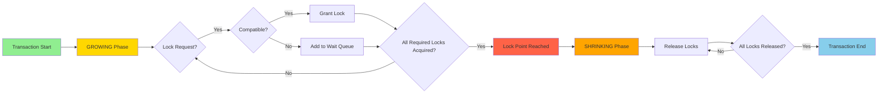
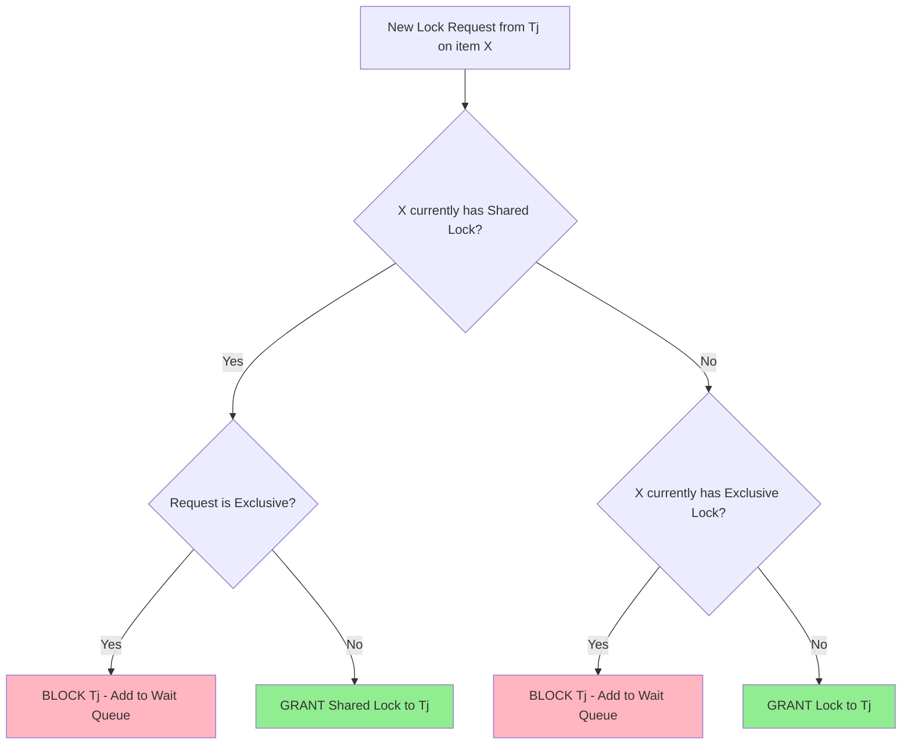
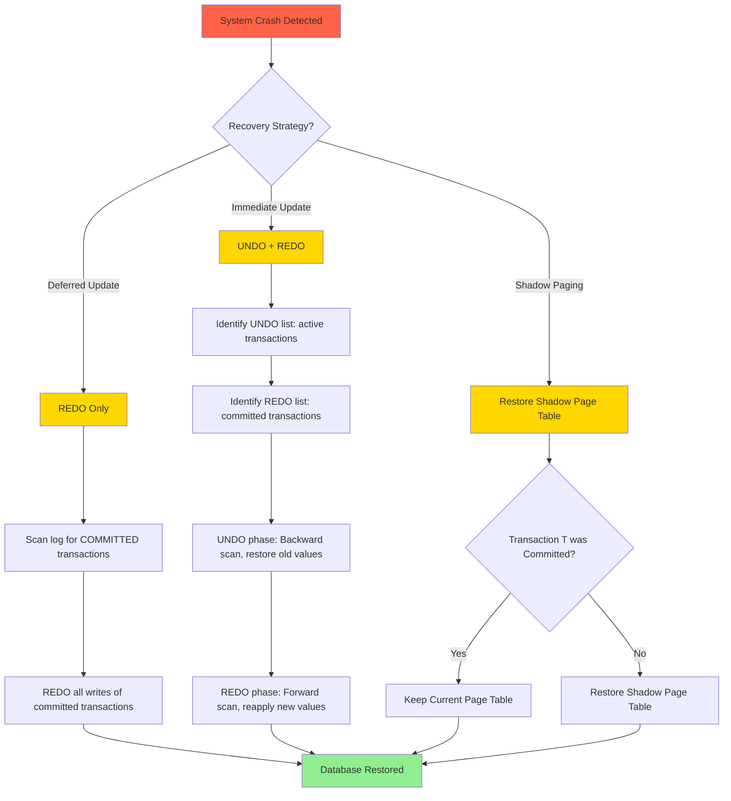
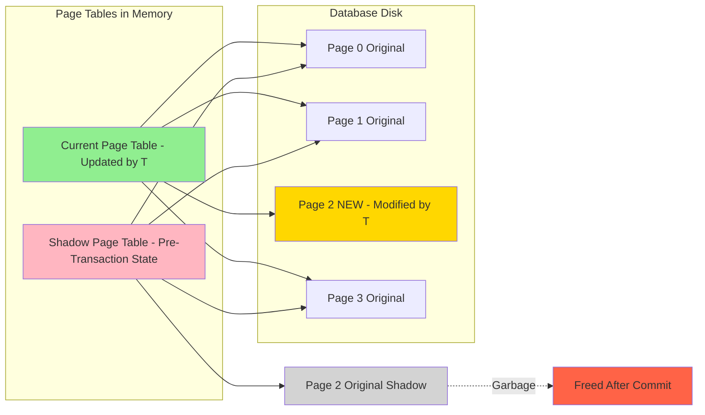
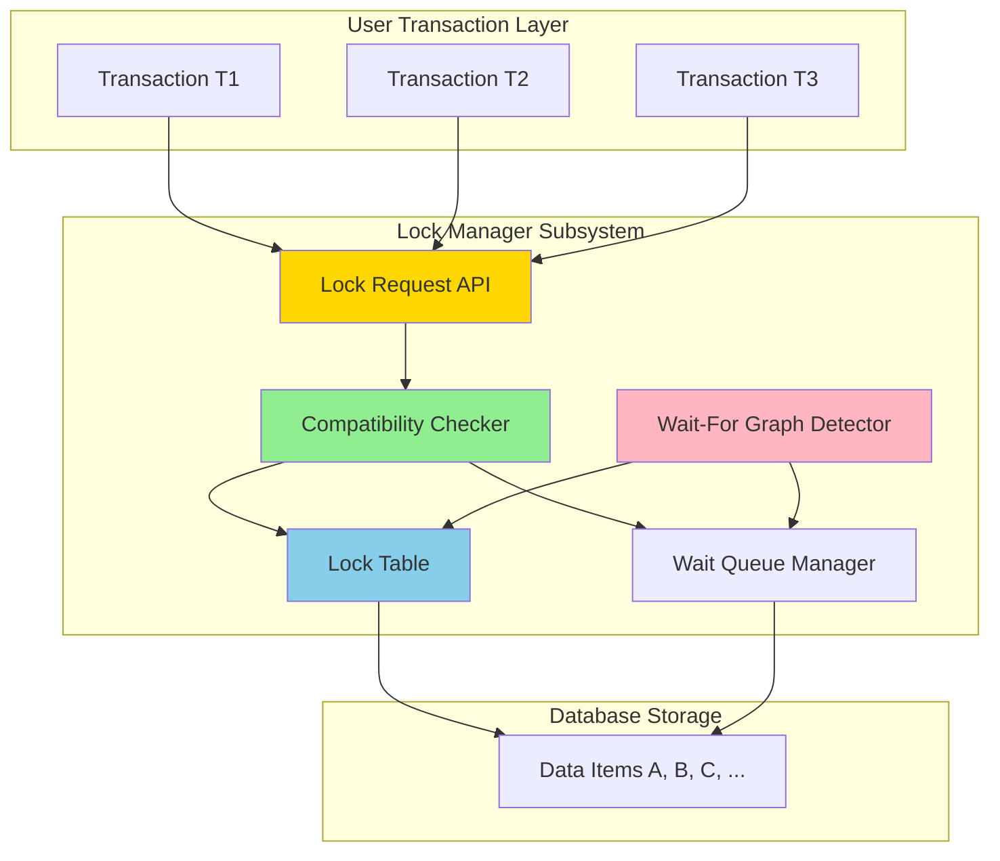
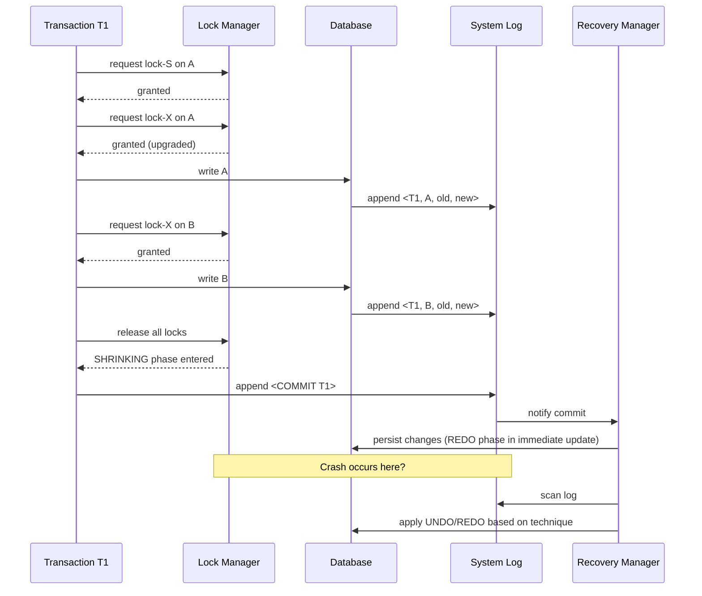
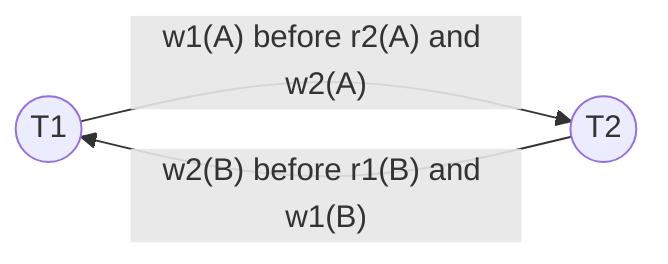

# Concurrency Control with Two-Phase Locking Techniques- Database Recovery management: Deferred update-immediate update- shadow paging.

<!-- SECTION_1_START -->
# MODULE 3: CONCURRENCY CONTROL & RECOVERY MANAGEMENT

## 1. Concurrency Control with Two-Phase Locking (2PL)

### 1.1 Formal Definition
**Concurrency Control** is the activity of coordinating concurrent accesses to a shared database in a multi-user environment such that the integrity of the database is preserved. The **Two-Phase Locking (2PL) Protocol** is a serializability-preserving concurrency control mechanism that guarantees conflict-serializable schedules by enforcing a structured rule on how transactions acquire and release locks.

> [!IMPORTANT]
> **KTU Syllabus Highlight (2024 Scheme):** A transaction following the 2PL protocol is guaranteed to be **conflict-serializable**, but it is **NOT** guaranteed to be free from **deadlocks** and **cascading rollbacks**. This is a high-frequency 2-mark question.

### 1.2 Intuitive Analogy — The Washroom Key System
Imagine a shared office washroom with a single key. To ensure fairness:
- **Growing Phase:** An employee who picks up the key (acquires a lock) may invite other colleagues inside the washroom (acquire more shared locks), but **cannot return the key** until the work is fully done.
- **Shrinking Phase:** Once the key is returned (first unlock), the employee **cannot pick it up again** (no new locks allowed), but other employees waiting outside can now use it.

The key insight: *You cannot acquire a new lock after releasing any existing lock.* This is the heart of 2PL.

### 1.3 Lock Types Used in 2PL
| Lock Type | Symbol | Compatibility | Used For |
|---|---|---|---|
| **Shared Lock (Read Lock)** | $S$ or $r$ | Multiple $S$ locks allowed on same item | Read-only operations: `SELECT` |
| **Exclusive Lock (Write Lock)** | $X$ or $w$ | Incompatible with all other locks | Read + Write: `UPDATE`, `DELETE`, `INSERT` |

> [!NOTE]
> **Lock Compatibility Matrix (M):**
> $$\begin{array}{|c|c|c|}
\hline
\text{Current Held Lock} & \text{Requested } S & \text{Requested } X \\
\hline
S & \text{TRUE} & \text{FALSE} \\
\hline
X & \text{FALSE} & \text{FALSE} \\
\hline
\end{array}$$

> [!VISUALIZATION CONTROL]
> **Concept:** Lock Compatibility Heatmap
> **Input Matrix (paste in GeoGebra):** `M = {{1, 1, 0}, {1, 1, 0}, {0, 0, 0}}` (rows/columns: None, S, X)
> **Visual Description:** A 3x3 grid where 1 = green (compatible) and 0 = red (conflict). Students should observe the diagonal $X$ row and $X$ column being completely blocked.

---

## 2. Database Recovery Management

### 2.1 Formal Definition
**Database Recovery** is the process of restoring the database to a **consistent state** after a failure (system crash, transaction error, disk failure, etc.). Recovery is built on the **ACID properties**, particularly **Atomicity** and **Durability**. Three classical recovery techniques are mandated by the KTU 2024 syllabus:

1. **Deferred Update (NO-UNDO/REDO)** — All updates are written to the log first and applied to the database only after the transaction commits.
2. **Immediate Update (UNDO/REDO)** — Updates are written to the database *before* commit, requiring both undo and redo operations.
3. **Shadow Paging (NO-UNDO/NO-REDO)** — A shadow copy of the database page table is maintained; updates modify a current page table, and the shadow is kept for recovery.

### 2.2 Intuitive Analogy — The Photographer's Workflow
- **Deferred Update:** A photographer takes pictures but only *develops the film after* the client confirms the shoot was successful. If the shoot is cancelled (transaction aborts), no development work is wasted.
- **Immediate Update:** The photographer uploads each frame to the cloud *immediately* after clicking. If the client cancels mid-shoot, uploaded frames must be deleted (undo), and uploaded committed frames must be redone (redo).
- **Shadow Paging:** The photographer keeps a *duplicate memory card* (shadow). All edits happen on the working card. If anything goes wrong, swap back the original shadow card instantly.

> [!IMPORTANT]
> **Log-Based Recovery Foundation:** All three techniques rely on a **System Log** containing records: $\langle \text{Transaction ID, Data Item, Old Value, New Value} \rangle$ and markers $\langle \text{COMMIT } T_i \rangle$ or $\langle \text{ABORT } T_i \rangle$.

> [!NOTE]
> **KTU Board Tip:** Memorize the acronyms:
> - **Deferred Update** $\Rightarrow$ **NO-UNDO / REDO**
> - **Immediate Update** $\Rightarrow$ **UNDO / REDO**
> - **Shadow Paging** $\Rightarrow$ **NO-UNDO / NO-REDO**
>
> These mappings are asked almost every semester as a direct 2-mark definition.

<!-- SECTION_1_END -->

<!-- SECTION_2_START -->
# DEEP THEORETICAL ANALYSIS & KTU HIGH-YIELD FORMULA SHEET

## 1. The Two-Phase Locking (2PL) Protocol — Structured Logic

The 2PL protocol divides the execution of every transaction $T_i$ into **two distinct and consecutive phases**:

### Phase 1: The Growing Phase
- The transaction may **acquire** locks on data items.
- The transaction may **NOT release** any lock.
- Once any lock is released, the transaction cannot acquire any more locks.

### Phase 2: The Shrinking Phase
- The transaction may **release** locks.
- The transaction may **NOT acquire** any new lock.
- Once a lock is released, the transaction enters this phase permanently.

Mathematically, for transaction $T_i$ with lock points $L_1, L_2, \ldots, L_n$ and unlock points $U_1, U_2, \ldots, U_m$:

$$\forall \text{ locks } L_k \text{ and unlocks } U_j, \quad \text{time}(L_k) < \text{time}(U_j) \text{ for all } k, j$$

> [!NOTE]
> **Lock Point:** The instant in time when a transaction acquires its **final (last) lock**. After the lock point, the transaction is locked in the shrinking phase.

### 1.1 Variants of 2PL (High-Yield for KTU)

| Variant | Behavior | Prevents Deadlock? | Cascading Rollback? | KTU Frequency |
|---|---|---|---|---|
| **Basic 2PL** | Acquires all locks, then releases all | No | Possible | High |
| **Conservative 2PL (Static 2PL)** | Acquires **all** locks *before* any execution begins | **Yes** | **No** | Medium |
| **Strict 2PL** | Holds all **exclusive (X) locks** until commit/abort | No | **No** | High |
| **Rigorous 2PL** | Holds **all** locks (S and X) until commit/abort | No | **No** | Medium |

> [!IMPORTANT]
> **Why Strict 2PL is Industry-Standard:** Most commercial DBMS (Oracle, MySQL InnoDB, PostgreSQL) use **Strict 2PL** because it guarantees:
> 1. **Recoverability** — committed transactions have all their write locks held until commit.
> 2. **No cascading rollbacks** — other transactions cannot read uncommitted data.
> 3. **Schedules are strict**, which is a stronger property than conflict-serializable.

### 1.2 Lock Manager Architecture
The **Lock Manager** is a subsystem that maintains a **Lock Table** with the following fields:

$$\text{LockTable} = \{ \text{DataItem}, \text{TransactionID}, \text{LockType}, \text{WaitQueue} \}$$

**Decision Logic:**
```
If requested lock is compatible with all currently held locks on the item:
    Grant the lock to the requesting transaction
Else:
    Add the transaction to the wait queue for that data item
```

### 1.3 The 2PL Deadlock Problem
Consider transactions $T_1$ and $T_2$ on items $A$ and $B$:
- $T_1$: `lock-S(A)` → `lock-X(B)` → ... → `unlock(A)` → `unlock(B)`
- $T_2$: `lock-S(B)` → `lock-X(A)` → ... → `unlock(B)` → `unlock(A)`

Both transactions hold one lock and wait for the other $\Rightarrow$ **Deadlock**.

> [!NOTE]
> **Deadlock Handling Strategies:**
> 1. **Prevention:** Conservative 2PL, timestamp ordering, wait-die, wound-wait.
> 2. **Detection:** Wait-for graph cycle detection (periodically invoked).
> 3. **Recovery:** Abort one of the deadlocked transactions (the *victim*) and restart.

---

## 2. Recovery Techniques — Deep Dive

### 2.1 Deferred Update Technique (NO-UNDO / REDO)

**Working Principle:**
- Updates are **deferred** (postponed) until the transaction **partially commits** (i.e., reaches the COMMIT point).
- All write operations are first recorded in the **stable log** on disk.
- The actual database is updated **only after** the COMMIT record is successfully written to the log.

**At Recovery Time:**
- **Scan the log** from the beginning.
- Identify all transactions $T_i$ with both $\langle \text{START } T_i \rangle$ and $\langle \text{COMMIT } T_i \rangle$ records.
- **REDO** all write operations of these committed transactions.
- **No UNDO** is needed because uncommitted transactions never modified the database.

**Algorithm: REDO Procedure**
```
REDO():
    For each log record of the form <Ti, X, V1, V2>:
        If <COMMIT Ti> exists in the log:
            Write V2 to the database for data item X
```

> [!IMPORTANT]
> **Advantage:** No UNDO logic $\Rightarrow$ simpler implementation.
> **Disadvantage:** High overhead of keeping the entire log for all updates until commit; the database is never current with active transactions.

### 2.2 Immediate Update Technique (UNDO / REDO)

**Working Principle:**
- Updates are written to the database **as soon as possible** (before commit).
- Both old values (for UNDO) and new values (for REDO) are recorded in the log.
- On commit, the transaction's updates are **already in the database** and the log contains the COMMIT record.

**At Recovery Time:**
- **UNDO** all writes of transactions that did **not** commit.
- **REDO** all writes of transactions that **did** commit.

**Algorithm: Combined UNDO/REDO Procedure**
```
RECOVERY(log):
    Set UNDO_List = all active (uncommitted) transactions
    Set REDO_List = all committed transactions

    // Phase 1: UNDO (backwards from end of log)
    While UNDO_List is not empty:
        Pick the most recent log record <Ti, X, V1, V2>
        If Ti is in UNDO_List:
            Write V1 (old value) back to X
            If <START Ti> is reached, remove Ti from UNDO_List
        Else:
            Ignore the record

    // Phase 2: REDO (forwards from beginning of log)
    For each log record of committed transactions:
        Apply V2 to the database
```

> [!IMPORTANT]
> **Checkpoint Mechanism:** The DBMS periodically writes a **checkpoint** record. At recovery, only log records **after the last checkpoint** need to be analyzed. This dramatically reduces recovery time — a key KTU 14-mark question.

### 2.3 Shadow Paging Technique (NO-UNDO / NO-REDO)

**Working Principle:**
- The database is organized as a collection of **fixed-size pages**.
- A **page table** (directory) maps logical page numbers to physical disk addresses.
- When a transaction $T_i$ starts, the **current page table** is copied to create a **shadow page table**.
- All updates by $T_i$ modify the **current page table** (and create new shadow pages on disk).
- On commit, the shadow page table is discarded and the current table becomes the new master.

**At Recovery Time:**
- If $T_i$ commits $\Rightarrow$ current page table persists.
- If $T_i$ aborts $\Rightarrow$ the **shadow page table** is restored, and uncommitted pages are discarded.
- **NO-UNDO** (we just restore the shadow) and **NO-REDO** (committed changes are already in current pages).

> [!NOTE]
> **Disadvantage:** Page table must be large; committing requires flushing the entire current page table to a stable location, which is **expensive** for large databases. Modern systems rarely use pure shadow paging but use it in hybrid forms (e.g., **WAL — Write-Ahead Logging** in PostgreSQL).

---

## 3. KTU High-Yield Formula & Concept Sheet

| Concept | Symbol / Rule | KTU Significance |
|---|---|---|
| Conflict-Serializability of 2PL | Guaranteed if all transactions obey 2PL | Direct 3-mark question |
| Lock Compatibility | $S_i[A] \cap X_j[A] = \emptyset$ (mutually exclusive) | Common in 2PL matrix questions |
| Deadlock Probability | Increases with $\propto$ (transactions, lock requests) | Conceptual question |
| REDO Trigger | Log contains $\langle \text{COMMIT } T_i \rangle$ | Deferred + Immediate |
| UNDO Trigger | Log contains $\langle \text{START } T_i \rangle$ but NO $\langle \text{COMMIT } T_i \rangle$ | Immediate Update only |
| Shadow Page Table Size | $O(\text{number of pages in DB})$ | Disk overhead |
| Checkpoint Frequency | Trade-off: more frequent = faster recovery, more I/O | Design question |
| Strict 2PL Lock Release | All $X$-locks held until commit/abort | Industry-standard |
| 2PL Conflict Graph | Must remain **acyclic** for serializability | Conflict-serializability theorem |
| Starvation Avoidance | Use **FIFO wait queues** in lock manager | Common 2-mark question |

> [!WARNING]
> **Common Mistake:** Students often confuse "Strict 2PL prevents deadlocks" — **it does not**. Strict 2PL only prevents cascading rollbacks. Only **Conservative 2PL** prevents deadlocks (at the cost of reduced concurrency).

<!-- SECTION_2_END -->

<!-- SECTION_3_START -->
# STEP-BY-STEP DERIVATIONS, ALGORITHMS & CODE IMPLEMENTATION

## 1. 2PL Schedule Validation — Complete Worked Example

### Problem:
Given the following two transactions, determine if the schedule is a valid 2PL schedule.

**Transaction $T_1$:** `read(A); write(A); read(B); write(B);`
**Transaction $T_2$:** `read(B); write(B); read(A); write(A);`

### Proposed Schedule $S_1$:
```
S1: lock-S1(A); read(A); lock-X1(A); write(A); lock-S1(B); read(B);
    lock-X1(B); write(B); unlock1(A); unlock1(B);
    lock-S2(B); read(B); lock-X2(B); write(B); lock-S2(A);
    read(A); lock-X2(A); write(A); unlock2(B); unlock2(A);
```

### Step 1: Identify Lock Acquisition Timeline for $T_1$
- $T_1$ acquires: `lock-S(A)`, `lock-X(A)`, `lock-S(B)`, `lock-X(B)`
- $T_1$ first releases: `unlock(A)` at time $t_1$
- After $t_1$, does $T_1$ acquire any new lock? **No.** All subsequent operations of $T_1$ are unlocks.
- $\Rightarrow T_1$ satisfies 2PL. ✓

### Step 2: Identify Lock Acquisition Timeline for $T_2$
- $T_2$ acquires: `lock-S(B)`, `lock-X(B)`, `lock-S(A)`, `lock-X(A)`
- $T_2$ first releases: `unlock(B)` at time $t_2$
- After $t_2$, does $T_2$ acquire any new lock? **No.**
- $\Rightarrow T_2$ satisfies 2PL. ✓

### Step 3: Verdict
**Schedule $S_1$ is a valid 2PL schedule and is therefore conflict-serializable.** The serial order of execution is $T_1 \rightarrow T_2$ because $T_1$ acquired its lock point before $T_2$.

---

## 2. Non-2PL Schedule — Counter Example

### Proposed Schedule $S_2$:
```
S2: lock-S1(A); read(A); lock-X1(B); write(B); unlock1(A);
    lock-X2(A); write(A); unlock1(B);
    lock-S2(B); read(B); lock-X2(B); write(B); unlock2(A); unlock2(B);
```

### Analysis for $T_1$:
- $T_1$ acquires `lock-S(A)`, then `lock-X(B)`, then **releases `lock-S(A)`**.
- After releasing, $T_1$ acquires `lock-X(B)`? **No, `lock-X(B)` was acquired BEFORE the unlock.** So far so good.
- But $T_1$ releases `unlock(B)` AFTER `unlock(A)`. Let us check if $T_1$ acquires anything after the first unlock.
- After `unlock1(A)`, does $T_1$ acquire any new lock? Looking at $T_1$'s operations: the only operations after `unlock1(A)` in $T_1$'s instruction list are `unlock1(B)`. No new lock acquisition.
- $\Rightarrow T_1$ satisfies 2PL. ✓

### Analysis for $T_2$:
- $T_2$ acquires `lock-X(A)`, then **releases `lock-X(A)`**, then acquires `lock-S(B)` and `lock-X(B)`.
- **Violation:** $T_2$ acquires a new lock (`lock-S(B)`) AFTER releasing a lock (`lock-X(A)`).
- $\Rightarrow T_2$ **violates 2PL.** ✗

### Verdict
**Schedule $S_2$ is NOT a valid 2PL schedule.** It may still be conflict-serializable (e.g., $T_1 \rightarrow T_2$), but it is **not guaranteed** by the 2PL theorem.

---

## 3. Python Implementation — Simulating 2PL Lock Manager

```python
"""
File: lock_manager_2pl.py
Description: A simulated Two-Phase Locking (2PL) lock manager for KTU lab / theory.
Author: KTU Study Material (PCCST402 - DBMS)
Python: 3.10+
"""

from enum import Enum
from typing import Dict, List, Optional
from collections import deque
import logging
import time

# Configure structured logging for KTU lab reports
logging.basicConfig(
    level=logging.INFO,
    format="%(asctime)s [%(levelname)s] %(message)s",
    handlers=[logging.FileHandler("lock_manager.log"), logging.StreamHandler()],
)
logger = logging.getLogger("TwoPhaseLockManager")


class LockType(Enum):
    """Enumeration of lock types in 2PL protocol."""
    SHARED = "S"          # Read lock
    EXCLUSIVE = "X"      # Write lock


class LockRequest:
    """Represents a lock request from a transaction."""

    def __init__(self, transaction_id: str, lock_type: LockType, timestamp: float):
        self.transaction_id = transaction_id
        self.lock_type = lock_type
        self.timestamp = timestamp
        self.granted: bool = False

    def __repr__(self) -> str:
        return f"LockReq(T={self.transaction_id}, Type={self.lock_type.value}, Granted={self.granted})"


class TwoPhaseLockManager:
    """
    Implements a Two-Phase Locking (2PL) lock manager with:
    - Lock compatibility checking
    - Wait queues for blocked transactions
    - 2PL phase tracking (growing vs shrinking)
    - Deadlock detection via wait-for graph
    """

    def __init__(self) -> None:
        self.lock_table: Dict[str, List[LockRequest]] = {}     # item -> list of held locks
        self.wait_queues: Dict[str, deque] = {}                 # item -> FIFO wait queue
        self.transaction_phase: Dict[str, str] = {}              # tid -> "GROWING" or "SHRINKING"
        self.wait_for_graph: Dict[str, set] = {}                 # tid -> set of tids it waits for

    # -------------------------------------------------------------
    # 1. Phase transition tracking
    # -------------------------------------------------------------
    def _ensure_transaction(self, transaction_id: str) -> None:
        """Initialize a new transaction in GROWING phase."""
        if transaction_id not in self.transaction_phase:
            self.transaction_phase[transaction_id] = "GROWING"
            self.wait_for_graph[transaction_id] = set()
            logger.info(f"Transaction {transaction_id} STARTED (GROWING phase).")

    def _check_2pl_violation(self, transaction_id: str) -> None:
        """
        Enforce 2PL: once a transaction is in SHRINKING phase, it cannot acquire new locks.
        """
        if self.transaction_phase.get(transaction_id) == "SHRINKING":
            raise PermissionError(
                f"2PL VIOLATION: Transaction {transaction_id} attempted to acquire a lock "
                f"while in SHRINKING phase. Lock request denied."
            )

    def _enter_shrinking_phase(self, transaction_id: str) -> None:
        """Transition transaction from GROWING to SHRINKING phase."""
        if self.transaction_phase.get(transaction_id) == "GROWING":
            self.transaction_phase[transaction_id] = "SHRINKING"
            logger.info(f"Transaction {transaction_id} transitioned to SHRINKING phase.")

    # -------------------------------------------------------------
    # 2. Lock compatibility matrix
    # -------------------------------------------------------------
    @staticmethod
    def _is_compatible(existing_locks: List[LockRequest], requested: LockRequest) -> bool:
        """Check if the requested lock is compatible with all currently held locks."""
        for held in existing_locks:
            if held.transaction_id == requested.transaction_id:
                continue   # same transaction's locks are always compatible with itself
            # If any held lock is EXCLUSIVE, or if requested is EXCLUSIVE, conflict arises
            if held.lock_type == LockType.EXCLUSIVE or requested.lock_type == LockType.EXCLUSIVE:
                return False
        return True

    # -------------------------------------------------------------
    # 3. Lock acquisition with wait-queue handling
    # -------------------------------------------------------------
    def acquire_lock(self, transaction_id: str, data_item: str, lock_type: LockType) -> bool:
        """
        Attempt to acquire a lock for the transaction on the given data item.
        Returns True if granted, False if blocked (added to wait queue).
        Raises PermissionError on 2PL violation.
        """
        self._ensure_transaction(transaction_id)
        self._check_2pl_violation(transaction_id)

        request = LockRequest(transaction_id, lock_type, time.time())
        held_locks = self.lock_table.setdefault(data_item, [])

        if self._is_compatible(held_locks, request):
            request.granted = True
            held_locks.append(request)
            logger.info(f"GRANTED: T={transaction_id} acquired {lock_type.value}-lock on {data_item}.")
            return True

        # Otherwise, block the transaction
        self.wait_queues.setdefault(data_item, deque()).append(request)
        self.wait_for_graph[transaction_id].add(data_item)
        logger.warning(f"BLOCKED: T={transaction_id} waiting for {lock_type.value}-lock on {data_item}.")
        return False

    # -------------------------------------------------------------
    # 4. Lock release (always transitions to SHRINKING)
    # -------------------------------------------------------------
    def release_lock(self, transaction_id: str, data_item: str) -> bool:
        """
        Release a lock held by a transaction on a data item.
        After release, the transaction enters SHRINKING phase.
        Returns True if released successfully.
        """
        self._enter_shrinking_phase(transaction_id)

        held_locks = self.lock_table.get(data_item, [])
        for i, lock in enumerate(held_locks):
            if lock.transaction_id == transaction_id and lock.lock_type.name == lock.lock_type.name:
                # Match found, remove it
                del held_locks[i]
                logger.info(f"RELEASED: T={transaction_id} released lock on {data_item}.")

                # Promote waiting transactions if compatible
                self._try_promote_waiting_transactions(data_item)
                return True

        logger.error(f"ERROR: T={transaction_id} attempted to release non-held lock on {data_item}.")
        return False

    # -------------------------------------------------------------
    # 5. Promote waiters when a lock is released
    # -------------------------------------------------------------
    def _try_promote_waiting_transactions(self, data_item: str) -> None:
        """Check the wait queue and grant locks to any compatible waiting transactions."""
        wait_queue = self.wait_queues.get(data_item, deque())
        held_locks = self.lock_table[data_item]

        promoted_any = True
        while promoted_any and wait_queue:
            promoted_any = False
            for i, waiter in enumerate(list(wait_queue)):
                if self._is_compatible(held_locks, waiter):
                    waiter.granted = True
                    held_locks.append(waiter)
                    del wait_queue[i]
                    self.wait_for_graph[waiter.transaction_id].discard(data_item)
                    logger.info(
                        f"PROMOTED: T={waiter.transaction_id} granted {waiter.lock_type.value}-lock on {data_item}."
                    )
                    promoted_any = True
                    break

    # -------------------------------------------------------------
    # 6. Deadlock detection (cycle in wait-for graph)
    # -------------------------------------------------------------
    def detect_deadlock(self) -> Optional[List[str]]:
        """
        Detect cycles in the wait-for graph using DFS.
        Returns the list of transaction IDs in the cycle, or None if no deadlock.
        """
        visited: set = set()
        rec_stack: set = set()
        cycle: List[str] = []

        def dfs(node: str) -> bool:
            visited.add(node)
            rec_stack.add(node)
            for neighbor in self.wait_for_graph.get(node, set()):
                if neighbor not in visited:
                    if dfs(neighbor):
                        cycle.append(node)
                        return True
                elif neighbor in rec_stack:
                    cycle.append(node)
                    cycle.append(neighbor)
                    return True
            rec_stack.discard(node)
            return False

        for tid in list(self.wait_for_graph.keys()):
            if tid not in visited:
                if dfs(tid):
                    return cycle
        return None

    # -------------------------------------------------------------
    # 7. Display lock table (for debugging / KTU lab viva)
    # -------------------------------------------------------------
    def display_state(self) -> None:
        """Pretty-print the current state of the lock manager."""
        print("\n========== LOCK MANAGER STATE ==========")
        for item, locks in self.lock_table.items():
            print(f"Data Item: {item}")
            for lock in locks:
                print(f"  -> Held by T={lock.transaction_id} ({lock.lock_type.value})")
        for item, queue in self.wait_queues.items():
            if queue:
                print(f"Wait Queue for {item}:")
                for waiter in queue:
                    print(f"  -> T={waiter.transaction_id} waiting for {waiter.lock_type.value}")
        print("Transaction Phases:", self.transaction_phase)
        print("Wait-For Graph:", dict(self.wait_for_graph))
        print("==========================================\n")


# -------------------------------------------------------------
# Demonstration: A simple 2PL scenario
# -------------------------------------------------------------
if __name__ == "__main__":
    mgr = TwoPhaseLockManager()

    # T1: read A, write B
    print("\n--- T1 operations ---")
    mgr.acquire_lock("T1", "A", LockType.SHARED)
    mgr.acquire_lock("T1", "B", LockType.EXCLUSIVE)

    # T2: read A, write B (will block on B)
    print("\n--- T2 operations ---")
    mgr.acquire_lock("T2", "A", LockType.SHARED)
    result = mgr.acquire_lock("T2", "B", LockType.EXCLUSIVE)
    print(f"T2 lock on B granted? {result}")   # Expected: False

    mgr.display_state()

    # T1 releases B; T2 should be promoted
    print("\n--- T1 releases B ---")
    mgr.release_lock("T1", "B")
    mgr.display_state()
```

> [!IMPORTANT]
> **Code Walkthrough — Key Points:**
> 1. `_check_2pl_violation()` enforces the core 2PL rule: **no lock acquisition after the first release**.
> 2. `_enter_shrinking_phase()` is invoked inside `release_lock()` to mark the transaction permanently as shrinking.
> 3. The **wait-for graph** supports deadlock detection, which is mandatory in any 2PL implementation.
> 4. **Wait queues are FIFO** to avoid starvation — a key KTU viva question.

---

## 4. Worked Example — Deferred Update with REDO Recovery

**Scenario:** Consider three transactions $T_1, T_2, T_3$ with the following log (in chronological order):

| Step | Log Record |
|---|---|
| 1 | $\langle \text{START } T_1 \rangle$ |
| 2 | $\langle T_1, A, 100, 200 \rangle$ |
| 3 | $\langle \text{START } T_2 \rangle$ |
| 4 | $\langle T_2, B, 50, 150 \rangle$ |
| 5 | $\langle T_1, C, 300, 400 \rangle$ |
| 6 | $\langle \text{COMMIT } T_1 \rangle$ |
| 7 | $\langle T_2, A, 200, 250 \rangle$ |
| 8 | $\langle \text{START } T_3 \rangle$ |
| 9 | $\langle T_3, B, 150, 175 \rangle$ |
| 10 | **SYSTEM CRASH** |

### Step-by-Step Recovery (Deferred Update)

**Step 1: Identify committed vs uncommitted transactions.**
- $T_1$: Has both START and COMMIT $\Rightarrow$ **Committed** ✓
- $T_2$: Has START but NO COMMIT $\Rightarrow$ **Uncommitted** ✗
- $T_3$: Has START but NO COMMIT $\Rightarrow$ **Uncommitted** ✗

**Step 2: Apply REDO to committed transactions only.**
- REDO $\langle T_1, A, 100, 200 \rangle$ $\Rightarrow$ Set $A = 200$
- REDO $\langle T_1, C, 300, 400 \rangle$ $\Rightarrow$ Set $C = 400$

**Step 3: Discard all uncommitted transaction logs.**
- All updates by $T_2$ and $T_3$ are ignored because they were not yet committed to the database.
- Note: In pure Deferred Update, $T_2$'s and $T_3$'s updates were **never applied** to the actual database; they only existed in the log.

**Step 4: Final Database State.**
- $A = 200$ (after $T_1$'s update)
- $B = 50$ (original value, $T_2$ discarded)
- $C = 400$ (after $T_1$'s update)

> [!NOTE]
> **Why NO-UNDO?** Since $T_2$ and $T_3$'s changes were never reflected in the actual database (only in the log), there is nothing to undo. We only REDO $T_1$'s committed work.

---

## 5. Worked Example — Immediate Update with UNDO + REDO

**Scenario:** Same as above, but now using **Immediate Update** where all log records are applied to the database as they occur.

### Step-by-Step Recovery

**Step 1: Build UNDO and REDO lists.**
- UNDO List: $\{T_2, T_3\}$ (no COMMIT records)
- REDO List: $\{T_1\}$ (has COMMIT)

**Step 2: UNDO phase (backwards from log step 9 to step 1).**
- Step 9: $\langle T_3, B, 150, 175 \rangle$ $\Rightarrow$ UNDO $\Rightarrow$ Set $B = 150$
- Step 7: $\langle T_2, A, 200, 250 \rangle$ $\Rightarrow$ UNDO $\Rightarrow$ Set $A = 200$ (wait, this is $T_1$'s value!)

**Problem Alert:** The UNDO of $T_2$ restores $A$ to $200$, but $A = 200$ was the value $T_1$ set. We need to be careful. Let us continue.

- Step 4: $\langle T_2, B, 50, 150 \rangle$ $\Rightarrow$ UNDO $\Rightarrow$ Set $B = 50$
- Now $T_2$ is fully undone (we reached its START record at step 3).
- $T_3$ is already undone (only one operation at step 9).
- UNDO List is now empty.

**Step 3: REDO phase (forwards from step 1).**
- Step 2: $\langle T_1, A, 100, 200 \rangle$ $\Rightarrow$ REDO $\Rightarrow$ Set $A = 200$
- Step 5: $\langle T_1, C, 300, 400 \rangle$ $\Rightarrow$ REDO $\Rightarrow$ Set $C = 400$

**Step 4: Final Database State.**
- $A = 200$ ✓
- $B = 50$ ✓
- $C = 400$ ✓

> [!IMPORTANT]
> **Critical Difference:** In Immediate Update, the same final state is achieved, but the recovery process must **carefully coordinate UNDO and REDO** to avoid overwriting committed updates with uncommitted old values.

---

## 6. Shadow Paging — Detailed Procedure

### Page Table Structure:
| Page Number | Shadow Page Table (Master) | Current Page Table (Updated by $T_i$) |
|---|---|---|
| 0 | Disk Address $D_0$ | Disk Address $D_0$ |
| 1 | Disk Address $D_1$ | Disk Address $D_1$ |
| 2 | Disk Address $D_2$ | **Disk Address $D_2'$** (new) |
| 3 | Disk Address $D_3$ | Disk Address $D_3$ |

### Recovery Procedure for Transaction $T_i$:

```
BEGIN_TRANSACTION(Ti):
    shadow_page_table = current_page_table.copy()
    Make current_page_table writable

EXECUTE_TRANSACTION(Ti):
    For each update to page P:
        Allocate new disk block for modified page
        Write new content to new disk block
        Update current_page_table[P] to new block address
        (Old page on disk becomes "garbage")

COMMIT_TRANSACTION(Ti):
    Flush current_page_table to stable storage
    Free all old pages that are no longer referenced
    Discard shadow_page_table (no longer needed)
    (No UNDO/REDO needed — current pages are consistent)

ABORT_TRANSACTION(Ti):
    Discard current_page_table
    Restore shadow_page_table as the new current_page_table
    Free all newly allocated pages (garbage collection)
    (No UNDO log needed — shadow already has the old state)
```

> [!NOTE]
> **Why NO-UNDO/NO-REDO?** Because the shadow page table is the **true committed state**. The current page table is **always either pre-$T_i$ (before commit) or post-$T_i$ (after commit)** — there is no in-between state in the database.

<!-- SECTION_3_END -->

<!-- SECTION_4_START -->
# STRUCTURAL DIAGRAMS & SCHEMATICS

## 1. Two-Phase Locking — Phase Diagram



> [!NOTE]
> **Visualization Note:** The **Lock Point** (red node) is the **single instant** of transition. The diagram emphasizes that no acquisition can occur after the first release, which is the 2PL invariant.

---

## 2. Lock Compatibility Decision Flow



---

## 3. Database Recovery — Master Decision Tree



---

## 4. Shadow Paging — Page Table Architecture



> [!IMPORTANT]
> **Visualization Key:** The **Shadow Page Table** (pink) points to the original Page 2, while the **Current Page Table** (green) points to the new modified Page 2. If the transaction aborts, the database simply uses the shadow pointers — instantaneous recovery.

---

## 5. Lock Manager Component Architecture



---

## 6. Concurrency vs Recovery Integration



<!-- SECTION_4_END -->

<!-- SECTION_5_START -->
# KTU 2024 SCHEME EXAMINATION QUESTION BANK & TOPIC RECAP

## PART A QUESTIONS (3 Marks Each)

### Question 1: Define Two-Phase Locking (2PL) Protocol.
**Tag:** `[KTU University Exam - Dec 2023]` **| CO:** CO4 **| RBT Level:** Remember

**Model Answer (3 Marks):**
The Two-Phase Locking (2PL) Protocol is a concurrency control mechanism that ensures conflict-serializability of concurrent transactions. It mandates that every transaction must execute in two distinct and consecutive phases:
1. **Growing Phase:** The transaction may acquire locks but cannot release any lock.
2. **Shrinking Phase:** The transaction may release locks but cannot acquire any new lock.

The instant the transaction acquires its final lock is called the **Lock Point**. Once any lock is released, the transaction cannot acquire any further locks, ensuring the two phases do not overlap.

**[Definition: 2 Marks | Lock Point mention: 1 Mark]**

---

### Question 2: Differentiate between Deferred Update and Immediate Update Recovery Techniques.
**Tag:** `[KTU University Exam - July 2024]` **| CO:** CO5 **| RBT Level:** Understand

**Model Answer (3 Marks):**

| Aspect | Deferred Update | Immediate Update |
|---|---|---|
| **Update Timing** | Database is updated only after the transaction commits | Database is updated as soon as the write operation occurs |
| **Recovery Operations** | NO-UNDO / REDO | UNDO / REDO |
| **Log Requirements** | Only new values are logged | Both old and new values are logged |
| **Implementation Complexity** | Simpler (no undo logic) | More complex (requires careful undo/redo coordination) |
| **Database Currency** | Database is never current until commit | Database is always current with active transactions |
| **Performance** | Lower overhead during execution | Higher I/O overhead during execution |

**[Any 3 correct differences: 3 Marks]**

---

## PART B QUESTIONS (14 Marks Each — Internal Choice)

### Question A (14 Marks)

**Question A(a):** Explain the Strict Two-Phase Locking (Strict 2PL) protocol in detail. Compare it with Basic 2PL and Conservative 2PL. Mention its advantages and limitations. **[7 Marks]**
**Tag:** `[KTU University Exam - Dec 2023]` **| CO:** CO4 **| RBT Level:** Understand

#### Model Solution:

**Definition of Strict 2PL (2 Marks):**
Strict Two-Phase Locking is a variant of the 2PL protocol in which **all exclusive (write) locks held by a transaction are released only after the transaction commits or aborts**. Shared (read) locks may be released earlier, but exclusive locks must be held until commit/abort.

**Comparison Table (3 Marks):**

| Property | Basic 2PL | Conservative 2PL | Strict 2PL |
|---|---|---|---|
| Lock acquisition timing | Throughout execution | All locks at start of transaction | Throughout execution |
| Lock release timing | After lock point | After transaction ends | All X-locks released at commit/abort |
| Prevents deadlocks? | No | **Yes** | No |
| Prevents cascading rollbacks? | No | **Yes** | **Yes** |
| Concurrency | High | Low (locks held longer at start) | Moderate |

**Advantages of Strict 2PL (1 Mark):**
- Guarantees **strict schedules**, which are recoverable and free from cascading rollbacks.
- Easy to implement; used in most commercial DBMS (Oracle, PostgreSQL).

**Limitations (1 Mark):**
- Still susceptible to deadlocks (unlike Conservative 2PL).
- Exclusive locks held until commit can reduce concurrency.

**[Definition: 2 Marks | Comparison table: 3 Marks | Advantages/Limitations: 2 Marks]**

---

**Question A(b):** Consider two transactions $T_1$ and $T_2$ with the following schedule:
```
S: r1(A); r2(B); w1(A); w2(B); r1(B); w1(B); r2(A); w2(A);
```
(i) Identify all conflicts in the schedule. **(3 Marks)**
(ii) Construct the precedence (serializability) graph and determine if the schedule is conflict-serializable. **(4 Marks)**

**Tag:** `[KTU University Exam - July 2024]` **| CO:** CO4 **| RBT Level:** Apply

#### Model Solution:

**Step 1: List operations in order with indices.**
| Step | Operation |
|---|---|
| 1 | $r_1(A)$ |
| 2 | $r_2(B)$ |
| 3 | $w_1(A)$ |
| 4 | $w_2(B)$ |
| 5 | $r_1(B)$ |
| 6 | $w_1(B)$ |
| 7 | $r_2(A)$ |
| 8 | $w_2(A)$ |

**Step 2: Identify all conflicts (operations on the same data item by different transactions, where at least one is a write). [3 Marks]**

| Conflict | Data Item | Type |
|---|---|---|
| Step 3 ($w_1(A)$) → Step 7 ($r_2(A)$) | $A$ | Write-Read |
| Step 3 ($w_1(A)$) → Step 8 ($w_2(A)$) | $A$ | Write-Write |
| Step 4 ($w_2(B)$) → Step 5 ($r_1(B)$) | $B$ | Write-Read |
| Step 4 ($w_2(B)$) → Step 6 ($w_1(B)$) | $B$ | Write-Write |
| Step 6 ($w_1(B)$) → ... | (none after step 6 involving $T_2$ on $B$) | - |

**Step 3: Construct the precedence graph. [2 Marks]**



**Step 4: Check for cycles. [2 Marks]**
- Edge $T_1 \rightarrow T_2$ (from $A$ conflict)
- Edge $T_2 \rightarrow T_1$ (from $B$ conflict)
- **Cycle detected:** $T_1 \rightarrow T_2 \rightarrow T_1$

**Conclusion:** The schedule is **NOT conflict-serializable**.

**[Conflict identification: 3 Marks | Graph construction: 2 Marks | Cycle detection: 2 Marks | Conclusion: 1 Mark]**

---

### Question B (14 Marks) — Alternative Choice

**Question B(a):** Explain the Deferred Update recovery technique with a suitable example. State its advantages and disadvantages. **[7 Marks]**
**Tag:** `[KTU University Exam - Dec 2023]` **| CO:** CO5 **| RBT Level:** Understand

#### Model Solution:

**Definition (2 Marks):**
Deferred Update is a log-based recovery technique where all updates made by a transaction are **deferred (postponed)** until the transaction reaches its **COMMIT point**. The database is updated only after the COMMIT log record is successfully written to the stable log.

**Algorithm/Working (3 Marks):**
1. When transaction $T_i$ performs a write operation, the system appends a log record $\langle T_i, X, V_{\text{old}}, V_{\text{new}} \rangle$ to the stable log. The database itself is **NOT** updated yet.
2. When $T_i$ is ready to commit, a $\langle \text{COMMIT } T_i \rangle$ record is written to the log.
3. **After commit**, the system replays the log and updates the database with all new values.
4. At recovery, the system scans the log; only committed transactions are **REDOed**. Uncommitted transactions are simply ignored (no UNDO needed).

**Example:** *(use the worked example from Section 3 of this note — REDO of $T_1$ only)*

**Advantages (1 Mark):**
- Simple to implement; no UNDO logic required.
- Database is never corrupted by uncommitted transactions.

**Disadvantages (1 Mark):**
- Database is never current with active transactions (read-only queries may see stale data).
- Large log accumulation until commit.
- Performance bottleneck for long transactions.

**[Definition: 2 Marks | Algorithm: 3 Marks | Example/Advantages/Disadvantages: 2 Marks]**

---

**Question B(b):** Explain the Shadow Paging recovery technique in detail. How does it achieve NO-UNDO/NO-REDO recovery? Discuss its drawbacks. **[7 Marks]**
**Tag:** `[KTU University Exam - July 2024]` **| CO:** CO5 **| RBT Level:** Apply

#### Model Solution:

**Definition (2 Marks):**
Shadow Paging is a recovery technique that maintains **two page tables** for the database: a **shadow (master) page table** representing the most recent committed state, and a **current page table** that is modified by the active transaction. The database is organized into fixed-size pages.

**Working Procedure (3 Marks):**
1. **Start of Transaction:** The current page table is copied to create the shadow page table.
2. **During Execution:** When transaction $T_i$ updates page $P$, a **new disk block** is allocated, the modified content is written to it, and the current page table entry for $P$ is updated to point to the new block. The old block remains untouched.
3. **Commit:** The current page table is flushed to stable storage; the shadow page table is discarded. The transaction's changes are now persistent.
4. **Abort:** The current page table is discarded, and the shadow page table is restored as the active page table. The newly allocated blocks are garbage-collected.

**How NO-UNDO/NO-REDO is Achieved (1 Mark):**
- **NO-UNDO:** On abort, the shadow page table is already the pre-transaction state — no log replay needed to undo.
- **NO-REDO:** On commit, the current page table contains all committed updates — no need to reapply from a log.

**Drawbacks (1 Mark):**
- **Fragmentation:** Old pages become "garbage" and require garbage collection.
- **Commit Overhead:** The entire current page table must be flushed to disk at commit (expensive for large databases).
- **Concurrency Issues:** Hard to support multiple concurrent transactions on the same page table efficiently.

**[Definition: 2 Marks | Working procedure: 3 Marks | NO-UNDO/NO-REDO explanation: 1 Mark | Drawbacks: 1 Mark]**

---

> [!WARNING]
> **KTU Examiner's Valuation Warning — Common Pitfalls:**
> 1. **Confusing Strict 2PL with Conservative 2PL:** Strict 2PL holds X-locks until commit but does **NOT** prevent deadlocks. Only Conservative 2PL prevents deadlocks by acquiring all locks upfront.
> 2. **Forgetting the Lock Point:** Many students forget to mention the "Lock Point" in 2PL definitions. The lock point is the **specific moment** when the transaction transitions from growing to shrinking — **deduct 1 mark** if omitted.
> 3. **Confusing REDO/UNDO direction:** REDO is always performed **forward** from the beginning of the log; UNDO is always performed **backward** from the end of the log. Reversing this is a serious error.
> 4. **Shadow Paging page table sizes:** The shadow page table must be the **same size** as the current page table. Students often incorrectly state that it is a "partial copy."
> 5. **Not distinguishing cascading vs non-cascading schedules:** Strict 2PL produces **recoverable, non-cascading schedules**, not just "serializable" schedules. Use the exact terminology.

---

## TOPIC RECAP & IMPORTANT THINGS TO REMEMBER

> [!NOTE]
> **High-Density Revision Checklist for KTU 2024 Scheme PCCST402 Module 3:**

### 2PL Protocol — Critical Points
- **2PL = Growing Phase + Shrinking Phase** (strictly separated, no overlap).
- **Lock Point** = moment the transaction acquires its final lock.
- **2PL guarantees conflict-serializability** but **not** freedom from deadlocks or cascading rollbacks.
- **Strict 2PL** holds all X-locks until commit/abort $\Rightarrow$ prevents cascading rollbacks.
- **Conservative 2PL** acquires all locks at the start $\Rightarrow$ prevents deadlocks but reduces concurrency.
- **Rigorous 2PL** holds both S and X locks until commit $\Rightarrow$ strictest variant.
- **Lock Manager** maintains a Lock Table and FIFO Wait Queues to prevent starvation.

### Database Recovery — Critical Points
- **Log is the backbone of recovery:** contains $\langle T_i, X, V_{\text{old}}, V_{\text{new}} \rangle$, $\langle \text{START} \rangle$, $\langle \text{COMMIT} \rangle$, $\langle \text{ABORT} \rangle$ records.
- **Checkpoint** = a synchronization point in the log; recovery only needs to scan log records **after the last checkpoint**.
- **DEFERRED UPDATE = NO-UNDO + REDO:** only committed transactions are redone.
- **IMMEDIATE UPDATE = UNDO + REDO:** undo uncommitted (backward scan), redo committed (forward scan).
- **SHADOW PAGING = NO-UNDO + NO-REDO:** uses a shadow (master) page table + current page table; commit by flushing current, abort by restoring shadow.
- **REDO always scans forward; UNDO always scans backward.**
- **ACID properties** particularly **Atomicity** and **Durability** are preserved by these techniques.

### KTU-Specific Quick Facts
- All three recovery techniques (Deferred, Immediate, Shadow Paging) are **mandatory in Module 3** of PCCST402.
- The mapping **Technique $\leftrightarrow$ UNDO/REDO** is a **direct 2-mark definition question**.
- Lock compatibility matrix is asked in nearly every semester.
- Conflict-serializability via precedence graph is a **high-weightage 14-mark question**.
- **Strict 2PL** is the **industry standard** — mention this in viva for bonus marks.

### Key Formulas & Theorems
- **Conflict-Serializability Theorem:** A schedule is conflict-serializable **iff** its precedence graph is acyclic.
- **Lock Compatibility:** $S$ is compatible with $S$ only; $X$ is incompatible with both.
- **2PL Correctness:** Every 2PL schedule is conflict-serializable.
- **Wait-For Graph:** An edge $T_i \rightarrow T_j$ exists if $T_i$ is waiting for a lock held by $T_j$. A cycle indicates deadlock.

<!-- SECTION_5_END -->
