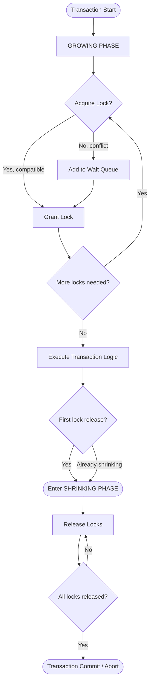
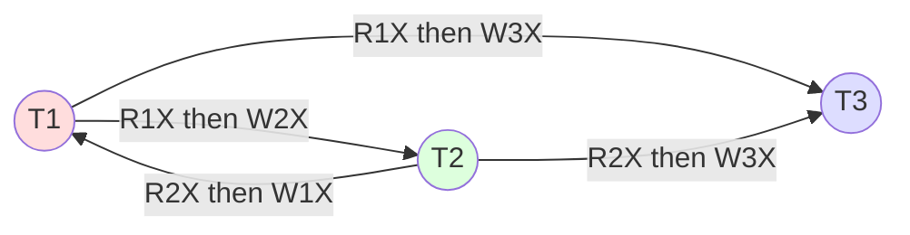
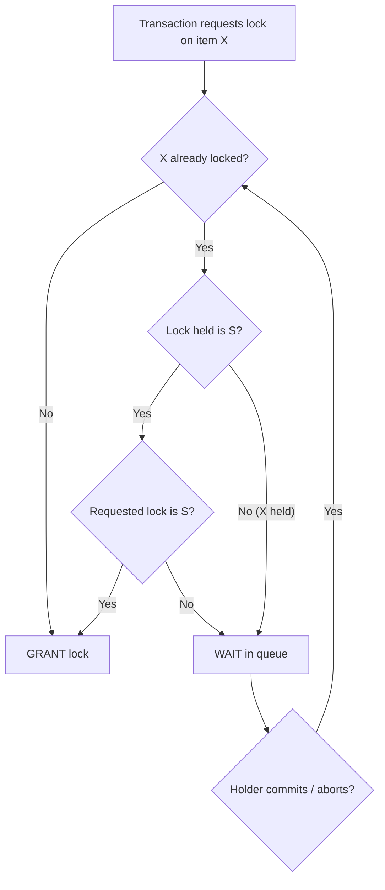
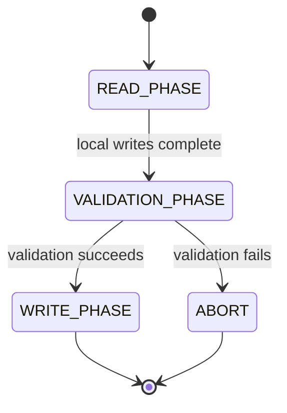
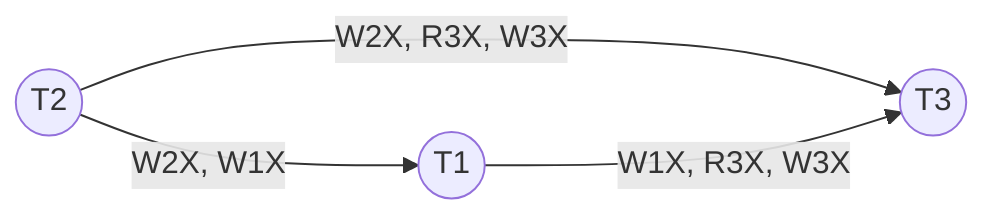

# Concurrency Control

> **APJ ABDUL KALAM TECHNOLOGICAL UNIVERSITY (KTU) | 2024 SCHEME**
> - **Branch:** B.Tech in Computer Science & Engineering (CSE)
> - **Semester:** Semester 4
> - **Course:** PCCST402 - DATABASE MANAGEMENT SYSTEMS
> - **Module:** Module 3: Database Design Theory & Normalization
> - **Topic:** Concurrency Control

<!-- SECTION_1_START -->
## 1. Core Technical Definition & Intuitive Overview

### 1.1 Formal Academic Definition

> [!IMPORTANT]
> **Concurrency Control** is the set of mechanisms, protocols, and algorithms employed by the Database Management System (DBMS) to **coordinate concurrent access** to a shared database by multiple transactions, while **preserving the isolation property (I of ACID)** and ensuring that the database remains in a **consistent state**.

In the context of KTU 2024 PCCST402, concurrency control guarantees that:

- Concurrent execution of multiple user transactions produces the **same final database state** as some **serial (one-after-another) execution** of the same transactions.
- The DBMS correctly handles the interleaving of read (`R`) and write (`W`) operations issued by concurrent transactions.

### 1.2 The Real Problem Concurrency Control Solves

In a real production system, hundreds of users may simultaneously try to update the same row — for example, two users booking the **last available train ticket** at the same instant. Without concurrency control, the database can land in an **inconsistent, corrupted state**, even if each individual transaction is correct on its own.

### 1.3 Intuitive Analogy — The Shared Whiteboard

> [!NOTE]
> **Analogy: Two Students Editing a Shared Whiteboard**
>
> Imagine a single whiteboard in a classroom. Two students, **T1** and **T2**, are both asked to:
> - Read the current number on the board.
> - Add their own value to it.
> - Write the new sum back to the board.
>
> If both students read the board **simultaneously**, both will see the same old value. Both will compute a wrong answer. Both will write back — and the whiteboard ends up with the **wrong final result**. One of the student's work is **lost**.
>
> **Concurrency Control is the "classroom rule" that prevents this.** For instance, the teacher can declare: "Whoever picks up the marker first gets exclusive access. You may not pick up the marker while someone else holds it. When you are done writing, you put it back." This rule is the **lock-based concurrency control** in DBMS terms.

### 1.4 Three Classes of Conflicts in Concurrent Execution

| Conflict Type | Operation Pair | Real-World Name | Consequence if Uncontrolled |
|---------------|----------------|-----------------|-----------------------------|
| **Write–Write (WW)** | $W_i(x),\ W_j(x)$ | **Lost Update Problem** | One update silently overwrites another |
| **Write–Read (WR)** | $W_i(x),\ R_j(x)$ | **Uncommitted Dependency / Dirty Read** | T2 reads uncommitted data that T1 later rolls back |
| **Read–Write (RW)** | $R_i(x),\ W_j(x)$ | **Inconsistent Analysis / Unrepeatable Read** | T2 reads $x$ twice and gets two different values |

> [!NOTE]
> A 4th class — the **Phantom Problem** — occurs when a transaction re-executes a range query and finds new tuples inserted by another transaction between the two reads.

### 1.5 Why Is Concurrency Control a Syllabus Hot Topic?

> [!IMPORTANT]
> KTU 2024 Scheme PCCST402 explicitly tests Concurrency Control under **Module 3**. Board questions typically ask students to:
> 1. Identify the conflict(s) in a given schedule.
> 2. Apply lock-based protocols (especially **2-Phase Locking**) to a schedule.
> 3. Distinguish between **conflict-serializable** and **view-serializable** schedules.
> 4. Solve problems involving **deadlocks**, **starvation**, and **timestamp ordering**.

> [!VISUALIZATION CONTROL]
> **Concept:** Serial vs. Concurrent vs. Conflict-Serializable Execution Timeline
> **GeoGebra / Desmos Input Equations:**
> * Serial line: $y = x$ for $T_1$, then $y = x + 10$ for $T_2$
> * Concurrent interleaving: piecewise function alternating slopes
> **Visual Description:** Students should observe that the *serial* execution produces a single deterministic outcome, while the *interleaved* execution must be **proven equivalent** to some serial order to be safe.
<!-- SECTION_1_END -->

<!-- SECTION_2_START -->
## 2. Deep Theoretical Analysis & KTU High-Yield Formula Sheet

### 2.1 The Three Concrete Concurrency Problems (Detailed)

#### 2.1.1 The Lost Update Problem (Write–Write Conflict)

**Scenario:** Two transactions $T_1$ and $T_2$ both read balance $X = 1000$ and write $X = X + 100$.

$$
\begin{aligned}
T_1: \quad & R_1(X) \rightarrow 1000 \\
T_2: \quad & R_2(X) \rightarrow 1000 \\
T_1: \quad & X \leftarrow 1100,\ W_1(X) \\
T_2: \quad & X \leftarrow 1100,\ W_2(X)
\end{aligned}
$$

**Final value of $X$:** $1100$ — but **$1200$ was the correct answer**. $T_1$'s update of $+100$ was **lost**.

#### 2.1.2 The Uncommitted Dependency / Dirty Read Problem (Write–Read Conflict)

$T_1$ updates $X$ to 500 but later **rolls back**. $T_2$ meanwhile **read** the uncommitted $X=500$ and used it. After $T_1$ rolls back, $T_2$ is operating on a value **that never officially existed**.

#### 2.1.3 The Inconsistent Analysis / Unrepeatable Read Problem (Read–Write Conflict)

$T_1$ reads $X$, then $T_2$ updates $X$, then $T_1$ reads $X$ again. $T_1$ gets **two different values for the same read** in the same transaction. Sum/aggregate computations inside $T_1$ become **wrong**.

#### 2.1.4 The Phantom Read Problem

$T_1$ executes `SELECT COUNT(*) FROM Employee WHERE Dept='CSE'` and gets 10. Before $T_1$ finishes, $T_2$ inserts a new CSE employee. When $T_1$ re-executes the same query, it gets 11. The new row is called a **phantom tuple**.

### 2.2 Lock-Based Concurrency Control Protocols

#### 2.2.1 Lock Types

| Lock Type | Symbol | Allowed Concurrent Operations | Mutual Exclusion With |
|-----------|--------|------------------------------|------------------------|
| **Shared Lock (Read Lock)** | $S$ or $R$ | Multiple readers can hold $S$ simultaneously | $X$ (Exclusive) |
| **Exclusive Lock (Write Lock)** | $X$ or $W$ | Only the holder may read/write | $S$ and $X$ |
| **Binary Lock** | $0 / 1$ | Either locked (1) or unlocked (0) — single bit | No reader concurrency |

#### 2.2.2 Lock Compatibility Matrix (CRITICAL FOR KTU)

> [!IMPORTANT]
> **This matrix is a high-frequency KTU question. Memorize it.**

| Requested ↓ / Held → | **No Lock (NL)** | **Shared (S)** | **Exclusive (X)** |
|----------------------|:----------------:|:--------------:|:-----------------:|
| **No Lock (NL)**     | ✔ Granted | ✔ Granted | ✔ Granted |
| **Shared (S)**       | ✔ Granted | ✔ Granted | ✘ Denied (waits) |
| **Exclusive (X)**    | ✔ Granted | ✘ Denied (waits) | ✘ Denied (waits) |

✔ = lock granted, ✘ = request blocks (transaction waits).

#### 2.2.3 Two-Phase Locking (2PL) Protocol — The Heart of the Topic

> [!IMPORTANT]
> **2PL Rule:** Every transaction must follow two successive phases:
> **Phase 1 (Growing Phase):** Acquire locks; **NO releasing** any lock.
> **Phase 2 (Shrinking Phase):** Release locks; **NO acquiring** any new lock.

Mathematically, for a transaction $T_i$ with $n$ lock operations $L_1, L_2, \dots, L_n$:

$$
\exists\ k \in \{1, 2, \dots, n\} \text{ such that } \bigwedge_{i=1}^{k} (\text{acquire}(L_i)) \quad \text{AND} \quad \bigwedge_{i=k+1}^{n} (\text{release}(L_i))
$$

**Two Variants (asked frequently):**

| Variant | Phase 1 (Growing) | Phase 2 (Shrinking) | Guarantee |
|---------|--------------------|---------------------|-----------|
| **Basic 2PL** | Acquire locks | Release locks (any time after growing) | Conflict-serializable, **not** recoverable |
| **Conservative / Static 2PL** | Pre-declare & acquire **all** locks before any operation | Release after completion | Deadlock-free, conflict-serializable |
| **Strict 2PL** | Acquire locks | **Exclusive (X) locks held until commit/abort** | Recoverable, cascade-less |
| **Rigorous 2PL** | Acquire locks | **All locks (S and X) held until commit/abort** | Strictest, ordered by commit time |

> [!NOTE]
> **Lock Point:** The instant of time when a transaction has acquired **all** of its locks and has not yet released any. The lock points of conflicting transactions in a 2PL schedule define a **total order that matches a serial schedule**.

#### 2.2.4 The Deadlock Problem

> [!WARNING]
> **Deadlock** is a circular wait condition where two or more transactions each hold a lock the other needs and none can proceed.

**Example:**
- $T_1$ holds $S(A)$, requests $X(B)$.
- $T_2$ holds $X(B)$, requests $S(A)$.
- Both wait forever.

**Deadlock Handling Techniques (KTU frequency: high):**

| Technique | Mechanism | Pros | Cons |
|-----------|-----------|------|------|
| **Prevention** | Pre-declare all locks; use timestamps to abort younger | Guaranteed no deadlock | Restarts, wasted work |
| **Detection** | Build a **wait-for graph**, check for cycles periodically | Allows more concurrency | Cost of detection; victims must roll back |
| **Avoidance** | Conservative 2PL (acquire all locks at start) | No rollback | Hard to pre-declare all locks |
| **Timeouts** | Abort transaction if it waits longer than $T$ seconds | Simple | May wrongly kill long transactions |

**Wait–Die and Wound–Wait (timestamp-based deadlock prevention):**

- **Wait–Die (older waits, younger dies):** If $TS(T_i) < TS(T_j)$ (i.e., $T_i$ is older), $T_i$ may wait; else $T_i$ dies (rolls back).
- **Wound–Wait (older wounds, younger waits):** If $TS(T_i) < TS(T_j)$, $T_j$ is wounded (rolled back); else $T_i$ waits.

#### 2.2.5 Starvation

> [!NOTE]
> **Starvation** occurs when a transaction waits indefinitely for a lock because other transactions keep getting the lock first. Counter-measure: use **First-Come-First-Served (FCFS)** queueing of lock requests, or **fair priority escalation**.

### 2.3 Timestamp-Based Concurrency Control (Thomas Write Rule, TO Algorithm)

Each transaction $T_i$ is assigned a unique timestamp $TS(T_i)$ at start time. Every database item $X$ carries:

- `W-timestamp(X)` = largest $TS$ of a transaction that successfully wrote $X$.
- `R-timestamp(X)` = largest $TS$ of a transaction that successfully read $X$.

**Timestamp Ordering (TO) Rules:**

| Operation | Condition to Allow | On Violation |
|-----------|--------------------|--------------|
| $R_i(X)$ | $TS(T_i) \ge W\text{-}timestamp(X)$ | Abort $T_i$ and restart with newer $TS$ |
| $W_i(X)$ | $TS(T_i) \ge R\text{-}timestamp(X)$ **AND** $TS(T_i) \ge W\text{-}timestamp(X)$ | Abort $T_i$ |
| $W_i(X)$ — **Thomas Write Rule** (ignore obsolete writes) | $TS(T_i) \ge W\text{-}timestamp(X)$ is enough (ignore the read-timestamp check) | Skip the write; do not abort |

> [!IMPORTANT]
> **Thomas Write Rule** increases concurrency by ignoring writes that are **already outdated**, but it does **not** guarantee conflict-serializability on its own.

### 2.4 Optimistic (Validation-Based) Concurrency Control

Three phases per transaction:

1. **Read Phase:** Transaction reads from database, computes in a **private workspace**; no locking.
2. **Validation Phase:** Check whether the transaction's read set and write set conflict with other concurrent transactions. Uses a serialization order based on transaction start time and validation time.
3. **Write Phase:** If validation succeeds, atomically apply the write set to the database.

### 2.5 Multiversion Concurrency Control (MVCC) — Brief

> [!NOTE]
> **MVCC** keeps **multiple old versions** of each data item. Readers always see a consistent **snapshot** from their start time, eliminating read–write blocking. Used in PostgreSQL, MySQL InnoDB, Oracle.

### 2.6 KTU High-Yield Formula Cheat Sheet

| Concept | Formula / Rule | Used For |
|---------|----------------|----------|
| Lock compatibility | $S + S$ allowed; everything with $X$ denied | Lock-grant decisions |
| 2PL | Monotone acquire, then monotone release | Proving serializability |
| Lock point order | $LP(T_i) < LP(T_j) \Rightarrow T_i$ before $T_j$ in equivalent serial order | Conflict-equivalence test |
| Wait–Die | $TS(T_i) < TS(T_j) \Rightarrow T_i$ waits, else dies | Deadlock prevention |
| Wound–Wait | $TS(T_i) < TS(T_j) \Rightarrow T_j$ wounded, else $T_i$ waits | Deadlock prevention |
| TO read | $TS(T_i) \ge W\text{-}TS(X)$ | Allow read |
| TO write | $TS(T_i) \ge R\text{-}TS(X) \land TS(T_i) \ge W\text{-}TS(X)$ | Allow write |
| Thomas Write | $TS(T_i) \ge W\text{-}TS(X)$ only | Allow write (ignore) |
| Conflict test | $R\text{-}W$, $W\text{-}R$, $W\text{-}W$ on same item, different txns | Build precedence graph |

### 2.7 Real-World Engineering Utility

- **Banking:** Two ATM withdrawals on the same account must not double-spend. → 2PL / MVCC.
- **E-Commerce:** Two customers buying the last iPhone. → Locking or optimistic validation.
- **Airline Reservation:** Thousands of concurrent bookings; uses MVCC + 2PL hybrid.
- **Stock Trading:** Orders execute on **serializable** queues with strict 2PL or TOCC.
<!-- SECTION_2_END -->

<!-- SECTION_3_START -->
## 3. Step-by-Step Derivations, Worked Examples & Code Implementation

### 3.1 Worked Example: Identifying the Conflict in a Schedule

> **[KTU University Exam - July 2024 Model Pattern]**
> Given schedule $S$:
> $$S :\ R_1(X),\ R_2(X),\ W_2(X),\ W_1(X),\ R_3(X),\ W_3(X)$$
> Identify all conflicts and draw the precedence graph.

**Step 1 — Enumerate operations:**

| # | Operation | Transaction | Item |
|---|-----------|-------------|------|
| 1 | $R_1(X)$ | $T_1$ | $X$ |
| 2 | $R_2(X)$ | $T_2$ | $X$ |
| 3 | $W_2(X)$ | $T_2$ | $X$ |
| 4 | $W_1(X)$ | $T_1$ | $X$ |
| 5 | $R_3(X)$ | $T_3$ | $X$ |
| 6 | $W_3(X)$ | $T_3$ | $X$ |

**Step 2 — Detect conflicts (different transactions, same item, at least one is write):**

- $R_1(X)$ at step 1 **before** $W_2(X)$ at step 3 → conflict $T_1 \to T_2$
- $R_1(X)$ at step 1 **before** $W_1(X)$ at step 4 → same transaction, **ignore**
- $R_1(X)$ at step 1 **before** $W_3(X)$ at step 6 → conflict $T_1 \to T_3$
- $R_2(X)$ at step 2 **before** $W_1(X)$ at step 4 → conflict $T_2 \to T_1$
- $R_2(X)$ at step 2 **before** $W_3(X)$ at step 6 → conflict $T_2 \to T_3$
- $W_2(X)$ at step 3 **before** $W_1(X)$ at step 4 → conflict $T_2 \to T_1$
- $W_2(X)$ at step 3 **before** $W_3(X)$ at step 6 → conflict $T_2 \to T_3$
- $R_3(X)$ at step 5 **before** $W_3(X)$ at step 6 → same transaction, **ignore**

**Step 3 — Precedence graph edges:**

$$
T_1 \to T_2,\ T_1 \to T_3,\ T_2 \to T_1,\ T_2 \to T_3
$$

**Step 4 — Detect cycle:** Yes — $T_1 \leftrightarrow T_2$ (a 2-cycle).

> [!IMPORTANT]
> **Conclusion:** The schedule has a **cycle** in the precedence graph → it is **NOT conflict-serializable**.

---

### 3.2 Worked Example: 2-Phase Locking on a Schedule

> **[KTU University Exam - Dec 2023 Model Pattern]**
> Apply **Basic 2PL** to the following sequence of operations from $T_1$ and $T_2$ on items $A$ and $B$. State whether the schedule obeys 2PL.

**Original interleaved operation list:**

$$
R_1(A),\ R_2(B),\ W_1(A),\ W_2(B),\ R_1(B),\ R_2(A)
$$

**Apply 2PL — annotate each operation with lock acquisition/release:**

| Step | Operation | Locks Held (after) | Action |
|------|-----------|---------------------|--------|
| 1 | $R_1(A)$ | $S_1(A)$ acquired | $T_1$ growing |
| 2 | $R_2(B)$ | $S_1(A),\ S_2(B)$ | $T_2$ growing |
| 3 | $W_1(A)$ | $S_1(A) \uparrow X_1(A),\ S_2(B)$ | $T_1$ upgrades lock |
| 4 | $W_2(B)$ | $X_1(A),\ X_2(B)$ | $T_2$ upgrades lock |
| 5 | $R_1(B)$ | ✘ BLOCKED (T_2 holds $X$ on $B$) | $T_1$ must wait |
| ... | (after $T_2$ commits and releases) | $T_1$ proceeds, gets $S_1(B)$ | ... |

**Final 2PL-compliant schedule:**

$$
S\text{-lock}_1(A),\ S\text{-lock}_2(B),\ X\text{-lock}_1(A),\ X\text{-lock}_2(B),\ \text{[commit }T_2\text{]},\ S\text{-lock}_1(B),\ R_1(A),\ R_2(B),\ W_1(A),\ W_2(B),\ R_1(B),\ \text{[commit }T_1\text{]}
$$

**Validation of 2PL property:**

- $T_1$ growing phase: steps 1, 3 (lock acquisitions).
- $T_1$ shrinking phase: starts after commit of $T_2$ releases $B$.
- ✓ Both transactions obey 2PL.

---

### 3.3 Worked Example: Timestamp Ordering (TO) Algorithm

> Given: $TS(T_1) = 1,\ TS(T_2) = 2,\ TS(T_3) = 3$.
> Initial: `R-TS(X) = 0, W-TS(X) = 0`.

| Step | Op | $TS(T_i)$ | $R\text{-}TS(X)$ before | $W\text{-}TS(X)$ before | Decision |
|------|-----|-----------|----------------------|----------------------|----------|
| 1 | $R_1(X)$ | 1 | 0 | 0 | Allow: $1 \ge 0$ ✓; update $R\text{-}TS(X) = 1$ |
| 2 | $W_2(X)$ | 2 | 1 | 0 | Allow: $2 \ge 1$ and $2 \ge 0$ ✓; update $W\text{-}TS(X) = 2$ |
| 3 | $R_3(X)$ | 3 | 1 | 2 | Allow: $3 \ge 2$ ✓; update $R\text{-}TS(X) = 3$ |
| 4 | $W_1(X)$ | 1 | 3 | 2 | **Deny:** $1 \not\ge 3$ → abort $T_1$, restart with new $TS$ |

---

### 3.4 Algorithm — Basic 2PL Implementation in Python (with Type Hints)

```python
from enum import Enum
from typing import Dict, Set, Tuple, Optional
import logging
import time
import threading

logging.basicConfig(level=logging.INFO, format='%(asctime)s | %(levelname)s | %(message)s')
log = logging.getLogger("2PL_Manager")

class LockType(Enum):
    SHARED = "S"
    EXCLUSIVE = "X"

class LockRequest:
    def __init__(self, txn_id: int, lock_type: LockType, item: str):
        self.txn_id = txn_id
        self.lock_type = lock_type
        self.item = item
        self.timestamp = time.time()

class TwoPhaseLockManager:
    """
    Implements Basic 2-Phase Locking (2PL) with:
      - Lock compatibility matrix enforcement
      - Phase tracking (GROWING / SHRINKING)
      - Wait-queue and deadlock-via-timeout detection
      - Strict logging of every decision
    """
    def __init__(self, deadlock_timeout_sec: float = 5.0):
        # item -> list of (txn_id, lock_type) currently held
        self.held_locks: Dict[str, list] = {}
        # item -> queue of waiting LockRequest
        self.wait_queue: Dict[str, list] = []
        # txn_id -> set of items currently locked
        self.txn_locks: Dict[int, Set[str]] = {}
        # txn_id -> phase ("GROWING" or "SHRINKING")
        self.txn_phase: Dict[int, str] = {}
        self.deadlock_timeout = deadlock_timeout_sec
        self.lock = threading.Lock()

    # ------------------------------------------------------------------
    def _compatible(self, item: str, requested: LockType) -> bool:
        if item not in self.held_locks or not self.held_locks[item]:
            return True
        for (_txn, held_type) in self.held_locks[item]:
            if requested == LockType.EXCLUSIVE or held_type == LockType.EXCLUSIVE:
                return False
        return True

    def _phase_allows_acquire(self, txn_id: int) -> bool:
        return self.txn_phase.get(txn_id, "GROWING") == "GROWING"

    def _phase_allows_release(self, txn_id: int) -> bool:
        return self.txn_phase.get(txn_id, "GROWING") == "SHRINKING"

    # ------------------------------------------------------------------
    def acquire(self, txn_id: int, item: str, lock_type: LockType) -> bool:
        with self.lock:
            if not self._phase_allows_acquire(txn_id):
                log.error(f"T{txn_id} tried to acquire {lock_type.value}({item}) in SHRINKING phase. DENIED.")
                return False

            request = LockRequest(txn_id, lock_type, item)
            start = time.time()
            while not self._compatible(item, lock_type):
                if time.time() - start > self.deadlock_timeout:
                    log.warning(f"T{txn_id} timed out waiting for {lock_type.value}({item}). Treating as DEADLOCK victim — abort.")
                    self._abort(txn_id)
                    return False
                log.info(f"T{txn_id} waiting for {lock_type.value}({item})...")
                time.sleep(0.05)

            # grant the lock
            self.held_locks.setdefault(item, []).append((txn_id, lock_type))
            self.txn_locks.setdefault(txn_id, set()).add(item)
            self.txn_phase[txn_id] = "GROWING"
            log.info(f"T{txn_id} ACQUIRED {lock_type.value}({item})")
            return True

    def release(self, txn_id: int, item: str) -> bool:
        with self.lock:
            if self.txn_phase.get(txn_id) == "GROWING":
                # First release transitions the transaction to SHRINKING
                self.txn_phase[txn_id] = "SHRINKING"
                log.info(f"T{txn_id} entered SHRINKING phase (first release).")

            if not self._phase_allows_release(txn_id):
                log.error(f"T{txn_id} cannot release in GROWING. DENIED.")
                return False

            self.held_locks[item] = [(t, lt) for (t, lt) in self.held_locks.get(item, []) if t != txn_id]
            if not self.held_locks[item]:
                del self.held_locks[item]
            self.txn_locks[txn_id].discard(item)
            log.info(f"T{txn_id} RELEASED lock on {item}")
            return True

    def _abort(self, txn_id: int) -> None:
        """For deadlock victim: release all locks, mark phase as aborted."""
        for item in list(self.txn_locks.get(txn_id, [])):
            self.release(txn_id, item)
        self.txn_phase[txn_id] = "ABORTED"
        log.error(f"T{txn_id} ABORTED.")

# ---------------------------------------------------------------------------
# Demo: two transactions T1, T2 trying to update items A and B
# ---------------------------------------------------------------------------
if __name__ == "__main__":
    mgr = TwoPhaseLockManager(deadlock_timeout_sec=2.0)

    # T1 wants S(A), then S(B)
    assert mgr.acquire(1, "A", LockType.SHARED)
    assert mgr.acquire(1, "B", LockType.SHARED)
    # T1 finishes its reads — first release puts T1 in SHRINKING
    mgr.release(1, "A")
    # T1 now CANNOT acquire any new lock (2PL violation would be denied)
    mgr.release(1, "B")
    log.info("Demo complete.")
```

**Code walk-through (key reasoning for the answer sheet):**

1. The lock manager enforces the **compatibility matrix** in `_compatible()`.
2. The phase transition is **irreversible**: the first `release()` call moves the transaction to `SHRINKING`. Any further `acquire()` is denied.
3. Deadlock is detected using a **timeout**, after which the transaction is **aborted and rolled back** (its locks released) — matching the **Wait–Die / Wound–Wait** spirit.

---

### 3.5 Detailed Comparison Table: Locking vs. Timestamp vs. Optimistic

| Property | **2PL (Locking)** | **TO (Timestamp)** | **Optimistic (Validation)** |
|----------|-------------------|--------------------|-----------------------------|
| Deadlock-free? | No (needs detection/prevention) | Yes | Yes |
| Starvation possible? | Yes (if unfair queue) | Possible | Possible |
| Cascading aborts? | Basic 2PL yes; Strict 2PL no | No | No |
| Read-only transactions blocked? | Sometimes | Sometimes | **Never** (best for read-heavy) |
| Storage overhead | Low | Medium (timestamps) | High (private workspaces) |
| Best workload | Mixed read/write | Mixed | Read-heavy, low conflict |
<!-- SECTION_3_END -->

<!-- SECTION_4_START -->
## 4. Structural Diagrams & Schematics

### 4.1 Two-Phase Locking Lifecycle (Mermaid)



### 4.2 Precedence Graph (Conflict-Serializability Test)



> The cycle $T_1 \leftrightarrow T_2$ means **not conflict-serializable**.

### 4.3 Lock Compatibility Decision Flow



### 4.4 Wait–Die vs. Wound–Wait Comparison Block

| Aspect | Wait–Die | Wound–Wait |
|--------|----------|------------|
| Older transaction | Waits | Wounds (rolls back) the younger |
| Younger transaction | Dies (rolls back) | Waits |
| Starvation | Possible for younger, restarted repeatedly → bounded using same $TS$ | Older never starves |
| Cycle prevention | Yes | Yes |

### 4.5 Architecture: Optimistic CC Phase Diagram


<!-- SECTION_4_END -->

<!-- SECTION_5_START -->
## 5. KTU 2024 Scheme Examination Question Bank & Topic Recap

### 5.1 Part A — Short Answer Questions (3 Marks Each)

> **Q1. [KTU University Exam - July 2024]**
> Define **concurrency control** in a DBMS. Mention the three problems that occur in concurrent transaction execution.
> **CO Mapped:** CO3 | **RBT Level:** Remember | **Marks:** 3

**Model Answer (3 marks valuation key):**
1. *Definition:* Concurrency control is the process of coordinating simultaneous execution of transactions in a multi-user database environment such that the overall database consistency is preserved and the execution is equivalent to some serial execution. **[1 Mark]**
2. *Lost Update Problem:* Two transactions read and update the same data item, causing one's update to be overwritten. **[1 Mark]**
3. *Uncommitted Dependency (Dirty Read):* A transaction reads data written by an uncommitted transaction that later rolls back. **[0.5 Mark]**
4. *Inconsistent Analysis (Unrepeatable Read):* A transaction reads the same item twice and gets different values due to an intervening update. **[0.5 Mark]**

---

> **Q2. [KTU University Exam - Dec 2023]**
> What is the **lock compatibility matrix**? Show it for Shared ($S$) and Exclusive ($X$) locks.
> **CO Mapped:** CO3 | **RBT Level:** Understand | **Marks:** 3

**Model Answer (3 marks valuation key):**
The lock compatibility matrix determines whether a lock request from a transaction can be granted immediately or must wait. **[1 Mark]**

| | Held: NL | Held: S | Held: X |
|---|---|---|---|
| **Req: NL** | ✔ | ✔ | ✔ |
| **Req: S**  | ✔ | ✔ | ✘ |
| **Req: X**  | ✔ | ✘ | ✘ |

Key idea: Multiple shared locks are compatible; an exclusive lock conflicts with every other lock. **[1 Mark]**
Example: If $T_1$ holds $S(A)$ and $T_2$ requests $X(A)$, $T_2$ must wait. **[1 Mark]**

---

### 5.2 Part B — Long Answer Questions (14 Marks Each, Module Internal Choice)

> **Question A (14 Marks)**
> **[KTU University Exam - Dec 2023]**
> (a) Explain the **Two-Phase Locking (2PL)** protocol with its two phases. Differentiate between **basic 2PL, strict 2PL, and conservative 2PL**. **(7 Marks)**
> (b) Consider the following schedule $S$ of three transactions:
> $$S :\ R_2(X),\ W_2(X),\ W_1(X),\ R_3(X),\ W_3(X),\ R_1(Y)$$
> Draw the **precedence graph** and determine whether $S$ is **conflict-serializable**. If yes, give the equivalent serial schedule. **(7 Marks)**
> **CO Mapped:** CO3, CO4 | **RBT Levels:** Understand, Apply

**Model Answer — Part (a) (7 Marks):**

**Two-Phase Locking Protocol Definition:** **[1 Mark]**
2PL is a concurrency control protocol in which every transaction must complete all its lock acquisitions before it releases any lock. It guarantees conflict-serializability of schedules.

**Phase 1 — Growing Phase:** **[1 Mark]**
- Transaction acquires locks (S or X) as needed.
- It **cannot release** any lock during this phase.
- Continues until the transaction has all the locks it requires.

**Phase 2 — Shrinking Phase:** **[1 Mark]**
- Transaction releases locks.
- It **cannot acquire** any new lock during this phase.
- Continues until the transaction has released all locks (then it commits/aborts).

**Lock Point:** The instant when the transaction moves from growing to shrinking. **[0.5 Mark]**

**Variants Comparison Table:** **[2.5 Marks]**

| Variant | Phase Behavior | Recoverable? | Cascadeless? | Deadlock-free? |
|---------|----------------|--------------|--------------|----------------|
| **Basic 2PL** | Acquire → Release (any time) | No | No | No |
| **Conservative / Static 2PL** | Acquire **all** locks **before** any operation; then release after | Yes | Yes | **Yes** |
| **Strict 2PL** | Acquire → hold **all X locks** until commit/abort | Yes | Yes | No |
| **Rigorous 2PL** | Acquire → hold **all locks (S and X)** until commit/abort | Yes | Yes | No |

**Conclusion:** 2PL is the most widely used protocol to ensure serializability; trade-off is the possibility of **deadlock** (in basic and strict variants). **[1 Mark]**

---

**Model Answer — Part (b) (7 Marks):**

**Step 1 — Enumerate conflicting operation pairs (different transactions, same item, at least one write):** **[2 Marks]**

| Conflicting Pair | Conflict Type | Precedence Edge |
|------------------|---------------|-----------------|
| $W_2(X)$ before $W_1(X)$ | W–W | $T_2 \to T_1$ |
| $W_2(X)$ before $R_3(X)$ | W–R | $T_2 \to T_3$ |
| $W_2(X)$ before $W_3(X)$ | W–W | $T_2 \to T_3$ |
| $W_1(X)$ before $R_3(X)$ | W–R | $T_1 \to T_3$ |
| $W_1(X)$ before $W_3(X)$ | W–W | $T_1 \to T_3$ |
| $W_1(X)$ before $R_1(Y)$ | same txn | ignore |

*Note:* $R_3(X)$ vs $W_3(X)$ is same-transaction, ignored. $R_1(Y)$ has no conflict with $R_2(X)$ (different item). **[1 Mark for completeness]**

**Step 2 — Draw Precedence Graph:** **[2 Marks]**



**Step 3 — Cycle Check:** **[1 Mark]**
- Edges: $T_2 \to T_1$, $T_2 \to T_3$, $T_1 \to T_3$.
- **No cycle** (the graph is a DAG).

**Step 4 — Equivalent Serial Schedule (topological order):** **[1 Mark]**
$$S_{serial}:\ T_2 \to T_1 \to T_3$$

> [!IMPORTANT]
> **Conclusion:** $S$ is **conflict-serializable**, equivalent to the serial order $T_2,\ T_1,\ T_3$.

---

> **Question B (14 Marks) — Alternative Choice**
> **[KTU University Exam - July 2024]**
> (a) Explain **Wait–Die** and **Wound–Wait** schemes for deadlock prevention in timestamp-based concurrency control. Use a suitable example. **(7 Marks)**
> (b) Apply the **Timestamp Ordering (TO) algorithm** to the following operations and state whether each is allowed or aborted. Given $TS(T_1)=1,\ TS(T_2)=2,\ TS(T_3)=3$. Initially `R-TS(X) = 0, W-TS(X) = 0`. Operations: $R_1(X),\ W_2(X),\ W_1(X),\ R_3(X),\ W_3(X)$. **(7 Marks)**
> **CO Mapped:** CO3, CO4 | **RBT Levels:** Understand, Apply

**Model Answer — Part (a) (7 Marks):**

**Why deadlock prevention is needed:** **[1 Mark]**
Lock-based protocols can deadlock. Two timestamp-based prevention schemes avoid deadlocks by **using transaction age** to decide who should be rolled back.

**Wait–Die Scheme (non-preemptive):** **[2.5 Marks]**
- If $TS(T_i) < TS(T_j)$ (i.e., $T_i$ is **older**):
  - $T_i$ is allowed to **wait** for $T_j$.
- If $TS(T_i) > TS(T_j)$ (i.e., $T_i$ is **younger**):
  - $T_i$ is **killed (dies)** and restarted later with the **same** timestamp.

**Example:** $T_i$ (older, $TS=1$) wants a lock held by $T_j$ (younger, $TS=2$) → $T_i$ waits. Conversely, if $T_i$ (younger) wants a lock held by $T_j$ (older) → $T_i$ dies.

**Wound–Wait Scheme (preemptive):** **[2.5 Marks]**
- If $TS(T_i) < TS(T_j)$ (i.e., $T_i$ is **older**):
  - $T_i$ **wounds** $T_j$ (forces $T_j$ to roll back and release its lock).
- If $TS(T_i) > TS(T_j)$ (i.e., $T_i$ is **younger**):
  - $T_i$ is allowed to **wait** for $T_j$.

**Comparison:** **[1 Mark]**

| Aspect | Wait–Die | Wound–Wait |
|--------|----------|------------|
| Older | Waits | Wounds younger |
| Younger | Dies (rolled back) | Waits |
| Restart timestamp | **Same** timestamp (avoids starvation) | **Same** timestamp |
| Starvation | Free for older | Free for older |

---

**Model Answer — Part (b) (7 Marks):**

**Rules of TO Algorithm:** **[1 Mark]**
- $R_i(X)$ allowed if $TS(T_i) \ge W\text{-}TS(X)$. On success, $R\text{-}TS(X) = \max(R\text{-}TS(X),\ TS(T_i))$.
- $W_i(X)$ allowed if $TS(T_i) \ge R\text{-}TS(X)$ **AND** $TS(T_i) \ge W\text{-}TS(X)$. On success, $W\text{-}TS(X) = TS(T_i)$.
- Otherwise the transaction is **aborted and restarted** with a new timestamp.

**Step-by-step trace:** **[5 Marks — 1 mark per step]**

| # | Op | $TS(T_i)$ | $R\text{-}TS(X)$ before | $W\text{-}TS(X)$ before | Check | Action | $R\text{-}TS$ after | $W\text{-}TS$ after |
|---|---|-----------|----------------------|----------------------|-------|--------|----------------|----------------|
| 1 | $R_1(X)$ | 1 | 0 | 0 | $1 \ge 0$ ✓ | Allow | 1 | 0 |
| 2 | $W_2(X)$ | 2 | 1 | 0 | $2 \ge 1$, $2 \ge 0$ ✓ | Allow | 1 | 2 |
| 3 | $W_1(X)$ | 1 | 1 | 2 | $1 \ge 1$ ✓, but $1 \not\ge 2$ ✗ | **ABORT $T_1$** | 1 | 2 |
| 4 | $R_3(X)$ | 3 | 1 | 2 | $3 \ge 2$ ✓ | Allow | 3 | 2 |
| 5 | $W_3(X)$ | 3 | 3 | 2 | $3 \ge 3$, $3 \ge 2$ ✓ | Allow | 3 | 3 |

**Final conclusion:** **[1 Mark]**
- $T_1$ is aborted and would be restarted with a new timestamp (e.g., $TS(T_1')=4$).
- $T_2$, $T_3$ complete successfully.

---

### 5.3 KTU Examiner's Valuation Warning / Pitfall Callout

> [!WARNING]
> **Common mistakes that cost marks in Concurrency Control questions:**
> 1. **Forgetting the same-transaction rule** in precedence graphs: $R_i(X) \to W_i(X)$ is NOT a conflict edge. Examiners deduct 1–2 marks for spurious edges.
> 2. **Confusing Strict 2PL with Rigorous 2PL:** Strict 2PL holds *only* exclusive locks till commit; Rigorous 2PL holds *all* locks. KTU questions often ask for the difference.
> 3. **Ignoring the order of operations in Wait–Die:** Writing "$T_i$ waits" without specifying which is older/younger. Always mention $TS$ comparison.
> 4. **Drawing the precedence graph with undirected edges or wrong arrows** (some students draw the arrow from later to earlier). The arrow always goes from the *earlier* operation's transaction to the *later* operation's transaction.
> 5. **Saying "Basic 2PL is recoverable"** — it is NOT. Recoverability is guaranteed only by Strict 2PL, Conservative 2PL, or Rigorous 2PL.
> 6. **Forgetting to update $R\text{-}TS$ and $W\text{-}TS$** in TO algorithm traces — every successful read/write mutates the timestamps.

---

### 5.4 Topic Recap & Important Things to Remember

> [!NOTE]
> **Rapid-Revision Checklist for Concurrency Control (KTU 2024 Module 3):**

- **Definition:** Concurrency control = coordinating simultaneous transactions to keep DB consistent and serializable.
- **Three (Four) Core Problems:** Lost Update (WW), Dirty Read (WR), Unrepeatable Read (RW), Phantom Read (inserted tuples).
- **Lock Types:** Shared ($S$) — readers concurrent; Exclusive ($X$) — sole access; Binary — single bit lock.
- **Lock Compatibility:** $S+S$ ✔, $S+X$ ✘, $X+X$ ✘. The compatibility matrix is the most-memorized table of this module.
- **2PL Phases:** Growing (acquire only) → Shrinking (release only). Lock point = transition instant.
- **2PL Variants:**
  - *Basic 2PL* — no recovery guarantee, deadlock possible.
  - *Conservative 2PL* — pre-acquire all locks, deadlock-free.
  - *Strict 2PL* — hold $X$ locks until commit, cascade-less.
  - *Rigorous 2PL* — hold all locks until commit, strongest.
- **Conflict-Serializability Test:** Build precedence graph; **acyclic ⇒ serializable**; cycle ⇒ not conflict-serializable.
- **View-Serializability:** A weaker, harder-to-test condition (NP-complete) — both produce same final DB values.
- **Deadlock Handling:** Prevention (Wait–Die / Wound–Wait), Detection (wait-for graph + cycle), Avoidance (Conservative 2PL), Timeouts.
- **Wait–Die:** Older waits, younger dies (restarts with same $TS$).
- **Wound–Wait:** Older wounds (kills) younger, younger waits.
- **Timestamp Ordering (TO):** Read allowed if $TS(T_i) \ge W\text{-}TS(X)$; Write allowed if $TS(T_i) \ge R\text{-}TS(X)$ AND $TS(T_i) \ge W\text{-}TS(X)$.
- **Thomas Write Rule:** Ignore obsolete writes ($TS(T_i) \ge W\text{-}TS(X)$) to increase concurrency; does not always preserve serializability.
- **Optimistic CC:** Read → Validate → Write. Best for low-contention read-heavy workloads.
- **MVCC:** Multiple versions per item; readers see a snapshot; used in PostgreSQL, MySQL InnoDB, Oracle.
- **Starvation vs. Deadlock:** Deadlock = circular wait; Starvation = one transaction perpetually bypassed.
- **Algorithm-implementation tip:** Always log $R\text{-}TS$ and $W\text{-}TS$ updates in TO traces; always check the phase state (GROWING/SHRINKING) before allowing lock acquire/release in 2PL.
<!-- SECTION_5_END -->
