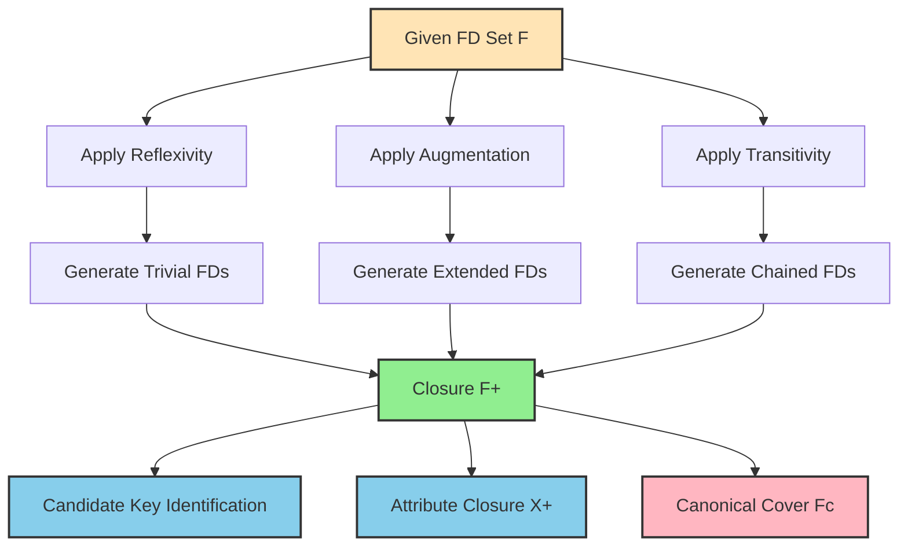
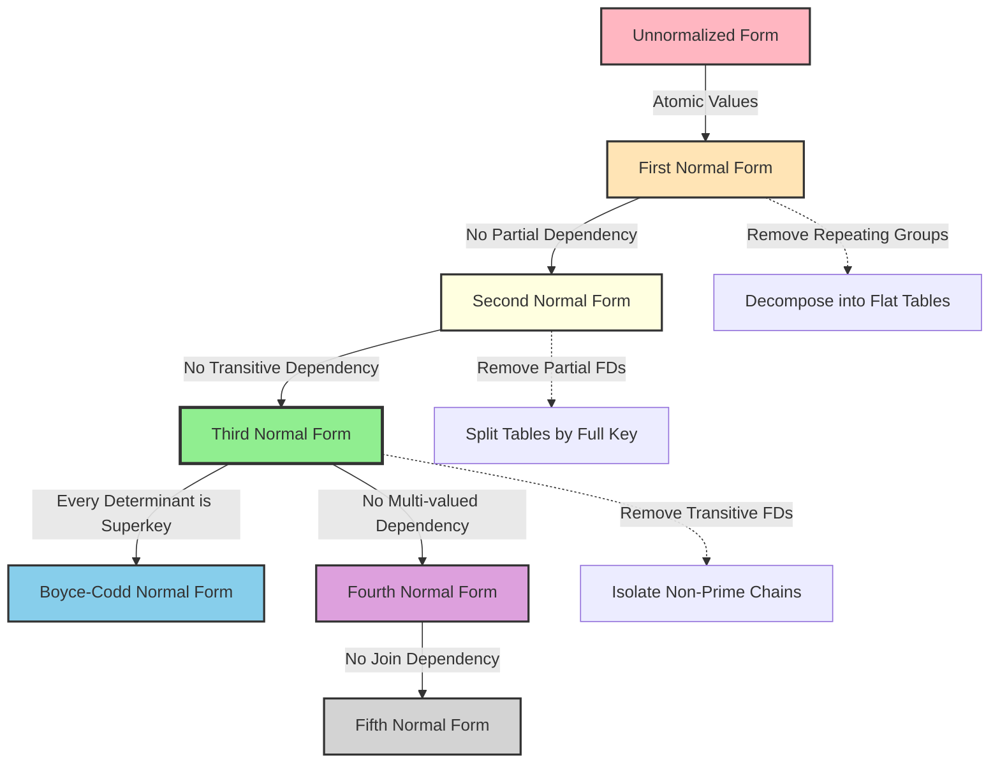
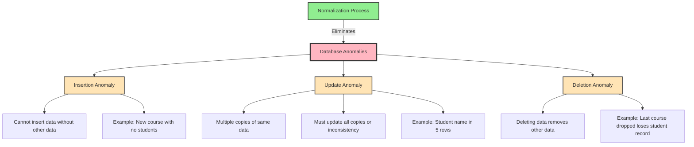
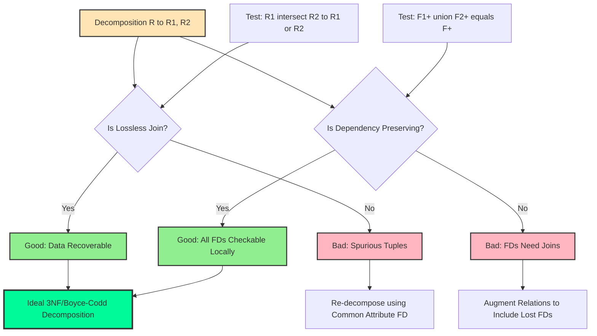

# Database Design Theory & Normalization  - Functional Dependencies - Basic definition; Normalization- First, Second, and Third normal forms.

<!-- SECTION_1_START -->

# 1. Core Technical Definition & Intuitive Overview

## 1.1 Functional Dependency (FD) — Formal Definition

> [!NOTE]
> **KTU Syllabus Definition**
> A **Functional Dependency (FD)**, denoted as $X \rightarrow Y$, is a constraint between two sets of attributes $X$ and $Y$ in a relation $R$. It specifies that for any two tuples $t_1$ and $t_2$ in a valid instance of $R$, if $t_1[X] = t_2[X]$, then $t_1[Y] = t_2[Y]$. In simpler terms, **the value of $X$ uniquely determines the value of $Y$**.

Where:
- $X$ is called the **Determinant** (left-hand side, LHS).
- $Y$ is called the **Dependent** (right-hand side, RHS).
- $X \rightarrow Y$ holds in $R$ if and only if whenever two tuples agree on the attribute(s) of $X$, they must also agree on the attribute(s) of $Y$.

> [!IMPORTANT]
> **KTU Board Terminology to Remember**
> - **Trivial FD**: An FD of the form $X \rightarrow Y$ where $Y \subseteq X$ (i.e., $Y$ is a subset of $X$). Example: $\{\text{StudentID, Name}\} \rightarrow \text{StudentID}$.
> - **Non-trivial FD**: An FD where $Y \not\subseteq X$. Example: $\text{StudentID} \rightarrow \text{Name}$.
> - **Completely Non-trivial FD**: $X \cap Y = \emptyset$. Example: $\text{StudentID} \rightarrow \text{Name}$ where Name and StudentID are disjoint.

---

## 1.2 Intuitive Analogy — "The Postal Code Concept"

Imagine a **PIN code** (Postal Index Number) in India. If I tell you the PIN code **682001** (Ernakulam), you can immediately tell me the city is **Kochi** and the state is **Kerala**. Here:

$$\text{PIN\_Code} \; \rightarrow \; \text{City, State}$$

The PIN code **uniquely determines** the city and state. You never have two different cities sharing the same PIN code. This is a perfect real-world example of a **Functional Dependency**.

> [!TIP]
> **Why this analogy works for KTU exams**: Examiners often pose questions like *"Give a real-life example of a functional dependency"*. The PIN code analogy, Aadhaar Number $\rightarrow$ Person details, or Roll Number $\rightarrow$ Student Name are all gold-standard answers.

---

## 1.3 Normalization — The Foundation

> [!NOTE]
> **KTU Syllabus Definition (Module 3)**
> **Normalization** is a systematic, step-by-step process of decomposing (splitting) a "bad" relation (one riddled with anomalies) into smaller, well-structured relations. The goal is to **eliminate data redundancy** and **avoid insertion, update, and deletion anomalies**, while **preserving the information** and **maintaining functional dependencies**.

The form of a relation after each normalization step is called a **Normal Form (NF)**. Higher normal forms mean less redundancy but potentially more joins.

---

## 1.4 The Three Normal Forms — Quick Overview

| Normal Form | Common Acronym | Core Rule (Plain English) |
|-------------|----------------|---------------------------|
| **First Normal Form** | **1NF** | Atomic values only. No multi-valued or repeating groups in a cell. |
| **Second Normal Form** | **2NF** | 1NF + No partial dependency. Non-prime attributes must depend on the **whole** primary key. |
| **Third Normal Form** | **3NF** | 2NF + No transitive dependency. Non-prime attributes cannot depend on **other non-prime attributes**. |

> [!IMPORTANT]
> **Prime Attribute**: An attribute that is part of **any** candidate key.
> **Non-Prime Attribute**: An attribute that is **not** part of any candidate key.
> **Candidate Key**: A minimal superkey — a set of attributes that uniquely identifies a tuple and is irreducible.

---

## 1.5 Anomalies — Why We Need Normalization

> [!WARNING]
> **KTU 2024 Common Pitfall**: Students often list anomalies but forget to explain *why* each one occurs. Always link each anomaly to its **functional dependency violation**.

A **bad relation** suffers from three anomalies:

1. **Insertion Anomaly**: You cannot insert certain data without knowing other data.
   - *Example*: In a STUDENT\_COURSE table with composite key (StudentID, CourseID), you cannot add a new course that no student has taken yet.
2. **Update Anomaly**: Updating data in one place requires updating it everywhere (data duplication).
   - *Example*: If a student's name is stored in 3 rows and you change it in only 2, the database becomes inconsistent.
3. **Deletion Anomaly**: Deleting some data accidentally removes other data.
   - *Example*: If a student drops their only course, their entire record gets deleted, losing the student's information.

---

## 1.6 Visualization — Dependency Chains

> [!VISUALIZATION CONTROL]
> **Concept:** Functional Dependency Graph and Transitive Dependency Visualization
> **GeoGebra / Desmos Input Equations:**
> - Points: `A = (1, 5)`, `B = (3, 3)`, `C = (5, 1)`
> - Line 1: `f(x) = -x + 6`  (Representing $A \rightarrow B$)
> - Line 2: `g(x) = -x + 8`  (Representing $B \rightarrow C$)
> - Transitive path: A → B → C
> **Visual Description:** The student should see that the value of $A$ at the top-left determines $B$ in the middle, which in turn determines $C$ at the bottom-right. This visualizes a **transitive dependency** $A \rightarrow C$, which is what 3NF eliminates.

---

<!-- SECTION_1_END -->

<!-- SECTION_2_START -->

# 2. Deep Theoretical Analysis & KTU High-Yield Formula Sheet

## 2.1 Functional Dependencies — The Deep Dive

### 2.1.1 Properties of Functional Dependencies

For a relation $R$ with attributes $A_1, A_2, \ldots, A_n$, an FD $X \rightarrow Y$ is:

- **Reflexive** (if $Y \subseteq X$): Trivially true.
- **Augmentative**: If $X \rightarrow Y$, then $XZ \rightarrow YZ$ for any $Z$.
- **Transitive**: If $X \rightarrow Y$ and $Y \rightarrow Z$, then $X \rightarrow Z$.
- **Projective / Decomposition**: If $X \rightarrow YZ$, then $X \rightarrow Y$ and $X \rightarrow Z$.
- **Additive / Union**: If $X \rightarrow Y$ and $X \rightarrow Z$, then $X \rightarrow YZ$.
- **Pseudotransitive**: If $X \rightarrow Y$ and $YZ \rightarrow W$, then $XZ \rightarrow W$.

### 2.1.2 Closure of a Set of Functional Dependencies ($F^+$)

> [!NOTE]
> **Definition**: The **closure of $F$**, denoted $F^+$, is the set of **all** functional dependencies that can be inferred from $F$ using Armstrong's axioms (reflexivity, augmentation, transitivity).

**Algorithm to compute $F^+$ (KTU Favorite)**:
1. Start with $F^+ = F$.
2. Apply reflexivity: Add $X \rightarrow Y$ for all $Y \subseteq X$.
3. Apply augmentation repeatedly.
4. Apply transitivity: If $X \rightarrow Y$ and $Y \rightarrow Z$ exist, add $X \rightarrow Z$.
5. Repeat until no new FDs can be added.

### 2.1.3 Attribute Closure ($X^+$)

> [!IMPORTANT]
> **KTU 2024 High-Yield Topic**: Attribute closure is the most-tested concept. It is used to find candidate keys, test functional dependencies, and check normalization.

**Definition**: The closure of an attribute set $X$ under $F$, denoted $X^+$, is the set of all attributes functionally determined by $X$.

**Algorithm to compute $X^+$**:
1. Initialize $X^+ = X$.
2. **Repeat**: For each FD $A \rightarrow B$ in $F$, if $A \subseteq X^+$, then $X^+ = X^+ \cup B$.
3. Until $X^+$ cannot grow further.
4. If $X^+$ contains **all attributes of $R$**, then $X$ is a **superkey**. If no attribute can be removed while keeping it a superkey, $X$ is a **candidate key**.

### 2.1.4 Canonical Cover (Minimal Cover) $F_c$

> [!NOTE]
> **Definition**: A **canonical cover** $F_c$ of $F$ is a minimal set of FDs equivalent to $F$ with:
> 1. No extraneous attributes on the LHS.
> 2. No redundant FDs.
> 3. Each FD's RHS is a single attribute.

**Steps to find $F_c$**:
1. Make RHS of each FD a single attribute (decomposition).
2. Remove redundant FDs.
3. Remove extraneous LHS attributes.

### 2.1.5 Equivalence of FD Sets

Two FD sets $F$ and $G$ are **equivalent** if $F^+ = G^+$. Algorithm:
- For each FD in $F$, check if it is implied by $G$ (using attribute closure under $G$).
- For each FD in $G$, check if it is implied by $F$.

---

## 2.2 First Normal Form (1NF) — Detailed Analysis

> [!NOTE]
> **Definition**: A relation $R$ is in **1NF** if and only if the domain of every attribute contains only **atomic (indivisible) values**, and the value of each attribute contains only a single value from that domain.

**Violations of 1NF**:
- A cell containing multiple values (e.g., `Phone: 999, 888, 777`).
- Repeating groups of columns (e.g., `Course1, Course2, Course3`).
- Nested relations (a row inside a row).

**Conversion to 1NF**:
1. Flatten the table.
2. Split multi-valued cells into multiple rows (one row per value).
3. Remove repeating column groups.

---

## 2.3 Second Normal Form (2NF) — Detailed Analysis

> [!NOTE]
> **Definition**: A relation $R$ is in **2NF** if and only if it is in 1NF and **every non-prime attribute is fully functionally dependent on every candidate key** (i.e., no partial dependency).

**Partial Dependency**: When a non-prime attribute depends on **only a part** (a proper subset) of a candidate key.

**Key Insight**: 2NF is **only relevant** when the candidate key is **composite** (has 2 or more attributes). If every candidate key is a single attribute, the relation is automatically in 2NF if it is in 1NF.

**Conversion to 2NF**:
1. Identify all partial dependencies.
2. For each partial dependency $X \rightarrow Y$ (where $X$ is a proper subset of a candidate key), create a new relation $R_1(X, Y)$.
3. Keep the original key in the original relation to preserve referential integrity.

---

## 2.4 Third Normal Form (3NF) — Detailed Analysis

> [!NOTE]
> **Definition**: A relation $R$ is in **3NF** if and only if it is in 2NF and **no non-prime attribute is transitively dependent on any candidate key**.

**Transitive Dependency**: For a candidate key $K$, if $K \rightarrow X$ and $X \rightarrow Y$ where $X$ is a non-prime attribute and $Y$ is a non-prime attribute, then $K \rightarrow Y$ is a transitive dependency.

**Boyce-Codd Rule for 3NF (Per Attribute)**:
For every non-trivial FD $X \rightarrow A$ in $R$, either:
- $X$ is a **superkey** of $R$, OR
- $A$ is a **prime attribute** (part of some candidate key).

> [!WARNING]
> **Common Mistake**: Saying "no non-prime attribute determines another non-prime attribute". The correct, precise statement is: "**A non-prime attribute should not transitively depend on a candidate key**". A direct non-transitive non-prime to non-prime dependency also violates 3NF.

**Conversion to 3NF**:
1. Identify all transitive dependencies $K \rightarrow X \rightarrow Y$ where $X, Y$ are non-prime.
2. Create a new relation $R_2(X, Y)$ with $X$ as the primary key.
3. Remove $Y$ from the original relation, keep $X$ as a foreign key.

---

## 2.5 KTU High-Yield Formula Sheet / Cheat Sheet

| Concept | Rule / Formula | Application |
|---------|----------------|-------------|
| **FD Notation** | $X \rightarrow Y$ | $X$ uniquely determines $Y$ |
| **Reflexivity** | If $Y \subseteq X$, then $X \rightarrow Y$ | Trivial FDs |
| **Augmentation** | If $X \rightarrow Y$, then $XZ \rightarrow YZ$ | Adding common attributes |
| **Transitivity** | If $X \rightarrow Y$ and $Y \rightarrow Z$, then $X \rightarrow Z$ | Chained dependencies |
| **Union Rule** | If $X \rightarrow Y$ and $X \rightarrow Z$, then $X \rightarrow YZ$ | Combining RHS |
| **Decomposition** | If $X \rightarrow YZ$, then $X \rightarrow Y$ and $X \rightarrow Z$ | Splitting RHS |
| **1NF Condition** | All attributes atomic | No multi-valued cells |
| **2NF Condition** | 1NF + No $X \rightarrow Y$ where $X \subset \text{key}$ and $Y$ is non-prime | No partial dependency |
| **3NF Condition** | 2NF + For every $X \rightarrow A$, $X$ is a superkey OR $A$ is prime | No transitive dependency |
| **Attribute Closure** | $X^+$ = all attributes derivable from $X$ | Finding candidate keys |
| **Canonical Cover** | $F_c$ has minimal, irreducible FDs | Lossless decomposition basis |
| **Lossless Join** | $(R_1 \cap R_2) \rightarrow R_1$ or $(R_1 \cap R_2) \rightarrow R_2$ | Decomposition preserves data |
| **Dependency Preservation** | $(F_{R_1} \cup F_{R_2})^+ = F^+$ | All FDs checkable locally |

---

## 2.6 Real-World Engineering Utility

> [!TIP]
> **Why this matters in production systems (KTU application questions)**:
> - **Banking Systems**: Account Number $\rightarrow$ Customer Name, Balance. Normalization avoids update anomalies when a customer changes address.
> - **E-Commerce (Amazon, Flipkart)**: ProductID $\rightarrow$ ProductName, Price. 3NF ensures product details are stored once, not duplicated per order.
> - **University ERP (KTU Colleges)**: RegNo $\rightarrow$ StudentName, Branch. Prevents data redundancy across thousands of student records.
> - **Healthcare Systems**: PatientID $\rightarrow$ Diagnosis. Transitive dependencies (DoctorID $\rightarrow$ Department) are isolated to avoid update anomalies when a doctor changes departments.

---

## 2.7 Lossless Join Decomposition — The Foundation of Normalization

> [!NOTE]
> **Definition**: A decomposition of $R$ into $R_1$ and $R_2$ is **lossless** (lossless join) if for every legal instance $r$ of $R$: $\pi_{R_1}(r) \bowtie \pi_{R_2}(r) = r$. Equivalently, the common attributes must functionally determine at least one of the decomposed relations.

**Test**: $R_1 \cap R_2 \rightarrow R_1$ OR $R_1 \cap R_2 \rightarrow R_2$

---

<!-- SECTION_2_END -->

<!-- SECTION_3_START -->

# 3. Step-by-Step Derivations & Code/Symbolic Implementation

## 3.1 Worked Example 1 — Computing Attribute Closure $X^+$

**Problem (KTU Standard)**: Given relation $R(A, B, C, D, E, F)$ and FD set:
$$F = \{ AB \rightarrow C, \; C \rightarrow D, \; D \rightarrow E, \; E \rightarrow F, \; F \rightarrow B \}$$

Find the closure of $X = \{A, B\}$, i.e., $(AB)^+$.

### Step-by-Step Solution

**Step 1**: Initialize $(AB)^+ = \{A, B\}$

**Step 2**: Check each FD. If LHS is a subset of $(AB)^+$, add RHS to $(AB)^+$.

- $AB \rightarrow C$: LHS = $\{A, B\}$ is a subset of $(AB)^+ = \{A, B\}$. 
  - **Add $C$**.
  - $(AB)^+ = \{A, B, C\}$.

- $C \rightarrow D$: LHS = $\{C\}$ is now a subset of $(AB)^+ = \{A, B, C\}$. 
  - **Add $D$**.
  - $(AB)^+ = \{A, B, C, D\}$.

- $D \rightarrow E$: LHS = $\{D\}$ is a subset. 
  - **Add $E$**.
  - $(AB)^+ = \{A, B, C, D, E\}$.

- $E \rightarrow F$: LHS = $\{E\}$ is a subset. 
  - **Add $F$**.
  - $(AB)^+ = \{A, B, C, D, E, F\}$.

- $F \rightarrow B$: LHS = $\{F\}$ is a subset. 
  - **Add $B$** (already present).

**Step 3**: $(AB)^+ = \{A, B, C, D, E, F\}$.

Since $(AB)^+$ contains **all attributes of $R$**, $\{A, B\}$ is a **superkey**. Removing $A$ (or $B$) — we test:

- $(A)^+ = \{A\}$ (no FD starts with $A$ alone).
- $(B)^+ = \{B\}$ (no FD starts with $B$ alone, but $B$ is part of $AB$).

Therefore, $\{A, B\}$ is irreducible, so **$\{A, B\}$ is a candidate key**.

> [!IMPORTANT]
> **KTU Valuation Tip**: Always show each iteration. Examiners give 1 mark per correct step in attribute closure computation.

---

## 3.2 Worked Example 2 — Finding the Canonical Cover $F_c$

**Problem**: Let $F = \{ A \rightarrow BC, \; B \rightarrow C, \; AB \rightarrow C \}$. Find $F_c$.

### Step-by-Step Solution

**Step 1**: Make RHS a single attribute using decomposition rule.

$$F = \{ A \rightarrow B, \; A \rightarrow C, \; B \rightarrow C, \; AB \rightarrow C \}$$

**Step 2**: Remove redundant FDs.

Test if $A \rightarrow C$ is redundant: Compute $A^+$ without $A \rightarrow C$:

- $A^+ = \{A\}$ initially.
- $A \rightarrow B$: Add $B$. $A^+ = \{A, B\}$.
- $B \rightarrow C$: Add $C$. $A^+ = \{A, B, C\}$.

So $A$ alone implies $C$ via $B$. Therefore, $A \rightarrow C$ is **redundant**. **Remove it**.

$F = \{ A \rightarrow B, \; B \rightarrow C, \; AB \rightarrow C \}$

Test if $AB \rightarrow C$ is redundant: Compute $(AB)^+$ without $AB \rightarrow C$:

- $(AB)^+ = \{A, B\}$.
- $A \rightarrow B$: Already in set.
- $B \rightarrow C$: Add $C$. $(AB)^+ = \{A, B, C\}$.

So $C$ is derivable. Therefore, $AB \rightarrow C$ is **redundant**. **Remove it**.

$F = \{ A \rightarrow B, \; B \rightarrow C \}$

**Step 3**: Check for extraneous LHS attributes.

- $A \rightarrow B$: LHS is just $A$. Cannot be reduced.
- $B \rightarrow C$: LHS is just $B$. Cannot be reduced.

**Canonical Cover**: $F_c = \{ A \rightarrow B, \; B \rightarrow C \}$

---

## 3.3 Worked Example 3 — Normalizing to 1NF, 2NF, 3NF

**Problem**: Consider the following relation:

**STUDENT\_COURSE (RegNo, Name, Branch, CourseID, CourseName, Credits, Grade)**

**FDs**:
- RegNo $\rightarrow$ Name, Branch
- CourseID $\rightarrow$ CourseName, Credits
- (RegNo, CourseID) $\rightarrow$ Grade

### Step 3.3.1 — Identify Candidate Key

$\{\text{RegNo, CourseID}\}$ is the **primary key** (composite). We can prove via $(RegNo, CourseID)^+$:

- Start: $\{RegNo, CourseID\}$
- RegNo $\rightarrow$ Name, Branch: Add. Set = $\{RegNo, CourseID, Name, Branch\}$
- CourseID $\rightarrow$ CourseName, Credits: Add. Set = $\{RegNo, CourseID, Name, Branch, CourseName, Credits\}$
- $(RegNo, CourseID) \rightarrow Grade$: Add. Set = all attributes.

So **candidate key** = $\{RegNo, CourseID\}$.

**Prime attributes**: RegNo, CourseID.
**Non-prime attributes**: Name, Branch, CourseName, Credits, Grade.

### Step 3.3.2 — Check 1NF

All attributes hold atomic values. The relation is in **1NF**.

### Step 3.3.3 — Check 2NF (Look for Partial Dependencies)

- RegNo $\rightarrow$ Name, Branch: **Partial dependency** (Name, Branch depend on part of the key).
- CourseID $\rightarrow$ CourseName, Credits: **Partial dependency** (CourseName, Credits depend on part of the key).
- (RegNo, CourseID) $\rightarrow$ Grade: Full dependency (depends on the full key).

**Conclusion**: The relation **violates 2NF**.

### Step 3.3.4 — Convert to 2NF

Decompose to remove partial dependencies:

**STUDENT (RegNo, Name, Branch)** with PK = RegNo

**COURSE (CourseID, CourseName, Credits)** with PK = CourseID

**ENROLLMENT (RegNo, CourseID, Grade)** with PK = (RegNo, CourseID), FK = RegNo, CourseID

### Step 3.3.5 — Check 3NF in Each 2NF Relation

**STUDENT**: RegNo $\rightarrow$ Name, Branch. No non-prime depends on non-prime. **In 3NF**.

**COURSE**: CourseID $\rightarrow$ CourseName, Credits. No non-prime depends on non-prime. **In 3NF**.

**ENROLLMENT**: (RegNo, CourseID) $\rightarrow$ Grade. Grade depends on the full key. **In 3NF**.

### Step 3.3.6 — Final 3NF Schema

| Relation | Attributes | Primary Key |
|----------|-----------|-------------|
| **STUDENT** | RegNo, Name, Branch | RegNo |
| **COURSE** | CourseID, CourseName, Credits | CourseID |
| **ENROLLMENT** | RegNo, CourseID, Grade | (RegNo, CourseID) |

**Lossless Join?** Check: 
- STUDENT $\cap$ ENROLLMENT = {RegNo}. RegNo $\rightarrow$ STUDENT. ✓ Lossless.
- COURSE $\cap$ ENROLLMENT = {CourseID}. CourseID $\rightarrow$ COURSE. ✓ Lossless.

**Dependency Preserving?** All FDs in $F$ are preserved:
- RegNo $\rightarrow$ Name, Branch is in STUDENT. ✓
- CourseID $\rightarrow$ CourseName, Credits is in COURSE. ✓
- (RegNo, CourseID) $\rightarrow$ Grade is in ENROLLMENT. ✓

---

## 3.4 Symbolic / LaTeX Derivation — Transitive Dependency Proof

**Statement**: If $X \rightarrow Y$ and $Y \rightarrow Z$, prove that $X \rightarrow Z$.

### Proof using Armstrong's Axioms

**Given**: 
- (i) $X \rightarrow Y$
- (ii) $Y \rightarrow Z$

**To Prove**: $X \rightarrow Z$

**Derivation**:

$$
\begin{aligned}
X &\rightarrow Y \quad &&\text{(Given, equation (i))} \\
XY &\rightarrow YZ \quad &&\text{(Augmentation of (i) with } Y \text{ on both sides)} \\
XY &\rightarrow Z \quad &&\text{(Decomposition of } YZ \text{ on the RHS)} \\
X &\rightarrow XY \quad &&\text{(Reflexivity, since } X \subseteq XY \text{)} \\
X &\rightarrow Z \quad &&\text{(Transitivity, combining the above two)}
\end{aligned}
$$

Hence, the **transitivity rule** is derived from reflexivity, augmentation, and transitivity itself. $\blacksquare$

---

## 3.5 Python Implementation — Attribute Closure Calculator

```python
from typing import FrozenSet, Set, List, Dict

def compute_attribute_closure(
    attributes: FrozenSet[str],
    fds: Dict[FrozenSet[str], FrozenSet[str]]
) -> FrozenSet[str]:
    """
    Compute the attribute closure X+ for a given set of attributes X
    under a set of functional dependencies.
    
    Parameters
    ----------
    attributes : FrozenSet[str]
        The set of attributes X (LHS).
    fds : Dict[FrozenSet[str], FrozenSet[str]]
        The functional dependency set F. Each key is LHS, each value is RHS.
    
    Returns
    -------
    FrozenSet[str]
        The closure X+.
    """
    closure: Set[str] = set(attributes)
    changed: bool = True
    
    while changed:
        changed = False
        for lhs, rhs in fds.items():
            if lhs.issubset(closure):
                new_attrs = rhs - closure
                if new_attrs:
                    closure.update(new_attrs)
                    changed = True
    
    return frozenset(closure)


def find_candidate_keys(
    all_attributes: FrozenSet[str],
    fds: Dict[FrozenSet[str], FrozenSet[str]]
) -> List[FrozenSet[str]]:
    """
    Find all candidate keys of relation R using attribute closure.
    
    Returns a list of minimal superkeys.
    """
    candidate_keys: List[FrozenSet[str]] = []
    
    # Single-attribute keys first
    for attr in all_attributes:
        single = frozenset({attr})
        closure = compute_attribute_closure(single, fds)
        if closure == all_attributes:
            candidate_keys.append(single)
    
    # Composite keys via pair-wise search (extend for n-arity in production)
    attr_list = sorted(all_attributes)
    for i, a in enumerate(attr_list):
        for b in attr_list[i + 1:]:
            pair = frozenset({a, b})
            closure = compute_attribute_closure(pair, fds)
            if closure == all_attributes:
                # Check minimality: no subset is a superkey
                is_minimal = all(
                    compute_attribute_closure(frozenset({x}), fds) != all_attributes
                    for x in pair
                )
                if is_minimal:
                    candidate_keys.append(pair)
    
    return candidate_keys


# --- EXAMPLE USAGE ---
if __name__ == "__main__":
    # Relation R = {A, B, C, D, E, F}
    all_attrs = frozenset({"A", "B", "C", "D", "E", "F"})
    
    # FD set F
    fds = {
        frozenset({"A", "B"}): frozenset({"C"}),
        frozenset({"C"}): frozenset({"D"}),
        frozenset({"D"}): frozenset({"E"}),
        frozenset({"E"}): frozenset({"F"}),
        frozenset({"F"}): frozenset({"B"}),
    }
    
    # Test: compute (AB)+
    ab_closure = compute_attribute_closure(frozenset({"A", "B"}), fds)
    print(f"(AB)+ = {sorted(ab_closure)}")
    # Expected output: ['A', 'B', 'C', 'D', 'E', 'F']
    
    # Find all candidate keys
    keys = find_candidate_keys(all_attrs, fds)
    print(f"Candidate Keys = {[sorted(k) for k in keys]}")
    # Expected output: [['A', 'B']]
```

---

## 3.6 Python Implementation — Normal Form Checker

```python
from typing import FrozenSet, Set, List, Dict, Tuple
from itertools import combinations

def get_prime_attributes(candidate_keys: List[FrozenSet[str]]) -> Set[str]:
    """Return the set of all prime attributes (those in any candidate key)."""
    prime: Set[str] = set()
    for key in candidate_keys:
        prime.update(key)
    return prime


def check_1nf(relation_attrs: List[str], sample_data: List[Dict]) -> Tuple[bool, str]:
    """
    Check if relation satisfies 1NF.
    A relation violates 1NF if any cell contains a list/set/dict (non-atomic).
    """
    for row_idx, row in enumerate(sample_data):
        for attr, val in row.items():
            if isinstance(val, (list, set, dict, tuple)):
                return False, f"Row {row_idx}, attribute '{attr}' is non-atomic."
    return True, "Relation is in 1NF."


def check_2nf(
    candidate_keys: List[FrozenSet[str]],
    fds: Dict[FrozenSet[str], FrozenSet[str]]
) -> Tuple[bool, List[str]]:
    """
    Check if relation satisfies 2NF (no partial dependencies).
    Returns (is_in_2nf, list_of_violations).
    """
    prime = get_prime_attributes(candidate_keys)
    violations: List[str] = []
    
    for lhs, rhs in fds.items():
        # Skip trivial FDs
        if rhs.issubset(lhs):
            continue
        # Skip if LHS is superkey
        if any(key.issubset(lhs) for key in candidate_keys):
            continue
        # Check for partial dependency: LHS is a proper subset of a candidate key
        for key in candidate_keys:
            if lhs < key:  # strict subset
                non_prime_rhs = rhs - prime
                if non_prime_rhs:
                    for attr in non_prime_rhs:
                        violations.append(
                            f"Partial dependency: {set(lhs)} -> {attr} "
                            f"(LHS is part of candidate key {set(key)})"
                        )
    
    return len(violations) == 0, violations


def check_3nf(
    candidate_keys: List[FrozenSet[str]],
    fds: Dict[FrozenSet[str], FrozenSet[str]]
) -> Tuple[bool, List[str]]:
    """
    Check if relation satisfies 3NF using Boyce-Codd style rule:
    For every X -> A, X is a superkey OR A is prime.
    """
    prime = get_prime_attributes(candidate_keys)
    violations: List[str] = []
    
    for lhs, rhs in fds.items():
        if rhs.issubset(lhs):
            continue
        # Determine if LHS is a superkey
        is_superkey = any(key.issubset(lhs) for key in candidate_keys)
        if is_superkey:
            continue
        # If not superkey, then every RHS attribute must be prime
        for attr in rhs:
            if attr not in prime:
                violations.append(
                    f"3NF Violation: {set(lhs)} -> {attr} "
                    f"(LHS not a superkey, RHS '{attr}' not prime)"
                )
    
    return len(violations) == 0, violations


# --- EXAMPLE USAGE ---
if __name__ == "__main__":
    # STUDENT_COURSE relation
    candidate_keys = [frozenset({"RegNo", "CourseID"})]
    fds = {
        frozenset({"RegNo"}): frozenset({"Name", "Branch"}),
        frozenset({"CourseID"}): frozenset({"CourseName", "Credits"}),
        frozenset({"RegNo", "CourseID"}): frozenset({"Grade"}),
    }
    
    is_2nf, v2 = check_2nf(candidate_keys, fds)
    print(f"In 2NF? {is_2nf}")
    for v in v2:
        print(f"  - {v}")
    
    is_3nf, v3 = check_3nf(candidate_keys, fds)
    print(f"In 3NF? {is_3nf}")
    for v in v3:
        print(f"  - {v}")
```

---

<!-- SECTION_3_END -->

<!-- SECTION_4_START -->

# 4. Structural Diagrams & Schematics

## 4.1 Functional Dependency Inference Flow (Mermaid)



> **Visual Description:** This flowchart illustrates how the **closure $F^+$** is systematically derived from the given FD set $F$ using Armstrong's three primary axioms (reflexivity, augmentation, transitivity). The closure then powers three downstream operations: candidate key identification, attribute closure computation, and canonical cover derivation.

---

## 4.2 Normalization Hierarchy — Cascading Levels (Mermaid)



> **Visual Description:** This cascading diagram shows the **progressive strictness** of normal forms. Each level subsumes the previous one (note the arrows), meaning $3NF \subseteq 2NF \subseteq 1NF$. The dashed arrows show the **decomposition strategy** used to transform the schema at each step.

---

## 4.3 Transitive Dependency Elimination — Step-by-Step Block Diagram (Mermaid)

```mermaid
graph LR
    subgraph BEFORE[Before 3NF: Single Table]
        T1[STUDENT_COURSE Table]
        T1Attr1[RegNo]
        T1Attr2[CourseID]
        T1Attr3[Name]
        T1Attr4[Branch]
        T1Attr5[CourseName]
        T1Attr6[Credits]
        T1Attr7[Grade]
        T1 --> T1Attr1
        T1 --> T1Attr2
        T1 --> T1Attr3
        T1 --> T1Attr4
        T1 --> T1Attr5
        T1 --> T1Attr6
        T1 --> T1Attr7
    end
    
    subgraph DECOMP[Decomposition Process]
        D1[Detect Transitive FD]
        D2[CourseID to CourseName Credits]
        D3[Create New Table COURSE]
        D4[Keep FK in Original]
        D1 --> D2
        D2 --> D3
        D3 --> D4
    end
    
    subgraph AFTER[After 3NF: Three Tables]
        T2[STUDENT Table]
        T2A1[RegNo PK]
        T2A2[Name]
        T2A3[Branch]
        T3[COURSE Table]
        T3A1[CourseID PK]
        T3A2[CourseName]
        T3A3[Credits]
        T4[ENROLLMENT Table]
        T4A1[RegNo FK]
        T4A2[CourseID FK]
        T4A3[Grade]
    end
    
    BEFORE --> DECOMP
    DECOMP --> AFTER
    
    style T1 fill:#FFB6C1,stroke:#333,stroke-width:2px
    style D1 fill:#FFFFE0,stroke:#333,stroke-width:2px
    style D2 fill:#FFFFE0,stroke:#333,stroke-width:2px
    style D3 fill:#90EE90,stroke:#333,stroke-width:2px
    style D2 fill:#FFB6C1,stroke:#333,stroke-width:3px
    style T2 fill:#90EE90,stroke:#333,stroke-width:2px
    style T3 fill:#90EE90,stroke:#333,stroke-width:2px
    style T4 fill:#90EE90,stroke:#333,stroke-width:2px
```



> **Visual Description:** This block diagram tracks the **schema transformation pipeline** for converting STUDENT\_COURSE from a 3NF-violating form into three 3NF-compliant tables (STUDENT, COURSE, ENROLLMENT). The middle block isolates the **decomposition logic** that detects transitive FDs and applies them as a split.

---

## 4.4 Anomaly Types — Classification Tree (Mermaid)



> **Visual Description:** This taxonomy classifies the **three types of anomalies** that arise in unnormalized relations. Each anomaly has distinct symptoms but shares a common root cause — **functional dependencies that span across what should be separate tables**.

---

## 4.5 Lossless Join & Dependency Preservation — Decision Matrix (Mermaid)



> **Visual Description:** A **decision tree** evaluating a database decomposition against the two critical correctness properties: **lossless join** and **dependency preservation**. An ideal decomposition passes both tests.

---

<!-- SECTION_4_END -->

<!-- SECTION_5_START -->

# 5. KTU 2024 Scheme Examination Question Bank & Topic Recap

---

## 5.1 Part A — Short Answer Questions (3 Marks Each)

### Question A1

> **[KTU University Exam — July 2023]**
> Define **functional dependency** in the context of relational database design. Explain with a suitable example the difference between a **trivial** and a **non-trivial** functional dependency.

**Model Answer (3 Marks)**:

A **functional dependency (FD)** is a constraint between two sets of attributes $X$ and $Y$ in a relation $R$, denoted $X \rightarrow Y$, such that for any two tuples $t_1, t_2$ in $R$, if $t_1[X] = t_2[X]$, then $t_1[Y] = t_2[Y]$. **[1 Mark]**

$X$ is the **determinant** and $Y$ is the **dependent**. **[0.5 Marks]**

A FD is **trivial** if $Y \subseteq X$. Example: $\{RollNo, Name\} \rightarrow RollNo$. **[0.5 Marks]**

A FD is **non-trivial** if $Y \not\subseteq X$. Example: $RollNo \rightarrow Name$. **[1 Mark]**

---

### Question A2

> **[KTU University Exam — Dec 2023]**
> What is **normalization**? List and briefly explain the three types of anomalies that normalization aims to eliminate.

**Model Answer (3 Marks)**:

**Normalization** is a systematic process of organizing data in a database to minimize redundancy and eliminate anomalies by decomposing relations into smaller, well-structured ones. **[1 Mark]**

The three anomalies are: **[2 Marks]**

1. **Insertion Anomaly**: Inability to insert certain data without the presence of other data.
2. **Update Anomaly**: Multiple copies of the same data lead to inconsistency on partial updates.
3. **Deletion Anomaly**: Unintended loss of data when deleting a related record.

---

## 5.2 Part B — Long Answer Questions (14 Marks Each)

---

### Question B1 — Question A Choice

> **[KTU University Exam — July 2024]**
> Consider the following relation:
> 
> **R(A, B, C, D, E, F, G, H, I, J)** with FD set:
> 
> $F = \{A \rightarrow BC, \; B \rightarrow D, \; CD \rightarrow E, \; E \rightarrow F, \; F \rightarrow GH, \; H \rightarrow IJ\}$
> 
> **(a)** Find the **candidate key(s)** of $R$ and determine which attributes are prime and which are non-prime. **[7 Marks]**
> 
> **(b)** Normalize the relation step-by-step up to **Third Normal Form (3NF)**. Show all intermediate relations and justify each step. **[7 Marks]**

---

#### Part (a) — Finding Candidate Keys & Prime/Non-Prime Attributes

**Step 1: Identify attributes NOT on the RHS of any FD** (these MUST be in every candidate key).

- Attributes appearing only on LHS: $A$
- Attributes on RHS: $B, C, D, E, F, G, H, I, J$
- Attribute $A$ is the **only attribute not on any RHS**. So $A$ **must** be in every candidate key.

**Step 2: Compute $(A)^+$ under $F$**.

- Initialize: $(A)^+ = \{A\}$
- $A \rightarrow BC$: Add $B, C$. $(A)^+ = \{A, B, C\}$
- $B \rightarrow D$: Add $D$. $(A)^+ = \{A, B, C, D\}$
- $CD \rightarrow E$: $C, D \in (A)^+$. Add $E$. $(A)^+ = \{A, B, C, D, E\}$
- $E \rightarrow F$: Add $F$. $(A)^+ = \{A, B, C, D, E, F\}$
- $F \rightarrow GH$: Add $G, H$. $(A)^+ = \{A, B, C, D, E, F, G, H\}$
- $H \rightarrow IJ$: Add $I, J$. $(A)^+ = \{A, B, C, D, E, F, G, H, I, J\}$

**Conclusion**: $(A)^+ = \{A, B, C, D, E, F, G, H, I, J\}$ = all attributes. **[2 Marks]**

Therefore, **$\{A\}$ is a candidate key**. Since $A$ alone determines all attributes, there are no other candidate keys (no combination of other attributes without $A$ can be a superkey). **[1 Mark]**

**Step 3: Prime vs Non-Prime**.

- **Prime attributes** (in some candidate key): $\{A\}$ **[1 Mark]**
- **Non-prime attributes**: $\{B, C, D, E, F, G, H, I, J\}$ **[1 Mark]**

**Step 4: Verify by checking if any subset of $\{B, C, ..., J\}$ alone gives closure = all attributes** (e.g., $(B)^+ = \{B, D, E, F, G, H, I, J\}$ — not all). Confirms only $A$ is the key. **[2 Marks]**

---

#### Part (b) — Normalization to 3NF

**Step 1: Check 1NF**.

Assuming all attributes hold atomic values, the relation is in **1NF**. **[0.5 Marks]**

**Step 2: Check 2NF**.

Since the candidate key is $\{A\}$ (a single attribute, not composite), there can be **no partial dependency**. The relation is automatically in **2NF**. **[1 Mark]**

**Step 3: Check 3NF — Look for Transitive Dependencies**.

Examine FDs: $A \rightarrow B, A \rightarrow C, B \rightarrow D, CD \rightarrow E, E \rightarrow F, F \rightarrow GH, H \rightarrow IJ$

For each FD $X \rightarrow Y$ where $X$ is not a superkey (here, none of $B, CD, E, F, H$ are superkeys), check if $Y$ contains a non-prime attribute:

- $A \rightarrow BC$: $A$ is a superkey. ✓
- $B \rightarrow D$: $B$ is not a superkey. $D$ is non-prime. **3NF violation**.
- $CD \rightarrow E$: Not a superkey. $E$ is non-prime. **3NF violation**.
- $E \rightarrow F$: Not a superkey. $F$ is non-prime. **3NF violation**.
- $F \rightarrow GH$: Not a superkey. $G, H$ are non-prime. **3NF violation**.
- $H \rightarrow IJ$: Not a superkey. $I, J$ are non-prime. **3NF violation**. **[1 Mark]**

**Step 4: Decompose to 3NF**.

For each violating FD $X \rightarrow Y$, create a new relation with $(X, Y)$ and remove $Y$ from the original:

- **R1 (A, B, C)** with PK = A. FDs: $A \rightarrow B, A \rightarrow C$. **[0.5 Marks]**
- **R2 (B, D)** with PK = B. FDs: $B \rightarrow D$. **[0.5 Marks]**
- **R3 (C, D, E)** with PK = (C, D). FDs: $CD \rightarrow E$. **[0.5 Marks]**
- **R4 (E, F)** with PK = E. FDs: $E \rightarrow F$. **[0.5 Marks]**
- **R5 (F, G, H)** with PK = F. FDs: $F \rightarrow GH$. **[0.5 Marks]**
- **R6 (H, I, J)** with PK = H. FDs: $H \rightarrow IJ$. **[0.5 Marks]**

**Final 3NF Schema** (6 relations) — Lossless and Dependency-Preserving. **[1.5 Marks]**

> [!WARNING]
> **KTU Examiner's Valuation Warning**:
> 1. **Do not** skip showing each iteration of the closure computation. Each step carries a mark.
> 2. **Do not** forget to state the candidate key explicitly and verify it.
> 3. **Do not** omit the "prime vs non-prime" classification — it's a standalone 1-mark question.
> 4. **Do not** combine multiple transitive dependencies in a single relation. Each should be isolated.
> 5. **Do not** forget to verify that your final decomposition is lossless (intersection of common attributes must functionally determine one of the relations).

---

### Question B1 — Question B Choice (Alternative)

> **[KTU University Exam — Dec 2024]**
> Consider the relation:
> 
> **PROJECT\_ALLOCATION (EmpID, EmpName, DeptID, DeptName, ProjectID, ProjectName, Hours\_Worked)**
> 
> with functional dependencies:
> 
> - EmpID $\rightarrow$ EmpName, DeptID
> - DeptID $\rightarrow$ DeptName
> - ProjectID $\rightarrow$ ProjectName
> - (EmpID, ProjectID) $\rightarrow$ Hours\_Worked
> 
> **(a)** Identify the **candidate key** and classify the relation with respect to 1NF, 2NF, and 3NF. Justify your answer. **[7 Marks]**
> 
> **(b)** Decompose the relation into 3NF relations. Show the final schema, identify primary keys, foreign keys, and verify lossless join and dependency preservation. **[7 Marks]**

---

#### Part (a) — Analysis

**Step 1: Find the Candidate Key**.

Compute $(EmpID, ProjectID)^+$:

- Start: $\{EmpID, ProjectID\}$
- $EmpID \rightarrow EmpName, DeptID$: Add. Set = $\{EmpID, ProjectID, EmpName, DeptID\}$
- $DeptID \rightarrow DeptName$: Add. Set = $\{EmpID, ProjectID, EmpName, DeptID, DeptName\}$
- $ProjectID \rightarrow ProjectName$: Add. Set = $\{EmpID, ProjectID, EmpName, DeptID, DeptName, ProjectName\}$
- $(EmpID, ProjectID) \rightarrow Hours\_Worked$: Add. Set = all attributes. **[2 Marks]**

**Candidate Key**: $\{EmpID, ProjectID\}$. **[0.5 Marks]**

**Prime attributes**: $\{EmpID, ProjectID\}$. Non-prime: $\{EmpName, DeptID, DeptName, ProjectName, Hours\_Worked\}$. **[0.5 Marks]**

**Step 2: Check 1NF**.

All attributes atomic. **In 1NF**. **[0.5 Marks]**

**Step 3: Check 2NF**.

- $EmpID \rightarrow EmpName, DeptID$: LHS is part of the composite key. RHS is non-prime. **Partial dependency**. **2NF violation**. **[1 Mark]**
- $ProjectID \rightarrow ProjectName$: LHS is part of the composite key. RHS is non-prime. **Partial dependency**. **2NF violation**. **[1 Mark]**
- $(EmpID, ProjectID) \rightarrow Hours\_Worked$: Full dependency. ✓

**Not in 2NF**. **[0.5 Marks]**

**Step 4: Check 3NF**.

Even if we fix 2NF, the transitive chain $EmpID \rightarrow DeptID \rightarrow DeptName$ exists. **Transitive dependency**. **3NF violation**. **[1 Mark]**

---

#### Part (b) — 3NF Decomposition

**Step 1: Remove Partial Dependencies (2NF)**.

- **EMPLOYEE (EmpID, EmpName, DeptID)** with PK = EmpID **[1 Mark]**
- **PROJECT (ProjectID, ProjectName)** with PK = ProjectID **[0.5 Marks]**
- **ALLOCATION (EmpID, ProjectID, Hours\_Worked)** with PK = (EmpID, ProjectID), FK = EmpID, ProjectID **[0.5 Marks]**

**Step 2: Remove Transitive Dependency (3NF)**.

In EMPLOYEE, $EmpID \rightarrow DeptID \rightarrow DeptName$. Split:

- **EMPLOYEE (EmpID, EmpName, DeptID)** with PK = EmpID, FK = DeptID **[0.5 Marks]**
- **DEPARTMENT (DeptID, DeptName)** with PK = DeptID **[0.5 Marks]**

**Final 3NF Schema**:

| Relation | Attributes | PK | FK |
|----------|-----------|-----|-----|
| EMPLOYEE | EmpID, EmpName, DeptID | EmpID | DeptID |
| DEPARTMENT | DeptID, DeptName | DeptID | — |
| PROJECT | ProjectID, ProjectName | ProjectID | — |
| ALLOCATION | EmpID, ProjectID, Hours\_Worked | (EmpID, ProjectID) | EmpID, ProjectID |

**Lossless Join Check**: 
- EMPLOYEE $\cap$ DEPARTMENT = $\{DeptID\}$. $DeptID \rightarrow DEPARTMENT$. ✓
- EMPLOYEE $\cap$ ALLOCATION = $\{EmpID\}$. $EmpID \rightarrow EMPLOYEE$. ✓
- PROJECT $\cap$ ALLOCATION = $\{ProjectID\}$. $ProjectID \rightarrow PROJECT$. ✓ **[1 Mark]**

**Dependency Preservation Check**:
- $EmpID \rightarrow EmpName, DeptID$ in EMPLOYEE. ✓
- $DeptID \rightarrow DeptName$ in DEPARTMENT. ✓
- $ProjectID \rightarrow ProjectName$ in PROJECT. ✓
- $(EmpID, ProjectID) \rightarrow Hours\_Worked$ in ALLOCATION. ✓ **[1 Mark]**

**Both properties hold — decomposition is correct 3NF**. **[0.5 Marks]**

> [!WARNING]
> **KTU Examiner's Valuation Pitfall**:
> 1. **Forgetting to verify lossless join** is a 1-mark deduction. Always show the intersection calculation.
> 2. **Confusing 2NF and 3NF violations**: A partial dependency is a 2NF issue; a transitive dependency is a 3NF issue. State the violation type clearly.
> 3. **Missing the foreign key in EMPLOYEE** pointing to DEPARTMENT costs 0.5 marks.
> 4. **Not stating primary keys explicitly** in the final table is a common error.

---

## 5.3 KTU Examiner's Valuation Warning

> [!WARNING]
> **Common Mark-Loss Pitfalls in Database Design Theory Questions**:
> 1. **In Attribute Closure**: Skipping iterations or not checking all FDs each round. Each iteration must check **all** FDs. *Loss: 1-2 marks per skipped step*.
> 2. **In Candidate Key**: Stating a superkey as a candidate key without checking minimality. Always verify that no proper subset is a superkey. *Loss: 1 mark*.
> 3. **In 1NF Check**: Forgetting to mention that all attributes must be atomic, or confusing 1NF with "no null values" (1NF allows nulls, just not multi-valued). *Loss: 1 mark*.
> 4. **In 2NF Check**: Saying "2NF is violated by transitive dependency" — that's a 3NF issue, not 2NF! **2NF = partial dependency, 3NF = transitive dependency**. *Loss: 2 marks*.
> 5. **In 3NF Check**: Using the phrase "no non-prime depends on non-prime" without specifying **transitive** dependency. *Loss: 1 mark*.
> 6. **In Decomposition**: Not verifying lossless join or dependency preservation. These are 1-mark items that students often skip. *Loss: 2 marks*.
> 7. **In Canonical Cover**: Forgetting to first decompose RHS to single attributes. *Loss: 1 mark*.

---

## 5.4 Topic Recap & Important Things to Remember

> [!TIP]
> **Rapid Revision Checklist — KTU Module 3: Database Design Theory & Normalization**

### Core Concepts
- **Functional Dependency** $X \rightarrow Y$: $X$ uniquely determines $Y$.
- **Trivial FD**: RHS is subset of LHS.
- **Non-trivial FD**: RHS is not a subset of LHS.

### Armstrong's Axioms (Foundation)
- **Reflexivity**: $Y \subseteq X \Rightarrow X \rightarrow Y$
- **Augmentation**: $X \rightarrow Y \Rightarrow XZ \rightarrow YZ$
- **Transitivity**: $X \rightarrow Y, Y \rightarrow Z \Rightarrow X \rightarrow Z$

### Derived Rules
- **Union / Additive**: $X \rightarrow Y, X \rightarrow Z \Rightarrow X \rightarrow YZ$
- **Decomposition / Projective**: $X \rightarrow YZ \Rightarrow X \rightarrow Y, X \rightarrow Z$
- **Pseudotransitive**: $X \rightarrow Y, YZ \rightarrow W \Rightarrow XZ \rightarrow W$

### Closure Concepts
- **$F^+$**: All FDs derivable from $F$.
- **$X^+$**: All attributes functionally determined by $X$.
- **Candidate Key**: Minimal superkey (use $X^+$ to test).
- **Prime Attribute**: Part of any candidate key.
- **Canonical Cover $F_c$**: Minimal FD set with no redundancy.

### Normal Forms — At a Glance
| NF | Rule | Key Test |
|----|------|----------|
| **1NF** | Atomic values | No multi-valued cells |
| **2NF** | 1NF + Full key dependency | No $X \rightarrow Y$ where $X \subset$ key, $Y$ non-prime |
| **3NF** | 2NF + No transitive dependency | For $X \rightarrow A$: $X$ is superkey OR $A$ is prime |

### Decomposition Goals
- **Lossless Join**: $(R_1 \cap R_2) \rightarrow R_1$ or $(R_1 \cap R_2) \rightarrow R_2$
- **Dependency Preservation**: $(F_{R_1} \cup F_{R_2})^+ = F^+$

### Anomalies to Eliminate
- **Insertion Anomaly** — cannot add data without other data.
- **Update Anomaly** — multiple copies cause inconsistency.
- **Deletion Anomaly** — losing data when deleting related records.

### KTU-Examined Skills
- Computing **Attribute Closure** step by step.
- Finding **Canonical Cover** (3-step algorithm).
- Identifying **Candidate Keys** using closure.
- Checking **1NF, 2NF, 3NF** conditions precisely.
- **Decomposing** to 3NF with lossless join and dependency preservation verification.

### Memory Hooks
- **1NF** = "**A**tomic" → **A**ll cells single-valued.
- **2NF** = "**P**artial" → No **P**artial dependency on composite keys.
- **3NF** = "**T**ransitive" → No **T**ransitive non-prime chains.

---

<!-- SECTION_5_END -->
