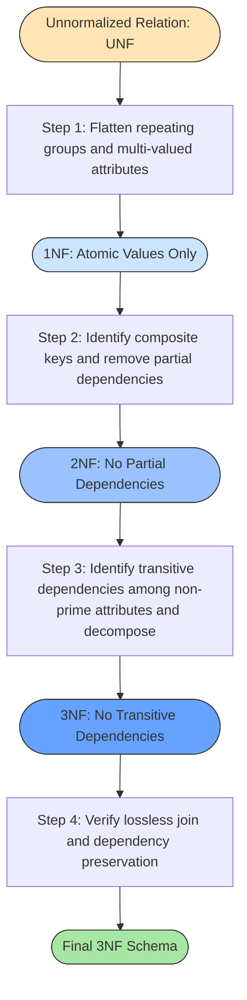
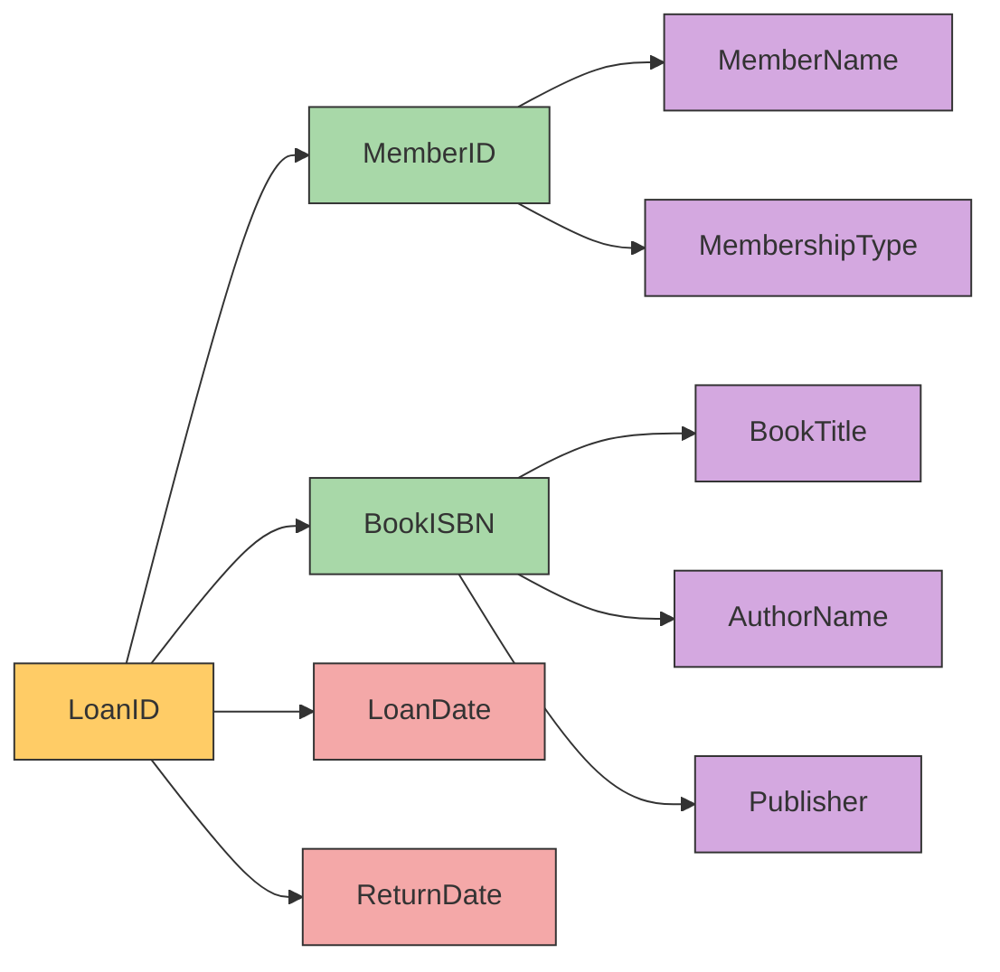
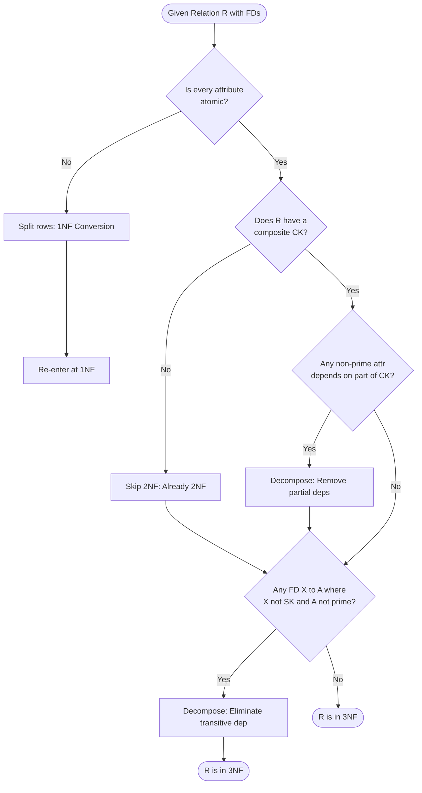

# First, Second, and Third normal forms

> **APJ ABDUL KALAM TECHNOLOGICAL UNIVERSITY (KTU) | 2024 SCHEME**
> - **Branch:** B.Tech in Computer Science & Engineering (CSE)
> - **Semester:** Semester 4
> - **Course:** PCCST402 - DATABASE MANAGEMENT SYSTEMS
> - **Module:** Module 3: Database Design Theory & Normalization
> - **Topic:** First, Second, and Third normal forms

<!-- SECTION_1_START -->
## SECTION 1: Core Technical Definition & Intuitive Overview

### 1.1 What is Normalization?

**Normalization** is a systematic, step-by-step database design technique used in the relational data model to organize relations (tables) in a way that **minimizes data redundancy** and **eliminates undesirable anomalies** such as insertion, update, and deletion anomalies. The process involves decomposing a large, poorly-structured relation into smaller, well-structured relations based on **Functional Dependencies (FDs)** and a set of mathematical rules called **normal forms**.

> [!IMPORTANT]
> **KTU 2024 Syllabus Definition:**
> *"Normal forms are a set of conditions (rules) that a relation must satisfy to be considered well-designed. Each normal form (1NF, 2NF, 3NF, BCNF...) represents a progressively stricter level of data integrity, with higher normal forms guaranteeing fewer anomalies."*

The first three normal forms — **1NF, 2NF, and 3NF** — were originally defined by **Edgar F. Codd** (the inventor of the relational model) in his seminal 1970–1972 papers. Together, they form the foundation of practical relational database design taught across KTU semesters.

---

### 1.2 The Three Anomalies Normalization Tries to Eliminate

Before we dive into the rules, you must understand the **three classical anomalies** that poor design causes:

| # | Anomaly Type | What Goes Wrong? | Simple Example |
|---|---|---|---|
| 1 | **Insertion Anomaly** | We *cannot* insert a fact about one entity until we have facts about another entity. | Cannot add a new *Department* until at least one *Student* is assigned to it. |
| 2 | **Update Anomaly** | Updating a single fact requires changing it in *multiple rows*. If we miss one row, the database becomes inconsistent. | Department Head's name is repeated in 50 rows. Updating it in 49 rows leaves row 50 stale. |
| 3 | **Deletion Anomaly** | Deleting one fact inadvertently removes another fact that we wanted to keep. | Deleting the last student of the "Physics" department also deletes the fact that the Physics department exists. |

> [!NOTE]
> The whole purpose of 1NF → 2NF → 3NF is to **eliminate** these anomalies progressively by removing specific types of unwanted dependencies.

---

### 1.3 Conceptual Analogy: The "Messy Cupboard" Intuition

Imagine you have a single, huge cupboard drawer where you dump **everything** — your socks, tax receipts, your friend's phone number, and a half-eaten chocolate. That's an *un-normalized* relation. To organize it:

- **1NF** is like saying: *"Put each individual item into its own clearly-labeled box. No more dumping a whole junk-drawer into a single cell."* (Eliminate multi-valued / repeating groups.)
- **2NF** is like saying: *"Don't write your friend's phone number on the *back* of a tax receipt. That receipt might get shredded, and you'd lose the phone number too."* (Eliminate partial dependencies on a composite key.)
- **3NF** is like saying: *"Don't store your friend's phone number *and* their home address both in the same box if the address can be derived from the phone number. Keep only one source of truth."* (Eliminate transitive dependencies.)

Each step makes the cupboard **more organized, less redundant, and safer to use**.

---

### 1.4 Two Critical Pre-Requisites You Must Know First

> [!IMPORTANT]
> Before applying any normal form, you must be able to identify the following:

1. **Super Key** — Any set of attributes whose values uniquely identify a row in a relation. (Example: `{StudentID, CourseID}` in an enrolment table.)
2. **Candidate Key** — A *minimal* super key, i.e., no proper subset of it is a super key. (Example: `{StudentID}` in a Student table.)
3. **Prime Attribute** — An attribute that is a member of *some* candidate key.
4. **Non-Prime Attribute** — An attribute that is **not** a member of *any* candidate key.

**Example:** In a relation $R(StudentID, CourseID, Grade)$, the candidate key is $\{StudentID, CourseID\}$. Both $StudentID$ and $CourseID$ are **prime**, while $Grade$ is **non-prime**.

---

### 1.5 Formal Definition — First Normal Form (1NF)

> [!IMPORTANT]
> **1NF Definition (Codd, 1970):**
> *"A relation $R$ is in First Normal Form (1NF) if and only if the domain of every attribute in $R$ contains only atomic (indivisible) values and every value in the relation is a single value from its domain."*

In simpler words:
- **No multi-valued attributes** (no cells containing lists/sets).
- **No repeating groups** (no multiple columns for the same fact, e.g., `Phone1`, `Phone2`, `Phone3`).
- **Each row must be unique** (implied by the relational definition of a set).

**Violating Example:**

| StudentID | Name | Phones |
|---|---|---|
| 1 | Arun | 9876543210, 9123456789 |
| 2 | Beena | 9000000000 |

Here `Phones` holds two values in one cell — **not 1NF**.

**1NF Conversion:** Extract the repeating values into separate rows.

| StudentID | Name | Phone |
|---|---|---|
| 1 | Arun | 9876543210 |
| 1 | Arun | 9123456789 |
| 2 | Beena | 9000000000 |

---

### 1.6 Formal Definition — Second Normal Form (2NF)

> [!IMPORTANT]
> **2NF Definition:**
> *"A relation $R$ is in Second Normal Form (2NF) if and only if it is in 1NF and every non-prime attribute is fully functionally dependent on every candidate key of $R$."*

In simpler words:
- It must already be in **1NF**.
- **No partial dependency** is allowed — a non-prime attribute must **not** depend on *only a part* of a composite candidate key.

**Violating Example:** Consider `Enrolment(StudentID, CourseID, StudentName, Grade)` with FDs: $\{StudentID, CourseID\} \rightarrow Grade$ and $StudentID \rightarrow StudentName$.

- Candidate Key: $\{StudentID, CourseID\}$
- $StudentName$ depends **only** on $StudentID$ (a *part* of the key) → **partial dependency** → violates 2NF.

**Fix:** Decompose into:
- `Enrolment(StudentID, CourseID, Grade)`
- `Student(StudentID, StudentName)`

---

### 1.7 Formal Definition — Third Normal Form (3NF)

> [!IMPORTANT]
> **3NF Definition (Codd, 1971):**
> *"A relation $R$ is in Third Normal Form (3NF) if and only if it is in 2NF and no non-prime attribute is transitively dependent on any candidate key of $R$."*

Equivalently (the **synthesis-friendly form** by Carlo Zaniolo, 1982):
> *"For every non-trivial functional dependency $X \rightarrow A$ in $R$, either $X$ is a super key of $R$, OR $A$ is a prime attribute."*

In simpler words:
- Must already be in **2NF**.
- **No transitive dependency** — i.e., no non-prime attribute should depend on *another non-prime attribute*.

**Violating Example:** Consider `Student(StudentID, DeptID, DeptName)` with FDs: $StudentID \rightarrow DeptID$ and $DeptID \rightarrow DeptName$.

- Candidate Key: $\{StudentID\}$
- $StudentID \rightarrow DeptID \rightarrow DeptName$ → $DeptName$ depends on $DeptID$, which depends on the key. This is a **transitive dependency** → violates 3NF.

**Fix:** Decompose into:
- `Student(StudentID, DeptID)`
- `Department(DeptID, DeptName)`

---

### 1.8 Visual Summary of the Three Normal Forms

> [!VISUALIZATION CONTROL]
> **Concept:** Normal Form Hierarchy (Lattice of Constraints)
> **Conceptual Lattice Representation:**
> * Level 1 (1NF): The base — "Atomic values only."
> * Level 2 (2NF): 1NF + "No partial dependencies."
> * Level 3 (3NF): 2NF + "No transitive dependencies."
> **Visual Description:** Imagine three concentric rings. The innermost ring is the strictest (3NF). The outer rings are supersets. Every 3NF relation is automatically 2NF and 1NF, but the reverse is **not** true.

---
<!-- SECTION_1_END -->

<!-- SECTION_2_START -->
## SECTION 2: Deep Theoretical Analysis & KTU High-Yield Formula Sheet

### 2.1 The "Why" Behind Each Normal Form

A deeper look at the logical intent:

- **1NF** attacks **structural redundancy** that comes from stuffing multiple values into a single column. It enforces a *row-tuple* view of data.
- **2NF** attacks **redundancy arising from composite keys**. When a key has multiple columns, facts that depend on only one column cause duplication.
- **3NF** attacks **redundancy arising from chain dependencies**. Even after 1NF/2NF, an attribute might depend on another non-key attribute — and that intermediate dependency creates duplication.

---

### 2.2 Step-by-Step Logic for Checking Each Normal Form

#### Checking 1NF
1. Look at the **schema** of the relation. Identify each attribute's domain.
2. For every row, verify each cell contains a **single, atomic value**.
3. Confirm no column is a *repeating group* (i.e., no parallel columns like `Phone1`, `Phone2`).
4. If violations exist, **split the row** so each atomic value gets its own tuple.

#### Checking 2NF
1. **First**, ensure the relation is in 1NF.
2. Identify the **candidate keys** of the relation.
3. List the **non-prime attributes**.
4. For every non-prime attribute $A$, check if it is **fully** functionally dependent on each candidate key. Specifically:
   - If a candidate key is composite (has $\geq 2$ attributes), test whether $A$ depends on a *proper subset* of it.
   - If yes, that is a **partial dependency** → violates 2NF.
5. To fix: for each partial dependency $X \rightarrow A$ (where $X$ is a proper subset of a candidate key), create a new relation with $X$ and $A$, and remove $A$ from the original.

#### Checking 3NF
1. **First**, ensure the relation is in 2NF.
2. For every non-trivial FD $X \rightarrow A$ in the relation, check **Zaniolo's condition**:
   - Is $X$ a super key? **OR**
   - Is $A$ a prime attribute?
3. If **both** answers are NO, the relation is **not in 3NF** (it has a transitive dependency via a non-prime attribute).
4. To fix: for the violating FD $X \rightarrow A$, decompose $R$ into:
   - $R_1(X, A)$ — and $X$ becomes the key of this new relation.
   - $R_2(R - A)$ — the original relation minus $A$.

---

### 2.3 Test for Boyce–Codd Normal Form (BCNF) — Context-Setting

> [!NOTE]
> KTU 2024 Module 3 also touches on BCNF as a stricter version of 3NF. While our *primary* topic is 1NF, 2NF, 3NF, you should know the relation:
>
> **3NF relaxes BCNF** by allowing an FD $X \rightarrow A$ where $A$ is a **prime** attribute but $X$ is not a super key. BCNF disallows this entirely.

For example, `Enrolment(StudentID, CourseID, Professor)` with FDs:
- $\{StudentID, CourseID\} \rightarrow Professor$
- $Professor \rightarrow CourseID$

Here, $CourseID$ is prime. $Professor \rightarrow CourseID$ violates BCNF (since $Professor$ is not a super key), but **does not** violate 3NF (because $CourseID$ is a prime attribute). This is the canonical BCNF-vs-3NF example.

---

### 2.4 Decomposition Properties (Lossless Join & Dependency Preservation)

When you decompose a relation while normalizing, two properties **must** be preserved (these are heavily tested in KTU):

| Property | Definition | How to Test |
|---|---|---|
| **Lossless Join** | When the original relation is reconstructed by joining the decomposed relations, no spurious tuples appear. | The decomposition $R \rightarrow (R_1, R_2)$ is lossless if and only if the common attributes $R_1 \cap R_2 \rightarrow R_1$ **or** $R_1 \cap R_2 \rightarrow R_2$. |
| **Dependency Preservation** | Every FD in the original relation can still be enforced by checking the decomposed relations alone. | The decomposition preserves $F$ if $F^+ = (F_1 \cup F_2 \cup \dots \cup F_n)^+$. |

> [!IMPORTANT]
> **KTU Valuation Tip:** Always normalization into 3NF using the **synthesis algorithm** (Bernstein, 1976) guarantees dependency preservation. 2NF and 3NF decompositions are usually lossless if you decompose along the offending FD.

---

### 2.5 Prime vs Non-Prime — Worked Mini-Example

Consider $R(A, B, C, D, E)$ with FDs:
- $AB \rightarrow C$
- $C \rightarrow D$
- $D \rightarrow E$

**Step 1:** Find the candidate key.
- $AB^+$ = $\{A, B, C, D, E\}$ → so $AB$ is a super key.
- Is $A^+$ a key? $A$ alone gives nothing else.
- Is $B^+$ a key? $B$ alone gives nothing else.
- So candidate key is $\{A, B\}$.

**Step 2:** Identify primes and non-primes.
- Primes: $A$, $B$.
- Non-primes: $C$, $D$, $E$.

**Step 3:** Check normal forms.
- **1NF?** Assume atomic values. → Yes.
- **2NF?** Is any non-prime attribute partially dependent on $AB$? Yes — $A$ alone does not determine $C$, but if $B \rightarrow C$ were true, that would be partial. Here, only $AB \rightarrow C$ holds, so $C$ is **fully** dependent. → Still 2NF.
- **3NF?** Is there a transitive dependency? Yes: $AB \rightarrow C \rightarrow D \rightarrow E$. So $C$, $D$, $E$ are transitively dependent. → **Violates 3NF.**

---

### 2.6 KTU High-Yield Formula / Rule Sheet

> [!IMPORTANT]
> **Save this table for last-minute revision. Every entry is KTU-exam-relevant.**

| # | Rule / Formula | Mathematical Form | Purpose / When Used |
|---|---|---|---|
| 1 | **1NF Condition** | $\forall A \in R$, $\text{dom}(A)$ is atomic | Eliminate multi-valued attributes |
| 2 | **2NF Condition** | $\forall$ non-prime $A$, $A$ is fully FD on every CK | Eliminate partial dependencies |
| 3 | **3NF Condition (Zaniolo)** | $\forall$ FD $X \rightarrow A$: $X$ is SK **OR** $A$ is prime | Eliminate transitive dependencies |
| 4 | **BCNF Condition** | $\forall$ non-trivial FD $X \rightarrow A$: $X$ is SK | Strictest 3NF-compatible form |
| 5 | **Lossless Join Test** | $(R_1 \cap R_2) \rightarrow R_1$ **or** $(R_1 \cap R_2) \rightarrow R_2$ | Verify decomposition is reversible |
| 6 | **Dependency Preservation** | $F^+ = (F_1 \cup F_2 \cup \dots)^+$ | Verify FDs are still enforceable |
| 7 | **Prime Attribute** | $A \in$ some Candidate Key | Determines if an attribute can rescue a 3NF violation |
| 8 | **Partial Dependency** | $X \subset \text{CK}$, $X \rightarrow A$, $A$ non-prime | Hallmark of 2NF violation |
| 9 | **Transitive Dependency** | $X \rightarrow Y \rightarrow Z$ where $X$ is CK, $Y, Z$ non-prime | Hallmark of 3NF violation |
| 10 | **Canonical Cover (Minimal F)** | $F_c$ = minimal equivalent set of FDs | First step in 3NF synthesis algorithm |

---

### 2.7 Real-World Engineering Utility

- **Banking Systems:** 3NF is the *minimum standard* for account, customer, and transaction tables. Without it, updating an address would require updating thousands of account rows.
- **E-Commerce Catalogs:** 1NF is enforced by ensuring each `ProductImage` URL is one row, not a CSV. 2NF/3NF prevent SKU-related anomalies.
- **Healthcare Records (HL7 / FHIR):** Strict 3NF-like schemas ensure patient demographics are stored *once* and referenced via foreign keys, preventing data drift.
- **Data Warehousing:** Even denormalized star/snowflake schemas are *derived* from 3NF-base schemas via deliberate denormalization for read performance.

---
<!-- SECTION_2_END -->

<!-- SECTION_3_START -->
## SECTION 3: Step-by-Step Derivations & Worked Examples

### 3.1 Complete Worked Example: Normalize a Relation Step-by-Step

> [!IMPORTANT]
> **This is the most exam-relevant part of the topic. KTU frequently asks: "Normalize the given relation into 1NF, 2NF, and 3NF."** Pay close attention to every algebraic step.

#### Problem Statement

Consider the following relation used by a college library to track book loans.

**Relation:** `Loan(LoanID, MemberID, MemberName, MembershipType, BookISBN, BookTitle, AuthorName, Publisher, LoanDate, ReturnDate)`

**Given Functional Dependencies:**

$$
\begin{aligned}
&\text{FD1: } LoanID \rightarrow MemberID, BookISBN, LoanDate, ReturnDate \\
&\text{FD2: } MemberID \rightarrow MemberName, MembershipType \\
&\text{FD3: } BookISBN \rightarrow BookTitle, AuthorName, Publisher \\
\end{aligned}
$$

**Goal:** Normalize this relation into 1NF, then 2NF, then 3NF. Identify all anomalies at each stage.

---

#### STEP 1: Identify the Candidate Key

- The only attribute that uniquely identifies a loan instance is `LoanID` (one specific loan record).
- Compute `LoanID+`:
  - From FD1: `LoanID` → `MemberID, BookISBN, LoanDate, ReturnDate`.
  - From FD2: `MemberID` → `MemberName, MembershipType`.
  - From FD3: `BookISBN` → `BookTitle, AuthorName, Publisher`.
  - So `LoanID+` = `{LoanID, MemberID, BookISBN, LoanDate, ReturnDate, MemberName, MembershipType, BookTitle, AuthorName, Publisher}` — the **entire relation**.

**Conclusion:** The **only candidate key** is `{LoanID}`.

---

#### STEP 2: Identify Prime and Non-Prime Attributes

- **Prime attribute:** `LoanID` (the only candidate key attribute).
- **Non-prime attributes:** `MemberID, BookISBN, LoanDate, ReturnDate, MemberName, MembershipType, BookTitle, AuthorName, Publisher`.

---

#### STEP 3: Test for 1NF

**Check:** Are all attribute domains atomic?

In this base case, assume all values are single-valued (no list of books in one cell, no comma-separated authors). The schema is given in a tabular form.

**Verdict:** ✅ The relation is in **1NF** (assuming atomic values).

If there were a column like `BookISBNs` containing multiple ISBNs separated by commas, we would first split it into multiple rows before proceeding.

---

#### STEP 4: Test for 2NF

**Rule:** No non-prime attribute can be partially dependent on the candidate key.

**Observation:** The candidate key is `{LoanID}` — it is **atomic** (single attribute), not composite. Therefore, **partial dependencies are impossible** by definition (a partial dependency requires the key to have $\geq 2$ attributes).

**Verdict:** ✅ The relation is in **2NF**.

> [!NOTE]
> **Student Pitfall:** Many KTU students falsely report 2NF violations when the key is a single attribute. 2NF is *only* relevant for relations with **composite** keys.

---

#### STEP 5: Test for 3NF

**Rule (Zaniolo):** For every FD $X \rightarrow A$, either $X$ is a super key OR $A$ is a prime attribute.

**Audit each FD:**

- **FD1:** `LoanID → {MemberID, BookISBN, LoanDate, ReturnDate}`. $X = \{LoanID\}$ is a super key ✅. All RHS attributes are non-prime, but the condition is satisfied by $X$ being a super key.
- **FD2:** `MemberID → {MemberName, MembershipType}`. $X = \{MemberID\}$ is **not** a super key. $A$ = `MemberName`, `MembershipType` — both are **non-prime**. ❌ **VIOLATION.**
- **FD3:** `BookISBN → {BookTitle, AuthorName, Publisher}`. $X = \{BookISBN\}$ is **not** a super key. $A$ = `BookTitle`, `AuthorName`, `Publisher` — all **non-prime**. ❌ **VIOLATION.**

**Conclusion:** The relation is in 1NF and 2NF, but **violates 3NF** due to **transitive dependencies**:

$$
LoanID \rightarrow MemberID \rightarrow MemberName
$$
$$
LoanID \rightarrow MemberID \rightarrow MembershipType
$$
$$
LoanID \rightarrow BookISBN \rightarrow BookTitle
$$
$$
LoanID \rightarrow BookISBN \rightarrow AuthorName
$$
$$
LoanID \rightarrow BookISBN \rightarrow Publisher
$$

---

#### STEP 6: Decompose into 3NF

We will split the relation into multiple smaller relations to eliminate the transitive dependencies.

**Decomposition Rule:** For each violating FD $X \rightarrow A$, create a new relation $R_i(X, A)$ with $X$ as the key.

**Step 6a:** Decompose based on FD2 (`MemberID → MemberName, MembershipType`):

Create relation `Member`:
- Schema: `Member(MemberID, MemberName, MembershipType)`
- Primary Key: `MemberID`
- FD: `MemberID → MemberName, MembershipType`

**Step 6b:** Decompose based on FD3 (`BookISBN → BookTitle, AuthorName, Publisher`):

Create relation `Book`:
- Schema: `Book(BookISBN, BookTitle, AuthorName, Publisher)`
- Primary Key: `BookISBN`
- FD: `BookISBN → BookTitle, AuthorName, Publisher`

**Step 6c:** Remove the moved attributes from the original `Loan` relation:

Resulting relation `Loan`:
- Schema: `Loan(LoanID, MemberID, BookISBN, LoanDate, ReturnDate)`
- Primary Key: `LoanID`
- Foreign Keys: `MemberID` → `Member(MemberID)`, `BookISBN` → `Book(BookISBN)`

---

#### STEP 7: Final 3NF Schema

After normalization, the database consists of **three relations**:

| Relation | Attributes | Primary Key | Foreign Keys |
|---|---|---|---|
| **Member** | `MemberID, MemberName, MembershipType` | `MemberID` | — |
| **Book** | `BookISBN, BookTitle, AuthorName, Publisher` | `BookISBN` | — |
| **Loan** | `LoanID, MemberID, BookISBN, LoanDate, ReturnDate` | `LoanID` | `MemberID, BookISBN` |

---

#### STEP 8: Verify Lossless Join and Dependency Preservation

**Lossless Join Check:** The common attribute between `Loan` and `Member` is `MemberID`. Does `MemberID → MemberID`? Yes, trivially. So the join is lossless. Similarly, `BookISBN` is the common attribute between `Loan` and `Book`, and `BookISBN → BookISBN` holds.

**Dependency Preservation Check:**
- FD1: `LoanID → MemberID, BookISBN, LoanDate, ReturnDate` is enforced in `Loan`. ✅
- FD2: `MemberID → MemberName, MembershipType` is enforced in `Member`. ✅
- FD3: `BookISBN → BookTitle, AuthorName, Publisher` is enforced in `Book`. ✅

**Verdict:** The decomposition is **lossless and dependency-preserving**. ✅

---

### 3.2 Algorithmic Implementation: Normal Form Checker in Python

> [!NOTE]
> This is supplementary — it shows how the theoretical rules can be codified, useful for understanding the logic.

```python
from typing import Set, Dict, List, FrozenSet

def compute_closure(
    attrs: Set[str],
    fds: Dict[FrozenSet[str], Set[str]]
) -> Set[str]:
    """
    Compute the attribute closure of `attrs` under the given FDs.
    """
    closure = set(attrs)
    changed = True
    while changed:
        changed = False
        for lhs, rhs in fds.items():
            if lhs.issubset(closure) and not rhs.issubset(closure):
                closure |= rhs
                changed = True
    return closure


def find_candidate_keys(
    attributes: Set[str],
    fds: Dict[FrozenSet[str], Set[str]]
) -> List[Set[str]]:
    """
    Brute-force enumeration of all minimal candidate keys.
    """
    from itertools import combinations
    keys = []
    attr_list = list(attributes)
    for r in range(1, len(attr_list) + 1):
        for combo in combinations(attr_list, r):
            candidate = set(combo)
            if compute_closure(candidate, fds) == attributes:
                # Check minimality: no proper subset is also a key
                is_minimal = all(
                    compute_closure(set(sub), fds) != attributes
                    for sub in combinations(candidate, len(candidate) - 1)
                )
                if is_minimal and candidate not in keys:
                    keys.append(candidate)
    return keys


def check_normal_forms(
    attributes: Set[str],
    fds: Dict[FrozenSet[str], Set[str]]
) -> Dict[str, bool]:
    """
    Determine which normal forms (1NF, 2NF, 3NF) the relation satisfies.
    Assumes 1NF if the input is given as a flat set of attributes.
    """
    candidate_keys = find_candidate_keys(attributes, fds)
    prime = set().union(*candidate_keys) if candidate_keys else set()

    result = {"1NF": True, "2NF": True, "3NF": True}

    # 2NF check: composite keys with partial dependencies
    for key in candidate_keys:
        if len(key) > 1:
            from itertools import combinations
            for r in range(1, len(key)):
                for sub in combinations(key, r):
                    sub_closure = compute_closure(set(sub), fds)
                    for a in sub_closure:
                        if a not in prime and a in attributes:
                            result["2NF"] = False
                            break

    # 3NF check: Zaniolo's condition
    for lhs, rhs in fds.items():
        lhs_closure = compute_closure(lhs, fds)
        is_superkey = lhs_closure == attributes
        for a in rhs:
            if a not in prime and not is_superkey:
                result["3NF"] = False
                break

    return result


# ---- Demonstration with the Loan example ----
if __name__ == "__main__":
    attrs = {
        "LoanID", "MemberID", "MemberName", "MembershipType",
        "BookISBN", "BookTitle", "AuthorName", "Publisher",
        "LoanDate", "ReturnDate"
    }
    fds = {
        frozenset({"LoanID"}): {"MemberID", "BookISBN", "LoanDate", "ReturnDate"},
        frozenset({"MemberID"}): {"MemberName", "MembershipType"},
        frozenset({"BookISBN"}): {"BookTitle", "AuthorName", "Publisher"},
    }
    keys = find_candidate_keys(attrs, fds)
    print(f"Candidate Keys: {[sorted(k) for k in keys]}")
    result = check_normal_forms(attrs, fds)
    print(f"Normal Form Status: {result}")
    # Expected output:
    # Candidate Keys: [['LoanID']]
    # Normal Form Status: {'1NF': True, '2NF': True, '3NF': False}
```

**Expected Output:**

```
Candidate Keys: [['LoanID']]
Normal Form Status: {'1NF': True, '2NF': True, '3NF': False}
```

---

### 3.3 SQL Representation of the Final 3NF Schema

```sql
-- Member relation
CREATE TABLE Member (
    MemberID        VARCHAR(20)  PRIMARY KEY,
    MemberName      VARCHAR(100) NOT NULL,
    MembershipType  VARCHAR(50)  NOT NULL
);

-- Book relation
CREATE TABLE Book (
    BookISBN    VARCHAR(20)  PRIMARY KEY,
    BookTitle   VARCHAR(200) NOT NULL,
    AuthorName  VARCHAR(100) NOT NULL,
    Publisher   VARCHAR(100) NOT NULL
);

-- Loan relation with foreign keys
CREATE TABLE Loan (
    LoanID      VARCHAR(20)  PRIMARY KEY,
    MemberID    VARCHAR(20)  NOT NULL,
    BookISBN    VARCHAR(20)  NOT NULL,
    LoanDate    DATE         NOT NULL,
    ReturnDate  DATE,
    FOREIGN KEY (MemberID) REFERENCES Member(MemberID)
        ON UPDATE CASCADE ON DELETE RESTRICT,
    FOREIGN KEY (BookISBN) REFERENCES Book(BookISBN)
        ON UPDATE CASCADE ON DELETE RESTRICT
);
```

> [!NOTE]
> The `ON UPDATE CASCADE` and `ON DELETE RESTRICT` clauses are not strictly part of normalization, but they enforce **referential integrity** in the resulting schema — a real-world concern that 3NF alone doesn't address.

---
<!-- SECTION_3_END -->

<!-- SECTION_4_START -->
## SECTION 4: Structural Diagrams & Schematics

### 4.1 Normalization Process Flow (Mermaid)



---

### 4.2 Functional Dependency Graph for the Loan Example



**Reading the graph:**
- **Yellow node (LoanID):** Candidate Key (prime attribute).
- **Green nodes (MemberID, BookISBN):** Non-prime but are themselves keys of other relations.
- **Purple nodes:** Attributes that depend on green nodes → these trigger the **3NF violation**.
- **Red nodes (LoanDate, ReturnDate):** Direct, non-transitive dependencies on the candidate key → safe in 3NF.

---

### 4.3 Decomposition Topology (Block Diagram)

```mermaid
subgraph INPUT["Original UNF Relation"]
    R0[Loan: LoanID, MemberID, MemberName, MembershipType, BookISBN, BookTitle, AuthorName, Publisher, LoanDate, ReturnDate]
end

subgraph STAGE1["1NF Step"]
    R1[Flatten: Atomic Tuples]
end

subgraph STAGE2["2NF Step"]
    R2[Verify Single-Attribute Key: 2NF Pass]
end

subgraph STAGE3["3NF Decomposition"]
    R3a[Member: MemberID, MemberName, MembershipType]
    R3b[Book: BookISBN, BookTitle, AuthorName, Publisher]
    R3c[Loan: LoanID, MemberID, BookISBN, LoanDate, ReturnDate]
end

subgraph STAGE4["Verification"]
    V1[Lossless Join Check]
    V2[Dependency Preservation Check]
end

R0 --> R1 --> R2 --> R3a
R2 --> R3b
R2 --> R3c
R3a --> V1
R3b --> V1
R3c --> V1
V1 --> V2
```

---

### 4.4 Decision Logic for Normal Form Verification (Flowchart)



---
<!-- SECTION_4_END -->

<!-- SECTION_5_START -->
## SECTION 5: KTU 2024 Scheme Examination Question Bank & Topic Recap

### 5.1 Part A Questions (3 Marks Each)

> [!NOTE]
> **Cognitive Levels: Remember / Understand. Direct definition or short-explanation questions.**

---

**Q1. [KTU University Exam - July 2024 Style]**
**Define First Normal Form (1NF) and Second Normal Form (2NF). State the condition under which a relation in 2NF is automatically in 1NF.**

**Model Answer (Valuation Key):**

**1NF Definition [1.5 Marks]:**
A relation $R$ is in First Normal Form (1NF) if every cell of the relation contains only an **atomic (single) value** from its attribute's domain. The relation must have:
- No multi-valued attributes (no sets/lists in a single cell).
- No repeating groups (no parallel columns for the same logical attribute, e.g., `Phone1`, `Phone2`).

**2NF Definition [1.5 Marks]:**
A relation $R$ is in Second Normal Form (2NF) if and only if:
1. $R$ is in 1NF, **AND**
2. Every **non-prime attribute** is **fully functionally dependent** on every candidate key of $R$ (i.e., no partial dependencies on a composite key).

**Conclusion [0.5 Marks]:**
A 2NF relation is *always* in 1NF because 2NF is defined as a *strict superset* of 1NF — you cannot satisfy the 2NF conditions without first being in 1NF.

> [!WARNING]
> **Common Mistake:** Students often say "2NF is in 1NF" without explaining the *supersets/conditions* relationship. Always mention that 2NF *implies* 1NF, not the reverse.

---

**Q2. [KTU University Exam - Dec 2023 Style]**
**Explain the concept of transitive dependency. How does it cause update anomalies? Illustrate with a small example.**

**Model Answer (Valuation Key):**

**Definition of Transitive Dependency [1 Mark]:**
Given a relation $R$ with candidate key $X$, a transitive dependency exists when:
$$X \rightarrow Y \quad \text{and} \quad Y \rightarrow Z,$$
where $Y$ is a non-prime attribute and $Z$ is also a non-prime attribute, and $X$ does **not** directly determine $Z$.

**How It Causes Update Anomalies [1 Mark]:**
Because $Z$ depends on $Y$ (and $Y$ depends on $X$), the same value of $Z$ will be **repeated** in multiple rows for different values of $X$. If $Z$ is updated in one row but not in the others, the database becomes **inconsistent**.

**Illustrative Example [1 Mark]:**

| EmpID | EmpName | DeptID | DeptLocation |
|---|---|---|---|
| 1 | Arun | D01 | Trivandrum |
| 2 | Beena | D01 | Trivandrum |
| 3 | Cijo | D02 | Kochi |

Here, `EmpID → DeptID` and `DeptID → DeptLocation` create a transitive dependency. If `DeptLocation` for `D01` is updated in one row but not the other, an update anomaly occurs.

---

### 5.2 Part B Questions (14 Marks Each)

> [!NOTE]
> **ESE Module Internal Choice format. Pick ONE option. Each sub-part carries 7 marks.**

---

#### Question A (14 Marks) — Full Normalization Exercise

**[KTU University Exam - July 2024 Style]**

Consider the following relation for a university examination system:

**Relation:** `Result(RegNo, SubCode, SubName, Credits, Grade, ExamDate, StudentName, DeptID, DeptName, FacultyID, FacultyName)`

**Functional Dependencies:**
- FD1: $\{RegNo, SubCode\} \rightarrow Grade, ExamDate$
- FD2: $RegNo \rightarrow StudentName, DeptID$
- FD3: $DeptID \rightarrow DeptName$
- FD4: $SubCode \rightarrow SubName, Credits$
- FD5: $SubCode \rightarrow FacultyID$
- FD6: $FacultyID \rightarrow FacultyName$

**(a) [7 Marks] Identify the candidate keys. Classify each attribute as prime or non-prime. State whether the given relation is in 1NF, 2NF, and 3NF. Justify.**

**(b) [7 Marks] Decompose the relation step by step into 3NF. Verify that the decomposition is lossless and dependency-preserving.**

---

**Solution to (a) — Identifying Keys, Prime/Non-Prime, and Normal Form Status**

**Step 1: Compute Candidate Key(s) [1 Mark]**

Compute the closure of $\{RegNo, SubCode\}$:

- Start: $\{RegNo, SubCode\}$
- Apply FD1: Add `Grade`, `ExamDate` → $\{RegNo, SubCode, Grade, ExamDate\}$
- Apply FD2: Add `StudentName`, `DeptID` → $\{RegNo, SubCode, Grade, ExamDate, StudentName, DeptID\}$
- Apply FD3: Add `DeptName` → $\{RegNo, SubCode, Grade, ExamDate, StudentName, DeptID, DeptName\}$
- Apply FD4: Add `SubName`, `Credits` → $\{RegNo, SubCode, Grade, ExamDate, StudentName, DeptID, DeptName, SubName, Credits\}$
- Apply FD5: Add `FacultyID` → $\{RegNo, SubCode, Grade, ExamDate, StudentName, DeptID, DeptName, SubName, Credits, FacultyID\}$
- Apply FD6: Add `FacultyName` → **All 11 attributes**.

**Conclusion:** The candidate key is $\{RegNo, SubCode\}$.

**Step 2: Check minimality [0.5 Mark]**
- $\{RegNo\}^+ = \{RegNo, StudentName, DeptID, DeptName\}$ — does not include all attributes.
- $\{SubCode\}^+ = \{SubCode, SubName, Credits, FacultyID, FacultyName\}$ — does not include all attributes.
- Therefore, both are needed, and $\{RegNo, SubCode\}$ is **minimal**. ✅

**Step 3: Prime vs Non-Prime [0.5 Mark]**
- **Prime attributes:** $RegNo$, $SubCode$.
- **Non-prime attributes:** $Grade, ExamDate, StudentName, DeptID, DeptName, SubName, Credits, FacultyID, FacultyName$.

**Step 4: Check 1NF [1 Mark]**

All attributes have atomic domains (single values per cell). ✅ Relation is in **1NF**.

**Step 5: Check 2NF [1.5 Marks]**

Candidate key is **composite** ($\{RegNo, SubCode\}$). Test partial dependencies:

- $SubCode \rightarrow SubName, Credits, FacultyID$ → these are non-prime attributes, and they depend on **only a part** of the key ($SubCode$). ❌ **Partial dependency.**
- $RegNo \rightarrow StudentName, DeptID$ → these are non-prime attributes, and they depend on **only a part** of the key ($RegNo$). ❌ **Partial dependency.**

**Verdict:** Relation is **NOT in 2NF**.

**Step 6: Check 3NF (Optional here, since 2NF fails) [0.5 Mark]**

Since 2NF fails, the relation **cannot** be in 3NF either.

**Final Status:** 1NF only. ❌ Violates both 2NF and 3NF.

> [!WARNING]
> **Common Mistake:** Students often list all FDs in one shot without showing the *closure computation step-by-step*. Examiners **require** the closure derivation. Skip this and you lose 1 mark outright.

---

**Solution to (b) — Decomposition to 3NF**

**Step 1: Move partial dependencies on $SubCode$ [1 Mark]**

Create new relation:
- `Subject(SubCode, SubName, Credits, FacultyID)`
- Primary Key: `SubCode`
- FD: $SubCode \rightarrow SubName, Credits, FacultyID$

**Step 2: Move partial dependencies on $RegNo$ [1 Mark]**

Create new relation:
- `Student(RegNo, StudentName, DeptID)`
- Primary Key: `RegNo`
- FD: $RegNo \rightarrow StudentName, DeptID$

**Step 3: Remove the transitive dependency on `DeptID → DeptName` [1 Mark]**

Create new relation:
- `Department(DeptID, DeptName)`
- Primary Key: `DeptID`
- FD: $DeptID \rightarrow DeptName$

**Step 4: Remove the transitive dependency on `FacultyID → FacultyName` [1 Mark]**

Create new relation:
- `Faculty(FacultyID, FacultyName)`
- Primary Key: `FacultyID`
- FD: $FacultyID \rightarrow FacultyName$

**Step 5: Final `Result` relation [1 Mark]**

After removing all moved attributes:
- `Result(RegNo, SubCode, Grade, ExamDate)`
- Primary Key: $\{RegNo, SubCode\}$
- Foreign Keys: $RegNo \rightarrow Student(RegNo)$, $SubCode \rightarrow Subject(SubCode)$
- FD: $\{RegNo, SubCode\} \rightarrow Grade, ExamDate$

**Step 6: Lossless Join Verification [1 Mark]**

For each decomposition, check $(R_1 \cap R_2) \rightarrow R_1$ or $R_2$:

- `Result` ∩ `Student` = $\{RegNo\}$. Is $RegNo \rightarrow$ a key of `Result`? **No** (key is $\{RegNo, SubCode\}$). But $RegNo \rightarrow$ a key of `Student`. ✅
- `Result` ∩ `Subject` = $\{SubCode\}$. Is $SubCode \rightarrow$ a key of `Subject`? **Yes**. ✅
- `Student` ∩ `Department` = $\{DeptID\}$. $DeptID \rightarrow$ key of `Department`. ✅
- `Subject` ∩ `Faculty` = $\{FacultyID\}$. $FacultyID \rightarrow$ key of `Faculty`. ✅

All decompositions are lossless. ✅

**Step 7: Dependency Preservation [1 Mark]**

Verify each original FD is enforced in *some* relation:

- FD1: $\{RegNo, SubCode\} \rightarrow Grade, ExamDate$ — in `Result`. ✅
- FD2: $RegNo \rightarrow StudentName, DeptID$ — in `Student`. ✅
- FD3: $DeptID \rightarrow DeptName$ — in `Department`. ✅
- FD4: $SubCode \rightarrow SubName, Credits$ — in `Subject`. ✅
- FD5: $SubCode \rightarrow FacultyID$ — in `Subject`. ✅
- FD6: $FacultyID \rightarrow FacultyName$ — in `Faculty`. ✅

All FDs are preserved. ✅

**Final 3NF Schema:**

| Relation | Attributes | Primary Key | Foreign Keys |
|---|---|---|---|
| **Student** | `RegNo, StudentName, DeptID` | `RegNo` | `DeptID` |
| **Department** | `DeptID, DeptName` | `DeptID` | — |
| **Subject** | `SubCode, SubName, Credits, FacultyID` | `SubCode` | `FacultyID` |
| **Faculty** | `FacultyID, FacultyName` | `FacultyID` | — |
| **Result** | `RegNo, SubCode, Grade, ExamDate` | $\{RegNo, SubCode\}$ | `RegNo, SubCode` |

---

#### Question B (14 Marks) — Alternative: BCNF vs 3NF + Decomposition

**[KTU University Exam - Dec 2023 Style]**

Consider the relation:

**Relation:** $R(\text{Student}, \text{Subject}, \text{Professor})$ with FDs:
- FD1: $\{\text{Student}, \text{Subject}\} \rightarrow \text{Professor}$
- FD2: $\text{Professor} \rightarrow \text{Subject}$

**(a) [7 Marks] Find all candidate keys. Determine if $R$ is in 1NF, 2NF, and 3NF. State reasons clearly.**

**(b) [7 Marks] Is the relation in BCNF? If not, decompose it into BCNF. Discuss whether the resulting decomposition is dependency-preserving.**

---

**Solution to (a) — Keys and Normal Form Status**

**Step 1: Find candidate keys [2 Marks]**

Compute $\{Student, Professor\}^+$:
- Start: $\{Student, Professor\}$
- Apply FD2: $Professor \rightarrow Subject$ → Add `Subject`
- Now: $\{Student, Professor, Subject\}$
- Apply FD1: $\{Student, Subject\} \rightarrow Professor$ → `Professor` already present.
- Closure: $\{Student, Professor, Subject\}$ — the entire relation.

So $\{Student, Professor\}$ is a candidate key. ✅

Compute $\{Student, Subject\}^+$:
- Start: $\{Student, Subject\}$
- Apply FD1: Add `Professor` → $\{Student, Subject, Professor\}$ — entire relation.

So $\{Student, Subject\}$ is also a candidate key. ✅

**Conclusion:** The candidate keys are $\{Student, Professor\}$ and $\{Student, Subject\}$.

**Step 2: Prime and Non-Prime [0.5 Mark]**
- **Primes:** $Student$, $Professor$, $Subject$ (all appear in at least one candidate key).
- **Non-primes:** *None* (there are only 3 attributes, all of which are prime).

**Step 3: Check 1NF, 2NF, 3NF [4.5 Marks]**

- **1NF:** Assume atomic values. ✅
- **2NF:** Both candidate keys are composite. But since there are **no non-prime attributes**, the 2NF condition is **vacuously satisfied**. ✅
- **3NF (Zaniolo's condition):** For every FD $X \rightarrow A$, $X$ is a super key OR $A$ is a prime attribute.
  - FD1: $X = \{Student, Subject\}$, $A = Professor$. $X$ **is** a super key. ✅
  - FD2: $X = \{Professor\}$, $A = Subject$. $X$ is **not** a super key. But $A = Subject$ **is** a prime attribute (it belongs to CK $\{Student, Subject\}$). ✅

**Verdict:** Relation is in **1NF, 2NF, and 3NF**.

> [!WARNING]
> **Common Mistake:** Students often say "FD2 violates 3NF because $\{Professor\}$ is not a super key" — they forget the **disjunction** ("OR $A$ is prime") in Zaniolo's condition. The presence of prime attributes on the RHS is the key escape clause.

---

**Solution to (b) — BCNF Check and Decomposition**

**Step 1: BCNF check [1 Mark]**

**BCNF Rule:** For every non-trivial FD $X \rightarrow A$, $X$ must be a **super key**.

- FD1: $X = \{Student, Subject\}$ is a super key. ✅
- FD2: $X = \{Professor\}$ is **not** a super key. ❌

**Verdict:** Relation is **NOT in BCNF**.

**Step 2: BCNF Decomposition [3 Marks]**

Apply the BCNF decomposition algorithm: identify a violating FD and split.

**Violating FD:** $Professor \rightarrow Subject$.

Split $R$ into:
- $R_1(\text{Professor}, \text{Subject})$ with key $\{Professor\}$ and FD: $Professor \rightarrow Subject$
- $R_2(\text{Student}, \text{Professor})$ with key $\{Student, Professor\}$ and FD: $\{Student, Professor\} \rightarrow$ (trivial)

**Step 3: Verify BCNF of the decomposed relations [1 Mark]**

- $R_1$: $Professor \rightarrow Subject$, and $Professor$ is a super key of $R_1$. ✅ BCNF.
- $R_2$: Only key is $\{Student, Professor\}$, and the only FD is trivial. ✅ BCNF.

**Step 4: Dependency Preservation Analysis [2 Marks]**

- FD1 ($\{Student, Subject\} \rightarrow Professor$): After decomposition, this FD involves attributes from **both** $R_1$ and $R_2$. It **cannot** be enforced in either $R_1$ or $R_2$ alone. ❌ **NOT preserved.**
- FD2 ($Professor \rightarrow Subject$): Enforced in $R_1$. ✅

**Conclusion:** The BCNF decomposition is **lossless** (by the standard theorem for BCNF decomposition), but **NOT dependency-preserving**. This is the classic trade-off illustrated by the 3NF-vs-BCNF comparison.

> [!WARNING]
> **Valuation Pitfall:** Do not claim that BCNF decomposition always preserves dependencies. The canonical counter-example is precisely this relation $R(Student, Subject, Professor)$. If a question asks for *both* BCNF and dependency preservation, the answer is: it is not always possible, and we settle for 3NF.

---

### 5.3 KTU Examiner's Valuation Warning

> [!WARNING]
> **Where students lose the most marks in 1NF/2NF/3NF questions:**
>
> 1. **Forgetting to compute the candidate key via closure.** [−1 to −2 marks] Always show the $\{X\}^+$ derivation step-by-step.
> 2. **Confusing partial and transitive dependencies.** Partial = non-prime attr depends on *part* of a composite key. Transitive = non-prime attr depends on *another non-prime attr*. Do not mix them up.
> 3. **Failing to identify that 2NF is vacuously satisfied for single-attribute keys.** If the candidate key is atomic, 2NF cannot be violated. State this explicitly.
> 4. **Skipping the lossless join / dependency preservation verification.** KTU frequently awards 1–2 marks just for this verification, even if your decomposition is correct.
> 5. **Ignoring the prime-attribute escape clause in 3NF.** Zaniolo's condition is an **OR** — never forget the second half.
> 6. **Not stating the type of anomaly eliminated** at each step (insertion, update, deletion). Examiners love this extra justification.

---

### 5.4 Topic Recap & Important Things to Remember

> [!IMPORTANT]
> **Rapid-Revision Checklist — Memorize Before the Exam**

- **1NF (First Normal Form):**
  - Atomic values only. No multi-valued cells, no repeating groups.
  - To convert: split multi-valued cells into separate rows.
  - Eliminates: structural redundancy from list-type attributes.

- **2NF (Second Normal Form):**
  - 1NF + no **partial dependency** of a non-prime attribute on a composite candidate key.
  - Relevant *only* when the candidate key is composite (≥ 2 attributes).
  - If the candidate key is a single attribute, the relation is *automatically* in 2NF.
  - To convert: for each partial FD $X \rightarrow A$, create a new relation with $X$ as the key and remove $A$ from the original.

- **3NF (Third Normal Form):**
  - 2NF + no **transitive dependency** of a non-prime attribute on a candidate key via another non-prime attribute.
  - **Zaniolo's condition (3NF):** For every FD $X \rightarrow A$, $X$ is a super key **OR** $A$ is a prime attribute.
  - To convert: for each violating transitive chain, extract the intermediate relation.
  - Always **lossless** and usually **dependency-preserving**.

- **BCNF (Boyce–Codd Normal Form) — Bonus context:**
  - 3NF + for every non-trivial FD $X \rightarrow A$, $X$ is a super key.
  - **Strictly stricter** than 3NF. The only difference: BCNF disallows FDs where RHS is prime but LHS is not a super key.
  - BCNF decomposition is always lossless, but **may not be** dependency-preserving.

- **Prime vs Non-Prime:**
  - Prime = appears in *some* candidate key.
  - Non-prime = does *not* appear in any candidate key.

- **Anomalies Eliminated:**
  - 1NF → eliminates update anomaly from multi-valued cells.
  - 2NF → eliminates update/insertion/deletion anomalies from partial dependencies.
  - 3NF → eliminates update/insertion/deletion anomalies from transitive dependencies.

- **Decomposition Properties to Always Verify:**
  - **Lossless join** (using the intersection-superkey test).
  - **Dependency preservation** (every original FD must be enforceable in some decomposed relation).

- **Quick Mnemonic:** **"A-P-T"** — *Atomic* (1NF), *Partial* (2NF), *Transitive* (3NF).

- **The Standard Decomposition Algorithm for 3NF (Synthesis — Bernstein 1976):**
  1. Compute the canonical cover $F_c$ of the given FDs.
  2. For each FD in $F_c$, create a relation with the LHS and RHS as attributes.
  3. If no relation contains a candidate key of the original, add one.
  4. Remove redundant relations (subsets of others).

- **Final KTU Mantra:** *Normalize up to 3NF for most OLTP systems; consider BCNF only when you are sure no dependencies will be lost.*

---
<!-- SECTION_5_END -->
